# GCP Architecture & Flow Diagrams

Visual reference diagrams for Google Cloud Platform services. All diagrams use [Mermaid](https://mermaid.js.org/) syntax and render natively on GitHub.

> 📌 **Reference**: The compute decision flowchart is based on the official Google Cloud blog post: ["Where should I run my stuff?"](https://cloud.google.com/blog/topics/developers-practitioners/where-should-i-run-my-stuff-choosing-google-cloud-compute-option)
>
> 

<!-- workflow-diagram:start -->
## Workflow Overview
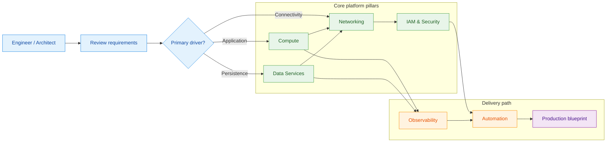
<!-- workflow-diagram:end -->


---

## 📋 Table of Contents

1. [Where Should I Run My Stuff? (Compute Decision Guide)](#-where-should-i-run-my-stuff)
2. [GCP Global Infrastructure](#-gcp-global-infrastructure)
3. [GCP Full Service Map](#-gcp-full-service-map)
4. [Compute Engine — VM Lifecycle](#️-compute-engine--vm-lifecycle)
5. [VPC Network Architecture](#-vpc-network-architecture)
6. [HTTP(S) Load Balancer Flow](#️-https-load-balancer-flow)
7. [Cloud Storage — Lifecycle & Access Patterns](#-cloud-storage--lifecycle--access-patterns)
8. [GKE Cluster Architecture](#-gke-cluster-architecture)
9. [Cloud Run Request Flow](#-cloud-run-request-flow)
10. [Cloud SQL — HA Architecture](#️-cloud-sql--ha-architecture)
11. [Cloud Spanner — Global Distribution](#-cloud-spanner--global-distribution)
12. [Cloud Functions — Event-Driven Architecture](#-cloud-functions--event-driven-architecture)
13. [IAM — Resource Hierarchy](#-iam--resource-hierarchy)
14. [Database Migration Service (DMS) Flow](#-database-migration-service-dms-flow)
15. [VPN — HA VPN Between Two Projects](#-vpn--ha-vpn-between-two-projects)
16. [Networking — Complete Request Path](#-networking--complete-request-path)
17. [Storage Decision Guide](#-storage-decision-guide)
18. [CI/CD Pipeline on GCP](#-cicd-pipeline-on-gcp)
19. [3-Tier Web Application — Reference Architecture](#️-3-tier-web-application--reference-architecture)
20. [On-Premises to GCP Migration](#-on-premises-to-gcp-migration)
21. [AWS / Azure to GCP Migration](#-aws--azure-to-gcp-migration)

---

## 🤔 Where Should I Run My Stuff?

*Based on the [official Google Cloud decision guide](https://cloud.google.com/blog/topics/developers-practitioners/where-should-i-run-my-stuff-choosing-google-cloud-compute-option)*

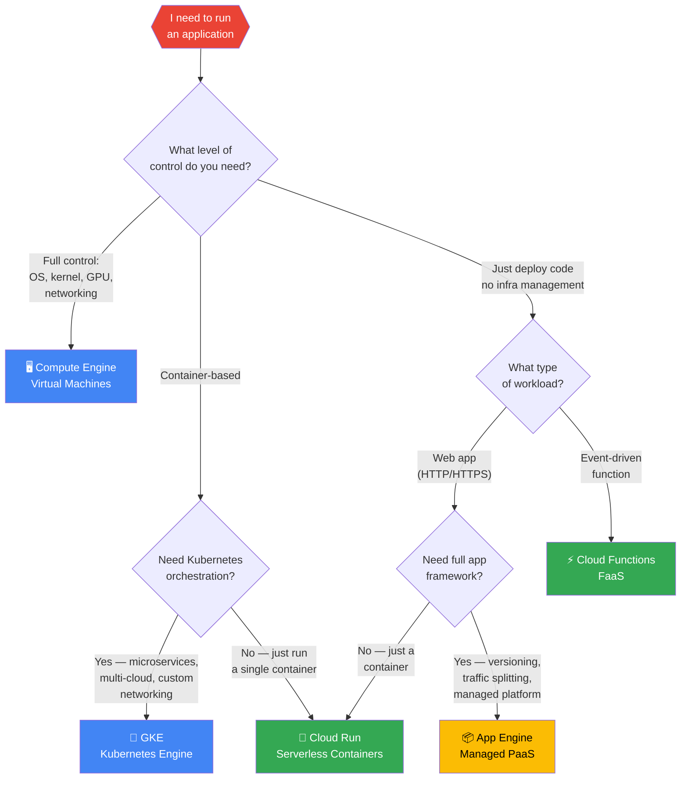

### Compute Options Comparison

| Feature | Compute Engine | GKE | Cloud Run | App Engine | Cloud Functions |
|---------|---------------|-----|-----------|------------|-----------------|
| **Abstraction** | IaaS (VMs) | CaaS (Containers) | Serverless Container | Serverless PaaS | Serverless FaaS |
| **Unit of deployment** | VM image | Container (Pod) | Container image | Application code | Single function |
| **Scaling** | Manual / MIG autoscaler | HPA + Cluster Autoscaler | Automatic (0 to N) | Automatic | Automatic (0 to N) |
| **Scale to zero** | ❌ | ❌ (nodes always run) | ✅ | ❌ (min 1 instance) | ✅ |
| **Startup time** | Minutes | Seconds (pod) | Seconds | Seconds | Milliseconds–seconds |
| **Max request timeout** | Unlimited | Unlimited | 60 min | 60 min (flex) | 60 min (Gen2) |
| **Custom OS/kernel** | ✅ | ✅ (node image) | ❌ | ❌ | ❌ |
| **GPU support** | ✅ | ✅ | ❌ | ❌ | ❌ |
| **Protocols** | Any | Any | HTTP/gRPC/WebSocket | HTTP | HTTP + events |
| **Billing** | Per VM (sustained discount) | Per node (committed use) | Per request + CPU time | Per instance hour | Per invocation + CPU time |
| **Portability** | Low (GCP VMs) | High (Kubernetes) | High (Knative) | Low | Medium (Functions Framework) |
| **Best for** | Legacy, licensed SW, HPC | Microservices, hybrid | APIs, websites, webhooks | Web apps, mobile backends | Event processing, glue code |

### Use Case Examples

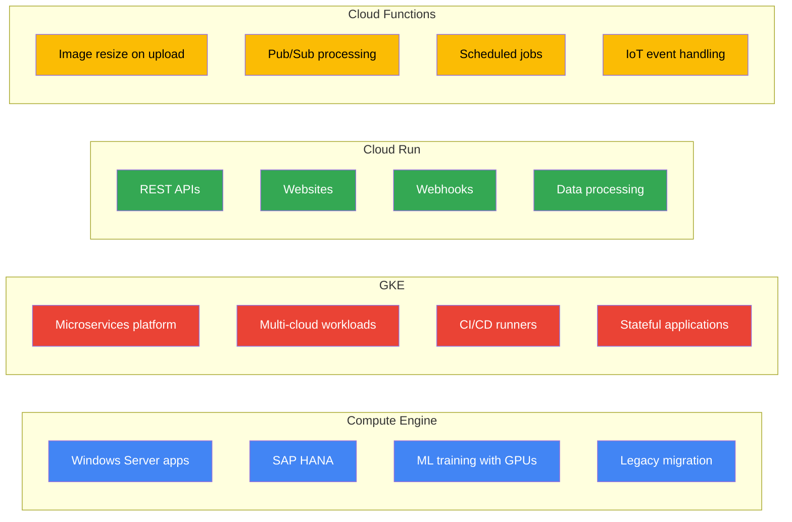

---

## 🌐 GCP Global Infrastructure

> Google Cloud spans **40+ regions**, **121+ zones**, and **187+ edge locations** across **200+ countries**, connected by one of the world's largest private networks.

### Global Network Overview

```mermaid
graph TB
    subgraph "🌍 Google Cloud Global Network — Premium Tier"
        direction TB

        subgraph "🔴 Edge Layer"
            PoP["🌐 187+ Edge Points of Presence"]
            CDN_E["📦 Cloud CDN<br/>Global Caching"]
            Armor_E["🛡️ Cloud Armor<br/>DDoS Protection"]
            DNS_E["📡 Cloud DNS<br/>100% SLA"]
            PoP --> CDN_E
            PoP --> Armor_E
            PoP --> DNS_E
        end

        subgraph "🔵 Backbone — Private Fiber + Submarine Cables"
            Cable1["🌊 Dunant Cable<br/>US ↔ Europe<br/>250 Tbps"]
            Cable2["🌊 Curie Cable<br/>US ↔ Chile<br/>72 Tbps"]
            Cable3["🌊 Equiano Cable<br/>Europe ↔ Africa<br/>144 Tbps"]
            Cable4["🌊 Grace Hopper<br/>US ↔ UK ↔ Spain<br/>340 Tbps"]
            Cable5["🌊 Firmina Cable<br/>US ↔ Argentina/Brazil<br/>24 fiber pairs"]
            Cable6["🌊 Blue & Raman<br/>Italy ↔ India ↔ APAC"]
            Cable7["🌊 Topaz Cable<br/>US ↔ Japan<br/>2025"]
        end

        subgraph "🟢 Americas — 12+ Regions"
            subgraph "🇺🇸 us-central1 — Iowa"
                A1["⚡ us-central1-a"]
                A2["⚡ us-central1-b"]
                A3["⚡ us-central1-c"]
                A4["⚡ us-central1-f"]
            end
            subgraph "🇺🇸 us-east1 — South Carolina"
                A5["⚡ us-east1-b"]
                A6["⚡ us-east1-c"]
                A7["⚡ us-east1-d"]
            end
            subgraph "🇺🇸 us-west1 — Oregon"
                A8["⚡ us-west1-a"]
                A9["⚡ us-west1-b"]
            end
            subgraph "🇺🇸 us-east4 — N. Virginia"
                A10["⚡ us-east4-a"]
                A11["⚡ us-east4-b"]
                A12["⚡ us-east4-c"]
            end
            subgraph "🇧🇷 southamerica-east1 — São Paulo"
                A13["⚡ southamerica-east1-a"]
                A14["⚡ southamerica-east1-b"]
                A15["⚡ southamerica-east1-c"]
            end
            subgraph "🇨🇦 northamerica-northeast1 — Montréal"
                A16["⚡ northamerica-northeast1-a"]
                A17["⚡ northamerica-northeast1-b"]
            end
        end

        subgraph "🟡 Europe — 10+ Regions"
            subgraph "🇧🇪 europe-west1 — Belgium"
                E1["⚡ europe-west1-b"]
                E2["⚡ europe-west1-c"]
                E3["⚡ europe-west1-d"]
            end
            subgraph "🇬🇧 europe-west2 — London"
                E4["⚡ europe-west2-a"]
                E5["⚡ europe-west2-b"]
                E6["⚡ europe-west2-c"]
            end
            subgraph "🇩🇪 europe-west3 — Frankfurt"
                E7["⚡ europe-west3-a"]
                E8["⚡ europe-west3-b"]
                E9["⚡ europe-west3-c"]
            end
            subgraph "🇫🇮 europe-north1 — Finland"
                E10["⚡ europe-north1-a"]
                E11["⚡ europe-north1-b"]
                E12["⚡ europe-north1-c"]
            end
            subgraph "🇵🇱 europe-central2 — Warsaw"
                E13["⚡ europe-central2-a"]
                E14["⚡ europe-central2-b"]
            end
        end

        subgraph "🟠 Asia-Pacific — 12+ Regions"
            subgraph "🇮🇳 asia-south1 — Mumbai"
                AP1["⚡ asia-south1-a"]
                AP2["⚡ asia-south1-b"]
                AP3["⚡ asia-south1-c"]
            end
            subgraph "🇯🇵 asia-northeast1 — Tokyo"
                AP4["⚡ asia-northeast1-a"]
                AP5["⚡ asia-northeast1-b"]
                AP6["⚡ asia-northeast1-c"]
            end
            subgraph "🇸🇬 asia-southeast1 — Singapore"
                AP7["⚡ asia-southeast1-a"]
                AP8["⚡ asia-southeast1-b"]
                AP9["⚡ asia-southeast1-c"]
            end
            subgraph "🇹🇼 asia-east1 — Taiwan"
                AP10["⚡ asia-east1-a"]
                AP11["⚡ asia-east1-b"]
                AP12["⚡ asia-east1-c"]
            end
            subgraph "🇦🇺 australia-southeast1 — Sydney"
                AP13["⚡ australia-southeast1-a"]
                AP14["⚡ australia-southeast1-b"]
                AP15["⚡ australia-southeast1-c"]
            end
        end

        subgraph "🟣 Middle East & Africa — 5+ Regions"
            subgraph "🇮🇱 me-west1 — Tel Aviv"
                MEA1["⚡ me-west1-a"]
                MEA2["⚡ me-west1-b"]
            end
            subgraph "🇶🇦 me-central1 — Doha"
                MEA3["⚡ me-central1-a"]
                MEA4["⚡ me-central1-b"]
            end
            subgraph "🇸🇦 me-central2 — Dammam"
                MEA5["⚡ me-central2-a"]
                MEA6["⚡ me-central2-b"]
            end
            subgraph "🇿🇦 africa-south1 — Johannesburg"
                MEA7["⚡ africa-south1-a"]
                MEA8["⚡ africa-south1-b"]
            end
        end
    end

    CDN_E -->|"Ingress"| A1
    CDN_E -->|"Ingress"| E1
    CDN_E -->|"Ingress"| AP1
    Cable1 ---|"US ↔ EU"| A5
    Cable1 ---|"US ↔ EU"| E1
    Cable2 ---|"US ↔ S.America"| A13
    Cable3 ---|"EU ↔ Africa"| MEA7
    Cable6 ---|"EU ↔ India ↔ APAC"| AP1

    style PoP fill:#EA4335,color:#fff
    style CDN_E fill:#EA4335,color:#fff
    style Armor_E fill:#EA4335,color:#fff
    style DNS_E fill:#EA4335,color:#fff
    style Cable1 fill:#9C27B0,color:#fff
    style Cable2 fill:#9C27B0,color:#fff
    style Cable3 fill:#9C27B0,color:#fff
    style Cable4 fill:#9C27B0,color:#fff
    style Cable5 fill:#9C27B0,color:#fff
    style Cable6 fill:#9C27B0,color:#fff
    style Cable7 fill:#9C27B0,color:#fff
```

### Multi-Region vs Dual-Region vs Single Region

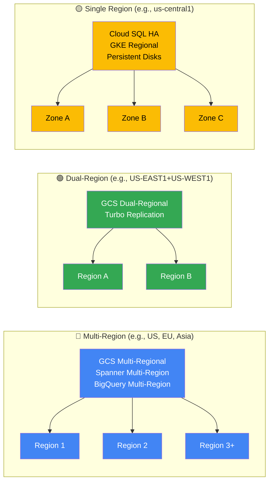

### Network Tiers — Premium vs Standard

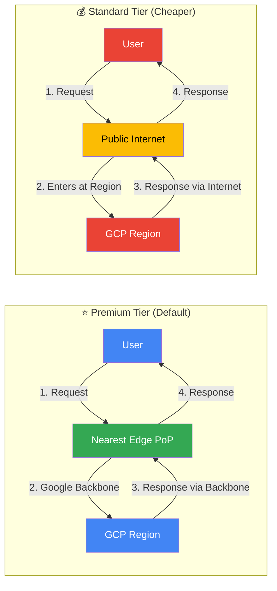

### Resource Scoping — Global vs Regional vs Zonal

```mermaid
graph TB
    subgraph "🔵 Global Resources — Accessible from any region"
        VPC["VPC Networks"]
        FW["Firewall Rules"]
        GLB["Global Load Balancers"]
        DNS["Cloud DNS"]
        IMG["Images"]
        SNAP["Snapshots"]
        GCS_G["Cloud Storage Buckets"]
        Routes["Routes"]
    end

    subgraph "🟢 Regional Resources — Span all zones in a region"
        SUB["Subnets"]
        SIP["Static External IPs"]
        RD["Regional Persistent Disks"]
        MIG["Managed Instance Groups"]
        NAT2["Cloud NAT"]
        CSQL["Cloud SQL Instances"]
        GKE_C["GKE Clusters"]
        MemS["Memorystore Instances"]
        CR["Cloud Run Services"]
    end

    subgraph "🟡 Zonal Resources — Single zone only"
        VM["VM Instances"]
        ZD["Zonal Persistent Disks"]
        GPU["GPUs"]
        TPU["TPUs"]
        NP["GKE Node Pools"]
        LS["Local SSDs"]
    end

    VPC --> SUB --> VM
    GLB --> MIG --> VM
    IMG --> VM
    SIP --> NAT2

    style VPC fill:#4285F4,color:#fff
    style FW fill:#4285F4,color:#fff
    style GLB fill:#4285F4,color:#fff
    style DNS fill:#4285F4,color:#fff
    style IMG fill:#4285F4,color:#fff
    style SNAP fill:#4285F4,color:#fff
    style GCS_G fill:#4285F4,color:#fff
    style Routes fill:#4285F4,color:#fff
    style SUB fill:#34A853,color:#fff
    style SIP fill:#34A853,color:#fff
    style RD fill:#34A853,color:#fff
    style MIG fill:#34A853,color:#fff
    style NAT2 fill:#34A853,color:#fff
    style CSQL fill:#34A853,color:#fff
    style GKE_C fill:#34A853,color:#fff
    style MemS fill:#34A853,color:#fff
    style CR fill:#34A853,color:#fff
    style VM fill:#FBBC04,color:#000
    style ZD fill:#FBBC04,color:#000
    style GPU fill:#FBBC04,color:#000
    style TPU fill:#FBBC04,color:#000
    style NP fill:#FBBC04,color:#000
    style LS fill:#FBBC04,color:#000
```

### Key Numbers

| Dimension | Count | Details |
|-----------|-------|---------|
| **Regions** | 40+ | Across 5 continents |
| **Zones** | 121+ | Typically 3 per region, some have 4 |
| **Edge PoPs** | 187+ | Global traffic ingress |
| **Countries** | 200+ | Served via Premium Tier |
| **Submarine Cables** | 20+ | Private + consortium (Dunant, Curie, Equiano, Grace Hopper, Firmina, Topaz) |
| **Network Capacity** | 1 Petabit/sec+ | Bisection bandwidth |
| **Network SLA** | 99.99% | Premium Tier global VPC |
| **Multi-Zone SLA** | 99.99% | Regional resources (GKE, Cloud SQL HA) |
| **Multi-Region SLA** | 99.999% | Spanner, Multi-region GCS |

### All Regions Reference

| Continent | Region Code | Location | Zones |
|-----------|-------------|----------|-------|
| **Americas** | us-central1 | Iowa, USA | a, b, c, f |
| | us-east1 | South Carolina, USA | b, c, d |
| | us-east4 | N. Virginia, USA | a, b, c |
| | us-east5 | Columbus, USA | a, b, c |
| | us-west1 | Oregon, USA | a, b |
| | us-west2 | Los Angeles, USA | a, b, c |
| | us-west3 | Salt Lake City, USA | a, b, c |
| | us-west4 | Las Vegas, USA | a, b, c |
| | us-south1 | Dallas, USA | a, b, c |
| | northamerica-northeast1 | Montréal, Canada | a, b, c |
| | northamerica-northeast2 | Toronto, Canada | a, b, c |
| | southamerica-east1 | São Paulo, Brazil | a, b, c |
| | southamerica-west1 | Santiago, Chile | a, b, c |
| **Europe** | europe-west1 | Belgium | b, c, d |
| | europe-west2 | London, UK | a, b, c |
| | europe-west3 | Frankfurt, Germany | a, b, c |
| | europe-west4 | Netherlands | a, b, c |
| | europe-west6 | Zürich, Switzerland | a, b, c |
| | europe-west8 | Milan, Italy | a, b, c |
| | europe-west9 | Paris, France | a, b, c |
| | europe-west10 | Berlin, Germany | a, b, c |
| | europe-west12 | Turin, Italy | a, b, c |
| | europe-north1 | Finland | a, b, c |
| | europe-central2 | Warsaw, Poland | a, b, c |
| | europe-southwest1 | Madrid, Spain | a, b, c |
| **Asia-Pacific** | asia-south1 | Mumbai, India | a, b, c |
| | asia-south2 | Delhi, India | a, b, c |
| | asia-east1 | Taiwan | a, b, c |
| | asia-east2 | Hong Kong | a, b, c |
| | asia-northeast1 | Tokyo, Japan | a, b, c |
| | asia-northeast2 | Osaka, Japan | a, b, c |
| | asia-northeast3 | Seoul, S. Korea | a, b, c |
| | asia-southeast1 | Singapore | a, b, c |
| | asia-southeast2 | Jakarta, Indonesia | a, b, c |
| | australia-southeast1 | Sydney, Australia | a, b, c |
| | australia-southeast2 | Melbourne, Australia | a, b, c |
| **Middle East** | me-west1 | Tel Aviv, Israel | a, b, c |
| | me-central1 | Doha, Qatar | a, b, c |
| | me-central2 | Dammam, Saudi Arabia | a, b, c |
| **Africa** | africa-south1 | Johannesburg, S. Africa | a, b, c |
| | africa-south2 | Cape Town, S. Africa | a, b, c |

---

## 🖥️ Compute Engine — VM Lifecycle

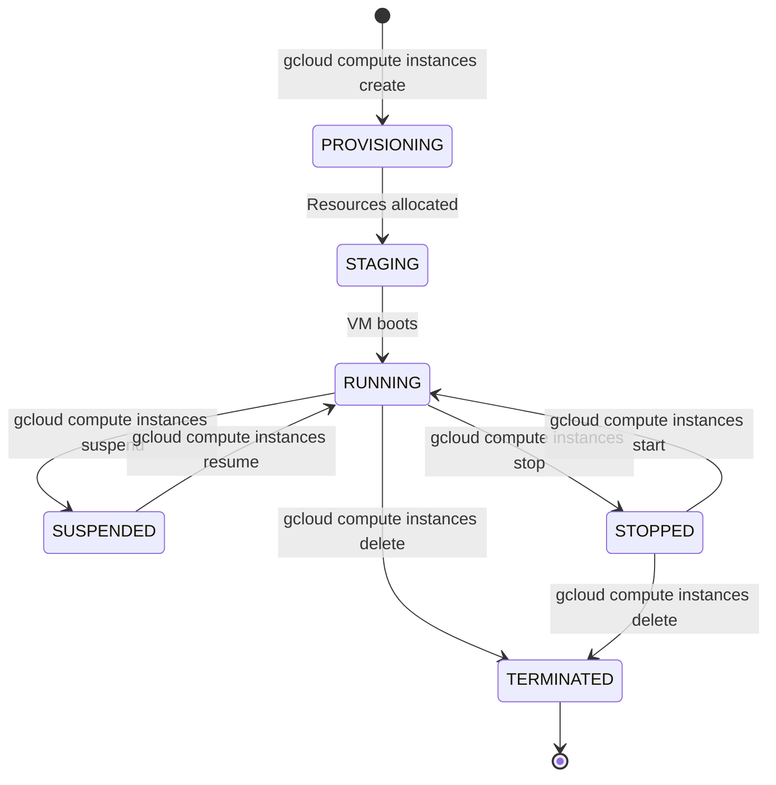

---

## 🌐 VPC Network Architecture

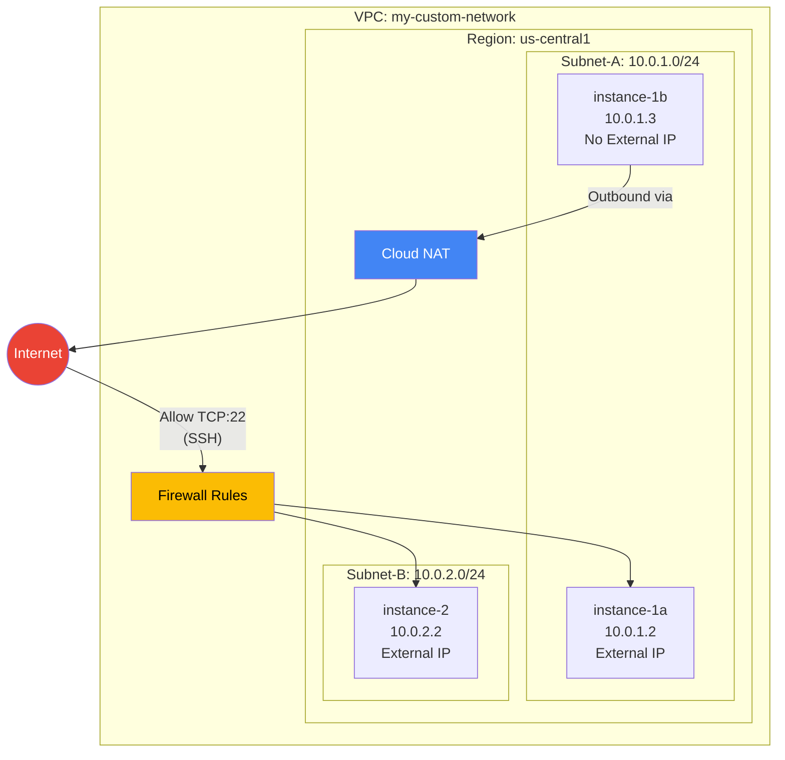

---

## ⚖️ HTTP(S) Load Balancer Flow

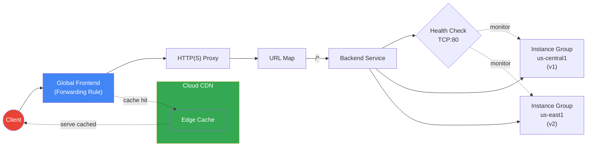

---

## 🪣 Cloud Storage — Storage Classes Flow

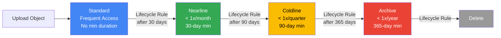

---

## 🐳 GKE Cluster Architecture

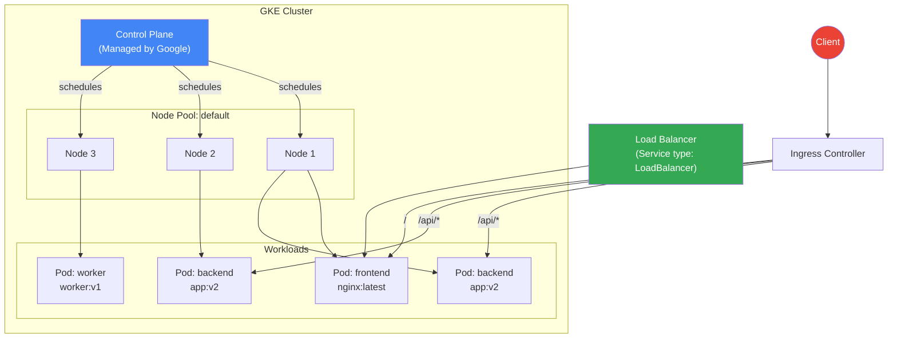

---

## 🚀 Cloud Run Request Flow

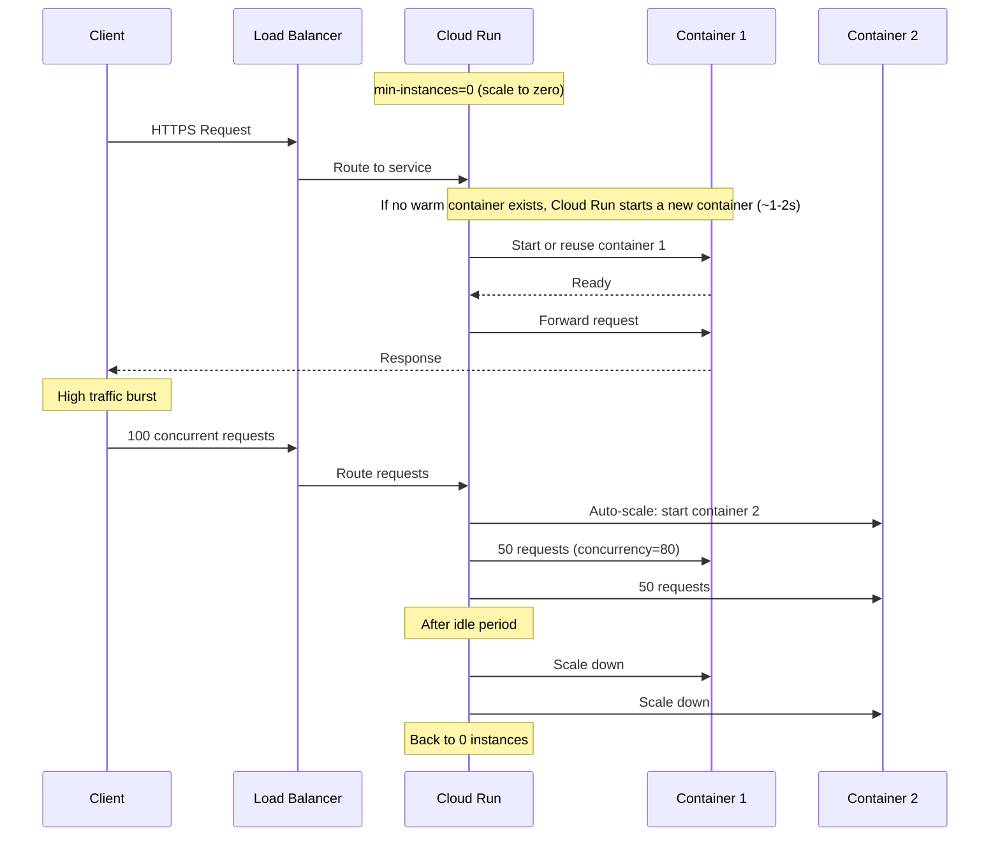

---

## 🗄️ Cloud SQL — HA Architecture

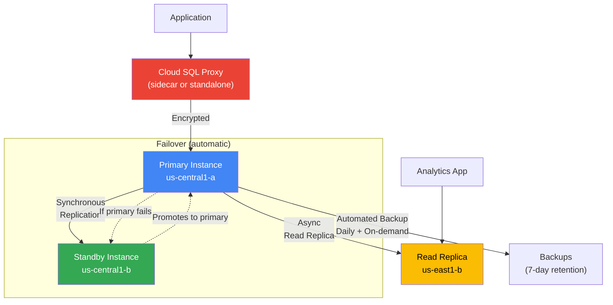

---

## 🔐 IAM — Resource Hierarchy

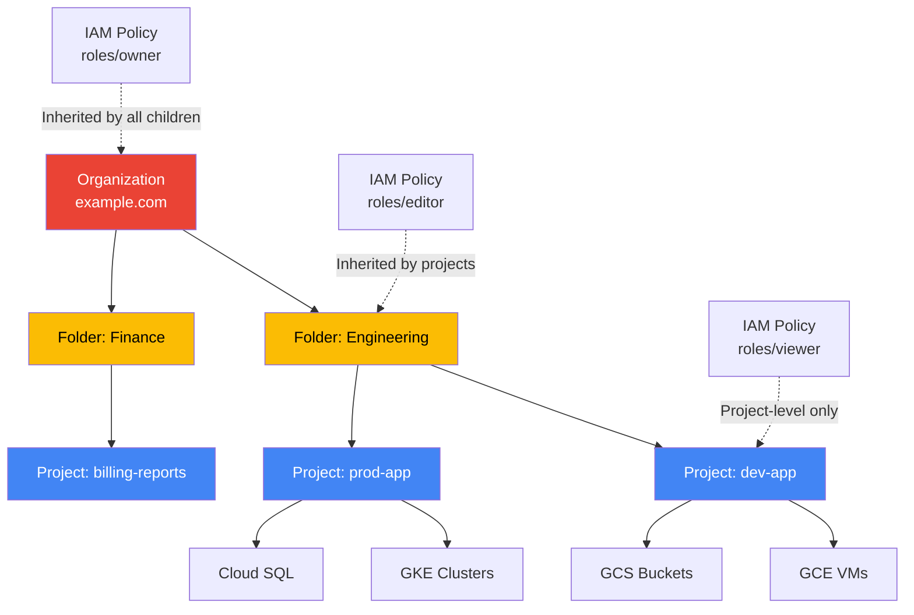

---

## 🔄 Database Migration Service (DMS) Flow

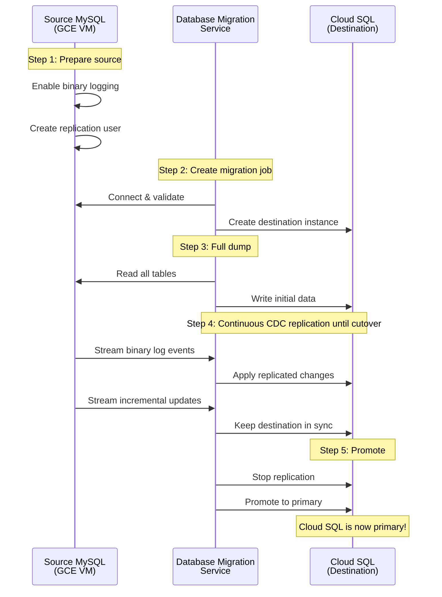

---

## 🌍 VPN — HA VPN Between Two Projects

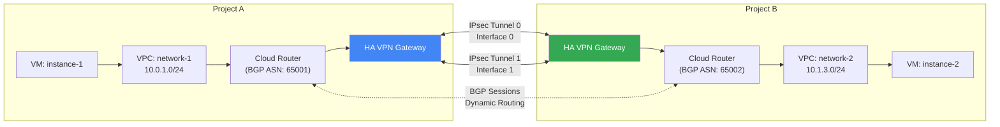

---

## 📋 GCP Services Decision Tree

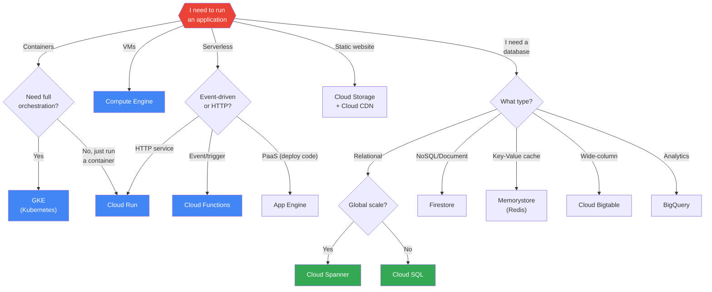

---

## 🗺️ GCP Full Service Map

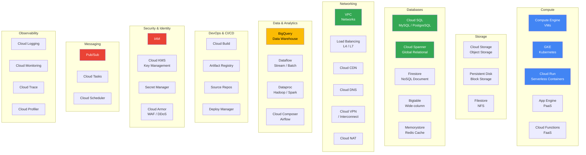

---

## 🌍 Cloud Spanner — Global Distribution

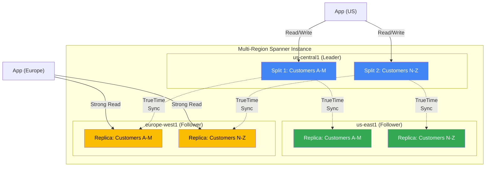

---

## ⚡ Cloud Functions — Event-Driven Architecture

```mermaid
graph TB
    subgraph "Event Sources"
        HTTP_E["HTTP Request"]
        GCS_E["GCS: object.finalized"]
        PS_E["Pub/Sub: message"]
        FS_E["Firestore: document.write"]
        Sched["Cloud Scheduler (cron)"]
        Auth["Firebase Auth: user.create"]
    end
    
    subgraph "Eventarc (Event Router)"
        EA["Eventarc"]
    end
    
    subgraph "Cloud Functions (Gen2)"
        F1["processOrder()"]
        F2["resizeImage()"]
        F3["analyzeData()"]
        F4["sendWelcomeEmail()"]
        F5["generateReport()"]
    end
    
    subgraph "Output"
        DB_O["Cloud SQL"]
        Bucket_O["GCS Bucket"]
        Queue_O["Pub/Sub Topic"]
        Email_O["Email Service"]
    end
    
    HTTP_E --> F1
    GCS_E --> EA --> F2
    PS_E --> EA --> F3
    FS_E --> EA --> F4
    Sched -->|"HTTP trigger"| F5
    Auth --> EA --> F4
    
    F1 --> DB_O
    F2 --> Bucket_O
    F3 --> Queue_O
    F4 --> Email_O
    F5 --> Bucket_O

    style EA fill:#4285F4,color:#fff
    style HTTP_E fill:#34A853,color:#fff
    style GCS_E fill:#34A853,color:#fff
    style PS_E fill:#34A853,color:#fff
```

---

## 🌐 Networking — Complete Request Path

```mermaid
graph TB
    User((User)) --> DNS_R["Cloud DNS<br/>Resolve domain"]
    DNS_R --> Armor_R["Cloud Armor<br/>WAF / DDoS protection"]
    Armor_R --> CDN_R{"Cloud CDN<br/>Cache hit?"}
    
    CDN_R -->|"HIT"| User
    CDN_R -->|"MISS"| GCLB_R["Global Load Balancer<br/>HTTP(S) / TCP / SSL"]
    
    GCLB_R --> HealthCheck{"Health Check"}
    
    HealthCheck -->|"Healthy"| Backend1["Backend Service<br/>(Instance Group / NEG)"]
    HealthCheck -->|"Unhealthy"| Backend2["Failover Backend<br/>(different region)"]
    
    subgraph "VPC Network"
        Backend1 --> FW["Firewall Rules"]
        Backend2 --> FW
        FW --> VM_R["VM / Pod / Container"]
        VM_R --> SQL_R["Cloud SQL<br/>(Private IP)"]
        VM_R --> GCS_R["Cloud Storage"]
        VM_R --> Redis_R["Memorystore"]
    end
    
    VM_R -->|"Logs"| Logging_R["Cloud Logging"]
    VM_R -->|"Metrics"| Monitoring_R["Cloud Monitoring"]

    style User fill:#EA4335,color:#fff
    style CDN_R fill:#FBBC04,color:#000
    style GCLB_R fill:#4285F4,color:#fff
    style Armor_R fill:#EA4335,color:#fff
```

---

## 💾 Storage Decision Guide

```mermaid
graph TD
    Q_S{{"I need to<br/>store data"}}
    
    Q_S -->|"Files / Objects<br/>(images, videos, backups)"| GCS_D["☁️ Cloud Storage<br/>Object storage, lifecycle mgmt"]
    Q_S -->|"Block storage<br/>(VM disk)"| PD_D["💿 Persistent Disk<br/>SSD / Standard / Extreme"]
    Q_S -->|"Shared filesystem<br/>(NFS)"| FS_D["📁 Filestore<br/>Managed NFS"]
    Q_S -->|"Relational data"| Q_RD{"Global scale<br/>needed?"}
    Q_S -->|"NoSQL data"| Q_NS{"What pattern?"}
    Q_S -->|"Analytics<br/>(petabyte scale)"| BQ_D["📊 BigQuery<br/>Serverless data warehouse"]
    Q_S -->|"In-memory cache"| Redis_D["⚡ Memorystore<br/>Redis / Memcached"]
    
    Q_RD -->|"Yes"| Spanner_D["🌍 Cloud Spanner<br/>99.999% SLA, global"]
    Q_RD -->|"No"| SQL_D["🗄️ Cloud SQL<br/>MySQL / PostgreSQL / SQL Server"]
    
    Q_NS -->|"Document store"| Firestore_D["📄 Firestore<br/>Document DB"]
    Q_NS -->|"Wide-column<br/>(IoT, time-series)"| BT_D["📈 Bigtable<br/>Low-latency, high-throughput"]
    Q_NS -->|"Key-value"| Redis_D

    style Q_S fill:#EA4335,color:#fff
    style GCS_D fill:#4285F4,color:#fff
    style SQL_D fill:#34A853,color:#fff
    style Spanner_D fill:#34A853,color:#fff
    style BQ_D fill:#FBBC04,color:#000
```

### Storage & Database Comparison

| Service | Type | Best For | Capacity | Pricing Model |
|---------|------|----------|----------|---------------|
| Cloud Storage | Object | Files, media, backups | Unlimited | Per GB stored + operations |
| Persistent Disk | Block | VM disks | 64 TB per disk | Per GB provisioned |
| Filestore | File (NFS) | Shared filesystems | Up to 100 TB | Per GB provisioned |
| Cloud SQL | Relational | Web apps, OLTP | 64 TB | Per instance hour + storage |
| Cloud Spanner | Relational | Global, mission-critical | Unlimited | Per node + storage |
| Firestore | Document | Mobile/web apps | Unlimited | Per read/write/delete + storage |
| Bigtable | Wide-column | IoT, analytics, time-series | Unlimited | Per node + storage |
| BigQuery | Analytics | Data warehouse, BI | Unlimited | Per query (TB scanned) + storage |
| Memorystore | In-memory | Caching, sessions | Up to 300 GB | Per GB per hour |

---

## 🔄 CI/CD Pipeline on GCP

```mermaid
graph LR
    Dev["Developer"] -->|"git push"| Repo["Cloud Source Repos<br/>/ GitHub"]
    Repo -->|"Trigger"| CB["Cloud Build<br/>(Build + Test)"]
    CB -->|"Build image"| AR_CD["Artifact Registry<br/>Container images"]
    
    AR_CD -->|"Deploy to staging"| CR_CD["Cloud Run<br/>(Staging)"]
    CR_CD -->|"Approval gate"| Prod["Cloud Run<br/>(Production)"]
    
    CB -->|"Alt: deploy to"| GKE_CD["GKE Cluster"]
    CB -->|"Alt: deploy to"| GAE_CD["App Engine"]
    
    subgraph "Observability"
        Prod --> Log["Cloud Logging"]
        Prod --> Mon["Cloud Monitoring"]
        Mon -->|"Alert"| Alert["PagerDuty / Slack"]
    end

    style Dev fill:#EA4335,color:#fff
    style CB fill:#4285F4,color:#fff
    style AR_CD fill:#34A853,color:#fff
    style Prod fill:#34A853,color:#fff
```

### Cloud Build Example (`cloudbuild.yaml`)

```yaml
steps:
  # Build the container image
  - name: 'gcr.io/cloud-builders/docker'
    args: ['build', '-t', 'us-central1-docker.pkg.dev/$PROJECT_ID/my-repo/my-app:$SHORT_SHA', '.']
  
  # Push to Artifact Registry
  - name: 'gcr.io/cloud-builders/docker'
    args: ['push', 'us-central1-docker.pkg.dev/$PROJECT_ID/my-repo/my-app:$SHORT_SHA']
  
  # Deploy to Cloud Run
  - name: 'gcr.io/google.com/cloudsdktool/cloud-sdk'
    args:
      - 'run'
      - 'deploy'
      - 'my-service'
      - '--image=us-central1-docker.pkg.dev/$PROJECT_ID/my-repo/my-app:$SHORT_SHA'
      - '--region=us-central1'
    entrypoint: gcloud

images:
  - 'us-central1-docker.pkg.dev/$PROJECT_ID/my-repo/my-app:$SHORT_SHA'
```

---

## 🏗️ Typical 3-Tier Web Application on GCP

```mermaid
graph TB
    User2((Users)) --> CDN2["Cloud CDN"]
    CDN2 --> LB2["Global HTTP(S)<br/>Load Balancer"]
    
    subgraph "Frontend Tier"
        LB2 --> CR2_F["Cloud Run<br/>React / Next.js"]
    end
    
    subgraph "Backend Tier"
        CR2_F -->|"API calls"| GKE2["GKE / Cloud Run<br/>API Servers"]
        GKE2 --> PS2["Pub/Sub<br/>(async tasks)"]
        PS2 --> CF2["Cloud Functions<br/>(workers)"]
    end
    
    subgraph "Data Tier"
        GKE2 --> SQL2["Cloud SQL<br/>(PostgreSQL)"]
        GKE2 --> Redis2["Memorystore<br/>(session cache)"]
        CF2 --> GCS2["Cloud Storage<br/>(file uploads)"]
        GKE2 --> GCS2
    end
    
    subgraph "Observability"
        GKE2 -.-> Log2["Logging"]
        GKE2 -.-> Mon2["Monitoring"]
        GKE2 -.-> Trace2["Tracing"]
    end

    style User2 fill:#EA4335,color:#fff
    style LB2 fill:#4285F4,color:#fff
    style SQL2 fill:#34A853,color:#fff
    style CDN2 fill:#FBBC04,color:#000
```

---

## 🏢 On-Premises to GCP Migration

### Migration Journey Overview

```mermaid
graph TB
    subgraph "Phase 1 — Assess"
        A1["📋 Inventory Discovery<br/>Servers, apps, databases"]
        A2["📊 TCO Analysis<br/>Current vs GCP costs"]
        A3["🔍 Dependency Mapping<br/>App-to-app, app-to-DB"]
        A4["📐 Fit Assessment<br/>Migrate vs Modernize vs Rebuild"]
        A1 --> A2 --> A3 --> A4
    end

    subgraph "Phase 2 — Plan"
        P1["🗺️ Migration Waves<br/>Group by dependency"]
        P2["🌐 Network Design<br/>VPN / Interconnect"]
        P3["🔐 IAM & Security<br/>Roles, policies, compliance"]
        P4["📅 Timeline & Rollback<br/>Migration windows"]
        P1 --> P2 --> P3 --> P4
    end

    subgraph "Phase 3 — Deploy"
        D1["🔗 Connectivity Setup<br/>Cloud VPN / Interconnect"]
        D2["📦 Data Transfer<br/>gsutil, Transfer Appliance"]
        D3["🖥️ VM Migration<br/>Migrate to VMs"]
        D4["🗄️ Database Migration<br/>DMS, import/export"]
        D1 --> D2 --> D3 --> D4
    end

    subgraph "Phase 4 — Optimize"
        O1["📉 Right-sizing<br/>Recommender APIs"]
        O2["💰 Cost Optimization<br/>CUDs, Preemptible VMs"]
        O3["📈 Monitoring<br/>Cloud Monitoring + Logging"]
        O4["🔄 Modernize<br/>Containers, serverless"]
        O1 --> O2 --> O3 --> O4
    end

    A4 --> P1
    P4 --> D1
    D4 --> O1

    style A1 fill:#EA4335,color:#fff
    style A2 fill:#EA4335,color:#fff
    style A3 fill:#EA4335,color:#fff
    style A4 fill:#EA4335,color:#fff
    style P1 fill:#FBBC04,color:#000
    style P2 fill:#FBBC04,color:#000
    style P3 fill:#FBBC04,color:#000
    style P4 fill:#FBBC04,color:#000
    style D1 fill:#4285F4,color:#fff
    style D2 fill:#4285F4,color:#fff
    style D3 fill:#4285F4,color:#fff
    style D4 fill:#4285F4,color:#fff
    style O1 fill:#34A853,color:#fff
    style O2 fill:#34A853,color:#fff
    style O3 fill:#34A853,color:#fff
    style O4 fill:#34A853,color:#fff
```

### Network Connectivity — On-Prem to GCP

```mermaid
graph LR
    subgraph "🏢 On-Premises Data Center"
        Router["🔧 On-Prem Router"]
        FW_OP["🛡️ Firewall"]
        Apps["📦 Applications"]
        DB_OP["🗄️ Databases"]
        Apps --> FW_OP --> Router
        DB_OP --> FW_OP
    end

    subgraph "🔗 Connectivity Options"
        VPN["🔒 Cloud VPN<br/>Encrypted tunnel<br/>Up to 3 Gbps/tunnel"]
        DI["⚡ Dedicated Interconnect<br/>Physical connection<br/>10/100 Gbps per link"]
        PI["🔌 Partner Interconnect<br/>Via service provider<br/>50 Mbps – 50 Gbps"]
    end

    subgraph "☁️ Google Cloud VPC"
        CR_GCP["🌐 Cloud Router<br/>BGP dynamic routing"]
        SUB_GCP["📡 Subnet: 10.0.0.0/16"]
        VM_GCP["🖥️ Compute Engine VMs"]
        GKE_GCP["☸️ GKE Clusters"]
        SQL_GCP["🗄️ Cloud SQL"]
        CR_GCP --> SUB_GCP
        SUB_GCP --> VM_GCP
        SUB_GCP --> GKE_GCP
        SUB_GCP --> SQL_GCP
    end

    Router -->|"Option 1"| VPN
    Router -->|"Option 2"| DI
    Router -->|"Option 3"| PI
    VPN --> CR_GCP
    DI --> CR_GCP
    PI --> CR_GCP

    style VPN fill:#4285F4,color:#fff
    style DI fill:#34A853,color:#fff
    style PI fill:#FBBC04,color:#000
    style CR_GCP fill:#4285F4,color:#fff
    style Router fill:#EA4335,color:#fff
```

### VM Migration — Migrate to Virtual Machines

```mermaid
sequenceDiagram
    participant OnPrem as 🏢 On-Prem VMs
    participant M2VM as 🔄 Migrate to VMs
    participant GCE as ☁️ Compute Engine
    participant Mon as 📊 Cloud Monitoring

    OnPrem->>M2VM: 1. Install Migrate connector
    M2VM->>M2VM: 2. Discover & inventory VMs
    M2VM->>M2VM: 3. Create migration plan
    M2VM->>GCE: 4. Start replication (continuous)
    Note over M2VM,GCE: Data replicates in background<br/>No downtime yet
    M2VM->>M2VM: 5. Run test clone
    GCE->>Mon: 6. Validate test clone
    M2VM->>GCE: 7. Cutover (brief downtime)
    Note over OnPrem,GCE: DNS update + final sync
    GCE->>Mon: 8. Monitor in production
    OnPrem-->>OnPrem: 9. Decommission after validation
```

### Database Migration Path

```mermaid
graph TB
    subgraph "🏢 Source Databases"
        MySQL_S["MySQL / MariaDB"]
        PG_S["PostgreSQL"]
        Oracle_S["Oracle"]
        MSSQL_S["SQL Server"]
        Mongo_S["MongoDB"]
    end

    subgraph "🔄 Migration Tools"
        DMS["📦 Database Migration Service<br/>Continuous replication"]
        DataFlow["🔁 Dataflow<br/>ETL pipelines"]
        Import["📥 Native Import/Export<br/>mysqldump, pg_dump"]
        Striim["🔄 Striim / Debezium<br/>CDC streaming"]
    end

    subgraph "☁️ GCP Target Databases"
        CSQL_M["Cloud SQL for MySQL"]
        CSQL_P["Cloud SQL for PostgreSQL"]
        CSQL_S["Cloud SQL for SQL Server"]
        Spanner["Cloud Spanner"]
        AlloyDB["AlloyDB for PostgreSQL"]
        Firestore["Firestore"]
        BigTable["Cloud Bigtable"]
    end

    MySQL_S -->|"DMS"| DMS --> CSQL_M
    PG_S -->|"DMS"| DMS --> CSQL_P
    PG_S -->|"DMS"| DMS --> AlloyDB
    MSSQL_S -->|"DMS"| DMS --> CSQL_S
    Oracle_S -->|"Striim CDC"| Striim --> Spanner
    Oracle_S -->|"Dataflow ETL"| DataFlow --> CSQL_P
    Mongo_S -->|"Export + Import"| Import --> Firestore

    style DMS fill:#4285F4,color:#fff
    style DataFlow fill:#34A853,color:#fff
    style Import fill:#FBBC04,color:#000
    style Striim fill:#9C27B0,color:#fff
    style Spanner fill:#4285F4,color:#fff
    style AlloyDB fill:#4285F4,color:#fff
```

### Data Transfer Options

```mermaid
graph TB
    subgraph "📊 Choose Based on Data Size"
        Q1{"Data size?"}
        Q1 -->|"< 1 TB"| G1["gsutil / gcloud storage cp<br/>Over internet"]
        Q1 -->|"1–10 TB"| G2["Transfer Service<br/>Scheduled, resumable"]
        Q1 -->|"10–100 TB"| G3["Transfer Appliance<br/>Rack-mountable device"]
        Q1 -->|"100+ TB"| G4["Transfer Appliance (multiple)<br/>+ Dedicated Interconnect"]
    end

    style Q1 fill:#EA4335,color:#fff
    style G1 fill:#34A853,color:#fff
    style G2 fill:#4285F4,color:#fff
    style G3 fill:#FBBC04,color:#000
    style G4 fill:#9C27B0,color:#fff
```

### Migration Steps — Quick Reference

#### Step 1: Set Up GCP Foundation

```bash
# Create project & enable billing
gcloud projects create my-migration-project --name="Migration Project"
gcloud billing projects link my-migration-project --billing-account=BILLING_ACCOUNT_ID

# Enable required APIs
gcloud services enable compute.googleapis.com \
  vmmigration.googleapis.com \
  datamigration.googleapis.com \
  storage.googleapis.com \
  cloudresourcemanager.googleapis.com

# Create VPC
gcloud compute networks create prod-vpc --subnet-mode=custom
gcloud compute networks subnets create prod-subnet \
  --network=prod-vpc --region=us-central1 --range=10.0.0.0/16
```

#### Step 2: Establish Connectivity

```bash
# Option A: Cloud VPN (quick setup)
gcloud compute vpn-gateways create my-vpn-gw \
  --network=prod-vpc --region=us-central1

gcloud compute vpn-tunnels create tunnel-to-onprem \
  --vpn-gateway=my-vpn-gw --peer-address=ON_PREM_PUBLIC_IP \
  --shared-secret=SHARED_SECRET --region=us-central1 \
  --ike-version=2

# Option B: Dedicated Interconnect (high bandwidth)
gcloud compute interconnects create my-interconnect \
  --interconnect-type=DEDICATED --link-type=LINK_TYPE_ETHERNET_10G_LR \
  --location=COLOCATION_FACILITY --requested-link-count=1
```

#### Step 3: Migrate VMs

```bash
# Create Migrate to VMs source
gcloud migration vms sources create my-source \
  --location=us-central1 --type=vmware \
  --vmware-source-host=VCENTER_HOST \
  --vmware-source-username=admin

# Create & start migration
gcloud migration vms migrating-vms create my-vm \
  --source=my-source --location=us-central1 \
  --source-vm-id=vm-001
gcloud migration vms migrating-vms start-migration my-vm \
  --source=my-source --location=us-central1
```

#### Step 4: Migrate Databases

```bash
# Create Cloud SQL target
gcloud sql instances create prod-db \
  --database-version=MYSQL_8_0 --tier=db-n1-standard-4 \
  --region=us-central1 --availability-type=REGIONAL

# Create DMS migration job
gcloud database-migration migration-jobs create mysql-migration \
  --region=us-central1 --type=CONTINUOUS \
  --source=onprem-mysql-profile \
  --destination=cloudsql-mysql-profile
gcloud database-migration migration-jobs start mysql-migration \
  --region=us-central1
```

#### Step 5: Transfer Data to GCS

```bash
# Small files — gsutil
gsutil -m cp -r /data/files gs://my-migration-bucket/

# Large datasets — Transfer Service
gcloud transfer jobs create \
  s3://source-bucket gs://destination-bucket \
  --name=my-transfer-job

# Verify
gsutil ls -la gs://my-migration-bucket/
```

#### Step 6: Validate & Cutover

```bash
# Set up monitoring
gcloud monitoring dashboards create --config-from-file=dashboard.json

# Update DNS to point to GCP
gcloud dns record-sets update app.example.com \
  --zone=my-zone --type=A --ttl=300 \
  --rrdatas=GCP_EXTERNAL_IP

# Verify connectivity
curl -I https://app.example.com
```

---

## ☁️ AWS / Azure to GCP Migration

### Multi-Cloud Migration Overview

```mermaid
graph TB
    subgraph "📤 Source Clouds"
        subgraph "AWS"
            EC2["EC2 Instances"]
            RDS["RDS Databases"]
            S3["S3 Buckets"]
            EKS["EKS Clusters"]
            Lambda["Lambda Functions"]
        end
        subgraph "Azure"
            AVM["Azure VMs"]
            ASQL["Azure SQL / CosmosDB"]
            Blob["Blob Storage"]
            AKS["AKS Clusters"]
            AFN["Azure Functions"]
        end
    end

    subgraph "🔄 Migration Path"
        M2VM2["Migrate to VMs"]
        DMS2["Database Migration Service"]
        STS["Storage Transfer Service"]
        Anthos["Anthos (multi-cloud)"]
    end

    subgraph "📥 GCP Targets"
        GCE2["Compute Engine"]
        CSQL2["Cloud SQL / AlloyDB / Spanner"]
        GCS2["Cloud Storage"]
        GKE2["GKE"]
        CR2["Cloud Run / Functions"]
    end

    EC2 --> M2VM2 --> GCE2
    AVM --> M2VM2
    RDS --> DMS2 --> CSQL2
    ASQL --> DMS2
    S3 --> STS --> GCS2
    Blob --> STS
    EKS --> Anthos --> GKE2
    AKS --> Anthos
    Lambda -.->|"Rewrite"| CR2
    AFN -.->|"Rewrite"| CR2

    style M2VM2 fill:#4285F4,color:#fff
    style DMS2 fill:#34A853,color:#fff
    style STS fill:#FBBC04,color:#000
    style Anthos fill:#9C27B0,color:#fff
```

### Service Mapping — AWS to GCP

| Category | AWS Service | GCP Equivalent | Migration Tool |
|----------|-------------|----------------|----------------|
| **Compute** | EC2 | Compute Engine | Migrate to VMs |
| | ECS / Fargate | Cloud Run | Container rebuild |
| | EKS | GKE | Anthos / kubectl apply |
| | Lambda | Cloud Functions | Code rewrite |
| | Elastic Beanstalk | App Engine | gcloud app deploy |
| **Storage** | S3 | Cloud Storage | Storage Transfer Service |
| | EBS | Persistent Disk | Disk export/import |
| | EFS | Filestore | Data copy |
| | Glacier | Archive Storage | Storage Transfer Service |
| **Database** | RDS MySQL/PostgreSQL | Cloud SQL | Database Migration Service |
| | RDS Oracle | Cloud SQL / Bare Metal | Striim / DMS |
| | Aurora | AlloyDB | DMS |
| | DynamoDB | Firestore / Bigtable | Dataflow |
| | Redshift | BigQuery | BigQuery Data Transfer |
| | ElastiCache | Memorystore | Export/Import |
| **Networking** | VPC | VPC | Terraform re-create |
| | Route 53 | Cloud DNS | Zone export/import |
| | CloudFront | Cloud CDN | Config rewrite |
| | ALB/NLB | Cloud Load Balancing | Terraform |
| | Direct Connect | Dedicated Interconnect | Physical setup |
| **Security** | IAM | Cloud IAM | Policy rewrite |
| | KMS | Cloud KMS | Key re-create |
| | Secrets Manager | Secret Manager | API migration |
| | WAF | Cloud Armor | Rule rewrite |
| **Monitoring** | CloudWatch | Cloud Monitoring | Dashboard rebuild |
| | X-Ray | Cloud Trace | SDK swap |
| | CloudTrail | Audit Logs | Automatic |
| **CI/CD** | CodePipeline | Cloud Build | cloudbuild.yaml |
| | CodeDeploy | Cloud Deploy | Config rewrite |
| **Messaging** | SQS | Pub/Sub | Publish/Subscribe rewrite |
| | SNS | Pub/Sub | Topic migration |
| | EventBridge | Eventarc | Trigger rewrite |

### Service Mapping — Azure to GCP

| Category | Azure Service | GCP Equivalent | Migration Tool |
|----------|---------------|----------------|----------------|
| **Compute** | Virtual Machines | Compute Engine | Migrate to VMs |
| | Container Instances | Cloud Run | Container rebuild |
| | AKS | GKE | Anthos / kubectl apply |
| | Azure Functions | Cloud Functions | Code rewrite |
| | App Service | App Engine / Cloud Run | gcloud deploy |
| **Storage** | Blob Storage | Cloud Storage | Storage Transfer Service |
| | Managed Disks | Persistent Disk | Disk export/import |
| | Azure Files | Filestore | Data copy |
| **Database** | Azure SQL | Cloud SQL | DMS |
| | CosmosDB | Firestore / Spanner | Dataflow |
| | Azure Database for MySQL | Cloud SQL for MySQL | DMS |
| | Azure Database for PostgreSQL | Cloud SQL for PostgreSQL | DMS |
| | Azure Cache for Redis | Memorystore | Export/Import |
| **Networking** | VNet | VPC | Terraform |
| | Azure DNS | Cloud DNS | Zone export/import |
| | Azure CDN | Cloud CDN | Config rewrite |
| | Azure Load Balancer | Cloud Load Balancing | Terraform |
| | ExpressRoute | Dedicated Interconnect | Physical setup |
| **Security** | Azure AD | Cloud Identity / IAM | Federation |
| | Key Vault | Secret Manager / KMS | API migration |
| | Azure Firewall | Cloud Armor / Firewall Rules | Policy rewrite |
| **Monitoring** | Azure Monitor | Cloud Monitoring | Dashboard rebuild |
| | Application Insights | Cloud Trace + Logging | SDK swap |
| **CI/CD** | Azure DevOps | Cloud Build + Cloud Deploy | Pipeline rewrite |
| | Azure Pipelines | Cloud Build | cloudbuild.yaml |

### AWS to GCP — Step-by-Step

```mermaid
sequenceDiagram
    participant AWS as ☁️ AWS Account
    participant Tools as 🔧 Migration Tools
    participant GCP as ☁️ GCP Project

    Note over AWS,GCP: Phase 1 — Assessment
    AWS->>Tools: Export EC2 inventory (AWS CLI)
    AWS->>Tools: Export RDS metadata
    AWS->>Tools: Map security groups → firewall rules
    Tools->>Tools: Generate migration plan

    Note over AWS,GCP: Phase 2 — Foundation
    GCP->>GCP: Create VPC, subnets, firewall rules
    GCP->>GCP: Set up Cloud IAM policies
    GCP->>GCP: Enable APIs & create service accounts

    Note over AWS,GCP: Phase 3 — Data Migration
    AWS->>Tools: S3 → Storage Transfer Service
    Tools->>GCP: Data lands in Cloud Storage
    AWS->>Tools: RDS → Database Migration Service
    Tools->>GCP: Continuous replication to Cloud SQL

    Note over AWS,GCP: Phase 4 — Compute Migration
    AWS->>Tools: EC2 AMI export → disk images
    Tools->>GCP: Import as Compute Engine images
    GCP->>GCP: Create VMs from imported images
    GCP->>GCP: Validate application functionality

    Note over AWS,GCP: Phase 5 — Cutover
    GCP->>GCP: Final data sync
    AWS-->>GCP: DNS cutover
    GCP->>GCP: Monitor & validate
    AWS-->>AWS: Decommission after validation period
```

### Migration Commands — AWS to GCP

#### Transfer S3 Data to GCS

```bash
# One-time transfer
gcloud transfer jobs create \
  s3://my-aws-bucket gs://my-gcp-bucket \
  --source-creds-file=aws-creds.json \
  --name=s3-to-gcs-migration

# Verify transfer
gsutil ls -la gs://my-gcp-bucket/

# Set up scheduled sync (daily)
gcloud transfer jobs create \
  s3://my-aws-bucket gs://my-gcp-bucket \
  --name=daily-s3-sync \
  --schedule-starts=2024-01-01T00:00:00Z \
  --schedule-repeats-every=P1D
```

#### Export EC2 → Import to GCE

```bash
# On AWS: Export EC2 as OVA
aws ec2 create-instance-export-task \
  --instance-id i-1234567890abcdef0 \
  --target-environment vmware \
  --export-to-s3-task file://export-config.json

# Transfer OVA to GCS
gsutil cp s3://export-bucket/my-vm.ova gs://import-bucket/

# Import to Compute Engine
gcloud compute images import my-imported-image \
  --source-file=gs://import-bucket/my-vm.ova \
  --os=ubuntu-2004

# Create VM from imported image
gcloud compute instances create migrated-vm \
  --image=my-imported-image \
  --machine-type=n2-standard-4 \
  --zone=us-central1-a
```

#### Migrate RDS to Cloud SQL

```bash
# Create connection profile for AWS RDS
gcloud database-migration connection-profiles create aws-rds-source \
  --region=us-central1 \
  --type=MYSQL \
  --host=my-rds-instance.abc123.us-east-1.rds.amazonaws.com \
  --port=3306 --username=admin --password=PASSWORD

# Create Cloud SQL target profile
gcloud database-migration connection-profiles create gcp-cloudsql-target \
  --region=us-central1 --type=CLOUDSQL \
  --cloudsql-instance=prod-mysql \
  --tier=db-n1-standard-4

# Create & start migration job
gcloud database-migration migration-jobs create rds-to-cloudsql \
  --region=us-central1 --type=CONTINUOUS \
  --source=aws-rds-source \
  --destination=gcp-cloudsql-target
gcloud database-migration migration-jobs start rds-to-cloudsql \
  --region=us-central1
```

### Azure to GCP — Step-by-Step

```mermaid
sequenceDiagram
    participant Azure as ☁️ Azure Subscription
    participant Tools as 🔧 Migration Tools
    participant GCP as ☁️ GCP Project

    Note over Azure,GCP: Phase 1 — Assessment
    Azure->>Tools: Export VM inventory (Azure CLI)
    Azure->>Tools: Map NSGs → GCP firewall rules
    Azure->>Tools: Map Azure AD → Cloud IAM
    Tools->>Tools: Generate service mapping

    Note over Azure,GCP: Phase 2 — Foundation
    GCP->>GCP: Create VPC matching VNet topology
    GCP->>GCP: Set up Cloud Identity federation
    GCP->>GCP: Configure equivalent firewall rules

    Note over Azure,GCP: Phase 3 — Data Migration
    Azure->>Tools: Blob Storage → Storage Transfer Service
    Tools->>GCP: Data lands in Cloud Storage
    Azure->>Tools: Azure SQL → DMS
    Tools->>GCP: Continuous replication to Cloud SQL

    Note over Azure,GCP: Phase 4 — Compute Migration
    Azure->>Tools: Export VHDs from managed disks
    Tools->>GCP: Upload VHDs → import as images
    GCP->>GCP: Create VMs from imported images

    Note over Azure,GCP: Phase 5 — Cutover
    GCP->>GCP: Final sync + DNS switch
    Azure-->>Azure: Decommission resources
```

### Migration Commands — Azure to GCP

#### Transfer Blob Storage to GCS

```bash
# Using Storage Transfer Service with Azure credentials
gcloud transfer jobs create \
  https://myaccount.blob.core.windows.net/mycontainer \
  gs://my-gcp-bucket \
  --source-creds-file=azure-creds.json \
  --name=azure-to-gcs-migration

# Alternative: Using gsutil with Azure SAS token
gsutil cp "https://myaccount.blob.core.windows.net/container/blob?SAS_TOKEN" \
  gs://my-gcp-bucket/
```

#### Export Azure VM → Import to GCE

```bash
# On Azure: Export VM disk as VHD
az disk grant-access --resource-group myRG \
  --name myDisk --duration-in-seconds 3600 --access-level Read

# Download VHD and upload to GCS
gsutil cp ./my-azure-vm.vhd gs://import-bucket/

# Import to Compute Engine
gcloud compute images import my-azure-image \
  --source-file=gs://import-bucket/my-azure-vm.vhd \
  --os=windows-2019

# Create VM
gcloud compute instances create azure-migrated-vm \
  --image=my-azure-image \
  --machine-type=n2-standard-4 \
  --zone=us-central1-a
```

#### Migrate Azure SQL to Cloud SQL

```bash
# Export from Azure SQL
az sql db export --admin-password PASSWORD \
  --admin-user admin --storage-key STORAGE_KEY \
  --storage-key-type StorageAccessKey \
  --storage-uri https://myaccount.blob.core.windows.net/backups/db.bacpac \
  --name mydb --resource-group myRG --server myserver

# For MySQL/PostgreSQL — use DMS
gcloud database-migration connection-profiles create azure-sql-source \
  --region=us-central1 --type=POSTGRESQL \
  --host=myserver.postgres.database.azure.com \
  --port=5432 --username=admin@myserver --password=PASSWORD

gcloud database-migration migration-jobs create azure-to-cloudsql \
  --region=us-central1 --type=CONTINUOUS \
  --source=azure-sql-source \
  --destination=gcp-postgresql-target
gcloud database-migration migration-jobs start azure-to-cloudsql \
  --region=us-central1
```

### Migration Checklist

| # | Task | Phase | Status |
|---|------|-------|--------|
| 1 | Inventory all workloads (VMs, DBs, storage, apps) | Assess | ⬜ |
| 2 | Map dependencies between services | Assess | ⬜ |
| 3 | Calculate TCO — current vs GCP | Assess | ⬜ |
| 4 | Decide migration strategy per workload (Lift & Shift / Modernize / Rebuild) | Assess | ⬜ |
| 5 | Create GCP project hierarchy (Org → Folders → Projects) | Plan | ⬜ |
| 6 | Design VPC network topology | Plan | ⬜ |
| 7 | Set up IAM roles and service accounts | Plan | ⬜ |
| 8 | Establish connectivity (VPN / Interconnect) | Deploy | ⬜ |
| 9 | Migrate data (Storage Transfer / Transfer Appliance) | Deploy | ⬜ |
| 10 | Migrate databases (DMS / native tools) | Deploy | ⬜ |
| 11 | Migrate VMs (Migrate to VMs) | Deploy | ⬜ |
| 12 | Migrate containers (GKE / Anthos) | Deploy | ⬜ |
| 13 | Update DNS and configure load balancers | Cutover | ⬜ |
| 14 | Validate all services end-to-end | Cutover | ⬜ |
| 15 | Set up monitoring, alerting, and logging | Optimize | ⬜ |
| 16 | Right-size instances using Recommender | Optimize | ⬜ |
| 17 | Apply Committed Use Discounts (CUDs) | Optimize | ⬜ |
| 18 | Decommission source infrastructure | Optimize | ⬜ |

### Google Migration Tools Summary

| Tool | Purpose | Best For |
|------|---------|----------|
| **Migrate to VMs** | VM migration from VMware, AWS, Azure | Lift-and-shift VMs |
| **Database Migration Service** | Continuous database replication | MySQL, PostgreSQL, SQL Server, Oracle |
| **Storage Transfer Service** | Cloud-to-cloud data transfer | S3, Azure Blob, HTTP sources |
| **Transfer Appliance** | Physical device for offline transfer | 10 TB – 1 PB datasets |
| **BigQuery Data Transfer** | Automated data ingestion to BigQuery | Redshift, Teradata, S3 |
| **Anthos** | Multi-cloud Kubernetes management | EKS/AKS → GKE migration |
| **Migrate to Containers** | Containerize VM workloads | Modernize legacy apps |
| **Dataflow** | ETL/ELT pipelines | DynamoDB, custom transforms |
| **Stratozone / StratoProbe** | Discovery and assessment | Large-scale inventory |

---

## 📚 Additional Resources

- [Google Cloud Architecture Center](https://cloud.google.com/architecture)
- [GCP Sketchnotes](https://github.com/priyankavergadia/GCPSketchnote) by Priyanka Vergadia
- [Where Should I Run My Stuff?](https://www.youtube.com/watch?v=q_5AgiI7KFQ) (YouTube)
- [GCP Decision Trees](https://cloud.google.com/blog/topics/developers-practitioners)
- [Cloud Architecture Framework](https://cloud.google.com/architecture/framework)

---

## 🔗 Deep-Dive Guides

For comprehensive coverage with Mermaid diagrams, commands, and best practices, see these dedicated guides:

| Guide | Topics |
|-------|--------|
| [Networking](../Networking/) | VPC, Firewall, Cloud NAT, Router, Interconnect, HA VPN, Shared VPC, DNS |
| [IAM & Security](../IAM-Security/) | Resource hierarchy, roles, service accounts, KMS, Secret Manager, VPC Service Controls |
| [Monitoring & Observability](../Monitoring/) | Cloud Monitoring, Logging, Trace, Error Reporting, Alerting, SLOs/SLIs |
| [Data Pipelines](../DataPipeline/) | Dataflow, Pub/Sub, BigQuery, Cloud Composer, Dataproc, batch vs streaming |
| [Cost Optimization](../CostOptimization/) | CUDs, SUDs, Spot VMs, right-sizing, billing, BigQuery cost control, FinOps |
| [Hybrid & Multi-Cloud](../HybridMultiCloud/) | Anthos, GKE on-prem, Service Mesh, Config Management, fleet management |
| [Serverless Patterns](../Serverless/) | Cloud Run vs Functions vs App Engine, Eventarc, Workflows, API Gateway |
| [Migration](../Migration/) | On-Prem, AWS, Azure → GCP migration step-by-step |

---

## 📚 Official Documentation

- [Google Cloud Architecture Center](https://cloud.google.com/architecture)
- [Google Cloud Architecture Framework](https://cloud.google.com/architecture/framework)
- [Compute Engine](https://cloud.google.com/compute/docs)
- [VPC](https://cloud.google.com/vpc/docs)
- [IAM](https://cloud.google.com/iam/docs)
