# GCP Architecture & Flow Diagrams

Visual reference diagrams for Google Cloud Platform services. All diagrams use [Mermaid](https://mermaid.js.org/) syntax and render natively on GitHub.

> 📌 **Reference**: The compute decision flowchart is based on the official Google Cloud blog post: ["Where should I run my stuff?"](https://cloud.google.com/blog/topics/developers-practitioners/where-should-i-run-my-stuff-choosing-google-cloud-compute-option)
>
> 

---

## 📋 Table of Contents

1. [Where Should I Run My Stuff? (Compute Decision Guide)](#-where-should-i-run-my-stuff)
2. [GCP Global Infrastructure](#-gcp-global-infrastructure)
3. [GCP Full Service Map](#-gcp-full-service-map)
4. [Compute Engine — VM Lifecycle](#️-compute-engine--vm-lifecycle)
5. [VPC Network Architecture](#-vpc-network-architecture)
6. [HTTP(S) Load Balancer Flow](#️-https-load-balancer-flow)
7. [Cloud Storage — Lifecycle & Access Patterns](#-cloud-storage--lifecycle--access-patterns)
8. [GKE Cluster Architecture](#-gke-cluster-architecture)
9. [Cloud Run Request Flow](#-cloud-run-request-flow)
10. [Cloud SQL — HA Architecture](#️-cloud-sql--ha-architecture)
11. [Cloud Spanner — Global Distribution](#-cloud-spanner--global-distribution)
12. [Cloud Functions — Event-Driven Architecture](#-cloud-functions--event-driven-architecture)
13. [IAM — Resource Hierarchy](#-iam--resource-hierarchy)
14. [Database Migration Service (DMS) Flow](#-database-migration-service-dms-flow)
15. [VPN — HA VPN Between Two Projects](#-vpn--ha-vpn-between-two-projects)
16. [Networking — Complete Request Path](#-networking--complete-request-path)
17. [Storage Decision Guide](#-storage-decision-guide)
18. [CI/CD Pipeline on GCP](#-cicd-pipeline-on-gcp)

---

## 🤔 Where Should I Run My Stuff?

*Based on the [official Google Cloud decision guide](https://cloud.google.com/blog/topics/developers-practitioners/where-should-i-run-my-stuff-choosing-google-cloud-compute-option)*

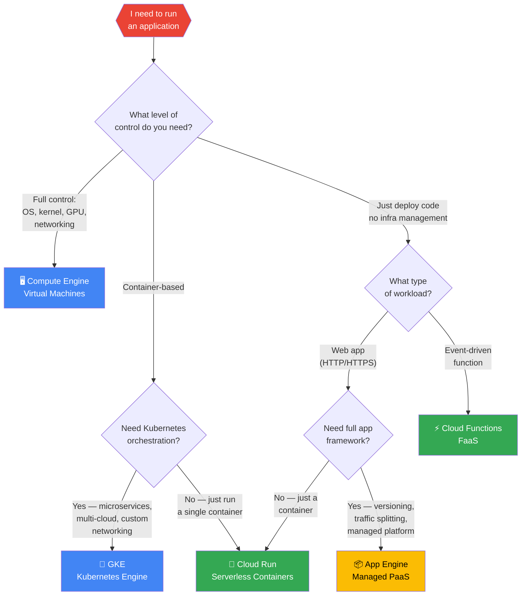
```mermaid
graph TD
    Start{{"I need to run<br/>an application"}} --> Q1{"What level of<br/>control do you need?"}
    
    Q1 -->|"Full control:<br/>OS, kernel, GPU,<br/>networking"| GCE["🖥️ Compute Engine<br/>Virtual Machines"]
    Q1 -->|"Container-based"| Q2{"Need Kubernetes<br/>orchestration?"}
    Q1 -->|"Just deploy code<br/>no infra management"| Q3{"What type<br/>of workload?"}
    
    Q2 -->|"Yes — microservices,<br/>multi-cloud, custom<br/>networking"| GKE["🐳 GKE<br/>Kubernetes Engine"]
    Q2 -->|"No — just run<br/>a single container"| CR["🚀 Cloud Run<br/>Serverless Containers"]
    
    Q3 -->|"Web app<br/>(HTTP/HTTPS)"| Q4{"Need full app<br/>framework?"}
    Q3 -->|"Event-driven<br/>function"| CF["⚡ Cloud Functions<br/>FaaS"]
    
    Q4 -->|"Yes — versioning,<br/>traffic splitting,<br/>managed platform"| GAE["📦 App Engine<br/>Managed PaaS"]
    Q4 -->|"No — just a<br/>container"| CR

    style Start fill:#EA4335,color:#fff
    style GCE fill:#4285F4,color:#fff
    style GKE fill:#4285F4,color:#fff
    style CR fill:#34A853,color:#fff
    style CF fill:#34A853,color:#fff
    style GAE fill:#FBBC04,color:#000
```

### Compute Options Comparison

| Feature | Compute Engine | GKE | Cloud Run | App Engine | Cloud Functions |
|---------|---------------|-----|-----------|------------|-----------------|
| **Abstraction** | IaaS (VMs) | CaaS (Containers) | Serverless Container | Serverless PaaS | Serverless FaaS |
| **Unit of deployment** | VM image | Container (Pod) | Container image | Application code | Single function |
| **Scaling** | Manual / MIG autoscaler | HPA + Cluster Autoscaler | Automatic (0 to N) | Automatic | Automatic (0 to N) |
| **Scale to zero** | ❌ | ❌ (nodes always run) | ✅ | ❌ (min 1 instance) | ✅ |
| **Startup time** | Minutes | Seconds (pod) | Seconds | Seconds | Milliseconds–seconds |
| **Max request timeout** | Unlimited | Unlimited | 60 min | 60 min (flex) | 60 min (Gen2) |
| **Custom OS/kernel** | ✅ | ✅ (node image) | ❌ | ❌ | ❌ |
| **GPU support** | ✅ | ✅ | ❌ | ❌ | ❌ |
| **Protocols** | Any | Any | HTTP/gRPC/WebSocket | HTTP | HTTP + events |
| **Billing** | Per VM (sustained discount) | Per node (committed use) | Per request + CPU time | Per instance hour | Per invocation + CPU time |
| **Portability** | Low (GCP VMs) | High (Kubernetes) | High (Knative) | Low | Medium (Functions Framework) |
| **Best for** | Legacy, licensed SW, HPC | Microservices, hybrid | APIs, websites, webhooks | Web apps, mobile backends | Event processing, glue code |

### Use Case Examples

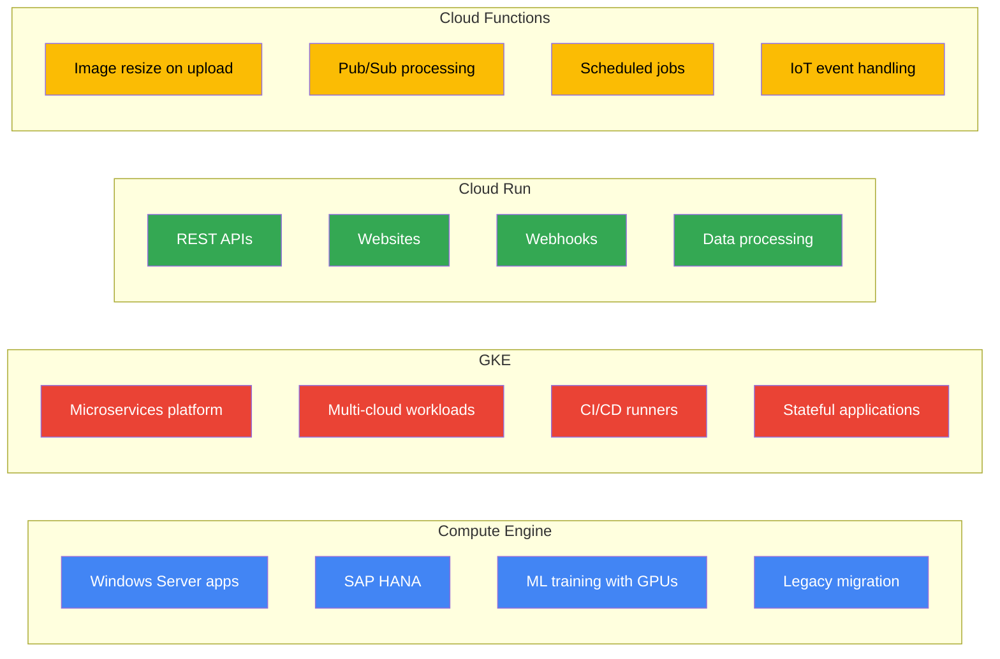
```mermaid
graph LR
    subgraph "Compute Engine"
        CE1["Windows Server apps"]
        CE2["SAP HANA"]
        CE3["ML training with GPUs"]
        CE4["Legacy migration"]
    end
    
    subgraph "GKE"
        GK1["Microservices platform"]
        GK2["Multi-cloud workloads"]
        GK3["CI/CD runners"]
        GK4["Stateful applications"]
    end
    
    subgraph "Cloud Run"
        CR1["REST APIs"]
        CR2["Websites"]
        CR3["Webhooks"]
        CR4["Data processing"]
    end
    
    subgraph "Cloud Functions"
        CF1["Image resize on upload"]
        CF2["Pub/Sub processing"]
        CF3["Scheduled jobs"]
        CF4["IoT event handling"]
    end

    style CE1 fill:#4285F4,color:#fff
    style CE2 fill:#4285F4,color:#fff
    style CE3 fill:#4285F4,color:#fff
    style CE4 fill:#4285F4,color:#fff
    style GK1 fill:#EA4335,color:#fff
    style GK2 fill:#EA4335,color:#fff
    style GK3 fill:#EA4335,color:#fff
    style GK4 fill:#EA4335,color:#fff
    style CR1 fill:#34A853,color:#fff
    style CR2 fill:#34A853,color:#fff
    style CR3 fill:#34A853,color:#fff
    style CR4 fill:#34A853,color:#fff
    style CF1 fill:#FBBC04,color:#000
    style CF2 fill:#FBBC04,color:#000
    style CF3 fill:#FBBC04,color:#000
    style CF4 fill:#FBBC04,color:#000
```

---

## 🌐 GCP Global Infrastructure

> Google Cloud spans **40+ regions**, **121+ zones**, and **187+ edge locations** across **200+ countries**.

### Hierarchy


```mermaid
graph TB
    subgraph "🌍 Google Cloud Global Network"
        direction TB

        subgraph "Multi-Region"
            MR1["🇺🇸 US"]
            MR2["🇪🇺 EU"]
            MR3["🌏 Asia"]
        end

        subgraph "Americas"
            subgraph "us-central1 (Iowa)"
                Z1["⚡ us-central1-a"]
                Z2["⚡ us-central1-b"]
                Z3["⚡ us-central1-c"]
                Z4["⚡ us-central1-f"]
            end
            subgraph "us-east1 (S. Carolina)"
                Z5["⚡ us-east1-b"]
                Z6["⚡ us-east1-c"]
                Z7["⚡ us-east1-d"]
            end
            subgraph "southamerica-east1 (São Paulo)"
                Z8["⚡ southamerica-east1-a"]
                Z9["⚡ southamerica-east1-b"]
                Z10["⚡ southamerica-east1-c"]
            end
        end

        subgraph "Europe"
            subgraph "europe-west1 (Belgium)"
                Z11["⚡ europe-west1-b"]
                Z12["⚡ europe-west1-c"]
                Z13["⚡ europe-west1-d"]
            end
            subgraph "europe-west2 (London)"
                Z14["⚡ europe-west2-a"]
                Z15["⚡ europe-west2-b"]
                Z16["⚡ europe-west2-c"]
            end
        end

        subgraph "Asia-Pacific"
            subgraph "asia-south1 (Mumbai)"
                Z17["⚡ asia-south1-a"]
                Z18["⚡ asia-south1-b"]
                Z19["⚡ asia-south1-c"]
            end
            subgraph "asia-east1 (Taiwan)"
                Z20["⚡ asia-east1-a"]
                Z21["⚡ asia-east1-b"]
                Z22["⚡ asia-east1-c"]
            end
        end

        subgraph "Edge Network"
            PoP["🌐 187+ Edge PoPs"]
            CDN_E["📦 Cloud CDN Cache"]
            Armor["🛡️ Cloud Armor"]
        end
    end

    MR1 ---|"Covers all US regions"| Z1
    MR2 ---|"Covers all EU regions"| Z11
    MR3 ---|"Covers all Asia regions"| Z17

    PoP --> CDN_E
    CDN_E --> Armor

    style MR1 fill:#4285F4,color:#fff
    style MR2 fill:#34A853,color:#fff
    style MR3 fill:#FBBC04,color:#000
    style PoP fill:#EA4335,color:#fff
    style CDN_E fill:#EA4335,color:#fff
    style Armor fill:#EA4335,color:#fff
    style Z1 fill:#4285F4,color:#fff
    style Z2 fill:#4285F4,color:#fff
    style Z3 fill:#4285F4,color:#fff
    style Z4 fill:#4285F4,color:#fff
    style Z5 fill:#4285F4,color:#fff
    style Z6 fill:#4285F4,color:#fff
    style Z7 fill:#4285F4,color:#fff
    style Z8 fill:#4285F4,color:#fff
    style Z9 fill:#4285F4,color:#fff
    style Z10 fill:#4285F4,color:#fff
    style Z11 fill:#34A853,color:#fff
    style Z12 fill:#34A853,color:#fff
    style Z13 fill:#34A853,color:#fff
    style Z14 fill:#34A853,color:#fff
    style Z15 fill:#34A853,color:#fff
    style Z16 fill:#34A853,color:#fff
    style Z17 fill:#FBBC04,color:#000
    style Z18 fill:#FBBC04,color:#000
    style Z19 fill:#FBBC04,color:#000
    style Z20 fill:#FBBC04,color:#000
    style Z21 fill:#FBBC04,color:#000
    style Z22 fill:#FBBC04,color:#000
```

### Resource Scoping

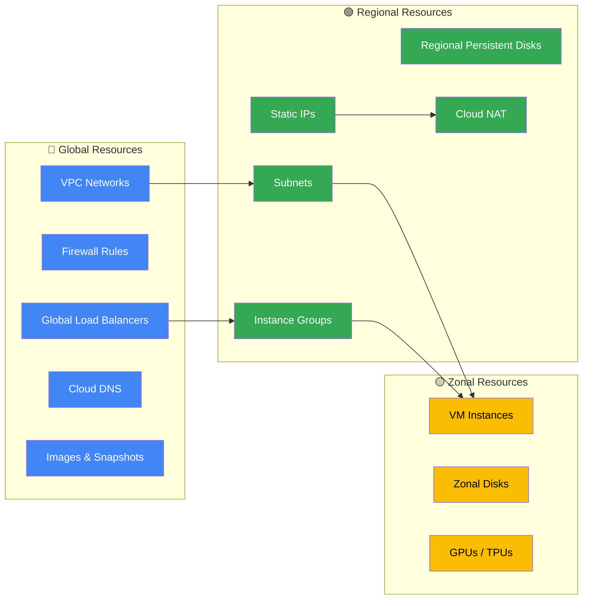
```mermaid
graph LR
    subgraph "🔵 Global Resources"
        VPC["VPC Networks"]
        FW["Firewall Rules"]
        LB["Global Load Balancers"]
        DNS["Cloud DNS"]
        IMG["Images & Snapshots"]
    end

    subgraph "🟢 Regional Resources"
        SUB["Subnets"]
        SIP["Static IPs"]
        DISK["Regional Persistent Disks"]
        IG["Instance Groups"]
        NAT2["Cloud NAT"]
    end

    subgraph "🟡 Zonal Resources"
        VM["VM Instances"]
        ZD["Zonal Disks"]
        GPU["GPUs / TPUs"]
    end

    VPC --> SUB --> VM
    LB --> IG --> VM
    SIP --> NAT2

    style VPC fill:#4285F4,color:#fff
    style FW fill:#4285F4,color:#fff
    style LB fill:#4285F4,color:#fff
    style DNS fill:#4285F4,color:#fff
    style IMG fill:#4285F4,color:#fff
    style SUB fill:#34A853,color:#fff
    style SIP fill:#34A853,color:#fff
    style DISK fill:#34A853,color:#fff
    style IG fill:#34A853,color:#fff
    style NAT2 fill:#34A853,color:#fff
    style VM fill:#FBBC04,color:#000
    style ZD fill:#FBBC04,color:#000
    style GPU fill:#FBBC04,color:#000
```

### Key Numbers

| Dimension | Count |
|-----------|-------|
| **Regions** | 40+ (across 5 continents) |
| **Zones** | 121+ (typically 3 per region) |
| **Edge PoPs** | 187+ worldwide |
| **Countries** | 200+ served |
| **Submarine Cables** | 20+ private/consortium cables |
| **Network Capacity** | 1 Petabit/sec+ bisection bandwidth |
| **SLA** | 99.99% (multi-zone), 99.999% (multi-region with Spanner) |

### Regions at a Glance

| Continent | Regions | Examples |
|-----------|---------|----------|
| **Americas** | 12+ | us-central1 (Iowa), us-east1 (S. Carolina), us-west1 (Oregon), southamerica-east1 (São Paulo) |
| **Europe** | 10+ | europe-west1 (Belgium), europe-west2 (London), europe-north1 (Finland) |
| **Asia-Pacific** | 12+ | asia-south1 (Mumbai), asia-east1 (Taiwan), asia-northeast1 (Tokyo), australia-southeast1 (Sydney) |
| **Middle East** | 3+ | me-west1 (Tel Aviv), me-central1 (Doha), me-central2 (Dammam) |
| **Africa** | 2+ | africa-south1 (Johannesburg), africa-south2 (Cape Town) |

---

## 🖥️ Compute Engine — VM Lifecycle

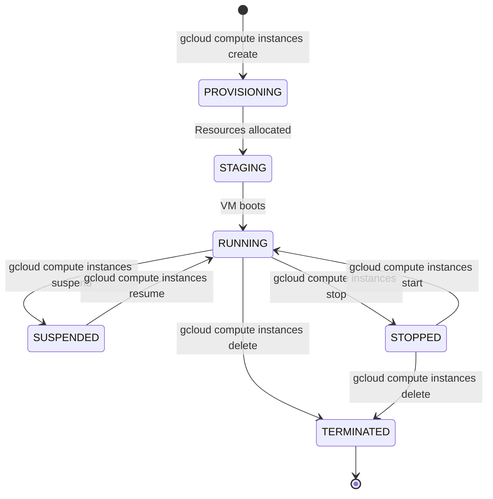
```mermaid
stateDiagram-v2
    [*] --> PROVISIONING: gcloud compute instances create
    PROVISIONING --> STAGING: Resources allocated
    STAGING --> RUNNING: VM boots
    RUNNING --> SUSPENDED: gcloud compute instances suspend
    SUSPENDED --> RUNNING: gcloud compute instances resume
    RUNNING --> STOPPED: gcloud compute instances stop
    STOPPED --> RUNNING: gcloud compute instances start
    RUNNING --> TERMINATED: gcloud compute instances delete
    STOPPED --> TERMINATED: gcloud compute instances delete
    TERMINATED --> [*]
```

---

## 🌐 VPC Network Architecture

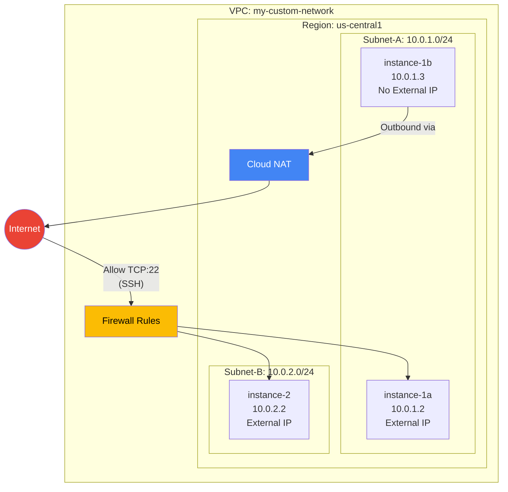
```mermaid
graph TB
    Internet((Internet))
    
    subgraph "VPC: my-custom-network"
        subgraph "Region: us-central1"
            subgraph "Subnet-A: 10.0.1.0/24"
                VM1["instance-1a<br/>10.0.1.2<br/>External IP"]
                VM2["instance-1b<br/>10.0.1.3<br/>No External IP"]
            end
            subgraph "Subnet-B: 10.0.2.0/24"
                VM3["instance-2<br/>10.0.2.2<br/>External IP"]
            end
            NAT["Cloud NAT"]
        end
        FW["Firewall Rules"]
    end
    
    Internet -->|"Allow TCP:22<br/>(SSH)"| FW
    FW --> VM1
    FW --> VM3
    VM2 -->|"Outbound via"| NAT
    NAT --> Internet

    style Internet fill:#EA4335,color:#fff
    style NAT fill:#4285F4,color:#fff
    style FW fill:#FBBC04,color:#000
```

---

## ⚖️ HTTP(S) Load Balancer Flow

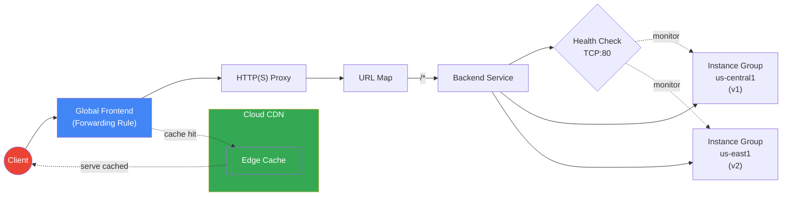
```mermaid
graph LR
    Client((Client)) --> GFE["Global Frontend<br/>(Forwarding Rule)"]
    GFE --> Proxy["HTTP(S) Proxy"]
    Proxy --> URLMap["URL Map"]
    URLMap -->|"/*"| BS["Backend Service"]
    BS --> HC{"Health Check<br/>TCP:80"}
    BS --> IG1["Instance Group<br/>us-central1<br/>(v1)"]
    BS --> IG2["Instance Group<br/>us-east1<br/>(v2)"]
    HC -.->|"monitor"| IG1
    HC -.->|"monitor"| IG2
    
    subgraph CDN["Cloud CDN"]
        Cache["Edge Cache"]
    end
    
    GFE -.->|"cache hit"| Cache
    Cache -.->|"serve cached"| Client

    style Client fill:#EA4335,color:#fff
    style CDN fill:#34A853,color:#fff
    style Cache fill:#34A853,color:#fff
    style GFE fill:#4285F4,color:#fff
```

---

## 🪣 Cloud Storage — Storage Classes Flow

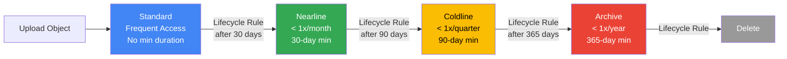
```mermaid
graph LR
    Upload["Upload Object"] --> Standard["Standard<br/>Frequent Access<br/>No min duration"]
    Standard -->|"Lifecycle Rule<br/>after 30 days"| Nearline["Nearline<br/>< 1x/month<br/>30-day min"]
    Nearline -->|"Lifecycle Rule<br/>after 90 days"| Coldline["Coldline<br/>< 1x/quarter<br/>90-day min"]
    Coldline -->|"Lifecycle Rule<br/>after 365 days"| Archive["Archive<br/>< 1x/year<br/>365-day min"]
    Archive -->|"Lifecycle Rule"| Delete["Delete"]

    style Standard fill:#4285F4,color:#fff
    style Nearline fill:#34A853,color:#fff
    style Coldline fill:#FBBC04,color:#000
    style Archive fill:#EA4335,color:#fff
    style Delete fill:#999,color:#fff
```

---

## 🐳 GKE Cluster Architecture

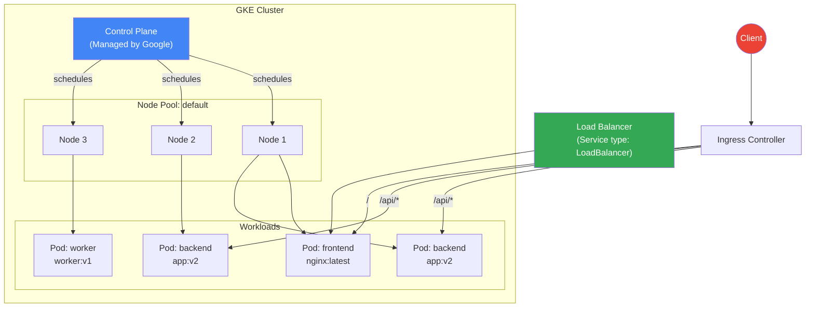
```mermaid
graph TB
    subgraph "GKE Cluster"
        CP["Control Plane<br/>(Managed by Google)"]
        
        subgraph "Node Pool: default"
            N1["Node 1"]
            N2["Node 2"]
            N3["Node 3"]
        end
        
        subgraph "Workloads"
            P1["Pod: frontend<br/>nginx:latest"]
            P2["Pod: backend<br/>app:v2"]
            P3["Pod: backend<br/>app:v2"]
            P4["Pod: worker<br/>worker:v1"]
        end
    end
    
    CP -->|"schedules"| N1
    CP -->|"schedules"| N2
    CP -->|"schedules"| N3
    N1 --> P1
    N1 --> P2
    N2 --> P3
    N3 --> P4
    
    LB["Load Balancer<br/>(Service type: LoadBalancer)"]
    LB --> P1
    
    Ingress["Ingress Controller"]
    Ingress -->|"/api/*"| P2
    Ingress -->|"/api/*"| P3
    Ingress -->|"/"| P1
    
    Client((Client)) --> Ingress

    style CP fill:#4285F4,color:#fff
    style Client fill:#EA4335,color:#fff
    style LB fill:#34A853,color:#fff
```

---

## 🚀 Cloud Run Request Flow

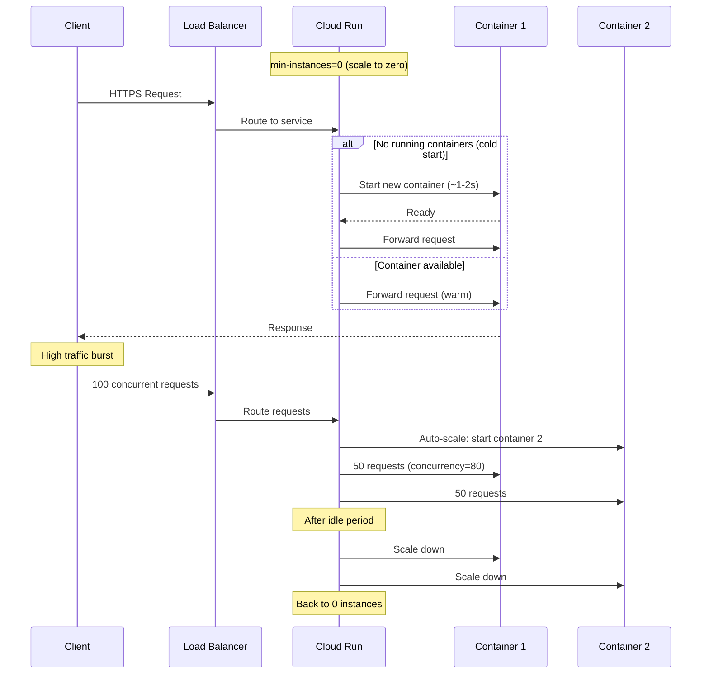
```mermaid
sequenceDiagram
    participant Client
    participant LB as Load Balancer
    participant CR as Cloud Run
    participant C1 as Container 1
    participant C2 as Container 2
    
    Note over CR: min-instances=0 (scale to zero)
    Client->>LB: HTTPS Request
    LB->>CR: Route to service
    
    alt No running containers (cold start)
        CR->>C1: Start new container (~1-2s)
        C1-->>CR: Ready
        CR->>C1: Forward request
    else Container available
        CR->>C1: Forward request (warm)
    end
    
    C1-->>Client: Response
    
    Note over Client: High traffic burst
    Client->>LB: 100 concurrent requests
    LB->>CR: Route requests
    CR->>C2: Auto-scale: start container 2
    CR->>C1: 50 requests (concurrency=80)
    CR->>C2: 50 requests
    
    Note over CR: After idle period
    CR->>C1: Scale down
    CR->>C2: Scale down
    Note over CR: Back to 0 instances
```

---

## 🗄️ Cloud SQL — HA Architecture

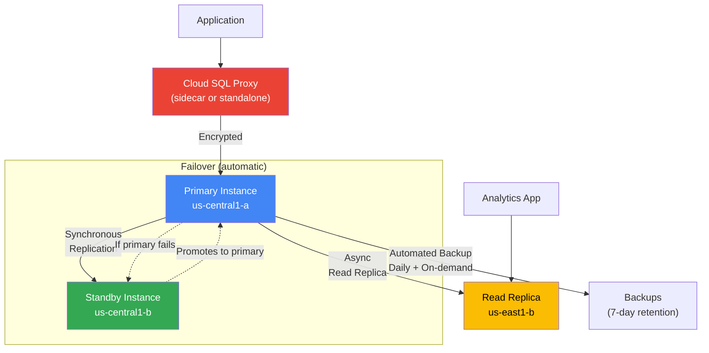
```mermaid
graph TB
    App["Application"] --> Proxy["Cloud SQL Proxy<br/>(sidecar or standalone)"]
    Proxy -->|"Encrypted"| Primary["Primary Instance<br/>us-central1-a"]
    Primary -->|"Synchronous<br/>Replication"| Standby["Standby Instance<br/>us-central1-b"]
    Primary -->|"Async<br/>Read Replica"| Replica["Read Replica<br/>us-east1-b"]
    
    App2["Analytics App"] --> Replica
    
    Primary -->|"Automated Backup<br/>Daily + On-demand"| Backup["Backups<br/>(7-day retention)"]
    
    subgraph "Failover (automatic)"
        Primary -.->|"If primary fails"| Standby
        Standby -.->|"Promotes to primary"| Primary
    end

    style Primary fill:#4285F4,color:#fff
    style Standby fill:#34A853,color:#fff
    style Replica fill:#FBBC04,color:#000
    style Proxy fill:#EA4335,color:#fff
```

---

## 🔐 IAM — Resource Hierarchy

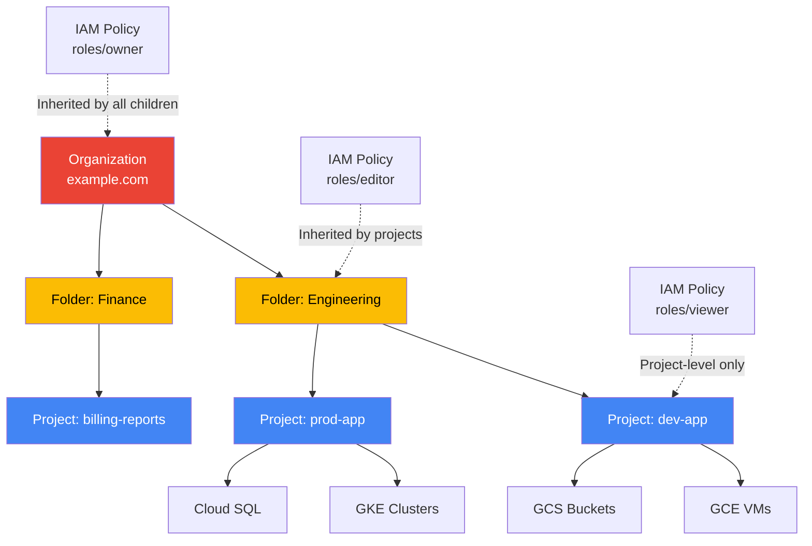
```mermaid
graph TD
    Org["Organization<br/>example.com"] --> F1["Folder: Engineering"]
    Org --> F2["Folder: Finance"]
    F1 --> P1["Project: dev-app"]
    F1 --> P2["Project: prod-app"]
    F2 --> P3["Project: billing-reports"]
    
    P1 --> R1["GCE VMs"]
    P1 --> R2["GCS Buckets"]
    P2 --> R3["GKE Clusters"]
    P2 --> R4["Cloud SQL"]
    
    IAM1["IAM Policy<br/>roles/owner"] -.->|"Inherited by all children"| Org
    IAM2["IAM Policy<br/>roles/editor"] -.->|"Inherited by projects"| F1
    IAM3["IAM Policy<br/>roles/viewer"] -.->|"Project-level only"| P1

    style Org fill:#EA4335,color:#fff
    style F1 fill:#FBBC04,color:#000
    style F2 fill:#FBBC04,color:#000
    style P1 fill:#4285F4,color:#fff
    style P2 fill:#4285F4,color:#fff
    style P3 fill:#4285F4,color:#fff
```

---

## 🔄 Database Migration Service (DMS) Flow

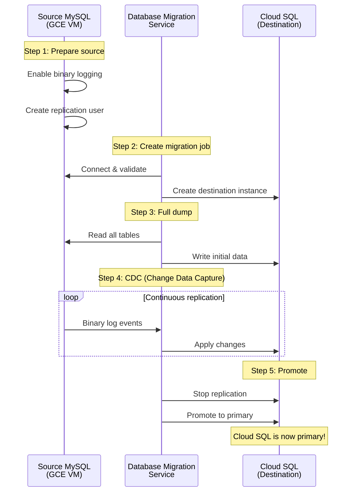
```mermaid
sequenceDiagram
    participant Source as Source MySQL<br/>(GCE VM)
    participant DMS as Database Migration<br/>Service
    participant Target as Cloud SQL<br/>(Destination)
    
    Note over Source: Step 1: Prepare source
    Source->>Source: Enable binary logging
    Source->>Source: Create replication user
    
    Note over DMS: Step 2: Create migration job
    DMS->>Source: Connect & validate
    DMS->>Target: Create destination instance
    
    Note over DMS: Step 3: Full dump
    DMS->>Source: Read all tables
    DMS->>Target: Write initial data
    
    Note over DMS: Step 4: CDC (Change Data Capture)
    loop Continuous replication
        Source->>DMS: Binary log events
        DMS->>Target: Apply changes
    end
    
    Note over Target: Step 5: Promote
    DMS->>Target: Stop replication
    DMS->>Target: Promote to primary
    Note over Target: Cloud SQL is now primary!
```

---

## 🌍 VPN — HA VPN Between Two Projects

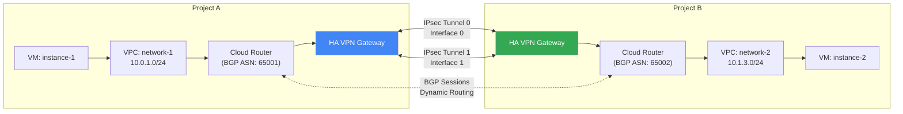
```mermaid
graph LR
    subgraph "Project A"
        VPC_A["VPC: network-1<br/>10.0.1.0/24"]
        GW_A["HA VPN Gateway"]
        Router_A["Cloud Router<br/>(BGP ASN: 65001)"]
        VM_A["VM: instance-1"]
    end
    
    subgraph "Project B"
        VPC_B["VPC: network-2<br/>10.1.3.0/24"]
        GW_B["HA VPN Gateway"]
        Router_B["Cloud Router<br/>(BGP ASN: 65002)"]
        VM_B["VM: instance-2"]
    end
    
    VM_A --> VPC_A
    VPC_A --> Router_A
    Router_A --> GW_A
    GW_A <-->|"IPsec Tunnel 0<br/>Interface 0"| GW_B
    GW_A <-->|"IPsec Tunnel 1<br/>Interface 1"| GW_B
    GW_B --> Router_B
    Router_B --> VPC_B
    VPC_B --> VM_B
    
    Router_A <-.->|"BGP Sessions<br/>Dynamic Routing"| Router_B

    style GW_A fill:#4285F4,color:#fff
    style GW_B fill:#34A853,color:#fff
```

---

## 📋 GCP Services Decision Tree

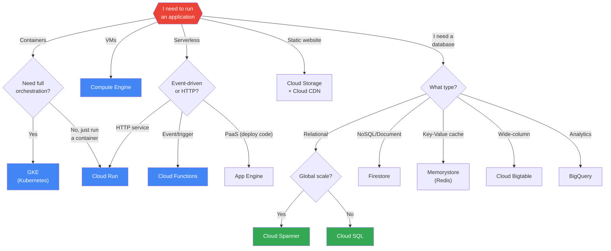
```mermaid
graph TD
    Start{{"I need to run<br/>an application"}}
    
    Start -->|"Containers"| Q1{"Need full<br/>orchestration?"}
    Start -->|"VMs"| GCE["Compute Engine"]
    Start -->|"Serverless"| Q2{"Event-driven<br/>or HTTP?"}
    Start -->|"Static website"| GCS["Cloud Storage<br/>+ Cloud CDN"]
    
    Q1 -->|"Yes"| GKE["GKE<br/>(Kubernetes)"]
    Q1 -->|"No, just run<br/>a container"| CR["Cloud Run"]
    
    Q2 -->|"HTTP service"| CR
    Q2 -->|"Event/trigger"| CF["Cloud Functions"]
    Q2 -->|"PaaS (deploy code)"| GAE["App Engine"]
    
    Start -->|"I need a<br/>database"| Q3{"What type?"}
    Q3 -->|"Relational"| Q4{"Global scale?"}
    Q3 -->|"NoSQL/Document"| Firestore["Firestore"]
    Q3 -->|"Key-Value cache"| Redis["Memorystore<br/>(Redis)"]
    Q3 -->|"Wide-column"| BigTable["Cloud Bigtable"]
    Q3 -->|"Analytics"| BQ["BigQuery"]
    
    Q4 -->|"Yes"| Spanner["Cloud Spanner"]
    Q4 -->|"No"| CloudSQL["Cloud SQL"]

    style Start fill:#EA4335,color:#fff
    style GKE fill:#4285F4,color:#fff
    style CR fill:#4285F4,color:#fff
    style CF fill:#4285F4,color:#fff
    style GCE fill:#4285F4,color:#fff
    style Spanner fill:#34A853,color:#fff
    style CloudSQL fill:#34A853,color:#fff
```

---

## 🗺️ GCP Full Service Map

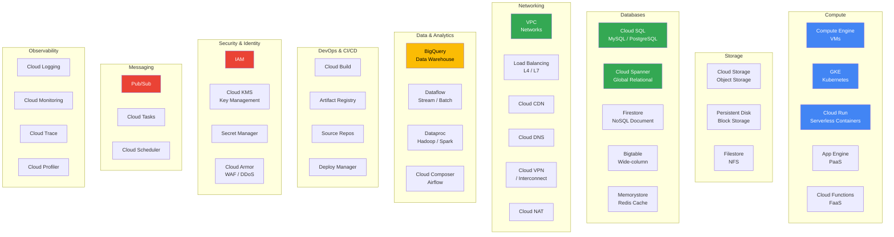
```mermaid
graph TB
    subgraph "Compute"
        GCE["Compute Engine<br/>VMs"]
        GKE_S["GKE<br/>Kubernetes"]
        CR_S["Cloud Run<br/>Serverless Containers"]
        GAE_S["App Engine<br/>PaaS"]
        CF_S["Cloud Functions<br/>FaaS"]
    end
    
    subgraph "Storage"
        GCS_S["Cloud Storage<br/>Object Storage"]
        PD["Persistent Disk<br/>Block Storage"]
        FS["Filestore<br/>NFS"]
    end
    
    subgraph "Databases"
        SQL_S["Cloud SQL<br/>MySQL / PostgreSQL"]
        Spanner_S["Cloud Spanner<br/>Global Relational"]
        FS_S["Firestore<br/>NoSQL Document"]
        BT["Bigtable<br/>Wide-column"]
        Redis_S["Memorystore<br/>Redis Cache"]
    end
    
    subgraph "Networking"
        VPC_S["VPC<br/>Networks"]
        LB_S["Load Balancing<br/>L4 / L7"]
        CDN_S["Cloud CDN"]
        DNS["Cloud DNS"]
        VPN_S["Cloud VPN<br/>/ Interconnect"]
        NAT_S["Cloud NAT"]
    end
    
    subgraph "Data & Analytics"
        BQ_S["BigQuery<br/>Data Warehouse"]
        DF["Dataflow<br/>Stream / Batch"]
        DP["Dataproc<br/>Hadoop / Spark"]
        Composer["Cloud Composer<br/>Airflow"]
    end
    
    subgraph "DevOps & CI/CD"
        CB["Cloud Build"]
        AR["Artifact Registry"]
        SR["Source Repos"]
        DM["Deploy Manager"]
    end
    
    subgraph "Security & Identity"
        IAM_S["IAM"]
        KMS["Cloud KMS<br/>Key Management"]
        SM["Secret Manager"]
        Armor["Cloud Armor<br/>WAF / DDoS"]
    end
    
    subgraph "Messaging"
        PS["Pub/Sub"]
        Tasks["Cloud Tasks"]
        Scheduler["Cloud Scheduler"]
    end
    
    subgraph "Observability"
        Logging["Cloud Logging"]
        Monitoring["Cloud Monitoring"]
        Trace["Cloud Trace"]
        Profiler["Cloud Profiler"]
    end

    style GCE fill:#4285F4,color:#fff
    style GKE_S fill:#4285F4,color:#fff
    style CR_S fill:#4285F4,color:#fff
    style SQL_S fill:#34A853,color:#fff
    style Spanner_S fill:#34A853,color:#fff
    style BQ_S fill:#FBBC04,color:#000
    style IAM_S fill:#EA4335,color:#fff
    style PS fill:#EA4335,color:#fff
    style VPC_S fill:#34A853,color:#fff
```

---

## 🌍 Cloud Spanner — Global Distribution

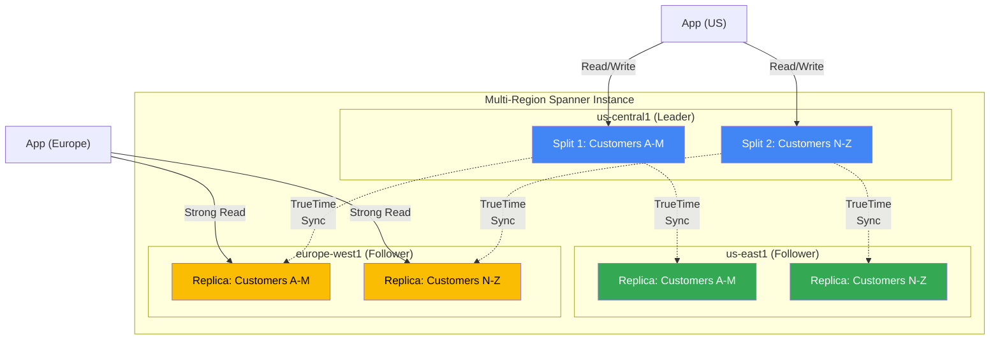
```mermaid
graph TB
    subgraph "Multi-Region Spanner Instance"
        subgraph "us-central1 (Leader)"
            S1["Split 1: Customers A-M"]
            S2["Split 2: Customers N-Z"]
        end
        subgraph "us-east1 (Follower)"
            S3["Replica: Customers A-M"]
            S4["Replica: Customers N-Z"]
        end
        subgraph "europe-west1 (Follower)"
            S5["Replica: Customers A-M"]
            S6["Replica: Customers N-Z"]
        end
    end
    
    App_US["App (US)"] -->|"Read/Write"| S1
    App_US -->|"Read/Write"| S2
    App_EU["App (Europe)"] -->|"Strong Read"| S5
    App_EU -->|"Strong Read"| S6
    
    S1 -.->|"TrueTime<br/>Sync"| S3
    S1 -.->|"TrueTime<br/>Sync"| S5
    S2 -.->|"TrueTime<br/>Sync"| S4
    S2 -.->|"TrueTime<br/>Sync"| S6

    style S1 fill:#4285F4,color:#fff
    style S2 fill:#4285F4,color:#fff
    style S3 fill:#34A853,color:#fff
    style S4 fill:#34A853,color:#fff
    style S5 fill:#FBBC04,color:#000
    style S6 fill:#FBBC04,color:#000
```

---

## ⚡ Cloud Functions — Event-Driven Architecture

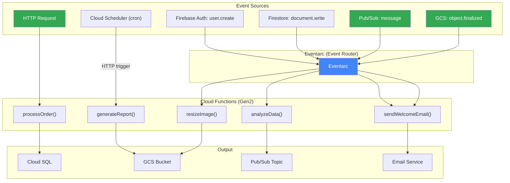
```mermaid
graph TB
    subgraph "Event Sources"
        HTTP_E["HTTP Request"]
        GCS_E["GCS: object.finalized"]
        PS_E["Pub/Sub: message"]
        FS_E["Firestore: document.write"]
        Sched["Cloud Scheduler (cron)"]
        Auth["Firebase Auth: user.create"]
    end
    
    subgraph "Eventarc (Event Router)"
        EA["Eventarc"]
    end
    
    subgraph "Cloud Functions (Gen2)"
        F1["processOrder()"]
        F2["resizeImage()"]
        F3["analyzeData()"]
        F4["sendWelcomeEmail()"]
        F5["generateReport()"]
    end
    
    subgraph "Output"
        DB_O["Cloud SQL"]
        Bucket_O["GCS Bucket"]
        Queue_O["Pub/Sub Topic"]
        Email_O["Email Service"]
    end
    
    HTTP_E --> F1
    GCS_E --> EA --> F2
    PS_E --> EA --> F3
    FS_E --> EA --> F4
    Sched -->|"HTTP trigger"| F5
    Auth --> EA --> F4
    
    F1 --> DB_O
    F2 --> Bucket_O
    F3 --> Queue_O
    F4 --> Email_O
    F5 --> Bucket_O

    style EA fill:#4285F4,color:#fff
    style HTTP_E fill:#34A853,color:#fff
    style GCS_E fill:#34A853,color:#fff
    style PS_E fill:#34A853,color:#fff
```

---

## 🌐 Networking — Complete Request Path

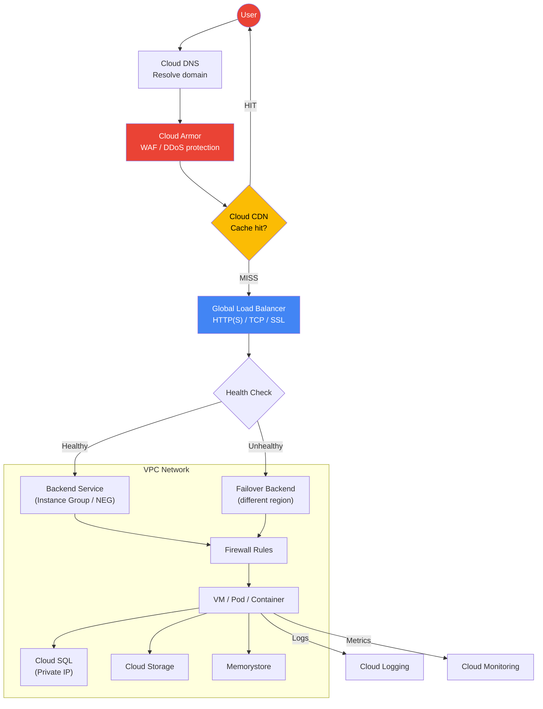
```mermaid
graph TB
    User((User)) --> DNS_R["Cloud DNS<br/>Resolve domain"]
    DNS_R --> Armor_R["Cloud Armor<br/>WAF / DDoS protection"]
    Armor_R --> CDN_R{"Cloud CDN<br/>Cache hit?"}
    
    CDN_R -->|"HIT"| User
    CDN_R -->|"MISS"| GCLB_R["Global Load Balancer<br/>HTTP(S) / TCP / SSL"]
    
    GCLB_R --> HealthCheck{"Health Check"}
    
    HealthCheck -->|"Healthy"| Backend1["Backend Service<br/>(Instance Group / NEG)"]
    HealthCheck -->|"Unhealthy"| Backend2["Failover Backend<br/>(different region)"]
    
    subgraph "VPC Network"
        Backend1 --> FW["Firewall Rules"]
        Backend2 --> FW
        FW --> VM_R["VM / Pod / Container"]
        VM_R --> SQL_R["Cloud SQL<br/>(Private IP)"]
        VM_R --> GCS_R["Cloud Storage"]
        VM_R --> Redis_R["Memorystore"]
    end
    
    VM_R -->|"Logs"| Logging_R["Cloud Logging"]
    VM_R -->|"Metrics"| Monitoring_R["Cloud Monitoring"]

    style User fill:#EA4335,color:#fff
    style CDN_R fill:#FBBC04,color:#000
    style GCLB_R fill:#4285F4,color:#fff
    style Armor_R fill:#EA4335,color:#fff
```

---

## 💾 Storage Decision Guide

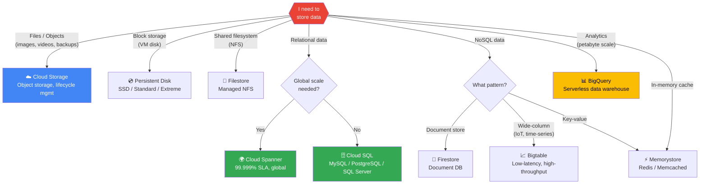
```mermaid
graph TD
    Q_S{{"I need to<br/>store data"}}
    
    Q_S -->|"Files / Objects<br/>(images, videos, backups)"| GCS_D["☁️ Cloud Storage<br/>Object storage, lifecycle mgmt"]
    Q_S -->|"Block storage<br/>(VM disk)"| PD_D["💿 Persistent Disk<br/>SSD / Standard / Extreme"]
    Q_S -->|"Shared filesystem<br/>(NFS)"| FS_D["📁 Filestore<br/>Managed NFS"]
    Q_S -->|"Relational data"| Q_RD{"Global scale<br/>needed?"}
    Q_S -->|"NoSQL data"| Q_NS{"What pattern?"}
    Q_S -->|"Analytics<br/>(petabyte scale)"| BQ_D["📊 BigQuery<br/>Serverless data warehouse"]
    Q_S -->|"In-memory cache"| Redis_D["⚡ Memorystore<br/>Redis / Memcached"]
    
    Q_RD -->|"Yes"| Spanner_D["🌍 Cloud Spanner<br/>99.999% SLA, global"]
    Q_RD -->|"No"| SQL_D["🗄️ Cloud SQL<br/>MySQL / PostgreSQL / SQL Server"]
    
    Q_NS -->|"Document store"| Firestore_D["📄 Firestore<br/>Document DB"]
    Q_NS -->|"Wide-column<br/>(IoT, time-series)"| BT_D["📈 Bigtable<br/>Low-latency, high-throughput"]
    Q_NS -->|"Key-value"| Redis_D

    style Q_S fill:#EA4335,color:#fff
    style GCS_D fill:#4285F4,color:#fff
    style SQL_D fill:#34A853,color:#fff
    style Spanner_D fill:#34A853,color:#fff
    style BQ_D fill:#FBBC04,color:#000
```

### Storage & Database Comparison

| Service | Type | Best For | Capacity | Pricing Model |
|---------|------|----------|----------|---------------|
| Cloud Storage | Object | Files, media, backups | Unlimited | Per GB stored + operations |
| Persistent Disk | Block | VM disks | 64 TB per disk | Per GB provisioned |
| Filestore | File (NFS) | Shared filesystems | Up to 100 TB | Per GB provisioned |
| Cloud SQL | Relational | Web apps, OLTP | 64 TB | Per instance hour + storage |
| Cloud Spanner | Relational | Global, mission-critical | Unlimited | Per node + storage |
| Firestore | Document | Mobile/web apps | Unlimited | Per read/write/delete + storage |
| Bigtable | Wide-column | IoT, analytics, time-series | Unlimited | Per node + storage |
| BigQuery | Analytics | Data warehouse, BI | Unlimited | Per query (TB scanned) + storage |
| Memorystore | In-memory | Caching, sessions | Up to 300 GB | Per GB per hour |

---

## 🔄 CI/CD Pipeline on GCP

```mermaid
graph LR
    Dev["Developer"] -->|"git push"| Repo["Cloud Source Repos<br/>/ GitHub"]
    Repo -->|"Trigger"| CB["Cloud Build<br/>(Build + Test)"]
    CB -->|"Build image"| AR_CD["Artifact Registry<br/>Container images"]
    
    AR_CD -->|"Deploy to staging"| CR_CD["Cloud Run<br/>(Staging)"]
    CR_CD -->|"Approval gate"| Prod["Cloud Run<br/>(Production)"]
    
    CB -->|"Alt: deploy to"| GKE_CD["GKE Cluster"]
    CB -->|"Alt: deploy to"| GAE_CD["App Engine"]
    
    subgraph "Observability"
        Prod --> Log["Cloud Logging"]
        Prod --> Mon["Cloud Monitoring"]
        Mon -->|"Alert"| Alert["PagerDuty / Slack"]
    end

    style Dev fill:#EA4335,color:#fff
    style CB fill:#4285F4,color:#fff
    style AR_CD fill:#34A853,color:#fff
    style Prod fill:#34A853,color:#fff
```

### Cloud Build Example (`cloudbuild.yaml`)

```yaml
steps:
  # Build the container image
  - name: 'gcr.io/cloud-builders/docker'
    args: ['build', '-t', 'us-central1-docker.pkg.dev/$PROJECT_ID/my-repo/my-app:$SHORT_SHA', '.']
  
  # Push to Artifact Registry
  - name: 'gcr.io/cloud-builders/docker'
    args: ['push', 'us-central1-docker.pkg.dev/$PROJECT_ID/my-repo/my-app:$SHORT_SHA']
  
  # Deploy to Cloud Run
  - name: 'gcr.io/google.com/cloudsdktool/cloud-sdk'
    args:
      - 'run'
      - 'deploy'
      - 'my-service'
      - '--image=us-central1-docker.pkg.dev/$PROJECT_ID/my-repo/my-app:$SHORT_SHA'
      - '--region=us-central1'
    entrypoint: gcloud

images:
  - 'us-central1-docker.pkg.dev/$PROJECT_ID/my-repo/my-app:$SHORT_SHA'
```

---

## 🏗️ Typical 3-Tier Web Application on GCP

```mermaid
graph TB
    User2((Users)) --> CDN2["Cloud CDN"]
    CDN2 --> LB2["Global HTTP(S)<br/>Load Balancer"]
    
    subgraph "Frontend Tier"
        LB2 --> CR2_F["Cloud Run<br/>React / Next.js"]
    end
    
    subgraph "Backend Tier"
        CR2_F -->|"API calls"| GKE2["GKE / Cloud Run<br/>API Servers"]
        GKE2 --> PS2["Pub/Sub<br/>(async tasks)"]
        PS2 --> CF2["Cloud Functions<br/>(workers)"]
    end
    
    subgraph "Data Tier"
        GKE2 --> SQL2["Cloud SQL<br/>(PostgreSQL)"]
        GKE2 --> Redis2["Memorystore<br/>(session cache)"]
        CF2 --> GCS2["Cloud Storage<br/>(file uploads)"]
        GKE2 --> GCS2
    end
    
    subgraph "Observability"
        GKE2 -.-> Log2["Logging"]
        GKE2 -.-> Mon2["Monitoring"]
        GKE2 -.-> Trace2["Tracing"]
    end

    style User2 fill:#EA4335,color:#fff
    style LB2 fill:#4285F4,color:#fff
    style SQL2 fill:#34A853,color:#fff
    style CDN2 fill:#FBBC04,color:#000
```

---

## 📚 Additional Resources

- [Google Cloud Architecture Center](https://cloud.google.com/architecture)
- [GCP Sketchnotes](https://github.com/priyankavergadia/GCPSketchnote) by Priyanka Vergadia
- [Where Should I Run My Stuff?](https://www.youtube.com/watch?v=q_5AgiI7KFQ) (YouTube)
- [GCP Decision Trees](https://cloud.google.com/blog/topics/developers-practitioners)
- [Cloud Architecture Framework](https://cloud.google.com/architecture/framework)
