# GCP Architecture & Flow Diagrams

Visual reference diagrams for Google Cloud Platform services. All diagrams use [Mermaid](https://mermaid.js.org/) syntax and render natively on GitHub.

---

## 🌐 GCP Global Infrastructure

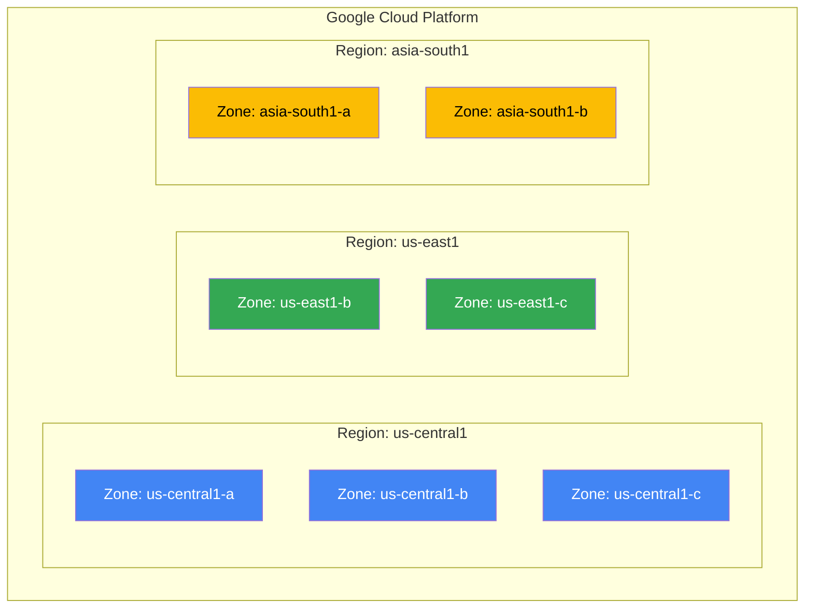

---

## 🖥️ Compute Engine — VM Lifecycle

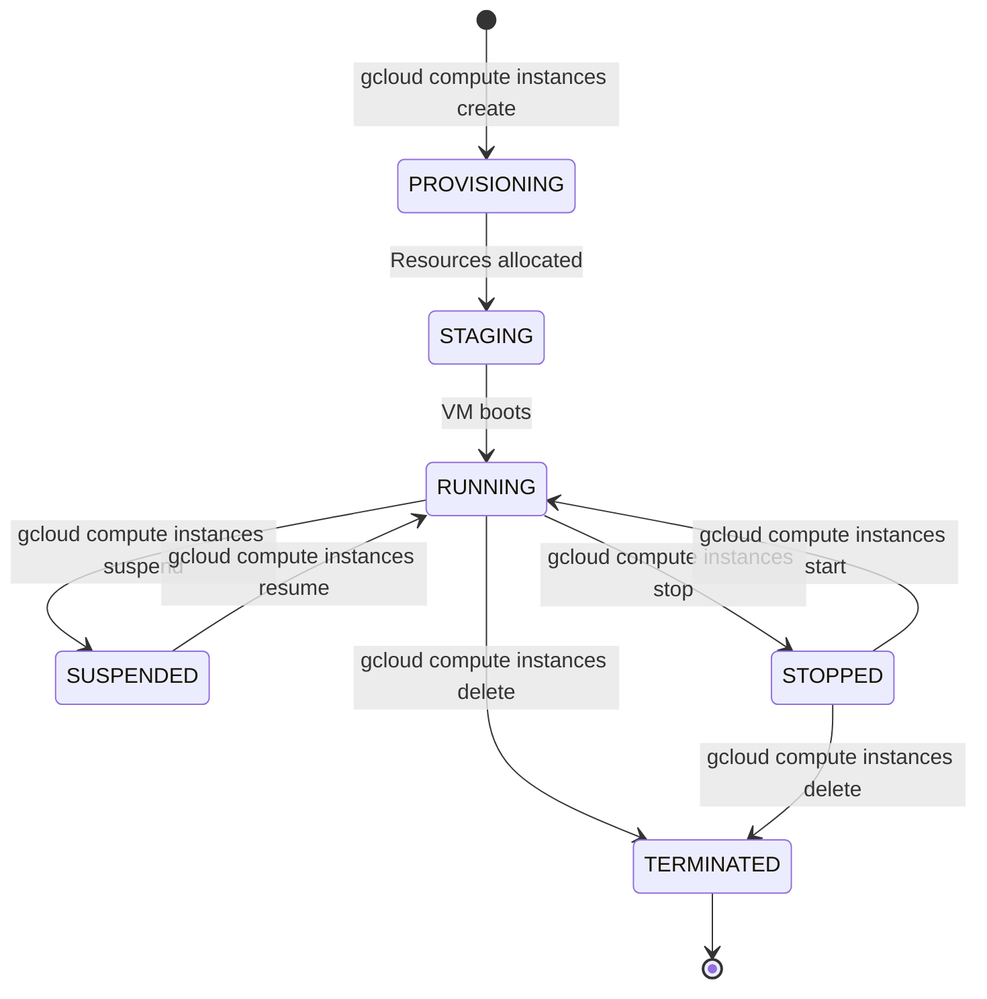

---

## 🌐 VPC Network Architecture

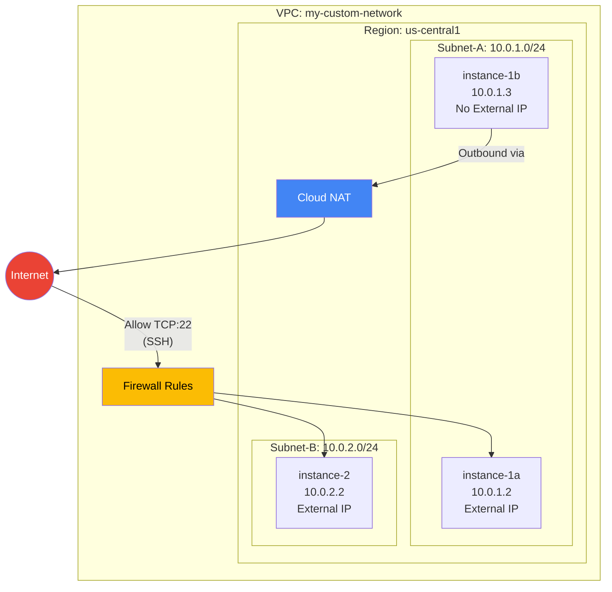

---

## ⚖️ HTTP(S) Load Balancer Flow

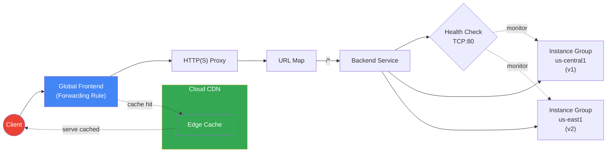

---

## 🪣 Cloud Storage — Storage Classes Flow

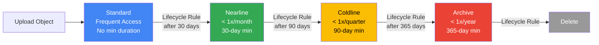

---

## 🐳 GKE Cluster Architecture

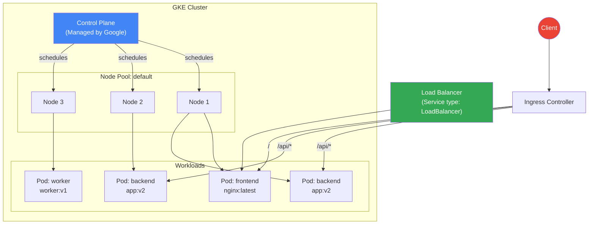

---

## 🚀 Cloud Run Request Flow

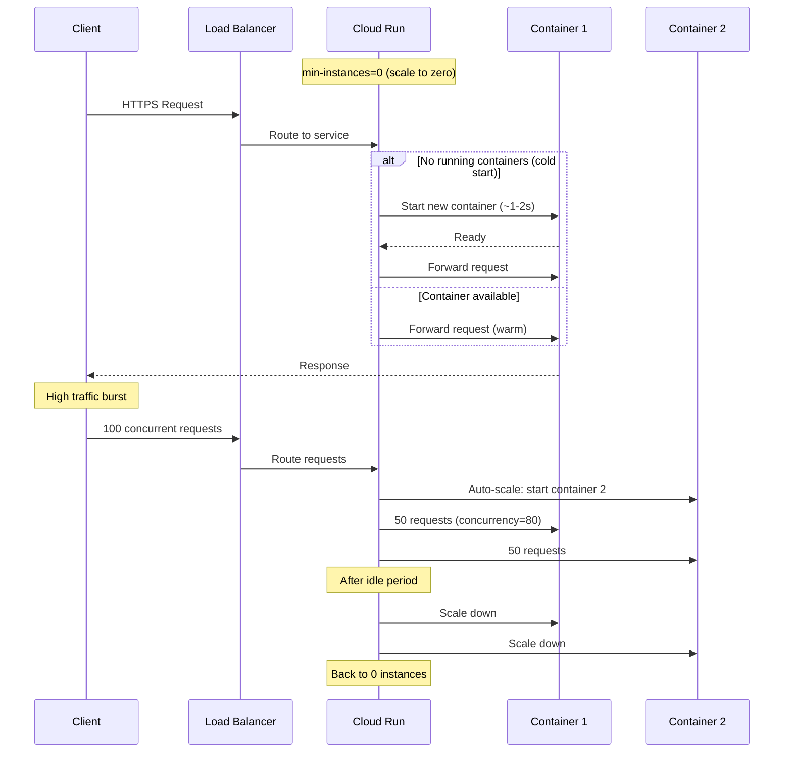

---

## 🗄️ Cloud SQL — HA Architecture

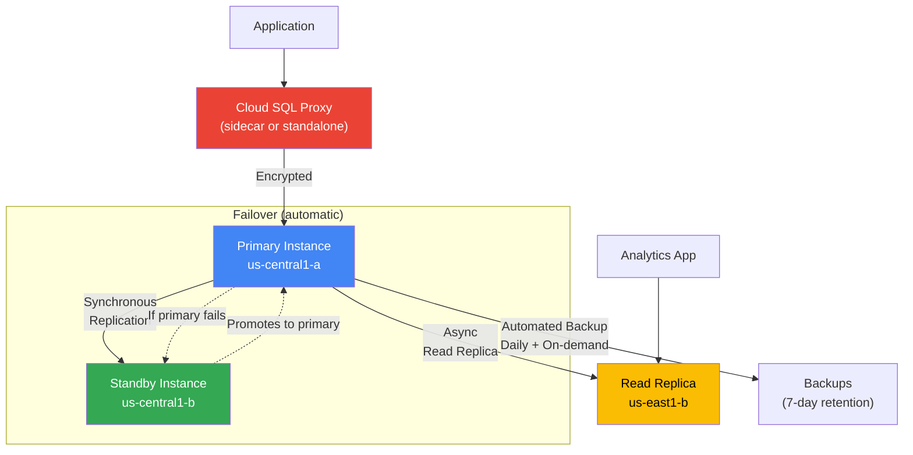

---

## 🔐 IAM — Resource Hierarchy

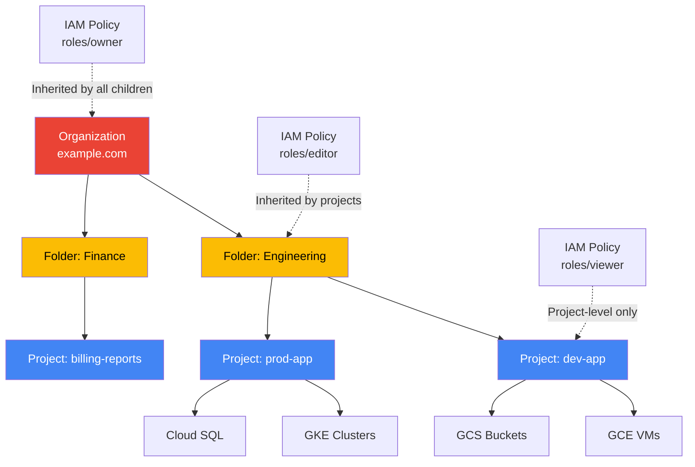

---

## 🔄 Database Migration Service (DMS) Flow

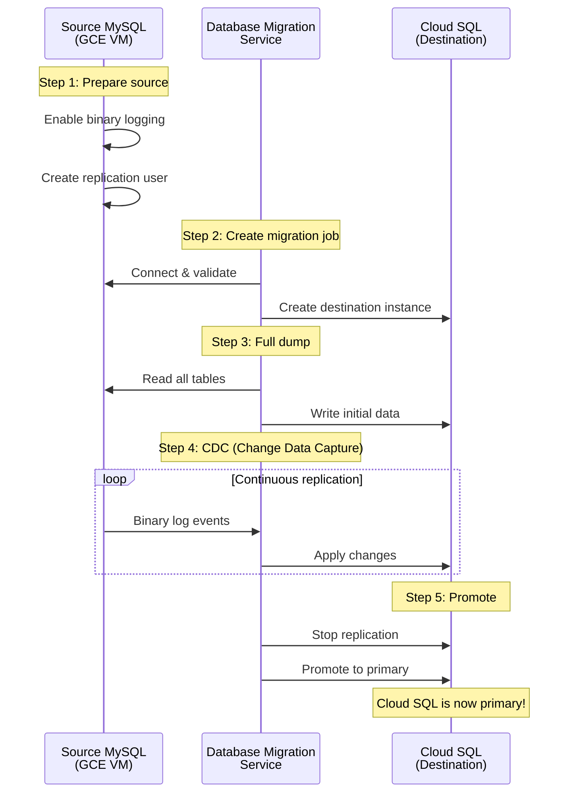

---

## 🌍 VPN — HA VPN Between Two Projects

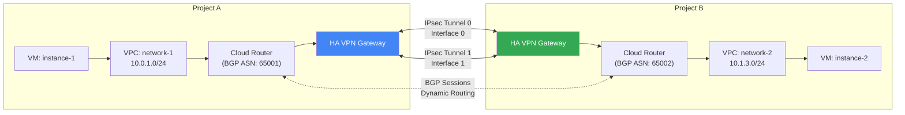

---

## 📋 GCP Services Decision Tree

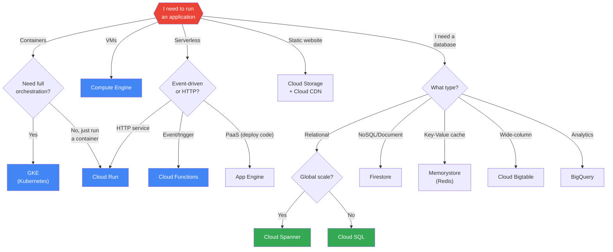
