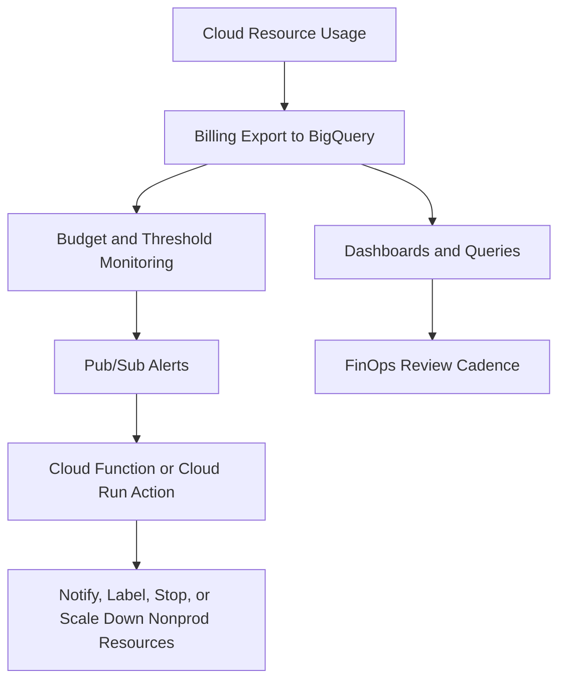

# Budgeting and Cost Management

> Scope: This guide covers billing setup, cost export, budget alerting, automated response, commitment strategy, labeling, and FinOps practices for Google Cloud.

## Cost Management Operating Model


## Billing Setup Step by Step
## Step 1: Identify or create the billing account
- Why this choice: A clear billing account structure is the base for budget ownership, invoice reconciliation, and cost export.
```bash
gcloud billing accounts list
gcloud alpha billing accounts projects list --billing-account=BILLING_ACCOUNT_ID
```
- Operational note: Use least-privilege service accounts for automation and separate prod from nonprod blast radius.

## Step 2: Link projects to the billing account
- Why this choice: Linking projects early prevents shadow spend and makes later export datasets more complete.
```bash
gcloud billing projects link prj-app-payments-prod-001 --billing-account=BILLING_ACCOUNT_ID
gcloud billing projects link prj-platform-net-prod-001 --billing-account=BILLING_ACCOUNT_ID
```
- Operational note: Use least-privilege service accounts for automation and separate prod from nonprod blast radius.

## Step 3: Create a BigQuery dataset for billing export
- Why this choice: BigQuery export is the most flexible way to analyze cost trends, labels, SKU usage, and anomalies over time.
```bash
bq --location=US mk --dataset prj-finops-core:billing_export
gcloud services enable bigquery.googleapis.com --project=prj-finops-core
```

## Step 4: Enable standard and detailed export from Cloud Billing
- Why this choice: The export configuration itself is often completed in the Billing UI, but the dataset and access model should be prepared like code-managed infrastructure.
```bash
gcloud beta billing accounts update BILLING_ACCOUNT_ID --display-name="Enterprise Billing"
```

## Step 5: Create budgets with thresholds
- Why this choice: Thresholds provide early warning, not just end-of-month regret. Include both current and forecasted rules.
```bash
gcloud beta billing budgets create --billing-account=BILLING_ACCOUNT_ID --display-name="prod-shared-budget" --budget-amount=5000USD --threshold-rule=percent=0.5,basis=current-spend --threshold-rule=percent=0.9,basis=forecasted-spend
```

## Step 6: Publish budget notifications to Pub/Sub
- Why this choice: Pub/Sub makes budget events machine-readable so teams can automate response rather than relying only on email.
```bash
gcloud pubsub topics create billing-budget-alerts --project=prj-finops-core
gcloud beta billing budgets update BUDGET_ID --billing-account=BILLING_ACCOUNT_ID --pubsub-topic=projects/prj-finops-core/topics/billing-budget-alerts
```

## Step 7: Attach an automated action service
- Why this choice: Automation is most useful for nonprod controls such as stopping idle environments or opening incidents, not for blindly touching production.
```bash
gcloud functions deploy budget-guardrail --gen2 --region=us-central1 --runtime=python312 --trigger-topic=billing-budget-alerts --entry-point=handle_budget_event --service-account=finops-automation@prj-finops-core.iam.gserviceaccount.com
```

## Step 8: Review and refine monthly
- Why this choice: FinOps is a continuous practice. Budgets without review loops quickly become background noise.
```bash
bq query --use_legacy_sql=false "SELECT service.description, SUM(cost) AS total_cost FROM `prj-finops-core.billing_export.gcp_billing_export_v1_*` GROUP BY 1 ORDER BY 2 DESC LIMIT 20"
```

## Example Cloud Function Automation Pattern
- Trigger: Budget threshold event on Pub/Sub.
- Action choices: open a ticket, notify Slack or email, add labels, stop nonprod MIGs, scale down dev GKE node pools, or disable a scheduled job.
- Caution: Never attach irreversible production actions to a budget event without explicit policy and tested exception handling.

## Commitment Strategy: CUD vs SUD vs Spot
| Option | Best fit | Strength | Watch item |
| --- | --- | --- | --- |
| Committed Use Discounts | Steady-state predictable workloads | Strong savings for committed baseline usage | Requires forecast confidence and active coverage tracking |
| Sustained Use Discounts | Organic always-on usage without explicit commitment | Automatic savings on eligible workloads | Usually lower than optimized commitment strategy |
| Spot VMs | Interruptible fault-tolerant workloads | Very low unit cost | Can be preempted so workload design must tolerate interruption |

## Labeling for Cost Allocation
- Use labels or tags such as `env`, `owner`, `cost-center`, `application`, `data-class`, and `criticality`.
- Keep label keys standardized so BigQuery queries do not have to normalize dozens of spelling variants.
- Make cost allocation labels mandatory for project creation pipelines and major billable resources such as GKE clusters, Cloud SQL instances, and storage buckets.
- Add periodic reporting for unlabeled spend so exceptions become visible quickly.

## Org Policy and Governance Support
- Use organization and folder controls to enforce approved regions, external IP restrictions, and service account key posture because poor governance usually leads to poor cost outcomes too.
- Require project factory workflows that attach billing account, labels, log export, and network standards before a project is handed to a team.
- Use quotas and policy review for expensive services to prevent accidental overprovisioning.
- Review IAM on billing export datasets because cost data often contains sensitive business information.

## Per-Service Cost Drivers
| Service area | Main cost drivers | Practical guidance |
| --- | --- | --- |
| Compute Engine families | vCPU, memory, machine family, GPU, attached disk, uptime pattern | Match machine family to workload profile and right-size continuously |
| Cloud Storage | Storage class, access frequency, retrieval, replication, lifecycle, network egress | Choose class by access behavior and use lifecycle early |
| Networking egress | Internet egress, inter-region traffic, external load balancer data path, hybrid transfer | Architect to minimize unnecessary cross-region chatter |
| GKE Standard | Node compute, management overhead, autoscaling behavior, add-on services | Best when you want more control and can optimize node utilization |
| GKE Autopilot | Pod-based billing and managed operational overhead reduction | Best when platform productivity matters more than lowest theoretical unit cost |
| Cloud SQL | Instance size, HA, storage, backup retention, IOPS profile, network usage | Right-size by environment and monitor growth so storage and HA are intentional |

## GKE Standard vs Autopilot Cost Framing
- GKE Standard can be cheaper at scale when platform teams actively optimize node shape, scheduling efficiency, and cluster operations.
- GKE Autopilot can be cheaper in total cost of ownership when team time, security defaults, and platform simplicity matter more than raw node-level tuning.
- Do not compare only the billing line item; compare people time, security effort, and delivery speed as well.

## FinOps Practices
- Establish a monthly review cadence covering spend, forecast, anomalies, commitment coverage, and top regressions.
- Create a single source of truth in BigQuery with repeatable queries for product, environment, and platform cost views.
- Track unit economics such as cost per transaction, per tenant, per environment, or per GB processed so engineering decisions tie back to business outcomes.
- Review idle resources weekly: unattached disks, unused IPs, stopped but billed assets, oversized clusters, and forgotten dev databases.
- Use rightsizing recommendations carefully and validate workload patterns before applying them to production.
- Treat labels and tags as contract fields required for financial accountability, not optional metadata.
- Design sandbox and nonprod expiration policies so temporary environments do not become permanent cost leaks.
- Pair budget alerts with human review and tested runbooks instead of hoping email alone changes behavior.

## Example BigQuery Questions to Ask Monthly
- Which services increased most month over month by absolute cost?
- Which unlabeled resources generated spend this period?
- Which projects exceed forecast relative to business milestones?
- How much of compute spend is covered by CUD and how much remains on-demand?
- Which environments have the highest idle or overnight utilization waste?
- How much network egress is cross-region and can architecture reduce it?

## Cost Review Checklist
- Compare actual spend against budget by billing account, folder, project, and environment.
- Investigate the biggest month-over-month changes by service, SKU, and deployment event.
- Confirm labels, tags, and ownership metadata are complete enough for reliable chargeback or showback.
- Review anomaly alerts and separate one-time launch costs from recurring run-rate changes.
- Check whether committed use discounts, sustained use discounts, Spot usage, or reservations still fit current demand.
- Identify idle or oversized resources such as unattached disks, overprovisioned clusters, and always-on nonproduction services.
- Validate data transfer, storage growth, and backup retention patterns because they often drive silent cost creep.
- Ensure billing export pipelines, dashboards, and forecast models are current and trusted by finance and engineering.
- Record owner actions, due dates, and expected savings so next month's review can verify follow-through.
