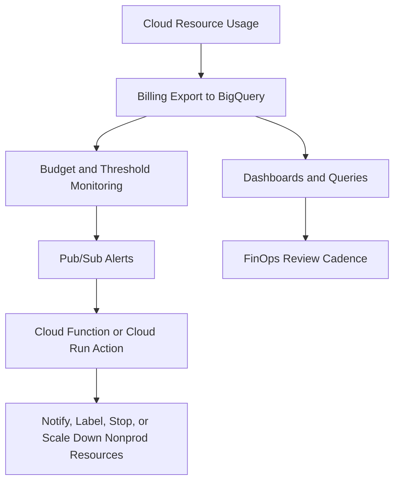

# Budgeting and Cost Management

> Scope: This guide covers billing setup, cost export, budget alerting, automated response, commitment strategy, labeling, and FinOps practices for Google Cloud.

## Cost Management Operating Model


## Billing Setup Step by Step
## Step 1: Identify or create the billing account
- Why this choice: A clear billing account structure is the base for budget ownership, invoice reconciliation, and cost export.
```bash
gcloud billing accounts list
gcloud alpha billing accounts projects list --billing-account=BILLING_ACCOUNT_ID
```
- Operational note: Use least-privilege service accounts for automation and separate prod from nonprod blast radius.

## Step 2: Link projects to the billing account
- Why this choice: Linking projects early prevents shadow spend and makes later export datasets more complete.
```bash
gcloud billing projects link prj-app-payments-prod-001 --billing-account=BILLING_ACCOUNT_ID
gcloud billing projects link prj-platform-net-prod-001 --billing-account=BILLING_ACCOUNT_ID
```
- Operational note: Use least-privilege service accounts for automation and separate prod from nonprod blast radius.

## Step 3: Create a BigQuery dataset for billing export
- Why this choice: BigQuery export is the most flexible way to analyze cost trends, labels, SKU usage, and anomalies over time.
```bash
bq --location=US mk --dataset prj-finops-core:billing_export
gcloud services enable bigquery.googleapis.com --project=prj-finops-core
```
- Operational note: Use least-privilege service accounts for automation and separate prod from nonprod blast radius.

## Step 4: Enable standard and detailed export from Cloud Billing
- Why this choice: The export configuration itself is often completed in the Billing UI, but the dataset and access model should be prepared like code-managed infrastructure.
```bash
gcloud beta billing accounts update BILLING_ACCOUNT_ID --display-name="Enterprise Billing"
```
- Operational note: Use least-privilege service accounts for automation and separate prod from nonprod blast radius.

## Step 5: Create budgets with thresholds
- Why this choice: Thresholds provide early warning, not just end-of-month regret. Include both current and forecasted rules.
```bash
gcloud beta billing budgets create --billing-account=BILLING_ACCOUNT_ID --display-name="prod-shared-budget" --budget-amount=5000USD --threshold-rule=percent=0.5,basis=current-spend --threshold-rule=percent=0.9,basis=forecasted-spend
```
- Operational note: Use least-privilege service accounts for automation and separate prod from nonprod blast radius.

## Step 6: Publish budget notifications to Pub/Sub
- Why this choice: Pub/Sub makes budget events machine-readable so teams can automate response rather than relying only on email.
```bash
gcloud pubsub topics create billing-budget-alerts --project=prj-finops-core
gcloud beta billing budgets update BUDGET_ID --billing-account=BILLING_ACCOUNT_ID --pubsub-topic=projects/prj-finops-core/topics/billing-budget-alerts
```
- Operational note: Use least-privilege service accounts for automation and separate prod from nonprod blast radius.

## Step 7: Attach an automated action service
- Why this choice: Automation is most useful for nonprod controls such as stopping idle environments or opening incidents, not for blindly touching production.
```bash
gcloud functions deploy budget-guardrail --gen2 --region=us-central1 --runtime=python312 --trigger-topic=billing-budget-alerts --entry-point=handle_budget_event --service-account=finops-automation@prj-finops-core.iam.gserviceaccount.com
```
- Operational note: Use least-privilege service accounts for automation and separate prod from nonprod blast radius.

## Step 8: Review and refine monthly
- Why this choice: FinOps is a continuous practice. Budgets without review loops quickly become background noise.
```bash
bq query --use_legacy_sql=false "SELECT service.description, SUM(cost) AS total_cost FROM `prj-finops-core.billing_export.gcp_billing_export_v1_*` GROUP BY 1 ORDER BY 2 DESC LIMIT 20"
```
- Operational note: Use least-privilege service accounts for automation and separate prod from nonprod blast radius.

## Example Cloud Function Automation Pattern
- Trigger: Budget threshold event on Pub/Sub.
- Action choices: open a ticket, notify Slack or email, add labels, stop nonprod MIGs, scale down dev GKE node pools, or disable a scheduled job.
- Caution: Never attach irreversible production actions to a budget event without explicit policy and tested exception handling.

## Commitment Strategy: CUD vs SUD vs Spot
| Option | Best fit | Strength | Watch item |
| --- | --- | --- | --- |
| Committed Use Discounts | Steady-state predictable workloads | Strong savings for committed baseline usage | Requires forecast confidence and active coverage tracking |
| Sustained Use Discounts | Organic always-on usage without explicit commitment | Automatic savings on eligible workloads | Usually lower than optimized commitment strategy |
| Spot VMs | Interruptible fault-tolerant workloads | Very low unit cost | Can be preempted so workload design must tolerate interruption |

## Labeling for Cost Allocation
- Use labels or tags such as `env`, `owner`, `cost-center`, `application`, `data-class`, and `criticality`.
- Keep label keys standardized so BigQuery queries do not have to normalize dozens of spelling variants.
- Make cost allocation labels mandatory for project creation pipelines and major billable resources such as GKE clusters, Cloud SQL instances, and storage buckets.
- Add periodic reporting for unlabeled spend so exceptions become visible quickly.

## Org Policy and Governance Support
- Use organization and folder controls to enforce approved regions, external IP restrictions, and service account key posture because poor governance usually leads to poor cost outcomes too.
- Require project factory workflows that attach billing account, labels, log export, and network standards before a project is handed to a team.
- Use quotas and policy review for expensive services to prevent accidental overprovisioning.
- Review IAM on billing export datasets because cost data often contains sensitive business information.

## Per-Service Cost Drivers
| Service area | Main cost drivers | Practical guidance |
| --- | --- | --- |
| Compute Engine families | vCPU, memory, machine family, GPU, attached disk, uptime pattern | Match machine family to workload profile and right-size continuously |
| Cloud Storage | Storage class, access frequency, retrieval, replication, lifecycle, network egress | Choose class by access behavior and use lifecycle early |
| Networking egress | Internet egress, inter-region traffic, external load balancer data path, hybrid transfer | Architect to minimize unnecessary cross-region chatter |
| GKE Standard | Node compute, management overhead, autoscaling behavior, add-on services | Best when you want more control and can optimize node utilization |
| GKE Autopilot | Pod-based billing and managed operational overhead reduction | Best when platform productivity matters more than lowest theoretical unit cost |
| Cloud SQL | Instance size, HA, storage, backup retention, IOPS profile, network usage | Right-size by environment and monitor growth so storage and HA are intentional |

## GKE Standard vs Autopilot Cost Framing
- GKE Standard can be cheaper at scale when platform teams actively optimize node shape, scheduling efficiency, and cluster operations.
- GKE Autopilot can be cheaper in total cost of ownership when team time, security defaults, and platform simplicity matter more than raw node-level tuning.
- Do not compare only the billing line item; compare people time, security effort, and delivery speed as well.

## FinOps Practices
- Establish a monthly review cadence covering spend, forecast, anomalies, commitment coverage, and top regressions.
- Create a single source of truth in BigQuery with repeatable queries for product, environment, and platform cost views.
- Track unit economics such as cost per transaction, per tenant, per environment, or per GB processed so engineering decisions tie back to business outcomes.
- Review idle resources weekly: unattached disks, unused IPs, stopped but billed assets, oversized clusters, and forgotten dev databases.
- Use rightsizing recommendations carefully and validate workload patterns before applying them to production.
- Treat labels and tags as contract fields required for financial accountability, not optional metadata.
- Design sandbox and nonprod expiration policies so temporary environments do not become permanent cost leaks.
- Pair budget alerts with human review and tested runbooks instead of hoping email alone changes behavior.

## Example BigQuery Questions to Ask Monthly
- Which services increased most month over month by absolute cost?
- Which unlabeled resources generated spend this period?
- Which projects exceed forecast relative to business milestones?
- How much of compute spend is covered by CUD and how much remains on-demand?
- Which environments have the highest idle or overnight utilization waste?
- How much network egress is cross-region and can architecture reduce it?

## Cost Review Checklist
- Check 1: Verify owner, business purpose, commitment fit, scaling behavior, deletion policy, and anomaly explanation for each significant cost change before approving next month forecasts.
- Check 2: Verify owner, business purpose, commitment fit, scaling behavior, deletion policy, and anomaly explanation for each significant cost change before approving next month forecasts.
- Check 3: Verify owner, business purpose, commitment fit, scaling behavior, deletion policy, and anomaly explanation for each significant cost change before approving next month forecasts.
- Check 4: Verify owner, business purpose, commitment fit, scaling behavior, deletion policy, and anomaly explanation for each significant cost change before approving next month forecasts.
- Check 5: Verify owner, business purpose, commitment fit, scaling behavior, deletion policy, and anomaly explanation for each significant cost change before approving next month forecasts.
- Check 6: Verify owner, business purpose, commitment fit, scaling behavior, deletion policy, and anomaly explanation for each significant cost change before approving next month forecasts.
- Check 7: Verify owner, business purpose, commitment fit, scaling behavior, deletion policy, and anomaly explanation for each significant cost change before approving next month forecasts.
- Check 8: Verify owner, business purpose, commitment fit, scaling behavior, deletion policy, and anomaly explanation for each significant cost change before approving next month forecasts.
- Check 9: Verify owner, business purpose, commitment fit, scaling behavior, deletion policy, and anomaly explanation for each significant cost change before approving next month forecasts.
- Check 10: Verify owner, business purpose, commitment fit, scaling behavior, deletion policy, and anomaly explanation for each significant cost change before approving next month forecasts.
- Check 11: Verify owner, business purpose, commitment fit, scaling behavior, deletion policy, and anomaly explanation for each significant cost change before approving next month forecasts.
- Check 12: Verify owner, business purpose, commitment fit, scaling behavior, deletion policy, and anomaly explanation for each significant cost change before approving next month forecasts.
- Check 13: Verify owner, business purpose, commitment fit, scaling behavior, deletion policy, and anomaly explanation for each significant cost change before approving next month forecasts.
- Check 14: Verify owner, business purpose, commitment fit, scaling behavior, deletion policy, and anomaly explanation for each significant cost change before approving next month forecasts.
- Check 15: Verify owner, business purpose, commitment fit, scaling behavior, deletion policy, and anomaly explanation for each significant cost change before approving next month forecasts.
- Check 16: Verify owner, business purpose, commitment fit, scaling behavior, deletion policy, and anomaly explanation for each significant cost change before approving next month forecasts.
- Check 17: Verify owner, business purpose, commitment fit, scaling behavior, deletion policy, and anomaly explanation for each significant cost change before approving next month forecasts.
- Check 18: Verify owner, business purpose, commitment fit, scaling behavior, deletion policy, and anomaly explanation for each significant cost change before approving next month forecasts.
- Check 19: Verify owner, business purpose, commitment fit, scaling behavior, deletion policy, and anomaly explanation for each significant cost change before approving next month forecasts.
- Check 20: Verify owner, business purpose, commitment fit, scaling behavior, deletion policy, and anomaly explanation for each significant cost change before approving next month forecasts.
- Check 21: Verify owner, business purpose, commitment fit, scaling behavior, deletion policy, and anomaly explanation for each significant cost change before approving next month forecasts.
- Check 22: Verify owner, business purpose, commitment fit, scaling behavior, deletion policy, and anomaly explanation for each significant cost change before approving next month forecasts.
- Check 23: Verify owner, business purpose, commitment fit, scaling behavior, deletion policy, and anomaly explanation for each significant cost change before approving next month forecasts.
- Check 24: Verify owner, business purpose, commitment fit, scaling behavior, deletion policy, and anomaly explanation for each significant cost change before approving next month forecasts.
- Check 25: Verify owner, business purpose, commitment fit, scaling behavior, deletion policy, and anomaly explanation for each significant cost change before approving next month forecasts.
- Check 26: Verify owner, business purpose, commitment fit, scaling behavior, deletion policy, and anomaly explanation for each significant cost change before approving next month forecasts.
- Check 27: Verify owner, business purpose, commitment fit, scaling behavior, deletion policy, and anomaly explanation for each significant cost change before approving next month forecasts.
- Check 28: Verify owner, business purpose, commitment fit, scaling behavior, deletion policy, and anomaly explanation for each significant cost change before approving next month forecasts.
- Check 29: Verify owner, business purpose, commitment fit, scaling behavior, deletion policy, and anomaly explanation for each significant cost change before approving next month forecasts.
- Check 30: Verify owner, business purpose, commitment fit, scaling behavior, deletion policy, and anomaly explanation for each significant cost change before approving next month forecasts.
- Check 31: Verify owner, business purpose, commitment fit, scaling behavior, deletion policy, and anomaly explanation for each significant cost change before approving next month forecasts.
- Check 32: Verify owner, business purpose, commitment fit, scaling behavior, deletion policy, and anomaly explanation for each significant cost change before approving next month forecasts.
- Check 33: Verify owner, business purpose, commitment fit, scaling behavior, deletion policy, and anomaly explanation for each significant cost change before approving next month forecasts.
- Check 34: Verify owner, business purpose, commitment fit, scaling behavior, deletion policy, and anomaly explanation for each significant cost change before approving next month forecasts.
- Check 35: Verify owner, business purpose, commitment fit, scaling behavior, deletion policy, and anomaly explanation for each significant cost change before approving next month forecasts.
- Check 36: Verify owner, business purpose, commitment fit, scaling behavior, deletion policy, and anomaly explanation for each significant cost change before approving next month forecasts.
- Check 37: Verify owner, business purpose, commitment fit, scaling behavior, deletion policy, and anomaly explanation for each significant cost change before approving next month forecasts.
- Check 38: Verify owner, business purpose, commitment fit, scaling behavior, deletion policy, and anomaly explanation for each significant cost change before approving next month forecasts.
- Check 39: Verify owner, business purpose, commitment fit, scaling behavior, deletion policy, and anomaly explanation for each significant cost change before approving next month forecasts.
- Check 40: Verify owner, business purpose, commitment fit, scaling behavior, deletion policy, and anomaly explanation for each significant cost change before approving next month forecasts.
- Check 41: Verify owner, business purpose, commitment fit, scaling behavior, deletion policy, and anomaly explanation for each significant cost change before approving next month forecasts.
- Check 42: Verify owner, business purpose, commitment fit, scaling behavior, deletion policy, and anomaly explanation for each significant cost change before approving next month forecasts.
- Check 43: Verify owner, business purpose, commitment fit, scaling behavior, deletion policy, and anomaly explanation for each significant cost change before approving next month forecasts.
- Check 44: Verify owner, business purpose, commitment fit, scaling behavior, deletion policy, and anomaly explanation for each significant cost change before approving next month forecasts.
- Check 45: Verify owner, business purpose, commitment fit, scaling behavior, deletion policy, and anomaly explanation for each significant cost change before approving next month forecasts.
- Check 46: Verify owner, business purpose, commitment fit, scaling behavior, deletion policy, and anomaly explanation for each significant cost change before approving next month forecasts.
- Check 47: Verify owner, business purpose, commitment fit, scaling behavior, deletion policy, and anomaly explanation for each significant cost change before approving next month forecasts.
- Check 48: Verify owner, business purpose, commitment fit, scaling behavior, deletion policy, and anomaly explanation for each significant cost change before approving next month forecasts.
- Check 49: Verify owner, business purpose, commitment fit, scaling behavior, deletion policy, and anomaly explanation for each significant cost change before approving next month forecasts.
- Check 50: Verify owner, business purpose, commitment fit, scaling behavior, deletion policy, and anomaly explanation for each significant cost change before approving next month forecasts.
- Check 51: Verify owner, business purpose, commitment fit, scaling behavior, deletion policy, and anomaly explanation for each significant cost change before approving next month forecasts.
- Check 52: Verify owner, business purpose, commitment fit, scaling behavior, deletion policy, and anomaly explanation for each significant cost change before approving next month forecasts.
- Check 53: Verify owner, business purpose, commitment fit, scaling behavior, deletion policy, and anomaly explanation for each significant cost change before approving next month forecasts.
- Check 54: Verify owner, business purpose, commitment fit, scaling behavior, deletion policy, and anomaly explanation for each significant cost change before approving next month forecasts.
- Check 55: Verify owner, business purpose, commitment fit, scaling behavior, deletion policy, and anomaly explanation for each significant cost change before approving next month forecasts.
- Check 56: Verify owner, business purpose, commitment fit, scaling behavior, deletion policy, and anomaly explanation for each significant cost change before approving next month forecasts.
- Check 57: Verify owner, business purpose, commitment fit, scaling behavior, deletion policy, and anomaly explanation for each significant cost change before approving next month forecasts.
- Check 58: Verify owner, business purpose, commitment fit, scaling behavior, deletion policy, and anomaly explanation for each significant cost change before approving next month forecasts.
- Check 59: Verify owner, business purpose, commitment fit, scaling behavior, deletion policy, and anomaly explanation for each significant cost change before approving next month forecasts.
- Check 60: Verify owner, business purpose, commitment fit, scaling behavior, deletion policy, and anomaly explanation for each significant cost change before approving next month forecasts.
- Check 61: Verify owner, business purpose, commitment fit, scaling behavior, deletion policy, and anomaly explanation for each significant cost change before approving next month forecasts.
- Check 62: Verify owner, business purpose, commitment fit, scaling behavior, deletion policy, and anomaly explanation for each significant cost change before approving next month forecasts.
- Check 63: Verify owner, business purpose, commitment fit, scaling behavior, deletion policy, and anomaly explanation for each significant cost change before approving next month forecasts.
- Check 64: Verify owner, business purpose, commitment fit, scaling behavior, deletion policy, and anomaly explanation for each significant cost change before approving next month forecasts.
- Check 65: Verify owner, business purpose, commitment fit, scaling behavior, deletion policy, and anomaly explanation for each significant cost change before approving next month forecasts.
- Check 66: Verify owner, business purpose, commitment fit, scaling behavior, deletion policy, and anomaly explanation for each significant cost change before approving next month forecasts.
- Check 67: Verify owner, business purpose, commitment fit, scaling behavior, deletion policy, and anomaly explanation for each significant cost change before approving next month forecasts.
- Check 68: Verify owner, business purpose, commitment fit, scaling behavior, deletion policy, and anomaly explanation for each significant cost change before approving next month forecasts.
- Check 69: Verify owner, business purpose, commitment fit, scaling behavior, deletion policy, and anomaly explanation for each significant cost change before approving next month forecasts.
- Check 70: Verify owner, business purpose, commitment fit, scaling behavior, deletion policy, and anomaly explanation for each significant cost change before approving next month forecasts.
- Check 71: Verify owner, business purpose, commitment fit, scaling behavior, deletion policy, and anomaly explanation for each significant cost change before approving next month forecasts.
- Check 72: Verify owner, business purpose, commitment fit, scaling behavior, deletion policy, and anomaly explanation for each significant cost change before approving next month forecasts.
- Check 73: Verify owner, business purpose, commitment fit, scaling behavior, deletion policy, and anomaly explanation for each significant cost change before approving next month forecasts.
- Check 74: Verify owner, business purpose, commitment fit, scaling behavior, deletion policy, and anomaly explanation for each significant cost change before approving next month forecasts.
- Check 75: Verify owner, business purpose, commitment fit, scaling behavior, deletion policy, and anomaly explanation for each significant cost change before approving next month forecasts.
- Check 76: Verify owner, business purpose, commitment fit, scaling behavior, deletion policy, and anomaly explanation for each significant cost change before approving next month forecasts.
- Check 77: Verify owner, business purpose, commitment fit, scaling behavior, deletion policy, and anomaly explanation for each significant cost change before approving next month forecasts.
- Check 78: Verify owner, business purpose, commitment fit, scaling behavior, deletion policy, and anomaly explanation for each significant cost change before approving next month forecasts.
- Check 79: Verify owner, business purpose, commitment fit, scaling behavior, deletion policy, and anomaly explanation for each significant cost change before approving next month forecasts.
- Check 80: Verify owner, business purpose, commitment fit, scaling behavior, deletion policy, and anomaly explanation for each significant cost change before approving next month forecasts.

### Practical note 1
- Intent: In this cost management scenario, prefer the smallest change that still reduce rework during later platform onboarding.
- Action: Confirm ownership, quota, and IAM assumptions before applying commands.
- Outcome: Teams can compare the planned state with the observed state and decide whether to proceed, pause, or roll back.

### Practical note 2
- Intent: In this cost management scenario, prefer the smallest change that still keep security and connectivity choices auditable.
- Action: Record the exact scope such as organization, folder, project, or VPC before rollout.
- Outcome: Teams can compare the planned state with the observed state and decide whether to proceed, pause, or roll back.

### Practical note 3
- Intent: In this cost management scenario, prefer the smallest change that still make automation inputs obvious to project teams.
- Action: Sequence changes so logging and monitoring are enabled before restrictive controls.
- Outcome: Teams can compare the planned state with the observed state and decide whether to proceed, pause, or roll back.

### Practical note 4
- Intent: In this cost management scenario, prefer the smallest change that still improve rollback options during change windows.
- Action: Prefer automation accounts over human identities for repeatable production changes.
- Outcome: Teams can compare the planned state with the observed state and decide whether to proceed, pause, or roll back.

### Practical note 5
- Intent: In this cost management scenario, prefer the smallest change that still separate platform ownership from application ownership.
- Action: Use tags, labels, and naming standards so downstream policy remains simple.
- Outcome: Teams can compare the planned state with the observed state and decide whether to proceed, pause, or roll back.

### Practical note 6
- Intent: In this cost management scenario, prefer the smallest change that still document approvals before enforcing policies at scale.
- Action: Review rollback steps and blast radius in the same change ticket as the implementation.
- Outcome: Teams can compare the planned state with the observed state and decide whether to proceed, pause, or roll back.

### Practical note 7
- Intent: In this cost management scenario, prefer the smallest change that still keep network and identity dependencies explicit.
- Action: Capture dependencies on DNS, routes, service identities, and firewall behavior.
- Outcome: Teams can compare the planned state with the observed state and decide whether to proceed, pause, or roll back.

### Practical note 8
- Intent: In this cost management scenario, prefer the smallest change that still lower the chance of cost surprises after rollout.
- Action: Retest from the expected source network instead of assuming central connectivity.
- Outcome: Teams can compare the planned state with the observed state and decide whether to proceed, pause, or roll back.

### Practical note 9
- Intent: In this cost management scenario, prefer the smallest change that still reduce rework during later platform onboarding.
- Action: Confirm ownership, quota, and IAM assumptions before applying commands.
- Outcome: Teams can compare the planned state with the observed state and decide whether to proceed, pause, or roll back.

### Practical note 10
- Intent: In this cost management scenario, prefer the smallest change that still keep security and connectivity choices auditable.
- Action: Record the exact scope such as organization, folder, project, or VPC before rollout.
- Outcome: Teams can compare the planned state with the observed state and decide whether to proceed, pause, or roll back.

### Practical note 11
- Intent: In this cost management scenario, prefer the smallest change that still make automation inputs obvious to project teams.
- Action: Sequence changes so logging and monitoring are enabled before restrictive controls.
- Outcome: Teams can compare the planned state with the observed state and decide whether to proceed, pause, or roll back.

### Practical note 12
- Intent: In this cost management scenario, prefer the smallest change that still improve rollback options during change windows.
- Action: Prefer automation accounts over human identities for repeatable production changes.
- Outcome: Teams can compare the planned state with the observed state and decide whether to proceed, pause, or roll back.

### Practical note 13
- Intent: In this cost management scenario, prefer the smallest change that still separate platform ownership from application ownership.
- Action: Use tags, labels, and naming standards so downstream policy remains simple.
- Outcome: Teams can compare the planned state with the observed state and decide whether to proceed, pause, or roll back.

### Practical note 14
- Intent: In this cost management scenario, prefer the smallest change that still document approvals before enforcing policies at scale.
- Action: Review rollback steps and blast radius in the same change ticket as the implementation.
- Outcome: Teams can compare the planned state with the observed state and decide whether to proceed, pause, or roll back.

### Practical note 15
- Intent: In this cost management scenario, prefer the smallest change that still keep network and identity dependencies explicit.
- Action: Capture dependencies on DNS, routes, service identities, and firewall behavior.
- Outcome: Teams can compare the planned state with the observed state and decide whether to proceed, pause, or roll back.

### Practical note 16
- Intent: In this cost management scenario, prefer the smallest change that still lower the chance of cost surprises after rollout.
- Action: Retest from the expected source network instead of assuming central connectivity.
- Outcome: Teams can compare the planned state with the observed state and decide whether to proceed, pause, or roll back.

### Practical note 17
- Intent: In this cost management scenario, prefer the smallest change that still reduce rework during later platform onboarding.
- Action: Confirm ownership, quota, and IAM assumptions before applying commands.
- Outcome: Teams can compare the planned state with the observed state and decide whether to proceed, pause, or roll back.

### Practical note 18
- Intent: In this cost management scenario, prefer the smallest change that still keep security and connectivity choices auditable.
- Action: Record the exact scope such as organization, folder, project, or VPC before rollout.
- Outcome: Teams can compare the planned state with the observed state and decide whether to proceed, pause, or roll back.

### Practical note 19
- Intent: In this cost management scenario, prefer the smallest change that still make automation inputs obvious to project teams.
- Action: Sequence changes so logging and monitoring are enabled before restrictive controls.
- Outcome: Teams can compare the planned state with the observed state and decide whether to proceed, pause, or roll back.

### Practical note 20
- Intent: In this cost management scenario, prefer the smallest change that still improve rollback options during change windows.
- Action: Prefer automation accounts over human identities for repeatable production changes.
- Outcome: Teams can compare the planned state with the observed state and decide whether to proceed, pause, or roll back.

### Practical note 21
- Intent: In this cost management scenario, prefer the smallest change that still separate platform ownership from application ownership.
- Action: Use tags, labels, and naming standards so downstream policy remains simple.
- Outcome: Teams can compare the planned state with the observed state and decide whether to proceed, pause, or roll back.

### Practical note 22
- Intent: In this cost management scenario, prefer the smallest change that still document approvals before enforcing policies at scale.
- Action: Review rollback steps and blast radius in the same change ticket as the implementation.
- Outcome: Teams can compare the planned state with the observed state and decide whether to proceed, pause, or roll back.

### Practical note 23
- Intent: In this cost management scenario, prefer the smallest change that still keep network and identity dependencies explicit.
- Action: Capture dependencies on DNS, routes, service identities, and firewall behavior.
- Outcome: Teams can compare the planned state with the observed state and decide whether to proceed, pause, or roll back.

### Practical note 24
- Intent: In this cost management scenario, prefer the smallest change that still lower the chance of cost surprises after rollout.
- Action: Retest from the expected source network instead of assuming central connectivity.
- Outcome: Teams can compare the planned state with the observed state and decide whether to proceed, pause, or roll back.

### Practical note 25
- Intent: In this cost management scenario, prefer the smallest change that still reduce rework during later platform onboarding.
- Action: Confirm ownership, quota, and IAM assumptions before applying commands.
- Outcome: Teams can compare the planned state with the observed state and decide whether to proceed, pause, or roll back.

### Practical note 26
- Intent: In this cost management scenario, prefer the smallest change that still keep security and connectivity choices auditable.
- Action: Record the exact scope such as organization, folder, project, or VPC before rollout.
- Outcome: Teams can compare the planned state with the observed state and decide whether to proceed, pause, or roll back.

### Practical note 27
- Intent: In this cost management scenario, prefer the smallest change that still make automation inputs obvious to project teams.
- Action: Sequence changes so logging and monitoring are enabled before restrictive controls.
- Outcome: Teams can compare the planned state with the observed state and decide whether to proceed, pause, or roll back.

### Practical note 28
- Intent: In this cost management scenario, prefer the smallest change that still improve rollback options during change windows.
- Action: Prefer automation accounts over human identities for repeatable production changes.
- Outcome: Teams can compare the planned state with the observed state and decide whether to proceed, pause, or roll back.

### Practical note 29
- Intent: In this cost management scenario, prefer the smallest change that still separate platform ownership from application ownership.
- Action: Use tags, labels, and naming standards so downstream policy remains simple.
- Outcome: Teams can compare the planned state with the observed state and decide whether to proceed, pause, or roll back.

### Practical note 30
- Intent: In this cost management scenario, prefer the smallest change that still document approvals before enforcing policies at scale.
- Action: Review rollback steps and blast radius in the same change ticket as the implementation.
- Outcome: Teams can compare the planned state with the observed state and decide whether to proceed, pause, or roll back.

### Practical note 31
- Intent: In this cost management scenario, prefer the smallest change that still keep network and identity dependencies explicit.
- Action: Capture dependencies on DNS, routes, service identities, and firewall behavior.
- Outcome: Teams can compare the planned state with the observed state and decide whether to proceed, pause, or roll back.

### Practical note 32
- Intent: In this cost management scenario, prefer the smallest change that still lower the chance of cost surprises after rollout.
- Action: Retest from the expected source network instead of assuming central connectivity.
- Outcome: Teams can compare the planned state with the observed state and decide whether to proceed, pause, or roll back.

### Practical note 33
- Intent: In this cost management scenario, prefer the smallest change that still reduce rework during later platform onboarding.
- Action: Confirm ownership, quota, and IAM assumptions before applying commands.
- Outcome: Teams can compare the planned state with the observed state and decide whether to proceed, pause, or roll back.

### Practical note 34
- Intent: In this cost management scenario, prefer the smallest change that still keep security and connectivity choices auditable.
- Action: Record the exact scope such as organization, folder, project, or VPC before rollout.
- Outcome: Teams can compare the planned state with the observed state and decide whether to proceed, pause, or roll back.

### Practical note 35
- Intent: In this cost management scenario, prefer the smallest change that still make automation inputs obvious to project teams.
- Action: Sequence changes so logging and monitoring are enabled before restrictive controls.
- Outcome: Teams can compare the planned state with the observed state and decide whether to proceed, pause, or roll back.

### Practical note 36
- Intent: In this cost management scenario, prefer the smallest change that still improve rollback options during change windows.
- Action: Prefer automation accounts over human identities for repeatable production changes.
- Outcome: Teams can compare the planned state with the observed state and decide whether to proceed, pause, or roll back.

### Practical note 37
- Intent: In this cost management scenario, prefer the smallest change that still separate platform ownership from application ownership.
- Action: Use tags, labels, and naming standards so downstream policy remains simple.
- Outcome: Teams can compare the planned state with the observed state and decide whether to proceed, pause, or roll back.

### Practical note 38
- Intent: In this cost management scenario, prefer the smallest change that still document approvals before enforcing policies at scale.
- Action: Review rollback steps and blast radius in the same change ticket as the implementation.
- Outcome: Teams can compare the planned state with the observed state and decide whether to proceed, pause, or roll back.

### Practical note 39
- Intent: In this cost management scenario, prefer the smallest change that still keep network and identity dependencies explicit.
- Action: Capture dependencies on DNS, routes, service identities, and firewall behavior.
- Outcome: Teams can compare the planned state with the observed state and decide whether to proceed, pause, or roll back.

### Practical note 40
- Intent: In this cost management scenario, prefer the smallest change that still lower the chance of cost surprises after rollout.
- Action: Retest from the expected source network instead of assuming central connectivity.
- Outcome: Teams can compare the planned state with the observed state and decide whether to proceed, pause, or roll back.

### Practical note 41
- Intent: In this cost management scenario, prefer the smallest change that still reduce rework during later platform onboarding.
- Action: Confirm ownership, quota, and IAM assumptions before applying commands.
- Outcome: Teams can compare the planned state with the observed state and decide whether to proceed, pause, or roll back.

### Practical note 42
- Intent: In this cost management scenario, prefer the smallest change that still keep security and connectivity choices auditable.
- Action: Record the exact scope such as organization, folder, project, or VPC before rollout.
- Outcome: Teams can compare the planned state with the observed state and decide whether to proceed, pause, or roll back.

### Practical note 43
- Intent: In this cost management scenario, prefer the smallest change that still make automation inputs obvious to project teams.
- Action: Sequence changes so logging and monitoring are enabled before restrictive controls.
- Outcome: Teams can compare the planned state with the observed state and decide whether to proceed, pause, or roll back.

### Practical note 44
- Intent: In this cost management scenario, prefer the smallest change that still improve rollback options during change windows.
- Action: Prefer automation accounts over human identities for repeatable production changes.
- Outcome: Teams can compare the planned state with the observed state and decide whether to proceed, pause, or roll back.

### Practical note 45
- Intent: In this cost management scenario, prefer the smallest change that still separate platform ownership from application ownership.
- Action: Use tags, labels, and naming standards so downstream policy remains simple.
- Outcome: Teams can compare the planned state with the observed state and decide whether to proceed, pause, or roll back.

### Practical note 46
- Intent: In this cost management scenario, prefer the smallest change that still document approvals before enforcing policies at scale.
- Action: Review rollback steps and blast radius in the same change ticket as the implementation.
- Outcome: Teams can compare the planned state with the observed state and decide whether to proceed, pause, or roll back.

### Practical note 47
- Intent: In this cost management scenario, prefer the smallest change that still keep network and identity dependencies explicit.
- Action: Capture dependencies on DNS, routes, service identities, and firewall behavior.
- Outcome: Teams can compare the planned state with the observed state and decide whether to proceed, pause, or roll back.

### Practical note 48
- Intent: In this cost management scenario, prefer the smallest change that still lower the chance of cost surprises after rollout.
- Action: Retest from the expected source network instead of assuming central connectivity.
- Outcome: Teams can compare the planned state with the observed state and decide whether to proceed, pause, or roll back.

### Practical note 49
- Intent: In this cost management scenario, prefer the smallest change that still reduce rework during later platform onboarding.
- Action: Confirm ownership, quota, and IAM assumptions before applying commands.
- Outcome: Teams can compare the planned state with the observed state and decide whether to proceed, pause, or roll back.

### Practical note 50
- Intent: In this cost management scenario, prefer the smallest change that still keep security and connectivity choices auditable.
- Action: Record the exact scope such as organization, folder, project, or VPC before rollout.
- Outcome: Teams can compare the planned state with the observed state and decide whether to proceed, pause, or roll back.

### Practical note 51
- Intent: In this cost management scenario, prefer the smallest change that still make automation inputs obvious to project teams.
- Action: Sequence changes so logging and monitoring are enabled before restrictive controls.
- Outcome: Teams can compare the planned state with the observed state and decide whether to proceed, pause, or roll back.

### Practical note 52
- Intent: In this cost management scenario, prefer the smallest change that still improve rollback options during change windows.
- Action: Prefer automation accounts over human identities for repeatable production changes.
- Outcome: Teams can compare the planned state with the observed state and decide whether to proceed, pause, or roll back.

### Practical note 53
- Intent: In this cost management scenario, prefer the smallest change that still separate platform ownership from application ownership.
- Action: Use tags, labels, and naming standards so downstream policy remains simple.
- Outcome: Teams can compare the planned state with the observed state and decide whether to proceed, pause, or roll back.

### Practical note 54
- Intent: In this cost management scenario, prefer the smallest change that still document approvals before enforcing policies at scale.
- Action: Review rollback steps and blast radius in the same change ticket as the implementation.
- Outcome: Teams can compare the planned state with the observed state and decide whether to proceed, pause, or roll back.

### Practical note 55
- Intent: In this cost management scenario, prefer the smallest change that still keep network and identity dependencies explicit.
- Action: Capture dependencies on DNS, routes, service identities, and firewall behavior.
- Outcome: Teams can compare the planned state with the observed state and decide whether to proceed, pause, or roll back.

### Practical note 56
- Intent: In this cost management scenario, prefer the smallest change that still lower the chance of cost surprises after rollout.
- Action: Retest from the expected source network instead of assuming central connectivity.
- Outcome: Teams can compare the planned state with the observed state and decide whether to proceed, pause, or roll back.

### Practical note 57
- Intent: In this cost management scenario, prefer the smallest change that still reduce rework during later platform onboarding.
- Action: Confirm ownership, quota, and IAM assumptions before applying commands.
- Outcome: Teams can compare the planned state with the observed state and decide whether to proceed, pause, or roll back.

### Practical note 58
- Intent: In this cost management scenario, prefer the smallest change that still keep security and connectivity choices auditable.
- Action: Record the exact scope such as organization, folder, project, or VPC before rollout.
- Outcome: Teams can compare the planned state with the observed state and decide whether to proceed, pause, or roll back.

### Practical note 59
- Intent: In this cost management scenario, prefer the smallest change that still make automation inputs obvious to project teams.
- Action: Sequence changes so logging and monitoring are enabled before restrictive controls.
- Outcome: Teams can compare the planned state with the observed state and decide whether to proceed, pause, or roll back.

### Practical note 60
- Intent: In this cost management scenario, prefer the smallest change that still improve rollback options during change windows.
- Action: Prefer automation accounts over human identities for repeatable production changes.
- Outcome: Teams can compare the planned state with the observed state and decide whether to proceed, pause, or roll back.

### Practical note 61
- Intent: In this cost management scenario, prefer the smallest change that still separate platform ownership from application ownership.
- Action: Use tags, labels, and naming standards so downstream policy remains simple.
- Outcome: Teams can compare the planned state with the observed state and decide whether to proceed, pause, or roll back.

### Practical note 62
- Intent: In this cost management scenario, prefer the smallest change that still document approvals before enforcing policies at scale.
- Action: Review rollback steps and blast radius in the same change ticket as the implementation.
- Outcome: Teams can compare the planned state with the observed state and decide whether to proceed, pause, or roll back.

### Practical note 63
- Intent: In this cost management scenario, prefer the smallest change that still keep network and identity dependencies explicit.
- Action: Capture dependencies on DNS, routes, service identities, and firewall behavior.
- Outcome: Teams can compare the planned state with the observed state and decide whether to proceed, pause, or roll back.

### Practical note 64
- Intent: In this cost management scenario, prefer the smallest change that still lower the chance of cost surprises after rollout.
- Action: Retest from the expected source network instead of assuming central connectivity.
- Outcome: Teams can compare the planned state with the observed state and decide whether to proceed, pause, or roll back.

### Practical note 65
- Intent: In this cost management scenario, prefer the smallest change that still reduce rework during later platform onboarding.
- Action: Confirm ownership, quota, and IAM assumptions before applying commands.
- Outcome: Teams can compare the planned state with the observed state and decide whether to proceed, pause, or roll back.

### Practical note 66
- Intent: In this cost management scenario, prefer the smallest change that still keep security and connectivity choices auditable.
- Action: Record the exact scope such as organization, folder, project, or VPC before rollout.
- Outcome: Teams can compare the planned state with the observed state and decide whether to proceed, pause, or roll back.

### Practical note 67
- Intent: In this cost management scenario, prefer the smallest change that still make automation inputs obvious to project teams.
- Action: Sequence changes so logging and monitoring are enabled before restrictive controls.
- Outcome: Teams can compare the planned state with the observed state and decide whether to proceed, pause, or roll back.

### Practical note 68
- Intent: In this cost management scenario, prefer the smallest change that still improve rollback options during change windows.
- Action: Prefer automation accounts over human identities for repeatable production changes.
- Outcome: Teams can compare the planned state with the observed state and decide whether to proceed, pause, or roll back.

### Practical note 69
- Intent: In this cost management scenario, prefer the smallest change that still separate platform ownership from application ownership.
- Action: Use tags, labels, and naming standards so downstream policy remains simple.
- Outcome: Teams can compare the planned state with the observed state and decide whether to proceed, pause, or roll back.

### Practical note 70
- Intent: In this cost management scenario, prefer the smallest change that still document approvals before enforcing policies at scale.
- Action: Review rollback steps and blast radius in the same change ticket as the implementation.
- Outcome: Teams can compare the planned state with the observed state and decide whether to proceed, pause, or roll back.

### Practical note 71
- Intent: In this cost management scenario, prefer the smallest change that still keep network and identity dependencies explicit.
- Action: Capture dependencies on DNS, routes, service identities, and firewall behavior.
- Outcome: Teams can compare the planned state with the observed state and decide whether to proceed, pause, or roll back.

### Practical note 72
- Intent: In this cost management scenario, prefer the smallest change that still lower the chance of cost surprises after rollout.
- Action: Retest from the expected source network instead of assuming central connectivity.
- Outcome: Teams can compare the planned state with the observed state and decide whether to proceed, pause, or roll back.

### Practical note 73
- Intent: In this cost management scenario, prefer the smallest change that still reduce rework during later platform onboarding.
- Action: Confirm ownership, quota, and IAM assumptions before applying commands.
- Outcome: Teams can compare the planned state with the observed state and decide whether to proceed, pause, or roll back.

### Practical note 74
- Intent: In this cost management scenario, prefer the smallest change that still keep security and connectivity choices auditable.
- Action: Record the exact scope such as organization, folder, project, or VPC before rollout.
- Outcome: Teams can compare the planned state with the observed state and decide whether to proceed, pause, or roll back.

### Practical note 75
- Intent: In this cost management scenario, prefer the smallest change that still make automation inputs obvious to project teams.
- Action: Sequence changes so logging and monitoring are enabled before restrictive controls.
- Outcome: Teams can compare the planned state with the observed state and decide whether to proceed, pause, or roll back.

### Practical note 76
- Intent: In this cost management scenario, prefer the smallest change that still improve rollback options during change windows.
- Action: Prefer automation accounts over human identities for repeatable production changes.
- Outcome: Teams can compare the planned state with the observed state and decide whether to proceed, pause, or roll back.

### Practical note 77
- Intent: In this cost management scenario, prefer the smallest change that still separate platform ownership from application ownership.
- Action: Use tags, labels, and naming standards so downstream policy remains simple.
- Outcome: Teams can compare the planned state with the observed state and decide whether to proceed, pause, or roll back.

### Practical note 78
- Intent: In this cost management scenario, prefer the smallest change that still document approvals before enforcing policies at scale.
- Action: Review rollback steps and blast radius in the same change ticket as the implementation.
- Outcome: Teams can compare the planned state with the observed state and decide whether to proceed, pause, or roll back.

### Practical note 79
- Intent: In this cost management scenario, prefer the smallest change that still keep network and identity dependencies explicit.
- Action: Capture dependencies on DNS, routes, service identities, and firewall behavior.
- Outcome: Teams can compare the planned state with the observed state and decide whether to proceed, pause, or roll back.

### Practical note 80
- Intent: In this cost management scenario, prefer the smallest change that still lower the chance of cost surprises after rollout.
- Action: Retest from the expected source network instead of assuming central connectivity.
- Outcome: Teams can compare the planned state with the observed state and decide whether to proceed, pause, or roll back.

### Practical note 81
- Intent: In this cost management scenario, prefer the smallest change that still reduce rework during later platform onboarding.
- Action: Confirm ownership, quota, and IAM assumptions before applying commands.
- Outcome: Teams can compare the planned state with the observed state and decide whether to proceed, pause, or roll back.

### Practical note 82
- Intent: In this cost management scenario, prefer the smallest change that still keep security and connectivity choices auditable.
- Action: Record the exact scope such as organization, folder, project, or VPC before rollout.
- Outcome: Teams can compare the planned state with the observed state and decide whether to proceed, pause, or roll back.

### Practical note 83
- Intent: In this cost management scenario, prefer the smallest change that still make automation inputs obvious to project teams.
- Action: Sequence changes so logging and monitoring are enabled before restrictive controls.
- Outcome: Teams can compare the planned state with the observed state and decide whether to proceed, pause, or roll back.

### Practical note 84
- Intent: In this cost management scenario, prefer the smallest change that still improve rollback options during change windows.
- Action: Prefer automation accounts over human identities for repeatable production changes.
- Outcome: Teams can compare the planned state with the observed state and decide whether to proceed, pause, or roll back.

### Practical note 85
- Intent: In this cost management scenario, prefer the smallest change that still separate platform ownership from application ownership.
- Action: Use tags, labels, and naming standards so downstream policy remains simple.
- Outcome: Teams can compare the planned state with the observed state and decide whether to proceed, pause, or roll back.

### Practical note 86
- Intent: In this cost management scenario, prefer the smallest change that still document approvals before enforcing policies at scale.
- Action: Review rollback steps and blast radius in the same change ticket as the implementation.
- Outcome: Teams can compare the planned state with the observed state and decide whether to proceed, pause, or roll back.

### Practical note 87
- Intent: In this cost management scenario, prefer the smallest change that still keep network and identity dependencies explicit.
- Action: Capture dependencies on DNS, routes, service identities, and firewall behavior.
- Outcome: Teams can compare the planned state with the observed state and decide whether to proceed, pause, or roll back.

### Practical note 88
- Intent: In this cost management scenario, prefer the smallest change that still lower the chance of cost surprises after rollout.
- Action: Retest from the expected source network instead of assuming central connectivity.
- Outcome: Teams can compare the planned state with the observed state and decide whether to proceed, pause, or roll back.

### Practical note 89
- Intent: In this cost management scenario, prefer the smallest change that still reduce rework during later platform onboarding.
- Action: Confirm ownership, quota, and IAM assumptions before applying commands.
- Outcome: Teams can compare the planned state with the observed state and decide whether to proceed, pause, or roll back.

### Practical note 90
- Intent: In this cost management scenario, prefer the smallest change that still keep security and connectivity choices auditable.
- Action: Record the exact scope such as organization, folder, project, or VPC before rollout.
- Outcome: Teams can compare the planned state with the observed state and decide whether to proceed, pause, or roll back.

### Practical note 91
- Intent: In this cost management scenario, prefer the smallest change that still make automation inputs obvious to project teams.
- Action: Sequence changes so logging and monitoring are enabled before restrictive controls.
- Outcome: Teams can compare the planned state with the observed state and decide whether to proceed, pause, or roll back.

### Practical note 92
- Intent: In this cost management scenario, prefer the smallest change that still improve rollback options during change windows.
- Action: Prefer automation accounts over human identities for repeatable production changes.
- Outcome: Teams can compare the planned state with the observed state and decide whether to proceed, pause, or roll back.

### Practical note 93
- Intent: In this cost management scenario, prefer the smallest change that still separate platform ownership from application ownership.
- Action: Use tags, labels, and naming standards so downstream policy remains simple.
- Outcome: Teams can compare the planned state with the observed state and decide whether to proceed, pause, or roll back.

### Practical note 94
- Intent: In this cost management scenario, prefer the smallest change that still document approvals before enforcing policies at scale.
- Action: Review rollback steps and blast radius in the same change ticket as the implementation.
- Outcome: Teams can compare the planned state with the observed state and decide whether to proceed, pause, or roll back.

### Practical note 95
- Intent: In this cost management scenario, prefer the smallest change that still keep network and identity dependencies explicit.
- Action: Capture dependencies on DNS, routes, service identities, and firewall behavior.
- Outcome: Teams can compare the planned state with the observed state and decide whether to proceed, pause, or roll back.

### Practical note 96
- Intent: In this cost management scenario, prefer the smallest change that still lower the chance of cost surprises after rollout.
- Action: Retest from the expected source network instead of assuming central connectivity.
- Outcome: Teams can compare the planned state with the observed state and decide whether to proceed, pause, or roll back.

### Practical note 97
- Intent: In this cost management scenario, prefer the smallest change that still reduce rework during later platform onboarding.
- Action: Confirm ownership, quota, and IAM assumptions before applying commands.
- Outcome: Teams can compare the planned state with the observed state and decide whether to proceed, pause, or roll back.

### Practical note 98
- Intent: In this cost management scenario, prefer the smallest change that still keep security and connectivity choices auditable.
- Action: Record the exact scope such as organization, folder, project, or VPC before rollout.
- Outcome: Teams can compare the planned state with the observed state and decide whether to proceed, pause, or roll back.

### Practical note 99
- Intent: In this cost management scenario, prefer the smallest change that still make automation inputs obvious to project teams.
- Action: Sequence changes so logging and monitoring are enabled before restrictive controls.
- Outcome: Teams can compare the planned state with the observed state and decide whether to proceed, pause, or roll back.

### Practical note 100
- Intent: In this cost management scenario, prefer the smallest change that still improve rollback options during change windows.
- Action: Prefer automation accounts over human identities for repeatable production changes.
- Outcome: Teams can compare the planned state with the observed state and decide whether to proceed, pause, or roll back.

### Practical note 101
- Intent: In this cost management scenario, prefer the smallest change that still separate platform ownership from application ownership.
- Action: Use tags, labels, and naming standards so downstream policy remains simple.
- Outcome: Teams can compare the planned state with the observed state and decide whether to proceed, pause, or roll back.

### Practical note 102
- Intent: In this cost management scenario, prefer the smallest change that still document approvals before enforcing policies at scale.
- Action: Review rollback steps and blast radius in the same change ticket as the implementation.
- Outcome: Teams can compare the planned state with the observed state and decide whether to proceed, pause, or roll back.

### Practical note 103
- Intent: In this cost management scenario, prefer the smallest change that still keep network and identity dependencies explicit.
- Action: Capture dependencies on DNS, routes, service identities, and firewall behavior.
- Outcome: Teams can compare the planned state with the observed state and decide whether to proceed, pause, or roll back.

### Practical note 104
- Intent: In this cost management scenario, prefer the smallest change that still lower the chance of cost surprises after rollout.
- Action: Retest from the expected source network instead of assuming central connectivity.
- Outcome: Teams can compare the planned state with the observed state and decide whether to proceed, pause, or roll back.

### Practical note 105
- Intent: In this cost management scenario, prefer the smallest change that still reduce rework during later platform onboarding.
- Action: Confirm ownership, quota, and IAM assumptions before applying commands.
- Outcome: Teams can compare the planned state with the observed state and decide whether to proceed, pause, or roll back.

### Practical note 106
- Intent: In this cost management scenario, prefer the smallest change that still keep security and connectivity choices auditable.
- Action: Record the exact scope such as organization, folder, project, or VPC before rollout.
- Outcome: Teams can compare the planned state with the observed state and decide whether to proceed, pause, or roll back.

### Practical note 107
- Intent: In this cost management scenario, prefer the smallest change that still make automation inputs obvious to project teams.
- Action: Sequence changes so logging and monitoring are enabled before restrictive controls.
- Outcome: Teams can compare the planned state with the observed state and decide whether to proceed, pause, or roll back.

### Practical note 108
- Intent: In this cost management scenario, prefer the smallest change that still improve rollback options during change windows.
- Action: Prefer automation accounts over human identities for repeatable production changes.
- Outcome: Teams can compare the planned state with the observed state and decide whether to proceed, pause, or roll back.

### Practical note 109
- Intent: In this cost management scenario, prefer the smallest change that still separate platform ownership from application ownership.
- Action: Use tags, labels, and naming standards so downstream policy remains simple.
- Outcome: Teams can compare the planned state with the observed state and decide whether to proceed, pause, or roll back.

### Practical note 110
- Intent: In this cost management scenario, prefer the smallest change that still document approvals before enforcing policies at scale.
- Action: Review rollback steps and blast radius in the same change ticket as the implementation.
- Outcome: Teams can compare the planned state with the observed state and decide whether to proceed, pause, or roll back.

### Practical note 111
- Intent: In this cost management scenario, prefer the smallest change that still keep network and identity dependencies explicit.
- Action: Capture dependencies on DNS, routes, service identities, and firewall behavior.
- Outcome: Teams can compare the planned state with the observed state and decide whether to proceed, pause, or roll back.

### Practical note 112
- Intent: In this cost management scenario, prefer the smallest change that still lower the chance of cost surprises after rollout.
- Action: Retest from the expected source network instead of assuming central connectivity.
- Outcome: Teams can compare the planned state with the observed state and decide whether to proceed, pause, or roll back.

### Practical note 113
- Intent: In this cost management scenario, prefer the smallest change that still reduce rework during later platform onboarding.
- Action: Confirm ownership, quota, and IAM assumptions before applying commands.
- Outcome: Teams can compare the planned state with the observed state and decide whether to proceed, pause, or roll back.

### Practical note 114
- Intent: In this cost management scenario, prefer the smallest change that still keep security and connectivity choices auditable.
- Action: Record the exact scope such as organization, folder, project, or VPC before rollout.
- Outcome: Teams can compare the planned state with the observed state and decide whether to proceed, pause, or roll back.

### Practical note 115
- Intent: In this cost management scenario, prefer the smallest change that still make automation inputs obvious to project teams.
- Action: Sequence changes so logging and monitoring are enabled before restrictive controls.
- Outcome: Teams can compare the planned state with the observed state and decide whether to proceed, pause, or roll back.

### Practical note 116
- Intent: In this cost management scenario, prefer the smallest change that still improve rollback options during change windows.
- Action: Prefer automation accounts over human identities for repeatable production changes.
- Outcome: Teams can compare the planned state with the observed state and decide whether to proceed, pause, or roll back.

### Practical note 117
- Intent: In this cost management scenario, prefer the smallest change that still separate platform ownership from application ownership.
- Action: Use tags, labels, and naming standards so downstream policy remains simple.
- Outcome: Teams can compare the planned state with the observed state and decide whether to proceed, pause, or roll back.

### Practical note 118
- Intent: In this cost management scenario, prefer the smallest change that still document approvals before enforcing policies at scale.
- Action: Review rollback steps and blast radius in the same change ticket as the implementation.
- Outcome: Teams can compare the planned state with the observed state and decide whether to proceed, pause, or roll back.

### Practical note 119
- Intent: In this cost management scenario, prefer the smallest change that still keep network and identity dependencies explicit.
- Action: Capture dependencies on DNS, routes, service identities, and firewall behavior.
- Outcome: Teams can compare the planned state with the observed state and decide whether to proceed, pause, or roll back.

### Practical note 120
- Intent: In this cost management scenario, prefer the smallest change that still lower the chance of cost surprises after rollout.
- Action: Retest from the expected source network instead of assuming central connectivity.
- Outcome: Teams can compare the planned state with the observed state and decide whether to proceed, pause, or roll back.

### Practical note 121
- Intent: In this cost management scenario, prefer the smallest change that still reduce rework during later platform onboarding.
- Action: Confirm ownership, quota, and IAM assumptions before applying commands.
- Outcome: Teams can compare the planned state with the observed state and decide whether to proceed, pause, or roll back.

### Practical note 122
- Intent: In this cost management scenario, prefer the smallest change that still keep security and connectivity choices auditable.
- Action: Record the exact scope such as organization, folder, project, or VPC before rollout.
- Outcome: Teams can compare the planned state with the observed state and decide whether to proceed, pause, or roll back.

### Practical note 123
- Intent: In this cost management scenario, prefer the smallest change that still make automation inputs obvious to project teams.
- Action: Sequence changes so logging and monitoring are enabled before restrictive controls.
- Outcome: Teams can compare the planned state with the observed state and decide whether to proceed, pause, or roll back.
