# Enterprise Architecture Planning for 10-50+ Applications on GCP

> Architect-level guide for planning landing zones, high-level design, governance, and cost across medium and large Google Cloud application portfolios.

**Audience:** enterprise architects, platform leads, security architects, SRE leaders, and FinOps teams.

**Official Google Cloud references**
- [Google Cloud Architecture Framework](https://cloud.google.com/architecture/framework)
- [Landing zones on Google Cloud](https://cloud.google.com/architecture/landing-zones)
- [Resource hierarchy](https://cloud.google.com/resource-manager/docs/cloud-platform-resource-hierarchy)
- [Shared VPC overview](https://cloud.google.com/vpc/docs/shared-vpc)
- [VPC Network Peering](https://cloud.google.com/vpc/docs/vpc-peering)
- [Cloud Build](https://cloud.google.com/build/docs/overview)
- [Organization Policy Service](https://cloud.google.com/resource-manager/docs/organization-policy/overview)
- [Pricing Calculator](https://cloud.google.com/products/calculator)

## Table of Contents

1. [Planning context and principles](#planning-context-and-principles)
2. [Customer needs assessment](#customer-needs-assessment)
3. [Landing zone architecture](#landing-zone-architecture)
4. [Resource planning](#resource-planning)
5. [High-Level Design (HLD)](#high-level-design-hld)
6. [Governance and compliance](#governance-and-compliance)
7. [Sizing and cost](#sizing-and-cost)
8. [Reference operating model](#reference-operating-model)
9. [Appendix: architecture review question bank](#appendix-architecture-review-question-bank)

## Planning context and principles

Architects must make a portfolio scalable before any single workload becomes optimized.

- Design once, standardize aggressively, and automate onboarding so the platform does not slow down at application 11, 25, or 60.
- Use folders, projects, IAM inheritance, and network topology to express business boundaries and operational ownership.
- Separate golden paths from exception paths so the review board only handles real exceptions.
- Choose the lowest-ops runtime that still satisfies business, security, and operational needs.
- Map every major design choice back to a service tier, risk profile, and cost model.

| Domain | Key architect question | Primary owner | Output |
| --- | --- | --- | --- |
| Business | Which applications materially affect revenue or compliance? | Enterprise architect | Service tier map |
| Platform | How will folders, projects, and Shared VPC scale? | Platform lead | Landing zone blueprint |
| Security | Which controls must be inherited globally? | Security architect | Control matrix |
| Operations | How will alerting, runbooks, and ownership work? | SRE lead | Operating model |
| Financial | How will budgets and commitments be owned? | FinOps lead | Spend model |

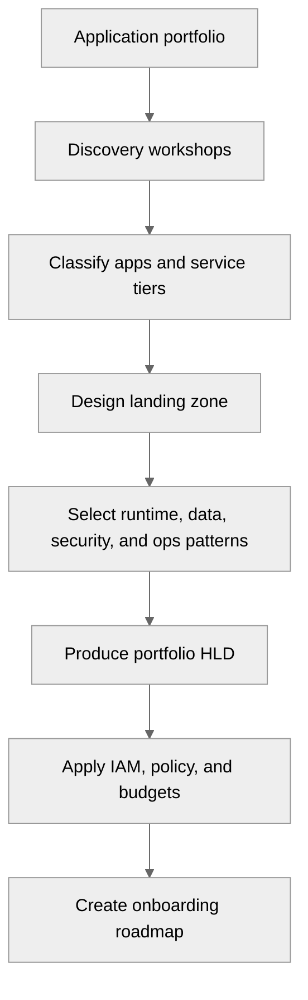

## Customer needs assessment

The assessment should turn business demand into repeatable architecture patterns.

### Requirements gathering

Use a single interview template across business, application, security, network, and support teams.

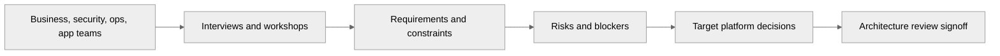

| Requirement type | Typical inputs | Architect output | Why it matters |
| --- | --- | --- | --- |
| Business outcomes | Growth, resiliency, modernization, exit timelines | Program scope and priorities | Prevents over-engineering |
| Application inventory | Owners, environments, runtimes, dependencies | Portfolio register | Drives wave planning |
| Operational targets | Availability, RTO, RPO, patch windows | Service tier model | Shapes runtime and DR |
| Security constraints | Residency, encryption, privileged access | Control map | Shapes folders and policy |
| Cost expectations | Budget ceilings and commitment appetite | FinOps baseline | Controls landing zone scale |

1. Capture the executive reason for the program: resilience, growth, cost, or data center exit.
2. Build the application register with owners, business windows, and dependency groups.
3. Interview product and support teams to gather non-functional requirements explicitly.
4. Translate compliance obligations into region, logging, and IAM design inputs.
5. Group applications into workload archetypes and onboarding waves.
6. Convert findings into service tiers and reusable reference patterns.

### Application classification

Classification is the only sustainable way to manage 10-50+ workloads.

| Tier | Business profile | RPO | RTO | Default resilience pattern | Typical GCP stack |
| --- | --- | --- | --- | --- | --- |
| Tier 0 | Executive, revenue-core, or safety-critical | Near-zero | Near-zero | Hot standby or active-active | Spanner, regional GKE, global LB |
| Tier 1 | Customer-facing core | < 15 min | < 1 hour | Warm standby or regional HA | GKE or MIG plus Cloud SQL HA |
| Tier 2 | Important internal or partner apps | < 4 hours | < 8 hours | Restore plus automation | Cloud Run or GCE with backups |
| Tier 3 | Departmental or batch | 1 day+ | 1 day+ | Backup restore | Functions, jobs, or small VMs |

| Attribute | Questions | Example values | Architecture impact |
| --- | --- | --- | --- |
| Data sensitivity | Does the app process regulated data? | Public, internal, confidential, restricted | Affects IAM, encryption, VPC SC |
| Latency | Is this real-time or asynchronous? | Sub-100ms, regional, batch | Affects region and caching |
| Runtime readiness | Can it run in containers? | VM only, container-ready, serverless-ready | Affects compute choice |
| Integration depth | How many dependencies exist? | ERP, MQ, LDAP, SaaS APIs | Affects wave order and network |
| Team maturity | Can the team operate Kubernetes? | Full, moderate, low-ops preferred | Affects GKE vs Cloud Run |

### SLA matrix

Use one portfolio-wide SLA vocabulary.

| Metric | Tier 0 | Tier 1 | Tier 2 | Tier 3 |
| --- | --- | --- | --- | --- |
| Availability objective | 99.99% | 99.95% | 99.9% | Best effort or 99.5% |
| Support model | 24x7 plus executive bridge | 24x7 | Business hours plus pager for major incidents | Business hours |
| Deployment pattern | Canary or blue-green | Rolling with rollback | Standard rolling | Simple replacement |
| DR test cadence | Quarterly | Semi-annual | Annual | As needed |
| Observability | Metrics, logs, traces, synthetics, business KPIs | Metrics, logs, traces | Metrics and logs | Basic health checks |

### Google Cloud Architecture Framework mapping

Use the framework as the common review language.

| Customer need | Architecture Framework pillar | Recommended GCP capabilities | Evidence artifact |
| --- | --- | --- | --- |
| Segregated environments | System design | Folders, projects, Shared VPC, IAM | Resource hierarchy blueprint |
| Centralized audit logging | Operational excellence and security | Cloud Logging, sinks, SCC | Audit policy |
| Low-latency global access | Reliability and performance | Global LB, CDN, Spanner or caching | Latency design |
| Controlled spend | Cost optimization | Budgets, labels, CUD planning | Cost baseline |
| Fast developer onboarding | Operational excellence | Terraform, Cloud Build, project factory | Golden-path runbook |

### Real-world portfolio examples

#### 10-application portfolio

- Two Shared VPC host projects: prod and non-prod.
- One shared CI/CD project, one centralized logging project, one security project.
- Three golden paths: VM, Cloud Run, and analytics pipeline.
- Service tiers usually collapse to Tier 1-3, with only one or two Tier 0 workloads.

#### 50+ application portfolio

- Folders by environment and business domain, with delegated domain administration.
- Multiple Shared VPC host projects or segmented host projects by region or domain.
- Formal exception management for special networking or residency needs.
- Golden paths for VM, GKE Standard, GKE Autopilot, Cloud Run, and data workloads.

**Official Google Cloud references**
- [Architecture Framework system design](https://cloud.google.com/architecture/framework/system-design/overview)
- [Decide resource hierarchy](https://cloud.google.com/architecture/landing-zones/decide-resource-hierarchy)
- [Cloud Adoption Framework](https://cloud.google.com/architecture/cloud-adoption-framework)

## Landing zone architecture

The landing zone is the platform skeleton that every application will inherit.

### GCP Organization, Folders, Projects hierarchy

Build for inheritance, budget clarity, and delegated administration.

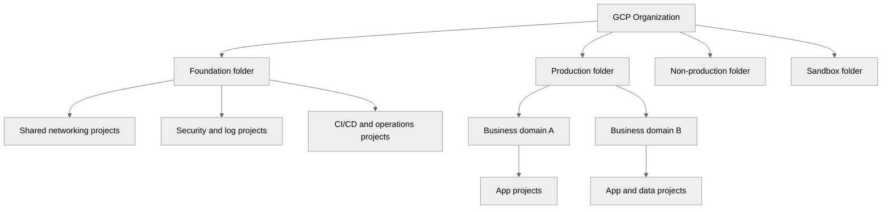

| Hierarchy level | Purpose | Typical controls | Delegated owner |
| --- | --- | --- | --- |
| Organization | Global policy and billing linkage | Key restrictions, allowed regions, domain restrictions | Central cloud admin |
| Folder | Environment or domain boundary | Inherited IAM and policy | Platform or domain lead |
| Project | Quota, billing, APIs, and workload isolation | Budgets, labels, service accounts | Application team |
| Resource | Runtime components | Least privilege, backup, encryption | Workload owner |

### Shared VPC vs VPC Peering

Shared VPC is usually the default enterprise answer; peering is often the exception answer.

| Decision factor | Shared VPC | VPC Peering | Architect guidance |
| --- | --- | --- | --- |
| Network ownership | Centralized | Distributed | Use Shared VPC when a platform team owns network standards |
| Scale for many applications | Excellent | Can become complex | Shared VPC usually wins for 50+ apps |
| Firewall governance | Central or hierarchical | Per-VPC | Shared VPC is easier to standardize |
| Merger or partner boundary | Not ideal alone | Useful | Peering fits isolated domains or temporary boundaries |
| Service project model | Native | Not applicable | Strong match for project-per-app patterns |

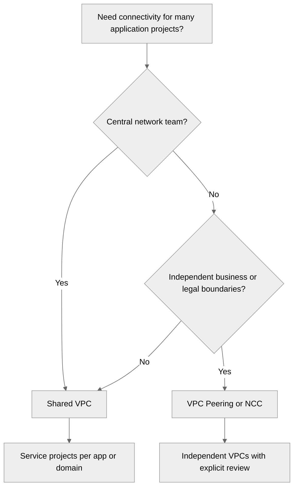

### Hub-and-spoke with Shared VPC

Hub-and-spoke works well when DNS, security, egress, and operations are shared services.

```mermaid
%%{init: {'theme': 'neutral'}}%%
flowchart LR
    subgraph Hub["Shared services hub"]
        DNS["Cloud DNS"]
        Ops["Cloud Monitoring and Logging"]
        Sec["SCC, KMS, Secret Manager"]
        CICD["Cloud Build and Artifact Registry"]
        Egress["Central egress"]
    end
    subgraph Host["Shared VPC host project"]
        Subnets["Regional subnets"]
        FW["Hierarchical firewall policies"]
        LB["Internal load balancers"]
    end
    subgraph Spoke1["Application service projects"]
        App1["Web and API"]
        App2["Batch and integration"]
    end
    subgraph Spoke2["Data and shared data projects"]
        Db["Cloud SQL, AlloyDB, Spanner"]
        Data["BigQuery and GCS"]
    end
    Hub --> Host
    Host --> Spoke1
    Host --> Spoke2
    Spoke1 --> Hub
    Spoke2 --> Hub
```

### Shared services catalog

Keep the list opinionated and supportable.

| Shared service | Role | Owner | Design note |
| --- | --- | --- | --- |
| Cloud DNS | Central private and public zones | Network team | Avoid fragmented DNS ownership |
| Cloud Identity | Groups and SSO | Identity team | Use groups, not direct user grants |
| Cloud Operations suite | Metrics, logs, traces, alerts | SRE/platform | Mandatory baseline |
| Artifact Registry | Container and package repositories | Platform engineering | Standard image source |
| Secret Manager | Secrets and cert material | Security/platform | No secrets in repo or VM metadata |
| Cloud KMS | CMEK and crypto controls | Security team | Apply where justified by policy |
| Cloud Build | CI/CD engine and policy checks | Platform engineering | Use for golden-path delivery |

### Project structure for 10 vs 50+ apps

| Design point | 10 apps | 50+ apps | Why it matters |
| --- | --- | --- | --- |
| Project model | Project per app per environment or small domain | Project per bounded context per environment | Drives IAM and quota boundaries |
| Host projects | Usually 2 | Often 2-6 | Keeps subnet and quota management manageable |
| Logging/security projects | One central pair | Central pair with regional variants where needed | Residency and retention controls |
| CI/CD projects | One shared project | One to three depending on boundaries | Pipeline isolation and trust |
| Folder depth | Shallow | Environment plus domain depth | Delegated administration |

| Example subnet | Region | CIDR example | Purpose | Environment |
| --- | --- | --- | --- | --- |
| dev-web-usc1-1 | us-central1 | 10.10.0.0/20 | Frontend and ingress | dev |
| dev-app-usc1-2 | us-central1 | 10.11.0.0/20 | Application tier | dev |
| dev-data-usc1-3 | us-central1 | 10.12.0.0/20 | Managed data access | dev |
| dev-integration-usc1-4 | us-central1 | 10.13.0.0/20 | Batch and ETL | dev |
| dev-mgmt-usc1-5 | us-central1 | 10.14.0.0/20 | Management and admin | dev |
| test-web-usc1-1 | us-central1 | 10.15.0.0/20 | Frontend and ingress | test |
| test-app-usc1-2 | us-central1 | 10.16.0.0/20 | Application tier | test |
| test-data-usc1-3 | us-central1 | 10.17.0.0/20 | Managed data access | test |
| test-integration-usc1-4 | us-central1 | 10.18.0.0/20 | Batch and ETL | test |
| test-mgmt-usc1-5 | us-central1 | 10.19.0.0/20 | Management and admin | test |
| stage-web-usc1-1 | us-central1 | 10.20.0.0/20 | Frontend and ingress | stage |
| stage-app-usc1-2 | us-central1 | 10.21.0.0/20 | Application tier | stage |
| stage-data-usc1-3 | us-central1 | 10.22.0.0/20 | Managed data access | stage |
| stage-integration-usc1-4 | us-central1 | 10.23.0.0/20 | Batch and ETL | stage |
| stage-mgmt-usc1-5 | us-central1 | 10.24.0.0/20 | Management and admin | stage |
| prod-web-usc1-1 | us-central1 | 10.25.0.0/20 | Frontend and ingress | prod |
| prod-app-usc1-2 | us-central1 | 10.26.0.0/20 | Application tier | prod |
| prod-data-usc1-3 | us-central1 | 10.27.0.0/20 | Managed data access | prod |
| prod-integration-usc1-4 | us-central1 | 10.28.0.0/20 | Batch and ETL | prod |
| prod-mgmt-usc1-5 | us-central1 | 10.29.0.0/20 | Management and admin | prod |

**Official Google Cloud references**
- [Shared VPC best practices](https://cloud.google.com/vpc/docs/shared-vpc#best_practices)
- [Hierarchical firewall policies](https://cloud.google.com/firewall/docs/firewall-policies)
- [Cloud DNS overview](https://cloud.google.com/dns/docs/overview)

## Resource planning

This is where architects translate requirements into runtime, database, storage, networking, identity, and observability decisions.

### Compute: Compute Engine vs GKE vs Cloud Run vs Cloud Functions vs App Engine

| Decision criterion | Compute Engine | GKE | Cloud Run | Cloud Functions | App Engine |
| --- | --- | --- | --- | --- | --- |
| Full OS control | High | Medium via nodes | Low | Low | Low |
| Container orchestration | None | Strong | Single-service containers | Event function model | Limited |
| Scale to zero | No | No | Yes | Yes | No |
| GPU/custom kernel | Yes | Yes | No | No | No |
| Operational overhead | Highest | High to medium | Low | Low | Low |
| Best fit | Legacy and appliances | Microservices and platform control | Stateless apps and APIs | Event glue | Managed web apps |

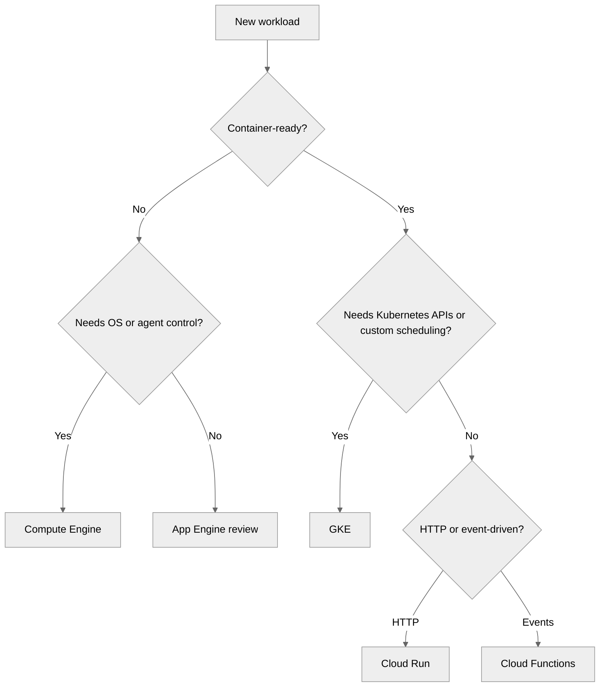

### Database: Cloud SQL vs Spanner vs Firestore vs Bigtable vs AlloyDB vs MemoryStore

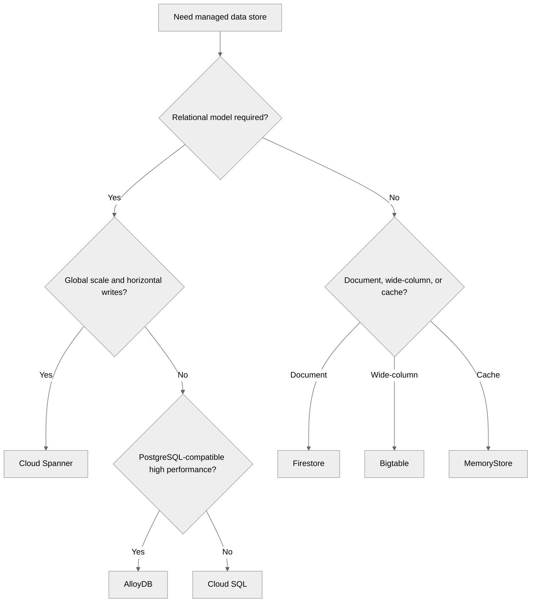

| Service | Choose when | Avoid when | Architect note |
| --- | --- | --- | --- |
| Cloud SQL | Traditional relational apps at moderate scale | Global write scale is needed | Fastest migration target for many apps |
| AlloyDB | PostgreSQL workloads needing high performance | MySQL-only or tiny workloads | Strong option for modern PostgreSQL estates |
| Spanner | Mission-critical global consistency and scale | Small simple apps | Premium capability with premium discipline |
| Firestore | Document apps and serverless backends | Heavy joins or rigid relational models | Excellent for digital product patterns |
| Bigtable | Massive throughput time-series or key-value | Transactional relational systems | Use only with clear access patterns |
| MemoryStore | Cache, sessions, queues | System of record | Acceleration layer only |

### Storage: Cloud Storage classes vs Persistent Disk vs Filestore

| Use case | Cloud Storage | Persistent Disk | Filestore | Guidance |
| --- | --- | --- | --- | --- |
| Object content and backups | Excellent | Poor | Poor | Default for durable objects |
| Single VM or node block storage | No | Excellent | No | Default for VM and GKE volumes |
| Shared POSIX file system | Limited | No | Excellent | Use Filestore when NFS semantics are needed |
| Analytics data lake | Excellent | No | No | Use GCS with lifecycle rules |
| Low-latency database or boot storage | No | Excellent | Conditional | Use pd-balanced, pd-ssd, or pd-extreme |

| Cloud Storage class | Best fit | Retrieval pattern | Cost signal |
| --- | --- | --- | --- |
| Standard | Frequent access content and data lakes | Immediate | Highest storage cost, low retrieval friction |
| Nearline | Monthly backups | Immediate with retrieval fees | Lower storage cost |
| Coldline | Quarterly access | Immediate with higher retrieval consideration | Lower storage cost |
| Archive | Compliance archives and DR copies | Immediate with highest retrieval considerations | Lowest storage cost |

### Networking: VPC design, firewall rules, Cloud Load Balancing vs Cloud CDN vs Cloud Armor

| Area | Default recommendation | Notes | Primary owner |
| --- | --- | --- | --- |
| VPC model | Shared VPC for enterprise golden path | Use Peering/NCC for exceptions | Platform network team |
| Ingress | Global Application Load Balancer for public web and APIs | Add Cloud Armor and CDN where useful | Platform network team |
| Egress | Centralized for regulated estates | Make DNS and NAT ownership explicit | Platform network team |
| Firewalling | Hierarchical baseline plus project rules | Avoid one-off broad allow rules | Network/security |
| Private access | Private Google Access and PSC as baseline | Reduces public exposure | Network team |

### Identity: Cloud IAM, Workload Identity, Service Accounts

| Capability | Recommended service | Pattern | Architect note |
| --- | --- | --- | --- |
| Human access | Cloud IAM plus Cloud Identity groups | Group-based least privilege | Avoid direct user grants |
| Workload-to-service auth | Service Accounts and Workload Identity Federation | Short-lived credentials | Avoid keys |
| Admin access to private apps | IAP | Identity-aware access | Reduces bastions and VPN sprawl |
| Secrets | Secret Manager | Reference secrets at runtime | Rotate and audit |

### Monitoring: Cloud Monitoring, Cloud Logging, Cloud Trace, Error Reporting

| Telemetry layer | Service | Mandatory baseline | Team action |
| --- | --- | --- | --- |
| Metrics | Cloud Monitoring | Golden signal dashboards and alerts | Adopt service templates |
| Logs | Cloud Logging | Structured logs and audit sinks | Route to SIEM if needed |
| Traces | Cloud Trace | Trace critical APIs and workflows | Instrument early |
| Errors | Error Reporting | Capture uncaught exceptions | Link to on-call |
| Uptime checks | Cloud Monitoring | Public and internal checks | Verify SLA targets |

### Application archetype planning cards

Use these archetypes to standardize onboarding.

#### Archetype 1: Public web storefront

- **Recommended compute:** Cloud Run or GKE
- **Primary data platform:** Cloud SQL or AlloyDB
- **Default controls:** Global LB, CDN, Cloud Armor
- **Architect review points:** service tier, network exposure, dependency latency, backup model, and observability template.

#### Archetype 2: Internal HR portal

- **Recommended compute:** Cloud Run or App Engine
- **Primary data platform:** Cloud SQL
- **Default controls:** Internal LB, IAP, private DNS
- **Architect review points:** service tier, network exposure, dependency latency, backup model, and observability template.

#### Archetype 3: Legacy ERP adapter

- **Recommended compute:** Compute Engine
- **Primary data platform:** Cloud SQL
- **Default controls:** Shared VPC and hybrid connectivity
- **Architect review points:** service tier, network exposure, dependency latency, backup model, and observability template.

#### Archetype 4: Payments API

- **Recommended compute:** GKE or Cloud Run
- **Primary data platform:** Spanner or AlloyDB
- **Default controls:** Tier 0 controls and WAF
- **Architect review points:** service tier, network exposure, dependency latency, backup model, and observability template.

#### Archetype 5: Batch invoicing

- **Recommended compute:** Cloud Run jobs or VMs
- **Primary data platform:** GCS
- **Default controls:** Scheduler, logging, alerts
- **Architect review points:** service tier, network exposure, dependency latency, backup model, and observability template.

#### Archetype 6: Real-time event processor

- **Recommended compute:** Cloud Run or GKE
- **Primary data platform:** Bigtable or Pub/Sub + GCS
- **Default controls:** Autoscaling and traceability
- **Architect review points:** service tier, network exposure, dependency latency, backup model, and observability template.

#### Archetype 7: Mobile backend

- **Recommended compute:** Cloud Run
- **Primary data platform:** Firestore
- **Default controls:** Serverless-first controls
- **Architect review points:** service tier, network exposure, dependency latency, backup model, and observability template.

#### Archetype 8: ML inference API

- **Recommended compute:** GKE or GCE
- **Primary data platform:** MemoryStore and object storage
- **Default controls:** GPU review if needed
- **Architect review points:** service tier, network exposure, dependency latency, backup model, and observability template.

#### Archetype 9: File exchange gateway

- **Recommended compute:** Compute Engine or GKE
- **Primary data platform:** GCS
- **Default controls:** Partner connectivity and audit
- **Architect review points:** service tier, network exposure, dependency latency, backup model, and observability template.

#### Archetype 10: Analytics ingestion

- **Recommended compute:** Dataflow plus GCS
- **Primary data platform:** BigQuery
- **Default controls:** Separate data projects and CMEK review
- **Architect review points:** service tier, network exposure, dependency latency, backup model, and observability template.

**Official Google Cloud references**
- [Choose a compute option](https://cloud.google.com/docs/get-started/choose-compute-option)
- [Cloud SQL overview](https://cloud.google.com/sql/docs/mysql/introduction)
- [AlloyDB overview](https://cloud.google.com/alloydb/docs/overview)
- [Cloud Spanner overview](https://cloud.google.com/spanner/docs/overview)
- [Cloud Monitoring overview](https://cloud.google.com/monitoring/docs/monitoring-overview)

## High-Level Design (HLD)

The HLD should show how the full portfolio hangs together, not only how one app works.

### Multi-tier for 10 apps

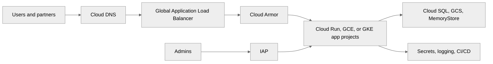

### Enterprise for 50+ apps

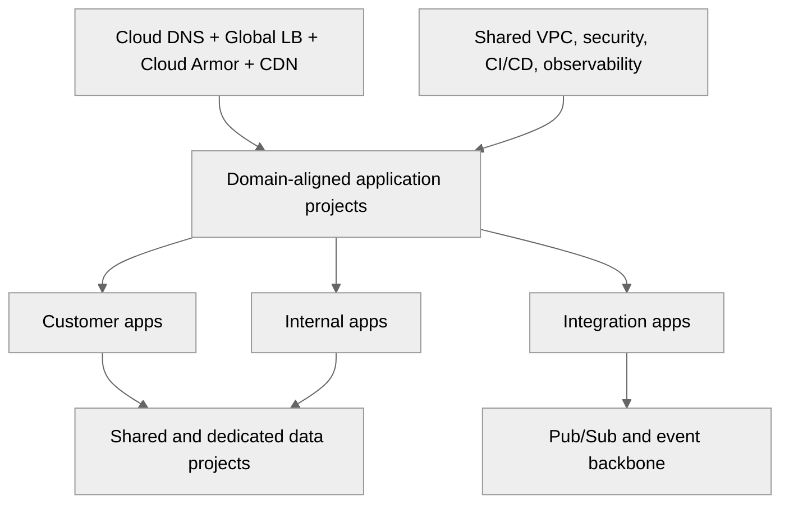

### Multi-region DR

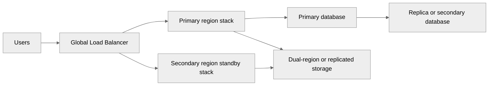

### CI/CD with Cloud Build

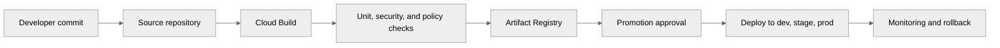

### Security layers: Cloud Armor, VPC SC, IAP, Secret Manager

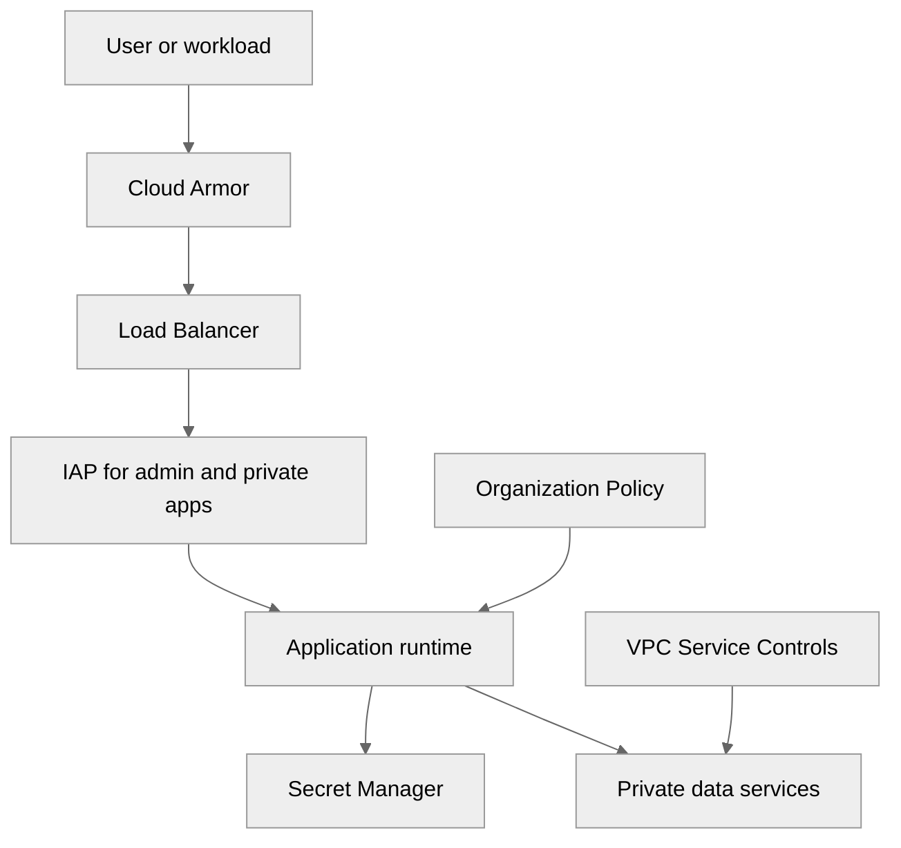

| HLD layer | Primary services | Scope | Architect note |
| --- | --- | --- | --- |
| Edge | Cloud DNS, LB, Cloud Armor, CDN | Public entry point | Global front door |
| Runtime | Cloud Run, GKE, Compute Engine, App Engine | Application execution | Golden path by workload type |
| Data | Cloud SQL, AlloyDB, Spanner, Firestore, Bigtable, GCS | Persistence | Separate where governance needs it |
| Integration | Pub/Sub, Eventarc, Dataflow, VPN or Interconnect | Domain integration | Prefer decoupling |
| Security | IAM, Secret Manager, KMS, SCC, IAP, Armor | Every tier | Central guardrails plus delegation |
| Operations | Monitoring, Logging, Trace, Error Reporting | Every workload | Mandatory baseline |

1. Start the HLD with business capabilities and service tiers before naming subnets or machine types.
2. Show ingress, egress, and admin access separately because they have different controls.
3. Make shared services explicit so ownership is visible on the diagram.
4. Label which systems are active-active, active-passive, or restore-only.
5. Map each HLD component back to a reference pattern and service tier.

**Official Google Cloud references**
- [Cloud Armor overview](https://cloud.google.com/armor/docs/overview)
- [VPC Service Controls](https://cloud.google.com/vpc-service-controls/docs/overview)
- [Identity-Aware Proxy](https://cloud.google.com/iap/docs/concepts-overview)
- [Secret Manager](https://cloud.google.com/secret-manager/docs/overview)

## Governance and compliance

Governance should be automated, measurable, and easy to audit.

### Organization Policies

| Policy constraint | Scope | Reason | Guidance |
| --- | --- | --- | --- |
| constraints/iam.disableServiceAccountKeyCreation | All folders | Prevent long-lived keys | Exceptions only by review |
| constraints/compute.requireOsLogin | Prod and non-prod | Standardize VM admin access | Use IAM instead of SSH key drift |
| constraints/gcp.resourceLocations | Regulated folders | Enforce residency | Map to compliance obligations |
| constraints/sql.restrictPublicIp | Production | Keep databases private | Use private IP and PSC |
| constraints/compute.vmExternalIpAccess | Production | Avoid public IP sprawl | Use LB or IAP |
| constraints/storage.uniformBucketLevelAccess | Organization | Standardize access control | Simplifies IAM |

### Resource hierarchy and IAM inheritance

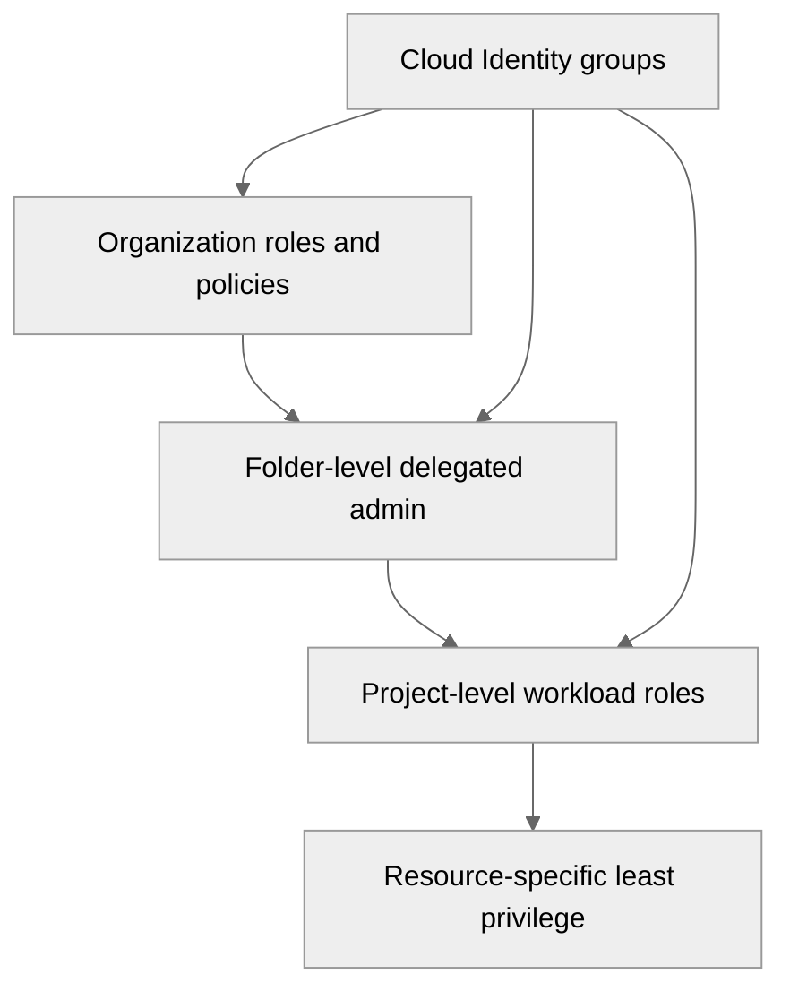

| IAM layer | Examples | Best practice | Anti-pattern |
| --- | --- | --- | --- |
| Organization | Org admin, billing viewer, log sink writer | Limit to central groups | Broad owner-style access |
| Folder | Domain admin, network admin, security viewer | Delegate by environment and domain | Using folders as a shortcut for all access |
| Project | App deployer, runtime SA user, support viewer | Group-based least privilege | Editor/Owner grants |
| Resource | Secret accessor, DB client, bucket viewer | Minimal service roles | Overly broad roles for convenience |

### Billing accounts and budgets

| Pattern | When to use | Strength | Watch-out |
| --- | --- | --- | --- |
| Single billing account plus budgets | Most enterprises | Central commitments and simple operations | Needs strong label discipline |
| Multiple billing accounts by legal entity | M&A or legal separation | Separate ownership and tax treatment | More operational overhead |
| Budgets per project | Baseline practice | Team-level visibility | Shared platform costs may be hidden |
| Budgets per label | Mature FinOps | Shows product or domain totals across projects | Requires consistent labels |

### Labels and asset inventory

| Metadata field | Example | Purpose | Required for |
| --- | --- | --- | --- |
| env | prod | Environment filtering | All resources |
| app | payments-api | Application ownership | All resources |
| owner | team-payments | Support routing | All resources |
| tier | tier1 | SLO and DR expectations | All app resources |
| cost-center | FIN-2301 | Showback and budgets | Billable resources |
| compliance | pci | Policy and evidence filtering | Regulated resources |

1. Enable Cloud Asset Inventory exports for inventory and posture reporting.
2. Standardize labels in the project factory and IaC modules.
3. Build monthly scorecards covering policy drift, IAM drift, and unlabeled resources.
4. Track architectural exceptions with owner, reason, expiry date, and remediation plan.

**Official Google Cloud references**
- [Cloud IAM best practices](https://cloud.google.com/iam/docs/using-iam-securely)
- [Cloud Billing budgets](https://cloud.google.com/billing/docs/how-to/budgets)
- [Cloud Asset Inventory](https://cloud.google.com/asset-inventory/docs/overview)

## Sizing and cost

Estimate, measure, right-size, and only then commit.

### Machine type sizing

| Workload pattern | Suggested baseline | Scale signal | Architect note |
| --- | --- | --- | --- |
| Small stateless API | e2-standard-2 or Cloud Run 1 vCPU | CPU, latency, queue depth | Prefer serverless if demand is bursty |
| Java API | e2-standard-4 or Cloud Run 2 vCPU | Heap pressure and GC | Consider c3 or n2 when steady |
| Windows middleware | e2-standard-4 or n2-standard-4 | CPU, memory, licensing | Evaluate commitments when stable |
| High-memory cache tier | MemoryStore or memory-optimized VM | Evictions and memory pressure | Use managed cache first |
| Batch processing | Spot VMs or Cloud Run jobs | Backlog and deadlines | Separate from always-on capacity |

### Committed Use Discounts (CUDs) vs Sustained Use Discounts

| Commercial model | Best fit | Advantages | Risks |
| --- | --- | --- | --- |
| Sustained Use Discounts | Steady VM use without commitment | Automatic | Less savings |
| Flexible CUDs | Predictable vCPU and memory spend | Strong discount with flexibility | Need forecasting discipline |
| Resource-based CUDs | Specific products like GKE or Cloud SQL | Targeted savings | Service-specific planning |
| Spot VMs | Interruptible non-critical workloads | Very low cost | Needs interruption tolerance |

### GCP Pricing Calculator

1. Create one estimate per reference pattern rather than one giant portfolio estimate.
2. Model baseline, expected, and peak capacity separately.
3. Separate shared platform costs from app-specific costs.
4. Document assumptions for egress, backups, HA, and retention.
5. Compare calculator assumptions with actual usage after go-live and iterate.

| Portfolio scenario | Cost pattern | Typical controls | FinOps action |
| --- | --- | --- | --- |
| 10-app starter portfolio | Shared platform cost is proportionally high | Avoid overbuilding multi-region everywhere | Track platform tax per app |
| 25-app growth portfolio | Compute and data dominate spend | Standardize families and storage classes | Evaluate first flexible CUDs |
| 50+ app enterprise | Network and shared service costs compound | Use budgets and label discipline | Run quarterly commitment reviews |

| Optimization play | Description |
| --- | --- |
| 1 | Prefer Cloud Run or managed services for bursty low-utilization workloads. |
| 2 | Use autoscaling with sensible floors and ceilings. |
| 3 | Archive logs intelligently and route only required logs to premium storage. |
| 4 | Use Storage lifecycle rules to move backups across classes automatically. |
| 5 | Review idle load balancers, unattached disks, unused IPs, and old snapshots monthly. |
| 6 | Treat network egress architecture as a first-class cost driver. |
| 7 | Use Active Assist recommendations as a standing review input. |

**Official Google Cloud references**
- [Compute pricing and discounts](https://cloud.google.com/compute/all-pricing)
- [Spot VMs](https://cloud.google.com/compute/docs/instances/spot)
- [Active Assist](https://cloud.google.com/active-assist/docs/overview)

## Reference operating model

Architecture works only if teams know who owns what.

| Capability | Central platform team | Application team | Security or FinOps role |
| --- | --- | --- | --- |
| Project factory | Owns templates and automation | Consumes golden path | Reviews controls and cost labels |
| Shared networking | Owns host projects, subnets, policies | Requests connectivity | Reviews segmentation |
| CI/CD platform | Owns build templates and artifacts | Owns app pipeline content | Approves security gates |
| Observability | Owns monitoring baseline and sinks | Owns service dashboards and alerts | Uses data for governance |
| Architecture exceptions | Runs review board | Submits exception and remediation plan | Approves or rejects based on risk |

1. Run a weekly platform intake for new applications and exceptions.
2. Keep golden paths documented for VM, Cloud Run, GKE, and analytics workloads.
3. Measure onboarding lead time as a platform KPI.
4. Use architecture review only for exceptions, Tier 0 apps, and major shared-service changes.

## Appendix: architecture review question bank

Use this appendix during review boards, design sessions, and delivery checkpoints.

- 1. Validate that application 1 has a named business owner, technical owner, and service tier before design begins.
- 2. Confirm that project and folder placement for workload 2 aligns with IAM delegation and budget boundaries.
- 3. Review whether workload 3 should use Shared VPC, VPC Peering, or a dedicated network boundary.
- 4. Check that workload 4 has explicit RTO, RPO, patch window, and rollback expectations.
- 5. Ensure workload 5 uses approved secrets, logging, and CI/CD standards rather than local tooling.
- 6. Ask whether workload 6 could use a lower-ops runtime such as Cloud Run instead of VMs or GKE.
- 7. Verify that all resources for workload 7 include required labels, cost-center metadata, and compliance tags.
- 8. Determine whether workload 8 needs multi-region resilience or only strong backup and restore discipline.
- 9. Confirm that the selected data platform for workload 9 matches transaction volume and access patterns.
- 10. Review the egress and connectivity model for workload 10, including partner and SaaS integrations.
- 11. Validate that application 11 has a named business owner, technical owner, and service tier before design begins.
- 12. Confirm that project and folder placement for workload 12 aligns with IAM delegation and budget boundaries.
- 13. Review whether workload 13 should use Shared VPC, VPC Peering, or a dedicated network boundary.
- 14. Check that workload 14 has explicit RTO, RPO, patch window, and rollback expectations.
- 15. Ensure workload 15 uses approved secrets, logging, and CI/CD standards rather than local tooling.
- 16. Ask whether workload 16 could use a lower-ops runtime such as Cloud Run instead of VMs or GKE.
- 17. Verify that all resources for workload 17 include required labels, cost-center metadata, and compliance tags.
- 18. Determine whether workload 18 needs multi-region resilience or only strong backup and restore discipline.
- 19. Confirm that the selected data platform for workload 19 matches transaction volume and access patterns.
- 20. Review the egress and connectivity model for workload 20, including partner and SaaS integrations.
- 21. Validate that application 21 has a named business owner, technical owner, and service tier before design begins.
- 22. Confirm that project and folder placement for workload 22 aligns with IAM delegation and budget boundaries.
- 23. Review whether workload 23 should use Shared VPC, VPC Peering, or a dedicated network boundary.
- 24. Check that workload 24 has explicit RTO, RPO, patch window, and rollback expectations.
- 25. Ensure workload 25 uses approved secrets, logging, and CI/CD standards rather than local tooling.
- 26. Ask whether workload 26 could use a lower-ops runtime such as Cloud Run instead of VMs or GKE.
- 27. Verify that all resources for workload 27 include required labels, cost-center metadata, and compliance tags.
- 28. Determine whether workload 28 needs multi-region resilience or only strong backup and restore discipline.
- 29. Confirm that the selected data platform for workload 29 matches transaction volume and access patterns.
- 30. Review the egress and connectivity model for workload 30, including partner and SaaS integrations.
- 31. Validate that application 31 has a named business owner, technical owner, and service tier before design begins.
- 32. Confirm that project and folder placement for workload 32 aligns with IAM delegation and budget boundaries.
- 33. Review whether workload 33 should use Shared VPC, VPC Peering, or a dedicated network boundary.
- 34. Check that workload 34 has explicit RTO, RPO, patch window, and rollback expectations.
- 35. Ensure workload 35 uses approved secrets, logging, and CI/CD standards rather than local tooling.
- 36. Ask whether workload 36 could use a lower-ops runtime such as Cloud Run instead of VMs or GKE.
- 37. Verify that all resources for workload 37 include required labels, cost-center metadata, and compliance tags.
- 38. Determine whether workload 38 needs multi-region resilience or only strong backup and restore discipline.
- 39. Confirm that the selected data platform for workload 39 matches transaction volume and access patterns.
- 40. Review the egress and connectivity model for workload 40, including partner and SaaS integrations.
- 41. Validate that application 41 has a named business owner, technical owner, and service tier before design begins.
- 42. Confirm that project and folder placement for workload 42 aligns with IAM delegation and budget boundaries.
- 43. Review whether workload 43 should use Shared VPC, VPC Peering, or a dedicated network boundary.
- 44. Check that workload 44 has explicit RTO, RPO, patch window, and rollback expectations.
- 45. Ensure workload 45 uses approved secrets, logging, and CI/CD standards rather than local tooling.
- 46. Ask whether workload 46 could use a lower-ops runtime such as Cloud Run instead of VMs or GKE.
- 47. Verify that all resources for workload 47 include required labels, cost-center metadata, and compliance tags.
- 48. Determine whether workload 48 needs multi-region resilience or only strong backup and restore discipline.
- 49. Confirm that the selected data platform for workload 49 matches transaction volume and access patterns.
- 50. Review the egress and connectivity model for workload 50, including partner and SaaS integrations.
- 51. Validate that application 51 has a named business owner, technical owner, and service tier before design begins.
- 52. Confirm that project and folder placement for workload 52 aligns with IAM delegation and budget boundaries.
- 53. Review whether workload 53 should use Shared VPC, VPC Peering, or a dedicated network boundary.
- 54. Check that workload 54 has explicit RTO, RPO, patch window, and rollback expectations.
- 55. Ensure workload 55 uses approved secrets, logging, and CI/CD standards rather than local tooling.
- 56. Ask whether workload 56 could use a lower-ops runtime such as Cloud Run instead of VMs or GKE.
- 57. Verify that all resources for workload 57 include required labels, cost-center metadata, and compliance tags.
- 58. Determine whether workload 58 needs multi-region resilience or only strong backup and restore discipline.
- 59. Confirm that the selected data platform for workload 59 matches transaction volume and access patterns.
- 60. Review the egress and connectivity model for workload 60, including partner and SaaS integrations.
- 61. Validate that application 61 has a named business owner, technical owner, and service tier before design begins.
- 62. Confirm that project and folder placement for workload 62 aligns with IAM delegation and budget boundaries.
- 63. Review whether workload 63 should use Shared VPC, VPC Peering, or a dedicated network boundary.
- 64. Check that workload 64 has explicit RTO, RPO, patch window, and rollback expectations.
- 65. Ensure workload 65 uses approved secrets, logging, and CI/CD standards rather than local tooling.
- 66. Ask whether workload 66 could use a lower-ops runtime such as Cloud Run instead of VMs or GKE.
- 67. Verify that all resources for workload 67 include required labels, cost-center metadata, and compliance tags.
- 68. Determine whether workload 68 needs multi-region resilience or only strong backup and restore discipline.
- 69. Confirm that the selected data platform for workload 69 matches transaction volume and access patterns.
- 70. Review the egress and connectivity model for workload 70, including partner and SaaS integrations.
- 71. Validate that application 71 has a named business owner, technical owner, and service tier before design begins.
- 72. Confirm that project and folder placement for workload 72 aligns with IAM delegation and budget boundaries.
- 73. Review whether workload 73 should use Shared VPC, VPC Peering, or a dedicated network boundary.
- 74. Check that workload 74 has explicit RTO, RPO, patch window, and rollback expectations.
- 75. Ensure workload 75 uses approved secrets, logging, and CI/CD standards rather than local tooling.
- 76. Ask whether workload 76 could use a lower-ops runtime such as Cloud Run instead of VMs or GKE.
- 77. Verify that all resources for workload 77 include required labels, cost-center metadata, and compliance tags.
- 78. Determine whether workload 78 needs multi-region resilience or only strong backup and restore discipline.
- 79. Confirm that the selected data platform for workload 79 matches transaction volume and access patterns.
- 80. Review the egress and connectivity model for workload 80, including partner and SaaS integrations.
- 81. Validate that application 81 has a named business owner, technical owner, and service tier before design begins.
- 82. Confirm that project and folder placement for workload 82 aligns with IAM delegation and budget boundaries.
- 83. Review whether workload 83 should use Shared VPC, VPC Peering, or a dedicated network boundary.
- 84. Check that workload 84 has explicit RTO, RPO, patch window, and rollback expectations.
- 85. Ensure workload 85 uses approved secrets, logging, and CI/CD standards rather than local tooling.
- 86. Ask whether workload 86 could use a lower-ops runtime such as Cloud Run instead of VMs or GKE.
- 87. Verify that all resources for workload 87 include required labels, cost-center metadata, and compliance tags.
- 88. Determine whether workload 88 needs multi-region resilience or only strong backup and restore discipline.
- 89. Confirm that the selected data platform for workload 89 matches transaction volume and access patterns.
- 90. Review the egress and connectivity model for workload 90, including partner and SaaS integrations.
- 91. Validate that application 91 has a named business owner, technical owner, and service tier before design begins.
- 92. Confirm that project and folder placement for workload 92 aligns with IAM delegation and budget boundaries.
- 93. Review whether workload 93 should use Shared VPC, VPC Peering, or a dedicated network boundary.
- 94. Check that workload 94 has explicit RTO, RPO, patch window, and rollback expectations.
- 95. Ensure workload 95 uses approved secrets, logging, and CI/CD standards rather than local tooling.
- 96. Ask whether workload 96 could use a lower-ops runtime such as Cloud Run instead of VMs or GKE.
- 97. Verify that all resources for workload 97 include required labels, cost-center metadata, and compliance tags.
- 98. Determine whether workload 98 needs multi-region resilience or only strong backup and restore discipline.
- 99. Confirm that the selected data platform for workload 99 matches transaction volume and access patterns.
- 100. Review the egress and connectivity model for workload 100, including partner and SaaS integrations.
- 101. Validate that application 101 has a named business owner, technical owner, and service tier before design begins.
- 102. Confirm that project and folder placement for workload 102 aligns with IAM delegation and budget boundaries.
- 103. Review whether workload 103 should use Shared VPC, VPC Peering, or a dedicated network boundary.
- 104. Check that workload 104 has explicit RTO, RPO, patch window, and rollback expectations.
- 105. Ensure workload 105 uses approved secrets, logging, and CI/CD standards rather than local tooling.
- 106. Ask whether workload 106 could use a lower-ops runtime such as Cloud Run instead of VMs or GKE.
- 107. Verify that all resources for workload 107 include required labels, cost-center metadata, and compliance tags.
- 108. Determine whether workload 108 needs multi-region resilience or only strong backup and restore discipline.
- 109. Confirm that the selected data platform for workload 109 matches transaction volume and access patterns.
- 110. Review the egress and connectivity model for workload 110, including partner and SaaS integrations.
- 111. Validate that application 111 has a named business owner, technical owner, and service tier before design begins.
- 112. Confirm that project and folder placement for workload 112 aligns with IAM delegation and budget boundaries.
- 113. Review whether workload 113 should use Shared VPC, VPC Peering, or a dedicated network boundary.
- 114. Check that workload 114 has explicit RTO, RPO, patch window, and rollback expectations.
- 115. Ensure workload 115 uses approved secrets, logging, and CI/CD standards rather than local tooling.
- 116. Ask whether workload 116 could use a lower-ops runtime such as Cloud Run instead of VMs or GKE.
- 117. Verify that all resources for workload 117 include required labels, cost-center metadata, and compliance tags.
- 118. Determine whether workload 118 needs multi-region resilience or only strong backup and restore discipline.
- 119. Confirm that the selected data platform for workload 119 matches transaction volume and access patterns.
- 120. Review the egress and connectivity model for workload 120, including partner and SaaS integrations.
- 121. Validate that application 121 has a named business owner, technical owner, and service tier before design begins.
- 122. Confirm that project and folder placement for workload 122 aligns with IAM delegation and budget boundaries.
- 123. Review whether workload 123 should use Shared VPC, VPC Peering, or a dedicated network boundary.
- 124. Check that workload 124 has explicit RTO, RPO, patch window, and rollback expectations.
- 125. Ensure workload 125 uses approved secrets, logging, and CI/CD standards rather than local tooling.
- 126. Ask whether workload 126 could use a lower-ops runtime such as Cloud Run instead of VMs or GKE.
- 127. Verify that all resources for workload 127 include required labels, cost-center metadata, and compliance tags.
- 128. Determine whether workload 128 needs multi-region resilience or only strong backup and restore discipline.
- 129. Confirm that the selected data platform for workload 129 matches transaction volume and access patterns.
- 130. Review the egress and connectivity model for workload 130, including partner and SaaS integrations.
- 131. Validate that application 131 has a named business owner, technical owner, and service tier before design begins.
- 132. Confirm that project and folder placement for workload 132 aligns with IAM delegation and budget boundaries.
- 133. Review whether workload 133 should use Shared VPC, VPC Peering, or a dedicated network boundary.
- 134. Check that workload 134 has explicit RTO, RPO, patch window, and rollback expectations.
- 135. Ensure workload 135 uses approved secrets, logging, and CI/CD standards rather than local tooling.
- 136. Ask whether workload 136 could use a lower-ops runtime such as Cloud Run instead of VMs or GKE.
- 137. Verify that all resources for workload 137 include required labels, cost-center metadata, and compliance tags.
- 138. Determine whether workload 138 needs multi-region resilience or only strong backup and restore discipline.
- 139. Confirm that the selected data platform for workload 139 matches transaction volume and access patterns.
- 140. Review the egress and connectivity model for workload 140, including partner and SaaS integrations.
- 141. Validate that application 141 has a named business owner, technical owner, and service tier before design begins.
- 142. Confirm that project and folder placement for workload 142 aligns with IAM delegation and budget boundaries.
- 143. Review whether workload 143 should use Shared VPC, VPC Peering, or a dedicated network boundary.
- 144. Check that workload 144 has explicit RTO, RPO, patch window, and rollback expectations.
- 145. Ensure workload 145 uses approved secrets, logging, and CI/CD standards rather than local tooling.
- 146. Ask whether workload 146 could use a lower-ops runtime such as Cloud Run instead of VMs or GKE.
- 147. Verify that all resources for workload 147 include required labels, cost-center metadata, and compliance tags.
- 148. Determine whether workload 148 needs multi-region resilience or only strong backup and restore discipline.
- 149. Confirm that the selected data platform for workload 149 matches transaction volume and access patterns.
- 150. Review the egress and connectivity model for workload 150, including partner and SaaS integrations.
- 151. Validate that application 151 has a named business owner, technical owner, and service tier before design begins.
- 152. Confirm that project and folder placement for workload 152 aligns with IAM delegation and budget boundaries.
- 153. Review whether workload 153 should use Shared VPC, VPC Peering, or a dedicated network boundary.
- 154. Check that workload 154 has explicit RTO, RPO, patch window, and rollback expectations.
- 155. Ensure workload 155 uses approved secrets, logging, and CI/CD standards rather than local tooling.
- 156. Ask whether workload 156 could use a lower-ops runtime such as Cloud Run instead of VMs or GKE.
- 157. Verify that all resources for workload 157 include required labels, cost-center metadata, and compliance tags.
- 158. Determine whether workload 158 needs multi-region resilience or only strong backup and restore discipline.
- 159. Confirm that the selected data platform for workload 159 matches transaction volume and access patterns.
- 160. Review the egress and connectivity model for workload 160, including partner and SaaS integrations.
- 161. Validate that application 161 has a named business owner, technical owner, and service tier before design begins.
- 162. Confirm that project and folder placement for workload 162 aligns with IAM delegation and budget boundaries.
- 163. Review whether workload 163 should use Shared VPC, VPC Peering, or a dedicated network boundary.
- 164. Check that workload 164 has explicit RTO, RPO, patch window, and rollback expectations.
- 165. Ensure workload 165 uses approved secrets, logging, and CI/CD standards rather than local tooling.
- 166. Ask whether workload 166 could use a lower-ops runtime such as Cloud Run instead of VMs or GKE.
- 167. Verify that all resources for workload 167 include required labels, cost-center metadata, and compliance tags.
- 168. Determine whether workload 168 needs multi-region resilience or only strong backup and restore discipline.
- 169. Confirm that the selected data platform for workload 169 matches transaction volume and access patterns.
- 170. Review the egress and connectivity model for workload 170, including partner and SaaS integrations.
- 171. Validate that application 171 has a named business owner, technical owner, and service tier before design begins.
- 172. Confirm that project and folder placement for workload 172 aligns with IAM delegation and budget boundaries.
- 173. Review whether workload 173 should use Shared VPC, VPC Peering, or a dedicated network boundary.
- 174. Check that workload 174 has explicit RTO, RPO, patch window, and rollback expectations.
- 175. Ensure workload 175 uses approved secrets, logging, and CI/CD standards rather than local tooling.
- 176. Ask whether workload 176 could use a lower-ops runtime such as Cloud Run instead of VMs or GKE.
- 177. Verify that all resources for workload 177 include required labels, cost-center metadata, and compliance tags.
- 178. Determine whether workload 178 needs multi-region resilience or only strong backup and restore discipline.
- 179. Confirm that the selected data platform for workload 179 matches transaction volume and access patterns.
- 180. Review the egress and connectivity model for workload 180, including partner and SaaS integrations.
- 181. Validate that application 181 has a named business owner, technical owner, and service tier before design begins.
- 182. Confirm that project and folder placement for workload 182 aligns with IAM delegation and budget boundaries.
- 183. Review whether workload 183 should use Shared VPC, VPC Peering, or a dedicated network boundary.
- 184. Check that workload 184 has explicit RTO, RPO, patch window, and rollback expectations.
- 185. Ensure workload 185 uses approved secrets, logging, and CI/CD standards rather than local tooling.
- 186. Ask whether workload 186 could use a lower-ops runtime such as Cloud Run instead of VMs or GKE.
- 187. Verify that all resources for workload 187 include required labels, cost-center metadata, and compliance tags.
- 188. Determine whether workload 188 needs multi-region resilience or only strong backup and restore discipline.
- 189. Confirm that the selected data platform for workload 189 matches transaction volume and access patterns.
- 190. Review the egress and connectivity model for workload 190, including partner and SaaS integrations.
- 191. Validate that application 191 has a named business owner, technical owner, and service tier before design begins.
- 192. Confirm that project and folder placement for workload 192 aligns with IAM delegation and budget boundaries.
- 193. Review whether workload 193 should use Shared VPC, VPC Peering, or a dedicated network boundary.
- 194. Check that workload 194 has explicit RTO, RPO, patch window, and rollback expectations.
- 195. Ensure workload 195 uses approved secrets, logging, and CI/CD standards rather than local tooling.
- 196. Ask whether workload 196 could use a lower-ops runtime such as Cloud Run instead of VMs or GKE.
- 197. Verify that all resources for workload 197 include required labels, cost-center metadata, and compliance tags.
- 198. Determine whether workload 198 needs multi-region resilience or only strong backup and restore discipline.
- 199. Confirm that the selected data platform for workload 199 matches transaction volume and access patterns.
- 200. Review the egress and connectivity model for workload 200, including partner and SaaS integrations.
- 201. Validate that application 201 has a named business owner, technical owner, and service tier before design begins.
- 202. Confirm that project and folder placement for workload 202 aligns with IAM delegation and budget boundaries.
- 203. Review whether workload 203 should use Shared VPC, VPC Peering, or a dedicated network boundary.
- 204. Check that workload 204 has explicit RTO, RPO, patch window, and rollback expectations.
- 205. Ensure workload 205 uses approved secrets, logging, and CI/CD standards rather than local tooling.
- 206. Ask whether workload 206 could use a lower-ops runtime such as Cloud Run instead of VMs or GKE.
- 207. Verify that all resources for workload 207 include required labels, cost-center metadata, and compliance tags.
- 208. Determine whether workload 208 needs multi-region resilience or only strong backup and restore discipline.
- 209. Confirm that the selected data platform for workload 209 matches transaction volume and access patterns.
- 210. Review the egress and connectivity model for workload 210, including partner and SaaS integrations.
- 211. Validate that application 211 has a named business owner, technical owner, and service tier before design begins.
- 212. Confirm that project and folder placement for workload 212 aligns with IAM delegation and budget boundaries.
- 213. Review whether workload 213 should use Shared VPC, VPC Peering, or a dedicated network boundary.
- 214. Check that workload 214 has explicit RTO, RPO, patch window, and rollback expectations.
- 215. Ensure workload 215 uses approved secrets, logging, and CI/CD standards rather than local tooling.
- 216. Ask whether workload 216 could use a lower-ops runtime such as Cloud Run instead of VMs or GKE.
- 217. Verify that all resources for workload 217 include required labels, cost-center metadata, and compliance tags.
- 218. Determine whether workload 218 needs multi-region resilience or only strong backup and restore discipline.
- 219. Confirm that the selected data platform for workload 219 matches transaction volume and access patterns.
- 220. Review the egress and connectivity model for workload 220, including partner and SaaS integrations.
- 221. Validate that application 221 has a named business owner, technical owner, and service tier before design begins.
- 222. Confirm that project and folder placement for workload 222 aligns with IAM delegation and budget boundaries.
- 223. Review whether workload 223 should use Shared VPC, VPC Peering, or a dedicated network boundary.
- 224. Check that workload 224 has explicit RTO, RPO, patch window, and rollback expectations.
- 225. Ensure workload 225 uses approved secrets, logging, and CI/CD standards rather than local tooling.
- 226. Ask whether workload 226 could use a lower-ops runtime such as Cloud Run instead of VMs or GKE.
- 227. Verify that all resources for workload 227 include required labels, cost-center metadata, and compliance tags.
- 228. Determine whether workload 228 needs multi-region resilience or only strong backup and restore discipline.
- 229. Confirm that the selected data platform for workload 229 matches transaction volume and access patterns.
- 230. Review the egress and connectivity model for workload 230, including partner and SaaS integrations.
- 231. Validate that application 231 has a named business owner, technical owner, and service tier before design begins.
- 232. Confirm that project and folder placement for workload 232 aligns with IAM delegation and budget boundaries.
- 233. Review whether workload 233 should use Shared VPC, VPC Peering, or a dedicated network boundary.
- 234. Check that workload 234 has explicit RTO, RPO, patch window, and rollback expectations.
- 235. Ensure workload 235 uses approved secrets, logging, and CI/CD standards rather than local tooling.
- 236. Ask whether workload 236 could use a lower-ops runtime such as Cloud Run instead of VMs or GKE.
- 237. Verify that all resources for workload 237 include required labels, cost-center metadata, and compliance tags.
- 238. Determine whether workload 238 needs multi-region resilience or only strong backup and restore discipline.
- 239. Confirm that the selected data platform for workload 239 matches transaction volume and access patterns.
- 240. Review the egress and connectivity model for workload 240, including partner and SaaS integrations.
- 241. Validate that application 241 has a named business owner, technical owner, and service tier before design begins.
- 242. Confirm that project and folder placement for workload 242 aligns with IAM delegation and budget boundaries.
- 243. Review whether workload 243 should use Shared VPC, VPC Peering, or a dedicated network boundary.
- 244. Check that workload 244 has explicit RTO, RPO, patch window, and rollback expectations.
- 245. Ensure workload 245 uses approved secrets, logging, and CI/CD standards rather than local tooling.
- 246. Ask whether workload 246 could use a lower-ops runtime such as Cloud Run instead of VMs or GKE.
- 247. Verify that all resources for workload 247 include required labels, cost-center metadata, and compliance tags.
- 248. Determine whether workload 248 needs multi-region resilience or only strong backup and restore discipline.
- 249. Confirm that the selected data platform for workload 249 matches transaction volume and access patterns.
- 250. Review the egress and connectivity model for workload 250, including partner and SaaS integrations.
- 251. Validate that application 251 has a named business owner, technical owner, and service tier before design begins.
- 252. Confirm that project and folder placement for workload 252 aligns with IAM delegation and budget boundaries.
- 253. Review whether workload 253 should use Shared VPC, VPC Peering, or a dedicated network boundary.
- 254. Check that workload 254 has explicit RTO, RPO, patch window, and rollback expectations.
- 255. Ensure workload 255 uses approved secrets, logging, and CI/CD standards rather than local tooling.
- 256. Ask whether workload 256 could use a lower-ops runtime such as Cloud Run instead of VMs or GKE.
- 257. Verify that all resources for workload 257 include required labels, cost-center metadata, and compliance tags.
- 258. Determine whether workload 258 needs multi-region resilience or only strong backup and restore discipline.
- 259. Confirm that the selected data platform for workload 259 matches transaction volume and access patterns.
- 260. Review the egress and connectivity model for workload 260, including partner and SaaS integrations.
- 261. Validate that application 261 has a named business owner, technical owner, and service tier before design begins.
- 262. Confirm that project and folder placement for workload 262 aligns with IAM delegation and budget boundaries.
- 263. Review whether workload 263 should use Shared VPC, VPC Peering, or a dedicated network boundary.
- 264. Check that workload 264 has explicit RTO, RPO, patch window, and rollback expectations.
- 265. Ensure workload 265 uses approved secrets, logging, and CI/CD standards rather than local tooling.
- 266. Ask whether workload 266 could use a lower-ops runtime such as Cloud Run instead of VMs or GKE.
- 267. Verify that all resources for workload 267 include required labels, cost-center metadata, and compliance tags.
- 268. Determine whether workload 268 needs multi-region resilience or only strong backup and restore discipline.
- 269. Confirm that the selected data platform for workload 269 matches transaction volume and access patterns.
- 270. Review the egress and connectivity model for workload 270, including partner and SaaS integrations.
- 271. Validate that application 271 has a named business owner, technical owner, and service tier before design begins.
- 272. Confirm that project and folder placement for workload 272 aligns with IAM delegation and budget boundaries.
- 273. Review whether workload 273 should use Shared VPC, VPC Peering, or a dedicated network boundary.
- 274. Check that workload 274 has explicit RTO, RPO, patch window, and rollback expectations.
- 275. Ensure workload 275 uses approved secrets, logging, and CI/CD standards rather than local tooling.
- 276. Ask whether workload 276 could use a lower-ops runtime such as Cloud Run instead of VMs or GKE.
- 277. Verify that all resources for workload 277 include required labels, cost-center metadata, and compliance tags.
- 278. Determine whether workload 278 needs multi-region resilience or only strong backup and restore discipline.
- 279. Confirm that the selected data platform for workload 279 matches transaction volume and access patterns.
- 280. Review the egress and connectivity model for workload 280, including partner and SaaS integrations.
- 281. Validate that application 281 has a named business owner, technical owner, and service tier before design begins.
- 282. Confirm that project and folder placement for workload 282 aligns with IAM delegation and budget boundaries.
- 283. Review whether workload 283 should use Shared VPC, VPC Peering, or a dedicated network boundary.
- 284. Check that workload 284 has explicit RTO, RPO, patch window, and rollback expectations.
- 285. Ensure workload 285 uses approved secrets, logging, and CI/CD standards rather than local tooling.
- 286. Ask whether workload 286 could use a lower-ops runtime such as Cloud Run instead of VMs or GKE.
- 287. Verify that all resources for workload 287 include required labels, cost-center metadata, and compliance tags.
- 288. Determine whether workload 288 needs multi-region resilience or only strong backup and restore discipline.
- 289. Confirm that the selected data platform for workload 289 matches transaction volume and access patterns.
- 290. Review the egress and connectivity model for workload 290, including partner and SaaS integrations.
- 291. Validate that application 291 has a named business owner, technical owner, and service tier before design begins.
- 292. Confirm that project and folder placement for workload 292 aligns with IAM delegation and budget boundaries.
- 293. Review whether workload 293 should use Shared VPC, VPC Peering, or a dedicated network boundary.
- 294. Check that workload 294 has explicit RTO, RPO, patch window, and rollback expectations.
- 295. Ensure workload 295 uses approved secrets, logging, and CI/CD standards rather than local tooling.
- 296. Ask whether workload 296 could use a lower-ops runtime such as Cloud Run instead of VMs or GKE.
- 297. Verify that all resources for workload 297 include required labels, cost-center metadata, and compliance tags.
- 298. Determine whether workload 298 needs multi-region resilience or only strong backup and restore discipline.
- 299. Confirm that the selected data platform for workload 299 matches transaction volume and access patterns.
- 300. Review the egress and connectivity model for workload 300, including partner and SaaS integrations.
- 301. Validate that application 301 has a named business owner, technical owner, and service tier before design begins.
- 302. Confirm that project and folder placement for workload 302 aligns with IAM delegation and budget boundaries.
- 303. Review whether workload 303 should use Shared VPC, VPC Peering, or a dedicated network boundary.
- 304. Check that workload 304 has explicit RTO, RPO, patch window, and rollback expectations.
- 305. Ensure workload 305 uses approved secrets, logging, and CI/CD standards rather than local tooling.
- 306. Ask whether workload 306 could use a lower-ops runtime such as Cloud Run instead of VMs or GKE.
- 307. Verify that all resources for workload 307 include required labels, cost-center metadata, and compliance tags.
- 308. Determine whether workload 308 needs multi-region resilience or only strong backup and restore discipline.
- 309. Confirm that the selected data platform for workload 309 matches transaction volume and access patterns.
- 310. Review the egress and connectivity model for workload 310, including partner and SaaS integrations.
- 311. Validate that application 311 has a named business owner, technical owner, and service tier before design begins.
- 312. Confirm that project and folder placement for workload 312 aligns with IAM delegation and budget boundaries.
- 313. Review whether workload 313 should use Shared VPC, VPC Peering, or a dedicated network boundary.
- 314. Check that workload 314 has explicit RTO, RPO, patch window, and rollback expectations.
- 315. Ensure workload 315 uses approved secrets, logging, and CI/CD standards rather than local tooling.
- 316. Ask whether workload 316 could use a lower-ops runtime such as Cloud Run instead of VMs or GKE.
- 317. Verify that all resources for workload 317 include required labels, cost-center metadata, and compliance tags.
- 318. Determine whether workload 318 needs multi-region resilience or only strong backup and restore discipline.
- 319. Confirm that the selected data platform for workload 319 matches transaction volume and access patterns.
- 320. Review the egress and connectivity model for workload 320, including partner and SaaS integrations.
- 321. Validate that application 321 has a named business owner, technical owner, and service tier before design begins.
- 322. Confirm that project and folder placement for workload 322 aligns with IAM delegation and budget boundaries.
- 323. Review whether workload 323 should use Shared VPC, VPC Peering, or a dedicated network boundary.
- 324. Check that workload 324 has explicit RTO, RPO, patch window, and rollback expectations.
- 325. Ensure workload 325 uses approved secrets, logging, and CI/CD standards rather than local tooling.
- 326. Ask whether workload 326 could use a lower-ops runtime such as Cloud Run instead of VMs or GKE.
- 327. Verify that all resources for workload 327 include required labels, cost-center metadata, and compliance tags.
- 328. Determine whether workload 328 needs multi-region resilience or only strong backup and restore discipline.
- 329. Confirm that the selected data platform for workload 329 matches transaction volume and access patterns.
- 330. Review the egress and connectivity model for workload 330, including partner and SaaS integrations.
- 331. Validate that application 331 has a named business owner, technical owner, and service tier before design begins.
- 332. Confirm that project and folder placement for workload 332 aligns with IAM delegation and budget boundaries.
- 333. Review whether workload 333 should use Shared VPC, VPC Peering, or a dedicated network boundary.
- 334. Check that workload 334 has explicit RTO, RPO, patch window, and rollback expectations.
- 335. Ensure workload 335 uses approved secrets, logging, and CI/CD standards rather than local tooling.
- 336. Ask whether workload 336 could use a lower-ops runtime such as Cloud Run instead of VMs or GKE.
- 337. Verify that all resources for workload 337 include required labels, cost-center metadata, and compliance tags.
- 338. Determine whether workload 338 needs multi-region resilience or only strong backup and restore discipline.
- 339. Confirm that the selected data platform for workload 339 matches transaction volume and access patterns.
- 340. Review the egress and connectivity model for workload 340, including partner and SaaS integrations.
- 341. Validate that application 341 has a named business owner, technical owner, and service tier before design begins.
- 342. Confirm that project and folder placement for workload 342 aligns with IAM delegation and budget boundaries.
- 343. Review whether workload 343 should use Shared VPC, VPC Peering, or a dedicated network boundary.
- 344. Check that workload 344 has explicit RTO, RPO, patch window, and rollback expectations.
- 345. Ensure workload 345 uses approved secrets, logging, and CI/CD standards rather than local tooling.
- 346. Ask whether workload 346 could use a lower-ops runtime such as Cloud Run instead of VMs or GKE.
- 347. Verify that all resources for workload 347 include required labels, cost-center metadata, and compliance tags.
- 348. Determine whether workload 348 needs multi-region resilience or only strong backup and restore discipline.
- 349. Confirm that the selected data platform for workload 349 matches transaction volume and access patterns.
- 350. Review the egress and connectivity model for workload 350, including partner and SaaS integrations.
- 351. Validate that application 351 has a named business owner, technical owner, and service tier before design begins.
- 352. Confirm that project and folder placement for workload 352 aligns with IAM delegation and budget boundaries.
- 353. Review whether workload 353 should use Shared VPC, VPC Peering, or a dedicated network boundary.
- 354. Check that workload 354 has explicit RTO, RPO, patch window, and rollback expectations.
- 355. Ensure workload 355 uses approved secrets, logging, and CI/CD standards rather than local tooling.
- 356. Ask whether workload 356 could use a lower-ops runtime such as Cloud Run instead of VMs or GKE.
- 357. Verify that all resources for workload 357 include required labels, cost-center metadata, and compliance tags.
- 358. Determine whether workload 358 needs multi-region resilience or only strong backup and restore discipline.
- 359. Confirm that the selected data platform for workload 359 matches transaction volume and access patterns.
- 360. Review the egress and connectivity model for workload 360, including partner and SaaS integrations.
- 361. Validate that application 361 has a named business owner, technical owner, and service tier before design begins.
- 362. Confirm that project and folder placement for workload 362 aligns with IAM delegation and budget boundaries.
- 363. Review whether workload 363 should use Shared VPC, VPC Peering, or a dedicated network boundary.
- 364. Check that workload 364 has explicit RTO, RPO, patch window, and rollback expectations.
- 365. Ensure workload 365 uses approved secrets, logging, and CI/CD standards rather than local tooling.
- 366. Ask whether workload 366 could use a lower-ops runtime such as Cloud Run instead of VMs or GKE.
- 367. Verify that all resources for workload 367 include required labels, cost-center metadata, and compliance tags.
- 368. Determine whether workload 368 needs multi-region resilience or only strong backup and restore discipline.
- 369. Confirm that the selected data platform for workload 369 matches transaction volume and access patterns.
- 370. Review the egress and connectivity model for workload 370, including partner and SaaS integrations.
- 371. Validate that application 371 has a named business owner, technical owner, and service tier before design begins.
- 372. Confirm that project and folder placement for workload 372 aligns with IAM delegation and budget boundaries.
- 373. Review whether workload 373 should use Shared VPC, VPC Peering, or a dedicated network boundary.
- 374. Check that workload 374 has explicit RTO, RPO, patch window, and rollback expectations.
- 375. Ensure workload 375 uses approved secrets, logging, and CI/CD standards rather than local tooling.
- 376. Ask whether workload 376 could use a lower-ops runtime such as Cloud Run instead of VMs or GKE.
- 377. Verify that all resources for workload 377 include required labels, cost-center metadata, and compliance tags.
- 378. Determine whether workload 378 needs multi-region resilience or only strong backup and restore discipline.
- 379. Confirm that the selected data platform for workload 379 matches transaction volume and access patterns.
- 380. Review the egress and connectivity model for workload 380, including partner and SaaS integrations.
- 381. Validate that application 381 has a named business owner, technical owner, and service tier before design begins.
- 382. Confirm that project and folder placement for workload 382 aligns with IAM delegation and budget boundaries.
- 383. Review whether workload 383 should use Shared VPC, VPC Peering, or a dedicated network boundary.
- 384. Check that workload 384 has explicit RTO, RPO, patch window, and rollback expectations.
- 385. Ensure workload 385 uses approved secrets, logging, and CI/CD standards rather than local tooling.
- 386. Ask whether workload 386 could use a lower-ops runtime such as Cloud Run instead of VMs or GKE.
- 387. Verify that all resources for workload 387 include required labels, cost-center metadata, and compliance tags.
- 388. Determine whether workload 388 needs multi-region resilience or only strong backup and restore discipline.
- 389. Confirm that the selected data platform for workload 389 matches transaction volume and access patterns.
- 390. Review the egress and connectivity model for workload 390, including partner and SaaS integrations.
- 391. Validate that application 391 has a named business owner, technical owner, and service tier before design begins.
- 392. Confirm that project and folder placement for workload 392 aligns with IAM delegation and budget boundaries.
- 393. Review whether workload 393 should use Shared VPC, VPC Peering, or a dedicated network boundary.
- 394. Check that workload 394 has explicit RTO, RPO, patch window, and rollback expectations.
- 395. Ensure workload 395 uses approved secrets, logging, and CI/CD standards rather than local tooling.
- 396. Ask whether workload 396 could use a lower-ops runtime such as Cloud Run instead of VMs or GKE.
- 397. Verify that all resources for workload 397 include required labels, cost-center metadata, and compliance tags.
- 398. Determine whether workload 398 needs multi-region resilience or only strong backup and restore discipline.
- 399. Confirm that the selected data platform for workload 399 matches transaction volume and access patterns.
- 400. Review the egress and connectivity model for workload 400, including partner and SaaS integrations.
- 401. Validate that application 401 has a named business owner, technical owner, and service tier before design begins.
- 402. Confirm that project and folder placement for workload 402 aligns with IAM delegation and budget boundaries.
- 403. Review whether workload 403 should use Shared VPC, VPC Peering, or a dedicated network boundary.
- 404. Check that workload 404 has explicit RTO, RPO, patch window, and rollback expectations.
- 405. Ensure workload 405 uses approved secrets, logging, and CI/CD standards rather than local tooling.
- 406. Ask whether workload 406 could use a lower-ops runtime such as Cloud Run instead of VMs or GKE.
- 407. Verify that all resources for workload 407 include required labels, cost-center metadata, and compliance tags.
- 408. Determine whether workload 408 needs multi-region resilience or only strong backup and restore discipline.
- 409. Confirm that the selected data platform for workload 409 matches transaction volume and access patterns.
- 410. Review the egress and connectivity model for workload 410, including partner and SaaS integrations.
- 411. Validate that application 411 has a named business owner, technical owner, and service tier before design begins.
- 412. Confirm that project and folder placement for workload 412 aligns with IAM delegation and budget boundaries.
- 413. Review whether workload 413 should use Shared VPC, VPC Peering, or a dedicated network boundary.
- 414. Check that workload 414 has explicit RTO, RPO, patch window, and rollback expectations.
- 415. Ensure workload 415 uses approved secrets, logging, and CI/CD standards rather than local tooling.
- 416. Ask whether workload 416 could use a lower-ops runtime such as Cloud Run instead of VMs or GKE.
- 417. Verify that all resources for workload 417 include required labels, cost-center metadata, and compliance tags.
- 418. Determine whether workload 418 needs multi-region resilience or only strong backup and restore discipline.
- 419. Confirm that the selected data platform for workload 419 matches transaction volume and access patterns.
- 420. Review the egress and connectivity model for workload 420, including partner and SaaS integrations.
- 421. Validate that application 421 has a named business owner, technical owner, and service tier before design begins.
- 422. Confirm that project and folder placement for workload 422 aligns with IAM delegation and budget boundaries.
- 423. Review whether workload 423 should use Shared VPC, VPC Peering, or a dedicated network boundary.
- 424. Check that workload 424 has explicit RTO, RPO, patch window, and rollback expectations.
- 425. Ensure workload 425 uses approved secrets, logging, and CI/CD standards rather than local tooling.
- 426. Ask whether workload 426 could use a lower-ops runtime such as Cloud Run instead of VMs or GKE.
- 427. Verify that all resources for workload 427 include required labels, cost-center metadata, and compliance tags.
- 428. Determine whether workload 428 needs multi-region resilience or only strong backup and restore discipline.
- 429. Confirm that the selected data platform for workload 429 matches transaction volume and access patterns.
- 430. Review the egress and connectivity model for workload 430, including partner and SaaS integrations.
- 431. Validate that application 431 has a named business owner, technical owner, and service tier before design begins.
- 432. Confirm that project and folder placement for workload 432 aligns with IAM delegation and budget boundaries.
- 433. Review whether workload 433 should use Shared VPC, VPC Peering, or a dedicated network boundary.
- 434. Check that workload 434 has explicit RTO, RPO, patch window, and rollback expectations.
- 435. Ensure workload 435 uses approved secrets, logging, and CI/CD standards rather than local tooling.
- 436. Ask whether workload 436 could use a lower-ops runtime such as Cloud Run instead of VMs or GKE.
- 437. Verify that all resources for workload 437 include required labels, cost-center metadata, and compliance tags.
- 438. Determine whether workload 438 needs multi-region resilience or only strong backup and restore discipline.
- 439. Confirm that the selected data platform for workload 439 matches transaction volume and access patterns.
- 440. Review the egress and connectivity model for workload 440, including partner and SaaS integrations.
- 441. Validate that application 441 has a named business owner, technical owner, and service tier before design begins.
- 442. Confirm that project and folder placement for workload 442 aligns with IAM delegation and budget boundaries.
- 443. Review whether workload 443 should use Shared VPC, VPC Peering, or a dedicated network boundary.
- 444. Check that workload 444 has explicit RTO, RPO, patch window, and rollback expectations.
- 445. Ensure workload 445 uses approved secrets, logging, and CI/CD standards rather than local tooling.
- 446. Ask whether workload 446 could use a lower-ops runtime such as Cloud Run instead of VMs or GKE.
- 447. Verify that all resources for workload 447 include required labels, cost-center metadata, and compliance tags.
- 448. Determine whether workload 448 needs multi-region resilience or only strong backup and restore discipline.
- 449. Confirm that the selected data platform for workload 449 matches transaction volume and access patterns.
- 450. Review the egress and connectivity model for workload 450, including partner and SaaS integrations.
- 451. Validate that application 451 has a named business owner, technical owner, and service tier before design begins.
- 452. Confirm that project and folder placement for workload 452 aligns with IAM delegation and budget boundaries.
- 453. Review whether workload 453 should use Shared VPC, VPC Peering, or a dedicated network boundary.
- 454. Check that workload 454 has explicit RTO, RPO, patch window, and rollback expectations.
- 455. Ensure workload 455 uses approved secrets, logging, and CI/CD standards rather than local tooling.
- 456. Ask whether workload 456 could use a lower-ops runtime such as Cloud Run instead of VMs or GKE.
- 457. Verify that all resources for workload 457 include required labels, cost-center metadata, and compliance tags.
- 458. Determine whether workload 458 needs multi-region resilience or only strong backup and restore discipline.
- 459. Confirm that the selected data platform for workload 459 matches transaction volume and access patterns.
- 460. Review the egress and connectivity model for workload 460, including partner and SaaS integrations.
- 461. Validate that application 461 has a named business owner, technical owner, and service tier before design begins.
- 462. Confirm that project and folder placement for workload 462 aligns with IAM delegation and budget boundaries.
- 463. Review whether workload 463 should use Shared VPC, VPC Peering, or a dedicated network boundary.
- 464. Check that workload 464 has explicit RTO, RPO, patch window, and rollback expectations.
- 465. Ensure workload 465 uses approved secrets, logging, and CI/CD standards rather than local tooling.
- 466. Ask whether workload 466 could use a lower-ops runtime such as Cloud Run instead of VMs or GKE.
- 467. Verify that all resources for workload 467 include required labels, cost-center metadata, and compliance tags.
- 468. Determine whether workload 468 needs multi-region resilience or only strong backup and restore discipline.
- 469. Confirm that the selected data platform for workload 469 matches transaction volume and access patterns.
- 470. Review the egress and connectivity model for workload 470, including partner and SaaS integrations.
- 471. Validate that application 471 has a named business owner, technical owner, and service tier before design begins.
- 472. Confirm that project and folder placement for workload 472 aligns with IAM delegation and budget boundaries.
- 473. Review whether workload 473 should use Shared VPC, VPC Peering, or a dedicated network boundary.
- 474. Check that workload 474 has explicit RTO, RPO, patch window, and rollback expectations.
- 475. Ensure workload 475 uses approved secrets, logging, and CI/CD standards rather than local tooling.
- 476. Ask whether workload 476 could use a lower-ops runtime such as Cloud Run instead of VMs or GKE.
- 477. Verify that all resources for workload 477 include required labels, cost-center metadata, and compliance tags.
- 478. Determine whether workload 478 needs multi-region resilience or only strong backup and restore discipline.
- 479. Confirm that the selected data platform for workload 479 matches transaction volume and access patterns.
- 480. Review the egress and connectivity model for workload 480, including partner and SaaS integrations.
- 481. Validate that application 481 has a named business owner, technical owner, and service tier before design begins.
- 482. Confirm that project and folder placement for workload 482 aligns with IAM delegation and budget boundaries.
- 483. Review whether workload 483 should use Shared VPC, VPC Peering, or a dedicated network boundary.
- 484. Check that workload 484 has explicit RTO, RPO, patch window, and rollback expectations.
- 485. Ensure workload 485 uses approved secrets, logging, and CI/CD standards rather than local tooling.
- 486. Ask whether workload 486 could use a lower-ops runtime such as Cloud Run instead of VMs or GKE.
- 487. Verify that all resources for workload 487 include required labels, cost-center metadata, and compliance tags.
- 488. Determine whether workload 488 needs multi-region resilience or only strong backup and restore discipline.
- 489. Confirm that the selected data platform for workload 489 matches transaction volume and access patterns.
- 490. Review the egress and connectivity model for workload 490, including partner and SaaS integrations.
- 491. Validate that application 491 has a named business owner, technical owner, and service tier before design begins.
- 492. Confirm that project and folder placement for workload 492 aligns with IAM delegation and budget boundaries.
- 493. Review whether workload 493 should use Shared VPC, VPC Peering, or a dedicated network boundary.
- 494. Check that workload 494 has explicit RTO, RPO, patch window, and rollback expectations.
- 495. Ensure workload 495 uses approved secrets, logging, and CI/CD standards rather than local tooling.
- 496. Ask whether workload 496 could use a lower-ops runtime such as Cloud Run instead of VMs or GKE.
- 497. Verify that all resources for workload 497 include required labels, cost-center metadata, and compliance tags.
- 498. Determine whether workload 498 needs multi-region resilience or only strong backup and restore discipline.
- 499. Confirm that the selected data platform for workload 499 matches transaction volume and access patterns.
- 500. Review the egress and connectivity model for workload 500, including partner and SaaS integrations.
- 501. Validate that application 501 has a named business owner, technical owner, and service tier before design begins.
- 502. Confirm that project and folder placement for workload 502 aligns with IAM delegation and budget boundaries.
- 503. Review whether workload 503 should use Shared VPC, VPC Peering, or a dedicated network boundary.
- 504. Check that workload 504 has explicit RTO, RPO, patch window, and rollback expectations.
- 505. Ensure workload 505 uses approved secrets, logging, and CI/CD standards rather than local tooling.
- 506. Ask whether workload 506 could use a lower-ops runtime such as Cloud Run instead of VMs or GKE.
- 507. Verify that all resources for workload 507 include required labels, cost-center metadata, and compliance tags.
- 508. Determine whether workload 508 needs multi-region resilience or only strong backup and restore discipline.
- 509. Confirm that the selected data platform for workload 509 matches transaction volume and access patterns.
- 510. Review the egress and connectivity model for workload 510, including partner and SaaS integrations.
- 511. Validate that application 511 has a named business owner, technical owner, and service tier before design begins.
- 512. Confirm that project and folder placement for workload 512 aligns with IAM delegation and budget boundaries.
- 513. Review whether workload 513 should use Shared VPC, VPC Peering, or a dedicated network boundary.
- 514. Check that workload 514 has explicit RTO, RPO, patch window, and rollback expectations.
- 515. Ensure workload 515 uses approved secrets, logging, and CI/CD standards rather than local tooling.
- 516. Ask whether workload 516 could use a lower-ops runtime such as Cloud Run instead of VMs or GKE.
- 517. Verify that all resources for workload 517 include required labels, cost-center metadata, and compliance tags.
- 518. Determine whether workload 518 needs multi-region resilience or only strong backup and restore discipline.
- 519. Confirm that the selected data platform for workload 519 matches transaction volume and access patterns.
- 520. Review the egress and connectivity model for workload 520, including partner and SaaS integrations.
- 521. Validate that application 521 has a named business owner, technical owner, and service tier before design begins.
- 522. Confirm that project and folder placement for workload 522 aligns with IAM delegation and budget boundaries.
- 523. Review whether workload 523 should use Shared VPC, VPC Peering, or a dedicated network boundary.
- 524. Check that workload 524 has explicit RTO, RPO, patch window, and rollback expectations.
- 525. Ensure workload 525 uses approved secrets, logging, and CI/CD standards rather than local tooling.
- 526. Ask whether workload 526 could use a lower-ops runtime such as Cloud Run instead of VMs or GKE.
- 527. Verify that all resources for workload 527 include required labels, cost-center metadata, and compliance tags.
- 528. Determine whether workload 528 needs multi-region resilience or only strong backup and restore discipline.
- 529. Confirm that the selected data platform for workload 529 matches transaction volume and access patterns.
- 530. Review the egress and connectivity model for workload 530, including partner and SaaS integrations.
- 531. Validate that application 531 has a named business owner, technical owner, and service tier before design begins.
- 532. Confirm that project and folder placement for workload 532 aligns with IAM delegation and budget boundaries.
- 533. Review whether workload 533 should use Shared VPC, VPC Peering, or a dedicated network boundary.
- 534. Check that workload 534 has explicit RTO, RPO, patch window, and rollback expectations.
- 535. Ensure workload 535 uses approved secrets, logging, and CI/CD standards rather than local tooling.
- 536. Ask whether workload 536 could use a lower-ops runtime such as Cloud Run instead of VMs or GKE.
- 537. Verify that all resources for workload 537 include required labels, cost-center metadata, and compliance tags.
- 538. Determine whether workload 538 needs multi-region resilience or only strong backup and restore discipline.
- 539. Confirm that the selected data platform for workload 539 matches transaction volume and access patterns.
- 540. Review the egress and connectivity model for workload 540, including partner and SaaS integrations.
- 541. Validate that application 541 has a named business owner, technical owner, and service tier before design begins.
- 542. Confirm that project and folder placement for workload 542 aligns with IAM delegation and budget boundaries.
- 543. Review whether workload 543 should use Shared VPC, VPC Peering, or a dedicated network boundary.
- 544. Check that workload 544 has explicit RTO, RPO, patch window, and rollback expectations.
- 545. Ensure workload 545 uses approved secrets, logging, and CI/CD standards rather than local tooling.
- 546. Ask whether workload 546 could use a lower-ops runtime such as Cloud Run instead of VMs or GKE.
- 547. Verify that all resources for workload 547 include required labels, cost-center metadata, and compliance tags.
- 548. Determine whether workload 548 needs multi-region resilience or only strong backup and restore discipline.
- 549. Confirm that the selected data platform for workload 549 matches transaction volume and access patterns.
- 550. Review the egress and connectivity model for workload 550, including partner and SaaS integrations.
- 551. Validate that application 551 has a named business owner, technical owner, and service tier before design begins.
- 552. Confirm that project and folder placement for workload 552 aligns with IAM delegation and budget boundaries.
- 553. Review whether workload 553 should use Shared VPC, VPC Peering, or a dedicated network boundary.
- 554. Check that workload 554 has explicit RTO, RPO, patch window, and rollback expectations.
- 555. Ensure workload 555 uses approved secrets, logging, and CI/CD standards rather than local tooling.
- 556. Ask whether workload 556 could use a lower-ops runtime such as Cloud Run instead of VMs or GKE.
- 557. Verify that all resources for workload 557 include required labels, cost-center metadata, and compliance tags.
- 558. Determine whether workload 558 needs multi-region resilience or only strong backup and restore discipline.
- 559. Confirm that the selected data platform for workload 559 matches transaction volume and access patterns.
- 560. Review the egress and connectivity model for workload 560, including partner and SaaS integrations.
- 561. Validate that application 561 has a named business owner, technical owner, and service tier before design begins.
- 562. Confirm that project and folder placement for workload 562 aligns with IAM delegation and budget boundaries.
- 563. Review whether workload 563 should use Shared VPC, VPC Peering, or a dedicated network boundary.
- 564. Check that workload 564 has explicit RTO, RPO, patch window, and rollback expectations.
- 565. Ensure workload 565 uses approved secrets, logging, and CI/CD standards rather than local tooling.
- 566. Ask whether workload 566 could use a lower-ops runtime such as Cloud Run instead of VMs or GKE.
- 567. Verify that all resources for workload 567 include required labels, cost-center metadata, and compliance tags.
- 568. Determine whether workload 568 needs multi-region resilience or only strong backup and restore discipline.
- 569. Confirm that the selected data platform for workload 569 matches transaction volume and access patterns.
- 570. Review the egress and connectivity model for workload 570, including partner and SaaS integrations.
- 571. Validate that application 571 has a named business owner, technical owner, and service tier before design begins.
- 572. Confirm that project and folder placement for workload 572 aligns with IAM delegation and budget boundaries.
- 573. Review whether workload 573 should use Shared VPC, VPC Peering, or a dedicated network boundary.
- 574. Check that workload 574 has explicit RTO, RPO, patch window, and rollback expectations.
- 575. Ensure workload 575 uses approved secrets, logging, and CI/CD standards rather than local tooling.
- 576. Ask whether workload 576 could use a lower-ops runtime such as Cloud Run instead of VMs or GKE.
- 577. Verify that all resources for workload 577 include required labels, cost-center metadata, and compliance tags.
- 578. Determine whether workload 578 needs multi-region resilience or only strong backup and restore discipline.
- 579. Confirm that the selected data platform for workload 579 matches transaction volume and access patterns.
- 580. Review the egress and connectivity model for workload 580, including partner and SaaS integrations.
- 581. Validate that application 581 has a named business owner, technical owner, and service tier before design begins.
- 582. Confirm that project and folder placement for workload 582 aligns with IAM delegation and budget boundaries.
- 583. Review whether workload 583 should use Shared VPC, VPC Peering, or a dedicated network boundary.
- 584. Check that workload 584 has explicit RTO, RPO, patch window, and rollback expectations.
- 585. Ensure workload 585 uses approved secrets, logging, and CI/CD standards rather than local tooling.
- 586. Ask whether workload 586 could use a lower-ops runtime such as Cloud Run instead of VMs or GKE.
- 587. Verify that all resources for workload 587 include required labels, cost-center metadata, and compliance tags.
- 588. Determine whether workload 588 needs multi-region resilience or only strong backup and restore discipline.
- 589. Confirm that the selected data platform for workload 589 matches transaction volume and access patterns.
- 590. Review the egress and connectivity model for workload 590, including partner and SaaS integrations.
- 591. Validate that application 591 has a named business owner, technical owner, and service tier before design begins.
- 592. Confirm that project and folder placement for workload 592 aligns with IAM delegation and budget boundaries.
- 593. Review whether workload 593 should use Shared VPC, VPC Peering, or a dedicated network boundary.
- 594. Check that workload 594 has explicit RTO, RPO, patch window, and rollback expectations.
- 595. Ensure workload 595 uses approved secrets, logging, and CI/CD standards rather than local tooling.
- 596. Ask whether workload 596 could use a lower-ops runtime such as Cloud Run instead of VMs or GKE.
- 597. Verify that all resources for workload 597 include required labels, cost-center metadata, and compliance tags.
- 598. Determine whether workload 598 needs multi-region resilience or only strong backup and restore discipline.
- 599. Confirm that the selected data platform for workload 599 matches transaction volume and access patterns.
- 600. Review the egress and connectivity model for workload 600, including partner and SaaS integrations.
- 601. Validate that application 601 has a named business owner, technical owner, and service tier before design begins.
- 602. Confirm that project and folder placement for workload 602 aligns with IAM delegation and budget boundaries.
- 603. Review whether workload 603 should use Shared VPC, VPC Peering, or a dedicated network boundary.
- 604. Check that workload 604 has explicit RTO, RPO, patch window, and rollback expectations.
- 605. Ensure workload 605 uses approved secrets, logging, and CI/CD standards rather than local tooling.
- 606. Ask whether workload 606 could use a lower-ops runtime such as Cloud Run instead of VMs or GKE.
- 607. Verify that all resources for workload 607 include required labels, cost-center metadata, and compliance tags.
- 608. Determine whether workload 608 needs multi-region resilience or only strong backup and restore discipline.
- 609. Confirm that the selected data platform for workload 609 matches transaction volume and access patterns.
- 610. Review the egress and connectivity model for workload 610, including partner and SaaS integrations.
- 611. Validate that application 611 has a named business owner, technical owner, and service tier before design begins.
- 612. Confirm that project and folder placement for workload 612 aligns with IAM delegation and budget boundaries.
- 613. Review whether workload 613 should use Shared VPC, VPC Peering, or a dedicated network boundary.
- 614. Check that workload 614 has explicit RTO, RPO, patch window, and rollback expectations.
- 615. Ensure workload 615 uses approved secrets, logging, and CI/CD standards rather than local tooling.
- 616. Ask whether workload 616 could use a lower-ops runtime such as Cloud Run instead of VMs or GKE.
- 617. Verify that all resources for workload 617 include required labels, cost-center metadata, and compliance tags.
- 618. Determine whether workload 618 needs multi-region resilience or only strong backup and restore discipline.
- 619. Confirm that the selected data platform for workload 619 matches transaction volume and access patterns.
- 620. Review the egress and connectivity model for workload 620, including partner and SaaS integrations.
- 621. Validate that application 621 has a named business owner, technical owner, and service tier before design begins.
- 622. Confirm that project and folder placement for workload 622 aligns with IAM delegation and budget boundaries.
- 623. Review whether workload 623 should use Shared VPC, VPC Peering, or a dedicated network boundary.
- 624. Check that workload 624 has explicit RTO, RPO, patch window, and rollback expectations.
- 625. Ensure workload 625 uses approved secrets, logging, and CI/CD standards rather than local tooling.
- 626. Ask whether workload 626 could use a lower-ops runtime such as Cloud Run instead of VMs or GKE.
- 627. Verify that all resources for workload 627 include required labels, cost-center metadata, and compliance tags.
- 628. Determine whether workload 628 needs multi-region resilience or only strong backup and restore discipline.
- 629. Confirm that the selected data platform for workload 629 matches transaction volume and access patterns.
- 630. Review the egress and connectivity model for workload 630, including partner and SaaS integrations.
- 631. Validate that application 631 has a named business owner, technical owner, and service tier before design begins.
- 632. Confirm that project and folder placement for workload 632 aligns with IAM delegation and budget boundaries.
- 633. Review whether workload 633 should use Shared VPC, VPC Peering, or a dedicated network boundary.
- 634. Check that workload 634 has explicit RTO, RPO, patch window, and rollback expectations.
- 635. Ensure workload 635 uses approved secrets, logging, and CI/CD standards rather than local tooling.
- 636. Ask whether workload 636 could use a lower-ops runtime such as Cloud Run instead of VMs or GKE.
- 637. Verify that all resources for workload 637 include required labels, cost-center metadata, and compliance tags.
- 638. Determine whether workload 638 needs multi-region resilience or only strong backup and restore discipline.
- 639. Confirm that the selected data platform for workload 639 matches transaction volume and access patterns.
- 640. Review the egress and connectivity model for workload 640, including partner and SaaS integrations.
- 641. Validate that application 641 has a named business owner, technical owner, and service tier before design begins.
- 642. Confirm that project and folder placement for workload 642 aligns with IAM delegation and budget boundaries.
- 643. Review whether workload 643 should use Shared VPC, VPC Peering, or a dedicated network boundary.
- 644. Check that workload 644 has explicit RTO, RPO, patch window, and rollback expectations.
- 645. Ensure workload 645 uses approved secrets, logging, and CI/CD standards rather than local tooling.
- 646. Ask whether workload 646 could use a lower-ops runtime such as Cloud Run instead of VMs or GKE.
- 647. Verify that all resources for workload 647 include required labels, cost-center metadata, and compliance tags.
- 648. Determine whether workload 648 needs multi-region resilience or only strong backup and restore discipline.
- 649. Confirm that the selected data platform for workload 649 matches transaction volume and access patterns.
- 650. Review the egress and connectivity model for workload 650, including partner and SaaS integrations.
- 651. Validate that application 651 has a named business owner, technical owner, and service tier before design begins.
- 652. Confirm that project and folder placement for workload 652 aligns with IAM delegation and budget boundaries.
- 653. Review whether workload 653 should use Shared VPC, VPC Peering, or a dedicated network boundary.
- 654. Check that workload 654 has explicit RTO, RPO, patch window, and rollback expectations.
- 655. Ensure workload 655 uses approved secrets, logging, and CI/CD standards rather than local tooling.
- 656. Ask whether workload 656 could use a lower-ops runtime such as Cloud Run instead of VMs or GKE.
- 657. Verify that all resources for workload 657 include required labels, cost-center metadata, and compliance tags.
- 658. Determine whether workload 658 needs multi-region resilience or only strong backup and restore discipline.
- 659. Confirm that the selected data platform for workload 659 matches transaction volume and access patterns.
- 660. Review the egress and connectivity model for workload 660, including partner and SaaS integrations.
- 661. Validate that application 661 has a named business owner, technical owner, and service tier before design begins.
- 662. Confirm that project and folder placement for workload 662 aligns with IAM delegation and budget boundaries.
- 663. Review whether workload 663 should use Shared VPC, VPC Peering, or a dedicated network boundary.
- 664. Check that workload 664 has explicit RTO, RPO, patch window, and rollback expectations.
- 665. Ensure workload 665 uses approved secrets, logging, and CI/CD standards rather than local tooling.
- 666. Ask whether workload 666 could use a lower-ops runtime such as Cloud Run instead of VMs or GKE.
- 667. Verify that all resources for workload 667 include required labels, cost-center metadata, and compliance tags.
- 668. Determine whether workload 668 needs multi-region resilience or only strong backup and restore discipline.
- 669. Confirm that the selected data platform for workload 669 matches transaction volume and access patterns.
- 670. Review the egress and connectivity model for workload 670, including partner and SaaS integrations.
- 671. Validate that application 671 has a named business owner, technical owner, and service tier before design begins.
- 672. Confirm that project and folder placement for workload 672 aligns with IAM delegation and budget boundaries.
- 673. Review whether workload 673 should use Shared VPC, VPC Peering, or a dedicated network boundary.
- 674. Check that workload 674 has explicit RTO, RPO, patch window, and rollback expectations.
- 675. Ensure workload 675 uses approved secrets, logging, and CI/CD standards rather than local tooling.
- 676. Ask whether workload 676 could use a lower-ops runtime such as Cloud Run instead of VMs or GKE.
- 677. Verify that all resources for workload 677 include required labels, cost-center metadata, and compliance tags.
- 678. Determine whether workload 678 needs multi-region resilience or only strong backup and restore discipline.
- 679. Confirm that the selected data platform for workload 679 matches transaction volume and access patterns.
- 680. Review the egress and connectivity model for workload 680, including partner and SaaS integrations.
- 681. Validate that application 681 has a named business owner, technical owner, and service tier before design begins.
- 682. Confirm that project and folder placement for workload 682 aligns with IAM delegation and budget boundaries.
- 683. Review whether workload 683 should use Shared VPC, VPC Peering, or a dedicated network boundary.
- 684. Check that workload 684 has explicit RTO, RPO, patch window, and rollback expectations.
- 685. Ensure workload 685 uses approved secrets, logging, and CI/CD standards rather than local tooling.
- 686. Ask whether workload 686 could use a lower-ops runtime such as Cloud Run instead of VMs or GKE.
- 687. Verify that all resources for workload 687 include required labels, cost-center metadata, and compliance tags.
- 688. Determine whether workload 688 needs multi-region resilience or only strong backup and restore discipline.
- 689. Confirm that the selected data platform for workload 689 matches transaction volume and access patterns.
- 690. Review the egress and connectivity model for workload 690, including partner and SaaS integrations.
- 691. Validate that application 691 has a named business owner, technical owner, and service tier before design begins.
- 692. Confirm that project and folder placement for workload 692 aligns with IAM delegation and budget boundaries.
- 693. Review whether workload 693 should use Shared VPC, VPC Peering, or a dedicated network boundary.
- 694. Check that workload 694 has explicit RTO, RPO, patch window, and rollback expectations.
- 695. Ensure workload 695 uses approved secrets, logging, and CI/CD standards rather than local tooling.
- 696. Ask whether workload 696 could use a lower-ops runtime such as Cloud Run instead of VMs or GKE.
- 697. Verify that all resources for workload 697 include required labels, cost-center metadata, and compliance tags.
- 698. Determine whether workload 698 needs multi-region resilience or only strong backup and restore discipline.
- 699. Confirm that the selected data platform for workload 699 matches transaction volume and access patterns.
- 700. Review the egress and connectivity model for workload 700, including partner and SaaS integrations.
- 701. Validate that application 701 has a named business owner, technical owner, and service tier before design begins.
- 702. Confirm that project and folder placement for workload 702 aligns with IAM delegation and budget boundaries.
- 703. Review whether workload 703 should use Shared VPC, VPC Peering, or a dedicated network boundary.
- 704. Check that workload 704 has explicit RTO, RPO, patch window, and rollback expectations.
- 705. Ensure workload 705 uses approved secrets, logging, and CI/CD standards rather than local tooling.
- 706. Ask whether workload 706 could use a lower-ops runtime such as Cloud Run instead of VMs or GKE.
- 707. Verify that all resources for workload 707 include required labels, cost-center metadata, and compliance tags.
- 708. Determine whether workload 708 needs multi-region resilience or only strong backup and restore discipline.
- 709. Confirm that the selected data platform for workload 709 matches transaction volume and access patterns.
- 710. Review the egress and connectivity model for workload 710, including partner and SaaS integrations.
- 711. Validate that application 711 has a named business owner, technical owner, and service tier before design begins.
- 712. Confirm that project and folder placement for workload 712 aligns with IAM delegation and budget boundaries.
- 713. Review whether workload 713 should use Shared VPC, VPC Peering, or a dedicated network boundary.
- 714. Check that workload 714 has explicit RTO, RPO, patch window, and rollback expectations.
- 715. Ensure workload 715 uses approved secrets, logging, and CI/CD standards rather than local tooling.
- 716. Ask whether workload 716 could use a lower-ops runtime such as Cloud Run instead of VMs or GKE.
- 717. Verify that all resources for workload 717 include required labels, cost-center metadata, and compliance tags.
- 718. Determine whether workload 718 needs multi-region resilience or only strong backup and restore discipline.
- 719. Confirm that the selected data platform for workload 719 matches transaction volume and access patterns.
- 720. Review the egress and connectivity model for workload 720, including partner and SaaS integrations.
- 721. Validate that application 721 has a named business owner, technical owner, and service tier before design begins.
- 722. Confirm that project and folder placement for workload 722 aligns with IAM delegation and budget boundaries.
- 723. Review whether workload 723 should use Shared VPC, VPC Peering, or a dedicated network boundary.
- 724. Check that workload 724 has explicit RTO, RPO, patch window, and rollback expectations.
- 725. Ensure workload 725 uses approved secrets, logging, and CI/CD standards rather than local tooling.
- 726. Ask whether workload 726 could use a lower-ops runtime such as Cloud Run instead of VMs or GKE.
- 727. Verify that all resources for workload 727 include required labels, cost-center metadata, and compliance tags.
- 728. Determine whether workload 728 needs multi-region resilience or only strong backup and restore discipline.
- 729. Confirm that the selected data platform for workload 729 matches transaction volume and access patterns.
- 730. Review the egress and connectivity model for workload 730, including partner and SaaS integrations.
- 731. Validate that application 731 has a named business owner, technical owner, and service tier before design begins.
- 732. Confirm that project and folder placement for workload 732 aligns with IAM delegation and budget boundaries.
- 733. Review whether workload 733 should use Shared VPC, VPC Peering, or a dedicated network boundary.
- 734. Check that workload 734 has explicit RTO, RPO, patch window, and rollback expectations.
- 735. Ensure workload 735 uses approved secrets, logging, and CI/CD standards rather than local tooling.
- 736. Ask whether workload 736 could use a lower-ops runtime such as Cloud Run instead of VMs or GKE.
- 737. Verify that all resources for workload 737 include required labels, cost-center metadata, and compliance tags.
- 738. Determine whether workload 738 needs multi-region resilience or only strong backup and restore discipline.
- 739. Confirm that the selected data platform for workload 739 matches transaction volume and access patterns.
- 740. Review the egress and connectivity model for workload 740, including partner and SaaS integrations.
- 741. Validate that application 741 has a named business owner, technical owner, and service tier before design begins.
- 742. Confirm that project and folder placement for workload 742 aligns with IAM delegation and budget boundaries.
- 743. Review whether workload 743 should use Shared VPC, VPC Peering, or a dedicated network boundary.
- 744. Check that workload 744 has explicit RTO, RPO, patch window, and rollback expectations.
- 745. Ensure workload 745 uses approved secrets, logging, and CI/CD standards rather than local tooling.
- 746. Ask whether workload 746 could use a lower-ops runtime such as Cloud Run instead of VMs or GKE.
- 747. Verify that all resources for workload 747 include required labels, cost-center metadata, and compliance tags.
- 748. Determine whether workload 748 needs multi-region resilience or only strong backup and restore discipline.
- 749. Confirm that the selected data platform for workload 749 matches transaction volume and access patterns.
- 750. Review the egress and connectivity model for workload 750, including partner and SaaS integrations.
- 751. Validate that application 751 has a named business owner, technical owner, and service tier before design begins.
- 752. Confirm that project and folder placement for workload 752 aligns with IAM delegation and budget boundaries.
- 753. Review whether workload 753 should use Shared VPC, VPC Peering, or a dedicated network boundary.
- 754. Check that workload 754 has explicit RTO, RPO, patch window, and rollback expectations.
- 755. Ensure workload 755 uses approved secrets, logging, and CI/CD standards rather than local tooling.
- 756. Ask whether workload 756 could use a lower-ops runtime such as Cloud Run instead of VMs or GKE.
- 757. Verify that all resources for workload 757 include required labels, cost-center metadata, and compliance tags.
- 758. Determine whether workload 758 needs multi-region resilience or only strong backup and restore discipline.
- 759. Confirm that the selected data platform for workload 759 matches transaction volume and access patterns.
- 760. Review the egress and connectivity model for workload 760, including partner and SaaS integrations.
- 761. Validate that application 761 has a named business owner, technical owner, and service tier before design begins.
- 762. Confirm that project and folder placement for workload 762 aligns with IAM delegation and budget boundaries.
- 763. Review whether workload 763 should use Shared VPC, VPC Peering, or a dedicated network boundary.
- 764. Check that workload 764 has explicit RTO, RPO, patch window, and rollback expectations.
- 765. Ensure workload 765 uses approved secrets, logging, and CI/CD standards rather than local tooling.
- 766. Ask whether workload 766 could use a lower-ops runtime such as Cloud Run instead of VMs or GKE.
- 767. Verify that all resources for workload 767 include required labels, cost-center metadata, and compliance tags.
- 768. Determine whether workload 768 needs multi-region resilience or only strong backup and restore discipline.
- 769. Confirm that the selected data platform for workload 769 matches transaction volume and access patterns.
- 770. Review the egress and connectivity model for workload 770, including partner and SaaS integrations.
- 771. Validate that application 771 has a named business owner, technical owner, and service tier before design begins.
- 772. Confirm that project and folder placement for workload 772 aligns with IAM delegation and budget boundaries.
- 773. Review whether workload 773 should use Shared VPC, VPC Peering, or a dedicated network boundary.
- 774. Check that workload 774 has explicit RTO, RPO, patch window, and rollback expectations.
- 775. Ensure workload 775 uses approved secrets, logging, and CI/CD standards rather than local tooling.
- 776. Ask whether workload 776 could use a lower-ops runtime such as Cloud Run instead of VMs or GKE.
- 777. Verify that all resources for workload 777 include required labels, cost-center metadata, and compliance tags.
- 778. Determine whether workload 778 needs multi-region resilience or only strong backup and restore discipline.
- 779. Confirm that the selected data platform for workload 779 matches transaction volume and access patterns.
- 780. Review the egress and connectivity model for workload 780, including partner and SaaS integrations.
- 781. Validate that application 781 has a named business owner, technical owner, and service tier before design begins.
- 782. Confirm that project and folder placement for workload 782 aligns with IAM delegation and budget boundaries.
- 783. Review whether workload 783 should use Shared VPC, VPC Peering, or a dedicated network boundary.
- 784. Check that workload 784 has explicit RTO, RPO, patch window, and rollback expectations.
- 785. Ensure workload 785 uses approved secrets, logging, and CI/CD standards rather than local tooling.
- 786. Ask whether workload 786 could use a lower-ops runtime such as Cloud Run instead of VMs or GKE.
- 787. Verify that all resources for workload 787 include required labels, cost-center metadata, and compliance tags.
- 788. Determine whether workload 788 needs multi-region resilience or only strong backup and restore discipline.
- 789. Confirm that the selected data platform for workload 789 matches transaction volume and access patterns.
- 790. Review the egress and connectivity model for workload 790, including partner and SaaS integrations.
- 791. Validate that application 791 has a named business owner, technical owner, and service tier before design begins.
- 792. Confirm that project and folder placement for workload 792 aligns with IAM delegation and budget boundaries.
- 793. Review whether workload 793 should use Shared VPC, VPC Peering, or a dedicated network boundary.
- 794. Check that workload 794 has explicit RTO, RPO, patch window, and rollback expectations.
- 795. Ensure workload 795 uses approved secrets, logging, and CI/CD standards rather than local tooling.
- 796. Ask whether workload 796 could use a lower-ops runtime such as Cloud Run instead of VMs or GKE.
- 797. Verify that all resources for workload 797 include required labels, cost-center metadata, and compliance tags.
- 798. Determine whether workload 798 needs multi-region resilience or only strong backup and restore discipline.
- 799. Confirm that the selected data platform for workload 799 matches transaction volume and access patterns.
- 800. Review the egress and connectivity model for workload 800, including partner and SaaS integrations.
- 801. Validate that application 801 has a named business owner, technical owner, and service tier before design begins.
- 802. Confirm that project and folder placement for workload 802 aligns with IAM delegation and budget boundaries.
- 803. Review whether workload 803 should use Shared VPC, VPC Peering, or a dedicated network boundary.
- 804. Check that workload 804 has explicit RTO, RPO, patch window, and rollback expectations.
- 805. Ensure workload 805 uses approved secrets, logging, and CI/CD standards rather than local tooling.
- 806. Ask whether workload 806 could use a lower-ops runtime such as Cloud Run instead of VMs or GKE.
- 807. Verify that all resources for workload 807 include required labels, cost-center metadata, and compliance tags.
- 808. Determine whether workload 808 needs multi-region resilience or only strong backup and restore discipline.
- 809. Confirm that the selected data platform for workload 809 matches transaction volume and access patterns.
- 810. Review the egress and connectivity model for workload 810, including partner and SaaS integrations.
- 811. Validate that application 811 has a named business owner, technical owner, and service tier before design begins.
- 812. Confirm that project and folder placement for workload 812 aligns with IAM delegation and budget boundaries.
- 813. Review whether workload 813 should use Shared VPC, VPC Peering, or a dedicated network boundary.
- 814. Check that workload 814 has explicit RTO, RPO, patch window, and rollback expectations.
- 815. Ensure workload 815 uses approved secrets, logging, and CI/CD standards rather than local tooling.
- 816. Ask whether workload 816 could use a lower-ops runtime such as Cloud Run instead of VMs or GKE.
- 817. Verify that all resources for workload 817 include required labels, cost-center metadata, and compliance tags.
- 818. Determine whether workload 818 needs multi-region resilience or only strong backup and restore discipline.
- 819. Confirm that the selected data platform for workload 819 matches transaction volume and access patterns.
- 820. Review the egress and connectivity model for workload 820, including partner and SaaS integrations.
- 821. Validate that application 821 has a named business owner, technical owner, and service tier before design begins.
- 822. Confirm that project and folder placement for workload 822 aligns with IAM delegation and budget boundaries.
- 823. Review whether workload 823 should use Shared VPC, VPC Peering, or a dedicated network boundary.
- 824. Check that workload 824 has explicit RTO, RPO, patch window, and rollback expectations.
- 825. Ensure workload 825 uses approved secrets, logging, and CI/CD standards rather than local tooling.
- 826. Ask whether workload 826 could use a lower-ops runtime such as Cloud Run instead of VMs or GKE.
- 827. Verify that all resources for workload 827 include required labels, cost-center metadata, and compliance tags.
- 828. Determine whether workload 828 needs multi-region resilience or only strong backup and restore discipline.
- 829. Confirm that the selected data platform for workload 829 matches transaction volume and access patterns.
- 830. Review the egress and connectivity model for workload 830, including partner and SaaS integrations.
- 831. Validate that application 831 has a named business owner, technical owner, and service tier before design begins.
- 832. Confirm that project and folder placement for workload 832 aligns with IAM delegation and budget boundaries.
- 833. Review whether workload 833 should use Shared VPC, VPC Peering, or a dedicated network boundary.
- 834. Check that workload 834 has explicit RTO, RPO, patch window, and rollback expectations.
- 835. Ensure workload 835 uses approved secrets, logging, and CI/CD standards rather than local tooling.
- 836. Ask whether workload 836 could use a lower-ops runtime such as Cloud Run instead of VMs or GKE.
- 837. Verify that all resources for workload 837 include required labels, cost-center metadata, and compliance tags.
- 838. Determine whether workload 838 needs multi-region resilience or only strong backup and restore discipline.
- 839. Confirm that the selected data platform for workload 839 matches transaction volume and access patterns.
- 840. Review the egress and connectivity model for workload 840, including partner and SaaS integrations.
- 841. Validate that application 841 has a named business owner, technical owner, and service tier before design begins.
- 842. Confirm that project and folder placement for workload 842 aligns with IAM delegation and budget boundaries.
- 843. Review whether workload 843 should use Shared VPC, VPC Peering, or a dedicated network boundary.
- 844. Check that workload 844 has explicit RTO, RPO, patch window, and rollback expectations.
- 845. Ensure workload 845 uses approved secrets, logging, and CI/CD standards rather than local tooling.
- 846. Ask whether workload 846 could use a lower-ops runtime such as Cloud Run instead of VMs or GKE.
- 847. Verify that all resources for workload 847 include required labels, cost-center metadata, and compliance tags.
- 848. Determine whether workload 848 needs multi-region resilience or only strong backup and restore discipline.
- 849. Confirm that the selected data platform for workload 849 matches transaction volume and access patterns.
- 850. Review the egress and connectivity model for workload 850, including partner and SaaS integrations.
- 851. Validate that application 851 has a named business owner, technical owner, and service tier before design begins.
- 852. Confirm that project and folder placement for workload 852 aligns with IAM delegation and budget boundaries.
- 853. Review whether workload 853 should use Shared VPC, VPC Peering, or a dedicated network boundary.
- 854. Check that workload 854 has explicit RTO, RPO, patch window, and rollback expectations.
- 855. Ensure workload 855 uses approved secrets, logging, and CI/CD standards rather than local tooling.
- 856. Ask whether workload 856 could use a lower-ops runtime such as Cloud Run instead of VMs or GKE.
- 857. Verify that all resources for workload 857 include required labels, cost-center metadata, and compliance tags.
- 858. Determine whether workload 858 needs multi-region resilience or only strong backup and restore discipline.
- 859. Confirm that the selected data platform for workload 859 matches transaction volume and access patterns.
- 860. Review the egress and connectivity model for workload 860, including partner and SaaS integrations.
- 861. Validate that application 861 has a named business owner, technical owner, and service tier before design begins.
- 862. Confirm that project and folder placement for workload 862 aligns with IAM delegation and budget boundaries.
- 863. Review whether workload 863 should use Shared VPC, VPC Peering, or a dedicated network boundary.
- 864. Check that workload 864 has explicit RTO, RPO, patch window, and rollback expectations.
- 865. Ensure workload 865 uses approved secrets, logging, and CI/CD standards rather than local tooling.
- 866. Ask whether workload 866 could use a lower-ops runtime such as Cloud Run instead of VMs or GKE.
- 867. Verify that all resources for workload 867 include required labels, cost-center metadata, and compliance tags.
- 868. Determine whether workload 868 needs multi-region resilience or only strong backup and restore discipline.
- 869. Confirm that the selected data platform for workload 869 matches transaction volume and access patterns.
- 870. Review the egress and connectivity model for workload 870, including partner and SaaS integrations.
- 871. Validate that application 871 has a named business owner, technical owner, and service tier before design begins.
- 872. Confirm that project and folder placement for workload 872 aligns with IAM delegation and budget boundaries.
- 873. Review whether workload 873 should use Shared VPC, VPC Peering, or a dedicated network boundary.
- 874. Check that workload 874 has explicit RTO, RPO, patch window, and rollback expectations.
- 875. Ensure workload 875 uses approved secrets, logging, and CI/CD standards rather than local tooling.
- 876. Ask whether workload 876 could use a lower-ops runtime such as Cloud Run instead of VMs or GKE.
- 877. Verify that all resources for workload 877 include required labels, cost-center metadata, and compliance tags.
- 878. Determine whether workload 878 needs multi-region resilience or only strong backup and restore discipline.
- 879. Confirm that the selected data platform for workload 879 matches transaction volume and access patterns.
- 880. Review the egress and connectivity model for workload 880, including partner and SaaS integrations.
- 881. Validate that application 881 has a named business owner, technical owner, and service tier before design begins.
- 882. Confirm that project and folder placement for workload 882 aligns with IAM delegation and budget boundaries.
- 883. Review whether workload 883 should use Shared VPC, VPC Peering, or a dedicated network boundary.
- 884. Check that workload 884 has explicit RTO, RPO, patch window, and rollback expectations.
- 885. Ensure workload 885 uses approved secrets, logging, and CI/CD standards rather than local tooling.
- 886. Ask whether workload 886 could use a lower-ops runtime such as Cloud Run instead of VMs or GKE.
- 887. Verify that all resources for workload 887 include required labels, cost-center metadata, and compliance tags.
- 888. Determine whether workload 888 needs multi-region resilience or only strong backup and restore discipline.
- 889. Confirm that the selected data platform for workload 889 matches transaction volume and access patterns.
- 890. Review the egress and connectivity model for workload 890, including partner and SaaS integrations.
- 891. Validate that application 891 has a named business owner, technical owner, and service tier before design begins.
- 892. Confirm that project and folder placement for workload 892 aligns with IAM delegation and budget boundaries.
- 893. Review whether workload 893 should use Shared VPC, VPC Peering, or a dedicated network boundary.
- 894. Check that workload 894 has explicit RTO, RPO, patch window, and rollback expectations.
- 895. Ensure workload 895 uses approved secrets, logging, and CI/CD standards rather than local tooling.
- 896. Ask whether workload 896 could use a lower-ops runtime such as Cloud Run instead of VMs or GKE.
- 897. Verify that all resources for workload 897 include required labels, cost-center metadata, and compliance tags.
- 898. Determine whether workload 898 needs multi-region resilience or only strong backup and restore discipline.
- 899. Confirm that the selected data platform for workload 899 matches transaction volume and access patterns.
- 900. Review the egress and connectivity model for workload 900, including partner and SaaS integrations.
- 901. Validate that application 901 has a named business owner, technical owner, and service tier before design begins.
- 902. Confirm that project and folder placement for workload 902 aligns with IAM delegation and budget boundaries.
- 903. Review whether workload 903 should use Shared VPC, VPC Peering, or a dedicated network boundary.
- 904. Check that workload 904 has explicit RTO, RPO, patch window, and rollback expectations.
- 905. Ensure workload 905 uses approved secrets, logging, and CI/CD standards rather than local tooling.
- 906. Ask whether workload 906 could use a lower-ops runtime such as Cloud Run instead of VMs or GKE.
- 907. Verify that all resources for workload 907 include required labels, cost-center metadata, and compliance tags.
- 908. Determine whether workload 908 needs multi-region resilience or only strong backup and restore discipline.
- 909. Confirm that the selected data platform for workload 909 matches transaction volume and access patterns.
- 910. Review the egress and connectivity model for workload 910, including partner and SaaS integrations.
- 911. Validate that application 911 has a named business owner, technical owner, and service tier before design begins.
- 912. Confirm that project and folder placement for workload 912 aligns with IAM delegation and budget boundaries.
- 913. Review whether workload 913 should use Shared VPC, VPC Peering, or a dedicated network boundary.
- 914. Check that workload 914 has explicit RTO, RPO, patch window, and rollback expectations.
- 915. Ensure workload 915 uses approved secrets, logging, and CI/CD standards rather than local tooling.
- 916. Ask whether workload 916 could use a lower-ops runtime such as Cloud Run instead of VMs or GKE.
- 917. Verify that all resources for workload 917 include required labels, cost-center metadata, and compliance tags.
- 918. Determine whether workload 918 needs multi-region resilience or only strong backup and restore discipline.
- 919. Confirm that the selected data platform for workload 919 matches transaction volume and access patterns.
- 920. Review the egress and connectivity model for workload 920, including partner and SaaS integrations.
- 921. Validate that application 921 has a named business owner, technical owner, and service tier before design begins.
- 922. Confirm that project and folder placement for workload 922 aligns with IAM delegation and budget boundaries.
- 923. Review whether workload 923 should use Shared VPC, VPC Peering, or a dedicated network boundary.
- 924. Check that workload 924 has explicit RTO, RPO, patch window, and rollback expectations.
- 925. Ensure workload 925 uses approved secrets, logging, and CI/CD standards rather than local tooling.
- 926. Ask whether workload 926 could use a lower-ops runtime such as Cloud Run instead of VMs or GKE.
- 927. Verify that all resources for workload 927 include required labels, cost-center metadata, and compliance tags.
- 928. Determine whether workload 928 needs multi-region resilience or only strong backup and restore discipline.
- 929. Confirm that the selected data platform for workload 929 matches transaction volume and access patterns.
- 930. Review the egress and connectivity model for workload 930, including partner and SaaS integrations.
- 931. Validate that application 931 has a named business owner, technical owner, and service tier before design begins.
- 932. Confirm that project and folder placement for workload 932 aligns with IAM delegation and budget boundaries.
- 933. Review whether workload 933 should use Shared VPC, VPC Peering, or a dedicated network boundary.
- 934. Check that workload 934 has explicit RTO, RPO, patch window, and rollback expectations.
- 935. Ensure workload 935 uses approved secrets, logging, and CI/CD standards rather than local tooling.
- 936. Ask whether workload 936 could use a lower-ops runtime such as Cloud Run instead of VMs or GKE.
- 937. Verify that all resources for workload 937 include required labels, cost-center metadata, and compliance tags.
- 938. Determine whether workload 938 needs multi-region resilience or only strong backup and restore discipline.
- 939. Confirm that the selected data platform for workload 939 matches transaction volume and access patterns.
- 940. Review the egress and connectivity model for workload 940, including partner and SaaS integrations.
- 941. Validate that application 941 has a named business owner, technical owner, and service tier before design begins.
- 942. Confirm that project and folder placement for workload 942 aligns with IAM delegation and budget boundaries.
- 943. Review whether workload 943 should use Shared VPC, VPC Peering, or a dedicated network boundary.
- 944. Check that workload 944 has explicit RTO, RPO, patch window, and rollback expectations.
- 945. Ensure workload 945 uses approved secrets, logging, and CI/CD standards rather than local tooling.
- 946. Ask whether workload 946 could use a lower-ops runtime such as Cloud Run instead of VMs or GKE.
- 947. Verify that all resources for workload 947 include required labels, cost-center metadata, and compliance tags.
- 948. Determine whether workload 948 needs multi-region resilience or only strong backup and restore discipline.
- 949. Confirm that the selected data platform for workload 949 matches transaction volume and access patterns.
- 950. Review the egress and connectivity model for workload 950, including partner and SaaS integrations.
- 951. Validate that application 951 has a named business owner, technical owner, and service tier before design begins.
- 952. Confirm that project and folder placement for workload 952 aligns with IAM delegation and budget boundaries.
- 953. Review whether workload 953 should use Shared VPC, VPC Peering, or a dedicated network boundary.
- 954. Check that workload 954 has explicit RTO, RPO, patch window, and rollback expectations.
- 955. Ensure workload 955 uses approved secrets, logging, and CI/CD standards rather than local tooling.
- 956. Ask whether workload 956 could use a lower-ops runtime such as Cloud Run instead of VMs or GKE.
- 957. Verify that all resources for workload 957 include required labels, cost-center metadata, and compliance tags.
- 958. Determine whether workload 958 needs multi-region resilience or only strong backup and restore discipline.
- 959. Confirm that the selected data platform for workload 959 matches transaction volume and access patterns.
- 960. Review the egress and connectivity model for workload 960, including partner and SaaS integrations.
- 961. Validate that application 961 has a named business owner, technical owner, and service tier before design begins.
- 962. Confirm that project and folder placement for workload 962 aligns with IAM delegation and budget boundaries.
- 963. Review whether workload 963 should use Shared VPC, VPC Peering, or a dedicated network boundary.
- 964. Check that workload 964 has explicit RTO, RPO, patch window, and rollback expectations.
- 965. Ensure workload 965 uses approved secrets, logging, and CI/CD standards rather than local tooling.
- 966. Ask whether workload 966 could use a lower-ops runtime such as Cloud Run instead of VMs or GKE.
- 967. Verify that all resources for workload 967 include required labels, cost-center metadata, and compliance tags.
- 968. Determine whether workload 968 needs multi-region resilience or only strong backup and restore discipline.
- 969. Confirm that the selected data platform for workload 969 matches transaction volume and access patterns.
- 970. Review the egress and connectivity model for workload 970, including partner and SaaS integrations.
- 971. Validate that application 971 has a named business owner, technical owner, and service tier before design begins.
- 972. Confirm that project and folder placement for workload 972 aligns with IAM delegation and budget boundaries.
- 973. Review whether workload 973 should use Shared VPC, VPC Peering, or a dedicated network boundary.
- 974. Check that workload 974 has explicit RTO, RPO, patch window, and rollback expectations.
- 975. Ensure workload 975 uses approved secrets, logging, and CI/CD standards rather than local tooling.
- 976. Ask whether workload 976 could use a lower-ops runtime such as Cloud Run instead of VMs or GKE.
- 977. Verify that all resources for workload 977 include required labels, cost-center metadata, and compliance tags.
- 978. Determine whether workload 978 needs multi-region resilience or only strong backup and restore discipline.
- 979. Confirm that the selected data platform for workload 979 matches transaction volume and access patterns.
- 980. Review the egress and connectivity model for workload 980, including partner and SaaS integrations.
- 981. Validate that application 981 has a named business owner, technical owner, and service tier before design begins.
- 982. Confirm that project and folder placement for workload 982 aligns with IAM delegation and budget boundaries.
- 983. Review whether workload 983 should use Shared VPC, VPC Peering, or a dedicated network boundary.
- 984. Check that workload 984 has explicit RTO, RPO, patch window, and rollback expectations.
- 985. Ensure workload 985 uses approved secrets, logging, and CI/CD standards rather than local tooling.
- 986. Ask whether workload 986 could use a lower-ops runtime such as Cloud Run instead of VMs or GKE.
- 987. Verify that all resources for workload 987 include required labels, cost-center metadata, and compliance tags.
- 988. Determine whether workload 988 needs multi-region resilience or only strong backup and restore discipline.
- 989. Confirm that the selected data platform for workload 989 matches transaction volume and access patterns.
- 990. Review the egress and connectivity model for workload 990, including partner and SaaS integrations.
- 991. Validate that application 991 has a named business owner, technical owner, and service tier before design begins.
- 992. Confirm that project and folder placement for workload 992 aligns with IAM delegation and budget boundaries.
- 993. Review whether workload 993 should use Shared VPC, VPC Peering, or a dedicated network boundary.
- 994. Check that workload 994 has explicit RTO, RPO, patch window, and rollback expectations.
- 995. Ensure workload 995 uses approved secrets, logging, and CI/CD standards rather than local tooling.
- 996. Ask whether workload 996 could use a lower-ops runtime such as Cloud Run instead of VMs or GKE.
- 997. Verify that all resources for workload 997 include required labels, cost-center metadata, and compliance tags.
- 998. Determine whether workload 998 needs multi-region resilience or only strong backup and restore discipline.
- 999. Confirm that the selected data platform for workload 999 matches transaction volume and access patterns.
- 1000. Review the egress and connectivity model for workload 1000, including partner and SaaS integrations.
- 1001. Validate that application 1001 has a named business owner, technical owner, and service tier before design begins.
- 1002. Confirm that project and folder placement for workload 1002 aligns with IAM delegation and budget boundaries.
- 1003. Review whether workload 1003 should use Shared VPC, VPC Peering, or a dedicated network boundary.
- 1004. Check that workload 1004 has explicit RTO, RPO, patch window, and rollback expectations.
- 1005. Ensure workload 1005 uses approved secrets, logging, and CI/CD standards rather than local tooling.
- 1006. Ask whether workload 1006 could use a lower-ops runtime such as Cloud Run instead of VMs or GKE.
- 1007. Verify that all resources for workload 1007 include required labels, cost-center metadata, and compliance tags.
- 1008. Determine whether workload 1008 needs multi-region resilience or only strong backup and restore discipline.
- 1009. Confirm that the selected data platform for workload 1009 matches transaction volume and access patterns.
- 1010. Review the egress and connectivity model for workload 1010, including partner and SaaS integrations.
- 1011. Validate that application 1011 has a named business owner, technical owner, and service tier before design begins.
- 1012. Confirm that project and folder placement for workload 1012 aligns with IAM delegation and budget boundaries.
- 1013. Review whether workload 1013 should use Shared VPC, VPC Peering, or a dedicated network boundary.
- 1014. Check that workload 1014 has explicit RTO, RPO, patch window, and rollback expectations.
- 1015. Ensure workload 1015 uses approved secrets, logging, and CI/CD standards rather than local tooling.
- 1016. Ask whether workload 1016 could use a lower-ops runtime such as Cloud Run instead of VMs or GKE.
- 1017. Verify that all resources for workload 1017 include required labels, cost-center metadata, and compliance tags.
- 1018. Determine whether workload 1018 needs multi-region resilience or only strong backup and restore discipline.
- 1019. Confirm that the selected data platform for workload 1019 matches transaction volume and access patterns.
- 1020. Review the egress and connectivity model for workload 1020, including partner and SaaS integrations.
- 1021. Validate that application 1021 has a named business owner, technical owner, and service tier before design begins.
- 1022. Confirm that project and folder placement for workload 1022 aligns with IAM delegation and budget boundaries.
- 1023. Review whether workload 1023 should use Shared VPC, VPC Peering, or a dedicated network boundary.
- 1024. Check that workload 1024 has explicit RTO, RPO, patch window, and rollback expectations.
- 1025. Ensure workload 1025 uses approved secrets, logging, and CI/CD standards rather than local tooling.
- 1026. Ask whether workload 1026 could use a lower-ops runtime such as Cloud Run instead of VMs or GKE.
- 1027. Verify that all resources for workload 1027 include required labels, cost-center metadata, and compliance tags.
- 1028. Determine whether workload 1028 needs multi-region resilience or only strong backup and restore discipline.
- 1029. Confirm that the selected data platform for workload 1029 matches transaction volume and access patterns.
- 1030. Review the egress and connectivity model for workload 1030, including partner and SaaS integrations.
- 1031. Validate that application 1031 has a named business owner, technical owner, and service tier before design begins.
- 1032. Confirm that project and folder placement for workload 1032 aligns with IAM delegation and budget boundaries.
- 1033. Review whether workload 1033 should use Shared VPC, VPC Peering, or a dedicated network boundary.
- 1034. Check that workload 1034 has explicit RTO, RPO, patch window, and rollback expectations.
- 1035. Ensure workload 1035 uses approved secrets, logging, and CI/CD standards rather than local tooling.
- 1036. Ask whether workload 1036 could use a lower-ops runtime such as Cloud Run instead of VMs or GKE.
- 1037. Verify that all resources for workload 1037 include required labels, cost-center metadata, and compliance tags.
- 1038. Determine whether workload 1038 needs multi-region resilience or only strong backup and restore discipline.
- 1039. Confirm that the selected data platform for workload 1039 matches transaction volume and access patterns.
- 1040. Review the egress and connectivity model for workload 1040, including partner and SaaS integrations.
- 1041. Validate that application 1041 has a named business owner, technical owner, and service tier before design begins.
- 1042. Confirm that project and folder placement for workload 1042 aligns with IAM delegation and budget boundaries.
- 1043. Review whether workload 1043 should use Shared VPC, VPC Peering, or a dedicated network boundary.
- 1044. Check that workload 1044 has explicit RTO, RPO, patch window, and rollback expectations.
- 1045. Ensure workload 1045 uses approved secrets, logging, and CI/CD standards rather than local tooling.
- 1046. Ask whether workload 1046 could use a lower-ops runtime such as Cloud Run instead of VMs or GKE.
- 1047. Verify that all resources for workload 1047 include required labels, cost-center metadata, and compliance tags.
- 1048. Determine whether workload 1048 needs multi-region resilience or only strong backup and restore discipline.
- 1049. Confirm that the selected data platform for workload 1049 matches transaction volume and access patterns.
- 1050. Review the egress and connectivity model for workload 1050, including partner and SaaS integrations.
- 1051. Validate that application 1051 has a named business owner, technical owner, and service tier before design begins.
- 1052. Confirm that project and folder placement for workload 1052 aligns with IAM delegation and budget boundaries.
- 1053. Review whether workload 1053 should use Shared VPC, VPC Peering, or a dedicated network boundary.
- 1054. Check that workload 1054 has explicit RTO, RPO, patch window, and rollback expectations.
- 1055. Ensure workload 1055 uses approved secrets, logging, and CI/CD standards rather than local tooling.
- 1056. Ask whether workload 1056 could use a lower-ops runtime such as Cloud Run instead of VMs or GKE.
- 1057. Verify that all resources for workload 1057 include required labels, cost-center metadata, and compliance tags.
- 1058. Determine whether workload 1058 needs multi-region resilience or only strong backup and restore discipline.
- 1059. Confirm that the selected data platform for workload 1059 matches transaction volume and access patterns.
- 1060. Review the egress and connectivity model for workload 1060, including partner and SaaS integrations.
- 1061. Validate that application 1061 has a named business owner, technical owner, and service tier before design begins.
- 1062. Confirm that project and folder placement for workload 1062 aligns with IAM delegation and budget boundaries.
- 1063. Review whether workload 1063 should use Shared VPC, VPC Peering, or a dedicated network boundary.
- 1064. Check that workload 1064 has explicit RTO, RPO, patch window, and rollback expectations.
- 1065. Ensure workload 1065 uses approved secrets, logging, and CI/CD standards rather than local tooling.
- 1066. Ask whether workload 1066 could use a lower-ops runtime such as Cloud Run instead of VMs or GKE.
- 1067. Verify that all resources for workload 1067 include required labels, cost-center metadata, and compliance tags.
- 1068. Determine whether workload 1068 needs multi-region resilience or only strong backup and restore discipline.
- 1069. Confirm that the selected data platform for workload 1069 matches transaction volume and access patterns.
- 1070. Review the egress and connectivity model for workload 1070, including partner and SaaS integrations.
- 1071. Validate that application 1071 has a named business owner, technical owner, and service tier before design begins.
- 1072. Confirm that project and folder placement for workload 1072 aligns with IAM delegation and budget boundaries.
- 1073. Review whether workload 1073 should use Shared VPC, VPC Peering, or a dedicated network boundary.
- 1074. Check that workload 1074 has explicit RTO, RPO, patch window, and rollback expectations.
- 1075. Ensure workload 1075 uses approved secrets, logging, and CI/CD standards rather than local tooling.
- 1076. Ask whether workload 1076 could use a lower-ops runtime such as Cloud Run instead of VMs or GKE.
- 1077. Verify that all resources for workload 1077 include required labels, cost-center metadata, and compliance tags.
- 1078. Determine whether workload 1078 needs multi-region resilience or only strong backup and restore discipline.
- 1079. Confirm that the selected data platform for workload 1079 matches transaction volume and access patterns.
- 1080. Review the egress and connectivity model for workload 1080, including partner and SaaS integrations.
- 1081. Validate that application 1081 has a named business owner, technical owner, and service tier before design begins.
- 1082. Confirm that project and folder placement for workload 1082 aligns with IAM delegation and budget boundaries.
- 1083. Review whether workload 1083 should use Shared VPC, VPC Peering, or a dedicated network boundary.
- 1084. Check that workload 1084 has explicit RTO, RPO, patch window, and rollback expectations.
- 1085. Ensure workload 1085 uses approved secrets, logging, and CI/CD standards rather than local tooling.
- 1086. Ask whether workload 1086 could use a lower-ops runtime such as Cloud Run instead of VMs or GKE.
- 1087. Verify that all resources for workload 1087 include required labels, cost-center metadata, and compliance tags.
- 1088. Determine whether workload 1088 needs multi-region resilience or only strong backup and restore discipline.
- 1089. Confirm that the selected data platform for workload 1089 matches transaction volume and access patterns.
- 1090. Review the egress and connectivity model for workload 1090, including partner and SaaS integrations.
- 1091. Validate that application 1091 has a named business owner, technical owner, and service tier before design begins.
- 1092. Confirm that project and folder placement for workload 1092 aligns with IAM delegation and budget boundaries.
- 1093. Review whether workload 1093 should use Shared VPC, VPC Peering, or a dedicated network boundary.
- 1094. Check that workload 1094 has explicit RTO, RPO, patch window, and rollback expectations.
- 1095. Ensure workload 1095 uses approved secrets, logging, and CI/CD standards rather than local tooling.
- 1096. Ask whether workload 1096 could use a lower-ops runtime such as Cloud Run instead of VMs or GKE.
- 1097. Verify that all resources for workload 1097 include required labels, cost-center metadata, and compliance tags.
- 1098. Determine whether workload 1098 needs multi-region resilience or only strong backup and restore discipline.
- 1099. Confirm that the selected data platform for workload 1099 matches transaction volume and access patterns.
- 1100. Review the egress and connectivity model for workload 1100, including partner and SaaS integrations.
- 1101. Validate that application 1101 has a named business owner, technical owner, and service tier before design begins.
- 1102. Confirm that project and folder placement for workload 1102 aligns with IAM delegation and budget boundaries.
- 1103. Review whether workload 1103 should use Shared VPC, VPC Peering, or a dedicated network boundary.
- 1104. Check that workload 1104 has explicit RTO, RPO, patch window, and rollback expectations.
- 1105. Ensure workload 1105 uses approved secrets, logging, and CI/CD standards rather than local tooling.
- 1106. Ask whether workload 1106 could use a lower-ops runtime such as Cloud Run instead of VMs or GKE.
- 1107. Verify that all resources for workload 1107 include required labels, cost-center metadata, and compliance tags.
- 1108. Determine whether workload 1108 needs multi-region resilience or only strong backup and restore discipline.
- 1109. Confirm that the selected data platform for workload 1109 matches transaction volume and access patterns.
- 1110. Review the egress and connectivity model for workload 1110, including partner and SaaS integrations.
- 1111. Validate that application 1111 has a named business owner, technical owner, and service tier before design begins.
- 1112. Confirm that project and folder placement for workload 1112 aligns with IAM delegation and budget boundaries.
- 1113. Review whether workload 1113 should use Shared VPC, VPC Peering, or a dedicated network boundary.
- 1114. Check that workload 1114 has explicit RTO, RPO, patch window, and rollback expectations.
- 1115. Ensure workload 1115 uses approved secrets, logging, and CI/CD standards rather than local tooling.
- 1116. Ask whether workload 1116 could use a lower-ops runtime such as Cloud Run instead of VMs or GKE.
- 1117. Verify that all resources for workload 1117 include required labels, cost-center metadata, and compliance tags.
- 1118. Determine whether workload 1118 needs multi-region resilience or only strong backup and restore discipline.
- 1119. Confirm that the selected data platform for workload 1119 matches transaction volume and access patterns.
- 1120. Review the egress and connectivity model for workload 1120, including partner and SaaS integrations.
- 1121. Validate that application 1121 has a named business owner, technical owner, and service tier before design begins.
- 1122. Confirm that project and folder placement for workload 1122 aligns with IAM delegation and budget boundaries.
- 1123. Review whether workload 1123 should use Shared VPC, VPC Peering, or a dedicated network boundary.
- 1124. Check that workload 1124 has explicit RTO, RPO, patch window, and rollback expectations.
- 1125. Ensure workload 1125 uses approved secrets, logging, and CI/CD standards rather than local tooling.
- 1126. Ask whether workload 1126 could use a lower-ops runtime such as Cloud Run instead of VMs or GKE.
- 1127. Verify that all resources for workload 1127 include required labels, cost-center metadata, and compliance tags.
- 1128. Determine whether workload 1128 needs multi-region resilience or only strong backup and restore discipline.
- 1129. Confirm that the selected data platform for workload 1129 matches transaction volume and access patterns.
- 1130. Review the egress and connectivity model for workload 1130, including partner and SaaS integrations.
- 1131. Validate that application 1131 has a named business owner, technical owner, and service tier before design begins.
- 1132. Confirm that project and folder placement for workload 1132 aligns with IAM delegation and budget boundaries.
- 1133. Review whether workload 1133 should use Shared VPC, VPC Peering, or a dedicated network boundary.
- 1134. Check that workload 1134 has explicit RTO, RPO, patch window, and rollback expectations.
- 1135. Ensure workload 1135 uses approved secrets, logging, and CI/CD standards rather than local tooling.
- 1136. Ask whether workload 1136 could use a lower-ops runtime such as Cloud Run instead of VMs or GKE.
- 1137. Verify that all resources for workload 1137 include required labels, cost-center metadata, and compliance tags.
- 1138. Determine whether workload 1138 needs multi-region resilience or only strong backup and restore discipline.
- 1139. Confirm that the selected data platform for workload 1139 matches transaction volume and access patterns.
- 1140. Review the egress and connectivity model for workload 1140, including partner and SaaS integrations.
- 1141. Validate that application 1141 has a named business owner, technical owner, and service tier before design begins.
- 1142. Confirm that project and folder placement for workload 1142 aligns with IAM delegation and budget boundaries.
- 1143. Review whether workload 1143 should use Shared VPC, VPC Peering, or a dedicated network boundary.
- 1144. Check that workload 1144 has explicit RTO, RPO, patch window, and rollback expectations.
- 1145. Ensure workload 1145 uses approved secrets, logging, and CI/CD standards rather than local tooling.
- 1146. Ask whether workload 1146 could use a lower-ops runtime such as Cloud Run instead of VMs or GKE.
- 1147. Verify that all resources for workload 1147 include required labels, cost-center metadata, and compliance tags.
- 1148. Determine whether workload 1148 needs multi-region resilience or only strong backup and restore discipline.
- 1149. Confirm that the selected data platform for workload 1149 matches transaction volume and access patterns.
- 1150. Review the egress and connectivity model for workload 1150, including partner and SaaS integrations.
- 1151. Validate that application 1151 has a named business owner, technical owner, and service tier before design begins.
- 1152. Confirm that project and folder placement for workload 1152 aligns with IAM delegation and budget boundaries.
- 1153. Review whether workload 1153 should use Shared VPC, VPC Peering, or a dedicated network boundary.
- 1154. Check that workload 1154 has explicit RTO, RPO, patch window, and rollback expectations.
- 1155. Ensure workload 1155 uses approved secrets, logging, and CI/CD standards rather than local tooling.
- 1156. Ask whether workload 1156 could use a lower-ops runtime such as Cloud Run instead of VMs or GKE.
- 1157. Verify that all resources for workload 1157 include required labels, cost-center metadata, and compliance tags.
- 1158. Determine whether workload 1158 needs multi-region resilience or only strong backup and restore discipline.
- 1159. Confirm that the selected data platform for workload 1159 matches transaction volume and access patterns.
- 1160. Review the egress and connectivity model for workload 1160, including partner and SaaS integrations.
- 1161. Validate that application 1161 has a named business owner, technical owner, and service tier before design begins.
- 1162. Confirm that project and folder placement for workload 1162 aligns with IAM delegation and budget boundaries.
- 1163. Review whether workload 1163 should use Shared VPC, VPC Peering, or a dedicated network boundary.
- 1164. Check that workload 1164 has explicit RTO, RPO, patch window, and rollback expectations.
- 1165. Ensure workload 1165 uses approved secrets, logging, and CI/CD standards rather than local tooling.
- 1166. Ask whether workload 1166 could use a lower-ops runtime such as Cloud Run instead of VMs or GKE.
- 1167. Verify that all resources for workload 1167 include required labels, cost-center metadata, and compliance tags.
- 1168. Determine whether workload 1168 needs multi-region resilience or only strong backup and restore discipline.
- 1169. Confirm that the selected data platform for workload 1169 matches transaction volume and access patterns.
- 1170. Review the egress and connectivity model for workload 1170, including partner and SaaS integrations.
- 1171. Validate that application 1171 has a named business owner, technical owner, and service tier before design begins.
- 1172. Confirm that project and folder placement for workload 1172 aligns with IAM delegation and budget boundaries.
- 1173. Review whether workload 1173 should use Shared VPC, VPC Peering, or a dedicated network boundary.
- 1174. Check that workload 1174 has explicit RTO, RPO, patch window, and rollback expectations.
- 1175. Ensure workload 1175 uses approved secrets, logging, and CI/CD standards rather than local tooling.
- 1176. Ask whether workload 1176 could use a lower-ops runtime such as Cloud Run instead of VMs or GKE.
- 1177. Verify that all resources for workload 1177 include required labels, cost-center metadata, and compliance tags.
- 1178. Determine whether workload 1178 needs multi-region resilience or only strong backup and restore discipline.
- 1179. Confirm that the selected data platform for workload 1179 matches transaction volume and access patterns.
- 1180. Review the egress and connectivity model for workload 1180, including partner and SaaS integrations.
- 1181. Validate that application 1181 has a named business owner, technical owner, and service tier before design begins.
- 1182. Confirm that project and folder placement for workload 1182 aligns with IAM delegation and budget boundaries.
- 1183. Review whether workload 1183 should use Shared VPC, VPC Peering, or a dedicated network boundary.
- 1184. Check that workload 1184 has explicit RTO, RPO, patch window, and rollback expectations.
- 1185. Ensure workload 1185 uses approved secrets, logging, and CI/CD standards rather than local tooling.
- 1186. Ask whether workload 1186 could use a lower-ops runtime such as Cloud Run instead of VMs or GKE.
- 1187. Verify that all resources for workload 1187 include required labels, cost-center metadata, and compliance tags.
- 1188. Determine whether workload 1188 needs multi-region resilience or only strong backup and restore discipline.
- 1189. Confirm that the selected data platform for workload 1189 matches transaction volume and access patterns.
- 1190. Review the egress and connectivity model for workload 1190, including partner and SaaS integrations.
- 1191. Validate that application 1191 has a named business owner, technical owner, and service tier before design begins.
- 1192. Confirm that project and folder placement for workload 1192 aligns with IAM delegation and budget boundaries.
- 1193. Review whether workload 1193 should use Shared VPC, VPC Peering, or a dedicated network boundary.
- 1194. Check that workload 1194 has explicit RTO, RPO, patch window, and rollback expectations.
- 1195. Ensure workload 1195 uses approved secrets, logging, and CI/CD standards rather than local tooling.
- 1196. Ask whether workload 1196 could use a lower-ops runtime such as Cloud Run instead of VMs or GKE.
- 1197. Verify that all resources for workload 1197 include required labels, cost-center metadata, and compliance tags.
- 1198. Determine whether workload 1198 needs multi-region resilience or only strong backup and restore discipline.
- 1199. Confirm that the selected data platform for workload 1199 matches transaction volume and access patterns.
- 1200. Review the egress and connectivity model for workload 1200, including partner and SaaS integrations.
- 1201. Validate that application 1201 has a named business owner, technical owner, and service tier before design begins.
- 1202. Confirm that project and folder placement for workload 1202 aligns with IAM delegation and budget boundaries.
- 1203. Review whether workload 1203 should use Shared VPC, VPC Peering, or a dedicated network boundary.
- 1204. Check that workload 1204 has explicit RTO, RPO, patch window, and rollback expectations.
- 1205. Ensure workload 1205 uses approved secrets, logging, and CI/CD standards rather than local tooling.
- 1206. Ask whether workload 1206 could use a lower-ops runtime such as Cloud Run instead of VMs or GKE.
- 1207. Verify that all resources for workload 1207 include required labels, cost-center metadata, and compliance tags.
- 1208. Determine whether workload 1208 needs multi-region resilience or only strong backup and restore discipline.
- 1209. Confirm that the selected data platform for workload 1209 matches transaction volume and access patterns.
- 1210. Review the egress and connectivity model for workload 1210, including partner and SaaS integrations.
- 1211. Validate that application 1211 has a named business owner, technical owner, and service tier before design begins.
- 1212. Confirm that project and folder placement for workload 1212 aligns with IAM delegation and budget boundaries.
- 1213. Review whether workload 1213 should use Shared VPC, VPC Peering, or a dedicated network boundary.
- 1214. Check that workload 1214 has explicit RTO, RPO, patch window, and rollback expectations.
- 1215. Ensure workload 1215 uses approved secrets, logging, and CI/CD standards rather than local tooling.
- 1216. Ask whether workload 1216 could use a lower-ops runtime such as Cloud Run instead of VMs or GKE.
- 1217. Verify that all resources for workload 1217 include required labels, cost-center metadata, and compliance tags.
- 1218. Determine whether workload 1218 needs multi-region resilience or only strong backup and restore discipline.
- 1219. Confirm that the selected data platform for workload 1219 matches transaction volume and access patterns.
- 1220. Review the egress and connectivity model for workload 1220, including partner and SaaS integrations.
- 1221. Validate that application 1221 has a named business owner, technical owner, and service tier before design begins.
- 1222. Confirm that project and folder placement for workload 1222 aligns with IAM delegation and budget boundaries.
- 1223. Review whether workload 1223 should use Shared VPC, VPC Peering, or a dedicated network boundary.
- 1224. Check that workload 1224 has explicit RTO, RPO, patch window, and rollback expectations.
- 1225. Ensure workload 1225 uses approved secrets, logging, and CI/CD standards rather than local tooling.
- 1226. Ask whether workload 1226 could use a lower-ops runtime such as Cloud Run instead of VMs or GKE.
- 1227. Verify that all resources for workload 1227 include required labels, cost-center metadata, and compliance tags.
- 1228. Determine whether workload 1228 needs multi-region resilience or only strong backup and restore discipline.
- 1229. Confirm that the selected data platform for workload 1229 matches transaction volume and access patterns.
- 1230. Review the egress and connectivity model for workload 1230, including partner and SaaS integrations.
- 1231. Validate that application 1231 has a named business owner, technical owner, and service tier before design begins.
- 1232. Confirm that project and folder placement for workload 1232 aligns with IAM delegation and budget boundaries.
- 1233. Review whether workload 1233 should use Shared VPC, VPC Peering, or a dedicated network boundary.
- 1234. Check that workload 1234 has explicit RTO, RPO, patch window, and rollback expectations.
- 1235. Ensure workload 1235 uses approved secrets, logging, and CI/CD standards rather than local tooling.
- 1236. Ask whether workload 1236 could use a lower-ops runtime such as Cloud Run instead of VMs or GKE.
- 1237. Verify that all resources for workload 1237 include required labels, cost-center metadata, and compliance tags.
- 1238. Determine whether workload 1238 needs multi-region resilience or only strong backup and restore discipline.
- 1239. Confirm that the selected data platform for workload 1239 matches transaction volume and access patterns.
- 1240. Review the egress and connectivity model for workload 1240, including partner and SaaS integrations.
- 1241. Validate that application 1241 has a named business owner, technical owner, and service tier before design begins.
- 1242. Confirm that project and folder placement for workload 1242 aligns with IAM delegation and budget boundaries.
- 1243. Review whether workload 1243 should use Shared VPC, VPC Peering, or a dedicated network boundary.
- 1244. Check that workload 1244 has explicit RTO, RPO, patch window, and rollback expectations.
- 1245. Ensure workload 1245 uses approved secrets, logging, and CI/CD standards rather than local tooling.
- 1246. Ask whether workload 1246 could use a lower-ops runtime such as Cloud Run instead of VMs or GKE.
- 1247. Verify that all resources for workload 1247 include required labels, cost-center metadata, and compliance tags.
- 1248. Determine whether workload 1248 needs multi-region resilience or only strong backup and restore discipline.
- 1249. Confirm that the selected data platform for workload 1249 matches transaction volume and access patterns.
- 1250. Review the egress and connectivity model for workload 1250, including partner and SaaS integrations.
- 1251. Validate that application 1251 has a named business owner, technical owner, and service tier before design begins.
- 1252. Confirm that project and folder placement for workload 1252 aligns with IAM delegation and budget boundaries.
- 1253. Review whether workload 1253 should use Shared VPC, VPC Peering, or a dedicated network boundary.
- 1254. Check that workload 1254 has explicit RTO, RPO, patch window, and rollback expectations.
- 1255. Ensure workload 1255 uses approved secrets, logging, and CI/CD standards rather than local tooling.
- 1256. Ask whether workload 1256 could use a lower-ops runtime such as Cloud Run instead of VMs or GKE.
- 1257. Verify that all resources for workload 1257 include required labels, cost-center metadata, and compliance tags.
- 1258. Determine whether workload 1258 needs multi-region resilience or only strong backup and restore discipline.
- 1259. Confirm that the selected data platform for workload 1259 matches transaction volume and access patterns.
- 1260. Review the egress and connectivity model for workload 1260, including partner and SaaS integrations.
- 1261. Validate that application 1261 has a named business owner, technical owner, and service tier before design begins.
- 1262. Confirm that project and folder placement for workload 1262 aligns with IAM delegation and budget boundaries.
- 1263. Review whether workload 1263 should use Shared VPC, VPC Peering, or a dedicated network boundary.
- 1264. Check that workload 1264 has explicit RTO, RPO, patch window, and rollback expectations.
- 1265. Ensure workload 1265 uses approved secrets, logging, and CI/CD standards rather than local tooling.
- 1266. Ask whether workload 1266 could use a lower-ops runtime such as Cloud Run instead of VMs or GKE.
- 1267. Verify that all resources for workload 1267 include required labels, cost-center metadata, and compliance tags.
- 1268. Determine whether workload 1268 needs multi-region resilience or only strong backup and restore discipline.
- 1269. Confirm that the selected data platform for workload 1269 matches transaction volume and access patterns.
- 1270. Review the egress and connectivity model for workload 1270, including partner and SaaS integrations.
- 1271. Validate that application 1271 has a named business owner, technical owner, and service tier before design begins.
- 1272. Confirm that project and folder placement for workload 1272 aligns with IAM delegation and budget boundaries.
- 1273. Review whether workload 1273 should use Shared VPC, VPC Peering, or a dedicated network boundary.
- 1274. Check that workload 1274 has explicit RTO, RPO, patch window, and rollback expectations.
- 1275. Ensure workload 1275 uses approved secrets, logging, and CI/CD standards rather than local tooling.
- 1276. Ask whether workload 1276 could use a lower-ops runtime such as Cloud Run instead of VMs or GKE.
- 1277. Verify that all resources for workload 1277 include required labels, cost-center metadata, and compliance tags.
- 1278. Determine whether workload 1278 needs multi-region resilience or only strong backup and restore discipline.
- 1279. Confirm that the selected data platform for workload 1279 matches transaction volume and access patterns.
- 1280. Review the egress and connectivity model for workload 1280, including partner and SaaS integrations.
- 1281. Validate that application 1281 has a named business owner, technical owner, and service tier before design begins.
- 1282. Confirm that project and folder placement for workload 1282 aligns with IAM delegation and budget boundaries.
- 1283. Review whether workload 1283 should use Shared VPC, VPC Peering, or a dedicated network boundary.
- 1284. Check that workload 1284 has explicit RTO, RPO, patch window, and rollback expectations.
- 1285. Ensure workload 1285 uses approved secrets, logging, and CI/CD standards rather than local tooling.
- 1286. Ask whether workload 1286 could use a lower-ops runtime such as Cloud Run instead of VMs or GKE.
- 1287. Verify that all resources for workload 1287 include required labels, cost-center metadata, and compliance tags.
- 1288. Determine whether workload 1288 needs multi-region resilience or only strong backup and restore discipline.
- 1289. Confirm that the selected data platform for workload 1289 matches transaction volume and access patterns.
- 1290. Review the egress and connectivity model for workload 1290, including partner and SaaS integrations.
- 1291. Validate that application 1291 has a named business owner, technical owner, and service tier before design begins.
- 1292. Confirm that project and folder placement for workload 1292 aligns with IAM delegation and budget boundaries.
- 1293. Review whether workload 1293 should use Shared VPC, VPC Peering, or a dedicated network boundary.
- 1294. Check that workload 1294 has explicit RTO, RPO, patch window, and rollback expectations.
- 1295. Ensure workload 1295 uses approved secrets, logging, and CI/CD standards rather than local tooling.
- 1296. Ask whether workload 1296 could use a lower-ops runtime such as Cloud Run instead of VMs or GKE.
- 1297. Verify that all resources for workload 1297 include required labels, cost-center metadata, and compliance tags.
- 1298. Determine whether workload 1298 needs multi-region resilience or only strong backup and restore discipline.
- 1299. Confirm that the selected data platform for workload 1299 matches transaction volume and access patterns.
- 1300. Review the egress and connectivity model for workload 1300, including partner and SaaS integrations.
- 1301. Validate that application 1301 has a named business owner, technical owner, and service tier before design begins.
- 1302. Confirm that project and folder placement for workload 1302 aligns with IAM delegation and budget boundaries.
- 1303. Review whether workload 1303 should use Shared VPC, VPC Peering, or a dedicated network boundary.
- 1304. Check that workload 1304 has explicit RTO, RPO, patch window, and rollback expectations.
- 1305. Ensure workload 1305 uses approved secrets, logging, and CI/CD standards rather than local tooling.
- 1306. Ask whether workload 1306 could use a lower-ops runtime such as Cloud Run instead of VMs or GKE.
- 1307. Verify that all resources for workload 1307 include required labels, cost-center metadata, and compliance tags.
- 1308. Determine whether workload 1308 needs multi-region resilience or only strong backup and restore discipline.
- 1309. Confirm that the selected data platform for workload 1309 matches transaction volume and access patterns.
- 1310. Review the egress and connectivity model for workload 1310, including partner and SaaS integrations.
- 1311. Validate that application 1311 has a named business owner, technical owner, and service tier before design begins.
- 1312. Confirm that project and folder placement for workload 1312 aligns with IAM delegation and budget boundaries.
- 1313. Review whether workload 1313 should use Shared VPC, VPC Peering, or a dedicated network boundary.
- 1314. Check that workload 1314 has explicit RTO, RPO, patch window, and rollback expectations.
- 1315. Ensure workload 1315 uses approved secrets, logging, and CI/CD standards rather than local tooling.
- 1316. Ask whether workload 1316 could use a lower-ops runtime such as Cloud Run instead of VMs or GKE.
- 1317. Verify that all resources for workload 1317 include required labels, cost-center metadata, and compliance tags.
- 1318. Determine whether workload 1318 needs multi-region resilience or only strong backup and restore discipline.
- 1319. Confirm that the selected data platform for workload 1319 matches transaction volume and access patterns.
- 1320. Review the egress and connectivity model for workload 1320, including partner and SaaS integrations.
- 1321. Validate that application 1321 has a named business owner, technical owner, and service tier before design begins.
- 1322. Confirm that project and folder placement for workload 1322 aligns with IAM delegation and budget boundaries.
- 1323. Review whether workload 1323 should use Shared VPC, VPC Peering, or a dedicated network boundary.
- 1324. Check that workload 1324 has explicit RTO, RPO, patch window, and rollback expectations.
- 1325. Ensure workload 1325 uses approved secrets, logging, and CI/CD standards rather than local tooling.
- 1326. Ask whether workload 1326 could use a lower-ops runtime such as Cloud Run instead of VMs or GKE.
- 1327. Verify that all resources for workload 1327 include required labels, cost-center metadata, and compliance tags.
- 1328. Determine whether workload 1328 needs multi-region resilience or only strong backup and restore discipline.
- 1329. Confirm that the selected data platform for workload 1329 matches transaction volume and access patterns.
- 1330. Review the egress and connectivity model for workload 1330, including partner and SaaS integrations.
- 1331. Validate that application 1331 has a named business owner, technical owner, and service tier before design begins.
- 1332. Confirm that project and folder placement for workload 1332 aligns with IAM delegation and budget boundaries.
- 1333. Review whether workload 1333 should use Shared VPC, VPC Peering, or a dedicated network boundary.
- 1334. Check that workload 1334 has explicit RTO, RPO, patch window, and rollback expectations.
- 1335. Ensure workload 1335 uses approved secrets, logging, and CI/CD standards rather than local tooling.
- 1336. Ask whether workload 1336 could use a lower-ops runtime such as Cloud Run instead of VMs or GKE.
- 1337. Verify that all resources for workload 1337 include required labels, cost-center metadata, and compliance tags.
- 1338. Determine whether workload 1338 needs multi-region resilience or only strong backup and restore discipline.
- 1339. Confirm that the selected data platform for workload 1339 matches transaction volume and access patterns.
- 1340. Review the egress and connectivity model for workload 1340, including partner and SaaS integrations.
- 1341. Validate that application 1341 has a named business owner, technical owner, and service tier before design begins.
- 1342. Confirm that project and folder placement for workload 1342 aligns with IAM delegation and budget boundaries.
- 1343. Review whether workload 1343 should use Shared VPC, VPC Peering, or a dedicated network boundary.
- 1344. Check that workload 1344 has explicit RTO, RPO, patch window, and rollback expectations.
- 1345. Ensure workload 1345 uses approved secrets, logging, and CI/CD standards rather than local tooling.
- 1346. Ask whether workload 1346 could use a lower-ops runtime such as Cloud Run instead of VMs or GKE.
- 1347. Verify that all resources for workload 1347 include required labels, cost-center metadata, and compliance tags.
- 1348. Determine whether workload 1348 needs multi-region resilience or only strong backup and restore discipline.
- 1349. Confirm that the selected data platform for workload 1349 matches transaction volume and access patterns.
- 1350. Review the egress and connectivity model for workload 1350, including partner and SaaS integrations.
- 1351. Validate that application 1351 has a named business owner, technical owner, and service tier before design begins.
- 1352. Confirm that project and folder placement for workload 1352 aligns with IAM delegation and budget boundaries.
- 1353. Review whether workload 1353 should use Shared VPC, VPC Peering, or a dedicated network boundary.
- 1354. Check that workload 1354 has explicit RTO, RPO, patch window, and rollback expectations.
- 1355. Ensure workload 1355 uses approved secrets, logging, and CI/CD standards rather than local tooling.
- 1356. Ask whether workload 1356 could use a lower-ops runtime such as Cloud Run instead of VMs or GKE.
- 1357. Verify that all resources for workload 1357 include required labels, cost-center metadata, and compliance tags.
- 1358. Determine whether workload 1358 needs multi-region resilience or only strong backup and restore discipline.
- 1359. Confirm that the selected data platform for workload 1359 matches transaction volume and access patterns.
- 1360. Review the egress and connectivity model for workload 1360, including partner and SaaS integrations.
- 1361. Validate that application 1361 has a named business owner, technical owner, and service tier before design begins.
- 1362. Confirm that project and folder placement for workload 1362 aligns with IAM delegation and budget boundaries.
- 1363. Review whether workload 1363 should use Shared VPC, VPC Peering, or a dedicated network boundary.
- 1364. Check that workload 1364 has explicit RTO, RPO, patch window, and rollback expectations.
- 1365. Ensure workload 1365 uses approved secrets, logging, and CI/CD standards rather than local tooling.
- 1366. Ask whether workload 1366 could use a lower-ops runtime such as Cloud Run instead of VMs or GKE.
- 1367. Verify that all resources for workload 1367 include required labels, cost-center metadata, and compliance tags.
- 1368. Determine whether workload 1368 needs multi-region resilience or only strong backup and restore discipline.
- 1369. Confirm that the selected data platform for workload 1369 matches transaction volume and access patterns.
- 1370. Review the egress and connectivity model for workload 1370, including partner and SaaS integrations.
- 1371. Validate that application 1371 has a named business owner, technical owner, and service tier before design begins.
- 1372. Confirm that project and folder placement for workload 1372 aligns with IAM delegation and budget boundaries.
- 1373. Review whether workload 1373 should use Shared VPC, VPC Peering, or a dedicated network boundary.
- 1374. Check that workload 1374 has explicit RTO, RPO, patch window, and rollback expectations.
- 1375. Ensure workload 1375 uses approved secrets, logging, and CI/CD standards rather than local tooling.
- 1376. Ask whether workload 1376 could use a lower-ops runtime such as Cloud Run instead of VMs or GKE.
- 1377. Verify that all resources for workload 1377 include required labels, cost-center metadata, and compliance tags.
- 1378. Determine whether workload 1378 needs multi-region resilience or only strong backup and restore discipline.
- 1379. Confirm that the selected data platform for workload 1379 matches transaction volume and access patterns.
- 1380. Review the egress and connectivity model for workload 1380, including partner and SaaS integrations.
- 1381. Validate that application 1381 has a named business owner, technical owner, and service tier before design begins.
- 1382. Confirm that project and folder placement for workload 1382 aligns with IAM delegation and budget boundaries.
- 1383. Review whether workload 1383 should use Shared VPC, VPC Peering, or a dedicated network boundary.
- 1384. Check that workload 1384 has explicit RTO, RPO, patch window, and rollback expectations.
- 1385. Ensure workload 1385 uses approved secrets, logging, and CI/CD standards rather than local tooling.
- 1386. Ask whether workload 1386 could use a lower-ops runtime such as Cloud Run instead of VMs or GKE.
- 1387. Verify that all resources for workload 1387 include required labels, cost-center metadata, and compliance tags.
- 1388. Determine whether workload 1388 needs multi-region resilience or only strong backup and restore discipline.
- 1389. Confirm that the selected data platform for workload 1389 matches transaction volume and access patterns.
- 1390. Review the egress and connectivity model for workload 1390, including partner and SaaS integrations.
- 1391. Validate that application 1391 has a named business owner, technical owner, and service tier before design begins.
- 1392. Confirm that project and folder placement for workload 1392 aligns with IAM delegation and budget boundaries.
- 1393. Review whether workload 1393 should use Shared VPC, VPC Peering, or a dedicated network boundary.
- 1394. Check that workload 1394 has explicit RTO, RPO, patch window, and rollback expectations.
- 1395. Ensure workload 1395 uses approved secrets, logging, and CI/CD standards rather than local tooling.
- 1396. Ask whether workload 1396 could use a lower-ops runtime such as Cloud Run instead of VMs or GKE.
- 1397. Verify that all resources for workload 1397 include required labels, cost-center metadata, and compliance tags.
- 1398. Determine whether workload 1398 needs multi-region resilience or only strong backup and restore discipline.
- 1399. Confirm that the selected data platform for workload 1399 matches transaction volume and access patterns.
- 1400. Review the egress and connectivity model for workload 1400, including partner and SaaS integrations.
- 1401. Validate that application 1401 has a named business owner, technical owner, and service tier before design begins.
- 1402. Confirm that project and folder placement for workload 1402 aligns with IAM delegation and budget boundaries.
- 1403. Review whether workload 1403 should use Shared VPC, VPC Peering, or a dedicated network boundary.
- 1404. Check that workload 1404 has explicit RTO, RPO, patch window, and rollback expectations.
- 1405. Ensure workload 1405 uses approved secrets, logging, and CI/CD standards rather than local tooling.
- 1406. Ask whether workload 1406 could use a lower-ops runtime such as Cloud Run instead of VMs or GKE.
- 1407. Verify that all resources for workload 1407 include required labels, cost-center metadata, and compliance tags.
- 1408. Determine whether workload 1408 needs multi-region resilience or only strong backup and restore discipline.
- 1409. Confirm that the selected data platform for workload 1409 matches transaction volume and access patterns.
- 1410. Review the egress and connectivity model for workload 1410, including partner and SaaS integrations.
- 1411. Validate that application 1411 has a named business owner, technical owner, and service tier before design begins.
- 1412. Confirm that project and folder placement for workload 1412 aligns with IAM delegation and budget boundaries.
- 1413. Review whether workload 1413 should use Shared VPC, VPC Peering, or a dedicated network boundary.
- 1414. Check that workload 1414 has explicit RTO, RPO, patch window, and rollback expectations.
- 1415. Ensure workload 1415 uses approved secrets, logging, and CI/CD standards rather than local tooling.
- 1416. Ask whether workload 1416 could use a lower-ops runtime such as Cloud Run instead of VMs or GKE.
- 1417. Verify that all resources for workload 1417 include required labels, cost-center metadata, and compliance tags.
- 1418. Determine whether workload 1418 needs multi-region resilience or only strong backup and restore discipline.
- 1419. Confirm that the selected data platform for workload 1419 matches transaction volume and access patterns.
- 1420. Review the egress and connectivity model for workload 1420, including partner and SaaS integrations.
- 1421. Validate that application 1421 has a named business owner, technical owner, and service tier before design begins.
- 1422. Confirm that project and folder placement for workload 1422 aligns with IAM delegation and budget boundaries.
- 1423. Review whether workload 1423 should use Shared VPC, VPC Peering, or a dedicated network boundary.
- 1424. Check that workload 1424 has explicit RTO, RPO, patch window, and rollback expectations.
- 1425. Ensure workload 1425 uses approved secrets, logging, and CI/CD standards rather than local tooling.
- 1426. Ask whether workload 1426 could use a lower-ops runtime such as Cloud Run instead of VMs or GKE.
- 1427. Verify that all resources for workload 1427 include required labels, cost-center metadata, and compliance tags.
- 1428. Determine whether workload 1428 needs multi-region resilience or only strong backup and restore discipline.
- 1429. Confirm that the selected data platform for workload 1429 matches transaction volume and access patterns.
- 1430. Review the egress and connectivity model for workload 1430, including partner and SaaS integrations.
- 1431. Validate that application 1431 has a named business owner, technical owner, and service tier before design begins.
- 1432. Confirm that project and folder placement for workload 1432 aligns with IAM delegation and budget boundaries.
- 1433. Review whether workload 1433 should use Shared VPC, VPC Peering, or a dedicated network boundary.
- 1434. Check that workload 1434 has explicit RTO, RPO, patch window, and rollback expectations.
- 1435. Ensure workload 1435 uses approved secrets, logging, and CI/CD standards rather than local tooling.
- 1436. Ask whether workload 1436 could use a lower-ops runtime such as Cloud Run instead of VMs or GKE.
- 1437. Verify that all resources for workload 1437 include required labels, cost-center metadata, and compliance tags.
- 1438. Determine whether workload 1438 needs multi-region resilience or only strong backup and restore discipline.
- 1439. Confirm that the selected data platform for workload 1439 matches transaction volume and access patterns.
- 1440. Review the egress and connectivity model for workload 1440, including partner and SaaS integrations.
- 1441. Validate that application 1441 has a named business owner, technical owner, and service tier before design begins.
- 1442. Confirm that project and folder placement for workload 1442 aligns with IAM delegation and budget boundaries.
- 1443. Review whether workload 1443 should use Shared VPC, VPC Peering, or a dedicated network boundary.
- 1444. Check that workload 1444 has explicit RTO, RPO, patch window, and rollback expectations.
- 1445. Ensure workload 1445 uses approved secrets, logging, and CI/CD standards rather than local tooling.
- 1446. Ask whether workload 1446 could use a lower-ops runtime such as Cloud Run instead of VMs or GKE.
- 1447. Verify that all resources for workload 1447 include required labels, cost-center metadata, and compliance tags.
- 1448. Determine whether workload 1448 needs multi-region resilience or only strong backup and restore discipline.
- 1449. Confirm that the selected data platform for workload 1449 matches transaction volume and access patterns.
- 1450. Review the egress and connectivity model for workload 1450, including partner and SaaS integrations.
- 1451. Validate that application 1451 has a named business owner, technical owner, and service tier before design begins.
- 1452. Confirm that project and folder placement for workload 1452 aligns with IAM delegation and budget boundaries.
- 1453. Review whether workload 1453 should use Shared VPC, VPC Peering, or a dedicated network boundary.
- 1454. Check that workload 1454 has explicit RTO, RPO, patch window, and rollback expectations.
- 1455. Ensure workload 1455 uses approved secrets, logging, and CI/CD standards rather than local tooling.
- 1456. Ask whether workload 1456 could use a lower-ops runtime such as Cloud Run instead of VMs or GKE.
- 1457. Verify that all resources for workload 1457 include required labels, cost-center metadata, and compliance tags.
- 1458. Determine whether workload 1458 needs multi-region resilience or only strong backup and restore discipline.
- 1459. Confirm that the selected data platform for workload 1459 matches transaction volume and access patterns.
- 1460. Review the egress and connectivity model for workload 1460, including partner and SaaS integrations.
- 1461. Validate that application 1461 has a named business owner, technical owner, and service tier before design begins.
- 1462. Confirm that project and folder placement for workload 1462 aligns with IAM delegation and budget boundaries.
- 1463. Review whether workload 1463 should use Shared VPC, VPC Peering, or a dedicated network boundary.
- 1464. Check that workload 1464 has explicit RTO, RPO, patch window, and rollback expectations.
- 1465. Ensure workload 1465 uses approved secrets, logging, and CI/CD standards rather than local tooling.
- 1466. Ask whether workload 1466 could use a lower-ops runtime such as Cloud Run instead of VMs or GKE.
- 1467. Verify that all resources for workload 1467 include required labels, cost-center metadata, and compliance tags.
- 1468. Determine whether workload 1468 needs multi-region resilience or only strong backup and restore discipline.
- 1469. Confirm that the selected data platform for workload 1469 matches transaction volume and access patterns.
- 1470. Review the egress and connectivity model for workload 1470, including partner and SaaS integrations.
- 1471. Validate that application 1471 has a named business owner, technical owner, and service tier before design begins.
- 1472. Confirm that project and folder placement for workload 1472 aligns with IAM delegation and budget boundaries.
- 1473. Review whether workload 1473 should use Shared VPC, VPC Peering, or a dedicated network boundary.
- 1474. Check that workload 1474 has explicit RTO, RPO, patch window, and rollback expectations.
- 1475. Ensure workload 1475 uses approved secrets, logging, and CI/CD standards rather than local tooling.
- 1476. Ask whether workload 1476 could use a lower-ops runtime such as Cloud Run instead of VMs or GKE.
- 1477. Verify that all resources for workload 1477 include required labels, cost-center metadata, and compliance tags.
- 1478. Determine whether workload 1478 needs multi-region resilience or only strong backup and restore discipline.
- 1479. Confirm that the selected data platform for workload 1479 matches transaction volume and access patterns.
- 1480. Review the egress and connectivity model for workload 1480, including partner and SaaS integrations.
- 1481. Validate that application 1481 has a named business owner, technical owner, and service tier before design begins.
- 1482. Confirm that project and folder placement for workload 1482 aligns with IAM delegation and budget boundaries.
- 1483. Review whether workload 1483 should use Shared VPC, VPC Peering, or a dedicated network boundary.
- 1484. Check that workload 1484 has explicit RTO, RPO, patch window, and rollback expectations.
- 1485. Ensure workload 1485 uses approved secrets, logging, and CI/CD standards rather than local tooling.
- 1486. Ask whether workload 1486 could use a lower-ops runtime such as Cloud Run instead of VMs or GKE.
