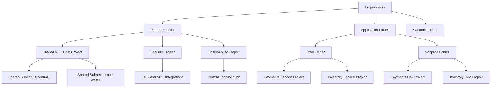

# GCP Landing Zone Setup Guide

> Scope: This guide describes a practical Google Cloud landing zone for multi-team, multi-project, security-conscious environments.

## What is a Landing Zone?
- A landing zone is the prebuilt cloud foundation that standardizes identity, networking, security, logging, billing, and project structure before application teams deploy workloads.
- It turns one-off infrastructure choices into reusable guardrails so every new environment starts from a known-good baseline.
- In Google Cloud, a landing zone is usually centered on the Organization resource, folder hierarchy, project model, connectivity pattern, security baselines, and operations pipeline.
- The goal is not to make every project identical; the goal is to make the important controls consistent and automatable.

## Why a Landing Zone is Needed
- Consistent IAM boundaries make it easier to delegate project ownership without losing central governance.
- Shared VPC, DNS, and NAT patterns prevent every team from inventing a different network design.
- Organization policies reduce accidental public exposure, unmanaged service enablement, and risky identity settings.
- Centralized logging, billing export, and labeling give operations and FinOps teams one place to analyze activity and spend.
- A documented project and folder model makes automation safer because scripts can infer scope from names and hierarchy.
- Standardized controls shorten audit preparation because evidence lives in predictable resources.
- Central policy reduces drift across dev, test, and prod while still allowing per-project customization where justified.
- Day 2 operations become faster because troubleshooting starts from known assumptions rather than tribal knowledge.

## Reference Hierarchy


## Core Design Principles
- Separate platform-owned projects from application-owned projects.
- Use folders to express policy intent, not to mirror every team chart box.
- Keep host networking centralized and service workloads decentralized.
- Enable logging and export before restrictive controls so evidence is preserved.
- Prefer organization and folder policies for default-deny posture, then allow exceptions with approval.
- Name projects, subnets, and policies so operators can infer environment and ownership quickly.
- Use multiple environments and multiple projects instead of mixing prod and nonprod inside one project.
- Automate everything that will be repeated more than once.

## Step 1: Confirm organization ownership and billing foundations
- Why this choice: The organization is the root for policy and identity inheritance. Confirming it first avoids applying folders or policies in the wrong tenant.
- Execution pattern: Run these commands from a platform-admin workstation or CI pipeline with organization-level permissions.
```bash
gcloud organizations list
gcloud billing accounts list
gcloud auth list
```
- Operational note: Replace placeholders such as ORG_ID, POLICY_ID, and folder IDs with values from your tenant inventory.
- Guardrail: Capture the applied scope and approver in the same change record as the command execution.

## Step 2: Create platform, application, and sandbox folders
- Why this choice: Folders let you apply IAM and org policies at meaningful scopes. A simple hierarchy is easier to govern than deeply nested folders that encode every business detail.
- Execution pattern: Run these commands from a platform-admin workstation or CI pipeline with organization-level permissions.
```bash
gcloud resource-manager folders create --display-name=platform --organization=ORG_ID
gcloud resource-manager folders create --display-name=applications --organization=ORG_ID
gcloud resource-manager folders create --display-name=sandbox --organization=ORG_ID
gcloud resource-manager folders create --display-name=prod --folder=APPS_FOLDER_ID
gcloud resource-manager folders create --display-name=nonprod --folder=APPS_FOLDER_ID
```
- Operational note: Replace placeholders such as ORG_ID, POLICY_ID, and folder IDs with values from your tenant inventory.
- Guardrail: Capture the applied scope and approver in the same change record as the command execution.

## Step 3: Apply project naming and labeling conventions
- Why this choice: Predictable names make automation, support, and billing analysis much easier. Include function, environment, and sequence so future projects fit the pattern without debate.
- Execution pattern: Run these commands from a platform-admin workstation or CI pipeline with organization-level permissions.
```bash
gcloud projects create prj-platform-net-prod-001 --folder=PLATFORM_FOLDER_ID --name="platform-net-prod"
gcloud projects create prj-security-core-prod-001 --folder=PLATFORM_FOLDER_ID --name="security-core-prod"
gcloud projects create prj-app-payments-prod-001 --folder=PROD_FOLDER_ID --name="payments-prod"
gcloud beta resource-manager tags keys create environment --parent=organizations/ORG_ID
gcloud beta resource-manager tags values create prod --parent=tagKeys/TAG_KEY_ID
```
- Operational note: Replace placeholders such as ORG_ID, POLICY_ID, and folder IDs with values from your tenant inventory.
- Guardrail: Capture the applied scope and approver in the same change record as the command execution.

## Step 4: Create the Shared VPC host project
- Why this choice: Shared VPC centralizes routing, subnets, NAT, DNS, and baseline firewall controls while keeping service projects isolated for quota, IAM, and lifecycle management.
- Execution pattern: Run these commands from a platform-admin workstation or CI pipeline with organization-level permissions.
```bash
gcloud compute shared-vpc enable prj-platform-net-prod-001
gcloud services enable compute.googleapis.com --project=prj-platform-net-prod-001
gcloud services enable servicenetworking.googleapis.com --project=prj-platform-net-prod-001
```
- Operational note: Replace placeholders such as ORG_ID, POLICY_ID, and folder IDs with values from your tenant inventory.
- Guardrail: Capture the applied scope and approver in the same change record as the command execution.

## Step 5: Attach service projects to the host project
- Why this choice: Service projects keep application teams independent while the platform team owns shared network resources. This reduces duplicated VPC administration and IP sprawl.
- Execution pattern: Run these commands from a platform-admin workstation or CI pipeline with organization-level permissions.
```bash
gcloud compute shared-vpc associated-projects add prj-app-payments-prod-001 --host-project=prj-platform-net-prod-001
gcloud compute shared-vpc associated-projects add prj-app-inventory-prod-001 --host-project=prj-platform-net-prod-001
gcloud projects add-iam-policy-binding prj-platform-net-prod-001 --member="group:network-admins@example.com" --role="roles/compute.networkAdmin"
```
- Operational note: Replace placeholders such as ORG_ID, POLICY_ID, and folder IDs with values from your tenant inventory.
- Guardrail: Capture the applied scope and approver in the same change record as the command execution.

## Step 6: Build the VPC and subnet strategy
- Why this choice: Custom mode VPCs avoid surprise subnet creation, support deliberate IP planning, and make hybrid routing and service expansion more predictable.
- Execution pattern: Run these commands from a platform-admin workstation or CI pipeline with organization-level permissions.
```bash
gcloud compute networks create vpc-prod-core --subnet-mode=custom --project=prj-platform-net-prod-001
gcloud compute networks subnets create snet-prod-uscentral1-app --project=prj-platform-net-prod-001 --network=vpc-prod-core --region=us-central1 --range=10.10.0.0/20 --enable-private-ip-google-access
gcloud compute networks subnets create snet-prod-euwest1-app --project=prj-platform-net-prod-001 --network=vpc-prod-core --region=europe-west1 --range=10.20.0.0/20 --enable-private-ip-google-access
```
- Operational note: Replace placeholders such as ORG_ID, POLICY_ID, and folder IDs with values from your tenant inventory.
- Guardrail: Capture the applied scope and approver in the same change record as the command execution.

## Step 7: Add Cloud Router and Cloud NAT for controlled egress
- Why this choice: Cloud NAT lets private workloads reach package mirrors, APIs, and patch repositories without exposing public IPs on every VM or node.
- Execution pattern: Run these commands from a platform-admin workstation or CI pipeline with organization-level permissions.
```bash
gcloud compute routers create cr-prod-uscentral1 --project=prj-platform-net-prod-001 --network=vpc-prod-core --region=us-central1
gcloud compute routers nats create nat-prod-uscentral1 --router=cr-prod-uscentral1 --router-region=us-central1 --project=prj-platform-net-prod-001 --auto-allocate-nat-external-ips --nat-all-subnet-ip-ranges
gcloud compute routers create cr-prod-euwest1 --project=prj-platform-net-prod-001 --network=vpc-prod-core --region=europe-west1
gcloud compute routers nats create nat-prod-euwest1 --router=cr-prod-euwest1 --router-region=europe-west1 --project=prj-platform-net-prod-001 --auto-allocate-nat-external-ips --nat-all-subnet-ip-ranges
```
- Operational note: Replace placeholders such as ORG_ID, POLICY_ID, and folder IDs with values from your tenant inventory.
- Guardrail: Capture the applied scope and approver in the same change record as the command execution.

## Step 8: Establish hierarchical firewall policies
- Why this choice: Hierarchical policies enforce non-negotiable rules near the top of the hierarchy. VPC-level rules still handle workload-specific needs, but central posture remains intact.
- Execution pattern: Run these commands from a platform-admin workstation or CI pipeline with organization-level permissions.
```bash
gcloud compute firewall-policies create --organization=ORG_ID --short-name=org-core-baseline
gcloud compute firewall-policies rules create 1000 --firewall-policy=POLICY_ID --action=allow --direction=EGRESS --dest-ip-ranges=199.36.153.8/30 --layer4-configs=tcp:443
gcloud compute firewall-policies rules create 2000 --firewall-policy=POLICY_ID --action=deny --direction=INGRESS --src-ip-ranges=0.0.0.0/0 --layer4-configs=all
gcloud compute firewall-policies associations create --firewall-policy=POLICY_ID --organization=ORG_ID
```
- Operational note: Replace placeholders such as ORG_ID, POLICY_ID, and folder IDs with values from your tenant inventory.
- Guardrail: Capture the applied scope and approver in the same change record as the command execution.

## Step 9: Apply organization policies for secure defaults
- Why this choice: Org policies prevent common high-risk misconfigurations globally so teams do not have to remember every control manually for every deployment.
- Execution pattern: Run these commands from a platform-admin workstation or CI pipeline with organization-level permissions.
```bash
gcloud resource-manager org-policies enable-enforce constraints/compute.requireShieldedVm --organization=ORG_ID
gcloud resource-manager org-policies enable-enforce constraints/compute.vmExternalIpAccess --organization=ORG_ID
gcloud resource-manager org-policies enable-enforce constraints/iam.disableServiceAccountKeyCreation --organization=ORG_ID
gcloud resource-manager org-policies enable-enforce constraints/storage.publicAccessPrevention --organization=ORG_ID
```
- Operational note: Replace placeholders such as ORG_ID, POLICY_ID, and folder IDs with values from your tenant inventory.
- Guardrail: Capture the applied scope and approver in the same change record as the command execution.

## Step 10: Centralize logs with aggregated sinks
- Why this choice: Aggregated sinks preserve audit and platform activity across projects. Centralized analysis simplifies incident response, compliance, and trend reporting.
- Execution pattern: Run these commands from a platform-admin workstation or CI pipeline with organization-level permissions.
```bash
gcloud logging sinks create org-audit-bq bigquery.googleapis.com/projects/prj-security-core-prod-001/datasets/org_audit --organization=ORG_ID --include-children
gcloud logging sinks create folder-platform-archive storage.googleapis.com/prj-security-core-prod-001-log-archive --folder=PLATFORM_FOLDER_ID --include-children
gcloud logging sinks update org-audit-bq --organization=ORG_ID --log-filter="logName:(cloudaudit.googleapis.com OR compute.googleapis.com)"
```
- Operational note: Replace placeholders such as ORG_ID, POLICY_ID, and folder IDs with values from your tenant inventory.
- Guardrail: Capture the applied scope and approver in the same change record as the command execution.

## Project Naming Standard
- Pattern: `prj-<domain>-<service>-<environment>-<sequence>`
- Example host project: `prj-platform-net-prod-001`
- Example security project: `prj-security-core-prod-001`
- Example application project: `prj-app-payments-prod-001`
- Example nonprod project: `prj-app-payments-dev-001`
- Use short domain markers such as `platform`, `security`, `app`, `data`, or `shared`.
- Keep environment values consistent: `dev`, `test`, `stage`, `prod`, `sandbox`.
- Avoid region in the project name unless the project is single-region by design.
- Store owner, environment, cost-center, compliance, and criticality as labels or tags instead of encoding them all in the name.

## VPC Design Recommendations
- Use one Shared VPC per environment boundary when teams need centralized governance with independent service projects.
- Reserve non-overlapping RFC1918 ranges up front for future hybrid connectivity, GKE pods and services, managed database private services access, and regional growth.
- Keep subnets regional and map them to workload placement, not to individual teams unless isolation demands it.
- Enable Private Google Access on private subnets so workloads can reach Google APIs without public IPs.
- Plan private service access or Private Service Connect ranges early to avoid painful renumbering later.
- Use Cloud DNS private zones and forwarding for hybrid name resolution instead of host-file style workarounds.
- Separate internet egress strategy from east-west segmentation. NAT handles egress; firewall and route design handle segmentation.
- Document secondary IP ranges for GKE even if the first cluster is small, because growth often outpaces initial estimates.

## Decision Table: Shared VPC vs VPC Peering
| Criterion | Shared VPC | VPC Peering |
| --- | --- | --- |
| Primary use case | Central platform team owns networking for many service projects | Separate VPCs owned independently need private connectivity |
| Operational model | Centralized subnet, route, NAT, and DNS control | Distributed ownership with bilateral peering relationships |
| IAM model | Service projects consume centrally managed subnets | Each VPC keeps its own admin boundary |
| Best for | Enterprise landing zones and multi-team governance | Targeted connectivity between otherwise independent VPCs |
| Tradeoff | Requires platform ownership and good onboarding processes | Topology can get complex as peer counts rise |
| Recommendation | Default for enterprise platform foundations | Use selectively when Shared VPC is not the right ownership model |

## Decision Table: Hierarchical Firewall vs VPC Firewall
| Criterion | Hierarchical Firewall Policy | VPC Firewall Rule |
| --- | --- | --- |
| Scope | Organization or folder | Single VPC network |
| Purpose | Central mandatory baseline | Application or subnet-specific allowances |
| Change owner | Platform or security team | Network or application team |
| Best examples | Deny all ingress by default, restrict egress to approved ranges | Allow health checks, app ports, and intra-tier communication |
| Tradeoff | Too many top-level exceptions create complexity | Rules can drift if no central pattern exists |
| Recommendation | Use for non-negotiable guardrails | Use for workload-specific implementation details |

## Decision Table: Interconnect vs VPN
| Criterion | Cloud Interconnect | Cloud VPN |
| --- | --- | --- |
| Connectivity profile | High-throughput dedicated or partner connectivity | Encrypted connectivity over the internet |
| Scale | Enterprise hybrid backbone and consistent throughput | Faster to start and suitable for smaller workloads |
| Cost model | Higher fixed commitment but predictable throughput | Lower barrier to entry, variable internet dependency |
| Latency and performance | Generally lower and more consistent | Good enough for many use cases but internet path matters |
| When to choose | Business-critical hybrid traffic or data center extension | Branch, temporary, or moderate hybrid connectivity |
| Recommendation | Use when hybrid is strategic and long-lived | Use when speed, simplicity, or smaller scope matters more |

## Common Organization Policies to Consider
- Require Shielded VMs for better instance integrity by default.
- Restrict external IP usage to approved projects or service accounts.
- Disable service account key creation to reduce unmanaged credential risk.
- Enable public access prevention for Cloud Storage wherever feasible.
- Restrict allowed load balancer creation patterns if governance requires it.
- Constrain resource locations if sovereignty or latency policy matters.
- Restrict VM serial port access and OS Login posture based on enterprise standards.
- Review each policy in dry-run or exception-aware rollout order before global enforcement.

## Logging Sink Design
- Create separate destinations for long-retention audit logs, high-volume platform logs, and analytics exports to avoid one sink becoming a catch-all bottleneck.
- Grant sink writer identities only the minimal destination permissions required for BigQuery datasets, Pub/Sub topics, or Storage buckets.
- Use log bucket retention and CMEK strategy consciously when compliance mandates longer storage or controlled encryption.
- Route security-relevant findings to Security Command Center or ticketing workflows so audit logs become actionable instead of archival only.
- Tag logging projects with criticality because they become key dependencies during incidents and audits.
- Test sink filters with representative events before enforcing deletion or retention workflows.

## Suggested Rollout Sequence
1. Confirm organization, billing, and break-glass access.
2. Create folders and baseline IAM groups.
3. Create platform, security, and observability projects.
4. Enable APIs needed for resource management, networking, logging, and billing export.
5. Create Shared VPC and regional subnets.
6. Configure routers, NAT, and DNS foundation.
7. Enable logging sinks and retention strategy.
8. Apply org policies in a staged manner with exceptions documented.
9. Associate service projects and delegate controlled IAM roles.
10. Onboard the first workload and use findings to refine the blueprint.

## Day 2 Operations Checklist
- Review organization, folder, and project drift before approving any structural changes.
- Audit privileged IAM bindings, break-glass accounts, and service account key usage across platform projects.
- Check Shared VPC attachments, subnet utilization, reserved ranges, and firewall exceptions for unexpected growth.
- Verify Cloud Router, Cloud NAT, DNS, and hybrid connectivity health so egress and name resolution stay predictable.
- Confirm organization policies are still enforced and document any temporary exceptions with expiry dates.
- Test aggregated logging, sink destinations, retention policies, and alert routing for critical control-plane events.
- Validate that project labels, billing metadata, and ownership records remain complete for new onboarded teams.
- Rehearse rollback paths for network or policy changes so operators can recover safely during incidents.

## Common Mistakes to Avoid
- Creating one massive project for everything instead of separating platform and service ownership.
- Using auto mode VPCs that create subnets in regions you never intended to use.
- Attaching service projects before baseline firewall, NAT, DNS, and log export are ready.
- Enforcing deny policies without documenting approved exception paths.
- Leaving billing labels optional and then expecting accurate cost allocation later.
- Treating logging sinks as optional afterthoughts rather than first-class controls.
- Using VPC peering to imitate what Shared VPC should solve centrally.
- Ignoring IP planning for GKE, PSC, or hybrid routes until after applications are live.
