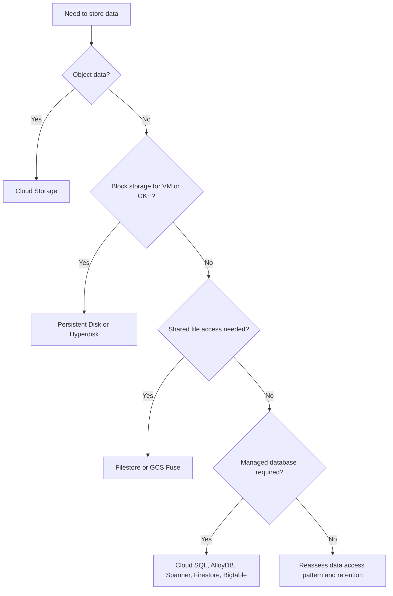

# Storage Classes and Data Strategy

> Scope: This guide aligns object, block, file, and database storage choices with performance, durability, access pattern, and operational ownership in Google Cloud.

## Decision Flow


## Cloud Storage Classes
### Standard
- When to use: Hot data with frequent access.
- Why: Best for active content, analytics landing zones, web assets, and backup targets with regular restore testing.
- Design note: Pair storage class choice with lifecycle, retention lock, replication, and access policy decisions.

### Nearline
- When to use: Low-cost storage for data accessed less than once a month.
- Why: Good for monthly backup sets, secondary reports, and staged archival with occasional retrieval.
- Design note: Pair storage class choice with lifecycle, retention lock, replication, and access policy decisions.

### Coldline
- When to use: Very infrequent access at lower storage cost.
- Why: Useful for quarterly archives and compliance copies where retrieval is rare but not impossible.
- Design note: Pair storage class choice with lifecycle, retention lock, replication, and access policy decisions.

### Archive
- When to use: Lowest storage cost for long-term retention.
- Why: Ideal for records kept mainly for compliance and disaster recovery scenarios.
- Design note: Pair storage class choice with lifecycle, retention lock, replication, and access policy decisions.

### Autoclass
- When to use: Automatic class optimization based on access pattern.
- Why: Useful when access behavior is hard to predict and teams want reduced manual lifecycle tuning.
- Design note: Pair storage class choice with lifecycle, retention lock, replication, and access policy decisions.

## Cloud Storage Class Comparison
| Class | Best access pattern | Strength | Watch item |
| --- | --- | --- | --- |
| Standard | Frequent reads and writes | Fast access and broad fit | Can cost more when data becomes cold |
| Nearline | Monthly or less | Cheaper capacity for cooler data | Retrieval and minimum duration considerations |
| Coldline | Quarterly or less | Lower cost for colder archives | Restore economics matter during DR tests |
| Archive | Rare compliance or DR use | Very low storage cost | Restores need planning and expectations management |
| Autoclass | Mixed or unpredictable | Reduces manual class management | Still requires governance of lifecycle and retention |

## Persistent Disk and Hyperdisk
### pd-standard
- When to use: Lowest-cost HDD-backed option for throughput-tolerant workloads.
- Why: Good for dev environments, logs, or low-intensity workloads that do not need SSD performance.
- Design note: Size, IOPS, and throughput are linked in different ways depending on the disk family, so model the workload rather than choosing by habit.

### pd-balanced
- When to use: General-purpose SSD-backed balance of cost and performance.
- Why: Strong default choice for many application servers and mixed read-write patterns.
- Design note: Size, IOPS, and throughput are linked in different ways depending on the disk family, so model the workload rather than choosing by habit.

### pd-ssd
- When to use: High-performance SSD-backed block storage.
- Why: Use for latency-sensitive databases and demanding application tiers.
- Design note: Size, IOPS, and throughput are linked in different ways depending on the disk family, so model the workload rather than choosing by habit.

### pd-extreme
- When to use: Provisioned performance for demanding database scenarios.
- Why: Use when specific IOPS targets are required and justified by workload criticality.
- Design note: Size, IOPS, and throughput are linked in different ways depending on the disk family, so model the workload rather than choosing by habit.

### Hyperdisk
- When to use: Next-generation configurable performance options.
- Why: Choose when you need flexible tuning of throughput and IOPS for modern performance-sensitive workloads.
- Design note: Size, IOPS, and throughput are linked in different ways depending on the disk family, so model the workload rather than choosing by habit.

## Disk Selection Guidance
- Use pd-balanced as the default unless benchmark evidence justifies moving down to pd-standard or up to pd-ssd and beyond.
- Use pd-ssd or Hyperdisk for transactional workloads with strict latency expectations.
- Use pd-extreme only when the workload is both critical and measurably unable to meet targets on simpler options.
- Separate boot disks from data disks when database recovery, resizing, or snapshot workflows benefit from isolation.
- Combine disk choice with snapshot policy, regional availability requirements, and managed database alternatives.

## GKE StorageClasses
### PD CSI example for ReadWriteOnce application data
```yaml
apiVersion: storage.k8s.io/v1
kind: StorageClass
metadata:
  name: pd-balanced-rwo
provisioner: pd.csi.storage.gke.io
parameters:
  type: pd-balanced
reclaimPolicy: Delete
allowVolumeExpansion: true
volumeBindingMode: WaitForFirstConsumer
```

### Filestore CSI example for shared file access
```yaml
apiVersion: storage.k8s.io/v1
kind: StorageClass
metadata:
  name: filestore-rwx
provisioner: filestore.csi.storage.gke.io
parameters:
  tier: standard
  network: default
allowVolumeExpansion: true
volumeBindingMode: Immediate
```

### GCS Fuse CSI example for object-backed access in GKE
```yaml
apiVersion: storage.k8s.io/v1
kind: StorageClass
metadata:
  name: gcsfuse-bucket
provisioner: gcsfuse.csi.storage.gke.io
parameters:
  bucketName: app-shared-content
reclaimPolicy: Retain
volumeBindingMode: Immediate
```

## GKE StorageClass Comparison
| Option | Primary fit | Strength | Watch item |
| --- | --- | --- | --- |
| PD CSI | Block storage for pods | Simple, performant, excellent for RWO patterns | Not a natural fit for many-writer shared file workloads |
| Filestore CSI | Managed NFS for RWX | Shared filesystem semantics for many pods | Performance and cost should match workload shape |
| GCS Fuse CSI | Object-backed content access | Useful for large shared object sets or model assets | Filesystem semantics differ from native POSIX expectations |

## Access Modes
| Mode | Meaning | Common fit | Note |
| --- | --- | --- | --- |
| RWO | ReadWriteOnce | Single-writer databases, app statefulsets, queue brokers | Most PD CSI patterns land here |
| RWX | ReadWriteMany | Shared content, CMS, build caches, ML pipelines | Often points toward Filestore or other shared file systems |
| ROX | ReadOnlyMany | Static reference data or shared model assets | Can pair well with object-backed or replicated content patterns |

## Database Storage Strategy
### Cloud SQL
- When to use: Managed relational engine for standard OLTP needs.
- Why: Choose machine series, HA, storage type, and autoscaling carefully; good for many app teams that want managed PostgreSQL, MySQL, or SQL Server.
- Design note: Database choice is a data model and operations decision, not just a storage performance decision.

### AlloyDB
- When to use: High-performance PostgreSQL-compatible managed database.
- Why: Best when PostgreSQL compatibility is needed with higher scale and performance expectations.
- Design note: Database choice is a data model and operations decision, not just a storage performance decision.

### Spanner
- When to use: Horizontally scalable globally consistent relational database.
- Why: Choose when global scale and strong consistency across regions matter more than traditional single-instance simplicity.
- Design note: Database choice is a data model and operations decision, not just a storage performance decision.

### Firestore
- When to use: Document database for flexible application state.
- Why: Best for serverless and mobile/web patterns that benefit from managed document semantics.
- Design note: Database choice is a data model and operations decision, not just a storage performance decision.

### Bigtable
- When to use: Wide-column database for large-scale low-latency workloads.
- Why: Use for high-throughput time series, IoT, or profile workloads that need predictable scale.
- Design note: Database choice is a data model and operations decision, not just a storage performance decision.

### Cloud SQL tiers
- When to use: Right-size compute and storage by environment.
- Why: Use smaller instances for dev and test, HA for prod, and storage autoscaling with monitoring to avoid emergency resize scenarios.
- Design note: Database choice is a data model and operations decision, not just a storage performance decision.

## Practical Patterns
- Store hot application assets in Standard class buckets close to consuming workloads and use lifecycle for demotion over time.
- Use Autoclass when many teams write to the same bucket and no one can reliably predict access patterns.
- Use PD CSI for most stateful workloads in GKE unless the access mode genuinely requires shared file semantics.
- Use Filestore when multiple pods need RWX and the application expects a filesystem rather than object storage.
- Use GCS Fuse CSI for read-heavy content distribution, model artifacts, or batch pipelines that naturally fit object storage.
- Move from Cloud SQL to AlloyDB or Spanner only when benchmarks and growth forecasts show clear need, not because the platform wants to appear advanced.
- Choose Bigtable for massive key-based or time-series patterns where relational joins are not the core requirement.

## Storage Architecture Checklist
- Validate required latency, throughput, IOPS, and burst behavior against the workload profile.
- Confirm retention period, legal hold needs, and archival expectations before choosing a class or database tier.
- Define backup frequency, backup location, and restore point objectives for both routine recovery and disaster scenarios.
- Review encryption requirements, including whether Google-managed keys are sufficient or CMEK is required.
- Choose the right replication scope for the business need, such as zonal, regional, multi-regional, or cross-region patterns.
- Verify the access mode and interface the application needs: block, file, object, RWO, or RWX.
- Estimate steady-state and peak cost drivers, including storage, operations, retrieval, replication, and network egress.
- Check compliance and data residency constraints before finalizing region selection and data movement patterns.
- Ensure monitoring covers capacity growth, latency, errors, backup success, and restore testing signals.
- Set lifecycle and deletion rules so stale data automatically transitions, expires, or is reviewed by owners.
