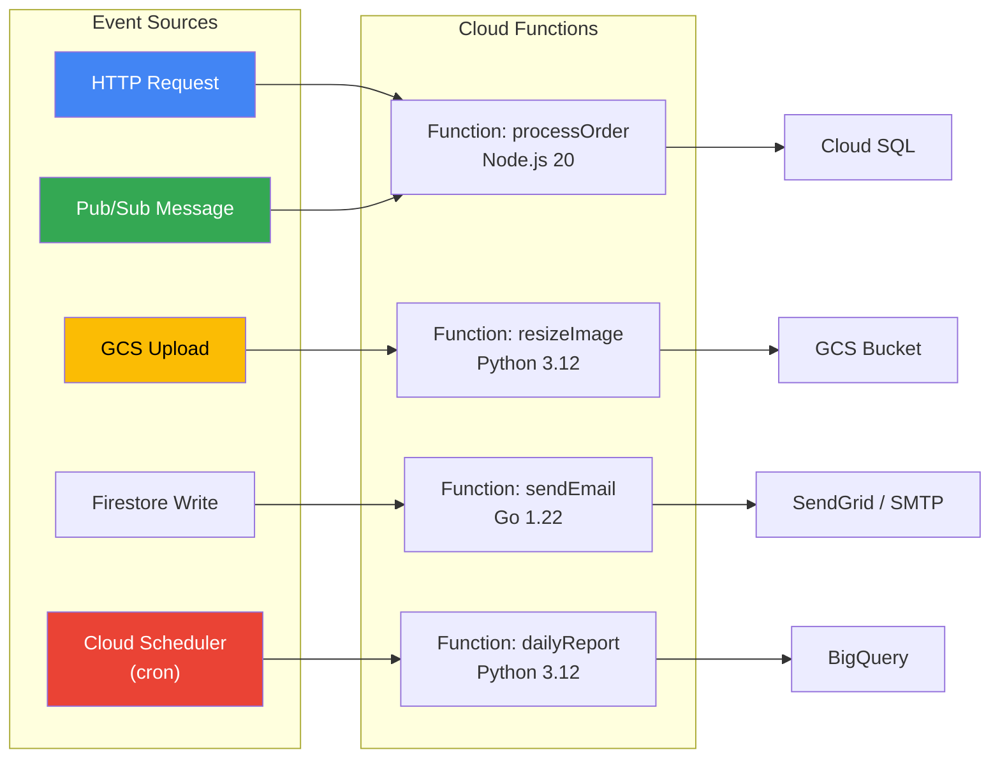
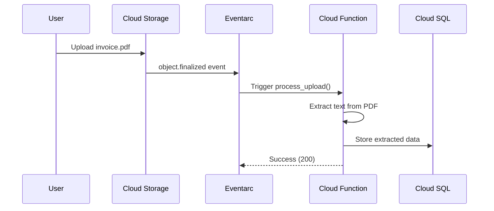

# Cloud Functions — Serverless Event-Driven Computing

Cloud Functions is Google Cloud's serverless Functions-as-a-Service (FaaS) platform. Write single-purpose functions that respond to events — no servers to manage.

## Architecture



---

## Prerequisites

```bash
# Enable APIs
gcloud services enable cloudfunctions.googleapis.com
gcloud services enable cloudbuild.googleapis.com
gcloud services enable artifactregistry.googleapis.com
gcloud services enable run.googleapis.com  # Required for 2nd gen

gcloud config set project YOUR_PROJECT_ID
```

---

## Gen 1 vs Gen 2

| Feature | Gen 1 | Gen 2 (Recommended) |
|---------|-------|---------------------|
| Runtime | Cloud Functions | Built on Cloud Run |
| Concurrency | 1 request per instance | Up to 1000 per instance |
| Max timeout | 9 minutes | 60 minutes |
| Min instances | ❌ | ✅ (avoid cold starts) |
| Traffic splitting | ❌ | ✅ |
| Event sources | Limited | Eventarc (100+ sources) |

---

## HTTP Functions

### Python

```python
# main.py
import functions_framework

@functions_framework.http
def hello_world(request):
    name = request.args.get("name", "World")
    return f"Hello, {name}!"
```

```txt
# requirements.txt
functions-framework==3.*
```

### Deploy

```bash
gcloud functions deploy hello-world \
    --gen2 \
    --runtime=python312 \
    --region=us-central1 \
    --source=. \
    --entry-point=hello_world \
    --trigger-http \
    --allow-unauthenticated
```

### Node.js

```javascript
// index.js
const functions = require('@google-cloud/functions-framework');

functions.http('helloWorld', (req, res) => {
  const name = req.query.name || 'World';
  res.send(`Hello, ${name}!`);
});
```

```json
// package.json
{
  "dependencies": {
    "@google-cloud/functions-framework": "^3.0.0"
  }
}
```

```bash
gcloud functions deploy hello-world \
    --gen2 \
    --runtime=nodejs20 \
    --region=us-central1 \
    --source=. \
    --entry-point=helloWorld \
    --trigger-http \
    --allow-unauthenticated
```

### Go

```go
// function.go
package function

import (
    "fmt"
    "net/http"
    "github.com/GoogleCloudPlatform/functions-framework-go/functions"
)

func init() {
    functions.HTTP("HelloWorld", helloWorld)
}

func helloWorld(w http.ResponseWriter, r *http.Request) {
    name := r.URL.Query().Get("name")
    if name == "" {
        name = "World"
    }
    fmt.Fprintf(w, "Hello, %s!", name)
}
```

```bash
gcloud functions deploy hello-world \
    --gen2 \
    --runtime=go122 \
    --region=us-central1 \
    --source=. \
    --entry-point=HelloWorld \
    --trigger-http \
    --allow-unauthenticated
```

---

## Event-Driven Functions

### Trigger on GCS Upload (resize image on upload)

```python
# main.py
import functions_framework
from google.cloud import storage

@functions_framework.cloud_event
def process_upload(cloud_event):
    data = cloud_event.data
    bucket_name = data["bucket"]
    file_name = data["name"]
    print(f"New file uploaded: gs://{bucket_name}/{file_name}")
    # Process the file...
```

```bash
gcloud functions deploy process-upload \
    --gen2 \
    --runtime=python312 \
    --region=us-central1 \
    --source=. \
    --entry-point=process_upload \
    --trigger-event-filters="type=google.cloud.storage.object.v1.finalized" \
    --trigger-event-filters="bucket=MY_BUCKET_NAME"
```

### Trigger on Pub/Sub Message

```python
# main.py
import base64
import functions_framework

@functions_framework.cloud_event
def process_message(cloud_event):
    message = base64.b64decode(cloud_event.data["message"]["data"]).decode()
    print(f"Received message: {message}")
```

```bash
# Create topic first
gcloud pubsub topics create my-topic

# Deploy function
gcloud functions deploy process-message \
    --gen2 \
    --runtime=python312 \
    --region=us-central1 \
    --source=. \
    --entry-point=process_message \
    --trigger-topic=my-topic

# Test by publishing a message
gcloud pubsub topics publish my-topic --message="Hello from Pub/Sub"
```

### Trigger on Schedule (cron)

```bash
# Deploy the function as HTTP-triggered
gcloud functions deploy daily-report \
    --gen2 \
    --runtime=python312 \
    --region=us-central1 \
    --source=. \
    --entry-point=generate_report \
    --trigger-http \
    --no-allow-unauthenticated

# Create a Cloud Scheduler job to call it daily at 8 AM
gcloud scheduler jobs create http daily-report-job \
    --schedule="0 8 * * *" \
    --uri="$(gcloud functions describe daily-report --gen2 --region=us-central1 --format='value(serviceConfig.uri)')" \
    --http-method=POST \
    --oidc-service-account-email=YOUR_PROJECT_NUMBER-compute@developer.gserviceaccount.com
```

---

## Event Flow



---

## Management Commands

```bash
# List all functions
gcloud functions list

# Describe a function
gcloud functions describe hello-world --gen2 --region=us-central1

# View logs
gcloud functions logs read hello-world --gen2 --region=us-central1 --limit=50

# Call a function directly
gcloud functions call hello-world --gen2 --region=us-central1 --data='{"name":"test"}'

# Get the URL
gcloud functions describe hello-world --gen2 --region=us-central1 \
    --format="value(serviceConfig.uri)"

# Delete a function
gcloud functions delete hello-world --gen2 --region=us-central1 --quiet
```

---

## Environment Variables & Secrets

```bash
# Deploy with env vars
gcloud functions deploy my-func \
    --gen2 --runtime=python312 --region=us-central1 \
    --source=. --entry-point=main \
    --trigger-http \
    --set-env-vars="DB_HOST=10.0.0.1,APP_ENV=production"

# Deploy with Secret Manager secrets
gcloud functions deploy my-func \
    --gen2 --runtime=python312 --region=us-central1 \
    --source=. --entry-point=main \
    --trigger-http \
    --set-secrets="DB_PASSWORD=my-db-secret:latest"
```

---

## Key Concepts

| Concept | Description |
|---------|-------------|
| **Cold start** | First invocation of a new instance (~100ms–2s depending on runtime) |
| **Min instances** | Keep instances warm to avoid cold starts (Gen2 only) |
| **Concurrency** | Gen1: 1 req/instance. Gen2: up to 1000 req/instance |
| **Idempotency** | Functions may be retried — design for at-least-once delivery |
| **Timeout** | Gen1: max 540s. Gen2: max 3600s |
| **Eventarc** | Unified event routing for Gen2 — connects 100+ Google Cloud sources |

---

## References

- [Cloud Functions documentation](https://cloud.google.com/functions/docs)
- [Functions Framework](https://github.com/GoogleCloudPlatform/functions-framework)
- [Eventarc triggers](https://cloud.google.com/eventarc/docs)
