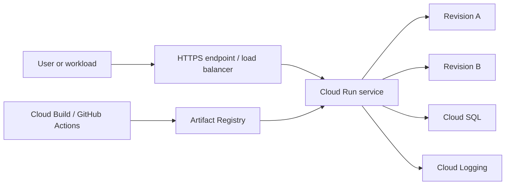
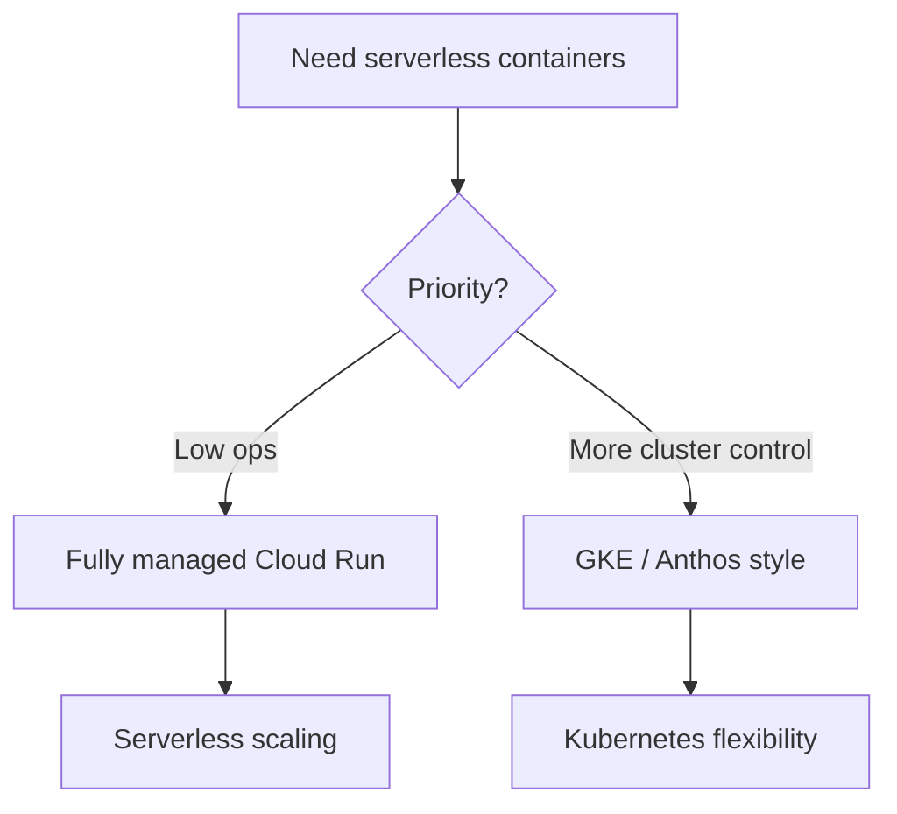
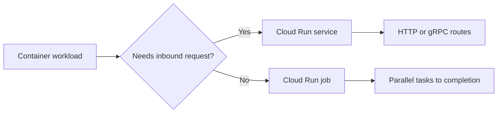
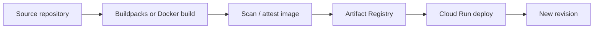
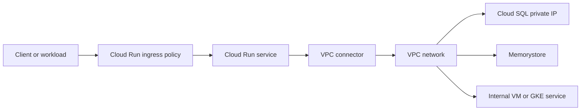
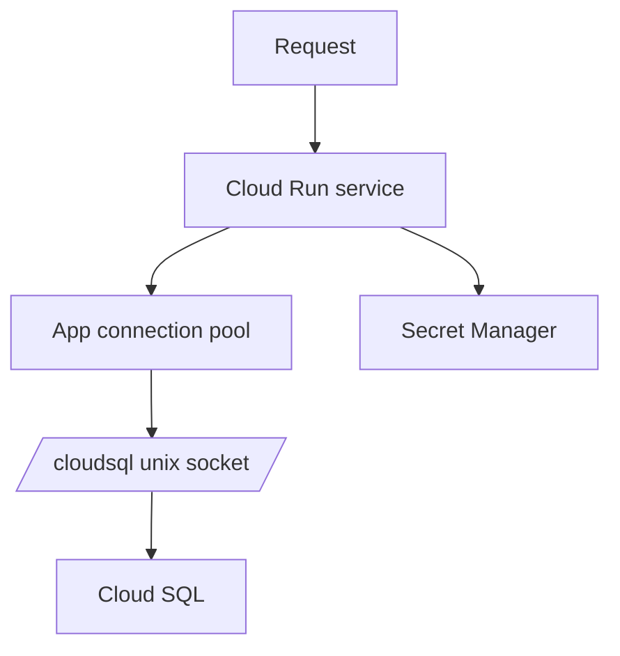
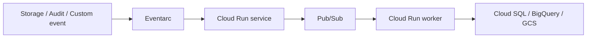
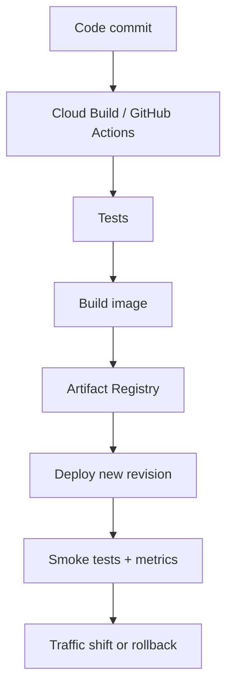
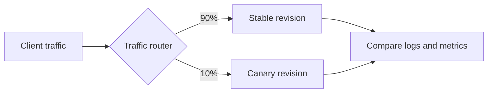

# Cloud Run — Comprehensive Guide

> Practical guide to designing, deploying, securing, and operating Cloud Run workloads on Google Cloud.

## Table of Contents

1. [What is Cloud Run?](#what-is-cloud-run)
2. [Fully managed vs Anthos-style deployments](#fully-managed-vs-anthos-style-deployments)
3. [Cloud Run services vs jobs](#cloud-run-services-vs-jobs)
4. [Deployment patterns](#deployment-patterns)
5. [Runtime configuration](#runtime-configuration)
6. [Custom domains and HTTPS](#custom-domains-and-https)
7. [Networking patterns](#networking-patterns)
8. [Cloud Run with Cloud SQL](#cloud-run-with-cloud-sql)
9. [Pub/Sub and Eventarc](#pubsub-and-eventarc)
10. [Continuous delivery](#continuous-delivery)
11. [Revisions and traffic splitting](#revisions-and-traffic-splitting)
12. [Security model](#security-model)
13. [Monitoring and logging](#monitoring-and-logging)
14. [Cloud Run comparison table](#cloud-run-comparison-table)
15. [Pricing model](#pricing-model)
16. [Troubleshooting](#troubleshooting)
17. [Operational playbooks](#operational-playbooks)
18. [Reference commands](#reference-commands)

## What is Cloud Run?

Cloud Run is Google's serverless container platform. You bring a container image, define runtime limits, choose authentication and ingress behavior, then let Google operate the underlying serving infrastructure.

Cloud Run is a strong fit for:

- HTTP APIs and internal microservices
- gRPC services and webhook endpoints
- Event-driven processors wired to Pub/Sub or Eventarc
- Scheduled and ad hoc batch tasks through Cloud Run jobs
- Modern web applications that benefit from scale-to-zero behavior



## Fully managed vs Anthos-style deployments

Most teams should default to fully managed Cloud Run because it minimizes platform operations. Some organizations compare that to a GKE or Anthos-style runtime when they want deeper Kubernetes control or mesh-level policy.

| Topic | Fully managed Cloud Run | Anthos / GKE-style runtime |
|---|---|---|
| Infra ownership | Mostly Google | More customer-managed |
| Scale to zero | Native | Cluster-dependent |
| Operational overhead | Lowest | Higher |
| Best for | APIs, event consumers, internal services | Enterprise platform standardization with Kubernetes control |
| Release abstraction | Revision-based | Kubernetes deployment semantics |



## Cloud Run services vs jobs

Use **services** for long-lived endpoints and **jobs** for finite tasks that run to completion.

| Capability | Services | Jobs |
|---|---|---|
| Stable URL | Yes | No |
| Request-driven scaling | Yes | No |
| Batch execution | Limited | Primary use case |
| Revisions and traffic splits | Yes | Not applicable |
| Scheduler/automation use | Indirect | Excellent |



## Deployment patterns

### Deploying from source

Use buildpacks when you want the fastest path from source to a running service.

```bash
gcloud run deploy hello-api   --source .   --region us-central1   --allow-unauthenticated
```

### Deploying from a Docker image

Use explicit Dockerfiles and Artifact Registry when you need strong control over build logic, package installation, or base image hardening.

```bash
gcloud builds submit   --tag us-central1-docker.pkg.dev/PROJECT_ID/app-images/orders-api:1.0.0

gcloud run deploy orders-api   --image us-central1-docker.pkg.dev/PROJECT_ID/app-images/orders-api:1.0.0   --region us-central1
```

### Artifact Registry guidance

- Prefer regional repositories close to the runtime region
- Deploy by immutable tag or digest in controlled environments
- Separate application images from shared platform base images when ownership differs
- Use least-privilege IAM for build and deploy identities



## Runtime configuration

Cloud Run performance and cost depend heavily on CPU, memory, timeout, min instances, max instances, and concurrency.

| Setting | Why it matters | Typical trade-off |
|---|---|---|
| CPU | Faster processing and startup | Higher cost |
| Memory | Needed for frameworks, caches, and large payloads | Higher cost if oversized |
| Concurrency | Improves utilization for I/O-bound services | Can worsen tail latency if too high |
| Min instances | Reduces cold starts | Baseline spend |
| Max instances | Protects downstream systems | Can throttle burst handling |
| Timeout | Prevents hung requests | Must match client expectations |

```bash
gcloud run services update orders-api   --region us-central1   --cpu 2   --memory 1Gi   --concurrency 40   --min-instances 1   --max-instances 25   --timeout 300
```

### CPU sizing

- Guidance: Benchmark CPU-heavy workloads such as image processing, encryption, template rendering, and large JSON transformation before increasing blindly.
- Review question: did the team validate this setting under realistic load rather than intuition?

### Memory sizing

- Guidance: Track real memory percentiles. JVM, Python data processing, and AI inference wrappers often need more memory than minimal APIs.
- Review question: did the team validate this setting under realistic load rather than intuition?

### Concurrency tuning

- Guidance: Start lower for stateful or thread-sensitive applications and higher for I/O-bound services after load testing.
- Review question: did the team validate this setting under realistic load rather than intuition?

### Min instances

- Guidance: Use them only when startup latency materially affects user experience or business SLOs.
- Review question: did the team validate this setting under realistic load rather than intuition?

### Max instances

- Guidance: Set a cap when Cloud SQL, legacy APIs, or third-party providers cannot absorb unbounded scale.
- Review question: did the team validate this setting under realistic load rather than intuition?

## Custom domains and HTTPS

Cloud Run supports custom domains and managed certificates. Production teams often front Cloud Run with API Gateway or HTTPS Load Balancer when they need centralized security, policy, or multi-service routing.

### Checklist

1. Verify domain ownership.
2. Map the domain to the service.
3. Create the required DNS records.
4. Validate certificate provisioning and renewal.
5. Confirm redirects, headers, and health checks.

## Networking patterns

Design starts with two questions:

- Who is allowed to reach the service?
- Which private systems must the service reach?

Cloud Run supports ingress restrictions, VPC connectivity patterns, and internal service exposure designs.



### Recommended patterns

- Public API with IAM or gateway-based protection
- Internal microservice with restricted ingress
- Private dependency access only where truly required
- Separate network and service accounts per environment
- Shared platform ingress for certificates and edge policy

### Public edge design

- Expose only the workloads that genuinely need internet reachability and keep admin surfaces private.
- Architecture prompt: does this path align with the data sensitivity and caller population?

### Internal services

- Use restricted ingress and service identity checks for east-west calls.
- Architecture prompt: does this path align with the data sensitivity and caller population?

### Hybrid access

- Combine VPC connectivity with VPN or Interconnect only when the dependency cannot be modernized away.
- Architecture prompt: does this path align with the data sensitivity and caller population?

### Shared networking

- Platform teams often centralize load balancers, DNS, and certificates while app teams own the service itself.
- Architecture prompt: does this path align with the data sensitivity and caller population?

## Cloud Run with Cloud SQL

Cloud Run commonly fronts transactional applications backed by Cloud SQL. The key design challenges are secure connectivity, connection pooling, and scale coordination.

### Connection methods

- Unix socket through Cloud SQL integration
- Private IP through VPC connectivity
- Auth Proxy sidecar-style pattern in environments that prefer explicit proxy handling

```bash
gcloud run deploy orders-api   --image us-central1-docker.pkg.dev/PROJECT_ID/app-images/orders-api:1.0.0   --add-cloudsql-instances PROJECT_ID:us-central1:orders-db   --set-env-vars INSTANCE_UNIX_SOCKET=/cloudsql/PROJECT_ID:us-central1:orders-db
```



### Connection pooling

- Cloud Run can outscale a relational database, so pool sizing and max instances matter.
- Runbook note: document the rollback or failure behavior for this dependency.

### Schema changes

- Run migrations in a Cloud Run job or controlled deployment step, not in every request-serving startup path.
- Runbook note: document the rollback or failure behavior for this dependency.

### Private routing

- Use private IP when compliance or topology requires it, but keep the design as simple as possible.
- Runbook note: document the rollback or failure behavior for this dependency.

### Retry behavior

- Treat failovers and maintenance as normal events; retry transient failures with backoff.
- Runbook note: document the rollback or failure behavior for this dependency.

## Pub/Sub and Eventarc

Cloud Run is a strong destination for event-driven systems.

- Pub/Sub push subscriptions can call Cloud Run services
- Eventarc can route Cloud Storage, Audit Log, Pub/Sub, and custom events to Cloud Run
- Cloud Run jobs can handle scheduled or manual batch processing steps



```bash
gcloud eventarc triggers create image-trigger   --location=us-central1   --destination-run-service=image-processor   --destination-run-region=us-central1   --event-filters="type=google.cloud.storage.object.v1.finalized"
```

### Idempotency

- Event-driven services must assume duplicate delivery and retries.
- Design check: can the system handle retries without corrupting state?

### Back-pressure

- Use asynchronous queues and max instances when downstream systems are fragile.
- Design check: can the system handle retries without corrupting state?

### Correlation IDs

- Propagate event IDs through logs and traces for easier incident analysis.
- Design check: can the system handle retries without corrupting state?

### Dedicated identities

- Use separate service accounts for publishers, routers, and consumers.
- Design check: can the system handle retries without corrupting state?

## Continuous delivery

Cloud Run fits well with Cloud Build or GitHub Actions.

### Recommended flow

1. Build container image.
2. Scan or attest the image.
3. Push to Artifact Registry.
4. Deploy a new revision.
5. Run smoke tests.
6. Shift traffic gradually.
7. Roll back quickly if metrics regress.



### Digest-based promotion

- Promote immutable images across environments rather than rebuilding separately.
- Release question: can the same artifact be promoted and rolled back predictably?

### GitHub Actions auth

- Prefer Workload Identity Federation over long-lived JSON keys.
- Release question: can the same artifact be promoted and rolled back predictably?

### Policy gates

- Insert image scanning or approval checks before production deployment.
- Release question: can the same artifact be promoted and rolled back predictably?

### Environment isolation

- Use separate projects and service accounts for dev, staging, and prod.
- Release question: can the same artifact be promoted and rolled back predictably?

## Revisions and traffic splitting

Each deployment creates an immutable revision. Revisions enable safe rollback, canary rollout, and precise incident correlation.

```bash
gcloud run services update-traffic orders-api   --region us-central1   --to-revisions orders-api-00021=90,orders-api-00022=10
```



### Canary rollout

- Use small percentages for risky changes and watch latency, errors, and dependency saturation.
- Success signal: the team can explain exactly what changed between revisions.

### Tagged revisions

- Tagged URLs help test a revision without shifting general production traffic.
- Success signal: the team can explain exactly what changed between revisions.

### Rollback discipline

- Rollback is easy only if schema changes and config changes were planned safely.
- Success signal: the team can explain exactly what changed between revisions.

### Auditability

- Track revision IDs, image digests, and approvers in change records.
- Success signal: the team can explain exactly what changed between revisions.

## Security model

Cloud Run security is built from runtime identity, invocation controls, secret handling, ingress restrictions, and supply chain hygiene.

### Core controls

- Dedicated runtime service accounts
- `roles/run.invoker` for callers
- Secret Manager for credentials and tokens
- Restricted ingress for private services
- Artifact Registry and image policy controls for supply chain risk

### Service-to-service auth

- Use audience-bound identity tokens instead of shared API keys whenever possible.
- Control owner: app and platform teams should agree on the default baseline.

### Public endpoint hardening

- Only keep unauthenticated access on services that are intentionally public.
- Control owner: app and platform teams should agree on the default baseline.

### Least privilege

- Separate runtime permissions from deployment permissions.
- Control owner: app and platform teams should agree on the default baseline.

### Secret rotation

- Rotate secrets without baking them into images.
- Control owner: app and platform teams should agree on the default baseline.

### Compliance logging

- Ensure deployment, access, and secret usage trails are available to investigators.
- Control owner: app and platform teams should agree on the default baseline.

## Monitoring and logging

Production operation depends on a small set of service-level signals:

- Request rate
- 4xx and 5xx error rate
- Latency percentiles
- Instance count and scaling behavior
- CPU and memory trends
- Revision-specific health and regressions

Use structured logs, propagate trace context, and separate dependency failures from application logic failures in dashboards.

### Latency practice

- Watch p50, p95, and p99 separately; averages hide cold-start and dependency spikes.
- Review cadence: include this signal in weekly platform review meetings.

### Revision metrics practice

- Break down graphs by revision to catch rollout problems quickly.
- Review cadence: include this signal in weekly platform review meetings.

### Dependency dashboards practice

- Show Cloud SQL, Redis, Pub/Sub, and third-party dependencies next to service health.
- Review cadence: include this signal in weekly platform review meetings.

### Cost visibility practice

- Pair throughput metrics with spend so optimization decisions remain balanced.
- Review cadence: include this signal in weekly platform review meetings.

## Cloud Run comparison table

| Dimension | Cloud Run | Cloud Functions Gen2 | App Engine | GKE |
|---|---|---|---|---|
| Deployment unit | Container | Function source | App/service version | Container on Kubernetes |
| Runtime flexibility | High | Medium | Medium | Very high |
| Scale to zero | Yes | Yes | Depends on service type | Not cluster-wide |
| Ops overhead | Low | Very low | Low to medium | Highest |
| Best fit | APIs, services, jobs | Event handlers | Managed app platform workloads | Complex Kubernetes platforms |
| Traffic control | Revision based | Function centric | Version based | Controller or mesh based |

## Pricing model

Cloud Run pricing is usually driven by requests, CPU, memory, egress, and any always-on footprint from min instances.

### Cost guidance

- Keep min instances only where latency benefits justify spend
- Right-size memory before scaling up blindly
- Tune concurrency using real measurements
- Cap max instances when a downstream system is the real bottleneck
- Remember that VPC connectors and dependent services add cost outside Cloud Run itself

## Troubleshooting

| Symptom | Likely cause | First checks |
|---|---|---|
| Slow first request | Cold start or heavy initialization | Min instances, image size, startup work |
| 5xx after deploy | Bad revision or config mismatch | Revision logs, rollback path |
| DB failures under load | Connection storm or saturation | Pool size, max instances |
| Invocation denied | IAM or identity token problem | `run.invoker`, audience, caller identity |
| Timeouts | Long-running handler or slow downstream | Timeout, dependency latency, async design |
| Network path broken | Connector or routing issue | VPC connector, routes, firewall, DNS |

### Cold starts

- Reduce startup work, optimize images, and use min instances only where required.
- Evidence to collect: logs, metrics, timestamps, revision IDs, and dependency health data.

### OOM kills

- Inspect memory usage and remove unbounded in-process caches.
- Evidence to collect: logs, metrics, timestamps, revision IDs, and dependency health data.

### Concurrency bugs

- Lower concurrency temporarily and check for shared mutable state.
- Evidence to collect: logs, metrics, timestamps, revision IDs, and dependency health data.

### Event duplication

- Persist idempotency keys and design retry-safe handlers.
- Evidence to collect: logs, metrics, timestamps, revision IDs, and dependency health data.

### Regional events

- Plan multi-region failover only when business requirements justify the extra complexity and cost.
- Evidence to collect: logs, metrics, timestamps, revision IDs, and dependency health data.

## Operational playbooks

### Public API

- Summary: Use gateway-aware authentication, revision-based rollout, and explicit latency SLOs.
- Checklist:

- Dedicated runtime service account
- Structured logs and tracing
- Controlled database connection limits
- Exit criteria: deployment, rollback, and observability are all routine operations.

### Internal service

- Summary: Restrict ingress and require service identity for east-west calls.
- Checklist:

- `run.invoker` only for caller identities
- Clear audience validation rules
- Dependency dashboards
- Exit criteria: deployment, rollback, and observability are all routine operations.

### Batch job

- Summary: Package finite maintenance or ETL work as Cloud Run jobs.
- Checklist:

- Scheduler or Workflows trigger
- Track exit code and duration
- Store outputs in durable systems
- Exit criteria: deployment, rollback, and observability are all routine operations.

### Database-backed app

- Summary: Treat Cloud SQL as the primary scaling constraint.
- Checklist:

- Connection pooling
- Migration separation
- Max instance guardrails
- Exit criteria: deployment, rollback, and observability are all routine operations.

### GitHub-driven CI/CD

- Summary: Use Workload Identity Federation and immutable artifacts.
- Checklist:

- No long-lived deploy keys
- Deploy by digest
- Post-deploy smoke test
- Exit criteria: deployment, rollback, and observability are all routine operations.

## Reference commands

```bash
gcloud run services list --region us-central1
gcloud run services describe orders-api --region us-central1
gcloud run revisions list --service orders-api --region us-central1
gcloud run services update-traffic orders-api --region us-central1 --to-latest
gcloud run jobs execute nightly-reconcile --region us-central1
gcloud eventarc triggers list --location us-central1
```

### Appendix: Image Build Hygiene

- What requirement does this decision address?
- Which Cloud Run setting or dependency must be reviewed?
- What failure mode appears if the team skips this review?
- Which dashboard or runbook helps during an incident?

### Appendix: Regional Placement

- What requirement does this decision address?
- Which Cloud Run setting or dependency must be reviewed?
- What failure mode appears if the team skips this review?
- Which dashboard or runbook helps during an incident?

### Appendix: Tenant Isolation

- What requirement does this decision address?
- Which Cloud Run setting or dependency must be reviewed?
- What failure mode appears if the team skips this review?
- Which dashboard or runbook helps during an incident?

### Appendix: Sre Handoff

- What requirement does this decision address?
- Which Cloud Run setting or dependency must be reviewed?
- What failure mode appears if the team skips this review?
- Which dashboard or runbook helps during an incident?

### Appendix: Performance Test Checklist

- What requirement does this decision address?
- Which Cloud Run setting or dependency must be reviewed?
- What failure mode appears if the team skips this review?
- Which dashboard or runbook helps during an incident?

### Appendix: Deployment Approval Checklist

- What requirement does this decision address?
- Which Cloud Run setting or dependency must be reviewed?
- What failure mode appears if the team skips this review?
- Which dashboard or runbook helps during an incident?

### Appendix: Alert Tuning

- What requirement does this decision address?
- Which Cloud Run setting or dependency must be reviewed?
- What failure mode appears if the team skips this review?
- Which dashboard or runbook helps during an incident?

### Appendix: Database Protection

- What requirement does this decision address?
- Which Cloud Run setting or dependency must be reviewed?
- What failure mode appears if the team skips this review?
- Which dashboard or runbook helps during an incident?

### Appendix: Secret Rotation

- What requirement does this decision address?
- Which Cloud Run setting or dependency must be reviewed?
- What failure mode appears if the team skips this review?
- Which dashboard or runbook helps during an incident?

### Appendix: Incident Rollback

- What requirement does this decision address?
- Which Cloud Run setting or dependency must be reviewed?
- What failure mode appears if the team skips this review?
- Which dashboard or runbook helps during an incident?

## Extended architecture pattern catalog

### Public REST API

- Fit: Expose Cloud Run behind a custom domain and optionally API Gateway for auth, quota, and contract enforcement.
- Design caution: Use min instances only if latency budgets justify warm capacity.
- Observe: Watch request latency, 4xx/5xx rate, and backend saturation.
- Capacity question: what downstream dependency will fail first if traffic doubles?
- Security question: which identity should be allowed to invoke this service?

### Internal service mesh edge

- Fit: Use Cloud Run for selected edge or utility services while keeping most workloads internal.
- Design caution: Restrict ingress and require service identity tokens.
- Observe: Track denied invocations and token audience mismatches.
- Capacity question: what downstream dependency will fail first if traffic doubles?
- Security question: which identity should be allowed to invoke this service?

### Webhook fan-in

- Fit: Receive third-party webhooks, validate signatures, and publish normalized events to Pub/Sub.
- Design caution: Do not perform slow downstream work inline when retries are uncontrolled.
- Observe: Measure webhook processing duration and duplicate delivery counts.
- Capacity question: what downstream dependency will fail first if traffic doubles?
- Security question: which identity should be allowed to invoke this service?

### Order API with database

- Fit: Combine Cloud Run with Cloud SQL and explicit connection pooling.
- Design caution: Cap max instances if the database is the limiting resource.
- Observe: Dashboards should correlate request rate with database connections.
- Capacity question: what downstream dependency will fail first if traffic doubles?
- Security question: which identity should be allowed to invoke this service?

### Image processing worker

- Fit: Use Eventarc or Pub/Sub to trigger image transformations and store results in Cloud Storage.
- Design caution: Keep handlers idempotent and validate object metadata.
- Observe: Track processing duration, output size, and retry counts.
- Capacity question: what downstream dependency will fail first if traffic doubles?
- Security question: which identity should be allowed to invoke this service?

### Scheduled reconciliation job

- Fit: Use Cloud Run jobs for nightly reconciliation, cleanup, and admin workflows.
- Design caution: Store outputs and exit status in durable systems.
- Observe: Alert on failed executions and excessive duration.
- Capacity question: what downstream dependency will fail first if traffic doubles?
- Security question: which identity should be allowed to invoke this service?

### gRPC microservice

- Fit: Use Cloud Run when you need HTTP/2 and custom runtime packaging.
- Design caution: Benchmark concurrency carefully because gRPC workloads vary widely.
- Observe: Trace cross-service latency and upstream deadlines.
- Capacity question: what downstream dependency will fail first if traffic doubles?
- Security question: which identity should be allowed to invoke this service?

### Multi-tenant API

- Fit: Tag logs and metrics with safe tenant identifiers and plan quotas outside the app where possible.
- Design caution: Avoid tenant-specific in-memory state that disappears on scale events.
- Observe: Watch noisy-neighbor effects and tenant-specific error spikes.
- Capacity question: what downstream dependency will fail first if traffic doubles?
- Security question: which identity should be allowed to invoke this service?

### BFF for web frontend

- Fit: Use Cloud Run as a backend-for-frontend that aggregates internal APIs and applies user-aware policies.
- Design caution: Cache carefully and avoid long synchronous dependency chains.
- Observe: Track client-visible latency and backend fan-out time.
- Capacity question: what downstream dependency will fail first if traffic doubles?
- Security question: which identity should be allowed to invoke this service?

### File import pipeline

- Fit: Accept file metadata, enqueue background work, and process content asynchronously.
- Design caution: Never tie upload acknowledgment to full file processing.
- Observe: Measure queue depth, job completion time, and duplicate suppression.
- Capacity question: what downstream dependency will fail first if traffic doubles?
- Security question: which identity should be allowed to invoke this service?

### Policy automation worker

- Fit: React to audit events with Cloud Run and create tickets or remediation actions.
- Design caution: Use dry-run modes and explicit exception lists for safety.
- Observe: Track policy action outcomes and false-positive rates.
- Capacity question: what downstream dependency will fail first if traffic doubles?
- Security question: which identity should be allowed to invoke this service?

### Partner integration facade

- Fit: Expose a stable external contract while hiding internal system changes behind Cloud Run.
- Design caution: Protect the surface with explicit auth and schema validation.
- Observe: Track partner-specific error rates and contract version usage.
- Capacity question: what downstream dependency will fail first if traffic doubles?
- Security question: which identity should be allowed to invoke this service?

### GraphQL gateway

- Fit: Containerize GraphQL resolvers and tune concurrency based on resolver fan-out cost.
- Design caution: Enforce timeouts and depth/complexity controls.
- Observe: Observe tail latency, resolver errors, and cache hit ratios.
- Capacity question: what downstream dependency will fail first if traffic doubles?
- Security question: which identity should be allowed to invoke this service?

### Admin portal backend

- Fit: Use IAP or authenticated ingress in front of Cloud Run for operator tooling.
- Design caution: Separate human access from service-to-service access patterns.
- Observe: Track privileged actions and auditability end to end.
- Capacity question: what downstream dependency will fail first if traffic doubles?
- Security question: which identity should be allowed to invoke this service?

### Document generation

- Fit: Run CPU-heavy rendering or PDF assembly jobs in Cloud Run jobs or services.
- Design caution: Tune CPU and memory with production-like test documents.
- Observe: Watch execution duration, temporary storage usage, and OOM events.
- Capacity question: what downstream dependency will fail first if traffic doubles?
- Security question: which identity should be allowed to invoke this service?

### Notification orchestrator

- Fit: Use Cloud Run to validate events and fan out to email, SMS, and webhook providers.
- Design caution: Protect providers with retries, backoff, and circuit breaking.
- Observe: Track provider latency, delivery success, and backlog growth.
- Capacity question: what downstream dependency will fail first if traffic doubles?
- Security question: which identity should be allowed to invoke this service?

### Fraud scoring API

- Fit: Package a model scorer or rules engine in a container with clear versioning.
- Design caution: Manage cold start and memory needs deliberately.
- Observe: Track score latency, cache effectiveness, and model version drift.
- Capacity question: what downstream dependency will fail first if traffic doubles?
- Security question: which identity should be allowed to invoke this service?

### CSV export service

- Fit: Generate large exports asynchronously and return a polling token to clients.
- Design caution: Do not keep client HTTP connections open for long exports.
- Observe: Measure queue wait time, export duration, and storage cleanup.
- Capacity question: what downstream dependency will fail first if traffic doubles?
- Security question: which identity should be allowed to invoke this service?

### Search indexing worker

- Fit: Consume change events and update a search system with retry-safe handlers.
- Design caution: Persist checkpointing or event IDs for recovery.
- Observe: Track stale index age and reprocessing counts.
- Capacity question: what downstream dependency will fail first if traffic doubles?
- Security question: which identity should be allowed to invoke this service?

### ML inference wrapper

- Fit: Wrap model serving or feature fetch logic in Cloud Run for bursty workloads.
- Design caution: Benchmark cold starts and consider minimum instances only if justified.
- Observe: Observe latency percentiles, memory pressure, and model load time.
- Capacity question: what downstream dependency will fail first if traffic doubles?
- Security question: which identity should be allowed to invoke this service?

## Failure mode catalog

### Cold-start spike

- Symptom: Customer complaints about first-request latency after idle periods.
- Immediate action: Reduce startup work, optimize images, and evaluate min instances for critical paths.
- Evidence to capture: timestamps, revision ID, affected percentage, and dependency health.
- Prevention: turn the lesson into a template, policy, or CI/CD check.

### Revision regression

- Symptom: Errors begin immediately after deployment.
- Immediate action: Compare logs and metrics by revision and roll back traffic quickly.
- Evidence to capture: timestamps, revision ID, affected percentage, and dependency health.
- Prevention: turn the lesson into a template, policy, or CI/CD check.

### Database connection storm

- Symptom: Cloud SQL reports too many connections during bursts.
- Immediate action: Lower max instances, pool connections, and offload heavy work to queues.
- Evidence to capture: timestamps, revision ID, affected percentage, and dependency health.
- Prevention: turn the lesson into a template, policy, or CI/CD check.

### Token audience mismatch

- Symptom: Authenticated caller receives 401 or 403 responses.
- Immediate action: Check the service URL audience and caller identity token generation.
- Evidence to capture: timestamps, revision ID, affected percentage, and dependency health.
- Prevention: turn the lesson into a template, policy, or CI/CD check.

### Memory leak

- Symptom: Instances restart or are killed under sustained load.
- Immediate action: Profile memory, shrink in-process caches, and verify framework configuration.
- Evidence to capture: timestamps, revision ID, affected percentage, and dependency health.
- Prevention: turn the lesson into a template, policy, or CI/CD check.

### Slow third-party API

- Symptom: Cloud Run remains healthy but request latency grows sharply.
- Immediate action: Use timeouts, retries with backoff, circuit breakers, and asynchronous handoff.
- Evidence to capture: timestamps, revision ID, affected percentage, and dependency health.
- Prevention: turn the lesson into a template, policy, or CI/CD check.

### Connector saturation

- Symptom: Private resource access becomes intermittent.
- Immediate action: Inspect VPC connector capacity, traffic paths, and dependency limits.
- Evidence to capture: timestamps, revision ID, affected percentage, and dependency health.
- Prevention: turn the lesson into a template, policy, or CI/CD check.

### Pub/Sub duplication

- Symptom: Event consumer writes duplicate records.
- Immediate action: Persist idempotency keys and make handlers retry-safe.
- Evidence to capture: timestamps, revision ID, affected percentage, and dependency health.
- Prevention: turn the lesson into a template, policy, or CI/CD check.

### Config drift

- Symptom: Different environments behave inconsistently.
- Immediate action: Version configuration, service accounts, and IAM alongside code.
- Evidence to capture: timestamps, revision ID, affected percentage, and dependency health.
- Prevention: turn the lesson into a template, policy, or CI/CD check.

### Secret rotation outage

- Symptom: A rotated secret breaks runtime connections.
- Immediate action: Test rotation paths, staged rollouts, and fallback behavior.
- Evidence to capture: timestamps, revision ID, affected percentage, and dependency health.
- Prevention: turn the lesson into a template, policy, or CI/CD check.

### Region dependency event

- Symptom: One region is healthy but a dependent service is degraded.
- Immediate action: Design and test failover only where the business requires it.
- Evidence to capture: timestamps, revision ID, affected percentage, and dependency health.
- Prevention: turn the lesson into a template, policy, or CI/CD check.

### Oversized response payload

- Symptom: Requests fail for large exports or API responses.
- Immediate action: Use object storage handoff patterns instead of very large inline responses.
- Evidence to capture: timestamps, revision ID, affected percentage, and dependency health.
- Prevention: turn the lesson into a template, policy, or CI/CD check.

## Command recipes

### Deploy from source

```bash
gcloud run deploy sample --source . --region us-central1
```

- Use this when the platform workflow calls for **deploy from source**.

### Deploy from image

```bash
gcloud run deploy sample --image us-central1-docker.pkg.dev/PROJECT_ID/repo/sample:1.0.0 --region us-central1
```

- Use this when the platform workflow calls for **deploy from image**.

### Restrict unauthenticated access

```bash
gcloud run services update sample --no-allow-unauthenticated --region us-central1
```

- Use this when the platform workflow calls for **restrict unauthenticated access**.

### Set min and max instances

```bash
gcloud run services update sample --min-instances 1 --max-instances 20 --region us-central1
```

- Use this when the platform workflow calls for **set min and max instances**.

### Set concurrency

```bash
gcloud run services update sample --concurrency 20 --region us-central1
```

- Use this when the platform workflow calls for **set concurrency**.

### Describe service

```bash
gcloud run services describe sample --region us-central1
```

- Use this when the platform workflow calls for **describe service**.

### List revisions

```bash
gcloud run revisions list --service sample --region us-central1
```

- Use this when the platform workflow calls for **list revisions**.

### Shift traffic

```bash
gcloud run services update-traffic sample --to-latest --region us-central1
```

- Use this when the platform workflow calls for **shift traffic**.

### Execute job

```bash
gcloud run jobs execute nightly-job --region us-central1
```

- Use this when the platform workflow calls for **execute job**.

### List jobs

```bash
gcloud run jobs list --region us-central1
```

- Use this when the platform workflow calls for **list jobs**.

## FAQ

### Should I choose Cloud Run or GKE for every container?

Choose Cloud Run first when you want serverless operations. Choose GKE when you need Kubernetes-specific capabilities.

### Is Cloud Run good for background work?

Yes. Use Pub/Sub, Eventarc, or Cloud Run jobs depending on the execution model.

### Can Cloud Run be private?

Yes. Restrict ingress and combine with private front-door patterns or authenticated access.

### How do I avoid overloading Cloud SQL?

Use pooling, max instances, and asynchronous patterns so traffic growth is controlled.

### When do min instances make sense?

When latency budgets or startup-heavy workloads justify the baseline spend.

### Can I deploy with GitHub Actions?

Yes, and Workload Identity Federation is the recommended authentication approach.

### Are Cloud Run jobs a replacement for every scheduler platform?

No. They are great for containerized finite tasks, but not every orchestration or HPC pattern.

### What is the biggest anti-pattern?

Treating Cloud Run like a VM by keeping too much local state or performing too much startup work.

## Appendix: Design review cards

### Review card 1: Latency-sensitive API

- What Cloud Run feature is the primary reason this workload belongs here?
- Which runtime setting most strongly affects reliability for this case?
- Which downstream dependency must be protected with max instances, queues, or retries?
- Which log field or dashboard will prove the design works in production?

### Review card 2: Cold-start-heavy framework

- What Cloud Run feature is the primary reason this workload belongs here?
- Which runtime setting most strongly affects reliability for this case?
- Which downstream dependency must be protected with max instances, queues, or retries?
- Which log field or dashboard will prove the design works in production?

### Review card 3: Queue-driven worker

- What Cloud Run feature is the primary reason this workload belongs here?
- Which runtime setting most strongly affects reliability for this case?
- Which downstream dependency must be protected with max instances, queues, or retries?
- Which log field or dashboard will prove the design works in production?

### Review card 4: Hybrid network dependency

- What Cloud Run feature is the primary reason this workload belongs here?
- Which runtime setting most strongly affects reliability for this case?
- Which downstream dependency must be protected with max instances, queues, or retries?
- Which log field or dashboard will prove the design works in production?

### Review card 5: Private admin service

- What Cloud Run feature is the primary reason this workload belongs here?
- Which runtime setting most strongly affects reliability for this case?
- Which downstream dependency must be protected with max instances, queues, or retries?
- Which log field or dashboard will prove the design works in production?

### Review card 6: Public partner API

- What Cloud Run feature is the primary reason this workload belongs here?
- Which runtime setting most strongly affects reliability for this case?
- Which downstream dependency must be protected with max instances, queues, or retries?
- Which log field or dashboard will prove the design works in production?

### Review card 7: Tenant-aware service

- What Cloud Run feature is the primary reason this workload belongs here?
- Which runtime setting most strongly affects reliability for this case?
- Which downstream dependency must be protected with max instances, queues, or retries?
- Which log field or dashboard will prove the design works in production?

### Review card 8: Large file export

- What Cloud Run feature is the primary reason this workload belongs here?
- Which runtime setting most strongly affects reliability for this case?
- Which downstream dependency must be protected with max instances, queues, or retries?
- Which log field or dashboard will prove the design works in production?

### Review card 9: High-churn deployment team

- What Cloud Run feature is the primary reason this workload belongs here?
- Which runtime setting most strongly affects reliability for this case?
- Which downstream dependency must be protected with max instances, queues, or retries?
- Which log field or dashboard will prove the design works in production?

### Review card 10: Cloud SQL constrained workload

- What Cloud Run feature is the primary reason this workload belongs here?
- Which runtime setting most strongly affects reliability for this case?
- Which downstream dependency must be protected with max instances, queues, or retries?
- Which log field or dashboard will prove the design works in production?

### Review card 11: Search indexing worker

- What Cloud Run feature is the primary reason this workload belongs here?
- Which runtime setting most strongly affects reliability for this case?
- Which downstream dependency must be protected with max instances, queues, or retries?
- Which log field or dashboard will prove the design works in production?

### Review card 12: Webhook receiver

- What Cloud Run feature is the primary reason this workload belongs here?
- Which runtime setting most strongly affects reliability for this case?
- Which downstream dependency must be protected with max instances, queues, or retries?
- Which log field or dashboard will prove the design works in production?

### Review card 13: Fraud scoring endpoint

- What Cloud Run feature is the primary reason this workload belongs here?
- Which runtime setting most strongly affects reliability for this case?
- Which downstream dependency must be protected with max instances, queues, or retries?
- Which log field or dashboard will prove the design works in production?

### Review card 14: PDF generation service

- What Cloud Run feature is the primary reason this workload belongs here?
- Which runtime setting most strongly affects reliability for this case?
- Which downstream dependency must be protected with max instances, queues, or retries?
- Which log field or dashboard will prove the design works in production?

### Review card 15: Analytics ingestion gateway

- What Cloud Run feature is the primary reason this workload belongs here?
- Which runtime setting most strongly affects reliability for this case?
- Which downstream dependency must be protected with max instances, queues, or retries?
- Which log field or dashboard will prove the design works in production?

### Review card 16: Cache-backed API

- What Cloud Run feature is the primary reason this workload belongs here?
- Which runtime setting most strongly affects reliability for this case?
- Which downstream dependency must be protected with max instances, queues, or retries?
- Which log field or dashboard will prove the design works in production?

### Review card 17: Multi-region resilience target

- What Cloud Run feature is the primary reason this workload belongs here?
- Which runtime setting most strongly affects reliability for this case?
- Which downstream dependency must be protected with max instances, queues, or retries?
- Which log field or dashboard will prove the design works in production?

### Review card 18: Compliance-heavy release flow

- What Cloud Run feature is the primary reason this workload belongs here?
- Which runtime setting most strongly affects reliability for this case?
- Which downstream dependency must be protected with max instances, queues, or retries?
- Which log field or dashboard will prove the design works in production?

### Review card 19: Shared platform ingress

- What Cloud Run feature is the primary reason this workload belongs here?
- Which runtime setting most strongly affects reliability for this case?
- Which downstream dependency must be protected with max instances, queues, or retries?
- Which log field or dashboard will prove the design works in production?

### Review card 20: Low-cost dev environment

- What Cloud Run feature is the primary reason this workload belongs here?
- Which runtime setting most strongly affects reliability for this case?
- Which downstream dependency must be protected with max instances, queues, or retries?
- Which log field or dashboard will prove the design works in production?

### Review card 21: Edge auth facade

- What Cloud Run feature is the primary reason this workload belongs here?
- Which runtime setting most strongly affects reliability for this case?
- Which downstream dependency must be protected with max instances, queues, or retries?
- Which log field or dashboard will prove the design works in production?

### Review card 22: Workflow callback receiver

- What Cloud Run feature is the primary reason this workload belongs here?
- Which runtime setting most strongly affects reliability for this case?
- Which downstream dependency must be protected with max instances, queues, or retries?
- Which log field or dashboard will prove the design works in production?

### Review card 23: Streaming gRPC service

- What Cloud Run feature is the primary reason this workload belongs here?
- Which runtime setting most strongly affects reliability for this case?
- Which downstream dependency must be protected with max instances, queues, or retries?
- Which log field or dashboard will prove the design works in production?

### Review card 24: Batch cleanup job

- What Cloud Run feature is the primary reason this workload belongs here?
- Which runtime setting most strongly affects reliability for this case?
- Which downstream dependency must be protected with max instances, queues, or retries?
- Which log field or dashboard will prove the design works in production?

### Review card 25: SLA-bound mobile backend

- What Cloud Run feature is the primary reason this workload belongs here?
- Which runtime setting most strongly affects reliability for this case?
- Which downstream dependency must be protected with max instances, queues, or retries?
- Which log field or dashboard will prove the design works in production?

## Appendix: Cost and performance prompts

### Performance prompt 1: CPU right-sizing

- What measurement would justify changing this setting?
- What failure mode appears if the team guesses instead of measuring?
- Which environment should be used to validate this change before production?

### Performance prompt 2: Memory right-sizing

- What measurement would justify changing this setting?
- What failure mode appears if the team guesses instead of measuring?
- Which environment should be used to validate this change before production?

### Performance prompt 3: Concurrency sweep

- What measurement would justify changing this setting?
- What failure mode appears if the team guesses instead of measuring?
- Which environment should be used to validate this change before production?

### Performance prompt 4: Min instance justification

- What measurement would justify changing this setting?
- What failure mode appears if the team guesses instead of measuring?
- Which environment should be used to validate this change before production?

### Performance prompt 5: Max instance caps

- What measurement would justify changing this setting?
- What failure mode appears if the team guesses instead of measuring?
- Which environment should be used to validate this change before production?

### Performance prompt 6: Image size reduction

- What measurement would justify changing this setting?
- What failure mode appears if the team guesses instead of measuring?
- Which environment should be used to validate this change before production?

### Performance prompt 7: Warm-path optimization

- What measurement would justify changing this setting?
- What failure mode appears if the team guesses instead of measuring?
- Which environment should be used to validate this change before production?

### Performance prompt 8: Database pooling limits

- What measurement would justify changing this setting?
- What failure mode appears if the team guesses instead of measuring?
- Which environment should be used to validate this change before production?

### Performance prompt 9: Network path simplification

- What measurement would justify changing this setting?
- What failure mode appears if the team guesses instead of measuring?
- Which environment should be used to validate this change before production?

### Performance prompt 10: Region placement

- What measurement would justify changing this setting?
- What failure mode appears if the team guesses instead of measuring?
- Which environment should be used to validate this change before production?

### Performance prompt 11: Artifact promotion timing

- What measurement would justify changing this setting?
- What failure mode appears if the team guesses instead of measuring?
- Which environment should be used to validate this change before production?

### Performance prompt 12: Cold-start benchmark

- What measurement would justify changing this setting?
- What failure mode appears if the team guesses instead of measuring?
- Which environment should be used to validate this change before production?

### Performance prompt 13: Load-test plan

- What measurement would justify changing this setting?
- What failure mode appears if the team guesses instead of measuring?
- Which environment should be used to validate this change before production?

### Performance prompt 14: Canary rollback trigger

- What measurement would justify changing this setting?
- What failure mode appears if the team guesses instead of measuring?
- Which environment should be used to validate this change before production?

### Performance prompt 15: Connector sizing

- What measurement would justify changing this setting?
- What failure mode appears if the team guesses instead of measuring?
- Which environment should be used to validate this change before production?

### Performance prompt 16: Cache strategy

- What measurement would justify changing this setting?
- What failure mode appears if the team guesses instead of measuring?
- Which environment should be used to validate this change before production?

### Performance prompt 17: High-percentile latency review

- What measurement would justify changing this setting?
- What failure mode appears if the team guesses instead of measuring?
- Which environment should be used to validate this change before production?

### Performance prompt 18: Error budget burn review

- What measurement would justify changing this setting?
- What failure mode appears if the team guesses instead of measuring?
- Which environment should be used to validate this change before production?

### Performance prompt 19: Throughput per instance

- What measurement would justify changing this setting?
- What failure mode appears if the team guesses instead of measuring?
- Which environment should be used to validate this change before production?

### Performance prompt 20: Idle cost review

- What measurement would justify changing this setting?
- What failure mode appears if the team guesses instead of measuring?
- Which environment should be used to validate this change before production?

## Appendix: Security and release prompts

### Security prompt 1: Invoker policy

- Which identity or policy controls this area?
- How is this control validated after each deployment?
- What evidence should responders collect if this area fails during an incident?

### Security prompt 2: Runtime service account scope

- Which identity or policy controls this area?
- How is this control validated after each deployment?
- What evidence should responders collect if this area fails during an incident?

### Security prompt 3: Secret rotation

- Which identity or policy controls this area?
- How is this control validated after each deployment?
- What evidence should responders collect if this area fails during an incident?

### Security prompt 4: Artifact provenance

- Which identity or policy controls this area?
- How is this control validated after each deployment?
- What evidence should responders collect if this area fails during an incident?

### Security prompt 5: Revision traceability

- Which identity or policy controls this area?
- How is this control validated after each deployment?
- What evidence should responders collect if this area fails during an incident?

### Security prompt 6: Custom domain ownership

- Which identity or policy controls this area?
- How is this control validated after each deployment?
- What evidence should responders collect if this area fails during an incident?

### Security prompt 7: Ingress restrictions

- Which identity or policy controls this area?
- How is this control validated after each deployment?
- What evidence should responders collect if this area fails during an incident?

### Security prompt 8: Outbound dependency allowlist

- Which identity or policy controls this area?
- How is this control validated after each deployment?
- What evidence should responders collect if this area fails during an incident?

### Security prompt 9: Partner auth review

- Which identity or policy controls this area?
- How is this control validated after each deployment?
- What evidence should responders collect if this area fails during an incident?

### Security prompt 10: Public endpoint threat model

- Which identity or policy controls this area?
- How is this control validated after each deployment?
- What evidence should responders collect if this area fails during an incident?

### Security prompt 11: CI identity federation

- Which identity or policy controls this area?
- How is this control validated after each deployment?
- What evidence should responders collect if this area fails during an incident?

### Security prompt 12: Rollback readiness

- Which identity or policy controls this area?
- How is this control validated after each deployment?
- What evidence should responders collect if this area fails during an incident?

### Security prompt 13: Revision tag hygiene

- Which identity or policy controls this area?
- How is this control validated after each deployment?
- What evidence should responders collect if this area fails during an incident?

### Security prompt 14: Incident evidence retention

- Which identity or policy controls this area?
- How is this control validated after each deployment?
- What evidence should responders collect if this area fails during an incident?

### Security prompt 15: Tenant logging safety

- Which identity or policy controls this area?
- How is this control validated after each deployment?
- What evidence should responders collect if this area fails during an incident?

### Security prompt 16: Compliance change approval

- Which identity or policy controls this area?
- How is this control validated after each deployment?
- What evidence should responders collect if this area fails during an incident?

### Security prompt 17: Auth token audience

- Which identity or policy controls this area?
- How is this control validated after each deployment?
- What evidence should responders collect if this area fails during an incident?

### Security prompt 18: Job execution permissions

- Which identity or policy controls this area?
- How is this control validated after each deployment?
- What evidence should responders collect if this area fails during an incident?

### Security prompt 19: Admin surface isolation

- Which identity or policy controls this area?
- How is this control validated after each deployment?
- What evidence should responders collect if this area fails during an incident?

### Security prompt 20: Third-party API credentials

- Which identity or policy controls this area?
- How is this control validated after each deployment?
- What evidence should responders collect if this area fails during an incident?

---

## 📚 Official Documentation

- [Cloud Run](https://cloud.google.com/run/docs)
- [Cloud Run authentication and authorization](https://cloud.google.com/run/docs/authenticating/overview)
- [Cloud Run networking](https://cloud.google.com/run/docs/securing/ingress)
- [Connect Cloud Run to Cloud SQL](https://cloud.google.com/sql/docs/mysql/connect-run)
- [Cloud Run best practices](https://cloud.google.com/run/docs/tips/general)
