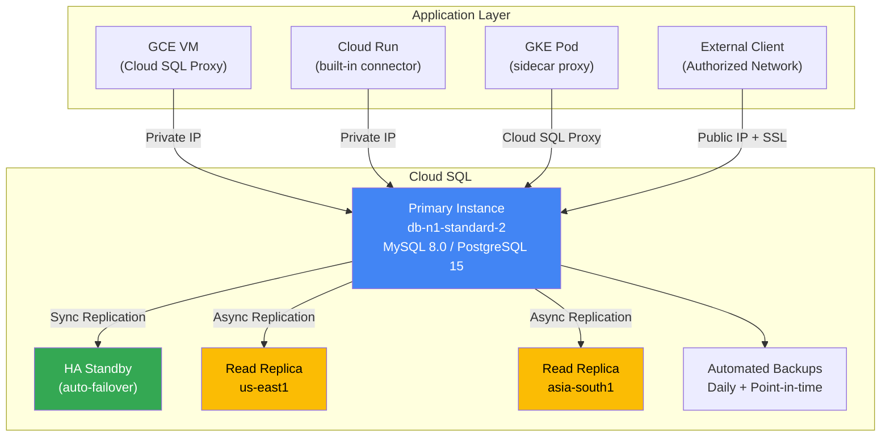
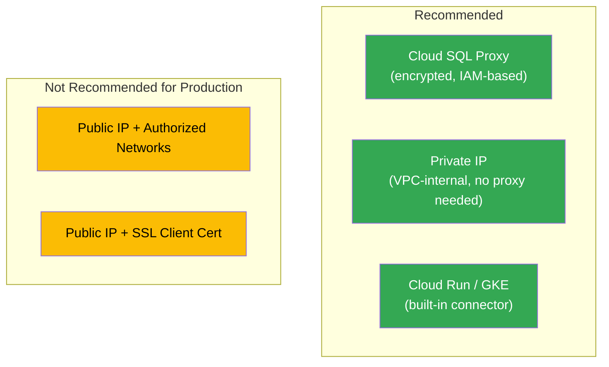
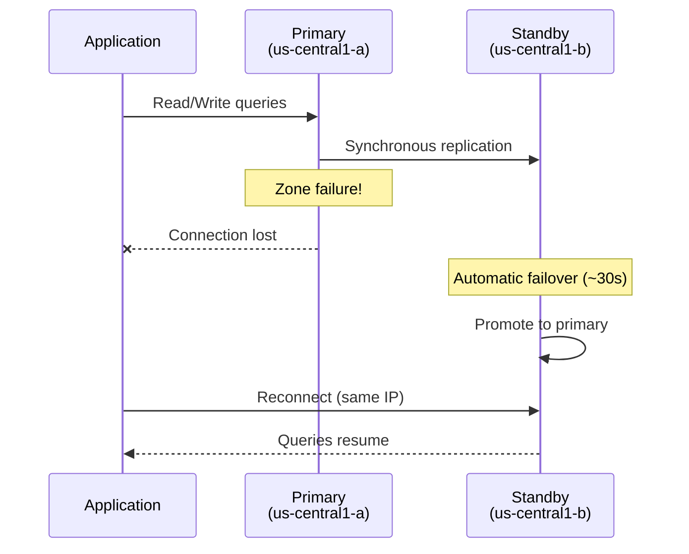

# Cloud SQL — Fully Managed Relational Database

Cloud SQL is a fully managed service for MySQL, PostgreSQL, and SQL Server on Google Cloud.

## Architecture



---

## Prerequisites

```bash
gcloud services enable sqladmin.googleapis.com
gcloud services enable compute.googleapis.com
gcloud config set project YOUR_PROJECT_ID
```

---

## Instance Management

### Create a MySQL Instance

```bash
gcloud sql instances create my-mysql \
    --database-version=MYSQL_8_0 \
    --tier=db-n1-standard-2 \
    --region=us-central1 \
    --storage-size=50GB \
    --storage-type=SSD \
    --storage-auto-increase \
    --backup-start-time=03:00 \
    --availability-type=REGIONAL  # HA with automatic failover
```

### Create a PostgreSQL Instance

```bash
gcloud sql instances create my-postgres \
    --database-version=POSTGRES_15 \
    --tier=db-n1-standard-2 \
    --region=us-central1 \
    --storage-size=50GB \
    --storage-type=SSD \
    --availability-type=ZONAL  # Single zone (cheaper)
```

### Instance Tiers

| Tier | vCPUs | Memory | Use Case |
|------|-------|--------|----------|
| `db-f1-micro` | Shared | 0.6 GB | Dev/test |
| `db-g1-small` | Shared | 1.7 GB | Small apps |
| `db-n1-standard-1` | 1 | 3.75 GB | Light production |
| `db-n1-standard-2` | 2 | 7.5 GB | Standard production |
| `db-n1-standard-4` | 4 | 15 GB | Heavy workloads |
| `db-n1-highmem-8` | 8 | 52 GB | Memory-intensive |

### List / Describe / Delete

```bash
gcloud sql instances list
gcloud sql instances describe my-mysql
gcloud sql instances delete my-mysql --quiet
```

---

## Database & User Management

```bash
# Create a database
gcloud sql databases create myapp_db --instance=my-mysql

# List databases
gcloud sql databases list --instance=my-mysql

# Create a user
gcloud sql users create appuser --host=% \
    --instance=my-mysql --password=StrongPassword123

# Set root password
gcloud sql users set-password root --host=% \
    --instance=my-mysql --password=RootPassword123

# List users
gcloud sql users list --instance=my-mysql

# Delete a user
gcloud sql users delete appuser --host=% --instance=my-mysql
```

---

## Connecting to Cloud SQL

### Connection Methods



### Via gcloud (quick test)

```bash
gcloud sql connect my-mysql --user=root
```

### Via Cloud SQL Proxy (production)

```bash
# Download the proxy
curl -o cloud-sql-proxy \
    https://storage.googleapis.com/cloud-sql-connectors/cloud-sql-proxy/v2.8.0/cloud-sql-proxy.linux.amd64
chmod +x cloud-sql-proxy

# Start the proxy
./cloud-sql-proxy YOUR_PROJECT_ID:us-central1:my-mysql &

# Connect via localhost
mysql -u root -p -h 127.0.0.1 -P 3306
```

### Via Private IP (from a VM in the same VPC)

```bash
# Enable private IP on the instance
gcloud sql instances patch my-mysql \
    --network=default \
    --no-assign-ip  # Disable public IP

# Get the private IP
gcloud sql instances describe my-mysql \
    --format="value(ipAddresses[0].ipAddress)"

# Connect from a VM in the same VPC
mysql -u root -p -h PRIVATE_IP
```

### From Cloud Run

```bash
gcloud run deploy my-service \
    --image=us-central1-docker.pkg.dev/PROJECT_ID/repo/app:v1 \
    --region=us-central1 \
    --add-cloudsql-instances=PROJECT_ID:us-central1:my-mysql \
    --set-env-vars="DB_HOST=/cloudsql/PROJECT_ID:us-central1:my-mysql,DB_USER=appuser,DB_NAME=myapp_db"
```

---

## High Availability & Replication

### HA Failover Flow



### Create a Read Replica

```bash
gcloud sql instances create my-mysql-replica \
    --master-instance-name=my-mysql \
    --region=us-east1 \
    --tier=db-n1-standard-2
```

### Promote a Replica (for migration/failover)

```bash
gcloud sql instances promote-replica my-mysql-replica
```

---

## Backups & Recovery

```bash
# List backups
gcloud sql backups list --instance=my-mysql

# Create an on-demand backup
gcloud sql backups create --instance=my-mysql --description="Before migration"

# Restore from a backup
gcloud sql backups restore BACKUP_ID --restore-instance=my-mysql

# Enable point-in-time recovery
gcloud sql instances patch my-mysql --enable-point-in-time-recovery

# Clone an instance (from a point in time)
gcloud sql instances clone my-mysql my-mysql-clone \
    --point-in-time="2026-06-01T10:00:00Z"
```

---

## Import / Export

```bash
# Export a database to GCS
gcloud sql export sql my-mysql gs://MY_BUCKET/backup.sql \
    --database=myapp_db

# Import from GCS
gcloud sql import sql my-mysql gs://MY_BUCKET/backup.sql \
    --database=myapp_db

# Export as CSV
gcloud sql export csv my-mysql gs://MY_BUCKET/data.csv \
    --database=myapp_db \
    --query="SELECT * FROM users"
```

---

## Maintenance & Monitoring

```bash
# Set maintenance window (Sunday 3 AM)
gcloud sql instances patch my-mysql \
    --maintenance-window-day=SUN \
    --maintenance-window-hour=3

# Resize storage
gcloud sql instances patch my-mysql --storage-size=100GB

# Change tier
gcloud sql instances patch my-mysql --tier=db-n1-standard-4

# View operations (migrations, backups, etc.)
gcloud sql operations list --instance=my-mysql
```

---

## References

- [Cloud SQL documentation](https://cloud.google.com/sql/docs)
- [Cloud SQL Proxy](https://cloud.google.com/sql/docs/mysql/sql-proxy)
- [Pricing](https://cloud.google.com/sql/pricing)
