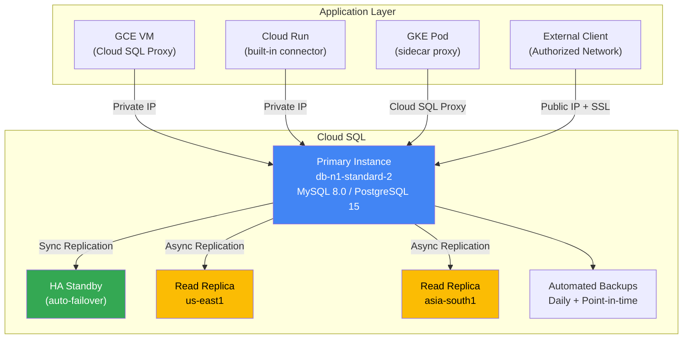
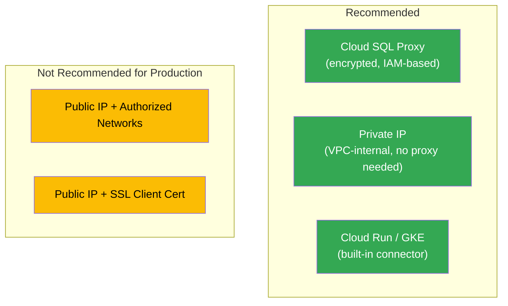
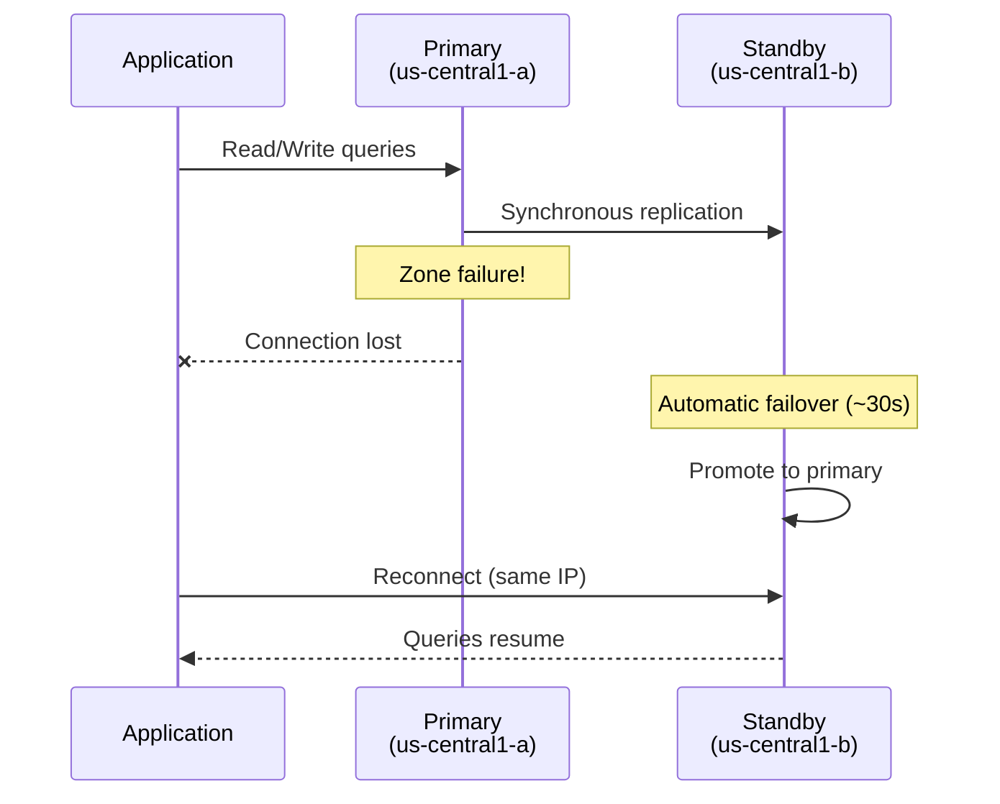
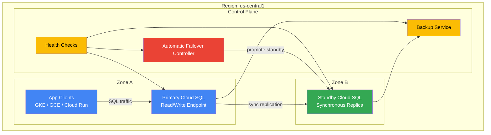
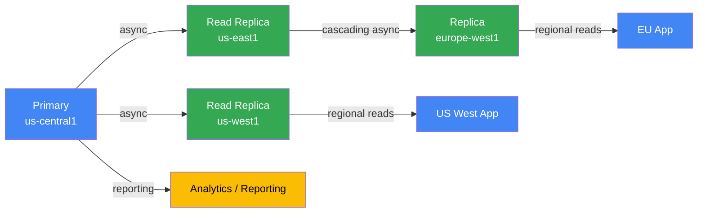
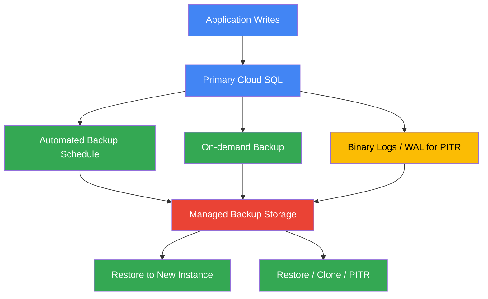
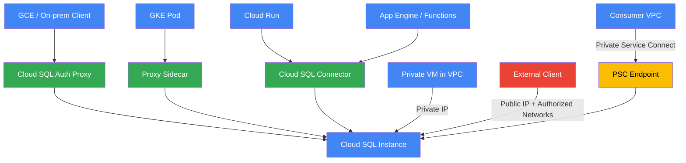
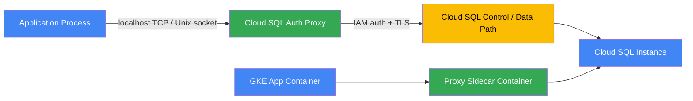
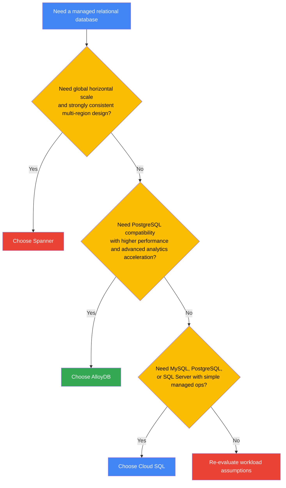

# Cloud SQL — Fully Managed Relational Database

Cloud SQL is a fully managed service for MySQL, PostgreSQL, and SQL Server on Google Cloud.

<!-- workflow-diagram:start -->
## Cloud SQL Setup Workflow

```mermaid
flowchart LR
    Start["Select relational workload"] --> Engine{"Choose engine"}
    Engine -->|MySQL| Sizing["Size CPU / memory / storage"]
    Engine -->|PostgreSQL| Sizing
    Engine -->|SQL Server| Sizing
    subgraph Config["Instance configuration"]
        HA["HA / regional placement"]
        Backup["Backups + PITR"]
        Network["Private IP / authorized access"]
        Flags["DB flags + maintenance"]
    end
    Sizing --> HA
    HA --> Backup
    Backup --> Network
    Network --> Flags
    Flags --> Connect{"Connection method?"}
    Connect -->|Proxy / Connector| App["Apps connect securely"]
    Connect -->|Authorized network| App
    App --> Migrate["Import schema / migrate data"]
    Migrate --> Health{"Replication & health OK?"}
    Health -->|No| Tune["Adjust flags, replicas, or connectivity"]
    Tune --> Connect
    Health -->|Yes| Operate["Monitor, patch, and scale"]
    classDef start fill:#E3F2FD,stroke:#1E88E5,color:#0D47A1;
    classDef config fill:#E8F5E9,stroke:#43A047,color:#1B5E20;
    classDef ops fill:#FFF3E0,stroke:#FB8C00,color:#E65100;
    classDef finish fill:#F3E5F5,stroke:#8E24AA,color:#4A148C;
    class Start,Engine,Sizing start;
    class HA,Backup,Network,Flags,App config;
    class Connect,Migrate,Health,Tune ops;
    class Operate finish;
```

<!-- workflow-diagram:end -->

## Architecture



---

## Prerequisites

```bash
gcloud services enable sqladmin.googleapis.com
gcloud services enable compute.googleapis.com
gcloud config set project YOUR_PROJECT_ID
```

---

## Instance Management

### Create a MySQL Instance

```bash
gcloud sql instances create my-mysql \
    --database-version=MYSQL_8_0 \
    --tier=db-n1-standard-2 \
    --region=us-central1 \
    --storage-size=50GB \
    --storage-type=SSD \
    --storage-auto-increase \
    --backup-start-time=03:00 \
    --availability-type=REGIONAL  # HA with automatic failover
```

### Create a PostgreSQL Instance

```bash
gcloud sql instances create my-postgres \
    --database-version=POSTGRES_15 \
    --tier=db-n1-standard-2 \
    --region=us-central1 \
    --storage-size=50GB \
    --storage-type=SSD \
    --availability-type=ZONAL  # Single zone (cheaper)
```

### Instance Tiers

| Tier | vCPUs | Memory | Use Case |
|------|-------|--------|----------|
| `db-f1-micro` | Shared | 0.6 GB | Dev/test |
| `db-g1-small` | Shared | 1.7 GB | Small apps |
| `db-n1-standard-1` | 1 | 3.75 GB | Light production |
| `db-n1-standard-2` | 2 | 7.5 GB | Standard production |
| `db-n1-standard-4` | 4 | 15 GB | Heavy workloads |
| `db-n1-highmem-8` | 8 | 52 GB | Memory-intensive |

### List / Describe / Delete

```bash
gcloud sql instances list
gcloud sql instances describe my-mysql
gcloud sql instances delete my-mysql --quiet
```

---

## Database & User Management

```bash
# Create a database
gcloud sql databases create myapp_db --instance=my-mysql

# List databases
gcloud sql databases list --instance=my-mysql

# Create a user
gcloud sql users create appuser --host=% \
    --instance=my-mysql --password=StrongPassword123

# Set root password
gcloud sql users set-password root --host=% \
    --instance=my-mysql --password=RootPassword123

# List users
gcloud sql users list --instance=my-mysql

# Delete a user
gcloud sql users delete appuser --host=% --instance=my-mysql
```

---

## Connecting to Cloud SQL

### Connection Methods



### Via gcloud (quick test)

```bash
gcloud sql connect my-mysql --user=root
```

### Via Cloud SQL Proxy (production)

```bash
# Download the proxy
curl -o cloud-sql-proxy \
    https://storage.googleapis.com/cloud-sql-connectors/cloud-sql-proxy/v2.8.0/cloud-sql-proxy.linux.amd64
chmod +x cloud-sql-proxy

# Start the proxy
./cloud-sql-proxy YOUR_PROJECT_ID:us-central1:my-mysql &

# Connect via localhost
mysql -u root -p -h 127.0.0.1 -P 3306
```

### Via Private IP (from a VM in the same VPC)

```bash
# Enable private IP on the instance
gcloud sql instances patch my-mysql \
    --network=default \
    --no-assign-ip  # Disable public IP

# Get the private IP
gcloud sql instances describe my-mysql \
    --format="value(ipAddresses[0].ipAddress)"

# Connect from a VM in the same VPC
mysql -u root -p -h PRIVATE_IP
```

### From Cloud Run

```bash
gcloud run deploy my-service \
    --image=us-central1-docker.pkg.dev/PROJECT_ID/repo/app:v1 \
    --region=us-central1 \
    --add-cloudsql-instances=PROJECT_ID:us-central1:my-mysql \
    --set-env-vars="DB_HOST=/cloudsql/PROJECT_ID:us-central1:my-mysql,DB_USER=appuser,DB_NAME=myapp_db"
```

---

## High Availability & Replication

### HA Failover Flow



### Create a Read Replica

```bash
gcloud sql instances create my-mysql-replica \
    --master-instance-name=my-mysql \
    --region=us-east1 \
    --tier=db-n1-standard-2
```

### Promote a Replica (for migration/failover)

```bash
gcloud sql instances promote-replica my-mysql-replica
```

---

## Backups & Recovery

```bash
# List backups
gcloud sql backups list --instance=my-mysql

# Create an on-demand backup
gcloud sql backups create --instance=my-mysql --description="Before migration"

# Restore from a backup
gcloud sql backups restore BACKUP_ID --restore-instance=my-mysql

# Enable point-in-time recovery
gcloud sql instances patch my-mysql --enable-point-in-time-recovery

# Clone an instance (from a point in time)
gcloud sql instances clone my-mysql my-mysql-clone \
    --point-in-time="2026-06-01T10:00:00Z"
```

---

## Import / Export

```bash
# Export a database to GCS
gcloud sql export sql my-mysql gs://MY_BUCKET/backup.sql \
    --database=myapp_db

# Import from GCS
gcloud sql import sql my-mysql gs://MY_BUCKET/backup.sql \
    --database=myapp_db

# Export as CSV
gcloud sql export csv my-mysql gs://MY_BUCKET/data.csv \
    --database=myapp_db \
    --query="SELECT * FROM users"
```

---

## Maintenance & Monitoring

```bash
# Set maintenance window (Sunday 3 AM)
gcloud sql instances patch my-mysql \
    --maintenance-window-day=SUN \
    --maintenance-window-hour=3

# Resize storage
gcloud sql instances patch my-mysql --storage-size=100GB

# Change tier
gcloud sql instances patch my-mysql --tier=db-n1-standard-4

# View operations (migrations, backups, etc.)
gcloud sql operations list --instance=my-mysql
```

---

## References

- [Cloud SQL documentation](https://cloud.google.com/sql/docs)
- [Cloud SQL Proxy](https://cloud.google.com/sql/docs/mysql/sql-proxy)
- [Pricing](https://cloud.google.com/sql/pricing)

---

## Cloud SQL Editions

Cloud SQL editions help align database capabilities with workload criticality, latency expectations, scalability needs, and operational controls.

### Edition Overview

- **Enterprise** is the standard production edition for most business applications.
- **Enterprise Plus** is optimized for higher availability goals, stricter recovery objectives, larger memory footprints, and faster failover behavior.
- Both editions remain fully managed and support Google Cloud operational automation for patching, backups, maintenance, and monitoring.
- The right edition depends on the balance between cost, resilience, storage throughput, and performance requirements.

### Enterprise vs Enterprise Plus

| Capability | Enterprise | Enterprise Plus | Notes |
|---|---|---|---|
| Primary target | General production workloads | Mission-critical production workloads | Choose based on RTO/RPO and scale expectations |
| Availability options | Zonal or regional | Regional-focused premium posture | HA is more central to Enterprise Plus design |
| Performance envelope | Strong baseline | Higher performance profile | Useful for high-concurrency OLTP |
| Failover expectations | Standard automatic failover | Faster failover profile | Reduces application interruption windows |
| Memory and machine sizing | Broad support | Larger and more optimized options | Validate supported tiers per engine/version |
| Storage performance | Good for standard workloads | Tuned for higher demand | Important for write-heavy workloads |
| Read scaling | Read replicas supported | Read replicas supported | Architecture choice still matters |
| Backups and PITR | Supported | Supported | Recovery planning still required |
| SLA posture | Production-grade | Premium resilience posture | Review current Google Cloud SLA docs |
| Recommended use cases | Line-of-business apps, web apps, departmental systems | Customer-facing critical systems, high-throughput SaaS, strict uptime targets | Match business impact to edition |

### Edition Selection Guidance

Use **Enterprise** when:

- You need a managed relational database with predictable cost.
- Your workload is important but not extremely latency sensitive.
- Standard HA and replica features meet operational goals.
- You prefer to optimize cost before premium performance.

Use **Enterprise Plus** when:

- The application is revenue-critical or customer-facing 24x7.
- Shorter failover windows matter.
- The workload has sustained write pressure or high connection counts.
- Large memory footprints and premium performance are justified.
- You want a more aggressive posture for resilience and scale.

### Edition Design Considerations

1. Start from **business SLOs**, not instance size.
2. Estimate **steady-state and peak TPS/QPS** separately.
3. Model **replica count**, **backup cost**, and **cross-region traffic** together.
4. Validate whether connection pooling or query tuning solves the problem before paying for a bigger edition.
5. Reassess editions during seasonal scaling events, migrations, or major product launches.

### Practical Decision Checklist

| Question | If answer is yes | Likely direction |
|---|---|---|
| Is downtime very expensive? | Yes | Enterprise Plus |
| Is workload moderate and budget-sensitive? | Yes | Enterprise |
| Do you need premium failover behavior? | Yes | Enterprise Plus |
| Is this a non-critical internal tool? | Yes | Enterprise |
| Are write spikes frequent and intense? | Yes | Enterprise Plus |

---

## MySQL Deep Dive

Cloud SQL for MySQL is a managed deployment of MySQL with Google Cloud handling provisioning, patching, backups, replication plumbing, and operational automation.

### Supported MySQL Generations

| Version | Typical Use | Notes |
|---|---|---|
| MySQL 5.7 | Legacy workloads | Use mainly for compatibility and migration staging |
| MySQL 8.0 | Modern default | Better optimizer, roles, JSON support, window functions |

### MySQL 5.7 vs 8.0

| Area | MySQL 5.7 | MySQL 8.0 |
|---|---|---|
| Lifecycle posture | Older generation | Preferred modern generation |
| Data dictionary | File-based metadata | Transactional data dictionary |
| Security | Solid baseline | Better roles and authentication improvements |
| SQL features | Traditional OLTP feature set | CTEs, window functions, invisible indexes |
| JSON | Good | Better functions and usability |
| Upgrade strategy | Migration source | Upgrade target |

### Architecture Notes for MySQL on Cloud SQL

- Storage is managed by Cloud SQL, but engine-level tuning still matters.
- Replication is abstracted operationally, yet write behavior and transaction size still directly affect lag.
- Backup automation does not eliminate the need for logical exports before risky schema changes.
- Application design must still account for transaction isolation, lock contention, and connection storms.

### InnoDB Focus

InnoDB is the default and recommended storage engine for nearly all production workloads on Cloud SQL for MySQL.

#### Why InnoDB matters

- ACID-compliant transactional storage.
- Row-level locking reduces contention compared with coarse locking models.
- Crash recovery is built around redo and undo processing.
- Foreign keys and referential integrity are supported.
- Buffer pool behavior strongly influences read performance.

#### InnoDB design best practices

- Keep transactions short to reduce lock wait chains.
- Index foreign key columns explicitly.
- Use monotonically increasing primary keys when practical to reduce page splits.
- Avoid very large multi-row transactions during peak traffic.
- Separate hot lookup paths from analytic queries.

### Storage Engines

| Engine | Status in Cloud SQL context | Recommendation |
|---|---|---|
| InnoDB | Primary production engine | Use by default |
| MyISAM | Non-transactional legacy engine | Avoid for production OLTP |
| MEMORY | Specialized transient use | Use carefully and minimally |
| CSV | Niche interoperability | Rarely appropriate |

### Character Sets and Collations

Character set choices affect storage size, sorting behavior, index width, and application correctness.

#### Common guidance

- Prefer `utf8mb4` for modern applications.
- Standardize collation choices across schema objects.
- Validate sort behavior for multilingual applications.
- Check index length when migrating from older encodings.

#### Example inspection queries

```sql
SHOW VARIABLES LIKE 'character_set_%';
SHOW VARIABLES LIKE 'collation_%';
SHOW CREATE DATABASE myapp_db;
SHOW FULL COLUMNS FROM users;
```

#### Migration caution points

- Legacy `utf8` is not full UTF-8 in MySQL.
- Collation mismatches can cause unexpected comparison results.
- Application drivers may default to different charsets than the schema.
- Index prefix limits may require schema changes during charset upgrades.

### Slow Query Logs

Slow query logging is one of the most effective first tools for MySQL performance triage.

#### Use cases

- Identify missing indexes.
- Find expensive join patterns.
- Detect ORM-generated anti-patterns.
- Correlate latency spikes with deploy events.

#### What to look for

| Signal | Interpretation |
|---|---|
| High query time | Query is expensive or blocked |
| Low rows examined but high time | Could be lock waits or I/O delays |
| High rows examined | Missing or weak index strategy |
| Frequent repeated pattern | Candidate for query rewrite or caching |

### Performance Schema

Performance Schema provides deep visibility into wait events, statements, stages, and instrumentation.

#### Benefits

- Analyze where time is spent across waits and statements.
- Investigate mutex, lock, and I/O patterns.
- Support more disciplined root-cause analysis than ad hoc log review.

#### Typical investigation areas

- Top statements by latency.
- Wait classes associated with storage or locking.
- Connection churn and authentication overhead.
- Table I/O hotspots.

### MySQL Operational Patterns on Cloud SQL

#### Recommended patterns

- Use read replicas for reporting and read-heavy endpoints.
- Combine Cloud SQL Auth Proxy or connectors with least-privilege users.
- Enable backups and PITR for production workloads.
- Use Query Insights for recurring slow query review.

#### Anti-patterns

- Opening a new connection per request without pooling.
- Running large `ALTER TABLE` operations during business hours without planning.
- Using the primary for heavy analytical scans.
- Treating backup completion as equivalent to tested recovery.

### Sample MySQL Administration Commands

```bash
gcloud sql instances create mysql-prod \
    --database-version=MYSQL_8_0 \
    --region=us-central1 \
    --tier=db-custom-4-15360 \
    --storage-size=200GB \
    --availability-type=REGIONAL

gcloud sql users create appuser --instance=mysql-prod --password='CHANGE_ME'
gcloud sql databases create appdb --instance=mysql-prod
```

### Sample MySQL Diagnostic Queries

```sql
SHOW ENGINE INNODB STATUS\G
SHOW PROCESSLIST;
SHOW VARIABLES LIKE 'innodb_buffer_pool_size';
SHOW GLOBAL STATUS LIKE 'Threads_connected';
SHOW GLOBAL STATUS LIKE 'Threads_running';
EXPLAIN SELECT * FROM orders WHERE customer_id = 42 ORDER BY created_at DESC;
```

### MySQL Migration Checklist

- Inventory schemas, routines, users, and grants.
- Check SQL mode compatibility.
- Validate timezone handling.
- Benchmark representative write and read workloads.
- Validate application behavior after moving to `utf8mb4`.
- Compare 5.7 and 8.0 optimizer behavior for critical queries.

---

## PostgreSQL Deep Dive

Cloud SQL for PostgreSQL offers a managed PostgreSQL experience while preserving the ecosystem benefits that make PostgreSQL attractive for transactional, analytical, geospatial, and extensible workloads.

### PostgreSQL Versions

| Version | Positioning | Notes |
|---|---|---|
| PostgreSQL 12 | Older but still seen in established estates | Often a migration source |
| PostgreSQL 13 | Mature production baseline | Strong compatibility footprint |
| PostgreSQL 14 | Common enterprise target | Improved parallelism and performance |
| PostgreSQL 15 | Modern target version | Strong feature balance |
| PostgreSQL 16 | Newer generation | Validate extension and application compatibility |

### Why PostgreSQL is attractive on Cloud SQL

- Rich SQL standards support.
- Strong extension ecosystem.
- MVCC for concurrency.
- Mature indexing options including B-tree, GIN, GiST, and BRIN.
- Good fit for mixed workloads when properly tuned.

### PostgreSQL Feature Themes by Version

| Theme | 12 | 13 | 14 | 15 | 16 |
|---|---|---|---|---|---|
| Query planner improvements | Good | Better | Better | Better | Better |
| Partitioning maturity | Moderate | Stronger | Stronger | Strong | Strong |
| Vacuum and maintenance efficiency | Baseline | Improved | Improved | Improved | Improved |
| Replication capabilities | Mature | Mature | Mature | Mature | Mature |
| Upgrade desirability | Legacy | Stable | Strong | Preferred | Emerging |

### Extensions on Cloud SQL

Extensions are a major differentiator for PostgreSQL.

#### Commonly used extensions

| Extension | Purpose | Example use case |
|---|---|---|
| `postgis` | Geospatial data and GIS functions | Route planning, geofencing, maps |
| `pgvector` | Vector embeddings storage and search | Semantic retrieval, AI apps |
| `pg_cron` | Scheduled jobs inside PostgreSQL | Cleanup jobs, rollups, task scheduling |
| `pg_stat_statements` | Query tracking | Performance analysis |
| `postgres_fdw` | Foreign data wrapper for PostgreSQL | Cross-database federation |
| `dblink` | Simple remote access patterns | Lightweight remote query execution |

#### Example extension commands

```sql
CREATE EXTENSION IF NOT EXISTS postgis;
CREATE EXTENSION IF NOT EXISTS pgvector;
CREATE EXTENSION IF NOT EXISTS pg_cron;
CREATE EXTENSION IF NOT EXISTS pg_stat_statements;
```

### PostGIS

PostGIS turns PostgreSQL into a spatial database.

- Supports geometry and geography types.
- Enables spatial indexes with GiST.
- Useful for logistics, telecom, asset tracking, and location analytics.
- Requires careful storage and index planning for large polygon datasets.

Example:

```sql
SELECT id
FROM delivery_zones
WHERE ST_Contains(zone_geom, ST_SetSRID(ST_Point(-122.4, 37.78), 4326));
```

### pgvector

`pgvector` brings vector similarity search to PostgreSQL-compatible workloads.

- Store embeddings near transactional metadata.
- Support semantic search prototypes without leaving the relational platform.
- Useful for recommendation systems, document retrieval, and AI-enhanced applications.
- Requires benchmarking around dimensionality, index type, and recall expectations.

Example:

```sql
CREATE TABLE documents (
    id bigserial PRIMARY KEY,
    title text,
    embedding vector(768)
);
```

### pg_cron

`pg_cron` enables scheduled SQL execution.

Typical uses:

- Refresh summary tables.
- Clean temporary rows.
- Trigger retention enforcement.
- Maintain materialized views.

Example:

```sql
SELECT cron.schedule('nightly-vacuum', '0 2 * * *', 'VACUUM ANALYZE public.orders');
```

### Logical Replication

Logical replication is valuable when you need selective replication, version-aware migrations, or event-driven pipelines.

#### Good fit scenarios

- Blue/green migrations.
- Partial table replication.
- CDC-style downstream processing.
- Major version transition strategies.

#### Design cautions

- Large transactions can increase lag.
- Schema changes must be coordinated carefully.
- Not all objects behave the same as physical replication.
- Sequence management and conflict handling require planning.

### Foreign Data Wrappers

FDWs let PostgreSQL query remote systems as foreign tables.

#### Common patterns

- `postgres_fdw` to query another PostgreSQL database.
- Externalization of reference data.
- Transitional architectures during migrations.

#### Example

```sql
CREATE EXTENSION IF NOT EXISTS postgres_fdw;
CREATE SERVER remote_sales FOREIGN DATA WRAPPER postgres_fdw OPTIONS (host '10.10.0.5', dbname 'sales');
```

### PostgreSQL Operational Deep Dive

#### Vacuum and autovacuum

PostgreSQL relies on vacuum to reclaim dead tuples and maintain planner statistics.

- Long-running transactions can block cleanup.
- Hot tables may require closer autovacuum tuning.
- Bloat is a capacity and performance issue, not just cosmetic overhead.
- Monitoring `pg_stat_user_tables` is essential.

#### Index types

| Index Type | Typical use |
|---|---|
| B-tree | Equality, range, ordering |
| GIN | JSONB, full text, arrays |
| GiST | Geospatial, nearest-neighbor patterns |
| BRIN | Very large append-mostly tables |
| Hash | Narrow equality cases, less common |

#### PostgreSQL statistics views worth knowing

```sql
SELECT * FROM pg_stat_activity;
SELECT * FROM pg_stat_database;
SELECT * FROM pg_stat_user_tables ORDER BY n_dead_tup DESC LIMIT 20;
SELECT * FROM pg_stat_statements ORDER BY total_exec_time DESC LIMIT 20;
```

### PostgreSQL Best Practices on Cloud SQL

- Prefer connection pooling for bursty microservices.
- Review autovacuum effectiveness before scaling compute.
- Use extensions intentionally and document dependencies.
- Separate OLTP and analytical reads with replicas where possible.
- Enable query performance tooling early, not after incidents.

### PostgreSQL Migration Checklist

- Inventory extensions and confirm support.
- Validate collation and locale assumptions.
- Check connection pool settings for serverless clients.
- Review sequence behavior after data loads.
- Test logical replication or dump/restore cutover timing.
- Benchmark vacuum behavior under write-heavy traffic.

---

## SQL Server on Cloud SQL

Cloud SQL for SQL Server provides managed SQL Server while reducing operating system and platform administration overhead.

### Supported SQL Server Generations

| Version | Typical use | Notes |
|---|---|---|
| SQL Server 2017 | Legacy enterprise apps | Often seen during migration phases |
| SQL Server 2019 | Broad production adoption | Strong general-purpose choice |
| SQL Server 2022 | Newer feature set | Validate workload and licensing support |

### Typical Workloads

- .NET line-of-business applications.
- ERP and packaged enterprise software.
- Reporting-oriented systems.
- Applications with T-SQL stored procedure dependencies.

### Windows Authentication Considerations

Cloud SQL abstracts the host operating system, so classic assumptions about direct Windows host access do not apply the same way they do on self-managed SQL Server.

Key points:

- Understand supported authentication patterns before migration.
- Separate **database login design** from **infrastructure identity design**.
- Verify whether application connection strings depend on integrated Windows auth semantics.
- Test connection libraries used by legacy .NET workloads.

### Active Directory Integration

For enterprises that use directory-centric identity models, directory integration planning is critical.

Review areas:

- Service account mapping strategy.
- Group-based access design.
- Password rotation expectations.
- Application pool identities and connection delegation patterns.
- Hybrid connectivity requirements from on-premises networks.

### SSRS Considerations

SQL Server Reporting Services is often part of SQL Server estates, but reporting architecture must be evaluated separately when moving to managed database services.

Questions to answer:

- Is SSRS hosted externally or tightly coupled to the database environment?
- Can reports be modernized into Power BI, Looker, or custom services?
- Do reports generate high read pressure that should move to read replicas or exported datasets?

### SQL Server Operational Themes

#### Backup behavior

- Cloud SQL manages backups, but restore testing remains the customer's responsibility.
- Coordinate backup windows with ETL and reporting activity.
- Validate RPO/RTO for transaction-heavy systems.

#### Performance topics

- TempDB-heavy workloads require benchmark validation.
- Index maintenance strategy still matters.
- Parameter sniffing and plan regression analysis remain relevant.
- Reporting workloads should be isolated where possible.

#### Migration considerations

- Inventory CLR usage, linked servers, SQL Agent jobs, SSIS, SSRS, and custom assemblies.
- Review deprecated features.
- Validate collation and case-sensitivity assumptions.
- Test T-SQL compatibility for every critical workload path.

### SQL Server Example Administration Commands

```bash
gcloud sql instances create sqlserver-prod \
    --database-version=SQLSERVER_2019_STANDARD \
    --cpu=4 \
    --memory=15360MiB \
    --region=us-central1 \
    --storage-size=500GB
```

### SQL Server Readiness Checklist

- Validate authentication approach.
- Classify reporting dependencies.
- Inventory scheduled jobs and operational scripts.
- Review licensing and edition alignment.
- Test failover behavior with application connection logic.

---

## High Availability Architecture

Regional high availability is one of the most important Cloud SQL production design choices.

### HA Fundamentals

- A **regional** instance keeps a primary and standby in different zones within the same region.
- Data is synchronously replicated to the standby.
- Automatic failover promotes the standby when primary health checks fail.
- Applications reconnect to the same instance endpoint, but in-flight transactions may still fail and need retry logic.

### HA Mermaid Diagram



### HA Behavior Details

| Topic | Detail |
|---|---|
| Replication type | Synchronous within region |
| Endpoint continuity | Same instance connection target |
| Failure scope handled well | Single-zone outage, primary host failure |
| Failure scope not fully solved | Application bugs, bad queries, logical corruption |
| App requirement | Retry logic and transaction idempotency |
| Cost profile | Higher than zonal due to standby resources |

### Failover Sequence

1. Primary experiences compute, storage, or zone issue.
2. Health system detects failure condition.
3. Standby is promoted automatically.
4. Client connections drop and reconnect.
5. Application resumes after retry and pool refresh.

### HA Design Recommendations

- Use HA for all production systems with strict uptime goals.
- Pair HA with backups and PITR; HA is not a backup strategy.
- Test connection retry logic at the application layer.
- Avoid embedding long-lived transactions in business-critical request flows.

### Cross-Region Readiness

Regional HA handles **in-region** resilience. It does not replace cross-region disaster recovery.

For DR:

- Add cross-region replicas.
- Define promotion runbooks.
- Protect secrets, networking, and DNS dependencies in secondary regions.
- Practice regional failover drills.

---

## Read Replicas

Read replicas help scale reads, isolate reporting, and support disaster recovery patterns.

### Replica Types and Patterns

| Pattern | Description | Best for |
|---|---|---|
| Same-region replica | Async replica in same region | Read scaling with low network latency |
| Cross-region replica | Async replica in different region | DR, global read locality |
| Cascading replica | Replica created from another replica where supported by topology design | Fan-out or staged regional distribution |
| Promoted replica | Independent instance after promotion | Migration cutover or DR event |

### Replication Topology Diagram



### Replica Lag Monitoring

Replica lag is the central health metric for asynchronous replication.

#### What increases lag

- Heavy write bursts on primary.
- Large transactions.
- DDL operations.
- Slow replica storage or CPU.
- Expensive queries running on replica.

#### What to monitor

| Metric or signal | Why it matters |
|---|---|
| Replica lag time | Indicates currency gap |
| CPU utilization | Saturated replica cannot keep up |
| Disk throughput | I/O bottlenecks affect apply speed |
| Network egress/ingress | Cross-region transfer issues can delay apply |
| Long-running queries | Read traffic can interfere with replay |

### Promotion

Replica promotion converts a replica into an independent primary-capable instance.

Use promotion when:

- Performing a planned migration cutover.
- Responding to regional outage scenarios.
- Creating a standalone environment from a production seed.

Example:

```bash
gcloud sql instances promote-replica my-mysql-replica
```

### Replica Best Practices

- Send analytical and reporting reads to replicas.
- Keep app sessions read-only when using replica endpoints.
- Alert on lag thresholds tied to business tolerance.
- Test promotion workflows before emergencies.
- Do not assume zero-data-loss with async replicas.

### Cascading Replica Considerations

- Understand how lag compounds across tiers.
- Avoid fragile fan-out trees without monitoring.
- Document upstream dependencies clearly.
- Validate support and limitations by engine/version.

---

## Backup & Recovery

Backups and recovery planning determine whether an incident becomes a minor interruption or a major outage.

### Backup Layers

- **Automated backups** for scheduled recovery points.
- **On-demand backups** before major schema or release changes.
- **Point-in-time recovery** for accidental deletes or bad deployments.
- **Logical exports** for portability and archive use cases.

### Backup Flow Diagram



### Automated Backups

Automated backups are the foundation of baseline recoverability.

Recommendations:

- Schedule them during low-write periods when practical.
- Ensure backup windows do not collide with heavy ETL.
- Monitor backup success as an SRE signal.
- Document retention and restore ownership.

### On-Demand Backups

Take an on-demand backup before:

- Large schema migrations.
- Major product releases.
- Bulk updates or deletes.
- Engine upgrades.

Command:

```bash
gcloud sql backups create --instance=my-mysql --description="Pre-release backup"
```

### Point-in-Time Recovery (PITR)

PITR uses transaction logs plus base backups to recover to a specific point before an incident.

Good for:

- Accidental table truncation.
- Bad data deployment.
- Partial application corruption.
- Human error recovery.

Example:

```bash
gcloud sql instances patch my-mysql --enable-point-in-time-recovery
```

### Backup Retention Strategy

| Retention concept | Why it matters |
|---|---|
| Short retention | Lower cost, weaker forensic window |
| Medium retention | Good operational default |
| Long retention | Better compliance and recovery history |
| Export archive | Useful for legal hold or migration portability |

### Restore Patterns

| Pattern | Best use |
|---|---|
| Restore in place | Controlled maintenance recovery |
| Restore to new instance | Safer forensic analysis and validation |
| Clone from point in time | Fast environment recreation |
| Logical import | Selective object recovery |

### Export / Import as Recovery Companion

Exports are not a substitute for managed backups, but they are useful for:

- Cross-project moves.
- Long-term archival.
- Partial restores.
- Dev/test seeding.

### Recovery Runbook Checklist

1. Identify scope: infra failure, logical corruption, or app bug.
2. Freeze high-risk write activity if needed.
3. Decide between failover, restore, PITR, or replica promotion.
4. Restore into isolated target when validation is required.
5. Validate row counts, application smoke tests, and data freshness.
6. Update DNS, connection strings, or traffic policy.
7. Document exact recovery timeline and lessons learned.

---

## Connection Methods

Connection design is where security, latency, networking, and operational simplicity intersect.

### Connection Path Diagram



### Method Comparison

| Method | Security posture | Operational complexity | Best for |
|---|---|---|---|
| Cloud SQL Auth Proxy | Strong | Moderate | Most application workloads |
| Cloud SQL Connectors | Strong | Low to moderate | Modern app runtimes |
| Private IP | Strong with VPC controls | Moderate network setup | Internal east-west traffic |
| Public IP + authorized networks | Weaker than private designs | Low initial setup | Temporary access, admin use |
| Private Service Connect | Strong isolation model | Higher network planning | Shared service connectivity |

### Cloud SQL Proxy

- Uses IAM and secure connectivity patterns.
- Avoids distributing static SSL client certificates in many cases.
- Works well for bastions, local development, and controlled production patterns.

### Cloud SQL Connectors

Connectors are available for common languages such as Java, Python, and Go.

Benefits:

- Simplify secure connectivity.
- Integrate well with serverless runtimes.
- Reduce manual TLS and certificate handling.
- Support IAM-aware connection models.

### Private IP

Use Private IP when:

- Applications run inside Google Cloud or connected networks.
- You want traffic to remain on internal networking.
- Centralized VPC design is already in place.

### Public IP + Authorized Networks

Acceptable only when carefully controlled.

Best practices:

- Restrict source CIDRs tightly.
- Use SSL/TLS where appropriate.
- Rotate admin access paths.
- Avoid exposing production write databases broadly.

### Private Service Connect

PSC can expose managed services privately to consumer VPCs.

Use cases:

- Shared services architectures.
- Cross-project service consumption.
- Controlled private reachability without broad network peering assumptions.

### Connection Design Checklist

- Choose least-exposed network path.
- Align authentication with IAM and secrets strategy.
- Add connection pooling for bursty traffic.
- Benchmark latency from each runtime.
- Validate failover behavior across the chosen path.

---

## Cloud SQL Auth Proxy

The Cloud SQL Auth Proxy is a common and recommended security pattern for Cloud SQL connectivity.

### What it does

- Authenticates using IAM-aware credentials.
- Establishes encrypted connections automatically.
- Removes the need for direct database exposure in many designs.
- Simplifies certificate lifecycle handling.

### Auth Proxy Architecture Diagram



### IAM-Based Auth

The proxy supports IAM-aware connectivity, which enables tighter control over who or what can connect.

Advantages:

- Fewer long-lived secrets.
- Better auditability.
- Easier alignment with service account identity.
- Cleaner onboarding for new workloads.

### Automatic Encryption

The proxy automatically handles encrypted transport.

This helps by:

- Reducing manual TLS configuration burden.
- Lowering certificate misconfiguration risk.
- Standardizing secure-by-default connectivity patterns.

### Sidecar Pattern for GKE

The sidecar pattern is common in Kubernetes.

Benefits:

- Application talks to localhost.
- Proxy handles auth and transport.
- Per-pod identity and security boundaries are easier to reason about.
- Rotation and rollout are integrated with deployment lifecycle.

Example pod-level concept:

- App container listens on business port.
- Proxy sidecar listens on localhost database port.
- Workload Identity maps Kubernetes service account to Google service account.
- Pod connects without embedding database network logic in app code.

### Operational Best Practices

- Use least-privilege service accounts.
- Monitor proxy restarts and readiness failures.
- Combine with Secret Manager for database credentials when IAM DB auth is not used.
- Avoid excessive per-request connection creation through the proxy.

---

## Performance Tuning

Cloud SQL is managed, but performance still depends heavily on schema design, query shape, connection behavior, and engine-specific tuning.

### Tuning Layers

1. **Query design**
2. **Index strategy**
3. **Connection management**
4. **Database flags**
5. **Compute and storage sizing**
6. **Read scaling and workload isolation**

### Database Flags

Database flags allow targeted tuning by engine.

Examples of tuning themes:

- MySQL buffer and logging behavior.
- PostgreSQL planner, work memory, autovacuum, and statement logging controls.
- SQL Server engine-specific runtime behavior.

Example patch command:

```bash
gcloud sql instances patch pg-prod \
    --database-flags=log_min_duration_statement=500,shared_buffers=262144
```

### Query Insights and Slow Query Analysis

Use Query Insights and engine-native logging together.

Investigate:

- Top queries by average latency.
- Queries with high variance.
- Lock-related waits.
- Statements that regress after deploys.

### Connection Pooling

Connection storms are a frequent source of avoidable latency and instability.

Best practices:

- Pool connections in application runtimes.
- Set sensible max pool size by service.
- Avoid serverless fan-out opening unbounded sessions.
- Tune idle timeout and lifetime settings.

### PgBouncer

PgBouncer is a lightweight PostgreSQL connection pooler.

When useful:

- Large fleets of short-lived app instances.
- Serverless workloads.
- Multi-tenant SaaS with many app workers.

Cautions:

- Match pooling mode to application transaction behavior.
- Validate prepared statement compatibility.
- Place it where network and HA assumptions are clear.

### ProxySQL

ProxySQL is commonly used with MySQL ecosystems.

Typical benefits:

- Connection multiplexing.
- Query routing.
- Read/write split patterns.
- Centralized traffic policy.

### Performance Tuning Checklist

| Area | Question |
|---|---|
| Query plans | Did plans change after version upgrade or stats update? |
| Indexes | Are high-cost queries using selective indexes? |
| Locking | Are latency spikes caused by waits rather than CPU? |
| Pooling | Are too many app connections exhausting resources? |
| Storage | Is disk throughput the bottleneck? |
| Replicas | Can read-heavy traffic be isolated? |

### Practical Tuning Workflow

1. Capture top pain point by user-visible latency.
2. Identify top statements and waits.
3. Fix query/index issues first.
4. Add pooling if connection pressure is visible.
5. Resize compute/storage only after evidence supports it.
6. Re-test with production-like concurrency.

---

## Maintenance Windows

Maintenance planning reduces surprise and keeps operational changes inside predictable business boundaries.

### Scheduled Maintenance

Cloud SQL can apply maintenance during configured windows.

Benefits:

- Predictable operational timing.
- Easier stakeholder communication.
- Lower disruption for user-facing systems.

### Self-Service Maintenance

Self-service maintenance allows teams to control *when* certain maintenance is applied rather than waiting for a vendor-selected time.

Why it matters:

- Better coordination with release calendars.
- More control over readiness checks.
- Easier staffing alignment for support coverage.

### Deny Maintenance Periods

Use deny periods when maintenance should not occur during:

- Black Friday / Cyber Monday events.
- Financial close periods.
- Large product launches.
- Regulated business freeze windows.

### Maintenance Planning Table

| Control | Purpose | Example |
|---|---|---|
| Maintenance window | Preferred recurring update time | Sunday 03:00 local |
| Self-service maintenance | Operator-chosen execution date | Trigger patch after testing |
| Deny period | Protected no-maintenance interval | Year-end change freeze |

### Maintenance Commands

```bash
gcloud sql instances patch my-mysql \
    --maintenance-window-day=SUN \
    --maintenance-window-hour=3
```

### Maintenance Best Practices

- Notify application owners before planned windows.
- Validate failover and reconnection behavior after maintenance.
- Pause risky schema changes near maintenance windows.
- Review pending maintenance status routinely.

---

## Cloud SQL Insights

Cloud SQL Insights provides performance observability for query analysis, waits, and workload patterns.

### What Insights helps with

- Query performance ranking.
- Latency decomposition.
- Lock analysis and blocking patterns.
- Recommendations around problematic statements.
- Historical dashboarding for trend analysis.

### Core Value Areas

| Area | What you learn |
|---|---|
| Query performance | Which statements consume the most time |
| Lock analysis | Which sessions or tables create contention |
| Recommendations | Which queries or indexes may need attention |
| Dashboard view | How workload shape changes over time |

### Dashboard Usage Patterns

- Review top queries after releases.
- Compare normal vs incident periods.
- Check whether a spike was CPU, I/O, or locks.
- Share evidence with developers instead of vague “database is slow” reports.

### Insights Workflow

1. Open top SQL by latency.
2. Identify whether the problem is frequency, duration, or contention.
3. Correlate with deploy time and app version.
4. Reproduce with `EXPLAIN` or execution plan analysis.
5. Apply fix and verify in dashboard trend lines.

### Lock Analysis

Locks are often invisible until user latency spikes.

Investigate:

- Long-running transactions.
- Hot rows or tables.
- DDL overlapping with OLTP traffic.
- Missing indexes causing broad row scans and lock amplification.

---

## Data Import/Export

Import and export workflows support migration, data sharing, compliance, seeding, and operational recovery.

### Supported Patterns

| Pattern | Use case |
|---|---|
| SQL export/import | Full schema and data migration |
| CSV export/import | Table-level data exchange |
| Cloud Storage mediated transfer | Managed data movement via GCS |
| Native dump tools | Fine-grained or portable migration |

### gcloud Import / Export Examples

```bash
gcloud sql export sql my-mysql gs://my-bucket/full-backup.sql --database=myapp_db
gcloud sql import sql my-mysql gs://my-bucket/full-backup.sql --database=myapp_db
gcloud sql export csv my-mysql gs://my-bucket/users.csv --database=myapp_db --query="SELECT * FROM users"
```

### Using mysqldump

`mysqldump` is useful for:

- Portable MySQL exports.
- Selective logical backup.
- Schema-only or data-only workflows.
- Pre-migration validation.

Example:

```bash
mysqldump -h 127.0.0.1 -u root -p --databases myapp_db > myapp_db.sql
```

### Using pg_dump

`pg_dump` is useful for PostgreSQL logical backup and migration scenarios.

Example:

```bash
pg_dump "host=127.0.0.1 port=5432 user=postgres dbname=appdb" > appdb.sql
```

### Import / Export Best Practices

- Use Cloud Storage for large managed transfer patterns.
- Compress large dumps where appropriate.
- Validate import order for schemas with dependencies.
- Test restore duration, not just export success.
- Avoid running heavy exports during peak write periods.

### CSV Considerations

- Validate delimiters, quoting, and null handling.
- Ensure encoding consistency.
- Normalize timestamps and time zones.
- Confirm header behavior expected by downstream tools.

---

## IAM Database Authentication

IAM Database Authentication helps reduce reliance on static database passwords for certain workflows.

### IAM Users for PostgreSQL

Cloud SQL for PostgreSQL can integrate IAM identities for database login patterns.

Benefits:

- Centralized access control.
- Easier revocation and lifecycle management.
- Better alignment with service account identity.
- Reduced password sprawl.

### Auto IAM Auth

Automatic IAM authentication is useful for modern workloads using connectors or the Auth Proxy.

Operational value:

- Applications authenticate with cloud identity.
- Token-based flows reduce secret distribution.
- Auditability improves when mapped to IAM principals.

### IAM Conditions

IAM conditions let you narrow access policy based on context.

Examples of control ideas:

- Limit access to specific environments.
- Restrict to service accounts from approved workloads.
- Apply time-bound access for temporary admin needs.

### IAM DB Auth Best Practices

- Use separate identities for apps, admins, and automation.
- Pair IAM auth with least-privilege database grants.
- Monitor failed authentication attempts.
- Document how emergency break-glass access works.

---

## Cloud SQL Federation

Cloud SQL participates in broader Google Cloud data architectures rather than existing only as a standalone OLTP system.

### BigQuery Federated Queries

Federated access patterns let BigQuery query operational data without always copying it first.

Benefits:

- Fast analytics prototyping.
- Reduced initial data pipeline work.
- Useful for small to moderate operational reporting.

Trade-offs:

- Not ideal for heavy repeated warehouse-scale analytics.
- Operational databases should not become ad hoc BI backends.
- Performance and concurrency impact must be assessed.

### Datastream for CDC

Datastream supports change data capture into downstream systems.

Common use cases:

- Near-real-time analytics pipelines.
- Synchronization into BigQuery or data lakes.
- Event-driven architectures.
- Migration with minimal cutover windows.

### Federation Design Guidance

- Use federation for agility, not as a substitute for warehouse design.
- Protect the primary with quotas, replicas, or extraction architecture.
- Define clear ownership between OLTP and analytics teams.
- Document freshness expectations and failure handling.

---

## Pricing

Cloud SQL pricing depends on compute, storage, backups, networking, and optional architectural choices such as HA and cross-region replicas.

### Pricing Drivers

| Cost dimension | What influences it |
|---|---|
| Compute | Tier, vCPU, memory, edition |
| Storage | SSD/HDD choice, allocated size, auto-growth |
| Backup storage | Retention and backup volume |
| Network egress | Cross-region traffic and external connectivity |
| HA premium | Standby capacity and regional architecture |
| Read replicas | Additional instances and storage |

### Per-Second Billing

Cloud SQL commonly uses granular billing models that align cost more closely with actual runtime rather than coarse monthly constructs.

Why it matters:

- More precise non-production economics.
- Better environment scheduling efficiency.
- Easier cost modeling for temporary workloads.

### Committed Use Discounts

Committed use discounts can improve economics for stable, long-lived workloads.

Best for:

- Predictable production estates.
- Large fleet footprints.
- Capacity that rarely scales down.

### Storage Pricing Considerations

- SSD generally costs more than HDD but is preferred for production OLTP.
- Auto-storage increase protects availability but can surprise budget owners without alerts.
- Large indexes and retained dead tuples increase effective storage cost.

### Network Egress

Cross-region replicas and external clients can add egress cost.

Watch for:

- Inter-region replication traffic.
- Export/import movement.
- DR drills that move large volumes.
- Applications reading from non-local regions.

### Cost Optimization Checklist

- Right-size compute after measuring, not guessing.
- Use replicas only where value is clear.
- Archive old data.
- Tune queries before buying bigger machines.
- Review backup retention for compliance vs cost balance.

---

## Cloud SQL vs AlloyDB vs Spanner

Choosing among Google Cloud relational platforms requires matching the database to workload characteristics rather than picking the most advanced product by default.

### High-Level Positioning

| Service | Best for | Key strength |
|---|---|---|
| Cloud SQL | Traditional managed relational workloads | Simplicity and broad engine support |
| AlloyDB | PostgreSQL-compatible high performance workloads | Advanced PostgreSQL performance architecture |
| Spanner | Global scale relational systems with horizontal scale and strong consistency | Planet-scale architecture |

### Decision Tree Diagram



### When to Choose Cloud SQL

- You need MySQL, PostgreSQL, or SQL Server.
- Operational simplicity is the top priority.
- Vertical scaling plus replicas is sufficient.
- Application architecture expects a familiar RDBMS model.

### When to Choose AlloyDB

- You want PostgreSQL compatibility with higher performance ambitions.
- Analytical acceleration inside the database is valuable.
- You want advanced operational capabilities around PostgreSQL-intensive workloads.

### When to Choose Spanner

- You need globally distributed relational scale.
- Very high write scale and strong consistency matter.
- Horizontal scale is a first-order requirement.
- You can accept a different operational and schema design model.

### Decision Questions

1. Does the workload need global active patterns?
2. Is PostgreSQL compatibility mandatory?
3. Is SQL Server support required?
4. Is the team ready for Spanner data modeling?
5. Will vertical scaling plus replicas hit a ceiling soon?

---

## AlloyDB

AlloyDB is Google Cloud's PostgreSQL-compatible database platform aimed at higher performance and more advanced data processing capabilities.

### Key Characteristics

- PostgreSQL compatible.
- Designed for high performance.
- Includes architectural enhancements beyond standard PostgreSQL deployments.
- Fits transactional workloads that also need richer analytical acceleration.

### Columnar Engine

The columnar engine helps accelerate analytical queries without abandoning PostgreSQL compatibility.

Use cases:

- Hybrid transactional and analytical reporting.
- Dashboard queries over operational data.
- Faster aggregations on selected workloads.

### Adaptive Autovacuum

Adaptive autovacuum behavior is valuable because vacuum tuning is a major source of PostgreSQL operational toil.

Benefits:

- Better responsiveness to table activity.
- Reduced manual tuning burden.
- Improved maintenance behavior for changing workloads.

### ML Integration

AlloyDB aligns well with modern data applications that blend transactional systems and machine learning adjacent workflows.

Potential patterns:

- Embedding-aware applications.
- Feature-serving adjacent relational systems.
- AI-enriched search and recommendation backends.

### Cross-Region Replication

Cross-region replication supports stronger disaster recovery and geographic distribution patterns.

Plan for:

- RPO/RTO expectations.
- Regional app failover design.
- Cost of replicated storage and traffic.
- Consistency expectations for read paths.

### AlloyDB vs Cloud SQL PostgreSQL

| Area | Cloud SQL for PostgreSQL | AlloyDB |
|---|---|---|
| Goal | Managed PostgreSQL simplicity | Higher-performance PostgreSQL-compatible platform |
| Operational model | Familiar managed DB service | More specialized performance-oriented service |
| Engine support | PostgreSQL only within Cloud SQL section | PostgreSQL compatible |
| Analytics acceleration | Standard PostgreSQL patterns | Columnar acceleration capabilities |
| Use case | General transactional workloads | Performance-intensive PostgreSQL workloads |

### When AlloyDB is a strong fit

- PostgreSQL-compatible app with rapidly growing scale.
- High concurrency OLTP plus dashboard analytics.
- Teams already skilled in PostgreSQL who need more headroom.
- Platform modernization from self-managed PostgreSQL clusters.

---

## Operational Runbooks and Examples

The following reference material expands the practical day-2 operations view of Cloud SQL.

### Common Instance Lifecycle Commands

```bash
# List instances
gcloud sql instances list

# Describe an instance
gcloud sql instances describe my-postgres

# Patch machine tier
gcloud sql instances patch my-postgres --tier=db-custom-4-15360

# Resize disk
gcloud sql instances patch my-postgres --storage-size=500GB

# Restart an instance
gcloud sql instances restart my-postgres
```

### Common Database Commands

```bash
# PostgreSQL database creation
gcloud sql databases create appdb --instance=my-postgres

# MySQL user creation
gcloud sql users create reporting --host=% --instance=my-mysql --password='CHANGE_ME'

# List operations
gcloud sql operations list --instance=my-postgres
```

### Example Production Checklist

#### Networking

- Prefer private connectivity.
- Restrict public access aggressively.
- Document firewall and authorized network rules.
- Test cross-project and hybrid connectivity.

#### Security

- Use least-privilege IAM roles.
- Rotate passwords or adopt IAM DB authentication.
- Audit admin access paths.
- Use Secret Manager for application credentials.

#### Availability

- Use regional HA for critical workloads.
- Add replicas for DR and read scale.
- Test failover and promotion.
- Measure app retry behavior.

#### Recoverability

- Enable automated backups.
- Enable PITR where supported and required.
- Test restores quarterly or more often.
- Keep export-based migration backups for major changes.

#### Performance

- Turn on Insights or equivalent monitoring.
- Review top queries regularly.
- Tune connection pools.
- Reassess indexes after feature launches.

### Sample Postgres Health Queries

```sql
SELECT now();
SELECT datname, numbackends, xact_commit, xact_rollback FROM pg_stat_database;
SELECT pid, usename, state, wait_event_type, wait_event, query FROM pg_stat_activity;
SELECT relname, n_live_tup, n_dead_tup FROM pg_stat_user_tables ORDER BY n_dead_tup DESC LIMIT 20;
```

### Sample MySQL Health Queries

```sql
SHOW GLOBAL STATUS LIKE 'Uptime';
SHOW GLOBAL STATUS LIKE 'Questions';
SHOW GLOBAL STATUS LIKE 'Innodb_buffer_pool_reads';
SHOW GLOBAL STATUS LIKE 'Innodb_row_lock_time';
SHOW FULL PROCESSLIST;
```

### Example Incident Decision Matrix

| Incident | Primary action | Secondary action |
|---|---|---|
| Zone failure | Let HA failover occur | Validate app reconnects |
| Bad data deployment | PITR or restore to new instance | Compare and selectively recover |
| Read saturation | Shift reads to replicas | Add indexing or cache |
| Connection exhaustion | Enable or tune pooling | Resize only if necessary |
| Region outage | Promote cross-region replica | Redirect app traffic |

### DR Drill Outline

1. Confirm replica health.
2. Freeze nonessential writes.
3. Promote selected replica.
4. Update app connectivity.
5. Run smoke tests.
6. Measure actual recovery time.
7. Record deviations from plan.

---

## Expanded Best Practices

### Schema Design

- Use primary keys on every table.
- Keep indexes aligned with actual query patterns.
- Avoid oversized unbounded text where not needed.
- Partition or archive very large historical tables if engine patterns support it.

### Application Design

- Implement exponential backoff for transient failures.
- Keep transactions narrow and short.
- Make retry paths idempotent.
- Separate OLTP and reporting workloads.

### Governance

- Tag instances by environment and owner.
- Define maintenance owners and escalation paths.
- Track engine versions and upgrade plans centrally.
- Review database access quarterly.

### Monitoring Signals Worth Alerting On

| Signal | Why alert |
|---|---|
| CPU sustained high | Potential saturation or bad query release |
| Storage near limit | Prevent outages from exhausted disk |
| Replica lag high | DR and read freshness risk |
| Backup failure | Recoverability risk |
| Connection count high | Possible pool misconfiguration |
| Lock wait spikes | User-facing latency risk |

### Upgrade Planning

- Review engine version support windows.
- Test application compatibility in staging.
- Benchmark representative workloads pre/post upgrade.
- Freeze risky releases during upgrade windows.
- Keep rollback or fallback plan documented.

---

## Example Architecture Patterns

### Pattern 1: Standard Web Application

- Cloud Run service.
- Cloud SQL for PostgreSQL.
- Cloud SQL Connector.
- Regional HA primary.
- One read replica for reporting.

### Pattern 2: Enterprise Internal Platform

- GKE application tier.
- Cloud SQL Auth Proxy sidecars.
- Private IP only.
- Regional primary plus cross-region replica.
- IAM database authentication for service workloads.

### Pattern 3: Legacy Migration Platform

- Hybrid connectivity from on-premises.
- Cloud SQL for SQL Server or MySQL.
- Temporary public/admin path during cutover.
- Managed backups plus export safety net.
- Phased transition to private networking.

### Pattern 4: Analytics-Adjacent PostgreSQL

- Operational writes on Cloud SQL PostgreSQL.
- BigQuery federated exploration for lightweight analytics.
- Datastream for CDC into downstream analytics platform.
- Query Insights for workload governance.

---

## Troubleshooting Reference

### Connectivity Issues

Check:

- IAM permissions.
- Authorized networks or private route reachability.
- Proxy startup logs.
- Service account identity mapping.
- Database user and password validity.

### Latency Issues

Check:

- Top queries by runtime.
- Lock waits.
- Connection pool exhaustion.
- CPU and memory pressure.
- Replica routing mistakes causing stale or overloaded reads.

### Replication Issues

Check:

- Lag trend over time.
- Write spikes on primary.
- Network health across regions.
- Long queries on replicas.
- DDL or maintenance event timing.

### Backup Issues

Check:

- Backup completion logs.
- Retention configuration.
- Storage growth and quota posture.
- Restore test recency.
- PITR window alignment with policy.

---

## Quick Command Reference

### Instance

```bash
gcloud sql instances list
gcloud sql instances describe my-instance
gcloud sql instances patch my-instance --tier=db-custom-2-7680
gcloud sql instances restart my-instance
```

### Backups

```bash
gcloud sql backups list --instance=my-instance
gcloud sql backups create --instance=my-instance --description="manual"
gcloud sql backups restore BACKUP_ID --restore-instance=my-instance
```

### Replication

```bash
gcloud sql instances create replica-1 --master-instance-name=my-instance --region=us-east1
gcloud sql instances promote-replica replica-1
```

### Export / Import

```bash
gcloud sql export sql my-instance gs://bucket/backup.sql --database=mydb
gcloud sql import sql my-instance gs://bucket/backup.sql --database=mydb
```

---

## Summary

Cloud SQL is often the right managed relational choice when teams want familiar engines, reduced operational burden, and tight integration with Google Cloud networking, IAM, backup, and observability features.

This expanded guide now covers:

- Editions and service positioning.
- Engine-specific deep dives for MySQL, PostgreSQL, and SQL Server.
- HA, replicas, backup, and recovery architecture.
- Connection patterns, Auth Proxy, and IAM database auth.
- Performance tuning, Insights, maintenance, and pricing.
- Federation with BigQuery and Datastream.
- Strategic comparison with AlloyDB and Spanner.

For production deployments, combine the platform features in this order:

1. Secure connectivity.
2. High availability.
3. Backup and tested recovery.
4. Observability and tuning.
5. Cost and architecture optimization.

