# Compute Engine — Reference Guides

This directory contains reference documentation for Google Compute Engine disk operations.

<!-- workflow-diagram:start -->
## Compute Engine Lifecycle Workflow

```mermaid
flowchart LR
    Req["Provision VM"] --> Policy["Choose machine, disk, zone"]
    Policy --> Quota{"Quota available?"}
    Quota -->|No| Adjust["Resize request / free capacity"]
    Adjust --> Policy
    Quota -->|Yes| Template
    subgraph Build["Provisioning"]
        Template["Instance template"] --> Disk["Attach boot / data disks"]
        Disk --> Net["Bind VPC + firewall"]
        Net --> Create["Create instance"]
    end
    Create --> Boot["Boot + startup script"]
    Boot --> Health{"Healthy?"}
    Health -->|No| Repair["Troubleshoot / recreate"]
    Repair --> Boot
    Health -->|Yes| Serve["Serve workload"]
    Serve --> Scale["Snapshot / resize / MIG"]
    Scale --> Stop{"Suspend, stop, or delete?"}
    Stop -->|Suspend or Stop| Park["Preserve disks + state"]
    Stop -->|Delete| Cleanup["Release IPs + remove disks"]
    classDef start fill:#E3F2FD,stroke:#1E88E5,color:#0D47A1;
    classDef build fill:#E8F5E9,stroke:#43A047,color:#1B5E20;
    classDef decision fill:#FFF3E0,stroke:#FB8C00,color:#E65100;
    classDef finish fill:#FCE4EC,stroke:#D81B60,color:#880E4F;
    class Req,Policy start;
    class Template,Disk,Net,Create,Boot,Serve,Scale,Park build;
    class Quota,Health,Stop,Adjust,Repair decision;
    class Cleanup finish;
```

<!-- workflow-diagram:end -->

## Files

| File | Description |
|------|-------------|
| [`disks.md`](./disks.md) | Persistent disk operations: create, attach, resize, format, mount, and fstab persistence |

## Quick Reference

```bash
# Create a VM
gcloud compute instances create my-vm \
    --zone=us-central1-a \
    --machine-type=e2-medium \
    --image-family=debian-11 \
    --image-project=debian-cloud

# Create and attach a disk
gcloud compute disks create my-disk --type=pd-ssd --size=100GB --zone=us-central1-a
gcloud compute instances attach-disk my-vm --disk=my-disk --zone=us-central1-a

# SSH into the VM
gcloud compute ssh my-vm --zone=us-central1-a
```

For detailed disk operations (formatting, mounting, fstab), see [`disks.md`](./disks.md).

For comprehensive GCE guides including startup scripts, images, snapshots, instance groups, and load balancers, see the [`V2/Google_Compute_Engine/`](../V2/Google_Compute_Engine/) directory.
