# Kubernetes Architecture Decision Guide for GCP (GKE)

> Architect-level guide for GKE cluster selection, networking, ingress, API management, service mesh, storage, security, observability, and production readiness.

**Audience:** platform architects, Kubernetes platform teams, network architects, security architects, SREs, and API platform owners.

**Official Google Cloud references**
- [GKE overview](https://cloud.google.com/kubernetes-engine/docs/concepts/kubernetes-engine-overview)
- [Autopilot overview](https://cloud.google.com/kubernetes-engine/docs/concepts/autopilot-overview)
- [Standard clusters](https://cloud.google.com/kubernetes-engine/docs/concepts/standard-overview)
- [Gateway API on GKE](https://cloud.google.com/kubernetes-engine/docs/how-to/deploying-gateways)
- [Anthos Service Mesh overview](https://cloud.google.com/service-mesh/docs/overview)
- [Workload Identity Federation for GKE](https://cloud.google.com/kubernetes-engine/docs/how-to/workload-identity)
- [Managed Service for Prometheus](https://cloud.google.com/stackdriver/docs/managed-prometheus)
- [Backup for GKE](https://cloud.google.com/kubernetes-engine/docs/add-on/backup-for-gke/concepts/backup-for-gke)

## Table of Contents

1. [Architecture principles](#architecture-principles)
2. [Cluster type selection](#cluster-type-selection)
3. [Networking](#networking)
4. [Ingress controllers](#ingress-controllers)
5. [API management](#api-management)
6. [Service mesh](#service-mesh)
7. [Storage](#storage)
8. [Security](#security)
9. [Monitoring](#monitoring)
10. [Production checklist](#production-checklist)
11. [Appendix: GKE architecture review checklist](#appendix-gke-architecture-review-checklist)

## Architecture principles

Choose GKE because Kubernetes capabilities create value, not because Kubernetes is fashionable.

- Prefer Cloud Run over GKE for simple stateless services when Kubernetes-specific features are not required.
- Standardize a small number of cluster patterns instead of letting every team invent its own.
- Treat networking, identity, and observability as platform products.
- Use private clusters, Workload Identity Federation, and policy enforcement by default.
- Use GitOps or CI/CD pipelines so cluster changes are auditable and repeatable.

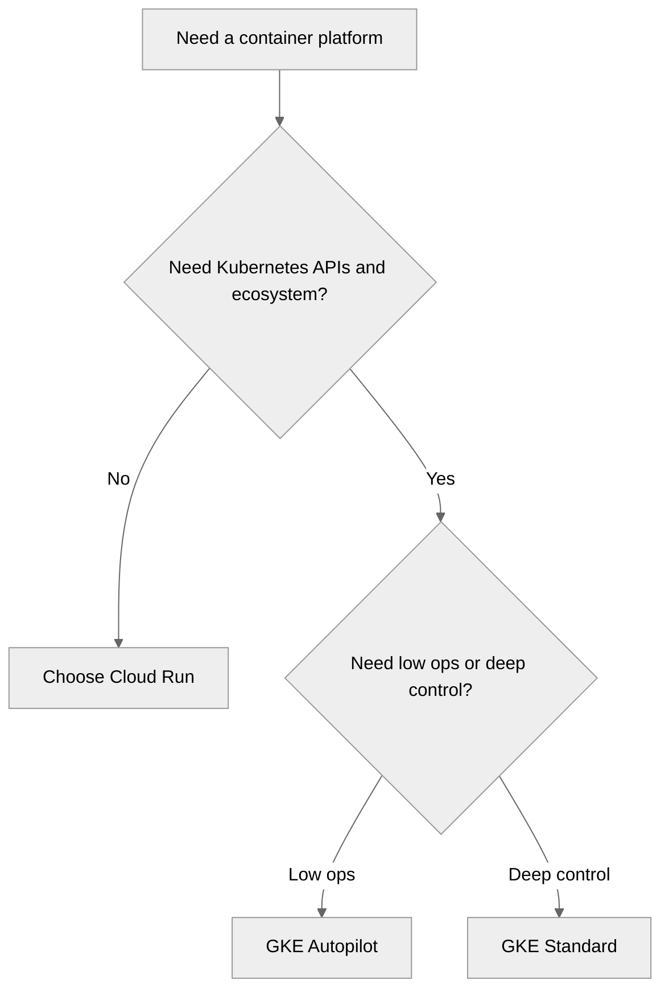

## Cluster type selection

Cluster mode selection is the most important GKE decision.

### GKE Standard vs GKE Autopilot

Standard gives maximum control. Autopilot gives a safer, lower-ops, opinionated platform where Google manages the node layer.

| Topic | GKE Standard | GKE Autopilot | Architect guidance |
| --- | --- | --- | --- |
| Node management | You manage node pools and capacity strategy | Google manages nodes | Choose Autopilot when node ops are not a differentiator |
| Scheduling flexibility | Full control over taints and specialized pools | Supported with guardrails | Use Standard for deep scheduling customization |
| Cost model | Pay for nodes | Pay for requested pod resources | Autopilot wins when utilization is uneven or ops costs matter |
| DaemonSets and host-level agents | Broad flexibility | More constrained | Platform add-ons may need redesign |
| GPUs and specialized hardware | Strong support | Available in supported scenarios with more constraints | Standard is better for advanced GPU control |
| Privileged workloads | Possible with strong review | More restricted | Standard for exceptional host-level needs |
| Operational overhead | Highest | Lowest | Autopilot is a strong default |
| Upgrade management | You manage node pool lifecycle | More managed | Autopilot simplifies lifecycle management |
| Best fit | Platform teams and special workloads | General app platforms and low-ops teams | Use both if the portfolio truly needs both |

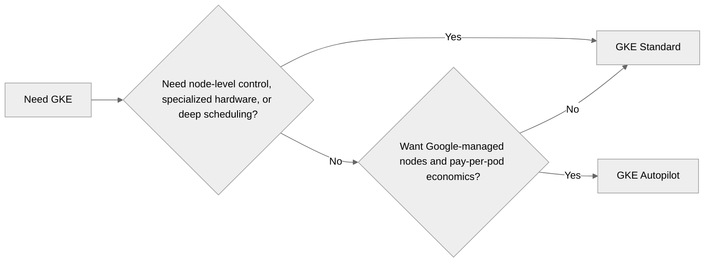

### Decision matrix: when to use each

- Choose Standard when you need custom node pools, advanced DaemonSets, GPUs, local SSD, or strict scheduling boundaries.
- Choose Autopilot when most workloads are stateless services, workers, or APIs and you want faster onboarding with less node toil.
- Use Standard for platform products or regulated workloads only when those requirements cannot fit Autopilot guardrails.
- Use Autopilot for shared app platforms where the organization values safer defaults and simpler ownership.

### Cost comparison scenarios

| Scenario | Standard likely better | Autopilot likely better | Why |
| --- | --- | --- | --- |
| Large steady production platform | Yes | Sometimes | High utilization can favor node economics |
| Many small teams with bursty services | Sometimes | Yes | Avoids idle node tax and lowers ops overhead |
| GPU inference or custom hardware | Yes | Sometimes | Specialization generally favors Standard |
| Internal developer platform for simple APIs | Sometimes | Yes | Autopilot shortens onboarding |
| Security-sensitive multi-tenant general workloads | Depends | Often yes | Guardrails are valuable if they fit |

#### Scenario A: 20 small APIs

- **Likely choice:** Autopilot
- **Reason:** Irregular traffic, low ops headcount, and pay-per-pod economics favor Autopilot.
- **Architect note:** model actual requested resources, cluster count, and platform labor before deciding.

#### Scenario B: large steady enterprise platform

- **Likely choice:** Standard
- **Reason:** A mature platform team can optimize node utilization and custom pools.
- **Architect note:** model actual requested resources, cluster count, and platform labor before deciding.

#### Scenario C: ML platform with GPU pools

- **Likely choice:** Standard
- **Reason:** Specialized hardware and scheduling nearly always justify Standard.
- **Architect note:** model actual requested resources, cluster count, and platform labor before deciding.

#### Scenario D: many idle dev and test environments

- **Likely choice:** Autopilot
- **Reason:** Lower idle cost and lower operational burden are attractive.
- **Architect note:** model actual requested resources, cluster count, and platform labor before deciding.

### Multi-cluster with Multi Cluster Ingress / Fleet

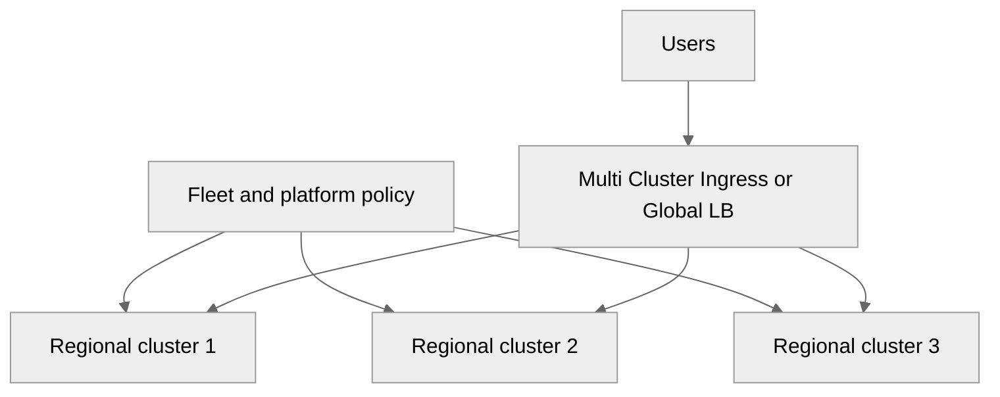

### Dev, staging, prod topology

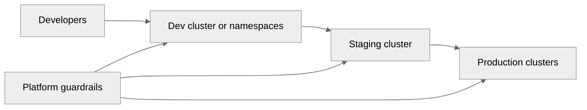

| Topology pattern | When to use | Benefits | Risks |
| --- | --- | --- | --- |
| Single cluster with namespaces | Small teams and low compliance needs | Low cost and simple ops | Blast radius and noisy neighbors |
| Separate dev, stage, prod clusters | Most enterprises | Clear isolation and safer upgrades | More cluster management |
| Regional prod plus shared non-prod | Mature teams with cost pressure | Balances resilience and cost | Needs clear policy boundaries |
| Per-domain clusters | Large enterprises | Clear ownership and tenancy boundaries | Potential cluster sprawl |

### Private vs public clusters

- Private clusters with private nodes should be the default for production.
- Use authorized networks, bastionless access, and private control plane access where possible.
- Public clusters are acceptable mainly for sandboxes and learning environments.

### Regional vs zonal clusters

| Cluster type | Use when | Benefits | Watch-out |
| --- | --- | --- | --- |
| Regional | Production and important shared platforms | Higher control-plane and node availability | Higher cost |
| Zonal | Dev, test, or low-criticality workloads | Cheaper and simpler | Single-zone failure impact |

**Official Google Cloud references**
- [Choose cluster mode](https://cloud.google.com/kubernetes-engine/docs/concepts/choose-cluster-mode)
- [Fleet concepts](https://cloud.google.com/kubernetes-engine/fleet-management/docs/fleet-concepts)
- [Multi Cluster Ingress](https://cloud.google.com/kubernetes-engine/docs/concepts/multi-cluster-ingress)

## Networking

Many GKE incidents are actually networking design failures.

### VPC-native (alias IP) vs routes-based (legacy)

| Topic | VPC-native (alias IP) | Routes-based (legacy) | Architect guidance |
| --- | --- | --- | --- |
| Current recommendation | Recommended | Legacy | Choose VPC-native for all new clusters |
| Scalability | Better | More limited | Alias IP integrates better with GCP networking |
| Shared VPC support | Strong | Limited | Enterprise patterns strongly favor VPC-native |
| IP management | Secondary ranges for Pods and Services | Node routing complexity | Plan ranges before cluster creation |
| Operational complexity | Lower for modern GKE | Higher | Do not start new platforms on routes-based |

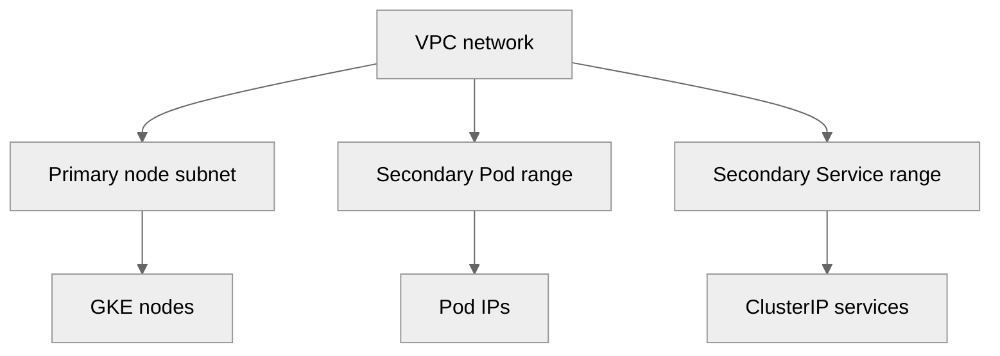

### Dataplane V2 (Cilium-based)

- Evaluate Dataplane V2 as the default for new clusters unless a specific blocker exists.
- Use it to improve policy enforcement consistency and network observability.
- Validate compatibility for security tooling and troubleshooting workflows.

### Private clusters, private nodes, authorized networks

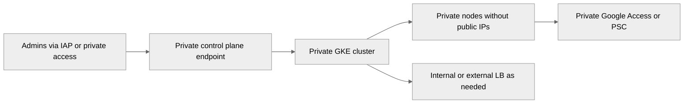

### Shared VPC with GKE

| Shared VPC area | Owner | Why it matters | Best practice |
| --- | --- | --- | --- |
| Subnets and secondary ranges | Platform network team | Prevent overlap and exhaustion | Reserve centrally |
| Firewall policy | Network or security team | Controls east-west and exposure paths | Use hierarchical baseline |
| Cluster deployment | Platform or app team | Needs Network User permissions | Grant least privilege |
| Private access and PSC | Platform team | Managed service connectivity | Document standard patterns |

### IP address planning (Pod CIDRs, Service CIDRs)

| Environment | Node subnet | Pod secondary range | Service secondary range | Note |
| --- | --- | --- | --- | --- |
| dev | 10.1.0.0/20 | 10.1.16.0/20 | 10.1.32.0/24 | Example cluster CIDRs |
| stage | 10.2.0.0/20 | 10.2.16.0/20 | 10.2.32.0/24 | Example cluster CIDRs |
| prod | 10.3.0.0/20 | 10.3.16.0/20 | 10.3.32.0/24 | Example cluster CIDRs |

1. Estimate Pod density, node count, and future cluster count before reserving ranges.
2. Avoid overlapping Pod ranges across clusters that may later communicate.
3. Document Service CIDR ranges for troubleshooting and peering reviews.
4. For Shared VPC, reserve secondary ranges centrally rather than ad hoc.

### Network policies (Calico vs Dataplane V2/Cilium)

| Capability | Calico-based policies | Dataplane V2 or Cilium-based policies | Architect note |
| --- | --- | --- | --- |
| Policy model | Kubernetes NetworkPolicy | Kubernetes NetworkPolicy with managed dataplane | Both can satisfy segmentation needs |
| Operational model | Traditional and familiar | Integrated managed experience | Prefer platform consistency |
| Observability | Varies by tooling | Improved in many managed dataplane scenarios | Validate support model |
| Recommendation | Use if existing standard requires it | Recommended for many new clusters | Bias toward the modern default |

**Official Google Cloud references**
- [Alias IPs](https://cloud.google.com/kubernetes-engine/docs/concepts/alias-ips)
- [Dataplane V2](https://cloud.google.com/kubernetes-engine/docs/concepts/dataplane-v2)
- [Private clusters](https://cloud.google.com/kubernetes-engine/docs/concepts/private-cluster-concept)
- [Shared VPC with GKE](https://cloud.google.com/kubernetes-engine/docs/how-to/cluster-shared-vpc)
- [Network Policy](https://cloud.google.com/kubernetes-engine/docs/how-to/network-policy)

## Ingress controllers

Ingress should be a platform standard, not an app-team improvisation.

| Option | Best fit | Strengths | Watch-outs |
| --- | --- | --- | --- |
| GKE Ingress | Simple HTTP(S) ingress with Google Cloud L7 LB | Native and managed | Older API style compared to Gateway API |
| Gateway API | Next-generation recommended pattern | Better role separation and routing model | Team learning curve |
| NGINX Ingress Controller | Custom NGINX behavior | Feature-rich and familiar | You manage lifecycle and scale |
| Istio or ASM Gateway | Mesh-centric platforms | Strong integration with mesh traffic policy | Adds complexity |
| Multi Cluster Ingress | Global multi-cluster workloads | Cross-cluster routing and health awareness | Only justify when multi-cluster is already needed |

### When to use which (decision flowchart)

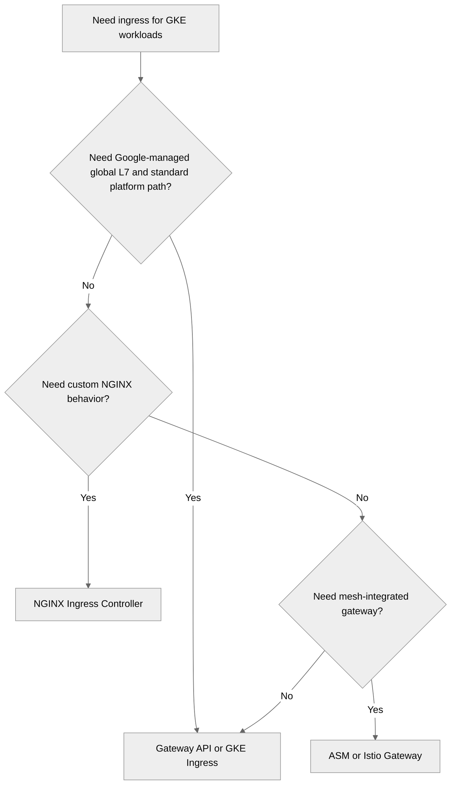

### Internal vs external ingress

- Use external ingress for public apps and APIs with Cloud Armor and managed certificates.
- Use internal ingress for private enterprise apps and internal APIs.
- Publish one standard for each exposure path so teams do not invent competing models.

### TLS with Google-managed certificates

### Cloud CDN + Cloud Armor integration

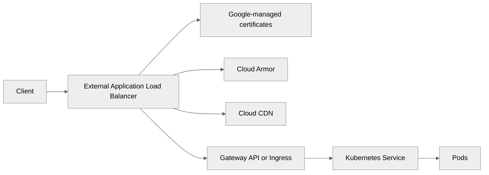

| Feature | GKE Ingress | Gateway API | NGINX | ASM Gateway | MCI |
| --- | --- | --- | --- | --- | --- |
| Google-managed global LB | Yes | Yes | Indirect | Indirect | Yes |
| Cloud Armor integration | Yes | Yes | Possible with more work | Possible | Yes |
| Cloud CDN integration | Yes | Yes | Indirect | Indirect | Yes |
| Role separation | Limited | Strong | Controller dependent | Strong within mesh model | Platform oriented |
| Advanced L7 customization | Moderate | Growing | Strong | Strong | Moderate |
| Operational overhead | Low | Low to moderate | Higher | High | Moderate |

**Official Google Cloud references**
- [GKE Ingress](https://cloud.google.com/kubernetes-engine/docs/concepts/ingress)
- [Gateway API on GKE](https://cloud.google.com/kubernetes-engine/docs/concepts/gateway-api)
- [Cloud Armor integration](https://cloud.google.com/armor/docs/integrating-cloud-armor)
- [Cloud CDN overview](https://cloud.google.com/cdn/docs/overview)
- [Google-managed certificates](https://cloud.google.com/load-balancing/docs/ssl-certificates/google-managed-certs)

## API management

API management belongs above or alongside ingress when APIs are products, not just routes.

### Apigee integration with GKE

- Use Apigee when APIs need productization, analytics, developer onboarding, policy mediation, or monetization.
- Place Apigee in front of GKE when multiple teams publish APIs with shared policy requirements.
- Keep runtime ownership clear: API ownership in Apigee, workload ownership in GKE, infrastructure ownership in the platform team.

### Cloud Endpoints

- Use Cloud Endpoints for lighter-weight OpenAPI-based protection and service proxy patterns.
- It fits simpler internal or moderate-scale APIs where Apigee would be excessive.

### API Gateway (serverless)

- API Gateway fits serverless or lightweight managed API front doors.
- It is often best when the backend is Cloud Run or Cloud Functions and API product needs are moderate.

### Apigee vs Cloud Endpoints vs API Gateway

| Capability | Apigee | Cloud Endpoints | API Gateway | Architect guidance |
| --- | --- | --- | --- | --- |
| Full API product lifecycle | Strong | Limited | Limited | Choose Apigee for enterprise API programs |
| Developer portal and monetization | Strong | No | No | Apigee-only territory |
| Operational complexity | Highest | Moderate | Lower | Match tool to program maturity |
| Cost | Premium | Lower | Lower | Use Apigee where governance value is clear |
| Best fit | Enterprise API platform | Moderate internal or partner APIs | Serverless and lightweight APIs | Avoid overbuying |

### API call flow (Mermaid sequence diagrams)

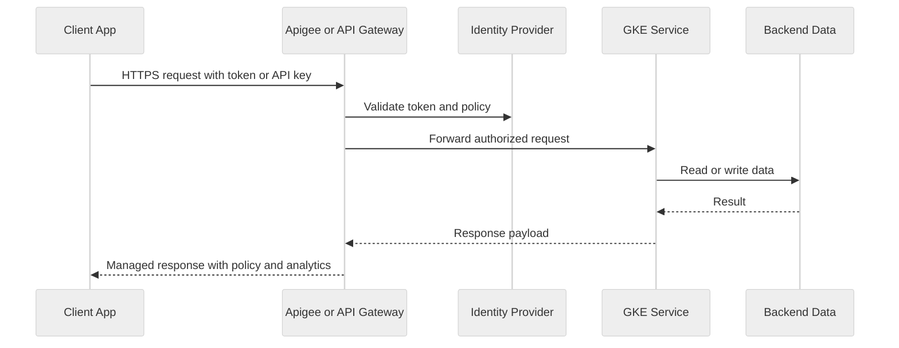

### Rate limiting, API keys, OAuth2

- Use OAuth2 or OIDC for user-facing and partner-facing APIs that need identity-aware access.
- Use API keys only for low-risk consumer identification scenarios.
- Apply rate limits at the API platform layer rather than rebuilding them inconsistently inside services.
- Publish versioning and deprecation policy as part of API governance.

**Official Google Cloud references**
- [Apigee overview](https://cloud.google.com/apigee/docs/api-platform/get-started/what-apigee)
- [Cloud Endpoints](https://cloud.google.com/endpoints/docs/openapi/about-cloud-endpoints)
- [API Gateway](https://cloud.google.com/api-gateway/docs/overview)

## Service mesh

Service mesh is justified when traffic policy, security, and observability requirements exceed what basic ingress and service networking can provide.

| Option | Strengths | Best fit | Watch-outs |
| --- | --- | --- | --- |
| Anthos Service Mesh | Managed experience with strong GCP integration | Enterprises wanting mesh without fully self-managing Istio | Still requires platform maturity |
| Standalone Istio | Maximum flexibility and ecosystem depth | Teams already invested in Istio patterns | Operational complexity is high |
| Linkerd | Simplicity and lower overhead | Teams prioritizing lightweight mesh | Less feature breadth than Istio |

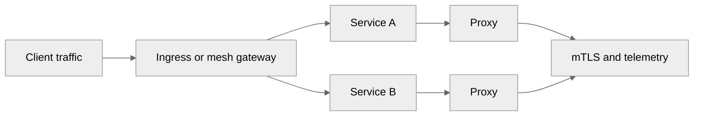

### Traffic management: canary, blue-green, traffic splitting

- Use canary releases for progressive validation of new versions.
- Use blue-green when full-environment switch-over with simple rollback is preferred.
- Use traffic splitting for experiments, resilience tests, and controlled migrations.

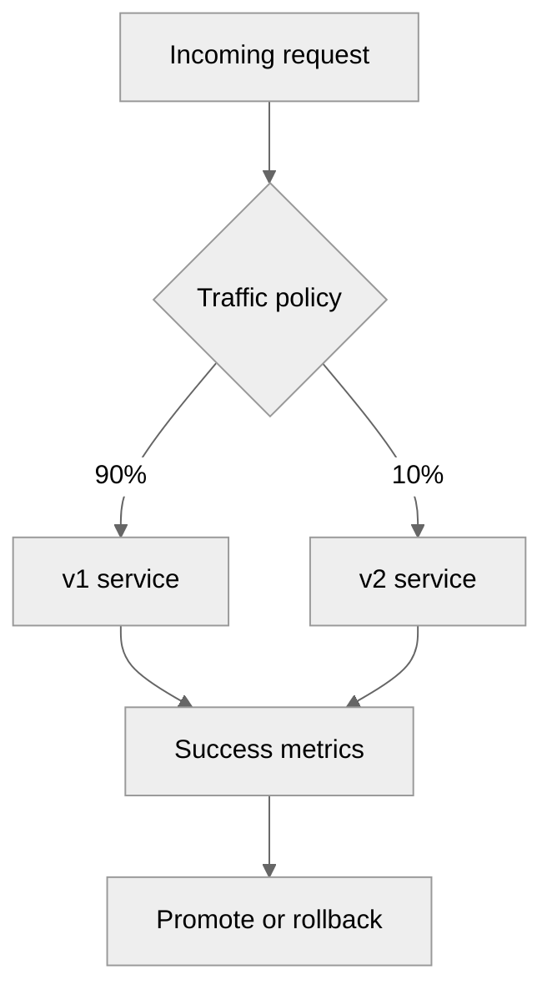

### mTLS, observability, fault injection

- mTLS is one of the strongest reasons to adopt a mesh when service-to-service trust matters deeply.
- Use mesh telemetry only when the team is prepared to act on the additional signals.
- Fault injection is valuable for resilience testing, but only with guardrails and explicit ownership.

**Official Google Cloud references**
- [Anthos Service Mesh](https://cloud.google.com/service-mesh/docs/overview)
- [Istio overview](https://istio.io/latest/docs/overview/what-is-istio/)
- [Linkerd overview](https://linkerd.io/2/overview/)

## Storage

Stateful workload design on GKE should be honest about whether the cluster is really the right home for state.

| Storage option | Best fit | Strengths | Architect caution |
| --- | --- | --- | --- |
| pd-standard | Low-cost general-purpose block | Affordable | Not for performance-sensitive databases |
| pd-balanced | General production block workloads | Good default | Validate IOPS requirements |
| pd-ssd | Performance-sensitive stateful apps | High performance | Higher cost |
| pd-extreme | Very high-performance DB use cases | Highest performance | Use only with clear benchmarks |
| Filestore CSI | Shared file system workloads | Managed NFS | Check throughput tier |
| GCS Fuse CSI | Object-backed file access patterns | Bridge to GCS | Not a replacement for low-latency POSIX |

### StatefulSets for databases

- Run databases in GKE only when there is a clear requirement and a capable operations team.
- Prefer managed services such as Cloud SQL, AlloyDB, or Spanner for most enterprise systems of record.
- If a database must run in GKE, pair StatefulSets with tested backups, anti-affinity, and disruption budgets.

### Filestore CSI and GCS Fuse CSI

1. Use Filestore CSI when multiple Pods need shared NFS semantics such as content repositories.
2. Use GCS Fuse CSI when applications need file-like access to object storage and can tolerate object-store semantics.
3. Keep storage classes and backup ownership visible in the platform catalog.

**Official Google Cloud references**
- [Persistent volumes on GKE](https://cloud.google.com/kubernetes-engine/docs/concepts/persistent-volumes)
- [Filestore CSI driver](https://cloud.google.com/filestore/docs/csi-driver)
- [Cloud Storage FUSE CSI driver](https://cloud.google.com/kubernetes-engine/docs/how-to/cloud-storage-fuse-csi-driver-pv)

## Security

Security is strongest when the baseline is enforced by platform defaults rather than by human memory.

### Workload Identity Federation (the GCP way - important!)

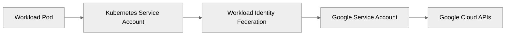

- Avoid service account keys inside Pods.
- Map Kubernetes service accounts to Google service accounts through minimal trust bindings.
- Review namespace and service account ownership during onboarding.

### Binary Authorization

- Use Binary Authorization when only attested images should be allowed to run.
- Pair it with Cloud Build, vulnerability scanning, and policy approvals.

### Pod Security Standards

- Use Pod Security Standards or equivalent policy to constrain privileged containers, host networking, and unsafe capabilities.
- Decide early whether baseline, restricted, or exception namespaces are part of the platform model.

### Secret Manager CSI driver

- Use Secret Manager CSI integration to mount or reference secrets securely at runtime.
- Rotate secrets and validate application reload behavior.

### Security Command Center integration

- Use SCC to centralize posture findings, misconfigurations, and threat signals for GKE.
- Route critical findings into the same incident process used for the broader platform.

### GKE Sandbox (gVisor)

- Use GKE Sandbox selectively for higher-risk or less-trusted workloads.
- Benchmark performance and compatibility before broad rollout.

| Security capability | Recommended baseline | Use when | Operational note |
| --- | --- | --- | --- |
| Workload Identity Federation | Enabled | All modern clusters | Default identity path |
| Binary Authorization | Tiered by criticality | Regulated or high-trust supply chains | Requires CI attestation workflow |
| Pod Security Standards | Baseline or restricted | All clusters | Exception workflow required |
| Secret Manager CSI | Enabled for secret-consuming apps | Apps needing runtime secrets | Monitor access and rotation |
| Security Command Center | Org-level integration | All production clusters | Central finding governance |
| GKE Sandbox | Selective | Higher-risk multi-tenant workloads | Test compatibility |

**Official Google Cloud references**
- [Binary Authorization overview](https://cloud.google.com/binary-authorization/docs/overview)
- [Secret Manager managed CSI component](https://cloud.google.com/secret-manager/docs/secret-manager-managed-csi-component)
- [GKE Sandbox](https://cloud.google.com/kubernetes-engine/docs/concepts/sandbox-pods)
- [Security Command Center](https://cloud.google.com/security-command-center/docs/concepts-scc)

## Monitoring

Observability must be designed into the cluster platform from day one.

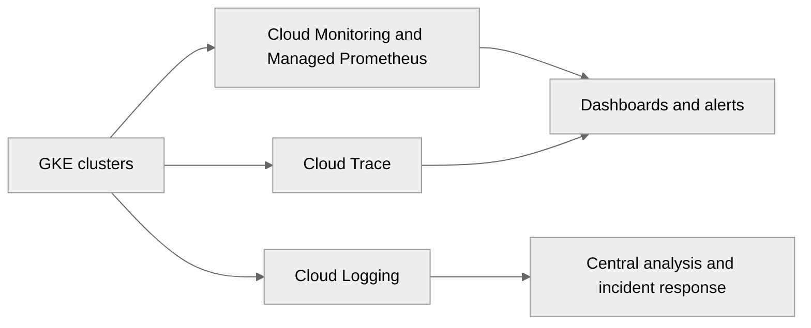

| Observability area | Recommended service | Baseline practice | Architect note |
| --- | --- | --- | --- |
| Cluster overview | GKE dashboard in Cloud Console | Use for quick fleet health and workload visibility | Good for incident triage |
| Metrics | Cloud Monitoring and Managed Prometheus | Standard dashboards and SLOs | Use Prometheus-compatible metrics for workloads |
| Logs | Cloud Logging | Structured logs and retention policy | Separate app, platform, and audit logs |
| Tracing | Cloud Trace | Trace critical request paths | Important for microservices and mesh |
| Dashboards | Cloud Monitoring or Managed Grafana | Golden-signal dashboards per service and platform | Provide both app and platform views |

- Use Managed Service for Prometheus when teams already expose Prometheus metrics or want ecosystem compatibility.
- Use Managed Grafana when a shared dashboarding experience is required beyond the native console.
- Instrument distributed tracing before a production incident proves you needed it.

**Official Google Cloud references**
- [GKE observability](https://cloud.google.com/kubernetes-engine/docs/concepts/about-observability)
- [Managed Grafana](https://cloud.google.com/stackdriver/docs/managed-grafana)
- [Cloud Trace overview](https://cloud.google.com/trace/docs/overview)

## Production checklist

Production readiness is where architecture becomes operational reality.

| Area | Default recommendation | Why it matters |
| --- | --- | --- |
| Release channels | Regular for most production, Stable for conservative estates | Controls upgrade cadence and risk |
| Maintenance windows | Defined per cluster tier | Avoid surprise upgrades |
| Node auto-provisioning | Use selectively with limits | Prevents capacity bottlenecks but can create cost drift |
| Autoscaling stack | HPA plus cluster autoscaler, VPA where suitable | Aligns supply to demand |
| Pod disruption budgets | Required for critical services | Protects availability during maintenance |
| Backup for GKE | Required for important clusters and state | Supports restore and DR |

### Release channels (Rapid, Regular, Stable)

- Choose Rapid only for early feature adoption and non-critical environments.
- Choose Regular for most production platforms.
- Choose Stable when the organization is conservative and feature delay is acceptable.
- Define maintenance exclusions around major business events.

### Node auto-provisioning, Cluster autoscaler, Vertical Pod Autoscaler, HPA

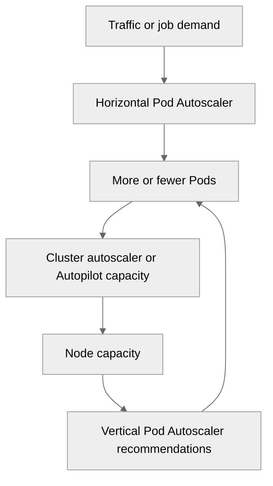

- Use HPA for workload scale, cluster autoscaler for capacity, and VPA selectively for right-sizing.
- Set honest resource requests; autoscaling quality depends on them.
- Use PodDisruptionBudgets, anti-affinity, and readiness probes together.

### Pod disruption budgets, Backup for GKE

- Use PodDisruptionBudgets for critical services so voluntary disruption does not remove too much capacity.
- Use Backup for GKE for cluster and application state recovery, especially for important namespaces or PV-backed workloads.
- Test restores, not just backup job success.

| Production item | Expectation |
| --- | --- |
| Regional cluster for production unless an exception is approved. | Required or strongly recommended |
| Private nodes and minimal public exposure. | Required or strongly recommended |
| Workload Identity Federation enabled for workloads that access Google APIs. | Required or strongly recommended |
| A documented ingress standard with managed certificates and Cloud Armor. | Required or strongly recommended |
| Default dashboards and alerts for platform and application teams. | Required or strongly recommended |
| Release channel and maintenance window documented. | Required or strongly recommended |
| Autoscaling bounds and quota review completed. | Required or strongly recommended |
| Pod disruption budgets defined for critical services. | Required or strongly recommended |
| Backup and restore tests completed. | Required or strongly recommended |
| Namespace tenancy and ownership documented. | Required or strongly recommended |
| Policy controls for privileged workloads documented. | Required or strongly recommended |
| Runbooks for upgrades, incidents, and rollback tested. | Required or strongly recommended |

**Official Google Cloud references**
- [Release channels](https://cloud.google.com/kubernetes-engine/docs/concepts/release-channels)
- [Cluster autoscaler](https://cloud.google.com/kubernetes-engine/docs/concepts/cluster-autoscaler)
- [Vertical Pod Autoscaler](https://cloud.google.com/kubernetes-engine/docs/concepts/verticalpodautoscaler)
- [Horizontal Pod Autoscaling](https://cloud.google.com/kubernetes-engine/docs/how-to/horizontal-pod-autoscaling)
- [Backup for GKE](https://cloud.google.com/kubernetes-engine/docs/add-on/backup-for-gke/concepts/backup-for-gke)

## Appendix: GKE architecture review checklist

Use this appendix during review boards, design sessions, and delivery checkpoints.

- 1. Validate that namespace or workload 1 actually needs Kubernetes instead of Cloud Run or another lower-ops platform.
- 2. Confirm whether workload 2 belongs on Standard or Autopilot based on control, add-ons, and team maturity.
- 3. Check that workload 3 has a documented ingress pattern, TLS model, and Cloud Armor posture where applicable.
- 4. Review whether workload 4 uses Workload Identity Federation instead of service account keys.
- 5. Ensure workload 5 has clear resource requests, autoscaling policy, and disruption budget expectations.
- 6. Ask whether workload 6 should use managed data services rather than a database inside the cluster.
- 7. Confirm that Pod and Service CIDR planning for workload 7 aligns with Shared VPC and future growth.
- 8. Verify that workload 8 has logging, metrics, traces, and SLO ownership before production onboarding.
- 9. Determine whether workload 9 requires service mesh features or only simpler ingress and service-to-service controls.
- 10. Review whether workload 10 needs multi-cluster design or only a strong regional architecture with tested recovery.
- 11. Validate that namespace or workload 11 actually needs Kubernetes instead of Cloud Run or another lower-ops platform.
- 12. Confirm whether workload 12 belongs on Standard or Autopilot based on control, add-ons, and team maturity.
- 13. Check that workload 13 has a documented ingress pattern, TLS model, and Cloud Armor posture where applicable.
- 14. Review whether workload 14 uses Workload Identity Federation instead of service account keys.
- 15. Ensure workload 15 has clear resource requests, autoscaling policy, and disruption budget expectations.
- 16. Ask whether workload 16 should use managed data services rather than a database inside the cluster.
- 17. Confirm that Pod and Service CIDR planning for workload 17 aligns with Shared VPC and future growth.
- 18. Verify that workload 18 has logging, metrics, traces, and SLO ownership before production onboarding.
- 19. Determine whether workload 19 requires service mesh features or only simpler ingress and service-to-service controls.
- 20. Review whether workload 20 needs multi-cluster design or only a strong regional architecture with tested recovery.
- 21. Validate that namespace or workload 21 actually needs Kubernetes instead of Cloud Run or another lower-ops platform.
- 22. Confirm whether workload 22 belongs on Standard or Autopilot based on control, add-ons, and team maturity.
- 23. Check that workload 23 has a documented ingress pattern, TLS model, and Cloud Armor posture where applicable.
- 24. Review whether workload 24 uses Workload Identity Federation instead of service account keys.
- 25. Ensure workload 25 has clear resource requests, autoscaling policy, and disruption budget expectations.
- 26. Ask whether workload 26 should use managed data services rather than a database inside the cluster.
- 27. Confirm that Pod and Service CIDR planning for workload 27 aligns with Shared VPC and future growth.
- 28. Verify that workload 28 has logging, metrics, traces, and SLO ownership before production onboarding.
- 29. Determine whether workload 29 requires service mesh features or only simpler ingress and service-to-service controls.
- 30. Review whether workload 30 needs multi-cluster design or only a strong regional architecture with tested recovery.
- 31. Validate that namespace or workload 31 actually needs Kubernetes instead of Cloud Run or another lower-ops platform.
- 32. Confirm whether workload 32 belongs on Standard or Autopilot based on control, add-ons, and team maturity.
- 33. Check that workload 33 has a documented ingress pattern, TLS model, and Cloud Armor posture where applicable.
- 34. Review whether workload 34 uses Workload Identity Federation instead of service account keys.
- 35. Ensure workload 35 has clear resource requests, autoscaling policy, and disruption budget expectations.
- 36. Ask whether workload 36 should use managed data services rather than a database inside the cluster.
- 37. Confirm that Pod and Service CIDR planning for workload 37 aligns with Shared VPC and future growth.
- 38. Verify that workload 38 has logging, metrics, traces, and SLO ownership before production onboarding.
- 39. Determine whether workload 39 requires service mesh features or only simpler ingress and service-to-service controls.
- 40. Review whether workload 40 needs multi-cluster design or only a strong regional architecture with tested recovery.
- 41. Validate that namespace or workload 41 actually needs Kubernetes instead of Cloud Run or another lower-ops platform.
- 42. Confirm whether workload 42 belongs on Standard or Autopilot based on control, add-ons, and team maturity.
- 43. Check that workload 43 has a documented ingress pattern, TLS model, and Cloud Armor posture where applicable.
- 44. Review whether workload 44 uses Workload Identity Federation instead of service account keys.
- 45. Ensure workload 45 has clear resource requests, autoscaling policy, and disruption budget expectations.
- 46. Ask whether workload 46 should use managed data services rather than a database inside the cluster.
- 47. Confirm that Pod and Service CIDR planning for workload 47 aligns with Shared VPC and future growth.
- 48. Verify that workload 48 has logging, metrics, traces, and SLO ownership before production onboarding.
- 49. Determine whether workload 49 requires service mesh features or only simpler ingress and service-to-service controls.
- 50. Review whether workload 50 needs multi-cluster design or only a strong regional architecture with tested recovery.
- 51. Validate that namespace or workload 51 actually needs Kubernetes instead of Cloud Run or another lower-ops platform.
- 52. Confirm whether workload 52 belongs on Standard or Autopilot based on control, add-ons, and team maturity.
- 53. Check that workload 53 has a documented ingress pattern, TLS model, and Cloud Armor posture where applicable.
- 54. Review whether workload 54 uses Workload Identity Federation instead of service account keys.
- 55. Ensure workload 55 has clear resource requests, autoscaling policy, and disruption budget expectations.
- 56. Ask whether workload 56 should use managed data services rather than a database inside the cluster.
- 57. Confirm that Pod and Service CIDR planning for workload 57 aligns with Shared VPC and future growth.
- 58. Verify that workload 58 has logging, metrics, traces, and SLO ownership before production onboarding.
- 59. Determine whether workload 59 requires service mesh features or only simpler ingress and service-to-service controls.
- 60. Review whether workload 60 needs multi-cluster design or only a strong regional architecture with tested recovery.
- 61. Validate that namespace or workload 61 actually needs Kubernetes instead of Cloud Run or another lower-ops platform.
- 62. Confirm whether workload 62 belongs on Standard or Autopilot based on control, add-ons, and team maturity.
- 63. Check that workload 63 has a documented ingress pattern, TLS model, and Cloud Armor posture where applicable.
- 64. Review whether workload 64 uses Workload Identity Federation instead of service account keys.
- 65. Ensure workload 65 has clear resource requests, autoscaling policy, and disruption budget expectations.
- 66. Ask whether workload 66 should use managed data services rather than a database inside the cluster.
- 67. Confirm that Pod and Service CIDR planning for workload 67 aligns with Shared VPC and future growth.
- 68. Verify that workload 68 has logging, metrics, traces, and SLO ownership before production onboarding.
- 69. Determine whether workload 69 requires service mesh features or only simpler ingress and service-to-service controls.
- 70. Review whether workload 70 needs multi-cluster design or only a strong regional architecture with tested recovery.
- 71. Validate that namespace or workload 71 actually needs Kubernetes instead of Cloud Run or another lower-ops platform.
- 72. Confirm whether workload 72 belongs on Standard or Autopilot based on control, add-ons, and team maturity.
- 73. Check that workload 73 has a documented ingress pattern, TLS model, and Cloud Armor posture where applicable.
- 74. Review whether workload 74 uses Workload Identity Federation instead of service account keys.
- 75. Ensure workload 75 has clear resource requests, autoscaling policy, and disruption budget expectations.
- 76. Ask whether workload 76 should use managed data services rather than a database inside the cluster.
- 77. Confirm that Pod and Service CIDR planning for workload 77 aligns with Shared VPC and future growth.
- 78. Verify that workload 78 has logging, metrics, traces, and SLO ownership before production onboarding.
- 79. Determine whether workload 79 requires service mesh features or only simpler ingress and service-to-service controls.
- 80. Review whether workload 80 needs multi-cluster design or only a strong regional architecture with tested recovery.
- 81. Validate that namespace or workload 81 actually needs Kubernetes instead of Cloud Run or another lower-ops platform.
- 82. Confirm whether workload 82 belongs on Standard or Autopilot based on control, add-ons, and team maturity.
- 83. Check that workload 83 has a documented ingress pattern, TLS model, and Cloud Armor posture where applicable.
- 84. Review whether workload 84 uses Workload Identity Federation instead of service account keys.
- 85. Ensure workload 85 has clear resource requests, autoscaling policy, and disruption budget expectations.
- 86. Ask whether workload 86 should use managed data services rather than a database inside the cluster.
- 87. Confirm that Pod and Service CIDR planning for workload 87 aligns with Shared VPC and future growth.
- 88. Verify that workload 88 has logging, metrics, traces, and SLO ownership before production onboarding.
- 89. Determine whether workload 89 requires service mesh features or only simpler ingress and service-to-service controls.
- 90. Review whether workload 90 needs multi-cluster design or only a strong regional architecture with tested recovery.
- 91. Validate that namespace or workload 91 actually needs Kubernetes instead of Cloud Run or another lower-ops platform.
- 92. Confirm whether workload 92 belongs on Standard or Autopilot based on control, add-ons, and team maturity.
- 93. Check that workload 93 has a documented ingress pattern, TLS model, and Cloud Armor posture where applicable.
- 94. Review whether workload 94 uses Workload Identity Federation instead of service account keys.
- 95. Ensure workload 95 has clear resource requests, autoscaling policy, and disruption budget expectations.
- 96. Ask whether workload 96 should use managed data services rather than a database inside the cluster.
- 97. Confirm that Pod and Service CIDR planning for workload 97 aligns with Shared VPC and future growth.
- 98. Verify that workload 98 has logging, metrics, traces, and SLO ownership before production onboarding.
- 99. Determine whether workload 99 requires service mesh features or only simpler ingress and service-to-service controls.
- 100. Review whether workload 100 needs multi-cluster design or only a strong regional architecture with tested recovery.
- 101. Validate that namespace or workload 101 actually needs Kubernetes instead of Cloud Run or another lower-ops platform.
- 102. Confirm whether workload 102 belongs on Standard or Autopilot based on control, add-ons, and team maturity.
- 103. Check that workload 103 has a documented ingress pattern, TLS model, and Cloud Armor posture where applicable.
- 104. Review whether workload 104 uses Workload Identity Federation instead of service account keys.
- 105. Ensure workload 105 has clear resource requests, autoscaling policy, and disruption budget expectations.
- 106. Ask whether workload 106 should use managed data services rather than a database inside the cluster.
- 107. Confirm that Pod and Service CIDR planning for workload 107 aligns with Shared VPC and future growth.
- 108. Verify that workload 108 has logging, metrics, traces, and SLO ownership before production onboarding.
- 109. Determine whether workload 109 requires service mesh features or only simpler ingress and service-to-service controls.
- 110. Review whether workload 110 needs multi-cluster design or only a strong regional architecture with tested recovery.
- 111. Validate that namespace or workload 111 actually needs Kubernetes instead of Cloud Run or another lower-ops platform.
- 112. Confirm whether workload 112 belongs on Standard or Autopilot based on control, add-ons, and team maturity.
- 113. Check that workload 113 has a documented ingress pattern, TLS model, and Cloud Armor posture where applicable.
- 114. Review whether workload 114 uses Workload Identity Federation instead of service account keys.
- 115. Ensure workload 115 has clear resource requests, autoscaling policy, and disruption budget expectations.
- 116. Ask whether workload 116 should use managed data services rather than a database inside the cluster.
- 117. Confirm that Pod and Service CIDR planning for workload 117 aligns with Shared VPC and future growth.
- 118. Verify that workload 118 has logging, metrics, traces, and SLO ownership before production onboarding.
- 119. Determine whether workload 119 requires service mesh features or only simpler ingress and service-to-service controls.
- 120. Review whether workload 120 needs multi-cluster design or only a strong regional architecture with tested recovery.
- 121. Validate that namespace or workload 121 actually needs Kubernetes instead of Cloud Run or another lower-ops platform.
- 122. Confirm whether workload 122 belongs on Standard or Autopilot based on control, add-ons, and team maturity.
- 123. Check that workload 123 has a documented ingress pattern, TLS model, and Cloud Armor posture where applicable.
- 124. Review whether workload 124 uses Workload Identity Federation instead of service account keys.
- 125. Ensure workload 125 has clear resource requests, autoscaling policy, and disruption budget expectations.
- 126. Ask whether workload 126 should use managed data services rather than a database inside the cluster.
- 127. Confirm that Pod and Service CIDR planning for workload 127 aligns with Shared VPC and future growth.
- 128. Verify that workload 128 has logging, metrics, traces, and SLO ownership before production onboarding.
- 129. Determine whether workload 129 requires service mesh features or only simpler ingress and service-to-service controls.
- 130. Review whether workload 130 needs multi-cluster design or only a strong regional architecture with tested recovery.
- 131. Validate that namespace or workload 131 actually needs Kubernetes instead of Cloud Run or another lower-ops platform.
- 132. Confirm whether workload 132 belongs on Standard or Autopilot based on control, add-ons, and team maturity.
- 133. Check that workload 133 has a documented ingress pattern, TLS model, and Cloud Armor posture where applicable.
- 134. Review whether workload 134 uses Workload Identity Federation instead of service account keys.
- 135. Ensure workload 135 has clear resource requests, autoscaling policy, and disruption budget expectations.
- 136. Ask whether workload 136 should use managed data services rather than a database inside the cluster.
- 137. Confirm that Pod and Service CIDR planning for workload 137 aligns with Shared VPC and future growth.
- 138. Verify that workload 138 has logging, metrics, traces, and SLO ownership before production onboarding.
- 139. Determine whether workload 139 requires service mesh features or only simpler ingress and service-to-service controls.
- 140. Review whether workload 140 needs multi-cluster design or only a strong regional architecture with tested recovery.
- 141. Validate that namespace or workload 141 actually needs Kubernetes instead of Cloud Run or another lower-ops platform.
- 142. Confirm whether workload 142 belongs on Standard or Autopilot based on control, add-ons, and team maturity.
- 143. Check that workload 143 has a documented ingress pattern, TLS model, and Cloud Armor posture where applicable.
- 144. Review whether workload 144 uses Workload Identity Federation instead of service account keys.
- 145. Ensure workload 145 has clear resource requests, autoscaling policy, and disruption budget expectations.
- 146. Ask whether workload 146 should use managed data services rather than a database inside the cluster.
- 147. Confirm that Pod and Service CIDR planning for workload 147 aligns with Shared VPC and future growth.
- 148. Verify that workload 148 has logging, metrics, traces, and SLO ownership before production onboarding.
- 149. Determine whether workload 149 requires service mesh features or only simpler ingress and service-to-service controls.
- 150. Review whether workload 150 needs multi-cluster design or only a strong regional architecture with tested recovery.
- 151. Validate that namespace or workload 151 actually needs Kubernetes instead of Cloud Run or another lower-ops platform.
- 152. Confirm whether workload 152 belongs on Standard or Autopilot based on control, add-ons, and team maturity.
- 153. Check that workload 153 has a documented ingress pattern, TLS model, and Cloud Armor posture where applicable.
- 154. Review whether workload 154 uses Workload Identity Federation instead of service account keys.
- 155. Ensure workload 155 has clear resource requests, autoscaling policy, and disruption budget expectations.
- 156. Ask whether workload 156 should use managed data services rather than a database inside the cluster.
- 157. Confirm that Pod and Service CIDR planning for workload 157 aligns with Shared VPC and future growth.
- 158. Verify that workload 158 has logging, metrics, traces, and SLO ownership before production onboarding.
- 159. Determine whether workload 159 requires service mesh features or only simpler ingress and service-to-service controls.
- 160. Review whether workload 160 needs multi-cluster design or only a strong regional architecture with tested recovery.
- 161. Validate that namespace or workload 161 actually needs Kubernetes instead of Cloud Run or another lower-ops platform.
- 162. Confirm whether workload 162 belongs on Standard or Autopilot based on control, add-ons, and team maturity.
- 163. Check that workload 163 has a documented ingress pattern, TLS model, and Cloud Armor posture where applicable.
- 164. Review whether workload 164 uses Workload Identity Federation instead of service account keys.
- 165. Ensure workload 165 has clear resource requests, autoscaling policy, and disruption budget expectations.
- 166. Ask whether workload 166 should use managed data services rather than a database inside the cluster.
- 167. Confirm that Pod and Service CIDR planning for workload 167 aligns with Shared VPC and future growth.
- 168. Verify that workload 168 has logging, metrics, traces, and SLO ownership before production onboarding.
- 169. Determine whether workload 169 requires service mesh features or only simpler ingress and service-to-service controls.
- 170. Review whether workload 170 needs multi-cluster design or only a strong regional architecture with tested recovery.
- 171. Validate that namespace or workload 171 actually needs Kubernetes instead of Cloud Run or another lower-ops platform.
- 172. Confirm whether workload 172 belongs on Standard or Autopilot based on control, add-ons, and team maturity.
- 173. Check that workload 173 has a documented ingress pattern, TLS model, and Cloud Armor posture where applicable.
- 174. Review whether workload 174 uses Workload Identity Federation instead of service account keys.
- 175. Ensure workload 175 has clear resource requests, autoscaling policy, and disruption budget expectations.
- 176. Ask whether workload 176 should use managed data services rather than a database inside the cluster.
- 177. Confirm that Pod and Service CIDR planning for workload 177 aligns with Shared VPC and future growth.
- 178. Verify that workload 178 has logging, metrics, traces, and SLO ownership before production onboarding.
- 179. Determine whether workload 179 requires service mesh features or only simpler ingress and service-to-service controls.
- 180. Review whether workload 180 needs multi-cluster design or only a strong regional architecture with tested recovery.
- 181. Validate that namespace or workload 181 actually needs Kubernetes instead of Cloud Run or another lower-ops platform.
- 182. Confirm whether workload 182 belongs on Standard or Autopilot based on control, add-ons, and team maturity.
- 183. Check that workload 183 has a documented ingress pattern, TLS model, and Cloud Armor posture where applicable.
- 184. Review whether workload 184 uses Workload Identity Federation instead of service account keys.
- 185. Ensure workload 185 has clear resource requests, autoscaling policy, and disruption budget expectations.
- 186. Ask whether workload 186 should use managed data services rather than a database inside the cluster.
- 187. Confirm that Pod and Service CIDR planning for workload 187 aligns with Shared VPC and future growth.
- 188. Verify that workload 188 has logging, metrics, traces, and SLO ownership before production onboarding.
- 189. Determine whether workload 189 requires service mesh features or only simpler ingress and service-to-service controls.
- 190. Review whether workload 190 needs multi-cluster design or only a strong regional architecture with tested recovery.
- 191. Validate that namespace or workload 191 actually needs Kubernetes instead of Cloud Run or another lower-ops platform.
- 192. Confirm whether workload 192 belongs on Standard or Autopilot based on control, add-ons, and team maturity.
- 193. Check that workload 193 has a documented ingress pattern, TLS model, and Cloud Armor posture where applicable.
- 194. Review whether workload 194 uses Workload Identity Federation instead of service account keys.
- 195. Ensure workload 195 has clear resource requests, autoscaling policy, and disruption budget expectations.
- 196. Ask whether workload 196 should use managed data services rather than a database inside the cluster.
- 197. Confirm that Pod and Service CIDR planning for workload 197 aligns with Shared VPC and future growth.
- 198. Verify that workload 198 has logging, metrics, traces, and SLO ownership before production onboarding.
- 199. Determine whether workload 199 requires service mesh features or only simpler ingress and service-to-service controls.
- 200. Review whether workload 200 needs multi-cluster design or only a strong regional architecture with tested recovery.
- 201. Validate that namespace or workload 201 actually needs Kubernetes instead of Cloud Run or another lower-ops platform.
- 202. Confirm whether workload 202 belongs on Standard or Autopilot based on control, add-ons, and team maturity.
- 203. Check that workload 203 has a documented ingress pattern, TLS model, and Cloud Armor posture where applicable.
- 204. Review whether workload 204 uses Workload Identity Federation instead of service account keys.
- 205. Ensure workload 205 has clear resource requests, autoscaling policy, and disruption budget expectations.
- 206. Ask whether workload 206 should use managed data services rather than a database inside the cluster.
- 207. Confirm that Pod and Service CIDR planning for workload 207 aligns with Shared VPC and future growth.
- 208. Verify that workload 208 has logging, metrics, traces, and SLO ownership before production onboarding.
- 209. Determine whether workload 209 requires service mesh features or only simpler ingress and service-to-service controls.
- 210. Review whether workload 210 needs multi-cluster design or only a strong regional architecture with tested recovery.
- 211. Validate that namespace or workload 211 actually needs Kubernetes instead of Cloud Run or another lower-ops platform.
- 212. Confirm whether workload 212 belongs on Standard or Autopilot based on control, add-ons, and team maturity.
- 213. Check that workload 213 has a documented ingress pattern, TLS model, and Cloud Armor posture where applicable.
- 214. Review whether workload 214 uses Workload Identity Federation instead of service account keys.
- 215. Ensure workload 215 has clear resource requests, autoscaling policy, and disruption budget expectations.
- 216. Ask whether workload 216 should use managed data services rather than a database inside the cluster.
- 217. Confirm that Pod and Service CIDR planning for workload 217 aligns with Shared VPC and future growth.
- 218. Verify that workload 218 has logging, metrics, traces, and SLO ownership before production onboarding.
- 219. Determine whether workload 219 requires service mesh features or only simpler ingress and service-to-service controls.
- 220. Review whether workload 220 needs multi-cluster design or only a strong regional architecture with tested recovery.
- 221. Validate that namespace or workload 221 actually needs Kubernetes instead of Cloud Run or another lower-ops platform.
- 222. Confirm whether workload 222 belongs on Standard or Autopilot based on control, add-ons, and team maturity.
- 223. Check that workload 223 has a documented ingress pattern, TLS model, and Cloud Armor posture where applicable.
- 224. Review whether workload 224 uses Workload Identity Federation instead of service account keys.
- 225. Ensure workload 225 has clear resource requests, autoscaling policy, and disruption budget expectations.
- 226. Ask whether workload 226 should use managed data services rather than a database inside the cluster.
- 227. Confirm that Pod and Service CIDR planning for workload 227 aligns with Shared VPC and future growth.
- 228. Verify that workload 228 has logging, metrics, traces, and SLO ownership before production onboarding.
- 229. Determine whether workload 229 requires service mesh features or only simpler ingress and service-to-service controls.
- 230. Review whether workload 230 needs multi-cluster design or only a strong regional architecture with tested recovery.
- 231. Validate that namespace or workload 231 actually needs Kubernetes instead of Cloud Run or another lower-ops platform.
- 232. Confirm whether workload 232 belongs on Standard or Autopilot based on control, add-ons, and team maturity.
- 233. Check that workload 233 has a documented ingress pattern, TLS model, and Cloud Armor posture where applicable.
- 234. Review whether workload 234 uses Workload Identity Federation instead of service account keys.
- 235. Ensure workload 235 has clear resource requests, autoscaling policy, and disruption budget expectations.
- 236. Ask whether workload 236 should use managed data services rather than a database inside the cluster.
- 237. Confirm that Pod and Service CIDR planning for workload 237 aligns with Shared VPC and future growth.
- 238. Verify that workload 238 has logging, metrics, traces, and SLO ownership before production onboarding.
- 239. Determine whether workload 239 requires service mesh features or only simpler ingress and service-to-service controls.
- 240. Review whether workload 240 needs multi-cluster design or only a strong regional architecture with tested recovery.
- 241. Validate that namespace or workload 241 actually needs Kubernetes instead of Cloud Run or another lower-ops platform.
- 242. Confirm whether workload 242 belongs on Standard or Autopilot based on control, add-ons, and team maturity.
- 243. Check that workload 243 has a documented ingress pattern, TLS model, and Cloud Armor posture where applicable.
- 244. Review whether workload 244 uses Workload Identity Federation instead of service account keys.
- 245. Ensure workload 245 has clear resource requests, autoscaling policy, and disruption budget expectations.
- 246. Ask whether workload 246 should use managed data services rather than a database inside the cluster.
- 247. Confirm that Pod and Service CIDR planning for workload 247 aligns with Shared VPC and future growth.
- 248. Verify that workload 248 has logging, metrics, traces, and SLO ownership before production onboarding.
- 249. Determine whether workload 249 requires service mesh features or only simpler ingress and service-to-service controls.
- 250. Review whether workload 250 needs multi-cluster design or only a strong regional architecture with tested recovery.
- 251. Validate that namespace or workload 251 actually needs Kubernetes instead of Cloud Run or another lower-ops platform.
- 252. Confirm whether workload 252 belongs on Standard or Autopilot based on control, add-ons, and team maturity.
- 253. Check that workload 253 has a documented ingress pattern, TLS model, and Cloud Armor posture where applicable.
- 254. Review whether workload 254 uses Workload Identity Federation instead of service account keys.
- 255. Ensure workload 255 has clear resource requests, autoscaling policy, and disruption budget expectations.
- 256. Ask whether workload 256 should use managed data services rather than a database inside the cluster.
- 257. Confirm that Pod and Service CIDR planning for workload 257 aligns with Shared VPC and future growth.
- 258. Verify that workload 258 has logging, metrics, traces, and SLO ownership before production onboarding.
- 259. Determine whether workload 259 requires service mesh features or only simpler ingress and service-to-service controls.
- 260. Review whether workload 260 needs multi-cluster design or only a strong regional architecture with tested recovery.
- 261. Validate that namespace or workload 261 actually needs Kubernetes instead of Cloud Run or another lower-ops platform.
- 262. Confirm whether workload 262 belongs on Standard or Autopilot based on control, add-ons, and team maturity.
- 263. Check that workload 263 has a documented ingress pattern, TLS model, and Cloud Armor posture where applicable.
- 264. Review whether workload 264 uses Workload Identity Federation instead of service account keys.
- 265. Ensure workload 265 has clear resource requests, autoscaling policy, and disruption budget expectations.
- 266. Ask whether workload 266 should use managed data services rather than a database inside the cluster.
- 267. Confirm that Pod and Service CIDR planning for workload 267 aligns with Shared VPC and future growth.
- 268. Verify that workload 268 has logging, metrics, traces, and SLO ownership before production onboarding.
- 269. Determine whether workload 269 requires service mesh features or only simpler ingress and service-to-service controls.
- 270. Review whether workload 270 needs multi-cluster design or only a strong regional architecture with tested recovery.
- 271. Validate that namespace or workload 271 actually needs Kubernetes instead of Cloud Run or another lower-ops platform.
- 272. Confirm whether workload 272 belongs on Standard or Autopilot based on control, add-ons, and team maturity.
- 273. Check that workload 273 has a documented ingress pattern, TLS model, and Cloud Armor posture where applicable.
- 274. Review whether workload 274 uses Workload Identity Federation instead of service account keys.
- 275. Ensure workload 275 has clear resource requests, autoscaling policy, and disruption budget expectations.
- 276. Ask whether workload 276 should use managed data services rather than a database inside the cluster.
- 277. Confirm that Pod and Service CIDR planning for workload 277 aligns with Shared VPC and future growth.
- 278. Verify that workload 278 has logging, metrics, traces, and SLO ownership before production onboarding.
- 279. Determine whether workload 279 requires service mesh features or only simpler ingress and service-to-service controls.
- 280. Review whether workload 280 needs multi-cluster design or only a strong regional architecture with tested recovery.
- 281. Validate that namespace or workload 281 actually needs Kubernetes instead of Cloud Run or another lower-ops platform.
- 282. Confirm whether workload 282 belongs on Standard or Autopilot based on control, add-ons, and team maturity.
- 283. Check that workload 283 has a documented ingress pattern, TLS model, and Cloud Armor posture where applicable.
- 284. Review whether workload 284 uses Workload Identity Federation instead of service account keys.
- 285. Ensure workload 285 has clear resource requests, autoscaling policy, and disruption budget expectations.
- 286. Ask whether workload 286 should use managed data services rather than a database inside the cluster.
- 287. Confirm that Pod and Service CIDR planning for workload 287 aligns with Shared VPC and future growth.
- 288. Verify that workload 288 has logging, metrics, traces, and SLO ownership before production onboarding.
- 289. Determine whether workload 289 requires service mesh features or only simpler ingress and service-to-service controls.
- 290. Review whether workload 290 needs multi-cluster design or only a strong regional architecture with tested recovery.
- 291. Validate that namespace or workload 291 actually needs Kubernetes instead of Cloud Run or another lower-ops platform.
- 292. Confirm whether workload 292 belongs on Standard or Autopilot based on control, add-ons, and team maturity.
- 293. Check that workload 293 has a documented ingress pattern, TLS model, and Cloud Armor posture where applicable.
- 294. Review whether workload 294 uses Workload Identity Federation instead of service account keys.
- 295. Ensure workload 295 has clear resource requests, autoscaling policy, and disruption budget expectations.
- 296. Ask whether workload 296 should use managed data services rather than a database inside the cluster.
- 297. Confirm that Pod and Service CIDR planning for workload 297 aligns with Shared VPC and future growth.
- 298. Verify that workload 298 has logging, metrics, traces, and SLO ownership before production onboarding.
- 299. Determine whether workload 299 requires service mesh features or only simpler ingress and service-to-service controls.
- 300. Review whether workload 300 needs multi-cluster design or only a strong regional architecture with tested recovery.
- 301. Validate that namespace or workload 301 actually needs Kubernetes instead of Cloud Run or another lower-ops platform.
- 302. Confirm whether workload 302 belongs on Standard or Autopilot based on control, add-ons, and team maturity.
- 303. Check that workload 303 has a documented ingress pattern, TLS model, and Cloud Armor posture where applicable.
- 304. Review whether workload 304 uses Workload Identity Federation instead of service account keys.
- 305. Ensure workload 305 has clear resource requests, autoscaling policy, and disruption budget expectations.
- 306. Ask whether workload 306 should use managed data services rather than a database inside the cluster.
- 307. Confirm that Pod and Service CIDR planning for workload 307 aligns with Shared VPC and future growth.
- 308. Verify that workload 308 has logging, metrics, traces, and SLO ownership before production onboarding.
- 309. Determine whether workload 309 requires service mesh features or only simpler ingress and service-to-service controls.
- 310. Review whether workload 310 needs multi-cluster design or only a strong regional architecture with tested recovery.
- 311. Validate that namespace or workload 311 actually needs Kubernetes instead of Cloud Run or another lower-ops platform.
- 312. Confirm whether workload 312 belongs on Standard or Autopilot based on control, add-ons, and team maturity.
- 313. Check that workload 313 has a documented ingress pattern, TLS model, and Cloud Armor posture where applicable.
- 314. Review whether workload 314 uses Workload Identity Federation instead of service account keys.
- 315. Ensure workload 315 has clear resource requests, autoscaling policy, and disruption budget expectations.
- 316. Ask whether workload 316 should use managed data services rather than a database inside the cluster.
- 317. Confirm that Pod and Service CIDR planning for workload 317 aligns with Shared VPC and future growth.
- 318. Verify that workload 318 has logging, metrics, traces, and SLO ownership before production onboarding.
- 319. Determine whether workload 319 requires service mesh features or only simpler ingress and service-to-service controls.
- 320. Review whether workload 320 needs multi-cluster design or only a strong regional architecture with tested recovery.
- 321. Validate that namespace or workload 321 actually needs Kubernetes instead of Cloud Run or another lower-ops platform.
- 322. Confirm whether workload 322 belongs on Standard or Autopilot based on control, add-ons, and team maturity.
- 323. Check that workload 323 has a documented ingress pattern, TLS model, and Cloud Armor posture where applicable.
- 324. Review whether workload 324 uses Workload Identity Federation instead of service account keys.
- 325. Ensure workload 325 has clear resource requests, autoscaling policy, and disruption budget expectations.
- 326. Ask whether workload 326 should use managed data services rather than a database inside the cluster.
- 327. Confirm that Pod and Service CIDR planning for workload 327 aligns with Shared VPC and future growth.
- 328. Verify that workload 328 has logging, metrics, traces, and SLO ownership before production onboarding.
- 329. Determine whether workload 329 requires service mesh features or only simpler ingress and service-to-service controls.
- 330. Review whether workload 330 needs multi-cluster design or only a strong regional architecture with tested recovery.
- 331. Validate that namespace or workload 331 actually needs Kubernetes instead of Cloud Run or another lower-ops platform.
- 332. Confirm whether workload 332 belongs on Standard or Autopilot based on control, add-ons, and team maturity.
- 333. Check that workload 333 has a documented ingress pattern, TLS model, and Cloud Armor posture where applicable.
- 334. Review whether workload 334 uses Workload Identity Federation instead of service account keys.
- 335. Ensure workload 335 has clear resource requests, autoscaling policy, and disruption budget expectations.
- 336. Ask whether workload 336 should use managed data services rather than a database inside the cluster.
- 337. Confirm that Pod and Service CIDR planning for workload 337 aligns with Shared VPC and future growth.
- 338. Verify that workload 338 has logging, metrics, traces, and SLO ownership before production onboarding.
- 339. Determine whether workload 339 requires service mesh features or only simpler ingress and service-to-service controls.
- 340. Review whether workload 340 needs multi-cluster design or only a strong regional architecture with tested recovery.
- 341. Validate that namespace or workload 341 actually needs Kubernetes instead of Cloud Run or another lower-ops platform.
- 342. Confirm whether workload 342 belongs on Standard or Autopilot based on control, add-ons, and team maturity.
- 343. Check that workload 343 has a documented ingress pattern, TLS model, and Cloud Armor posture where applicable.
- 344. Review whether workload 344 uses Workload Identity Federation instead of service account keys.
- 345. Ensure workload 345 has clear resource requests, autoscaling policy, and disruption budget expectations.
- 346. Ask whether workload 346 should use managed data services rather than a database inside the cluster.
- 347. Confirm that Pod and Service CIDR planning for workload 347 aligns with Shared VPC and future growth.
- 348. Verify that workload 348 has logging, metrics, traces, and SLO ownership before production onboarding.
- 349. Determine whether workload 349 requires service mesh features or only simpler ingress and service-to-service controls.
- 350. Review whether workload 350 needs multi-cluster design or only a strong regional architecture with tested recovery.
- 351. Validate that namespace or workload 351 actually needs Kubernetes instead of Cloud Run or another lower-ops platform.
- 352. Confirm whether workload 352 belongs on Standard or Autopilot based on control, add-ons, and team maturity.
- 353. Check that workload 353 has a documented ingress pattern, TLS model, and Cloud Armor posture where applicable.
- 354. Review whether workload 354 uses Workload Identity Federation instead of service account keys.
- 355. Ensure workload 355 has clear resource requests, autoscaling policy, and disruption budget expectations.
- 356. Ask whether workload 356 should use managed data services rather than a database inside the cluster.
- 357. Confirm that Pod and Service CIDR planning for workload 357 aligns with Shared VPC and future growth.
- 358. Verify that workload 358 has logging, metrics, traces, and SLO ownership before production onboarding.
- 359. Determine whether workload 359 requires service mesh features or only simpler ingress and service-to-service controls.
- 360. Review whether workload 360 needs multi-cluster design or only a strong regional architecture with tested recovery.
- 361. Validate that namespace or workload 361 actually needs Kubernetes instead of Cloud Run or another lower-ops platform.
- 362. Confirm whether workload 362 belongs on Standard or Autopilot based on control, add-ons, and team maturity.
- 363. Check that workload 363 has a documented ingress pattern, TLS model, and Cloud Armor posture where applicable.
- 364. Review whether workload 364 uses Workload Identity Federation instead of service account keys.
- 365. Ensure workload 365 has clear resource requests, autoscaling policy, and disruption budget expectations.
- 366. Ask whether workload 366 should use managed data services rather than a database inside the cluster.
- 367. Confirm that Pod and Service CIDR planning for workload 367 aligns with Shared VPC and future growth.
- 368. Verify that workload 368 has logging, metrics, traces, and SLO ownership before production onboarding.
- 369. Determine whether workload 369 requires service mesh features or only simpler ingress and service-to-service controls.
- 370. Review whether workload 370 needs multi-cluster design or only a strong regional architecture with tested recovery.
- 371. Validate that namespace or workload 371 actually needs Kubernetes instead of Cloud Run or another lower-ops platform.
- 372. Confirm whether workload 372 belongs on Standard or Autopilot based on control, add-ons, and team maturity.
- 373. Check that workload 373 has a documented ingress pattern, TLS model, and Cloud Armor posture where applicable.
- 374. Review whether workload 374 uses Workload Identity Federation instead of service account keys.
- 375. Ensure workload 375 has clear resource requests, autoscaling policy, and disruption budget expectations.
- 376. Ask whether workload 376 should use managed data services rather than a database inside the cluster.
- 377. Confirm that Pod and Service CIDR planning for workload 377 aligns with Shared VPC and future growth.
- 378. Verify that workload 378 has logging, metrics, traces, and SLO ownership before production onboarding.
- 379. Determine whether workload 379 requires service mesh features or only simpler ingress and service-to-service controls.
- 380. Review whether workload 380 needs multi-cluster design or only a strong regional architecture with tested recovery.
- 381. Validate that namespace or workload 381 actually needs Kubernetes instead of Cloud Run or another lower-ops platform.
- 382. Confirm whether workload 382 belongs on Standard or Autopilot based on control, add-ons, and team maturity.
- 383. Check that workload 383 has a documented ingress pattern, TLS model, and Cloud Armor posture where applicable.
- 384. Review whether workload 384 uses Workload Identity Federation instead of service account keys.
- 385. Ensure workload 385 has clear resource requests, autoscaling policy, and disruption budget expectations.
- 386. Ask whether workload 386 should use managed data services rather than a database inside the cluster.
- 387. Confirm that Pod and Service CIDR planning for workload 387 aligns with Shared VPC and future growth.
- 388. Verify that workload 388 has logging, metrics, traces, and SLO ownership before production onboarding.
- 389. Determine whether workload 389 requires service mesh features or only simpler ingress and service-to-service controls.
- 390. Review whether workload 390 needs multi-cluster design or only a strong regional architecture with tested recovery.
- 391. Validate that namespace or workload 391 actually needs Kubernetes instead of Cloud Run or another lower-ops platform.
- 392. Confirm whether workload 392 belongs on Standard or Autopilot based on control, add-ons, and team maturity.
- 393. Check that workload 393 has a documented ingress pattern, TLS model, and Cloud Armor posture where applicable.
- 394. Review whether workload 394 uses Workload Identity Federation instead of service account keys.
- 395. Ensure workload 395 has clear resource requests, autoscaling policy, and disruption budget expectations.
- 396. Ask whether workload 396 should use managed data services rather than a database inside the cluster.
- 397. Confirm that Pod and Service CIDR planning for workload 397 aligns with Shared VPC and future growth.
- 398. Verify that workload 398 has logging, metrics, traces, and SLO ownership before production onboarding.
- 399. Determine whether workload 399 requires service mesh features or only simpler ingress and service-to-service controls.
- 400. Review whether workload 400 needs multi-cluster design or only a strong regional architecture with tested recovery.
- 401. Validate that namespace or workload 401 actually needs Kubernetes instead of Cloud Run or another lower-ops platform.
- 402. Confirm whether workload 402 belongs on Standard or Autopilot based on control, add-ons, and team maturity.
- 403. Check that workload 403 has a documented ingress pattern, TLS model, and Cloud Armor posture where applicable.
- 404. Review whether workload 404 uses Workload Identity Federation instead of service account keys.
- 405. Ensure workload 405 has clear resource requests, autoscaling policy, and disruption budget expectations.
- 406. Ask whether workload 406 should use managed data services rather than a database inside the cluster.
- 407. Confirm that Pod and Service CIDR planning for workload 407 aligns with Shared VPC and future growth.
- 408. Verify that workload 408 has logging, metrics, traces, and SLO ownership before production onboarding.
- 409. Determine whether workload 409 requires service mesh features or only simpler ingress and service-to-service controls.
- 410. Review whether workload 410 needs multi-cluster design or only a strong regional architecture with tested recovery.
- 411. Validate that namespace or workload 411 actually needs Kubernetes instead of Cloud Run or another lower-ops platform.
- 412. Confirm whether workload 412 belongs on Standard or Autopilot based on control, add-ons, and team maturity.
- 413. Check that workload 413 has a documented ingress pattern, TLS model, and Cloud Armor posture where applicable.
- 414. Review whether workload 414 uses Workload Identity Federation instead of service account keys.
- 415. Ensure workload 415 has clear resource requests, autoscaling policy, and disruption budget expectations.
- 416. Ask whether workload 416 should use managed data services rather than a database inside the cluster.
- 417. Confirm that Pod and Service CIDR planning for workload 417 aligns with Shared VPC and future growth.
- 418. Verify that workload 418 has logging, metrics, traces, and SLO ownership before production onboarding.
- 419. Determine whether workload 419 requires service mesh features or only simpler ingress and service-to-service controls.
- 420. Review whether workload 420 needs multi-cluster design or only a strong regional architecture with tested recovery.
- 421. Validate that namespace or workload 421 actually needs Kubernetes instead of Cloud Run or another lower-ops platform.
- 422. Confirm whether workload 422 belongs on Standard or Autopilot based on control, add-ons, and team maturity.
- 423. Check that workload 423 has a documented ingress pattern, TLS model, and Cloud Armor posture where applicable.
- 424. Review whether workload 424 uses Workload Identity Federation instead of service account keys.
- 425. Ensure workload 425 has clear resource requests, autoscaling policy, and disruption budget expectations.
- 426. Ask whether workload 426 should use managed data services rather than a database inside the cluster.
- 427. Confirm that Pod and Service CIDR planning for workload 427 aligns with Shared VPC and future growth.
- 428. Verify that workload 428 has logging, metrics, traces, and SLO ownership before production onboarding.
- 429. Determine whether workload 429 requires service mesh features or only simpler ingress and service-to-service controls.
- 430. Review whether workload 430 needs multi-cluster design or only a strong regional architecture with tested recovery.
- 431. Validate that namespace or workload 431 actually needs Kubernetes instead of Cloud Run or another lower-ops platform.
- 432. Confirm whether workload 432 belongs on Standard or Autopilot based on control, add-ons, and team maturity.
- 433. Check that workload 433 has a documented ingress pattern, TLS model, and Cloud Armor posture where applicable.
- 434. Review whether workload 434 uses Workload Identity Federation instead of service account keys.
- 435. Ensure workload 435 has clear resource requests, autoscaling policy, and disruption budget expectations.
- 436. Ask whether workload 436 should use managed data services rather than a database inside the cluster.
- 437. Confirm that Pod and Service CIDR planning for workload 437 aligns with Shared VPC and future growth.
- 438. Verify that workload 438 has logging, metrics, traces, and SLO ownership before production onboarding.
- 439. Determine whether workload 439 requires service mesh features or only simpler ingress and service-to-service controls.
- 440. Review whether workload 440 needs multi-cluster design or only a strong regional architecture with tested recovery.
- 441. Validate that namespace or workload 441 actually needs Kubernetes instead of Cloud Run or another lower-ops platform.
- 442. Confirm whether workload 442 belongs on Standard or Autopilot based on control, add-ons, and team maturity.
- 443. Check that workload 443 has a documented ingress pattern, TLS model, and Cloud Armor posture where applicable.
- 444. Review whether workload 444 uses Workload Identity Federation instead of service account keys.
- 445. Ensure workload 445 has clear resource requests, autoscaling policy, and disruption budget expectations.
- 446. Ask whether workload 446 should use managed data services rather than a database inside the cluster.
- 447. Confirm that Pod and Service CIDR planning for workload 447 aligns with Shared VPC and future growth.
- 448. Verify that workload 448 has logging, metrics, traces, and SLO ownership before production onboarding.
- 449. Determine whether workload 449 requires service mesh features or only simpler ingress and service-to-service controls.
- 450. Review whether workload 450 needs multi-cluster design or only a strong regional architecture with tested recovery.
- 451. Validate that namespace or workload 451 actually needs Kubernetes instead of Cloud Run or another lower-ops platform.
- 452. Confirm whether workload 452 belongs on Standard or Autopilot based on control, add-ons, and team maturity.
- 453. Check that workload 453 has a documented ingress pattern, TLS model, and Cloud Armor posture where applicable.
- 454. Review whether workload 454 uses Workload Identity Federation instead of service account keys.
- 455. Ensure workload 455 has clear resource requests, autoscaling policy, and disruption budget expectations.
- 456. Ask whether workload 456 should use managed data services rather than a database inside the cluster.
- 457. Confirm that Pod and Service CIDR planning for workload 457 aligns with Shared VPC and future growth.
- 458. Verify that workload 458 has logging, metrics, traces, and SLO ownership before production onboarding.
- 459. Determine whether workload 459 requires service mesh features or only simpler ingress and service-to-service controls.
- 460. Review whether workload 460 needs multi-cluster design or only a strong regional architecture with tested recovery.
- 461. Validate that namespace or workload 461 actually needs Kubernetes instead of Cloud Run or another lower-ops platform.
- 462. Confirm whether workload 462 belongs on Standard or Autopilot based on control, add-ons, and team maturity.
- 463. Check that workload 463 has a documented ingress pattern, TLS model, and Cloud Armor posture where applicable.
- 464. Review whether workload 464 uses Workload Identity Federation instead of service account keys.
- 465. Ensure workload 465 has clear resource requests, autoscaling policy, and disruption budget expectations.
- 466. Ask whether workload 466 should use managed data services rather than a database inside the cluster.
- 467. Confirm that Pod and Service CIDR planning for workload 467 aligns with Shared VPC and future growth.
- 468. Verify that workload 468 has logging, metrics, traces, and SLO ownership before production onboarding.
- 469. Determine whether workload 469 requires service mesh features or only simpler ingress and service-to-service controls.
- 470. Review whether workload 470 needs multi-cluster design or only a strong regional architecture with tested recovery.
- 471. Validate that namespace or workload 471 actually needs Kubernetes instead of Cloud Run or another lower-ops platform.
- 472. Confirm whether workload 472 belongs on Standard or Autopilot based on control, add-ons, and team maturity.
- 473. Check that workload 473 has a documented ingress pattern, TLS model, and Cloud Armor posture where applicable.
- 474. Review whether workload 474 uses Workload Identity Federation instead of service account keys.
- 475. Ensure workload 475 has clear resource requests, autoscaling policy, and disruption budget expectations.
- 476. Ask whether workload 476 should use managed data services rather than a database inside the cluster.
- 477. Confirm that Pod and Service CIDR planning for workload 477 aligns with Shared VPC and future growth.
- 478. Verify that workload 478 has logging, metrics, traces, and SLO ownership before production onboarding.
- 479. Determine whether workload 479 requires service mesh features or only simpler ingress and service-to-service controls.
- 480. Review whether workload 480 needs multi-cluster design or only a strong regional architecture with tested recovery.
- 481. Validate that namespace or workload 481 actually needs Kubernetes instead of Cloud Run or another lower-ops platform.
- 482. Confirm whether workload 482 belongs on Standard or Autopilot based on control, add-ons, and team maturity.
- 483. Check that workload 483 has a documented ingress pattern, TLS model, and Cloud Armor posture where applicable.
- 484. Review whether workload 484 uses Workload Identity Federation instead of service account keys.
- 485. Ensure workload 485 has clear resource requests, autoscaling policy, and disruption budget expectations.
- 486. Ask whether workload 486 should use managed data services rather than a database inside the cluster.
- 487. Confirm that Pod and Service CIDR planning for workload 487 aligns with Shared VPC and future growth.
- 488. Verify that workload 488 has logging, metrics, traces, and SLO ownership before production onboarding.
- 489. Determine whether workload 489 requires service mesh features or only simpler ingress and service-to-service controls.
- 490. Review whether workload 490 needs multi-cluster design or only a strong regional architecture with tested recovery.
- 491. Validate that namespace or workload 491 actually needs Kubernetes instead of Cloud Run or another lower-ops platform.
- 492. Confirm whether workload 492 belongs on Standard or Autopilot based on control, add-ons, and team maturity.
- 493. Check that workload 493 has a documented ingress pattern, TLS model, and Cloud Armor posture where applicable.
- 494. Review whether workload 494 uses Workload Identity Federation instead of service account keys.
- 495. Ensure workload 495 has clear resource requests, autoscaling policy, and disruption budget expectations.
- 496. Ask whether workload 496 should use managed data services rather than a database inside the cluster.
- 497. Confirm that Pod and Service CIDR planning for workload 497 aligns with Shared VPC and future growth.
- 498. Verify that workload 498 has logging, metrics, traces, and SLO ownership before production onboarding.
- 499. Determine whether workload 499 requires service mesh features or only simpler ingress and service-to-service controls.
- 500. Review whether workload 500 needs multi-cluster design or only a strong regional architecture with tested recovery.
- 501. Validate that namespace or workload 501 actually needs Kubernetes instead of Cloud Run or another lower-ops platform.
- 502. Confirm whether workload 502 belongs on Standard or Autopilot based on control, add-ons, and team maturity.
- 503. Check that workload 503 has a documented ingress pattern, TLS model, and Cloud Armor posture where applicable.
- 504. Review whether workload 504 uses Workload Identity Federation instead of service account keys.
- 505. Ensure workload 505 has clear resource requests, autoscaling policy, and disruption budget expectations.
- 506. Ask whether workload 506 should use managed data services rather than a database inside the cluster.
- 507. Confirm that Pod and Service CIDR planning for workload 507 aligns with Shared VPC and future growth.
- 508. Verify that workload 508 has logging, metrics, traces, and SLO ownership before production onboarding.
- 509. Determine whether workload 509 requires service mesh features or only simpler ingress and service-to-service controls.
- 510. Review whether workload 510 needs multi-cluster design or only a strong regional architecture with tested recovery.
- 511. Validate that namespace or workload 511 actually needs Kubernetes instead of Cloud Run or another lower-ops platform.
- 512. Confirm whether workload 512 belongs on Standard or Autopilot based on control, add-ons, and team maturity.
- 513. Check that workload 513 has a documented ingress pattern, TLS model, and Cloud Armor posture where applicable.
- 514. Review whether workload 514 uses Workload Identity Federation instead of service account keys.
- 515. Ensure workload 515 has clear resource requests, autoscaling policy, and disruption budget expectations.
- 516. Ask whether workload 516 should use managed data services rather than a database inside the cluster.
- 517. Confirm that Pod and Service CIDR planning for workload 517 aligns with Shared VPC and future growth.
- 518. Verify that workload 518 has logging, metrics, traces, and SLO ownership before production onboarding.
- 519. Determine whether workload 519 requires service mesh features or only simpler ingress and service-to-service controls.
- 520. Review whether workload 520 needs multi-cluster design or only a strong regional architecture with tested recovery.
- 521. Validate that namespace or workload 521 actually needs Kubernetes instead of Cloud Run or another lower-ops platform.
- 522. Confirm whether workload 522 belongs on Standard or Autopilot based on control, add-ons, and team maturity.
- 523. Check that workload 523 has a documented ingress pattern, TLS model, and Cloud Armor posture where applicable.
- 524. Review whether workload 524 uses Workload Identity Federation instead of service account keys.
- 525. Ensure workload 525 has clear resource requests, autoscaling policy, and disruption budget expectations.
- 526. Ask whether workload 526 should use managed data services rather than a database inside the cluster.
- 527. Confirm that Pod and Service CIDR planning for workload 527 aligns with Shared VPC and future growth.
- 528. Verify that workload 528 has logging, metrics, traces, and SLO ownership before production onboarding.
- 529. Determine whether workload 529 requires service mesh features or only simpler ingress and service-to-service controls.
- 530. Review whether workload 530 needs multi-cluster design or only a strong regional architecture with tested recovery.
- 531. Validate that namespace or workload 531 actually needs Kubernetes instead of Cloud Run or another lower-ops platform.
- 532. Confirm whether workload 532 belongs on Standard or Autopilot based on control, add-ons, and team maturity.
- 533. Check that workload 533 has a documented ingress pattern, TLS model, and Cloud Armor posture where applicable.
- 534. Review whether workload 534 uses Workload Identity Federation instead of service account keys.
- 535. Ensure workload 535 has clear resource requests, autoscaling policy, and disruption budget expectations.
- 536. Ask whether workload 536 should use managed data services rather than a database inside the cluster.
- 537. Confirm that Pod and Service CIDR planning for workload 537 aligns with Shared VPC and future growth.
- 538. Verify that workload 538 has logging, metrics, traces, and SLO ownership before production onboarding.
- 539. Determine whether workload 539 requires service mesh features or only simpler ingress and service-to-service controls.
- 540. Review whether workload 540 needs multi-cluster design or only a strong regional architecture with tested recovery.
- 541. Validate that namespace or workload 541 actually needs Kubernetes instead of Cloud Run or another lower-ops platform.
- 542. Confirm whether workload 542 belongs on Standard or Autopilot based on control, add-ons, and team maturity.
- 543. Check that workload 543 has a documented ingress pattern, TLS model, and Cloud Armor posture where applicable.
- 544. Review whether workload 544 uses Workload Identity Federation instead of service account keys.
- 545. Ensure workload 545 has clear resource requests, autoscaling policy, and disruption budget expectations.
- 546. Ask whether workload 546 should use managed data services rather than a database inside the cluster.
- 547. Confirm that Pod and Service CIDR planning for workload 547 aligns with Shared VPC and future growth.
- 548. Verify that workload 548 has logging, metrics, traces, and SLO ownership before production onboarding.
- 549. Determine whether workload 549 requires service mesh features or only simpler ingress and service-to-service controls.
- 550. Review whether workload 550 needs multi-cluster design or only a strong regional architecture with tested recovery.
- 551. Validate that namespace or workload 551 actually needs Kubernetes instead of Cloud Run or another lower-ops platform.
- 552. Confirm whether workload 552 belongs on Standard or Autopilot based on control, add-ons, and team maturity.
- 553. Check that workload 553 has a documented ingress pattern, TLS model, and Cloud Armor posture where applicable.
- 554. Review whether workload 554 uses Workload Identity Federation instead of service account keys.
- 555. Ensure workload 555 has clear resource requests, autoscaling policy, and disruption budget expectations.
- 556. Ask whether workload 556 should use managed data services rather than a database inside the cluster.
- 557. Confirm that Pod and Service CIDR planning for workload 557 aligns with Shared VPC and future growth.
- 558. Verify that workload 558 has logging, metrics, traces, and SLO ownership before production onboarding.
- 559. Determine whether workload 559 requires service mesh features or only simpler ingress and service-to-service controls.
- 560. Review whether workload 560 needs multi-cluster design or only a strong regional architecture with tested recovery.
- 561. Validate that namespace or workload 561 actually needs Kubernetes instead of Cloud Run or another lower-ops platform.
- 562. Confirm whether workload 562 belongs on Standard or Autopilot based on control, add-ons, and team maturity.
- 563. Check that workload 563 has a documented ingress pattern, TLS model, and Cloud Armor posture where applicable.
- 564. Review whether workload 564 uses Workload Identity Federation instead of service account keys.
- 565. Ensure workload 565 has clear resource requests, autoscaling policy, and disruption budget expectations.
- 566. Ask whether workload 566 should use managed data services rather than a database inside the cluster.
- 567. Confirm that Pod and Service CIDR planning for workload 567 aligns with Shared VPC and future growth.
- 568. Verify that workload 568 has logging, metrics, traces, and SLO ownership before production onboarding.
- 569. Determine whether workload 569 requires service mesh features or only simpler ingress and service-to-service controls.
- 570. Review whether workload 570 needs multi-cluster design or only a strong regional architecture with tested recovery.
- 571. Validate that namespace or workload 571 actually needs Kubernetes instead of Cloud Run or another lower-ops platform.
- 572. Confirm whether workload 572 belongs on Standard or Autopilot based on control, add-ons, and team maturity.
- 573. Check that workload 573 has a documented ingress pattern, TLS model, and Cloud Armor posture where applicable.
- 574. Review whether workload 574 uses Workload Identity Federation instead of service account keys.
- 575. Ensure workload 575 has clear resource requests, autoscaling policy, and disruption budget expectations.
- 576. Ask whether workload 576 should use managed data services rather than a database inside the cluster.
- 577. Confirm that Pod and Service CIDR planning for workload 577 aligns with Shared VPC and future growth.
- 578. Verify that workload 578 has logging, metrics, traces, and SLO ownership before production onboarding.
- 579. Determine whether workload 579 requires service mesh features or only simpler ingress and service-to-service controls.
- 580. Review whether workload 580 needs multi-cluster design or only a strong regional architecture with tested recovery.
- 581. Validate that namespace or workload 581 actually needs Kubernetes instead of Cloud Run or another lower-ops platform.
- 582. Confirm whether workload 582 belongs on Standard or Autopilot based on control, add-ons, and team maturity.
- 583. Check that workload 583 has a documented ingress pattern, TLS model, and Cloud Armor posture where applicable.
- 584. Review whether workload 584 uses Workload Identity Federation instead of service account keys.
- 585. Ensure workload 585 has clear resource requests, autoscaling policy, and disruption budget expectations.
- 586. Ask whether workload 586 should use managed data services rather than a database inside the cluster.
- 587. Confirm that Pod and Service CIDR planning for workload 587 aligns with Shared VPC and future growth.
- 588. Verify that workload 588 has logging, metrics, traces, and SLO ownership before production onboarding.
- 589. Determine whether workload 589 requires service mesh features or only simpler ingress and service-to-service controls.
- 590. Review whether workload 590 needs multi-cluster design or only a strong regional architecture with tested recovery.
- 591. Validate that namespace or workload 591 actually needs Kubernetes instead of Cloud Run or another lower-ops platform.
- 592. Confirm whether workload 592 belongs on Standard or Autopilot based on control, add-ons, and team maturity.
- 593. Check that workload 593 has a documented ingress pattern, TLS model, and Cloud Armor posture where applicable.
- 594. Review whether workload 594 uses Workload Identity Federation instead of service account keys.
- 595. Ensure workload 595 has clear resource requests, autoscaling policy, and disruption budget expectations.
- 596. Ask whether workload 596 should use managed data services rather than a database inside the cluster.
- 597. Confirm that Pod and Service CIDR planning for workload 597 aligns with Shared VPC and future growth.
- 598. Verify that workload 598 has logging, metrics, traces, and SLO ownership before production onboarding.
- 599. Determine whether workload 599 requires service mesh features or only simpler ingress and service-to-service controls.
- 600. Review whether workload 600 needs multi-cluster design or only a strong regional architecture with tested recovery.
- 601. Validate that namespace or workload 601 actually needs Kubernetes instead of Cloud Run or another lower-ops platform.
- 602. Confirm whether workload 602 belongs on Standard or Autopilot based on control, add-ons, and team maturity.
- 603. Check that workload 603 has a documented ingress pattern, TLS model, and Cloud Armor posture where applicable.
- 604. Review whether workload 604 uses Workload Identity Federation instead of service account keys.
- 605. Ensure workload 605 has clear resource requests, autoscaling policy, and disruption budget expectations.
- 606. Ask whether workload 606 should use managed data services rather than a database inside the cluster.
- 607. Confirm that Pod and Service CIDR planning for workload 607 aligns with Shared VPC and future growth.
- 608. Verify that workload 608 has logging, metrics, traces, and SLO ownership before production onboarding.
- 609. Determine whether workload 609 requires service mesh features or only simpler ingress and service-to-service controls.
- 610. Review whether workload 610 needs multi-cluster design or only a strong regional architecture with tested recovery.
- 611. Validate that namespace or workload 611 actually needs Kubernetes instead of Cloud Run or another lower-ops platform.
- 612. Confirm whether workload 612 belongs on Standard or Autopilot based on control, add-ons, and team maturity.
- 613. Check that workload 613 has a documented ingress pattern, TLS model, and Cloud Armor posture where applicable.
- 614. Review whether workload 614 uses Workload Identity Federation instead of service account keys.
- 615. Ensure workload 615 has clear resource requests, autoscaling policy, and disruption budget expectations.
- 616. Ask whether workload 616 should use managed data services rather than a database inside the cluster.
- 617. Confirm that Pod and Service CIDR planning for workload 617 aligns with Shared VPC and future growth.
- 618. Verify that workload 618 has logging, metrics, traces, and SLO ownership before production onboarding.
- 619. Determine whether workload 619 requires service mesh features or only simpler ingress and service-to-service controls.
- 620. Review whether workload 620 needs multi-cluster design or only a strong regional architecture with tested recovery.
- 621. Validate that namespace or workload 621 actually needs Kubernetes instead of Cloud Run or another lower-ops platform.
- 622. Confirm whether workload 622 belongs on Standard or Autopilot based on control, add-ons, and team maturity.
- 623. Check that workload 623 has a documented ingress pattern, TLS model, and Cloud Armor posture where applicable.
- 624. Review whether workload 624 uses Workload Identity Federation instead of service account keys.
- 625. Ensure workload 625 has clear resource requests, autoscaling policy, and disruption budget expectations.
- 626. Ask whether workload 626 should use managed data services rather than a database inside the cluster.
- 627. Confirm that Pod and Service CIDR planning for workload 627 aligns with Shared VPC and future growth.
- 628. Verify that workload 628 has logging, metrics, traces, and SLO ownership before production onboarding.
- 629. Determine whether workload 629 requires service mesh features or only simpler ingress and service-to-service controls.
- 630. Review whether workload 630 needs multi-cluster design or only a strong regional architecture with tested recovery.
- 631. Validate that namespace or workload 631 actually needs Kubernetes instead of Cloud Run or another lower-ops platform.
- 632. Confirm whether workload 632 belongs on Standard or Autopilot based on control, add-ons, and team maturity.
- 633. Check that workload 633 has a documented ingress pattern, TLS model, and Cloud Armor posture where applicable.
- 634. Review whether workload 634 uses Workload Identity Federation instead of service account keys.
- 635. Ensure workload 635 has clear resource requests, autoscaling policy, and disruption budget expectations.
- 636. Ask whether workload 636 should use managed data services rather than a database inside the cluster.
- 637. Confirm that Pod and Service CIDR planning for workload 637 aligns with Shared VPC and future growth.
- 638. Verify that workload 638 has logging, metrics, traces, and SLO ownership before production onboarding.
- 639. Determine whether workload 639 requires service mesh features or only simpler ingress and service-to-service controls.
- 640. Review whether workload 640 needs multi-cluster design or only a strong regional architecture with tested recovery.
- 641. Validate that namespace or workload 641 actually needs Kubernetes instead of Cloud Run or another lower-ops platform.
- 642. Confirm whether workload 642 belongs on Standard or Autopilot based on control, add-ons, and team maturity.
- 643. Check that workload 643 has a documented ingress pattern, TLS model, and Cloud Armor posture where applicable.
- 644. Review whether workload 644 uses Workload Identity Federation instead of service account keys.
- 645. Ensure workload 645 has clear resource requests, autoscaling policy, and disruption budget expectations.
- 646. Ask whether workload 646 should use managed data services rather than a database inside the cluster.
- 647. Confirm that Pod and Service CIDR planning for workload 647 aligns with Shared VPC and future growth.
- 648. Verify that workload 648 has logging, metrics, traces, and SLO ownership before production onboarding.
- 649. Determine whether workload 649 requires service mesh features or only simpler ingress and service-to-service controls.
- 650. Review whether workload 650 needs multi-cluster design or only a strong regional architecture with tested recovery.
- 651. Validate that namespace or workload 651 actually needs Kubernetes instead of Cloud Run or another lower-ops platform.
- 652. Confirm whether workload 652 belongs on Standard or Autopilot based on control, add-ons, and team maturity.
- 653. Check that workload 653 has a documented ingress pattern, TLS model, and Cloud Armor posture where applicable.
- 654. Review whether workload 654 uses Workload Identity Federation instead of service account keys.
- 655. Ensure workload 655 has clear resource requests, autoscaling policy, and disruption budget expectations.
- 656. Ask whether workload 656 should use managed data services rather than a database inside the cluster.
- 657. Confirm that Pod and Service CIDR planning for workload 657 aligns with Shared VPC and future growth.
- 658. Verify that workload 658 has logging, metrics, traces, and SLO ownership before production onboarding.
- 659. Determine whether workload 659 requires service mesh features or only simpler ingress and service-to-service controls.
- 660. Review whether workload 660 needs multi-cluster design or only a strong regional architecture with tested recovery.
- 661. Validate that namespace or workload 661 actually needs Kubernetes instead of Cloud Run or another lower-ops platform.
- 662. Confirm whether workload 662 belongs on Standard or Autopilot based on control, add-ons, and team maturity.
- 663. Check that workload 663 has a documented ingress pattern, TLS model, and Cloud Armor posture where applicable.
- 664. Review whether workload 664 uses Workload Identity Federation instead of service account keys.
- 665. Ensure workload 665 has clear resource requests, autoscaling policy, and disruption budget expectations.
- 666. Ask whether workload 666 should use managed data services rather than a database inside the cluster.
- 667. Confirm that Pod and Service CIDR planning for workload 667 aligns with Shared VPC and future growth.
- 668. Verify that workload 668 has logging, metrics, traces, and SLO ownership before production onboarding.
- 669. Determine whether workload 669 requires service mesh features or only simpler ingress and service-to-service controls.
- 670. Review whether workload 670 needs multi-cluster design or only a strong regional architecture with tested recovery.
- 671. Validate that namespace or workload 671 actually needs Kubernetes instead of Cloud Run or another lower-ops platform.
- 672. Confirm whether workload 672 belongs on Standard or Autopilot based on control, add-ons, and team maturity.
- 673. Check that workload 673 has a documented ingress pattern, TLS model, and Cloud Armor posture where applicable.
- 674. Review whether workload 674 uses Workload Identity Federation instead of service account keys.
- 675. Ensure workload 675 has clear resource requests, autoscaling policy, and disruption budget expectations.
- 676. Ask whether workload 676 should use managed data services rather than a database inside the cluster.
- 677. Confirm that Pod and Service CIDR planning for workload 677 aligns with Shared VPC and future growth.
- 678. Verify that workload 678 has logging, metrics, traces, and SLO ownership before production onboarding.
- 679. Determine whether workload 679 requires service mesh features or only simpler ingress and service-to-service controls.
- 680. Review whether workload 680 needs multi-cluster design or only a strong regional architecture with tested recovery.
- 681. Validate that namespace or workload 681 actually needs Kubernetes instead of Cloud Run or another lower-ops platform.
- 682. Confirm whether workload 682 belongs on Standard or Autopilot based on control, add-ons, and team maturity.
- 683. Check that workload 683 has a documented ingress pattern, TLS model, and Cloud Armor posture where applicable.
- 684. Review whether workload 684 uses Workload Identity Federation instead of service account keys.
- 685. Ensure workload 685 has clear resource requests, autoscaling policy, and disruption budget expectations.
- 686. Ask whether workload 686 should use managed data services rather than a database inside the cluster.
- 687. Confirm that Pod and Service CIDR planning for workload 687 aligns with Shared VPC and future growth.
- 688. Verify that workload 688 has logging, metrics, traces, and SLO ownership before production onboarding.
- 689. Determine whether workload 689 requires service mesh features or only simpler ingress and service-to-service controls.
- 690. Review whether workload 690 needs multi-cluster design or only a strong regional architecture with tested recovery.
- 691. Validate that namespace or workload 691 actually needs Kubernetes instead of Cloud Run or another lower-ops platform.
- 692. Confirm whether workload 692 belongs on Standard or Autopilot based on control, add-ons, and team maturity.
- 693. Check that workload 693 has a documented ingress pattern, TLS model, and Cloud Armor posture where applicable.
- 694. Review whether workload 694 uses Workload Identity Federation instead of service account keys.
- 695. Ensure workload 695 has clear resource requests, autoscaling policy, and disruption budget expectations.
- 696. Ask whether workload 696 should use managed data services rather than a database inside the cluster.
- 697. Confirm that Pod and Service CIDR planning for workload 697 aligns with Shared VPC and future growth.
- 698. Verify that workload 698 has logging, metrics, traces, and SLO ownership before production onboarding.
- 699. Determine whether workload 699 requires service mesh features or only simpler ingress and service-to-service controls.
- 700. Review whether workload 700 needs multi-cluster design or only a strong regional architecture with tested recovery.
- 701. Validate that namespace or workload 701 actually needs Kubernetes instead of Cloud Run or another lower-ops platform.
- 702. Confirm whether workload 702 belongs on Standard or Autopilot based on control, add-ons, and team maturity.
- 703. Check that workload 703 has a documented ingress pattern, TLS model, and Cloud Armor posture where applicable.
- 704. Review whether workload 704 uses Workload Identity Federation instead of service account keys.
- 705. Ensure workload 705 has clear resource requests, autoscaling policy, and disruption budget expectations.
- 706. Ask whether workload 706 should use managed data services rather than a database inside the cluster.
- 707. Confirm that Pod and Service CIDR planning for workload 707 aligns with Shared VPC and future growth.
- 708. Verify that workload 708 has logging, metrics, traces, and SLO ownership before production onboarding.
- 709. Determine whether workload 709 requires service mesh features or only simpler ingress and service-to-service controls.
- 710. Review whether workload 710 needs multi-cluster design or only a strong regional architecture with tested recovery.
- 711. Validate that namespace or workload 711 actually needs Kubernetes instead of Cloud Run or another lower-ops platform.
- 712. Confirm whether workload 712 belongs on Standard or Autopilot based on control, add-ons, and team maturity.
- 713. Check that workload 713 has a documented ingress pattern, TLS model, and Cloud Armor posture where applicable.
- 714. Review whether workload 714 uses Workload Identity Federation instead of service account keys.
- 715. Ensure workload 715 has clear resource requests, autoscaling policy, and disruption budget expectations.
- 716. Ask whether workload 716 should use managed data services rather than a database inside the cluster.
- 717. Confirm that Pod and Service CIDR planning for workload 717 aligns with Shared VPC and future growth.
- 718. Verify that workload 718 has logging, metrics, traces, and SLO ownership before production onboarding.
- 719. Determine whether workload 719 requires service mesh features or only simpler ingress and service-to-service controls.
- 720. Review whether workload 720 needs multi-cluster design or only a strong regional architecture with tested recovery.
- 721. Validate that namespace or workload 721 actually needs Kubernetes instead of Cloud Run or another lower-ops platform.
- 722. Confirm whether workload 722 belongs on Standard or Autopilot based on control, add-ons, and team maturity.
- 723. Check that workload 723 has a documented ingress pattern, TLS model, and Cloud Armor posture where applicable.
- 724. Review whether workload 724 uses Workload Identity Federation instead of service account keys.
- 725. Ensure workload 725 has clear resource requests, autoscaling policy, and disruption budget expectations.
- 726. Ask whether workload 726 should use managed data services rather than a database inside the cluster.
- 727. Confirm that Pod and Service CIDR planning for workload 727 aligns with Shared VPC and future growth.
- 728. Verify that workload 728 has logging, metrics, traces, and SLO ownership before production onboarding.
- 729. Determine whether workload 729 requires service mesh features or only simpler ingress and service-to-service controls.
- 730. Review whether workload 730 needs multi-cluster design or only a strong regional architecture with tested recovery.
- 731. Validate that namespace or workload 731 actually needs Kubernetes instead of Cloud Run or another lower-ops platform.
- 732. Confirm whether workload 732 belongs on Standard or Autopilot based on control, add-ons, and team maturity.
- 733. Check that workload 733 has a documented ingress pattern, TLS model, and Cloud Armor posture where applicable.
- 734. Review whether workload 734 uses Workload Identity Federation instead of service account keys.
- 735. Ensure workload 735 has clear resource requests, autoscaling policy, and disruption budget expectations.
- 736. Ask whether workload 736 should use managed data services rather than a database inside the cluster.
- 737. Confirm that Pod and Service CIDR planning for workload 737 aligns with Shared VPC and future growth.
- 738. Verify that workload 738 has logging, metrics, traces, and SLO ownership before production onboarding.
- 739. Determine whether workload 739 requires service mesh features or only simpler ingress and service-to-service controls.
- 740. Review whether workload 740 needs multi-cluster design or only a strong regional architecture with tested recovery.
- 741. Validate that namespace or workload 741 actually needs Kubernetes instead of Cloud Run or another lower-ops platform.
- 742. Confirm whether workload 742 belongs on Standard or Autopilot based on control, add-ons, and team maturity.
- 743. Check that workload 743 has a documented ingress pattern, TLS model, and Cloud Armor posture where applicable.
- 744. Review whether workload 744 uses Workload Identity Federation instead of service account keys.
- 745. Ensure workload 745 has clear resource requests, autoscaling policy, and disruption budget expectations.
- 746. Ask whether workload 746 should use managed data services rather than a database inside the cluster.
- 747. Confirm that Pod and Service CIDR planning for workload 747 aligns with Shared VPC and future growth.
- 748. Verify that workload 748 has logging, metrics, traces, and SLO ownership before production onboarding.
- 749. Determine whether workload 749 requires service mesh features or only simpler ingress and service-to-service controls.
- 750. Review whether workload 750 needs multi-cluster design or only a strong regional architecture with tested recovery.
- 751. Validate that namespace or workload 751 actually needs Kubernetes instead of Cloud Run or another lower-ops platform.
- 752. Confirm whether workload 752 belongs on Standard or Autopilot based on control, add-ons, and team maturity.
- 753. Check that workload 753 has a documented ingress pattern, TLS model, and Cloud Armor posture where applicable.
- 754. Review whether workload 754 uses Workload Identity Federation instead of service account keys.
- 755. Ensure workload 755 has clear resource requests, autoscaling policy, and disruption budget expectations.
- 756. Ask whether workload 756 should use managed data services rather than a database inside the cluster.
- 757. Confirm that Pod and Service CIDR planning for workload 757 aligns with Shared VPC and future growth.
- 758. Verify that workload 758 has logging, metrics, traces, and SLO ownership before production onboarding.
- 759. Determine whether workload 759 requires service mesh features or only simpler ingress and service-to-service controls.
- 760. Review whether workload 760 needs multi-cluster design or only a strong regional architecture with tested recovery.
- 761. Validate that namespace or workload 761 actually needs Kubernetes instead of Cloud Run or another lower-ops platform.
- 762. Confirm whether workload 762 belongs on Standard or Autopilot based on control, add-ons, and team maturity.
- 763. Check that workload 763 has a documented ingress pattern, TLS model, and Cloud Armor posture where applicable.
- 764. Review whether workload 764 uses Workload Identity Federation instead of service account keys.
- 765. Ensure workload 765 has clear resource requests, autoscaling policy, and disruption budget expectations.
- 766. Ask whether workload 766 should use managed data services rather than a database inside the cluster.
- 767. Confirm that Pod and Service CIDR planning for workload 767 aligns with Shared VPC and future growth.
- 768. Verify that workload 768 has logging, metrics, traces, and SLO ownership before production onboarding.
- 769. Determine whether workload 769 requires service mesh features or only simpler ingress and service-to-service controls.
- 770. Review whether workload 770 needs multi-cluster design or only a strong regional architecture with tested recovery.
- 771. Validate that namespace or workload 771 actually needs Kubernetes instead of Cloud Run or another lower-ops platform.
- 772. Confirm whether workload 772 belongs on Standard or Autopilot based on control, add-ons, and team maturity.
- 773. Check that workload 773 has a documented ingress pattern, TLS model, and Cloud Armor posture where applicable.
- 774. Review whether workload 774 uses Workload Identity Federation instead of service account keys.
- 775. Ensure workload 775 has clear resource requests, autoscaling policy, and disruption budget expectations.
- 776. Ask whether workload 776 should use managed data services rather than a database inside the cluster.
- 777. Confirm that Pod and Service CIDR planning for workload 777 aligns with Shared VPC and future growth.
- 778. Verify that workload 778 has logging, metrics, traces, and SLO ownership before production onboarding.
- 779. Determine whether workload 779 requires service mesh features or only simpler ingress and service-to-service controls.
- 780. Review whether workload 780 needs multi-cluster design or only a strong regional architecture with tested recovery.
- 781. Validate that namespace or workload 781 actually needs Kubernetes instead of Cloud Run or another lower-ops platform.
- 782. Confirm whether workload 782 belongs on Standard or Autopilot based on control, add-ons, and team maturity.
- 783. Check that workload 783 has a documented ingress pattern, TLS model, and Cloud Armor posture where applicable.
- 784. Review whether workload 784 uses Workload Identity Federation instead of service account keys.
- 785. Ensure workload 785 has clear resource requests, autoscaling policy, and disruption budget expectations.
- 786. Ask whether workload 786 should use managed data services rather than a database inside the cluster.
- 787. Confirm that Pod and Service CIDR planning for workload 787 aligns with Shared VPC and future growth.
- 788. Verify that workload 788 has logging, metrics, traces, and SLO ownership before production onboarding.
- 789. Determine whether workload 789 requires service mesh features or only simpler ingress and service-to-service controls.
- 790. Review whether workload 790 needs multi-cluster design or only a strong regional architecture with tested recovery.
- 791. Validate that namespace or workload 791 actually needs Kubernetes instead of Cloud Run or another lower-ops platform.
- 792. Confirm whether workload 792 belongs on Standard or Autopilot based on control, add-ons, and team maturity.
- 793. Check that workload 793 has a documented ingress pattern, TLS model, and Cloud Armor posture where applicable.
- 794. Review whether workload 794 uses Workload Identity Federation instead of service account keys.
- 795. Ensure workload 795 has clear resource requests, autoscaling policy, and disruption budget expectations.
- 796. Ask whether workload 796 should use managed data services rather than a database inside the cluster.
- 797. Confirm that Pod and Service CIDR planning for workload 797 aligns with Shared VPC and future growth.
- 798. Verify that workload 798 has logging, metrics, traces, and SLO ownership before production onboarding.
- 799. Determine whether workload 799 requires service mesh features or only simpler ingress and service-to-service controls.
- 800. Review whether workload 800 needs multi-cluster design or only a strong regional architecture with tested recovery.
- 801. Validate that namespace or workload 801 actually needs Kubernetes instead of Cloud Run or another lower-ops platform.
- 802. Confirm whether workload 802 belongs on Standard or Autopilot based on control, add-ons, and team maturity.
- 803. Check that workload 803 has a documented ingress pattern, TLS model, and Cloud Armor posture where applicable.
- 804. Review whether workload 804 uses Workload Identity Federation instead of service account keys.
- 805. Ensure workload 805 has clear resource requests, autoscaling policy, and disruption budget expectations.
- 806. Ask whether workload 806 should use managed data services rather than a database inside the cluster.
- 807. Confirm that Pod and Service CIDR planning for workload 807 aligns with Shared VPC and future growth.
- 808. Verify that workload 808 has logging, metrics, traces, and SLO ownership before production onboarding.
- 809. Determine whether workload 809 requires service mesh features or only simpler ingress and service-to-service controls.
- 810. Review whether workload 810 needs multi-cluster design or only a strong regional architecture with tested recovery.
- 811. Validate that namespace or workload 811 actually needs Kubernetes instead of Cloud Run or another lower-ops platform.
- 812. Confirm whether workload 812 belongs on Standard or Autopilot based on control, add-ons, and team maturity.
- 813. Check that workload 813 has a documented ingress pattern, TLS model, and Cloud Armor posture where applicable.
- 814. Review whether workload 814 uses Workload Identity Federation instead of service account keys.
- 815. Ensure workload 815 has clear resource requests, autoscaling policy, and disruption budget expectations.
- 816. Ask whether workload 816 should use managed data services rather than a database inside the cluster.
- 817. Confirm that Pod and Service CIDR planning for workload 817 aligns with Shared VPC and future growth.
- 818. Verify that workload 818 has logging, metrics, traces, and SLO ownership before production onboarding.
- 819. Determine whether workload 819 requires service mesh features or only simpler ingress and service-to-service controls.
- 820. Review whether workload 820 needs multi-cluster design or only a strong regional architecture with tested recovery.
- 821. Validate that namespace or workload 821 actually needs Kubernetes instead of Cloud Run or another lower-ops platform.
- 822. Confirm whether workload 822 belongs on Standard or Autopilot based on control, add-ons, and team maturity.
- 823. Check that workload 823 has a documented ingress pattern, TLS model, and Cloud Armor posture where applicable.
- 824. Review whether workload 824 uses Workload Identity Federation instead of service account keys.
- 825. Ensure workload 825 has clear resource requests, autoscaling policy, and disruption budget expectations.
- 826. Ask whether workload 826 should use managed data services rather than a database inside the cluster.
- 827. Confirm that Pod and Service CIDR planning for workload 827 aligns with Shared VPC and future growth.
- 828. Verify that workload 828 has logging, metrics, traces, and SLO ownership before production onboarding.
- 829. Determine whether workload 829 requires service mesh features or only simpler ingress and service-to-service controls.
- 830. Review whether workload 830 needs multi-cluster design or only a strong regional architecture with tested recovery.
- 831. Validate that namespace or workload 831 actually needs Kubernetes instead of Cloud Run or another lower-ops platform.
- 832. Confirm whether workload 832 belongs on Standard or Autopilot based on control, add-ons, and team maturity.
- 833. Check that workload 833 has a documented ingress pattern, TLS model, and Cloud Armor posture where applicable.
- 834. Review whether workload 834 uses Workload Identity Federation instead of service account keys.
- 835. Ensure workload 835 has clear resource requests, autoscaling policy, and disruption budget expectations.
- 836. Ask whether workload 836 should use managed data services rather than a database inside the cluster.
- 837. Confirm that Pod and Service CIDR planning for workload 837 aligns with Shared VPC and future growth.
- 838. Verify that workload 838 has logging, metrics, traces, and SLO ownership before production onboarding.
- 839. Determine whether workload 839 requires service mesh features or only simpler ingress and service-to-service controls.
- 840. Review whether workload 840 needs multi-cluster design or only a strong regional architecture with tested recovery.
- 841. Validate that namespace or workload 841 actually needs Kubernetes instead of Cloud Run or another lower-ops platform.
- 842. Confirm whether workload 842 belongs on Standard or Autopilot based on control, add-ons, and team maturity.
- 843. Check that workload 843 has a documented ingress pattern, TLS model, and Cloud Armor posture where applicable.
- 844. Review whether workload 844 uses Workload Identity Federation instead of service account keys.
- 845. Ensure workload 845 has clear resource requests, autoscaling policy, and disruption budget expectations.
- 846. Ask whether workload 846 should use managed data services rather than a database inside the cluster.
- 847. Confirm that Pod and Service CIDR planning for workload 847 aligns with Shared VPC and future growth.
- 848. Verify that workload 848 has logging, metrics, traces, and SLO ownership before production onboarding.
- 849. Determine whether workload 849 requires service mesh features or only simpler ingress and service-to-service controls.
- 850. Review whether workload 850 needs multi-cluster design or only a strong regional architecture with tested recovery.
- 851. Validate that namespace or workload 851 actually needs Kubernetes instead of Cloud Run or another lower-ops platform.
- 852. Confirm whether workload 852 belongs on Standard or Autopilot based on control, add-ons, and team maturity.
- 853. Check that workload 853 has a documented ingress pattern, TLS model, and Cloud Armor posture where applicable.
- 854. Review whether workload 854 uses Workload Identity Federation instead of service account keys.
- 855. Ensure workload 855 has clear resource requests, autoscaling policy, and disruption budget expectations.
- 856. Ask whether workload 856 should use managed data services rather than a database inside the cluster.
- 857. Confirm that Pod and Service CIDR planning for workload 857 aligns with Shared VPC and future growth.
- 858. Verify that workload 858 has logging, metrics, traces, and SLO ownership before production onboarding.
- 859. Determine whether workload 859 requires service mesh features or only simpler ingress and service-to-service controls.
- 860. Review whether workload 860 needs multi-cluster design or only a strong regional architecture with tested recovery.
- 861. Validate that namespace or workload 861 actually needs Kubernetes instead of Cloud Run or another lower-ops platform.
- 862. Confirm whether workload 862 belongs on Standard or Autopilot based on control, add-ons, and team maturity.
- 863. Check that workload 863 has a documented ingress pattern, TLS model, and Cloud Armor posture where applicable.
- 864. Review whether workload 864 uses Workload Identity Federation instead of service account keys.
- 865. Ensure workload 865 has clear resource requests, autoscaling policy, and disruption budget expectations.
- 866. Ask whether workload 866 should use managed data services rather than a database inside the cluster.
- 867. Confirm that Pod and Service CIDR planning for workload 867 aligns with Shared VPC and future growth.
- 868. Verify that workload 868 has logging, metrics, traces, and SLO ownership before production onboarding.
- 869. Determine whether workload 869 requires service mesh features or only simpler ingress and service-to-service controls.
- 870. Review whether workload 870 needs multi-cluster design or only a strong regional architecture with tested recovery.
- 871. Validate that namespace or workload 871 actually needs Kubernetes instead of Cloud Run or another lower-ops platform.
- 872. Confirm whether workload 872 belongs on Standard or Autopilot based on control, add-ons, and team maturity.
- 873. Check that workload 873 has a documented ingress pattern, TLS model, and Cloud Armor posture where applicable.
- 874. Review whether workload 874 uses Workload Identity Federation instead of service account keys.
- 875. Ensure workload 875 has clear resource requests, autoscaling policy, and disruption budget expectations.
- 876. Ask whether workload 876 should use managed data services rather than a database inside the cluster.
- 877. Confirm that Pod and Service CIDR planning for workload 877 aligns with Shared VPC and future growth.
- 878. Verify that workload 878 has logging, metrics, traces, and SLO ownership before production onboarding.
- 879. Determine whether workload 879 requires service mesh features or only simpler ingress and service-to-service controls.
- 880. Review whether workload 880 needs multi-cluster design or only a strong regional architecture with tested recovery.
- 881. Validate that namespace or workload 881 actually needs Kubernetes instead of Cloud Run or another lower-ops platform.
- 882. Confirm whether workload 882 belongs on Standard or Autopilot based on control, add-ons, and team maturity.
- 883. Check that workload 883 has a documented ingress pattern, TLS model, and Cloud Armor posture where applicable.
- 884. Review whether workload 884 uses Workload Identity Federation instead of service account keys.
- 885. Ensure workload 885 has clear resource requests, autoscaling policy, and disruption budget expectations.
- 886. Ask whether workload 886 should use managed data services rather than a database inside the cluster.
- 887. Confirm that Pod and Service CIDR planning for workload 887 aligns with Shared VPC and future growth.
- 888. Verify that workload 888 has logging, metrics, traces, and SLO ownership before production onboarding.
- 889. Determine whether workload 889 requires service mesh features or only simpler ingress and service-to-service controls.
- 890. Review whether workload 890 needs multi-cluster design or only a strong regional architecture with tested recovery.
- 891. Validate that namespace or workload 891 actually needs Kubernetes instead of Cloud Run or another lower-ops platform.
- 892. Confirm whether workload 892 belongs on Standard or Autopilot based on control, add-ons, and team maturity.
- 893. Check that workload 893 has a documented ingress pattern, TLS model, and Cloud Armor posture where applicable.
- 894. Review whether workload 894 uses Workload Identity Federation instead of service account keys.
- 895. Ensure workload 895 has clear resource requests, autoscaling policy, and disruption budget expectations.
- 896. Ask whether workload 896 should use managed data services rather than a database inside the cluster.
- 897. Confirm that Pod and Service CIDR planning for workload 897 aligns with Shared VPC and future growth.
- 898. Verify that workload 898 has logging, metrics, traces, and SLO ownership before production onboarding.
- 899. Determine whether workload 899 requires service mesh features or only simpler ingress and service-to-service controls.
- 900. Review whether workload 900 needs multi-cluster design or only a strong regional architecture with tested recovery.
- 901. Validate that namespace or workload 901 actually needs Kubernetes instead of Cloud Run or another lower-ops platform.
- 902. Confirm whether workload 902 belongs on Standard or Autopilot based on control, add-ons, and team maturity.
- 903. Check that workload 903 has a documented ingress pattern, TLS model, and Cloud Armor posture where applicable.
- 904. Review whether workload 904 uses Workload Identity Federation instead of service account keys.
- 905. Ensure workload 905 has clear resource requests, autoscaling policy, and disruption budget expectations.
- 906. Ask whether workload 906 should use managed data services rather than a database inside the cluster.
- 907. Confirm that Pod and Service CIDR planning for workload 907 aligns with Shared VPC and future growth.
- 908. Verify that workload 908 has logging, metrics, traces, and SLO ownership before production onboarding.
- 909. Determine whether workload 909 requires service mesh features or only simpler ingress and service-to-service controls.
- 910. Review whether workload 910 needs multi-cluster design or only a strong regional architecture with tested recovery.
- 911. Validate that namespace or workload 911 actually needs Kubernetes instead of Cloud Run or another lower-ops platform.
- 912. Confirm whether workload 912 belongs on Standard or Autopilot based on control, add-ons, and team maturity.
- 913. Check that workload 913 has a documented ingress pattern, TLS model, and Cloud Armor posture where applicable.
- 914. Review whether workload 914 uses Workload Identity Federation instead of service account keys.
- 915. Ensure workload 915 has clear resource requests, autoscaling policy, and disruption budget expectations.
- 916. Ask whether workload 916 should use managed data services rather than a database inside the cluster.
- 917. Confirm that Pod and Service CIDR planning for workload 917 aligns with Shared VPC and future growth.
- 918. Verify that workload 918 has logging, metrics, traces, and SLO ownership before production onboarding.
- 919. Determine whether workload 919 requires service mesh features or only simpler ingress and service-to-service controls.
- 920. Review whether workload 920 needs multi-cluster design or only a strong regional architecture with tested recovery.
- 921. Validate that namespace or workload 921 actually needs Kubernetes instead of Cloud Run or another lower-ops platform.
- 922. Confirm whether workload 922 belongs on Standard or Autopilot based on control, add-ons, and team maturity.
- 923. Check that workload 923 has a documented ingress pattern, TLS model, and Cloud Armor posture where applicable.
- 924. Review whether workload 924 uses Workload Identity Federation instead of service account keys.
- 925. Ensure workload 925 has clear resource requests, autoscaling policy, and disruption budget expectations.
- 926. Ask whether workload 926 should use managed data services rather than a database inside the cluster.
- 927. Confirm that Pod and Service CIDR planning for workload 927 aligns with Shared VPC and future growth.
- 928. Verify that workload 928 has logging, metrics, traces, and SLO ownership before production onboarding.
- 929. Determine whether workload 929 requires service mesh features or only simpler ingress and service-to-service controls.
- 930. Review whether workload 930 needs multi-cluster design or only a strong regional architecture with tested recovery.
- 931. Validate that namespace or workload 931 actually needs Kubernetes instead of Cloud Run or another lower-ops platform.
- 932. Confirm whether workload 932 belongs on Standard or Autopilot based on control, add-ons, and team maturity.
- 933. Check that workload 933 has a documented ingress pattern, TLS model, and Cloud Armor posture where applicable.
- 934. Review whether workload 934 uses Workload Identity Federation instead of service account keys.
- 935. Ensure workload 935 has clear resource requests, autoscaling policy, and disruption budget expectations.
- 936. Ask whether workload 936 should use managed data services rather than a database inside the cluster.
- 937. Confirm that Pod and Service CIDR planning for workload 937 aligns with Shared VPC and future growth.
- 938. Verify that workload 938 has logging, metrics, traces, and SLO ownership before production onboarding.
- 939. Determine whether workload 939 requires service mesh features or only simpler ingress and service-to-service controls.
- 940. Review whether workload 940 needs multi-cluster design or only a strong regional architecture with tested recovery.
- 941. Validate that namespace or workload 941 actually needs Kubernetes instead of Cloud Run or another lower-ops platform.
- 942. Confirm whether workload 942 belongs on Standard or Autopilot based on control, add-ons, and team maturity.
- 943. Check that workload 943 has a documented ingress pattern, TLS model, and Cloud Armor posture where applicable.
- 944. Review whether workload 944 uses Workload Identity Federation instead of service account keys.
- 945. Ensure workload 945 has clear resource requests, autoscaling policy, and disruption budget expectations.
- 946. Ask whether workload 946 should use managed data services rather than a database inside the cluster.
- 947. Confirm that Pod and Service CIDR planning for workload 947 aligns with Shared VPC and future growth.
- 948. Verify that workload 948 has logging, metrics, traces, and SLO ownership before production onboarding.
- 949. Determine whether workload 949 requires service mesh features or only simpler ingress and service-to-service controls.
- 950. Review whether workload 950 needs multi-cluster design or only a strong regional architecture with tested recovery.
- 951. Validate that namespace or workload 951 actually needs Kubernetes instead of Cloud Run or another lower-ops platform.
- 952. Confirm whether workload 952 belongs on Standard or Autopilot based on control, add-ons, and team maturity.
- 953. Check that workload 953 has a documented ingress pattern, TLS model, and Cloud Armor posture where applicable.
- 954. Review whether workload 954 uses Workload Identity Federation instead of service account keys.
- 955. Ensure workload 955 has clear resource requests, autoscaling policy, and disruption budget expectations.
- 956. Ask whether workload 956 should use managed data services rather than a database inside the cluster.
- 957. Confirm that Pod and Service CIDR planning for workload 957 aligns with Shared VPC and future growth.
- 958. Verify that workload 958 has logging, metrics, traces, and SLO ownership before production onboarding.
- 959. Determine whether workload 959 requires service mesh features or only simpler ingress and service-to-service controls.
- 960. Review whether workload 960 needs multi-cluster design or only a strong regional architecture with tested recovery.
- 961. Validate that namespace or workload 961 actually needs Kubernetes instead of Cloud Run or another lower-ops platform.
- 962. Confirm whether workload 962 belongs on Standard or Autopilot based on control, add-ons, and team maturity.
- 963. Check that workload 963 has a documented ingress pattern, TLS model, and Cloud Armor posture where applicable.
- 964. Review whether workload 964 uses Workload Identity Federation instead of service account keys.
- 965. Ensure workload 965 has clear resource requests, autoscaling policy, and disruption budget expectations.
- 966. Ask whether workload 966 should use managed data services rather than a database inside the cluster.
- 967. Confirm that Pod and Service CIDR planning for workload 967 aligns with Shared VPC and future growth.
- 968. Verify that workload 968 has logging, metrics, traces, and SLO ownership before production onboarding.
- 969. Determine whether workload 969 requires service mesh features or only simpler ingress and service-to-service controls.
- 970. Review whether workload 970 needs multi-cluster design or only a strong regional architecture with tested recovery.
- 971. Validate that namespace or workload 971 actually needs Kubernetes instead of Cloud Run or another lower-ops platform.
- 972. Confirm whether workload 972 belongs on Standard or Autopilot based on control, add-ons, and team maturity.
- 973. Check that workload 973 has a documented ingress pattern, TLS model, and Cloud Armor posture where applicable.
- 974. Review whether workload 974 uses Workload Identity Federation instead of service account keys.
- 975. Ensure workload 975 has clear resource requests, autoscaling policy, and disruption budget expectations.
- 976. Ask whether workload 976 should use managed data services rather than a database inside the cluster.
- 977. Confirm that Pod and Service CIDR planning for workload 977 aligns with Shared VPC and future growth.
- 978. Verify that workload 978 has logging, metrics, traces, and SLO ownership before production onboarding.
- 979. Determine whether workload 979 requires service mesh features or only simpler ingress and service-to-service controls.
- 980. Review whether workload 980 needs multi-cluster design or only a strong regional architecture with tested recovery.
- 981. Validate that namespace or workload 981 actually needs Kubernetes instead of Cloud Run or another lower-ops platform.
- 982. Confirm whether workload 982 belongs on Standard or Autopilot based on control, add-ons, and team maturity.
- 983. Check that workload 983 has a documented ingress pattern, TLS model, and Cloud Armor posture where applicable.
- 984. Review whether workload 984 uses Workload Identity Federation instead of service account keys.
- 985. Ensure workload 985 has clear resource requests, autoscaling policy, and disruption budget expectations.
- 986. Ask whether workload 986 should use managed data services rather than a database inside the cluster.
- 987. Confirm that Pod and Service CIDR planning for workload 987 aligns with Shared VPC and future growth.
- 988. Verify that workload 988 has logging, metrics, traces, and SLO ownership before production onboarding.
- 989. Determine whether workload 989 requires service mesh features or only simpler ingress and service-to-service controls.
- 990. Review whether workload 990 needs multi-cluster design or only a strong regional architecture with tested recovery.
- 991. Validate that namespace or workload 991 actually needs Kubernetes instead of Cloud Run or another lower-ops platform.
- 992. Confirm whether workload 992 belongs on Standard or Autopilot based on control, add-ons, and team maturity.
- 993. Check that workload 993 has a documented ingress pattern, TLS model, and Cloud Armor posture where applicable.
- 994. Review whether workload 994 uses Workload Identity Federation instead of service account keys.
- 995. Ensure workload 995 has clear resource requests, autoscaling policy, and disruption budget expectations.
- 996. Ask whether workload 996 should use managed data services rather than a database inside the cluster.
- 997. Confirm that Pod and Service CIDR planning for workload 997 aligns with Shared VPC and future growth.
- 998. Verify that workload 998 has logging, metrics, traces, and SLO ownership before production onboarding.
- 999. Determine whether workload 999 requires service mesh features or only simpler ingress and service-to-service controls.
- 1000. Review whether workload 1000 needs multi-cluster design or only a strong regional architecture with tested recovery.
- 1001. Validate that namespace or workload 1001 actually needs Kubernetes instead of Cloud Run or another lower-ops platform.
- 1002. Confirm whether workload 1002 belongs on Standard or Autopilot based on control, add-ons, and team maturity.
- 1003. Check that workload 1003 has a documented ingress pattern, TLS model, and Cloud Armor posture where applicable.
- 1004. Review whether workload 1004 uses Workload Identity Federation instead of service account keys.
- 1005. Ensure workload 1005 has clear resource requests, autoscaling policy, and disruption budget expectations.
- 1006. Ask whether workload 1006 should use managed data services rather than a database inside the cluster.
- 1007. Confirm that Pod and Service CIDR planning for workload 1007 aligns with Shared VPC and future growth.
- 1008. Verify that workload 1008 has logging, metrics, traces, and SLO ownership before production onboarding.
- 1009. Determine whether workload 1009 requires service mesh features or only simpler ingress and service-to-service controls.
- 1010. Review whether workload 1010 needs multi-cluster design or only a strong regional architecture with tested recovery.
- 1011. Validate that namespace or workload 1011 actually needs Kubernetes instead of Cloud Run or another lower-ops platform.
- 1012. Confirm whether workload 1012 belongs on Standard or Autopilot based on control, add-ons, and team maturity.
- 1013. Check that workload 1013 has a documented ingress pattern, TLS model, and Cloud Armor posture where applicable.
- 1014. Review whether workload 1014 uses Workload Identity Federation instead of service account keys.
- 1015. Ensure workload 1015 has clear resource requests, autoscaling policy, and disruption budget expectations.
- 1016. Ask whether workload 1016 should use managed data services rather than a database inside the cluster.
- 1017. Confirm that Pod and Service CIDR planning for workload 1017 aligns with Shared VPC and future growth.
- 1018. Verify that workload 1018 has logging, metrics, traces, and SLO ownership before production onboarding.
- 1019. Determine whether workload 1019 requires service mesh features or only simpler ingress and service-to-service controls.
- 1020. Review whether workload 1020 needs multi-cluster design or only a strong regional architecture with tested recovery.
- 1021. Validate that namespace or workload 1021 actually needs Kubernetes instead of Cloud Run or another lower-ops platform.
- 1022. Confirm whether workload 1022 belongs on Standard or Autopilot based on control, add-ons, and team maturity.
- 1023. Check that workload 1023 has a documented ingress pattern, TLS model, and Cloud Armor posture where applicable.
- 1024. Review whether workload 1024 uses Workload Identity Federation instead of service account keys.
- 1025. Ensure workload 1025 has clear resource requests, autoscaling policy, and disruption budget expectations.
- 1026. Ask whether workload 1026 should use managed data services rather than a database inside the cluster.
- 1027. Confirm that Pod and Service CIDR planning for workload 1027 aligns with Shared VPC and future growth.
- 1028. Verify that workload 1028 has logging, metrics, traces, and SLO ownership before production onboarding.
- 1029. Determine whether workload 1029 requires service mesh features or only simpler ingress and service-to-service controls.
- 1030. Review whether workload 1030 needs multi-cluster design or only a strong regional architecture with tested recovery.
- 1031. Validate that namespace or workload 1031 actually needs Kubernetes instead of Cloud Run or another lower-ops platform.
- 1032. Confirm whether workload 1032 belongs on Standard or Autopilot based on control, add-ons, and team maturity.
- 1033. Check that workload 1033 has a documented ingress pattern, TLS model, and Cloud Armor posture where applicable.
- 1034. Review whether workload 1034 uses Workload Identity Federation instead of service account keys.
- 1035. Ensure workload 1035 has clear resource requests, autoscaling policy, and disruption budget expectations.
- 1036. Ask whether workload 1036 should use managed data services rather than a database inside the cluster.
- 1037. Confirm that Pod and Service CIDR planning for workload 1037 aligns with Shared VPC and future growth.
- 1038. Verify that workload 1038 has logging, metrics, traces, and SLO ownership before production onboarding.
- 1039. Determine whether workload 1039 requires service mesh features or only simpler ingress and service-to-service controls.
- 1040. Review whether workload 1040 needs multi-cluster design or only a strong regional architecture with tested recovery.
- 1041. Validate that namespace or workload 1041 actually needs Kubernetes instead of Cloud Run or another lower-ops platform.
- 1042. Confirm whether workload 1042 belongs on Standard or Autopilot based on control, add-ons, and team maturity.
- 1043. Check that workload 1043 has a documented ingress pattern, TLS model, and Cloud Armor posture where applicable.
- 1044. Review whether workload 1044 uses Workload Identity Federation instead of service account keys.
- 1045. Ensure workload 1045 has clear resource requests, autoscaling policy, and disruption budget expectations.
- 1046. Ask whether workload 1046 should use managed data services rather than a database inside the cluster.
- 1047. Confirm that Pod and Service CIDR planning for workload 1047 aligns with Shared VPC and future growth.
- 1048. Verify that workload 1048 has logging, metrics, traces, and SLO ownership before production onboarding.
- 1049. Determine whether workload 1049 requires service mesh features or only simpler ingress and service-to-service controls.
- 1050. Review whether workload 1050 needs multi-cluster design or only a strong regional architecture with tested recovery.
- 1051. Validate that namespace or workload 1051 actually needs Kubernetes instead of Cloud Run or another lower-ops platform.
- 1052. Confirm whether workload 1052 belongs on Standard or Autopilot based on control, add-ons, and team maturity.
- 1053. Check that workload 1053 has a documented ingress pattern, TLS model, and Cloud Armor posture where applicable.
- 1054. Review whether workload 1054 uses Workload Identity Federation instead of service account keys.
- 1055. Ensure workload 1055 has clear resource requests, autoscaling policy, and disruption budget expectations.
- 1056. Ask whether workload 1056 should use managed data services rather than a database inside the cluster.
- 1057. Confirm that Pod and Service CIDR planning for workload 1057 aligns with Shared VPC and future growth.
- 1058. Verify that workload 1058 has logging, metrics, traces, and SLO ownership before production onboarding.
- 1059. Determine whether workload 1059 requires service mesh features or only simpler ingress and service-to-service controls.
- 1060. Review whether workload 1060 needs multi-cluster design or only a strong regional architecture with tested recovery.
- 1061. Validate that namespace or workload 1061 actually needs Kubernetes instead of Cloud Run or another lower-ops platform.
- 1062. Confirm whether workload 1062 belongs on Standard or Autopilot based on control, add-ons, and team maturity.
- 1063. Check that workload 1063 has a documented ingress pattern, TLS model, and Cloud Armor posture where applicable.
- 1064. Review whether workload 1064 uses Workload Identity Federation instead of service account keys.
- 1065. Ensure workload 1065 has clear resource requests, autoscaling policy, and disruption budget expectations.
- 1066. Ask whether workload 1066 should use managed data services rather than a database inside the cluster.
- 1067. Confirm that Pod and Service CIDR planning for workload 1067 aligns with Shared VPC and future growth.
- 1068. Verify that workload 1068 has logging, metrics, traces, and SLO ownership before production onboarding.
- 1069. Determine whether workload 1069 requires service mesh features or only simpler ingress and service-to-service controls.
- 1070. Review whether workload 1070 needs multi-cluster design or only a strong regional architecture with tested recovery.
- 1071. Validate that namespace or workload 1071 actually needs Kubernetes instead of Cloud Run or another lower-ops platform.
- 1072. Confirm whether workload 1072 belongs on Standard or Autopilot based on control, add-ons, and team maturity.
- 1073. Check that workload 1073 has a documented ingress pattern, TLS model, and Cloud Armor posture where applicable.
- 1074. Review whether workload 1074 uses Workload Identity Federation instead of service account keys.
- 1075. Ensure workload 1075 has clear resource requests, autoscaling policy, and disruption budget expectations.
- 1076. Ask whether workload 1076 should use managed data services rather than a database inside the cluster.
- 1077. Confirm that Pod and Service CIDR planning for workload 1077 aligns with Shared VPC and future growth.
- 1078. Verify that workload 1078 has logging, metrics, traces, and SLO ownership before production onboarding.
- 1079. Determine whether workload 1079 requires service mesh features or only simpler ingress and service-to-service controls.
- 1080. Review whether workload 1080 needs multi-cluster design or only a strong regional architecture with tested recovery.
- 1081. Validate that namespace or workload 1081 actually needs Kubernetes instead of Cloud Run or another lower-ops platform.
- 1082. Confirm whether workload 1082 belongs on Standard or Autopilot based on control, add-ons, and team maturity.
- 1083. Check that workload 1083 has a documented ingress pattern, TLS model, and Cloud Armor posture where applicable.
- 1084. Review whether workload 1084 uses Workload Identity Federation instead of service account keys.
- 1085. Ensure workload 1085 has clear resource requests, autoscaling policy, and disruption budget expectations.
- 1086. Ask whether workload 1086 should use managed data services rather than a database inside the cluster.
- 1087. Confirm that Pod and Service CIDR planning for workload 1087 aligns with Shared VPC and future growth.
- 1088. Verify that workload 1088 has logging, metrics, traces, and SLO ownership before production onboarding.
- 1089. Determine whether workload 1089 requires service mesh features or only simpler ingress and service-to-service controls.
- 1090. Review whether workload 1090 needs multi-cluster design or only a strong regional architecture with tested recovery.
- 1091. Validate that namespace or workload 1091 actually needs Kubernetes instead of Cloud Run or another lower-ops platform.
- 1092. Confirm whether workload 1092 belongs on Standard or Autopilot based on control, add-ons, and team maturity.
- 1093. Check that workload 1093 has a documented ingress pattern, TLS model, and Cloud Armor posture where applicable.
- 1094. Review whether workload 1094 uses Workload Identity Federation instead of service account keys.
- 1095. Ensure workload 1095 has clear resource requests, autoscaling policy, and disruption budget expectations.
- 1096. Ask whether workload 1096 should use managed data services rather than a database inside the cluster.
- 1097. Confirm that Pod and Service CIDR planning for workload 1097 aligns with Shared VPC and future growth.
- 1098. Verify that workload 1098 has logging, metrics, traces, and SLO ownership before production onboarding.
- 1099. Determine whether workload 1099 requires service mesh features or only simpler ingress and service-to-service controls.
- 1100. Review whether workload 1100 needs multi-cluster design or only a strong regional architecture with tested recovery.
- 1101. Validate that namespace or workload 1101 actually needs Kubernetes instead of Cloud Run or another lower-ops platform.
- 1102. Confirm whether workload 1102 belongs on Standard or Autopilot based on control, add-ons, and team maturity.
- 1103. Check that workload 1103 has a documented ingress pattern, TLS model, and Cloud Armor posture where applicable.
- 1104. Review whether workload 1104 uses Workload Identity Federation instead of service account keys.
- 1105. Ensure workload 1105 has clear resource requests, autoscaling policy, and disruption budget expectations.
- 1106. Ask whether workload 1106 should use managed data services rather than a database inside the cluster.
- 1107. Confirm that Pod and Service CIDR planning for workload 1107 aligns with Shared VPC and future growth.
- 1108. Verify that workload 1108 has logging, metrics, traces, and SLO ownership before production onboarding.
- 1109. Determine whether workload 1109 requires service mesh features or only simpler ingress and service-to-service controls.
- 1110. Review whether workload 1110 needs multi-cluster design or only a strong regional architecture with tested recovery.
- 1111. Validate that namespace or workload 1111 actually needs Kubernetes instead of Cloud Run or another lower-ops platform.
- 1112. Confirm whether workload 1112 belongs on Standard or Autopilot based on control, add-ons, and team maturity.
- 1113. Check that workload 1113 has a documented ingress pattern, TLS model, and Cloud Armor posture where applicable.
- 1114. Review whether workload 1114 uses Workload Identity Federation instead of service account keys.
- 1115. Ensure workload 1115 has clear resource requests, autoscaling policy, and disruption budget expectations.
- 1116. Ask whether workload 1116 should use managed data services rather than a database inside the cluster.
- 1117. Confirm that Pod and Service CIDR planning for workload 1117 aligns with Shared VPC and future growth.
- 1118. Verify that workload 1118 has logging, metrics, traces, and SLO ownership before production onboarding.
- 1119. Determine whether workload 1119 requires service mesh features or only simpler ingress and service-to-service controls.
- 1120. Review whether workload 1120 needs multi-cluster design or only a strong regional architecture with tested recovery.
- 1121. Validate that namespace or workload 1121 actually needs Kubernetes instead of Cloud Run or another lower-ops platform.
- 1122. Confirm whether workload 1122 belongs on Standard or Autopilot based on control, add-ons, and team maturity.
- 1123. Check that workload 1123 has a documented ingress pattern, TLS model, and Cloud Armor posture where applicable.
- 1124. Review whether workload 1124 uses Workload Identity Federation instead of service account keys.
- 1125. Ensure workload 1125 has clear resource requests, autoscaling policy, and disruption budget expectations.
- 1126. Ask whether workload 1126 should use managed data services rather than a database inside the cluster.
- 1127. Confirm that Pod and Service CIDR planning for workload 1127 aligns with Shared VPC and future growth.
- 1128. Verify that workload 1128 has logging, metrics, traces, and SLO ownership before production onboarding.
- 1129. Determine whether workload 1129 requires service mesh features or only simpler ingress and service-to-service controls.
- 1130. Review whether workload 1130 needs multi-cluster design or only a strong regional architecture with tested recovery.
- 1131. Validate that namespace or workload 1131 actually needs Kubernetes instead of Cloud Run or another lower-ops platform.
- 1132. Confirm whether workload 1132 belongs on Standard or Autopilot based on control, add-ons, and team maturity.
- 1133. Check that workload 1133 has a documented ingress pattern, TLS model, and Cloud Armor posture where applicable.
- 1134. Review whether workload 1134 uses Workload Identity Federation instead of service account keys.
- 1135. Ensure workload 1135 has clear resource requests, autoscaling policy, and disruption budget expectations.
- 1136. Ask whether workload 1136 should use managed data services rather than a database inside the cluster.
- 1137. Confirm that Pod and Service CIDR planning for workload 1137 aligns with Shared VPC and future growth.
- 1138. Verify that workload 1138 has logging, metrics, traces, and SLO ownership before production onboarding.
- 1139. Determine whether workload 1139 requires service mesh features or only simpler ingress and service-to-service controls.
- 1140. Review whether workload 1140 needs multi-cluster design or only a strong regional architecture with tested recovery.
- 1141. Validate that namespace or workload 1141 actually needs Kubernetes instead of Cloud Run or another lower-ops platform.
- 1142. Confirm whether workload 1142 belongs on Standard or Autopilot based on control, add-ons, and team maturity.
- 1143. Check that workload 1143 has a documented ingress pattern, TLS model, and Cloud Armor posture where applicable.
- 1144. Review whether workload 1144 uses Workload Identity Federation instead of service account keys.
- 1145. Ensure workload 1145 has clear resource requests, autoscaling policy, and disruption budget expectations.
- 1146. Ask whether workload 1146 should use managed data services rather than a database inside the cluster.
- 1147. Confirm that Pod and Service CIDR planning for workload 1147 aligns with Shared VPC and future growth.
- 1148. Verify that workload 1148 has logging, metrics, traces, and SLO ownership before production onboarding.
- 1149. Determine whether workload 1149 requires service mesh features or only simpler ingress and service-to-service controls.
- 1150. Review whether workload 1150 needs multi-cluster design or only a strong regional architecture with tested recovery.
- 1151. Validate that namespace or workload 1151 actually needs Kubernetes instead of Cloud Run or another lower-ops platform.
- 1152. Confirm whether workload 1152 belongs on Standard or Autopilot based on control, add-ons, and team maturity.
- 1153. Check that workload 1153 has a documented ingress pattern, TLS model, and Cloud Armor posture where applicable.
- 1154. Review whether workload 1154 uses Workload Identity Federation instead of service account keys.
- 1155. Ensure workload 1155 has clear resource requests, autoscaling policy, and disruption budget expectations.
- 1156. Ask whether workload 1156 should use managed data services rather than a database inside the cluster.
- 1157. Confirm that Pod and Service CIDR planning for workload 1157 aligns with Shared VPC and future growth.
- 1158. Verify that workload 1158 has logging, metrics, traces, and SLO ownership before production onboarding.
- 1159. Determine whether workload 1159 requires service mesh features or only simpler ingress and service-to-service controls.
- 1160. Review whether workload 1160 needs multi-cluster design or only a strong regional architecture with tested recovery.
- 1161. Validate that namespace or workload 1161 actually needs Kubernetes instead of Cloud Run or another lower-ops platform.
- 1162. Confirm whether workload 1162 belongs on Standard or Autopilot based on control, add-ons, and team maturity.
- 1163. Check that workload 1163 has a documented ingress pattern, TLS model, and Cloud Armor posture where applicable.
- 1164. Review whether workload 1164 uses Workload Identity Federation instead of service account keys.
- 1165. Ensure workload 1165 has clear resource requests, autoscaling policy, and disruption budget expectations.
- 1166. Ask whether workload 1166 should use managed data services rather than a database inside the cluster.
- 1167. Confirm that Pod and Service CIDR planning for workload 1167 aligns with Shared VPC and future growth.
- 1168. Verify that workload 1168 has logging, metrics, traces, and SLO ownership before production onboarding.
- 1169. Determine whether workload 1169 requires service mesh features or only simpler ingress and service-to-service controls.
- 1170. Review whether workload 1170 needs multi-cluster design or only a strong regional architecture with tested recovery.
- 1171. Validate that namespace or workload 1171 actually needs Kubernetes instead of Cloud Run or another lower-ops platform.
- 1172. Confirm whether workload 1172 belongs on Standard or Autopilot based on control, add-ons, and team maturity.
- 1173. Check that workload 1173 has a documented ingress pattern, TLS model, and Cloud Armor posture where applicable.
- 1174. Review whether workload 1174 uses Workload Identity Federation instead of service account keys.
- 1175. Ensure workload 1175 has clear resource requests, autoscaling policy, and disruption budget expectations.
- 1176. Ask whether workload 1176 should use managed data services rather than a database inside the cluster.
- 1177. Confirm that Pod and Service CIDR planning for workload 1177 aligns with Shared VPC and future growth.
- 1178. Verify that workload 1178 has logging, metrics, traces, and SLO ownership before production onboarding.
- 1179. Determine whether workload 1179 requires service mesh features or only simpler ingress and service-to-service controls.
- 1180. Review whether workload 1180 needs multi-cluster design or only a strong regional architecture with tested recovery.
- 1181. Validate that namespace or workload 1181 actually needs Kubernetes instead of Cloud Run or another lower-ops platform.
- 1182. Confirm whether workload 1182 belongs on Standard or Autopilot based on control, add-ons, and team maturity.
- 1183. Check that workload 1183 has a documented ingress pattern, TLS model, and Cloud Armor posture where applicable.
- 1184. Review whether workload 1184 uses Workload Identity Federation instead of service account keys.
- 1185. Ensure workload 1185 has clear resource requests, autoscaling policy, and disruption budget expectations.
- 1186. Ask whether workload 1186 should use managed data services rather than a database inside the cluster.
- 1187. Confirm that Pod and Service CIDR planning for workload 1187 aligns with Shared VPC and future growth.
- 1188. Verify that workload 1188 has logging, metrics, traces, and SLO ownership before production onboarding.
- 1189. Determine whether workload 1189 requires service mesh features or only simpler ingress and service-to-service controls.
- 1190. Review whether workload 1190 needs multi-cluster design or only a strong regional architecture with tested recovery.
- 1191. Validate that namespace or workload 1191 actually needs Kubernetes instead of Cloud Run or another lower-ops platform.
- 1192. Confirm whether workload 1192 belongs on Standard or Autopilot based on control, add-ons, and team maturity.
- 1193. Check that workload 1193 has a documented ingress pattern, TLS model, and Cloud Armor posture where applicable.
- 1194. Review whether workload 1194 uses Workload Identity Federation instead of service account keys.
- 1195. Ensure workload 1195 has clear resource requests, autoscaling policy, and disruption budget expectations.
- 1196. Ask whether workload 1196 should use managed data services rather than a database inside the cluster.
- 1197. Confirm that Pod and Service CIDR planning for workload 1197 aligns with Shared VPC and future growth.
- 1198. Verify that workload 1198 has logging, metrics, traces, and SLO ownership before production onboarding.
- 1199. Determine whether workload 1199 requires service mesh features or only simpler ingress and service-to-service controls.
- 1200. Review whether workload 1200 needs multi-cluster design or only a strong regional architecture with tested recovery.
- 1201. Validate that namespace or workload 1201 actually needs Kubernetes instead of Cloud Run or another lower-ops platform.
- 1202. Confirm whether workload 1202 belongs on Standard or Autopilot based on control, add-ons, and team maturity.
- 1203. Check that workload 1203 has a documented ingress pattern, TLS model, and Cloud Armor posture where applicable.
- 1204. Review whether workload 1204 uses Workload Identity Federation instead of service account keys.
- 1205. Ensure workload 1205 has clear resource requests, autoscaling policy, and disruption budget expectations.
- 1206. Ask whether workload 1206 should use managed data services rather than a database inside the cluster.
- 1207. Confirm that Pod and Service CIDR planning for workload 1207 aligns with Shared VPC and future growth.
- 1208. Verify that workload 1208 has logging, metrics, traces, and SLO ownership before production onboarding.
- 1209. Determine whether workload 1209 requires service mesh features or only simpler ingress and service-to-service controls.
- 1210. Review whether workload 1210 needs multi-cluster design or only a strong regional architecture with tested recovery.
- 1211. Validate that namespace or workload 1211 actually needs Kubernetes instead of Cloud Run or another lower-ops platform.
- 1212. Confirm whether workload 1212 belongs on Standard or Autopilot based on control, add-ons, and team maturity.
- 1213. Check that workload 1213 has a documented ingress pattern, TLS model, and Cloud Armor posture where applicable.
- 1214. Review whether workload 1214 uses Workload Identity Federation instead of service account keys.
- 1215. Ensure workload 1215 has clear resource requests, autoscaling policy, and disruption budget expectations.
- 1216. Ask whether workload 1216 should use managed data services rather than a database inside the cluster.
- 1217. Confirm that Pod and Service CIDR planning for workload 1217 aligns with Shared VPC and future growth.
- 1218. Verify that workload 1218 has logging, metrics, traces, and SLO ownership before production onboarding.
- 1219. Determine whether workload 1219 requires service mesh features or only simpler ingress and service-to-service controls.
- 1220. Review whether workload 1220 needs multi-cluster design or only a strong regional architecture with tested recovery.
- 1221. Validate that namespace or workload 1221 actually needs Kubernetes instead of Cloud Run or another lower-ops platform.
- 1222. Confirm whether workload 1222 belongs on Standard or Autopilot based on control, add-ons, and team maturity.
- 1223. Check that workload 1223 has a documented ingress pattern, TLS model, and Cloud Armor posture where applicable.
- 1224. Review whether workload 1224 uses Workload Identity Federation instead of service account keys.
- 1225. Ensure workload 1225 has clear resource requests, autoscaling policy, and disruption budget expectations.
- 1226. Ask whether workload 1226 should use managed data services rather than a database inside the cluster.
- 1227. Confirm that Pod and Service CIDR planning for workload 1227 aligns with Shared VPC and future growth.
- 1228. Verify that workload 1228 has logging, metrics, traces, and SLO ownership before production onboarding.
- 1229. Determine whether workload 1229 requires service mesh features or only simpler ingress and service-to-service controls.
- 1230. Review whether workload 1230 needs multi-cluster design or only a strong regional architecture with tested recovery.
- 1231. Validate that namespace or workload 1231 actually needs Kubernetes instead of Cloud Run or another lower-ops platform.
- 1232. Confirm whether workload 1232 belongs on Standard or Autopilot based on control, add-ons, and team maturity.
- 1233. Check that workload 1233 has a documented ingress pattern, TLS model, and Cloud Armor posture where applicable.
- 1234. Review whether workload 1234 uses Workload Identity Federation instead of service account keys.
- 1235. Ensure workload 1235 has clear resource requests, autoscaling policy, and disruption budget expectations.
- 1236. Ask whether workload 1236 should use managed data services rather than a database inside the cluster.
- 1237. Confirm that Pod and Service CIDR planning for workload 1237 aligns with Shared VPC and future growth.
- 1238. Verify that workload 1238 has logging, metrics, traces, and SLO ownership before production onboarding.
- 1239. Determine whether workload 1239 requires service mesh features or only simpler ingress and service-to-service controls.
- 1240. Review whether workload 1240 needs multi-cluster design or only a strong regional architecture with tested recovery.
- 1241. Validate that namespace or workload 1241 actually needs Kubernetes instead of Cloud Run or another lower-ops platform.
- 1242. Confirm whether workload 1242 belongs on Standard or Autopilot based on control, add-ons, and team maturity.
- 1243. Check that workload 1243 has a documented ingress pattern, TLS model, and Cloud Armor posture where applicable.
- 1244. Review whether workload 1244 uses Workload Identity Federation instead of service account keys.
- 1245. Ensure workload 1245 has clear resource requests, autoscaling policy, and disruption budget expectations.
- 1246. Ask whether workload 1246 should use managed data services rather than a database inside the cluster.
- 1247. Confirm that Pod and Service CIDR planning for workload 1247 aligns with Shared VPC and future growth.
- 1248. Verify that workload 1248 has logging, metrics, traces, and SLO ownership before production onboarding.
- 1249. Determine whether workload 1249 requires service mesh features or only simpler ingress and service-to-service controls.
- 1250. Review whether workload 1250 needs multi-cluster design or only a strong regional architecture with tested recovery.
- 1251. Validate that namespace or workload 1251 actually needs Kubernetes instead of Cloud Run or another lower-ops platform.
- 1252. Confirm whether workload 1252 belongs on Standard or Autopilot based on control, add-ons, and team maturity.
- 1253. Check that workload 1253 has a documented ingress pattern, TLS model, and Cloud Armor posture where applicable.
- 1254. Review whether workload 1254 uses Workload Identity Federation instead of service account keys.
- 1255. Ensure workload 1255 has clear resource requests, autoscaling policy, and disruption budget expectations.
- 1256. Ask whether workload 1256 should use managed data services rather than a database inside the cluster.
- 1257. Confirm that Pod and Service CIDR planning for workload 1257 aligns with Shared VPC and future growth.
- 1258. Verify that workload 1258 has logging, metrics, traces, and SLO ownership before production onboarding.
- 1259. Determine whether workload 1259 requires service mesh features or only simpler ingress and service-to-service controls.
- 1260. Review whether workload 1260 needs multi-cluster design or only a strong regional architecture with tested recovery.
- 1261. Validate that namespace or workload 1261 actually needs Kubernetes instead of Cloud Run or another lower-ops platform.
- 1262. Confirm whether workload 1262 belongs on Standard or Autopilot based on control, add-ons, and team maturity.
- 1263. Check that workload 1263 has a documented ingress pattern, TLS model, and Cloud Armor posture where applicable.
- 1264. Review whether workload 1264 uses Workload Identity Federation instead of service account keys.
- 1265. Ensure workload 1265 has clear resource requests, autoscaling policy, and disruption budget expectations.
- 1266. Ask whether workload 1266 should use managed data services rather than a database inside the cluster.
- 1267. Confirm that Pod and Service CIDR planning for workload 1267 aligns with Shared VPC and future growth.
- 1268. Verify that workload 1268 has logging, metrics, traces, and SLO ownership before production onboarding.
- 1269. Determine whether workload 1269 requires service mesh features or only simpler ingress and service-to-service controls.
- 1270. Review whether workload 1270 needs multi-cluster design or only a strong regional architecture with tested recovery.
- 1271. Validate that namespace or workload 1271 actually needs Kubernetes instead of Cloud Run or another lower-ops platform.
- 1272. Confirm whether workload 1272 belongs on Standard or Autopilot based on control, add-ons, and team maturity.
- 1273. Check that workload 1273 has a documented ingress pattern, TLS model, and Cloud Armor posture where applicable.
- 1274. Review whether workload 1274 uses Workload Identity Federation instead of service account keys.
- 1275. Ensure workload 1275 has clear resource requests, autoscaling policy, and disruption budget expectations.
- 1276. Ask whether workload 1276 should use managed data services rather than a database inside the cluster.
- 1277. Confirm that Pod and Service CIDR planning for workload 1277 aligns with Shared VPC and future growth.
- 1278. Verify that workload 1278 has logging, metrics, traces, and SLO ownership before production onboarding.
- 1279. Determine whether workload 1279 requires service mesh features or only simpler ingress and service-to-service controls.
- 1280. Review whether workload 1280 needs multi-cluster design or only a strong regional architecture with tested recovery.
- 1281. Validate that namespace or workload 1281 actually needs Kubernetes instead of Cloud Run or another lower-ops platform.
- 1282. Confirm whether workload 1282 belongs on Standard or Autopilot based on control, add-ons, and team maturity.
- 1283. Check that workload 1283 has a documented ingress pattern, TLS model, and Cloud Armor posture where applicable.
- 1284. Review whether workload 1284 uses Workload Identity Federation instead of service account keys.
- 1285. Ensure workload 1285 has clear resource requests, autoscaling policy, and disruption budget expectations.
- 1286. Ask whether workload 1286 should use managed data services rather than a database inside the cluster.
- 1287. Confirm that Pod and Service CIDR planning for workload 1287 aligns with Shared VPC and future growth.
- 1288. Verify that workload 1288 has logging, metrics, traces, and SLO ownership before production onboarding.
- 1289. Determine whether workload 1289 requires service mesh features or only simpler ingress and service-to-service controls.
- 1290. Review whether workload 1290 needs multi-cluster design or only a strong regional architecture with tested recovery.
- 1291. Validate that namespace or workload 1291 actually needs Kubernetes instead of Cloud Run or another lower-ops platform.
- 1292. Confirm whether workload 1292 belongs on Standard or Autopilot based on control, add-ons, and team maturity.
- 1293. Check that workload 1293 has a documented ingress pattern, TLS model, and Cloud Armor posture where applicable.
- 1294. Review whether workload 1294 uses Workload Identity Federation instead of service account keys.
- 1295. Ensure workload 1295 has clear resource requests, autoscaling policy, and disruption budget expectations.
- 1296. Ask whether workload 1296 should use managed data services rather than a database inside the cluster.
- 1297. Confirm that Pod and Service CIDR planning for workload 1297 aligns with Shared VPC and future growth.
- 1298. Verify that workload 1298 has logging, metrics, traces, and SLO ownership before production onboarding.
- 1299. Determine whether workload 1299 requires service mesh features or only simpler ingress and service-to-service controls.
- 1300. Review whether workload 1300 needs multi-cluster design or only a strong regional architecture with tested recovery.
- 1301. Validate that namespace or workload 1301 actually needs Kubernetes instead of Cloud Run or another lower-ops platform.
- 1302. Confirm whether workload 1302 belongs on Standard or Autopilot based on control, add-ons, and team maturity.
- 1303. Check that workload 1303 has a documented ingress pattern, TLS model, and Cloud Armor posture where applicable.
- 1304. Review whether workload 1304 uses Workload Identity Federation instead of service account keys.
- 1305. Ensure workload 1305 has clear resource requests, autoscaling policy, and disruption budget expectations.
- 1306. Ask whether workload 1306 should use managed data services rather than a database inside the cluster.
- 1307. Confirm that Pod and Service CIDR planning for workload 1307 aligns with Shared VPC and future growth.
- 1308. Verify that workload 1308 has logging, metrics, traces, and SLO ownership before production onboarding.
- 1309. Determine whether workload 1309 requires service mesh features or only simpler ingress and service-to-service controls.
- 1310. Review whether workload 1310 needs multi-cluster design or only a strong regional architecture with tested recovery.
- 1311. Validate that namespace or workload 1311 actually needs Kubernetes instead of Cloud Run or another lower-ops platform.
- 1312. Confirm whether workload 1312 belongs on Standard or Autopilot based on control, add-ons, and team maturity.
- 1313. Check that workload 1313 has a documented ingress pattern, TLS model, and Cloud Armor posture where applicable.
- 1314. Review whether workload 1314 uses Workload Identity Federation instead of service account keys.
- 1315. Ensure workload 1315 has clear resource requests, autoscaling policy, and disruption budget expectations.
- 1316. Ask whether workload 1316 should use managed data services rather than a database inside the cluster.
- 1317. Confirm that Pod and Service CIDR planning for workload 1317 aligns with Shared VPC and future growth.
- 1318. Verify that workload 1318 has logging, metrics, traces, and SLO ownership before production onboarding.
- 1319. Determine whether workload 1319 requires service mesh features or only simpler ingress and service-to-service controls.
- 1320. Review whether workload 1320 needs multi-cluster design or only a strong regional architecture with tested recovery.
- 1321. Validate that namespace or workload 1321 actually needs Kubernetes instead of Cloud Run or another lower-ops platform.
- 1322. Confirm whether workload 1322 belongs on Standard or Autopilot based on control, add-ons, and team maturity.
- 1323. Check that workload 1323 has a documented ingress pattern, TLS model, and Cloud Armor posture where applicable.
- 1324. Review whether workload 1324 uses Workload Identity Federation instead of service account keys.
- 1325. Ensure workload 1325 has clear resource requests, autoscaling policy, and disruption budget expectations.
- 1326. Ask whether workload 1326 should use managed data services rather than a database inside the cluster.
- 1327. Confirm that Pod and Service CIDR planning for workload 1327 aligns with Shared VPC and future growth.
- 1328. Verify that workload 1328 has logging, metrics, traces, and SLO ownership before production onboarding.
- 1329. Determine whether workload 1329 requires service mesh features or only simpler ingress and service-to-service controls.
- 1330. Review whether workload 1330 needs multi-cluster design or only a strong regional architecture with tested recovery.
- 1331. Validate that namespace or workload 1331 actually needs Kubernetes instead of Cloud Run or another lower-ops platform.
- 1332. Confirm whether workload 1332 belongs on Standard or Autopilot based on control, add-ons, and team maturity.
- 1333. Check that workload 1333 has a documented ingress pattern, TLS model, and Cloud Armor posture where applicable.
- 1334. Review whether workload 1334 uses Workload Identity Federation instead of service account keys.
- 1335. Ensure workload 1335 has clear resource requests, autoscaling policy, and disruption budget expectations.
- 1336. Ask whether workload 1336 should use managed data services rather than a database inside the cluster.
- 1337. Confirm that Pod and Service CIDR planning for workload 1337 aligns with Shared VPC and future growth.
- 1338. Verify that workload 1338 has logging, metrics, traces, and SLO ownership before production onboarding.
- 1339. Determine whether workload 1339 requires service mesh features or only simpler ingress and service-to-service controls.
- 1340. Review whether workload 1340 needs multi-cluster design or only a strong regional architecture with tested recovery.
- 1341. Validate that namespace or workload 1341 actually needs Kubernetes instead of Cloud Run or another lower-ops platform.
- 1342. Confirm whether workload 1342 belongs on Standard or Autopilot based on control, add-ons, and team maturity.
- 1343. Check that workload 1343 has a documented ingress pattern, TLS model, and Cloud Armor posture where applicable.
- 1344. Review whether workload 1344 uses Workload Identity Federation instead of service account keys.
- 1345. Ensure workload 1345 has clear resource requests, autoscaling policy, and disruption budget expectations.
- 1346. Ask whether workload 1346 should use managed data services rather than a database inside the cluster.
- 1347. Confirm that Pod and Service CIDR planning for workload 1347 aligns with Shared VPC and future growth.
- 1348. Verify that workload 1348 has logging, metrics, traces, and SLO ownership before production onboarding.
- 1349. Determine whether workload 1349 requires service mesh features or only simpler ingress and service-to-service controls.
- 1350. Review whether workload 1350 needs multi-cluster design or only a strong regional architecture with tested recovery.
- 1351. Validate that namespace or workload 1351 actually needs Kubernetes instead of Cloud Run or another lower-ops platform.
- 1352. Confirm whether workload 1352 belongs on Standard or Autopilot based on control, add-ons, and team maturity.
- 1353. Check that workload 1353 has a documented ingress pattern, TLS model, and Cloud Armor posture where applicable.
- 1354. Review whether workload 1354 uses Workload Identity Federation instead of service account keys.
- 1355. Ensure workload 1355 has clear resource requests, autoscaling policy, and disruption budget expectations.
- 1356. Ask whether workload 1356 should use managed data services rather than a database inside the cluster.
- 1357. Confirm that Pod and Service CIDR planning for workload 1357 aligns with Shared VPC and future growth.
- 1358. Verify that workload 1358 has logging, metrics, traces, and SLO ownership before production onboarding.
- 1359. Determine whether workload 1359 requires service mesh features or only simpler ingress and service-to-service controls.
- 1360. Review whether workload 1360 needs multi-cluster design or only a strong regional architecture with tested recovery.
- 1361. Validate that namespace or workload 1361 actually needs Kubernetes instead of Cloud Run or another lower-ops platform.
- 1362. Confirm whether workload 1362 belongs on Standard or Autopilot based on control, add-ons, and team maturity.
- 1363. Check that workload 1363 has a documented ingress pattern, TLS model, and Cloud Armor posture where applicable.
- 1364. Review whether workload 1364 uses Workload Identity Federation instead of service account keys.
- 1365. Ensure workload 1365 has clear resource requests, autoscaling policy, and disruption budget expectations.
- 1366. Ask whether workload 1366 should use managed data services rather than a database inside the cluster.
- 1367. Confirm that Pod and Service CIDR planning for workload 1367 aligns with Shared VPC and future growth.
- 1368. Verify that workload 1368 has logging, metrics, traces, and SLO ownership before production onboarding.
- 1369. Determine whether workload 1369 requires service mesh features or only simpler ingress and service-to-service controls.
- 1370. Review whether workload 1370 needs multi-cluster design or only a strong regional architecture with tested recovery.
- 1371. Validate that namespace or workload 1371 actually needs Kubernetes instead of Cloud Run or another lower-ops platform.
- 1372. Confirm whether workload 1372 belongs on Standard or Autopilot based on control, add-ons, and team maturity.
- 1373. Check that workload 1373 has a documented ingress pattern, TLS model, and Cloud Armor posture where applicable.
- 1374. Review whether workload 1374 uses Workload Identity Federation instead of service account keys.
- 1375. Ensure workload 1375 has clear resource requests, autoscaling policy, and disruption budget expectations.
- 1376. Ask whether workload 1376 should use managed data services rather than a database inside the cluster.
- 1377. Confirm that Pod and Service CIDR planning for workload 1377 aligns with Shared VPC and future growth.
- 1378. Verify that workload 1378 has logging, metrics, traces, and SLO ownership before production onboarding.
- 1379. Determine whether workload 1379 requires service mesh features or only simpler ingress and service-to-service controls.
- 1380. Review whether workload 1380 needs multi-cluster design or only a strong regional architecture with tested recovery.
- 1381. Validate that namespace or workload 1381 actually needs Kubernetes instead of Cloud Run or another lower-ops platform.
- 1382. Confirm whether workload 1382 belongs on Standard or Autopilot based on control, add-ons, and team maturity.
- 1383. Check that workload 1383 has a documented ingress pattern, TLS model, and Cloud Armor posture where applicable.
- 1384. Review whether workload 1384 uses Workload Identity Federation instead of service account keys.
- 1385. Ensure workload 1385 has clear resource requests, autoscaling policy, and disruption budget expectations.
- 1386. Ask whether workload 1386 should use managed data services rather than a database inside the cluster.
- 1387. Confirm that Pod and Service CIDR planning for workload 1387 aligns with Shared VPC and future growth.
- 1388. Verify that workload 1388 has logging, metrics, traces, and SLO ownership before production onboarding.
- 1389. Determine whether workload 1389 requires service mesh features or only simpler ingress and service-to-service controls.
- 1390. Review whether workload 1390 needs multi-cluster design or only a strong regional architecture with tested recovery.
- 1391. Validate that namespace or workload 1391 actually needs Kubernetes instead of Cloud Run or another lower-ops platform.
- 1392. Confirm whether workload 1392 belongs on Standard or Autopilot based on control, add-ons, and team maturity.
- 1393. Check that workload 1393 has a documented ingress pattern, TLS model, and Cloud Armor posture where applicable.
- 1394. Review whether workload 1394 uses Workload Identity Federation instead of service account keys.
- 1395. Ensure workload 1395 has clear resource requests, autoscaling policy, and disruption budget expectations.
- 1396. Ask whether workload 1396 should use managed data services rather than a database inside the cluster.
- 1397. Confirm that Pod and Service CIDR planning for workload 1397 aligns with Shared VPC and future growth.
- 1398. Verify that workload 1398 has logging, metrics, traces, and SLO ownership before production onboarding.
- 1399. Determine whether workload 1399 requires service mesh features or only simpler ingress and service-to-service controls.
- 1400. Review whether workload 1400 needs multi-cluster design or only a strong regional architecture with tested recovery.
- 1401. Validate that namespace or workload 1401 actually needs Kubernetes instead of Cloud Run or another lower-ops platform.
- 1402. Confirm whether workload 1402 belongs on Standard or Autopilot based on control, add-ons, and team maturity.
- 1403. Check that workload 1403 has a documented ingress pattern, TLS model, and Cloud Armor posture where applicable.
- 1404. Review whether workload 1404 uses Workload Identity Federation instead of service account keys.
- 1405. Ensure workload 1405 has clear resource requests, autoscaling policy, and disruption budget expectations.
- 1406. Ask whether workload 1406 should use managed data services rather than a database inside the cluster.
- 1407. Confirm that Pod and Service CIDR planning for workload 1407 aligns with Shared VPC and future growth.
- 1408. Verify that workload 1408 has logging, metrics, traces, and SLO ownership before production onboarding.
- 1409. Determine whether workload 1409 requires service mesh features or only simpler ingress and service-to-service controls.
- 1410. Review whether workload 1410 needs multi-cluster design or only a strong regional architecture with tested recovery.
- 1411. Validate that namespace or workload 1411 actually needs Kubernetes instead of Cloud Run or another lower-ops platform.
- 1412. Confirm whether workload 1412 belongs on Standard or Autopilot based on control, add-ons, and team maturity.
- 1413. Check that workload 1413 has a documented ingress pattern, TLS model, and Cloud Armor posture where applicable.
- 1414. Review whether workload 1414 uses Workload Identity Federation instead of service account keys.
- 1415. Ensure workload 1415 has clear resource requests, autoscaling policy, and disruption budget expectations.
- 1416. Ask whether workload 1416 should use managed data services rather than a database inside the cluster.
- 1417. Confirm that Pod and Service CIDR planning for workload 1417 aligns with Shared VPC and future growth.
- 1418. Verify that workload 1418 has logging, metrics, traces, and SLO ownership before production onboarding.
- 1419. Determine whether workload 1419 requires service mesh features or only simpler ingress and service-to-service controls.
- 1420. Review whether workload 1420 needs multi-cluster design or only a strong regional architecture with tested recovery.
- 1421. Validate that namespace or workload 1421 actually needs Kubernetes instead of Cloud Run or another lower-ops platform.
- 1422. Confirm whether workload 1422 belongs on Standard or Autopilot based on control, add-ons, and team maturity.
- 1423. Check that workload 1423 has a documented ingress pattern, TLS model, and Cloud Armor posture where applicable.
- 1424. Review whether workload 1424 uses Workload Identity Federation instead of service account keys.
- 1425. Ensure workload 1425 has clear resource requests, autoscaling policy, and disruption budget expectations.
- 1426. Ask whether workload 1426 should use managed data services rather than a database inside the cluster.
- 1427. Confirm that Pod and Service CIDR planning for workload 1427 aligns with Shared VPC and future growth.
- 1428. Verify that workload 1428 has logging, metrics, traces, and SLO ownership before production onboarding.
- 1429. Determine whether workload 1429 requires service mesh features or only simpler ingress and service-to-service controls.
- 1430. Review whether workload 1430 needs multi-cluster design or only a strong regional architecture with tested recovery.
- 1431. Validate that namespace or workload 1431 actually needs Kubernetes instead of Cloud Run or another lower-ops platform.
- 1432. Confirm whether workload 1432 belongs on Standard or Autopilot based on control, add-ons, and team maturity.
- 1433. Check that workload 1433 has a documented ingress pattern, TLS model, and Cloud Armor posture where applicable.
- 1434. Review whether workload 1434 uses Workload Identity Federation instead of service account keys.
- 1435. Ensure workload 1435 has clear resource requests, autoscaling policy, and disruption budget expectations.
- 1436. Ask whether workload 1436 should use managed data services rather than a database inside the cluster.
- 1437. Confirm that Pod and Service CIDR planning for workload 1437 aligns with Shared VPC and future growth.
- 1438. Verify that workload 1438 has logging, metrics, traces, and SLO ownership before production onboarding.
- 1439. Determine whether workload 1439 requires service mesh features or only simpler ingress and service-to-service controls.
- 1440. Review whether workload 1440 needs multi-cluster design or only a strong regional architecture with tested recovery.
- 1441. Validate that namespace or workload 1441 actually needs Kubernetes instead of Cloud Run or another lower-ops platform.
- 1442. Confirm whether workload 1442 belongs on Standard or Autopilot based on control, add-ons, and team maturity.
- 1443. Check that workload 1443 has a documented ingress pattern, TLS model, and Cloud Armor posture where applicable.
- 1444. Review whether workload 1444 uses Workload Identity Federation instead of service account keys.
- 1445. Ensure workload 1445 has clear resource requests, autoscaling policy, and disruption budget expectations.
- 1446. Ask whether workload 1446 should use managed data services rather than a database inside the cluster.
- 1447. Confirm that Pod and Service CIDR planning for workload 1447 aligns with Shared VPC and future growth.
- 1448. Verify that workload 1448 has logging, metrics, traces, and SLO ownership before production onboarding.
- 1449. Determine whether workload 1449 requires service mesh features or only simpler ingress and service-to-service controls.
- 1450. Review whether workload 1450 needs multi-cluster design or only a strong regional architecture with tested recovery.
- 1451. Validate that namespace or workload 1451 actually needs Kubernetes instead of Cloud Run or another lower-ops platform.
- 1452. Confirm whether workload 1452 belongs on Standard or Autopilot based on control, add-ons, and team maturity.
- 1453. Check that workload 1453 has a documented ingress pattern, TLS model, and Cloud Armor posture where applicable.
- 1454. Review whether workload 1454 uses Workload Identity Federation instead of service account keys.
- 1455. Ensure workload 1455 has clear resource requests, autoscaling policy, and disruption budget expectations.
- 1456. Ask whether workload 1456 should use managed data services rather than a database inside the cluster.
- 1457. Confirm that Pod and Service CIDR planning for workload 1457 aligns with Shared VPC and future growth.
- 1458. Verify that workload 1458 has logging, metrics, traces, and SLO ownership before production onboarding.
- 1459. Determine whether workload 1459 requires service mesh features or only simpler ingress and service-to-service controls.
- 1460. Review whether workload 1460 needs multi-cluster design or only a strong regional architecture with tested recovery.
- 1461. Validate that namespace or workload 1461 actually needs Kubernetes instead of Cloud Run or another lower-ops platform.
- 1462. Confirm whether workload 1462 belongs on Standard or Autopilot based on control, add-ons, and team maturity.
- 1463. Check that workload 1463 has a documented ingress pattern, TLS model, and Cloud Armor posture where applicable.
- 1464. Review whether workload 1464 uses Workload Identity Federation instead of service account keys.
- 1465. Ensure workload 1465 has clear resource requests, autoscaling policy, and disruption budget expectations.
- 1466. Ask whether workload 1466 should use managed data services rather than a database inside the cluster.
- 1467. Confirm that Pod and Service CIDR planning for workload 1467 aligns with Shared VPC and future growth.
- 1468. Verify that workload 1468 has logging, metrics, traces, and SLO ownership before production onboarding.
- 1469. Determine whether workload 1469 requires service mesh features or only simpler ingress and service-to-service controls.
- 1470. Review whether workload 1470 needs multi-cluster design or only a strong regional architecture with tested recovery.
- 1471. Validate that namespace or workload 1471 actually needs Kubernetes instead of Cloud Run or another lower-ops platform.
- 1472. Confirm whether workload 1472 belongs on Standard or Autopilot based on control, add-ons, and team maturity.
- 1473. Check that workload 1473 has a documented ingress pattern, TLS model, and Cloud Armor posture where applicable.
- 1474. Review whether workload 1474 uses Workload Identity Federation instead of service account keys.
- 1475. Ensure workload 1475 has clear resource requests, autoscaling policy, and disruption budget expectations.
- 1476. Ask whether workload 1476 should use managed data services rather than a database inside the cluster.
- 1477. Confirm that Pod and Service CIDR planning for workload 1477 aligns with Shared VPC and future growth.
- 1478. Verify that workload 1478 has logging, metrics, traces, and SLO ownership before production onboarding.
- 1479. Determine whether workload 1479 requires service mesh features or only simpler ingress and service-to-service controls.
- 1480. Review whether workload 1480 needs multi-cluster design or only a strong regional architecture with tested recovery.
- 1481. Validate that namespace or workload 1481 actually needs Kubernetes instead of Cloud Run or another lower-ops platform.
- 1482. Confirm whether workload 1482 belongs on Standard or Autopilot based on control, add-ons, and team maturity.
- 1483. Check that workload 1483 has a documented ingress pattern, TLS model, and Cloud Armor posture where applicable.
- 1484. Review whether workload 1484 uses Workload Identity Federation instead of service account keys.
- 1485. Ensure workload 1485 has clear resource requests, autoscaling policy, and disruption budget expectations.
- 1486. Ask whether workload 1486 should use managed data services rather than a database inside the cluster.
- 1487. Confirm that Pod and Service CIDR planning for workload 1487 aligns with Shared VPC and future growth.
- 1488. Verify that workload 1488 has logging, metrics, traces, and SLO ownership before production onboarding.
- 1489. Determine whether workload 1489 requires service mesh features or only simpler ingress and service-to-service controls.
- 1490. Review whether workload 1490 needs multi-cluster design or only a strong regional architecture with tested recovery.
- 1491. Validate that namespace or workload 1491 actually needs Kubernetes instead of Cloud Run or another lower-ops platform.
- 1492. Confirm whether workload 1492 belongs on Standard or Autopilot based on control, add-ons, and team maturity.
- 1493. Check that workload 1493 has a documented ingress pattern, TLS model, and Cloud Armor posture where applicable.
- 1494. Review whether workload 1494 uses Workload Identity Federation instead of service account keys.
- 1495. Ensure workload 1495 has clear resource requests, autoscaling policy, and disruption budget expectations.
- 1496. Ask whether workload 1496 should use managed data services rather than a database inside the cluster.
- 1497. Confirm that Pod and Service CIDR planning for workload 1497 aligns with Shared VPC and future growth.
- 1498. Verify that workload 1498 has logging, metrics, traces, and SLO ownership before production onboarding.
- 1499. Determine whether workload 1499 requires service mesh features or only simpler ingress and service-to-service controls.
- 1500. Review whether workload 1500 needs multi-cluster design or only a strong regional architecture with tested recovery.
- 1501. Validate that namespace or workload 1501 actually needs Kubernetes instead of Cloud Run or another lower-ops platform.
- 1502. Confirm whether workload 1502 belongs on Standard or Autopilot based on control, add-ons, and team maturity.
- 1503. Check that workload 1503 has a documented ingress pattern, TLS model, and Cloud Armor posture where applicable.
- 1504. Review whether workload 1504 uses Workload Identity Federation instead of service account keys.
- 1505. Ensure workload 1505 has clear resource requests, autoscaling policy, and disruption budget expectations.
- 1506. Ask whether workload 1506 should use managed data services rather than a database inside the cluster.
- 1507. Confirm that Pod and Service CIDR planning for workload 1507 aligns with Shared VPC and future growth.
- 1508. Verify that workload 1508 has logging, metrics, traces, and SLO ownership before production onboarding.
- 1509. Determine whether workload 1509 requires service mesh features or only simpler ingress and service-to-service controls.
- 1510. Review whether workload 1510 needs multi-cluster design or only a strong regional architecture with tested recovery.
- 1511. Validate that namespace or workload 1511 actually needs Kubernetes instead of Cloud Run or another lower-ops platform.
- 1512. Confirm whether workload 1512 belongs on Standard or Autopilot based on control, add-ons, and team maturity.
- 1513. Check that workload 1513 has a documented ingress pattern, TLS model, and Cloud Armor posture where applicable.
- 1514. Review whether workload 1514 uses Workload Identity Federation instead of service account keys.
- 1515. Ensure workload 1515 has clear resource requests, autoscaling policy, and disruption budget expectations.
- 1516. Ask whether workload 1516 should use managed data services rather than a database inside the cluster.
- 1517. Confirm that Pod and Service CIDR planning for workload 1517 aligns with Shared VPC and future growth.
- 1518. Verify that workload 1518 has logging, metrics, traces, and SLO ownership before production onboarding.
- 1519. Determine whether workload 1519 requires service mesh features or only simpler ingress and service-to-service controls.
- 1520. Review whether workload 1520 needs multi-cluster design or only a strong regional architecture with tested recovery.
- 1521. Validate that namespace or workload 1521 actually needs Kubernetes instead of Cloud Run or another lower-ops platform.
- 1522. Confirm whether workload 1522 belongs on Standard or Autopilot based on control, add-ons, and team maturity.
- 1523. Check that workload 1523 has a documented ingress pattern, TLS model, and Cloud Armor posture where applicable.
- 1524. Review whether workload 1524 uses Workload Identity Federation instead of service account keys.
- 1525. Ensure workload 1525 has clear resource requests, autoscaling policy, and disruption budget expectations.
- 1526. Ask whether workload 1526 should use managed data services rather than a database inside the cluster.
- 1527. Confirm that Pod and Service CIDR planning for workload 1527 aligns with Shared VPC and future growth.
- 1528. Verify that workload 1528 has logging, metrics, traces, and SLO ownership before production onboarding.
- 1529. Determine whether workload 1529 requires service mesh features or only simpler ingress and service-to-service controls.
- 1530. Review whether workload 1530 needs multi-cluster design or only a strong regional architecture with tested recovery.
- 1531. Validate that namespace or workload 1531 actually needs Kubernetes instead of Cloud Run or another lower-ops platform.
- 1532. Confirm whether workload 1532 belongs on Standard or Autopilot based on control, add-ons, and team maturity.
- 1533. Check that workload 1533 has a documented ingress pattern, TLS model, and Cloud Armor posture where applicable.
- 1534. Review whether workload 1534 uses Workload Identity Federation instead of service account keys.
- 1535. Ensure workload 1535 has clear resource requests, autoscaling policy, and disruption budget expectations.
- 1536. Ask whether workload 1536 should use managed data services rather than a database inside the cluster.
- 1537. Confirm that Pod and Service CIDR planning for workload 1537 aligns with Shared VPC and future growth.
- 1538. Verify that workload 1538 has logging, metrics, traces, and SLO ownership before production onboarding.
- 1539. Determine whether workload 1539 requires service mesh features or only simpler ingress and service-to-service controls.
- 1540. Review whether workload 1540 needs multi-cluster design or only a strong regional architecture with tested recovery.
- 1541. Validate that namespace or workload 1541 actually needs Kubernetes instead of Cloud Run or another lower-ops platform.
- 1542. Confirm whether workload 1542 belongs on Standard or Autopilot based on control, add-ons, and team maturity.
- 1543. Check that workload 1543 has a documented ingress pattern, TLS model, and Cloud Armor posture where applicable.
- 1544. Review whether workload 1544 uses Workload Identity Federation instead of service account keys.
- 1545. Ensure workload 1545 has clear resource requests, autoscaling policy, and disruption budget expectations.
- 1546. Ask whether workload 1546 should use managed data services rather than a database inside the cluster.
- 1547. Confirm that Pod and Service CIDR planning for workload 1547 aligns with Shared VPC and future growth.
- 1548. Verify that workload 1548 has logging, metrics, traces, and SLO ownership before production onboarding.
- 1549. Determine whether workload 1549 requires service mesh features or only simpler ingress and service-to-service controls.
- 1550. Review whether workload 1550 needs multi-cluster design or only a strong regional architecture with tested recovery.
- 1551. Validate that namespace or workload 1551 actually needs Kubernetes instead of Cloud Run or another lower-ops platform.
- 1552. Confirm whether workload 1552 belongs on Standard or Autopilot based on control, add-ons, and team maturity.
- 1553. Check that workload 1553 has a documented ingress pattern, TLS model, and Cloud Armor posture where applicable.
- 1554. Review whether workload 1554 uses Workload Identity Federation instead of service account keys.
- 1555. Ensure workload 1555 has clear resource requests, autoscaling policy, and disruption budget expectations.
- 1556. Ask whether workload 1556 should use managed data services rather than a database inside the cluster.
- 1557. Confirm that Pod and Service CIDR planning for workload 1557 aligns with Shared VPC and future growth.
- 1558. Verify that workload 1558 has logging, metrics, traces, and SLO ownership before production onboarding.
- 1559. Determine whether workload 1559 requires service mesh features or only simpler ingress and service-to-service controls.
- 1560. Review whether workload 1560 needs multi-cluster design or only a strong regional architecture with tested recovery.
- 1561. Validate that namespace or workload 1561 actually needs Kubernetes instead of Cloud Run or another lower-ops platform.
- 1562. Confirm whether workload 1562 belongs on Standard or Autopilot based on control, add-ons, and team maturity.
- 1563. Check that workload 1563 has a documented ingress pattern, TLS model, and Cloud Armor posture where applicable.
- 1564. Review whether workload 1564 uses Workload Identity Federation instead of service account keys.
- 1565. Ensure workload 1565 has clear resource requests, autoscaling policy, and disruption budget expectations.
- 1566. Ask whether workload 1566 should use managed data services rather than a database inside the cluster.
- 1567. Confirm that Pod and Service CIDR planning for workload 1567 aligns with Shared VPC and future growth.
- 1568. Verify that workload 1568 has logging, metrics, traces, and SLO ownership before production onboarding.
- 1569. Determine whether workload 1569 requires service mesh features or only simpler ingress and service-to-service controls.
- 1570. Review whether workload 1570 needs multi-cluster design or only a strong regional architecture with tested recovery.
- 1571. Validate that namespace or workload 1571 actually needs Kubernetes instead of Cloud Run or another lower-ops platform.
- 1572. Confirm whether workload 1572 belongs on Standard or Autopilot based on control, add-ons, and team maturity.
- 1573. Check that workload 1573 has a documented ingress pattern, TLS model, and Cloud Armor posture where applicable.
- 1574. Review whether workload 1574 uses Workload Identity Federation instead of service account keys.
- 1575. Ensure workload 1575 has clear resource requests, autoscaling policy, and disruption budget expectations.
- 1576. Ask whether workload 1576 should use managed data services rather than a database inside the cluster.
- 1577. Confirm that Pod and Service CIDR planning for workload 1577 aligns with Shared VPC and future growth.
- 1578. Verify that workload 1578 has logging, metrics, traces, and SLO ownership before production onboarding.
- 1579. Determine whether workload 1579 requires service mesh features or only simpler ingress and service-to-service controls.
- 1580. Review whether workload 1580 needs multi-cluster design or only a strong regional architecture with tested recovery.
- 1581. Validate that namespace or workload 1581 actually needs Kubernetes instead of Cloud Run or another lower-ops platform.
