# GCP Cost Optimization

## Purpose
This document consolidates practical Google Cloud Platform (GCP) cost optimization strategies for infrastructure, data, storage, networking, Kubernetes, and FinOps operations.

## How to use this guide
- Use the decision diagrams to pick an optimization path.
- Use the command examples to operationalize controls.
- Use the comparison tables to estimate tradeoffs.
- Use the best practices to standardize cost governance.

## Cost Optimization Framework

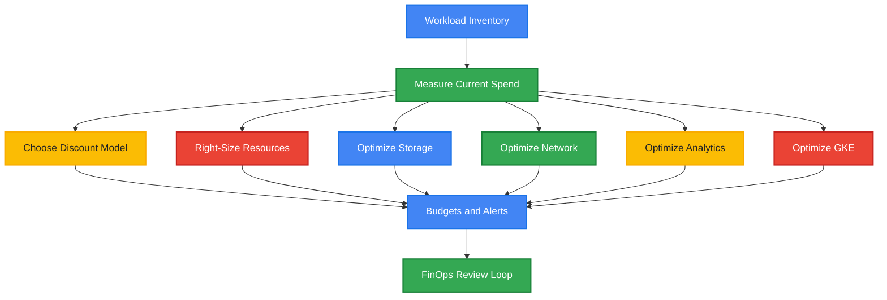

## 1. Committed Use Discounts (CUDs)

### Strategy Overview
Committed Use Discounts reduce spend when you commit to a baseline of predictable usage.
There are two primary models:
- Spend-based CUDs for flexible usage across eligible services.
- Resource-based CUDs for specific machine families, regions, and resources.

Typical savings:
- 1-year commitments: often up to ~20% to 37% depending on service and scope.
- 3-year commitments: often up to ~45% to 57% depending on service and scope.

### Mermaid Diagram

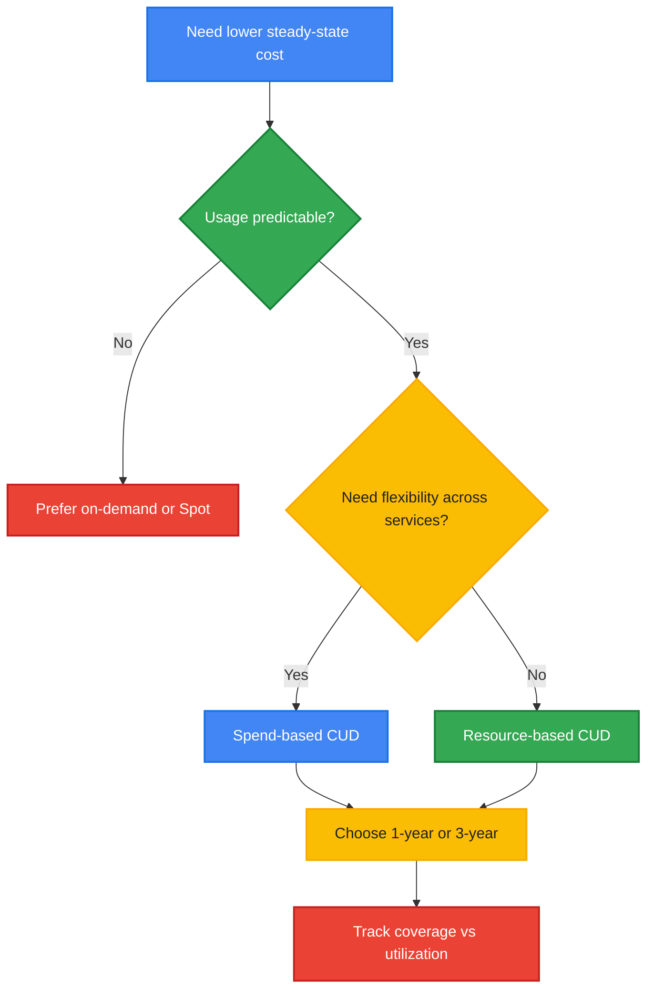

### Explanation
Spend-based CUDs are best when teams need flexibility and expect a stable monthly cloud spend across eligible services such as Compute Engine, GKE, and Cloud Run depending on the program.
Resource-based CUDs are best when you know the exact machine family, vCPU, memory, GPU, or local SSD shape you will run continuously in a specific region.

A 3-year CUD generally yields the highest percentage savings, but it also creates the highest commitment risk if workload demand drops or shifts between resource types.
A 1-year CUD is often a better starting point for newer platforms because it balances savings and flexibility.

Applicable services commonly include:
- Compute Engine
- Google Kubernetes Engine worker nodes
- Cloud SQL in selected commitment models
- Other eligible services based on current GCP pricing programs

### gcloud Commands
```bash
gcloud beta billing commitments list --billing-account=BILLING_ACCOUNT_ID

gcloud compute commitments list --regions=us-central1

gcloud compute commitments describe my-commitment \
  --region=us-central1

gcloud recommender recommendations list \
  --recommender=google.compute.commitment.UsageCommitmentRecommender \
  --location=us-central1 \
  --project=PROJECT_ID
```

### Cost Comparison Table
| Option | Best For | Flexibility | Typical Savings | Risk |
|---|---|---:|---:|---|
| On-demand | Variable workloads | High | 0% | No commitment |
| 1-year Spend-based CUD | Stable multi-service spend | Medium-High | ~20% to 28%+ | Moderate underutilization risk |
| 3-year Spend-based CUD | Long-lived platforms | Medium | ~40% to 45%+ | Higher lock-in risk |
| 1-year Resource-based CUD | Stable VM family/region | Medium | ~30% to 37%+ | Regional/resource mismatch risk |
| 3-year Resource-based CUD | Very predictable compute | Low-Medium | ~55% to 57%+ | Highest lock-in risk |

### Best Practices
- Commit only to the always-on baseline, not peak capacity.
- Use 30 to 90 days of usage history before buying a CUD.
- Separate dev/test from prod to avoid overcommitting against volatile environments.
- Review commitment coverage monthly.
- Pair CUDs with autoscaling so only baseline usage is committed.

---

## 2. Sustained Use Discounts (SUDs)

### Strategy Overview
Sustained Use Discounts automatically reduce the price of eligible Compute Engine resources when they run for a significant portion of a billing month.
No upfront commitment is required.

Typical behavior:
- Discounts begin when an eligible VM runs more than roughly 25% of the month.
- Discount rates increase in tiers as runtime grows.
- Maximum savings often reach around 20% to 30% for eligible resources.

### Mermaid Diagram

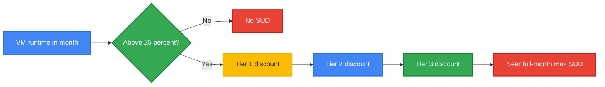

### Explanation
SUDs are automatic and apply to eligible VM resources when they run for long periods in a month.
This makes SUDs useful for workloads that are steady but not steady enough to justify a CUD.
Unlike CUDs, SUDs do not require any purchase decision.

Tier concept:
- Lower runtime: little or no discount.
- Mid runtime: partial discount begins.
- Higher runtime: deeper discount tiers apply.
- Near full month runtime: maximum SUD is reached for eligible resources.

SUDs are especially valuable for legacy environments that have steady uptime but no formal cost commitment strategy yet.

### gcloud Commands
```bash
gcloud compute instances list --format="table(name,zone,status,machineType)"

gcloud compute instances describe INSTANCE_NAME \
  --zone=us-central1-a

gcloud monitoring time-series list \
  --filter='metric.type="compute.googleapis.com/instance/cpu/utilization"' \
  --project=PROJECT_ID
```

### Cost Comparison Table
| Runtime Profile | Commitment Needed | Savings Potential | Best Fit |
|---|---:|---:|---|
| < 25% of month | No | 0% | Burst workloads |
| 25% to 50% | No | Low to moderate | Intermittent steady jobs |
| 50% to 75% | No | Moderate | Long-running app servers |
| 75% to 100% | No | Up to ~20% to 30% | Nearly always-on VMs |
| CUD instead of SUD | Yes | Higher than SUD | Predictable long-term workloads |

### Best Practices
- Let SUDs work automatically before overbuying commitments.
- Compare monthly SUD-eligible usage against potential CUD coverage.
- Shut down idle dev/test VMs because SUD is not a reason to keep waste running.
- Track runtime and utilization together; long runtime with low CPU still indicates waste.

---

## 3. Preemptible / Spot VMs

### Strategy Overview
Spot VMs (and historically Preemptible VMs) provide deep discounts for interruptible capacity.
They are ideal for workloads that can tolerate sudden eviction and retry safely.

Typical savings:
- Often 60% to 91% cheaper than standard on-demand VM pricing depending on machine type and market conditions.

### Mermaid Diagram

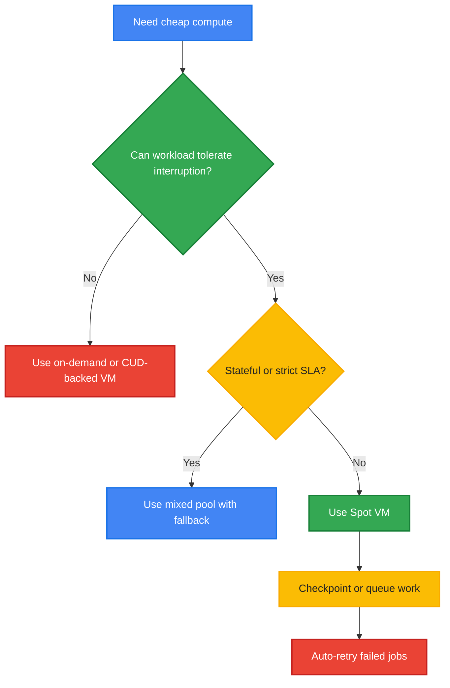

### Explanation
Spot VMs are appropriate for:
- Batch processing
- CI/CD runners
- Rendering
- Data transformation
- Fault-tolerant distributed workloads
- Test environments

Key limitations:
- Capacity can be reclaimed by Google Cloud.
- Legacy preemptible model had a 24-hour maximum runtime.
- Spot/interruptible instances should not host critical singleton state.
- Eviction handling must be built into the application or scheduler.

Pricing comparison generally favors Spot VMs heavily, but operational design matters more than raw price.
A workload that repeatedly restarts without checkpointing may erase savings through low completion efficiency.

### gcloud Commands
```bash
gcloud compute instances create spot-vm-1 \
  --zone=us-central1-a \
  --machine-type=e2-standard-4 \
  --provisioning-model=SPOT

gcloud compute instances create legacy-preemptible-vm \
  --zone=us-central1-a \
  --machine-type=e2-standard-4 \
  --preemptible

gcloud compute instance-templates create spot-template \
  --machine-type=e2-standard-4 \
  --provisioning-model=SPOT

gcloud compute instances describe spot-vm-1 \
  --zone=us-central1-a
```

### Cost Comparison Table
| VM Model | Typical Savings vs On-Demand | Availability Guarantee | Max Runtime | Best For |
|---|---:|---|---|---|
| On-demand | 0% | High | No fixed max | Production steady workloads |
| SUD-backed On-demand | ~20% to 30% | High | No fixed max | Long-running eligible VMs |
| CUD-backed On-demand | ~20% to 57% | High | Commitment term | Predictable baseline |
| Spot VM | ~60% to 91% | Low | Can be interrupted anytime | Fault-tolerant batch |
| Legacy Preemptible VM | ~60% to 80%+ | Low | 24 hours max | Short-lived retryable jobs |

### Best Practices
- Use managed instance groups with mixed Spot and standard capacity.
- Add checkpointing to long-running jobs.
- Use queues, idempotent workers, and automatic retries.
- Keep state external in Cloud Storage, Cloud SQL, Spanner, or BigQuery.
- Use taints/tolerations in GKE to isolate Spot node pools.

---

## 4. Billing Alerts & Budgets

### Strategy Overview
Budgets and alerts provide early warning when spend or forecasted spend approaches thresholds.
When integrated with automation, alerts can trigger protective actions.

Common thresholds:
- 50%
- 75%
- 90%
- 100%
- Forecasted exceedance alerts

### Mermaid Diagram

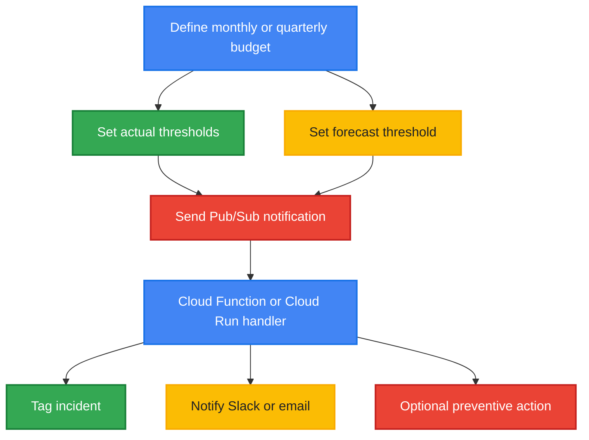

### Explanation
Budgets do not cap spend by themselves; they provide visibility and trigger responses.
The strongest model is:
1. Budget threshold alert
2. Pub/Sub notification
3. Automated analysis or enforcement
4. Team acknowledgment and remediation

Programmatic actions may include:
- Email or chat notification
- Creating incidents in ITSM tools
- Disabling non-production schedules from expanding
- Applying labels to suspect resources
- Triggering Cloud Functions or Cloud Run workflows for remediation

Potential savings come from faster detection rather than discount rates.
In unmanaged environments, alert-driven action often prevents 5% to 15% monthly overspend caused by forgotten resources or runaway workloads.

### gcloud Commands
```bash
gcloud beta billing budgets list --billing-account=BILLING_ACCOUNT_ID

gcloud pubsub topics create billing-budget-alerts

gcloud functions deploy budget-alert-handler \
  --gen2 \
  --runtime=python311 \
  --region=us-central1 \
  --source=. \
  --entry-point=handle_budget_alert \
  --trigger-topic=billing-budget-alerts

gcloud pubsub subscriptions create budget-alerts-sub \
  --topic=billing-budget-alerts
```

### Cost Comparison Table
| Control Level | Detection Speed | Human Effort | Savings Impact |
|---|---|---:|---:|
| No budget | Slow | High | 0% preventative |
| Budget email only | Medium | Medium | Low to moderate |
| Budget + forecast alerts | Medium-High | Medium | Moderate |
| Budget + Pub/Sub + automation | High | Medium upfront | Moderate to high |
| Budget + full policy enforcement | Very high | Higher upfront | High for non-prod governance |

### Best Practices
- Create separate budgets for prod, non-prod, analytics, and network-heavy projects.
- Use both actual and forecast thresholds.
- Route alerts to both finance and engineering owners.
- Automate only safe actions in production.
- Test alert payloads before enforcing actions.

---

## 5. Resource Right-Sizing

### Strategy Overview
Right-sizing reduces waste by aligning VM resources with actual utilization.
This usually targets over-provisioned CPU, memory, and disk configurations.

Typical savings:
- Often 20% to 50% for oversized VM fleets.
- Higher in development environments with low average utilization.

### Mermaid Diagram

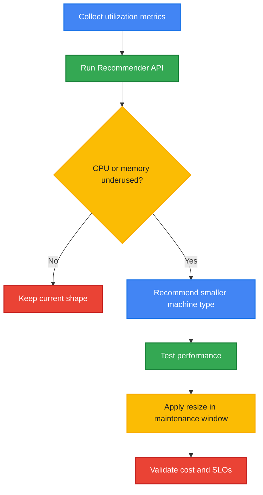

### Explanation
Common waste patterns include:
- CPU utilization under 10% on large VMs
- Excessive memory headroom for stateless apps
- Always-on dev/test systems sized like production
- General-purpose machine types used for bursty workloads

Use the Recommender API and Cloud Monitoring metrics to identify persistent over-provisioning.
Review 14 to 30 days of data, including peak usage and memory trends, before downsizing.
Where possible, move to smaller machine types or more appropriate families such as E2 for cost-sensitive general compute.

### gcloud Commands
```bash
gcloud recommender recommendations list \
  --recommender=google.compute.instance.MachineTypeRecommender \
  --location=us-central1-a \
  --project=PROJECT_ID

gcloud recommender recommendations describe RECOMMENDATION_ID \
  --recommender=google.compute.instance.MachineTypeRecommender \
  --location=us-central1-a \
  --project=PROJECT_ID

gcloud compute instances stop INSTANCE_NAME --zone=us-central1-a

gcloud compute instances set-machine-type INSTANCE_NAME \
  --zone=us-central1-a \
  --machine-type=e2-standard-4

gcloud compute instances start INSTANCE_NAME --zone=us-central1-a
```

### Cost Comparison Table
| Scenario | Before | After | Possible Savings |
|---|---|---|---:|
| App server | n2-standard-8 | e2-standard-4 | ~30% to 50% |
| Dev VM | n2-standard-4 | e2-medium | ~50%+ |
| Memory-heavy workload | n2-highmem-8 | right-sized highmem-4 | ~20% to 40% |
| Batch job | steady large VM | Spot + autoscaling | ~60% to 90% |

### Best Practices
- Validate both CPU and memory, not CPU alone.
- Apply recommendations in lower environments first.
- Use instance templates and managed groups for consistent resizing.
- Combine right-sizing with schedules for non-prod shutdowns.
- Recheck recommendations monthly because workload patterns drift.

---

## 6. Storage Cost Optimization

### Strategy Overview
Cloud Storage cost optimization focuses on choosing the right storage class, automating lifecycle transitions, and minimizing unnecessary retained object versions.

Typical savings:
- Standard to Nearline: significant reduction for infrequently accessed data.
- Standard to Coldline or Archive: often 70% to 90%+ lower storage rates for long-retention cold data.

### Mermaid Diagram

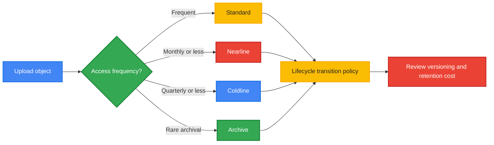

### Explanation
Storage optimization begins with data classification:
- Hot data in Standard
- Warm backup or infrequent access in Nearline
- Colder backup and compliance data in Coldline
- Long-term archive in Archive

Lifecycle rules automatically transition or delete objects after time thresholds.
This is one of the easiest ways to reduce recurring cost without application changes.

Object versioning adds resilience but can multiply costs if old versions accumulate indefinitely.
Every version stored is billable, so version expiration rules are essential.

### gcloud Commands
```bash
gcloud storage buckets create gs://my-cost-bucket \
  --location=us-central1 \
  --default-storage-class=STANDARD

gcloud storage buckets describe gs://my-cost-bucket

gcloud storage buckets update gs://my-cost-bucket \
  --lifecycle-file=lifecycle.json

gcloud storage buckets update gs://my-cost-bucket \
  --versioning

gcloud storage ls --long gs://my-cost-bucket/**
```

### Cost Comparison Table
| Storage Class | Access Pattern | Relative Cost | Retrieval Cost Consideration |
|---|---|---:|---|
| Standard | Frequent | Highest | Low |
| Nearline | Infrequent | Lower | Retrieval charges apply |
| Coldline | Rare | Much lower | Higher retrieval sensitivity |
| Archive | Very rare | Lowest | Highest access latency and retrieval sensitivity |

### Best Practices
- Use lifecycle transitions based on age and prefix.
- Enable object versioning only where recovery value exceeds storage cost.
- Add lifecycle deletion for old versions.
- Review minimum storage duration requirements before transitioning data.
- Separate backup, logs, analytics exports, and app assets into different buckets with tailored policies.

### Sample Lifecycle Policy
```json
{
  "rule": [
    {
      "action": {"type": "SetStorageClass", "storageClass": "NEARLINE"},
      "condition": {"age": 30}
    },
    {
      "action": {"type": "SetStorageClass", "storageClass": "COLDLINE"},
      "condition": {"age": 90}
    },
    {
      "action": {"type": "SetStorageClass", "storageClass": "ARCHIVE"},
      "condition": {"age": 365}
    },
    {
      "action": {"type": "Delete"},
      "condition": {"numNewerVersions": 5}
    }
  ]
}
```

---

## 7. Network Cost Optimization

### Strategy Overview
Network cost is often dominated by internet egress, cross-region traffic, load balancing, and inefficient cache usage.
Optimization requires both architectural and delivery-layer controls.

Typical savings:
- CDN caching can reduce origin egress materially, sometimes 20% to 80% for cacheable content.
- Moving traffic to Standard Tier may reduce cost for non-latency-sensitive workloads.

### Mermaid Diagram

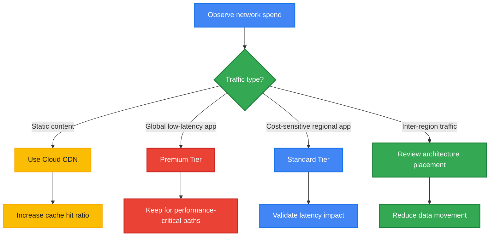

### Explanation
Primary network cost levers:
- Reduce internet egress volume.
- Increase cache hit ratios through Cloud CDN.
- Keep data close to compute to avoid cross-region transfer.
- Select Premium vs Standard Network Service Tier appropriately.

Premium Tier uses Google’s global backbone and generally offers better performance and global routing.
Standard Tier is cheaper for some patterns but may have different latency characteristics.
For static or semi-static web assets, CDN offload can dramatically reduce both egress and backend load.

Egress pricing is tiered by destination and geography, so design should consider where users, data, and services are located.

### gcloud Commands
```bash
gcloud compute backend-services update BACKEND_SERVICE \
  --global \
  --enable-cdn

gcloud compute addresses create app-ip \
  --network-tier=STANDARD \
  --region=us-central1

gcloud compute addresses create global-app-ip \
  --network-tier=PREMIUM \
  --global

gcloud compute network-endpoint-groups list
```

### Cost Comparison Table
| Option | Cost | Performance | Best Use |
|---|---:|---|---|
| Premium Tier | Higher | Best global performance | Global apps, latency-sensitive traffic |
| Standard Tier | Lower | Regional internet path | Cost-sensitive regional workloads |
| No CDN | Higher origin egress | Depends on backend | Dynamic-only apps |
| CDN enabled | Lower origin egress | Better cacheable content delivery | Static and cache-friendly content |

### Best Practices
- Co-locate compute and data whenever possible.
- Enable Cloud CDN for static assets, downloads, and cacheable APIs.
- Review cache-control headers to improve hit ratio.
- Avoid unnecessary cross-region replication where compliance does not require it.
- Use Premium Tier only where performance benefit is measurable.

---

## 8. BigQuery Cost Control

### Strategy Overview
BigQuery costs are driven mainly by query processing, slot consumption, data storage, and inefficient SQL patterns.
Controlling spend requires both billing model choices and query design discipline.

Typical savings:
- Partition pruning and clustering can reduce scanned bytes by 50% to 90%+ in poorly optimized datasets.
- Flat-rate or committed slots may outperform on-demand at high, predictable analytical volume.

### Mermaid Diagram

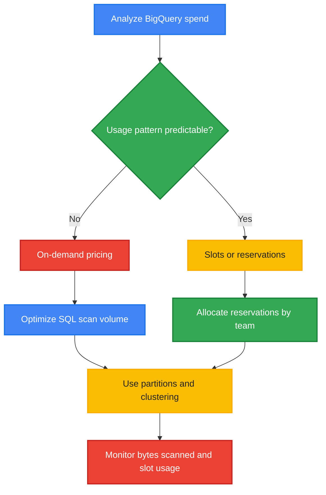

### Explanation
Billing models:
- On-demand: pay per TB processed; best for irregular or low-volume usage.
- Flat-rate or reservations: pay for slots; best for stable, high-throughput analytics platforms.

Key controls:
- Partition tables by ingestion date or event date.
- Use partition filters in every query.
- Cluster on high-selectivity columns commonly used in filters.
- Avoid `SELECT *` in large tables.
- Materialize expensive repeated transformations.

Slot reservations improve predictability and team-level governance.
On-demand is simpler, but unbounded ad hoc queries can become expensive quickly.

### gcloud Commands
```bash
gcloud alpha bq reservations capacity-commitments list \
  --location=US \
  --project=PROJECT_ID

gcloud alpha bq reservations reservations list \
  --location=US \
  --project=PROJECT_ID

gcloud alpha bq reservations assignments list \
  --location=US \
  --project=PROJECT_ID

bq query --use_legacy_sql=false \
'EXPLAIN SELECT COUNT(*) FROM `PROJECT_ID.dataset.table` WHERE event_date >= DATE_SUB(CURRENT_DATE(), INTERVAL 7 DAY)'
```

### Cost Comparison Table
| Model | Best For | Cost Predictability | Optimization Focus |
|---|---|---|---|
| On-demand | Irregular analytics | Low-Medium | Reduce bytes scanned |
| Flat-rate/slots | Stable heavy usage | High | Slot allocation efficiency |
| Unpartitioned tables | Any large table | Poor | High scan cost risk |
| Partitioned + clustered | Large filtered queries | Better | Lower scan volume |

### Best Practices
- Enforce partition filters in analytics standards.
- Use INFORMATION_SCHEMA and audit logs to find expensive queries.
- Separate ETL, BI, and data science workloads with reservations if scale justifies it.
- Expire staging tables automatically.
- Tag datasets and jobs for chargeback.

### SQL Examples
```sql
-- Good: partition pruning
SELECT user_id, COUNT(*)
FROM `PROJECT_ID.analytics.events`
WHERE event_date BETWEEN DATE '2025-01-01' AND DATE '2025-01-31'
GROUP BY user_id;

-- Better with clustering on user_id when repeated
SELECT user_id, SUM(revenue)
FROM `PROJECT_ID.analytics.events`
WHERE event_date >= DATE_SUB(CURRENT_DATE(), INTERVAL 30 DAY)
  AND user_id IN ('u1', 'u2', 'u3')
GROUP BY user_id;
```

---

## 9. GKE Cost Optimization

### Strategy Overview
GKE cost optimization combines control-plane model selection, autoscaling, efficient node pools, and right-sized workloads.

Typical savings:
- Autopilot can reduce operational waste for small or variable workloads.
- Cluster autoscaler and vertical pod autoscaler can materially reduce idle node and pod headroom.
- Spot node pools can cut batch or fault-tolerant Kubernetes costs by 60% to 90%.

### Mermaid Diagram

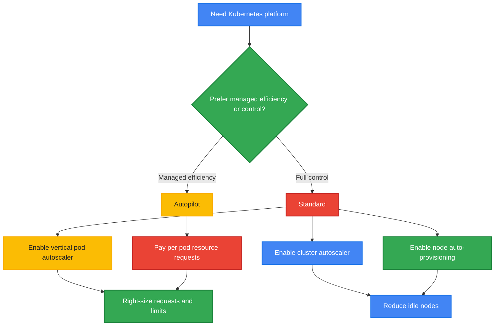

### Explanation
Autopilot:
- Lower operational overhead
- Billing aligns more closely to requested pod resources
- Best for teams that want simplified operations and elastic efficiency

Standard:
- More control over node pools, machine types, GPUs, and scheduling
- More responsibility for optimization
- Best when advanced customization or special hardware is needed

High-impact controls:
- Cluster autoscaler removes idle nodes.
- Node auto-provisioning selects efficient node pools automatically.
- Vertical Pod Autoscaler improves resource requests.
- Horizontal Pod Autoscaler prevents overprovisioning for peak-only traffic.
- Spot node pools support fault-tolerant services and jobs.

### gcloud Commands
```bash
gcloud container clusters create-auto autopilot-cluster \
  --region=us-central1

gcloud container clusters create standard-cluster \
  --region=us-central1 \
  --enable-autoscaling \
  --min-nodes=1 \
  --max-nodes=10

gcloud container node-pools create spot-pool \
  --cluster=standard-cluster \
  --region=us-central1 \
  --spot \
  --enable-autoscaling \
  --min-nodes=0 \
  --max-nodes=20

gcloud container clusters update standard-cluster \
  --region=us-central1 \
  --enable-vertical-pod-autoscaling
```

### Cost Comparison Table
| Model | Strength | Cost Behavior | Best Fit |
|---|---|---|---|
| Autopilot | Simplicity | Efficient for variable app demand | Small to medium platform teams |
| Standard unmanaged | Maximum control | Risk of idle nodes | Specialized clusters |
| Standard + autoscaling | Balanced control | Lower idle cost | Most mature platforms |
| Standard + Spot pools | Lowest compute cost | Interruptible capacity | Batch/stateless workloads |

### Best Practices
- Set realistic CPU and memory requests; over-requesting directly inflates cost.
- Use separate node pools for system, general workloads, and Spot workloads.
- Enable autoscaling everywhere feasible.
- Clean up unused namespaces, load balancers, and persistent disks.
- Review pod disruption tolerance before moving workloads to Spot nodes.

---

## 10. Billing Export & Analysis

### Strategy Overview
Billing export to BigQuery provides the detailed cost dataset needed for analysis, dashboards, anomaly detection, and chargeback.
This is foundational for mature FinOps.

### Mermaid Diagram

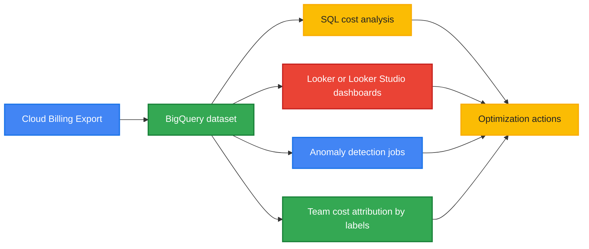

### Explanation
Billing export enables:
- Service-level spend analysis
- SKU-level drill down
- Project and label attribution
- Trend detection
- Showback and chargeback
- Forecasting and dashboarding

Looker or Looker Studio can present spend by:
- Project
- Environment
- Team
- Service
- Label key/value
- Region
- SKU

Without billing export, optimization remains reactive and anecdotal.
With billing export, teams can measure realized savings and detect regressions quickly.

### gcloud Commands
```bash
gcloud billing accounts list

gcloud beta billing projects list --billing-account=BILLING_ACCOUNT_ID

gcloud config set project PROJECT_ID

gcloud services enable bigquery.googleapis.com

bq ls
```

### Cost Comparison Table
| Analysis Maturity | Visibility | Attribution Quality | Optimization Effectiveness |
|---|---|---|---|
| Console only | Basic | Low | Low |
| Billing export only | Medium | Medium | Medium |
| Export + dashboards | High | Medium-High | High |
| Export + labels + automated analysis | Very high | High | Very high |

### Best Practices
- Enable billing export early, even before optimization begins.
- Standardize dataset retention and access controls.
- Join billing data with resource metadata and labels.
- Create weekly dashboards for engineering leaders.
- Use anomaly detection over daily spend deltas.

### Example BigQuery Analysis Query
```sql
SELECT
  project.id AS project_id,
  service.description AS service_name,
  sku.description AS sku_name,
  SUM(cost) AS total_cost
FROM `PROJECT_ID.billing_export.gcp_billing_export_v1_*`
WHERE usage_start_time >= TIMESTAMP_SUB(CURRENT_TIMESTAMP(), INTERVAL 30 DAY)
GROUP BY 1, 2, 3
ORDER BY total_cost DESC;
```

---

## 11. FinOps Best Practices

### Strategy Overview
FinOps is the operating model that aligns engineering, finance, and business teams around cloud cost accountability and optimization.

### Mermaid Diagram

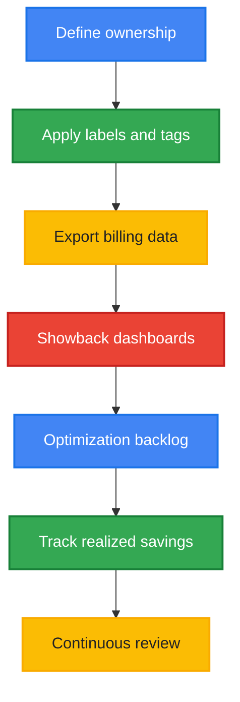

### Explanation
Strong FinOps practices convert optimization from one-time cleanup into ongoing discipline.
Core elements:
- Labeling strategy
- Project/folder structure aligned to ownership
- Budget guardrails
- Chargeback or showback model
- KPI review cadence

Labeling strategy should include keys such as:
- env
- app
- team
- owner
- cost-center
- data-classification

Project structure should separate:
- Production vs non-production
- Shared platform services vs application projects
- Team or product ownership boundaries
- Network or data hub projects where centralization is intentional

Showback means reporting usage and spend to teams.
Chargeback means allocating actual cost responsibility to those teams.
Both models improve behavior, but chargeback usually drives the strongest accountability.

### gcloud Commands
```bash
gcloud projects create my-app-prod --name="My App Prod"

gcloud beta billing projects link my-app-prod \
  --billing-account=BILLING_ACCOUNT_ID

gcloud resource-manager folders list \
  --organization=ORGANIZATION_ID

gcloud compute instances add-labels INSTANCE_NAME \
  --zone=us-central1-a \
  --labels=env=prod,team=platform,app=api,cost-center=cc123
```

### Cost Comparison Table
| Practice | Upfront Effort | Ongoing Benefit | Cost Impact |
|---|---:|---|---|
| No labels | Low | None | Poor attribution |
| Basic labels | Low-Medium | Better visibility | Moderate governance gain |
| Full showback | Medium | Team accountability | High behavioral impact |
| Chargeback | Medium-High | Strong accountability | Very high governance impact |
| FinOps review cadence | Medium | Continuous savings capture | High |

### Best Practices
- Make labels mandatory through policy or CI/CD checks.
- Assign every project and major resource an owner.
- Review unit economics, not just total spend.
- Track forecast, actual, and realized savings separately.
- Build a recurring cost review with engineering and finance together.

---

## Recommended Implementation Sequence

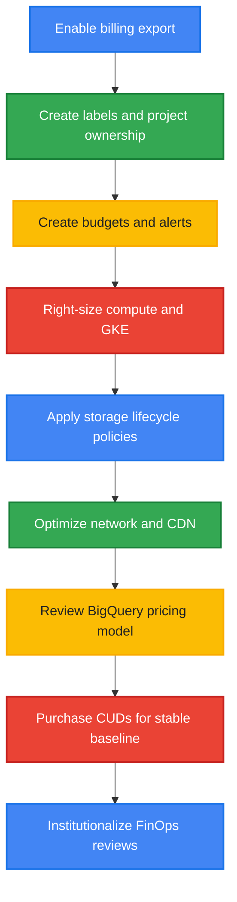

## Sample Optimization Checklist
- [ ] Enable BigQuery billing export.
- [ ] Create budgets for every major project or portfolio.
- [ ] Create forecast-based alerts.
- [ ] Enable Recommender API reviews for compute and idle resources.
- [ ] Review VM uptime to compare SUD vs CUD opportunity.
- [ ] Move retryable jobs to Spot VMs or Spot node pools.
- [ ] Apply lifecycle policies to Cloud Storage buckets.
- [ ] Audit object versioning retention.
- [ ] Enable CDN for cacheable internet content.
- [ ] Review Premium vs Standard network tier usage.
- [ ] Partition and cluster BigQuery tables.
- [ ] Evaluate slot reservations for stable analytics demand.
- [ ] Enable GKE autoscaling and VPA where appropriate.
- [ ] Standardize labels for showback/chargeback.
- [ ] Establish monthly FinOps review cadence.

## Common Anti-Patterns to Avoid
- Buying CUDs for short-lived or uncertain workloads.
- Assuming high runtime means a VM is well utilized.
- Running stateful critical workloads only on Spot.
- Keeping Cloud Storage versioning enabled without lifecycle cleanup.
- Ignoring cross-region egress in multi-region architectures.
- Querying large BigQuery tables without partition filters.
- Over-requesting CPU and memory in Kubernetes.
- Operating without labels, budgets, or billing export.

## Savings Summary by Lever

| Optimization Lever | Potential Savings Range | Notes |
|---|---:|---|
| 1-year CUD | ~20% to 37% | Depends on service and flexibility model |
| 3-year CUD | ~40% to 57% | Highest savings, highest commitment risk |
| SUD | Up to ~20% to 30% | Automatic for eligible long-running VMs |
| Spot / Preemptible | ~60% to 91% | Requires fault tolerance |
| VM right-sizing | ~20% to 50% | Often immediate savings |
| Storage class transitions | ~30% to 90%+ | Based on access pattern |
| CDN and egress optimization | ~20% to 80% | Heavily workload dependent |
| BigQuery partitioning/clustering | ~50% to 90%+ | Reduces scanned bytes |
| GKE autoscaling and right-sizing | ~20% to 60%+ | Depends on request accuracy |
| FinOps governance | Variable | Prevents recurring waste |

## Final Recommendations
1. Start with visibility: billing export, labels, and budgets.
2. Capture fast wins: right-sizing, storage lifecycle, and non-prod cleanup.
3. Optimize architecture: CDN, region placement, BigQuery design, and GKE autoscaling.
4. Then commit strategically: purchase CUDs only after usage patterns are stable.
5. Make savings durable through FinOps ownership, dashboards, and review cadence.
