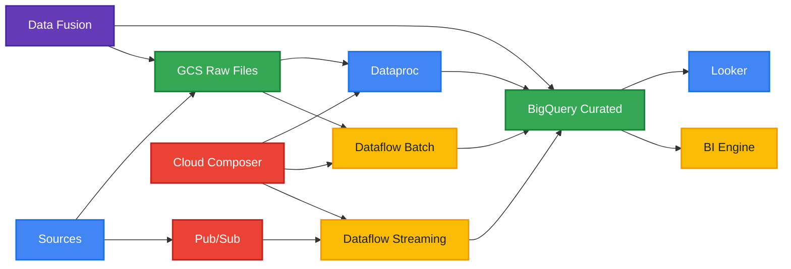
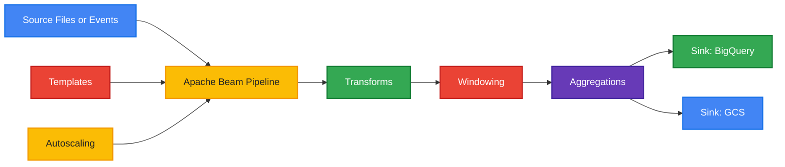
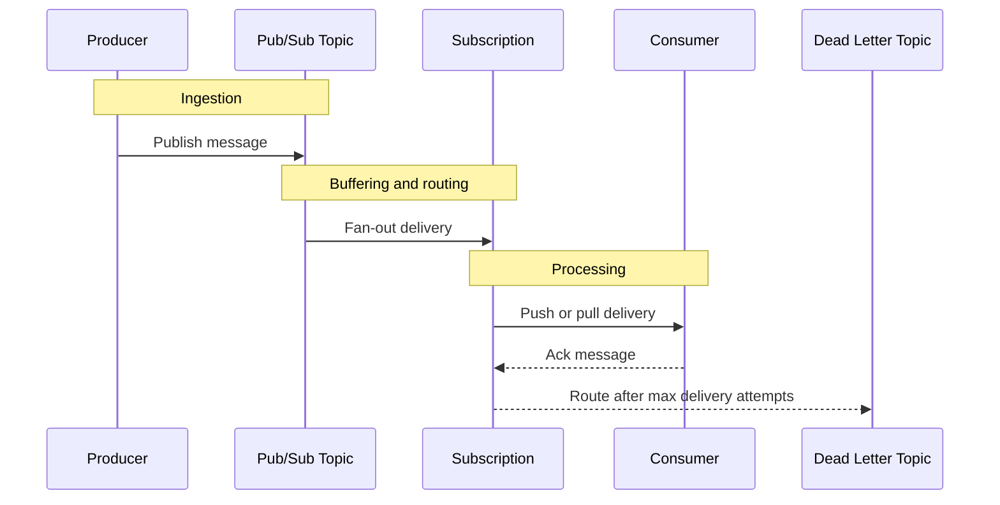
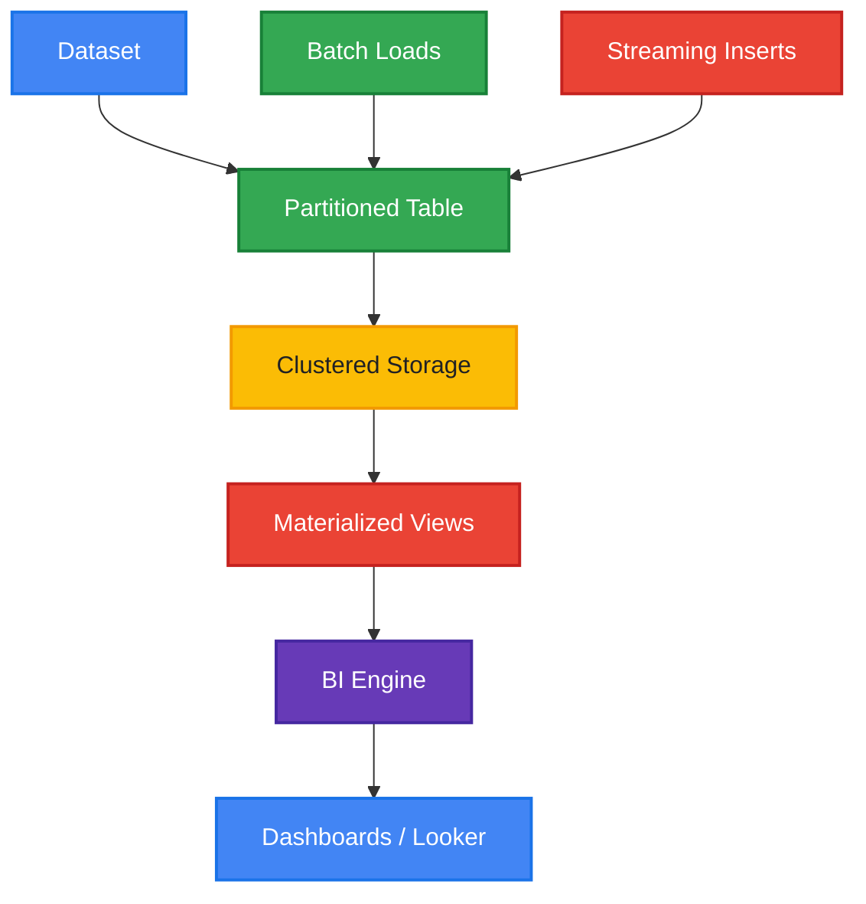
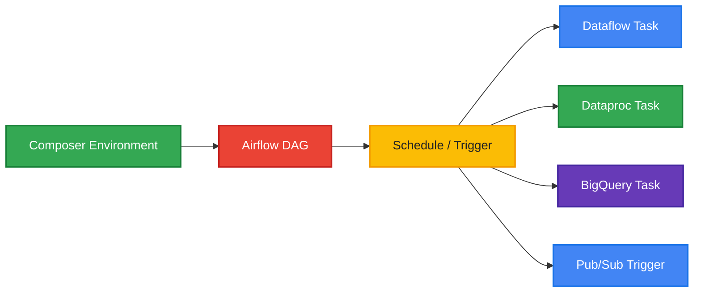
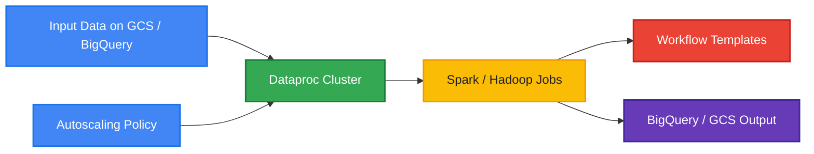
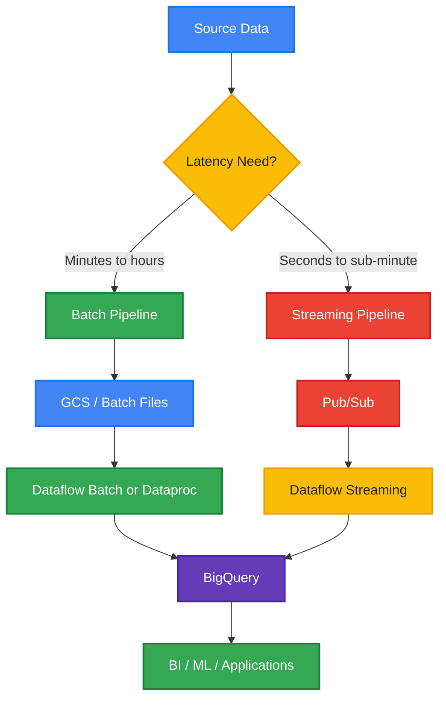
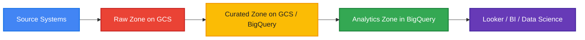
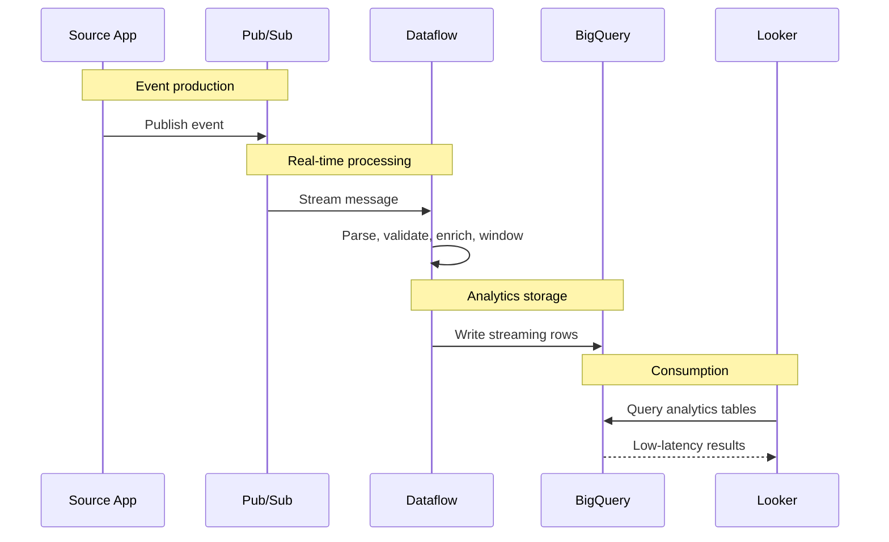

# GCP Data Pipeline Reference

> Comprehensive reference for common Google Cloud data engineering patterns using Dataflow, Pub/Sub, BigQuery, Cloud Composer, Dataproc, and Data Fusion.
<!-- workflow-diagram:start -->
## Data Pipeline Workflow

```mermaid
flowchart LR
    Sources["Apps, files, databases, streams"] --> Ingest{"Batch or streaming?"}
    subgraph Ingestion["Ingestion layer"]
        PubSub["Pub/Sub"]
        Transfer["Storage Transfer / DMS"]
        Composer["Cloud Composer"]
    end
    Ingest -->|Streaming| PubSub
    Ingest -->|Batch| Transfer
    Transfer --> Composer
    PubSub --> Process["Dataflow / Dataproc"]
    Composer --> Process
    Process --> Quality["Validate schema + quality"]
    Quality --> Store{"Target platform?"}
    Store -->|Analytics| BigQuery["BigQuery"]
    Store -->|Lakehouse| GCS["Cloud Storage"]
    Store -->|Serving| Feature["Operational sink / serving"]
    BigQuery --> Observe["Monitoring + lineage"]
    GCS --> Observe
    Feature --> Observe
    Observe --> Healthy{"Pipeline healthy?"}
    Healthy -->|No| Tune["Replay, scale, or fix transforms"]
    Tune --> Process
    Healthy -->|Yes| Consume["Dashboards / ML / apps"]
    classDef start fill:#E3F2FD,stroke:#1E88E5,color:#0D47A1;
    classDef ingest fill:#E8F5E9,stroke:#43A047,color:#1B5E20;
    classDef data fill:#FFF3E0,stroke:#FB8C00,color:#E65100;
    classDef finish fill:#F3E5F5,stroke:#8E24AA,color:#4A148C;
    class Sources,Ingest start;
    class PubSub,Transfer,Composer,Process,Quality ingest;
    class Store,BigQuery,GCS,Feature,Observe,Healthy,Tune data;
    class Consume finish;
```

<!-- workflow-diagram:end -->


---

## Table of Contents

1. [Overview](#overview)
2. [Reference Architecture](#reference-architecture)
3. [Dataflow](#dataflow)
4. [PubSub](#pubsub)
5. [BigQuery](#bigquery)
6. [Cloud Composer](#cloud-composer)
7. [Dataproc](#dataproc)
8. [Data Fusion](#data-fusion)
9. [Batch vs Streaming Architecture](#batch-vs-streaming-architecture)
10. [Data Lake Architecture](#data-lake-architecture)
11. [Real-time Analytics Pipeline](#real-time-analytics-pipeline)
12. [Operational Guidance](#operational-guidance)

---

## Overview

Google Cloud provides multiple managed services for ingesting, processing, orchestrating, storing, and analyzing data.

This document consolidates key architectural patterns and implementation guidance for:

- **Dataflow** for Apache Beam processing
- **Pub/Sub** for asynchronous messaging and event ingestion
- **BigQuery** for analytics storage and querying
- **Cloud Composer** for workflow orchestration
- **Dataproc** for managed Spark and Hadoop workloads
- **Data Fusion** for visual ETL and ELT
- **GCS + BigQuery** for lakehouse-style zone architectures
- **Looker** for downstream dashboarding and BI

The goal is to help design scalable pipelines for both batch and streaming use cases.

---

## Reference Architecture



### Explanation

A modern GCP data platform often uses multiple services together:

- **Pub/Sub** handles event ingestion.
- **Dataflow** processes streaming events and batch files.
- **Dataproc** runs Spark or Hadoop jobs when custom distributed processing is required.
- **Cloud Composer** schedules and orchestrates dependencies across pipelines.
- **Data Fusion** helps teams build visual data ingestion and transformation pipelines.
- **BigQuery** stores curated and analytics-ready datasets.
- **BI Engine** and **Looker** serve dashboards and low-latency analytics.

### Example Commands

```bash
gcloud config set project PROJECT_ID
gcloud services enable dataflow.googleapis.com pubsub.googleapis.com bigquery.googleapis.com composer.googleapis.com dataproc.googleapis.com datafusion.googleapis.com
bq ls
```

### Best Practices

- Separate ingestion, processing, orchestration, and serving responsibilities.
- Keep raw data immutable.
- Use IAM least privilege across services.
- Prefer managed services before self-managed clusters.
- Design for retries, idempotency, and observability.

---

## Dataflow

### Mermaid Diagram



### Explanation

**Dataflow** is Google Cloud’s managed service for executing **Apache Beam** pipelines.

It supports both:

- **Batch pipelines** for bounded datasets such as files in GCS or table exports
- **Streaming pipelines** for unbounded datasets such as Pub/Sub events

Key concepts:

#### Apache Beam Pipelines

Apache Beam provides a unified programming model for:

- Reading from sources
- Transforming data with `ParDo`, `Map`, `FlatMap`, and custom transforms
- Grouping and aggregating
- Writing to sinks

Beam allows developers to define a single logical pipeline that Dataflow runs as a managed service.

#### Batch vs Streaming

- **Batch** is best when all input data already exists.
- **Streaming** is best when data continuously arrives and low latency matters.
- Beam lets you reuse many transforms across both models.

#### Templates

Dataflow supports:

- **Classic templates**
- **Flex templates**

Templates allow repeatable deployment with runtime parameters such as:

- input path
- output table
- temp location
- worker settings

#### Autoscaling

Dataflow can scale worker count based on throughput and backlog.

Benefits:

- reduced operational overhead
- better cost efficiency
- elasticity for bursty workloads

#### Windowing

Streaming pipelines require windowing to group infinite event streams.

Common windows:

- **Fixed windows**
- **Sliding windows**
- **Session windows**
- **Global windows**

Windowing is often combined with:

- triggers
- allowed lateness
- watermark handling

#### Common Use Cases

- ETL from GCS to BigQuery
- Stream enrichment from Pub/Sub to BigQuery
- Event deduplication
- Aggregations over event time
- CDC processing

### Example Commands

```bash
# Run a Beam pipeline on Dataflow
python main.py \
  --runner DataflowRunner \
  --project PROJECT_ID \
  --region us-central1 \
  --temp_location gs://BUCKET/temp \
  --staging_location gs://BUCKET/staging \
  --job_name beam-batch-job

# List Dataflow jobs
gcloud dataflow jobs list --region=us-central1

# Describe a Dataflow job
gcloud dataflow jobs describe JOB_ID --region=us-central1

# Run a Flex Template
gcloud dataflow flex-template run realtime-pipeline-001 \
  --region=us-central1 \
  --template-file-gcs-location=gs://BUCKET/templates/realtime.json \
  --parameters inputSubscription=projects/PROJECT_ID/subscriptions/orders-sub,outputTable=PROJECT_ID:analytics.orders
```

### Best Practices

- Prefer **Flex Templates** for production parameterized deployments.
- Use **streaming engine** and autoscaling for high-throughput streaming jobs.
- Design transforms to be **idempotent**.
- Choose **event-time processing** when business meaning depends on source timestamps.
- Tune worker machine types only after observing bottlenecks.
- Use dead-letter outputs for malformed records.
- Store temp and staging data in regional buckets aligned to the Dataflow region.
- Monitor job lag, watermark progression, and worker utilization.

---

## Pub/Sub

### Mermaid Diagram



### Explanation

**Pub/Sub** is Google Cloud’s global messaging service for decoupled event-driven architectures.

Core building blocks:

#### Topics

A **topic** is the logical endpoint producers publish to.

Examples:

- `orders-created`
- `inventory-events`
- `device-telemetry`

#### Subscriptions

A **subscription** receives copies of topic messages.

Types:

- **Pull subscriptions**: consumers poll for messages
- **Push subscriptions**: Pub/Sub pushes messages to an HTTPS endpoint

#### Message Ordering

Pub/Sub can preserve ordering when publishers use an ordering key and ordering is enabled.

Use ordering only when the application truly requires it, because it can reduce throughput.

#### Dead Letter Topics

If a consumer repeatedly fails to ack a message, Pub/Sub can send it to a **dead letter topic** after the configured maximum delivery attempts.

This is useful for:

- poison messages
- schema violations
- downstream outage isolation

#### Exactly-Once Delivery

Pub/Sub offers **exactly-once delivery** for supported pull subscriber workflows.

Important note:

- exactly-once reduces duplicate deliveries from the service perspective
- application-level idempotency is still recommended

#### Common Use Cases

- event ingestion for streaming analytics
- decoupling microservices
- asynchronous task distribution
- near real-time pipeline triggers

### Example Commands

```bash
# Create a topic
gcloud pubsub topics create orders-topic

# Create a pull subscription
gcloud pubsub subscriptions create orders-sub \
  --topic=orders-topic

# Create a push subscription
gcloud pubsub subscriptions create orders-push-sub \
  --topic=orders-topic \
  --push-endpoint=https://example.com/pubsub

# Enable message ordering on a subscription
gcloud pubsub subscriptions create ordered-orders-sub \
  --topic=orders-topic \
  --enable-message-ordering

# Create a dead letter topic
gcloud pubsub topics create orders-dlt

gcloud pubsub subscriptions create resilient-orders-sub \
  --topic=orders-topic \
  --dead-letter-topic=orders-dlt \
  --max-delivery-attempts=10

# Publish a message
gcloud pubsub topics publish orders-topic \
  --message='{"order_id": 101, "amount": 55.20}'

# Pull messages
gcloud pubsub subscriptions pull orders-sub \
  --limit=5 \
  --auto-ack
```

### Best Practices

- Use one topic per event domain or bounded business contract.
- Prefer schemas for producer-consumer compatibility.
- Use dead letter topics for repeated failures.
- Keep messages small and immutable.
- Make consumers idempotent even when exactly-once is enabled.
- Monitor unacked messages, oldest unacked age, and subscription backlog.
- Use ordering keys sparingly.
- Separate retryable and non-retryable failures.

---

## BigQuery

### Mermaid Diagram



### Explanation

**BigQuery** is Google Cloud’s serverless data warehouse.

Key concepts:

#### Datasets

A **dataset** is a logical container for:

- tables
- views
- materialized views
- routines
- models

Datasets are also a common boundary for permissions and organization.

#### Tables

BigQuery tables store structured and semi-structured data.

Common table patterns:

- raw ingestion tables
- curated business tables
- aggregated marts
- external tables

#### Partitioning

BigQuery supports several partitioning patterns:

1. **Time-unit column partitioning**
2. **Ingestion-time partitioning**
3. **Integer range partitioning**

Benefits:

- lower query cost
- better pruning
- improved performance for time-scoped workloads

#### Clustering

Clustering sorts table storage based on selected columns.

It works well when queries frequently filter on columns such as:

- customer_id
- country
- event_type
- status

Partitioning and clustering are often used together.

#### Materialized Views

Materialized views precompute and incrementally maintain query results.

Good fit for:

- repeated aggregations
- dashboard acceleration
- summary layers

#### BI Engine

**BI Engine** accelerates analytical queries for BI workloads with in-memory caching.

Useful for:

- dashboard interactivity
- frequent repeated queries
- Looker and BI tools

#### Streaming Inserts vs Batch Loads

**Streaming inserts**:

- low latency
- immediate availability
- useful for near real-time analytics

**Batch loads**:

- lower cost at scale
- better for file-based ingestion
- often used for periodic loads from GCS

Choose based on latency, volume, and cost profile.

### Example Commands

```bash
# Create a dataset
bq mk --dataset --location=US PROJECT_ID:analytics

# Create a partitioned and clustered table
bq mk \
  --table \
  --time_partitioning_field event_date \
  --clustering_fields customer_id,event_type \
  PROJECT_ID:analytics.events \
  event_id:STRING,event_date:DATE,customer_id:STRING,event_type:STRING,amount:FLOAT

# Create an integer-range partitioned table
bq mk \
  --table \
  --range_partitioning=user_id,0,1000000,10000 \
  PROJECT_ID:analytics.user_events \
  user_id:INTEGER,event_ts:TIMESTAMP,event_name:STRING

# Load batch data from GCS
bq load \
  --source_format=NEWLINE_DELIMITED_JSON \
  PROJECT_ID:analytics.events \
  gs://BUCKET/events/*.json

# Query data
bq query --use_legacy_sql=false '
SELECT event_type, COUNT(*) AS cnt
FROM `PROJECT_ID.analytics.events`
WHERE event_date >= DATE_SUB(CURRENT_DATE(), INTERVAL 7 DAY)
GROUP BY event_type
ORDER BY cnt DESC'

# Create a materialized view
bq query --use_legacy_sql=false '
CREATE MATERIALIZED VIEW `PROJECT_ID.analytics.mv_daily_sales` AS
SELECT event_date, SUM(amount) AS total_sales
FROM `PROJECT_ID.analytics.events`
GROUP BY event_date'
```

### Best Practices

- Partition large tables whenever filter patterns justify it.
- Cluster on high-cardinality columns used in predicates.
- Avoid over-partitioning tiny tables.
- Use batch loads for large periodic ingestion when low latency is not required.
- Use streaming only where freshness matters.
- Apply table expiration for transient staging datasets.
- Use authorized views or row/column security for governed access.
- Monitor slot consumption, query cost, and storage growth.

---

## Cloud Composer

### Mermaid Diagram



### Explanation

**Cloud Composer** is the managed Apache Airflow service on Google Cloud.

Key concepts:

#### Managed Apache Airflow

Composer manages the Airflow control plane, reducing the burden of operating schedulers, workers, and dependencies.

#### DAGs

A **DAG** defines task dependencies and execution order.

Typical tasks include:

- start a Dataflow job
- submit a Dataproc Spark job
- run a BigQuery SQL transform
- wait for file arrival
- publish a Pub/Sub notification

#### Environment Configuration

Composer environments include settings for:

- Airflow version
- Python dependencies
- network configuration
- service accounts
- PyPI packages
- environment variables

#### Triggering Pipelines

Composer can trigger pipelines by:

- schedule
- manual run
- API
- sensor-based event detection

It is useful when multiple systems and dependencies must be orchestrated reliably.

### Example Commands

```bash
# Create a Composer environment
gcloud composer environments create data-orchestration \
  --location=us-central1 \
  --image-version=composer-2-airflow-2

# Describe the environment
gcloud composer environments describe data-orchestration \
  --location=us-central1

# Trigger a DAG
gcloud composer environments run data-orchestration \
  --location=us-central1 dags trigger -- pipeline_daily_load

# List DAGs
gcloud composer environments run data-orchestration \
  --location=us-central1 dags list
```

### Best Practices

- Keep DAGs focused on orchestration, not heavy data processing.
- Externalize large compute to Dataflow, Dataproc, or BigQuery.
- Use environment variables and secret backends instead of hardcoded values.
- Build retries and alerting into task definitions.
- Version DAGs and dependencies carefully.
- Separate dev, test, and prod environments.
- Use service accounts with least privilege.

---

## Dataproc

### Mermaid Diagram



### Explanation

**Dataproc** is Google Cloud’s managed service for Spark, Hadoop, and related open-source data processing frameworks.

Key capabilities:

#### Managed Spark/Hadoop

Use Dataproc when you need:

- native Spark APIs
- Hadoop ecosystem tools
- custom JAR dependencies
- distributed compute for migration or legacy workloads

#### Autoscaling

Dataproc clusters can scale based on workload demand.

This helps optimize:

- cost
- job completion time
- resource utilization

#### Jobs

Dataproc supports multiple job types:

- Spark
- PySpark
- Hadoop
- Hive
- Pig
- Spark SQL

#### Workflows

Workflow templates allow multi-step job execution with dependencies.

Examples:

- preprocess raw files
- run Spark transformations
- publish success status

### Example Commands

```bash
# Create a Dataproc cluster
gcloud dataproc clusters create analytics-cluster \
  --region=us-central1 \
  --single-node

# Submit a PySpark job
gcloud dataproc jobs submit pyspark gs://BUCKET/jobs/transform.py \
  --cluster=analytics-cluster \
  --region=us-central1

# Create an autoscaling policy
gcloud dataproc autoscaling-policies import autoscaling-policy \
  --source=autoscaling.yaml \
  --region=us-central1

# List clusters
gcloud dataproc clusters list --region=us-central1

# List jobs
gcloud dataproc jobs list --region=us-central1
```

### Best Practices

- Use ephemeral clusters for transient jobs when possible.
- Prefer serverless or fully managed services if Spark is not required.
- Store code and dependencies in versioned GCS paths or artifact repositories.
- Separate cluster lifecycle from business logic.
- Use autoscaling for variable workloads.
- Export logs and metrics for troubleshooting.
- Choose Dataproc when open-source ecosystem compatibility is a hard requirement.

---

## Data Fusion

### Mermaid Diagram


### Explanation

**Data Fusion** is Google Cloud’s managed visual ETL and ELT integration service.

Key concepts:

#### Visual ETL/ELT

Data Fusion allows users to build pipelines with a graphical interface instead of writing all transformations manually.

Useful for:

- rapid ingestion
- low-code data movement
- standard transformation flows
- business-friendly development

#### Pipelines

A Data Fusion pipeline can:

- read from SaaS systems
- connect to databases
- land data into GCS
- write into BigQuery
- execute transformations with plugins

#### Wrangler

**Wrangler** helps with interactive data preparation.

It is useful for:

- parsing fields
- standardizing formats
- simple cleansing
- preview-driven transformation design

### Example Commands

```bash
# List Data Fusion instances
gcloud data-fusion instances list --location=us-central1

# Create an instance
gcloud data-fusion instances create etl-instance \
  --location=us-central1 \
  --edition=basic

# Describe the instance
gcloud data-fusion instances describe etl-instance \
  --location=us-central1
```

### Best Practices

- Use Data Fusion for integration-heavy and low-code workflows.
- Standardize reusable pipeline patterns.
- Use wrangler for exploration, then productionize transformations carefully.
- Track lineage and metadata.
- Align instance sizing to throughput and concurrency needs.
- Use service accounts and private networking where needed.
- Prefer BigQuery-native transforms for heavy analytical reshaping.

---

## Batch vs Streaming Architecture

### Mermaid Diagram



### Explanation

The decision between **batch** and **streaming** depends on business requirements more than technology preference.

#### When to Use Batch

Use batch when:

- data arrives in files or scheduled extracts
- hourly or daily freshness is sufficient
- cost efficiency matters more than low latency
- workloads involve large backfills or reprocessing

Typical tools:

- GCS
- Dataflow batch
- Dataproc
- BigQuery load jobs
- Cloud Composer

#### When to Use Streaming

Use streaming when:

- data is continuously produced
- alerts or dashboards require low latency
- event-driven automation matters
- time-sensitive analytics is required

Typical tools:

- Pub/Sub
- Dataflow streaming
- BigQuery streaming
- Looker dashboards

#### Hybrid Patterns

Most real platforms use both.

Examples:

- streaming for operational dashboards plus nightly batch reconciliation
- real-time event capture plus daily dimensional enrichment
- near real-time serving tables plus scheduled compacted history tables

### Example Commands

```bash
# Batch pattern: load files into BigQuery
bq load --source_format=CSV PROJECT_ID:analytics.sales gs://BUCKET/batch/sales.csv

# Streaming pattern: publish an event
gcloud pubsub topics publish telemetry-topic --message='{"device_id":"d1","temp":21.4}'

# Start a streaming Dataflow template
gcloud dataflow flex-template run telemetry-streaming \
  --region=us-central1 \
  --template-file-gcs-location=gs://BUCKET/templates/telemetry.json \
  --parameters inputSubscription=projects/PROJECT_ID/subscriptions/telemetry-sub,outputTable=PROJECT_ID:analytics.telemetry
```

### Best Practices

- Start with the simplest latency model that meets requirements.
- Avoid streaming if the business does not need it.
- Keep schemas consistent across batch and streaming paths.
- Reconcile streaming outputs with batch truth data when accuracy is critical.
- Plan for backfill and replay from day one.
- Define SLAs for freshness, completeness, and correctness.

---

## Data Lake Architecture

### Mermaid Diagram



### Explanation

A practical Google Cloud data lake often follows a zone-based progression:

#### Raw Zone

Purpose:

- preserve source fidelity
- support replay
- store immutable landing data

Common storage:

- GCS buckets
- original file formats such as JSON, CSV, Avro, Parquet

Characteristics:

- minimal transformation
- append-only
- partitioned by ingestion date or source

#### Curated Zone

Purpose:

- standardize schemas
- cleanse invalid records
- enrich and join reference data

Common storage:

- GCS curated files
- BigQuery curated datasets

Characteristics:

- validated structures
- business-readable fields
- reusable conformed entities

#### Analytics Zone

Purpose:

- expose analytics-ready models
- optimize for reporting and dashboard consumption
- support ad hoc analysis

Common storage:

- BigQuery marts
- aggregate tables
- semantic views

This layered approach improves governance, lineage, and reusability.

### Example Commands

```bash
# Create GCS buckets conceptually used for raw and curated zones
# Example bucket names shown as placeholders
gcloud storage buckets create gs://PROJECT-raw-zone --location=us-central1
gcloud storage buckets create gs://PROJECT-curated-zone --location=us-central1

# Create curated and analytics datasets
bq mk --dataset PROJECT_ID:curated
bq mk --dataset PROJECT_ID:analytics

# List bucket contents
gcloud storage ls gs://PROJECT-raw-zone

# Create an analytics view
bq query --use_legacy_sql=false '
CREATE OR REPLACE VIEW `PROJECT_ID.analytics.v_sales_summary` AS
SELECT order_date, region, SUM(amount) AS total_amount
FROM `PROJECT_ID.curated.sales`
GROUP BY order_date, region'
```

### Best Practices

- Keep raw data immutable and replayable.
- Separate zones by storage path, dataset, and IAM policy.
- Use open and analytics-friendly formats where possible.
- Enforce schema validation in curated layers.
- Publish only governed, trusted models to the analytics zone.
- Track lineage from source to consumption.
- Use lifecycle and retention policies per zone.

---

## Real-time Analytics Pipeline

### Mermaid Diagram



### Explanation

A canonical real-time analytics pattern on GCP is:

**Pub/Sub → Dataflow → BigQuery → Looker**

Flow:

1. Applications publish events to Pub/Sub.
2. Dataflow consumes the stream.
3. The pipeline validates, enriches, deduplicates, and windows events.
4. Curated events are written into BigQuery.
5. Looker reads the BigQuery tables for dashboards and exploration.

This pattern supports:

- live operational dashboards
- user behavior monitoring
- anomaly tracking
- near real-time KPI reporting

### Example Commands

```bash
# Create topic and subscription
gcloud pubsub topics create realtime-events
gcloud pubsub subscriptions create realtime-events-sub --topic=realtime-events

# Run streaming Dataflow template
gcloud dataflow flex-template run realtime-events-pipeline \
  --region=us-central1 \
  --template-file-gcs-location=gs://BUCKET/templates/realtime-events.json \
  --parameters inputSubscription=projects/PROJECT_ID/subscriptions/realtime-events-sub,outputTable=PROJECT_ID:analytics.realtime_events

# Query recent events
bq query --use_legacy_sql=false '
SELECT event_type, COUNT(*) AS cnt
FROM `PROJECT_ID.analytics.realtime_events`
WHERE event_timestamp >= TIMESTAMP_SUB(CURRENT_TIMESTAMP(), INTERVAL 15 MINUTE)
GROUP BY event_type
ORDER BY cnt DESC'
```

### Best Practices

- Use schemas and validation at ingestion.
- Include event IDs for deduplication.
- Use event timestamps, not processing timestamps, for business windows.
- Create separate dead-letter handling for invalid events.
- Partition BigQuery tables by event date.
- Use Looker semantic modeling to standardize metrics.
- Monitor latency end-to-end from publish to dashboard.

---

## Operational Guidance

### Monitoring

Monitor across the full pipeline:

- Pub/Sub backlog and delivery attempts
- Dataflow worker health and watermark lag
- BigQuery query latency and slot usage
- Composer DAG failures and retries
- Dataproc job duration and autoscaling behavior
- Data Fusion pipeline run history

### Security

Use:

- IAM least privilege
- CMEK where required
- VPC Service Controls for sensitive perimeters
- private IP for managed services where appropriate
- secret management for credentials and connection data

### Reliability

Design for:

- retries
- idempotent writes
- replay from raw storage
- schema evolution
- dead-letter routing
- backfills and reprocessing

### Cost Optimization

Optimize by:

- using partition pruning in BigQuery
- favoring batch loads over streaming where feasible
- enabling autoscaling in Dataflow and Dataproc
- shutting down idle clusters
- minimizing unnecessary data movement

### Governance

Document:

- ownership
- SLA and SLO targets
- lineage
- schema contracts
- retention rules
- data classification

---

## Service Selection Summary

| Need | Primary Service | Notes |
|---|---|---|
| Stream ingestion | Pub/Sub | Decoupled, scalable messaging |
| Unified batch/stream processing | Dataflow | Managed Apache Beam execution |
| Serverless analytics warehouse | BigQuery | Fast SQL analytics |
| Workflow orchestration | Cloud Composer | Managed Apache Airflow |
| Spark and Hadoop processing | Dataproc | Open-source ecosystem compatibility |
| Visual ETL / ELT | Data Fusion | Low-code pipeline development |
| Dashboard acceleration | BI Engine | In-memory analytics acceleration |
| Business intelligence | Looker | Semantic modeling and dashboards |

---

## Example End-to-End Build Order

1. Create raw landing bucket.
2. Create Pub/Sub topic and subscriptions.
3. Create BigQuery datasets and destination tables.
4. Build Beam pipeline.
5. Package Flex Template.
6. Deploy Dataflow job.
7. Create Composer DAG for orchestration or replay.
8. Add monitoring, alerts, and dead-letter handling.
9. Model analytics views in BigQuery.
10. Connect Looker dashboards.

---

## Quick Command Reference

```bash
# Pub/Sub
gcloud pubsub topics list
gcloud pubsub subscriptions list

# Dataflow
gcloud dataflow jobs list --region=us-central1

# BigQuery
bq ls
bq query --use_legacy_sql=false 'SELECT CURRENT_TIMESTAMP()'

# Composer
gcloud composer environments list --locations=us-central1

# Dataproc
gcloud dataproc clusters list --region=us-central1
gcloud dataproc jobs list --region=us-central1

# Data Fusion
gcloud data-fusion instances list --location=us-central1
```

---

## Design Checklist

- Do I need batch, streaming, or both?
- What is the freshness SLA?
- Where is the immutable raw layer?
- How will I replay or backfill data?
- What is the schema contract?
- What happens to invalid messages?
- Which tables should be partitioned and clustered?
- What orchestration dependencies exist?
- What are the monitoring and alerting signals?
- How is access controlled by zone and service?

---

## Closing Notes

A strong GCP data platform combines managed services deliberately rather than using every tool everywhere.

A simple rule of thumb:

- **Pub/Sub** for events
- **Dataflow** for pipeline processing
- **BigQuery** for analytics
- **Cloud Composer** for orchestration
- **Dataproc** for Spark/Hadoop needs
- **Data Fusion** for low-code integration
- **GCS + BigQuery zones** for lakehouse structure
- **Looker** for real-time and governed analytics

Use the simplest architecture that satisfies latency, scale, governance, and maintainability requirements.

---

## 📚 Official Documentation

- [Dataflow](https://cloud.google.com/dataflow/docs)
- [Pub/Sub](https://cloud.google.com/pubsub/docs)
- [BigQuery](https://cloud.google.com/bigquery/docs)
- [Cloud Composer](https://cloud.google.com/composer/docs)
- [Dataproc](https://cloud.google.com/dataproc/docs)
