# GCP Database Services — Central Decision Guide

> Comprehensive Google Cloud database reference covering service selection, architecture patterns, commands, pricing models, migration paths, and operational best practices.

This document is the **central database guide** for the repository. It complements deeper service-specific notes such as [Cloud SQL](../CloudSQL/), [Cloud Spanner](../cloud_spanner.md), [Memorystore](../MemoryStore/), [Database Migration Service](../database_migration.md), and [Data Pipeline / BigQuery](../DataPipeline/).

---

## Table of Contents

1. Scope and design principles
2. Database decision guide
3. Cloud SQL
4. AlloyDB
5. Cloud Spanner
6. Firestore
7. Cloud Bigtable
8. Memorystore
9. BigQuery
10. Firebase Realtime Database
11. Bare Metal Solution for Oracle
12. Database Migration Service
13. Datastream
14. Cross-service comparison table
15. Reference architectures and decision recipes
16. SQL best practices on GCP
17. Security, resiliency, and operations checklist
18. Command cheat sheet
19. Service selection summary
20. Appendices

## Scope and Design Principles

When selecting a database on GCP, choose based on **data model**, **consistency requirements**, **global scale**, **latency objective**, **query pattern**, **operational burden**, and **cost predictability**.

- **Relational OLTP**: Cloud SQL, AlloyDB, Cloud Spanner.
- **Document databases**: Firestore, Firebase Realtime Database.
- **Wide-column / key-value at massive scale**: Cloud Bigtable.
- **In-memory caching / ephemeral state**: Memorystore for Redis or Memcached.
- **Analytics / warehouse**: BigQuery.
- **Oracle lift-and-shift / specialized licensing**: Bare Metal Solution.
- **Migration and replication**: Database Migration Service and Datastream.

Key architectural questions:
1. Do you need SQL joins, foreign keys, and strong relational semantics?
2. Do you need global consistency across regions?
3. Is the workload transactional, analytical, cached, or streaming?
4. Is the access pattern point lookups, range scans, aggregations, or ad hoc analytics?
5. Do you need millisecond reads for hot data or petabyte-scale analytics?
6. Will the service be application-facing, back-office, or both?
7. Do you need serverless scaling, developer velocity, or strict infra control?

## Database Decision Guide

Use this section first. It is intentionally opinionated so teams can narrow choices quickly.

### Mermaid Diagram

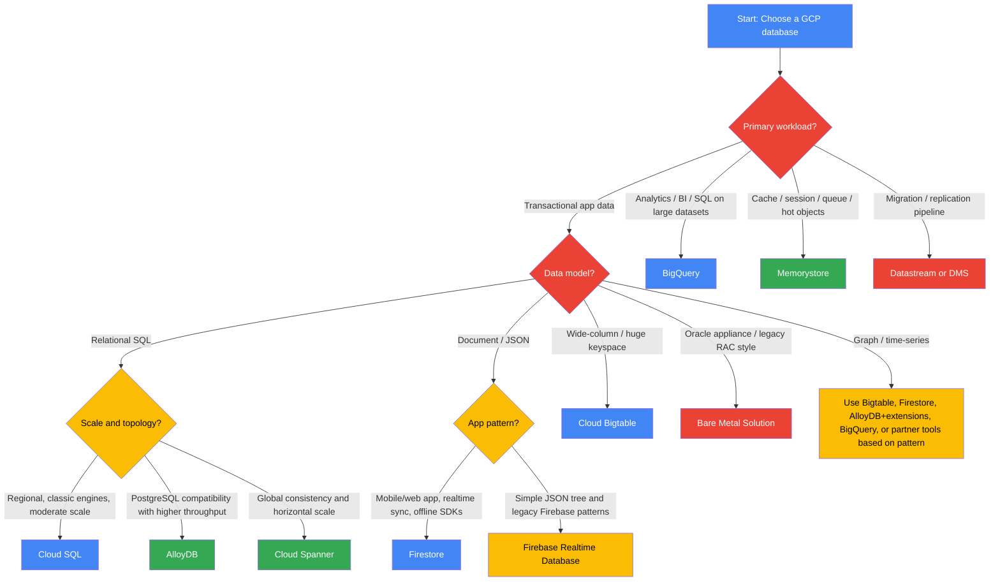

### Fast Selection Rules

- Pick **Cloud SQL** when you want managed MySQL, PostgreSQL, or SQL Server and your workload fits a regional relational database pattern.
- Pick **AlloyDB** when you want PostgreSQL compatibility but need better throughput, read pools, columnar acceleration, or AI-centric integrations.
- Pick **Cloud Spanner** when you need global availability, horizontal write scale, and strongly consistent distributed SQL.
- Pick **Firestore** when you need schemaless document data, mobile/web SDKs, real-time listeners, or offline sync.
- Pick **Cloud Bigtable** when you need massive throughput on key-based reads/writes, time-series, IoT, or large sparse datasets.
- Pick **Memorystore** when the main goal is sub-millisecond caching, session storage, queues, or ephemeral state.
- Pick **BigQuery** when you need analytics, dashboards, ELT, federated analysis, or ML over large datasets.
- Pick **Firebase Realtime Database** only when you need the JSON-tree Firebase model or already have an RTDB-based app.
- Pick **Bare Metal Solution** for Oracle when licensing, platform dependency, or near-zero app change matters more than modernization.
- Use **DMS** for managed one-time or continuous migration cutovers into Cloud SQL / AlloyDB / supported targets.
- Use **Datastream** for CDC-style replication into BigQuery or Cloud Storage, or as a low-latency feed into downstream data pipelines.

### Decision Matrix

| Requirement | Best-fit service | Why |
|---|---|---|
| MySQL/PostgreSQL/SQL Server, easy admin | Cloud SQL | Managed relational service with familiar engines and backups. |
| PostgreSQL-compatible + higher performance | AlloyDB | Distributed storage, read pools, columnar acceleration. |
| Global transactional system of record | Cloud Spanner | Horizontal scale with strong consistency and SQL. |
| Mobile app document sync | Firestore | Realtime listeners, offline SDKs, serverless scale. |
| Massive time-series / telemetry | Cloud Bigtable | Wide-column storage with very high throughput. |
| Low-latency cache | Memorystore for Redis | Managed Redis with HA and replication. |
| Simple cache without persistence | Memorystore for Memcached | Stateless distributed cache. |
| Warehouse / ELT / BI | BigQuery | Serverless analytics engine with SQL and storage/compute separation. |
| Legacy Firebase JSON apps | Firebase Realtime Database | Tree-based realtime sync model. |
| Oracle requiring dedicated hardware | Bare Metal Solution | Dedicated bare metal in GCP-connected locations. |
| Migration into managed DB | Database Migration Service | Managed migration orchestration and continuous sync. |
| CDC into analytics / lakes | Datastream | Log-based replication to BigQuery / GCS. |

## Cloud SQL

Deep dive: [CloudSQL/](../CloudSQL/).

### Mermaid Diagram

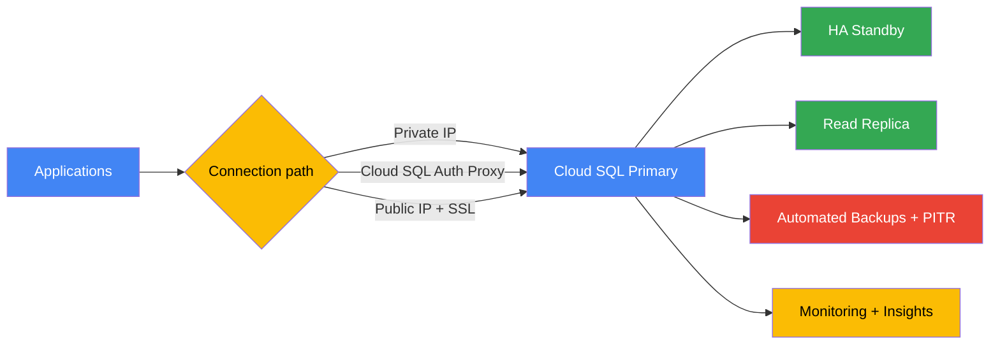

### Brief Explanation

Cloud SQL is Google Cloud's managed relational database service for **MySQL, PostgreSQL, and SQL Server**. It is usually the default choice for regional OLTP systems that do not need global-scale writes.

### Typical Use Cases

- Web applications that already run on MySQL or PostgreSQL.
- ERP, CMS, line-of-business apps, and internal tools.
- Lift-and-shift of traditional relational workloads with minimal application changes.
- Read-heavy workloads using replicas for reporting or regional reads.
- Apps on GCE, GKE, Cloud Run, or App Engine needing a managed SQL backend.

### Key Commands

```bash
gcloud services enable sqladmin.googleapis.com
gcloud sql instances create app-pg --database-version=POSTGRES_15 --region=us-central1 --tier=db-custom-2-7680 --availability-type=REGIONAL
gcloud sql databases create appdb --instance=app-pg
gcloud sql users create appuser --instance=app-pg --password=CHANGE_ME
gcloud sql instances patch app-pg --backup-start-time=03:00 --enable-bin-log
gcloud sql instances create app-pg-replica --master-instance-name=app-pg --region=us-east1
gcloud sql connect app-pg --user=postgres
```

### When to Use

- You want standard relational engines and mature ecosystem tooling.
- Your writes scale vertically or within replica-friendly patterns.
- You need managed backups, HA, maintenance windows, and familiar SQL.
- Your team already understands PostgreSQL, MySQL, or SQL Server operations.

### When NOT to Use

- You need global active-active writes or near-unlimited horizontal scale.
- You expect huge write throughput beyond classic instance scaling limits.
- You want serverless document sync for mobile clients.
- You need warehouse-scale analytics directly on the primary OLTP store.

### Pricing Model Summary

- Charged mainly for **instance vCPU and memory**, **storage**, **backups**, and **network egress**.
- HA/regional deployment costs more because of standby resources.
- Read replicas add compute and storage cost per replica.
- Enterprise Plus features and SQL Server licensing can materially change price.

### Design Notes

- Prefer **private IP** and the **Cloud SQL Auth Proxy / connectors** for secure connectivity.
- Use connection pooling because each instance has finite connection limits.
- Enable **PITR**, automated backups, and deletion protection for production.
- Use replicas for read scaling, not for horizontal write scaling.
- Use Query Insights and Cloud Monitoring for slow query diagnostics.

### Common Pitfalls

- Too many short-lived connections from serverless workloads can exhaust limits.
- Large analytical queries on the primary can hurt OLTP latency.
- Public IP exposure without strict auth/network controls increases risk.
- Replica lag can break read-after-write expectations.

### Quick Service Positioning

- Simplest managed relational path on GCP.
- Best for classic OLTP with familiar engines.
- Usually the first stop before AlloyDB or Spanner.

---

## AlloyDB

Related context: PostgreSQL-compatible advanced relational option on GCP.

### Mermaid Diagram

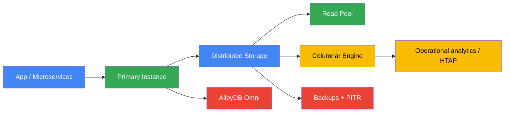

### Brief Explanation

AlloyDB is a **PostgreSQL-compatible** managed database built by Google for high performance and high availability. It combines PostgreSQL compatibility with decoupled storage, fast failover, read pools, and a **columnar engine** for accelerated analytics on operational data.

### Typical Use Cases

- PostgreSQL modernization where higher throughput or lower latency is needed.
- Mixed operational + analytical workloads where the columnar engine helps.
- SaaS backends that need PostgreSQL semantics with better read scaling.
- AI-enabled apps using vector-like patterns, embeddings, or integrated ML workflows.
- Hybrid scenarios using **AlloyDB Omni** outside Google Cloud.

### Key Commands

```bash
gcloud services enable alloydb.googleapis.com
gcloud alloydb clusters create orders-cluster --region=us-central1 --network=default --password=CHANGE_ME
gcloud alloydb instances create orders-primary --cluster=orders-cluster --instance-type=PRIMARY --cpu-count=4 --region=us-central1
gcloud alloydb instances create orders-readpool --cluster=orders-cluster --instance-type=READ_POOL --cpu-count=8 --read-pool-node-count=2 --region=us-central1
gcloud alloydb backups create nightly-001 --cluster=orders-cluster --region=us-central1
gcloud alloydb instances describe orders-primary --cluster=orders-cluster --region=us-central1
```

### When to Use

- You want PostgreSQL compatibility but Cloud SQL is no longer enough for performance or availability expectations.
- You want a managed PostgreSQL service with read pools and storage/compute separation.
- You need operational analytics on the same engine using the columnar accelerator.
- You want a path to hybrid or multicloud via AlloyDB Omni.

### When NOT to Use

- You require MySQL or SQL Server compatibility.
- You need globally distributed strong consistency like Spanner.
- You only need a small low-cost dev database where Cloud SQL is simpler and cheaper.
- You need a schemaless mobile-first document store.

### Pricing Model Summary

- Charged for **compute instance capacity**, **storage**, **backups**, and **network egress**.
- Read pools scale independently and have separate cost.
- Columnar acceleration improves efficiency but does not eliminate storage/compute planning.
- Omni pricing differs because it runs outside managed GCP infrastructure.

### Design Notes

- Use read pools for high-concurrency read traffic.
- Benchmark with your actual PostgreSQL schema and connection profile before migration.
- Plan for private service access and least-privilege IAM.
- Review extension compatibility when moving from self-managed PostgreSQL.
- Use machine learning and AI features where they reduce data movement.

### Common Pitfalls

- Assuming every PostgreSQL extension behaves exactly the same.
- Under-sizing read pools for bursty analytic traffic.
- Treating AlloyDB like a drop-in global database; it is high performance, but not Spanner.
- Ignoring query tuning because the platform is fast.

### Quick Service Positioning

- Performance-oriented PostgreSQL path.
- Often chosen when Cloud SQL PostgreSQL becomes constraining.
- Strong middle ground between classic PostgreSQL and Spanner.

---

## Cloud Spanner

Deep dive: [cloud_spanner.md](../cloud_spanner.md).

### Mermaid Diagram

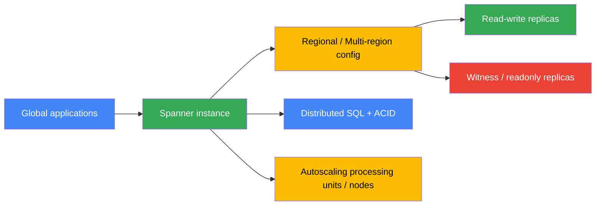

### Brief Explanation

Cloud Spanner is a **globally distributed relational database** with horizontal scale, SQL semantics, and **strong consistency**. It is designed for mission-critical systems that cannot sacrifice consistency while growing beyond classic single-region relational limits.

### Typical Use Cases

- Global account, payments, inventory, or booking systems.
- Systems of record requiring multi-region availability and external consistency.
- Large SaaS control planes with tenant isolation and large throughput.
- Applications needing relational modeling but at NoSQL-like scale.
- Multi-region applications where failover must be built into the database layer.

### Key Commands

```bash
gcloud services enable spanner.googleapis.com
gcloud spanner instances create global-orders --config=nam-eur-asia1 --processing-units=1000 --description="Global orders"
gcloud spanner databases create ordersdb --instance=global-orders
gcloud spanner databases ddl update ordersdb --instance=global-orders --ddl="CREATE TABLE Orders (OrderId STRING(36) NOT NULL, CustomerId STRING(36), CreatedAt TIMESTAMP) PRIMARY KEY (OrderId)"
gcloud spanner instances update global-orders --processing-units=2000
gcloud spanner databases describe ordersdb --instance=global-orders
```

### When to Use

- You need strong consistency across regions.
- You need horizontal scaling for both data size and transactional throughput.
- You need 99.999% availability targets with multi-region architecture.
- You can design schema and access patterns with Spanner best practices in mind.

### When NOT to Use

- A regional PostgreSQL or MySQL database is sufficient.
- You need full compatibility with a specific PostgreSQL/MySQL feature set.
- Your workload is mostly cache access, document sync, or analytics warehousing.
- You want the cheapest option for small or low-traffic systems.

### Pricing Model Summary

- Charged for **compute capacity** (nodes or processing units), **storage**, **backups**, and **network egress**.
- Multi-region configs cost more than regional because of replica topology.
- Autoscaling can improve efficiency but requires workload-aware limits.
- Price is often justified by eliminating complex sharding and HA operations.

### Design Notes

- Choose row keys carefully to avoid hotspots; avoid monotonically increasing primary keys in high write paths.
- Use interleaving and locality-aware schema only when it clearly matches access patterns.
- Model for transaction scope and commit latency across regions.
- Use leader-aware reads and read-only transactions appropriately.
- Benchmark with real contention and multi-region latency assumptions.

### Common Pitfalls

- Lifting an existing PostgreSQL schema without redesigning key distribution.
- Using sequences or hot keys that create concentrated write load.
- Running long transactions that inflate lock times and aborts.
- Assuming analytics workloads belong on the transactional cluster instead of BigQuery.

### Quick Service Positioning

- Premium distributed SQL system of record.
- Use when global scale and consistency are non-negotiable.
- Avoid for small/simple systems where cost and complexity are unnecessary.

---

## Firestore

Choose Native mode for new app development unless you explicitly need Datastore mode compatibility.

### Mermaid Diagram

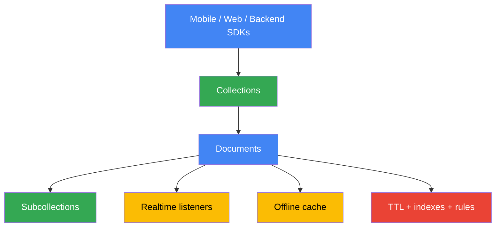

### Brief Explanation

Firestore is Google's managed **document database** for serverless apps. It stores data as documents inside collections, supports real-time listeners, rich mobile/web SDKs, and offline sync. It comes in **Native mode** and **Datastore mode**.

### Typical Use Cases

- Web and mobile apps with user-centric document data.
- Realtime collaboration, chat, notifications, and profile data.
- Serverless architectures using Cloud Functions, Cloud Run, or Firebase.
- Apps that benefit from offline-first sync and local persistence.
- Event-driven apps where TTL-based cleanup is useful.

### Key Commands

```bash
gcloud services enable firestore.googleapis.com
gcloud firestore databases create --location=nam5 --type=firestore-native
gcloud firestore databases create --location=us-central --type=datastore-mode
gcloud firestore indexes composite create --collection-group=orders --field-config=field-path=status,order=ascending --field-config=field-path=createdAt,order=descending
gcloud firestore fields ttls update expiresAt --collection-group=sessions --enable-ttl
gcloud firestore export gs://YOUR_BUCKET/firestore-backup
```

### When to Use

- You want a serverless document model with mobile/web SDK support.
- You need realtime listeners and offline sync.
- Your access pattern is document-based, not join-heavy relational querying.
- You can model around collection/document design and indexed queries.

### When NOT to Use

- You need complex multi-table joins and relational integrity.
- You need huge wide-row scans better suited to Bigtable.
- You need sub-millisecond cache semantics.
- You need petabyte-scale analytics directly on the primary store.

### Pricing Model Summary

- Charged for **document reads**, **writes**, **deletes**, **stored data**, and **network egress**.
- Index-heavy designs can increase storage and write cost.
- Realtime listeners can increase read volume if not scoped efficiently.
- TTL deletion and exports can add operational cost.

### Design Notes

- Use **Native mode** for new applications unless Datastore compatibility is required.
- Keep documents small and denormalize intentionally for read patterns.
- Create only necessary composite indexes; every extra index affects cost and write latency.
- Apply security rules carefully and test them with real access flows.
- Use TTL for ephemeral objects such as sessions, tokens, or old events.

### Common Pitfalls

- Overusing deep nested structures when subcollections are more appropriate.
- Modeling it like a relational database and then fighting query limitations.
- Ignoring index planning and creating accidental cost explosions.
- Using unbounded listeners in high-churn collections.

### Quick Service Positioning

- Developer-friendly document DB for serverless apps.
- Excellent for client SDK-driven products.
- Not a relational replacement.

---

## Cloud Bigtable

Best for huge key-based workloads, sparse datasets, and time-series patterns.

### Mermaid Diagram

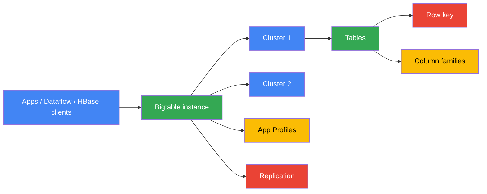

### Brief Explanation

Cloud Bigtable is a managed **wide-column NoSQL** database built for very large keyspaces, high throughput, and low-latency lookups or scans by row key. It is a common fit for **time-series, IoT, ad-tech, recommendation, fraud, and observability** data.

### Typical Use Cases

- Telemetry, metrics, clickstreams, and event timelines.
- IoT sensor ingestion and retrieval by device/time key.
- User profile feature stores and recommendation serving.
- Large sparse datasets with predictable key-based access.
- HBase-compatible application modernization.

### Key Commands

```bash
gcloud services enable bigtableadmin.googleapis.com
gcloud bigtable instances create telemetry-bt --display-name="Telemetry" --cluster=telemetry-bt-c1 --cluster-zone=us-central1-b --cluster-num-nodes=3 --cluster-storage-type=ssd
gcloud bigtable app-profiles create analytics --instance=telemetry-bt --route-any --description="Analytics profile"
gcloud bigtable instances update telemetry-bt --cluster=telemetry-bt-c1 --cluster-num-nodes=6
gcloud bigtable instances describe telemetry-bt
gcloud bigtable instances delete telemetry-bt
```

### When to Use

- You need very high throughput on key-oriented reads and writes.
- You can design a strong row-key strategy around access patterns.
- Your schema is sparse, large, and not join-centric.
- You need regional or multi-cluster replication with app-profile routing.

### When NOT to Use

- You need SQL joins and relational constraints.
- You need ad hoc analytics and BI as the primary workload.
- Your dataset is small and a simpler service would do.
- Your access pattern is poorly understood, making row-key design risky.

### Pricing Model Summary

- Charged for **node count or compute capacity**, **storage**, **backups**, and **network egress**.
- Replication and more clusters increase cost.
- SSD vs HDD changes performance and price.
- Overprovisioning nodes for latency can be necessary but should be measured.

### Design Notes

- Design row keys to balance distribution and query efficiency.
- Use app profiles to steer traffic for latency or isolation purposes.
- Store related data in column families with clear retention policies.
- Use Dataflow or BigQuery for downstream analytics rather than forcing complex scans into the serving tier.
- Benchmark hotspot risk with real key distribution.

### Common Pitfalls

- Using timestamps at the left side of row keys, which creates write hotspots.
- Expecting SQL-like secondary indexing and joins.
- Storing giant cells or unbounded versions without lifecycle control.
- Confusing Bigtable with a warehouse or object store.

### Quick Service Positioning

- Massive key-value / wide-column engine.
- Great for time-series and sparse data.
- Requires disciplined row-key design.

---

## Memorystore

Deep dive: [MemoryStore/](../MemoryStore/).

### Mermaid Diagram

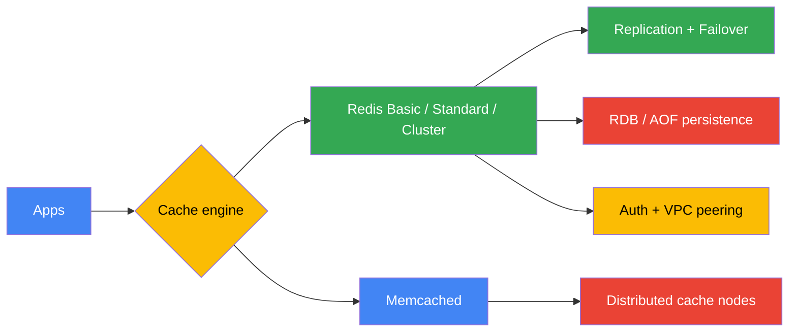

### Brief Explanation

Memorystore provides managed **Redis** and **Memcached** on GCP. Use it to reduce latency, offload databases, store transient state, manage rate limits, and implement queues or pub/sub style patterns where applicable.

### Typical Use Cases

- Session caches and token lookups.
- Application result caching and hot-key acceleration.
- Leaderboards, counters, locks, and rate-limiting.
- Background job queues using Redis data structures.
- Memcached-style stateless distributed object cache.

### Key Commands

```bash
gcloud services enable redis.googleapis.com memcache.googleapis.com
gcloud redis instances create app-redis --region=us-central1 --size=5 --redis-version=redis_7_0 --tier=standard
gcloud redis instances describe app-redis --region=us-central1
gcloud redis instances update app-redis --region=us-central1 --size=10
gcloud memcache instances create app-memcache --region=us-central1 --node-count=3 --node-cpu=2 --node-memory=4GB
gcloud memcache instances describe app-memcache --region=us-central1
```

### When to Use

- You need very low latency for repeated reads or transient state.
- You want to protect Cloud SQL, AlloyDB, or Spanner from bursty read traffic.
- You need Redis features like sorted sets, TTLs, streams, or pub/sub.
- You need Memcached for simple horizontal cache semantics without persistence.

### When NOT to Use

- The cache is becoming your only source of truth.
- You need durable relational or document transactions as the primary store.
- You need warehouse-style SQL analytics.
- You require public internet exposure; Memorystore is generally private-network oriented.

### Pricing Model Summary

- Redis pricing is based mainly on **provisioned memory capacity**, tier, and network egress.
- HA/standard tiers cost more than basic single-node setups.
- Persistence, cluster size, and regional topology can affect overall spend.
- Memcached pricing is driven by node count and node shape.

### Design Notes

- Define clear cache invalidation and TTL strategy.
- Treat the database as the system of record unless the pattern is intentionally ephemeral.
- Use Redis HA for production when cache availability matters.
- Place clients in the same region/VPC to minimize latency.
- Monitor hit ratio, memory fragmentation, evictions, and failover events.

### Common Pitfalls

- Storing permanent business data only in cache.
- Ignoring memory fragmentation and eviction behavior.
- Running without auth/network isolation for sensitive cached objects.
- Assuming Memcached provides durable or replicated data.

### Quick Service Positioning

- Acceleration layer, not usually the source of truth.
- Pair with another durable database.
- Excellent for latency reduction and burst absorption.

---

## BigQuery

Analytics deep dive: [DataPipeline/](../DataPipeline/).

### Mermaid Diagram

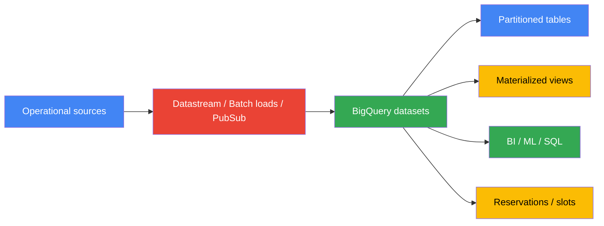

### Brief Explanation

BigQuery is GCP's **serverless analytics warehouse**. It is not the primary OLTP database for applications, but it is a critical part of the database landscape because almost every serious transactional system eventually feeds analytics, ELT, or ML workloads into BigQuery.

### Typical Use Cases

- Enterprise reporting, dashboards, and BI.
- ELT/ETL target for operational databases and event streams.
- Data science, feature engineering, and ML model training.
- Audit analysis, security analytics, and large historical datasets.
- Near-real-time analytics fed by Datastream, Pub/Sub, or Dataflow.

### Key Commands

```bash
gcloud services enable bigquery.googleapis.com bigquerystorage.googleapis.com
bq mk --dataset --location=US analytics:orders_dw
bq mk --table analytics:orders_dw.orders order_id:STRING,customer_id:STRING,created_at:TIMESTAMP,total:NUMERIC
bq query --use_legacy_sql=false "SELECT COUNT(*) FROM `analytics.orders_dw.orders`"
bq update --time_partitioning_field=created_at analytics:orders_dw.orders
gcloud beta bigquery reservations create bi-team --location=US --slots=500
```

### When to Use

- You need SQL analytics over large datasets.
- You want storage/compute separation and serverless scaling.
- You need integration with Looker, Dataflow, Dataproc, and ML tooling.
- You want to avoid running analytical queries on OLTP databases.

### When NOT to Use

- You need per-request transactional updates for an application backend.
- You need Redis-like microsecond cache response times.
- You need mobile offline document sync.
- You need a primary operational database with row-level OLTP patterns.

### Pricing Model Summary

- Charged for **storage**, **query processing** (on-demand bytes scanned) or **slot reservations**, plus streaming and egress considerations.
- Partitioning and clustering reduce query cost by limiting scanned data.
- Long-term storage pricing rewards colder historical data.
- Materialized views and BI Engine can improve performance but should be cost-governed.

### Design Notes

- Partition on date/time and cluster on common filter columns.
- Separate raw, curated, and serving datasets.
- Use Datastream/Dataflow for near-real-time ingestion from operational stores.
- Use authorized views, column-level security, and row access policies where needed.
- Push analytical reporting away from Cloud SQL or AlloyDB into BigQuery.

### Common Pitfalls

- Using SELECT * on very large tables in dashboards.
- Failing to partition or cluster large fact tables.
- Treating BigQuery like an OLTP row store.
- Ignoring cost controls for ad hoc analyst queries.

### Quick Service Positioning

- Analytical endpoint for almost every serious data platform.
- Use to protect OLTP stores from reporting workloads.
- Not an OLTP app database.

---

## Firebase Realtime Database

Use only when its JSON-tree model and Firebase client behavior are a deliberate fit; otherwise prefer Firestore for new work.

### Mermaid Diagram

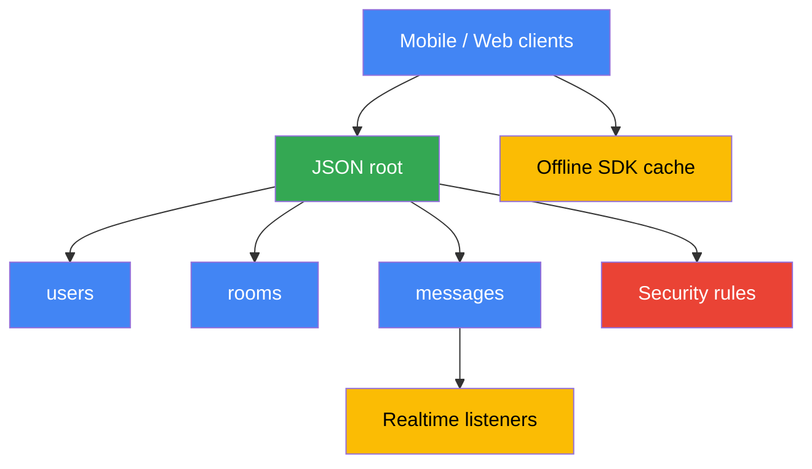

### Brief Explanation

Firebase Realtime Database stores data as a synchronized **JSON tree**. It excels at simple realtime fan-out and older Firebase application patterns, but for most new designs **Firestore** is more flexible and scalable.

### Typical Use Cases

- Legacy Firebase apps already built around a JSON tree.
- Simple realtime collaboration or presence tracking.
- Small-to-medium scale apps that benefit from straightforward client synchronization.
- Rapid prototypes where the tree model is acceptable.

### Key Commands

```bash
gcloud services enable firebasedatabase.googleapis.com firebase.googleapis.com
gcloud firebase projects list
gcloud services list --enabled | grep firebase
gcloud app describe
gcloud projects add-iam-policy-binding YOUR_PROJECT_ID --member=serviceAccount:YOUR_SA --role=roles/firebasedatabase.admin
gcloud logging read "resource.type=audited_resource AND protoPayload.serviceName:firebase" --limit=20
```

### When to Use

- You already run a Firebase RTDB application and the model works.
- You need simple JSON synchronization and presence patterns.
- You want deep client integration and can control tree fan-out carefully.

### When NOT to Use

- You are starting a new app and Firestore would meet the need better.
- You need rich indexing and document-oriented organization.
- You need relational transactions or warehouse analytics.
- You need very large-scale key-range throughput better suited to Bigtable.

### Pricing Model Summary

- Typically driven by **stored data**, **downloaded data**, **simultaneous connections**, and operations depending on edition and usage pattern.
- Bandwidth-heavy fan-out can become expensive.
- Inefficient tree structure amplifies download costs.

### Design Notes

- Denormalize intentionally because the JSON tree is not relational.
- Keep tree depth manageable and avoid extremely large fan-out nodes.
- Use security rules as a first-class design artifact.
- Plan migration to Firestore if indexing, scalability, or developer ergonomics become limiting.

### Common Pitfalls

- Single giant tree branches that force clients to download too much data.
- Weak or overly broad security rules.
- Choosing RTDB for new greenfield apps without evaluating Firestore.
- Assuming query flexibility comparable to Firestore or SQL stores.

### Quick Service Positioning

- Legacy/simple realtime JSON service.
- Good only when its model is intentionally desired.
- Usually superseded by Firestore for new builds.

---

## Bare Metal Solution for Oracle

Use for Oracle workloads requiring dedicated hardware, low-latency interconnect to GCP, or strict licensing / platform constraints.

### Mermaid Diagram

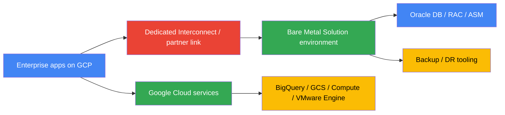

### Brief Explanation

Bare Metal Solution (BMS) provides **dedicated bare metal servers** connected to Google Cloud. It is commonly used for Oracle databases that cannot yet move to Cloud SQL, AlloyDB, or Spanner due to licensing, performance, feature, or migration-risk constraints.

### Typical Use Cases

- Oracle Database and Oracle RAC lift-and-shift with minimal application change.
- Low-latency integration between Oracle data and GCP analytics/services.
- Regulated or specialized workloads requiring dedicated hardware control.
- Phased modernization where apps move first, database later.

### Key Commands

```bash
gcloud services enable baremetalsolution.googleapis.com
gcloud services list --enabled | grep baremetalsolution
gcloud compute interconnects list
gcloud compute networks peerings list
gcloud logging read "resource.type=audited_resource AND protoPayload.serviceName=baremetalsolution.googleapis.com" --limit=20
gcloud monitoring metrics list --filter="metric.type : baremetalsolution"
```

### When to Use

- You must run Oracle on dedicated hardware.
- You need a low-risk migration path with near-zero application change.
- You require Oracle-specific features not available in managed alternatives.
- You want to colocate Oracle with GCP-based app and analytics tiers.

### When NOT to Use

- You are free to modernize onto PostgreSQL, MySQL, AlloyDB, or Spanner.
- You want a simple managed service with minimal infra responsibility.
- Your workload fits Cloud SQL or AlloyDB and licensing simplicity matters.
- You are building a new cloud-native application from scratch.

### Pricing Model Summary

- Pricing is driven by **dedicated hardware configuration**, storage, network connectivity, support model, and Oracle licensing.
- This is typically more expensive than managed cloud-native databases but can reduce migration risk or preserve licensing strategy.
- TCO analysis must include ops, DR, backup tooling, and Oracle license terms.

### Design Notes

- Treat BMS as a strategic bridge, not always the destination state.
- Plan low-latency integration to GCP apps and analytics outputs.
- Define DR architecture across BMS and native GCP services where appropriate.
- Use migration waves so Oracle dependencies are progressively reduced.

### Common Pitfalls

- Assuming BMS automatically removes Oracle operational complexity.
- Skipping license and support review.
- Modernizing the app tier but leaving data integration as an afterthought.
- Underestimating backup, patching, and HA responsibilities.

### Quick Service Positioning

- Bridge for Oracle-heavy estates.
- Useful for phased modernization and licensing alignment.
- Not the default choice for cloud-native design.

---

## Database Migration Service (DMS)

Deep dive: [database_migration.md](../database_migration.md).

### Mermaid Diagram

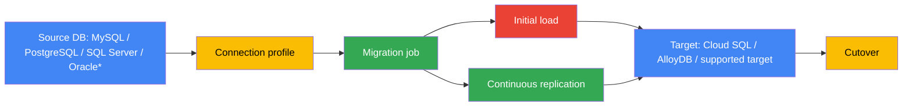

### Brief Explanation

Database Migration Service is GCP's managed service for **migrating databases** with minimal downtime. It orchestrates source connectivity, initial load, continuous replication, validation stages, and cutover for supported source/target combinations.

### Typical Use Cases

- MySQL to Cloud SQL with continuous replication before cutover.
- PostgreSQL modernization into AlloyDB or Cloud SQL.
- Homogeneous and selected heterogeneous migrations depending on support matrix.
- Migration programs where centralized job status and managed orchestration matter.

### Key Commands

```bash
gcloud services enable datamigration.googleapis.com
gcloud database-migration connection-profiles create mysql src-mysql --region=us-central1 --display-name="Source MySQL" --host=SOURCE_IP --port=3306 --username=migrator --password=CHANGE_ME
gcloud database-migration connection-profiles create cloudsql tgt-sql --region=us-central1 --display-name="Target Cloud SQL" --cloudsql-instance=PROJECT:us-central1:target-sql
gcloud database-migration migration-jobs create job-mysql-to-sql --region=us-central1 --type=CONTINUOUS --source=src-mysql --destination=tgt-sql
gcloud database-migration migration-jobs start job-mysql-to-sql --region=us-central1
gcloud database-migration migration-jobs describe job-mysql-to-sql --region=us-central1
```

### When to Use

- You want managed migration orchestration with continuous sync and cutover support.
- Your source/target pair is supported by DMS.
- You want to minimize downtime during migration.
- You want built-in job state, validation flow, and operational visibility.

### When NOT to Use

- The migration path is unsupported or needs deep custom transformation logic.
- You primarily need CDC into analytics rather than DB cutover.
- You need broad ETL-style schema transformation across many systems; use Datastream + Dataflow/dbt/etc. instead.
- A dump/restore migration is simpler and acceptable for downtime.

### Pricing Model Summary

- Pricing depends on migration service usage, replication behavior, target resource cost, and network egress from the source environment.
- The target database cost often dominates total spend during overlap windows.
- Continuous migration periods extend overlap cost but reduce cutover risk.

### Design Notes

- Validate source prerequisites like binlogs, WAL, privileges, and network reachability.
- Run a dress rehearsal with realistic write traffic.
- Measure lag, schema drift, and unsupported object handling early.
- Plan rollback criteria and cutover freeze windows.

### Common Pitfalls

- Ignoring source configuration requirements until late in the project.
- Underestimating data validation and application compatibility testing.
- Treating continuous replication as a substitute for a cutover plan.
- Forgetting to cost the dual-run period.

### Quick Service Positioning

- Migration orchestrator, not a serving database.
- Use for cutover programs into managed targets.
- Pair with rehearsals and validation.

---

## Datastream

Use for CDC from databases into analytical or storage targets with low operational overhead.

### Mermaid Diagram

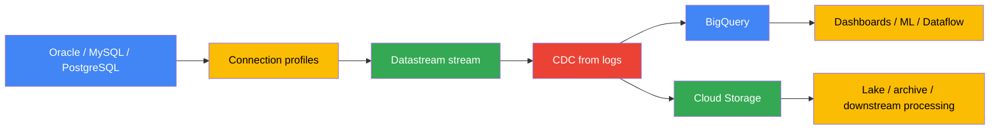

### Brief Explanation

Datastream is a **serverless change data capture** service. It reads database change logs and streams changes into targets such as **BigQuery** or **Cloud Storage**, making it a foundational service for near-real-time analytics and data lake ingestion.

### Typical Use Cases

- Oracle, MySQL, or PostgreSQL CDC into BigQuery.
- Near-real-time replication from operational DBs into a data lake.
- Event-driven downstream processing via Cloud Storage landing zones.
- Analytics offloading from transactional systems.

### Key Commands

```bash
gcloud services enable datastream.googleapis.com
gcloud datastream connection-profiles create oracle src-oracle --location=us-central1 --display-name="Source Oracle" --oracle-hostname=SOURCE_IP --oracle-port=1521 --oracle-username=stream_user --oracle-password=CHANGE_ME --oracle-database-service=ORCL
gcloud datastream connection-profiles create bigquery tgt-bq --location=us-central1 --display-name="Target BQ" --bigquery-root-path=raw_cdc
gcloud datastream streams create oracle-to-bq --location=us-central1 --source=src-oracle --destination=tgt-bq --display-name="Oracle to BigQuery"
gcloud datastream streams update oracle-to-bq --location=us-central1 --backfill-all
gcloud datastream streams describe oracle-to-bq --location=us-central1
```

### When to Use

- You need low-latency CDC into analytics or storage targets.
- You want a managed service rather than operating Debezium or custom CDC pipelines.
- You want to build ELT patterns without heavy source impact.
- You need streaming replication from Oracle/MySQL/PostgreSQL into BigQuery or Cloud Storage.

### When NOT to Use

- Your goal is one-time database cutover into Cloud SQL or AlloyDB; DMS may be better.
- You need heavy per-record transformation inline before landing.
- The source database or topology is unsupported.
- You need sub-millisecond serving access rather than analytics ingestion.

### Pricing Model Summary

- Pricing is typically based on **volume of data processed/streamed**, plus destination storage/compute and network egress.
- BigQuery or Cloud Storage target costs are separate.
- Long-running CDC is cost-effective when it replaces custom integration infrastructure.

### Design Notes

- Keep source logs sized and retained properly to avoid replication gaps.
- Land raw CDC into BigQuery or GCS, then transform downstream.
- Define schema evolution handling and late-arriving change strategy.
- Pair Datastream with Dataflow, BigQuery SQL, or dbt for curation.

### Common Pitfalls

- Ignoring source log retention, causing stream interruptions.
- Expecting complex transformation logic inside Datastream itself.
- Skipping data freshness SLAs for consumers.
- Treating CDC output as already modeled analytics data.

### Quick Service Positioning

- CDC engine for analytics and lake ingestion.
- Complements rather than replaces application databases.
- Key service for low-latency replication patterns.

---

## Cross-Service Comparison Table

The following table focuses on the most common selection set for application teams.

| Service | Model | Consistency | Scale profile | Typical latency | Best use cases | Pricing shape | Avoid when |
|---|---|---|---|---|---|---|---|
| Cloud SQL | Relational | Strong in-region | Vertical + replicas | Low ms | Traditional OLTP, packaged apps | Instance + storage | Need global horizontal writes |
| AlloyDB | Relational / PostgreSQL-compatible | Strong regional | Higher throughput + read pools | Low ms | High-performance PostgreSQL workloads | Compute + storage + backups | Need MySQL/SQL Server or global SQL scale |
| Cloud Spanner | Distributed relational | Global strong consistency | Horizontal data and transaction scale | Low to moderate ms | Global systems of record | Compute capacity + storage | Small/simple apps |
| Firestore | Document | Strong per document / transaction scope | Serverless document scale | Low ms | Mobile/web/serverless apps | Reads/writes/storage | Need joins and rich relational queries |
| Cloud Bigtable | Wide-column | Strong within row operations / design-oriented globally | Massive horizontal scale | Single-digit to low tens ms | Time-series, IoT, sparse datasets | Nodes/storage | Need SQL/joins |
| Memorystore Redis | In-memory key-value | Depends on cache/write pattern | Scale by memory/tier/cluster | Sub-ms to low ms | Cache, session, queue, rate limiting | Provisioned memory/tier | Need durable primary store |
| Memorystore Memcached | In-memory cache | Best-effort cache semantics | Horizontal cache nodes | Sub-ms | Simple distributed cache | Node count/shape | Need persistence or replication |
| BigQuery | Analytical columnar warehouse | Analytical consistency model | Massive serverless analytics | Seconds for large queries | BI, ELT, ML, reporting | Bytes scanned or slots + storage | Need OLTP serving |

### Cloud SQL vs AlloyDB vs Spanner

| Dimension | Cloud SQL | AlloyDB | Spanner |
|---|---|---|---|
| Engine compatibility | MySQL / PostgreSQL / SQL Server | PostgreSQL-compatible | GoogleSQL / PostgreSQL interface options depending on tooling |
| Primary design goal | Managed classic relational | High-performance PostgreSQL | Global distributed SQL |
| Scale model | Mostly vertical + replicas | Scale compute/storage with read pools | Horizontal scale across nodes/PUs |
| Global consistency | No | No | Yes |
| Best fit | Standard OLTP | Advanced PostgreSQL OLTP/HTAP | Mission-critical global OLTP |
| Migration effort | Lowest from existing engines | Moderate from PostgreSQL | Highest due to schema/access redesign |
| Cost profile | Lowest of the three in many small/medium cases | Mid to premium | Premium |

### Firestore vs Firebase Realtime Database

| Dimension | Firestore | Firebase Realtime Database |
|---|---|---|
| Data model | Documents and collections | Single JSON tree |
| Indexing | Rich automatic + composite indexes | More limited query/index model |
| Scalability | Better for most new app patterns | Good for simpler legacy realtime patterns |
| Offline support | Yes | Yes |
| Recommendation | Default for new Firebase/GCP document apps | Use mainly for existing RTDB-based apps or simple deliberate cases |

### Bigtable vs Firestore

| Dimension | Bigtable | Firestore |
|---|---|---|
| Core model | Wide-column key-value | Document |
| Best for | Huge throughput, time-series, sparse data | App-facing document sync and serverless apps |
| Query style | Row-key oriented | Document queries with indexes |
| Client ergonomics | Backend/data platform oriented | Mobile/web/serverless friendly |
| Operational mindset | Capacity and key design matter more | More serverless/developer-oriented |

## Reference Architectures and Decision Recipes

These patterns help teams combine services instead of choosing just one.

### Pattern 1: Regional OLTP + Cache + Analytics

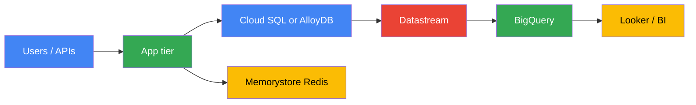

- Use this for mainstream business apps.
- Memorystore reduces pressure on the primary database.
- Datastream feeds analytics without running heavy reports on OLTP.
- Cloud SQL fits simpler workloads; AlloyDB fits higher-performance PostgreSQL needs.

### Pattern 2: Global Transaction Platform

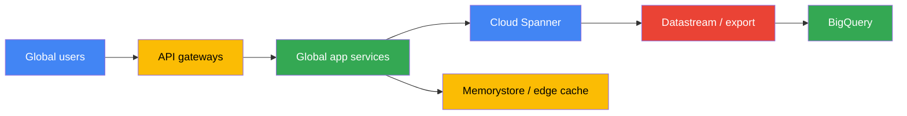

- Use Spanner as the system of record when global consistency matters.
- Use cache only for acceleration, not truth.
- Push analytics to BigQuery rather than overloading transactional nodes.

### Pattern 3: Mobile App Backend

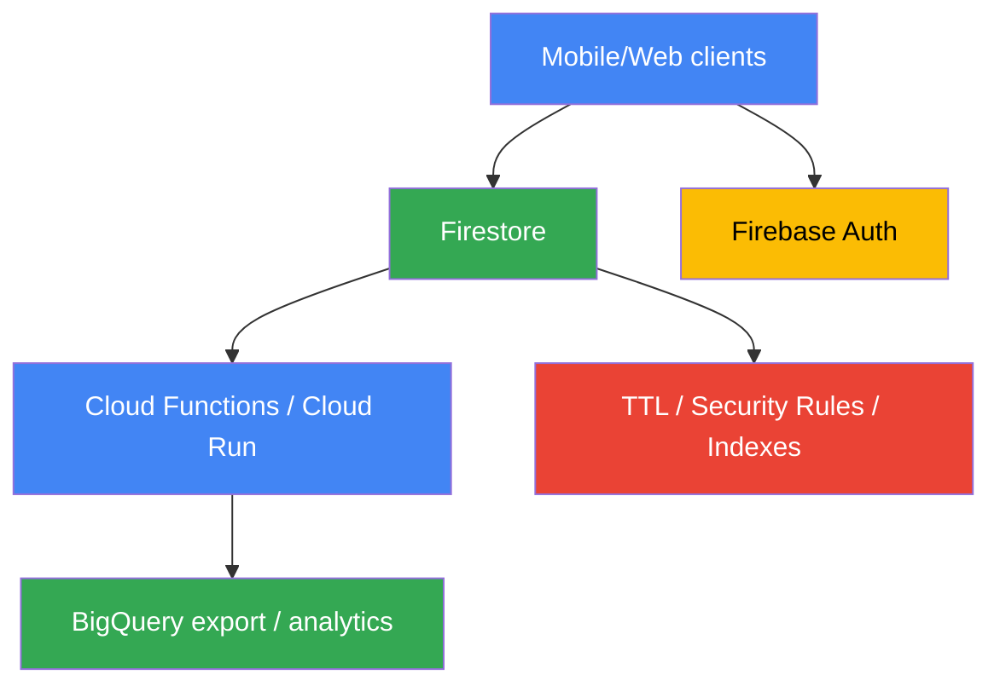

- Best for mobile/web apps with realtime sync needs.
- Use Firestore Native mode for new products.
- Analytics and BI should land in BigQuery.

### Pattern 4: Telemetry / IoT at Scale

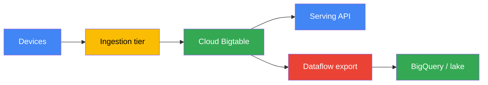

- Bigtable is the hot serving store for time-series lookups.
- BigQuery handles historical analysis and reporting.
- The row-key strategy is the core design decision.

### Pattern 5: Oracle Modernization Bridge

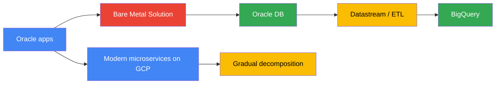

- Use BMS as a bridge when Oracle cannot move immediately.
- Start extracting reporting and adjacent services onto native GCP platforms.
- Create a multi-phase modernization roadmap rather than a permanent stall state.

## SQL Best Practices on GCP

This section applies primarily to Cloud SQL, AlloyDB, and Cloud Spanner, with adjustments per engine.

### Connection Management

- Use connection pooling (PgBouncer, language pools, JDBC pools) to avoid storms.
- For serverless clients, use connectors/proxies or controlled pool sizes.
- Keep idle connection lifetimes bounded.
- Load test connection behavior, not just query latency.
- Separate read-only and read-write pools when the architecture supports it.

### Query Optimization

- Create indexes based on actual filters, joins, and sort patterns.
- Use EXPLAIN / query plans regularly.
- Avoid N+1 query patterns in application code.
- Batch writes where appropriate.
- Move heavy reporting to BigQuery or replicas/read pools.

### Schema Design

- Design around access patterns, not only conceptual ER diagrams.
- Use appropriate data types to reduce storage and CPU cost.
- Archive cold data to cheaper analytical or object storage tiers when possible.
- Keep transaction scope narrow to reduce lock contention.
- Use partitioning/sharding only where the platform and workload truly require it.

### Monitoring

- Track CPU, memory, storage, replication lag, cache hit ratio, and connection count.
- Alert on saturation, error rates, failovers, and backup failures.
- Use slow query logs / Query Insights / query statistics.
- Correlate app latency with database metrics.
- Review top SQL and lock waits during every performance incident.

### Backup and Recovery

- Enable automated backups and point-in-time recovery where supported.
- Test restore procedures regularly.
- Define RPO and RTO explicitly per application.
- Use replicas or secondary regions as part of DR, not as a substitute for tested recovery.
- Protect backup retention from accidental deletion or misconfiguration.

### Security

- Prefer private connectivity.
- Use IAM, service accounts, and secret managers instead of embedded credentials.
- Encrypt in transit and at rest.
- Rotate credentials and certificates on schedule.
- Apply least privilege to users, applications, and operators.

### Mermaid Diagram

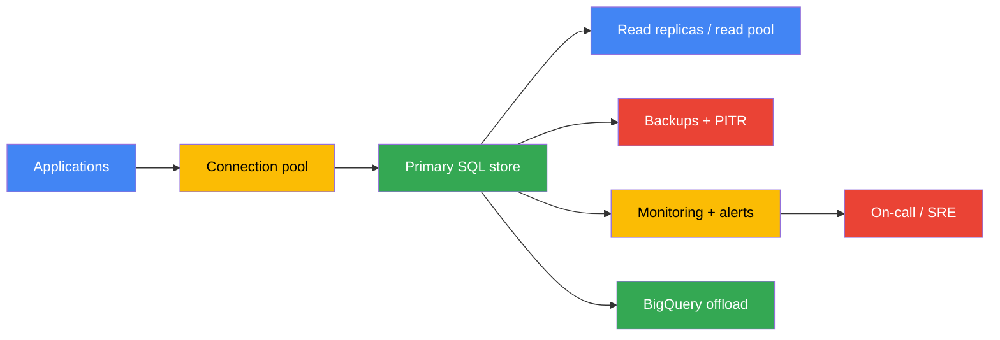

## Security, Resiliency, and Operations Checklist

### Network and Access

- Use private IP or private service access wherever possible.
- Avoid broad public ingress and 0.0.0.0/0 firewall rules for databases.
- Use VPC Service Controls or perimeter controls where appropriate.
- Log admin activity and review IAM bindings frequently.

### Reliability

- Select HA / regional / multi-region topology that matches business impact.
- Document failover behavior and test it.
- Decide which read paths can tolerate replica lag.
- Model maintenance window effects on application behavior.

### Change Management

- Use infrastructure as code when possible.
- Promote schema changes through dev, test, staging, and prod.
- Version migrations and rollback scripts.
- Audit changes to retention, deletion protection, and backup policies.

### Cost Governance

- Set budgets and alerts for production and non-production projects.
- Delete abandoned instances and backups.
- Right-size database tiers and node counts using observed metrics.
- Move analytics queries off primary databases to BigQuery.

## Command Cheat Sheet

| Goal | Service | Example command |
|---|---|---|
| Create PostgreSQL instance | Cloud SQL | `gcloud sql instances create app-pg --database-version=POSTGRES_15 --region=us-central1` |
| Create AlloyDB cluster | AlloyDB | `gcloud alloydb clusters create orders-cluster --region=us-central1 --network=default` |
| Create Spanner instance | Cloud Spanner | `gcloud spanner instances create global-orders --config=regional-us-central1 --processing-units=1000` |
| Create Firestore DB | Firestore | `gcloud firestore databases create --location=nam5 --type=firestore-native` |
| Create Bigtable instance | Bigtable | `gcloud bigtable instances create telemetry-bt ...` |
| Create Redis cache | Memorystore Redis | `gcloud redis instances create app-redis --region=us-central1 --size=5 --tier=standard` |
| Create Memcached cache | Memorystore Memcached | `gcloud memcache instances create app-memcache --region=us-central1 --node-count=3` |
| Create dataset | BigQuery | `bq mk --dataset analytics:orders_dw` |
| Create migration job | DMS | `gcloud database-migration migration-jobs create job-mysql-to-sql ...` |
| Create CDC stream | Datastream | `gcloud datastream streams create oracle-to-bq --location=us-central1 ...` |

## Service Selection Summary

- **Cloud SQL** = easiest managed relational service for classic workloads.
- **AlloyDB** = PostgreSQL-compatible upgrade path for performance and operational analytics.
- **Cloud Spanner** = distributed SQL for global, strongly consistent, mission-critical systems.
- **Firestore** = serverless document DB for mobile/web/backends with realtime sync.
- **Cloud Bigtable** = huge wide-column store for time-series, IoT, and large sparse datasets.
- **Memorystore** = in-memory acceleration layer for low-latency access and ephemeral state.
- **BigQuery** = analytics warehouse for BI, ELT, and ML over operational and event data.
- **Firebase Realtime Database** = simpler/legacy Firebase JSON-tree option.
- **Bare Metal Solution** = Oracle and specialized workloads on dedicated hardware adjacent to GCP.
- **DMS** = managed migration orchestrator.
- **Datastream** = CDC service for real-time replication into analytics and storage targets.

## Practical Recommendation Ladder

1. Start with the workload category: OLTP, document, wide-column, cache, analytics, or migration.
2. For relational workloads, decide whether the app is regional or truly global.
3. If regional, choose Cloud SQL first unless PostgreSQL performance or HTAP requirements push you to AlloyDB.
4. If global consistency and horizontal scale are mandatory, use Spanner.
5. If the app is mobile/web document-centric, choose Firestore for new builds.
6. If the workload is telemetry/time-series with massive scale, choose Bigtable.
7. Always pair serious operational data with an analytics destination such as BigQuery.
8. Use Memorystore to absorb bursts and reduce load, not to become the source of truth.
9. Use DMS for migration cutovers and Datastream for CDC into analytics/lakes.
10. Revisit cost, RPO/RTO, latency, and team skillset before finalizing the service.

## Appendix A — Service-by-Service Decision Prompts

### Cloud SQL prompts

- Do we need MySQL, PostgreSQL, or SQL Server specifically?
- Can the workload scale mostly vertically with read replicas?
- Will connection storms be a risk from serverless clients?
- How much downtime can maintenance/failover windows tolerate?
- Do we need private IP only?

### AlloyDB prompts

- Are we already on PostgreSQL and running into throughput or read scaling ceilings?
- Do we need the columnar engine for operational analytics?
- Do we plan to run a hybrid variant with AlloyDB Omni?
- What extensions or version-specific behaviors must be validated?

### Spanner prompts

- Is the application globally distributed with strict consistency requirements?
- Can we redesign keys and transactions for distributed SQL?
- Is the premium cost justified by HA, scale, and simplification gains?
- Do we really need multi-region writes, or would regional SQL + replicas suffice?

### Firestore prompts

- Are our queries document-centric and index-friendly?
- Do we need realtime listeners and offline client sync?
- Can we denormalize safely?
- Do security rules map cleanly to our data model?

### Bigtable prompts

- Can we define an excellent row-key strategy?
- Are access patterns primarily point lookups and range scans?
- Will throughput and scale justify capacity planning effort?
- Do we understand hotspot avoidance?

### Memorystore prompts

- What happens when the cache misses, evicts, or fails over?
- Which keys require TTLs?
- Are we caching query results, sessions, counters, or queues?
- Is persistence required or optional?

### BigQuery prompts

- What are the partition and clustering keys?
- Who are the query consumers and what are their SLAs?
- Will we use on-demand pricing or reservations?
- How will CDC or batch data arrive?

## Appendix B — Pricing Model Memory Aids

- Cloud SQL: pay for the instance shape you provision, storage you keep, backups you retain, and data you move.
- AlloyDB: pay for compute instances/read pools, storage, backups, and network usage.
- Spanner: pay for provisioned or autoscaled capacity units, storage, backups, and egress.
- Firestore: pay for document operations and stored data.
- Bigtable: pay for nodes/compute capacity and stored bytes.
- Memorystore: pay for reserved cache memory or nodes.
- BigQuery: pay for stored data and queries/slots.
- DMS/Datastream: pay for managed migration or processed stream volume plus destination cost.

## Appendix C — Anti-Patterns to Avoid

- Running dashboards directly on Cloud SQL primary during business hours.
- Using Firestore as if it were a normalized relational schema with many joins.
- Choosing Spanner because it sounds advanced when Cloud SQL is sufficient.
- Choosing Bigtable without a row-key strategy.
- Treating Redis as the only durable store for critical business records.
- Using BigQuery as a per-request application database.
- Leaving migration tooling enabled without closing out replication and overlap costs.
- Ignoring network topology and auth models until the last week before launch.

## Appendix D — Detailed Readiness Checklist

### Cloud SQL readiness checks

- Confirm Cloud SQL matches the workload access pattern and not just team familiarity.
- Document why Cloud SQL is preferred over at least two alternatives.
- Validate network, IAM, backup, monitoring, and cost controls for Cloud SQL.
- Run a proof of concept with realistic workload characteristics for Cloud SQL.
- Define production SLOs and incident response expectations for Cloud SQL.
- Capture migration or rollback strategy for Cloud SQL.
- Confirm observability dashboards and alerts exist for Cloud SQL.
- Confirm data retention and compliance requirements are supported by Cloud SQL.
- Confirm the team has operational runbooks for Cloud SQL.
- Confirm downstream analytics integration is defined for Cloud SQL where required.

### AlloyDB readiness checks

- Confirm AlloyDB matches the workload access pattern and not just team familiarity.
- Document why AlloyDB is preferred over at least two alternatives.
- Validate network, IAM, backup, monitoring, and cost controls for AlloyDB.
- Run a proof of concept with realistic workload characteristics for AlloyDB.
- Define production SLOs and incident response expectations for AlloyDB.
- Capture migration or rollback strategy for AlloyDB.
- Confirm observability dashboards and alerts exist for AlloyDB.
- Confirm data retention and compliance requirements are supported by AlloyDB.
- Confirm the team has operational runbooks for AlloyDB.
- Confirm downstream analytics integration is defined for AlloyDB where required.

### Cloud Spanner readiness checks

- Confirm Cloud Spanner matches the workload access pattern and not just team familiarity.
- Document why Cloud Spanner is preferred over at least two alternatives.
- Validate network, IAM, backup, monitoring, and cost controls for Cloud Spanner.
- Run a proof of concept with realistic workload characteristics for Cloud Spanner.
- Define production SLOs and incident response expectations for Cloud Spanner.
- Capture migration or rollback strategy for Cloud Spanner.
- Confirm observability dashboards and alerts exist for Cloud Spanner.
- Confirm data retention and compliance requirements are supported by Cloud Spanner.
- Confirm the team has operational runbooks for Cloud Spanner.
- Confirm downstream analytics integration is defined for Cloud Spanner where required.

### Firestore readiness checks

- Confirm Firestore matches the workload access pattern and not just team familiarity.
- Document why Firestore is preferred over at least two alternatives.
- Validate network, IAM, backup, monitoring, and cost controls for Firestore.
- Run a proof of concept with realistic workload characteristics for Firestore.
- Define production SLOs and incident response expectations for Firestore.
- Capture migration or rollback strategy for Firestore.
- Confirm observability dashboards and alerts exist for Firestore.
- Confirm data retention and compliance requirements are supported by Firestore.
- Confirm the team has operational runbooks for Firestore.
- Confirm downstream analytics integration is defined for Firestore where required.

### Cloud Bigtable readiness checks

- Confirm Cloud Bigtable matches the workload access pattern and not just team familiarity.
- Document why Cloud Bigtable is preferred over at least two alternatives.
- Validate network, IAM, backup, monitoring, and cost controls for Cloud Bigtable.
- Run a proof of concept with realistic workload characteristics for Cloud Bigtable.
- Define production SLOs and incident response expectations for Cloud Bigtable.
- Capture migration or rollback strategy for Cloud Bigtable.
- Confirm observability dashboards and alerts exist for Cloud Bigtable.
- Confirm data retention and compliance requirements are supported by Cloud Bigtable.
- Confirm the team has operational runbooks for Cloud Bigtable.
- Confirm downstream analytics integration is defined for Cloud Bigtable where required.

### Memorystore readiness checks

- Confirm Memorystore matches the workload access pattern and not just team familiarity.
- Document why Memorystore is preferred over at least two alternatives.
- Validate network, IAM, backup, monitoring, and cost controls for Memorystore.
- Run a proof of concept with realistic workload characteristics for Memorystore.
- Define production SLOs and incident response expectations for Memorystore.
- Capture migration or rollback strategy for Memorystore.
- Confirm observability dashboards and alerts exist for Memorystore.
- Confirm data retention and compliance requirements are supported by Memorystore.
- Confirm the team has operational runbooks for Memorystore.
- Confirm downstream analytics integration is defined for Memorystore where required.

### BigQuery readiness checks

- Confirm BigQuery matches the workload access pattern and not just team familiarity.
- Document why BigQuery is preferred over at least two alternatives.
- Validate network, IAM, backup, monitoring, and cost controls for BigQuery.
- Run a proof of concept with realistic workload characteristics for BigQuery.
- Define production SLOs and incident response expectations for BigQuery.
- Capture migration or rollback strategy for BigQuery.
- Confirm observability dashboards and alerts exist for BigQuery.
- Confirm data retention and compliance requirements are supported by BigQuery.
- Confirm the team has operational runbooks for BigQuery.
- Confirm downstream analytics integration is defined for BigQuery where required.

### Firebase Realtime Database readiness checks

- Confirm Firebase Realtime Database matches the workload access pattern and not just team familiarity.
- Document why Firebase Realtime Database is preferred over at least two alternatives.
- Validate network, IAM, backup, monitoring, and cost controls for Firebase Realtime Database.
- Run a proof of concept with realistic workload characteristics for Firebase Realtime Database.
- Define production SLOs and incident response expectations for Firebase Realtime Database.
- Capture migration or rollback strategy for Firebase Realtime Database.
- Confirm observability dashboards and alerts exist for Firebase Realtime Database.
- Confirm data retention and compliance requirements are supported by Firebase Realtime Database.
- Confirm the team has operational runbooks for Firebase Realtime Database.
- Confirm downstream analytics integration is defined for Firebase Realtime Database where required.

### Bare Metal Solution readiness checks

- Confirm Bare Metal Solution matches the workload access pattern and not just team familiarity.
- Document why Bare Metal Solution is preferred over at least two alternatives.
- Validate network, IAM, backup, monitoring, and cost controls for Bare Metal Solution.
- Run a proof of concept with realistic workload characteristics for Bare Metal Solution.
- Define production SLOs and incident response expectations for Bare Metal Solution.
- Capture migration or rollback strategy for Bare Metal Solution.
- Confirm observability dashboards and alerts exist for Bare Metal Solution.
- Confirm data retention and compliance requirements are supported by Bare Metal Solution.
- Confirm the team has operational runbooks for Bare Metal Solution.
- Confirm downstream analytics integration is defined for Bare Metal Solution where required.

### DMS readiness checks

- Confirm DMS matches the workload access pattern and not just team familiarity.
- Document why DMS is preferred over at least two alternatives.
- Validate network, IAM, backup, monitoring, and cost controls for DMS.
- Run a proof of concept with realistic workload characteristics for DMS.
- Define production SLOs and incident response expectations for DMS.
- Capture migration or rollback strategy for DMS.
- Confirm observability dashboards and alerts exist for DMS.
- Confirm data retention and compliance requirements are supported by DMS.
- Confirm the team has operational runbooks for DMS.
- Confirm downstream analytics integration is defined for DMS where required.

### Datastream readiness checks

- Confirm Datastream matches the workload access pattern and not just team familiarity.
- Document why Datastream is preferred over at least two alternatives.
- Validate network, IAM, backup, monitoring, and cost controls for Datastream.
- Run a proof of concept with realistic workload characteristics for Datastream.
- Define production SLOs and incident response expectations for Datastream.
- Capture migration or rollback strategy for Datastream.
- Confirm observability dashboards and alerts exist for Datastream.
- Confirm data retention and compliance requirements are supported by Datastream.
- Confirm the team has operational runbooks for Datastream.
- Confirm downstream analytics integration is defined for Datastream where required.

## Appendix E — Operations Review Questions

### Capacity review

- What metrics will trigger scale-up or scale-out?
- How often will capacity be reviewed?
- What are the busiest known periods and seasonal peaks?
- What is the rollback plan if scaling causes cost shock or regressions?

### Incident review

- Who owns database incidents after hours?
- What dashboards are considered primary during triage?
- How is failover success verified?
- What application-level degradation modes exist when the database is impaired?

### Data governance review

- What data must be encrypted with customer-managed keys?
- Which datasets require retention or legal hold controls?
- Which users need read access versus admin access?
- What exports feed audit or compliance systems?

