# 🗄️ Real-World Database Migration Scenarios on Google Cloud

> Comprehensive production-focused database migration playbook for GCP covering online and offline strategies, DMS patterns, cross-cloud moves, NoSQL transformations, testing, rollback, and scenario-based runbooks.

**Audience:** DBAs, cloud engineers, SREs, platform teams, and migration program leads.
**Scope:** Cloud SQL, AlloyDB, Spanner, Firestore, Bigtable, SQL Server, MySQL, PostgreSQL, and heterogeneous migration planning.

---

## 📚 Table of Contents
1. [Database Migration Overview](#database-migration-overview)
2. [On-Premises MySQL → Cloud SQL for MySQL](#on-premises-mysql-cloud-sql-for-mysql)
3. [On-Premises PostgreSQL → Cloud SQL for PostgreSQL](#on-premises-postgresql-cloud-sql-for-postgresql)
4. [On-Premises SQL Server → Cloud SQL for SQL Server](#on-premises-sql-server-cloud-sql-for-sql-server)
5. [Cloud SQL → AlloyDB Migration](#cloud-sql-alloydb-migration)
6. [Cross-Cloud Database Migration](#cross-cloud-database-migration)
7. [NoSQL Migrations](#nosql-migrations)
8. [Database Migration Testing & Validation](#database-migration-testing--validation)
9. [Real-World Migration Scenarios](#real-world-migration-scenarios)
10. [Appendix A: Command Cheat Sheet](#appendix-a-command-cheat-sheet)
11. [Appendix B: Migration Readiness Checklist](#appendix-b-migration-readiness-checklist)
12. [Appendix C: Metrics, Logs, and Alerts](#appendix-c-metrics,-logs,-and-alerts)
13. [Appendix D: Risk Register and Rollback Matrix](#appendix-d-risk-register-and-rollback-matrix)
14. [Appendix E: Verification Outputs](#appendix-e-verification-outputs)
15. [Appendix F: Terraform Building Blocks](#appendix-f-terraform-building-blocks)
16. [Appendix G: Extended FAQ](#appendix-g-extended-faq)

---

## 1. 🚦 Database Migration Overview

Real-world database migration is an engineering program, not a single command. Teams must align target architecture, downtime expectations, validation evidence, rollback rules, and support ownership before they move production traffic.

### 1.1 Migration strategies: Offline vs Online

| Strategy | Summary | Downtime | Best fit | Main risk |
|---|---|---:|---|---|
| Offline | Stop writes, export, import, validate, cut over. | Hours+ | Small apps, maintenance windows | Longest outage |
| Online | Initial load plus continuous replication until lag reaches zero. | Minutes | Customer-facing systems | Higher operational complexity |
| Wave-based | Move subsets of schemas, tenants, or shards. | Per-wave minutes | SaaS and large estates | Factory coordination |
| Dual-write | Temporarily write to old and new databases. | Near-zero | Advanced modernization | Conflict resolution |
| Replica promotion | Build replica or CDC target and promote during cutover. | Minutes | MySQL/PostgreSQL style moves | Promotion timing |

### 1.2 Database Migration Service (DMS) overview
- ✅ DMS manages connection profiles, migration jobs, initial load, and continuous replication for supported sources.
- ✅ DMS reduces custom scripting for Cloud SQL and AlloyDB migrations.
- ✅ DMS gives operations teams a consistent lifecycle for pilot, monitor, validate, and cut over.
- ⚠️ DMS does not eliminate the need for schema conversion, application testing, or rollback planning.
- ⚠️ DMS should be paired with Cloud Monitoring, logging, and a documented DNS/secret cutover plan.

### 1.3 Migrate for Compute Engine (lift-and-shift with DB)
- Use lift-and-shift first when a database is tightly coupled to a legacy VM-based app stack.
- Choose this path when vendor support requires OS-level preservation or unsupported database features block replatforming.
- Move the VM estate to Compute Engine first, stabilize, then modernize the database in a second wave.

### 1.4 Migration decision tree
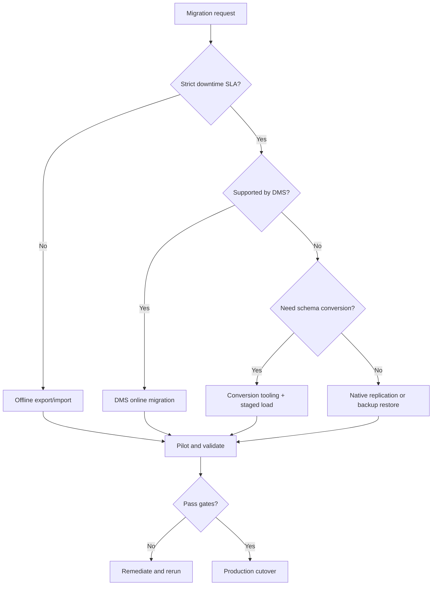

### 1.5 Migration phases
| Phase | Outcome |
|---:|---|
| 1 | Inventory source versions, size, dependencies, and write patterns. |
| 2 | Assess compatibility, performance needs, and downtime tolerance. |
| 3 | Prepare networking, IAM, target capacity, and backup controls. |
| 4 | Pilot with realistic data volume and validation scripts. |
| 5 | Run initial load and continuous replication if applicable. |
| 6 | Cut over with read-only mode, target promotion, DNS/secret switch. |
| 7 | Stabilize on the target and watch performance and errors. |
| 8 | Decommission the source only after rollback window expiry. |

#### Bootstrap commands
```bash
gcloud services enable sqladmin.googleapis.com datamigration.googleapis.com alloydb.googleapis.com compute.googleapis.com servicenetworking.googleapis.com dns.googleapis.com
gcloud compute addresses create google-managed-services-range --global --purpose=VPC_PEERING --prefix-length=16 --network=prod-vpc
gcloud services vpc-peerings connect --service=servicenetworking.googleapis.com --ranges=google-managed-services-range --network=prod-vpc
gcloud compute firewall-rules create allow-db-migration --network=prod-vpc --allow=tcp:3306,tcp:5432,tcp:1433 --source-ranges=10.10.0.0/16
```

```text
$ gcloud services list --enabled --filter="NAME:datamigration"
NAME                           TITLE
datamigration.googleapis.com   Database Migration API
```

```hcl
resource "google_project_service" "migration_api" {
  for_each = toset([
    "sqladmin.googleapis.com",
    "datamigration.googleapis.com",
    "alloydb.googleapis.com",
    "servicenetworking.googleapis.com"
  ])
  project = var.project_id
  service = each.key
  disable_on_destroy = false
}
```

---

## 2. 🐬 On-Premises MySQL → Cloud SQL for MySQL

MySQL to Cloud SQL is a common low-friction replatforming path. The main decision is whether a simple offline `mysqldump` path is acceptable or whether DMS continuous replication is required to keep downtime under a few minutes.

#### 2.1 Pre-migration assessment
- Capture engine version, GTID mode, binary logging, table engines, routines, events, and triggers.
- Review connection count, average TPS, peak write rate, and largest tables.
- Identify write sources outside the main application such as ETL jobs and admin tools.
- Confirm whether MyISAM tables must be converted before migration.
- Measure export throughput and target import speed in a pilot.

| Assessment item | Example check | Why it matters |
|---|---|---|
| Version | SELECT VERSION(); | Confirms Cloud SQL compatibility |
| Binary logging | SHOW VARIABLES LIKE "log_bin"; | Needed for CDC |
| GTID mode | SHOW VARIABLES LIKE "gtid_mode"; | Affects replication handling |
| Storage engine | SELECT ENGINE, COUNT(*) ... | MyISAM risk and behavior |
| Privileges | SHOW GRANTS FOR migration_user; | DMS account readiness |

#### Prepare source and target
```bash
mysql -h onprem-db.corp.local -u root -p -e "SELECT VERSION();"
mysql -h onprem-db.corp.local -u root -p -e "SHOW VARIABLES LIKE "log_bin";"
gcloud sql instances create prod-mysql-uscentral1 --database-version=MYSQL_8_0 --cpu=8 --memory=30720MiB --region=us-central1 --availability-type=REGIONAL --storage-type=SSD --storage-size=2048 --backup-start-time=02:00 --enable-bin-log --network=projects/PROJECT_ID/global/networks/prod-vpc
gcloud sql instances patch prod-mysql-uscentral1 --maintenance-window-day=7 --maintenance-window-hour=3 --retained-backups-count=14 --enable-point-in-time-recovery
```

### 2.2 Offline migration with mysqldump
#### Offline runbook
- Place the application in read-only mode and stop async workers.
- Take a source backup or storage snapshot.
- Export with routines, triggers, and events enabled.
- Import to Cloud SQL and validate row counts and checksums before reopening writes.

#### mysqldump workflow
```bash
mysqldump --host=onprem-db.corp.local --user=export_user --password --single-transaction --routines --triggers --events --hex-blob --databases appdb > appdb-full.sql
gsutil cp appdb-full.sql gs://db-migration-bucket/mysql/appdb-full.sql
gcloud sql import sql prod-mysql-uscentral1 gs://db-migration-bucket/mysql/appdb-full.sql --database=appdb
mysql -h 10.20.0.15 -u appuser -p appdb -e "SELECT COUNT(*) FROM orders;"
```

```text
$ gcloud sql operations list --instance=prod-mysql-uscentral1 --limit=1
NAME                                  TYPE    START                          END                            ERROR
1f2a5f4d-1111-4f0a-9a20-123456789abc  IMPORT  2025-01-18T02:10:11.001Z     2025-01-18T03:46:55.912Z       -
```

### 2.3 Online migration with DMS (continuous replication)
#### Online migration essentials
- Create a replication user with required privileges.
- Ensure binary logging retention covers the initial load and cutover window.
- Use DMS connection profiles for source and Cloud SQL target.
- Watch migration job state, lag, and Cloud SQL performance.

#### DMS setup for MySQL
```bash
mysql -h onprem-db.corp.local -u root -p -e "CREATE USER migration_user@"%" IDENTIFIED BY "REDACTED";"
mysql -h onprem-db.corp.local -u root -p -e "GRANT REPLICATION SLAVE, REPLICATION CLIENT, SELECT ON *.* TO migration_user@"%"; FLUSH PRIVILEGES;"
gcloud database-migration connection-profiles create mysql onprem-mysql-profile --region=us-central1 --display-name="OnPrem MySQL" --host=10.1.2.15 --port=3306 --username=migration_user --password="REDACTED"
gcloud database-migration connection-profiles create cloudsql target-cloudsql-profile --region=us-central1 --display-name="Target Cloud SQL" --cloudsql-instance=prod-mysql-uscentral1
gcloud database-migration migration-jobs create mysql-to-cloudsql-job --region=us-central1 --type=CONTINUOUS --source=onprem-mysql-profile --destination=target-cloudsql-profile --dump-path=gs://db-migration-bucket/mysql/dms-staging/ --connectivity=static-ip-connectivity
gcloud database-migration migration-jobs start mysql-to-cloudsql-job --region=us-central1
```

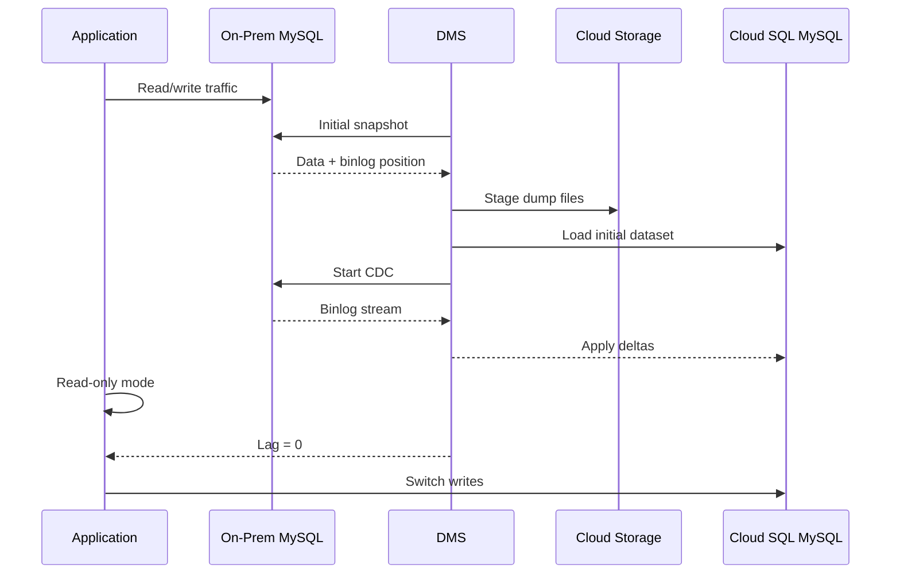

### 2.4 External replica promotion
#### Replica promotion notes
- An external replica style path can simplify promotion when teams already trust native MySQL replication behavior.
- Validate replica lag and final write position before promotion.
- Treat promotion as a cutover event with rollback rules and DNS updates.

#### Promotion example
```bash
gcloud sql instances create cloudsql-external-replica --database-version=MYSQL_8_0 --region=us-central1 --cpu=8 --memory=30720MiB --availability-type=REGIONAL
gcloud sql instances promote-replica cloudsql-external-replica
gcloud sql instances describe cloudsql-external-replica --format="value(instanceType,state)"
```

### 2.5 DNS cutover strategy
| Step | Action | Owner |
|---:|---|---|
| 1 | Reduce TTL 24 hours early. | Platform |
| 2 | Enable read-only mode and drain jobs. | App team |
| 3 | Confirm lag is zero. | DBA |
| 4 | Promote target or stop replication cleanly. | DBA |
| 5 | Update Cloud DNS or Secret Manager endpoint. | Platform |
| 6 | Restart pools and reopen writes. | SRE |
| 7 | Monitor latency, errors, and transactions. | SRE |
#### Cloud DNS cutover commands
```bash
gcloud dns record-sets transaction start --zone=prod-db-zone
gcloud dns record-sets transaction remove --zone=prod-db-zone --name=db.prod.example.com. --type=CNAME --ttl=30 old-db.example.com.
gcloud dns record-sets transaction add --zone=prod-db-zone --name=db.prod.example.com. --type=CNAME --ttl=30 cloudsql-proxy.prod.example.com.
gcloud dns record-sets transaction execute --zone=prod-db-zone
dig +short db.prod.example.com
```

```sql
SELECT COUNT(*) FROM orders;
CHECKSUM TABLE orders, order_items, customers;
SELECT COUNT(*) FROM orders WHERE updated_at >= NOW() - INTERVAL 1 DAY;
```

```hcl
resource "google_sql_database_instance" "mysql" {
  name             = "prod-mysql-uscentral1"
  database_version = "MYSQL_8_0"
  region           = "us-central1"
  settings {
    tier              = "db-custom-8-30720"
    availability_type = "REGIONAL"
    disk_type         = "PD_SSD"
    disk_size         = 2048
    backup_configuration {
      enabled                        = true
      binary_log_enabled             = true
      point_in_time_recovery_enabled = true
    }
  }
}
```

---

## 3. 🐘 On-Premises PostgreSQL → Cloud SQL for PostgreSQL

PostgreSQL migrations are straightforward when the source stays near upstream PostgreSQL behavior. Complexity grows with extension usage, logical replication settings, and large-sequence or partition-heavy workloads.

#### pg_dump / pg_restore approach
```bash
pg_dump -h pg-onprem.corp.local -U postgres -Fc appdb > appdb.dump
gsutil cp appdb.dump gs://db-migration-bucket/postgres/appdb.dump
gcloud sql instances create prod-pg-uscentral1 --database-version=POSTGRES_15 --cpu=8 --memory=30720MiB --region=us-central1 --availability-type=REGIONAL --storage-size=1024 --network=projects/PROJECT_ID/global/networks/prod-vpc
pg_restore -h 10.30.0.12 -U postgres -d appdb --jobs=8 appdb.dump
```

#### DMS online migration for PostgreSQL
- Enable appropriate WAL settings and retention.
- Create a DMS account with replication privileges.
- Watch replication slot growth and target performance.
- Validate extensions, sequences, and top queries after load.

#### PostgreSQL DMS commands
```bash
psql "host=pg-onprem.corp.local user=postgres dbname=postgres" -c "CREATE ROLE dms_user WITH LOGIN REPLICATION PASSWORD "REDACTED";"
gcloud database-migration connection-profiles create postgresql onprem-pg-profile --region=us-central1 --display-name="OnPrem PostgreSQL" --host=10.2.4.20 --port=5432 --username=dms_user --password="REDACTED"
gcloud database-migration connection-profiles create cloudsql target-pg-profile --region=us-central1 --display-name="Cloud SQL PG" --cloudsql-instance=prod-pg-uscentral1
gcloud database-migration migration-jobs create pg-to-cloudsql-job --region=us-central1 --type=CONTINUOUS --source=onprem-pg-profile --destination=target-pg-profile --connectivity=static-ip-connectivity
gcloud database-migration migration-jobs start pg-to-cloudsql-job --region=us-central1
```

### 3.1 pglogical replication
#### pglogical use cases
- Selective schema or table waves.
- Version-bridge and low-downtime cutovers when native tooling is not enough.
- Controlled tenant-by-tenant migration patterns.

#### pglogical example
```bash
psql "host=pg-onprem.corp.local user=postgres dbname=appdb" -c "CREATE EXTENSION IF NOT EXISTS pglogical;"
psql "host=pg-onprem.corp.local user=postgres dbname=appdb" -c "SELECT pglogical.create_node(node_name := "source", dsn := "host=pg-onprem.corp.local dbname=appdb user=postgres password=REDACTED");"
psql "host=cloudsql-target user=postgres dbname=appdb" -c "CREATE EXTENSION IF NOT EXISTS pglogical;"
```

### 3.2 AlloyDB as target option
#### AlloyDB provisioning example
```bash
gcloud alloydb clusters create orders-cluster --region=us-central1 --network=projects/PROJECT_ID/global/networks/prod-vpc --password="REDACTED"
gcloud alloydb instances create orders-primary --cluster=orders-cluster --region=us-central1 --instance-type=PRIMARY --cpu-count=8
gcloud alloydb instances describe orders-primary --cluster=orders-cluster --region=us-central1
```

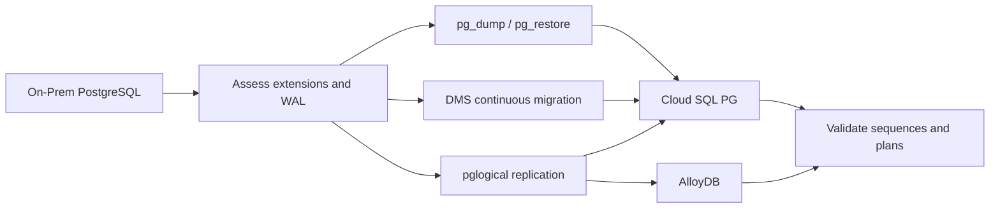
```text
$ psql "host=prod-pg-uscentral1 user=postgres dbname=appdb" -c "SELECT count(*) FROM orders;"
  count
----------
 148523901
(1 row)
```

---

## 4. 🪟 On-Premises SQL Server → Cloud SQL for SQL Server

#### Assessment and planning
- Inventory databases, editions, compatibility levels, SQL Agent jobs, linked servers, SSIS/SSRS dependencies, and maintenance plans.
- Review Windows authentication assumptions and login mapping.
- Classify databases by size, downtime needs, and feature compatibility.
- Identify cases where Bare Metal Solution is safer than Cloud SQL for SQL Server.

#### Assessment commands
```bash
sqlcmd -S onprem-sql.corp.local -U sa -P "REDACTED" -Q "SELECT @@VERSION;"
sqlcmd -S onprem-sql.corp.local -U sa -P "REDACTED" -Q "SELECT name, compatibility_level FROM sys.databases;"
sqlcmd -S onprem-sql.corp.local -U sa -P "REDACTED" -Q "EXEC msdb.dbo.sp_help_job;"
```

#### DMS migration commands
```bash
gcloud sql instances create prod-sqlserver-uscentral1 --database-version=SQLSERVER_2019_STANDARD --tier=db-custom-8-30720 --region=us-central1 --availability-type=REGIONAL --storage-size=2048 --root-password="REDACTED"
gcloud database-migration connection-profiles create sqlserver onprem-sqlserver-profile --region=us-central1 --display-name="OnPrem SQL Server" --host=10.3.8.40 --port=1433 --username=migration_user --password="REDACTED"
gcloud database-migration migration-jobs create sqlserver-to-cloudsql-job --region=us-central1 --type=CONTINUOUS --source=onprem-sqlserver-profile --destination=target-sqlserver-profile --connectivity=static-ip-connectivity
gcloud database-migration migration-jobs start sqlserver-to-cloudsql-job --region=us-central1
```

### 4.1 BACPAC import approach
#### BACPAC workflow
```bash
SqlPackage /Action:Export /SourceServerName:onprem-sql.corp.local /SourceDatabaseName:ERP /SourceUser:sa /SourcePassword:REDACTED /TargetFile:ERP.bacpac
gsutil cp ERP.bacpac gs://db-migration-bucket/sqlserver/ERP.bacpac
SqlPackage /Action:Import /TargetServerName:cloudsql-sqlserver-endpoint /TargetDatabaseName:ERP /TargetUser:sqlserver /TargetPassword:REDACTED /SourceFile:ERP.bacpac
```

### 4.2 Bare Metal Solution as alternative
#### When BMS is a better fit
- Heavy SQL Server Enterprise feature dependency.
- Very high IOPS and legacy architecture constraints.
- Near-zero app change requirements with full engine control.

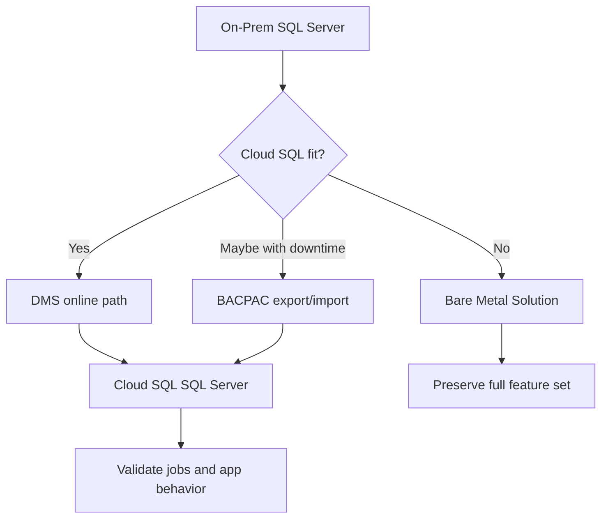
---

## 5. ⚡ Cloud SQL → AlloyDB Migration

Teams often move from Cloud SQL PostgreSQL to AlloyDB when they need more throughput, more read scale, or better analytics integration without leaving PostgreSQL compatibility behind.

| Why migrate | Benefit |
|---|---|
| Higher throughput | Better transactional headroom |
| Read scaling | Read pools for reporting and API traffic |
| Analytics acceleration | Columnar and AI-friendly capabilities |
| Operational growth | More headroom without app rewrite |
#### Continuous migration example
```bash
gcloud alloydb clusters create fin-cluster --region=us-central1 --network=projects/PROJECT_ID/global/networks/prod-vpc --password="REDACTED"
gcloud alloydb instances create fin-primary --cluster=fin-cluster --region=us-central1 --instance-type=PRIMARY --cpu-count=8
gcloud database-migration connection-profiles create cloudsql cloudsql-pg-source --region=us-central1 --display-name="Cloud SQL PG Source" --cloudsql-instance=prod-pg-uscentral1
gcloud database-migration connection-profiles create alloydb alloydb-target --region=us-central1 --display-name="AlloyDB Target" --alloydb-cluster=projects/PROJECT_ID/locations/us-central1/clusters/fin-cluster
gcloud database-migration migration-jobs create cloudsql-to-alloydb-job --region=us-central1 --type=CONTINUOUS --source=cloudsql-pg-source --destination=alloydb-target
gcloud database-migration migration-jobs start cloudsql-to-alloydb-job --region=us-central1
```

#### Application connection update
- Update Secret Manager or config service entries.
- Validate connection pooling and TLS behavior.
- Canary read/write traffic before broad rollout.
- Keep Cloud SQL source idle for the rollback window.

```sql
SELECT now(), count(*) FROM invoices;
SELECT extname FROM pg_extension ORDER BY 1;
SELECT query, calls, total_exec_time FROM pg_stat_statements ORDER BY total_exec_time DESC LIMIT 20;
```

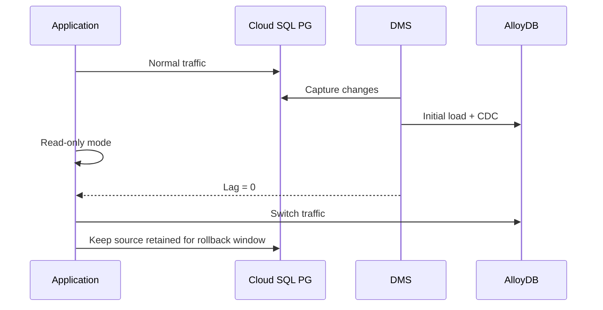
```text
$ gcloud alloydb instances list --cluster=fin-cluster --region=us-central1
NAME         TYPE      STATE    IP_ADDRESS
fin-primary  PRIMARY   READY    10.40.0.9
```

---

## 6. 🌐 Cross-Cloud Database Migration

#### AWS RDS → Cloud SQL
- Prefer VPN or Interconnect for large or regulated migrations.
- Review RDS parameter groups and engine-specific settings.
- Reduce endpoint TTL and application-side cache durations before cutover.

#### AWS RDS example
```bash
aws rds describe-db-instances --db-instance-identifier prod-rds-mysql
gcloud database-migration connection-profiles create mysql aws-rds-profile --region=us-central1 --host=prod-rds.cluster-abcdefgh.us-east-1.rds.amazonaws.com --port=3306 --username=migration_user --password="REDACTED"
gcloud database-migration migration-jobs create rds-to-cloudsql --region=us-central1 --type=CONTINUOUS --source=aws-rds-profile --destination=target-cloudsql-profile --connectivity=static-ip-connectivity
```

#### Azure SQL → Cloud SQL
- Usually heterogeneous and requires datatype, T-SQL, and operational process remediation.
- For lower risk, some teams move to Cloud SQL for SQL Server first, then modernize later.
- BACPAC can help for smaller workloads or non-critical systems.

#### Azure SQL export example
```bash
az sql db export --admin-user sqladmin --admin-password REDACTED --name appdb --resource-group rg-prod --server azuresql-prod --storage-key-type StorageAccessKey --storage-uri https://storageaccount.blob.core.windows.net/bacpac/appdb.bacpac
gsutil cp appdb.bacpac gs://db-migration-bucket/azure/appdb.bacpac
```

### 6.1 Using DMS with external sources
| Source | Target | Note |
|---|---|---|
| AWS RDS MySQL/PostgreSQL | Cloud SQL / AlloyDB | Often straightforward if versions align |
| Self-managed EC2 DB | Cloud SQL / AlloyDB | Treat similarly to on-prem |
| Azure Database for PostgreSQL | Cloud SQL / AlloyDB | Validate firewall and WAL settings |
| Hosted SQL Server | Cloud SQL for SQL Server | Coordinate TLS and allowlists |
#### Striim, Debezium, and alternatives
- Striim is strong for enterprise CDC and heterogeneous pipelines.
- Debezium fits well when Kafka is already strategic.
- Datastream + Dataflow may be better when the goal is analytics ingestion rather than transactional cutover.
- Do not treat CDC tooling as a substitute for schema conversion and business validation.

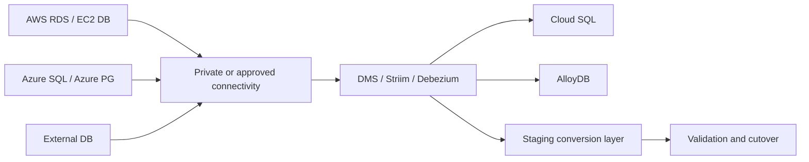
---

## 7. 📦 NoSQL Migrations

NoSQL migration programs are usually transformation programs. Teams must redesign keys, document shape, consistency expectations, and downstream analytics before production cutover.

#### MongoDB → Firestore
- Map collections to Firestore collections and define document ID rules.
- Flatten oversized embedded documents when needed.
- Move heavy aggregations to BigQuery or Dataflow where appropriate.

#### MongoDB export example
```bash
mongoexport --uri="mongodb://mongo.corp.local/appdb" --collection=customers --out=customers.json
gsutil cp customers.json gs://nosql-migration-bucket/mongodb/customers.json
python3 scripts/mongo_to_firestore.py --input customers.json --collection customers --project PROJECT_ID
```

#### DynamoDB → Bigtable
- Redesign row keys to avoid hotspots.
- Translate GSIs into Bigtable key design or downstream indexes.
- Use Dataflow or custom ETL for large backfills and transformations.

#### DynamoDB export example
```bash
aws dynamodb export-table-to-point-in-time --table-arn arn:aws:dynamodb:us-east-1:111122223333:table/orders --s3-bucket export-bucket
python3 scripts/dynamodb_to_bigtable.py --input dynamodb-orders-export --instance orders-bt --table orders
```

#### Cassandra → Bigtable
- Validate TTL, counters, and query patterns.
- Review partition and clustering key design before migration.
- Pilot hotspot and throughput behavior before production cutover.

| Transformation approach | Best fit | Tools |
|---|---|---|
| Batch export/import | One-time backfill | Custom ETL, Dataflow, Spark |
| CDC + transform | Low-downtime backfill plus deltas | Debezium, Kafka, Dataflow |
| Dual-write | Gradual app-led migration | Feature flags, replay queues |
| Staging lake conversion | Complex audit-friendly transformations | Cloud Storage, BigQuery, Dataproc |
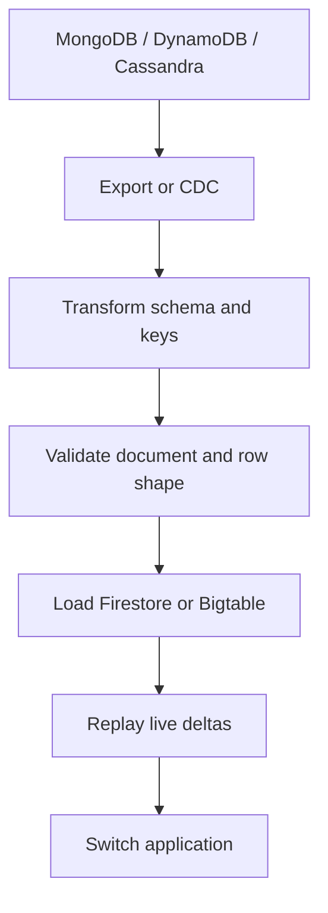
---

## 8. ✅ Database Migration Testing & Validation

#### DMS migration job monitoring
- Track state, phase, lag, errors, and throughput.
- Alert on target CPU, memory, connection count, and storage growth.
- Capture validation evidence during the change window.

#### Monitoring commands
```bash
gcloud database-migration migration-jobs describe mysql-to-cloudsql-job --region=us-central1
gcloud monitoring time-series list --filter="metric.type="cloudsql.googleapis.com/database/cpu/utilization"" --limit=5
gcloud logging read "resource.type=cloudsql_database AND severity>=ERROR" --limit=20 --format="table(timestamp,textPayload)"
```

```sql
SELECT COUNT(*) FROM customers;
SELECT COUNT(*) FROM orders WHERE updated_at >= CURRENT_DATE - INTERVAL 7 DAY;
SELECT MIN(id), MAX(id) FROM invoices;
SELECT SUM(total_amount) FROM payments WHERE status = 'SETTLED';
SELECT tenant_id, COUNT(*) FROM users GROUP BY tenant_id ORDER BY tenant_id;
```

| Performance test | Source | Target | Gate |
|---|---:|---:|---|
| Login p95 | 120 ms | 98 ms | Target <= source + 10% |
| Order submit p95 | 280 ms | 250 ms | No major regression |
| Batch invoice load | 18k rows/min | 24k rows/min | Meet batch window |
| Replication lag at cutover | N/A | 0 s | Must be zero |
#### Rollback procedures
- Define a rollback deadline before source/target divergence becomes unsafe.
- Keep the source recoverable until business acceptance is complete.
- Rollback must include app config, DNS, secrets, and connection pools—not just database state.

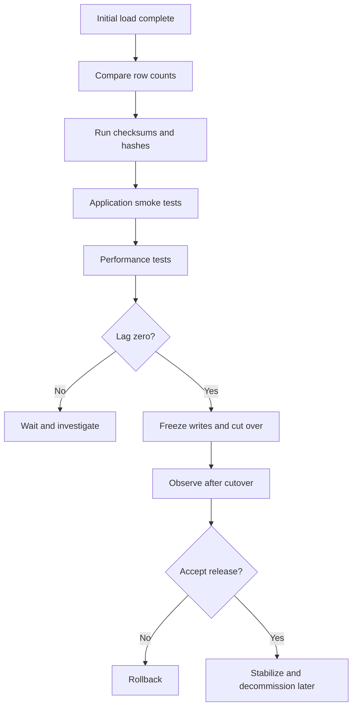
```text
$ mysql -h target -u validator -p -e "CHECKSUM TABLE orders;"
Table          Checksum
appdb.orders   428918374
```

---

## 9. 🧪 Real-World Migration Scenarios

### 9.1 Scenario 1: Migrate 5TB MySQL with <10 min downtime using DMS

#### Problem
A retail platform has a 5 TB MySQL 8.0 database on-premises and the business allows less than 10 minutes of write downtime.

#### Plan
- Use Dedicated Interconnect and large target sizing.
- Run DMS continuous replication for several days.
- Reduce TTL and rehearse cutover with production-like volume.
- Freeze writes only after lag reaches zero.

#### Commands
```bash
gcloud sql instances create retail-mysql-prod --database-version=MYSQL_8_0 --cpu=32 --memory=122880MiB --region=us-central1 --availability-type=REGIONAL --storage-size=8192 --enable-bin-log --network=projects/PROJECT_ID/global/networks/prod-vpc
gcloud database-migration migration-jobs create retail-5tb-job --region=us-central1 --type=CONTINUOUS --source=retail-onprem-profile --destination=retail-target-profile --dump-path=gs://db-migration-bucket/retail/initial-load/
gcloud database-migration migration-jobs start retail-5tb-job --region=us-central1
```

#### Cutover
- Pause payment workers and admin bulk jobs.
- Enable read-only mode.
- Switch DNS/secret to Cloud SQL after lag = 0.
- Keep source retained for 48 hours.

#### Validation
- Compare order and payment row counts.
- Run checkout and refund smoke tests.
- Review checkout p95 and deadlock rate.

```text
$ echo "Scenario 1: Migrate 5TB MySQL with <10 min downtime using DMS"
Scenario 1: Migrate 5TB MySQL with <10 min downtime using DMS
Replication lag: 0s
Smoke tests: PASSED
Rollback posture: source retained
```

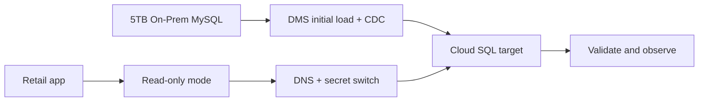
#### Expanded operational notes
- Run a staffed bridge with DBAs, app owners, SREs, and communications owners.
- Record timestamps for read-only start, lag-zero confirmation, and traffic reopen.
- Capture screenshots or CLI evidence for post-mortem and audit review.
- Use synthetic checks for the first hour after cutover.

### 9.2 Scenario 2: Oracle → Cloud SQL PostgreSQL heterogeneous migration

#### Problem
A finance team wants to reduce Oracle licensing and move to PostgreSQL on Cloud SQL.

#### Plan
- Use conversion tooling and staged DDL remediation.
- Bulk load history and replay deltas.
- Refactor application SQL that depends on Oracle-specific syntax.

#### Commands
```bash
ora2pg -c ora2pg.conf -t SHOW_REPORT > conversion-report.txt
ora2pg -c ora2pg.conf -t TABLE -o tables.sql
psql "host=cloudsql-pg dbname=appdb user=postgres" -f tables.sql
```

#### Cutover
- Freeze batch writes to Oracle.
- Replay final deltas into PostgreSQL.
- Switch application credentials and endpoints.

#### Validation
- Reconcile ledger totals and balances.
- Run month-end close simulation.
- Validate converted procedures and reports.

```text
$ echo "Scenario 2: Oracle → Cloud SQL PostgreSQL heterogeneous migration"
Scenario 2: Oracle → Cloud SQL PostgreSQL heterogeneous migration
Replication lag: 0s
Smoke tests: PASSED
Rollback posture: source retained
```

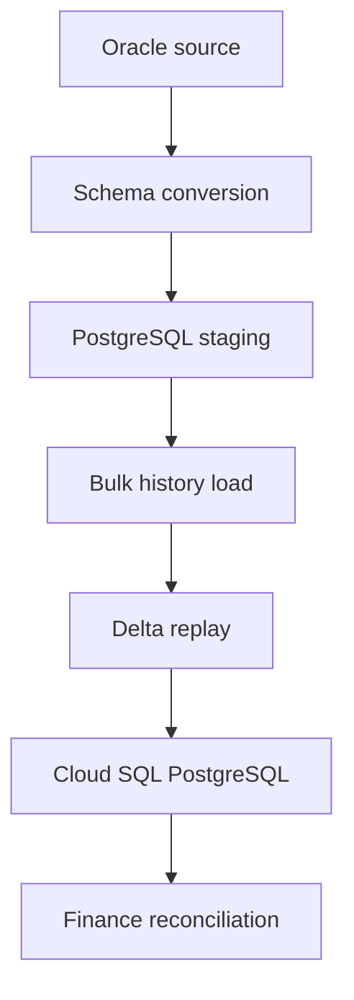
#### Expanded operational notes
- Run a staffed bridge with DBAs, app owners, SREs, and communications owners.
- Record timestamps for read-only start, lag-zero confirmation, and traffic reopen.
- Capture screenshots or CLI evidence for post-mortem and audit review.
- Use synthetic checks for the first hour after cutover.

### 9.3 Scenario 3: Multi-tenant SaaS database migration

#### Problem
A SaaS provider has 800 tenant schemas and cannot tolerate a single monolithic cutover.

#### Plan
- Group tenants into waves by size and SLA.
- Parameterize validation and cutover scripts.
- Use per-wave rollback and support playbooks.

#### Commands
```bash
python3 scripts/generate_tenant_wave.py --wave=wave-01 --max-size-gb=200
python3 scripts/validate_tenant_wave.py --wave=wave-01
python3 scripts/cutover_tenant_wave.py --wave=wave-01
```

#### Cutover
- Place only the active wave into read-only mode.
- Switch routing metadata for migrated tenants.
- Repeat wave by wave.

#### Validation
- Per-tenant row counts and invoice totals.
- Tenant login and admin smoke tests.
- Wave dashboard review.

```text
$ echo "Scenario 3: Multi-tenant SaaS database migration"
Scenario 3: Multi-tenant SaaS database migration
Replication lag: 0s
Smoke tests: PASSED
Rollback posture: source retained
```

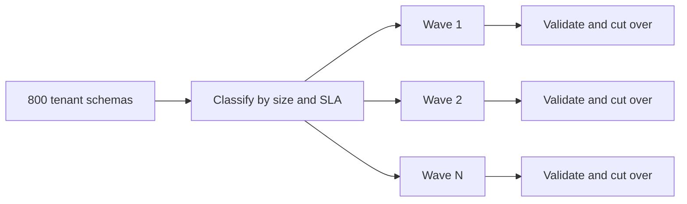
#### Expanded operational notes
- Run a staffed bridge with DBAs, app owners, SREs, and communications owners.
- Record timestamps for read-only start, lag-zero confirmation, and traffic reopen.
- Capture screenshots or CLI evidence for post-mortem and audit review.
- Use synthetic checks for the first hour after cutover.

### 9.4 Scenario 4: Migrate to Spanner for global scale

#### Problem
An e-commerce system needs globally distributed writes and strong consistency.

#### Plan
- Redesign schema and keys for Spanner.
- Backfill history and replay events.
- Load test with global traffic patterns.

#### Commands
```bash
gcloud spanner instances create orders-global --config=nam-eur-asia1 --processing-units=3000 --description="Global orders"
gcloud spanner databases create ordersdb --instance=orders-global --ddl-file=schema.sql
python3 scripts/backfill_to_spanner.py --source=orders --target=ordersdb
```

#### Cutover
- Freeze writes briefly on legacy primary.
- Replay final event stream.
- Open global routing to the Spanner-backed service.

#### Validation
- Global checkout success rate.
- Commit latency and hotspot metrics.
- Regional synthetic probes.

```text
$ echo "Scenario 4: Migrate to Spanner for global scale"
Scenario 4: Migrate to Spanner for global scale
Replication lag: 0s
Smoke tests: PASSED
Rollback posture: source retained
```

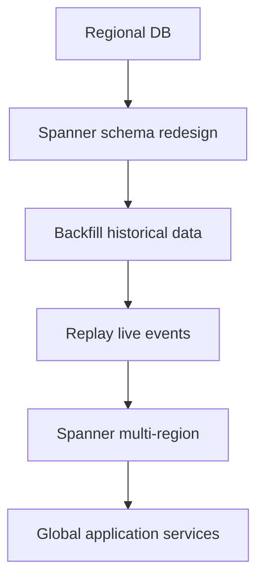
#### Expanded operational notes
- Run a staffed bridge with DBAs, app owners, SREs, and communications owners.
- Record timestamps for read-only start, lag-zero confirmation, and traffic reopen.
- Capture screenshots or CLI evidence for post-mortem and audit review.
- Use synthetic checks for the first hour after cutover.

### 9.5 Scenario 5: Consolidate multiple Cloud SQL instances

#### Problem
A platform team runs many underutilized Cloud SQL instances and wants consolidation with guardrails.

#### Plan
- Classify tenants by compatibility and noisy-neighbor risk.
- Create shared targets with clear quotas and observability.
- Migrate low-risk instances first and scale gradually.

#### Commands
```bash
gcloud sql instances list --format="table(name,region,databaseVersion,settings.tier,state)"
gcloud sql instances create consolidated-pg-a --database-version=POSTGRES_15 --cpu=16 --memory=61440MiB --region=us-central1 --availability-type=REGIONAL
gcloud sql databases create tenant_a --instance=consolidated-pg-a
```

#### Cutover
- Move applications one service at a time.
- Watch for noisy-neighbor signals after each wave.
- Retire old instances only after soak period.

#### Validation
- CPU, memory, and connection stability.
- No service sees latency regression.
- Backup and PITR controls validated.

```text
$ echo "Scenario 5: Consolidate multiple Cloud SQL instances"
Scenario 5: Consolidate multiple Cloud SQL instances
Replication lag: 0s
Smoke tests: PASSED
Rollback posture: source retained
```

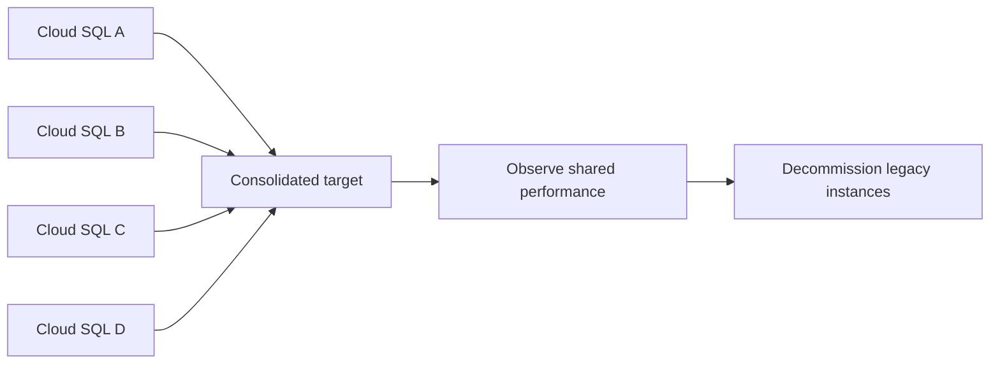
#### Expanded operational notes
- Run a staffed bridge with DBAs, app owners, SREs, and communications owners.
- Record timestamps for read-only start, lag-zero confirmation, and traffic reopen.
- Capture screenshots or CLI evidence for post-mortem and audit review.
- Use synthetic checks for the first hour after cutover.

## 10. 🧰 Appendix A: Command Cheat Sheet

#### DMS jobs
```bash
gcloud database-migration migration-jobs list --region=us-central1
gcloud database-migration migration-jobs describe JOB_NAME --region=us-central1
gcloud database-migration migration-jobs stop JOB_NAME --region=us-central1
```

#### Cloud SQL
```bash
gcloud sql instances list
gcloud sql instances describe INSTANCE
gcloud sql backups list --instance=INSTANCE
```

#### AlloyDB
```bash
gcloud alloydb clusters list --region=us-central1
gcloud alloydb instances list --cluster=CLUSTER --region=us-central1
```

#### Cloud DNS
```bash
gcloud dns record-sets list --zone=prod-db-zone
gcloud dns record-sets transaction start --zone=prod-db-zone
gcloud dns record-sets transaction execute --zone=prod-db-zone
```

## 11. 📋 Appendix B: Migration Readiness Checklist
### People
- [ ] DBA on-call identified
- [ ] App owner approval complete
- [ ] Rollback approver named
- [ ] Customer communications drafted

### Process
- [ ] Runbook peer reviewed
- [ ] Go/no-go gates documented
- [ ] Backout plan rehearsed
- [ ] Support desk informed

### Technology
- [ ] Connectivity tested
- [ ] Target backups enabled
- [ ] Monitoring dashboard ready
- [ ] Validation queries approved

### Security
- [ ] Secrets stored safely
- [ ] Firewall rules scoped
- [ ] Audit logging enabled
- [ ] TLS requirements documented

## 12. 📈 Appendix C: Metrics, Logs, and Alerts
- **Replication lag:** define threshold, owner, and escalation path before cutover.
- **Target CPU utilization:** define threshold, owner, and escalation path before cutover.
- **Target memory pressure:** define threshold, owner, and escalation path before cutover.
- **Storage growth:** define threshold, owner, and escalation path before cutover.
- **Connection count:** define threshold, owner, and escalation path before cutover.
- **Deadlock rate:** define threshold, owner, and escalation path before cutover.
- **Slow query rate:** define threshold, owner, and escalation path before cutover.
- **Error response rate:** define threshold, owner, and escalation path before cutover.
- **DNS propagation checks:** define threshold, owner, and escalation path before cutover.
- **Backup success/failure:** define threshold, owner, and escalation path before cutover.

## 13. 🛡️ Appendix D: Risk Register and Rollback Matrix
| Risk | Signal | Mitigation | Rollback trigger |
|---|---|---|---|
| Replication lag spike | Lag grows during stable traffic | Increase target size or reduce noise | Lag cannot reach zero in window |
| Connection exhaustion | App errors on cutover | Tune pools and limits | Critical writes fail persistently |
| Schema incompatibility | App path broken | Pre-convert objects and test | Critical function unavailable |
| Performance regression | p95 exceeds SLO | Tune indexes and scale target | Business KPI fails |
| Data mismatch | Counts or checksums differ | Investigate and replay | Critical-table mismatch unexplained |

## 14. 🧾 Appendix E: Verification Outputs
### DMS list
```text
$ gcloud database-migration migration-jobs list --region=us-central1
NAME                   TYPE        STATE    PHASE
mysql-to-cloudsql-job  CONTINUOUS  RUNNING  CDC
pg-to-cloudsql-job     CONTINUOUS  RUNNING  CDC
```

### Cloud SQL list
```text
$ gcloud sql instances list
NAME                    DATABASE_VERSION  REGION       TIER
prod-mysql-uscentral1   MYSQL_8_0         us-central1  db-custom-8-30720
prod-pg-uscentral1      POSTGRES_15       us-central1  db-custom-8-30720
```

### AlloyDB list
```text
$ gcloud alloydb clusters list --region=us-central1
NAME            STATE
orders-cluster  READY
fin-cluster     READY
```

## 15. 🏗️ Appendix F: Terraform Building Blocks
### Snippet 1
```hcl
resource "google_dns_managed_zone" "db" {
  name     = "prod-db-zone"
  dns_name = "prod.example.com."
}
```

### Snippet 2
```hcl
resource "google_secret_manager_secret" "db_conn" {
  secret_id = "db-connection"
  replication { auto {} }
}
```

### Snippet 3
```hcl
resource "google_monitoring_alert_policy" "replication_lag" {
  display_name = "DMS replication lag"
  combiner     = "OR"
}
```

## 16. ❓ Appendix G: Extended FAQ
### FAQ 1: How early should DNS TTL be reduced?
Answer 1: Usually at least 24 hours before cutover, and longer when connection caches are sticky. Teams should turn this into environment-specific guidance with named owners, thresholds, and rollback evidence.

### FAQ 2: Should the source be shut down immediately?
Answer 2: No. Retain it through the agreed rollback window. Teams should turn this into environment-specific guidance with named owners, thresholds, and rollback evidence.

### FAQ 3: What is the biggest mistake in online migration?
Answer 3: Confusing replication health with application correctness. Teams should turn this into environment-specific guidance with named owners, thresholds, and rollback evidence.

### FAQ 4: Can row-count validation replace performance testing?
Answer 4: No. Correct data with poor latency still fails production requirements. Teams should turn this into environment-specific guidance with named owners, thresholds, and rollback evidence.

### FAQ 5: When is offline migration preferable?
Answer 5: When downtime is acceptable and simplicity matters more than low interruption. Teams should turn this into environment-specific guidance with named owners, thresholds, and rollback evidence.

### FAQ 6: How early should DNS TTL be reduced?
Answer 6: Usually at least 24 hours before cutover, and longer when connection caches are sticky. Teams should turn this into environment-specific guidance with named owners, thresholds, and rollback evidence.

### FAQ 7: Should the source be shut down immediately?
Answer 7: No. Retain it through the agreed rollback window. Teams should turn this into environment-specific guidance with named owners, thresholds, and rollback evidence.

### FAQ 8: What is the biggest mistake in online migration?
Answer 8: Confusing replication health with application correctness. Teams should turn this into environment-specific guidance with named owners, thresholds, and rollback evidence.

### FAQ 9: Can row-count validation replace performance testing?
Answer 9: No. Correct data with poor latency still fails production requirements. Teams should turn this into environment-specific guidance with named owners, thresholds, and rollback evidence.

### FAQ 10: When is offline migration preferable?
Answer 10: When downtime is acceptable and simplicity matters more than low interruption. Teams should turn this into environment-specific guidance with named owners, thresholds, and rollback evidence.

### FAQ 11: How early should DNS TTL be reduced?
Answer 11: Usually at least 24 hours before cutover, and longer when connection caches are sticky. Teams should turn this into environment-specific guidance with named owners, thresholds, and rollback evidence.

### FAQ 12: Should the source be shut down immediately?
Answer 12: No. Retain it through the agreed rollback window. Teams should turn this into environment-specific guidance with named owners, thresholds, and rollback evidence.

### FAQ 13: What is the biggest mistake in online migration?
Answer 13: Confusing replication health with application correctness. Teams should turn this into environment-specific guidance with named owners, thresholds, and rollback evidence.

### FAQ 14: Can row-count validation replace performance testing?
Answer 14: No. Correct data with poor latency still fails production requirements. Teams should turn this into environment-specific guidance with named owners, thresholds, and rollback evidence.

### FAQ 15: When is offline migration preferable?
Answer 15: When downtime is acceptable and simplicity matters more than low interruption. Teams should turn this into environment-specific guidance with named owners, thresholds, and rollback evidence.

### FAQ 16: How early should DNS TTL be reduced?
Answer 16: Usually at least 24 hours before cutover, and longer when connection caches are sticky. Teams should turn this into environment-specific guidance with named owners, thresholds, and rollback evidence.

### FAQ 17: Should the source be shut down immediately?
Answer 17: No. Retain it through the agreed rollback window. Teams should turn this into environment-specific guidance with named owners, thresholds, and rollback evidence.

### FAQ 18: What is the biggest mistake in online migration?
Answer 18: Confusing replication health with application correctness. Teams should turn this into environment-specific guidance with named owners, thresholds, and rollback evidence.

### FAQ 19: Can row-count validation replace performance testing?
Answer 19: No. Correct data with poor latency still fails production requirements. Teams should turn this into environment-specific guidance with named owners, thresholds, and rollback evidence.

### FAQ 20: When is offline migration preferable?
Answer 20: When downtime is acceptable and simplicity matters more than low interruption. Teams should turn this into environment-specific guidance with named owners, thresholds, and rollback evidence.

### FAQ 21: How early should DNS TTL be reduced?
Answer 21: Usually at least 24 hours before cutover, and longer when connection caches are sticky. Teams should turn this into environment-specific guidance with named owners, thresholds, and rollback evidence.

### FAQ 22: Should the source be shut down immediately?
Answer 22: No. Retain it through the agreed rollback window. Teams should turn this into environment-specific guidance with named owners, thresholds, and rollback evidence.

### FAQ 23: What is the biggest mistake in online migration?
Answer 23: Confusing replication health with application correctness. Teams should turn this into environment-specific guidance with named owners, thresholds, and rollback evidence.

### FAQ 24: Can row-count validation replace performance testing?
Answer 24: No. Correct data with poor latency still fails production requirements. Teams should turn this into environment-specific guidance with named owners, thresholds, and rollback evidence.

### FAQ 25: When is offline migration preferable?
Answer 25: When downtime is acceptable and simplicity matters more than low interruption. Teams should turn this into environment-specific guidance with named owners, thresholds, and rollback evidence.

### FAQ 26: How early should DNS TTL be reduced?
Answer 26: Usually at least 24 hours before cutover, and longer when connection caches are sticky. Teams should turn this into environment-specific guidance with named owners, thresholds, and rollback evidence.

### FAQ 27: Should the source be shut down immediately?
Answer 27: No. Retain it through the agreed rollback window. Teams should turn this into environment-specific guidance with named owners, thresholds, and rollback evidence.

### FAQ 28: What is the biggest mistake in online migration?
Answer 28: Confusing replication health with application correctness. Teams should turn this into environment-specific guidance with named owners, thresholds, and rollback evidence.

### FAQ 29: Can row-count validation replace performance testing?
Answer 29: No. Correct data with poor latency still fails production requirements. Teams should turn this into environment-specific guidance with named owners, thresholds, and rollback evidence.

### FAQ 30: When is offline migration preferable?
Answer 30: When downtime is acceptable and simplicity matters more than low interruption. Teams should turn this into environment-specific guidance with named owners, thresholds, and rollback evidence.

### FAQ 31: How early should DNS TTL be reduced?
Answer 31: Usually at least 24 hours before cutover, and longer when connection caches are sticky. Teams should turn this into environment-specific guidance with named owners, thresholds, and rollback evidence.

### FAQ 32: Should the source be shut down immediately?
Answer 32: No. Retain it through the agreed rollback window. Teams should turn this into environment-specific guidance with named owners, thresholds, and rollback evidence.

### FAQ 33: What is the biggest mistake in online migration?
Answer 33: Confusing replication health with application correctness. Teams should turn this into environment-specific guidance with named owners, thresholds, and rollback evidence.

### FAQ 34: Can row-count validation replace performance testing?
Answer 34: No. Correct data with poor latency still fails production requirements. Teams should turn this into environment-specific guidance with named owners, thresholds, and rollback evidence.

### FAQ 35: When is offline migration preferable?
Answer 35: When downtime is acceptable and simplicity matters more than low interruption. Teams should turn this into environment-specific guidance with named owners, thresholds, and rollback evidence.

### FAQ 36: How early should DNS TTL be reduced?
Answer 36: Usually at least 24 hours before cutover, and longer when connection caches are sticky. Teams should turn this into environment-specific guidance with named owners, thresholds, and rollback evidence.

### FAQ 37: Should the source be shut down immediately?
Answer 37: No. Retain it through the agreed rollback window. Teams should turn this into environment-specific guidance with named owners, thresholds, and rollback evidence.

### FAQ 38: What is the biggest mistake in online migration?
Answer 38: Confusing replication health with application correctness. Teams should turn this into environment-specific guidance with named owners, thresholds, and rollback evidence.

### FAQ 39: Can row-count validation replace performance testing?
Answer 39: No. Correct data with poor latency still fails production requirements. Teams should turn this into environment-specific guidance with named owners, thresholds, and rollback evidence.

### FAQ 40: When is offline migration preferable?
Answer 40: When downtime is acceptable and simplicity matters more than low interruption. Teams should turn this into environment-specific guidance with named owners, thresholds, and rollback evidence.

### FAQ 41: How early should DNS TTL be reduced?
Answer 41: Usually at least 24 hours before cutover, and longer when connection caches are sticky. Teams should turn this into environment-specific guidance with named owners, thresholds, and rollback evidence.

### FAQ 42: Should the source be shut down immediately?
Answer 42: No. Retain it through the agreed rollback window. Teams should turn this into environment-specific guidance with named owners, thresholds, and rollback evidence.

### FAQ 43: What is the biggest mistake in online migration?
Answer 43: Confusing replication health with application correctness. Teams should turn this into environment-specific guidance with named owners, thresholds, and rollback evidence.

### FAQ 44: Can row-count validation replace performance testing?
Answer 44: No. Correct data with poor latency still fails production requirements. Teams should turn this into environment-specific guidance with named owners, thresholds, and rollback evidence.

### FAQ 45: When is offline migration preferable?
Answer 45: When downtime is acceptable and simplicity matters more than low interruption. Teams should turn this into environment-specific guidance with named owners, thresholds, and rollback evidence.

### FAQ 46: How early should DNS TTL be reduced?
Answer 46: Usually at least 24 hours before cutover, and longer when connection caches are sticky. Teams should turn this into environment-specific guidance with named owners, thresholds, and rollback evidence.

### FAQ 47: Should the source be shut down immediately?
Answer 47: No. Retain it through the agreed rollback window. Teams should turn this into environment-specific guidance with named owners, thresholds, and rollback evidence.

### FAQ 48: What is the biggest mistake in online migration?
Answer 48: Confusing replication health with application correctness. Teams should turn this into environment-specific guidance with named owners, thresholds, and rollback evidence.

### FAQ 49: Can row-count validation replace performance testing?
Answer 49: No. Correct data with poor latency still fails production requirements. Teams should turn this into environment-specific guidance with named owners, thresholds, and rollback evidence.

### FAQ 50: When is offline migration preferable?
Answer 50: When downtime is acceptable and simplicity matters more than low interruption. Teams should turn this into environment-specific guidance with named owners, thresholds, and rollback evidence.

### FAQ 51: How early should DNS TTL be reduced?
Answer 51: Usually at least 24 hours before cutover, and longer when connection caches are sticky. Teams should turn this into environment-specific guidance with named owners, thresholds, and rollback evidence.

### FAQ 52: Should the source be shut down immediately?
Answer 52: No. Retain it through the agreed rollback window. Teams should turn this into environment-specific guidance with named owners, thresholds, and rollback evidence.

### FAQ 53: What is the biggest mistake in online migration?
Answer 53: Confusing replication health with application correctness. Teams should turn this into environment-specific guidance with named owners, thresholds, and rollback evidence.

### FAQ 54: Can row-count validation replace performance testing?
Answer 54: No. Correct data with poor latency still fails production requirements. Teams should turn this into environment-specific guidance with named owners, thresholds, and rollback evidence.

### FAQ 55: When is offline migration preferable?
Answer 55: When downtime is acceptable and simplicity matters more than low interruption. Teams should turn this into environment-specific guidance with named owners, thresholds, and rollback evidence.

### FAQ 56: How early should DNS TTL be reduced?
Answer 56: Usually at least 24 hours before cutover, and longer when connection caches are sticky. Teams should turn this into environment-specific guidance with named owners, thresholds, and rollback evidence.

### FAQ 57: Should the source be shut down immediately?
Answer 57: No. Retain it through the agreed rollback window. Teams should turn this into environment-specific guidance with named owners, thresholds, and rollback evidence.

### FAQ 58: What is the biggest mistake in online migration?
Answer 58: Confusing replication health with application correctness. Teams should turn this into environment-specific guidance with named owners, thresholds, and rollback evidence.

### FAQ 59: Can row-count validation replace performance testing?
Answer 59: No. Correct data with poor latency still fails production requirements. Teams should turn this into environment-specific guidance with named owners, thresholds, and rollback evidence.

### FAQ 60: When is offline migration preferable?
Answer 60: When downtime is acceptable and simplicity matters more than low interruption. Teams should turn this into environment-specific guidance with named owners, thresholds, and rollback evidence.

### FAQ 61: How early should DNS TTL be reduced?
Answer 61: Usually at least 24 hours before cutover, and longer when connection caches are sticky. Teams should turn this into environment-specific guidance with named owners, thresholds, and rollback evidence.

### FAQ 62: Should the source be shut down immediately?
Answer 62: No. Retain it through the agreed rollback window. Teams should turn this into environment-specific guidance with named owners, thresholds, and rollback evidence.

### FAQ 63: What is the biggest mistake in online migration?
Answer 63: Confusing replication health with application correctness. Teams should turn this into environment-specific guidance with named owners, thresholds, and rollback evidence.

### FAQ 64: Can row-count validation replace performance testing?
Answer 64: No. Correct data with poor latency still fails production requirements. Teams should turn this into environment-specific guidance with named owners, thresholds, and rollback evidence.

### FAQ 65: When is offline migration preferable?
Answer 65: When downtime is acceptable and simplicity matters more than low interruption. Teams should turn this into environment-specific guidance with named owners, thresholds, and rollback evidence.

### FAQ 66: How early should DNS TTL be reduced?
Answer 66: Usually at least 24 hours before cutover, and longer when connection caches are sticky. Teams should turn this into environment-specific guidance with named owners, thresholds, and rollback evidence.

### FAQ 67: Should the source be shut down immediately?
Answer 67: No. Retain it through the agreed rollback window. Teams should turn this into environment-specific guidance with named owners, thresholds, and rollback evidence.

### FAQ 68: What is the biggest mistake in online migration?
Answer 68: Confusing replication health with application correctness. Teams should turn this into environment-specific guidance with named owners, thresholds, and rollback evidence.

### FAQ 69: Can row-count validation replace performance testing?
Answer 69: No. Correct data with poor latency still fails production requirements. Teams should turn this into environment-specific guidance with named owners, thresholds, and rollback evidence.

### FAQ 70: When is offline migration preferable?
Answer 70: When downtime is acceptable and simplicity matters more than low interruption. Teams should turn this into environment-specific guidance with named owners, thresholds, and rollback evidence.

### FAQ 71: How early should DNS TTL be reduced?
Answer 71: Usually at least 24 hours before cutover, and longer when connection caches are sticky. Teams should turn this into environment-specific guidance with named owners, thresholds, and rollback evidence.

### FAQ 72: Should the source be shut down immediately?
Answer 72: No. Retain it through the agreed rollback window. Teams should turn this into environment-specific guidance with named owners, thresholds, and rollback evidence.

### FAQ 73: What is the biggest mistake in online migration?
Answer 73: Confusing replication health with application correctness. Teams should turn this into environment-specific guidance with named owners, thresholds, and rollback evidence.

### FAQ 74: Can row-count validation replace performance testing?
Answer 74: No. Correct data with poor latency still fails production requirements. Teams should turn this into environment-specific guidance with named owners, thresholds, and rollback evidence.

### FAQ 75: When is offline migration preferable?
Answer 75: When downtime is acceptable and simplicity matters more than low interruption. Teams should turn this into environment-specific guidance with named owners, thresholds, and rollback evidence.

### FAQ 76: How early should DNS TTL be reduced?
Answer 76: Usually at least 24 hours before cutover, and longer when connection caches are sticky. Teams should turn this into environment-specific guidance with named owners, thresholds, and rollback evidence.

### FAQ 77: Should the source be shut down immediately?
Answer 77: No. Retain it through the agreed rollback window. Teams should turn this into environment-specific guidance with named owners, thresholds, and rollback evidence.

### FAQ 78: What is the biggest mistake in online migration?
Answer 78: Confusing replication health with application correctness. Teams should turn this into environment-specific guidance with named owners, thresholds, and rollback evidence.

### FAQ 79: Can row-count validation replace performance testing?
Answer 79: No. Correct data with poor latency still fails production requirements. Teams should turn this into environment-specific guidance with named owners, thresholds, and rollback evidence.

### FAQ 80: When is offline migration preferable?
Answer 80: When downtime is acceptable and simplicity matters more than low interruption. Teams should turn this into environment-specific guidance with named owners, thresholds, and rollback evidence.

### FAQ 81: How early should DNS TTL be reduced?
Answer 81: Usually at least 24 hours before cutover, and longer when connection caches are sticky. Teams should turn this into environment-specific guidance with named owners, thresholds, and rollback evidence.

### FAQ 82: Should the source be shut down immediately?
Answer 82: No. Retain it through the agreed rollback window. Teams should turn this into environment-specific guidance with named owners, thresholds, and rollback evidence.

### FAQ 83: What is the biggest mistake in online migration?
Answer 83: Confusing replication health with application correctness. Teams should turn this into environment-specific guidance with named owners, thresholds, and rollback evidence.

### FAQ 84: Can row-count validation replace performance testing?
Answer 84: No. Correct data with poor latency still fails production requirements. Teams should turn this into environment-specific guidance with named owners, thresholds, and rollback evidence.

### FAQ 85: When is offline migration preferable?
Answer 85: When downtime is acceptable and simplicity matters more than low interruption. Teams should turn this into environment-specific guidance with named owners, thresholds, and rollback evidence.

### FAQ 86: How early should DNS TTL be reduced?
Answer 86: Usually at least 24 hours before cutover, and longer when connection caches are sticky. Teams should turn this into environment-specific guidance with named owners, thresholds, and rollback evidence.

### FAQ 87: Should the source be shut down immediately?
Answer 87: No. Retain it through the agreed rollback window. Teams should turn this into environment-specific guidance with named owners, thresholds, and rollback evidence.

### FAQ 88: What is the biggest mistake in online migration?
Answer 88: Confusing replication health with application correctness. Teams should turn this into environment-specific guidance with named owners, thresholds, and rollback evidence.

### FAQ 89: Can row-count validation replace performance testing?
Answer 89: No. Correct data with poor latency still fails production requirements. Teams should turn this into environment-specific guidance with named owners, thresholds, and rollback evidence.

### FAQ 90: When is offline migration preferable?
Answer 90: When downtime is acceptable and simplicity matters more than low interruption. Teams should turn this into environment-specific guidance with named owners, thresholds, and rollback evidence.

### FAQ 91: How early should DNS TTL be reduced?
Answer 91: Usually at least 24 hours before cutover, and longer when connection caches are sticky. Teams should turn this into environment-specific guidance with named owners, thresholds, and rollback evidence.

### FAQ 92: Should the source be shut down immediately?
Answer 92: No. Retain it through the agreed rollback window. Teams should turn this into environment-specific guidance with named owners, thresholds, and rollback evidence.

### FAQ 93: What is the biggest mistake in online migration?
Answer 93: Confusing replication health with application correctness. Teams should turn this into environment-specific guidance with named owners, thresholds, and rollback evidence.

### FAQ 94: Can row-count validation replace performance testing?
Answer 94: No. Correct data with poor latency still fails production requirements. Teams should turn this into environment-specific guidance with named owners, thresholds, and rollback evidence.

### FAQ 95: When is offline migration preferable?
Answer 95: When downtime is acceptable and simplicity matters more than low interruption. Teams should turn this into environment-specific guidance with named owners, thresholds, and rollback evidence.

### FAQ 96: How early should DNS TTL be reduced?
Answer 96: Usually at least 24 hours before cutover, and longer when connection caches are sticky. Teams should turn this into environment-specific guidance with named owners, thresholds, and rollback evidence.

### FAQ 97: Should the source be shut down immediately?
Answer 97: No. Retain it through the agreed rollback window. Teams should turn this into environment-specific guidance with named owners, thresholds, and rollback evidence.

### FAQ 98: What is the biggest mistake in online migration?
Answer 98: Confusing replication health with application correctness. Teams should turn this into environment-specific guidance with named owners, thresholds, and rollback evidence.

### FAQ 99: Can row-count validation replace performance testing?
Answer 99: No. Correct data with poor latency still fails production requirements. Teams should turn this into environment-specific guidance with named owners, thresholds, and rollback evidence.

### FAQ 100: When is offline migration preferable?
Answer 100: When downtime is acceptable and simplicity matters more than low interruption. Teams should turn this into environment-specific guidance with named owners, thresholds, and rollback evidence.

### FAQ 101: How early should DNS TTL be reduced?
Answer 101: Usually at least 24 hours before cutover, and longer when connection caches are sticky. Teams should turn this into environment-specific guidance with named owners, thresholds, and rollback evidence.

### FAQ 102: Should the source be shut down immediately?
Answer 102: No. Retain it through the agreed rollback window. Teams should turn this into environment-specific guidance with named owners, thresholds, and rollback evidence.

### FAQ 103: What is the biggest mistake in online migration?
Answer 103: Confusing replication health with application correctness. Teams should turn this into environment-specific guidance with named owners, thresholds, and rollback evidence.

### FAQ 104: Can row-count validation replace performance testing?
Answer 104: No. Correct data with poor latency still fails production requirements. Teams should turn this into environment-specific guidance with named owners, thresholds, and rollback evidence.

### FAQ 105: When is offline migration preferable?
Answer 105: When downtime is acceptable and simplicity matters more than low interruption. Teams should turn this into environment-specific guidance with named owners, thresholds, and rollback evidence.

### FAQ 106: How early should DNS TTL be reduced?
Answer 106: Usually at least 24 hours before cutover, and longer when connection caches are sticky. Teams should turn this into environment-specific guidance with named owners, thresholds, and rollback evidence.

### FAQ 107: Should the source be shut down immediately?
Answer 107: No. Retain it through the agreed rollback window. Teams should turn this into environment-specific guidance with named owners, thresholds, and rollback evidence.

### FAQ 108: What is the biggest mistake in online migration?
Answer 108: Confusing replication health with application correctness. Teams should turn this into environment-specific guidance with named owners, thresholds, and rollback evidence.

### FAQ 109: Can row-count validation replace performance testing?
Answer 109: No. Correct data with poor latency still fails production requirements. Teams should turn this into environment-specific guidance with named owners, thresholds, and rollback evidence.

### FAQ 110: When is offline migration preferable?
Answer 110: When downtime is acceptable and simplicity matters more than low interruption. Teams should turn this into environment-specific guidance with named owners, thresholds, and rollback evidence.

### FAQ 111: How early should DNS TTL be reduced?
Answer 111: Usually at least 24 hours before cutover, and longer when connection caches are sticky. Teams should turn this into environment-specific guidance with named owners, thresholds, and rollback evidence.

### FAQ 112: Should the source be shut down immediately?
Answer 112: No. Retain it through the agreed rollback window. Teams should turn this into environment-specific guidance with named owners, thresholds, and rollback evidence.

### FAQ 113: What is the biggest mistake in online migration?
Answer 113: Confusing replication health with application correctness. Teams should turn this into environment-specific guidance with named owners, thresholds, and rollback evidence.

### FAQ 114: Can row-count validation replace performance testing?
Answer 114: No. Correct data with poor latency still fails production requirements. Teams should turn this into environment-specific guidance with named owners, thresholds, and rollback evidence.

### FAQ 115: When is offline migration preferable?
Answer 115: When downtime is acceptable and simplicity matters more than low interruption. Teams should turn this into environment-specific guidance with named owners, thresholds, and rollback evidence.

### FAQ 116: How early should DNS TTL be reduced?
Answer 116: Usually at least 24 hours before cutover, and longer when connection caches are sticky. Teams should turn this into environment-specific guidance with named owners, thresholds, and rollback evidence.

### FAQ 117: Should the source be shut down immediately?
Answer 117: No. Retain it through the agreed rollback window. Teams should turn this into environment-specific guidance with named owners, thresholds, and rollback evidence.

### FAQ 118: What is the biggest mistake in online migration?
Answer 118: Confusing replication health with application correctness. Teams should turn this into environment-specific guidance with named owners, thresholds, and rollback evidence.

### FAQ 119: Can row-count validation replace performance testing?
Answer 119: No. Correct data with poor latency still fails production requirements. Teams should turn this into environment-specific guidance with named owners, thresholds, and rollback evidence.

### FAQ 120: When is offline migration preferable?
Answer 120: When downtime is acceptable and simplicity matters more than low interruption. Teams should turn this into environment-specific guidance with named owners, thresholds, and rollback evidence.

### FAQ 121: How early should DNS TTL be reduced?
Answer 121: Usually at least 24 hours before cutover, and longer when connection caches are sticky. Teams should turn this into environment-specific guidance with named owners, thresholds, and rollback evidence.

### FAQ 122: Should the source be shut down immediately?
Answer 122: No. Retain it through the agreed rollback window. Teams should turn this into environment-specific guidance with named owners, thresholds, and rollback evidence.

### FAQ 123: What is the biggest mistake in online migration?
Answer 123: Confusing replication health with application correctness. Teams should turn this into environment-specific guidance with named owners, thresholds, and rollback evidence.

### FAQ 124: Can row-count validation replace performance testing?
Answer 124: No. Correct data with poor latency still fails production requirements. Teams should turn this into environment-specific guidance with named owners, thresholds, and rollback evidence.

### FAQ 125: When is offline migration preferable?
Answer 125: When downtime is acceptable and simplicity matters more than low interruption. Teams should turn this into environment-specific guidance with named owners, thresholds, and rollback evidence.

### FAQ 126: How early should DNS TTL be reduced?
Answer 126: Usually at least 24 hours before cutover, and longer when connection caches are sticky. Teams should turn this into environment-specific guidance with named owners, thresholds, and rollback evidence.

### FAQ 127: Should the source be shut down immediately?
Answer 127: No. Retain it through the agreed rollback window. Teams should turn this into environment-specific guidance with named owners, thresholds, and rollback evidence.

### FAQ 128: What is the biggest mistake in online migration?
Answer 128: Confusing replication health with application correctness. Teams should turn this into environment-specific guidance with named owners, thresholds, and rollback evidence.

### FAQ 129: Can row-count validation replace performance testing?
Answer 129: No. Correct data with poor latency still fails production requirements. Teams should turn this into environment-specific guidance with named owners, thresholds, and rollback evidence.

### FAQ 130: When is offline migration preferable?
Answer 130: When downtime is acceptable and simplicity matters more than low interruption. Teams should turn this into environment-specific guidance with named owners, thresholds, and rollback evidence.

### FAQ 131: How early should DNS TTL be reduced?
Answer 131: Usually at least 24 hours before cutover, and longer when connection caches are sticky. Teams should turn this into environment-specific guidance with named owners, thresholds, and rollback evidence.

### FAQ 132: Should the source be shut down immediately?
Answer 132: No. Retain it through the agreed rollback window. Teams should turn this into environment-specific guidance with named owners, thresholds, and rollback evidence.

### FAQ 133: What is the biggest mistake in online migration?
Answer 133: Confusing replication health with application correctness. Teams should turn this into environment-specific guidance with named owners, thresholds, and rollback evidence.

### FAQ 134: Can row-count validation replace performance testing?
Answer 134: No. Correct data with poor latency still fails production requirements. Teams should turn this into environment-specific guidance with named owners, thresholds, and rollback evidence.

### FAQ 135: When is offline migration preferable?
Answer 135: When downtime is acceptable and simplicity matters more than low interruption. Teams should turn this into environment-specific guidance with named owners, thresholds, and rollback evidence.

### FAQ 136: How early should DNS TTL be reduced?
Answer 136: Usually at least 24 hours before cutover, and longer when connection caches are sticky. Teams should turn this into environment-specific guidance with named owners, thresholds, and rollback evidence.

### FAQ 137: Should the source be shut down immediately?
Answer 137: No. Retain it through the agreed rollback window. Teams should turn this into environment-specific guidance with named owners, thresholds, and rollback evidence.

### FAQ 138: What is the biggest mistake in online migration?
Answer 138: Confusing replication health with application correctness. Teams should turn this into environment-specific guidance with named owners, thresholds, and rollback evidence.

### FAQ 139: Can row-count validation replace performance testing?
Answer 139: No. Correct data with poor latency still fails production requirements. Teams should turn this into environment-specific guidance with named owners, thresholds, and rollback evidence.

### FAQ 140: When is offline migration preferable?
Answer 140: When downtime is acceptable and simplicity matters more than low interruption. Teams should turn this into environment-specific guidance with named owners, thresholds, and rollback evidence.

### FAQ 141: How early should DNS TTL be reduced?
Answer 141: Usually at least 24 hours before cutover, and longer when connection caches are sticky. Teams should turn this into environment-specific guidance with named owners, thresholds, and rollback evidence.

### FAQ 142: Should the source be shut down immediately?
Answer 142: No. Retain it through the agreed rollback window. Teams should turn this into environment-specific guidance with named owners, thresholds, and rollback evidence.

### FAQ 143: What is the biggest mistake in online migration?
Answer 143: Confusing replication health with application correctness. Teams should turn this into environment-specific guidance with named owners, thresholds, and rollback evidence.

### FAQ 144: Can row-count validation replace performance testing?
Answer 144: No. Correct data with poor latency still fails production requirements. Teams should turn this into environment-specific guidance with named owners, thresholds, and rollback evidence.

### FAQ 145: When is offline migration preferable?
Answer 145: When downtime is acceptable and simplicity matters more than low interruption. Teams should turn this into environment-specific guidance with named owners, thresholds, and rollback evidence.

### FAQ 146: How early should DNS TTL be reduced?
Answer 146: Usually at least 24 hours before cutover, and longer when connection caches are sticky. Teams should turn this into environment-specific guidance with named owners, thresholds, and rollback evidence.

### FAQ 147: Should the source be shut down immediately?
Answer 147: No. Retain it through the agreed rollback window. Teams should turn this into environment-specific guidance with named owners, thresholds, and rollback evidence.

### FAQ 148: What is the biggest mistake in online migration?
Answer 148: Confusing replication health with application correctness. Teams should turn this into environment-specific guidance with named owners, thresholds, and rollback evidence.

### FAQ 149: Can row-count validation replace performance testing?
Answer 149: No. Correct data with poor latency still fails production requirements. Teams should turn this into environment-specific guidance with named owners, thresholds, and rollback evidence.

### FAQ 150: When is offline migration preferable?
Answer 150: When downtime is acceptable and simplicity matters more than low interruption. Teams should turn this into environment-specific guidance with named owners, thresholds, and rollback evidence.

### FAQ 151: How early should DNS TTL be reduced?
Answer 151: Usually at least 24 hours before cutover, and longer when connection caches are sticky. Teams should turn this into environment-specific guidance with named owners, thresholds, and rollback evidence.

### FAQ 152: Should the source be shut down immediately?
Answer 152: No. Retain it through the agreed rollback window. Teams should turn this into environment-specific guidance with named owners, thresholds, and rollback evidence.

### FAQ 153: What is the biggest mistake in online migration?
Answer 153: Confusing replication health with application correctness. Teams should turn this into environment-specific guidance with named owners, thresholds, and rollback evidence.

### FAQ 154: Can row-count validation replace performance testing?
Answer 154: No. Correct data with poor latency still fails production requirements. Teams should turn this into environment-specific guidance with named owners, thresholds, and rollback evidence.

### FAQ 155: When is offline migration preferable?
Answer 155: When downtime is acceptable and simplicity matters more than low interruption. Teams should turn this into environment-specific guidance with named owners, thresholds, and rollback evidence.

### FAQ 156: How early should DNS TTL be reduced?
Answer 156: Usually at least 24 hours before cutover, and longer when connection caches are sticky. Teams should turn this into environment-specific guidance with named owners, thresholds, and rollback evidence.

### FAQ 157: Should the source be shut down immediately?
Answer 157: No. Retain it through the agreed rollback window. Teams should turn this into environment-specific guidance with named owners, thresholds, and rollback evidence.

### FAQ 158: What is the biggest mistake in online migration?
Answer 158: Confusing replication health with application correctness. Teams should turn this into environment-specific guidance with named owners, thresholds, and rollback evidence.

### FAQ 159: Can row-count validation replace performance testing?
Answer 159: No. Correct data with poor latency still fails production requirements. Teams should turn this into environment-specific guidance with named owners, thresholds, and rollback evidence.

### FAQ 160: When is offline migration preferable?
Answer 160: When downtime is acceptable and simplicity matters more than low interruption. Teams should turn this into environment-specific guidance with named owners, thresholds, and rollback evidence.

### FAQ 161: How early should DNS TTL be reduced?
Answer 161: Usually at least 24 hours before cutover, and longer when connection caches are sticky. Teams should turn this into environment-specific guidance with named owners, thresholds, and rollback evidence.

### FAQ 162: Should the source be shut down immediately?
Answer 162: No. Retain it through the agreed rollback window. Teams should turn this into environment-specific guidance with named owners, thresholds, and rollback evidence.

### FAQ 163: What is the biggest mistake in online migration?
Answer 163: Confusing replication health with application correctness. Teams should turn this into environment-specific guidance with named owners, thresholds, and rollback evidence.

### FAQ 164: Can row-count validation replace performance testing?
Answer 164: No. Correct data with poor latency still fails production requirements. Teams should turn this into environment-specific guidance with named owners, thresholds, and rollback evidence.

### FAQ 165: When is offline migration preferable?
Answer 165: When downtime is acceptable and simplicity matters more than low interruption. Teams should turn this into environment-specific guidance with named owners, thresholds, and rollback evidence.

### FAQ 166: How early should DNS TTL be reduced?
Answer 166: Usually at least 24 hours before cutover, and longer when connection caches are sticky. Teams should turn this into environment-specific guidance with named owners, thresholds, and rollback evidence.

### FAQ 167: Should the source be shut down immediately?
Answer 167: No. Retain it through the agreed rollback window. Teams should turn this into environment-specific guidance with named owners, thresholds, and rollback evidence.

### FAQ 168: What is the biggest mistake in online migration?
Answer 168: Confusing replication health with application correctness. Teams should turn this into environment-specific guidance with named owners, thresholds, and rollback evidence.

### FAQ 169: Can row-count validation replace performance testing?
Answer 169: No. Correct data with poor latency still fails production requirements. Teams should turn this into environment-specific guidance with named owners, thresholds, and rollback evidence.

### FAQ 170: When is offline migration preferable?
Answer 170: When downtime is acceptable and simplicity matters more than low interruption. Teams should turn this into environment-specific guidance with named owners, thresholds, and rollback evidence.

### FAQ 171: How early should DNS TTL be reduced?
Answer 171: Usually at least 24 hours before cutover, and longer when connection caches are sticky. Teams should turn this into environment-specific guidance with named owners, thresholds, and rollback evidence.

### FAQ 172: Should the source be shut down immediately?
Answer 172: No. Retain it through the agreed rollback window. Teams should turn this into environment-specific guidance with named owners, thresholds, and rollback evidence.

### FAQ 173: What is the biggest mistake in online migration?
Answer 173: Confusing replication health with application correctness. Teams should turn this into environment-specific guidance with named owners, thresholds, and rollback evidence.

### FAQ 174: Can row-count validation replace performance testing?
Answer 174: No. Correct data with poor latency still fails production requirements. Teams should turn this into environment-specific guidance with named owners, thresholds, and rollback evidence.

### FAQ 175: When is offline migration preferable?
Answer 175: When downtime is acceptable and simplicity matters more than low interruption. Teams should turn this into environment-specific guidance with named owners, thresholds, and rollback evidence.

### FAQ 176: How early should DNS TTL be reduced?
Answer 176: Usually at least 24 hours before cutover, and longer when connection caches are sticky. Teams should turn this into environment-specific guidance with named owners, thresholds, and rollback evidence.

### FAQ 177: Should the source be shut down immediately?
Answer 177: No. Retain it through the agreed rollback window. Teams should turn this into environment-specific guidance with named owners, thresholds, and rollback evidence.

### FAQ 178: What is the biggest mistake in online migration?
Answer 178: Confusing replication health with application correctness. Teams should turn this into environment-specific guidance with named owners, thresholds, and rollback evidence.

### FAQ 179: Can row-count validation replace performance testing?
Answer 179: No. Correct data with poor latency still fails production requirements. Teams should turn this into environment-specific guidance with named owners, thresholds, and rollback evidence.

### FAQ 180: When is offline migration preferable?
Answer 180: When downtime is acceptable and simplicity matters more than low interruption. Teams should turn this into environment-specific guidance with named owners, thresholds, and rollback evidence.

- Supplemental migration note 1510: record environment-specific dependencies, approvals, and validation evidence.
- Supplemental migration note 1511: record environment-specific dependencies, approvals, and validation evidence.
- Supplemental migration note 1512: record environment-specific dependencies, approvals, and validation evidence.
- Supplemental migration note 1513: record environment-specific dependencies, approvals, and validation evidence.
- Supplemental migration note 1514: record environment-specific dependencies, approvals, and validation evidence.
- Supplemental migration note 1515: record environment-specific dependencies, approvals, and validation evidence.
- Supplemental migration note 1516: record environment-specific dependencies, approvals, and validation evidence.
- Supplemental migration note 1517: record environment-specific dependencies, approvals, and validation evidence.
- Supplemental migration note 1518: record environment-specific dependencies, approvals, and validation evidence.
- Supplemental migration note 1519: record environment-specific dependencies, approvals, and validation evidence.
- Supplemental migration note 1520: record environment-specific dependencies, approvals, and validation evidence.
- Supplemental migration note 1521: record environment-specific dependencies, approvals, and validation evidence.
- Supplemental migration note 1522: record environment-specific dependencies, approvals, and validation evidence.
- Supplemental migration note 1523: record environment-specific dependencies, approvals, and validation evidence.
- Supplemental migration note 1524: record environment-specific dependencies, approvals, and validation evidence.
- Supplemental migration note 1525: record environment-specific dependencies, approvals, and validation evidence.
- Supplemental migration note 1526: record environment-specific dependencies, approvals, and validation evidence.
- Supplemental migration note 1527: record environment-specific dependencies, approvals, and validation evidence.
- Supplemental migration note 1528: record environment-specific dependencies, approvals, and validation evidence.
- Supplemental migration note 1529: record environment-specific dependencies, approvals, and validation evidence.
- Supplemental migration note 1530: record environment-specific dependencies, approvals, and validation evidence.
- Supplemental migration note 1531: record environment-specific dependencies, approvals, and validation evidence.
- Supplemental migration note 1532: record environment-specific dependencies, approvals, and validation evidence.
- Supplemental migration note 1533: record environment-specific dependencies, approvals, and validation evidence.
- Supplemental migration note 1534: record environment-specific dependencies, approvals, and validation evidence.
- Supplemental migration note 1535: record environment-specific dependencies, approvals, and validation evidence.
- Supplemental migration note 1536: record environment-specific dependencies, approvals, and validation evidence.
- Supplemental migration note 1537: record environment-specific dependencies, approvals, and validation evidence.
- Supplemental migration note 1538: record environment-specific dependencies, approvals, and validation evidence.
- Supplemental migration note 1539: record environment-specific dependencies, approvals, and validation evidence.
- Supplemental migration note 1540: record environment-specific dependencies, approvals, and validation evidence.
- Supplemental migration note 1541: record environment-specific dependencies, approvals, and validation evidence.
- Supplemental migration note 1542: record environment-specific dependencies, approvals, and validation evidence.
- Supplemental migration note 1543: record environment-specific dependencies, approvals, and validation evidence.
- Supplemental migration note 1544: record environment-specific dependencies, approvals, and validation evidence.
- Supplemental migration note 1545: record environment-specific dependencies, approvals, and validation evidence.
- Supplemental migration note 1546: record environment-specific dependencies, approvals, and validation evidence.
- Supplemental migration note 1547: record environment-specific dependencies, approvals, and validation evidence.
- Supplemental migration note 1548: record environment-specific dependencies, approvals, and validation evidence.
- Supplemental migration note 1549: record environment-specific dependencies, approvals, and validation evidence.
- Supplemental migration note 1550: record environment-specific dependencies, approvals, and validation evidence.
- Supplemental migration note 1551: record environment-specific dependencies, approvals, and validation evidence.
- Supplemental migration note 1552: record environment-specific dependencies, approvals, and validation evidence.
- Supplemental migration note 1553: record environment-specific dependencies, approvals, and validation evidence.
- Supplemental migration note 1554: record environment-specific dependencies, approvals, and validation evidence.
- Supplemental migration note 1555: record environment-specific dependencies, approvals, and validation evidence.
- Supplemental migration note 1556: record environment-specific dependencies, approvals, and validation evidence.
- Supplemental migration note 1557: record environment-specific dependencies, approvals, and validation evidence.
- Supplemental migration note 1558: record environment-specific dependencies, approvals, and validation evidence.
- Supplemental migration note 1559: record environment-specific dependencies, approvals, and validation evidence.
- Supplemental migration note 1560: record environment-specific dependencies, approvals, and validation evidence.
- Supplemental migration note 1561: record environment-specific dependencies, approvals, and validation evidence.
- Supplemental migration note 1562: record environment-specific dependencies, approvals, and validation evidence.
- Supplemental migration note 1563: record environment-specific dependencies, approvals, and validation evidence.
- Supplemental migration note 1564: record environment-specific dependencies, approvals, and validation evidence.
- Supplemental migration note 1565: record environment-specific dependencies, approvals, and validation evidence.
- Supplemental migration note 1566: record environment-specific dependencies, approvals, and validation evidence.
- Supplemental migration note 1567: record environment-specific dependencies, approvals, and validation evidence.
- Supplemental migration note 1568: record environment-specific dependencies, approvals, and validation evidence.
- Supplemental migration note 1569: record environment-specific dependencies, approvals, and validation evidence.
- Supplemental migration note 1570: record environment-specific dependencies, approvals, and validation evidence.
- Supplemental migration note 1571: record environment-specific dependencies, approvals, and validation evidence.
- Supplemental migration note 1572: record environment-specific dependencies, approvals, and validation evidence.
- Supplemental migration note 1573: record environment-specific dependencies, approvals, and validation evidence.
- Supplemental migration note 1574: record environment-specific dependencies, approvals, and validation evidence.
- Supplemental migration note 1575: record environment-specific dependencies, approvals, and validation evidence.
- Supplemental migration note 1576: record environment-specific dependencies, approvals, and validation evidence.
- Supplemental migration note 1577: record environment-specific dependencies, approvals, and validation evidence.
- Supplemental migration note 1578: record environment-specific dependencies, approvals, and validation evidence.
- Supplemental migration note 1579: record environment-specific dependencies, approvals, and validation evidence.
- Supplemental migration note 1580: record environment-specific dependencies, approvals, and validation evidence.
- Supplemental migration note 1581: record environment-specific dependencies, approvals, and validation evidence.
- Supplemental migration note 1582: record environment-specific dependencies, approvals, and validation evidence.
- Supplemental migration note 1583: record environment-specific dependencies, approvals, and validation evidence.
- Supplemental migration note 1584: record environment-specific dependencies, approvals, and validation evidence.
- Supplemental migration note 1585: record environment-specific dependencies, approvals, and validation evidence.
- Supplemental migration note 1586: record environment-specific dependencies, approvals, and validation evidence.
- Supplemental migration note 1587: record environment-specific dependencies, approvals, and validation evidence.
- Supplemental migration note 1588: record environment-specific dependencies, approvals, and validation evidence.
- Supplemental migration note 1589: record environment-specific dependencies, approvals, and validation evidence.
- Supplemental migration note 1590: record environment-specific dependencies, approvals, and validation evidence.
- Supplemental migration note 1591: record environment-specific dependencies, approvals, and validation evidence.
- Supplemental migration note 1592: record environment-specific dependencies, approvals, and validation evidence.
- Supplemental migration note 1593: record environment-specific dependencies, approvals, and validation evidence.
- Supplemental migration note 1594: record environment-specific dependencies, approvals, and validation evidence.
- Supplemental migration note 1595: record environment-specific dependencies, approvals, and validation evidence.
- Supplemental migration note 1596: record environment-specific dependencies, approvals, and validation evidence.
- Supplemental migration note 1597: record environment-specific dependencies, approvals, and validation evidence.
- Supplemental migration note 1598: record environment-specific dependencies, approvals, and validation evidence.
- Supplemental migration note 1599: record environment-specific dependencies, approvals, and validation evidence.
- Supplemental migration note 1600: record environment-specific dependencies, approvals, and validation evidence.
- Supplemental migration note 1601: record environment-specific dependencies, approvals, and validation evidence.
- Supplemental migration note 1602: record environment-specific dependencies, approvals, and validation evidence.
- Supplemental migration note 1603: record environment-specific dependencies, approvals, and validation evidence.
- Supplemental migration note 1604: record environment-specific dependencies, approvals, and validation evidence.
- Supplemental migration note 1605: record environment-specific dependencies, approvals, and validation evidence.
- Supplemental migration note 1606: record environment-specific dependencies, approvals, and validation evidence.
- Supplemental migration note 1607: record environment-specific dependencies, approvals, and validation evidence.
- Supplemental migration note 1608: record environment-specific dependencies, approvals, and validation evidence.
- Supplemental migration note 1609: record environment-specific dependencies, approvals, and validation evidence.
- Supplemental migration note 1610: record environment-specific dependencies, approvals, and validation evidence.
- Supplemental migration note 1611: record environment-specific dependencies, approvals, and validation evidence.
- Supplemental migration note 1612: record environment-specific dependencies, approvals, and validation evidence.
- Supplemental migration note 1613: record environment-specific dependencies, approvals, and validation evidence.
- Supplemental migration note 1614: record environment-specific dependencies, approvals, and validation evidence.
- Supplemental migration note 1615: record environment-specific dependencies, approvals, and validation evidence.
- Supplemental migration note 1616: record environment-specific dependencies, approvals, and validation evidence.
- Supplemental migration note 1617: record environment-specific dependencies, approvals, and validation evidence.
- Supplemental migration note 1618: record environment-specific dependencies, approvals, and validation evidence.
- Supplemental migration note 1619: record environment-specific dependencies, approvals, and validation evidence.
- Supplemental migration note 1620: record environment-specific dependencies, approvals, and validation evidence.
- Supplemental migration note 1621: record environment-specific dependencies, approvals, and validation evidence.
- Supplemental migration note 1622: record environment-specific dependencies, approvals, and validation evidence.
- Supplemental migration note 1623: record environment-specific dependencies, approvals, and validation evidence.
- Supplemental migration note 1624: record environment-specific dependencies, approvals, and validation evidence.
- Supplemental migration note 1625: record environment-specific dependencies, approvals, and validation evidence.
- Supplemental migration note 1626: record environment-specific dependencies, approvals, and validation evidence.
- Supplemental migration note 1627: record environment-specific dependencies, approvals, and validation evidence.
- Supplemental migration note 1628: record environment-specific dependencies, approvals, and validation evidence.
- Supplemental migration note 1629: record environment-specific dependencies, approvals, and validation evidence.
- Supplemental migration note 1630: record environment-specific dependencies, approvals, and validation evidence.
- Supplemental migration note 1631: record environment-specific dependencies, approvals, and validation evidence.
- Supplemental migration note 1632: record environment-specific dependencies, approvals, and validation evidence.
- Supplemental migration note 1633: record environment-specific dependencies, approvals, and validation evidence.
- Supplemental migration note 1634: record environment-specific dependencies, approvals, and validation evidence.
- Supplemental migration note 1635: record environment-specific dependencies, approvals, and validation evidence.
- Supplemental migration note 1636: record environment-specific dependencies, approvals, and validation evidence.
- Supplemental migration note 1637: record environment-specific dependencies, approvals, and validation evidence.
- Supplemental migration note 1638: record environment-specific dependencies, approvals, and validation evidence.
- Supplemental migration note 1639: record environment-specific dependencies, approvals, and validation evidence.
- Supplemental migration note 1640: record environment-specific dependencies, approvals, and validation evidence.
- Supplemental migration note 1641: record environment-specific dependencies, approvals, and validation evidence.
- Supplemental migration note 1642: record environment-specific dependencies, approvals, and validation evidence.
- Supplemental migration note 1643: record environment-specific dependencies, approvals, and validation evidence.
- Supplemental migration note 1644: record environment-specific dependencies, approvals, and validation evidence.
- Supplemental migration note 1645: record environment-specific dependencies, approvals, and validation evidence.
- Supplemental migration note 1646: record environment-specific dependencies, approvals, and validation evidence.
- Supplemental migration note 1647: record environment-specific dependencies, approvals, and validation evidence.
- Supplemental migration note 1648: record environment-specific dependencies, approvals, and validation evidence.
- Supplemental migration note 1649: record environment-specific dependencies, approvals, and validation evidence.
- Supplemental migration note 1650: record environment-specific dependencies, approvals, and validation evidence.
- Supplemental migration note 1651: record environment-specific dependencies, approvals, and validation evidence.
- Supplemental migration note 1652: record environment-specific dependencies, approvals, and validation evidence.
- Supplemental migration note 1653: record environment-specific dependencies, approvals, and validation evidence.
- Supplemental migration note 1654: record environment-specific dependencies, approvals, and validation evidence.
- Supplemental migration note 1655: record environment-specific dependencies, approvals, and validation evidence.
- Supplemental migration note 1656: record environment-specific dependencies, approvals, and validation evidence.
- Supplemental migration note 1657: record environment-specific dependencies, approvals, and validation evidence.
- Supplemental migration note 1658: record environment-specific dependencies, approvals, and validation evidence.
- Supplemental migration note 1659: record environment-specific dependencies, approvals, and validation evidence.
- Supplemental migration note 1660: record environment-specific dependencies, approvals, and validation evidence.
- Supplemental migration note 1661: record environment-specific dependencies, approvals, and validation evidence.
- Supplemental migration note 1662: record environment-specific dependencies, approvals, and validation evidence.
- Supplemental migration note 1663: record environment-specific dependencies, approvals, and validation evidence.
- Supplemental migration note 1664: record environment-specific dependencies, approvals, and validation evidence.
- Supplemental migration note 1665: record environment-specific dependencies, approvals, and validation evidence.
- Supplemental migration note 1666: record environment-specific dependencies, approvals, and validation evidence.
- Supplemental migration note 1667: record environment-specific dependencies, approvals, and validation evidence.
- Supplemental migration note 1668: record environment-specific dependencies, approvals, and validation evidence.
- Supplemental migration note 1669: record environment-specific dependencies, approvals, and validation evidence.
- Supplemental migration note 1670: record environment-specific dependencies, approvals, and validation evidence.
- Supplemental migration note 1671: record environment-specific dependencies, approvals, and validation evidence.
- Supplemental migration note 1672: record environment-specific dependencies, approvals, and validation evidence.
- Supplemental migration note 1673: record environment-specific dependencies, approvals, and validation evidence.
- Supplemental migration note 1674: record environment-specific dependencies, approvals, and validation evidence.
- Supplemental migration note 1675: record environment-specific dependencies, approvals, and validation evidence.
- Supplemental migration note 1676: record environment-specific dependencies, approvals, and validation evidence.
- Supplemental migration note 1677: record environment-specific dependencies, approvals, and validation evidence.
- Supplemental migration note 1678: record environment-specific dependencies, approvals, and validation evidence.
- Supplemental migration note 1679: record environment-specific dependencies, approvals, and validation evidence.
- Supplemental migration note 1680: record environment-specific dependencies, approvals, and validation evidence.
- Supplemental migration note 1681: record environment-specific dependencies, approvals, and validation evidence.
- Supplemental migration note 1682: record environment-specific dependencies, approvals, and validation evidence.
- Supplemental migration note 1683: record environment-specific dependencies, approvals, and validation evidence.
- Supplemental migration note 1684: record environment-specific dependencies, approvals, and validation evidence.
- Supplemental migration note 1685: record environment-specific dependencies, approvals, and validation evidence.
- Supplemental migration note 1686: record environment-specific dependencies, approvals, and validation evidence.
- Supplemental migration note 1687: record environment-specific dependencies, approvals, and validation evidence.
- Supplemental migration note 1688: record environment-specific dependencies, approvals, and validation evidence.
- Supplemental migration note 1689: record environment-specific dependencies, approvals, and validation evidence.
- Supplemental migration note 1690: record environment-specific dependencies, approvals, and validation evidence.
- Supplemental migration note 1691: record environment-specific dependencies, approvals, and validation evidence.
- Supplemental migration note 1692: record environment-specific dependencies, approvals, and validation evidence.
- Supplemental migration note 1693: record environment-specific dependencies, approvals, and validation evidence.
- Supplemental migration note 1694: record environment-specific dependencies, approvals, and validation evidence.
- Supplemental migration note 1695: record environment-specific dependencies, approvals, and validation evidence.
- Supplemental migration note 1696: record environment-specific dependencies, approvals, and validation evidence.
- Supplemental migration note 1697: record environment-specific dependencies, approvals, and validation evidence.
- Supplemental migration note 1698: record environment-specific dependencies, approvals, and validation evidence.
- Supplemental migration note 1699: record environment-specific dependencies, approvals, and validation evidence.
- Supplemental migration note 1700: record environment-specific dependencies, approvals, and validation evidence.
- Supplemental migration note 1701: record environment-specific dependencies, approvals, and validation evidence.
- Supplemental migration note 1702: record environment-specific dependencies, approvals, and validation evidence.
- Supplemental migration note 1703: record environment-specific dependencies, approvals, and validation evidence.
- Supplemental migration note 1704: record environment-specific dependencies, approvals, and validation evidence.
- Supplemental migration note 1705: record environment-specific dependencies, approvals, and validation evidence.
- Supplemental migration note 1706: record environment-specific dependencies, approvals, and validation evidence.
- Supplemental migration note 1707: record environment-specific dependencies, approvals, and validation evidence.
- Supplemental migration note 1708: record environment-specific dependencies, approvals, and validation evidence.
- Supplemental migration note 1709: record environment-specific dependencies, approvals, and validation evidence.
- Supplemental migration note 1710: record environment-specific dependencies, approvals, and validation evidence.
- Supplemental migration note 1711: record environment-specific dependencies, approvals, and validation evidence.
- Supplemental migration note 1712: record environment-specific dependencies, approvals, and validation evidence.
- Supplemental migration note 1713: record environment-specific dependencies, approvals, and validation evidence.
- Supplemental migration note 1714: record environment-specific dependencies, approvals, and validation evidence.
- Supplemental migration note 1715: record environment-specific dependencies, approvals, and validation evidence.
- Supplemental migration note 1716: record environment-specific dependencies, approvals, and validation evidence.
- Supplemental migration note 1717: record environment-specific dependencies, approvals, and validation evidence.
- Supplemental migration note 1718: record environment-specific dependencies, approvals, and validation evidence.
- Supplemental migration note 1719: record environment-specific dependencies, approvals, and validation evidence.
- Supplemental migration note 1720: record environment-specific dependencies, approvals, and validation evidence.
- Supplemental migration note 1721: record environment-specific dependencies, approvals, and validation evidence.
- Supplemental migration note 1722: record environment-specific dependencies, approvals, and validation evidence.
- Supplemental migration note 1723: record environment-specific dependencies, approvals, and validation evidence.
- Supplemental migration note 1724: record environment-specific dependencies, approvals, and validation evidence.
- Supplemental migration note 1725: record environment-specific dependencies, approvals, and validation evidence.
- Supplemental migration note 1726: record environment-specific dependencies, approvals, and validation evidence.
- Supplemental migration note 1727: record environment-specific dependencies, approvals, and validation evidence.
- Supplemental migration note 1728: record environment-specific dependencies, approvals, and validation evidence.
- Supplemental migration note 1729: record environment-specific dependencies, approvals, and validation evidence.
- Supplemental migration note 1730: record environment-specific dependencies, approvals, and validation evidence.
- Supplemental migration note 1731: record environment-specific dependencies, approvals, and validation evidence.
- Supplemental migration note 1732: record environment-specific dependencies, approvals, and validation evidence.
- Supplemental migration note 1733: record environment-specific dependencies, approvals, and validation evidence.
- Supplemental migration note 1734: record environment-specific dependencies, approvals, and validation evidence.
- Supplemental migration note 1735: record environment-specific dependencies, approvals, and validation evidence.
- Supplemental migration note 1736: record environment-specific dependencies, approvals, and validation evidence.
- Supplemental migration note 1737: record environment-specific dependencies, approvals, and validation evidence.
- Supplemental migration note 1738: record environment-specific dependencies, approvals, and validation evidence.
- Supplemental migration note 1739: record environment-specific dependencies, approvals, and validation evidence.
- Supplemental migration note 1740: record environment-specific dependencies, approvals, and validation evidence.
- Supplemental migration note 1741: record environment-specific dependencies, approvals, and validation evidence.
- Supplemental migration note 1742: record environment-specific dependencies, approvals, and validation evidence.
- Supplemental migration note 1743: record environment-specific dependencies, approvals, and validation evidence.
- Supplemental migration note 1744: record environment-specific dependencies, approvals, and validation evidence.
- Supplemental migration note 1745: record environment-specific dependencies, approvals, and validation evidence.
- Supplemental migration note 1746: record environment-specific dependencies, approvals, and validation evidence.
- Supplemental migration note 1747: record environment-specific dependencies, approvals, and validation evidence.
- Supplemental migration note 1748: record environment-specific dependencies, approvals, and validation evidence.
- Supplemental migration note 1749: record environment-specific dependencies, approvals, and validation evidence.
- Supplemental migration note 1750: record environment-specific dependencies, approvals, and validation evidence.
- Supplemental migration note 1751: record environment-specific dependencies, approvals, and validation evidence.
- Supplemental migration note 1752: record environment-specific dependencies, approvals, and validation evidence.
- Supplemental migration note 1753: record environment-specific dependencies, approvals, and validation evidence.
- Supplemental migration note 1754: record environment-specific dependencies, approvals, and validation evidence.
- Supplemental migration note 1755: record environment-specific dependencies, approvals, and validation evidence.
- Supplemental migration note 1756: record environment-specific dependencies, approvals, and validation evidence.
- Supplemental migration note 1757: record environment-specific dependencies, approvals, and validation evidence.
- Supplemental migration note 1758: record environment-specific dependencies, approvals, and validation evidence.
- Supplemental migration note 1759: record environment-specific dependencies, approvals, and validation evidence.
- Supplemental migration note 1760: record environment-specific dependencies, approvals, and validation evidence.
- Supplemental migration note 1761: record environment-specific dependencies, approvals, and validation evidence.
- Supplemental migration note 1762: record environment-specific dependencies, approvals, and validation evidence.
- Supplemental migration note 1763: record environment-specific dependencies, approvals, and validation evidence.
- Supplemental migration note 1764: record environment-specific dependencies, approvals, and validation evidence.
- Supplemental migration note 1765: record environment-specific dependencies, approvals, and validation evidence.
- Supplemental migration note 1766: record environment-specific dependencies, approvals, and validation evidence.
- Supplemental migration note 1767: record environment-specific dependencies, approvals, and validation evidence.
- Supplemental migration note 1768: record environment-specific dependencies, approvals, and validation evidence.
- Supplemental migration note 1769: record environment-specific dependencies, approvals, and validation evidence.
- Supplemental migration note 1770: record environment-specific dependencies, approvals, and validation evidence.
- Supplemental migration note 1771: record environment-specific dependencies, approvals, and validation evidence.
- Supplemental migration note 1772: record environment-specific dependencies, approvals, and validation evidence.
- Supplemental migration note 1773: record environment-specific dependencies, approvals, and validation evidence.
- Supplemental migration note 1774: record environment-specific dependencies, approvals, and validation evidence.
- Supplemental migration note 1775: record environment-specific dependencies, approvals, and validation evidence.
- Supplemental migration note 1776: record environment-specific dependencies, approvals, and validation evidence.
- Supplemental migration note 1777: record environment-specific dependencies, approvals, and validation evidence.
- Supplemental migration note 1778: record environment-specific dependencies, approvals, and validation evidence.
- Supplemental migration note 1779: record environment-specific dependencies, approvals, and validation evidence.
- Supplemental migration note 1780: record environment-specific dependencies, approvals, and validation evidence.
- Supplemental migration note 1781: record environment-specific dependencies, approvals, and validation evidence.
- Supplemental migration note 1782: record environment-specific dependencies, approvals, and validation evidence.
- Supplemental migration note 1783: record environment-specific dependencies, approvals, and validation evidence.
- Supplemental migration note 1784: record environment-specific dependencies, approvals, and validation evidence.
- Supplemental migration note 1785: record environment-specific dependencies, approvals, and validation evidence.
- Supplemental migration note 1786: record environment-specific dependencies, approvals, and validation evidence.
- Supplemental migration note 1787: record environment-specific dependencies, approvals, and validation evidence.
- Supplemental migration note 1788: record environment-specific dependencies, approvals, and validation evidence.
- Supplemental migration note 1789: record environment-specific dependencies, approvals, and validation evidence.
- Supplemental migration note 1790: record environment-specific dependencies, approvals, and validation evidence.
- Supplemental migration note 1791: record environment-specific dependencies, approvals, and validation evidence.
- Supplemental migration note 1792: record environment-specific dependencies, approvals, and validation evidence.
- Supplemental migration note 1793: record environment-specific dependencies, approvals, and validation evidence.
- Supplemental migration note 1794: record environment-specific dependencies, approvals, and validation evidence.
- Supplemental migration note 1795: record environment-specific dependencies, approvals, and validation evidence.
- Supplemental migration note 1796: record environment-specific dependencies, approvals, and validation evidence.
- Supplemental migration note 1797: record environment-specific dependencies, approvals, and validation evidence.
- Supplemental migration note 1798: record environment-specific dependencies, approvals, and validation evidence.
- Supplemental migration note 1799: record environment-specific dependencies, approvals, and validation evidence.
- Supplemental migration note 1800: record environment-specific dependencies, approvals, and validation evidence.
- Supplemental migration note 1801: record environment-specific dependencies, approvals, and validation evidence.
- Supplemental migration note 1802: record environment-specific dependencies, approvals, and validation evidence.
- Supplemental migration note 1803: record environment-specific dependencies, approvals, and validation evidence.
- Supplemental migration note 1804: record environment-specific dependencies, approvals, and validation evidence.
- Supplemental migration note 1805: record environment-specific dependencies, approvals, and validation evidence.
- Supplemental migration note 1806: record environment-specific dependencies, approvals, and validation evidence.
- Supplemental migration note 1807: record environment-specific dependencies, approvals, and validation evidence.
- Supplemental migration note 1808: record environment-specific dependencies, approvals, and validation evidence.
- Supplemental migration note 1809: record environment-specific dependencies, approvals, and validation evidence.
- Supplemental migration note 1810: record environment-specific dependencies, approvals, and validation evidence.
- Supplemental migration note 1811: record environment-specific dependencies, approvals, and validation evidence.
- Supplemental migration note 1812: record environment-specific dependencies, approvals, and validation evidence.
- Supplemental migration note 1813: record environment-specific dependencies, approvals, and validation evidence.
- Supplemental migration note 1814: record environment-specific dependencies, approvals, and validation evidence.
- Supplemental migration note 1815: record environment-specific dependencies, approvals, and validation evidence.
- Supplemental migration note 1816: record environment-specific dependencies, approvals, and validation evidence.
- Supplemental migration note 1817: record environment-specific dependencies, approvals, and validation evidence.
- Supplemental migration note 1818: record environment-specific dependencies, approvals, and validation evidence.
- Supplemental migration note 1819: record environment-specific dependencies, approvals, and validation evidence.
- Supplemental migration note 1820: record environment-specific dependencies, approvals, and validation evidence.
- Supplemental migration note 1821: record environment-specific dependencies, approvals, and validation evidence.
- Supplemental migration note 1822: record environment-specific dependencies, approvals, and validation evidence.
- Supplemental migration note 1823: record environment-specific dependencies, approvals, and validation evidence.
- Supplemental migration note 1824: record environment-specific dependencies, approvals, and validation evidence.
- Supplemental migration note 1825: record environment-specific dependencies, approvals, and validation evidence.
- Supplemental migration note 1826: record environment-specific dependencies, approvals, and validation evidence.
- Supplemental migration note 1827: record environment-specific dependencies, approvals, and validation evidence.
- Supplemental migration note 1828: record environment-specific dependencies, approvals, and validation evidence.
- Supplemental migration note 1829: record environment-specific dependencies, approvals, and validation evidence.
- Supplemental migration note 1830: record environment-specific dependencies, approvals, and validation evidence.
- Supplemental migration note 1831: record environment-specific dependencies, approvals, and validation evidence.
- Supplemental migration note 1832: record environment-specific dependencies, approvals, and validation evidence.
- Supplemental migration note 1833: record environment-specific dependencies, approvals, and validation evidence.
- Supplemental migration note 1834: record environment-specific dependencies, approvals, and validation evidence.
- Supplemental migration note 1835: record environment-specific dependencies, approvals, and validation evidence.
- Supplemental migration note 1836: record environment-specific dependencies, approvals, and validation evidence.
- Supplemental migration note 1837: record environment-specific dependencies, approvals, and validation evidence.
- Supplemental migration note 1838: record environment-specific dependencies, approvals, and validation evidence.
- Supplemental migration note 1839: record environment-specific dependencies, approvals, and validation evidence.
- Supplemental migration note 1840: record environment-specific dependencies, approvals, and validation evidence.
- Supplemental migration note 1841: record environment-specific dependencies, approvals, and validation evidence.
- Supplemental migration note 1842: record environment-specific dependencies, approvals, and validation evidence.
- Supplemental migration note 1843: record environment-specific dependencies, approvals, and validation evidence.
- Supplemental migration note 1844: record environment-specific dependencies, approvals, and validation evidence.
- Supplemental migration note 1845: record environment-specific dependencies, approvals, and validation evidence.
- Supplemental migration note 1846: record environment-specific dependencies, approvals, and validation evidence.
- Supplemental migration note 1847: record environment-specific dependencies, approvals, and validation evidence.
- Supplemental migration note 1848: record environment-specific dependencies, approvals, and validation evidence.
- Supplemental migration note 1849: record environment-specific dependencies, approvals, and validation evidence.
- Supplemental migration note 1850: record environment-specific dependencies, approvals, and validation evidence.
- Supplemental migration note 1851: record environment-specific dependencies, approvals, and validation evidence.
- Supplemental migration note 1852: record environment-specific dependencies, approvals, and validation evidence.
- Supplemental migration note 1853: record environment-specific dependencies, approvals, and validation evidence.
- Supplemental migration note 1854: record environment-specific dependencies, approvals, and validation evidence.
- Supplemental migration note 1855: record environment-specific dependencies, approvals, and validation evidence.
- Supplemental migration note 1856: record environment-specific dependencies, approvals, and validation evidence.
- Supplemental migration note 1857: record environment-specific dependencies, approvals, and validation evidence.
- Supplemental migration note 1858: record environment-specific dependencies, approvals, and validation evidence.
- Supplemental migration note 1859: record environment-specific dependencies, approvals, and validation evidence.
- Supplemental migration note 1860: record environment-specific dependencies, approvals, and validation evidence.
- Supplemental migration note 1861: record environment-specific dependencies, approvals, and validation evidence.
- Supplemental migration note 1862: record environment-specific dependencies, approvals, and validation evidence.
- Supplemental migration note 1863: record environment-specific dependencies, approvals, and validation evidence.
- Supplemental migration note 1864: record environment-specific dependencies, approvals, and validation evidence.
- Supplemental migration note 1865: record environment-specific dependencies, approvals, and validation evidence.
- Supplemental migration note 1866: record environment-specific dependencies, approvals, and validation evidence.
- Supplemental migration note 1867: record environment-specific dependencies, approvals, and validation evidence.
- Supplemental migration note 1868: record environment-specific dependencies, approvals, and validation evidence.
- Supplemental migration note 1869: record environment-specific dependencies, approvals, and validation evidence.
- Supplemental migration note 1870: record environment-specific dependencies, approvals, and validation evidence.
- Supplemental migration note 1871: record environment-specific dependencies, approvals, and validation evidence.
- Supplemental migration note 1872: record environment-specific dependencies, approvals, and validation evidence.
- Supplemental migration note 1873: record environment-specific dependencies, approvals, and validation evidence.
- Supplemental migration note 1874: record environment-specific dependencies, approvals, and validation evidence.
- Supplemental migration note 1875: record environment-specific dependencies, approvals, and validation evidence.
- Supplemental migration note 1876: record environment-specific dependencies, approvals, and validation evidence.
- Supplemental migration note 1877: record environment-specific dependencies, approvals, and validation evidence.
- Supplemental migration note 1878: record environment-specific dependencies, approvals, and validation evidence.
- Supplemental migration note 1879: record environment-specific dependencies, approvals, and validation evidence.
- Supplemental migration note 1880: record environment-specific dependencies, approvals, and validation evidence.
- Supplemental migration note 1881: record environment-specific dependencies, approvals, and validation evidence.
- Supplemental migration note 1882: record environment-specific dependencies, approvals, and validation evidence.
- Supplemental migration note 1883: record environment-specific dependencies, approvals, and validation evidence.
- Supplemental migration note 1884: record environment-specific dependencies, approvals, and validation evidence.
- Supplemental migration note 1885: record environment-specific dependencies, approvals, and validation evidence.
- Supplemental migration note 1886: record environment-specific dependencies, approvals, and validation evidence.
- Supplemental migration note 1887: record environment-specific dependencies, approvals, and validation evidence.
- Supplemental migration note 1888: record environment-specific dependencies, approvals, and validation evidence.
- Supplemental migration note 1889: record environment-specific dependencies, approvals, and validation evidence.
- Supplemental migration note 1890: record environment-specific dependencies, approvals, and validation evidence.
- Supplemental migration note 1891: record environment-specific dependencies, approvals, and validation evidence.
- Supplemental migration note 1892: record environment-specific dependencies, approvals, and validation evidence.
- Supplemental migration note 1893: record environment-specific dependencies, approvals, and validation evidence.
- Supplemental migration note 1894: record environment-specific dependencies, approvals, and validation evidence.
- Supplemental migration note 1895: record environment-specific dependencies, approvals, and validation evidence.
- Supplemental migration note 1896: record environment-specific dependencies, approvals, and validation evidence.
- Supplemental migration note 1897: record environment-specific dependencies, approvals, and validation evidence.
- Supplemental migration note 1898: record environment-specific dependencies, approvals, and validation evidence.
- Supplemental migration note 1899: record environment-specific dependencies, approvals, and validation evidence.
- Supplemental migration note 1900: record environment-specific dependencies, approvals, and validation evidence.
- Supplemental migration note 1901: record environment-specific dependencies, approvals, and validation evidence.
- Supplemental migration note 1902: record environment-specific dependencies, approvals, and validation evidence.
- Supplemental migration note 1903: record environment-specific dependencies, approvals, and validation evidence.
- Supplemental migration note 1904: record environment-specific dependencies, approvals, and validation evidence.
- Supplemental migration note 1905: record environment-specific dependencies, approvals, and validation evidence.
- Supplemental migration note 1906: record environment-specific dependencies, approvals, and validation evidence.
- Supplemental migration note 1907: record environment-specific dependencies, approvals, and validation evidence.
- Supplemental migration note 1908: record environment-specific dependencies, approvals, and validation evidence.
- Supplemental migration note 1909: record environment-specific dependencies, approvals, and validation evidence.
- Supplemental migration note 1910: record environment-specific dependencies, approvals, and validation evidence.
- Supplemental migration note 1911: record environment-specific dependencies, approvals, and validation evidence.
- Supplemental migration note 1912: record environment-specific dependencies, approvals, and validation evidence.
- Supplemental migration note 1913: record environment-specific dependencies, approvals, and validation evidence.
- Supplemental migration note 1914: record environment-specific dependencies, approvals, and validation evidence.
- Supplemental migration note 1915: record environment-specific dependencies, approvals, and validation evidence.
- Supplemental migration note 1916: record environment-specific dependencies, approvals, and validation evidence.
- Supplemental migration note 1917: record environment-specific dependencies, approvals, and validation evidence.
- Supplemental migration note 1918: record environment-specific dependencies, approvals, and validation evidence.
- Supplemental migration note 1919: record environment-specific dependencies, approvals, and validation evidence.
- Supplemental migration note 1920: record environment-specific dependencies, approvals, and validation evidence.
- Supplemental migration note 1921: record environment-specific dependencies, approvals, and validation evidence.
- Supplemental migration note 1922: record environment-specific dependencies, approvals, and validation evidence.
- Supplemental migration note 1923: record environment-specific dependencies, approvals, and validation evidence.
- Supplemental migration note 1924: record environment-specific dependencies, approvals, and validation evidence.
- Supplemental migration note 1925: record environment-specific dependencies, approvals, and validation evidence.
- Supplemental migration note 1926: record environment-specific dependencies, approvals, and validation evidence.
- Supplemental migration note 1927: record environment-specific dependencies, approvals, and validation evidence.
- Supplemental migration note 1928: record environment-specific dependencies, approvals, and validation evidence.
- Supplemental migration note 1929: record environment-specific dependencies, approvals, and validation evidence.
- Supplemental migration note 1930: record environment-specific dependencies, approvals, and validation evidence.
- Supplemental migration note 1931: record environment-specific dependencies, approvals, and validation evidence.
- Supplemental migration note 1932: record environment-specific dependencies, approvals, and validation evidence.
- Supplemental migration note 1933: record environment-specific dependencies, approvals, and validation evidence.
- Supplemental migration note 1934: record environment-specific dependencies, approvals, and validation evidence.
- Supplemental migration note 1935: record environment-specific dependencies, approvals, and validation evidence.
- Supplemental migration note 1936: record environment-specific dependencies, approvals, and validation evidence.
- Supplemental migration note 1937: record environment-specific dependencies, approvals, and validation evidence.
- Supplemental migration note 1938: record environment-specific dependencies, approvals, and validation evidence.
- Supplemental migration note 1939: record environment-specific dependencies, approvals, and validation evidence.
- Supplemental migration note 1940: record environment-specific dependencies, approvals, and validation evidence.
- Supplemental migration note 1941: record environment-specific dependencies, approvals, and validation evidence.
- Supplemental migration note 1942: record environment-specific dependencies, approvals, and validation evidence.
- Supplemental migration note 1943: record environment-specific dependencies, approvals, and validation evidence.
- Supplemental migration note 1944: record environment-specific dependencies, approvals, and validation evidence.
- Supplemental migration note 1945: record environment-specific dependencies, approvals, and validation evidence.
- Supplemental migration note 1946: record environment-specific dependencies, approvals, and validation evidence.
- Supplemental migration note 1947: record environment-specific dependencies, approvals, and validation evidence.
- Supplemental migration note 1948: record environment-specific dependencies, approvals, and validation evidence.
- Supplemental migration note 1949: record environment-specific dependencies, approvals, and validation evidence.
- Supplemental migration note 1950: record environment-specific dependencies, approvals, and validation evidence.
- Supplemental migration note 1951: record environment-specific dependencies, approvals, and validation evidence.
- Supplemental migration note 1952: record environment-specific dependencies, approvals, and validation evidence.
- Supplemental migration note 1953: record environment-specific dependencies, approvals, and validation evidence.
- Supplemental migration note 1954: record environment-specific dependencies, approvals, and validation evidence.
- Supplemental migration note 1955: record environment-specific dependencies, approvals, and validation evidence.
- Supplemental migration note 1956: record environment-specific dependencies, approvals, and validation evidence.
- Supplemental migration note 1957: record environment-specific dependencies, approvals, and validation evidence.
- Supplemental migration note 1958: record environment-specific dependencies, approvals, and validation evidence.
- Supplemental migration note 1959: record environment-specific dependencies, approvals, and validation evidence.
- Supplemental migration note 1960: record environment-specific dependencies, approvals, and validation evidence.
- Supplemental migration note 1961: record environment-specific dependencies, approvals, and validation evidence.
- Supplemental migration note 1962: record environment-specific dependencies, approvals, and validation evidence.
- Supplemental migration note 1963: record environment-specific dependencies, approvals, and validation evidence.
- Supplemental migration note 1964: record environment-specific dependencies, approvals, and validation evidence.
- Supplemental migration note 1965: record environment-specific dependencies, approvals, and validation evidence.
- Supplemental migration note 1966: record environment-specific dependencies, approvals, and validation evidence.
- Supplemental migration note 1967: record environment-specific dependencies, approvals, and validation evidence.
- Supplemental migration note 1968: record environment-specific dependencies, approvals, and validation evidence.
- Supplemental migration note 1969: record environment-specific dependencies, approvals, and validation evidence.
- Supplemental migration note 1970: record environment-specific dependencies, approvals, and validation evidence.
- Supplemental migration note 1971: record environment-specific dependencies, approvals, and validation evidence.
- Supplemental migration note 1972: record environment-specific dependencies, approvals, and validation evidence.
- Supplemental migration note 1973: record environment-specific dependencies, approvals, and validation evidence.
- Supplemental migration note 1974: record environment-specific dependencies, approvals, and validation evidence.
- Supplemental migration note 1975: record environment-specific dependencies, approvals, and validation evidence.
- Supplemental migration note 1976: record environment-specific dependencies, approvals, and validation evidence.
- Supplemental migration note 1977: record environment-specific dependencies, approvals, and validation evidence.
- Supplemental migration note 1978: record environment-specific dependencies, approvals, and validation evidence.
- Supplemental migration note 1979: record environment-specific dependencies, approvals, and validation evidence.
- Supplemental migration note 1980: record environment-specific dependencies, approvals, and validation evidence.
- Supplemental migration note 1981: record environment-specific dependencies, approvals, and validation evidence.
- Supplemental migration note 1982: record environment-specific dependencies, approvals, and validation evidence.
- Supplemental migration note 1983: record environment-specific dependencies, approvals, and validation evidence.
- Supplemental migration note 1984: record environment-specific dependencies, approvals, and validation evidence.
- Supplemental migration note 1985: record environment-specific dependencies, approvals, and validation evidence.
- Supplemental migration note 1986: record environment-specific dependencies, approvals, and validation evidence.
- Supplemental migration note 1987: record environment-specific dependencies, approvals, and validation evidence.
- Supplemental migration note 1988: record environment-specific dependencies, approvals, and validation evidence.
- Supplemental migration note 1989: record environment-specific dependencies, approvals, and validation evidence.
- Supplemental migration note 1990: record environment-specific dependencies, approvals, and validation evidence.
- Supplemental migration note 1991: record environment-specific dependencies, approvals, and validation evidence.
- Supplemental migration note 1992: record environment-specific dependencies, approvals, and validation evidence.
- Supplemental migration note 1993: record environment-specific dependencies, approvals, and validation evidence.
- Supplemental migration note 1994: record environment-specific dependencies, approvals, and validation evidence.
- Supplemental migration note 1995: record environment-specific dependencies, approvals, and validation evidence.
- Supplemental migration note 1996: record environment-specific dependencies, approvals, and validation evidence.
- Supplemental migration note 1997: record environment-specific dependencies, approvals, and validation evidence.
- Supplemental migration note 1998: record environment-specific dependencies, approvals, and validation evidence.
- Supplemental migration note 1999: record environment-specific dependencies, approvals, and validation evidence.
- Supplemental migration note 2000: record environment-specific dependencies, approvals, and validation evidence.
- Supplemental migration note 2001: record environment-specific dependencies, approvals, and validation evidence.
- Supplemental migration note 2002: record environment-specific dependencies, approvals, and validation evidence.
- Supplemental migration note 2003: record environment-specific dependencies, approvals, and validation evidence.
- Supplemental migration note 2004: record environment-specific dependencies, approvals, and validation evidence.
- Supplemental migration note 2005: record environment-specific dependencies, approvals, and validation evidence.
- Supplemental migration note 2006: record environment-specific dependencies, approvals, and validation evidence.
- Supplemental migration note 2007: record environment-specific dependencies, approvals, and validation evidence.
- Supplemental migration note 2008: record environment-specific dependencies, approvals, and validation evidence.
- Supplemental migration note 2009: record environment-specific dependencies, approvals, and validation evidence.
- Supplemental migration note 2010: record environment-specific dependencies, approvals, and validation evidence.
- Supplemental migration note 2011: record environment-specific dependencies, approvals, and validation evidence.
- Supplemental migration note 2012: record environment-specific dependencies, approvals, and validation evidence.
- Supplemental migration note 2013: record environment-specific dependencies, approvals, and validation evidence.
- Supplemental migration note 2014: record environment-specific dependencies, approvals, and validation evidence.
- Supplemental migration note 2015: record environment-specific dependencies, approvals, and validation evidence.
- Supplemental migration note 2016: record environment-specific dependencies, approvals, and validation evidence.
- Supplemental migration note 2017: record environment-specific dependencies, approvals, and validation evidence.
- Supplemental migration note 2018: record environment-specific dependencies, approvals, and validation evidence.
- Supplemental migration note 2019: record environment-specific dependencies, approvals, and validation evidence.
- Supplemental migration note 2020: record environment-specific dependencies, approvals, and validation evidence.
- Supplemental migration note 2021: record environment-specific dependencies, approvals, and validation evidence.
- Supplemental migration note 2022: record environment-specific dependencies, approvals, and validation evidence.
- Supplemental migration note 2023: record environment-specific dependencies, approvals, and validation evidence.
- Supplemental migration note 2024: record environment-specific dependencies, approvals, and validation evidence.
- Supplemental migration note 2025: record environment-specific dependencies, approvals, and validation evidence.
- Supplemental migration note 2026: record environment-specific dependencies, approvals, and validation evidence.
- Supplemental migration note 2027: record environment-specific dependencies, approvals, and validation evidence.
- Supplemental migration note 2028: record environment-specific dependencies, approvals, and validation evidence.
- Supplemental migration note 2029: record environment-specific dependencies, approvals, and validation evidence.
- Supplemental migration note 2030: record environment-specific dependencies, approvals, and validation evidence.
- Supplemental migration note 2031: record environment-specific dependencies, approvals, and validation evidence.
- Supplemental migration note 2032: record environment-specific dependencies, approvals, and validation evidence.
- Supplemental migration note 2033: record environment-specific dependencies, approvals, and validation evidence.
- Supplemental migration note 2034: record environment-specific dependencies, approvals, and validation evidence.
- Supplemental migration note 2035: record environment-specific dependencies, approvals, and validation evidence.
- Supplemental migration note 2036: record environment-specific dependencies, approvals, and validation evidence.
- Supplemental migration note 2037: record environment-specific dependencies, approvals, and validation evidence.
- Supplemental migration note 2038: record environment-specific dependencies, approvals, and validation evidence.
- Supplemental migration note 2039: record environment-specific dependencies, approvals, and validation evidence.
- Supplemental migration note 2040: record environment-specific dependencies, approvals, and validation evidence.
- Supplemental migration note 2041: record environment-specific dependencies, approvals, and validation evidence.
- Supplemental migration note 2042: record environment-specific dependencies, approvals, and validation evidence.
- Supplemental migration note 2043: record environment-specific dependencies, approvals, and validation evidence.
- Supplemental migration note 2044: record environment-specific dependencies, approvals, and validation evidence.
- Supplemental migration note 2045: record environment-specific dependencies, approvals, and validation evidence.
- Supplemental migration note 2046: record environment-specific dependencies, approvals, and validation evidence.
- Supplemental migration note 2047: record environment-specific dependencies, approvals, and validation evidence.
- Supplemental migration note 2048: record environment-specific dependencies, approvals, and validation evidence.
- Supplemental migration note 2049: record environment-specific dependencies, approvals, and validation evidence.
- Supplemental migration note 2050: record environment-specific dependencies, approvals, and validation evidence.
- Supplemental migration note 2051: record environment-specific dependencies, approvals, and validation evidence.
- Supplemental migration note 2052: record environment-specific dependencies, approvals, and validation evidence.
- Supplemental migration note 2053: record environment-specific dependencies, approvals, and validation evidence.
- Supplemental migration note 2054: record environment-specific dependencies, approvals, and validation evidence.
- Supplemental migration note 2055: record environment-specific dependencies, approvals, and validation evidence.
- Supplemental migration note 2056: record environment-specific dependencies, approvals, and validation evidence.
- Supplemental migration note 2057: record environment-specific dependencies, approvals, and validation evidence.
- Supplemental migration note 2058: record environment-specific dependencies, approvals, and validation evidence.
- Supplemental migration note 2059: record environment-specific dependencies, approvals, and validation evidence.
- Supplemental migration note 2060: record environment-specific dependencies, approvals, and validation evidence.
- Supplemental migration note 2061: record environment-specific dependencies, approvals, and validation evidence.
- Supplemental migration note 2062: record environment-specific dependencies, approvals, and validation evidence.
- Supplemental migration note 2063: record environment-specific dependencies, approvals, and validation evidence.
- Supplemental migration note 2064: record environment-specific dependencies, approvals, and validation evidence.
- Supplemental migration note 2065: record environment-specific dependencies, approvals, and validation evidence.
- Supplemental migration note 2066: record environment-specific dependencies, approvals, and validation evidence.
- Supplemental migration note 2067: record environment-specific dependencies, approvals, and validation evidence.
- Supplemental migration note 2068: record environment-specific dependencies, approvals, and validation evidence.
- Supplemental migration note 2069: record environment-specific dependencies, approvals, and validation evidence.
- Supplemental migration note 2070: record environment-specific dependencies, approvals, and validation evidence.
- Supplemental migration note 2071: record environment-specific dependencies, approvals, and validation evidence.
- Supplemental migration note 2072: record environment-specific dependencies, approvals, and validation evidence.
- Supplemental migration note 2073: record environment-specific dependencies, approvals, and validation evidence.
- Supplemental migration note 2074: record environment-specific dependencies, approvals, and validation evidence.
- Supplemental migration note 2075: record environment-specific dependencies, approvals, and validation evidence.
- Supplemental migration note 2076: record environment-specific dependencies, approvals, and validation evidence.
- Supplemental migration note 2077: record environment-specific dependencies, approvals, and validation evidence.
- Supplemental migration note 2078: record environment-specific dependencies, approvals, and validation evidence.
- Supplemental migration note 2079: record environment-specific dependencies, approvals, and validation evidence.
- Supplemental migration note 2080: record environment-specific dependencies, approvals, and validation evidence.
- Supplemental migration note 2081: record environment-specific dependencies, approvals, and validation evidence.
- Supplemental migration note 2082: record environment-specific dependencies, approvals, and validation evidence.
- Supplemental migration note 2083: record environment-specific dependencies, approvals, and validation evidence.
- Supplemental migration note 2084: record environment-specific dependencies, approvals, and validation evidence.
- Supplemental migration note 2085: record environment-specific dependencies, approvals, and validation evidence.
- Supplemental migration note 2086: record environment-specific dependencies, approvals, and validation evidence.
- Supplemental migration note 2087: record environment-specific dependencies, approvals, and validation evidence.
- Supplemental migration note 2088: record environment-specific dependencies, approvals, and validation evidence.
- Supplemental migration note 2089: record environment-specific dependencies, approvals, and validation evidence.
- Supplemental migration note 2090: record environment-specific dependencies, approvals, and validation evidence.
- Supplemental migration note 2091: record environment-specific dependencies, approvals, and validation evidence.
- Supplemental migration note 2092: record environment-specific dependencies, approvals, and validation evidence.
- Supplemental migration note 2093: record environment-specific dependencies, approvals, and validation evidence.
- Supplemental migration note 2094: record environment-specific dependencies, approvals, and validation evidence.
- Supplemental migration note 2095: record environment-specific dependencies, approvals, and validation evidence.
- Supplemental migration note 2096: record environment-specific dependencies, approvals, and validation evidence.
- Supplemental migration note 2097: record environment-specific dependencies, approvals, and validation evidence.
- Supplemental migration note 2098: record environment-specific dependencies, approvals, and validation evidence.
- Supplemental migration note 2099: record environment-specific dependencies, approvals, and validation evidence.
- Supplemental migration note 2100: record environment-specific dependencies, approvals, and validation evidence.
- Supplemental migration note 2101: record environment-specific dependencies, approvals, and validation evidence.
- Supplemental migration note 2102: record environment-specific dependencies, approvals, and validation evidence.
- Supplemental migration note 2103: record environment-specific dependencies, approvals, and validation evidence.
- Supplemental migration note 2104: record environment-specific dependencies, approvals, and validation evidence.
- Supplemental migration note 2105: record environment-specific dependencies, approvals, and validation evidence.
- Supplemental migration note 2106: record environment-specific dependencies, approvals, and validation evidence.
- Supplemental migration note 2107: record environment-specific dependencies, approvals, and validation evidence.
- Supplemental migration note 2108: record environment-specific dependencies, approvals, and validation evidence.
- Supplemental migration note 2109: record environment-specific dependencies, approvals, and validation evidence.
- Supplemental migration note 2110: record environment-specific dependencies, approvals, and validation evidence.
- Supplemental migration note 2111: record environment-specific dependencies, approvals, and validation evidence.
- Supplemental migration note 2112: record environment-specific dependencies, approvals, and validation evidence.
- Supplemental migration note 2113: record environment-specific dependencies, approvals, and validation evidence.
- Supplemental migration note 2114: record environment-specific dependencies, approvals, and validation evidence.
- Supplemental migration note 2115: record environment-specific dependencies, approvals, and validation evidence.
- Supplemental migration note 2116: record environment-specific dependencies, approvals, and validation evidence.
- Supplemental migration note 2117: record environment-specific dependencies, approvals, and validation evidence.
- Supplemental migration note 2118: record environment-specific dependencies, approvals, and validation evidence.
- Supplemental migration note 2119: record environment-specific dependencies, approvals, and validation evidence.
- Supplemental migration note 2120: record environment-specific dependencies, approvals, and validation evidence.
- Supplemental migration note 2121: record environment-specific dependencies, approvals, and validation evidence.
- Supplemental migration note 2122: record environment-specific dependencies, approvals, and validation evidence.
- Supplemental migration note 2123: record environment-specific dependencies, approvals, and validation evidence.
- Supplemental migration note 2124: record environment-specific dependencies, approvals, and validation evidence.
- Supplemental migration note 2125: record environment-specific dependencies, approvals, and validation evidence.
- Supplemental migration note 2126: record environment-specific dependencies, approvals, and validation evidence.
- Supplemental migration note 2127: record environment-specific dependencies, approvals, and validation evidence.
- Supplemental migration note 2128: record environment-specific dependencies, approvals, and validation evidence.
- Supplemental migration note 2129: record environment-specific dependencies, approvals, and validation evidence.
- Supplemental migration note 2130: record environment-specific dependencies, approvals, and validation evidence.
- Supplemental migration note 2131: record environment-specific dependencies, approvals, and validation evidence.
- Supplemental migration note 2132: record environment-specific dependencies, approvals, and validation evidence.
- Supplemental migration note 2133: record environment-specific dependencies, approvals, and validation evidence.
- Supplemental migration note 2134: record environment-specific dependencies, approvals, and validation evidence.
- Supplemental migration note 2135: record environment-specific dependencies, approvals, and validation evidence.
- Supplemental migration note 2136: record environment-specific dependencies, approvals, and validation evidence.
- Supplemental migration note 2137: record environment-specific dependencies, approvals, and validation evidence.
- Supplemental migration note 2138: record environment-specific dependencies, approvals, and validation evidence.
- Supplemental migration note 2139: record environment-specific dependencies, approvals, and validation evidence.
- Supplemental migration note 2140: record environment-specific dependencies, approvals, and validation evidence.
- Supplemental migration note 2141: record environment-specific dependencies, approvals, and validation evidence.
- Supplemental migration note 2142: record environment-specific dependencies, approvals, and validation evidence.
- Supplemental migration note 2143: record environment-specific dependencies, approvals, and validation evidence.
- Supplemental migration note 2144: record environment-specific dependencies, approvals, and validation evidence.
- Supplemental migration note 2145: record environment-specific dependencies, approvals, and validation evidence.
- Supplemental migration note 2146: record environment-specific dependencies, approvals, and validation evidence.
- Supplemental migration note 2147: record environment-specific dependencies, approvals, and validation evidence.
- Supplemental migration note 2148: record environment-specific dependencies, approvals, and validation evidence.
- Supplemental migration note 2149: record environment-specific dependencies, approvals, and validation evidence.
- Supplemental migration note 2150: record environment-specific dependencies, approvals, and validation evidence.
- Supplemental migration note 2151: record environment-specific dependencies, approvals, and validation evidence.
- Supplemental migration note 2152: record environment-specific dependencies, approvals, and validation evidence.
- Supplemental migration note 2153: record environment-specific dependencies, approvals, and validation evidence.
- Supplemental migration note 2154: record environment-specific dependencies, approvals, and validation evidence.
- Supplemental migration note 2155: record environment-specific dependencies, approvals, and validation evidence.
- Supplemental migration note 2156: record environment-specific dependencies, approvals, and validation evidence.
- Supplemental migration note 2157: record environment-specific dependencies, approvals, and validation evidence.
- Supplemental migration note 2158: record environment-specific dependencies, approvals, and validation evidence.
- Supplemental migration note 2159: record environment-specific dependencies, approvals, and validation evidence.
- Supplemental migration note 2160: record environment-specific dependencies, approvals, and validation evidence.
- Supplemental migration note 2161: record environment-specific dependencies, approvals, and validation evidence.
- Supplemental migration note 2162: record environment-specific dependencies, approvals, and validation evidence.
- Supplemental migration note 2163: record environment-specific dependencies, approvals, and validation evidence.
- Supplemental migration note 2164: record environment-specific dependencies, approvals, and validation evidence.
- Supplemental migration note 2165: record environment-specific dependencies, approvals, and validation evidence.
- Supplemental migration note 2166: record environment-specific dependencies, approvals, and validation evidence.
- Supplemental migration note 2167: record environment-specific dependencies, approvals, and validation evidence.
- Supplemental migration note 2168: record environment-specific dependencies, approvals, and validation evidence.
- Supplemental migration note 2169: record environment-specific dependencies, approvals, and validation evidence.
- Supplemental migration note 2170: record environment-specific dependencies, approvals, and validation evidence.
- Supplemental migration note 2171: record environment-specific dependencies, approvals, and validation evidence.
- Supplemental migration note 2172: record environment-specific dependencies, approvals, and validation evidence.
- Supplemental migration note 2173: record environment-specific dependencies, approvals, and validation evidence.
- Supplemental migration note 2174: record environment-specific dependencies, approvals, and validation evidence.
- Supplemental migration note 2175: record environment-specific dependencies, approvals, and validation evidence.
- Supplemental migration note 2176: record environment-specific dependencies, approvals, and validation evidence.
- Supplemental migration note 2177: record environment-specific dependencies, approvals, and validation evidence.
- Supplemental migration note 2178: record environment-specific dependencies, approvals, and validation evidence.
- Supplemental migration note 2179: record environment-specific dependencies, approvals, and validation evidence.
- Supplemental migration note 2180: record environment-specific dependencies, approvals, and validation evidence.
- Supplemental migration note 2181: record environment-specific dependencies, approvals, and validation evidence.
- Supplemental migration note 2182: record environment-specific dependencies, approvals, and validation evidence.
- Supplemental migration note 2183: record environment-specific dependencies, approvals, and validation evidence.
- Supplemental migration note 2184: record environment-specific dependencies, approvals, and validation evidence.
- Supplemental migration note 2185: record environment-specific dependencies, approvals, and validation evidence.
- Supplemental migration note 2186: record environment-specific dependencies, approvals, and validation evidence.
- Supplemental migration note 2187: record environment-specific dependencies, approvals, and validation evidence.
- Supplemental migration note 2188: record environment-specific dependencies, approvals, and validation evidence.
- Supplemental migration note 2189: record environment-specific dependencies, approvals, and validation evidence.
- Supplemental migration note 2190: record environment-specific dependencies, approvals, and validation evidence.
- Supplemental migration note 2191: record environment-specific dependencies, approvals, and validation evidence.
- Supplemental migration note 2192: record environment-specific dependencies, approvals, and validation evidence.
- Supplemental migration note 2193: record environment-specific dependencies, approvals, and validation evidence.
- Supplemental migration note 2194: record environment-specific dependencies, approvals, and validation evidence.
- Supplemental migration note 2195: record environment-specific dependencies, approvals, and validation evidence.
- Supplemental migration note 2196: record environment-specific dependencies, approvals, and validation evidence.
- Supplemental migration note 2197: record environment-specific dependencies, approvals, and validation evidence.
- Supplemental migration note 2198: record environment-specific dependencies, approvals, and validation evidence.
- Supplemental migration note 2199: record environment-specific dependencies, approvals, and validation evidence.
- Supplemental migration note 2200: record environment-specific dependencies, approvals, and validation evidence.
- Supplemental migration note 2201: record environment-specific dependencies, approvals, and validation evidence.
- Supplemental migration note 2202: record environment-specific dependencies, approvals, and validation evidence.
- Supplemental migration note 2203: record environment-specific dependencies, approvals, and validation evidence.
- Supplemental migration note 2204: record environment-specific dependencies, approvals, and validation evidence.
- Supplemental migration note 2205: record environment-specific dependencies, approvals, and validation evidence.
- Supplemental migration note 2206: record environment-specific dependencies, approvals, and validation evidence.
- Supplemental migration note 2207: record environment-specific dependencies, approvals, and validation evidence.
- Supplemental migration note 2208: record environment-specific dependencies, approvals, and validation evidence.
- Supplemental migration note 2209: record environment-specific dependencies, approvals, and validation evidence.
- Supplemental migration note 2210: record environment-specific dependencies, approvals, and validation evidence.
- Supplemental migration note 2211: record environment-specific dependencies, approvals, and validation evidence.
- Supplemental migration note 2212: record environment-specific dependencies, approvals, and validation evidence.
- Supplemental migration note 2213: record environment-specific dependencies, approvals, and validation evidence.
- Supplemental migration note 2214: record environment-specific dependencies, approvals, and validation evidence.
- Supplemental migration note 2215: record environment-specific dependencies, approvals, and validation evidence.
- Supplemental migration note 2216: record environment-specific dependencies, approvals, and validation evidence.
- Supplemental migration note 2217: record environment-specific dependencies, approvals, and validation evidence.
- Supplemental migration note 2218: record environment-specific dependencies, approvals, and validation evidence.
- Supplemental migration note 2219: record environment-specific dependencies, approvals, and validation evidence.
- Supplemental migration note 2220: record environment-specific dependencies, approvals, and validation evidence.
- Supplemental migration note 2221: record environment-specific dependencies, approvals, and validation evidence.
- Supplemental migration note 2222: record environment-specific dependencies, approvals, and validation evidence.
- Supplemental migration note 2223: record environment-specific dependencies, approvals, and validation evidence.
- Supplemental migration note 2224: record environment-specific dependencies, approvals, and validation evidence.
- Supplemental migration note 2225: record environment-specific dependencies, approvals, and validation evidence.
- Supplemental migration note 2226: record environment-specific dependencies, approvals, and validation evidence.
- Supplemental migration note 2227: record environment-specific dependencies, approvals, and validation evidence.
- Supplemental migration note 2228: record environment-specific dependencies, approvals, and validation evidence.
- Supplemental migration note 2229: record environment-specific dependencies, approvals, and validation evidence.
- Supplemental migration note 2230: record environment-specific dependencies, approvals, and validation evidence.
- Supplemental migration note 2231: record environment-specific dependencies, approvals, and validation evidence.
- Supplemental migration note 2232: record environment-specific dependencies, approvals, and validation evidence.
- Supplemental migration note 2233: record environment-specific dependencies, approvals, and validation evidence.
- Supplemental migration note 2234: record environment-specific dependencies, approvals, and validation evidence.
- Supplemental migration note 2235: record environment-specific dependencies, approvals, and validation evidence.
- Supplemental migration note 2236: record environment-specific dependencies, approvals, and validation evidence.
- Supplemental migration note 2237: record environment-specific dependencies, approvals, and validation evidence.
- Supplemental migration note 2238: record environment-specific dependencies, approvals, and validation evidence.
- Supplemental migration note 2239: record environment-specific dependencies, approvals, and validation evidence.
- Supplemental migration note 2240: record environment-specific dependencies, approvals, and validation evidence.
- Supplemental migration note 2241: record environment-specific dependencies, approvals, and validation evidence.
- Supplemental migration note 2242: record environment-specific dependencies, approvals, and validation evidence.
- Supplemental migration note 2243: record environment-specific dependencies, approvals, and validation evidence.
- Supplemental migration note 2244: record environment-specific dependencies, approvals, and validation evidence.
- Supplemental migration note 2245: record environment-specific dependencies, approvals, and validation evidence.
- Supplemental migration note 2246: record environment-specific dependencies, approvals, and validation evidence.
- Supplemental migration note 2247: record environment-specific dependencies, approvals, and validation evidence.
- Supplemental migration note 2248: record environment-specific dependencies, approvals, and validation evidence.
- Supplemental migration note 2249: record environment-specific dependencies, approvals, and validation evidence.
- Supplemental migration note 2250: record environment-specific dependencies, approvals, and validation evidence.
- Supplemental migration note 2251: record environment-specific dependencies, approvals, and validation evidence.
- Supplemental migration note 2252: record environment-specific dependencies, approvals, and validation evidence.
- Supplemental migration note 2253: record environment-specific dependencies, approvals, and validation evidence.
- Supplemental migration note 2254: record environment-specific dependencies, approvals, and validation evidence.
- Supplemental migration note 2255: record environment-specific dependencies, approvals, and validation evidence.
- Supplemental migration note 2256: record environment-specific dependencies, approvals, and validation evidence.
- Supplemental migration note 2257: record environment-specific dependencies, approvals, and validation evidence.
- Supplemental migration note 2258: record environment-specific dependencies, approvals, and validation evidence.
- Supplemental migration note 2259: record environment-specific dependencies, approvals, and validation evidence.
- Supplemental migration note 2260: record environment-specific dependencies, approvals, and validation evidence.
- Supplemental migration note 2261: record environment-specific dependencies, approvals, and validation evidence.
- Supplemental migration note 2262: record environment-specific dependencies, approvals, and validation evidence.
- Supplemental migration note 2263: record environment-specific dependencies, approvals, and validation evidence.
- Supplemental migration note 2264: record environment-specific dependencies, approvals, and validation evidence.
- Supplemental migration note 2265: record environment-specific dependencies, approvals, and validation evidence.
- Supplemental migration note 2266: record environment-specific dependencies, approvals, and validation evidence.
- Supplemental migration note 2267: record environment-specific dependencies, approvals, and validation evidence.
- Supplemental migration note 2268: record environment-specific dependencies, approvals, and validation evidence.
- Supplemental migration note 2269: record environment-specific dependencies, approvals, and validation evidence.
- Supplemental migration note 2270: record environment-specific dependencies, approvals, and validation evidence.
- Supplemental migration note 2271: record environment-specific dependencies, approvals, and validation evidence.
- Supplemental migration note 2272: record environment-specific dependencies, approvals, and validation evidence.
- Supplemental migration note 2273: record environment-specific dependencies, approvals, and validation evidence.
- Supplemental migration note 2274: record environment-specific dependencies, approvals, and validation evidence.
- Supplemental migration note 2275: record environment-specific dependencies, approvals, and validation evidence.
- Supplemental migration note 2276: record environment-specific dependencies, approvals, and validation evidence.
- Supplemental migration note 2277: record environment-specific dependencies, approvals, and validation evidence.
- Supplemental migration note 2278: record environment-specific dependencies, approvals, and validation evidence.
- Supplemental migration note 2279: record environment-specific dependencies, approvals, and validation evidence.
- Supplemental migration note 2280: record environment-specific dependencies, approvals, and validation evidence.
- Supplemental migration note 2281: record environment-specific dependencies, approvals, and validation evidence.
- Supplemental migration note 2282: record environment-specific dependencies, approvals, and validation evidence.
- Supplemental migration note 2283: record environment-specific dependencies, approvals, and validation evidence.
- Supplemental migration note 2284: record environment-specific dependencies, approvals, and validation evidence.
- Supplemental migration note 2285: record environment-specific dependencies, approvals, and validation evidence.
- Supplemental migration note 2286: record environment-specific dependencies, approvals, and validation evidence.
- Supplemental migration note 2287: record environment-specific dependencies, approvals, and validation evidence.
- Supplemental migration note 2288: record environment-specific dependencies, approvals, and validation evidence.
- Supplemental migration note 2289: record environment-specific dependencies, approvals, and validation evidence.
- Supplemental migration note 2290: record environment-specific dependencies, approvals, and validation evidence.
- Supplemental migration note 2291: record environment-specific dependencies, approvals, and validation evidence.
- Supplemental migration note 2292: record environment-specific dependencies, approvals, and validation evidence.
- Supplemental migration note 2293: record environment-specific dependencies, approvals, and validation evidence.
- Supplemental migration note 2294: record environment-specific dependencies, approvals, and validation evidence.
- Supplemental migration note 2295: record environment-specific dependencies, approvals, and validation evidence.
- Supplemental migration note 2296: record environment-specific dependencies, approvals, and validation evidence.
- Supplemental migration note 2297: record environment-specific dependencies, approvals, and validation evidence.
- Supplemental migration note 2298: record environment-specific dependencies, approvals, and validation evidence.
- Supplemental migration note 2299: record environment-specific dependencies, approvals, and validation evidence.
