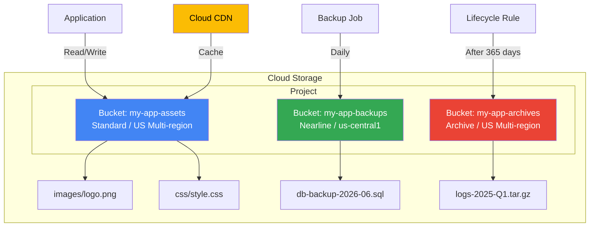
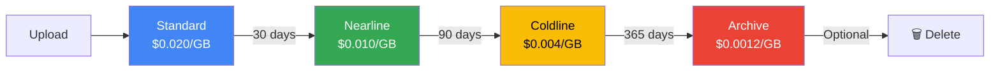

# Google Cloud Storage (GCS) — gsutil Command Reference

## Architecture Overview



## Object Lifecycle Management



> Lifecycle rules automate transitions. Set them via `gsutil lifecycle set lifecycle.json gs://BUCKET_NAME`.

---

## gsutil Command Structure

```bash
gsutil <command> <options>
gsutil <command> <options> <source> <target>
```

---

## Bucket Operations

### Create a Multi-Regional Bucket
```bash
gsutil mb -c MULTI_REGIONAL -l asia gs://YOUR_PROJECT_ID-multi
gsutil mb -l asia gs://$DEVSHELL_PROJECT_ID-multi-new
```

### Create a Regional Bucket
```bash
gsutil mb -c regional -l us-central1 gs://$DEVSHELL_PROJECT_ID-regional
```

### Create a Nearline Bucket (infrequent access, min 30-day storage)
```bash
gsutil mb -c nearline -l asia gs://$DEVSHELL_PROJECT_ID-nearline-multi-regional
```

### Create a Coldline Bucket (archival, min 90-day storage)
```bash
gsutil mb -c coldline -l us-central1 gs://$DEVSHELL_PROJECT_ID-coldline
```

### Create an Archive Bucket (long-term archival, min 365-day storage)
```bash
gsutil mb -c archive -l us-central1 gs://$DEVSHELL_PROJECT_ID-archive
```

### List All Buckets
```bash
gsutil ls
```

### Remove a Bucket (must be empty)
```bash
gsutil rb gs://$DEVSHELL_PROJECT_ID-multi-new
```

---

## Object Operations

### Copy a Local File to a Bucket
```bash
gsutil cp logfile0603.txt gs://YOUR_BUCKET_NAME/
```

### Copy an Object from Bucket to Local
```bash
gsutil cp gs://YOUR_BUCKET_NAME/logfile0603.txt .
```

### Copy Objects Between Buckets
```bash
gsutil cp gs://SOURCE_BUCKET/logfile0603.txt gs://DEST_BUCKET/
```

### List Objects in a Bucket
```bash
gsutil ls gs://YOUR_BUCKET_NAME/
```

### Delete an Object
```bash
gsutil rm gs://YOUR_BUCKET_NAME/logfile0603.txt
```

### Synchronize a Local Directory to a Bucket
```bash
gsutil rsync -r ./local-folder gs://YOUR_BUCKET_NAME/
```

---

## IAM & Service Account for GCS Access

### Create a Service Account
```bash
gcloud iam service-accounts create instancestorage \
    --display-name="Instance to Storage"
```

### Create a Key for the Service Account
```bash
gcloud iam service-accounts keys create key.json \
    --iam-account=instancestorage@YOUR_PROJECT_ID.iam.gserviceaccount.com
```

### Grant Storage Viewer Role to the Service Account
```bash
gcloud projects add-iam-policy-binding YOUR_PROJECT_ID \
    --member=serviceAccount:instancestorage@YOUR_PROJECT_ID.iam.gserviceaccount.com \
    --role=roles/storage.objectViewer
```

### Activate the Service Account
```bash
gcloud auth activate-service-account \
    instancestorage@YOUR_PROJECT_ID.iam.gserviceaccount.com \
    --key-file=key.json
```

### Verify Access
```bash
gsutil ls
gsutil ls gs://YOUR_BUCKET_NAME/
```

---

## Storage Classes Reference

| Class | Use Case | Min Storage Duration | Retrieval Cost |
|-------|----------|---------------------|----------------|
| Standard | Frequently accessed data | None | None |
| Nearline | Access < once/month | 30 days | Yes |
| Coldline | Access < once/quarter | 90 days | Yes |
| Archive | Rarely accessed (<once/year) | 365 days | Yes |

---

## Lifecycle Management

Automate storage class transitions and object deletion:

```json
// lifecycle.json
{
  "rule": [
    {
      "action": {"type": "SetStorageClass", "storageClass": "NEARLINE"},
      "condition": {"age": 30, "matchesStorageClass": ["STANDARD"]}
    },
    {
      "action": {"type": "SetStorageClass", "storageClass": "COLDLINE"},
      "condition": {"age": 90, "matchesStorageClass": ["NEARLINE"]}
    },
    {
      "action": {"type": "Delete"},
      "condition": {"age": 365}
    }
  ]
}
```

```bash
# Apply lifecycle rules
gsutil lifecycle set lifecycle.json gs://YOUR_BUCKET_NAME

# View current lifecycle rules
gsutil lifecycle get gs://YOUR_BUCKET_NAME
```

---

## Object Versioning

Keep historical versions of objects (useful for backup/recovery):

```bash
# Enable versioning
gsutil versioning set on gs://YOUR_BUCKET_NAME

# Check versioning status
gsutil versioning get gs://YOUR_BUCKET_NAME

# List all versions of objects
gsutil ls -a gs://YOUR_BUCKET_NAME/

# Restore a previous version (copy it as the current version)
gsutil cp gs://YOUR_BUCKET_NAME/file.txt#VERSION_NUMBER gs://YOUR_BUCKET_NAME/file.txt
```

---

## Signed URLs (Temporary Access)

Generate a time-limited URL for unauthenticated access:

```bash
# Generate a signed URL valid for 1 hour
gsutil signurl -d 1h key.json gs://YOUR_BUCKET_NAME/report.pdf
```

---

## Make a Bucket Public (Static Website Hosting)

```bash
# Make all objects publicly readable
gsutil iam ch allUsers:objectViewer gs://YOUR_BUCKET_NAME

# Set index and error pages
gsutil web set -m index.html -e 404.html gs://YOUR_BUCKET_NAME

# Access at: https://storage.googleapis.com/YOUR_BUCKET_NAME/index.html
```

---

## References

- [Cloud Storage documentation](https://cloud.google.com/storage/docs)
- [gsutil tool reference](https://cloud.google.com/storage/docs/gsutil)
- [Object lifecycle management](https://cloud.google.com/storage/docs/lifecycle)
- [Signed URLs](https://cloud.google.com/storage/docs/access-control/signed-urls)
