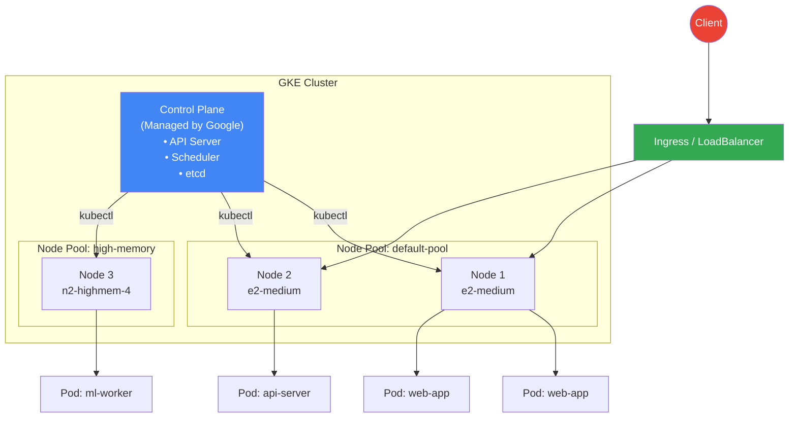
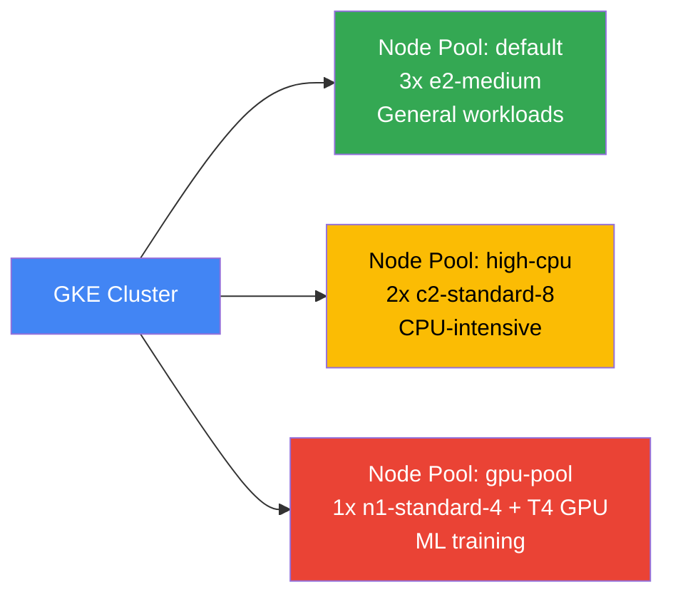
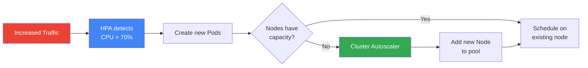
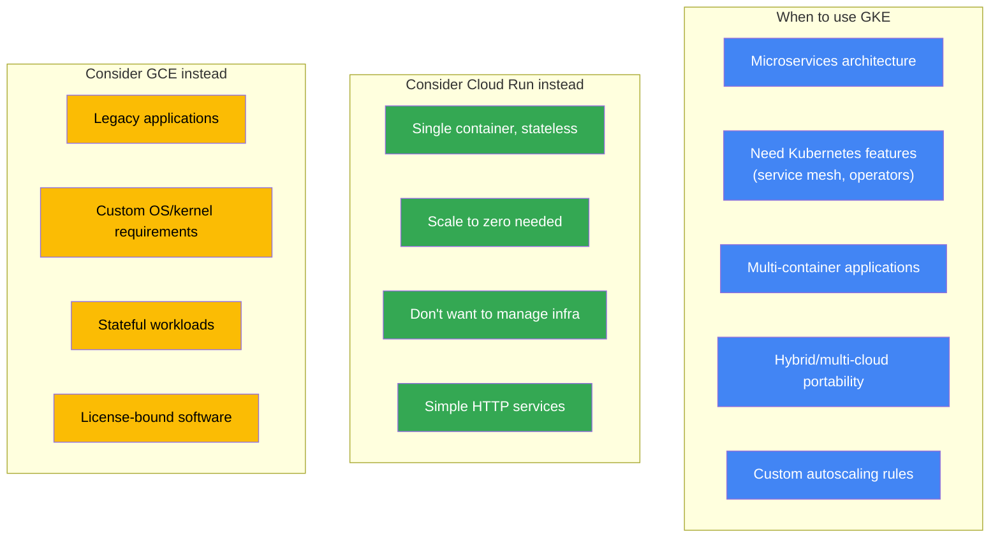

# Google Kubernetes Engine (GKE) — Complete Guide

<!-- workflow-diagram:start -->
## GKE Cluster Lifecycle Workflow

```mermaid
flowchart LR
    Plan["Platform requirements"] --> Mode{"Autopilot or Standard?"}
    subgraph Build["Cluster build"]
        Cluster["Create cluster"]
        Pools["Define node pools"]
        Network["Configure VPC-native networking"]
        Policy["Enable IAM, RBAC, policy"]
    end
    Mode --> Cluster
    Cluster --> Pools
    Pools --> Network
    Network --> Policy
    Policy --> Deploy["Deploy workloads"]
    Deploy --> Health{"Healthy rollout?"}
    Health -->|No| Rollback["Rollback / tune resources"]
    Rollback --> Deploy
    Health -->|Yes| Scale["Autoscale pods + nodes"]
    Scale --> Upgrade{"Upgrade due?"}
    Upgrade -->|Yes| Release["Upgrade control plane / node pools"]
    Release --> Validate["Run post-upgrade checks"]
    Upgrade -->|No| Observe["Observe cost + SLOs"]
    Validate --> Observe
    Observe --> Ready["Operate production cluster"]
    classDef start fill:#E3F2FD,stroke:#1E88E5,color:#0D47A1;
    classDef build fill:#E8F5E9,stroke:#43A047,color:#1B5E20;
    classDef ops fill:#FFF3E0,stroke:#FB8C00,color:#E65100;
    classDef finish fill:#F3E5F5,stroke:#8E24AA,color:#4A148C;
    class Plan,Mode start;
    class Cluster,Pools,Network,Policy,Deploy build;
    class Health,Rollback,Scale,Upgrade,Release,Validate,Observe ops;
    class Ready finish;
```

<!-- workflow-diagram:end -->

## Architecture



---

## Deep Dive Companion

- [GKE deep dive](./gke-deep-dive.md)

---

## Prerequisites

```bash
# Enable required APIs
gcloud services enable container.googleapis.com
gcloud services enable containerregistry.googleapis.com
gcloud services enable artifactregistry.googleapis.com

# Install kubectl
gcloud components install kubectl

# Set defaults
gcloud config set project YOUR_PROJECT_ID
gcloud config set compute/zone us-central1-a
```

---

## Cluster Operations

### Create a Standard Cluster

```bash
gcloud container clusters create my-cluster \
    --zone=us-central1-a \
    --num-nodes=3 \
    --machine-type=e2-medium \
    --disk-size=50GB \
    --enable-ip-alias \
    --release-channel=regular
```

### Create an Autopilot Cluster (Recommended for most workloads)

```bash
gcloud container clusters create-auto my-autopilot \
    --region=us-central1
```

> **Autopilot vs Standard**: Autopilot is fully managed — Google handles nodes, scaling, and security. You only define Pods.

### Get Cluster Credentials (connect kubectl)

```bash
gcloud container clusters get-credentials my-cluster --zone=us-central1-a
```

### List Clusters

```bash
gcloud container clusters list
```

### Describe a Cluster

```bash
gcloud container clusters describe my-cluster --zone=us-central1-a
```

### Resize a Cluster

```bash
gcloud container clusters resize my-cluster \
    --zone=us-central1-a \
    --num-nodes=5
```

### Delete a Cluster

```bash
gcloud container clusters delete my-cluster --zone=us-central1-a --quiet
```

---

## Node Pools



### Create a Node Pool

```bash
gcloud container node-pools create high-memory-pool \
    --cluster=my-cluster \
    --zone=us-central1-a \
    --machine-type=n2-highmem-4 \
    --num-nodes=2 \
    --enable-autoscaling \
    --min-nodes=1 \
    --max-nodes=5
```

### List Node Pools

```bash
gcloud container node-pools list --cluster=my-cluster --zone=us-central1-a
```

### Delete a Node Pool

```bash
gcloud container node-pools delete high-memory-pool \
    --cluster=my-cluster --zone=us-central1-a --quiet
```

---

## Deploying Applications

### Deploy with kubectl

```bash
# Create a deployment
kubectl create deployment nginx --image=nginx:latest --replicas=3

# Expose as a LoadBalancer service
kubectl expose deployment nginx --type=LoadBalancer --port=80 --target-port=80

# Check the external IP
kubectl get services nginx --watch
```

### Deploy from a YAML Manifest

```yaml
# deployment.yaml
apiVersion: apps/v1
kind: Deployment
metadata:
  name: web-app
spec:
  replicas: 3
  selector:
    matchLabels:
      app: web-app
  template:
    metadata:
      labels:
        app: web-app
    spec:
      containers:
      - name: web
        image: us-central1-docker.pkg.dev/PROJECT_ID/my-repo/web-app:v1
        ports:
        - containerPort: 8080
        resources:
          requests:
            cpu: "250m"
            memory: "128Mi"
          limits:
            cpu: "500m"
            memory: "256Mi"
---
apiVersion: v1
kind: Service
metadata:
  name: web-app-service
spec:
  type: LoadBalancer
  selector:
    app: web-app
  ports:
  - port: 80
    targetPort: 8080
```

```bash
kubectl apply -f deployment.yaml
```

### Rolling Update

```bash
# Update the image
kubectl set image deployment/web-app web=us-central1-docker.pkg.dev/PROJECT_ID/my-repo/web-app:v2

# Watch the rollout
kubectl rollout status deployment/web-app

# Rollback if needed
kubectl rollout undo deployment/web-app
```

---

## Autoscaling

### Horizontal Pod Autoscaler (HPA)

```bash
kubectl autoscale deployment web-app --min=2 --max=10 --cpu-percent=70
```

### Cluster Autoscaler

```bash
gcloud container clusters update my-cluster \
    --zone=us-central1-a \
    --enable-autoscaling \
    --min-nodes=1 \
    --max-nodes=10
```

### Scaling Flow



---

## Ingress (HTTP/S Load Balancing)

```yaml
# ingress.yaml
apiVersion: networking.k8s.io/v1
kind: Ingress
metadata:
  name: my-ingress
  annotations:
    kubernetes.io/ingress.class: "gce"
spec:
  rules:
  - host: myapp.example.com
    http:
      paths:
      - path: /
        pathType: Prefix
        backend:
          service:
            name: frontend
            port:
              number: 80
      - path: /api
        pathType: Prefix
        backend:
          service:
            name: backend-api
            port:
              number: 8080
```

```bash
kubectl apply -f ingress.yaml
kubectl get ingress my-ingress
```

---

## Push Image to Artifact Registry

```bash
# Create a repo
gcloud artifacts repositories create my-repo \
    --repository-format=docker --location=us-central1

# Authenticate Docker
gcloud auth configure-docker us-central1-docker.pkg.dev

# Build, tag, and push
docker build -t us-central1-docker.pkg.dev/PROJECT_ID/my-repo/my-app:v1 .
docker push us-central1-docker.pkg.dev/PROJECT_ID/my-repo/my-app:v1
```

---

## Useful kubectl Commands

| Command | Description |
|---------|-------------|
| `kubectl get pods` | List all pods |
| `kubectl get pods -o wide` | List pods with node and IP details |
| `kubectl describe pod POD_NAME` | Detailed pod info |
| `kubectl logs POD_NAME` | View pod logs |
| `kubectl logs -f POD_NAME` | Stream logs |
| `kubectl exec -it POD_NAME -- /bin/sh` | Shell into a pod |
| `kubectl get nodes` | List cluster nodes |
| `kubectl get services` | List services |
| `kubectl get deployments` | List deployments |
| `kubectl top pods` | Pod resource usage |
| `kubectl top nodes` | Node resource usage |
| `kubectl get events --sort-by=.metadata.creationTimestamp` | Recent events |
| `kubectl delete pod POD_NAME` | Delete a pod |
| `kubectl scale deployment NAME --replicas=5` | Scale a deployment |

---

## GKE vs Other Compute Options



---

## References

- [GKE documentation](https://cloud.google.com/kubernetes-engine/docs)
- [GKE Autopilot](https://cloud.google.com/kubernetes-engine/docs/concepts/autopilot-overview)
- [Best practices for GKE](https://cloud.google.com/kubernetes-engine/docs/best-practices)
