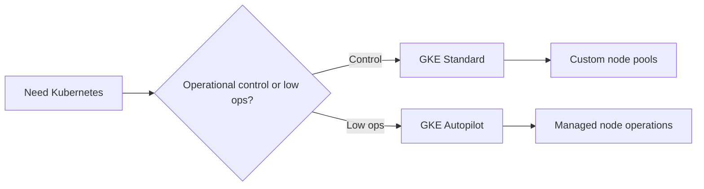
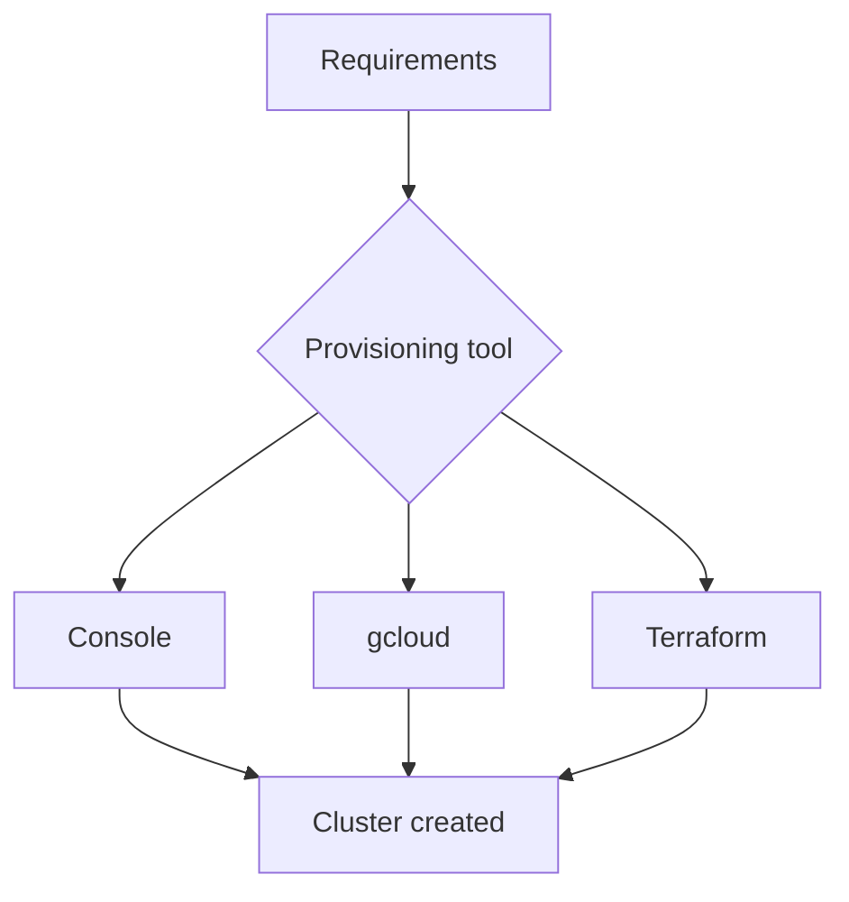
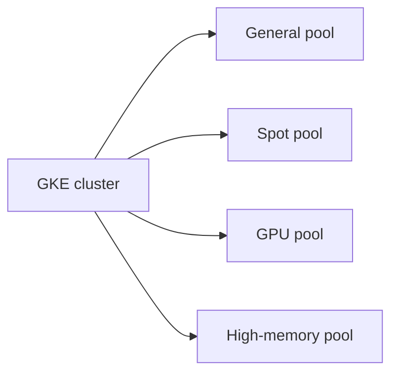
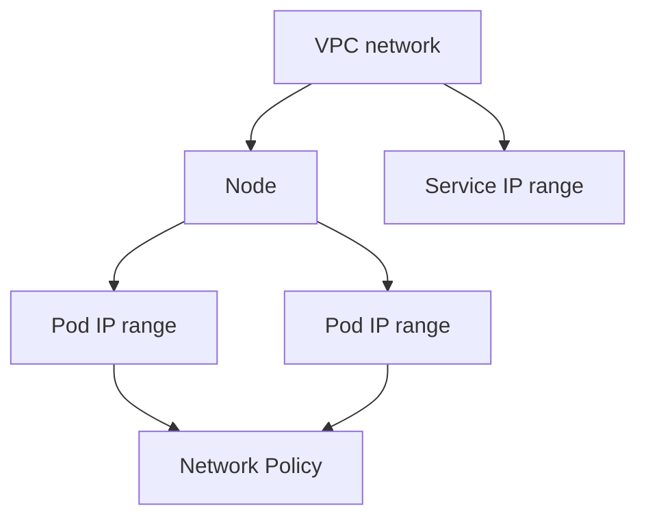
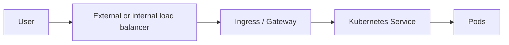
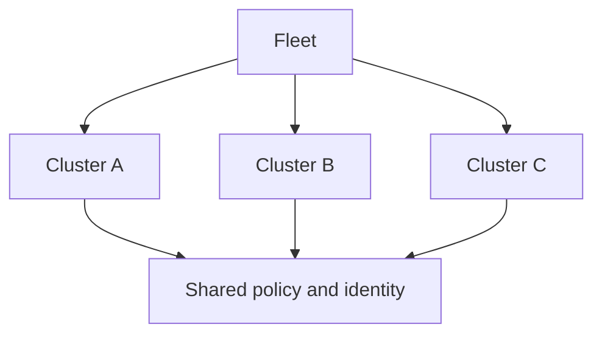

# GKE Deep Dive

> Comprehensive guide to Google Kubernetes Engine design, provisioning, security, networking, and multi-cluster operations.

## Table of Contents

1. [GKE Standard vs Autopilot](#gke-standard-vs-autopilot)
2. [Cluster creation](#cluster-creation)
3. [Node pools](#node-pools)
4. [Networking](#networking)
5. [Ingress and load balancing](#ingress-and-load-balancing)
6. [Artifact Registry integration](#artifact-registry-integration)
7. [Monitoring and observability](#monitoring-and-observability)
8. [Security deep dive](#security-deep-dive)
9. [Config Sync and Policy Controller](#config-sync-and-policy-controller)
10. [Fleet and multi-cluster](#fleet-and-multi-cluster)
11. [Operational playbooks](#operational-playbooks)
12. [Reference commands](#reference-commands)

## GKE Standard vs Autopilot

| Topic | Standard | Autopilot |
|---|---|---|
| Node management | Customer manages node pools | Google manages nodes |
| Flexibility | Highest | Opinionated guardrails |
| Operational overhead | Higher | Lower |
| Best fit | Platform teams and specialized workloads | Teams that want Kubernetes with less node management |
| Specialized node tuning | Strong | More constrained |



### Standard clusters

- Choose Standard when you need custom node pools, daemonsets, GPUs, or deeper control of capacity planning.
- Review question: what problem is Kubernetes solving here that Cloud Run or App Engine would not?

### Autopilot clusters

- Choose Autopilot when application teams want Kubernetes APIs but do not want to manage most node operations.
- Review question: what problem is Kubernetes solving here that Cloud Run or App Engine would not?

### Mixed estate

- Many organizations use both: Autopilot for general workloads and Standard for specialized platform needs.
- Review question: what problem is Kubernetes solving here that Cloud Run or App Engine would not?

### Platform ownership

- The cluster mode should match who will own upgrades, capacity, and policy exceptions.
- Review question: what problem is Kubernetes solving here that Cloud Run or App Engine would not?

## Cluster creation

### Console

The console is useful for discovery and one-off learning, but production teams usually standardize on `gcloud` or Terraform for repeatability.

### gcloud

```bash
gcloud container clusters create platform-standard   --region us-central1   --release-channel regular   --enable-ip-alias   --num-nodes 3

gcloud container clusters create-auto platform-autopilot   --region us-central1
```

### Terraform

```hcl
resource "google_container_cluster" "standard" {
  name     = "platform-standard"
  location = "us-central1"
  remove_default_node_pool = true
  initial_node_count       = 1
  networking_mode          = "VPC_NATIVE"
}
```



### Environment consistency

- Use infrastructure as code for every long-lived environment.
- Delivery question: can a new environment be created without manual console-only steps?

### Release channels

- Choose a release channel that fits your organization's appetite for upgrades and stability.
- Delivery question: can a new environment be created without manual console-only steps?

### Regional design

- Regional clusters improve availability, but cost and architecture should still be evaluated deliberately.
- Delivery question: can a new environment be created without manual console-only steps?

### Bootstrap process

- Define how namespaces, RBAC, policies, and observability are applied immediately after cluster creation.
- Delivery question: can a new environment be created without manual console-only steps?

## Node pools

Node pools let Standard clusters separate workloads by machine type, autoscaling behavior, and scheduling constraints.

### Common node pool patterns

- General-purpose pool for web and API workloads
- Spot or preemptible pool for cost-sensitive batch work
- GPU pool for ML training or inference
- High-memory pool for JVM or cache-heavy applications



### Spot and preemptible nodes

- Excellent for stateless and interruptible workloads, but only when rescheduling is acceptable.
- Capacity question: what happens when the preferred pool cannot scale due to quota or regional pressure?

### GPU node pools

- Reserve GPU pools for workloads that explicitly need them and keep admission and scheduling rules clear.
- Capacity question: what happens when the preferred pool cannot scale due to quota or regional pressure?

### Autoscaling bounds

- Set node autoscaling limits based on quotas, budget, and downstream dependency capacity.
- Capacity question: what happens when the preferred pool cannot scale due to quota or regional pressure?

### Scheduling controls

- Use taints, tolerations, affinity, and labels to keep specialized workloads on the correct nodes.
- Capacity question: what happens when the preferred pool cannot scale due to quota or regional pressure?

### Upgrade strategy

- Plan node pool upgrades and surge behavior so production disruption remains controlled.
- Capacity question: what happens when the preferred pool cannot scale due to quota or regional pressure?

## Networking

GKE networking design spans VPC-native alias IPs, CNI behavior, network policy, service exposure, and east-west segmentation.

### VPC-native clusters

VPC-native clusters use alias IP ranges for Pods and Services. This is the recommended baseline for modern GKE deployments.

### Network Policy

Use Network Policy to reduce east-west exposure between namespaces and workloads. Treat it as a default security layer rather than an optional afterthought.

### Dataplane v2

Dataplane v2 improves observability and enforcement behavior for many clusters and is worth evaluating as part of the cluster baseline.



### Pod CIDR planning

- Plan Pod and Service IP ranges early so future clusters and shared VPC patterns do not collide.
- Review prompt: which team owns this network decision and its incident response path?

### Network segmentation

- Combine namespaces, network policy, and environment separation instead of relying on only one layer.
- Review prompt: which team owns this network decision and its incident response path?

### Egress control

- Know which workloads require internet egress, private Google access, or hybrid network paths.
- Review prompt: which team owns this network decision and its incident response path?

### DNS behavior

- DNS design and failure visibility matter as much as raw connectivity in Kubernetes environments.
- Review prompt: which team owns this network decision and its incident response path?

### Shared VPC

- When multiple teams share a VPC, document who owns subnet, firewall, and route changes.
- Review prompt: which team owns this network decision and its incident response path?

## Ingress and load balancing

GKE supports several ingress patterns, including external HTTP(S), internal HTTP(S), and multi-cluster approaches.

### Key options

- External ingress for public applications
- Internal ingress for private enterprise applications
- Multi-cluster ingress for globally distributed architectures
- Gateway API adoption where platform standards require it



### External ingress

- Use it for internet-facing applications with explicit TLS, certificate, and security controls.
- Design check: is there one clearly approved path for exposing applications, or many inconsistent ones?

### Internal ingress

- Prefer it for private portals, APIs, and back-office applications.
- Design check: is there one clearly approved path for exposing applications, or many inconsistent ones?

### Multi-cluster ingress

- Adopt only when regional resiliency or global routing needs justify the added complexity.
- Design check: is there one clearly approved path for exposing applications, or many inconsistent ones?

### Ingress ownership

- Clarify whether the platform team or app team owns certificates, DNS, and frontend policies.
- Design check: is there one clearly approved path for exposing applications, or many inconsistent ones?

### Service exposure

- Do not expose `LoadBalancer` Services casually when an ingress standard already exists.
- Design check: is there one clearly approved path for exposing applications, or many inconsistent ones?

## Artifact Registry integration

Artifact Registry should be the standard source of container images for GKE.

### Integration goals

- Centralized image storage and IAM control
- Optional scanning and attestation workflows
- Promotion by tag or digest across environments
- Clear separation between platform base images and application images

### Digest pinning

- Deploy by digest for stronger reproducibility in high-control environments.
- Governance question: who approves a new base image and how is it rolled out safely?

### Image promotion

- Promote the same tested image between dev, test, and prod whenever possible.
- Governance question: who approves a new base image and how is it rolled out safely?

### Repository strategy

- Use regional repositories and ownership boundaries that match platform responsibilities.
- Governance question: who approves a new base image and how is it rolled out safely?

### Admission control

- Pair Artifact Registry with Binary Authorization or other policy checks where supply chain risk matters.
- Governance question: who approves a new base image and how is it rolled out safely?

## Monitoring and observability

GKE observability spans infrastructure, control plane, node health, workload health, logs, metrics, events, traces, and SLOs.

### Core signal groups

- Cluster availability and control plane health
- Node health, pressure, and upgrade behavior
- Pod restarts, OOMs, scheduling failures, and readiness
- Request latency and application-level errors
- Cost, resource waste, and quota trends

### Cluster dashboards

- Separate cluster health from application health so operators know where the problem actually lives.
- Review cadence: include this area in cluster operations review meetings.

### Namespace visibility

- Dashboards should break down workload health by team or namespace ownership.
- Review cadence: include this area in cluster operations review meetings.

### Events and restarts

- Kubernetes events and restart patterns often explain incidents faster than node CPU graphs alone.
- Review cadence: include this area in cluster operations review meetings.

### SLOs

- Tie alerts to user-facing outcomes rather than paging on every transient node warning.
- Review cadence: include this area in cluster operations review meetings.

### Cost reviews

- Regularly compare requested versus used resources to control waste.
- Review cadence: include this area in cluster operations review meetings.

## Security deep dive

GKE security is layered: IAM, RBAC, Workload Identity, network policy, image governance, node hardening, sandboxing, and admission controls all matter.

### Requested focus areas

- Workload Identity
- Binary Authorization
- GKE Sandbox
- Node and control plane hardening
- Secret and config management discipline

### Workload Identity

- Prefer Workload Identity over node-wide or key-based credentials so Pods assume the least privilege they need.
- Control question: what evidence proves this control is active and tested?

### Binary Authorization

- Use policy gates to control which images may be deployed to high-trust clusters.
- Control question: what evidence proves this control is active and tested?

### GKE Sandbox

- Use sandboxing for workloads that justify stronger runtime isolation boundaries.
- Control question: what evidence proves this control is active and tested?

### RBAC hygiene

- Namespace admins, cluster admins, and workload operators should not all share the same broad role.
- Control question: what evidence proves this control is active and tested?

### Secret handling

- Use Secret Manager integrations or Kubernetes secrets carefully, with rotation and auditability in mind.
- Control question: what evidence proves this control is active and tested?

### Node hardening

- Patch cadence, metadata exposure, and SSH posture still matter even in managed clusters.
- Control question: what evidence proves this control is active and tested?

## Config Sync and Policy Controller

Config Sync and Policy Controller help organizations manage configuration and policy as code across clusters.

### Config Sync

- Use it to standardize namespaces, RBAC baselines, network policy scaffolding, and other platform objects.
- Platform question: can teams understand why a policy failed from the feedback they receive?

### Policy Controller

- Use constraint templates and policies to block unsafe deployment patterns before they land in clusters.
- Platform question: can teams understand why a policy failed from the feedback they receive?

### GitOps ownership

- Document which repository and team own the source of truth for cluster-wide policy.
- Platform question: can teams understand why a policy failed from the feedback they receive?

### Exception flow

- A good policy platform defines how exceptions are approved and expired, not only how they are denied.
- Platform question: can teams understand why a policy failed from the feedback they receive?

## Fleet and multi-cluster

Fleet concepts help coordinate policy, identity, and service behavior across multiple clusters.



### Fleet membership

- Use fleets to centralize policy and identity for clusters that should behave as one platform.
- Review prompt: what operational burden does multi-cluster add, and is the business need strong enough?

### Multi-cluster services

- Adopt only when cross-region or cross-cluster service availability justifies the added complexity.
- Review prompt: what operational burden does multi-cluster add, and is the business need strong enough?

### Config consistency

- The value of a fleet comes from consistency, not just from registering clusters.
- Review prompt: what operational burden does multi-cluster add, and is the business need strong enough?

### Team boundaries

- Clarify who owns shared platform policy versus cluster-specific workload choices.
- Review prompt: what operational burden does multi-cluster add, and is the business need strong enough?

## Operational playbooks

### Shared platform cluster

- Summary: Platform team owns cluster lifecycle while app teams own namespaces and workloads.
- Checklist:

- Use GitOps for baseline config
- Define ingress standard
- Review quota and cost by namespace
- Exit criteria: the cluster pattern is repeatable, observable, and supportable.

### Autopilot application cluster

- Summary: Application teams use Kubernetes APIs with minimal node operations.
- Checklist:

- Keep workloads within Autopilot guardrails
- Use Workload Identity
- Standardize dashboards early
- Exit criteria: the cluster pattern is repeatable, observable, and supportable.

### GPU workload cluster

- Summary: Specialized pool for ML or inference tasks.
- Checklist:

- Reserve quota carefully
- Use node taints and affinities
- Control image size and startup paths
- Exit criteria: the cluster pattern is repeatable, observable, and supportable.

### Regulated production cluster

- Summary: High-trust environment with strong policy and evidence requirements.
- Checklist:

- Binary Authorization or equivalent
- Strict RBAC and namespace boundaries
- Detailed audit trails
- Exit criteria: the cluster pattern is repeatable, observable, and supportable.

### Spot-heavy batch cluster

- Summary: Cost-optimized environment for interruption-tolerant workloads.
- Checklist:

- Checkpoint work
- Test node loss
- Keep retries and queueing explicit
- Exit criteria: the cluster pattern is repeatable, observable, and supportable.

### Multi-region service platform

- Summary: Use multiple clusters when resilience or geography requires it.
- Checklist:

- Plan global ingress
- Practice failover
- Document fleet ownership
- Exit criteria: the cluster pattern is repeatable, observable, and supportable.

## Reference commands

```bash
gcloud container clusters list
gcloud container clusters get-credentials platform-standard --region us-central1
gcloud container node-pools list --cluster platform-standard --region us-central1
kubectl get nodes
kubectl get pods -A
kubectl top nodes
```

### Appendix: Cluster Bootstrap

- Which team owns this decision?
- What failure mode appears if it is neglected?
- Which control or runbook covers it today?
- What evidence proves the control works?

### Appendix: Release Channel Review

- Which team owns this decision?
- What failure mode appears if it is neglected?
- Which control or runbook covers it today?
- What evidence proves the control works?

### Appendix: Node Pool Capacity

- Which team owns this decision?
- What failure mode appears if it is neglected?
- Which control or runbook covers it today?
- What evidence proves the control works?

### Appendix: Network Segmentation

- Which team owns this decision?
- What failure mode appears if it is neglected?
- Which control or runbook covers it today?
- What evidence proves the control works?

### Appendix: Ingress Ownership

- Which team owns this decision?
- What failure mode appears if it is neglected?
- Which control or runbook covers it today?
- What evidence proves the control works?

### Appendix: Artifact Promotion

- Which team owns this decision?
- What failure mode appears if it is neglected?
- Which control or runbook covers it today?
- What evidence proves the control works?

### Appendix: Rbac Audit

- Which team owns this decision?
- What failure mode appears if it is neglected?
- Which control or runbook covers it today?
- What evidence proves the control works?

### Appendix: Policy Exception Flow

- Which team owns this decision?
- What failure mode appears if it is neglected?
- Which control or runbook covers it today?
- What evidence proves the control works?

### Appendix: Fleet Governance

- Which team owns this decision?
- What failure mode appears if it is neglected?
- Which control or runbook covers it today?
- What evidence proves the control works?

### Appendix: Cost Review

- Which team owns this decision?
- What failure mode appears if it is neglected?
- Which control or runbook covers it today?
- What evidence proves the control works?

### Appendix: Upgrade Rehearsal

- Which team owns this decision?
- What failure mode appears if it is neglected?
- Which control or runbook covers it today?
- What evidence proves the control works?

### Appendix: Disaster Recovery Drill

- Which team owns this decision?
- What failure mode appears if it is neglected?
- Which control or runbook covers it today?
- What evidence proves the control works?

### Appendix: Namespace Onboarding

- Which team owns this decision?
- What failure mode appears if it is neglected?
- Which control or runbook covers it today?
- What evidence proves the control works?

### Appendix: Service Account Hygiene

- Which team owns this decision?
- What failure mode appears if it is neglected?
- Which control or runbook covers it today?
- What evidence proves the control works?

### Appendix: Sandbox Adoption

- Which team owns this decision?
- What failure mode appears if it is neglected?
- Which control or runbook covers it today?
- What evidence proves the control works?

### Appendix: Gpu Quota Plan

- Which team owns this decision?
- What failure mode appears if it is neglected?
- Which control or runbook covers it today?
- What evidence proves the control works?

### Appendix: Spot Interruption Handling

- Which team owns this decision?
- What failure mode appears if it is neglected?
- Which control or runbook covers it today?
- What evidence proves the control works?

### Appendix: Observability Standards

- Which team owns this decision?
- What failure mode appears if it is neglected?
- Which control or runbook covers it today?
- What evidence proves the control works?

## Expanded design review library

### Review card 1: Regional production cluster

- What cluster mode or policy choice is the main decision here?
- Which team owns the operational burden of that choice?
- What failure mode appears first if the choice is wrong?
- Which dashboard or runbook proves this design is healthy?

### Review card 2: Single-zone dev cluster

- What cluster mode or policy choice is the main decision here?
- Which team owns the operational burden of that choice?
- What failure mode appears first if the choice is wrong?
- Which dashboard or runbook proves this design is healthy?

### Review card 3: Autopilot application team

- What cluster mode or policy choice is the main decision here?
- Which team owns the operational burden of that choice?
- What failure mode appears first if the choice is wrong?
- Which dashboard or runbook proves this design is healthy?

### Review card 4: Shared platform Standard cluster

- What cluster mode or policy choice is the main decision here?
- Which team owns the operational burden of that choice?
- What failure mode appears first if the choice is wrong?
- Which dashboard or runbook proves this design is healthy?

### Review card 5: GPU inference cluster

- What cluster mode or policy choice is the main decision here?
- Which team owns the operational burden of that choice?
- What failure mode appears first if the choice is wrong?
- Which dashboard or runbook proves this design is healthy?

### Review card 6: Spot-heavy batch cluster

- What cluster mode or policy choice is the main decision here?
- Which team owns the operational burden of that choice?
- What failure mode appears first if the choice is wrong?
- Which dashboard or runbook proves this design is healthy?

### Review card 7: Regulated workload cluster

- What cluster mode or policy choice is the main decision here?
- Which team owns the operational burden of that choice?
- What failure mode appears first if the choice is wrong?
- Which dashboard or runbook proves this design is healthy?

### Review card 8: Internal-only service platform

- What cluster mode or policy choice is the main decision here?
- Which team owns the operational burden of that choice?
- What failure mode appears first if the choice is wrong?
- Which dashboard or runbook proves this design is healthy?

### Review card 9: Public ingress platform

- What cluster mode or policy choice is the main decision here?
- Which team owns the operational burden of that choice?
- What failure mode appears first if the choice is wrong?
- Which dashboard or runbook proves this design is healthy?

### Review card 10: Multi-region fleet

- What cluster mode or policy choice is the main decision here?
- Which team owns the operational burden of that choice?
- What failure mode appears first if the choice is wrong?
- Which dashboard or runbook proves this design is healthy?

### Review card 11: Shared VPC environment

- What cluster mode or policy choice is the main decision here?
- Which team owns the operational burden of that choice?
- What failure mode appears first if the choice is wrong?
- Which dashboard or runbook proves this design is healthy?

### Review card 12: Namespace tenancy model

- What cluster mode or policy choice is the main decision here?
- Which team owns the operational burden of that choice?
- What failure mode appears first if the choice is wrong?
- Which dashboard or runbook proves this design is healthy?

### Review card 13: Binary Authorization rollout

- What cluster mode or policy choice is the main decision here?
- Which team owns the operational burden of that choice?
- What failure mode appears first if the choice is wrong?
- Which dashboard or runbook proves this design is healthy?

### Review card 14: Workload Identity migration

- What cluster mode or policy choice is the main decision here?
- Which team owns the operational burden of that choice?
- What failure mode appears first if the choice is wrong?
- Which dashboard or runbook proves this design is healthy?

### Review card 15: Network policy baseline

- What cluster mode or policy choice is the main decision here?
- Which team owns the operational burden of that choice?
- What failure mode appears first if the choice is wrong?
- Which dashboard or runbook proves this design is healthy?

### Review card 16: Dataplane v2 evaluation

- What cluster mode or policy choice is the main decision here?
- Which team owns the operational burden of that choice?
- What failure mode appears first if the choice is wrong?
- Which dashboard or runbook proves this design is healthy?

### Review card 17: Artifact promotion control

- What cluster mode or policy choice is the main decision here?
- Which team owns the operational burden of that choice?
- What failure mode appears first if the choice is wrong?
- Which dashboard or runbook proves this design is healthy?

### Review card 18: Ingress ownership model

- What cluster mode or policy choice is the main decision here?
- Which team owns the operational burden of that choice?
- What failure mode appears first if the choice is wrong?
- Which dashboard or runbook proves this design is healthy?

### Review card 19: Cost-optimized sandbox cluster

- What cluster mode or policy choice is the main decision here?
- Which team owns the operational burden of that choice?
- What failure mode appears first if the choice is wrong?
- Which dashboard or runbook proves this design is healthy?

### Review card 20: Disaster recovery standby cluster

- What cluster mode or policy choice is the main decision here?
- Which team owns the operational burden of that choice?
- What failure mode appears first if the choice is wrong?
- Which dashboard or runbook proves this design is healthy?

### Review card 21: Platform SRE handoff

- What cluster mode or policy choice is the main decision here?
- Which team owns the operational burden of that choice?
- What failure mode appears first if the choice is wrong?
- Which dashboard or runbook proves this design is healthy?

### Review card 22: Node pool specialization

- What cluster mode or policy choice is the main decision here?
- Which team owns the operational burden of that choice?
- What failure mode appears first if the choice is wrong?
- Which dashboard or runbook proves this design is healthy?

### Review card 23: Config Sync bootstrap

- What cluster mode or policy choice is the main decision here?
- Which team owns the operational burden of that choice?
- What failure mode appears first if the choice is wrong?
- Which dashboard or runbook proves this design is healthy?

### Review card 24: Policy Controller adoption

- What cluster mode or policy choice is the main decision here?
- Which team owns the operational burden of that choice?
- What failure mode appears first if the choice is wrong?
- Which dashboard or runbook proves this design is healthy?

### Review card 25: Release channel strategy

- What cluster mode or policy choice is the main decision here?
- Which team owns the operational burden of that choice?
- What failure mode appears first if the choice is wrong?
- Which dashboard or runbook proves this design is healthy?

### Review card 26: Cluster autoscaling limits

- What cluster mode or policy choice is the main decision here?
- Which team owns the operational burden of that choice?
- What failure mode appears first if the choice is wrong?
- Which dashboard or runbook proves this design is healthy?

### Review card 27: Hybrid network dependency

- What cluster mode or policy choice is the main decision here?
- Which team owns the operational burden of that choice?
- What failure mode appears first if the choice is wrong?
- Which dashboard or runbook proves this design is healthy?

### Review card 28: Service mesh consideration

- What cluster mode or policy choice is the main decision here?
- Which team owns the operational burden of that choice?
- What failure mode appears first if the choice is wrong?
- Which dashboard or runbook proves this design is healthy?

### Review card 29: Cluster upgrade rehearsal

- What cluster mode or policy choice is the main decision here?
- Which team owns the operational burden of that choice?
- What failure mode appears first if the choice is wrong?
- Which dashboard or runbook proves this design is healthy?

### Review card 30: Private registry governance

- What cluster mode or policy choice is the main decision here?
- Which team owns the operational burden of that choice?
- What failure mode appears first if the choice is wrong?
- Which dashboard or runbook proves this design is healthy?

## Appendix: Networking and security prompts

### Prompt 1: Pod CIDR planning

- Which control currently governs this area?
- How is it tested after upgrades or environment changes?
- What incident evidence should responders collect if it fails?

### Prompt 2: Service CIDR planning

- Which control currently governs this area?
- How is it tested after upgrades or environment changes?
- What incident evidence should responders collect if it fails?

### Prompt 3: Namespace segmentation

- Which control currently governs this area?
- How is it tested after upgrades or environment changes?
- What incident evidence should responders collect if it fails?

### Prompt 4: Ingress consistency

- Which control currently governs this area?
- How is it tested after upgrades or environment changes?
- What incident evidence should responders collect if it fails?

### Prompt 5: Internal load balancing

- Which control currently governs this area?
- How is it tested after upgrades or environment changes?
- What incident evidence should responders collect if it fails?

### Prompt 6: External load balancing

- Which control currently governs this area?
- How is it tested after upgrades or environment changes?
- What incident evidence should responders collect if it fails?

### Prompt 7: Firewall ownership

- Which control currently governs this area?
- How is it tested after upgrades or environment changes?
- What incident evidence should responders collect if it fails?

### Prompt 8: Shared VPC change control

- Which control currently governs this area?
- How is it tested after upgrades or environment changes?
- What incident evidence should responders collect if it fails?

### Prompt 9: DNS failure visibility

- Which control currently governs this area?
- How is it tested after upgrades or environment changes?
- What incident evidence should responders collect if it fails?

### Prompt 10: Private service access

- Which control currently governs this area?
- How is it tested after upgrades or environment changes?
- What incident evidence should responders collect if it fails?

### Prompt 11: Workload Identity binding

- Which control currently governs this area?
- How is it tested after upgrades or environment changes?
- What incident evidence should responders collect if it fails?

### Prompt 12: RBAC recertification

- Which control currently governs this area?
- How is it tested after upgrades or environment changes?
- What incident evidence should responders collect if it fails?

### Prompt 13: Secret rotation

- Which control currently governs this area?
- How is it tested after upgrades or environment changes?
- What incident evidence should responders collect if it fails?

### Prompt 14: Node metadata exposure

- Which control currently governs this area?
- How is it tested after upgrades or environment changes?
- What incident evidence should responders collect if it fails?

### Prompt 15: Sandbox suitability

- Which control currently governs this area?
- How is it tested after upgrades or environment changes?
- What incident evidence should responders collect if it fails?

### Prompt 16: Image provenance

- Which control currently governs this area?
- How is it tested after upgrades or environment changes?
- What incident evidence should responders collect if it fails?

### Prompt 17: Admission policy feedback

- Which control currently governs this area?
- How is it tested after upgrades or environment changes?
- What incident evidence should responders collect if it fails?

### Prompt 18: Per-namespace quotas

- Which control currently governs this area?
- How is it tested after upgrades or environment changes?
- What incident evidence should responders collect if it fails?

### Prompt 19: Admin surface reduction

- Which control currently governs this area?
- How is it tested after upgrades or environment changes?
- What incident evidence should responders collect if it fails?

### Prompt 20: Third-party egress review

- Which control currently governs this area?
- How is it tested after upgrades or environment changes?
- What incident evidence should responders collect if it fails?

## Appendix: Troubleshooting cards

### Troubleshooting card 1: Pod pending due to quota

- What symptom will users or operators see first?
- Which Kubernetes or Google Cloud signal should be checked first?
- What long-term fix should be captured in platform standards?

### Troubleshooting card 2: Pod pending due to affinity

- What symptom will users or operators see first?
- Which Kubernetes or Google Cloud signal should be checked first?
- What long-term fix should be captured in platform standards?

### Troubleshooting card 3: Image pull failure

- What symptom will users or operators see first?
- Which Kubernetes or Google Cloud signal should be checked first?
- What long-term fix should be captured in platform standards?

### Troubleshooting card 4: CrashLoopBackOff

- What symptom will users or operators see first?
- Which Kubernetes or Google Cloud signal should be checked first?
- What long-term fix should be captured in platform standards?

### Troubleshooting card 5: Node pressure

- What symptom will users or operators see first?
- Which Kubernetes or Google Cloud signal should be checked first?
- What long-term fix should be captured in platform standards?

### Troubleshooting card 6: Failed rollout

- What symptom will users or operators see first?
- Which Kubernetes or Google Cloud signal should be checked first?
- What long-term fix should be captured in platform standards?

### Troubleshooting card 7: Ingress 502

- What symptom will users or operators see first?
- Which Kubernetes or Google Cloud signal should be checked first?
- What long-term fix should be captured in platform standards?

### Troubleshooting card 8: Internal DNS issue

- What symptom will users or operators see first?
- Which Kubernetes or Google Cloud signal should be checked first?
- What long-term fix should be captured in platform standards?

### Troubleshooting card 9: Network policy deny

- What symptom will users or operators see first?
- Which Kubernetes or Google Cloud signal should be checked first?
- What long-term fix should be captured in platform standards?

### Troubleshooting card 10: Autopilot resource rejection

- What symptom will users or operators see first?
- Which Kubernetes or Google Cloud signal should be checked first?
- What long-term fix should be captured in platform standards?

### Troubleshooting card 11: GPU scheduling failure

- What symptom will users or operators see first?
- Which Kubernetes or Google Cloud signal should be checked first?
- What long-term fix should be captured in platform standards?

### Troubleshooting card 12: Binary Authorization block

- What symptom will users or operators see first?
- Which Kubernetes or Google Cloud signal should be checked first?
- What long-term fix should be captured in platform standards?

### Troubleshooting card 13: Config Sync drift

- What symptom will users or operators see first?
- Which Kubernetes or Google Cloud signal should be checked first?
- What long-term fix should be captured in platform standards?

### Troubleshooting card 14: Policy Controller violation

- What symptom will users or operators see first?
- Which Kubernetes or Google Cloud signal should be checked first?
- What long-term fix should be captured in platform standards?

### Troubleshooting card 15: Workload Identity error

- What symptom will users or operators see first?
- Which Kubernetes or Google Cloud signal should be checked first?
- What long-term fix should be captured in platform standards?

### Troubleshooting card 16: Slow cluster autoscaling

- What symptom will users or operators see first?
- Which Kubernetes or Google Cloud signal should be checked first?
- What long-term fix should be captured in platform standards?

### Troubleshooting card 17: Spot interruption storm

- What symptom will users or operators see first?
- Which Kubernetes or Google Cloud signal should be checked first?
- What long-term fix should be captured in platform standards?

### Troubleshooting card 18: Regional control plane event

- What symptom will users or operators see first?
- Which Kubernetes or Google Cloud signal should be checked first?
- What long-term fix should be captured in platform standards?

### Troubleshooting card 19: Namespace cost spike

- What symptom will users or operators see first?
- Which Kubernetes or Google Cloud signal should be checked first?
- What long-term fix should be captured in platform standards?

### Troubleshooting card 20: Unexpected egress path

- What symptom will users or operators see first?
- Which Kubernetes or Google Cloud signal should be checked first?
- What long-term fix should be captured in platform standards?

## FAQ

### Should every containerized workload run on GKE?

No. Many workloads are simpler on Cloud Run. Use GKE when Kubernetes-level control adds clear value.

### When is Autopilot the best choice?

When teams want Kubernetes APIs without managing most node operations.

### When is Standard the best choice?

When you need specialized node pools, deeper cluster control, or advanced Kubernetes features.

### Why does Workload Identity matter so much?

It reduces credential sprawl and maps Pod identity to the least privilege needed.

### Do I need multi-cluster by default?

No. Only adopt it when resiliency, geography, or platform separation clearly justify the overhead.

### What is the biggest GKE anti-pattern?

Running clusters without a clear ownership model for upgrades, policy, networking, and observability.

### How should teams control cost?

Review requested versus used resources, use the right cluster mode, and standardize node pool choices.

### What should every cluster have from day one?

Identity, logging, metrics, policy baselines, and a documented ingress standard.

### How important is policy as code?

Very. It keeps clusters consistent and turns manual conventions into enforceable controls.

### What proves a cluster platform is mature?

Repeatable provisioning, tested upgrades, clear ownership, and dependable incident response.

## Appendix: Upgrade and recovery cards

### Recovery card 1: Control plane upgrade rehearsal

- What is the first signal that this scenario is happening?
- Which team owns the first response?
- What preventive test should be run before production change windows?

### Recovery card 2: Node pool surge settings

- What is the first signal that this scenario is happening?
- Which team owns the first response?
- What preventive test should be run before production change windows?

### Recovery card 3: Rollback after failed deploy

- What is the first signal that this scenario is happening?
- Which team owns the first response?
- What preventive test should be run before production change windows?

### Recovery card 4: Cluster credential rotation

- What is the first signal that this scenario is happening?
- Which team owns the first response?
- What preventive test should be run before production change windows?

### Recovery card 5: Backup of critical manifests

- What is the first signal that this scenario is happening?
- Which team owns the first response?
- What preventive test should be run before production change windows?

### Recovery card 6: Ingress failover test

- What is the first signal that this scenario is happening?
- Which team owns the first response?
- What preventive test should be run before production change windows?

### Recovery card 7: Regional capacity shortage

- What is the first signal that this scenario is happening?
- Which team owns the first response?
- What preventive test should be run before production change windows?

### Recovery card 8: Quota exhaustion response

- What is the first signal that this scenario is happening?
- Which team owns the first response?
- What preventive test should be run before production change windows?

### Recovery card 9: Node image update validation

- What is the first signal that this scenario is happening?
- Which team owns the first response?
- What preventive test should be run before production change windows?

### Recovery card 10: Admission policy regression

- What is the first signal that this scenario is happening?
- Which team owns the first response?
- What preventive test should be run before production change windows?

### Recovery card 11: Observability outage response

- What is the first signal that this scenario is happening?
- Which team owns the first response?
- What preventive test should be run before production change windows?

### Recovery card 12: Artifact rollback

- What is the first signal that this scenario is happening?
- Which team owns the first response?
- What preventive test should be run before production change windows?

### Recovery card 13: DNS cutover rehearsal

- What is the first signal that this scenario is happening?
- Which team owns the first response?
- What preventive test should be run before production change windows?

### Recovery card 14: Namespace restore workflow

- What is the first signal that this scenario is happening?
- Which team owns the first response?
- What preventive test should be run before production change windows?

### Recovery card 15: Cost anomaly review

- What is the first signal that this scenario is happening?
- Which team owns the first response?
- What preventive test should be run before production change windows?

### Recovery card 16: Spot interruption storm response

- What is the first signal that this scenario is happening?
- Which team owns the first response?
- What preventive test should be run before production change windows?

### Recovery card 17: GPU driver compatibility

- What is the first signal that this scenario is happening?
- Which team owns the first response?
- What preventive test should be run before production change windows?

### Recovery card 18: Autopilot constraint change

- What is the first signal that this scenario is happening?
- Which team owns the first response?
- What preventive test should be run before production change windows?

### Recovery card 19: Fleet membership issue

- What is the first signal that this scenario is happening?
- Which team owns the first response?
- What preventive test should be run before production change windows?

### Recovery card 20: Security incident isolation

- What is the first signal that this scenario is happening?
- Which team owns the first response?
- What preventive test should be run before production change windows?

## Appendix: Workload archetype cards

### Archetype card 1: Public stateless API

- Which node pool or cluster mode fits this workload best?
- Which network and identity controls matter most here?
- What operational signal should be reviewed weekly?

### Archetype card 2: Internal line-of-business app

- Which node pool or cluster mode fits this workload best?
- Which network and identity controls matter most here?
- What operational signal should be reviewed weekly?

### Archetype card 3: GPU inference service

- Which node pool or cluster mode fits this workload best?
- Which network and identity controls matter most here?
- What operational signal should be reviewed weekly?

### Archetype card 4: Batch queue consumer

- Which node pool or cluster mode fits this workload best?
- Which network and identity controls matter most here?
- What operational signal should be reviewed weekly?

### Archetype card 5: Event ingestion service

- Which node pool or cluster mode fits this workload best?
- Which network and identity controls matter most here?
- What operational signal should be reviewed weekly?

### Archetype card 6: High-memory JVM app

- Which node pool or cluster mode fits this workload best?
- Which network and identity controls matter most here?
- What operational signal should be reviewed weekly?

### Archetype card 7: ML training environment

- Which node pool or cluster mode fits this workload best?
- Which network and identity controls matter most here?
- What operational signal should be reviewed weekly?

### Archetype card 8: Regulated admin application

- Which node pool or cluster mode fits this workload best?
- Which network and identity controls matter most here?
- What operational signal should be reviewed weekly?

### Archetype card 9: Developer tooling cluster

- Which node pool or cluster mode fits this workload best?
- Which network and identity controls matter most here?
- What operational signal should be reviewed weekly?

### Archetype card 10: Multi-tenant SaaS backend

- Which node pool or cluster mode fits this workload best?
- Which network and identity controls matter most here?
- What operational signal should be reviewed weekly?

### Archetype card 11: Streaming data processor

- Which node pool or cluster mode fits this workload best?
- Which network and identity controls matter most here?
- What operational signal should be reviewed weekly?

### Archetype card 12: Search platform

- Which node pool or cluster mode fits this workload best?
- Which network and identity controls matter most here?
- What operational signal should be reviewed weekly?

### Archetype card 13: Cost-sensitive CI runners

- Which node pool or cluster mode fits this workload best?
- Which network and identity controls matter most here?
- What operational signal should be reviewed weekly?

### Archetype card 14: Partner integration gateway

- Which node pool or cluster mode fits this workload best?
- Which network and identity controls matter most here?
- What operational signal should be reviewed weekly?

### Archetype card 15: Hybrid connectivity service

- Which node pool or cluster mode fits this workload best?
- Which network and identity controls matter most here?
- What operational signal should be reviewed weekly?

### Archetype card 16: Stateful operator-based platform

- Which node pool or cluster mode fits this workload best?
- Which network and identity controls matter most here?
- What operational signal should be reviewed weekly?

### Archetype card 17: Platform shared services

- Which node pool or cluster mode fits this workload best?
- Which network and identity controls matter most here?
- What operational signal should be reviewed weekly?

### Archetype card 18: Canary-heavy release service

- Which node pool or cluster mode fits this workload best?
- Which network and identity controls matter most here?
- What operational signal should be reviewed weekly?

### Archetype card 19: Namespace-per-team model

- Which node pool or cluster mode fits this workload best?
- Which network and identity controls matter most here?
- What operational signal should be reviewed weekly?

### Archetype card 20: Disaster recovery warm cluster

- Which node pool or cluster mode fits this workload best?
- Which network and identity controls matter most here?
- What operational signal should be reviewed weekly?

## Appendix: Platform maturity prompts

### Maturity prompt 1: Provisioning repeatability

- What evidence proves this capability is mature?
- Which team owns improving it when gaps are found?
- What is the next practical hardening step?

### Maturity prompt 2: Upgrade discipline

- What evidence proves this capability is mature?
- Which team owns improving it when gaps are found?
- What is the next practical hardening step?

### Maturity prompt 3: Policy as code coverage

- What evidence proves this capability is mature?
- Which team owns improving it when gaps are found?
- What is the next practical hardening step?

### Maturity prompt 4: Namespace onboarding flow

- What evidence proves this capability is mature?
- Which team owns improving it when gaps are found?
- What is the next practical hardening step?

### Maturity prompt 5: Ingress standardization

- What evidence proves this capability is mature?
- Which team owns improving it when gaps are found?
- What is the next practical hardening step?

### Maturity prompt 6: Image governance

- What evidence proves this capability is mature?
- Which team owns improving it when gaps are found?
- What is the next practical hardening step?

### Maturity prompt 7: Identity hygiene

- What evidence proves this capability is mature?
- Which team owns improving it when gaps are found?
- What is the next practical hardening step?

### Maturity prompt 8: Cost ownership

- What evidence proves this capability is mature?
- Which team owns improving it when gaps are found?
- What is the next practical hardening step?

### Maturity prompt 9: Incident response readiness

- What evidence proves this capability is mature?
- Which team owns improving it when gaps are found?
- What is the next practical hardening step?

### Maturity prompt 10: Disaster recovery practice

- What evidence proves this capability is mature?
- Which team owns improving it when gaps are found?
- What is the next practical hardening step?
