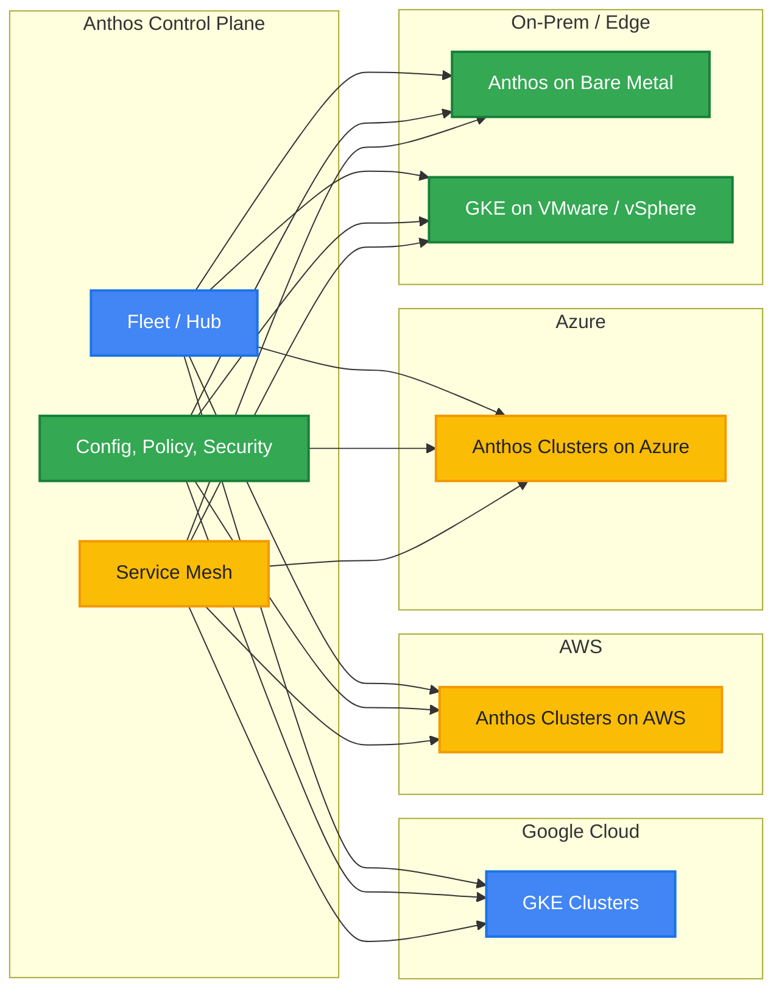
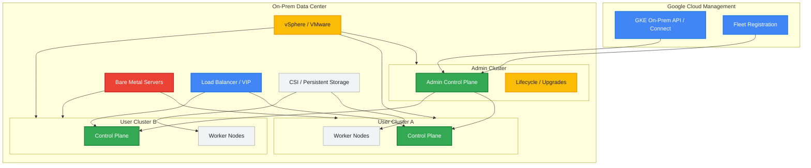
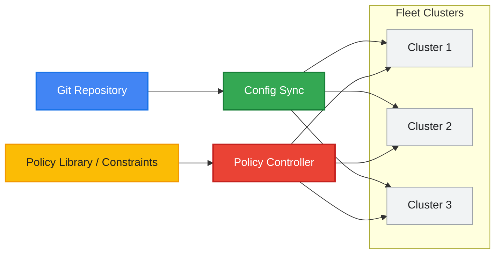
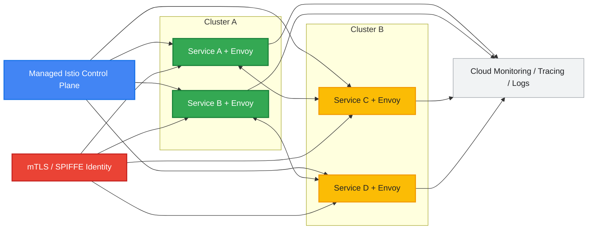
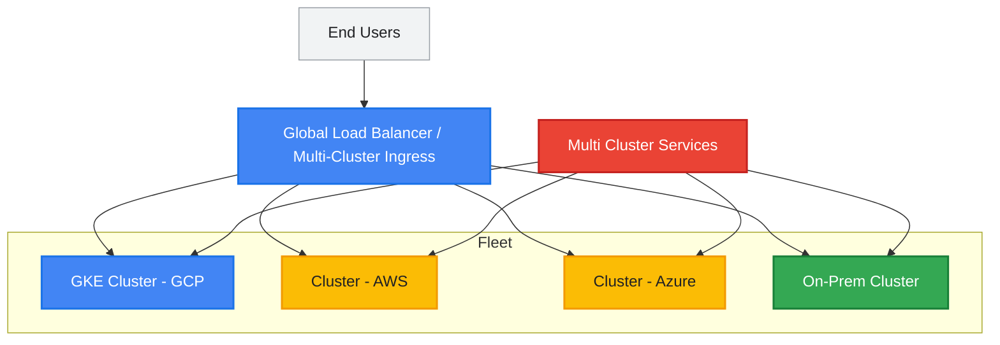
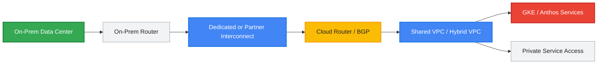
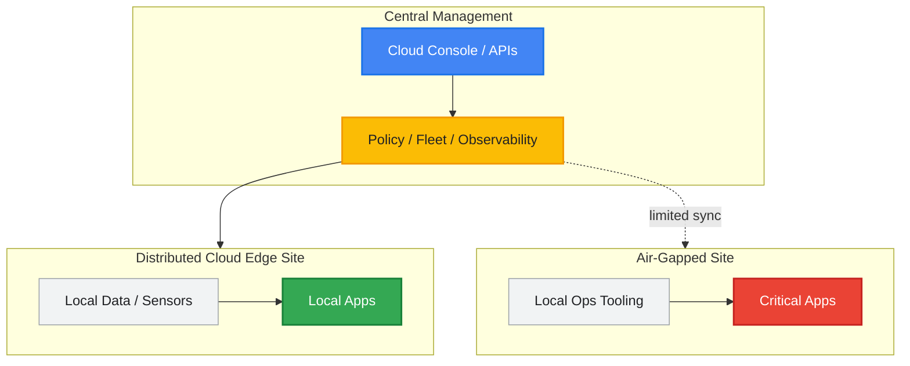
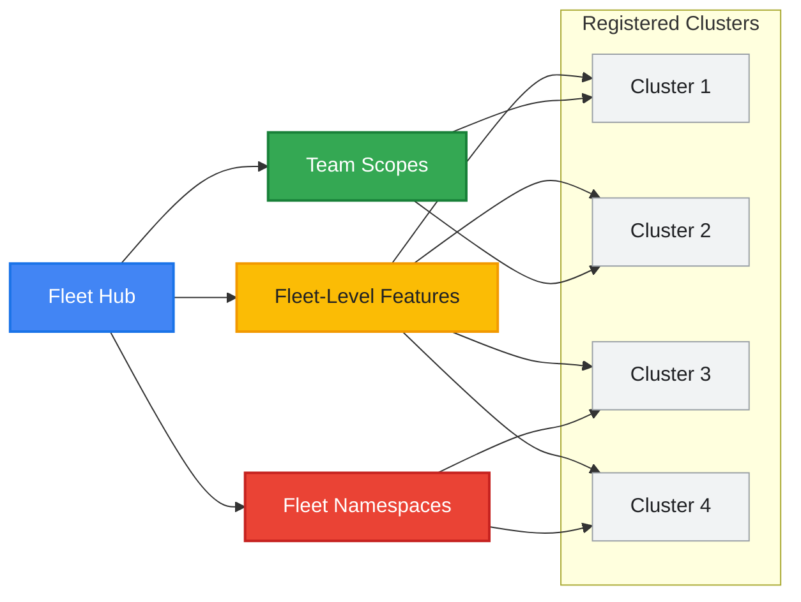

```mermaid
flowchart LR
    classDef google fill:#4285F4,stroke:#1A73E8,color:#FFFFFF,stroke-width:2px;
    classDef green fill:#34A853,stroke:#188038,color:#FFFFFF,stroke-width:2px;
    classDef yellow fill:#FBBC05,stroke:#F29900,color:#202124,stroke-width:2px;
    classDef red fill:#EA4335,stroke:#C5221F,color:#FFFFFF,stroke-width:2px;
    classDef gray fill:#F1F3F4,stroke:#9AA0A6,color:#202124,stroke-width:1px;

    VMInventory[VM Inventory]:::gray --> Assess[Fit Assessment]:::yellow
    Assess --> Waves[Migration Waves]:::google
    Waves --> Transform[Generate Container Artifacts]:::green
    Transform --> Test[Test / Validate]:::red
    Test --> Deploy[Deploy to GKE / Anthos]:::google
```

# GCP Multi-Cloud & Hybrid Architecture

> A comprehensive reference for designing, operating, and scaling Google Cloud hybrid and multi-cloud platforms with Anthos, GKE on-prem, service mesh, interconnectivity, migration, and fleet management.

<!-- workflow-diagram:start -->
## Hybrid Connectivity Workflow

```mermaid
flowchart LR
    Estates["On-Prem / AWS / Azure"] --> Connect{"VPN or Interconnect?"}
    Connect -->|VPN| VPN["HA VPN"]
    Connect -->|Dedicated| Interconnect["Cloud Interconnect"]
    subgraph Control["Hybrid control plane"]
        Fleet["Anthos fleet"]
        Policy["Config Management"]
        Mesh["Service Mesh"]
    end
    VPN --> Fleet
    Interconnect --> Fleet
    Fleet --> Policy
    Policy --> Mesh
    Mesh --> Deploy["Deploy apps across environments"]
    Deploy --> Observe["Unified logging + monitoring"]
    Observe --> Secure{"Policies compliant?"}
    Secure -->|No| Remediate["Drift fix / policy enforcement"]
    Remediate --> Policy
    Secure -->|Yes| Failover{"Need failover or burst?"}
    Failover -->|Yes| Shift["Move traffic / workloads"]
    Failover -->|No| Operate["Operate steady-state fleet"]
    Shift --> Operate
    classDef start fill:#E3F2FD,stroke:#1E88E5,color:#0D47A1;
    classDef hybrid fill:#E8F5E9,stroke:#43A047,color:#1B5E20;
    classDef ops fill:#FFF3E0,stroke:#FB8C00,color:#E65100;
    classDef finish fill:#F3E5F5,stroke:#8E24AA,color:#4A148C;
    class Estates,Connect start;
    class VPN,Interconnect,Fleet,Policy,Mesh,Deploy hybrid;
    class Observe,Secure,Remediate,Failover,Shift ops;
    class Operate finish;
```

<!-- workflow-diagram:end -->

## Table of Contents

1. [Document Goals](#document-goals)
2. [Architecture Principles](#architecture-principles)
3. [Anthos Overview](#anthos-overview)
4. [GKE On-Prem / Anthos on Bare Metal](#gke-on-prem--anthos-on-bare-metal)
5. [Anthos Config Management](#anthos-config-management)
6. [Anthos Service Mesh](#anthos-service-mesh)
7. [Traffic Management Across Clouds](#traffic-management-across-clouds)
8. [Migrate to Containers](#migrate-to-containers)
9. [Cloud Interconnect for Hybrid](#cloud-interconnect-for-hybrid)
10. [Distributed Cloud](#distributed-cloud)
11. [Fleet Management](#fleet-management)
12. [Reference Architecture Patterns](#reference-architecture-patterns)
13. [Operational Checklist](#operational-checklist)
14. [Conclusion](#conclusion)

---

## Document Goals

This document translates handwritten GCP architecture notes into a structured design guide for hybrid and multi-cloud deployments.

It focuses on:

- Operating Kubernetes and platform services across Google Cloud, on-premises, and other public clouds.
- Standardizing governance, networking, service connectivity, and security.
- Using Anthos and related Google Cloud services to deliver consistent operations.
- Enabling migration from VM-based environments to container-based platforms.
- Providing practical command examples and architecture patterns.

---

## Architecture Principles

A strong hybrid and multi-cloud platform should follow these principles:

- **Consistency over customization**: Standardize cluster bootstrap, policy, networking, and observability.
- **Central governance, local execution**: Manage policy and identity centrally while allowing teams to deploy independently.
- **Security by default**: Enforce mTLS, policy-as-code, least privilege IAM, and private connectivity.
- **GitOps-first operations**: Deliver configuration changes via version-controlled repositories.
- **Fleet-based management**: Treat clusters as part of a fleet rather than isolated islands.
- **Progressive delivery**: Use canary and blue/green patterns to reduce deployment risk.
- **Interconnect-aware design**: Plan for latency, failure domains, bandwidth, and routing symmetry.
- **Portable application architecture**: Favor containers, service mesh, and declarative APIs.

---

## Anthos Overview

Anthos is Google Cloud's platform for managing modern applications across Google Cloud, on-premises environments, and other clouds such as AWS and Azure. It provides a consistent control model for Kubernetes-based application platforms and related policies, networking, observability, and security capabilities.

### Mermaid Diagram



### Explanation

Anthos provides a management model built around fleets, cluster registration, policy distribution, service mesh, configuration governance, and operational consistency. Instead of managing each Kubernetes environment separately, platform teams define common security and operational patterns once and apply them across all registered clusters.

Key concepts include:

- **Anthos clusters** can run on GKE, AWS, Azure, and bare metal or VMware-backed on-prem infrastructure.
- **Fleet membership** allows clusters to participate in shared capabilities such as policy, mesh, multi-cluster services, and fleet namespaces.
- **Platform services** such as Config Management and Service Mesh provide centralized control with distributed enforcement.
- **Hybrid app portability** improves because teams can use Kubernetes APIs, GitOps workflows, and service-to-service patterns across environments.

### `gcloud` Commands

```bash
gcloud container fleet memberships list

gcloud container fleet features list

gcloud container fleet scopes list

gcloud container hub memberships list
```

### Use Cases

- Standardizing Kubernetes operations across GCP and on-prem.
- Running regulated workloads partly on-prem and partly in cloud.
- Supporting disaster recovery across regions and infrastructure types.
- Managing edge, branch, or factory clusters with central policy.
- Enabling a single developer experience across heterogeneous environments.

### Best Practices

- Build a **fleet operating model** early.
- Separate platform governance responsibilities from application deployment responsibilities.
- Standardize identity, namespace conventions, labels, and cluster registration metadata.
- Use GitOps for all cluster and namespace-level configuration.
- Adopt observability baselines before onboarding production workloads.

---

## GKE On-Prem / Anthos on Bare Metal

GKE on-prem and Anthos on Bare Metal bring Kubernetes management into customer-controlled infrastructure. These models are used when data locality, latency, regulatory, disconnected operations, or existing infrastructure investments require workloads to run outside Google-managed regions.

### Mermaid Diagram



### Explanation

There are two major deployment patterns represented in the notes:

1. **GKE on VMware / vSphere integration**
   - Uses VMware virtual infrastructure for cluster nodes.
   - Often includes an **admin cluster** for lifecycle operations.
   - **User clusters** host the actual workloads.
   - Platform teams can standardize upgrades, backups, networking, and storage through the VMware estate.

2. **Anthos on Bare Metal**
   - Runs directly on physical servers.
   - Avoids virtualization overhead.
   - Supports high-performance and low-latency use cases.
   - Suitable for edge, retail, manufacturing, telecom, and disconnected environments.

The **admin cluster** is responsible for managing the environment itself, including cluster creation, upgrades, and deletion. **User clusters** isolate workload domains, tenants, or application portfolios.

Common architecture elements include:

- Dedicated management and workload networks.
- VIPs or load balancers for Kubernetes API and ingress traffic.
- Integration with existing LDAP/AD, DNS, PKI, and monitoring systems.
- Storage integration using supported CSI drivers or platform-native solutions.

### `gcloud` Commands

```bash
gcloud container vmware clusters list --location=us-central1

gcloud container vmware admin-clusters list --location=us-central1

gcloud container bare-metal clusters list --location=us-central1

gcloud container bare-metal node-pools list   --cluster=my-bm-cluster   --location=us-central1
```

### Use Cases

- Modernizing VMware-hosted enterprise applications.
- Running Kubernetes in data centers with strict residency requirements.
- Supporting low-latency applications near factories or branch offices.
- Migrating legacy app tiers gradually while keeping dependencies on-prem.
- Building a standardized platform for business units with different hardware footprints.

### Best Practices

- Keep **admin clusters** isolated and tightly controlled.
- Separate infrastructure management from application workloads.
- Reserve IP ranges carefully for services, pods, VIPs, and ingress.
- Validate storage and load-balancer integration before production onboarding.
- Plan upgrade windows for both Kubernetes and underlying hypervisor or server firmware.
- Use dedicated observability pipelines for on-prem clusters in case outbound connectivity is limited.

---

## Anthos Config Management

Anthos Config Management brings governance and configuration consistency to fleets of clusters by using Git repositories as the desired source of truth. It includes **Config Sync** for continuous reconciliation and **Policy Controller** for policy enforcement.

### Mermaid Diagram



### Explanation

Anthos Config Management enables **GitOps-based configuration delivery**. Desired resources such as namespaces, role bindings, quotas, network policies, and admission policies are stored in Git. Agents in clusters continuously reconcile cluster state to match the repository.

Core components:

- **Config Sync**
  - Pulls configuration from Git or OCI sources.
  - Reconciles namespaces, RBAC, policies, and platform resources.
  - Supports hierarchical repo structures and multi-team ownership models.

- **Policy Controller**
  - Based on Open Policy Agent Gatekeeper concepts.
  - Enforces constraints such as allowed registries, labeling, privilege controls, or required network policies.
  - Can run in audit mode first, then enforce mode.

Benefits include:

- Elimination of manual drift.
- Clear audit trails for every config change.
- Repeatable environment creation.
- Central enforcement with local autonomy.

### `gcloud` Commands

```bash
gcloud container fleet config-management enable

gcloud container fleet config-management status

gcloud container fleet config-management apply   --membership=my-cluster-membership   --config=acm-config.yaml

gcloud beta container fleet config-management status
```

### Use Cases

- Enforcing namespace templates and RBAC across all clusters.
- Requiring approved container registries and image signatures.
- Standardizing team onboarding with Git-based namespace provisioning.
- Rolling out NetworkPolicy, PodSecurity, and quota policies fleet-wide.
- Maintaining compliance evidence through Git history and audit output.

### Best Practices

- Use separate repos or directories for **platform baseline**, **environment overlays**, and **application-specific configuration**.
- Start Policy Controller in audit mode before hard enforcement.
- Protect config repositories with pull request review and branch protection.
- Use smaller, modular policy packages instead of one massive repo.
- Establish exception-handling workflows with explicit approvals and expiry dates.

---

## Anthos Service Mesh

Anthos Service Mesh provides a managed Istio-based service mesh for securing, connecting, and observing services across Kubernetes clusters. It enables traffic management, zero-trust service identity, telemetry, and advanced rollout strategies.

### Mermaid Diagram



### Explanation

Anthos Service Mesh adds a layer of programmable network control between services. Instead of hard-coding service-to-service logic into applications, teams define routing, retries, failover, and security rules declaratively.

Main capabilities:

- **Managed Istio control plane** reduces operational burden for upgrades and compatibility.
- **mTLS** encrypts traffic between services and establishes service identity.
- **Traffic management** supports weighted routing, retries, circuit breaking, and fault injection.
- **Observability** exposes metrics, traces, topology, and golden signals.
- **Canary deployments** become safer through percentage-based traffic shifting.

Anthos Service Mesh is especially useful when applications span multiple clusters or when security and visibility requirements exceed what basic Kubernetes networking provides.

### `gcloud` Commands

```bash
gcloud container fleet mesh enable

gcloud container fleet mesh update   --management=automatic

gcloud container fleet mesh describe

gcloud container fleet mesh disable
```

### Use Cases

- Enforcing mutual TLS between microservices.
- Performing canary deployments with 5%, 20%, 50%, and 100% rollout stages.
- Observing latency and error rates across services in multiple clusters.
- Isolating faulty service versions with circuit breaking and retries.
- Implementing zero-trust east-west traffic patterns in regulated environments.

### Best Practices

- Onboard services incrementally instead of meshing everything at once.
- Establish service naming and ownership conventions early.
- Monitor sidecar overhead for latency-sensitive workloads.
- Define canary SLO gates before enabling automated rollout promotion.
- Use mesh authorization policies together with cluster and namespace policies.

---

## Traffic Management Across Clouds

Running services across clusters and clouds requires more than simple DNS round-robin. Anthos supports multi-cluster traffic patterns using fleet membership, Multi Cluster Services, and multi-cluster ingress capabilities.

### Mermaid Diagram



### Explanation

Hybrid traffic management requires a combination of global entry points, service discovery, routing policy, and health-based failover.

Important capabilities:

- **Multi-cluster ingress** provides a consistent north-south entry path across clusters.
- **Multi Cluster Services (MCS)** supports cross-cluster service discovery and export/import patterns.
- **Fleet management** allows participating clusters to share service and policy capabilities.
- **Service mesh** can complement ingress with advanced east-west routing.

Typical routing patterns include:

- Active-active across two or more clusters.
- Active-passive failover from primary cloud to secondary cloud or on-prem.
- Locality-aware routing that prefers regional or environment-local backends.
- Split traffic for phased modernization, where one part goes to legacy/on-prem and another to cloud-native backends.

### `gcloud` Commands

```bash
gcloud container fleet multi-cluster-services enable

gcloud container fleet ingress enable

gcloud container fleet ingress describe

gcloud container fleet memberships list
```

### Use Cases

- Global front ends backed by services in multiple clouds.
- DR-ready applications with standby clusters outside GCP.
- Shared backend services consumed by apps running in different environments.
- Regional edge clusters that sync with central platforms while serving locally.
- Migration scenarios where traffic shifts gradually from on-prem to GKE.

### Best Practices

- Define clear health-check and failover policies.
- Measure cross-cloud and on-prem latency before choosing active-active.
- Keep service names stable while backend implementations evolve.
- Use consistent TLS, DNS, and certificate automation patterns.
- Document failback procedures, not just failover procedures.

---

## Migrate to Containers

Migrate to Containers helps organizations move from VM-centric application hosting to container-centric operations. It supports assessment, dependency analysis, and migration planning so teams can modernize incrementally rather than rewriting everything upfront.

### Mermaid Diagram



### Explanation

VM-to-container modernization usually succeeds when organizations do not treat every workload equally. A structured process is essential:

1. **Inventory and fit assessment**
   - Discover applications, runtimes, dependencies, storage needs, and external integrations.
   - Identify which VMs are good candidates for lift-and-shift into containers versus partial refactor or retain.

2. **Migration wave planning**
   - Group workloads by criticality, complexity, business owner, and dependency patterns.
   - Start with low-risk workloads to establish tooling and operations patterns.

3. **Container transformation**
   - Generate deployment artifacts, images, and runtime configs.
   - Externalize config and secrets.
   - Replace machine assumptions with platform-native patterns.

4. **Validation and cutover**
   - Test networking, storage, auth, and observability.
   - Use staged cutovers and rollback plans.

### `gcloud` Commands

```bash
gcloud migration vms image-imports list --location=us-central1

gcloud migration vms sources list --location=us-central1

gcloud migration vms util groups list --location=us-central1
```

### Use Cases

- Replatforming legacy web applications from VMware or Compute Engine VMs.
- Standardizing app packaging for multi-environment deployments.
- Reducing VM sprawl and improving deployment speed.
- Preparing apps for service mesh, policy enforcement, and GitOps operations.
- Creating a stepping stone from monolithic hosting toward platform engineering.

### Best Practices

- Start with **fit assessment**, not tooling-first migration.
- Separate stateless, stateful, and tightly coupled workloads into different migration strategies.
- Modernize external dependencies such as configuration, certificates, and logging during migration.
- Use waves with explicit entry/exit criteria.
- Keep rollback paths to the original VM or parallel runtime during early cutovers.

---

## Cloud Interconnect for Hybrid

Cloud Interconnect provides high-throughput, low-latency private connectivity between on-premises environments and Google Cloud. In hybrid architectures, it is a foundational building block for secure and predictable connectivity.

### Mermaid Diagram



### Explanation

For hybrid deployments, public internet connectivity is often insufficient. Cloud Interconnect enables private network paths from enterprise data centers to GCP VPCs.

Types:

- **Dedicated Interconnect**
  - Direct physical connection into Google's network.
  - Best for high-throughput and predictable enterprise connectivity.

- **Partner Interconnect**
  - Connectivity delivered through a supported service provider.
  - Useful where direct colocation is not feasible.

Key architecture elements:

- **Cloud Router** exchanges dynamic routes via BGP.
- **VLAN attachments** map interconnect capacity into VPC connectivity.
- **Shared VPC** can centralize hybrid routing for multiple service projects.
- Private connectivity improves posture for APIs, cluster access, databases, and operational tooling.

### `gcloud` Commands

```bash
gcloud compute interconnects list

gcloud compute interconnects attachments list --region=us-central1

gcloud compute routers list

gcloud compute routers get-status hybrid-router --region=us-central1
```

### Use Cases

- Connecting enterprise data centers to GKE and shared services in GCP.
- Extending corporate identity, logging, and monitoring systems into cloud-hosted apps.
- Supporting low-latency application tiers split between on-prem and cloud.
- Enabling private database replication or backup traffic.
- Carrying control-plane and application traffic for hybrid Anthos environments.

### Best Practices

- Design for redundancy across metros, routers, and VLAN attachments.
- Use separate routing domains where necessary for prod versus non-prod.
- Validate MTU, BGP timers, and route advertisement design.
- Monitor utilization and error counters continuously.
- Document asymmetric routing risks when multiple WAN paths exist.

---

## Distributed Cloud

Google Distributed Cloud extends Google-managed or Google-compatible platform capabilities to edge locations and disconnected environments. This includes edge deployments, retail branches, telecom environments, and air-gapped scenarios where local execution is mandatory.

### Mermaid Diagram



### Explanation

Distributed cloud patterns are used when compute must be close to where data is produced or where connectivity is unreliable or intentionally restricted.

Important considerations:

- **Google Distributed Cloud Edge** supports edge processing close to users, devices, or machines.
- **Air-gapped deployments** are designed for environments with no routine external internet connectivity.
- Management, updates, image distribution, and audit handling may follow staged synchronization patterns instead of continuous cloud connectivity.

These environments typically prioritize:

- Local survivability.
- Small operational footprint.
- Hardware standardization.
- Store-and-forward telemetry.
- Tight security boundaries.

### `gcloud` Commands

```bash
gcloud edge-cloud container clusters list --location=us-central1

gcloud edge-cloud zones list

gcloud edge-cloud container clusters describe my-edge-cluster --location=us-central1
```

### Use Cases

- Retail store platforms requiring local processing during WAN outages.
- Manufacturing systems that must stay close to plant-floor devices.
- Telecom edge workloads for latency-sensitive processing.
- Defense or classified scenarios requiring air-gapped operation.
- Healthcare or remote-site solutions with intermittent backhaul connectivity.

### Best Practices

- Minimize dependencies on continuously reachable central services.
- Pre-stage images, policies, and update bundles.
- Define local operational procedures for break-glass access.
- Size hardware for degraded-mode operation.
- Use buffered telemetry and asynchronous synchronization for audit trails.

---

## Fleet Management

Fleet management is the backbone that turns a group of clusters into a manageable platform. Registering clusters into a fleet enables shared features, governance, and service abstractions.

### Mermaid Diagram



### Explanation

A fleet is a logical grouping of Kubernetes clusters that share management and platform capabilities. Once clusters are registered, Google Cloud can apply higher-level services consistently.

Fleet concepts in the notes include:

- **Registering clusters** to a fleet or hub.
- Enabling **fleet-level features** such as Config Management, Service Mesh, ingress, and multi-cluster services.
- Using **team scopes** to group clusters and namespaces for delegated administration.
- Managing **namespaces** consistently across clusters for platform tenancy.

Fleet management allows platform teams to think in terms of service boundaries, policies, and groups rather than one-off cluster administration.

### `gcloud` Commands

```bash
gcloud container fleet memberships register my-cluster   --gke-cluster=us-central1/my-cluster   --enable-workload-identity

gcloud container fleet memberships list

gcloud container fleet scopes create platform-team-a

gcloud container fleet scopes namespaces create payments   --scope=platform-team-a
```

### Use Cases

- Grouping clusters by environment, geography, or business domain.
- Delegating namespace control to platform-aligned product teams.
- Enabling shared mesh and config features consistently.
- Governing multi-cluster services and workload identities.
- Creating a repeatable operating model for acquisitions or multi-region growth.

### Best Practices

- Define a clear fleet taxonomy before large-scale onboarding.
- Align scopes and namespaces with organizational ownership boundaries.
- Use labels and metadata consistently for reporting and automation.
- Avoid unmanaged clusters outside the fleet unless there is a justified exception.
- Audit fleet membership and enabled features regularly.

---

## Reference Architecture Patterns

The sections above map into several reusable patterns.

### 1. Centralized Platform with Distributed Execution

- GKE in Google Cloud hosts shared services.
- On-prem Anthos clusters run locality-sensitive workloads.
- Fleet-wide policy and mesh enforce standards.
- Cloud Interconnect connects sites privately.

### 2. Regulated Hybrid Deployment

- Sensitive data remains on-prem or in air-gapped environments.
- Stateless front ends and analytics run in GCP.
- Service mesh and ingress manage secure service exposure.
- GitOps controls consistent policy and auditability.

### 3. Edge + Core Architecture

- Edge sites process low-latency events locally.
- Regional GKE clusters aggregate telemetry and provide central APIs.
- Fleet management standardizes site rollout.
- Distributed cloud enables limited- or no-connectivity operations.

### 4. Migration Bridge Pattern

- Existing VMs remain on-prem initially.
- Migrate to Containers replatforms selected apps into GKE or Anthos.
- Multi-cluster traffic management shifts user flows gradually.
- Interconnect carries private application and data traffic.

### 5. Multi-Cloud Resilience Pattern

- Primary services run in GCP.
- Secondary capacity exists in AWS, Azure, or on-prem clusters.
- Shared config, policy, and service discovery reduce operational divergence.
- DR procedures are exercised using real routing controls.

---

## Operational Checklist

Use this checklist when planning or reviewing a hybrid and multi-cloud deployment:

### Platform Foundation

- Define fleet boundaries and cluster registration standards.
- Standardize naming, labels, and environment tagging.
- Establish baseline observability, logging, and alerting.
- Choose a GitOps repository structure.
- Document cluster bootstrap and recovery procedures.

### Security

- Enforce least-privilege IAM and workload identity.
- Enable mTLS where service-to-service trust is required.
- Define Policy Controller constraints for guardrails.
- Protect secrets with approved vaulting or secret-management flows.
- Validate certificate lifecycle ownership.

### Networking

- Document hybrid CIDR allocation and overlap risks.
- Decide when to use Dedicated vs Partner Interconnect.
- Test BGP failover and routing convergence.
- Define ingress, egress, and DNS strategy across environments.
- Measure latency for east-west traffic across clouds.

### Operations

- Separate admin and workload clusters when appropriate.
- Create wave-based migration plans for VM modernization.
- Establish SLOs and rollout gates for canary deployments.
- Test outage scenarios for cloud, site, and WAN failures.
- Review upgrade compatibility across cluster types.

### Governance

- Use pull-request based approvals for config changes.
- Audit fleet features and memberships periodically.
- Track policy violations and remediation timelines.
- Define exception processes for temporary deviations.
- Align platform ownership with team scopes and namespaces.

---

## Conclusion

A successful GCP hybrid and multi-cloud architecture is not just about running clusters in many places. It is about creating a consistent operating model across those places.

Anthos, GKE on-prem, Config Management, Service Mesh, multi-cluster traffic management, container migration tooling, Cloud Interconnect, Distributed Cloud, and Fleet Management together provide the building blocks for that model.

When implemented well, the result is:

- Consistent operations across cloud and on-prem.
- Stronger governance and security.
- Better workload portability.
- Safer modernization from legacy environments.
- More resilient application delivery across failure domains.

This architecture approach works best when platform engineering, networking, security, and application teams collaborate around shared standards, GitOps workflows, and well-tested operational procedures.
