# GCP IAM & Security

## Overview

This document summarizes key Google Cloud Platform (GCP) Identity and Security concepts from foundational architecture and day-to-day operational security perspectives. It focuses on how access is structured, how identities are managed, how guardrails are enforced, and how platform-native security services reduce risk.

---

## Table of Contents

1. [IAM Resource Hierarchy](#iam-resource-hierarchy)
2. [IAM Roles](#iam-roles)
3. [Service Accounts](#service-accounts)
4. [IAM Policies & Bindings](#iam-policies--bindings)
5. [Cloud Identity](#cloud-identity)
6. [Organization Policies](#organization-policies)
7. [VPC Service Controls](#vpc-service-controls)
8. [Security Command Center](#security-command-center)
9. [Binary Authorization](#binary-authorization)
10. [Secret Manager](#secret-manager)
11. [Cloud KMS](#cloud-kms)
12. [Operational Security Checklist](#operational-security-checklist)
13. [Reference Commands](#reference-commands)

---

## IAM Resource Hierarchy

### Mermaid Diagram

```mermaid
graph TD
    ORG[Organization]\n    F1[Folder: Engineering]\n    F2[Folder: Shared Services]\n    P1[Project: prod-app]\n    P2[Project: sec-logging]\n    R1[Compute Engine VM]\n    R2[Cloud Storage Bucket]\n    R3[BigQuery Dataset]\n
    ORG --> F1
    ORG --> F2
    F1 --> P1
    F2 --> P2
    P1 --> R1
    P1 --> R2
    P2 --> R3

    style ORG fill:#4285F4,color:#fff
    style F1 fill:#34A853,color:#fff
    style F2 fill:#34A853,color:#fff
    style P1 fill:#FBBC04,color:#fff
    style P2 fill:#FBBC04,color:#fff
    style R1 fill:#EA4335,color:#fff
    style R2 fill:#EA4335,color:#fff
    style R3 fill:#EA4335,color:#fff
```

### Brief Explanation

The Google Cloud resource hierarchy starts at the **Organization** level, then branches into **Folders**, then **Projects**, and finally individual **Resources**.

Policies can be attached at multiple levels:
- Organization
- Folder
- Project
- Specific resource

IAM policy inheritance means permissions granted at a higher level are inherited by child resources unless explicitly constrained by other controls like deny policies, organization policy constraints, or service-level mechanisms.

This hierarchy enables central governance while still allowing delegated administration.

### Quick `gcloud` Commands

```bash
# Show organization details
gcloud organizations list

# List folders under an organization
gcloud resource-manager folders list --organization=ORG_ID

# List projects
gcloud projects list

# Get IAM policy for a project
gcloud projects get-iam-policy PROJECT_ID

# Get IAM policy for an organization
gcloud organizations get-iam-policy ORG_ID
```

### Best Practices / Security Tips

- Assign permissions at the **lowest practical scope**.
- Use folders to separate environments such as prod, non-prod, and shared services.
- Reserve organization-level grants for a very small number of administrators.
- Standardize project placement under folders for easier governance.
- Review inherited access regularly to avoid privilege sprawl.
- Combine hierarchy design with organization policies for guardrails.

---

## IAM Roles

### Mermaid Diagram

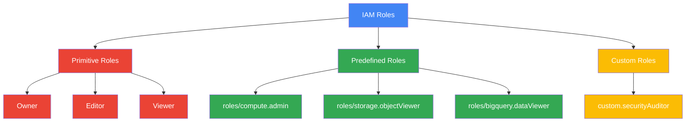

### Brief Explanation

Google Cloud IAM roles determine **what actions** a principal can perform.

**Primitive roles** are broad legacy roles:
- Owner
- Editor
- Viewer

**Predefined roles** are Google-managed roles designed for specific services or job functions.

**Custom roles** allow organizations to define tailored permission sets when predefined roles are too broad or too narrow.

### Quick `gcloud` Commands

```bash
# List IAM roles in a project
gcloud iam roles list --project=PROJECT_ID

# Describe a predefined role
gcloud iam roles describe roles/compute.admin

# Describe a custom role
gcloud iam roles describe customRoleName --project=PROJECT_ID

# Create a custom role
gcloud iam roles create customSecurityViewer \
  --project=PROJECT_ID \
  --title="Custom Security Viewer" \
  --permissions="resourcemanager.projects.get,iam.roles.list,compute.instances.get" \
  --stage="GA"
```

### Best Practices / Security Tips

- Avoid primitive roles whenever possible.
- Prefer predefined roles for common operational tasks.
- Use custom roles only when necessary and keep them small.
- Periodically review role contents because permissions may evolve over time.
- Map roles to job functions, not individual preferences.
- Separate admin, operator, developer, and auditor responsibilities.

---

## Service Accounts

### Mermaid Diagram

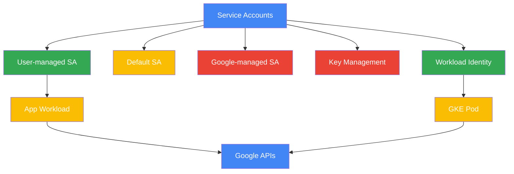

### Brief Explanation

A service account is a non-human identity used by workloads and services.

Main service account types:
- **User-managed service accounts**: created and managed by customers.
- **Default service accounts**: automatically created for some services.
- **Google-managed service accounts**: created and used internally by Google services.

Security topics include:
- Avoiding long-lived keys
- Rotating keys if they must exist
- Limiting service account impersonation
- Using **Workload Identity** for Kubernetes or federation-based access instead of JSON keys

### Quick `gcloud` Commands

```bash
# List service accounts
gcloud iam service-accounts list --project=PROJECT_ID

# Create a service account
gcloud iam service-accounts create app-sa \
  --display-name="Application Service Account"

# Add IAM role to a service account on a project
gcloud projects add-iam-policy-binding PROJECT_ID \
  --member="serviceAccount:app-sa@PROJECT_ID.iam.gserviceaccount.com" \
  --role="roles/storage.objectViewer"

# Create a key (avoid unless required)
gcloud iam service-accounts keys create key.json \
  --iam-account=app-sa@PROJECT_ID.iam.gserviceaccount.com

# List keys
gcloud iam service-accounts keys list \
  --iam-account=app-sa@PROJECT_ID.iam.gserviceaccount.com

# Delete a key
gcloud iam service-accounts keys delete KEY_ID \
  --iam-account=app-sa@PROJECT_ID.iam.gserviceaccount.com
```

### Best Practices / Security Tips

- Prefer **keyless authentication** over downloadable JSON keys.
- Disable automatic Editor grants to default service accounts where applicable.
- Give each workload a dedicated service account.
- Use service account impersonation for admin workflows.
- Rotate keys immediately if exposed or suspected compromised.
- Monitor service account usage in audit logs.
- Use Workload Identity for GKE and workload identity federation for external systems.

---

## IAM Policies & Bindings

### Mermaid Diagram

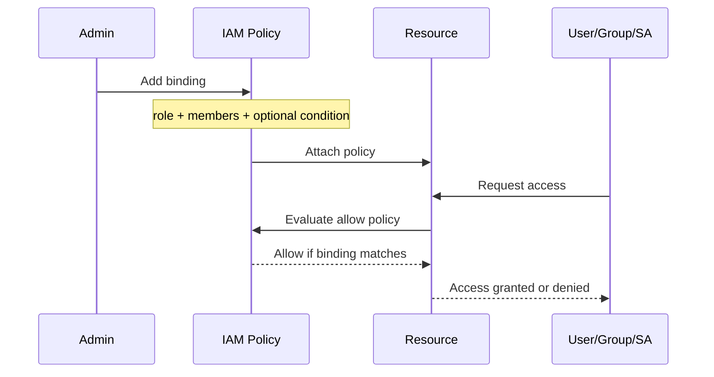

### Brief Explanation

An IAM policy contains one or more **bindings**.

Each binding maps:
- **members** → identities such as users, groups, service accounts, or domains
- **role** → the permission bundle
- **condition** → optional context-based rule

Newer IAM models also include **deny policies**, which can explicitly block access even when an allow binding exists.

Conditions can restrict access by:
- request time
- resource name
- tags or attributes
- request context

### Quick `gcloud` Commands

```bash
# Get IAM policy for a project
gcloud projects get-iam-policy PROJECT_ID

# Add a binding
gcloud projects add-iam-policy-binding PROJECT_ID \
  --member="user:alice@example.com" \
  --role="roles/viewer"

# Add conditional binding
gcloud projects add-iam-policy-binding PROJECT_ID \
  --member="user:alice@example.com" \
  --role="roles/storage.objectViewer" \
  --condition="expression=request.time < timestamp('2026-01-01T00:00:00Z'),title=temporary-access,description=expires-2026"

# Remove a binding
gcloud projects remove-iam-policy-binding PROJECT_ID \
  --member="user:alice@example.com" \
  --role="roles/viewer"

# Example deny policy commands may use gcloud alpha/beta depending on environment
gcloud alpha iam policies list --attachment-point=projects/PROJECT_NUMBER
```

### Best Practices / Security Tips

- Prefer groups over direct user bindings.
- Use conditions for temporary or context-aware access.
- Keep policy documents simple and auditable.
- Use deny policies carefully for high-risk actions.
- Review “allUsers” and “allAuthenticatedUsers” bindings aggressively.
- Automate IAM drift detection.

---

## Cloud Identity

### Mermaid Diagram

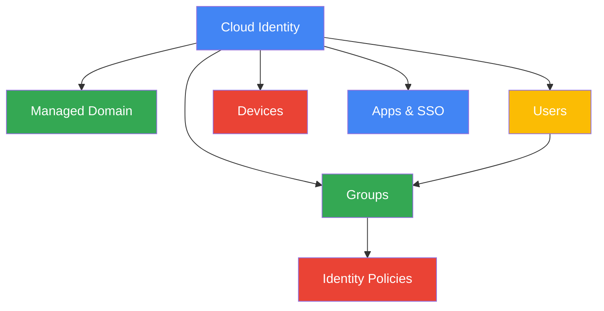

### Brief Explanation

Cloud Identity provides identity and device management for organizations using Google services. It helps manage:
- users
- groups
- domains
- authentication policies
- admin delegation

It is the identity backbone used for Google Cloud access in many enterprises.

Using groups in Cloud Identity simplifies IAM administration across projects and folders.

### Quick `gcloud` Commands

```bash
# List organizations available to the identity
gcloud organizations list

# View authenticated account
gcloud auth list

# Set active account
gcloud config set account user@example.com

# Show active configuration
gcloud config list
```

### Best Practices / Security Tips

- Use groups for role assignment instead of assigning access directly to users.
- Enforce MFA for all privileged accounts.
- Separate admin accounts from day-to-day user accounts.
- Protect super admin roles with stronger controls.
- Use domain ownership verification and lifecycle processes for joiner/mover/leaver events.
- Audit group membership regularly.

---

## Organization Policies

### Mermaid Diagram

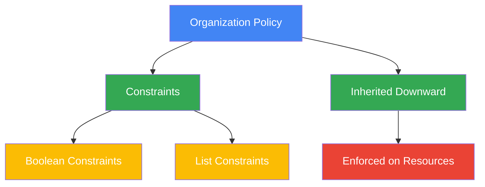

### Brief Explanation

Organization Policy Service provides centralized **guardrails** across the resource hierarchy.

Policies can enforce constraints like:
- restrict which APIs or services can be used
- restrict external IP usage
- restrict allowed resource locations
- restrict domain sharing
- enforce uniform behavior for security-critical settings

Constraint types include:
- **Boolean constraints**: on/off style enforcement
- **List constraints**: allow/deny lists for values

Policies inherit downward from org to folder to project.

### Quick `gcloud` Commands

```bash
# List available constraints
gcloud resource-manager org-policies list-constraints --organization=ORG_ID

# Describe a constraint
gcloud resource-manager org-policies describe constraints/compute.vmExternalIpAccess \
  --organization=ORG_ID

# List policies on a project
gcloud resource-manager org-policies list --project=PROJECT_ID

# Describe a policy on a project
gcloud resource-manager org-policies describe constraints/iam.allowedPolicyMemberDomains \
  --project=PROJECT_ID
```

### Best Practices / Security Tips

- Use org policies as preventive controls, not just detective controls.
- Define baseline guardrails at the organization level.
- Use folder-level variations only when justified.
- Restrict resource locations for compliance.
- Prevent accidental public exposure with relevant constraints.
- Test policy impact before broad rollout.

---

## VPC Service Controls

### Mermaid Diagram

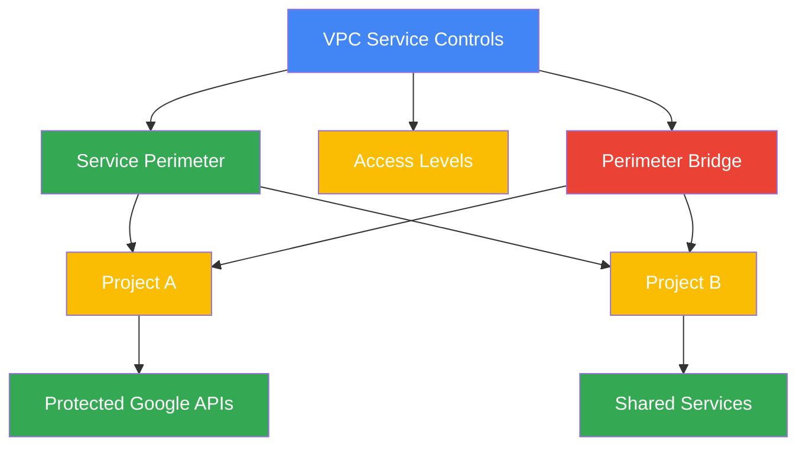

### Brief Explanation

VPC Service Controls reduce the risk of **data exfiltration** from Google-managed services.

Key concepts:
- **Service perimeters**: define protected boundaries around projects and services.
- **Access levels**: context-aware rules for ingress access based on IP, device, identity, and more.
- **Perimeter bridges**: allow controlled communication between protected perimeters.

This is not a replacement for IAM. It is an additional security boundary around managed services.

### Quick `gcloud` Commands

```bash
# List access policies
gcloud access-context-manager policies list

# List access levels
gcloud access-context-manager levels list --policy=POLICY_ID

# List service perimeters
gcloud access-context-manager perimeters list --policy=POLICY_ID

# Describe a perimeter
gcloud access-context-manager perimeters describe PERIMETER_NAME \
  --policy=POLICY_ID
```

### Best Practices / Security Tips

- Apply VPC SC to sensitive data services such as BigQuery, Cloud Storage, and Secret Manager.
- Start in dry-run mode where supported to evaluate impact.
- Pair perimeters with private networking and restricted VIP patterns.
- Use access levels to narrow trusted ingress contexts.
- Minimize perimeter bridges and document each exception.
- Continuously test for unintended exfiltration paths.

---

## Security Command Center

### Mermaid Diagram

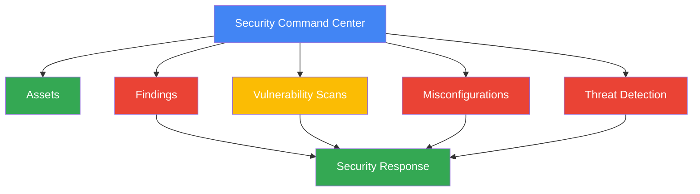

### Brief Explanation

Security Command Center (SCC) is Google Cloud’s centralized security and risk management platform.

It provides visibility into:
- cloud assets
- security findings
- vulnerabilities
- misconfigurations
- threat detections
- compliance posture

SCC helps teams prioritize remediation by severity and exposure.

### Quick `gcloud` Commands

```bash
# List SCC sources
gcloud scc sources list --organization=ORG_ID

# List findings
gcloud scc findings list organizations/ORG_ID/sources/SOURCE_ID

# Describe a finding
gcloud scc findings describe FINDING_ID \
  --source=SOURCE_ID \
  --organization=ORG_ID

# List assets
gcloud scc assets list --organization=ORG_ID
```

### Best Practices / Security Tips

- Enable SCC at the organization level for centralized coverage.
- Integrate findings into incident response workflows.
- Triage internet-exposed and high-severity findings first.
- Track recurring findings to identify systemic weaknesses.
- Use SCC with logging and SIEM integrations.
- Regularly review asset inventory for shadow resources.

---

## Binary Authorization

### Mermaid Diagram

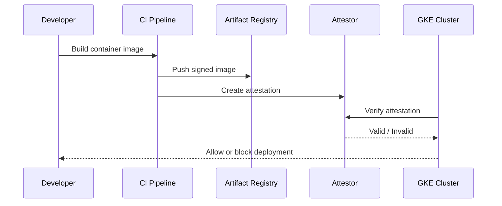

### Brief Explanation

Binary Authorization enforces deployment-time controls for container images.

It ensures workloads are deployed only if they satisfy trusted criteria, such as:
- built by approved CI pipelines
- signed or attested by approved systems
- scanned successfully
- compliant with policy requirements

This helps reduce the risk of deploying untrusted or tampered images.

### Quick `gcloud` Commands

```bash
# List attestors
gcloud container binauthz attestors list --project=PROJECT_ID

# Describe policy
gcloud container binauthz policy export

# Create attestor
gcloud container binauthz attestors create attestor-name \
  --attestation-authority-note=NOTE_ID \
  --attestation-authority-note-project=PROJECT_ID

# Import policy
gcloud container binauthz policy import policy.yaml
```

### Best Practices / Security Tips

- Require attestation for production deployments.
- Restrict who can create or approve attestations.
- Integrate image scanning into CI/CD before attestation.
- Use separate policies for dev and prod clusters.
- Store signatures and provenance securely.
- Audit failed admission attempts for anomaly detection.

---

## Secret Manager

### Mermaid Diagram

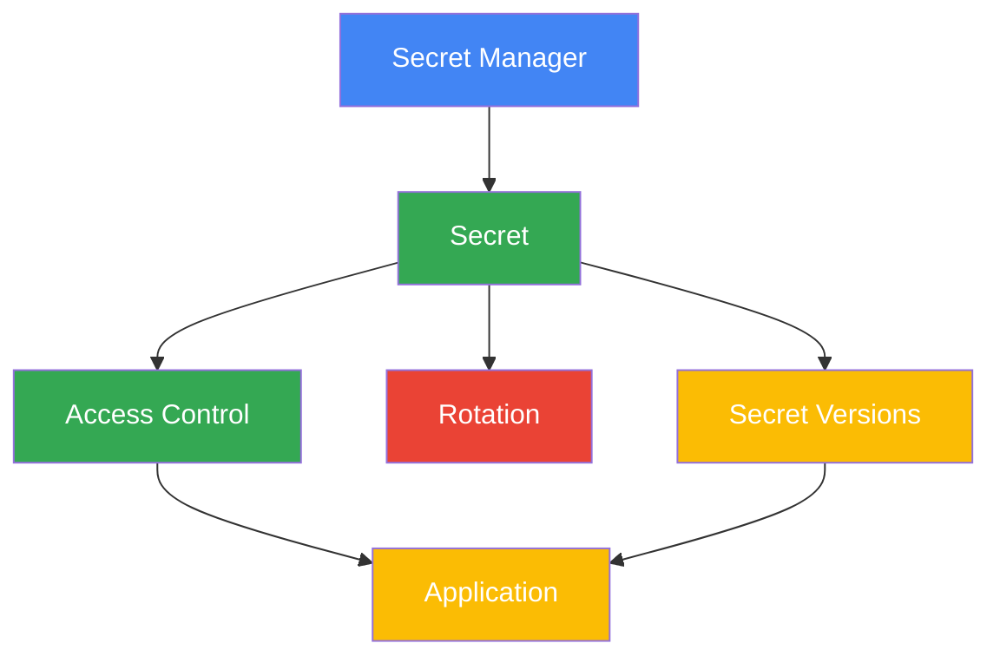

### Brief Explanation

Secret Manager securely stores sensitive values such as:
- API keys
- passwords
- certificates
- tokens
- connection strings

Secrets can have multiple **versions**, enabling controlled rotation and rollback.

Access is controlled through IAM and can be audited using Cloud Audit Logs.

### Quick `gcloud` Commands

```bash
# Create a secret
gcloud secrets create app-config --replication-policy="automatic"

# Add a secret version
echo -n 'super-secret-value' | gcloud secrets versions add app-config --data-file=-

# Access latest version
gcloud secrets versions access latest --secret=app-config

# List secrets
gcloud secrets list

# Get IAM policy on a secret
gcloud secrets get-iam-policy app-config
```

### Best Practices / Security Tips

- Never hardcode secrets in source code.
- Use one secret per application concern where practical.
- Rotate secrets regularly and after staff or system changes.
- Grant access only to the required runtime identity.
- Use versioning for safe rollout and rollback.
- Monitor secret access patterns in audit logs.

---

## Cloud KMS

### Mermaid Diagram

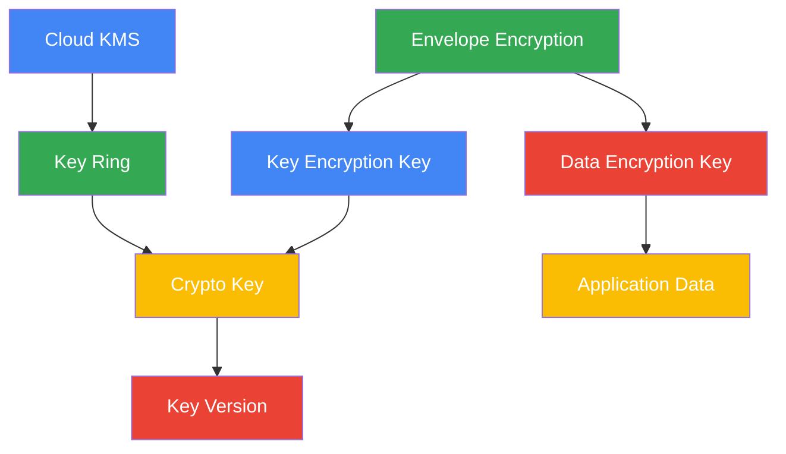

### Brief Explanation

Cloud KMS manages cryptographic keys for encryption, decryption, signing, and verification.

Core concepts:
- **Key ring**: organizational container for keys in a location
- **Crypto key**: logical key object
- **Key version**: actual versioned cryptographic material
- **Envelope encryption**: application data is encrypted with a DEK, and the DEK is encrypted with a KMS-managed KEK

KMS supports key rotation, IAM controls, audit logging, and integration with many Google Cloud services.

### Quick `gcloud` Commands

```bash
# Create a key ring
gcloud kms keyrings create app-ring --location=global

# Create a crypto key
gcloud kms keys create app-key \
  --location=global \
  --keyring=app-ring \
  --purpose=encryption

# List keys
gcloud kms keys list --location=global --keyring=app-ring

# Encrypt a file
gcloud kms encrypt \
  --location=global \
  --keyring=app-ring \
  --key=app-key \
  --plaintext-file=plain.txt \
  --ciphertext-file=cipher.txt

# Decrypt a file
gcloud kms decrypt \
  --location=global \
  --keyring=app-ring \
  --key=app-key \
  --ciphertext-file=cipher.txt \
  --plaintext-file=decrypted.txt
```

### Best Practices / Security Tips

- Separate key administration from key usage.
- Rotate keys according to policy and sensitivity.
- Use envelope encryption for application-managed data.
- Restrict key decryption permissions tightly.
- Monitor KMS usage in audit logs.
- Use HSM-backed or external key options when compliance requires stronger control.

---

## Operational Security Checklist

### Mermaid Diagram

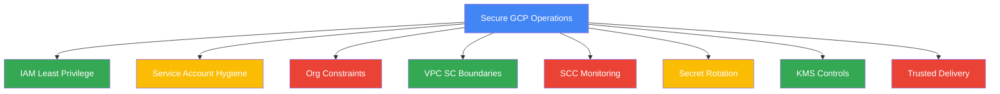

### Brief Explanation

A secure GCP environment is achieved by combining identity, policy, network boundaries, secret protection, key management, and continuous monitoring. No single control is sufficient by itself.

### Quick `gcloud` Commands

```bash
# Review project IAM
gcloud projects get-iam-policy PROJECT_ID

# Review org policies
gcloud resource-manager org-policies list --project=PROJECT_ID

# Review service accounts
gcloud iam service-accounts list --project=PROJECT_ID

# Review secrets
gcloud secrets list

# Review KMS keys
gcloud kms keys list --location=global --keyring=KEYRING_NAME
```

### Best Practices / Security Tips

- Enforce least privilege everywhere.
- Prefer ephemeral credentials over static keys.
- Centralize logging, monitoring, and security findings.
- Keep production isolated with clear administrative boundaries.
- Use preventive, detective, and corrective controls together.
- Document exceptions and review them periodically.

---

## Reference Commands

### Mermaid Diagram

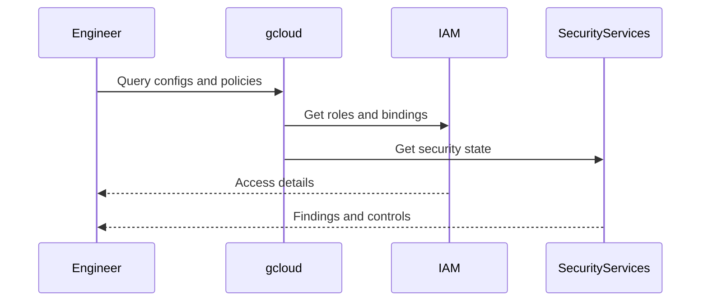

### Brief Explanation

This section collects commonly used command patterns for IAM and security administration in one place for quick recall.

### Quick `gcloud` Commands

```bash
# Authentication and config
gcloud auth login
gcloud auth list
gcloud config set project PROJECT_ID
gcloud config list

# Organizations and folders
gcloud organizations list
gcloud resource-manager folders list --organization=ORG_ID
gcloud projects list

# IAM
gcloud projects get-iam-policy PROJECT_ID
gcloud organizations get-iam-policy ORG_ID
gcloud iam roles list --project=PROJECT_ID
gcloud iam service-accounts list --project=PROJECT_ID

# Org policies
gcloud resource-manager org-policies list --project=PROJECT_ID
gcloud resource-manager org-policies list-constraints --organization=ORG_ID

# Access Context Manager / VPC SC
gcloud access-context-manager policies list
gcloud access-context-manager levels list --policy=POLICY_ID
gcloud access-context-manager perimeters list --policy=POLICY_ID

# Secret Manager
gcloud secrets list
gcloud secrets versions list SECRET_NAME

# KMS
gcloud kms keyrings list --location=global
gcloud kms keys list --location=global --keyring=KEYRING_NAME

# SCC
gcloud scc assets list --organization=ORG_ID
gcloud scc findings list organizations/ORG_ID/sources/SOURCE_ID

# Binary Authorization
gcloud container binauthz attestors list --project=PROJECT_ID
```

### Best Practices / Security Tips

- Use named configurations for separate environments.
- Avoid running admin commands from personal default contexts.
- Prefer automation through reviewed infrastructure-as-code where possible.
- Record security-sensitive command usage in change workflows.
- Validate active project and account before applying policy changes.

---

## Additional Notes

### IAM Design Notes

- IAM answers **who** can do **what** on **which resource**.
- The resource hierarchy answers **where** policy can be attached.
- Service accounts answer **which workload identity** is acting.
- Organization policies answer **what is globally allowed or blocked**.
- VPC Service Controls answer **where protected services can be reached from**.
- Secret Manager protects sensitive application configuration.
- Cloud KMS protects cryptographic material and key operations.

### Common Security Pitfalls

- Overusing project Owner role.
- Reusing one service account across many unrelated applications.
- Storing JSON keys in repositories or CI variables without rotation.
- Applying direct user access instead of group-based access.
- Forgetting inherited permissions from parent folders or organization.
- Leaving old secret versions active without lifecycle planning.
- Treating SCC as a dashboard only instead of a remediation program.
- Enabling production deployments without provenance checks.

### Recommended Layering Model

1. Start with a clean organization and folder structure.
2. Apply organization policies for hard guardrails.
3. Use group-based IAM with least privilege roles.
4. Assign dedicated service accounts to workloads.
5. Use Secret Manager and KMS for sensitive material.
6. Add VPC Service Controls for regulated or sensitive data services.
7. Turn on SCC for centralized visibility.
8. Protect software supply chain with Binary Authorization.
9. Review logs, findings, and access grants continuously.
10. Automate periodic access recertification.

### Sample Role Mapping

| Team Function | Recommended Role Pattern | Notes |
|---|---|---|
| Platform Admin | Narrow set of org/folder admin roles | Avoid broad Owner grants |
| Security Analyst | Viewer + SCC-specific roles | Read-only plus findings access |
| Developer | Service-specific predefined roles | No blanket Editor |
| CI/CD Pipeline | Dedicated service account roles | Scope to needed resources only |
| Auditor | Viewer/custom read-only roles | Prefer separate audit account |

### Sample Review Questions

- Is this access needed permanently or temporarily?
- Can the access be granted to a group instead of an individual?
- Is a predefined role sufficient before creating a custom role?
- Can a workload use Workload Identity instead of a service account key?
- Should this project belong inside a protected VPC SC perimeter?
- Should this secret be rotated automatically?
- Should this encryption key have stricter separation of duties?
- Is there an SCC finding already related to this resource?

### Summary

GCP IAM and security architecture is strongest when identity, hierarchy, policy, workload identity, secret storage, cryptographic protection, and monitoring are designed together. The goal is not only granting access, but doing so safely, minimally, audibly, and in a way that scales across many projects and teams.

---

## Appendix: Section-by-Section Quick Recall

### IAM Resource Hierarchy Quick Recall
- Organization is the root.
- Folders help delegate and structure environments.
- Projects are the primary isolation boundary for billing and administration.
- Resources live inside projects.
- IAM and org policies often inherit downward.

### IAM Roles Quick Recall
- Primitive roles are broad and risky.
- Predefined roles are recommended defaults.
- Custom roles are for edge cases.
- Least privilege should drive role choice.

### Service Accounts Quick Recall
- Non-human identities for workloads.
- Prefer dedicated user-managed accounts.
- Avoid key files when possible.
- Use impersonation and Workload Identity.

### IAM Policies Quick Recall
- Policies contain bindings.
- Bindings connect members to roles.
- Conditions add context.
- Deny policies explicitly block access.

### Cloud Identity Quick Recall
- Manages users, groups, domains, and identity lifecycle.
- Groups simplify authorization.
- Admin roles need extra protection.

### Organization Policies Quick Recall
- Guardrails at scale.
- Boolean and list constraints.
- Enforced hierarchically.
- Great for compliance baselines.

### VPC Service Controls Quick Recall
- Protect against data exfiltration.
- Built around service perimeters.
- Enhanced with access levels and bridges.
- Complements IAM, not replaces it.

### Security Command Center Quick Recall
- Central security visibility.
- Tracks assets and findings.
- Helps prioritize remediation.
- Best used at org scale.

### Binary Authorization Quick Recall
- Controls what images can run.
- Uses attestors and policy.
- Protects supply chain integrity.

### Secret Manager Quick Recall
- Stores secrets securely.
- Supports versions and rotation.
- Access is IAM-controlled and auditable.

### Cloud KMS Quick Recall
- Central key management.
- Supports key rings, keys, versions.
- Enables envelope encryption.
- Critical for protecting data at rest workflows.
