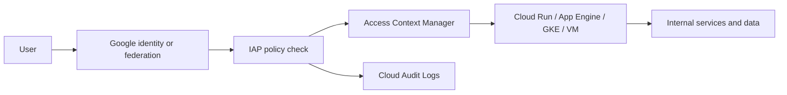
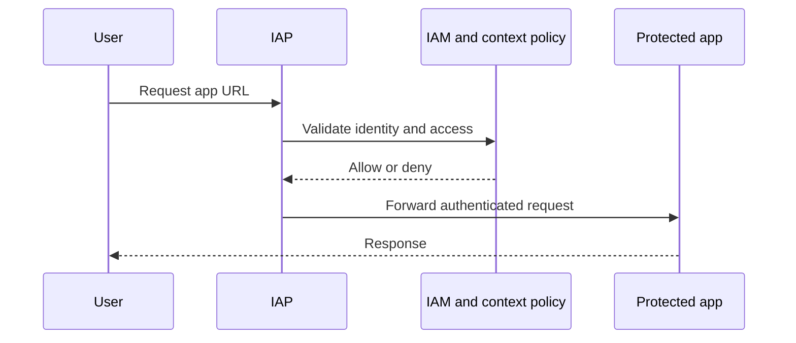
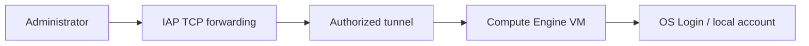
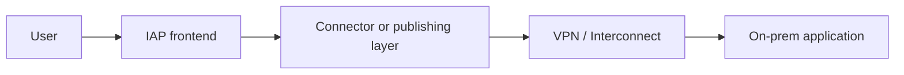
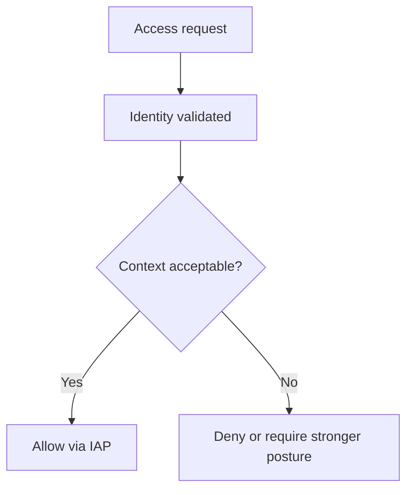
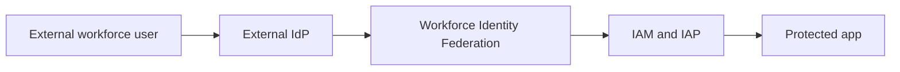
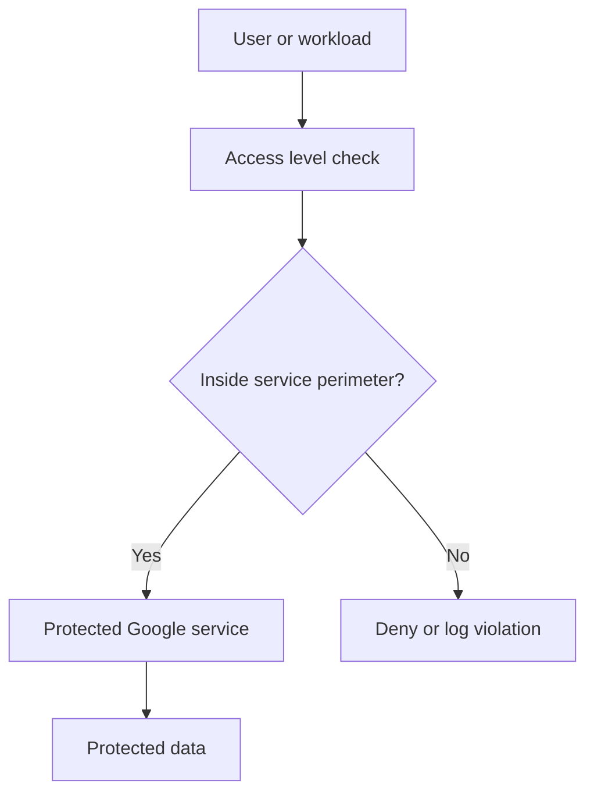

# IAP and Identity on Google Cloud

> Comprehensive guide to Identity-Aware Proxy, context-aware access, federation, and perimeter-based controls on Google Cloud.

## Table of Contents

1. [What is Identity-Aware Proxy (IAP)?](#what-is-identity-aware-proxy-iap)
2. [IAP architecture and flow](#iap-architecture-and-flow)
3. [Setting up IAP for web applications](#setting-up-iap-for-web-applications)
4. [IAP for Compute Engine VMs](#iap-for-compute-engine-vms)
5. [IAP for on-premises applications](#iap-for-on-premises-applications)
6. [IAP access policies and IAM bindings](#iap-access-policies-and-iam-bindings)
7. [Context-aware access](#context-aware-access)
8. [BeyondCorp Enterprise overview](#beyondcorp-enterprise-overview)
9. [IAP vs VPN](#iap-vs-vpn)
10. [Cloud Identity and Google Workspace integration](#cloud-identity-and-google-workspace-integration)
11. [Workforce Identity Federation](#workforce-identity-federation)
12. [Workload Identity Federation](#workload-identity-federation)
13. [Organization policies](#organization-policies)
14. [VPC Service Controls deep dive](#vpc-service-controls-deep-dive)
15. [Operational patterns and troubleshooting](#operational-patterns-and-troubleshooting)
16. [Reference commands](#reference-commands)

## What is Identity-Aware Proxy (IAP)?

Identity-Aware Proxy is Google's zero-trust access layer for applications and selected TCP resources. It decides whether a user or admin should be allowed to reach a protected application based on identity, IAM bindings, and optionally context-aware signals.

IAP is commonly used for:

- Internal web applications on App Engine, Cloud Run, or GKE
- Administrator access to Compute Engine VMs over SSH or RDP
- Browser-based access to sensitive admin consoles
- Selected hybrid or on-premises applications published through a secure access path

## IAP architecture and flow





## Setting up IAP for web applications

### App Engine

App Engine is a straightforward platform for IAP because the frontend and application path are already managed.

### Cloud Run

Cloud Run commonly uses IAP when a browser-facing internal application must be identity-protected without broad public exposure.

### GKE

GKE often uses IAP in front of an HTTP(S) load balancer or ingress for internal portals, dashboards, and support tools.

```mermaid
flowchart TD
    Browser[Browser] --> LB[HTTP(S) load balancer]
    LB --> IAP[IAP secured frontend]
    IAP --> Target{Protected backend}
    Target --> AE[App Engine]
    Target --> CR[Cloud Run]
    Target --> GKE[GKE service]
```

### Browser applications

- Use IAP as the outer gate and keep in-app authorization for business roles.
- Validation question: does the app still enforce its own authorization after IAP lets a user in?

### Admin consoles

- Protect low-frequency but high-impact interfaces such as internal control panels and support portals.
- Validation question: does the app still enforce its own authorization after IAP lets a user in?

### Partner portals

- Combine narrow group membership with domain and context restrictions when external collaboration is required.
- Validation question: does the app still enforce its own authorization after IAP lets a user in?

### Legacy apps

- Test redirects, session behavior, and identity header handling carefully before rollout.
- Validation question: does the app still enforce its own authorization after IAP lets a user in?

## IAP for Compute Engine VMs

IAP TCP forwarding allows SSH or RDP access to VMs without exposing those ports broadly to the internet.



```bash
gcloud compute ssh app-admin-vm   --zone us-central1-a   --tunnel-through-iap
```

### OS Login

- Pair IAP with OS Login to centralize account lifecycle and reduce unmanaged local account drift.
- Review note: can security teams prove who accessed which VM and why?

### Firewall design

- Keep only the necessary IAP-related sources and internal dependency paths open.
- Review note: can security teams prove who accessed which VM and why?

### Privileged access

- Treat VM admin access as privileged and review group membership frequently.
- Review note: can security teams prove who accessed which VM and why?

### Windows administration

- RDP via IAP reduces exposure, but patching and admin controls still matter.
- Review note: can security teams prove who accessed which VM and why?

## IAP for on-premises applications

Hybrid organizations can publish selected on-premises applications through an identity-first access path rather than exposing whole networks.



### Migration phase

- Keep one access model for users even as hosting moves between on-prem and cloud environments.
- Governance prompt: who owns the connector lifecycle and certificate rotation?

### Vendor-managed apps

- Use IAP to centralize identity and audit even when the application is not modernized yet.
- Governance prompt: who owns the connector lifecycle and certificate rotation?

### Selective publishing

- Expose only the required applications, not a broad private network segment.
- Governance prompt: who owns the connector lifecycle and certificate rotation?

## IAP access policies and IAM bindings

IAP uses IAM roles to determine who can access protected resources.

### Common roles

- `roles/iap.httpsResourceAccessor`
- `roles/iap.tunnelResourceAccessor`
- Resource-specific admin roles for configuration teams

### Good policy habits

- Grant access to groups, not individual users, whenever possible
- Keep production and non-production access separate
- Review inherited project and folder access carefully
- Pair high-sensitivity access with stronger identity controls

### Group-based access

- Groups simplify onboarding, offboarding, and quarterly access review.
- Audit question: would an external reviewer understand this grant quickly?

### Least privilege

- Only grant the exact IAP role needed for the user path or admin path.
- Audit question: would an external reviewer understand this grant quickly?

### Separation of duties

- Avoid giving the same identity broad platform admin rights and routine app user access without justification.
- Audit question: would an external reviewer understand this grant quickly?

### Access review evidence

- A reviewer should be able to understand why a binding exists and when it expires or is reviewed.
- Audit question: would an external reviewer understand this grant quickly?

## Context-aware access

Context-aware access adds device, location, and session posture to identity decisions.



### Managed devices

- Require managed or verified devices for sensitive applications.
- Review point: is the context policy strong enough for the data classification involved?

### Geographic controls

- Use location-based expectations only when they are operationally realistic and reviewed.
- Review point: is the context policy strong enough for the data classification involved?

### Temporary workforce

- Short-lived or external users often need tighter context rules than employees.
- Review point: is the context policy strong enough for the data classification involved?

### Privileged apps

- Finance, HR, and admin portals usually justify stricter device posture checks.
- Review point: is the context policy strong enough for the data classification involved?

## BeyondCorp Enterprise overview

BeyondCorp Enterprise is Google's broader zero-trust model that extends beyond IAP alone. It brings together identity, device posture, threat-aware browsing, and application access policy.

### Core idea

Trust should be based on verified identity and context, not on the assumption that being on a corporate network is inherently safe.

## IAP vs VPN

| Topic | IAP | VPN |
|---|---|---|
| Trust model | Application and identity centric | Network access centric |
| Scope | Specific apps or admin paths | Broad network reach |
| Device posture | Strong with context-aware access | Often separate tooling |
| Best fit | Zero-trust app access | Network extension and non-HTTP protocols |

Use VPN when you need network transport. Use IAP when you need identity-brokered access to specific applications or VMs.

### Remote workforce

- IAP reduces the need to place every user onto a broad private network when they only need a few apps.
- Decision prompt: are you solving a network path problem or an application access problem?

### Hybrid infrastructure

- VPN remains important for system-to-system routing and non-web protocols.
- Decision prompt: are you solving a network path problem or an application access problem?

### Risk reduction

- IAP typically provides a smaller blast radius because access is scoped to the resource.
- Decision prompt: are you solving a network path problem or an application access problem?

## Cloud Identity and Google Workspace integration

Cloud Identity and Google Workspace often supply the directory, groups, device posture, and session controls that make IAP manageable at scale.

### Lifecycle management

- When onboarding and offboarding are accurate, IAP access removal becomes reliable.
- Operating hint: document escalation paths for lockouts and urgent access needs.

### Group design

- Keep groups purpose-specific instead of collapsing app access, environment access, and admin rights into one group.
- Operating hint: document escalation paths for lockouts and urgent access needs.

### Admin account protection

- Protect identity admins with phishing-resistant MFA and tighter monitoring.
- Operating hint: document escalation paths for lockouts and urgent access needs.

### Device governance

- If device posture affects access, ownership and remediation workflows must be explicit.
- Operating hint: document escalation paths for lockouts and urgent access needs.

## Workforce Identity Federation

Workforce Identity Federation lets external workforce identities use their own identity provider while accessing Google Cloud resources and IAP-protected applications under controlled policy.



### Partner access

- Map partner groups only to the minimal app and project scopes they require.
- Review point: can investigators trace a human identity from the external IdP to the Google Cloud access decision?

### Attribute mapping

- Design claims carefully so policy remains readable and auditable.
- Review point: can investigators trace a human identity from the external IdP to the Google Cloud access decision?

### Session governance

- Make re-authentication, duration, and offboarding expectations explicit with partners.
- Review point: can investigators trace a human identity from the external IdP to the Google Cloud access decision?

## Workload Identity Federation

Workload Identity Federation lets external workloads access Google Cloud APIs without storing long-lived service account keys.

### GitHub Actions

- Use OIDC federation for deployments to Cloud Run or GKE instead of repository-stored JSON keys.
- Operations reminder: revalidate trust boundaries whenever the external environment changes.

### Multi-cloud workloads

- Map external workload attributes to the narrowest Google permissions possible.
- Operations reminder: revalidate trust boundaries whenever the external environment changes.

### Key elimination

- Treat any remaining service account keys as exceptions with a removal plan.
- Operations reminder: revalidate trust boundaries whenever the external environment changes.

### Target service accounts

- Create dedicated target identities per pipeline or automation domain.
- Operations reminder: revalidate trust boundaries whenever the external environment changes.

## Organization policies

Organization policies provide baseline guardrails for identity and access decisions across projects and folders.

### Service account key controls

- Blocking unnecessary key creation reinforces a federation-first posture.
- Governance prompt: who reviews whether this guardrail is still correctly scoped?

### Exposure guardrails

- Use org policy with IAP and IAM to reduce accidental public exposure.
- Governance prompt: who reviews whether this guardrail is still correctly scoped?

### Domain restrictions

- Domain-aware collaboration rules can reduce risky external sharing patterns.
- Governance prompt: who reviews whether this guardrail is still correctly scoped?

### Exception handling

- Every exception should have an owner, reason, and expiry.
- Governance prompt: who reviews whether this guardrail is still correctly scoped?

## VPC Service Controls deep dive

VPC Service Controls reduce the risk of data exfiltration from supported Google-managed services by creating service perimeters.



VPC Service Controls and IAP are complementary:

- IAP protects access to apps and admin paths
- VPC Service Controls protect supported data services and exfiltration paths
- Both are stronger when paired with IAM, org policy, and logging

### Perimeter design

- Group projects by data sensitivity and collaboration model, not only org chart.
- Review checkpoint: have you tested both intended access and expected-deny scenarios?

### Bridges

- Use perimeter bridges carefully and document the exact sharing need.
- Review checkpoint: have you tested both intended access and expected-deny scenarios?

### Dry run mode

- Start with dry run to understand traffic impact before hard enforcement.
- Review checkpoint: have you tested both intended access and expected-deny scenarios?

### Developer experience

- Perimeters affect CI, notebooks, and service-to-service flows, so involve platform users early.
- Review checkpoint: have you tested both intended access and expected-deny scenarios?

### Shared services

- Central logging, artifacts, and security tooling projects often need deliberate perimeter design.
- Review checkpoint: have you tested both intended access and expected-deny scenarios?

## Operational patterns and troubleshooting

| Symptom | Likely cause | First checks |
|---|---|---|
| Access denied | Missing role or access level mismatch | Group membership, IAM, access level logs |
| Redirect loop | OAuth or hostname mismatch | OAuth brand, redirect URI, frontend host |
| Tunnel failure | Missing tunnel role or network issue | IAM, API enablement, firewall, VM status |
| App does not know user | Missing IAP header handling | App middleware, identity headers |
| Federated user fails | Claim mapping issue | Workforce pool config, attribute mapping |
| Perimeter blocked flow | VPC-SC design gap | Dry run findings, service dependency map |

### Production admin portal

- Summary: Protect the UI with IAP, require managed devices, and log privileged sessions.
- Checklist:

- Separate viewer and admin groups
- Use stronger device posture
- Keep app-layer authorization
- Exit criteria: access is least-privilege, auditable, and resilient to lifecycle changes.

### VM administration

- Summary: Use IAP TCP forwarding and OS Login for routine access.
- Checklist:

- Remove broad public SSH/RDP
- Review local sudo or admin rights
- Use time-bound group membership
- Exit criteria: access is least-privilege, auditable, and resilient to lifecycle changes.

### Partner support

- Summary: Federate identities and publish only the exact application path they need.
- Checklist:

- Short review cycle
- Explicit environment scope
- Exception tracking
- Exit criteria: access is least-privilege, auditable, and resilient to lifecycle changes.

### Hybrid migration

- Summary: Use one identity-first model even as hosting changes over time.
- Checklist:

- Connector ownership
- DNS and certificate lifecycle
- Failover testing
- Exit criteria: access is least-privilege, auditable, and resilient to lifecycle changes.

### Data-sensitive zone

- Summary: Pair IAP with VPC Service Controls and org policy guardrails.
- Checklist:

- Perimeter review
- Protected identity admins
- Deny-path testing
- Exit criteria: access is least-privilege, auditable, and resilient to lifecycle changes.

## Reference commands

```bash
gcloud services enable iap.googleapis.com
gcloud compute ssh admin-vm --zone us-central1-a --tunnel-through-iap
gcloud access-context-manager policies list
gcloud access-context-manager levels list --policy=POLICY_ID
gcloud org-policies describe constraints/iam.disableServiceAccountKeyCreation --organization=ORG_ID
```

### Appendix: Identity Lifecycle Review

- Which identities are in scope?
- Which policy engine decides allow versus deny?
- What evidence proves the control is working?
- What exception path exists and who approves it?

### Appendix: Privileged Access Review

- Which identities are in scope?
- Which policy engine decides allow versus deny?
- What evidence proves the control is working?
- What exception path exists and who approves it?

### Appendix: Federation Claim Design

- Which identities are in scope?
- Which policy engine decides allow versus deny?
- What evidence proves the control is working?
- What exception path exists and who approves it?

### Appendix: App Authorization Review

- Which identities are in scope?
- Which policy engine decides allow versus deny?
- What evidence proves the control is working?
- What exception path exists and who approves it?

### Appendix: Device Posture Rollout

- Which identities are in scope?
- Which policy engine decides allow versus deny?
- What evidence proves the control is working?
- What exception path exists and who approves it?

### Appendix: Connector Ownership

- Which identities are in scope?
- Which policy engine decides allow versus deny?
- What evidence proves the control is working?
- What exception path exists and who approves it?

### Appendix: Audit Logging Checklist

- Which identities are in scope?
- Which policy engine decides allow versus deny?
- What evidence proves the control is working?
- What exception path exists and who approves it?

### Appendix: Perimeter Exception Review

- Which identities are in scope?
- Which policy engine decides allow versus deny?
- What evidence proves the control is working?
- What exception path exists and who approves it?

### Appendix: Remote Workforce Onboarding

- Which identities are in scope?
- Which policy engine decides allow versus deny?
- What evidence proves the control is working?
- What exception path exists and who approves it?

### Appendix: Browser Access Hardening

- Which identities are in scope?
- Which policy engine decides allow versus deny?
- What evidence proves the control is working?
- What exception path exists and who approves it?

## Access design catalog

### Internal HR portal

- Pattern: Protect browser access with IAP and require managed devices for high-sensitivity employee data.
- Caution: Keep application authorization separate for role-specific HR actions.
- Identity question: which group or federated attribute should govern access?
- Evidence: which logs prove a successful or denied access decision?

### Support dashboard

- Pattern: Use IAP for engineers and support staff who need an internal operational UI.
- Caution: Review group membership frequently because support roles change often.
- Identity question: which group or federated attribute should govern access?
- Evidence: which logs prove a successful or denied access decision?

### Finance application

- Pattern: Pair IAP with context-aware access and stronger MFA expectations.
- Caution: Collect privileged-action audit logs inside the app as well as at the access layer.
- Identity question: which group or federated attribute should govern access?
- Evidence: which logs prove a successful or denied access decision?

### VM break-glass path

- Pattern: Use IAP TCP forwarding as the routine path and define a tightly controlled emergency access process.
- Caution: Break-glass should be exceptional, approved, and logged.
- Identity question: which group or federated attribute should govern access?
- Evidence: which logs prove a successful or denied access decision?

### Partner operations portal

- Pattern: Federate external identities and grant only app-level access for the partner workflow.
- Caution: Avoid giving partners broad project access when only one portal is needed.
- Identity question: which group or federated attribute should govern access?
- Evidence: which logs prove a successful or denied access decision?

### Hybrid admin console

- Pattern: Keep the app on-premises while fronting it through an identity-first access layer.
- Caution: Document connector ownership and network dependencies.
- Identity question: which group or federated attribute should govern access?
- Evidence: which logs prove a successful or denied access decision?

### Developer toolchain UI

- Pattern: Use IAP for internal portals such as release dashboards, cost views, or observability consoles.
- Caution: Do not confuse access to the portal with access to production mutation APIs.
- Identity question: which group or federated attribute should govern access?
- Evidence: which logs prove a successful or denied access decision?

### Temporary contractor access

- Pattern: Use workforce federation, short review cycles, and restrictive context rules.
- Caution: Plan offboarding before onboarding begins.
- Identity question: which group or federated attribute should govern access?
- Evidence: which logs prove a successful or denied access decision?

### Executive reporting app

- Pattern: Allow only managed browsers and carefully constrained groups.
- Caution: Treat session sharing and delegated assistants as explicit design concerns.
- Identity question: which group or federated attribute should govern access?
- Evidence: which logs prove a successful or denied access decision?

### Shared service admin panel

- Pattern: Use IAP to centralize the frontend path even when multiple teams consume the service.
- Caution: Separate operator roles from casual viewers.
- Identity question: which group or federated attribute should govern access?
- Evidence: which logs prove a successful or denied access decision?

### Classified data entrypoint

- Pattern: Combine IAP with VPC Service Controls, org policy, and strict identity admin protection.
- Caution: Verify both allow paths and deny paths during tests.
- Identity question: which group or federated attribute should govern access?
- Evidence: which logs prove a successful or denied access decision?

### Regional workforce portal

- Pattern: Use context rules for geography and device trust only when operationally realistic.
- Caution: Document exception handling for travel and emergency support.
- Identity question: which group or federated attribute should govern access?
- Evidence: which logs prove a successful or denied access decision?

## Identity review checklist library

### Group Lifecycle

- Which identities are in scope?
- Which policy engine makes the final decision?
- Which control prevents privilege creep?
- How often is this area reviewed?
- What evidence is retained for auditors or incident responders?

### Contractor Offboarding

- Which identities are in scope?
- Which policy engine makes the final decision?
- Which control prevents privilege creep?
- How often is this area reviewed?
- What evidence is retained for auditors or incident responders?

### Admin Account Protection

- Which identities are in scope?
- Which policy engine makes the final decision?
- Which control prevents privilege creep?
- How often is this area reviewed?
- What evidence is retained for auditors or incident responders?

### Device Trust Rollout

- Which identities are in scope?
- Which policy engine makes the final decision?
- Which control prevents privilege creep?
- How often is this area reviewed?
- What evidence is retained for auditors or incident responders?

### Partner Federation Mapping

- Which identities are in scope?
- Which policy engine makes the final decision?
- Which control prevents privilege creep?
- How often is this area reviewed?
- What evidence is retained for auditors or incident responders?

### Oauth Brand Governance

- Which identities are in scope?
- Which policy engine makes the final decision?
- Which control prevents privilege creep?
- How often is this area reviewed?
- What evidence is retained for auditors or incident responders?

### Vm Access Review

- Which identities are in scope?
- Which policy engine makes the final decision?
- Which control prevents privilege creep?
- How often is this area reviewed?
- What evidence is retained for auditors or incident responders?

### App Authorization Alignment

- Which identities are in scope?
- Which policy engine makes the final decision?
- Which control prevents privilege creep?
- How often is this area reviewed?
- What evidence is retained for auditors or incident responders?

### Perimeter Exception Review

- Which identities are in scope?
- Which policy engine makes the final decision?
- Which control prevents privilege creep?
- How often is this area reviewed?
- What evidence is retained for auditors or incident responders?

### Incident Response Signals

- Which identities are in scope?
- Which policy engine makes the final decision?
- Which control prevents privilege creep?
- How often is this area reviewed?
- What evidence is retained for auditors or incident responders?

## Troubleshooting scenarios

### Denied user who should have access

- Symptom: The user is in the right team but still gets blocked.
- Immediate action: Check group sync, IAM propagation, and context-aware access requirements.
- Evidence to capture: user, timestamp, policy path, and denied condition.
- Prevention: convert the fix into identity governance or policy automation.

### Unexpected redirect loop

- Symptom: The user keeps bouncing between auth and the app.
- Immediate action: Validate hostnames, OAuth brand settings, and app redirect behavior.
- Evidence to capture: user, timestamp, policy path, and denied condition.
- Prevention: convert the fix into identity governance or policy automation.

### VM tunnel fails intermittently

- Symptom: Some admins can connect while others cannot.
- Immediate action: Check IAP roles, OS Login, firewall posture, and endpoint environment.
- Evidence to capture: user, timestamp, policy path, and denied condition.
- Prevention: convert the fix into identity governance or policy automation.

### Federated claims mismatch

- Symptom: External users authenticate but are not mapped to the expected attributes.
- Immediate action: Inspect provider claims, attribute mapping, and binding logic.
- Evidence to capture: user, timestamp, policy path, and denied condition.
- Prevention: convert the fix into identity governance or policy automation.

### App trusts IAP too much

- Symptom: Users can enter the app but see data they should not.
- Immediate action: Add in-app authorization; IAP is not a substitute for business authorization.
- Evidence to capture: user, timestamp, policy path, and denied condition.
- Prevention: convert the fix into identity governance or policy automation.

### VPC Service Controls break tooling

- Symptom: A legitimate workflow fails after perimeter enforcement.
- Immediate action: Use dry run findings, dependency mapping, and perimeter bridge review.
- Evidence to capture: user, timestamp, policy path, and denied condition.
- Prevention: convert the fix into identity governance or policy automation.

### Context-aware access too strict

- Symptom: Traveling users or emergency responders are blocked.
- Immediate action: Implement documented exception procedures and safer step-up paths.
- Evidence to capture: user, timestamp, policy path, and denied condition.
- Prevention: convert the fix into identity governance or policy automation.

### Admin sprawl

- Symptom: Too many people retain standing privileged access.
- Immediate action: Adopt time-bound groups, review campaigns, and approval-backed entitlement flows.
- Evidence to capture: user, timestamp, policy path, and denied condition.
- Prevention: convert the fix into identity governance or policy automation.

## FAQ

### Does IAP replace VPN entirely?

No. VPN still solves broader network connectivity and non-web transport patterns.

### Should every internal app use IAP?

Many browser-based internal apps benefit from it, but service-to-service APIs often use direct identity tokens and IAM instead.

### Is IAP enough without application roles?

No. Application authorization is still required.

### When should I use Workforce Identity Federation?

When external workforce users need controlled access without creating managed Google accounts for each person.

### Why use Workload Identity Federation?

It removes long-lived service account keys and improves auditability.

### How do IAP and VPC Service Controls work together?

IAP protects the entry to apps; VPC Service Controls protect supported data services from exfiltration.

### What is the biggest identity anti-pattern?

Using broad shared groups or static service account keys when scoped, short-lived identity is available.

## Appendix: Identity and access review cards

### Review card 1: Employee portal

- Which identity source should authenticate the user population?
- Which IAP role or group should provide the minimum required access?
- Which context signal would materially reduce risk for this scenario?
- Which audit artifact would prove the access path is working correctly?

### Review card 2: Finance approval app

- Which identity source should authenticate the user population?
- Which IAP role or group should provide the minimum required access?
- Which context signal would materially reduce risk for this scenario?
- Which audit artifact would prove the access path is working correctly?

### Review card 3: Contractor dashboard

- Which identity source should authenticate the user population?
- Which IAP role or group should provide the minimum required access?
- Which context signal would materially reduce risk for this scenario?
- Which audit artifact would prove the access path is working correctly?

### Review card 4: Partner support access

- Which identity source should authenticate the user population?
- Which IAP role or group should provide the minimum required access?
- Which context signal would materially reduce risk for this scenario?
- Which audit artifact would prove the access path is working correctly?

### Review card 5: Privileged VM path

- Which identity source should authenticate the user population?
- Which IAP role or group should provide the minimum required access?
- Which context signal would materially reduce risk for this scenario?
- Which audit artifact would prove the access path is working correctly?

### Review card 6: Executive analytics

- Which identity source should authenticate the user population?
- Which IAP role or group should provide the minimum required access?
- Which context signal would materially reduce risk for this scenario?
- Which audit artifact would prove the access path is working correctly?

### Review card 7: Security operations console

- Which identity source should authenticate the user population?
- Which IAP role or group should provide the minimum required access?
- Which context signal would materially reduce risk for this scenario?
- Which audit artifact would prove the access path is working correctly?

### Review card 8: Hybrid legacy app

- Which identity source should authenticate the user population?
- Which IAP role or group should provide the minimum required access?
- Which context signal would materially reduce risk for this scenario?
- Which audit artifact would prove the access path is working correctly?

### Review card 9: M&A identity coexistence

- Which identity source should authenticate the user population?
- Which IAP role or group should provide the minimum required access?
- Which context signal would materially reduce risk for this scenario?
- Which audit artifact would prove the access path is working correctly?

### Review card 10: Shared services portal

- Which identity source should authenticate the user population?
- Which IAP role or group should provide the minimum required access?
- Which context signal would materially reduce risk for this scenario?
- Which audit artifact would prove the access path is working correctly?

### Review card 11: Temporary workforce access

- Which identity source should authenticate the user population?
- Which IAP role or group should provide the minimum required access?
- Which context signal would materially reduce risk for this scenario?
- Which audit artifact would prove the access path is working correctly?

### Review card 12: Vendor troubleshooting app

- Which identity source should authenticate the user population?
- Which IAP role or group should provide the minimum required access?
- Which context signal would materially reduce risk for this scenario?
- Which audit artifact would prove the access path is working correctly?

### Review card 13: Privileged browser tool

- Which identity source should authenticate the user population?
- Which IAP role or group should provide the minimum required access?
- Which context signal would materially reduce risk for this scenario?
- Which audit artifact would prove the access path is working correctly?

### Review card 14: Data-sensitive research app

- Which identity source should authenticate the user population?
- Which IAP role or group should provide the minimum required access?
- Which context signal would materially reduce risk for this scenario?
- Which audit artifact would prove the access path is working correctly?

### Review card 15: Regional workforce portal

- Which identity source should authenticate the user population?
- Which IAP role or group should provide the minimum required access?
- Which context signal would materially reduce risk for this scenario?
- Which audit artifact would prove the access path is working correctly?

### Review card 16: High-risk admin console

- Which identity source should authenticate the user population?
- Which IAP role or group should provide the minimum required access?
- Which context signal would materially reduce risk for this scenario?
- Which audit artifact would prove the access path is working correctly?

### Review card 17: Call center app

- Which identity source should authenticate the user population?
- Which IAP role or group should provide the minimum required access?
- Which context signal would materially reduce risk for this scenario?
- Which audit artifact would prove the access path is working correctly?

### Review card 18: Field engineer portal

- Which identity source should authenticate the user population?
- Which IAP role or group should provide the minimum required access?
- Which context signal would materially reduce risk for this scenario?
- Which audit artifact would prove the access path is working correctly?

### Review card 19: Managed device rollout

- Which identity source should authenticate the user population?
- Which IAP role or group should provide the minimum required access?
- Which context signal would materially reduce risk for this scenario?
- Which audit artifact would prove the access path is working correctly?

### Review card 20: Guest collaboration boundary

- Which identity source should authenticate the user population?
- Which IAP role or group should provide the minimum required access?
- Which context signal would materially reduce risk for this scenario?
- Which audit artifact would prove the access path is working correctly?

### Review card 21: OAuth brand governance

- Which identity source should authenticate the user population?
- Which IAP role or group should provide the minimum required access?
- Which context signal would materially reduce risk for this scenario?
- Which audit artifact would prove the access path is working correctly?

### Review card 22: App-level authorization review

- Which identity source should authenticate the user population?
- Which IAP role or group should provide the minimum required access?
- Which context signal would materially reduce risk for this scenario?
- Which audit artifact would prove the access path is working correctly?

### Review card 23: Context-aware access policy

- Which identity source should authenticate the user population?
- Which IAP role or group should provide the minimum required access?
- Which context signal would materially reduce risk for this scenario?
- Which audit artifact would prove the access path is working correctly?

### Review card 24: Perimeter exception board

- Which identity source should authenticate the user population?
- Which IAP role or group should provide the minimum required access?
- Which context signal would materially reduce risk for this scenario?
- Which audit artifact would prove the access path is working correctly?

### Review card 25: Identity admin hardening

- Which identity source should authenticate the user population?
- Which IAP role or group should provide the minimum required access?
- Which context signal would materially reduce risk for this scenario?
- Which audit artifact would prove the access path is working correctly?

## Appendix: Federation design prompts

### Federation prompt 1: Attribute mapping

- What trust assumption exists here?
- How is that assumption tested or monitored?
- What fallback or break-glass process exists if the normal flow fails?

### Federation prompt 2: External group translation

- What trust assumption exists here?
- How is that assumption tested or monitored?
- What fallback or break-glass process exists if the normal flow fails?

### Federation prompt 3: Session duration

- What trust assumption exists here?
- How is that assumption tested or monitored?
- What fallback or break-glass process exists if the normal flow fails?

### Federation prompt 4: Offboarding behavior

- What trust assumption exists here?
- How is that assumption tested or monitored?
- What fallback or break-glass process exists if the normal flow fails?

### Federation prompt 5: IdP outage path

- What trust assumption exists here?
- How is that assumption tested or monitored?
- What fallback or break-glass process exists if the normal flow fails?

### Federation prompt 6: Partner domain restrictions

- What trust assumption exists here?
- How is that assumption tested or monitored?
- What fallback or break-glass process exists if the normal flow fails?

### Federation prompt 7: Repository-to-service-account trust

- What trust assumption exists here?
- How is that assumption tested or monitored?
- What fallback or break-glass process exists if the normal flow fails?

### Federation prompt 8: Runner security posture

- What trust assumption exists here?
- How is that assumption tested or monitored?
- What fallback or break-glass process exists if the normal flow fails?

### Federation prompt 9: Cross-cloud workload claims

- What trust assumption exists here?
- How is that assumption tested or monitored?
- What fallback or break-glass process exists if the normal flow fails?

### Federation prompt 10: Human versus workload federation

- What trust assumption exists here?
- How is that assumption tested or monitored?
- What fallback or break-glass process exists if the normal flow fails?

### Federation prompt 11: Approval workflow

- What trust assumption exists here?
- How is that assumption tested or monitored?
- What fallback or break-glass process exists if the normal flow fails?

### Federation prompt 12: Temporary entitlements

- What trust assumption exists here?
- How is that assumption tested or monitored?
- What fallback or break-glass process exists if the normal flow fails?

### Federation prompt 13: Emergency access

- What trust assumption exists here?
- How is that assumption tested or monitored?
- What fallback or break-glass process exists if the normal flow fails?

### Federation prompt 14: Identity proofing

- What trust assumption exists here?
- How is that assumption tested or monitored?
- What fallback or break-glass process exists if the normal flow fails?

### Federation prompt 15: Admin consent flow

- What trust assumption exists here?
- How is that assumption tested or monitored?
- What fallback or break-glass process exists if the normal flow fails?

### Federation prompt 16: Multi-tenant claim boundaries

- What trust assumption exists here?
- How is that assumption tested or monitored?
- What fallback or break-glass process exists if the normal flow fails?

### Federation prompt 17: Per-project identity scopes

- What trust assumption exists here?
- How is that assumption tested or monitored?
- What fallback or break-glass process exists if the normal flow fails?

### Federation prompt 18: Evidence retention

- What trust assumption exists here?
- How is that assumption tested or monitored?
- What fallback or break-glass process exists if the normal flow fails?

### Federation prompt 19: Token replay protection

- What trust assumption exists here?
- How is that assumption tested or monitored?
- What fallback or break-glass process exists if the normal flow fails?

### Federation prompt 20: Trust boundary documentation

- What trust assumption exists here?
- How is that assumption tested or monitored?
- What fallback or break-glass process exists if the normal flow fails?

## Appendix: Perimeter and troubleshooting prompts

### Troubleshooting prompt 1: Perimeter bridge review

- What symptom would users report first?
- Which policy, group, or perimeter should be checked first?
- What long-term control would prevent the same issue from recurring?

### Troubleshooting prompt 2: Dry-run validation

- What symptom would users report first?
- Which policy, group, or perimeter should be checked first?
- What long-term control would prevent the same issue from recurring?

### Troubleshooting prompt 3: Shared logging project

- What symptom would users report first?
- Which policy, group, or perimeter should be checked first?
- What long-term control would prevent the same issue from recurring?

### Troubleshooting prompt 4: Analytics access path

- What symptom would users report first?
- Which policy, group, or perimeter should be checked first?
- What long-term control would prevent the same issue from recurring?

### Troubleshooting prompt 5: Developer notebook access

- What symptom would users report first?
- Which policy, group, or perimeter should be checked first?
- What long-term control would prevent the same issue from recurring?

### Troubleshooting prompt 6: Third-party tooling inside perimeter

- What symptom would users report first?
- Which policy, group, or perimeter should be checked first?
- What long-term control would prevent the same issue from recurring?

### Troubleshooting prompt 7: Travel-related deny path

- What symptom would users report first?
- Which policy, group, or perimeter should be checked first?
- What long-term control would prevent the same issue from recurring?

### Troubleshooting prompt 8: Managed device exception

- What symptom would users report first?
- Which policy, group, or perimeter should be checked first?
- What long-term control would prevent the same issue from recurring?

### Troubleshooting prompt 9: SSO redirect issue

- What symptom would users report first?
- Which policy, group, or perimeter should be checked first?
- What long-term control would prevent the same issue from recurring?

### Troubleshooting prompt 10: Unexpected allow path

- What symptom would users report first?
- Which policy, group, or perimeter should be checked first?
- What long-term control would prevent the same issue from recurring?

### Troubleshooting prompt 11: OS Login mismatch

- What symptom would users report first?
- Which policy, group, or perimeter should be checked first?
- What long-term control would prevent the same issue from recurring?

### Troubleshooting prompt 12: Partner claim drift

- What symptom would users report first?
- Which policy, group, or perimeter should be checked first?
- What long-term control would prevent the same issue from recurring?

### Troubleshooting prompt 13: Group sync delay

- What symptom would users report first?
- Which policy, group, or perimeter should be checked first?
- What long-term control would prevent the same issue from recurring?

### Troubleshooting prompt 14: Service account key exception

- What symptom would users report first?
- Which policy, group, or perimeter should be checked first?
- What long-term control would prevent the same issue from recurring?

### Troubleshooting prompt 15: OAuth hostname mismatch

- What symptom would users report first?
- Which policy, group, or perimeter should be checked first?
- What long-term control would prevent the same issue from recurring?

### Troubleshooting prompt 16: Context policy false positive

- What symptom would users report first?
- Which policy, group, or perimeter should be checked first?
- What long-term control would prevent the same issue from recurring?

### Troubleshooting prompt 17: Multiple directory domains

- What symptom would users report first?
- Which policy, group, or perimeter should be checked first?
- What long-term control would prevent the same issue from recurring?

### Troubleshooting prompt 18: Connector ownership gap

- What symptom would users report first?
- Which policy, group, or perimeter should be checked first?
- What long-term control would prevent the same issue from recurring?

### Troubleshooting prompt 19: Regional workforce outage

- What symptom would users report first?
- Which policy, group, or perimeter should be checked first?
- What long-term control would prevent the same issue from recurring?

### Troubleshooting prompt 20: Privileged access recertification

- What symptom would users report first?
- Which policy, group, or perimeter should be checked first?
- What long-term control would prevent the same issue from recurring?

## Appendix: Operational governance prompts

### Governance prompt 1: Access request workflow

- Who owns this control operationally?
- What report or dashboard proves it is being reviewed?
- What is the escalation path when it fails?

### Governance prompt 2: Privileged access attestation

- Who owns this control operationally?
- What report or dashboard proves it is being reviewed?
- What is the escalation path when it fails?

### Governance prompt 3: Quarterly review evidence

- Who owns this control operationally?
- What report or dashboard proves it is being reviewed?
- What is the escalation path when it fails?

### Governance prompt 4: Guest user restrictions

- Who owns this control operationally?
- What report or dashboard proves it is being reviewed?
- What is the escalation path when it fails?

### Governance prompt 5: Partner offboarding SLA

- Who owns this control operationally?
- What report or dashboard proves it is being reviewed?
- What is the escalation path when it fails?

### Governance prompt 6: Context policy exception handling

- Who owns this control operationally?
- What report or dashboard proves it is being reviewed?
- What is the escalation path when it fails?

### Governance prompt 7: Incident lockout procedure

- Who owns this control operationally?
- What report or dashboard proves it is being reviewed?
- What is the escalation path when it fails?

### Governance prompt 8: Admin recovery protection

- Who owns this control operationally?
- What report or dashboard proves it is being reviewed?
- What is the escalation path when it fails?

### Governance prompt 9: Directory sync health

- Who owns this control operationally?
- What report or dashboard proves it is being reviewed?
- What is the escalation path when it fails?

### Governance prompt 10: OAuth client inventory

- Who owns this control operationally?
- What report or dashboard proves it is being reviewed?
- What is the escalation path when it fails?

### Governance prompt 11: Remote work posture

- Who owns this control operationally?
- What report or dashboard proves it is being reviewed?
- What is the escalation path when it fails?

### Governance prompt 12: Risky login response

- Who owns this control operationally?
- What report or dashboard proves it is being reviewed?
- What is the escalation path when it fails?

### Governance prompt 13: VM access recertification

- Who owns this control operationally?
- What report or dashboard proves it is being reviewed?
- What is the escalation path when it fails?

### Governance prompt 14: Hybrid connector patching

- Who owns this control operationally?
- What report or dashboard proves it is being reviewed?
- What is the escalation path when it fails?

### Governance prompt 15: Perimeter bridge ownership

- Who owns this control operationally?
- What report or dashboard proves it is being reviewed?
- What is the escalation path when it fails?

### Governance prompt 16: SIEM integration

- Who owns this control operationally?
- What report or dashboard proves it is being reviewed?
- What is the escalation path when it fails?

### Governance prompt 17: Security awareness for admins

- Who owns this control operationally?
- What report or dashboard proves it is being reviewed?
- What is the escalation path when it fails?

### Governance prompt 18: Device enrollment drift

- Who owns this control operationally?
- What report or dashboard proves it is being reviewed?
- What is the escalation path when it fails?

### Governance prompt 19: Federated claim changes

- Who owns this control operationally?
- What report or dashboard proves it is being reviewed?
- What is the escalation path when it fails?

### Governance prompt 20: Audit log retention

- Who owns this control operationally?
- What report or dashboard proves it is being reviewed?
- What is the escalation path when it fails?

## Appendix: Audit evidence prompts

### Audit prompt 1: IAP access logs

- What evidence should be retained?
- Who reviews it and how often?
- What action is taken when anomalies appear?

### Audit prompt 2: Denied access review

- What evidence should be retained?
- Who reviews it and how often?
- What action is taken when anomalies appear?

### Audit prompt 3: Group membership evidence

- What evidence should be retained?
- Who reviews it and how often?
- What action is taken when anomalies appear?

### Audit prompt 4: Federated identity traceability

- What evidence should be retained?
- Who reviews it and how often?
- What action is taken when anomalies appear?

### Audit prompt 5: Context-aware access decisions

- What evidence should be retained?
- Who reviews it and how often?
- What action is taken when anomalies appear?

### Audit prompt 6: VM tunnel auditing

- What evidence should be retained?
- Who reviews it and how often?
- What action is taken when anomalies appear?

### Audit prompt 7: Perimeter violation logs

- What evidence should be retained?
- Who reviews it and how often?
- What action is taken when anomalies appear?

### Audit prompt 8: Admin account monitoring

- What evidence should be retained?
- Who reviews it and how often?
- What action is taken when anomalies appear?

### Audit prompt 9: OAuth client inventory evidence

- What evidence should be retained?
- Who reviews it and how often?
- What action is taken when anomalies appear?

### Audit prompt 10: Quarterly access recertification

- What evidence should be retained?
- Who reviews it and how often?
- What action is taken when anomalies appear?
