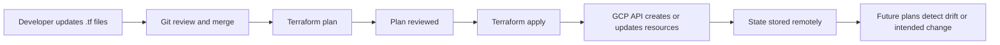
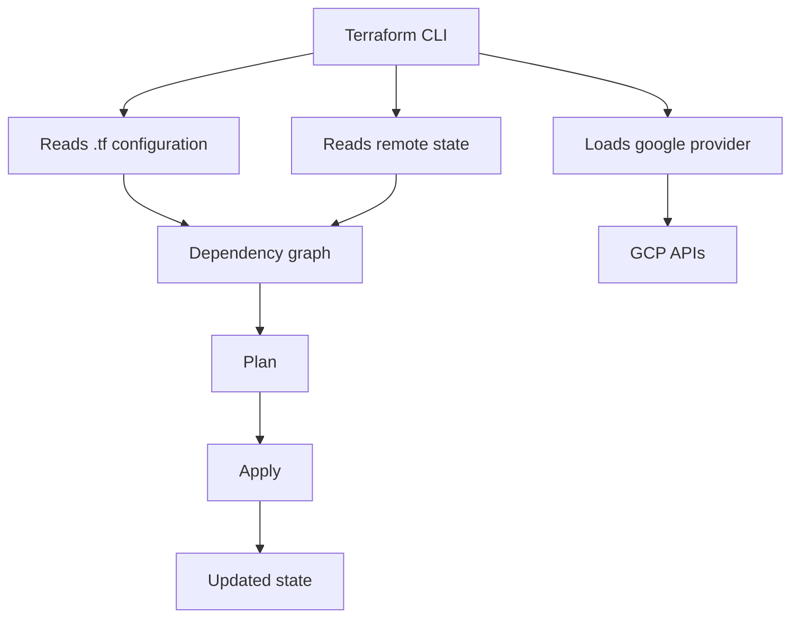
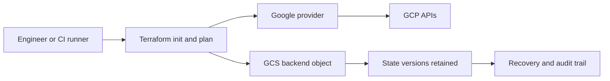
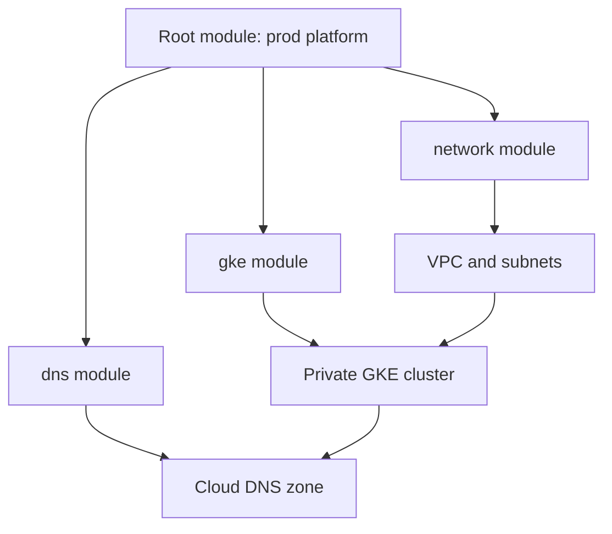
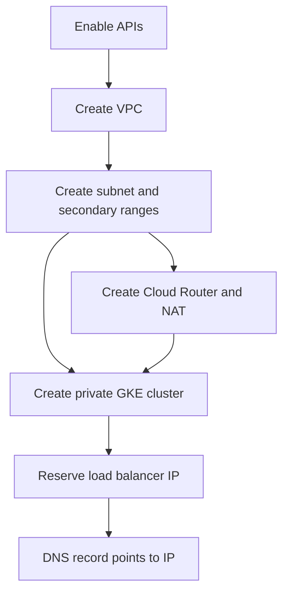
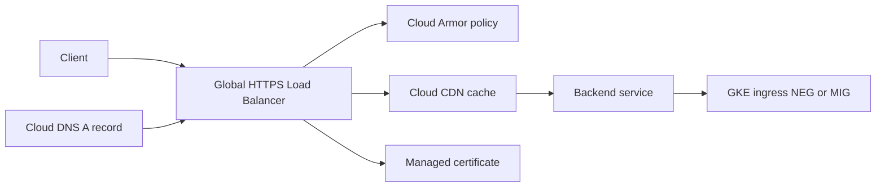
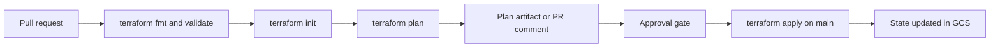
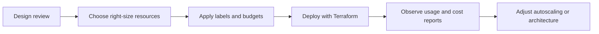

# Terraform on GCP — Complete Guide
This guide is a theory-first companion for Terraform code projects in this repository. It explains not only how to write Terraform, but why particular patterns are used on Google Cloud Platform (GCP). The examples assume you are provisioning real cloud infrastructure such as VPC networks, GKE clusters, Cloud DNS zones, HTTPS load balancers, Cloud Armor policies, and organization-level resources. The intent is to help you read project code, review pull requests, and make architecture decisions with confidence.
The guide is deliberately opinionated. It favors reproducibility, remote state, short-lived credentials, explicit module interfaces, and environment isolation. Those choices reduce drift, lower operational risk, and scale better when multiple engineers, pipelines, and Google Cloud projects are involved.

## 1. What is Infrastructure as Code (IaC)?
Infrastructure as Code is the practice of defining infrastructure in version-controlled files instead of creating resources manually through a console. In a GCP environment, that means describing projects, networks, IAM bindings, subnets, routers, NAT gateways, service accounts, DNS zones, GKE clusters, load balancers, storage buckets, and other resources as code that can be reviewed, planned, applied, and audited.
The most important idea is that infrastructure becomes a product of source code plus execution context. When a Terraform configuration says a VPC must have three subnets and a firewall policy, the desired state is documented in code. Terraform compares that desired state with the real state in GCP and generates a plan. That plan becomes the contract between the team and the platform.
This is especially valuable on GCP because many architectures span multiple scopes: organizations, folders, projects, regions, and global resources. Without IaC, those layers are easy to configure inconsistently. A manual change to one firewall rule or one IAM binding can silently diverge from the intended design. IaC turns that hidden drift into visible differences.
Terraform uses a declarative model. You describe the end state, such as a subnet with secondary ranges for GKE Pods and Services, and Terraform figures out how to create or update it. That differs from imperative shell scripts, where you manually sequence every API call. Declarative tooling is not magic, but it creates a clearer separation between desired outcome and execution details.

| Approach | How it works | Strengths | Weaknesses |
| --- | --- | --- | --- |
| Console clicks | Engineer uses the GCP UI | Fast for learning and experiments | Hard to review, repeat, or audit |
| gcloud scripts | Imperative API calls from shell | Good for bootstrap and ad hoc ops | Logic becomes fragile as systems grow |
| Terraform | Declarative desired state | Reviewable, repeatable, composable | Requires state and disciplined workflows |

In practice, most GCP teams use all three approaches, but for different layers. The console is useful for exploration, `gcloud` is useful for bootstrap operations and diagnostics, and Terraform is the system of record for long-lived infrastructure. For example, you might use `gcloud` once to create the remote state bucket, then let Terraform manage VPCs, project services, and IAM from that point onward.

A strong IaC workflow also changes team behavior. Instead of asking who clicked which checkbox in a project last month, you review Git history. Instead of recreating production settings from memory during an incident, you inspect the exact module versions and variable values used to build the environment. This is why platform teams often treat Terraform repositories as part of their operational documentation.
Another benefit is standardization. If every application team creates its own VPC, service account, or GKE cluster manually, you get inconsistent naming, logging, IAM, encryption, and networking behavior. A shared Terraform pattern lets you encode defaults such as VPC Flow Logs, private Google access, organization labels, or Cloud Armor protection so that every deployment starts from a secure baseline.
IaC does not remove the need for architecture decisions. It makes those decisions visible. A Terraform module that creates a public GKE cluster is still a design choice. IaC helps by making the choice explicit, reviewable, and easier to improve later. The code becomes the place where you explain why a shared VPC exists, why a project enables specific APIs, or why Cloud CDN is placed in front of a global HTTPS load balancer.
```text
$ gcloud projects describe my-prod-project --format='value(projectNumber)'
123456789012
$ terraform plan
Plan: 12 to add, 0 to change, 0 to destroy.
```
The expected output above illustrates a common workflow. `gcloud` helps you inspect an existing GCP project, while Terraform shows the delta between reality and your target architecture. The plan is useful because it converts a large configuration into a small, reviewable statement about change: how many resources will be added, modified, or destroyed.
If you remember only one sentence from this section, remember this: IaC is not just automation. It is a governance and reliability model for cloud infrastructure. On GCP, where identity, networking, and project boundaries matter deeply, that model is often the difference between a scalable platform and a collection of manual exceptions.

## 2. Terraform Fundamentals
Terraform is built around a few core concepts: providers, resources, data sources, variables, outputs, modules, and state. The provider translates Terraform resources into API calls. In GCP, the `google` provider knows how to create resources such as `google_compute_network`, `google_container_cluster`, or `google_dns_managed_zone`. Resources declare what to create. Data sources read existing information. Variables parameterize the configuration. Outputs publish useful values to humans or downstream automation. State tracks what Terraform believes it manages.
A Terraform run typically follows four main commands. `terraform init` installs providers and configures the backend. `terraform plan` compares desired and actual state. `terraform apply` executes the plan. `terraform destroy` removes managed resources. In team environments, `destroy` is usually restricted to ephemeral stacks and sandbox projects, because production destruction should be an exceptional and controlled action.
1. Write configuration that describes the target GCP architecture.
2. Initialize the working directory so Terraform can download the `hashicorp/google` provider and configure the backend.
3. Generate a plan to see how many resources will be created, changed, or destroyed.
4. Apply the reviewed plan using the intended credentials and environment variables.
5. Store the updated state so future plans know what already exists.
```hcl
terraform {
  required_version = ">= 1.6.0"
  required_providers {
    google = {
      source  = "hashicorp/google"
      version = "~> 5.39"
    }
  }
}
provider "google" {
  project = var.project_id
  region  = var.region
}
resource "google_project_service" "required" {
  for_each = toset(["compute.googleapis.com", "container.googleapis.com"])
  project  = var.project_id
  service  = each.value
}
resource "google_compute_network" "vpc" {
  name                    = "core-vpc"
  auto_create_subnetworks = false
}
```
This example already demonstrates several fundamentals. The Terraform block pins compatible provider versions so a future `init` does not silently pull a breaking change. The provider block defines the target project and region. `google_project_service` enables required APIs because many GCP resources fail if the API is disabled. The VPC disables auto mode because production designs should define subnets intentionally. The subnetwork includes secondary ranges because GKE VPC-native clusters need them for Pods and Services.
Notice the architecture reasoning behind these choices. Global routing mode is often selected because it simplifies east-west traffic patterns across regions, especially when a future shared VPC or multi-region service mesh is likely. Disabling auto-created subnets avoids legacy regional ranges that may conflict with custom network plans later. Outputting the subnet self link makes the root module easier to integrate with a GKE module or another stack.

Terraform builds a dependency graph before it applies changes. If a subnetwork references a VPC ID, the VPC must exist first. If a GKE cluster references a subnet and service networking, those dependencies are scheduled before the cluster. Most dependencies are implicit because references in code create edges in the graph. Explicit dependencies should be reserved for cases where the dependency exists operationally but not through a direct attribute reference.

| Terraform object | Purpose on GCP | Example |
| --- | --- | --- |
| Provider | Connects Terraform to the Google APIs | `provider "google"` |
| Resource | Manages a concrete object | `google_compute_firewall` |
| Data source | Reads an existing object | `data "google_project"` |
| Variable | Makes configuration reusable | `variable "project_id"` |
| Output | Exposes a value | `output "lb_ip"` |
| Module | Packages related resources | `module "network"` |
| State | Records managed instances | `terraform.tfstate` or remote backend |

One common misunderstanding is to treat Terraform as a shell wrapper. It is more accurate to think of it as a stateful graph engine. Because Terraform remembers what it manages, it can calculate safe updates, imports, replacements, and deletions. That statefulness is why careful backend design matters so much, and why deleting state files casually is dangerous.
The expected output from `init` normally confirms backend setup and provider installation, while `plan` summarizes the delta such as `Plan: 5 to add, 0 to change, 0 to destroy.` In reviews, that summary matters more than installer noise.
Finally, remember that Terraform is not the source of truth for every value. Some data should be looked up from GCP instead of duplicated in code. For example, a root module may use `data "google_project"` to read the numeric project number, or `data "google_client_config"` to read the active identity. That keeps configuration aligned with the real environment and reduces hard-coded values.

## 3. Provider Configuration
Provider configuration is where Terraform learns how to authenticate to GCP and which APIs, projects, regions, and zones to target. In small examples, the provider block seems trivial. In real estates, it becomes a control plane decision because credentials, impersonation, aliases, and beta features all affect how safely and predictably changes are applied.
The standard provider for GCP is `hashicorp/google`. It covers most generally available resources. The companion `hashicorp/google-beta` provider exposes beta or newly released fields sooner. A mature repository uses `google` by default and introduces `google-beta` only for resources or arguments that genuinely require it. That keeps blast radius low, because beta schemas can change more frequently.
```hcl
terraform {
  required_providers {
    google = {
      source  = "hashicorp/google"
      version = "~> 5.39"
    }
    google-beta = {
      source  = "hashicorp/google-beta"
      version = "~> 5.39"
    }
  }
}
provider "google" {
  project = var.project_id
  region  = var.region
}
provider "google" {
  alias   = "host_project"
  project = var.host_project_id
  region  = var.region
}
provider "google-beta" {
  project = var.project_id
  region  = var.region
}
```
Aliases are useful when the root module spans multiple projects or scopes. A shared VPC pattern might place the network in a host project while GKE clusters run in service projects. Using an aliased provider such as `google.host_project` makes the architecture explicit. It becomes obvious which resources belong in which project, which is safer than relying on the active CLI context or environment variables.
For local development, many teams start with Application Default Credentials (ADC). The simplest flow is to authenticate with `gcloud auth application-default login`, which writes user credentials to the ADC file that Terraform can read. This is convenient for labs and learning, but production pipelines should not rely on user credentials. They should use service account impersonation or Workload Identity Federation (WIF).
```text
$ gcloud auth application-default login
Your browser has been opened to visit:
    https://accounts.google.com/o/oauth2/auth/...
Credentials saved to file:
[/Users/you/.config/gcloud/application_default_credentials.json]
These credentials will be used by any library that requests Application Default Credentials (ADC).
```
ADC is easy, but user credentials create accountability and lifecycle problems in shared automation. A better pattern is to let a human or CI workload impersonate a deployment service account. That way, the Terraform permissions are attached to the service account, not to whoever happens to run the command. Auditing is cleaner, role assignment is centralized, and credential rotation becomes a platform concern rather than a developer habit.
```text
$ gcloud config set project my-platform-project
Updated property [core/project].
$ gcloud auth application-default set-quota-project my-platform-project
Credentials saved to ADC file for project [my-platform-project].
$ gcloud auth print-access-token
ya29.a0AfH6SM...
```
The quota project command is easy to overlook, but it matters when local user credentials call billable APIs. Setting a quota project reduces confusing warnings and aligns local experiments with the intended billing context.
```hcl
provider "google" {
  project                     = var.project_id
  region                      = var.region
  impersonate_service_account = var.terraform_service_account
}
variable "terraform_service_account" {
  type        = string
  description = "Deployment service account email"
}
```
Service account impersonation is a strong default for enterprise GCP. The user or CI runner needs `roles/iam.serviceAccountTokenCreator` on the deployment service account, while the deployment service account itself holds the infrastructure roles needed to manage projects, IAM, networking, or GKE. This separates identity establishment from privilege execution, which is easier to reason about in audits.
Workload Identity Federation takes the same idea further for CI/CD. Instead of storing a JSON key in GitHub Actions or another external system, the pipeline exchanges an external identity token for short-lived Google credentials. That removes one of the largest secret-management risks in Terraform automation: long-lived service account keys that get copied into multiple repositories or CI variables.

| Authentication method | Good for | Why teams use it | Main caution |
| --- | --- | --- | --- |
| `gcloud auth application-default login` | Local labs and initial testing | Fast setup and familiar | Tied to a person, not ideal for automation |
| Service account JSON key | Legacy automation | Simple to plug in | Long-lived secret, avoid when possible |
| Service account impersonation | Local ops and controlled CI | Centralized privileges, no local key files | Requires IAM setup for token creation |
| Workload Identity Federation | Modern CI/CD | Short-lived credentials, no key storage | Slightly more initial setup |

Use environment variables only when they clarify the execution context. Common examples include `GOOGLE_PROJECT`, `GOOGLE_REGION`, and `GOOGLE_IMPERSONATE_SERVICE_ACCOUNT`. Even then, prefer expressing stable configuration in code. Provider blocks and variable files are easier to review than a hidden shell environment.
```text
$ export GOOGLE_IMPERSONATE_SERVICE_ACCOUNT=tf-deployer@my-platform-project.iam.gserviceaccount.com
$ terraform plan
Refreshing Terraform state in-memory prior to plan...
Plan: 2 to add, 1 to change, 0 to destroy.
```
A final provider decision concerns version pinning. Pin compatible versions in the root module, test upgrades intentionally, and read provider changelogs when moving across major versions. The Google provider evolves quickly because GCP evolves quickly. Controlled version upgrades are part of platform engineering, not housekeeping.

## 4. Remote State Management
State is Terraform's memory of the infrastructure it manages. Without state, Terraform would not know whether a firewall rule already exists, whether a cluster must be updated in place, or which resource instance maps to a specific object in GCP. Because state is so important, storing it on a single laptop is not acceptable for team workflows. Remote state is the baseline.
On GCP, the standard backend is Google Cloud Storage (GCS). A dedicated state bucket provides central storage, version history, and IAM-based access control. The backend stores the state object remotely so every plan and apply uses the same source of truth. This also makes incident recovery easier because prior versions of the state file can be restored if necessary.
```hcl
terraform {
  backend "gcs" {
    bucket = "my-org-terraform-state"
    prefix = "networking/prod"
  }
}
```
The `prefix` acts like a folder path inside the bucket and should reflect a stable boundary such as environment, domain, or stack. For example, `folders/shared-vpc`, `platform/prod/gke`, or `apps/dev/cloud-run`. This naming matters because state boundaries are architecture boundaries. If too many unrelated resources share one state file, plans become noisy and applies become risky.
```hcl
resource "google_storage_bucket" "tf_state" {
  name                        = var.state_bucket_name
  location                    = "US"
  uniform_bucket_level_access = true
  public_access_prevention    = "enforced"
  force_destroy               = false
  versioning {
    enabled = true
  }
  encryption {
    default_kms_key_name = var.kms_key_id
  }
  lifecycle_rule {
    condition {
      num_newer_versions = 20
    }
    action {
      type = "Delete"
    }
  }
}
```
This bucket configuration reflects several good defaults. Uniform bucket-level access simplifies IAM and avoids accidental object ACLs. Public access prevention ensures state cannot become public through misconfiguration. Versioning is critical because it gives you a rollback path for corrupted state. CMEK-backed encryption is optional but often chosen in regulated environments to align with organization-wide key-management controls.
State backends are often bootstrapped outside the main stack. That sounds circular, because the backend must exist before Terraform can use it. A common pattern is to create the initial bucket with a one-time bootstrap configuration or a guarded `gcloud` command, then migrate all other stacks into the remote backend. Once bootstrapped, treat the bucket as critical platform infrastructure.
```text
$ gcloud storage buckets create gs://my-org-terraform-state     --project=my-platform-project     --location=US     --uniform-bucket-level-access
Creating gs://my-org-terraform-state/...
$ terraform init -migrate-state
Successfully configured the backend "gcs"!
Terraform has been successfully initialized!
```
The migration output above is what you want to see after moving local state into GCS. Once migrated, do not keep working from an old local state file or commit it accidentally. State often contains resource metadata, IAM member strings, generated values, and in some cases sensitive data. It belongs in secured remote storage, never in Git.

The GCS backend uses object generation checks to reduce conflicting writes, but teams should still serialize applies to the same state. In practice that means a CI workflow should allow multiple plans in parallel but only one apply per environment or stack at a time. Concurrency control in GitHub Actions, Cloud Build, or another orchestrator complements the backend and prevents race conditions.

| State choice | When it is acceptable | Why it is limited |
| --- | --- | --- |
| Local state | Personal experiment or disposable lab | Not shareable, easy to lose, no audit trail |
| Shared local file | Almost never | Weak access control and high corruption risk |
| GCS backend | Standard GCP team workflow | Requires initial bootstrap and IAM design |
| Separate bucket per team | Large regulated estates | More isolation, more operational overhead |

A good remote-state strategy also minimizes cross-stack coupling. Terraform can read outputs from another stack through `terraform_remote_state`, but overusing that pattern creates brittle dependencies. Prefer stable interfaces such as shared naming, data sources, or published parameters when possible. Use remote state outputs when the dependency is real and valuable, not because it is easy.
```gitignore
# Terraform working directory
.terraform/
# Terraform state - never commit
*.tfstate
*.tfstate.*
# Crash and override files
crash.log
override.tf
override.tf.json
*_override.tf
*_override.tf.json
# Variable files that may contain secrets
*.tfvars
*.tfvars.json
# CLI configuration and plans
.terraform.lock.hcl
*.tfplan
```
The `.gitignore` example should exist somewhere appropriate in the repository root or Terraform project root. The key principle is non-negotiable: never commit state files, plan files containing sensitive diffs, or secret-bearing variable files. If a value should not be public to every repository reader, assume it does not belong in Git.

## 5. Project Structure Best Practices
A good Terraform repository structure makes intent obvious. It should tell a reviewer where shared modules live, where environment roots live, where bootstrap code lives, and how state boundaries map to architecture boundaries. Project structure is not cosmetic. It directly affects review quality, blast radius, and how easy it is to delegate ownership across teams.
```text
terraform/
├── modules/
├── live/dev/
├── live/prod/
└── live/shared/bootstrap/
```
This layout separates reusable modules from deployable root modules. The `modules/` directory contains abstractions such as a VPC module or GKE module. The `live/` directory contains concrete environments with backend settings, variable values, and composition logic. That separation matters because root modules answer the question "what are we deploying here?" while reusable modules answer "how do we implement this pattern consistently?"
In GCP, environment directories are usually clearer than Terraform workspaces for long-lived stacks. A `live/prod/networking` directory can pin provider aliases, backend prefixes, labels, and IAM behavior for production networking without hidden workspace context. Reviewers can see exactly which environment is changing. This is preferable to running `terraform workspace select prod` and hoping everyone is in the correct workspace.
```hcl
module "network" {
  source     = "../../modules/network"
  project_id = var.host_project_id
  region     = var.region
  providers  = { google = google.host_project }
}
```
Notice how the environment root composes a reusable module and passes only environment-specific values. The root is where you declare that production uses a host project, uses a specific CIDR plan, and enables flow logs. The network module itself should stay focused on implementation details, not on business environment choices.

| Structure decision | Recommended default | Why |
| --- | --- | --- |
| Reusable logic | `modules/` directory or module registry | Keeps patterns DRY and reviewable |
| Deployable stacks | Separate root module per environment or domain | Makes backend, variables, and blast radius explicit |
| State boundaries | Split by environment and layer | Smaller plans and safer applies |
| Provider configuration | At root module | Avoids hidden credentials inside child modules |
| Secret values | External secret systems or CI variables | Prevents accidental Git exposure |

A common anti-pattern is a giant root module that provisions everything from organization folders to application DNS records in one state. It feels simple at first, but it scales poorly. A networking change then touches the same state as a billing budget or a Cloud Run service, which increases contention and review complexity. Smaller roots aligned to ownership boundaries are more resilient.
Name directories and state prefixes after architecture domains, not after engineers. `networking`, `security`, `platform`, `dns`, and `apps` age better than `alice-test` or `new-stack-final`. Infrastructure repositories often outlive multiple team rotations, so structure should optimize for future readers.
Keep provider version constraints and backend configuration close to the root. Keep module READMEs concise but explicit about required APIs, expected IAM, and outputs. The goal is that a new engineer can open a root module and understand what it provisions, which project it targets, what state it uses, and which child modules it composes within a few minutes.

## 6. Modules
A Terraform module is a package of resources that implements a reusable infrastructure pattern. Modules matter most when they capture a real design decision rather than just hiding lines of code. On GCP, useful modules often represent concepts such as a shared VPC, a private GKE cluster, a Cloud DNS zone, or a hardened HTTPS load balancer with Cloud Armor and Cloud CDN.
Good modules have a narrow interface and strong defaults. If a module requires thirty variables for a simple VPC, it is probably exposing too much internal detail. If it hides all meaningful choices, it becomes inflexible. The art is to expose the decisions that differ between environments, while keeping implementation consistency inside the module.
```hcl
variable "network_name" { type = string }
variable "subnet_cidr"  { type = string }
resource "google_compute_network" "this" {
  name                    = var.network_name
  auto_create_subnetworks = false
}
resource "google_compute_subnetwork" "this" {
  name                     = "primary"
  ip_cidr_range            = var.subnet_cidr
  network                  = google_compute_network.this.id
  private_ip_google_access = true
}
```
This module is intentionally opinionated. It always creates a custom-mode VPC, enables private Google access, and reserves secondary ranges for GKE. Those are sensible defaults for many platform environments. If a team needs a very different network design, it may deserve a different module instead of gradually turning one module into a giant switchboard.

There is no requirement to build every module yourself. The `terraform-google-modules` ecosystem maintained by Google and the community contains mature modules for many common patterns, including project factories, network stacks, and GKE. Using them can accelerate delivery, but you should still read their interfaces and version notes carefully. A third-party module is part of your architecture once you depend on it.
```hcl
module "gke" {
  source  = "terraform-google-modules/kubernetes-engine/google//modules/private-cluster"
  version = "~> 35.0"
  name    = "prod-private-gke"
  region  = var.region
}
```
The architecture decision here is clear: the cluster is private because platform teams usually want worker nodes without public IPs. A private endpoint may remain disabled if administrators still need API access from controlled public addresses or through an authorized network path. These are not arbitrary flags. They encode how operators will reach the cluster and how much public exposure is acceptable.

| Module source | Best use case | Why teams choose it |
| --- | --- | --- |
| Local custom module | Organization-specific controls | Full ownership and exact fit |
| `terraform-google-modules` | Common GCP platforms | Mature patterns and community support |
| Private internal registry | Shared company standards | Central versioning and discoverability |
| Raw resources only | Very small or novel patterns | Maximum control, more repeated code |

Version your modules deliberately. Root modules should pin versions for external modules so that plans remain stable across time. Upgrading a module is a real infrastructure change because defaults, resource names, or provider requirements can shift. Treat module upgrades like application dependency upgrades: read release notes, plan in a non-production environment, and promote intentionally.
Outputs are part of the module interface. Publish only values that are genuinely useful, such as network self links, subnet names, service account emails, or load balancer IPs. Avoid leaking internal implementation details unless downstream modules truly need them. A compact interface reduces accidental coupling.

## 7. Variables and Environments
Variables let you reuse Terraform across projects, regions, and environments without duplicating the entire configuration. In GCP repositories, variables often capture project IDs, folder IDs, billing account IDs, regions, subnet CIDRs, DNS suffixes, labels, authorized CIDRs, and feature flags such as whether a service enables Cloud Armor or private nodes.
A useful rule is to put stable platform intent in code and environment-specific values in variable files. For example, the fact that all clusters should be private may belong in module defaults. The specific project ID, region, or CIDR block belongs in `prod.tfvars` or an environment-specific root module. This keeps the architecture consistent while allowing each environment to express its own scale and identity.
```hcl
variable "project_id" { type = string }
variable "region" {
  type = string
  validation {
    condition     = contains(["us-central1", "us-east1", "europe-west1"], var.region)
    error_message = "Use an approved region."
  }
}
variable "common_labels" { type = map(string) }
```
Type constraints and validation blocks are worth the small extra effort. They turn bad assumptions into fast feedback. If only approved regions are allowed, encode that rule. If a variable must match an RFC1035 name pattern or a list of known environments, validate it. Terraform is not just for creating resources; it is also a place to express infrastructure policy at the interface boundary.
```hcl
project_id = "my-prod-project"
region     = "us-central1"
common_labels = { environment = "prod", owner = "platform" }
```
Be careful with sensitive variables. Marking a variable as `sensitive = true` affects display behavior, but it does not magically prevent a value from existing in state or logs when a resource stores it. For application secrets, prefer storing the secret in Secret Manager and passing references or using platform-native mechanisms. Terraform should usually create the container and IAM around secrets, not manage secret payload rotation itself.

| Environment strategy | Recommended for GCP? | Notes |
| --- | --- | --- |
| Separate root directories per environment | Yes | Explicit, reviewable, works well with distinct state backends |
| Terraform workspaces for long-lived envs | Usually no | Hidden context and harder to tailor backend/provider config |
| One state for all environments | No | Large blast radius and confusing plans |
| One repo per environment | Sometimes | Strong isolation, but more duplication |

The reason many teams avoid workspaces for major environments is not that workspaces are broken. It is that GCP environments often differ in more than variable values. Production may use different providers, different service projects, stricter IAM, different backend prefixes, and different routing or DNS policies. Separate roots make those distinctions visible.
```hcl
locals {
  name_prefix       = "${var.common_labels.environment}-${var.region}"
  required_services = ["compute.googleapis.com", "container.googleapis.com"]
}
```
Locals are useful for computed values that do not belong in the public module interface. A name prefix, a standardized set of required APIs, or a derived DNS zone name often fits better in `locals` than in additional variables. This reduces noise in the interface while keeping naming conventions consistent. Reproducible environments should run non-interactively with explicit variable files or CI inputs.

## 8. Resource Dependencies and Lifecycle
Resource ordering matters in cloud infrastructure. A GKE cluster cannot attach to a subnet that does not exist. A service project cannot use a shared VPC before the attachment exists. A Cloud DNS record should not point to a load balancer address that has not been reserved. Terraform solves much of this automatically through references, but understanding dependencies helps you design reliable plans.
The preferred approach is implicit dependency. If `google_compute_subnetwork.gke.network` references `google_compute_network.vpc.id`, Terraform knows the VPC must be created first. This is clearer than adding `depends_on` everywhere. Explicit `depends_on` is still useful for cases where one resource must wait for another operationally, even if no direct attribute reference exists.
```hcl
resource "google_project_service" "container" {
  project            = var.project_id
  service            = "container.googleapis.com"
  disable_on_destroy = false
}
resource "google_container_cluster" "primary" {
  name     = "app-cluster"
  location = var.region
  network    = google_compute_network.vpc.id
  subnetwork = google_compute_subnetwork.gke.id
  depends_on = [google_project_service.container]
}
```
The explicit dependency above is justified because enabling an API is a prerequisite for the cluster creation even though the cluster resource does not directly reference an output field from the API-enabling resource. Without `depends_on`, Terraform may still succeed sometimes, but plan reliability would depend on provider timing and API propagation.
```hcl
resource "google_compute_instance_template" "web" {
  name_prefix  = "web-"
  machine_type = "e2-standard-2"
  disk {
    source_image = "projects/debian-cloud/global/images/family/debian-12"
    auto_delete  = true
    boot         = true
  }
  lifecycle {
    create_before_destroy = true
  }
}
```
`create_before_destroy` is an important lifecycle tool when a replacement would otherwise cause downtime. Instance templates, target pools, and some load-balancer-adjacent resources often benefit from this. The trade-off is that names may need prefixes rather than fixed names, because the old and new objects can temporarily coexist.
```hcl
resource "google_compute_global_address" "lb_ip" {
  name = "prod-shared-lb-ip"
  lifecycle {
    prevent_destroy = true
  }
}
```
Use `prevent_destroy` sparingly but intentionally for resources whose deletion would be catastrophic or painful to recover, such as a shared static IP, a production DNS zone, or the state bucket itself. This lifecycle guard is not a substitute for process control, but it adds a last line of defense against accidental destruction.
```hcl
resource "google_container_node_pool" "default" {
  name       = "primary-pool"
  cluster    = google_container_cluster.primary.name
  location   = var.region
  node_count = 3
  lifecycle {
    ignore_changes = [node_count]
  }
}
```
`ignore_changes` can be useful when another controller intentionally manages a field, such as autoscaling behavior adjusting node count. However, it should be applied carefully. Every ignored field is a field Terraform will stop reconciling, which may hide unwanted drift. Ignore only the attributes you truly want another system to own.

The dependency graph above mirrors a common private GKE design. The network must exist before the cluster, Cloud NAT must exist before nodes can reach the internet without public IPs, and DNS should point to the final load balancer address only when it is known. Terraform helps orchestrate this, but your architecture still decides which dependencies are real.
Lifecycle settings should reflect operational intent. If a resource is cheap and ephemeral, replacement is fine. If it is a shared network primitive, replacement may be disruptive or impossible. Thinking through lifecycle early prevents surprises during upgrades or refactors.

## 9. Cloud-Specific Patterns (10 explained)
Terraform patterns become most valuable when they encode how GCP actually works. The following ten patterns appear repeatedly in real projects because they align with Google Cloud control-plane behavior, network architecture, and identity design.

| # | Pattern | Typical GCP scope | Main reason |
| --- | --- | --- | --- |
| 1 | Project bootstrap and API enablement | Project | Many resources fail until APIs are enabled |
| 2 | Shared VPC with service projects | Folder / multiple projects | Centralized network control |
| 3 | Private GKE with Cloud NAT | Project / region | Nodes stay private while retaining egress |
| 4 | Global HTTPS LB with CDN and Armor | Global | Secure and accelerate internet traffic |
| 5 | Managed DNS and certificate flow | Global / DNS | Clean public entry points |
| 6 | Folder and project factories | Organization | Standardized guardrails |
| 7 | Service account impersonation | Org / project | Short-lived, auditable access |
| 8 | Event-driven stacks | Project | Loose coupling for apps |
| 9 | State split by architecture boundary | Repo / backend | Safer plans and ownership |
| 10 | Selective `google-beta` usage | Provider layer | Access new features without overexposure |

### Pattern 1: Project bootstrap and API enablement
GCP projects are the main isolation boundary for billing, quotas, IAM, and service usage. A project bootstrap module often creates or configures the project, attaches billing, applies labels, and enables foundational APIs such as Compute Engine, IAM, Cloud Resource Manager, Container, Logging, Monitoring, and Secret Manager. This pattern exists because many later resources fail with opaque errors if the relevant API is not enabled.
```hcl
resource "google_project_service" "base" {
  for_each = toset([
    "compute.googleapis.com",
    "iam.googleapis.com",
    "container.googleapis.com",
    "secretmanager.googleapis.com",
    "logging.googleapis.com",
    "monitoring.googleapis.com"
  ])
  project            = var.project_id
  service            = each.value
  disable_on_destroy = false
}
```
The design choice to set `disable_on_destroy = false` is deliberate. In most organizations, deleting a Terraform stack should not disable core APIs for a surviving project, because other resources or teams may still depend on them.

### Pattern 2: Shared VPC with service projects
Shared VPC centralizes subnet, route, firewall, and connectivity management in a host project while allowing application or platform workloads to run in separate service projects. This is a strong pattern when multiple teams need isolated projects but should not each design their own networking. It also simplifies hybrid connectivity because the network team manages fewer central VPCs.
```hcl
resource "google_compute_shared_vpc_host_project" "host" {
  project = var.host_project_id
}
resource "google_compute_shared_vpc_service_project" "service" {
  host_project    = var.host_project_id
  service_project = var.service_project_id
}
```
The architectural benefit is separation of concerns. Networking standards live once in the host project, while service projects remain cleaner places for workloads, budgets, and workload IAM. This often maps well to enterprise GCP folder structures.

### Pattern 3: Private GKE with Cloud NAT
Private GKE is common because worker nodes should not need public IP addresses. Instead, nodes live in private subnets and use Cloud NAT for egress to pull images, reach external package mirrors, or contact public APIs. The pattern reduces public exposure while preserving operational connectivity.
```hcl
resource "google_compute_router" "nat" {
  name    = "prod-router"
  region  = var.region
  network = google_compute_network.vpc.id
}
resource "google_compute_router_nat" "nat" {
  name                               = "prod-nat"
  router                             = google_compute_router.nat.name
  region                             = var.region
  nat_ip_allocate_option             = "AUTO_ONLY"
  source_subnetwork_ip_ranges_to_nat = "ALL_SUBNETWORKS_ALL_IP_RANGES"
}
```
This is chosen because public nodes create a larger attack surface and complicate outbound IP governance. Cloud NAT also lets you reason about egress more centrally, including logging and static NAT IP strategies when external partners need allowlists.

### Pattern 4: Global HTTPS load balancer with Cloud CDN and Cloud Armor
Internet-facing applications on GCP often sit behind the global external HTTPS load balancer. Adding Cloud CDN caches cacheable responses close to users, while Cloud Armor applies edge security policies such as IP allowlists, geoblocking, WAF rules, or rate limiting. Terraform is useful here because the final topology spans many interdependent resources.

```hcl
resource "google_compute_backend_service" "app" {
  name                  = "app-backend"
  protocol              = "HTTP"
  port_name             = "http"
  load_balancing_scheme = "EXTERNAL_MANAGED"
  enable_cdn            = true
  security_policy       = google_compute_security_policy.edge.self_link
}
resource "google_compute_security_policy" "edge" {
  name = "app-edge-policy"
  rule {
    action   = "allow"
    priority = 1000
    match {
      versioned_expr = "SRC_IPS_V1"
      config {
        src_ip_ranges = ["0.0.0.0/0"]
      }
    }
    description = "Default allow, refine with WAF or rate limit rules"
  }
}
```
The architecture decision is that security and acceleration belong at the edge. Enabling CDN in the backend service improves latency and reduces origin load for static or cacheable responses. Attaching Cloud Armor to the backend service places policy enforcement close to the entry point rather than inside the application.

### Pattern 5: Managed DNS and certificate flow
Cloud DNS and Google-managed certificates are natural partners for public services. Terraform can reserve the load-balancer IP, create DNS records, and provision certificate resources so the entire public entry path is codified. This avoids hand-managed DNS changes that often become a source of outages.
```hcl
resource "google_dns_managed_zone" "public" {
  name        = "example-com"
  dns_name    = "example.com."
  description = "Public zone for example.com"
}
resource "google_dns_record_set" "app" {
  name         = "app.${google_dns_managed_zone.public.dns_name}"
  managed_zone = google_dns_managed_zone.public.name
  type         = "A"
  ttl          = 300
  rrdatas      = [google_compute_global_address.lb_ip.address]
}
```
The short TTL is an operational choice. It allows faster cutovers during migrations at the expense of slightly more query traffic. Terraform makes this choice explicit and repeatable across environments.

### Pattern 6: Folder and project factories
Large GCP organizations benefit from project factories that create projects with consistent billing, labels, APIs, IAM, logging sinks, and folder placement. Terraform is excellent for this because folder and project creation are policy-heavy tasks. Using a factory pattern means application teams request a project standard rather than assembling one manually.
```hcl
module "project_factory" {
  source  = "terraform-google-modules/project-factory/google"
  version = "~> 16.0"
  name              = "payments-prod"
  random_project_id = false
  org_id            = var.org_id
  folder_id         = var.folder_id
  billing_account   = var.billing_account
  activate_apis = [
    "compute.googleapis.com",
    "run.googleapis.com",
    "secretmanager.googleapis.com"
  ]
}
```
The decision to use a project factory is about consistency and speed. It is easier to apply baseline controls once in a reusable pattern than to audit dozens of hand-created projects later.

### Pattern 7: Service account impersonation and least privilege
Platform automation should use short-lived credentials and purpose-specific service accounts. Terraform configurations often create service accounts, grant them narrowly scoped roles, and let humans or CI runners impersonate them. This pattern aligns well with GCP audit logging and avoids the operational burden of service account key files.
```hcl
resource "google_service_account" "tf_deployer" {
  account_id   = "tf-deployer"
  display_name = "Terraform deployment identity"
}
resource "google_project_iam_member" "network_admin" {
  project = var.project_id
  role    = "roles/compute.networkAdmin"
  member  = "serviceAccount:${google_service_account.tf_deployer.email}"
}
```
The reason to split roles is that infrastructure automation rarely needs broad owner permissions. A network deployment account should not automatically administer Cloud SQL or billing. Least privilege makes mistakes smaller and audits easier.

### Pattern 8: Event-driven workloads with Pub/Sub and Cloud Run
Not every Terraform project is about networking. GCP teams often provision event-driven application infrastructure: Pub/Sub topics, service accounts, Cloud Run services, and IAM bindings that allow invocations. Terraform is well-suited for this because the pattern has multiple identity relationships and naming dependencies.
```hcl
resource "google_pubsub_topic" "orders" {
  name = "orders"
}
resource "google_cloud_run_v2_service" "processor" {
  name     = "orders-processor"
  location = var.region
  template {
    service_account = google_service_account.runtime.email
    containers {
      image = var.image
    }
  }
}
```
The architecture choice is loose coupling. Pub/Sub decouples producers from consumers, while Cloud Run scales per demand. Terraform stitches together the IAM and service definitions so the event path is deployable and reviewable.

### Pattern 9: Separate state per boundary
State partitioning is a cloud pattern, not just a tooling pattern. Put shared networking in one state, security policy in another, and application workloads in separate roots. This mirrors team ownership and reduces the risk that a change in one domain accidentally plans modifications in another. It also minimizes how often unrelated teams block each other on backend concurrency.
On GCP, this pattern is especially useful because organization, folder, project, and workload resources often have different ownership models and deployment cadences. A DNS team may update zones weekly while a platform team updates GKE monthly.

### Pattern 10: `google` versus `google-beta` provider strategy
Use the stable `google` provider everywhere you can. Introduce `google-beta` only for resources or arguments that require beta support, and keep those usages visible. This pattern lowers risk because the majority of your infrastructure remains on the stable schema while you adopt new GCP features selectively.
```hcl
resource "google_compute_region_backend_service" "stable" {
  provider              = google
  name                  = "stable-backend"
  protocol              = "HTTP"
  load_balancing_scheme = "INTERNAL_MANAGED"
}
resource "google_container_cluster" "preview_feature" {
  provider = google-beta
  name     = "preview-cluster"
  location = var.region
}
```
The architecture reason is operational confidence. New features are useful, but using beta everywhere creates unnecessary upgrade and schema-change risk. A selective strategy lets you innovate without turning the whole estate into an experiment.

## 10. CI/CD for Terraform
Terraform becomes significantly safer when plans and applies run through CI/CD. The pipeline gives you consistent tooling versions, non-interactive execution, auditable logs, policy checks, and controlled credentials. For GCP repositories hosted on GitHub, a common pattern is GitHub Actions plus Workload Identity Federation. For Google-native pipelines, Cloud Build is also a strong option.
A standard Terraform pipeline has five stages: format and validation, initialization, plan generation, human review or policy review, and apply. Production applies should usually happen only after the plan has been reviewed in the pull request or after an environment-protected approval step. This keeps infrastructure changes aligned with code review rather than ad hoc terminal commands.

```yaml
name: terraform
on:
  pull_request:
    paths:
      - 'terraform/**'
  push:
    branches: [main]
    paths:
      - 'terraform/**'
jobs:
  plan:
    runs-on: ubuntu-latest
    permissions:
      contents: read
      id-token: write
      pull-requests: write
    steps:
      - uses: actions/checkout@v4
      - uses: google-github-actions/auth@v2
        with:
          workload_identity_provider: projects/123456789012/locations/global/workloadIdentityPools/github/providers/actions
          service_account: tf-deployer@my-platform-project.iam.gserviceaccount.com
      - uses: hashicorp/setup-terraform@v3
        with:
          terraform_version: 1.8.5
      - run: terraform -chdir=terraform/live/prod/networking fmt -check
      - run: terraform -chdir=terraform/live/prod/networking init -input=false
      - run: terraform -chdir=terraform/live/prod/networking validate
      - run: terraform -chdir=terraform/live/prod/networking plan -input=false -out=tfplan
  apply:
    if: github.ref == 'refs/heads/main'
    needs: plan
    runs-on: ubuntu-latest
    concurrency: terraform-prod-networking
    permissions:
      contents: read
      id-token: write
    steps:
      - uses: actions/checkout@v4
      - uses: google-github-actions/auth@v2
        with:
          workload_identity_provider: projects/123456789012/locations/global/workloadIdentityPools/github/providers/actions
          service_account: tf-deployer@my-platform-project.iam.gserviceaccount.com
      - uses: hashicorp/setup-terraform@v3
        with:
          terraform_version: 1.8.5
      - run: terraform -chdir=terraform/live/prod/networking init -input=false
      - run: terraform -chdir=terraform/live/prod/networking apply -input=false -auto-approve
```
Two design decisions in this workflow are worth highlighting. First, the pipeline uses Workload Identity Federation instead of a service account key file, which removes long-lived secrets from GitHub. Second, the apply job uses a concurrency group so that only one apply can modify the same production state at a time. This complements GCS backend protections and keeps production state transitions serialized.
```text
$ terraform validate
Success! The configuration is valid.
$ terraform plan -input=false
Plan: 3 to add, 1 to change, 0 to destroy.
```
A plan artifact is useful when you want the exact reviewed plan to be applied later, but remember that plan files can contain sensitive details and should not be retained indefinitely or exposed broadly. Some teams prefer to regenerate the plan during the apply step and rely on branch protection plus serialized main-branch merges. The right choice depends on your review model and compliance requirements.

| CI/CD platform | Strengths for Terraform on GCP | Common reason to choose it |
| --- | --- | --- |
| GitHub Actions + WIF | Works well for GitHub-hosted repos, no SA keys | Simple PR integration |
| Cloud Build | Google-native IAM and logging | Strong fit for GCP-centric organizations |
| Jenkins or other runners | Flexible, legacy-friendly | Existing enterprise standard |
| Terraform Cloud | Built-in Terraform UX and policy workflows | Teams wanting hosted Terraform control plane |

Whatever CI system you choose, keep the same operational rules: pin Terraform and provider versions, use remote state, prevent parallel applies to the same stack, avoid interactive prompts, and make identity short-lived and auditable.

## 11. Security Best Practices
Security in Terraform on GCP is mostly about identity, state, IAM scope, and secret handling. The configuration language is not inherently insecure, but it makes it easy to accidentally spread privilege if you treat all infrastructure changes the same. Strong repositories make security decisions visible and repeatable.
1. Never commit Terraform state files, plan files, or secret-bearing `tfvars` files.
2. Prefer Workload Identity Federation or service account impersonation over JSON key files.
3. Grant deployment service accounts only the roles needed for their scope.
4. Store secrets in Secret Manager or another secret system and pass references when possible.
5. Use separate service accounts for networking, platform, and application layers when ownership differs.
6. Enable logging, labels, and auditability so changes can be traced back to an identity and a commit.
A practical security baseline for a GCS state bucket includes uniform bucket-level access, public access prevention, versioning, and tightly scoped IAM. Read access to state is sensitive because even if the file does not contain passwords, it can reveal network topology, IAM members, service account names, and private addresses. Treat state as confidential infrastructure metadata.
```hcl
resource "google_storage_bucket_iam_binding" "state_admins" {
  bucket = google_storage_bucket.tf_state.name
  role   = "roles/storage.objectAdmin"
  members = [
    "serviceAccount:tf-deployer@my-platform-project.iam.gserviceaccount.com"
  ]
}
```
Use narrow bucket IAM rather than broad project-wide storage roles when possible. This limits accidental access from other workloads in the same project. In larger organizations, the state bucket often lives in a dedicated project to separate its lifecycle from application workloads.
Secrets need special attention. Terraform can create Secret Manager secret containers and IAM around them safely, but managing live secret payload values in Terraform is usually a poor fit because secret data may end up in state. A better design is for Terraform to provision the secret and grant runtime access, while the secret value itself is rotated by a separate secure process.
```hcl
resource "google_secret_manager_secret" "db_password" {
  secret_id = "db-password"
  replication {
    auto {}
  }
  labels = {
    managed-by = "terraform"
  }
}
```
For identity, prefer one service account per deployment domain. A CI job that manages organization folders should not share an identity with an application stack that only needs Cloud Run and Pub/Sub. Splitting identities makes privilege reviews simpler and limits impact if a workflow is misconfigured.
Security also includes network posture. If Terraform creates firewall rules, explain why each ingress rule exists and keep them narrow. If Terraform creates GKE clusters, prefer private nodes and authorized master access patterns. If Terraform creates load balancers, attach Cloud Armor where internet exposure exists. Terraform gives you the mechanism, but secure architecture requires deliberate defaults.
```text
$ terraform plan
  # google_secret_manager_secret.db_password will be created
  + labels = {
      + "managed-by" = "terraform"
    }
Plan: 1 to add, 0 to change, 0 to destroy.
```
The output above is intentionally boring. That is good. Security controls in Terraform should mostly look like explicit labels, IAM bindings, secure backends, and least-privilege identities rather than spectacular complexity.
Finally, use code review as a security control. Reviewers should look for wildcard IAM roles, public buckets, `0.0.0.0/0` firewall rules, public node pools, committed secrets, and unpinned module versions. Infrastructure code reviews are security reviews by default.

## 12. Troubleshooting Common Issues
Even well-designed Terraform stacks hit operational issues. The key is to diagnose whether the problem comes from Terraform syntax, provider behavior, state, IAM, API enablement, quotas, or an external GCP dependency. Terraform is only one layer in the system, so effective troubleshooting often combines `terraform` commands with `gcloud` inspection.

| Symptom | Likely cause | First checks |
| --- | --- | --- |
| `Error 403` from provider | Missing IAM or wrong project | Confirm active identity and project |
| API not enabled error | Required service disabled | Check `google_project_service` and `gcloud services list` |
| State lock or write conflict | Parallel apply or backend issue | Check CI concurrency and rerun safely |
| Resource already exists | Drift or pre-existing manual object | Import or rename resource |
| Unsupported argument | Provider version mismatch | Check provider docs and `terraform providers` |
| Quota exceeded | Regional or project quota limit | Inspect quotas with `gcloud` or console |

### Issue 1: Authentication or ADC failures
If Terraform cannot authenticate locally, start by checking ADC. User environments often have expired sessions or missing quota projects. Re-running the ADC login is a common fix for labs and local debugging.
`gcloud auth application-default login` usually ends by saving ADC credentials under the local gcloud config directory, and `gcloud auth application-default print-access-token` confirms that Terraform can obtain a token.
If CI fails instead, inspect the Workload Identity Federation configuration, the service account email, and the trust relationship between the external identity provider and Google Cloud. Most WIF failures are permission or audience mismatches, not Terraform syntax problems.

### Issue 2: APIs are not enabled
A surprisingly high number of GCP Terraform errors come from disabled APIs. The provider may return errors that mention unsupported services, missing endpoints, or permission-like messages when the real issue is service activation.
A fast check is `gcloud services list --enabled --project my-prod-project | grep container`. If Terraform still says the API has not been used before or is disabled, enable it in Terraform and allow propagation time.
The fix is to enable the service explicitly in Terraform, depend on it where needed, and allow a little propagation time for newly enabled APIs in bootstrap flows.

### Issue 3: Existing resources and imports
If a resource already exists because someone created it manually, Terraform cannot simply take it over without an import. Otherwise you may see `alreadyExists` or naming conflicts. Importing maps the real object to the Terraform resource address in state.
A typical import looks like `terraform import google_compute_network.vpc projects/my-prod-project/global/networks/core-vpc`, followed by an immediate `terraform plan` to see whether the imported object matches the configuration.
After import, run `terraform plan` immediately. The goal is to see whether your configuration matches the existing object or whether Terraform wants to update it. Imports solve ownership, but they do not solve drift by themselves.

### Issue 4: Provider schema mismatches
If Terraform reports an unsupported argument or unexpected behavior, verify whether the field belongs to the stable provider or only to `google-beta`. Also check the pinned provider version. GCP provider releases move quickly, so documentation and local plugin versions can drift apart if upgrades are unmanaged.
`terraform providers` and `terraform version` are the fastest checks when a field appears unsupported. They tell you whether the local plugin set matches the documentation you are reading.

### Issue 5: State drift and manual changes
If a plan wants to modify a resource you did not expect to change, inspect whether someone altered the object manually in the console or via `gcloud`. This is common with IAM, firewall rules, and autoscaling settings. Use `terraform state show`, `terraform plan`, and targeted `gcloud describe` commands to compare intent with reality.
Use `terraform state list` to confirm which objects are managed and `terraform state show <address>` to compare recorded attributes with the live GCP resource.
Avoid reaching for `terraform refresh` as a ritual. Modern Terraform refreshes state during planning. The real question is whether the configuration should be updated to match reality, or reality should be changed back to match configuration.

### Issue 6: Quota and regional constraints
GCP quotas can block otherwise correct plans. GPU availability, IP address quotas, forwarding rule quotas, and regional CPU limits are common examples. In these cases Terraform is the messenger, not the cause. Investigate the project, region, and quota type directly in GCP.
A good troubleshooting habit is to reproduce the failure path with the smallest relevant scope, gather the exact provider error, and then inspect the underlying GCP resource or API manually. That keeps you from making unnecessary Terraform changes when the real issue is IAM, quota, or API readiness.

## 13. Cost Management with Terraform
Terraform does not optimize cost automatically, but it gives you a reliable place to encode cost-aware defaults and controls. On GCP, cost management often starts with project structure, labels, budgets, machine sizing, autoscaling policy, deletion of idle resources, and conscious use of premium features such as global load balancing, Cloud NAT, Cloud CDN, or committed use discounts.
The first cost control is tagging and labeling. If resources cannot be associated with an environment, owner, and cost center, later analysis becomes hard. Apply labels consistently in modules where supported. Labels are simple, but they enable meaningful billing exports and cost dashboards.
```hcl
resource "google_compute_instance" "bastion" {
  name         = "prod-bastion"
  machine_type = "e2-medium"
  labels       = merge(var.common_labels, { workload = "operations" })
}
```
Choosing `e2-medium` for a bastion is an architecture decision, not just a syntax choice. Bastions are usually lightly used, so an oversized machine is wasteful. Terraform makes the machine type visible in code review, which helps teams challenge resource sizing early rather than after the bill arrives.
```hcl
resource "google_billing_budget" "platform_budget" {
  billing_account = var.billing_account
  display_name    = "platform-prod-budget"
  amount {
    specified_amount {
      currency_code = "USD"
      units         = "2000"
    }
  }
  threshold_rules {
    threshold_percent = 0.5
  }
  threshold_rules {
    threshold_percent = 0.9
  }
}
```
Budgets do not stop spending automatically, but they make cost signals visible. In larger environments, a budget module per folder, platform, or project family helps finance and engineering speak a shared language about intended spend.

| Cost lever | Terraform pattern | Why it works |
| --- | --- | --- |
| Right sizing | Explicit machine types and node pools | Reviewers can challenge oversized defaults |
| Autoscaling | Configure min/max capacity intentionally | Avoids permanently overprovisioned fleets |
| Ephemeral environments | Separate stacks with controlled destroy | Sandbox costs do not linger forever |
| Labels | Standardized `common_labels` | Better billing analysis and chargeback |
| Budgets | `google_billing_budget` | Early visibility into spend growth |
| Network design | Shared VPC and centralized egress | Reduces duplicated infrastructure |

Some cost decisions are architectural trade-offs rather than pure savings. A global HTTPS load balancer with Cloud CDN may cost more than a minimal regional service, but it can reduce origin traffic and improve latency for global users. Private GKE with Cloud NAT adds components, but it improves security posture. Cost management should evaluate total system value, not just resource count.
Use Terraform to clean up what should not persist. Review sandbox environments for abandoned static IPs, forwarding rules, unattached disks, and test GKE clusters. Because Terraform knows what it created, ephemeral stacks can be destroyed systematically rather than by manual guessing.

A mature cost practice also considers state design. If each ephemeral environment has its own backend prefix and root module, it is much easier to identify and destroy that environment cleanly. Cost control is therefore linked to repository structure, naming, and lifecycle patterns discussed earlier in this guide.

## 14. Official References
The following references are worth bookmarking. They are the primary sources for provider arguments, backend behavior, authentication patterns, and GCP service-specific resource details. When provider behavior seems surprising, official documentation should be your first checkpoint.

| Topic | Official reference |
| --- | --- |
| Terraform language docs | https://developer.hashicorp.com/terraform/language |
| Terraform CLI docs | https://developer.hashicorp.com/terraform/cli |
| Google provider docs | https://registry.terraform.io/providers/hashicorp/google/latest/docs |
| Google Beta provider docs | https://registry.terraform.io/providers/hashicorp/google-beta/latest/docs |
| GCS backend docs | https://developer.hashicorp.com/terraform/language/settings/backends/gcs |
| Google Cloud authentication for Terraform | https://cloud.google.com/docs/terraform/authentication |
| Google Cloud Terraform samples | https://cloud.google.com/docs/terraform/samples |
| Terraform on Google Cloud overview | https://cloud.google.com/docs/terraform |
| terraform-google-modules registry | https://registry.terraform.io/namespaces/terraform-google-modules |
| GKE with Terraform docs | https://cloud.google.com/kubernetes-engine/docs/terraform |
| Cloud DNS docs | https://cloud.google.com/dns/docs |
| Cloud Armor docs | https://cloud.google.com/armor/docs |
| Cloud CDN docs | https://cloud.google.com/cdn/docs |
| Resource Manager folders and org docs | https://cloud.google.com/resource-manager/docs |
| Workload Identity Federation docs | https://cloud.google.com/iam/docs/workload-identity-federation |

Use the provider registry when you need exact argument names or import formats. Use the Google Cloud documentation when you need service architecture, limits, quotas, and security guidance. The best Terraform engineers move comfortably between both, because syntax and cloud behavior are two halves of the same system.
As you work through the Terraform code projects in this repository, use this guide as a map. Ask four recurring questions: what is the desired state, which GCP boundary owns it, how is state stored safely, and why was this architecture chosen over the alternatives. If you can answer those four questions from the code, you are reading Terraform the way platform engineers do.
