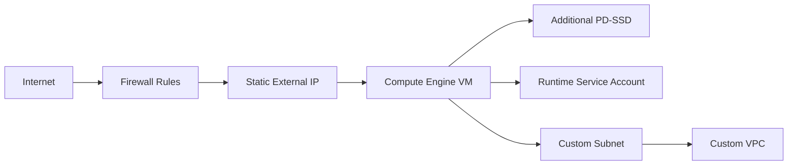

# 01 Single VM

Deploys a hardened single-instance Compute Engine pattern with a custom VPC, subnet flow logs, firewall controls, static public IP, SSD boot disk, extra data disk, startup automation, and a minimal runtime service account.

## Architecture



## Resources

| Resource | Purpose |
|---|---|
| `google_compute_network` | Custom VPC for workload isolation. |
| `google_compute_subnetwork` | Regional subnet with flow logs and Private Google Access. |
| `google_compute_firewall` | Ingress rules for SSH, HTTP, and ICMP. |
| `google_compute_address` | Static external IP for stable ingress. |
| `google_compute_instance` | Ubuntu 22.04 VM with Shielded VM settings. |
| `google_compute_disk` | Additional SSD disk for application data or logs. |
| `google_service_account` | Minimal runtime identity for logging and metrics. |

## Usage

```bash
cp terraform.tfvars.example terraform.tfvars
terraform init -backend=false
terraform plan -out=tfplan
terraform apply tfplan
```

Update `terraform.tfvars` with your own project IDs, regions, CIDRs, domains, notification targets, and IAM identities before apply.

## gcloud equivalents

```bash
gcloud compute networks create single-vm-vpc --subnet-mode=custom
gcloud compute networks subnets create single-vm-subnet --network=single-vm-vpc --region=us-central1 --range=10.10.0.0/24
gcloud compute instances create single-vm-01 --zone=us-central1-a --machine-type=e2-medium --image-family=ubuntu-2204-lts --image-project=ubuntu-os-cloud
```

## Cost estimate

Approx. **$60-$110/month** depending on SSD size, egress, and sustained usage discounts.

## Operational notes

- Use IAP or a bastion access pattern instead of broad SSH source ranges in tightly regulated environments.
- The startup script installs NGINX and the Ops Agent to provide a ready-to-verify baseline.
- Attach additional IAM roles to the VM service account only when the workload explicitly needs them.
