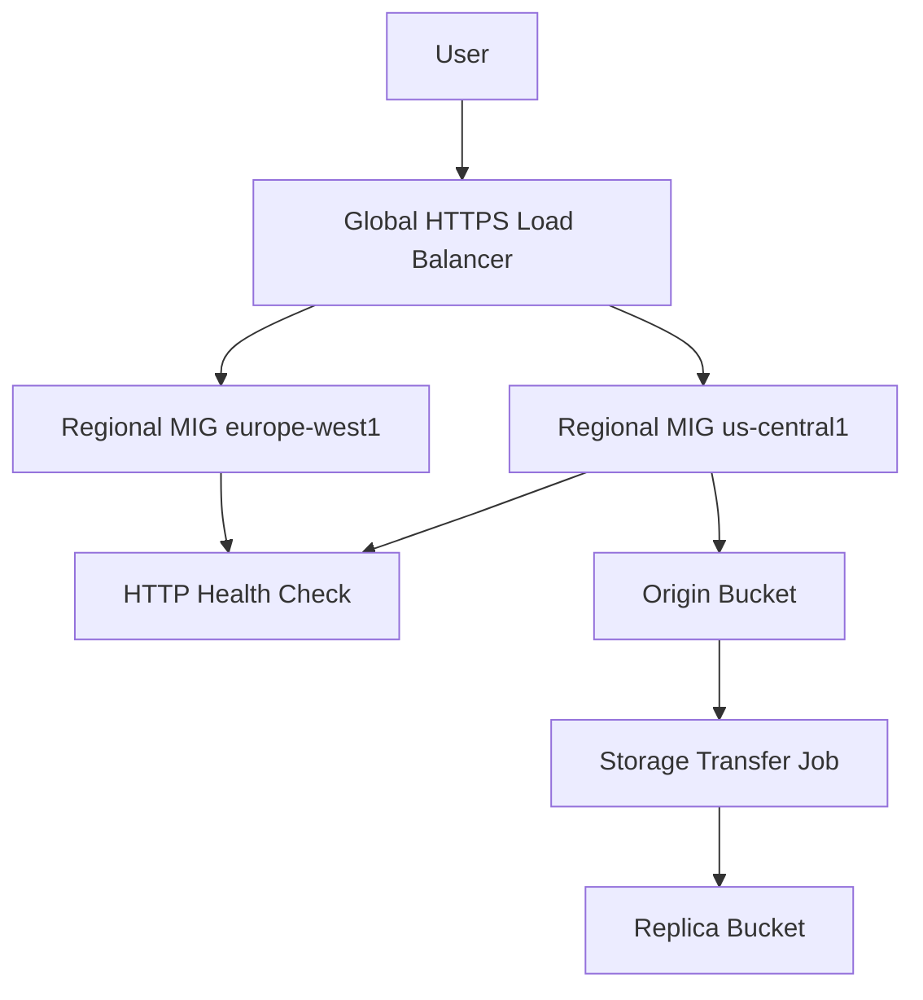

# 02 Multi-Region HA

Creates an active/active web tier in two regions using managed instance groups, autoscaling, a global HTTPS load balancer with Cloud CDN, health checks, and asynchronous object replication between regional buckets.

## Architecture



## Resources

| Resource | Purpose |
|---|---|
| `google_compute_region_instance_group_manager` | Regional stateless compute fleet in each region. |
| `google_compute_region_autoscaler` | CPU-based autoscaling for each MIG. |
| `google_compute_backend_service` | Global backend that enables Cloud CDN at the edge. |
| `google_compute_managed_ssl_certificate` | Managed TLS for the public endpoint. |
| `google_storage_transfer_job` | Scheduled cross-region bucket replication. |

## Usage

```bash
cp terraform.tfvars.example terraform.tfvars
terraform init -backend=false
terraform plan -out=tfplan
terraform apply tfplan
```

Update `terraform.tfvars` with your own project IDs, regions, CIDRs, domains, notification targets, and IAM identities before apply.

## gcloud equivalents

```bash
gcloud compute instance-templates create ha-template --machine-type=e2-medium --metadata=startup-script='#!/bin/bash'
gcloud compute instance-groups managed create ha-us --region=us-central1 --template=ha-template --size=2
gcloud compute backend-services create ha-global-backend --global --protocol=HTTP --enable-cdn
```

## Cost estimate

Approx. **$250-$500/month** depending on instance count, CDN egress, SSL, and traffic volume.

## Operational notes

- Point your DNS A record at the `global_lb_ip` output before expecting managed certificate provisioning to complete.
- Use a dedicated runtime service account instead of the default Compute Engine service account.
- For stricter disaster recovery guarantees, combine this pattern with project `10-disaster-recovery`.
