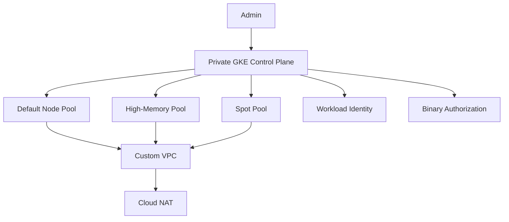

# 03 GKE Cluster

Provides a secure GKE baseline with private nodes, release channel management, Workload Identity, Binary Authorization, Calico network policy, Cloud Monitoring/Logging integration, and three Standard-mode node pools with an Autopilot switch.

## Architecture



## Resources

| Resource | Purpose |
|---|---|
| `google_container_cluster` | Private cluster in Standard or Autopilot mode. |
| `google_container_node_pool` | Dedicated default, memory-optimized, and Spot pools for Standard mode. |
| `google_compute_router_nat` | Provides private egress for nodes without public IPs. |
| `workload_identity_config` | Eliminates the need for node-scoped service account keys. |
| `binary_authorization` | Enables image policy enforcement for higher assurance deployments. |

## Usage

```bash
cp terraform.tfvars.example terraform.tfvars
terraform init -backend=false
terraform plan -out=tfplan
terraform apply tfplan
```

Update `terraform.tfvars` with your own project IDs, regions, CIDRs, domains, notification targets, and IAM identities before apply.

## gcloud equivalents

```bash
gcloud container clusters create-auto prod-gke-autopilot --region=us-central1 --enable-private-nodes
gcloud container clusters create prod-gke --region=us-central1 --enable-private-nodes --release-channel=regular
gcloud container node-pools create spot-pool --cluster=prod-gke --region=us-central1 --spot
```

## Cost estimate

Approx. **$250-$900/month** depending on mode, node sizes, Autopilot usage, and cluster traffic.

## Operational notes

- If `enable_autopilot` is true, Terraform creates the Autopilot cluster and skips the Standard node pools.
- Private control planes require carefully maintained `master_authorized_networks` entries for operator access.
- Add fleet registration, policy controller, and backup tooling in downstream modules if needed.
