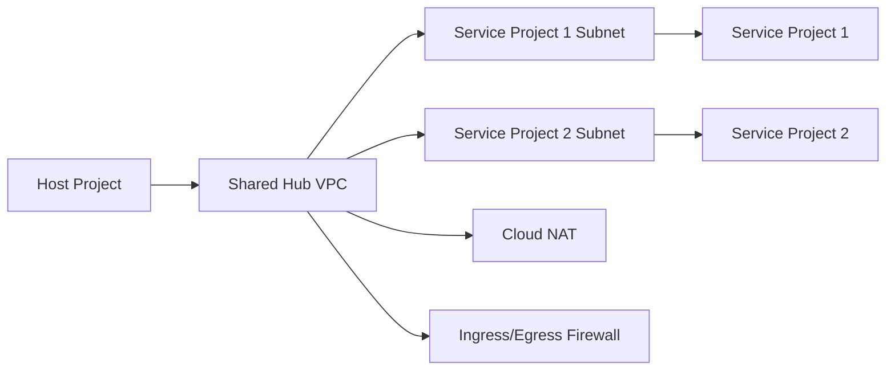

# 04 Shared VPC Network

Implements a host-and-service-project network baseline with Shared VPC attachment, private subnets per service project, Cloud Router/NAT for private egress, flow logs, firewall policies, and least-privilege `roles/compute.networkUser` bindings.

## Architecture



## Resources

| Resource | Purpose |
|---|---|
| `google_compute_shared_vpc_host_project` | Enables Shared VPC on the host project. |
| `google_compute_shared_vpc_service_project` | Attaches service projects to the host network. |
| `google_compute_subnetwork` | Dedicated subnets per service project with flow logs enabled. |
| `google_compute_router_nat` | Private egress for workloads without public IPs. |
| `google_compute_subnetwork_iam_binding` | Grants service project agents network-user access only where required. |

## Usage

```bash
cp terraform.tfvars.example terraform.tfvars
terraform init -backend=false
terraform plan -out=tfplan
terraform apply tfplan
```

Update `terraform.tfvars` with your own project IDs, regions, CIDRs, domains, notification targets, and IAM identities before apply.

## gcloud equivalents

```bash
gcloud compute shared-vpc enable network-host-prod
gcloud compute shared-vpc associated-projects add app-prod-01 --host-project=network-host-prod
gcloud compute networks subnets create subnet-app-prod-01 --network=shared-hub-vpc --region=us-central1 --range=10.40.0.0/24
```

## Cost estimate

Approx. **$40-$120/month** primarily for NAT, logging, and egress; Shared VPC itself has no standalone premium.

## Operational notes

- Grant additional subnet-level IAM to deployment pipelines or platform teams if they must create NICs in service projects.
- Tune flow log sampling higher for forensic-heavy environments and lower for cost-sensitive environments.
- This pattern is a strong dependency for projects `05`, `06`, and `09` in larger environments.
