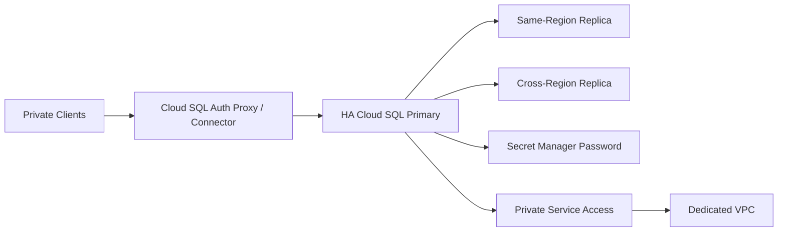

# 05 Cloud SQL HA

Builds a private, HA Cloud SQL platform with regional primary availability, local and cross-region read replicas, Secret Manager-managed admin credentials, IAM database authentication flags, maintenance windows, automated backups, and PITR-ready settings.

## Architecture



## Resources

| Resource | Purpose |
|---|---|
| `google_sql_database_instance` | Primary HA instance plus local and DR replicas. |
| `google_service_networking_connection` | Private Service Access peering for private IP connectivity. |
| `google_secret_manager_secret` | Stores the generated administrator password securely. |
| `database_flags` | Enables IAM DB authentication and encrypted transport settings. |

## Usage

```bash
cp terraform.tfvars.example terraform.tfvars
terraform init -backend=false
terraform plan -out=tfplan
terraform apply tfplan
```

Update `terraform.tfvars` with your own project IDs, regions, CIDRs, domains, notification targets, and IAM identities before apply.

## gcloud equivalents

```bash
gcloud sql instances create prod-sql-primary --database-version=POSTGRES_16 --region=us-central1 --availability-type=regional
gcloud sql instances patch prod-sql-primary --connector-enforcement=REQUIRED
gcloud secrets versions access latest --secret=cloudsql-admin-password
```

## Cost estimate

Approx. **$500-$1,500/month** depending on engine, HA tier, storage, backups, and replica count.

## Operational notes

- The config defaults to PostgreSQL but also supports MySQL with engine-specific IAM auth and TLS flags.
- Use private clients plus Cloud SQL Auth Proxy or language connectors to match the `connector_enforcement` setting.
- Before destroying, explicitly set deletion protection to `false` if teardown is intentional.
