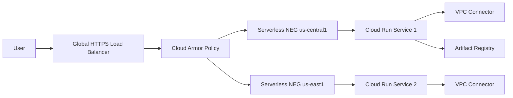

# 06 Cloud Run + HTTPS LB

Creates a multi-region serverless edge pattern with Cloud Run services, Serverless NEGs, a global HTTPS load balancer, Cloud Armor WAF controls, Cloud CDN, custom domains, managed TLS, Artifact Registry, and VPC connectivity for private dependencies.

## Architecture



## Resources

| Resource | Purpose |
|---|---|
| `google_cloud_run_v2_service` | Per-region Cloud Run application services. |
| `google_compute_region_network_endpoint_group` | Serverless NEGs wired into the global load balancer. |
| `google_compute_security_policy` | Cloud Armor WAF rules for basic application protection. |
| `google_artifact_registry_repository` | Holds workload images for private delivery pipelines. |
| `google_vpc_access_connector` | Provides private RFC1918 access from Cloud Run to internal services. |

## Usage

```bash
cp terraform.tfvars.example terraform.tfvars
terraform init -backend=false
terraform plan -out=tfplan
terraform apply tfplan
```

Update `terraform.tfvars` with your own project IDs, regions, CIDRs, domains, notification targets, and IAM identities before apply.

## gcloud equivalents

```bash
gcloud run deploy app-us-central1 --region=us-central1 --image=us-docker.pkg.dev/cloudrun/container/hello
gcloud compute network-endpoint-groups create neg-us-central1 --region=us-central1 --network-endpoint-type=serverless --cloud-run-service=app-us-central1
gcloud compute security-policies create cloud-run-waf
```

## Cost estimate

Approx. **$80-$400/month** before traffic; heavily traffic-dependent because Cloud Run, CDN egress, and LB charges scale with usage.

## Operational notes

- Do not add `health_checks` or `balancing_mode` to the backend service when using Serverless NEGs.
- Cloud Run ingress is set to `INGRESS_TRAFFIC_INTERNAL_LOAD_BALANCER` so direct internet requests are blocked while LB traffic is allowed.
- Switch `allow_unauthenticated` to `false` when fronting the service with identity-aware controls.
