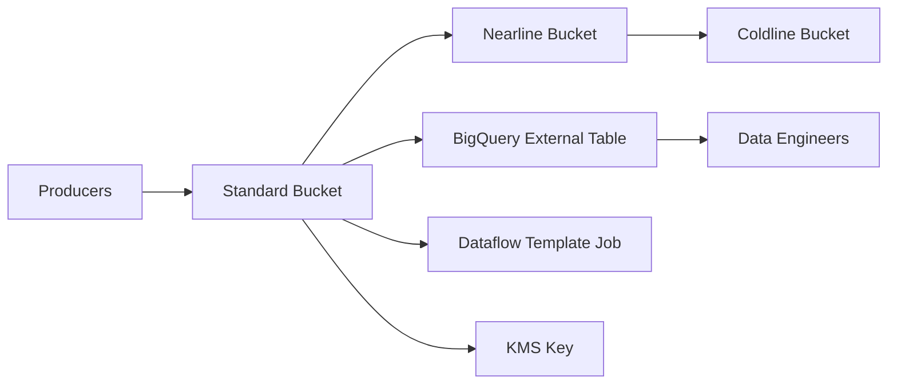

# 07 GCS Data Lake

Builds a three-tier GCS data lake with lifecycle policies, CMEK, retention, versioning, BigQuery external analytics, optional Dataflow template execution, IAM for data engineers, and an optional VPC Service Controls perimeter.

## Architecture



## Resources

| Resource | Purpose |
|---|---|
| `google_storage_bucket` | Standard, Nearline, and Coldline storage tiers with lifecycle and retention settings. |
| `google_kms_crypto_key` | Customer-managed encryption key for bucket and dataset protection. |
| `google_bigquery_dataset/table` | Analytics surface over raw objects stored in GCS. |
| `google_dataflow_job` | Optional managed ETL launch using a pre-built template. |
| `google_access_context_manager_service_perimeter` | Optional VPC Service Controls boundary around storage and analytics services. |

## Usage

```bash
cp terraform.tfvars.example terraform.tfvars
terraform init -backend=false
terraform plan -out=tfplan
terraform apply tfplan
```

Update `terraform.tfvars` with your own project IDs, regions, CIDRs, domains, notification targets, and IAM identities before apply.

## gcloud equivalents

```bash
gcloud storage buckets create gs://my-production-project-lake-standard --location=us-central1 --uniform-bucket-level-access
gcloud bq mk --dataset my-production-project:data_lake
gcloud dataflow jobs run lake-ingestion-job --gcs-location=gs://dataflow-templates-us-central1/latest/GCS_Text_to_BigQuery
```

## Cost estimate

Approx. **$80-$350/month** depending on stored volume, lifecycle transitions, BigQuery scans, and Dataflow runtime.

## Operational notes

- Set `run_dataflow_job` to `true` only when you intentionally want Terraform to launch the ETL job during apply.
- Add bucket object retention or bucket lock controls if regulatory immutability is required.
- Provide a valid `access_policy_id` to create the VPC Service Controls perimeter; otherwise it is skipped.
