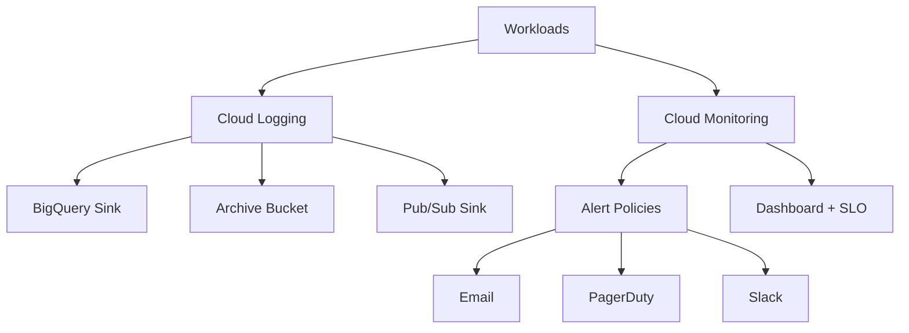

# 08 Monitoring Stack

Establishes centralized observability with multi-channel notifications, uptime checks, alerting policies for CPU, memory, error rate, and latency, log-based metrics, log export sinks, a custom dashboard, an SLO, and billing budget notifications.

## Architecture



## Resources

| Resource | Purpose |
|---|---|
| `google_monitoring_notification_channel` | Email, PagerDuty, and Slack notification destinations. |
| `google_monitoring_uptime_check_config` | Synthetic HTTPS probe for a public endpoint. |
| `google_monitoring_alert_policy` | Threshold-based policies for CPU, memory, errors, and latency. |
| `google_logging_project_sink` | Exports logs to BigQuery, GCS, and Pub/Sub. |
| `google_billing_budget` | Publishes cost thresholds to finance and platform responders. |

## Usage

```bash
cp terraform.tfvars.example terraform.tfvars
terraform init -backend=false
terraform plan -out=tfplan
terraform apply tfplan
```

Update `terraform.tfvars` with your own project IDs, regions, CIDRs, domains, notification targets, and IAM identities before apply.

## gcloud equivalents

```bash
gcloud monitoring channels create --display-name='Ops Email' --type=email
gcloud logging sinks create logs-to-bigquery bigquery.googleapis.com/projects/my-production-project/datasets/central_logs
gcloud billing budgets create --billing-account=billingAccounts/000000-000000-000000
```

## Cost estimate

Approx. **$30-$250/month** depending on log volume, BigQuery retention, Pub/Sub throughput, and notification usage.

## Operational notes

- Slack and PagerDuty sensitive values are stored in Terraform state unless you switch to write-only sensitive label fields supported by newer Terraform/provider versions.
- Uptime checks and alerting policies should be tuned per service baseline before enabling noisy pager targets.
- Budget notifications complement, but do not replace, project-level cost governance and quotas.
