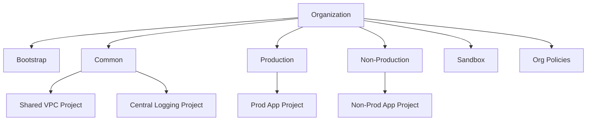

# 09 Landing Zone Base

Bootstraps a Google Cloud landing zone with an organization-aligned folder hierarchy, project factory examples, org guardrails, a Shared VPC host, centralized logging project, essential contacts, and a baseline billing budget.

## Architecture



## Resources

| Resource | Purpose |
|---|---|
| `google_folder` | Core enterprise folder hierarchy. |
| `google_project` | Example bootstrap, shared networking, logging, and workload projects. |
| `google_org_policy_policy` | Organization-wide guardrails for sharing, UBLA, serial ports, and external IPs. |
| `google_compute_shared_vpc_host_project` | Shared VPC host for centralized networking. |
| `google_essential_contacts_contact` | Required contact path for Google-issued security and operational notifications. |

## Usage

```bash
cp terraform.tfvars.example terraform.tfvars
terraform init -backend=false
terraform plan -out=tfplan
terraform apply tfplan
```

Update `terraform.tfvars` with your own project IDs, regions, CIDRs, domains, notification targets, and IAM identities before apply.

## gcloud equivalents

```bash
gcloud resource-manager folders create --display-name=Common --organization=123456789012
gcloud projects create common-network-prod --folder=FOLDER_ID
gcloud resource-manager org-policies set-policy policy.yaml
```

## Cost estimate

Approx. **$20-$150/month** until downstream workloads are attached; most cost comes from logging, budgets, and shared networking egress.

## Operational notes

- Org-level policies should first be tested in a staging organization or isolated folder hierarchy before broad rollout.
- Replace example project IDs and contact addresses with globally unique enterprise-approved values.
- Extend the project factory section with additional workloads, billing exports, and audit integrations as your platform matures.
