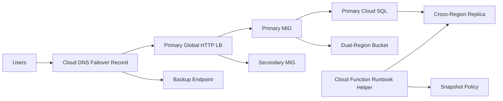

# 10 Disaster Recovery

Implements a disaster recovery baseline with cross-region web capacity, global load balancing, a cross-region Cloud SQL replica, dual-region object storage, DNS failover routing, snapshot scheduling, and Cloud Functions-based recovery orchestration.

## Architecture



## Resources

| Resource | Purpose |
|---|---|
| `google_compute_region_instance_group_manager` | Primary and secondary regional compute capacity for application recovery. |
| `google_sql_database_instance` | Primary PostgreSQL instance with cross-region replica promotion path. |
| `google_dns_record_set` | Primary-backup DNS routing policy for endpoint failover. |
| `google_compute_resource_policy` | Daily persistent disk snapshot retention policy. |
| `google_cloudfunctions2_function` | Operational helper for backup and promotion workflows. |

## Usage

```bash
cp terraform.tfvars.example terraform.tfvars
terraform init -backend=false
terraform plan -out=tfplan
terraform apply tfplan
```

Update `terraform.tfvars` with your own project IDs, regions, CIDRs, domains, notification targets, and IAM identities before apply.

## gcloud equivalents

```bash
gcloud compute instance-groups managed create dr-us --region=us-central1 --size=2 --template=TEMPLATE
gcloud sql instances promote-replica dr-sql-replica
gcloud dns record-sets transaction start --zone=dr-public-zone
```

## Cost estimate

Approx. **$350-$1,000/month** depending on warm standby size, replica tier, storage replication, and backup retention.

## Operational notes

- Replace `backup_endpoint_ip` with a real standby endpoint or maintenance site IP before relying on DNS failover.
- Cloud SQL replica promotion is not automatic; document and rehearse the promote-and-cutover workflow with your operations team.
- The bundled Cloud Function is an operations helper and should be paired with Scheduler, runbooks, and approval workflows in production.
- Recovery runbook: verify incident scope, promote the replica if database failover is required, cut DNS to the backup endpoint if the primary LB is unhealthy, restore from snapshots if data corruption is involved, then re-seed replication after the primary region returns.
