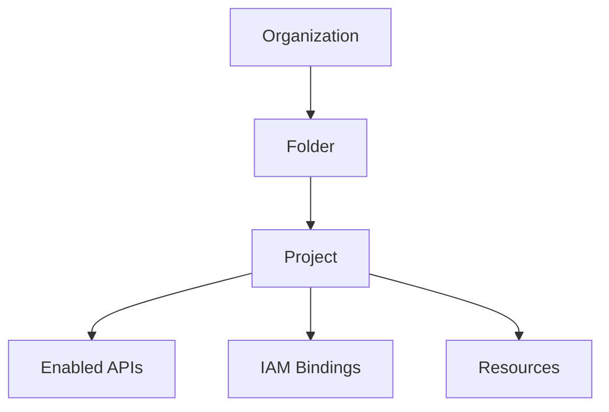
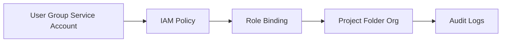

> **Screenshot Disclaimer:** Portal screenshots referenced in this guide are sourced from [Google Cloud documentation](https://cloud.google.com/docs). © Google LLC. Used for educational reference only.

# 01 GCP Fundamentals Q&A

This chapter condenses the core control-plane, IAM, billing, and platform-positioning topics that show up repeatedly in Google Cloud interviews.

## How to Use This Chapter

- Answer each question aloud first, then scan the model answer.
- Mention the console path to sound hands-on.
- Use the CLI example to show how you verify, not just memorize.

## Foundation CLI Drill

**Console:** IAM & Admin -> Manage Resources
```bash
gcloud organizations list && gcloud projects list --limit=3
```
Expected output:
```text
DISPLAY_NAME    ID
example-org     123456789012
PROJECT_ID      NAME
prod-app-01     Production App
```

## Core Diagrams




### Q1. What is Google Cloud Platform?
Google Cloud Platform is a public cloud platform with managed compute, storage, networking, security, analytics, and developer services running on Google's global infrastructure.
**Key points:** Broad service coverage; strong managed-service story; Google backbone is a common differentiator.
**Example scenario:** A team runs APIs on Cloud Run, stores files in Cloud Storage, and analyzes events in BigQuery.
**Console:** Home -> Dashboard
```bash
gcloud services list --enabled --limit=3
```
Expected output:
```text
NAME                 TITLE
run.googleapis.com   Cloud Run Admin API
```
**Follow-up Q:** Why do interviewers ask this basic question?
**Follow-up A:** It reveals whether you understand GCP as a full platform and not just as a list of product names.
### Q2. What is the difference between a region and a zone?
A region is a geographic area, while a zone is an isolated failure domain inside that region.
**Key points:** Zones isolate failures; multi-zone is the usual first HA step; latency and residency affect region choice.
**Example scenario:** A GKE cluster spans three zones in us-central1 so one zonal failure does not take down the app.
**Console:** Compute Engine -> VM instances
```bash
gcloud compute zones list --filter="region:(us-central1)"
```
Expected output:
```text
NAME             REGION
us-central1-a    us-central1
```
**Follow-up Q:** When do you move from multi-zone to multi-region?
**Follow-up A:** When recovery objectives, user geography, or compliance needs require a wider resilience boundary.
### Q3. What is the resource hierarchy in Google Cloud?
The hierarchy is organization, folders, projects, and then resources such as VMs, buckets, and clusters.
**Key points:** Projects are the main operating boundary; folders group environments or business units; policy can inherit downward.
**Example scenario:** A company keeps production and sandbox projects under separate folders beneath one organization.
**Console:** IAM & Admin -> Manage Resources
```bash
gcloud resource-manager folders list --organization=123456789012
```
Expected output:
```text
DISPLAY_NAME    NAME
Production      folders/456789012345
```
**Follow-up Q:** Why is inheritance useful?
**Follow-up A:** Platform teams can define policy once at a higher level and apply it consistently across many child projects.
### Q4. What does the organization node represent?
The organization node is the root administrative container tied to the company domain through Cloud Identity or Google Workspace.
**Key points:** Root of enterprise governance; supports top-level IAM and org policy; central visibility starts here.
**Example scenario:** A security team enforces allowed resource locations at the organization level.
**Console:** IAM & Admin -> Settings
```bash
gcloud organizations describe 123456789012
```
Expected output:
```text
displayName: example.com
directoryCustomerId: C01abc234
```
**Follow-up Q:** Can you use GCP without an organization node?
**Follow-up A:** Yes, but enterprise governance, policy inheritance, and centralized administration become much harder.
### Q5. Why are folders useful?
Folders add a middle layer for grouping projects by environment, department, or compliance boundary.
**Key points:** Great for prod vs non-prod; reduce duplicated policy work; mirror business structure cleanly.
**Example scenario:** A retailer creates separate folders for shared infrastructure, production apps, and regulated workloads.
**Console:** IAM & Admin -> Manage Resources
```bash
gcloud resource-manager folders get-iam-policy folders/456789012345
```
Expected output:
```text
bindings:
- role: roles/viewer
```
**Follow-up Q:** Do folders replace projects?
**Follow-up A:** No, because projects still handle APIs, quotas, billing links, and most day-to-day operations.
### Q6. What is a project in Google Cloud?
A project is the main boundary for APIs, quotas, billing attribution, and most workload-level IAM operations.
**Key points:** Has project ID and project number; APIs are enabled per project; blast radius is easier to control.
**Example scenario:** An app uses separate dev, test, and prod projects so IAM and quotas stay isolated.
**Console:** IAM & Admin -> Manage Resources
```bash
gcloud projects describe interview-lab-prod
```
Expected output:
```text
projectId: interview-lab-prod
lifecycleState: ACTIVE
```
**Follow-up Q:** Why not keep dev and prod in one project?
**Follow-up A:** Separate projects make IAM, quotas, billing, and troubleshooting boundaries much safer and clearer.
### Q7. What are labels and tags used for?
Labels add metadata for organization, reporting, and automation, while tags can also drive governance and policy.
**Key points:** Useful for owner, environment, and cost center metadata; consistency matters more than ad hoc usage; tags can influence controls.
**Example scenario:** Finance filters billing export by cost-center labels to show spend by team.
**Console:** Billing -> Reports
```bash
gcloud compute instances describe web-01 --zone=us-central1-a --format="get(labels)"
```
Expected output:
```text
env=prod
team=platform
```
**Follow-up Q:** Should metadata standards be optional?
**Follow-up A:** No, because consistent labels and tags make cost reporting, ownership, and automation much more reliable.
### Q8. Why do you have to enable APIs per project?
Most Google Cloud services are exposed through APIs, so a project can use a service only after that API is enabled.
**Key points:** API enablement is part of project bootstrap; disabled APIs often break deployments; it defines service usage boundaries.
**Example scenario:** A Cloud Run deployment fails until the Run API is enabled in the target project.
**Console:** APIs & Services -> Enabled APIs & services
```bash
gcloud services list --enabled --filter="name:run.googleapis.com"
```
Expected output:
```text
NAME                TITLE
run.googleapis.com  Cloud Run Admin API
```
**Follow-up Q:** What is a common mistake here?
**Follow-up A:** Teams sometimes over-investigate IAM when the real issue is simply that the API was never enabled.
### Q9. How does IAM work in Google Cloud?
IAM works by binding a principal such as a user, group, or service account to a role on a resource.
**Key points:** Bindings contain members and roles; inheritance matters; groups scale better than direct user grants.
**Example scenario:** An operations group gets viewer access on a folder and all child projects inherit it.
**Console:** IAM & Admin -> IAM
```bash
gcloud projects get-iam-policy interview-lab-prod --flatten="bindings[].members" --filter="bindings.role:roles/viewer" --format="table(bindings.role,bindings.members)"
```
Expected output:
```text
ROLE          MEMBERS
roles/viewer  group:ops@example.com
```
**Follow-up Q:** Why are groups better than direct user assignments?
**Follow-up A:** They simplify onboarding, offboarding, and periodic access reviews at scale.
### Q10. What are primitive, predefined, and custom roles?
Primitive roles are broad legacy roles, predefined roles are Google-managed service roles, and custom roles let you choose exact permissions.
**Key points:** Primitive roles are usually too broad; predefined roles are the safest default; custom roles need maintenance discipline.
**Example scenario:** A team grants Cloud Run Developer instead of Editor so deployers get only the needed permissions.
**Console:** IAM & Admin -> Roles
```bash
gcloud iam roles describe roles/run.developer
```
Expected output:
```text
name: roles/run.developer
title: Cloud Run Developer
```
**Follow-up Q:** When are custom roles risky?
**Follow-up A:** They become risky when nobody updates them as Google services add or change permissions.
### Q11. What are service accounts?
Service accounts are identities for workloads and automation rather than for human users.
**Key points:** Used by VMs, GKE, Cloud Run, and CI; should follow least privilege; avoid long-lived keys where possible.
**Example scenario:** A Cloud Run service uses a dedicated account that can publish to Pub/Sub and nothing else.
**Console:** IAM & Admin -> Service Accounts
```bash
gcloud iam service-accounts list --limit=3
```
Expected output:
```text
EMAIL                                                  DISABLED
app-runtime@interview-lab-prod.iam.gserviceaccount.com False
```
**Follow-up Q:** Why are service account keys discouraged?
**Follow-up A:** Long-lived keys are easy to leak and harder to rotate than attached identities or impersonation flows.
### Q12. How do billing accounts relate to projects?
A billing account pays for one or more linked projects, but each project is linked to only one billing account at a time.
**Key points:** Finance can centralize payment; projects remain the technical boundary; billing export supports cost analysis.
**Example scenario:** A central finance team owns the billing account while product teams own their projects.
**Console:** Billing -> Account management
```bash
gcloud beta billing accounts list
```
Expected output:
```text
ACCOUNT_ID            NAME
0000AB-1111CD-2222EF  Corporate Billing
```
**Follow-up Q:** What happens if billing is disabled on a project?
**Follow-up A:** Billable services can stop working or become restricted, so cost visibility matters operationally.
### Q13. What are quotas in Google Cloud?
Quotas limit API or resource consumption to protect the platform and help customers control usage.
**Key points:** Quotas may be project, region, or API specific; they can block launches; increases often need lead time.
**Example scenario:** A team requests a CPU quota increase before a seasonal traffic event.
**Console:** IAM & Admin -> Quotas & System Limits
```bash
gcloud compute project-info describe --project=interview-lab-prod
```
Expected output:
```text
quotas:
- metric: CPUS
```
**Follow-up Q:** Why do quota discussions impress interviewers?
**Follow-up A:** They show you think about real operational limits instead of only ideal architecture diagrams.
### Q14. When should you use the console versus gcloud?
The console is best for visual discovery and quick inspection, while gcloud is better for repeatable verification and automation.
**Key points:** Console helps with dashboards; CLI helps with scripting; production changes are safer through automation.
**Example scenario:** An engineer inspects a failure in Logs Explorer and then adds gcloud evidence to incident notes.
**Console:** Home -> Dashboard and Cloud Shell
```bash
gcloud config list
```
Expected output:
```text
[core]
project = interview-lab-prod
```
**Follow-up Q:** Why does CLI fluency matter?
**Follow-up A:** It shows you can verify and automate cloud operations instead of relying only on manual clicks.
### Q15. What is Cloud Shell?
Cloud Shell is a browser-based terminal with gcloud and common tools already installed and authenticated.
**Key points:** Great for quick admin tasks and demos; includes small persistent home storage; not a replacement for CI runners.
**Example scenario:** During a live demo an engineer validates IAM from Cloud Shell without local laptop setup.
**Console:** Activate Cloud Shell
```bash
gcloud auth list
```
Expected output:
```text
Credentialed Accounts
* engineer@example.com
```
**Follow-up Q:** What is the limitation of Cloud Shell?
**Follow-up A:** It is convenient for interactive work, but serious production automation belongs in controlled pipelines.
### Q16. What is Application Default Credentials?
Application Default Credentials is the standard way Google client libraries discover credentials automatically.
**Key points:** Important for portable application code; works well with attached identities; better than embedding keys.
**Example scenario:** The same app uses local user credentials in development and the Cloud Run service account in production.
**Console:** IAM & Admin -> Service Accounts
```bash
gcloud auth application-default print-access-token
```
Expected output:
```text
ya29.c.mocked-access-token
```
**Follow-up Q:** Why is ADC interview relevant?
**Follow-up A:** It shows you understand how applications authenticate differently from human administrators.
### Q17. What is the shared responsibility model?
Google secures the underlying cloud infrastructure, while customers still own workload configuration, data, identities, and application controls.
**Key points:** Managed services reduce but do not remove customer work; IAM and data security still matter; the boundary varies by service model.
**Example scenario:** A Cloud Run team does not patch host OS images, but it still owns code, IAM, and secret handling.
**Console:** Security -> Security Command Center
```bash
gcloud container clusters describe prod-cluster --region=us-central1 --format="get(releaseChannel.channel)"
```
Expected output:
```text
REGULAR
```
**Follow-up Q:** How should you answer this strongly?
**Follow-up A:** State the boundary first, then contrast a lower-level service like Compute Engine with a higher-level one like Cloud Run.
### Q18. How does GCP compare with AWS at a high level?
GCP is often known for its global private backbone, strong analytics services, and simpler project-centered governance model.
**Key points:** BigQuery and Spanner are common differentiators; AWS has enormous breadth; comparisons should stay requirement driven.
**Example scenario:** A candidate neutrally compares Cloud Run and BigQuery strengths with AWS container and analytics options.
**Console:** Home -> Products
```bash
gcloud info --format="value(config.paths.global_config_dir)"
```
Expected output:
```text
/Users/example/.config/gcloud
```
**Follow-up Q:** What makes a weak comparison answer?
**Follow-up A:** Turning it into brand preference instead of discussing tradeoffs, operating model, and actual requirements.
### Q19. How does GCP compare with Azure?
GCP often feels simpler for cloud-native platforms, while Azure is especially strong for Microsoft ecosystem integration and some hybrid patterns.
**Key points:** Identity and enterprise contracts can drive choice; GCP often stands out with Cloud Run and BigQuery; comparisons should stay neutral.
**Example scenario:** A Google Workspace-heavy company may prefer GCP, while a Microsoft-first company may prefer Azure integration.
**Console:** Home -> Products
```bash
gcloud topic configurations
```
Expected output:
```text
To get help on gcloud configurations, run:
  gcloud topic configurations
```
**Follow-up Q:** Why should comparison answers stay neutral?
**Follow-up A:** Senior engineers pick platforms based on fit, governance, and constraints rather than fandom.
### Q20. What is a landing zone?
A landing zone is the governed foundation of folders, projects, IAM, networking, logging, budgets, and policies used before app onboarding starts.
**Key points:** Usually built with Terraform or pipelines; often includes shared networking and centralized logging; prevents cloud sprawl.
**Example scenario:** An enterprise creates host projects for Shared VPC, a logging project, and baseline folders before app teams deploy workloads.
**Console:** IAM & Admin and VPC network
```bash
gcloud resource-manager tags keys list --parent=organizations/123456789012
```
Expected output:
```text
name: tagKeys/1234
shortName: environment
```
**Follow-up Q:** Why is landing zone knowledge important?
**Follow-up A:** It shows you understand governance and standardization before workload deployment, which matters in enterprise interviews.
### Q21. What are Cloud Audit Logs?
Cloud Audit Logs record administrative activity, data access, and system events for many Google Cloud services.
**Key points:** Admin Activity logs are widely available by default; Data Access may need enabling; central export is common.
**Example scenario:** An admin role change is traced to a principal and timestamp through Admin Activity logs.
**Console:** Logging -> Logs Explorer
```bash
gcloud logging read "logName:cloudaudit.googleapis.com%2Factivity" --limit=2
```
Expected output:
```text
INSERT_ID  TIMESTAMP
abc123     2025-06-10T12:30:00Z
```
**Follow-up Q:** Why are audit logs stronger than manual notes?
**Follow-up A:** They are system-generated evidence with exact caller, resource, and timestamp details.
### Q22. Why do support plans matter?
Support plans affect response targets and escalation options for production-impacting incidents with Google.
**Key points:** Support is part of operational readiness; critical workloads need faster escalation paths; runbooks should include support usage.
**Example scenario:** A global commerce platform aligns premium support with its 24x7 incident process.
**Console:** Support -> Cases
```bash
gcloud help
```
Expected output:
```text
NAME
gcloud - manage Google Cloud resources and developer workflow
```
**Follow-up Q:** Why mention support in interviews?
**Follow-up A:** Real production operations sometimes require vendor escalation in addition to internal debugging.
### Q23. How does pricing usually work in GCP?
Pricing is mostly consumption based, but discounts, storage class choices, and network egress strongly shape the final bill.
**Key points:** Idle capacity wastes money; egress matters; billing export enables detailed analysis beyond simple dashboards.
**Example scenario:** A batch workload moves from always-on VMs to Cloud Run jobs and reduces idle compute cost.
**Console:** Billing -> Reports
```bash
gcloud beta billing projects describe interview-lab-prod
```
Expected output:
```text
billingEnabled: true
projectId: interview-lab-prod
```
**Follow-up Q:** What makes a cost answer interview ready?
**Follow-up A:** Tie cost behavior to architecture choices such as traffic patterns, storage temperature, and network movement.
### Q24. What are committed use discounts and reservations?
Committed use discounts reduce price for predictable usage, while reservations guarantee capacity for specific compute needs.
**Key points:** Commitments fit steady workloads; reservations solve capacity assurance; they are related but not identical.
**Example scenario:** A production ERP stack uses commitments for baseline savings and reserves GPU capacity for a seasonal event.
**Console:** Compute Engine -> Reservations
```bash
gcloud compute reservations list --regions=us-central1
```
Expected output:
```text
NAME             STATUS
holiday-capacity READY
```
**Follow-up Q:** Why separate discount and capacity concepts?
**Follow-up A:** Lower price does not guarantee availability, and reserved capacity does not automatically mean best price.
### Q25. Why is infrastructure as code important?
Infrastructure as code makes projects, IAM, networking, and services repeatable, reviewable, and less error-prone.
**Key points:** Reduces configuration drift; peer review improves change quality; reusable modules speed onboarding.
**Example scenario:** A platform team provisions every new project with Terraform modules for APIs, budgets, and log sinks.
**Console:** Cloud Build -> Triggers
```bash
gcloud deployments list
```
Expected output:
```text
Listed 0 items.
```
**Follow-up Q:** Why not rely on manual setup for small teams?
**Follow-up A:** Even small teams benefit from consistency, reviewable history, and lower operational drift as environments grow.
### Q26. Why do naming standards matter?
Naming standards make resources easier to identify, search, automate, and troubleshoot across environments.
**Key points:** Names should reveal purpose and environment; they reduce dashboard and script confusion; they help during incidents.
**Example scenario:** A VM named prod-payments-api-usc1-01 immediately tells responders what it is and where it runs.
**Console:** Search bar and Compute Engine -> VM instances
```bash
gcloud compute instances list --filter="name~prod-" --limit=2
```
Expected output:
```text
NAME                  ZONE
prod-payments-api-01  us-central1-a
```
**Follow-up Q:** What is the downside of weak naming?
**Follow-up A:** It slows incident response, access review, and automation because nobody can infer resource purpose quickly.
### Q27. How should environments be separated?
Production and non-production should usually live in separate projects and often separate folders.
**Key points:** Separate projects reduce blast radius; prod can have stricter policies; shared services can still be centralized.
**Example scenario:** A company uses stronger org policies for production folders than for developer sandbox folders.
**Console:** IAM & Admin -> Manage Resources
```bash
gcloud projects list --filter="labels.environment=prod"
```
Expected output:
```text
PROJECT_ID    NAME
payments-prod Payments Production
```
**Follow-up Q:** Is one project per environment always mandatory?
**Follow-up A:** It is the default best practice for meaningful workloads because shared environments create avoidable risk.
### Q28. What is Cloud Resource Manager used for?
Cloud Resource Manager exposes the hierarchy and supports creating, moving, and inspecting organizations, folders, and projects programmatically.
**Key points:** Useful for landing-zone pipelines; supports governance automation; foundational for project-factory patterns.
**Example scenario:** A bootstrap pipeline creates a project, links billing, applies labels, and moves it into the correct folder.
**Console:** IAM & Admin -> Manage Resources
```bash
gcloud projects create interview-lab-sandbox --folder=456789012345
```
Expected output:
```text
Create in progress for [https://cloudresourcemanager.googleapis.com/v1/projects/interview-lab-sandbox].
```
**Follow-up Q:** Why does project lifecycle automation matter?
**Follow-up A:** Manual project creation leads to inconsistent policy, logging, and billing setup over time.
### Q29. What is Cloud Marketplace useful for?
Cloud Marketplace provides deployable third-party software and packaged solutions billed and managed through Google Cloud.
**Key points:** Good for partner appliances and packaged tools; billing can stay centralized; operational ownership still stays with the customer.
**Example scenario:** A team evaluates a security appliance from Marketplace in a sandbox before broader adoption.
**Console:** Marketplace
```bash
gcloud version
```
Expected output:
```text
Google Cloud SDK 0.0.0
alpha 2025.00.00
```
**Follow-up Q:** Why mention governance with Marketplace?
**Follow-up A:** Convenience does not remove the need for security review, patching, and lifecycle planning.
### Q30. What is a metrics scope?
A metrics scope lets one Google Cloud project view metrics from multiple monitored projects.
**Key points:** Supports multi-project observability; fits central SRE and NOC teams; preserves workload ownership separation.
**Example scenario:** An observability project views metrics from dozens of app projects owned by different teams.
**Console:** Monitoring -> Settings
```bash
gcloud alpha monitoring policies list --limit=2
```
Expected output:
```text
NAME
projects/interview-observability/alertPolicies/1234567890
```
**Follow-up Q:** Why is central observability interview-worthy?
**Follow-up A:** Enterprise GCP estates usually span many projects, so centralized visibility is a real operating need.
### Q31. What are SLAs and why do they matter?
Service Level Agreements are provider-backed availability commitments for specific services under defined conditions.
**Key points:** Read service-specific terms carefully; architecture drives user experience more than SLA text alone; redundancy still matters.
**Example scenario:** A critical workload uses multi-zone design because the business target is stricter than a single-instance expectation.
**Console:** Product documentation links from service pages
```bash
gcloud compute instances describe web-01 --zone=us-central1-a --format="get(status)"
```
Expected output:
```text
RUNNING
```
**Follow-up Q:** Why should SLAs not be your only reliability answer?
**Follow-up A:** Provider commitments do not automatically equal end-user experience; architecture choices still determine resilience.
### Q32. Why are budgets and billing alerts important?
Budgets and alerts provide early warning when spend rises above expected thresholds.
**Key points:** Useful for sandbox control and anomaly detection; work well with billing export analysis; should map to named owners.
**Example scenario:** A sudden egress spike triggers a budget alert and leads a team to fix an overly chatty export job.
**Console:** Billing -> Budgets & alerts
```bash
gcloud beta billing budgets list --billing-account=0000AB-1111CD-2222EF
```
Expected output:
```text
DISPLAY_NAME         AMOUNT
monthly-prod-budget  5000.00
```
**Follow-up Q:** What is a common budget mistake?
**Follow-up A:** Creating alerts without defining who investigates them and what response path they should follow.
### Q33. Why is least privilege a recurring theme?
Least privilege reduces accidental changes and limits blast radius if a credential is misused or compromised.
**Key points:** Prefer groups and predefined roles; scope service accounts narrowly; review access regularly.
**Example scenario:** A CI service account can deploy one Cloud Run service but cannot administer the whole project.
**Console:** IAM & Admin -> IAM
```bash
gcloud projects get-iam-policy interview-lab-prod --format=json
```
Expected output:
```text
{
  "bindings": [
```
**Follow-up Q:** How do you sound strong answering least-privilege questions?
**Follow-up A:** State the principle and then give a concrete scoped-access example such as one service account limited to one service.
### Q34. How do you explain Google Cloud to a non-technical stakeholder?
Describe Google Cloud as secure, scalable technology building blocks that reduce the need to own and operate all underlying hardware directly.
**Key points:** Use business language; translate resilience into lower risk; avoid jargon unless it supports a decision.
**Example scenario:** A product leader understands Cloud Run better when it is framed as deployment without server maintenance.
**Console:** Home -> Dashboard
```bash
gcloud projects list --limit=1
```
Expected output:
```text
PROJECT_ID      NAME
interview-demo  Interview Demo
```
**Follow-up Q:** Why is stakeholder language relevant in technical interviews?
**Follow-up A:** Senior engineers are expected to explain cloud decisions clearly to non-engineers as well as specialists.
### Q35. How do you choose between a managed service and self-managed infrastructure?
Start with operational burden, feature fit, tuning requirements, compliance needs, and the skill depth of the team.
**Key points:** Managed services reduce patching toil; self-managed options may allow deeper control; the right answer depends on the requirement.
**Example scenario:** A small team picks Cloud SQL instead of MySQL on Compute Engine because HA and backups are easier to operate.
**Console:** SQL -> Instances
```bash
gcloud sql instances list
```
Expected output:
```text
NAME       REGION       TIER
orders-db  us-central1  db-custom-2-7680
```
**Follow-up Q:** What makes this answer credible?
**Follow-up A:** Naming the tradeoffs and relating them to team capacity makes the decision sound practical rather than ideological.
### Q36. What should you memorize for an ACE-style interview?
Know the resource hierarchy, IAM role types, projects and billing, regions versus zones, service accounts, and common inspection commands.
**Key points:** Focus on precise terminology; use short real examples; be ready with a few common gcloud checks.
**Example scenario:** A candidate explains how to create a project, attach billing, enable APIs, and deploy with the right identity.
**Console:** IAM & Admin, Billing, APIs & Services
```bash
gcloud config configurations list
```
Expected output:
```text
NAME     IS_ACTIVE
default  True
```
**Follow-up Q:** How much command-line depth is enough?
**Follow-up A:** Enough to inspect common resources confidently and explain what each command proves in a real workflow.

## Official Google Cloud References

- Google Cloud resource hierarchy: https://cloud.google.com/resource-manager/docs/cloud-platform-resource-hierarchy
- IAM overview: https://cloud.google.com/iam/docs/overview
- Billing documentation: https://cloud.google.com/billing/docs
- Cloud Shell overview: https://cloud.google.com/shell/docs
- Google Cloud locations: https://cloud.google.com/about/locations
