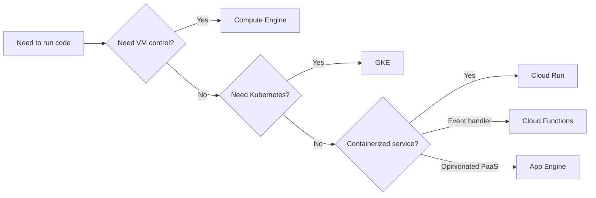
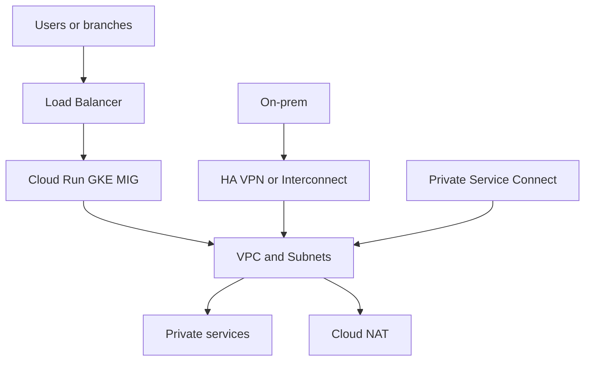

> **Screenshot Disclaimer:** Portal screenshots referenced in this guide are sourced from [Google Cloud documentation](https://cloud.google.com/docs). © Google LLC. Used for educational reference only.

# 02 Compute and Networking Q&A

This chapter is a compact interview bank for Google Cloud compute and networking topics.
Use it to practice short, credible answers with console paths, CLI checks, and follow-up responses.

## Compute Selection Map



## Networking Path Overview



## Quick CLI Drill

**Console Navigation**
- Console: Home -> Activate Cloud Shell
```bash
gcloud config get-value project && gcloud compute networks list --limit=2
```
Expected output:
```text
interview-prep-lab
NAME         SUBNET_MODE
default      AUTO
```

### Q1. When should you choose Compute Engine over a serverless compute service?
Choose Compute Engine when you need VM-level control over the OS, kernel settings, attached disks, or long-running agents.
It is also a better fit for workloads that are hard to containerize or that need predictable, always-on capacity.
- **Key points:** Full OS control; lift-and-shift support; good for stateful or legacy workloads.
- **Example scenario:** A vendor appliance with custom drivers is easier to host on hardened VMs than on Cloud Run.
- **Console / reference:** Console: Compute Engine -> VM instances | https://cloud.google.com/compute/docs/instances
```bash
gcloud compute instances list --filter='zone:us-central1-a' --limit=2
```
Expected output:
```text
NAME             ZONE           MACHINE_TYPE   STATUS
legacy-app-01    us-central1-a  e2-standard-4  RUNNING
```
**Q:** What is the tradeoff versus Cloud Run? **A:** You gain control and compatibility, but you own more patching, scaling, and instance management.
### Q2. What problem does a managed instance group solve?
A managed instance group keeps a fleet of VMs consistent by using one template, health checks, and autoscaling policies.
It shows you know how to make Compute Engine repeatable instead of hand-managed.
- **Key points:** Declarative fleet management; autoscaling; autohealing; rolling updates.
- **Example scenario:** A stateless API tier runs in a regional MIG behind an external Application Load Balancer.
- **Console / reference:** Console: Compute Engine -> Instance groups | https://cloud.google.com/compute/docs/instance-groups
```bash
gcloud compute instance-groups managed list
```
Expected output:
```text
NAME          LOCATION       AUTOSCALED
api-mig       us-central1    yes
```
**Q:** Why is a regional MIG often preferred for production? **A:** Because it spreads instances across zones and improves availability if one zone fails.
### Q3. Why are instance templates important in Compute Engine?
Instance templates define machine type, image, network, metadata, and disks so new VMs are created the same way every time.
They reduce drift and are the base object used by managed instance groups for scaling and rolling updates.
- **Key points:** Consistency; reusable VM definition; foundation for MIG updates.
- **Example scenario:** A team updates a startup script in a new template version and rolls it out gradually to the web tier.
- **Console / reference:** Console: Compute Engine -> Instance templates | https://cloud.google.com/compute/docs/instance-templates
```bash
gcloud compute instance-templates list
```
Expected output:
```text
NAME                MACHINE_TYPE   CREATION_TIMESTAMP
web-template-v3     e2-medium      2025-01-14T10:12:00.000-08:00
```
**Q:** Do template edits change existing VMs? **A:** No. Existing VMs keep their current configuration until you recreate or roll them forward.
### Q4. When do custom machine types make sense?
Custom machine types are useful when predefined shapes overprovision CPU or memory and you want a closer fit.
A good answer mentions cost optimization without sacrificing workload performance requirements.
- **Key points:** Right-size spend; tune vCPU-to-memory ratio; useful for steady workloads.
- **Example scenario:** An internal Java service needs more memory than an e2-standard shape but does not need more CPUs.
- **Console / reference:** Console: Compute Engine -> VM instances -> Create instance -> Machine configuration | https://cloud.google.com/compute/docs/general-purpose-machines
```bash
gcloud compute machine-types list --filter='zone:us-central1-a AND name~custom' --limit=1
```
Expected output:
```text
NAME              ZONE           GUEST_CPUS  MEMORY_MB
custom-4-26624    us-central1-a  4           26624
```
**Q:** What should you validate after right-sizing? **A:** Check CPU, memory, and tail latency metrics so lower cost does not quietly reduce performance headroom.
### Q5. How do Spot VMs fit into an interview answer?
Spot VMs are discounted instances that can be reclaimed, so they are best for fault-tolerant or batch work.
The key is to say clearly that they are a cost optimization, not a reliability feature.
- **Key points:** Low cost; interruption risk; best for CI, rendering, and batch processing.
- **Example scenario:** A media pipeline uses Spot VMs for parallel video transcoding jobs that can restart safely.
- **Console / reference:** Console: Compute Engine -> VM instances -> Create instance -> Availability policies | https://cloud.google.com/compute/docs/instances/spot
```bash
gcloud compute instances describe batch-spot-01 --zone=us-central1-b --format='value(scheduling.provisioningModel)'
```
Expected output:
```text
SPOT
```
**Q:** What protects the workload from interruptions? **A:** Queue-based orchestration, checkpointing, and idempotent processing make reclamation acceptable.
### Q6. When would you mention sole-tenant nodes?
Mention sole-tenant nodes when licensing, compliance, or isolation requirements need dedicated hardware placement.
They are not the default answer because they cost more and reduce placement flexibility.
- **Key points:** Dedicated host isolation; license affinity; enterprise compliance use case.
- **Example scenario:** A commercial database license counts per host and requires dedicated node placement.
- **Console / reference:** Console: Compute Engine -> Sole-tenant nodes | https://cloud.google.com/compute/docs/nodes/sole-tenant-nodes
```bash
gcloud compute sole-tenancy node-groups list
```
Expected output:
```text
NAME                 ZONE           NODE_TEMPLATE
licensed-db-group    us-central1-a  n2-node-template
```
**Q:** Why not use them for every production VM? **A:** Most workloads do not need host dedication, so shared infrastructure is simpler and cheaper.
### Q7. How do startup scripts differ from custom images?
Startup scripts configure a VM at boot, while custom images bake the software stack into the disk image ahead of time.
A strong answer says images speed repeatable provisioning, while scripts add flexible last-mile configuration.
- **Key points:** Images for consistency and speed; scripts for late binding and environment-specific settings.
- **Example scenario:** A team bakes NGINX and agents into the image, then injects environment variables with startup metadata.
- **Console / reference:** Console: Compute Engine -> Metadata / VM instance details | https://cloud.google.com/compute/docs/instances/startup-scripts
```bash
gcloud compute instances describe web-01 --zone=us-central1-a --format='value(metadata.items.startup-script)'
```
Expected output:
```text
#!/bin/bash
echo app started
```
**Q:** Which is better for large fleets? **A:** Usually a baked image plus a small startup script, because boot time and drift stay lower.
### Q8. How do you compare App Engine Standard and App Engine Flexible?
App Engine Standard is more opinionated, faster to scale, and better for supported runtimes with minimal ops.
App Engine Flexible runs in containers on Compute Engine, so it offers more flexibility but also more overhead.
- **Key points:** Standard for simplicity and rapid scaling; Flexible for runtime flexibility and longer-running behavior.
- **Example scenario:** A lightweight web app fits Standard, while a custom runtime with native dependencies may need Flexible.
- **Console / reference:** Console: App Engine -> Dashboard | https://cloud.google.com/appengine/docs/the-appengine-environments
```bash
gcloud app describe
```
Expected output:
```text
authDomain: gmail.com
defaultHostname: interview-prep.uc.r.appspot.com
```
**Q:** Why is App Engine mentioned less often now? **A:** Cloud Run covers many modern serverless patterns with broader container flexibility, so it is often the newer default.
### Q9. What is the best one-line explanation of Cloud Run?
Cloud Run is a managed serverless platform for stateless containers that scales automatically, including scale-to-zero.
In interviews, emphasize fast deployments, HTTP or event-driven use, and low operational overhead.
- **Key points:** Container-based serverless; request-driven autoscaling; no node management.
- **Example scenario:** A public API is packaged as a container and deployed to Cloud Run with gradual traffic splitting.
- **Console / reference:** Console: Cloud Run -> Services | https://cloud.google.com/run/docs/overview/what-is-cloud-run
```bash
gcloud run services list --region=us-central1
```
Expected output:
```text
SERVICE      REGION       URL
orders-api   us-central1  https://orders-api-abc.a.run.app
```
**Q:** When would Cloud Run not be ideal? **A:** It is weaker for workloads needing privileged host access, very long-lived stateful processes, or tight node-level control.
### Q10. How do Cloud Functions and Cloud Run relate now?
Cloud Functions is a function-first developer experience, while Cloud Run is a container-first service with broader workload flexibility.
Because Cloud Functions 2nd gen runs on Cloud Run foundations, their scaling model and operations are closer than before.
- **Key points:** Functions for simple event handlers; Cloud Run for broader API and container patterns.
- **Example scenario:** A Pub/Sub-triggered image metadata function can stay in Cloud Functions, while a multi-route API belongs on Cloud Run.
- **Console / reference:** Console: Cloud Functions -> Functions | https://cloud.google.com/functions/docs/concepts/overview
```bash
gcloud functions list --gen2
```
Expected output:
```text
NAME             STATE   TRIGGER
image-resize     ACTIVE  google.storage.object.finalize
```
**Q:** What is the practical interview shortcut? **A:** Say Functions is best when the unit of deployment is naturally a single event handler, and Cloud Run is better when you want a full service.
### Q11. How do you explain GKE Autopilot versus Standard?
GKE Autopilot hides node management and bills around workload usage, while Standard gives you full cluster and node-pool control.
Autopilot is usually the simpler answer unless you need daemonsets, special node tuning, or detailed networking control.
- **Key points:** Autopilot for managed operations; Standard for maximum Kubernetes control.
- **Example scenario:** A platform team with strict node placement rules may choose Standard, while a product team often prefers Autopilot.
- **Console / reference:** Console: Kubernetes Engine -> Clusters | https://cloud.google.com/kubernetes-engine/docs/concepts/autopilot-overview
```bash
gcloud container clusters list
```
Expected output:
```text
NAME           LOCATION       MASTER_VERSION    MODE
retail-auto    us-central1    1.30.4-gke.134   AUTOPILOT
```
**Q:** What is the interview risk with Standard? **A:** If you pick Standard, be ready to explain who manages upgrades, node pools, and security hardening.
### Q12. Why do node pools matter in GKE Standard?
Node pools let you separate workloads by machine family, autoscaling policy, taints, accelerators, or upgrade cadence.
They are how you avoid one cluster becoming an operational compromise between very different workloads.
- **Key points:** Workload isolation; right-sized nodes; independent upgrades and autoscaling.
- **Example scenario:** A cluster uses one general pool for APIs and a GPU pool for inference jobs.
- **Console / reference:** Console: Kubernetes Engine -> Clusters -> Nodes | https://cloud.google.com/kubernetes-engine/docs/how-to/node-pools
```bash
gcloud container node-pools list --cluster=retail-std --region=us-central1
```
Expected output:
```text
NAME           MACHINE_TYPE   AUTOSCALING
default-pool   e2-standard-4  True
```
**Q:** How do you steer pods to the right pool? **A:** Use labels, taints, tolerations, and node selectors or affinity rules.
### Q13. What makes a VPC in Google Cloud different from many other clouds?
A Google Cloud VPC is global, so subnets from different regions can exist inside the same logical network.
That global control plane is worth mentioning because it simplifies multi-region design and centralized governance.
- **Key points:** Global VPC construct; regional subnets; unified network policy model.
- **Example scenario:** A single shared VPC hosts subnets in us-central1 and europe-west1 for one platform.
- **Console / reference:** Console: VPC network -> VPC networks | https://cloud.google.com/vpc/docs/vpc
```bash
gcloud compute networks list
```
Expected output:
```text
NAME            SUBNET_MODE  BGP_ROUTING_MODE
shared-core     custom       regional
```
**Q:** Does global VPC mean subnets are also global? **A:** No. The VPC is global, but each subnet is regional.
### Q14. How do auto mode and custom mode subnets differ?
Auto mode creates one subnet per region automatically, while custom mode lets you design CIDR ranges explicitly.
Interviewers usually expect custom mode for enterprise environments because it avoids overlapping ranges and wasted IP space.
- **Key points:** Auto for quick start; custom for planned IP design and hybrid readiness.
- **Example scenario:** A company connecting on-prem chooses custom subnets so future routes do not conflict.
- **Console / reference:** Console: VPC network -> VPC networks -> Create VPC network | https://cloud.google.com/vpc/docs/vpc#subnets
```bash
gcloud compute networks describe shared-core --format='value(subnetMode)'
```
Expected output:
```text
CUSTOM
```
**Q:** Why is auto mode risky later? **A:** Automatically created regional ranges can overlap with future hybrid networks and complicate enterprise IP planning.
### Q15. Why are secondary IP ranges important?
Secondary IP ranges let a subnet allocate additional address spaces, commonly for GKE Pods and Services.
They matter because container networking needs more planning than just VM primary addresses.
- **Key points:** Required by VPC-native GKE; separates Pod and Service addressing; helps scale clusters.
- **Example scenario:** A GKE cluster uses one subnet primary range for nodes and secondary ranges for Pods and Services.
- **Console / reference:** Console: VPC network -> VPC networks -> Subnets | https://cloud.google.com/kubernetes-engine/docs/concepts/alias-ips
```bash
gcloud compute networks subnets describe gke-subnet --region=us-central1
```
Expected output:
```text
secondaryIpRanges:
- rangeName: pods-range
- rangeName: services-range
```
**Q:** Can you add them after cluster creation? **A:** You can add secondary ranges to the subnet, but cluster network design is easiest when planned before deployment.
### Q16. How do firewall rules work in Google Cloud?
VPC firewall rules are distributed and stateful, so return traffic is automatically allowed for established connections.
Evaluation is based on direction, priority, action, target, and match criteria such as ports and source ranges.
- **Key points:** Stateful enforcement; explicit priorities; applies at VPC level to matching targets.
- **Example scenario:** A team allows HTTPS ingress to web VMs from the internet and SSH only from an admin bastion range.
- **Console / reference:** Console: VPC network -> Firewall | https://cloud.google.com/firewall/docs/firewalls
```bash
gcloud compute firewall-rules list --filter='network:shared-core' --limit=3
```
Expected output:
```text
NAME               NETWORK      DIRECTION  PRIORITY
allow-https-web    shared-core  INGRESS    1000
```
**Q:** What does stateful mean in practice? **A:** If ingress traffic is allowed to a VM, the response traffic does not need a separate egress allow rule for that session.
### Q17. When do you target firewall rules by tags versus service accounts?
Network tags are simple and common, while service-account-based targeting is better when you want identity-linked policy instead of metadata labels.
Service account targets are often cleaner in regulated environments because the policy follows workload identity.
- **Key points:** Tags are easy; service accounts are more identity-aware and less drift-prone.
- **Example scenario:** Only VMs running the app service account can receive traffic from the internal load balancer.
- **Console / reference:** Console: VPC network -> Firewall -> Create firewall rule | https://cloud.google.com/firewall/docs/using-firewalls
```bash
gcloud compute firewall-rules describe allow-app-ilb --format='value(targetServiceAccounts[])'
```
Expected output:
```text
app-sa@project.iam.gserviceaccount.com
```
**Q:** What mistake do teams make with tags? **A:** They rely on manual tagging, which can drift and accidentally widen or break access.
### Q18. What are hierarchical firewall policies?
Hierarchical firewall policies let you apply firewall rules at the organization or folder level instead of only per VPC.
They are useful when security teams need consistent guardrails across many projects and networks.
- **Key points:** Centralized enforcement; inherited policy; good for deny and baseline allow controls.
- **Example scenario:** A platform team blocks risky admin ports from the internet across all production folders.
- **Console / reference:** Console: VPC network -> Firewall policies | https://cloud.google.com/firewall/docs/firewall-policies
```bash
gcloud compute firewall-policies list
```
Expected output:
```text
ID            DISPLAY_NAME
1234567890    prod-baseline-policy
```
**Q:** Why not keep every rule at the project level? **A:** Project-level management does not scale well when many teams need the same mandatory controls.
### Q19. How do routes work inside a VPC?
Routes decide where traffic goes based on the destination prefix, with system routes handling local subnets and internet egress by default.
Custom static or dynamic routes are added for appliances, hybrid networks, and non-default paths.
- **Key points:** Destination-based forwarding; default routes exist; custom routes shape special paths.
- **Example scenario:** A security appliance subnet advertises a more specific route for inspection traffic.
- **Console / reference:** Console: VPC network -> Routes | https://cloud.google.com/vpc/docs/routes
```bash
gcloud compute routes list --filter='network:shared-core' --limit=3
```
Expected output:
```text
NAME                         DEST_RANGE      NEXT_HOP
shared-core-default-route    0.0.0.0/0       default-internet-gateway
```
**Q:** What wins if routes overlap? **A:** The most specific destination prefix wins, which is why carefully scoped custom routes matter.
### Q20. What does Cloud NAT solve?
Cloud NAT lets private instances reach the internet or Google APIs for outbound connections without giving each VM an external IP.
That is a common security answer because it reduces direct internet exposure while preserving package updates and API access.
- **Key points:** Outbound internet from private resources; no inbound exposure; managed NAT scaling.
- **Example scenario:** Private GKE nodes pull container images and OS packages through Cloud NAT.
- **Console / reference:** Console: Network services -> Cloud NAT | https://cloud.google.com/nat/docs/overview
```bash
gcloud compute routers nats list --router=core-router --router-region=us-central1
```
Expected output:
```text
NAME         REGION       NAT_IP_ALLOCATE_OPTION
prod-nat     us-central1  AUTO_ONLY
```
**Q:** Does Cloud NAT allow inbound connections? **A:** No. It is for outbound-initiated flows from private resources.
### Q21. Why is Cloud Router usually mentioned with NAT and hybrid networking?
Cloud Router exchanges dynamic routes using BGP for HA VPN or Interconnect, and Cloud NAT attaches to it for regional control-plane management.
A good answer separates the routing role from the address translation role.
- **Key points:** Dynamic BGP route exchange; needed for HA VPN and Interconnect; paired with NAT but not the same thing.
- **Example scenario:** An on-prem router learns VPC prefixes over BGP through Cloud Router on an HA VPN.
- **Console / reference:** Console: Hybrid Connectivity -> Cloud Routers | https://cloud.google.com/network-connectivity/docs/router/concepts/overview
```bash
gcloud compute routers describe core-router --region=us-central1
```
Expected output:
```text
name: core-router
bgp:
  asn: 64514
```
**Q:** What is the interview trap here? **A:** Do not say Cloud Router forwards packets like a hardware router; it is a managed control-plane service for dynamic routing.
### Q22. What is Serverless VPC Access used for?
Serverless VPC Access connects Cloud Run, Cloud Functions, or App Engine workloads to resources in a VPC that are not otherwise publicly reachable.
It comes up when a serverless service must reach a private database, internal API, or internal IP address.
- **Key points:** Private connectivity from serverless workloads; connector-based egress into VPC.
- **Example scenario:** A Cloud Run API uses a connector to reach a private IP Cloud SQL instance and an internal Redis cache.
- **Console / reference:** Console: VPC network -> Serverless VPC Access | https://cloud.google.com/vpc/docs/serverless-vpc-access
```bash
gcloud compute networks vpc-access connectors list --region=us-central1
```
Expected output:
```text
CONNECTOR_NAME   REGION       NETWORK
run-to-core      us-central1  shared-core
```
**Q:** Is it needed for every Cloud Run service? **A:** No. It is only needed when the service must reach private VPC resources or route egress through the VPC.
### Q23. How do you explain external versus internal load balancing?
External load balancers front internet-facing traffic, while internal load balancers expose services only to clients inside the VPC or connected networks.
The difference matters because it changes who can reach the service and where the frontend IP lives.
- **Key points:** Audience boundary; internet versus private clients; different frontend exposure models.
- **Example scenario:** A public web app uses an external HTTPS load balancer, while a shared payment service uses an internal HTTP load balancer.
- **Console / reference:** Console: Network services -> Load balancing | https://cloud.google.com/load-balancing/docs/load-balancing-overview
```bash
gcloud compute forwarding-rules list --limit=3
```
Expected output:
```text
NAME              REGION       IP_ADDRESS    LOAD_BALANCING_SCHEME
public-web-fr     global       34.98.10.2    EXTERNAL
```
**Q:** Can internal load balancers serve hybrid clients? **A:** Yes, if those clients reach the VPC over VPN or Interconnect and the relevant routes and firewall rules exist.
### Q24. What is the difference between global and regional load balancing?
Global load balancers use a global frontend and can steer users to the best backend region, while regional load balancers terminate in one region.
Mention global reach and cross-region resilience when the application serves many geographies.
- **Key points:** Global anycast frontends; regional scope for localized traffic or private services.
- **Example scenario:** A consumer app uses a global external Application Load Balancer for worldwide users.
- **Console / reference:** Console: Network services -> Load balancing -> Advanced menu | https://cloud.google.com/load-balancing/docs/choosing-load-balancer
```bash
gcloud compute backend-services list --global
```
Expected output:
```text
NAME             PROTOCOL
global-web-bs    HTTP
```
**Q:** Why not always choose global? **A:** Some use cases are private, region-bound, or protocol-specific, so a regional product is the correct fit.
### Q25. How do proxy and passthrough load balancers differ?
Proxy load balancers terminate the client connection and can apply higher-layer features such as URL routing, TLS offload, or WAF controls.
Passthrough load balancers preserve more of the original packet flow and are common for lower-layer TCP or UDP distribution.
- **Key points:** Proxy for L7 features; passthrough for packet-level forwarding and simpler protocols.
- **Example scenario:** An HTTPS web tier uses a proxy load balancer, while a private TCP service might use an internal passthrough Network Load Balancer.
- **Console / reference:** Console: Network services -> Load balancing | https://cloud.google.com/load-balancing/docs/load-balancing-overview#proxy_passthrough
```bash
gcloud compute target-http-proxies list
```
Expected output:
```text
NAME                URL_MAP
public-http-proxy   web-url-map
```
**Q:** Why does this distinction matter in interviews? **A:** Because it shows you know when advanced L7 controls are available and when they are not.
### Q26. What components make up an HTTPS load-balancing path?
At a high level you have a forwarding rule, target proxy, certificate, URL map, backend service, health check, and backend endpoints such as MIGs or NEGs.
Interviewers want to hear that you understand both the frontend listener and the backend health-driven routing path.
- **Key points:** Frontend listener objects; certificate and routing policy; backend health and endpoint groups.
- **Example scenario:** One URL map sends /api to GKE and /static to Cloud Storage-backed content behind CDN.
- **Console / reference:** Console: Network services -> Load balancing -> Create load balancer | https://cloud.google.com/load-balancing/docs/https
```bash
gcloud compute url-maps describe web-url-map
```
Expected output:
```text
defaultService: https://www.googleapis.com/compute/v1/projects/demo/global/backendServices/web-bs
```
**Q:** Why are health checks important? **A:** They let the load balancer stop sending traffic to unhealthy backends automatically.
### Q27. How do you talk about SSL certificate management on Google Cloud load balancers?
Google-managed certificates simplify public TLS by automating certificate provisioning and renewal for supported domains.
Self-managed certificates are still relevant when organizations control issuance externally or use private PKI patterns.
- **Key points:** Managed certificates reduce ops; self-managed supports custom cert workflows.
- **Example scenario:** A customer-facing site uses Google-managed certs on the external HTTPS load balancer.
- **Console / reference:** Console: Network services -> Load balancing -> Certificates | https://cloud.google.com/load-balancing/docs/ssl-certificates/google-managed-certs
```bash
gcloud compute ssl-certificates list
```
Expected output:
```text
NAME             TYPE      MANAGED_STATUS
public-site-cert MANAGED   ACTIVE
```
**Q:** What should you mention if cert issuance is pending? **A:** Say DNS and domain validation must be correct before the managed certificate becomes active.
### Q28. Where does Cloud CDN fit in an interview design answer?
Cloud CDN caches cacheable content at edge locations in front of an HTTP(S) load balancer to reduce latency and backend load.
It is best when you have globally distributed users and static or semi-static responses.
- **Key points:** Edge caching; lower latency; origin offload; best with cache-friendly content.
- **Example scenario:** A marketing site serves images and CSS globally through Cloud CDN in front of Cloud Storage or a web backend.
- **Console / reference:** Console: Network services -> Load balancing -> Backend configuration | https://cloud.google.com/cdn/docs/overview
```bash
gcloud compute backend-services describe web-bs --global --format='value(enableCDN)'
```
Expected output:
```text
True
```
**Q:** What content is a poor fit for CDN? **A:** Highly personalized or no-cache responses usually get little benefit unless you redesign cache keys carefully.
### Q29. How do public and private Cloud DNS zones differ?
Public zones publish records on the public internet, while private zones resolve only for clients inside authorized VPC networks.
The distinction is central when designing private service discovery for internal applications.
- **Key points:** Public internet visibility versus private VPC-only resolution.
- **Example scenario:** api.example.com is public, while db.corp.internal is served from a private zone.
- **Console / reference:** Console: Network services -> Cloud DNS | https://cloud.google.com/dns/docs/zones
```bash
gcloud dns managed-zones list
```
Expected output:
```text
NAME            DNS_NAME         VISIBILITY
corp-internal   corp.internal.   private
```
**Q:** Can a private zone be shared across projects? **A:** Yes, by authorizing the relevant VPC networks, often through Shared VPC design.
### Q30. What are Cloud DNS peering and forwarding zones used for?
Forwarding zones send queries to upstream resolvers such as on-prem DNS, and peering zones let a VPC use private DNS data from another VPC.
These features matter in hybrid and multi-network environments where one DNS boundary is not enough.
- **Key points:** Hybrid DNS resolution; cross-network DNS consumption; less manual record duplication.
- **Example scenario:** An application VPC forwards *.corp.local queries to on-prem DNS while peering to a shared services VPC for internal platform names.
- **Console / reference:** Console: Network services -> Cloud DNS -> Create zone | https://cloud.google.com/dns/docs/zones/zones-overview
```bash
gcloud dns managed-zones describe corp-forward
```
Expected output:
```text
visibility: private
forwardingConfig:
  targetNameServers:
```
**Q:** Why not just copy records everywhere? **A:** Duplication creates drift and raises operational risk when records change frequently.
### Q31. What is Shared VPC and why is it common in enterprises?
Shared VPC lets one host project own the network while service projects deploy workloads into that centrally managed network.
It separates network governance from application ownership, which is a common enterprise operating model.
- **Key points:** Centralized network control; delegated application projects; reduced duplication.
- **Example scenario:** A platform team owns the host project and app teams deploy GKE clusters from service projects into approved subnets.
- **Console / reference:** Console: VPC network -> Shared VPC | https://cloud.google.com/vpc/docs/shared-vpc
```bash
gcloud compute shared-vpc associated-projects list --host-project=core-host-prod
```
Expected output:
```text
SERVICE_PROJECT
orders-prod
analytics-prod
```
**Q:** What interview benefit does Shared VPC show? **A:** It shows you understand enterprise-scale network governance and least-privilege separation of duties.
### Q32. How is VPC peering different from Shared VPC?
VPC peering connects two separate VPC networks so resources can talk privately, while Shared VPC places multiple projects into one centrally owned VPC.
Peering keeps networks independent, which is useful when organizations or teams cannot share one network boundary.
- **Key points:** Peering links separate VPCs; Shared VPC centralizes one VPC across projects.
- **Example scenario:** A newly acquired business keeps its own VPC but peers it to a shared services VPC for selected internal APIs.
- **Console / reference:** Console: VPC network -> VPC network peering | https://cloud.google.com/vpc/docs/vpc-peering
```bash
gcloud compute networks peerings list --network=shared-core
```
Expected output:
```text
NAME               NETWORK      PEER_NETWORK
shared-to-logging  shared-core  logging-vpc
```
**Q:** What is a key limitation of peering? **A:** Peering is not transitive, so routes from one peered VPC do not automatically pass through to a third one.
### Q33. What does Private Google Access do?
Private Google Access lets resources without external IPs reach Google APIs and services using internal connectivity from their subnet.
It is especially important for private VMs or GKE nodes that still need Artifact Registry, Cloud Storage, or other Google APIs.
- **Key points:** Google API access from private resources; no external IP required; subnet-level setting.
- **Example scenario:** Private build workers download artifacts from Cloud Storage without any public IP addresses.
- **Console / reference:** Console: VPC network -> VPC networks -> Subnets -> Edit subnet | https://cloud.google.com/vpc/docs/private-google-access
```bash
gcloud compute networks subnets describe app-subnet --region=us-central1 --format='value(privateIpGoogleAccess)'
```
Expected output:
```text
True
```
**Q:** Is Cloud NAT the same thing? **A:** No. Cloud NAT gives internet egress, while Private Google Access specifically enables access to Google APIs from private IP resources.
### Q34. How do you describe Private Service Connect in a simple way?
Private Service Connect exposes a service over private IP so consumers can reach it without traversing the public internet.
It is commonly used both for Google-managed services and for publishing internal services across project or organization boundaries.
- **Key points:** Private service consumption; producer-consumer model; stable internal endpoints.
- **Example scenario:** A shared platform exposes an internal payments API to many application projects through PSC endpoints.
- **Console / reference:** Console: Network services -> Private Service Connect | https://cloud.google.com/vpc/docs/private-service-connect
```bash
gcloud compute forwarding-rules list --filter='pscConnectionId:*' --limit=2
```
Expected output:
```text
NAME               REGION       PSC_CONNECTION_STATUS
payments-psc-fr    us-central1  ACCEPTED
```
**Q:** Why use PSC instead of VPC peering for service consumption? **A:** PSC shares a service, not an entire network, so it gives better isolation and simpler consumer experience.
### Q35. What is private services access and when do you mention it?
Private services access is the private VPC connection used by some Google-managed services, such as Cloud SQL private IP, to allocate service networking ranges.
Mention it when a database or managed service needs private addressing from the consumer VPC.
- **Key points:** Service Networking connection; reserved IP range; used for managed service private IP.
- **Example scenario:** A Cloud SQL instance gets only a private IP in the application VPC through a preallocated service range.
- **Console / reference:** Console: VPC network -> Private service connection | https://cloud.google.com/vpc/docs/private-services-access
```bash
gcloud services vpc-peerings list --network=shared-core
```
Expected output:
```text
NETWORK       SERVICE
shared-core   servicenetworking.googleapis.com
```
**Q:** How is this different from PSC? **A:** Private services access is mainly for managed service private networking, while PSC is a general private service publishing and consumption model.
### Q36. How do Cloud VPN and HA VPN compare?
HA VPN is the recommended production option because it provides high availability and supports dynamic routing with Cloud Router.
Classic VPN exists for older scenarios, but HA VPN is the better interview answer for resilient hybrid connectivity.
- **Key points:** HA VPN for production resilience; BGP support; multiple tunnels and SLA-oriented design.
- **Example scenario:** A branch office uses two HA VPN tunnels over separate peer gateways into a regional hub VPC.
- **Console / reference:** Console: Hybrid Connectivity -> Cloud VPN | https://cloud.google.com/network-connectivity/docs/vpn/concepts/overview
```bash
gcloud compute vpn-gateways list
```
Expected output:
```text
NAME             REGION       NETWORK
prod-ha-vpn      us-central1  shared-core
```
**Q:** What should you say about throughput planning? **A:** Throughput depends on tunnel and traffic patterns, so design with measured requirements rather than assuming one tunnel fits all.
### Q37. How do Dedicated Interconnect and Partner Interconnect differ?
Dedicated Interconnect is a direct physical connection for higher and more predictable bandwidth, while Partner Interconnect is delivered through a service provider.
The tradeoff is typically lead time and control versus easier access and lower entry barriers.
- **Key points:** Dedicated for direct high-capacity links; Partner for provider-mediated connectivity.
- **Example scenario:** A large enterprise data center uses Dedicated Interconnect, while a regional office uses Partner Interconnect through a carrier.
- **Console / reference:** Console: Hybrid Connectivity -> Interconnect | https://cloud.google.com/network-connectivity/docs/interconnect/concepts/overview
```bash
gcloud compute interconnects list
```
Expected output:
```text
NAME                LOCATION           LINK_TYPE
corp-dedicated-1    eqdc2              DEDICATED
```
**Q:** Why is Interconnect preferred over VPN for some workloads? **A:** It offers more predictable bandwidth and lower latency for sustained enterprise traffic at scale.
### Q38. Where does Cloud Armor fit in a networking answer?
Cloud Armor adds edge security controls such as WAF rules, IP filtering, geo controls, and DDoS-oriented protections in front of supported load balancers.
Mention it when the application is public and security needs extend beyond basic TLS termination.
- **Key points:** WAF and L7 protection; policy attached to load balancing path; good for internet-facing apps.
- **Example scenario:** A customer portal blocks abusive IP ranges and enforces OWASP-style protections with Cloud Armor.
- **Console / reference:** Console: Security -> Cloud Armor | https://cloud.google.com/armor/docs/overview
```bash
gcloud compute security-policies list
```
Expected output:
```text
NAME                TYPE
public-web-policy   CLOUD_ARMOR
```
**Q:** Does Cloud Armor replace application security? **A:** No. It reduces exposure at the edge, but secure coding, auth, and rate limiting still matter inside the app.
### Q39. How do you compare GKE Ingress and the newer Gateway API direction?
Ingress is the familiar Kubernetes abstraction for exposing HTTP services, while Gateway API gives a richer and more expressive traffic model.
For interviews, it is enough to say Ingress is common today and Gateway API is the more flexible evolution.
- **Key points:** Ingress is established; Gateway API is more expressive; both map Kubernetes traffic intent to Google load balancing.
- **Example scenario:** A platform team wants separate ownership of routes and gateways, so Gateway API becomes attractive.
- **Console / reference:** Console: Kubernetes Engine -> Services & Ingress | https://cloud.google.com/kubernetes-engine/docs/concepts/gateway-api
```bash
gcloud container clusters describe retail-std --region=us-central1 --format='value(networkConfig.datapathProvider)'
```
Expected output:
```text
ADVANCED_DATAPATH
```
**Q:** Do you need deep Gateway API detail for most interviews? **A:** Usually not, unless the role is Kubernetes-heavy; knowing the direction and why it exists is enough.
### Q40. What is a network endpoint group and why should you care?
A network endpoint group represents backend endpoints such as VM IP-port pairs, GKE services, or serverless services for load balancing.
It matters because Google Cloud load balancers often route to NEGs rather than only to instance groups.
- **Key points:** Flexible backend abstraction; supports container and serverless backends; important for modern L7 design.
- **Example scenario:** A global HTTPS load balancer sends /api traffic to a serverless NEG that fronts a Cloud Run service.
- **Console / reference:** Console: Network services -> Load balancing -> Backend configuration | https://cloud.google.com/load-balancing/docs/negs
```bash
gcloud compute network-endpoint-groups list
```
Expected output:
```text
NAME               LOCATION       NETWORK_ENDPOINT_TYPE
run-api-neg        us-central1    SERVERLESS
```
**Q:** Why not always use instance groups? **A:** Because not every backend is a VM fleet; containers and serverless services need a different endpoint model.
### Q41. How would you describe a multi-region active-active web design on Google Cloud?
Use a global external HTTPS load balancer, replicate stateless app backends across regions, and keep state in regional or globally resilient data services.
The answer should also mention health checks, DNS, and a deliberate data consistency strategy.
- **Key points:** Global frontend; replicated backends; data tier drives the real failover complexity.
- **Example scenario:** Traffic enters through one anycast IP and is served from us-central1 or europe-west1 based on health and proximity.
- **Console / reference:** Console: Network services -> Load balancing; Cloud DNS; backend service regions | https://cloud.google.com/architecture/deploy-resilient-applications
```bash
gcloud compute backend-services get-health global-web-bs --global
```
Expected output:
```text
healthStatus:
- instance: us-central1
  healthState: HEALTHY
```
**Q:** What is the hardest part of active-active? **A:** Usually the state layer, because global traffic routing is easier than safe data consistency and failover semantics.
### Q42. What is a simple interview pattern for secure hybrid access to private apps?
Use Shared VPC or a hub VPC, connect on-prem with HA VPN or Interconnect, publish internal services behind internal load balancers, and enforce firewall plus DNS policy centrally.
This answer sounds strong because it combines connectivity, service exposure, governance, and operations.
- **Key points:** Hybrid link; centralized network controls; private service exposure; DNS and firewall governance.
- **Example scenario:** Corporate users reach an internal HR app on GKE through Interconnect, private DNS, and an internal HTTP load balancer.
- **Console / reference:** Console: Hybrid Connectivity; VPC network; Network services -> Load balancing | https://cloud.google.com/architecture/hybrid-multicloud-secure-networking-patterns
```bash
gcloud compute forwarding-rules describe hr-ilb --region=us-central1
```
Expected output:
```text
loadBalancingScheme: INTERNAL_MANAGED
IPAddress: 10.20.0.15
```
**Q:** What would you add for zero-trust style controls? **A:** Layer on identity-aware access, short-lived credentials, and stronger service-level auth instead of trusting network location alone.

## Official Google Cloud References

- Google Cloud compute options: https://cloud.google.com/docs/choosing-a-compute-option
- Compute Engine docs: https://cloud.google.com/compute/docs
- GKE docs: https://cloud.google.com/kubernetes-engine/docs
- Cloud Run docs: https://cloud.google.com/run/docs
- VPC docs: https://cloud.google.com/vpc/docs
- Load balancing docs: https://cloud.google.com/load-balancing/docs
- Cloud DNS docs: https://cloud.google.com/dns/docs
- Hybrid connectivity docs: https://cloud.google.com/network-connectivity/docs
- Cloud Armor docs: https://cloud.google.com/armor/docs
