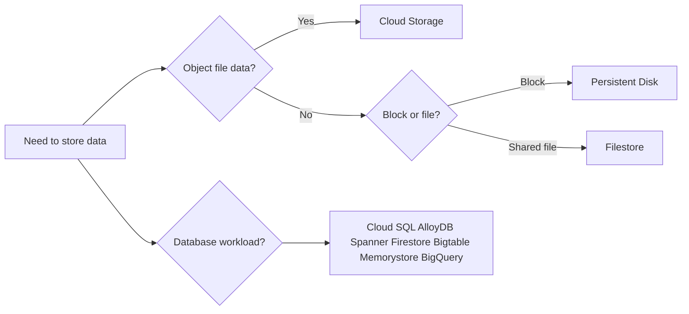
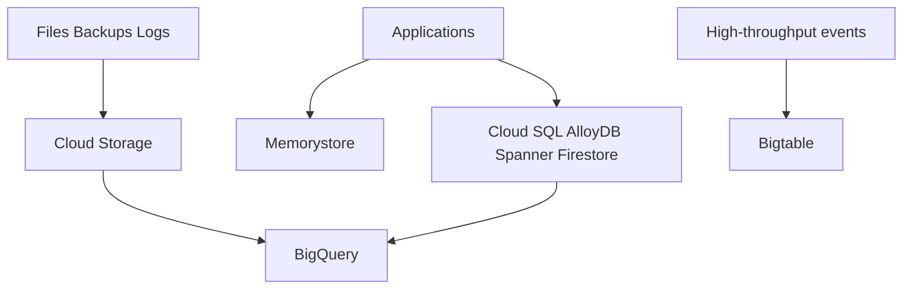

> **Screenshot Disclaimer:** Portal screenshots referenced in this guide are sourced from [Google Cloud documentation](https://cloud.google.com/docs). © Google LLC. Used for educational reference only.

# 03 Storage and Database Q&A

This chapter focuses on storage, databases, and analytics choices that interviewers use to test service selection and tradeoff thinking.
Keep answers anchored to access pattern, consistency needs, operational model, and cost.

## Storage Pattern Map



## Data Platform Flow



## Quick CLI Drill

**Console Navigation**
- Console: Home -> Activate Cloud Shell
```bash
gcloud config get-value project && gcloud storage buckets list --limit=2
```
Expected output:
```text
interview-prep-lab
gs://app-data/
gs://logs-archive/
```

### Q1. How do you choose among Cloud Storage storage classes?
Use Standard for hot data, Nearline for data accessed less than monthly, Coldline for rarer access, and Archive for long-term retention.
A strong answer says the main tradeoff is access pattern and retrieval cost, not raw durability.
- **Key points:** All classes are highly durable; cost changes with access frequency and retrieval behavior.
- **Example scenario:** Daily application assets stay in Standard, while quarterly compliance exports move to Archive.
- **Console / reference:** Console: Cloud Storage -> Buckets -> Create | https://cloud.google.com/storage/docs/storage-classes
```bash
gcloud storage buckets describe gs://interview-assets --format='value(storageClass)'
```
Expected output:
```text
STANDARD
```
**Q:** What mistake do candidates make here? **A:** They treat colder classes as less durable, but durability is similar; access economics are what really change.
### Q2. What does a lifecycle policy do in Cloud Storage?
A lifecycle policy moves or deletes objects automatically based on age, newer-version count, or other conditions.
It is an interview favorite because it shows you can control cost and retention without manual cleanup jobs.
- **Key points:** Automated transitions and deletion; cost control; retention hygiene.
- **Example scenario:** Log exports move from Standard to Nearline after 30 days and delete after 365 days.
- **Console / reference:** Console: Cloud Storage -> Buckets -> Lifecycle | https://cloud.google.com/storage/docs/lifecycle
```bash
gcloud storage buckets describe gs://logs-archive --format='yaml(lifecycle)'
```
Expected output:
```text
lifecycle:
  rule:
  - action:
      type: SetStorageClass
```
**Q:** Why use lifecycle rules instead of cron jobs? **A:** Lifecycle rules are native, reliable, and easier to audit than ad hoc deletion scripts.
### Q3. Why would you enable object versioning?
Object versioning keeps older generations of objects so accidental overwrite or deletion is easier to recover from.
It is especially useful for critical configuration, data exchange buckets, and user-managed content.
- **Key points:** Recovery from overwrite or delete; multiple generations; pairs well with lifecycle cleanup.
- **Example scenario:** A data science team can recover a previous training input file after a mistaken upload.
- **Console / reference:** Console: Cloud Storage -> Buckets -> Protection | https://cloud.google.com/storage/docs/object-versioning
```bash
gcloud storage buckets describe gs://ml-inputs --format='value(versioning.enabled)'
```
Expected output:
```text
True
```
**Q:** What downside should you mention? **A:** Old generations keep accumulating cost unless you add lifecycle rules to expire them.
### Q4. How do retention policies and object holds differ?
A retention policy enforces a minimum retention period for objects, while holds prevent deletion or modification for specific objects until released.
Retention is a bucket-level governance control; holds are more targeted and operational.
- **Key points:** Retention for policy-driven minimum age; holds for explicit temporary preservation.
- **Example scenario:** Financial records must stay seven years, while a legal investigation places event-based holds on a subset of files.
- **Console / reference:** Console: Cloud Storage -> Buckets -> Protection | https://cloud.google.com/storage/docs/bucket-lock
```bash
gcloud storage buckets describe gs://finance-records --format='yaml(retentionPolicy)'
```
Expected output:
```text
retentionPolicy:
  retentionPeriod: 220752000
```
**Q:** What does Bucket Lock add? **A:** Bucket Lock makes the retention policy immutable, which is important for regulatory compliance use cases.
### Q5. What is a signed URL and when is it useful?
A signed URL grants time-limited access to a specific object without making the bucket public.
It is a strong interview answer for secure external sharing, downloads, or controlled uploads.
- **Key points:** Temporary delegated access; no public bucket required; good for clients outside IAM boundary.
- **Example scenario:** An application generates a 15-minute upload URL so a customer can send a document directly to Cloud Storage.
- **Console / reference:** Console: Cloud Storage -> Buckets -> Objects | https://cloud.google.com/storage/docs/access-control/signed-urls
```bash
gcloud storage sign-url gs://uploads-bucket/invoice.pdf --duration=15m --impersonate-service-account=signer@project.iam.gserviceaccount.com
```
Expected output:
```text
signed_url: https://storage.googleapis.com/uploads-bucket/invoice.pdf?...
```
**Q:** Why is this better than proxying the upload through your app? **A:** Direct upload reduces app bandwidth, simplifies scaling, and keeps object transfer off the application servers.
### Q6. Why do many teams prefer uniform bucket-level access?
Uniform bucket-level access disables object ACLs and standardizes access through IAM only, which is easier to audit and govern.
It removes mixed permission models that often confuse operators and security reviewers.
- **Key points:** IAM-only access model; simpler governance; fewer ACL surprises.
- **Example scenario:** A platform team wants all storage access reviewed through Terraform-managed IAM bindings instead of per-object ACL drift.
- **Console / reference:** Console: Cloud Storage -> Buckets -> Permissions | https://cloud.google.com/storage/docs/uniform-bucket-level-access
```bash
gcloud storage buckets describe gs://app-data --format='value(iamConfiguration.uniformBucketLevelAccess.enabled)'
```
Expected output:
```text
True
```
**Q:** When might fine-grained ACLs still appear? **A:** Mostly in older environments or niche sharing models, but new enterprise designs usually standardize on uniform access.
### Q7. How do you answer gsutil versus gcloud storage?
gsutil is the older, widely used storage CLI, while gcloud storage is the newer Google Cloud CLI experience aligned with other gcloud commands.
In interviews, say you can work with both, but gcloud storage is the strategic direction for consistency.
- **Key points:** Both are useful; gcloud storage aligns better with broader CLI workflows.
- **Example scenario:** A team slowly updates automation to gcloud storage while keeping legacy gsutil scripts running.
- **Console / reference:** Console: Cloud Storage -> Buckets | https://cloud.google.com/storage/docs/gsutil-transition-to-gcloud
```bash
gcloud storage ls gs://
```
Expected output:
```text
gs://app-data/
gs://logs-archive/
```
**Q:** Should you refuse to use gsutil now? **A:** No. Many real environments still use it heavily, so the practical answer is to understand both tools.
### Q8. What is Storage Transfer Service best for?
Storage Transfer Service moves data between buckets, regions, providers, or on-prem sources with managed scheduling and retry behavior.
It is often the right answer when data movement must be repeatable and operationally supported.
- **Key points:** Managed recurring transfers; cloud-to-cloud or on-prem support; better than custom copy scripts.
- **Example scenario:** A nightly transfer moves media assets from an S3 bucket into Cloud Storage for processing.
- **Console / reference:** Console: Cloud Storage -> Transfer | https://cloud.google.com/storage-transfer/docs/overview
```bash
gcloud transfer jobs list --limit=2
```
Expected output:
```text
NAME                                 STATUS
transferJobs/1234567890123456789     ENABLED
```
**Q:** When is it better than gsutil rsync? **A:** When you need managed scheduling, scale, monitoring, and less operator dependence on a single workstation or VM.
### Q9. When would you mention Transfer Appliance?
Transfer Appliance is for moving very large datasets to Google Cloud when network transfer would be too slow or operationally painful.
It is not the default answer, but it shows you understand data migration at physical scale.
- **Key points:** Offline bulk ingest; useful for petabyte-scale or bandwidth-constrained migrations.
- **Example scenario:** A media company seeds petabytes of archive footage into Cloud Storage before beginning cloud-based processing.
- **Console / reference:** Console: Transfer Appliance service pages and migration planning docs | https://cloud.google.com/transfer-appliance/docs
```bash
gcloud services list --enabled --filter='name:storagetransfer.googleapis.com'
```
Expected output:
```text
NAME                           TITLE
storagetransfer.googleapis.com  Storage Transfer API
```
**Q:** Why not use it for every migration? **A:** It adds logistics and lead time, so online transfer is simpler unless data volume or bandwidth makes it impractical.
### Q10. How do zonal and regional Persistent Disks differ?
Zonal PD is attached within one zone, while regional PD synchronously replicates data across two zones in one region for higher availability.
Regional PD is a good answer when an application needs faster zone-failover for attached block storage.
- **Key points:** Regional PD improves zonal resilience; zonal PD is simpler and cheaper.
- **Example scenario:** A stateful VM pair uses a regional PD so storage survives a single-zone outage.
- **Console / reference:** Console: Compute Engine -> Disks | https://cloud.google.com/compute/docs/disks/regional-persistent-disk
```bash
gcloud compute disks describe app-data-rpd --region=us-central1
```
Expected output:
```text
replicaZones:
- zones/us-central1-a
- zones/us-central1-b
```
**Q:** Does regional PD make the application automatically highly available? **A:** No. The app still needs failover logic or orchestration to attach and use the replicated disk correctly.
### Q11. How do you compare Persistent Disk types?
Standard HDD is lowest cost, balanced PD is a strong general default, SSD PD is for higher performance, and extreme PD is for very high IOPS needs.
The best interview answer maps disk type to workload profile instead of memorizing every numeric limit.
- **Key points:** Choose by latency and throughput need; balanced PD is a common middle ground.
- **Example scenario:** A transactional database likely wants SSD, while low-traffic batch staging can stay on standard HDD.
- **Console / reference:** Console: Compute Engine -> Disks -> Create disk | https://cloud.google.com/compute/docs/disks/persistent-disks
```bash
gcloud compute disk-types list --zones=us-central1-a
```
Expected output:
```text
NAME             ZONE
pd-balanced      us-central1-a
pd-ssd           us-central1-a
```
**Q:** What is the safe default if you are unsure? **A:** Balanced PD is usually the safest starting point for general-purpose VM workloads.
### Q12. Why do snapshots matter for Persistent Disk operations?
Snapshots provide point-in-time backup and cloning options for disks without forcing full manual image workflows.
They are common in DR answers because they support restoration into new zones or regions depending on the design.
- **Key points:** Backup and clone utility; operational recovery; useful for patch and migration workflows.
- **Example scenario:** Before a risky database upgrade, the team takes a disk snapshot so rollback is faster if the host fails.
- **Console / reference:** Console: Compute Engine -> Snapshots | https://cloud.google.com/compute/docs/disks/snapshots
```bash
gcloud compute snapshots list --limit=2
```
Expected output:
```text
NAME                    SOURCE_DISK
app-data-preupgrade     app-data-disk
```
**Q:** Are snapshots a full DR plan by themselves? **A:** No. You still need tested restore procedures, target environments, and realistic recovery objectives.
### Q13. When is Filestore the right choice?
Filestore is the managed NFS option for workloads that need shared file semantics rather than object storage or block storage.
It is a good answer for lift-and-shift applications, content management systems, and shared ML or render workloads.
- **Key points:** Managed NFS; shared POSIX-like file access; simpler than self-managing file servers.
- **Example scenario:** Multiple GKE pods mount a Filestore share for a legacy application that expects a shared file tree.
- **Console / reference:** Console: Filestore -> Instances | https://cloud.google.com/filestore/docs/overview
```bash
gcloud filestore instances list --location=us-central1
```
Expected output:
```text
INSTANCE_NAME    TIER      FILE_SHARE_NAME
shared-files     ENTERPRISE appshare
```
**Q:** Why not use Cloud Storage instead? **A:** Cloud Storage is object storage, so it does not provide the same mounted shared file system behavior.
### Q14. How do you position Cloud SQL in an interview?
Cloud SQL is the managed relational database choice for MySQL, PostgreSQL, and SQL Server when you want familiar engines with reduced operational burden.
It fits transactional applications that do not need Spanner-style horizontal scaling or globally distributed writes.
- **Key points:** Managed relational service; good for common OLTP workloads; less ops than self-managed VMs.
- **Example scenario:** A SaaS app runs PostgreSQL on Cloud SQL with backups, private IP, and a moderate scale profile.
- **Console / reference:** Console: SQL -> Instances | https://cloud.google.com/sql/docs/overview
```bash
gcloud sql instances list
```
Expected output:
```text
NAME            DATABASE_VERSION  REGION       STATE
orders-pg       POSTGRES_15       us-central1  RUNNABLE
```
**Q:** When would Cloud SQL be the wrong answer? **A:** When write scale, global consistency, or very low-ops horizontal growth exceed what one traditional relational instance design handles well.
### Q15. What does Cloud SQL high availability actually mean?
Cloud SQL HA uses a regional primary with automatic failover to a standby in another zone inside the same region.
That improves zonal resilience, but it is not the same as global active-active database architecture.
- **Key points:** Regional failover; zonal resilience; managed standby and failover.
- **Example scenario:** A production PostgreSQL instance is configured for regional HA so a single-zone outage does not take down the database service.
- **Console / reference:** Console: SQL -> Instances -> High availability | https://cloud.google.com/sql/docs/mysql/high-availability
```bash
gcloud sql instances describe orders-pg --format='value(settings.availabilityType)'
```
Expected output:
```text
REGIONAL
```
**Q:** Does HA eliminate the need for backups? **A:** No. HA protects availability, while backups and PITR protect against data loss and operator mistakes.
### Q16. How do read replicas fit into a Cloud SQL answer?
Read replicas offload read traffic and can support reporting or low-risk read scale without changing the write topology.
They are useful when the main limitation is read pressure, not multi-writer scaling.
- **Key points:** Read scaling; offload analytics or reporting reads; primary still handles writes.
- **Example scenario:** An e-commerce app sends catalog reads to a replica while order writes remain on the primary.
- **Console / reference:** Console: SQL -> Instances -> Replicas | https://cloud.google.com/sql/docs/mysql/replication
```bash
gcloud sql instances list --filter='instanceType:READ_REPLICA_INSTANCE'
```
Expected output:
```text
NAME                MASTER_INSTANCE_NAME
orders-pg-replica   orders-pg
```
**Q:** Can replicas have lag? **A:** Yes, so they are not ideal for read-after-write guarantees that demand immediate consistency.
### Q17. What is the secure way to connect applications to Cloud SQL?
Prefer private IP where possible, and use the Cloud SQL Auth Proxy or language connectors when you want simplified secure connectivity and IAM-aware auth patterns.
In interviews, mention that public IP can work with controls, but private connectivity is usually the cleaner production answer.
- **Key points:** Private IP preferred; proxy or connectors simplify secure auth and TLS.
- **Example scenario:** A Cloud Run service reaches a private Cloud SQL instance through Serverless VPC Access and the Cloud SQL connector.
- **Console / reference:** Console: SQL -> Connections | https://cloud.google.com/sql/docs/postgres/connect-overview
```bash
gcloud sql instances describe orders-pg --format='value(ipAddresses.ipAddress)'
```
Expected output:
```text
10.30.0.5
```
**Q:** Why not expose the DB publicly if auth is strong? **A:** Private connectivity reduces attack surface and makes network policy easier to reason about.
### Q18. When would you bring up Database Migration Service?
Database Migration Service is the managed answer for moving supported databases into Google Cloud with less custom replication plumbing.
It is especially relevant when interviewers ask how to migrate into Cloud SQL or AlloyDB with minimal downtime.
- **Key points:** Managed migration workflow; reduces custom tooling; useful for cloud onboarding.
- **Example scenario:** A production PostgreSQL database is replicated into Cloud SQL before a cutover weekend.
- **Console / reference:** Console: Database Migration | https://cloud.google.com/database-migration/docs/overview
```bash
gcloud database-migration migration-jobs list --region=us-central1
```
Expected output:
```text
NAME                  TYPE         STATE
pg-cutover-job         CONTINUOUS   RUNNING
```
**Q:** What do you still need beyond the tool? **A:** Cutover planning, validation, application dependency checks, and rollback criteria still matter.
### Q19. When is Cloud Spanner the right answer?
Cloud Spanner is for relational workloads that need horizontal scale, strong consistency, and high availability beyond a traditional single-instance database pattern.
It is strongest when global or very large regional transactional systems outgrow Cloud SQL-style architecture.
- **Key points:** Horizontally scalable relational database; strong consistency; built for high availability.
- **Example scenario:** A payments platform needs relational transactions across large throughput and multiple regions.
- **Console / reference:** Console: Spanner -> Instances | https://cloud.google.com/spanner/docs/overview
```bash
gcloud spanner instances list
```
Expected output:
```text
NAME              CONFIG                                                   NODE_COUNT
payments-spanner  projects/demo/instanceConfigs/regional-us-central1      3
```
**Q:** Why not use Spanner for every OLTP app? **A:** It is powerful but adds cost and architectural weight that smaller workloads do not need.
### Q20. How do you describe Spanner scaling and consistency simply?
Spanner scales horizontally and keeps strong consistency, so it can preserve relational correctness without pushing all writes through one classic database host.
The concise interview point is that scale and consistency are both first-class, not an either-or choice here.
- **Key points:** Horizontal scale with relational semantics; strong consistency is a core differentiator.
- **Example scenario:** A booking system avoids homegrown sharding by using Spanner tables designed for distributed scale.
- **Console / reference:** Console: Spanner -> Databases -> Monitoring | https://cloud.google.com/spanner/docs/instances
```bash
gcloud spanner instance-configs list --filter='regional-us-central1'
```
Expected output:
```text
NAME                     DISPLAY_NAME
regional-us-central1     Regional US Central
```
**Q:** What should you still care about in schema design? **A:** Hot keys, access patterns, and transaction scope still matter even on a highly managed distributed database.
### Q21. When is Firestore a good fit?
Firestore is a managed document database that fits application data with flexible schema, hierarchical documents, and mobile or web-friendly developer patterns.
It is often the right answer when the data model is document-oriented and developer speed matters more than relational joins.
- **Key points:** Document model; serverless operations; strong fit for app backends and user content.
- **Example scenario:** A mobile app stores user profiles, preferences, and activity documents in Firestore.
- **Console / reference:** Console: Firestore | https://cloud.google.com/firestore/docs/overview
```bash
gcloud firestore databases list
```
Expected output:
```text
DATABASE_ID   LOCATION_ID   TYPE
(default)     nam5          FIRESTORE_NATIVE
```
**Q:** When would Firestore be the wrong answer? **A:** If you need heavy relational joins, strict SQL patterns, or very high-throughput wide-column analytics access.
### Q22. What do you say about Firestore indexes and query limits?
Firestore queries rely heavily on indexes, so compound query support usually means you must design and create the right indexes ahead of time.
A strong answer also notes that document size, write patterns, and query shape affect performance and cost.
- **Key points:** Index-driven query model; plan query patterns early; document design matters.
- **Example scenario:** An app adds a composite index for status plus createdAt so its dashboard query remains fast.
- **Console / reference:** Console: Firestore -> Indexes | https://cloud.google.com/firestore/docs/query-data/indexing
```bash
gcloud firestore indexes composite list --database='(default)'
```
Expected output:
```text
INDEX_ID      STATE
abc123        READY
```
**Q:** What common mistake hurts Firestore design? **A:** Modeling data without working backward from the required query patterns often leads to awkward indexes and extra reads.
### Q23. When is Bigtable the right database?
Bigtable is the right fit for massive key-value or wide-column workloads that need very high throughput and low latency at scale.
It is not a relational database and should be described in workload terms such as time series, IoT, or ad-tech event serving.
- **Key points:** Wide-column NoSQL; huge scale; low-latency reads and writes by key.
- **Example scenario:** A telemetry platform stores billions of time-stamped device measurements for fast keyed lookups.
- **Console / reference:** Console: Bigtable -> Instances | https://cloud.google.com/bigtable/docs/overview
```bash
gcloud bigtable instances list
```
Expected output:
```text
INSTANCE_NAME     DISPLAY_NAME      STATE
telemetry-bt      telemetry-bt      READY
```
**Q:** Why not use Bigtable for ad hoc SQL analytics? **A:** Because it is optimized for key-based operational access patterns, not warehouse-style analytical querying.
### Q24. What is the key to Bigtable schema design?
The row key design is the most important decision because it drives locality, hotspot risk, and efficient range scans.
Interviewers want to hear that schema is query-pattern-first rather than table-normalization-first.
- **Key points:** Row key design is critical; avoid hotspots; design for scan patterns.
- **Example scenario:** A sensor workload prefixes row keys with a hashed device component before timestamp to spread writes more evenly.
- **Console / reference:** Console: Bigtable -> Tables | https://cloud.google.com/bigtable/docs/schema-design
```bash
gcloud bigtable clusters list --instance=telemetry-bt
```
Expected output:
```text
CLUSTER_NAME        ZONE
telemetry-bt-c1     us-central1-b
```
**Q:** What row-key mistake should you mention? **A:** Using monotonically increasing keys can create hotspots because new writes land on the same tablet region repeatedly.
### Q25. Where does AlloyDB fit versus Cloud SQL?
AlloyDB is a PostgreSQL-compatible managed database aimed at higher performance, faster analytics on operational data, and enterprise PostgreSQL modernization.
It is a stronger answer than Cloud SQL when PostgreSQL compatibility is needed but scale and performance expectations are higher.
- **Key points:** PostgreSQL compatible; performance-oriented managed service; bridges OLTP and analytical acceleration better than standard managed Postgres.
- **Example scenario:** A fast-growing SaaS platform outgrows Cloud SQL performance expectations but wants to stay close to PostgreSQL.
- **Console / reference:** Console: AlloyDB | https://cloud.google.com/alloydb/docs/overview
```bash
gcloud alloydb clusters list --region=us-central1
```
Expected output:
```text
NAME                 STATE    NETWORK
orders-alloydb       READY    projects/demo/global/networks/shared-core
```
**Q:** Why not jump straight to Spanner instead? **A:** If PostgreSQL compatibility and ecosystem fit matter, AlloyDB can be a better step than redesigning for Spanner.
### Q26. What should you say about AlloyDB HA and read scaling?
AlloyDB separates the primary instance from read pools so you can scale reads while keeping a managed high-availability posture.
The simple interview message is better performance and scaling than basic managed PostgreSQL, without abandoning PostgreSQL semantics.
- **Key points:** Read pools for scaling; managed HA posture; PostgreSQL familiarity retained.
- **Example scenario:** A reporting-heavy SaaS platform adds read pools instead of pushing all traffic through one writer instance.
- **Console / reference:** Console: AlloyDB -> Clusters -> Instances | https://cloud.google.com/alloydb/docs/instance-read-pool-create
```bash
gcloud alloydb instances list --cluster=orders-alloydb --region=us-central1
```
Expected output:
```text
NAME                      INSTANCE_TYPE
orders-alloydb-primary    PRIMARY
orders-alloydb-rp1        READ_POOL
```
**Q:** What should still be tested carefully? **A:** Connection patterns, failover behavior, and query plans should still be validated with real workload traffic.
### Q27. How do Redis and Memcached differ in Memorystore?
Memorystore for Redis supports richer data structures and persistence-related capabilities, while Memorystore for Memcached is simpler distributed caching without persistence.
Redis is the more common interview answer for session stores, queues, counters, and cache patterns needing more than plain key-value eviction.
- **Key points:** Redis is feature-rich; Memcached is lightweight cache only.
- **Example scenario:** An API stores sessions and rate-limit counters in Redis, while a read-through cache for rendered fragments could use Memcached.
- **Console / reference:** Console: Memorystore -> Redis / Memcached | https://cloud.google.com/memorystore/docs/redis/redis-overview
```bash
gcloud redis instances list --region=us-central1
```
Expected output:
```text
NAME             TIER         HOST
session-cache    STANDARD_HA  10.40.0.3
```
**Q:** Why is Memorystore not your system of record? **A:** Because it is primarily a cache or fast data structure store, so durable source-of-truth data should live elsewhere.
### Q28. What is the cleanest way to position BigQuery?
BigQuery is the serverless analytical data warehouse for large-scale SQL analytics, BI, ELT, and data science workloads.
Its value in interviews is that you can analyze huge datasets without managing database servers or storage layout manually.
- **Key points:** Serverless analytics; SQL-first; separates operational DB needs from analytical workloads.
- **Example scenario:** Product events are landed daily and queried in BigQuery for dashboards and experimentation analysis.
- **Console / reference:** Console: BigQuery -> SQL workspace | https://cloud.google.com/bigquery/docs/introduction
```bash
bq ls
```
Expected output:
```text
datasetId
analytics_core
```
**Q:** Why not run analytics on Cloud SQL? **A:** Heavy analytics on an OLTP database hurts transactional performance and does not scale like BigQuery.
### Q29. How do partitioning and clustering help in BigQuery?
Partitioning reduces scanned data by limiting which partitions are read, and clustering improves pruning within those partitions based on sorted columns.
The interview point is lower cost and better performance when your query filters match the table design.
- **Key points:** Lower scan volume; better performance; schema should match common filters.
- **Example scenario:** An events table is partitioned by event_date and clustered by customer_id for common dashboard queries.
- **Console / reference:** Console: BigQuery -> Dataset -> Table details | https://cloud.google.com/bigquery/docs/partitioned-tables
```bash
bq show --format=prettyjson analytics_core.events
```
Expected output:
```text
{
  "clustering": {
    "fields": ["customer_id"]
```
**Q:** What happens if queries ignore the partition filter? **A:** You scan much more data, so cost rises quickly and performance usually gets worse.
### Q30. When do external tables make sense in BigQuery?
External tables make sense when you want to query data in Cloud Storage without loading every file into native BigQuery storage first.
The tradeoff is convenience and open-format flexibility versus the performance and governance advantages of native tables.
- **Key points:** Query in-place data; flexible lake patterns; native tables still win for many performance cases.
- **Example scenario:** A team explores parquet exports in Cloud Storage before deciding which curated data should be loaded into native BigQuery tables.
- **Console / reference:** Console: BigQuery -> Add data -> External data source | https://cloud.google.com/bigquery/docs/external-tables
```bash
gcloud services list --enabled --filter='name:bigquery.googleapis.com'
```
Expected output:
```text
NAME                     TITLE
bigquery.googleapis.com  BigQuery API
```
**Q:** What is the interview-safe takeaway? **A:** Say external tables are great for flexibility and staged exploration, while native tables are usually better for repeated, performance-sensitive analytics.
### Q31. How do Cloud Storage and BigQuery work together in a lakehouse-style answer?
Cloud Storage commonly holds raw or staged files, while BigQuery stores curated analytical tables and powers SQL-based analysis.
That division sounds strong because it separates cheap landing storage from governed analytics consumption.
- **Key points:** Raw landing in object storage; curated analytics in BigQuery; common modern data platform pattern.
- **Example scenario:** CSV and parquet files land in a bucket, then Dataflow or scheduled SQL builds refined BigQuery tables for reporting.
- **Console / reference:** Console: Cloud Storage; BigQuery | https://cloud.google.com/architecture/modern-data-platform-reference-architecture
```bash
gcloud storage ls gs://raw-events && bq ls analytics_core
```
Expected output:
```text
gs://raw-events/
analytics_core:events_curated
```
**Q:** Why not keep everything only in BigQuery? **A:** Raw files in Cloud Storage are cheaper for landing, replay, and open-format interchange with other systems.
### Q32. What should you say about backups and DR across storage and databases?
Explain that backups, snapshots, PITR, cross-region copies, and tested restore procedures all serve different recovery goals.
The best answer mentions recovery time objective and recovery point objective rather than listing tools blindly.
- **Key points:** Match tool to RTO and RPO; test restores; separate availability from recoverability.
- **Example scenario:** Cloud SQL uses automated backups and PITR, while Cloud Storage critical buckets use versioning plus cross-region replication patterns where needed.
- **Console / reference:** Console: SQL -> Backups; Cloud Storage -> Protection; Compute Engine -> Snapshots | https://cloud.google.com/architecture/disaster-recovery
```bash
gcloud sql backups list --instance=orders-pg --limit=2
```
Expected output:
```text
ID                WINDOW_START_TIME         STATUS
1705321200000     2025-01-15T03:00:00.000Z  SUCCESSFUL
```
**Q:** What is the biggest interview mistake on DR? **A:** Saying backups exist without showing how the team would actually restore and validate within target timelines.
### Q33. How do you choose among Cloud SQL, AlloyDB, and Spanner?
Choose Cloud SQL for mainstream managed relational workloads, AlloyDB when PostgreSQL compatibility plus higher performance is needed, and Spanner when horizontal relational scale and strong consistency across large systems are essential.
This answer works well because it is selection-by-requirement rather than product memorization.
- **Key points:** Cloud SQL for simplicity; AlloyDB for high-performance Postgres; Spanner for global-scale relational systems.
- **Example scenario:** A startup API begins on Cloud SQL, a fast-growing SaaS platform may move to AlloyDB, and a global ledger-like system may need Spanner.
- **Console / reference:** Console: SQL; AlloyDB; Spanner | https://cloud.google.com/databases
```bash
gcloud services list --enabled --filter='name:(sqladmin.googleapis.com OR alloydb.googleapis.com OR spanner.googleapis.com)'
```
Expected output:
```text
NAME                    TITLE
sqladmin.googleapis.com Cloud SQL Admin API
```
**Q:** What if two options both seem valid? **A:** State the simpler one first, then explain what future trigger would justify moving to the more advanced service.
### Q34. How do you choose among Firestore, Bigtable, and Memorystore?
Choose Firestore for document-centric app data, Bigtable for huge low-latency keyed datasets, and Memorystore for cache or ephemeral fast-access patterns.
The selection becomes clear when you classify the access pattern and whether the system is a source of truth or only an acceleration layer.
- **Key points:** Document DB versus wide-column store versus cache; source-of-truth role matters.
- **Example scenario:** User profiles fit Firestore, metrics serving fits Bigtable, and session caching fits Redis.
- **Console / reference:** Console: Firestore; Bigtable; Memorystore | https://cloud.google.com/products/databases
```bash
gcloud services list --enabled --filter='name:(firestore.googleapis.com OR bigtableadmin.googleapis.com OR redis.googleapis.com)'
```
Expected output:
```text
NAME                         TITLE
firestore.googleapis.com     Cloud Firestore API
```
**Q:** Why is Memorystore usually not compared as a primary database? **A:** Because it is typically an accelerator layer, not the durable system of record for core business data.
### Q35. What cost controls should you mention for storage and database services?
Mention lifecycle rules, right storage class, partition pruning, replica discipline, cache hit rate, and avoiding overprovisioned database tiers.
Interviewers appreciate hearing that optimization is about access patterns and sizing, not only discounts.
- **Key points:** Match cost to access pattern; avoid oversized compute and scanned data; automate retention.
- **Example scenario:** A team cuts BigQuery cost by partitioning correctly and lowers storage cost by aging cold logs into cheaper classes.
- **Console / reference:** Console: Billing -> Reports; Recommender; BigQuery cost controls | https://cloud.google.com/storage/docs/best-practices#manage_costs
```bash
gcloud recommender recommendations list --recommender=google.compute.disk.IdleResourceRecommender --location=global --limit=2
```
Expected output:
```text
RECOMMENDATION_ID   STATE_INFO
abc-def-123         ACTIVE
```
**Q:** What is the clean interview close? **A:** Say you optimize by measuring actual access and query behavior first, then align tiers and retention to those facts.
### Q36. How do you explain BigQuery versus Spanner in one sentence?
BigQuery is for analytical SQL over large datasets, while Spanner is for transactional relational workloads that need scale and strong consistency.
That contrast is useful because both use SQL but solve very different problems.
- **Key points:** Analytics warehouse versus transactional database; same SQL language does not mean same workload role.
- **Example scenario:** Orders are written to Spanner or Cloud SQL, then replicated or exported to BigQuery for business analytics.
- **Console / reference:** Console: BigQuery; Spanner | https://cloud.google.com/spanner/docs/spanner-vs-bigquery
```bash
gcloud services list --enabled --filter='name:(bigquery.googleapis.com OR spanner.googleapis.com)'
```
Expected output:
```text
NAME                     TITLE
bigquery.googleapis.com  BigQuery API
```
**Q:** Why is this distinction important in interviews? **A:** It shows you separate operational transaction systems from analytical reporting systems instead of treating SQL products as interchangeable.

## Official Google Cloud References

- Cloud Storage docs: https://cloud.google.com/storage/docs
- Persistent Disk docs: https://cloud.google.com/compute/docs/disks
- Filestore docs: https://cloud.google.com/filestore/docs
- Cloud SQL docs: https://cloud.google.com/sql/docs
- AlloyDB docs: https://cloud.google.com/alloydb/docs
- Spanner docs: https://cloud.google.com/spanner/docs
- Firestore docs: https://cloud.google.com/firestore/docs
- Bigtable docs: https://cloud.google.com/bigtable/docs
- Memorystore docs: https://cloud.google.com/memorystore/docs
- BigQuery docs: https://cloud.google.com/bigquery/docs
