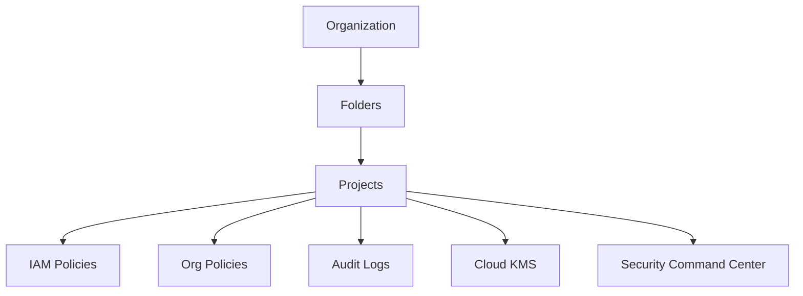
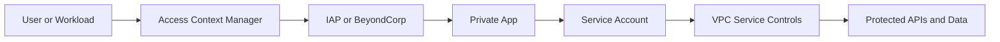

> **Screenshot Disclaimer:** Portal screenshots referenced in this guide are sourced from [Google Cloud documentation](https://cloud.google.com/docs). © Google LLC. Used for educational reference only.

# 04 Security and Governance Q&A

This chapter is for interview loops that test IAM, policy guardrails, key management, data protection, platform security, and zero-trust access.
Use short answers first, then support them with console navigation and a quick `gcloud` verification example.

## How to Use This Chapter

- Start with the risk or governance problem.
- Name the GCP control that solves it.
- Close with how you would verify the control in the console or CLI.

## Security Governance Map



## Zero Trust Control Flow



## Screenshot-Friendly Google Cloud Docs

- IAM overview: https://cloud.google.com/iam/docs/overview
- Org Policy overview: https://cloud.google.com/resource-manager/docs/organization-policy/overview
- VPC Service Controls overview: https://cloud.google.com/vpc-service-controls/docs/overview
- Cloud KMS docs: https://cloud.google.com/kms/docs
- Secret Manager docs: https://cloud.google.com/secret-manager/docs
- Security Command Center overview: https://cloud.google.com/security-command-center/docs/concepts-security-command-center-overview
- Binary Authorization overview: https://cloud.google.com/binary-authorization/docs/overview
- Cloud Armor overview: https://cloud.google.com/armor/docs/security-policy-overview
- Sensitive Data Protection overview: https://cloud.google.com/sensitive-data-protection/docs/overview
- Cloud Audit Logs overview: https://cloud.google.com/logging/docs/audit

## Foundation CLI Drill
**Console Navigation**
- Console: IAM & Admin -> IAM

```bash
gcloud projects get-iam-policy interview-security-prod --format="table(bindings.role,bindings.members)" --limit=5
```
Expected output:
```text
ROLE                          MEMBERS
roles/viewer                  group:platform-readers@example.com
roles/logging.viewer          user:auditor@example.com
```
### Q1. What is IAM in Google Cloud?

IAM is the authorization layer that decides who can do what on which resource.
A strong answer says principals receive roles through policies, and those policies can inherit from organization or folder down to projects and resources.
**Q:** What are the three core parts of an IAM decision? A principal, a role, and a resource scope.
**Q:** Why mention inheritance? Because enterprise access is usually designed high in the hierarchy and reused safely.
**Console Navigation**
- Console: IAM & Admin -> IAM
**CLI Check**
```bash
gcloud projects get-iam-policy interview-security-prod --flatten="bindings[].members" --filter="bindings.members:alice@example.com"
```
Expected output:
```text
ROLE: roles/logging.viewer
MEMBER: user:alice@example.com
```
### Q2. How do primitive, predefined, and custom roles differ?

Primitive roles are broad legacy roles, predefined roles are maintained by Google for a service, and custom roles are curated by the organization.
For production, predefined or custom roles are preferred because primitive roles usually grant too much.
**Q:** When do custom roles make sense? When predefined roles still include permissions your control standard does not allow.
**Q:** What is the main risk of primitive roles? They increase blast radius through excess permissions.
**Console Navigation**
- Console: IAM & Admin -> Roles
**CLI Check**
```bash
gcloud iam roles describe roles/storage.objectViewer
```
Expected output:
```text
title: Storage Object Viewer
includedPermissions:
- storage.objects.get
```
### Q3. How do you apply least privilege in GCP?

I start with job responsibility, map it to the smallest practical role set, and grant it at the lowest practical scope.
Then I use groups, periodic review, audit logs, and recommendations to remove excess access over time.
**Q:** What is the first sign least privilege is failing? Too many project-level admin roles granted for convenience.
**Q:** How do you keep it practical? Use group-based grants and review access regularly instead of making one-off exceptions permanent.
**Console Navigation**
- Console: IAM & Admin -> IAM Recommender
**CLI Check**
```bash
gcloud recommender recommendations list --recommender=google.iam.policy.Recommender --location=global --project=interview-security-prod --limit=2
```
Expected output:
```text
NAME
projects/123/locations/global/recommenders/google.iam.policy.Recommender/recommendations/abc123
```
### Q4. Why are Google Groups better than direct user grants?

Groups simplify onboarding, offboarding, and auditing because you manage membership once instead of editing many IAM policies.
They also reduce hidden exceptions and make reviews easier during compliance or incident work.
**Q:** What is the strong interview phrase? Access should be role based, group managed, and inherited where possible.
**Q:** What is the drawback of direct grants? They accumulate undocumented exceptions that are easy to miss later.
**Console Navigation**
- Console: IAM & Admin -> IAM
**CLI Check**
```bash
gcloud projects get-iam-policy interview-security-prod --flatten="bindings[].members" --filter="bindings.members:group:platform-admins@example.com"
```
Expected output:
```text
ROLE: roles/container.admin
MEMBER: group:platform-admins@example.com
```
### Q5. What is a service account?

A service account is a non-human identity used by applications, VMs, jobs, and automation to call Google APIs.
The interview-ready point is that service accounts should represent workload boundaries, not serve as shared convenience identities.
**Q:** What is a common mistake? Reusing one highly privileged service account across unrelated workloads.
**Q:** What is the better pattern? Separate service accounts by application, environment, or trust boundary.
**Console Navigation**
- Console: IAM & Admin -> Service Accounts
**CLI Check**
```bash
gcloud iam service-accounts list --project=interview-security-prod --limit=5
```
Expected output:
```text
EMAIL
api-prod@interview-security-prod.iam.gserviceaccount.com
build-bot@interview-security-prod.iam.gserviceaccount.com
```
### Q6. Why is service account impersonation preferred over key files?

Impersonation gives temporary credentials without distributing long-lived keys, and actions remain auditable.
It is safer because the service account holds the permissions while humans or automation only receive short-lived access to act as it.
**Q:** What permission usually enables impersonation? `roles/iam.serviceAccountTokenCreator` on the target service account.
**Q:** Why is this stronger than downloaded keys? There is no static credential to leak, copy, or forget to rotate.
**Console Navigation**
- Console: IAM & Admin -> Service Accounts -> Permissions
**CLI Check**
```bash
gcloud auth print-access-token --impersonate-service-account=build-bot@interview-security-prod.iam.gserviceaccount.com | head -c 20 && echo
```
Expected output:
```text
ya29.c.ElqB3Example
```
### Q7. How do you avoid long-lived service account keys?

I prefer attached identities, Workload Identity Federation, or impersonation, and I treat key creation as an exception path.
If keys exist, I track ownership, rotate them, and watch audit logs for unexpected creation or usage.
**Q:** What is the best interview wording? Keyless patterns are primary, key rotation is fallback.
**Q:** Where do you check for key sprawl? Service account key listings, SCC findings, and audit logs.
**Console Navigation**
- Console: IAM & Admin -> Service Accounts -> Keys
**CLI Check**
```bash
gcloud iam service-accounts keys list --iam-account=build-bot@interview-security-prod.iam.gserviceaccount.com
```
Expected output:
```text
KEY_ID                                    CREATED_AT
1a2b3c4d5e6f7g8h9i0j                      2024-11-01T08:15:00Z
```
### Q8. What is Workload Identity Federation?

Workload Identity Federation lets external workloads authenticate to Google Cloud without storing service account keys.
It is useful for GitHub Actions, multi-cloud jobs, or partner systems that need short-lived access based on trusted identity tokens.
**Q:** What is the short definition? External identity to Google Cloud access without static keys.
**Q:** Why do platform teams like it? It reduces secret sprawl and improves credential lifecycle control.
**Console Navigation**
- Console: IAM & Admin -> Workload Identity Federation
**CLI Check**
```bash
gcloud iam workload-identity-pools list --location=global --project=interview-security-prod
```
Expected output:
```text
NAME
projects/123456789/locations/global/workloadIdentityPools/github-pool
```
### Q9. What are organization policies?

Organization policies are guardrails that constrain how resources may be created or configured across the hierarchy.
They enforce standards such as allowed locations, blocked external IPs, or disabled default networks before teams make risky changes.
**Q:** Why are org policies stronger than written guidance? They prevent noncompliant changes instead of relying on memory.
**Q:** Where should broad guardrails usually live? At the organization or folder level unless a justified exception boundary exists.
**Console Navigation**
- Console: IAM & Admin -> Organization Policies
**CLI Check**
```bash
gcloud resource-manager org-policies describe constraints/compute.skipDefaultNetworkCreation --project=interview-security-prod
```
Expected output:
```text
name: projects/123/policies/compute.skipDefaultNetworkCreation
spec:
  rules:
  - enforce: true
```
### Q10. How do folders help with governance?

Folders provide a middle layer for policy inheritance, delegated administration, and environment separation.
A common design is separate production, non-production, and shared-services folders with tighter controls on production.
**Q:** What is a strong example? Security owns org-level guardrails while platform teams operate only within their folder scope.
**Q:** Why not solve everything at project level? Governance becomes repetitive, inconsistent, and hard to audit.
**Console Navigation**
- Console: IAM & Admin -> Manage Resources
**CLI Check**
```bash
gcloud resource-manager folders get-iam-policy folders/456789012345
```
Expected output:
```text
bindings:
- role: roles/resourcemanager.projectCreator
```
### Q11. When do you use IAM Conditions or tags?

IAM Conditions add context such as time-bound or resource-specific rules, and tags help apply governance logic consistently across resources.
They are useful when static role grants are too broad but you do not want to redesign the entire project layout.
**Q:** What is a good IAM Condition example? Temporary admin access that expires after a maintenance window.
**Q:** What is a good tag example? Marking regulated workloads so extra controls apply automatically.
**Console Navigation**
- Console: IAM & Admin -> Tags
**CLI Check**
```bash
gcloud projects get-iam-policy interview-security-prod --format=json | grep -n "expression" | head
```
Expected output:
```text
17:        "expression": "request.time < timestamp('2025-01-01T00:00:00Z')"
```
### Q12. What is VPC Service Controls?

VPC Service Controls creates a security perimeter around supported Google-managed services to reduce data exfiltration risk.
It complements IAM by adding an API boundary around services like BigQuery, Cloud Storage, and Secret Manager.
**Q:** Does it replace IAM? No, IAM still decides who is allowed; VPC SC constrains where access can happen from.
**Q:** Why is it powerful for sensitive data? It limits easy exfiltration from managed services even when identities are valid.
**Console Navigation**
- Console: Security -> VPC Service Controls
**CLI Check**
```bash
gcloud access-context-manager perimeters list --policy=123456789012
```
Expected output:
```text
NAME
accessPolicies/123456789012/servicePerimeters/prod-data-perimeter
```
### Q13. What is Access Context Manager?

Access Context Manager defines access levels based on identity, device state, IP range, or region, and those levels can be used by VPC SC or zero-trust controls.
The interview-safe explanation is that it adds context-aware policy on top of identity alone.
**Q:** What is the short definition? Context-aware access criteria.
**Q:** Why is that valuable? The same user should not be treated equally from a managed laptop and an unknown endpoint.
**Console Navigation**
- Console: Security -> Access Context Manager
**CLI Check**
```bash
gcloud access-context-manager levels list --policy=123456789012
```
Expected output:
```text
NAME
accessPolicies/123456789012/accessLevels/corp-managed-devices
```
### Q14. What is Cloud KMS?

Cloud KMS is Google Cloud's managed key management service for creating, storing, rotating, and using cryptographic keys.
In interviews, I emphasize separation of duties, key lifecycle control, protection levels, and service integration through CMEK.
**Q:** What is the difference between a key ring and a crypto key? A key ring is the container; the crypto key is the actual cryptographic object.
**Q:** What does rotation do? It creates a new key version while older versions can still decrypt existing data.
**Console Navigation**
- Console: Security -> Key Management
**CLI Check**
```bash
gcloud kms keyrings list --location=global
```
Expected output:
```text
NAME
projects/interview-security-prod/locations/global/keyRings/prod-ring
```
### Q15. How do symmetric, asymmetric, and HSM-backed keys differ?

Symmetric keys are common for encrypting data, asymmetric keys separate public and private operations, and HSM-backed keys keep material in hardware security modules.
The real interview point is choosing the key type by use case and control requirement.
**Q:** When is asymmetric crypto common? Signing, verification, and external trust workflows.
**Q:** When do HSM-backed keys matter? When policy or regulation requires stronger custody assurances.
**Console Navigation**
- Console: Security -> Key Management -> Keys
**CLI Check**
```bash
gcloud kms keys list --location=global --keyring=prod-ring
```
Expected output:
```text
NAME                                                   PURPOSE
projects/.../cryptoKeys/app-data-key                   ENCRYPT_DECRYPT
projects/.../cryptoKeys/signing-key                    ASYMMETRIC_SIGN
```
### Q16. What is CMEK, and when would you recommend it?

Customer-managed encryption keys let the customer control key lifecycle for supported services while Google still operates the service.
I recommend CMEK when the business needs stronger control, explicit auditability, or the ability to disable access through key management.
**Q:** Is CMEK always required? No, Google-managed encryption is secure, but CMEK adds governance control and evidence.
**Q:** What operational warning belongs here? Disabling the wrong key can break dependent workloads.
**Console Navigation**
- Console: Security -> Key Management
**CLI Check**
```bash
gcloud storage buckets describe gs://prod-sensitive-data --format="value(encryption.defaultKmsKeyName)"
```
Expected output:
```text
projects/interview-security-prod/locations/us/keyRings/prod-ring/cryptoKeys/storage-key
```
### Q17. Why use Secret Manager?

Secret Manager centralizes secret storage, versioning, IAM control, and audit logging, which is safer than putting secrets in files, images, or deployment manifests.
It supports runtime retrieval and controlled rotation for applications and automation.
**Q:** What is the main advantage over ad hoc storage? Access becomes governable, reviewable, and auditable.
**Q:** What is the best workload pattern? Separate secret access by application and environment boundary.
**Console Navigation**
- Console: Security -> Secret Manager
**CLI Check**
```bash
gcloud secrets versions access latest --secret=db-password --project=interview-security-prod
```
Expected output:
```text
s3cr3t-value-example
```
### Q18. How do you rotate secrets safely?

I create a new secret version, update workloads to consume it, validate application health, and only then disable the old version.
For shared credentials such as databases, I coordinate both sides so the old and new credentials overlap during rollout.
**Q:** What is the mature interview phrase? Rotation needs application sequencing, not just secret replacement.
**Q:** How do you prove rotation worked? Audit new secret access and confirm workload health after deployment.
**Console Navigation**
- Console: Security -> Secret Manager -> Secret versions
**CLI Check**
```bash
gcloud secrets versions list db-password --project=interview-security-prod
```
Expected output:
```text
NAME  STATE    CREATED
1     DISABLED 2024-10-01T00:00:00
2     ENABLED  2024-11-01T00:00:00
```
### Q19. What is Security Command Center?

Security Command Center is the central platform for cloud asset visibility, posture findings, and security investigation signals.
I describe it as the place where governance, misconfiguration, and threat findings become actionable across many projects.
**Q:** What question does SCC answer well? What assets do I have, what is risky, and where should I investigate first?
**Q:** Is SCC only for threat detections? No, it also highlights posture issues and risky configurations.
**Console Navigation**
- Console: Security -> Security Command Center
**CLI Check**
```bash
gcloud scc assets list --organization=123456789012 --limit=2
```
Expected output:
```text
name: organizations/123456789012/assets/9876543210
securityCenterProperties:
  resourceType: google.compute.Instance
```
### Q20. How do you explain security posture management?

Security posture management checks whether deployed resources still match policy expectations and highlights drift or risky states.
It is the preventive side of cloud security because it finds bad configurations before they become incidents.
**Q:** What is the interview shortcut? Governance at cloud speed.
**Q:** How is posture different from detection? Posture finds unsafe states even if no attacker is active yet.
**Console Navigation**
- Console: Security -> Security posture
**CLI Check**
```bash
gcloud scc findings list --organization=123456789012 --limit=2
```
Expected output:
```text
RESOURCE_NAME                              CATEGORY
projects/123/.../instances/web-01          PUBLIC_BUCKET_ACL
```
### Q21. What are Cloud Audit Logs?

Cloud Audit Logs record administrative actions, data access, system events, and policy denials depending on service behavior and configuration.
The key interview point is that they give control-plane evidence for change tracking, investigations, and compliance.
**Q:** Which log type is most universally important? Admin Activity, because it records configuration and management actions.
**Q:** What caution belongs with Data Access logs? They are valuable for sensitive systems but can be high-volume and higher-cost.
**Console Navigation**
- Console: Logging -> Logs Explorer
**CLI Check**
```bash
gcloud logging read 'logName:"cloudaudit.googleapis.com" AND protoPayload.methodName="v1.compute.instances.insert"' --limit=2
```
Expected output:
```text
logName: projects/interview-security-prod/logs/cloudaudit.googleapis.com%2Factivity
protoPayload:
  methodName: v1.compute.instances.insert
```
### Q22. How do you use audit logs in an incident?

I use them to answer who changed what, when it happened, which identity was used, and which resource was touched.
They are most effective when correlated with SCC findings, application logs, and ticket or deploy timelines.
**Q:** What is the short interview phrase? Audit logs provide control-plane evidence.
**Q:** Why is correlation important? One log rarely explains the full incident without surrounding context.
**Console Navigation**
- Console: Logging -> Logs Explorer
**CLI Check**
```bash
gcloud logging read 'protoPayload.authenticationInfo.principalEmail="build-bot@interview-security-prod.iam.gserviceaccount.com"' --limit=3
```
Expected output:
```text
protoPayload:
  authenticationInfo:
    principalEmail: build-bot@interview-security-prod.iam.gserviceaccount.com
```
### Q23. What are log sinks, and why do governance teams care?

Log sinks route logs to BigQuery, Cloud Storage, or Pub/Sub for retention, analytics, and downstream tooling.
Governance teams care because centralized retention and export make audits and cross-project investigations much easier.
**Q:** What is a common enterprise design? Export org-level audit logs into a dedicated security project.
**Q:** Why is BigQuery a useful sink target? It supports long-term search and reporting across many projects.
**Console Navigation**
- Console: Logging -> Logs Router
**CLI Check**
```bash
gcloud logging sinks list --organization=123456789012
```
Expected output:
```text
NAME                  DESTINATION
org-audit-bq          bigquery.googleapis.com/projects/sec-ops/datasets/audit_logs
```
### Q24. What is Binary Authorization?

Binary Authorization is a deployment-time control that enforces which container images are allowed to run, often based on attestation or provenance policy.
It is a strong answer when the interview shifts toward software supply chain security on GKE.
**Q:** What should you mention with it? Attestors, policy rules, and trusted build pipelines.
**Q:** Why is it stronger than just scanning images? It blocks untrusted artifacts from being deployed.
**Console Navigation**
- Console: Security -> Binary Authorization
**CLI Check**
```bash
gcloud container binauthz policy export
```
Expected output:
```text
defaultAdmissionRule:
  evaluationMode: REQUIRE_ATTESTATION
  enforcementMode: ENFORCED_BLOCK_AND_AUDIT_LOG
```
### Q25. What is Cloud Armor?

Cloud Armor is Google Cloud's edge security service for DDoS defense, WAF rules, IP controls, geo controls, and adaptive protection on internet-facing apps.
It sits in front of HTTP(S) load balancers as a first-line perimeter for public services.
**Q:** What is the one-line answer? Cloud Armor protects exposed applications at the edge.
**Q:** What should you avoid claiming? That it replaces secure application code or identity-aware controls.
**Console Navigation**
- Console: Network Security -> Cloud Armor
**CLI Check**
```bash
gcloud compute security-policies list
```
Expected output:
```text
NAME             TYPE
prod-web-waf     CLOUD_ARMOR
```
### Q26. How do WAF rules and rate limiting help together?

Preconfigured WAF rules catch common attack patterns, and rate limiting helps absorb abusive bursts such as scraping or credential stuffing.
Together they create a fast baseline defense while teams tune for app-specific behavior and false positives.
**Q:** When is rate limiting especially useful? During bot traffic, brute-force attempts, or bursty abuse.
**Q:** What is the safe tuning advice? Start with managed rules, then adjust based on logs and observed traffic patterns.
**Console Navigation**
- Console: Network Security -> Cloud Armor -> Security policies
**CLI Check**
```bash
gcloud compute security-policies describe prod-web-waf
```
Expected output:
```text
rules:
- action: throttle
  priority: 1000
```
### Q27. What is Sensitive Data Protection, formerly Cloud DLP?

Sensitive Data Protection discovers, classifies, masks, tokenizes, or de-identifies sensitive content such as PII and financial data.
I explain it as the control for knowing where sensitive data exists and reducing exposure when the business still needs to process that data.
**Q:** What are common use cases? Scanning storage, masking exports, and validating privacy controls in pipelines.
**Q:** Why is de-identification important? It preserves data utility while lowering privacy and breach risk.
**Console Navigation**
- Console: Security -> Sensitive Data Protection
**CLI Check**
```bash
gcloud dlp inspect-templates list --location=global
```
Expected output:
```text
NAME
projects/interview-security-prod/locations/global/inspectTemplates/pii-standard
```
### Q28. How do BeyondCorp, IAP, and Access Approval fit a secure landing zone answer?

BeyondCorp provides the zero-trust model, IAP enforces application-level access, and Access Approval or Access Transparency address provider-side accountability needs.
My full landing-zone answer combines those with group-based IAM, org policies, KMS, Secret Manager, SCC, VPC SC, and centralized logging.
**Q:** What is the strongest closing sentence? Security controls should be inherited, observable, and hard to bypass.
**Q:** How do you prove the model works? Validate with policy checks, audit logs, posture findings, and controlled deployment paths.
**Console Navigation**
- Console: Security -> Identity-Aware Proxy; Security -> Access Approval
**CLI Check**
```bash
gcloud services list --enabled --project=interview-security-prod --filter="NAME:(cloudkms.googleapis.com OR secretmanager.googleapis.com OR securitycenter.googleapis.com)"
```
Expected output:
```text
NAME
cloudkms.googleapis.com
secretmanager.googleapis.com
securitycenter.googleapis.com
```

## Official Google Cloud References

- https://cloud.google.com/iam/docs/overview
- https://cloud.google.com/resource-manager/docs/organization-policy/overview
- https://cloud.google.com/vpc-service-controls/docs/overview
- https://cloud.google.com/kms/docs
- https://cloud.google.com/secret-manager/docs
- https://cloud.google.com/security-command-center/docs/concepts-security-command-center-overview
- https://cloud.google.com/binary-authorization/docs/overview
- https://cloud.google.com/armor/docs/security-policy-overview
- https://cloud.google.com/sensitive-data-protection/docs/overview
- https://cloud.google.com/logging/docs/audit
- https://cloud.google.com/beyondcorp-enterprise/docs/introduction
- https://cloud.google.com/architecture/framework/security
