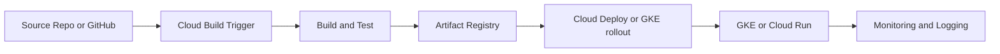
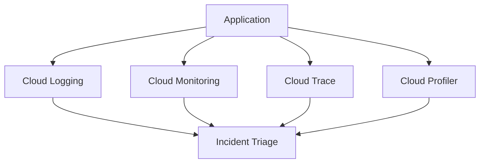

> **Screenshot Disclaimer:** Portal screenshots referenced in this guide are sourced from [Google Cloud documentation](https://cloud.google.com/docs). © Google LLC. Used for educational reference only.

# 05 DevOps and Monitoring Q&A

This chapter prepares you for CI/CD, GKE delivery, Terraform, observability, and incident-response questions across Google Cloud.
The interview-ready pattern is to explain the workflow, show the control point, and mention how you would verify the result.

## How to Use This Chapter

- Start with the delivery or reliability goal.
- Name the Google Cloud service that solves it.
- Close with validation through console navigation or `gcloud` commands.

## CI/CD Flow Overview



## Observability Signal Map



## Screenshot-Friendly Google Cloud Docs

- Cloud Build overview: https://cloud.google.com/build/docs/overview
- Artifact Registry overview: https://cloud.google.com/artifact-registry/docs/overview
- Cloud Deploy overview: https://cloud.google.com/deploy/docs/overview
- Terraform on Google Cloud: https://cloud.google.com/docs/terraform
- GKE app deployment guide: https://cloud.google.com/kubernetes-engine/docs/how-to/deploying-apps
- Monitoring and Logging overview: https://cloud.google.com/monitoring/docs/monitoring-overview
- Trace, Profiler, and Error Reporting overview: https://cloud.google.com/trace/docs/overview

## Foundation CLI Drill
**Console Navigation**
- Console: Cloud Build -> History

```bash
gcloud builds list --project=interview-devops-prod --limit=3
```
Expected output:
```text
ID                                    STATUS     CREATE_TIME
3f7e9b5c-1111-2222-3333-abcdef123456  SUCCESS    2025-01-10T08:12:33Z
```
### Q1. What is Cloud Build?

Cloud Build is a managed CI service that runs build steps in containers to compile code, run tests, package artifacts, and support delivery workflows.
My short interview answer is that it replaces self-managed build servers with reproducible, auditable pipelines.
**Q:** What is the strong one-liner? Managed, containerized CI integrated with Google Cloud.
**Q:** Why do interviewers like this topic? It connects automation, security, and release quality.
**Console Navigation**
- Console: Cloud Build -> History
**CLI Check**
```bash
gcloud builds list --project=interview-devops-prod --limit=2
```
Expected output:
```text
ID                                    STATUS
3f7e9b5c-1111-2222-3333-abcdef123456  SUCCESS
```
### Q2. What is a Cloud Build trigger?

A trigger starts a build automatically from a repository event such as a push, pull request, or tag.
It is the automation bridge between source control and a consistent build pipeline.
**Q:** What should you mention in an interview? Triggers can target branches, tags, or PR events and can inject substitutions.
**Q:** Why do branch filters matter? They keep production pipelines from running on every experimental commit.
**Console Navigation**
- Console: Cloud Build -> Triggers
**CLI Check**
```bash
gcloud builds triggers list --project=interview-devops-prod
```
Expected output:
```text
NAME                 EVENT
app-main-trigger     push
release-tag-trigger  tag
```
### Q3. How do substitutions and approvals improve a pipeline?

Substitutions keep one build definition reusable across environments, and approvals add human control before sensitive stages such as production releases.
That gives you automation without giving up release governance.
**Q:** What is a good substitution example? `_ENV=prod` or `_REGION=us-central1`.
**Q:** When should approval gates be used? Before production rollout or when compliance requires signoff.
**Console Navigation**
- Console: Cloud Build -> Triggers -> Edit substitutions
**CLI Check**
```bash
gcloud builds triggers describe app-main-trigger --project=interview-devops-prod
```
Expected output:
```text
substitutions:
  _ENV: prod
approvalConfig:
  approvalRequired: true
```
### Q4. What is Artifact Registry?

Artifact Registry is the managed repository service for container images and language packages such as Maven, npm, and Python artifacts.
It gives teams a controlled place to store, version, and govern build outputs.
**Q:** Why prefer it over pulling directly from public registries? It reduces dependency risk and improves access control.
**Q:** What is the short interview phrase? Central artifact governance.
**Console Navigation**
- Console: Artifact Registry -> Repositories
**CLI Check**
```bash
gcloud artifacts repositories list --project=interview-devops-prod --location=us-central1
```
Expected output:
```text
REPOSITORY    FORMAT  MODE
app-images    DOCKER  STANDARD_REPOSITORY
```
### Q5. How do you structure image promotion across environments?

I promote immutable image digests through environments instead of rebuilding different images for dev, test, and prod.
That keeps validation honest because production receives the same artifact that already passed earlier stages.
**Q:** Why use digests in deployment tools? They are immutable and avoid tag drift.
**Q:** Why avoid rebuilding for production only? Rebuilding can introduce untested differences.
**Console Navigation**
- Console: Artifact Registry -> Repositories -> Images
**CLI Check**
```bash
gcloud artifacts docker images list us-central1-docker.pkg.dev/interview-devops-prod/app-images/api --include-tags
```
Expected output:
```text
IMAGE                                                         DIGEST                                                                   TAGS
.../api                                                       sha256:9f1c2a3b4d5e6f7g                                                 prod,1.4.2
```
### Q6. What is Cloud Deploy?

Cloud Deploy is a managed continuous delivery service that orchestrates releases to targets such as GKE and Cloud Run.
The simple interview answer is that Cloud Build produces the artifact and Cloud Deploy promotes it safely.
**Q:** Why separate build from deployment? It makes approvals, promotion history, and release ownership clearer.
**Q:** What is the strongest value statement? Deployment becomes structured rather than ad hoc.
**Console Navigation**
- Console: Cloud Deploy -> Delivery pipelines
**CLI Check**
```bash
gcloud deploy delivery-pipelines list --project=interview-devops-prod --region=us-central1
```
Expected output:
```text
NAME              REGION
app-prod-pipeline us-central1
```
### Q7. What are delivery pipelines and targets?

A delivery pipeline defines the promotion path, and targets represent the environments where a release lands.
This creates an explicit release journey instead of one-off pushes to clusters.
**Q:** What is a common target sequence? Dev, staging, then production.
**Q:** Why do interviewers like this answer? It shows you think in release flow, not just deploy commands.
**Console Navigation**
- Console: Cloud Deploy -> Targets
**CLI Check**
```bash
gcloud deploy targets list --project=interview-devops-prod --region=us-central1
```
Expected output:
```text
NAME        TYPE
staging     gke
production  gke
```
### Q8. How do canary and blue-green strategies differ?

Canary releases shift a small amount of traffic first, while blue-green switches from one full environment to another after validation.
I choose canary for gradual risk reduction and blue-green when rollback speed or full-stack isolation matters most.
**Q:** What is the main advantage of canary? Safer progressive exposure.
**Q:** What is the main advantage of blue-green? Fast cutover and environment-level rollback.
**Console Navigation**
- Console: Cloud Deploy -> Releases
**CLI Check**
```bash
gcloud deploy releases list --delivery-pipeline=app-prod-pipeline --region=us-central1 --project=interview-devops-prod
```
Expected output:
```text
NAME             TARGETS
release-20250110 staging,production
```
### Q9. What is Cloud Source Repositories, and when would you mention it?

Cloud Source Repositories is a managed Git hosting option in Google Cloud.
I mention it when asked about a fully GCP-native source option, while also noting that Cloud Build works well with GitHub and GitLab.
**Q:** Is Cloud Source Repositories required for Cloud Build? No, external repositories integrate well too.
**Q:** What is the safe interview framing? It is an option, not the only source-control path.
**Console Navigation**
- Console: Source Repositories -> Repositories
**CLI Check**
```bash
gcloud source repos list --project=interview-devops-prod
```
Expected output:
```text
NAME
platform-app
```
### Q10. How do you explain Terraform on Google Cloud?

Terraform provides infrastructure as code so projects, networks, IAM, and service configuration are declared, versioned, and reviewed.
The interview-ready point is that IaC turns infrastructure changes into peer-reviewed code changes.
**Q:** Why is that better than console clicking? It improves repeatability, review quality, and drift detection.
**Q:** What types of GCP resources are common in Terraform? Projects, IAM, VPCs, GKE, and service enablement.
**Console Navigation**
- Console: Cloud Shell or Workstations for IaC workflows
**CLI Check**
```bash
gcloud services list --enabled --project=interview-devops-prod --filter="NAME:cloudresourcemanager.googleapis.com"
```
Expected output:
```text
NAME
cloudresourcemanager.googleapis.com
```
### Q11. How should Terraform state be handled securely?

State should be stored remotely, access-controlled tightly, versioned, and treated as sensitive data.
A common pattern is a dedicated Cloud Storage bucket with restricted IAM, versioning, and audit logging.
**Q:** Why not keep state only on laptops? It creates drift, access gaps, and poor disaster recovery.
**Q:** What is the mature interview addition? Locking and versioning protect team workflows and rollback.
**Console Navigation**
- Console: Cloud Storage -> Buckets
**CLI Check**
```bash
gcloud storage buckets describe gs://tf-state-interview-devops --format="value(versioning.enabled)"
```
Expected output:
```text
True
```
### Q12. How do you validate infrastructure changes before apply?

I run formatting, validation, policy checks, and a Terraform plan in CI so reviewers can see the exact delta before approval.
For sensitive environments, I also separate plan and apply permissions to preserve change control.
**Q:** What is the first line of defense? `terraform validate` and `terraform plan`.
**Q:** What should you add for governance? Policy validation against platform and security standards.
**Console Navigation**
- Console: Cloud Build -> Trigger details for IaC pipelines
**CLI Check**
```bash
gcloud builds triggers list --project=interview-devops-prod --filter="name:iac"
```
Expected output:
```text
NAME
iac-plan-trigger
```
### Q13. How do you describe a standard GKE deployment workflow?

Source changes trigger a build, tests run, an image is pushed to Artifact Registry, and a deployment tool rolls that image to GKE.
I always add readiness, rollout health, and post-deploy monitoring because deployment is not complete until the app proves healthy.
**Q:** What object usually manages a stateless rollout? A Kubernetes Deployment.
**Q:** What proves success? Healthy pods, completed rollout, and stable service metrics.
**Console Navigation**
- Console: Kubernetes Engine -> Workloads
**CLI Check**
```bash
gcloud container clusters list --project=interview-devops-prod
```
Expected output:
```text
NAME         LOCATION      STATUS
prod-cluster us-central1   RUNNING
```
### Q14. How do rolling updates work on GKE?

Rolling updates replace pods gradually so capacity remains available while the new version proves healthy.
The key interview terms are readiness probes, `maxUnavailable`, `maxSurge`, and rollback if error rate rises.
**Q:** Why do readiness probes matter? They stop traffic from reaching pods that are not ready.
**Q:** What should trigger rollback? Failed rollout health or degraded application metrics.
**Console Navigation**
- Console: Kubernetes Engine -> Workloads -> Rollout details
**CLI Check**
```bash
gcloud container clusters describe prod-cluster --region=us-central1 --project=interview-devops-prod --format="value(status)"
```
Expected output:
```text
RUNNING
```
### Q15. How do you manage configuration and secrets for deployments?

Non-sensitive configuration belongs in versioned config or ConfigMaps, while secrets belong in Secret Manager or tightly controlled Kubernetes integrations.
I avoid baking configuration into images because config should change independently from the binary.
**Q:** What is the strong interview line? Build once, configure per environment.
**Q:** Why prefer Secret Manager for secrets? Better IAM, versioning, and audit logging.
**Console Navigation**
- Console: Security -> Secret Manager; Kubernetes Engine -> Workloads
**CLI Check**
```bash
gcloud secrets list --project=interview-devops-prod --limit=3
```
Expected output:
```text
NAME
api-key
payment-db-password
```
### Q16. When would you choose GitOps instead of a trigger-driven pipeline?

I choose GitOps when the team wants desired runtime state stored in Git and reconciled continuously by a controller.
Cloud Build and Artifact Registry can still fit by producing the artifacts that the GitOps system later references.
**Q:** What is the core GitOps value? Git becomes the source of truth for runtime state.
**Q:** What is the tradeoff? More controller complexity and stricter repository discipline.
**Console Navigation**
- Console: Cloud Build -> History; Kubernetes Engine -> Workloads
**CLI Check**
```bash
gcloud artifacts docker images list us-central1-docker.pkg.dev/interview-devops-prod/app-images/api --limit=2
```
Expected output:
```text
IMAGE                                                         DIGEST
.../api                                                       sha256:9f1c2a3b4d5e6f7g
```
### Q17. How do you describe an end-to-end CI/CD pipeline in GCP?

Code commit triggers Cloud Build, tests and scans run, Artifact Registry stores the image, Cloud Deploy promotes it, and Monitoring plus Logging validate the release.
That answer is strong because it covers build, release, runtime, and feedback loops together.
**Q:** What should you mention after deployment? Observability and rollback, not just deployment success.
**Q:** What is the critical design principle? Promote the same immutable artifact across environments.
**Console Navigation**
- Console: Cloud Build, Artifact Registry, Cloud Deploy, Monitoring
**CLI Check**
```bash
gcloud deploy releases describe release-20250110 --delivery-pipeline=app-prod-pipeline --region=us-central1 --project=interview-devops-prod
```
Expected output:
```text
renderState: SUCCEEDED
skaffoldConfigPath: skaffold.yaml
```
### Q18. How does build provenance help supply-chain security?

Build provenance records how an artifact was produced, including source and builder context.
That helps downstream controls trust the artifact lineage instead of trusting a tag name alone.
**Q:** What is the key phrase? Trusted artifact lineage.
**Q:** Why is provenance better than trusting tags? Tags can move, but provenance ties the image to a specific build record.
**Console Navigation**
- Console: Cloud Build -> Build details
**CLI Check**
```bash
gcloud builds describe 3f7e9b5c-1111-2222-3333-abcdef123456 --project=interview-devops-prod
```
Expected output:
```text
status: SUCCESS
images:
- us-central1-docker.pkg.dev/interview-devops-prod/app-images/api:1.4.2
```
### Q19. What tests belong in a mature pipeline?

At minimum I include linting, unit tests, dependency checks, and image build validation, then add integration or smoke tests before promotion.
The principle is fail fast early and enforce release confidence later.
**Q:** Why separate unit and integration stages? It speeds feedback and isolates failures better.
**Q:** What should happen when tests fail? The artifact should not be promoted.
**Console Navigation**
- Console: Cloud Build -> History -> Step logs
**CLI Check**
```bash
gcloud builds log 3f7e9b5c-1111-2222-3333-abcdef123456 --project=interview-devops-prod
```
Expected output:
```text
Step #2 - "unit-tests": PASS
Step #3 - "integration-tests": PASS
```
### Q20. What is Cloud Monitoring?

Cloud Monitoring collects metrics, powers dashboards, and drives alerting for service health over time.
I emphasize that good monitoring is organized around user experience and service objectives, not only infrastructure utilization.
**Q:** What is the short definition? Metrics plus alerting for service health.
**Q:** Why not monitor everything equally? Too many low-value metrics create noise instead of insight.
**Console Navigation**
- Console: Monitoring -> Dashboards
**CLI Check**
```bash
gcloud services list --enabled --project=interview-devops-prod --filter="NAME:monitoring.googleapis.com"
```
Expected output:
```text
NAME
monitoring.googleapis.com
```
### Q21. How do you explain Cloud Logging?

Cloud Logging centralizes application, platform, and audit logs for search, routing, metrics, and troubleshooting.
I explain that metrics tell you something is wrong, but logs usually explain what happened.
**Q:** What makes logs more useful? Structured fields like request ID, service name, severity, and user context.
**Q:** Why mention correlation IDs? They connect activity across microservices during investigation.
**Console Navigation**
- Console: Logging -> Logs Explorer
**CLI Check**
```bash
gcloud logging read 'resource.type="k8s_container" severity>=ERROR' --project=interview-devops-prod --limit=3
```
Expected output:
```text
severity: ERROR
textPayload: payment timeout after 30s
```
### Q22. What are log-based metrics?

Log-based metrics convert recurring log patterns into metrics so you can chart and alert on them.
They are useful when the application does not emit a native metric but logs contain a reliable error or event signal.
**Q:** What is a common example? Counting HTTP 5xx messages from logs.
**Q:** What is the main caution? Poor filters create noisy or misleading metrics.
**Console Navigation**
- Console: Logging -> Log-based Metrics
**CLI Check**
```bash
gcloud logging metrics list --project=interview-devops-prod
```
Expected output:
```text
NAME
request_error_rate
checkout_timeout_count
```
### Q23. What is Cloud Trace?

Cloud Trace shows latency across distributed request paths so you can see which service or dependency added time.
It is especially useful when users report slowness but host-level metrics do not explain the delay.
**Q:** What is the strong interview phrase? End-to-end request latency visibility.
**Q:** When does Trace beat logs? When you need timing across multiple hops instead of isolated events.
**Console Navigation**
- Console: Trace -> Trace List
**CLI Check**
```bash
gcloud services list --enabled --project=interview-devops-prod --filter="NAME:cloudtrace.googleapis.com"
```
Expected output:
```text
NAME
cloudtrace.googleapis.com
```
### Q24. What is Cloud Profiler?

Cloud Profiler samples CPU and memory behavior over time so you can find expensive code paths in long-running services.
I use it when the service works functionally but consumes too many resources or shows persistent latency under load.
**Q:** What is the main difference from Trace? Profiler finds code hotspots over time, not a single request path.
**Q:** Why is sampling valuable? It reveals performance patterns with low overhead.
**Console Navigation**
- Console: Profiler -> Profiles
**CLI Check**
```bash
gcloud services list --enabled --project=interview-devops-prod --filter="NAME:cloudprofiler.googleapis.com"
```
Expected output:
```text
NAME
cloudprofiler.googleapis.com
```
### Q25. What is Error Reporting?

Error Reporting groups and counts recurring application errors into issues so teams can focus on repeated failures instead of individual log lines.
It adds aggregation and trend visibility that raw logs alone do not provide.
**Q:** What is the short summary? Logs show events; Error Reporting shows recurring error classes.
**Q:** Why is grouping useful? It surfaces patterns and helps prioritize fixes.
**Console Navigation**
- Console: Error Reporting -> Error groups
**CLI Check**
```bash
gcloud services list --enabled --project=interview-devops-prod --filter="NAME:clouderrorreporting.googleapis.com"
```
Expected output:
```text
NAME
clouderrorreporting.googleapis.com
```
### Q26. How do uptime checks and alerting fit operations?

Uptime checks measure service availability from the outside, and alerting policies turn bad conditions into notifications and response workflows.
Together they connect user-visible symptoms with operator response.
**Q:** What is a strong pairing? Uptime check plus latency or error-rate alert.
**Q:** What is the common mistake? Alerting on every fluctuation instead of actionable thresholds.
**Console Navigation**
- Console: Monitoring -> Uptime checks; Monitoring -> Alerting
**CLI Check**
```bash
gcloud services list --enabled --project=interview-devops-prod --filter="NAME:(monitoring.googleapis.com OR logging.googleapis.com)"
```
Expected output:
```text
NAME
logging.googleapis.com
monitoring.googleapis.com
```
### Q27. What are SLIs, SLOs, and error budgets?

SLIs are the measured indicators such as availability or latency, SLOs are the target levels, and the error budget is the tolerated unreliability implied by that target.
I explain that error budgets help teams balance feature velocity against reliability risk.
**Q:** What is a simple SLI example? Percent of successful requests over five minutes.
**Q:** What does a shrinking error budget tell you? Slow down risky change and focus on stabilization.
**Console Navigation**
- Console: Monitoring -> Services -> SLOs
**CLI Check**
```bash
gcloud services list --enabled --project=interview-devops-prod --filter="NAME:monitoring.googleapis.com"
```
Expected output:
```text
NAME
monitoring.googleapis.com
```
### Q28. What is MQL, and how should you discuss it today?

MQL is Monitoring Query Language for advanced metric queries, charts, and alert logic in Cloud Monitoring.
I mention that it still matters for interview and maintenance work, while some teams also standardize on PromQL depending on the metric source.
**Q:** What does MQL help with? Filtering, grouping, joining, and aggregating metrics beyond default charts.
**Q:** What is the safe modern nuance? Know MQL well, but choose the query language that fits the platform standard.
**Console Navigation**
- Console: Monitoring -> Metrics Explorer
**CLI Check**
```bash
gcloud logging metrics describe request_error_rate --project=interview-devops-prod
```
Expected output:
```text
filter: resource.type="k8s_container" severity>=ERROR
metricDescriptor:
  metricKind: DELTA
```
### Q29. How do you build useful log queries during troubleshooting?

I start with resource type, workload name, severity, and time window, then narrow by request ID, trace ID, user, or error signature.
That is faster and more reliable than beginning with broad free-text searches.
**Q:** What is the first filter you usually add? Resource type or service name.
**Q:** Why add a short time window early? It reduces noise and speeds triage.
**Console Navigation**
- Console: Logging -> Logs Explorer
**CLI Check**
```bash
gcloud logging read 'resource.type="k8s_container" labels.k8s-pod/app="checkout" severity>=WARNING' --project=interview-devops-prod --limit=5
```
Expected output:
```text
severity: WARNING
jsonPayload:
  message: upstream latency high
```
### Q30. How do Monitoring, Logging, Trace, Profiler, and Error Reporting work together during an incident?

Monitoring tells you an SLO or health signal is failing, Logging shows event evidence, Trace shows where time or failure occurred, Profiler helps with inefficient code behavior, and Error Reporting highlights recurring application issues.
I present them as complementary layers that support detection, diagnosis, and recovery.
**Q:** What is the natural triage order? Detect with Monitoring, investigate with Logging and Trace, optimize with Profiler if needed.
**Q:** What should your closing sentence sound like? Good DevOps is fast delivery plus fast understanding when production changes.
**Console Navigation**
- Console: Monitoring, Logging, Trace, Profiler, Error Reporting
**CLI Check**
```bash
gcloud services list --enabled --project=interview-devops-prod --filter="NAME:(monitoring.googleapis.com OR logging.googleapis.com OR cloudtrace.googleapis.com OR cloudprofiler.googleapis.com OR clouderrorreporting.googleapis.com)"
```
Expected output:
```text
NAME
monitoring.googleapis.com
logging.googleapis.com
cloudtrace.googleapis.com
cloudprofiler.googleapis.com
clouderrorreporting.googleapis.com
```

## Official Google Cloud References

- https://cloud.google.com/build/docs/overview
- https://cloud.google.com/artifact-registry/docs/overview
- https://cloud.google.com/deploy/docs/overview
- https://cloud.google.com/source-repositories/docs
- https://cloud.google.com/docs/terraform
- https://cloud.google.com/kubernetes-engine/docs/how-to/deploying-apps
- https://cloud.google.com/monitoring/docs/monitoring-overview
- https://cloud.google.com/logging/docs
- https://cloud.google.com/trace/docs/overview
- https://cloud.google.com/profiler/docs/about-profiler
- https://cloud.google.com/error-reporting/docs/overview
- https://cloud.google.com/stackdriver/docs/solutions/slo-monitoring
- https://cloud.google.com/monitoring/mql
- https://cloud.google.com/architecture/devops
