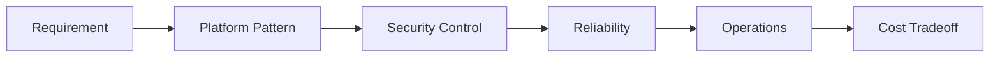
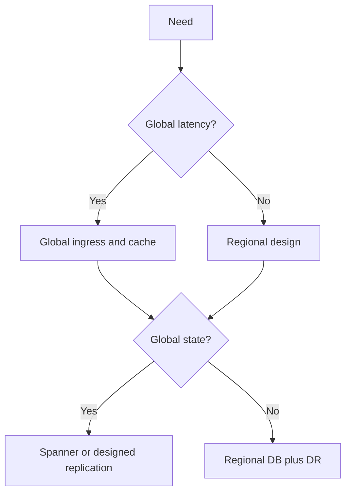

> **Screenshot Disclaimer:** Portal screenshots referenced in this guide are sourced from [Google Cloud documentation](https://cloud.google.com/docs). © Google LLC. Used for educational reference only.

# 06 Scenario-Based Q&A

Use these drills for architecture interviews where you need a concise but operational Google Cloud answer.
Structure each response as requirement -> recommended design -> validation -> tradeoffs.

## Quick Answer Pattern

- Start with the business requirement and constraints.
- Name the Google Cloud pattern and the primary services.
- Add one reliability point, one security point, and one cost point.
- Close with how you would validate the design in the console or CLI.

**Console Navigation**
- Console: Home -> Dashboard; Home -> Activate Cloud Shell

```bash
gcloud config list && gcloud services list --enabled --limit=5
```
Expected output:
```text
[core]
project = interview-prep-prod
NAME                              TITLE
compute.googleapis.com           Compute Engine API
container.googleapis.com         Kubernetes Engine API
```





### 1. Globally Distributed Web App

**Situation**
A storefront serves users in multiple continents and needs low latency, TLS termination, bot protection, and regional failover.

**Recommended Design**
Use a global external Application Load Balancer with Cloud CDN and Cloud Armor in front of stateless Cloud Run or GKE services in at least two regions, and keep session state outside the app with a regional or globally designed data layer chosen by consistency needs.

**Key Services**
Cloud DNS; Cloud Armor; Cloud CDN; Global external Application Load Balancer.

**Console Navigation**
- Console: Network services -> Load balancing; Security -> Cloud Armor; Serverless -> Cloud Run

**Screenshot Reference**
- https://cloud.google.com/architecture/deploying-a-global-web-app-on-google-cloud
**CLI Verification**
```bash
gcloud compute backend-services list --global && gcloud run services list --platform=managed --regions=us-central1,europe-west1
```
Expected output:
```text
NAME                BACKENDS
storefront-backend  2
SERVICE      REGION
frontend     us-central1
```
**Why This Answer Works**
It separates global ingress, edge security, caching, stateless compute, and stateful data cleanly.
**Q:** Why not use a single region?
A single region raises latency for distant users and increases outage blast radius.
**Q:** When would Spanner fit better?
Use Spanner when globally distributed writes with strong consistency really matter.

### 2. Migrating a Legacy Three-Tier App from On-Premises

**Situation**
A Java app runs on-premises on VMs with a separate database and shared files, and leadership wants a low-risk move first.

**Recommended Design**
Start with discovery, rehost the web and app tiers to Compute Engine or VMware Engine, migrate the database with Database Migration Service, and modernize only after the system is stable in Google Cloud.

**Key Services**
Migration Center; Migrate to Virtual Machines; Database Migration Service; Compute Engine.

**Console Navigation**
- Console: Migration Center; Compute Engine -> VM instances; Databases -> Database Migration

**Screenshot Reference**
- https://cloud.google.com/migrate/virtual-machines/docs/5.0/discover-and-assess
**CLI Verification**
```bash
gcloud migration vms image-imports list --location=us-central1 && gcloud database-migration migration-jobs list --region=us-central1
```
Expected output:
```text
NAME                STATE
legacy-web-import   SUCCEEDED
NAME            TYPE      STATE
oracle-to-cloudsql CONTINUOUS
```
**Why This Answer Works**
It sounds practical because it separates low-risk migration from later optimization.
**Q:** How do you reduce downtime?
Use continuous replication, test cutover early, and schedule a short final sync window.
**Q:** When is VMware Engine appropriate?
It fits when VMware dependencies are strong and replatforming cannot happen immediately.

### 3. Event-Driven Order Processing Platform

**Situation**
Checkout, payment, inventory, and notification services must scale independently without tight coupling.

**Recommended Design**
Use Pub/Sub as the event bus, Cloud Run as stateless consumers, Eventarc where Google event routing helps, and idempotent processing with dead-letter topics for poison messages.

**Key Services**
Pub/Sub; Cloud Run; Eventarc; Cloud Tasks.

**Console Navigation**
- Console: Pub/Sub -> Topics; Eventarc -> Triggers; Serverless -> Cloud Run

**Screenshot Reference**
- https://cloud.google.com/eventarc/docs/overview
**CLI Verification**
```bash
gcloud pubsub topics list && gcloud eventarc triggers list --location=us-central1
```
Expected output:
```text
NAME
projects/interview/topics/order-created
NAME               DESTINATION
order-events       Cloud Run service
```
**Why This Answer Works**
It highlights loose coupling, asynchronous retries, and independent scaling.
**Q:** Why not make every call synchronous?
Deep synchronous chains amplify latency and partial failures.
**Q:** How do you prevent duplicate actions?
Make consumers idempotent and store processed event identifiers.

### 4. Disaster Recovery for a Payment API

**Situation**
A payment API needs defined RPO and RTO targets and must survive a regional outage.

**Recommended Design**
Run stateless services in multiple regions behind global load balancing and choose cross-region replicas, backups, or Spanner based on how much downtime and data loss the business can accept.

**Key Services**
Cloud Load Balancing; Cloud SQL replicas; Spanner; Backup and DR.

**Console Navigation**
- Console: Network services -> Load balancing; SQL -> Instances; Operations -> Backup and DR

**Screenshot Reference**
- https://cloud.google.com/architecture/dr-scenarios-for-applications
**CLI Verification**
```bash
gcloud sql instances describe pay-prod-sql --format="value(settings.availabilityType,failoverReplica.name)" && gcloud compute backend-services get-health payment-backend --global
```
Expected output:
```text
REGIONAL  pay-prod-sql-failover
healthStatus:
  - healthState: HEALTHY
  - healthState: HEALTHY
```
**Why This Answer Works**
It ties DR cost and complexity directly to business recovery objectives.
**Q:** How do you define RPO and RTO quickly?
RPO is acceptable data loss and RTO is acceptable recovery time.
**Q:** What DR mistake should you mention?
Teams create replicas but never rehearse failover and application recovery end to end.

### 5. Batch and Streaming Analytics Pipeline

**Situation**
The business needs daily batch ingestion plus near-real-time clickstream analytics in the same platform.

**Recommended Design**
Land raw data in Cloud Storage, process batch and streaming transformations with Dataflow, and publish curated analytics in BigQuery while keeping raw data for replay and audit.

**Key Services**
Cloud Storage; Datastream; Dataflow; BigQuery.

**Console Navigation**
- Console: Dataflow; BigQuery; Datastream

**Screenshot Reference**
- https://cloud.google.com/architecture/building-a-streaming-analytics-pipeline
**CLI Verification**
```bash
gcloud dataflow jobs list --region=us-central1 && bq ls --max_results=3 analytics
```
Expected output:
```text
JOB_ID                               STATE
2024-08-stream-sales                 Running
     tableId
events_hourly
```
**Why This Answer Works**
It clearly separates ingestion, processing, storage, and analyst-facing consumption.
**Q:** Why keep a raw zone?
It supports replay, audit, and future transformations.
**Q:** How do you control BigQuery cost?
Use partition pruning, clustering, quotas, and bytes-scanned awareness.

### 6. Secure Multi-Project Enterprise Architecture

**Situation**
An enterprise wants central networking and security controls while keeping prod and non-prod projects separate.

**Recommended Design**
Use folders, Shared VPC, dedicated service projects, centralized KMS and logging, and group-based IAM, then apply organization policies and VPC Service Controls where managed-data exfiltration risk matters.

**Key Services**
Organization policies; Shared VPC; Cloud KMS; Security Command Center.

**Console Navigation**
- Console: IAM & Admin -> Manage Resources; VPC network -> Shared VPC; Security -> Security Command Center

**Screenshot Reference**
- https://cloud.google.com/architecture/landing-zones
**CLI Verification**
```bash
gcloud beta resource-manager org-policies list --organization=123456789012 --limit=3 && gcloud compute shared-vpc associated-projects list --host-project=net-host-prod
```
Expected output:
```text
CONSTRAINT
constraints/compute.skipDefaultNetworkCreation
SERVICE_PROJECT
app-prod-01
```
**Why This Answer Works**
It shows governance at scale without making every application team manage the whole platform surface.
**Q:** Why separate host and service projects?
It reduces blast radius and keeps networking control centralized.
**Q:** When do VPC Service Controls help?
They help reduce exfiltration risk for supported managed services.

### 7. GKE Production Platform for Microservices

**Situation**
A team runs many containers and needs autoscaling, namespace isolation, observability, and safer release control.

**Recommended Design**
Use a regional private GKE Standard cluster, multiple node pools, Workload Identity, Artifact Registry, Cloud Deploy, and managed observability so the platform is operable as well as scalable.

**Key Services**
GKE Standard; Artifact Registry; Workload Identity; Cloud Deploy.

**Console Navigation**
- Console: Kubernetes Engine -> Clusters; Artifact Registry; Cloud Deploy

**Screenshot Reference**
- https://cloud.google.com/kubernetes-engine/docs/concepts/cluster-architecture
**CLI Verification**
```bash
gcloud container clusters list && gcloud container node-pools list --cluster=prod-platform --region=us-central1
```
Expected output:
```text
NAME            LOCATION      STATUS
prod-platform   us-central1   RUNNING
NAME            MACHINE_TYPE      AUTOSCALING
general-pool    e2-standard-4     True
```
**Why This Answer Works**
It answers the operational questions interviewers ask after someone says use Kubernetes.
**Q:** When is Autopilot the better fit?
Autopilot fits when lower node-management overhead matters more than deep customization.
**Q:** How do you reduce noisy-neighbor risk?
Use namespaces, quotas, limits, and dedicated pools where needed.

### 8. Hybrid Connectivity for an ERP System

**Situation**
An ERP system stays in the data center while cloud-hosted APIs and analytics need reliable private access to it.

**Recommended Design**
Use HA VPN for faster rollout or Interconnect for higher throughput, add Cloud Router for dynamic routes, and plan IP ranges, DNS resolution, and firewall policy before provisioning links.

**Key Services**
HA VPN; Interconnect; Cloud Router; Cloud DNS.

**Console Navigation**
- Console: Hybrid Connectivity -> VPN; Hybrid Connectivity -> Interconnect; Network Connectivity Center

**Screenshot Reference**
- https://cloud.google.com/network-connectivity/docs/interconnect/concepts/overview
**CLI Verification**
```bash
gcloud compute vpn-tunnels list && gcloud compute routers get-status erp-router --region=us-central1
```
Expected output:
```text
NAME            REGION        STATUS
erp-ha-vpn-1    us-central1   ESTABLISHED
bgpPeerStatus:
  - status: UP
```
**Why This Answer Works**
It covers routing, DNS, security, and operations rather than treating hybrid as just a tunnel.
**Q:** When is HA VPN enough?
It is enough for many migrations when throughput and latency requirements fit.
**Q:** What hybrid issue is easy to miss?
Overlapping IP ranges create routing and DNS confusion.

### 9. Streaming IoT Telemetry Platform

**Situation**
A manufacturer ingests continuous sensor data and needs second-level alerts plus historical analytics.

**Recommended Design**
Ingest through Pub/Sub, process with Dataflow, store curated results in BigQuery, keep immutable raw events in Cloud Storage, and use dead-letter topics to protect the main stream.

**Key Services**
Pub/Sub; Dataflow; BigQuery; Cloud Storage.

**Console Navigation**
- Console: Pub/Sub -> Subscriptions; Dataflow; BigQuery

**Screenshot Reference**
- https://cloud.google.com/dataflow/docs/guides/deploying-a-streaming-pipeline
**CLI Verification**
```bash
gcloud pubsub subscriptions list && gcloud pubsub subscriptions describe telemetry-sub --format="value(backlogBytes)"
```
Expected output:
```text
NAME
telemetry-sub
182734
backlog bytes shown above
```
**Why This Answer Works**
It balances low-latency processing, replay safety, and analytics in one coherent design.
**Q:** Why not write directly to BigQuery?
Direct writes make replay and backpressure handling harder.
**Q:** How do you handle out-of-order events?
Use event time, windows, watermarks, and late-data handling in Dataflow.

### 10. Cost Optimization for a Mixed Workload Portfolio

**Situation**
A company has steady databases, bursty web apps, nightly batch jobs, and a rising monthly cloud bill.

**Recommended Design**
Classify workloads first, then right-size compute, use autoscaling for bursty traffic, committed use discounts for steady demand, Spot VMs for fault-tolerant batch, and budgets plus labels for ongoing FinOps control.

**Key Services**
Billing budgets; Recommender; Committed use discounts; Spot VMs.

**Console Navigation**
- Console: Billing -> Reports; Billing -> Cost table; Recommendations

**Screenshot Reference**
- https://cloud.google.com/billing/docs/how-to/cost-optimization-overview
**CLI Verification**
```bash
gcloud recommender recommendations list --location=global --recommender=google.compute.instance.MachineTypeRecommender && gcloud billing budgets list --billing-account=AAAAAA-BBBBBB-CCCCCC
```
Expected output:
```text
STATE_INFO
ACTIVE
DISPLAY_NAME         AMOUNT
prod-monthly-budget  20000
```
**Why This Answer Works**
It treats cost as a workload-by-workload design question instead of a one-time discount request.
**Q:** What is the first optimization step?
Measure where spend comes from by project, label, and service.
**Q:** When are Spot VMs a bad idea?
They are poor for interruption-sensitive stateful workloads.

### 11. Secure PCI-Oriented Payment Processing Environment

**Situation**
A payment environment must reduce scope, lock down secrets, centralize logging, and enforce strong key control.

**Recommended Design**
Use dedicated projects, private networking, KMS or HSM-backed keys where required, centralized immutable audit logs, Secret Manager rotation, and tokenization to reduce how much of the stack handles sensitive data.

**Key Services**
Cloud KMS; Secret Manager; Cloud Audit Logs; Cloud Armor.

**Console Navigation**
- Console: Security -> Key management; IAM & Admin -> Audit Logs; Secret Manager

**Screenshot Reference**
- https://cloud.google.com/architecture/security-foundations
**CLI Verification**
```bash
gcloud kms keys list --location=us-central1 --keyring=payments-kr && gcloud logging sinks list --limit=3
```
Expected output:
```text
NAME            PURPOSE
payments-app     ENCRYPT_DECRYPT
NAME                DESTINATION
audit-central-sink  bigquery.googleapis.com/projects/sec-prj/datasets/audit
```
**Why This Answer Works**
It shows you understand reducing compliance scope, not just adding encryption everywhere.
**Q:** Why is tokenization important?
It shrinks the part of the system that directly handles sensitive card data.
**Q:** Would you use service account keys?
No, prefer attached identities, Workload Identity, or short-lived federation.

### 12. SaaS Multi-Tenant Platform

**Situation**
A SaaS product needs fast onboarding for many tenants but stronger isolation for premium or regulated customers.

**Recommended Design**
Use a tiered tenancy model: shared stateless compute and logical partitioning for smaller tenants, dedicated projects or clusters for higher-isolation tiers, and centralized CI/CD plus observability.

**Key Services**
Cloud Run or GKE; Identity Platform; BigQuery or Cloud SQL; Project Factory automation.

**Console Navigation**
- Console: IAM & Admin -> Manage Resources; Cloud Run or GKE; Monitoring -> Dashboards

**Screenshot Reference**
- https://cloud.google.com/architecture/multitenant-apps-on-kubernetes
**CLI Verification**
```bash
gcloud projects list --filter="labels.tenant_tier:dedicated" --limit=3 && gcloud monitoring dashboards list --limit=2
```
Expected output:
```text
PROJECT_ID                NAME
tenant-gold-001-prod      Gold Tenant 001
NAME
tenant-overview
```
**Why This Answer Works**
It balances cost efficiency with isolation instead of forcing one pattern on every customer.
**Q:** What is the biggest shared-tenancy risk?
Authorization bugs can become cross-tenant data exposure.
**Q:** When do you dedicate a project or cluster?
Do it for regulatory, performance, or customer-specific control requirements.

### 13. Data Lake Modernization with Governance

**Situation**
A company has scattered files and extracts and wants a governed raw-to-curated analytics platform.

**Recommended Design**
Use Cloud Storage as the landing zone, Dataplex for governance and discovery, BigQuery for curated datasets, and policy tags so sensitive data stays both usable and controlled.

**Key Services**
Cloud Storage; Dataplex; BigQuery; Data Catalog policy tags.

**Console Navigation**
- Console: Dataplex; BigQuery; IAM & Admin

**Screenshot Reference**
- https://cloud.google.com/dataplex/docs/overview
**CLI Verification**
```bash
gcloud dataplex lakes list --location=us-central1 && bq ls --max_results=3 curated
```
Expected output:
```text
NAME            LOCATION
enterprise-lake us-central1
     datasetId
sales_curated
```
**Why This Answer Works**
It answers governance and usability together, which is what data-platform interviewers want.
**Q:** Why not only BigQuery?
A storage landing zone helps raw retention, replay, and lower-cost preservation.
**Q:** How do policy tags help?
They enable column-level governance for fields such as PII and finance data.

### 14. ML Inference Platform for Global API Traffic

**Situation**
A product team needs low-latency online predictions close to users with safe rollout and monitoring.

**Recommended Design**
Serve inference through Vertex AI endpoints or containerized inference on GKE or Cloud Run depending customization and hardware needs, then use regional rollout, canaries, and latency monitoring to protect user experience.

**Key Services**
Vertex AI; Cloud Load Balancing; Artifact Registry; Cloud Monitoring.

**Console Navigation**
- Console: Vertex AI -> Endpoints; Network services -> Load balancing

**Screenshot Reference**
- https://cloud.google.com/vertex-ai/docs/predictions/overview
**CLI Verification**
```bash
gcloud ai endpoints list --region=us-central1 && gcloud ai models list --region=us-central1 --limit=2
```
Expected output:
```text
ENDPOINT_ID   DISPLAY_NAME
1234567890    fraud-predictor
MODEL_ID      DISPLAY_NAME
99887766      fraud-model-v5
```
**Why This Answer Works**
It sounds production-ready because it covers rollout safety, latency, and observability.
**Q:** When do you avoid Cloud Run for inference?
Avoid it when you need GPUs or deeper infrastructure customization.
**Q:** How do you reduce cold-start concerns?
Use minimum instances where appropriate and test sizing against latency SLOs.

### 15. Internal Developer Platform with Secure CI/CD

**Situation**
A platform team wants repeatable environments, safer promotions, and stronger software supply chain controls.

**Recommended Design**
Standardize source-to-deploy flow with Cloud Build, Artifact Registry, Terraform, and Cloud Deploy or GitOps, backed by least-privilege automation identities and promotion gates.

**Key Services**
Cloud Build; Artifact Registry; Cloud Deploy; Terraform.

**Console Navigation**
- Console: Cloud Build -> Triggers; Artifact Registry; Cloud Deploy -> Delivery pipelines

**Screenshot Reference**
- https://cloud.google.com/build/docs/overview
**CLI Verification**
```bash
gcloud builds triggers list && gcloud deploy delivery-pipelines list --region=us-central1
```
Expected output:
```text
NAME                 DESCRIPTION
service-release      Main branch release
NAME                SUSPENDED
platform-rollout    False
```
**Why This Answer Works**
It combines developer speed with controlled promotion and supply-chain discipline.
**Q:** Why avoid broad editor permissions for build accounts?
Build systems are powerful identities and should not have unnecessary privilege.
**Q:** When would you use private pools?
Use them for private network access or stronger build isolation requirements.

## Official Google Cloud References

- Google Cloud Architecture Framework: https://cloud.google.com/architecture/framework
- Google Cloud architecture center: https://cloud.google.com/architecture
- Google Kubernetes Engine docs: https://cloud.google.com/kubernetes-engine/docs
- BigQuery docs: https://cloud.google.com/bigquery/docs
- Migration Center docs: https://cloud.google.com/migration-center/docs
- gcloud CLI reference: https://cloud.google.com/sdk/gcloud
