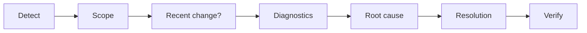
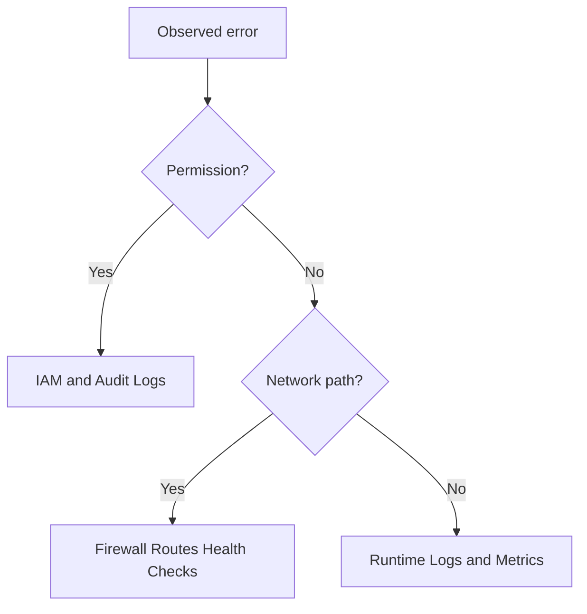
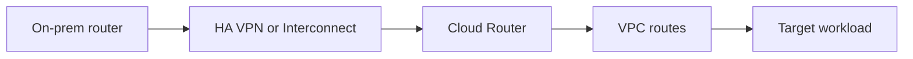

> **Screenshot Disclaimer:** Portal screenshots referenced in this guide are sourced from [Google Cloud documentation](https://cloud.google.com/docs). © Google LLC. Used for educational reference only.

# 07 Troubleshooting Guide

Use this chapter for incident-style interview questions where the interviewer wants a diagnosis path, not just a guessed fix.
Start with scope, confirm recent changes, run targeted `gcloud` checks, then state root cause and resolution.

## Fast Triage Pattern

- Confirm project, region, and exact identity involved.
- Check whether the symptom started after a deploy, IAM edit, or network change.
- Use config, logs, metrics, and health signals together.
- Close by verifying recovery and preventing recurrence.

**Console Navigation**
- Console: Logging -> Logs Explorer; Monitoring -> Dashboards; Home -> Project selector

```bash
gcloud config list && gcloud projects describe interview-prep-prod
```
Expected output:
```text
[core]
project = interview-prep-prod
projectId: interview-prep-prod
projectNumber: 123456789012
```





### 1. Cannot SSH to a Compute Engine VM

**Symptoms**
SSH times out or returns permission denied; the instance shows running but no interactive access works.

**Console Navigation**
- Console: Compute Engine -> VM instances -> app-vm-01; VPC network -> Firewall

**Screenshot Reference**
- https://cloud.google.com/compute/docs/connect/ssh-best-practices

**gcloud Diagnostic Commands**
```bash
gcloud compute instances describe app-vm-01 --zone=us-central1-a && gcloud compute firewall-rules list --filter="name~ssh OR allowed.tcp:22"
```
Expected output:
```text
status: RUNNING
networkInterfaces:
NAME          NETWORK  DIRECTION
allow-ssh     default  INGRESS
```

**Root Causes**
Firewall is missing or restrictive; OS Login or metadata is misconfigured; the VM is private and IAP or bastion access is not configured.

**Resolution**
Check identity, firewall path, and guest readiness in that order, then use IAP or a bastion if the VM has no external IP.

**Q:** How do you sound systematic?
Say you validate identity, network reachability, and guest OS readiness in sequence.

**Q:** When is IAP preferable?
IAP is preferable when you want private VMs without broad SSH exposure.

### 2. Managed Instance Group Backends Show Unhealthy

**Symptoms**
The load balancer sends little traffic and backend instances are marked unhealthy.

**Console Navigation**
- Console: Network services -> Load balancing -> Backend services; Compute Engine -> Instance groups

**Screenshot Reference**
- https://cloud.google.com/load-balancing/docs/health-check-concepts

**gcloud Diagnostic Commands**
```bash
gcloud compute backend-services get-health web-backend --global && gcloud compute health-checks describe web-hc
```
Expected output:
```text
healthStatus:
  - healthState: UNHEALTHY
type: HTTP
port: 8080
```

**Root Causes**
The app is not listening on the expected port or path; health check ranges are blocked; startup takes longer than thresholds allow.

**Resolution**
Match the real listener and health path, allow health checker ranges, and tune startup or health thresholds for slower applications.

**Q:** Why mention probe source ranges?
Because teams often allow user traffic but forget health check traffic.

**Q:** What follow-up proves depth?
Explain the difference between instance status and backend health status.

### 3. Cloud Run Service Returns 403

**Symptoms**
HTTP 403 is returned from Cloud Run and the service is deployed but callers cannot invoke it.

**Console Navigation**
- Console: Cloud Run -> Services -> api-service -> Security

**Screenshot Reference**
- https://cloud.google.com/run/docs/securing/authenticating

**gcloud Diagnostic Commands**
```bash
gcloud run services describe api-service --region=us-central1 && gcloud run services get-iam-policy api-service --region=us-central1
```
Expected output:
```text
ingress: all
traffic:
bindings:
- role: roles/run.invoker
```

**Root Causes**
The caller lacks roles/run.invoker; ingress settings block the request source; the identity token audience is wrong.

**Resolution**
Decide whether the service should be public or authenticated, bind the correct invoker role, validate ingress mode, and retest with a fresh identity token.

**Q:** How do you test quickly?
Use gcloud auth print-identity-token and curl the exact service URL.

**Q:** What mistake is common in service-to-service auth?
Using the wrong audience value or the wrong caller identity.

### 4. GKE Pods in CrashLoopBackOff

**Symptoms**
Pods restart repeatedly and the rollout stalls or only a few replicas stay healthy.

**Console Navigation**
- Console: Kubernetes Engine -> Workloads -> Logs

**Screenshot Reference**
- https://cloud.google.com/kubernetes-engine/docs/troubleshooting/crashloopbackoff-events

**gcloud Diagnostic Commands**
```bash
gcloud container clusters get-credentials prod-platform --region=us-central1 && kubectl get pods -A && kubectl describe pod api-7c8d9f6b4d-abcde -n prod
```
Expected output:
```text
NAMESPACE   NAME                        STATUS
prod        api-7c8d9f6b4d-abcde       CrashLoopBackOff
Last State:  Terminated
Events:
```

**Root Causes**
Config or secret values are wrong; the container exits on startup; the liveness probe is too aggressive.

**Resolution**
Read logs and describe output together, compare env and secrets with the last good release, and roll back quickly if the issue came from a fresh deployment.

**Q:** Why check describe and logs together?
Describe shows lifecycle and probe failures while logs show the app crash.

**Q:** What is the fast rollback path?
Use rollout undo or the normal deployment pipeline rollback.

### 5. GKE Ingress or Gateway Returns 502

**Symptoms**
Users see 502 errors even though an external IP exists.

**Console Navigation**
- Console: Kubernetes Engine -> Services & Ingress; Network services -> Load balancing

**Screenshot Reference**
- https://cloud.google.com/kubernetes-engine/docs/how-to/load-balance-ingress

**gcloud Diagnostic Commands**
```bash
kubectl get ingress -A && gcloud compute backend-services get-health k8s1-backend --global
```
Expected output:
```text
NAMESPACE   NAME        ADDRESS
prod        web-ingress 34.118.1.10
healthStatus:
  - healthState: UNHEALTHY
```

**Root Causes**
Service targetPort does not match the listener; backend health check path is wrong; readiness passes internally while external backend health still fails.

**Resolution**
Trace Ingress to Service to Pod, align ports and named ports, and make the backend health path consistent with the application response.

**Q:** What question often follows?
How you distinguish pod health from load balancer health.

**Q:** How do you answer it?
A pod can be healthy internally while the external backend health config is still wrong.

### 6. Pub/Sub Subscription Backlog Keeps Growing

**Symptoms**
Undelivered message count keeps increasing and consumers lag behind producers.

**Console Navigation**
- Console: Pub/Sub -> Subscriptions -> orders-sub

**Screenshot Reference**
- https://cloud.google.com/pubsub/docs/pull-troubleshooting

**gcloud Diagnostic Commands**
```bash
gcloud pubsub subscriptions describe orders-sub && gcloud pubsub subscriptions list --format="table(name,ackDeadlineSeconds)"
```
Expected output:
```text
ackDeadlineSeconds: 10
messageRetentionDuration: 604800s
NAME         ACK_DEADLINE_SECONDS
orders-sub   10
```

**Root Causes**
Subscribers are under-scaled; processing takes longer than ack deadlines; a downstream dependency causes repeated retries.

**Resolution**
Increase consumer concurrency, improve processing speed, extend ack handling where appropriate, and add dead-letter routing for poison messages.

**Q:** What metric would you cite?
Oldest unacked message age and subscription backlog size.

**Q:** Why not only raise retention?
Retention preserves data but does not fix throughput bottlenecks.

### 7. Dataflow Streaming Job Is Slow or Stuck

**Symptoms**
End-to-end latency rises and workers are running but outputs are far behind.

**Console Navigation**
- Console: Dataflow -> Jobs -> Job metrics

**Screenshot Reference**
- https://cloud.google.com/dataflow/docs/guides/troubleshoot-slow-jobs

**gcloud Diagnostic Commands**
```bash
gcloud dataflow jobs list --region=us-central1 && gcloud dataflow jobs describe 2024-08-stream-sales --region=us-central1
```
Expected output:
```text
JOB_ID                       STATE
2024-08-stream-sales         Running
currentState: JOB_STATE_RUNNING
type: JOB_TYPE_STREAMING
```

**Root Causes**
Hot keys create skew; workers are undersized; external sinks are throttling the pipeline.

**Resolution**
Inspect stage metrics, identify skew, increase worker resources only when justified, and redesign sink interactions if downstream throttling is the real limit.

**Q:** Why say hot keys explicitly?
Because they are a classic streaming bottleneck interviewers expect you to know.

**Q:** What if the sink is the problem?
Buffer, batch, or decouple the sink interaction so workers are not serialized.

### 8. BigQuery Query Suddenly Becomes Expensive or Slow

**Symptoms**
Queries scan far more bytes than before and dashboards or analysts see slower results.

**Console Navigation**
- Console: BigQuery -> Query history; BigQuery -> Table details

**Screenshot Reference**
- https://cloud.google.com/bigquery/docs/best-practices-performance-overview

**gcloud Diagnostic Commands**
```bash
bq query --nouse_legacy_sql "SELECT total_bytes_processed, statement_type FROM region-us.INFORMATION_SCHEMA.JOBS_BY_PROJECT ORDER BY creation_time DESC LIMIT 3"
```
Expected output:
```text
+----------------------+---------------+
| total_bytes_processed| statement_type|
| 987654321098         | SELECT        |
+----------------------+---------------+
```

**Root Causes**
Partition filters are missing; a new join causes large scans or shuffles; clustering no longer matches access patterns.

**Resolution**
Inspect the query plan, restore partition pruning, rewrite expensive joins or pre-aggregate data, and use quotas or reservations when usage is predictable.

**Q:** What is the quick win?
Check whether partition pruning was lost.

**Q:** How do you keep the answer practical?
Mention query plan inspection, bytes processed, and data model changes.

### 9. Cloud SQL Connections Are Exhausted

**Symptoms**
Applications return too many connections errors and latency rises even when CPU is not extreme.

**Console Navigation**
- Console: SQL -> Instances -> Monitoring

**Screenshot Reference**
- https://cloud.google.com/sql/docs/postgres/manage-connections

**gcloud Diagnostic Commands**
```bash
gcloud sql instances describe app-sql-prod && gcloud sql operations list --instance=app-sql-prod --limit=3
```
Expected output:
```text
databaseVersion: POSTGRES_15
state: RUNNABLE
name: 1f2e3d4c-rollback
operationType: UPDATE
```

**Root Causes**
Connection pooling is weak; too many workers open direct sessions; slow queries or locks keep sessions open.

**Resolution**
Fix pooling first, reduce per-instance connection fanout, investigate slow queries and locks, and scale only after you know the real bottleneck.

**Q:** Why not only scale up?
Scaling can hide bad pooling patterns that return later.

**Q:** What GCP-aware option might you mention?
Cloud SQL connectors can improve auth and connectivity behavior.

### 10. HA VPN Tunnel Is Down or BGP Is Not Established

**Symptoms**
Hybrid traffic stops and tunnel or BGP peer status is down.

**Console Navigation**
- Console: Hybrid Connectivity -> VPN; VPC network -> Cloud Routers

**Screenshot Reference**
- https://cloud.google.com/network-connectivity/docs/vpn/support/troubleshooting

**gcloud Diagnostic Commands**
```bash
gcloud compute vpn-tunnels list && gcloud compute routers get-status erp-router --region=us-central1
```
Expected output:
```text
NAME           STATUS
erp-ha-vpn-1   NO_INCOMING_PACKETS
bgpPeerStatus:
  - status: DOWN
```

**Root Causes**
The shared secret or peer IP is wrong; IKE, ESP, or BGP is blocked; ASN or route advertisements do not match.

**Resolution**
Validate both endpoints line by line, confirm required protocols are allowed, and compare route advertisements on both sides before retrying.

**Q:** What is the first clue?
Tunnel status plus Cloud Router peer state tells you whether the failure is tunnel setup or routing.

**Q:** Why mention routes?
An up tunnel with bad routes still looks broken to applications.



### 11. Load Balancer Certificate or TLS Error

**Symptoms**
Browsers warn about certificate mismatch or the TLS handshake fails even though the IP responds.

**Console Navigation**
- Console: Network services -> Load balancing -> Frontend configuration

**Screenshot Reference**
- https://cloud.google.com/load-balancing/docs/ssl-certificates/google-managed-certs

**gcloud Diagnostic Commands**
```bash
gcloud compute ssl-certificates list && gcloud compute target-https-proxies describe web-https-proxy
```
Expected output:
```text
NAME                 TYPE     MANAGED_STATUS
web-cert             MANAGED  ACTIVE
sslCertificates:
- https://www.googleapis.com/.../sslCertificates/web-cert
```

**Root Causes**
The cert is not attached to the active proxy; DNS points somewhere else; managed certificate validation is incomplete.

**Resolution**
Start with DNS, verify proxy-to-certificate attachment, confirm certificate status, and wait only after domain mapping is definitely correct.

**Q:** Why begin with DNS?
Certificate provisioning and browser trust both depend on the domain pointing correctly.

**Q:** What simple distinction helps?
A certificate can exist but still not be attached to the serving proxy.

### 12. Cloud Storage Access Denied

**Symptoms**
A user or workload gets 403 on bucket or object operations and reads or uploads fail after an IAM change.

**Console Navigation**
- Console: Cloud Storage -> Buckets -> Permissions

**Screenshot Reference**
- https://cloud.google.com/storage/docs/access-control

**gcloud Diagnostic Commands**
```bash
gcloud storage buckets describe gs://app-data-prod && gcloud projects get-iam-policy interview-prep-prod --flatten="bindings[].members" --filter="bindings.members:serviceAccount:app-sa@interview-prep-prod.iam.gserviceaccount.com"
```
Expected output:
```text
location: US
uniformBucketLevelAccess: true
bindings.role: roles/storage.objectViewer
etag: BwXYZ
```

**Root Causes**
The principal lacks bucket permissions; uniform bucket-level access changed previous ACL behavior; the caller identity is not the one you expected.

**Resolution**
Verify the exact caller, check whether uniform bucket-level access is enabled, grant the minimal bucket role required, and retest with the same principal.

**Q:** Why mention identity verification?
Many storage incidents are really wrong-identity incidents.

**Q:** How do you keep least privilege?
Grant the smallest bucket role required at the bucket scope.

### 13. Permission Denied from a Service Account in Production

**Symptoms**
A workload now fails with permission denied and no application bug is obvious.

**Console Navigation**
- Console: IAM & Admin -> IAM; Logging -> Logs Explorer

**Screenshot Reference**
- https://cloud.google.com/iam/docs/troubleshooting-access

**gcloud Diagnostic Commands**
```bash
gcloud projects get-iam-policy interview-prep-prod --flatten="bindings[].members" --filter="bindings.members:serviceAccount:prod-api@interview-prep-prod.iam.gserviceaccount.com" && gcloud logging read "resource.type=audit_log AND protoPayload.authenticationInfo.principalEmail=prod-api@interview-prep-prod.iam.gserviceaccount.com" --limit=5
```
Expected output:
```text
bindings.role: roles/pubsub.publisher
protoPayload:
  status:
    message: Permission denied
```

**Root Causes**
A role binding was removed; the workload now runs as a different service account; an organization policy or VPC Service Controls boundary blocks the call.

**Resolution**
Compare current runtime identity with the intended one, review IAM and deployment changes, restore the missing least-privilege binding, and then retest.

**Q:** What is the best evidence source?
Audit logs show the principal, API, and denial context.

**Q:** Why not add editor temporarily?
Broad roles hide the real issue and create security debt.

### 14. Cloud Logging or Metrics Are Missing After Deployment

**Symptoms**
Dashboards show gaps and a new service does not emit the expected logs or metrics.

**Console Navigation**
- Console: Logging -> Logs Explorer; Monitoring -> Metrics Explorer

**Screenshot Reference**
- https://cloud.google.com/logging/docs/view/logs-explorer-interface

**gcloud Diagnostic Commands**
```bash
gcloud logging logs list --limit=5 && gcloud monitoring policies list --limit=5
```
Expected output:
```text
projects/interview-prep-prod/logs/run.googleapis.com%2Frequests
DISPLAY_NAME
API latency high
Queue backlog high
```

**Root Causes**
The workload changed resource type or labels; dashboard or alert filters are outdated; custom telemetry exporters are misconfigured.

**Resolution**
Confirm the emitted resource type and labels, update queries and dashboards to the new deployment shape, and verify any custom metrics libraries still initialize correctly.

**Q:** What follow-up is common?
How to prove the service is healthy when dashboards are empty.

**Q:** How do you answer it?
Use direct logs, request tests, runtime status, and platform-native signals.

### 15. Unexpected Billing Spike

**Symptoms**
Monthly cost projects well above forecast and a few services or projects dominate the bill unexpectedly.

**Console Navigation**
- Console: Billing -> Reports; Billing -> Cost table; Recommendations

**Screenshot Reference**
- https://cloud.google.com/billing/docs/how-to/reports

**gcloud Diagnostic Commands**
```bash
gcloud billing budgets list --billing-account=AAAAAA-BBBBBB-CCCCCC && gcloud recommender insights list --location=global --insight-type=google.compute.instance.IdleResourceInsight
```
Expected output:
```text
DISPLAY_NAME         AMOUNT
monthly-prod-budget  25000
STATE_INFO
ACTIVE
```

**Root Causes**
A new workload or region was enabled without guardrails; BigQuery scans, egress, or oversized compute spiked; idle resources stayed behind after changes.

**Resolution**
Quantify the biggest deltas by project, service, and label, stop obvious waste quickly, and then add budgets, labels, quotas, or architecture fixes so the spike does not recur.

**Q:** What should your first sentence be?
I would quantify the spike before acting so I know the real driver.

**Q:** How do you avoid overcorrecting?
Protect critical workloads and cut waste surgically rather than broadly shutting things down.

## Official Google Cloud References

- General troubleshooting landing page: https://cloud.google.com/docs/troubleshooting
- Google Cloud status dashboard: https://status.cloud.google.com/
- Cloud Logging docs: https://cloud.google.com/logging/docs
- Cloud Monitoring docs: https://cloud.google.com/monitoring/docs
- GKE troubleshooting docs: https://cloud.google.com/kubernetes-engine/docs/troubleshooting
- Cloud Run troubleshooting docs: https://cloud.google.com/run/docs/troubleshooting
- gcloud CLI reference: https://cloud.google.com/sdk/gcloud
