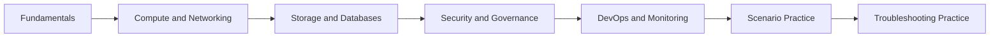
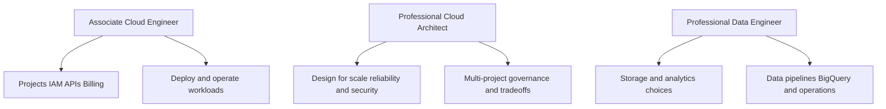

> **Screenshot Disclaimer:** Portal screenshots referenced in this guide are sourced from [Google Cloud documentation](https://cloud.google.com/docs). © Google LLC. Used for educational reference only.

# InterviewPrep

This directory is a structured interview-preparation track for Google Cloud Engineer roles. It is designed for Associate Cloud Engineer, Professional Cloud Architect, Professional Data Engineer, and platform-oriented DevOps or SRE interview loops.

The content is intentionally interview-ready: concise explanations, GCP-specific tradeoffs, console navigation references, `gcloud` verification commands, and follow-up answers that sound natural in a live conversation.

## What This Track Covers

- Core GCP fundamentals and resource hierarchy
- Compute, containers, and networking design choices
- Storage, databases, and analytics service selection
- IAM, governance, and enterprise security controls
- CI/CD, observability, and day-2 operations
- Scenario-based design responses
- Troubleshooting and incident interview patterns

## Recommended Reading Order

1. Fundamentals
2. Compute and networking
3. Storage and database design
4. Security and governance
5. DevOps and monitoring
6. Scenario drills
7. Troubleshooting drills

## Table of Contents

- [01-gcp-fundamentals-qa.md](01-gcp-fundamentals-qa.md)
- [02-compute-networking-qa.md](02-compute-networking-qa.md)
- [03-storage-database-qa.md](03-storage-database-qa.md)
- [04-security-governance-qa.md](04-security-governance-qa.md)
- [05-devops-monitoring-qa.md](05-devops-monitoring-qa.md)
- [06-scenario-based-qa.md](06-scenario-based-qa.md)
- [07-troubleshooting-guide.md](07-troubleshooting-guide.md)

## Preparation Path



## Certification Alignment



## Role Overview

### Associate Cloud Engineer

- Expect hands-on questions about projects, IAM, billing, networking, and deployment basics.
- Be ready to explain `gcloud` commands and common console locations.
- Focus on operating services correctly rather than building highly custom architectures.

### Professional Cloud Architect

- Expect architecture tradeoff questions across compute, storage, networking, and governance.
- Explain why one service is a better fit than another based on reliability, security, and cost.
- Use structured answers that start with the requirement and end with validation or operations.

### Professional Data Engineer

- Expect stronger emphasis on BigQuery, data movement, storage tiers, and database choices.
- Show you can separate transactional, analytical, and streaming requirements.
- Mention governance, security, and performance, not just feature names.

### Platform / DevOps / SRE Interviews

- Expect CI/CD, observability, incident response, release strategy, and automation questions.
- Tie answers to Cloud Build, Artifact Registry, Cloud Deploy, Monitoring, Logging, and GKE or Cloud Run operations.
- Show how you verify deployments and respond to production issues.

## How to Use the Guides

- Read the question aloud.
- Answer in your own words before reading the model answer.
- Review the key points and example scenario.
- Practice the follow-up answer immediately after the main answer.
- Run the CLI example or at least understand what it verifies.

## Interview Tips

- Start with the business requirement before naming products.
- Mention security, reliability, and cost together.
- Be precise with GCP terms such as organization, folder, project, service account, Shared VPC, or metrics scope.
- If multiple services could work, explain why one is operationally simpler.
- Use short examples from real workloads.

## Console Navigation Patterns

- Identity and governance: `IAM & Admin`
- Networking: `VPC network`, `Network services`, `Hybrid Connectivity`
- Security: `Security`, `Cloud KMS`, `Security Command Center`
- Operations: `Monitoring`, `Logging`, `Trace`, `Error Reporting`
- Delivery: `Cloud Build`, `Artifact Registry`, `Cloud Deploy`

## Quick CLI Sanity Check

**Console Navigation**
- Console: Home -> Activate Cloud Shell

```bash
gcloud config list && gcloud auth list
```

Expected output:
```text
[core]
project = interview-prep-lab
Credentialed Accounts
* engineer@example.com
```

## Study Rhythm

- Day 1: Fundamentals and IAM
- Day 2: Compute and networking comparisons
- Day 3: Storage and database decisions
- Day 4: Security and governance controls
- Day 5: CI/CD and observability
- Day 6: Scenario-based mock interview
- Day 7: Troubleshooting drill and recap

## What Good Answers Sound Like

- Short, direct, and specific to GCP
- Clear about tradeoffs
- Grounded in real operations
- Able to reference the console and CLI
- Ready for one or two follow-up questions

## Portal and Screenshot Notes

- Google Cloud documentation overview: https://cloud.google.com/docs/overview
- Google Cloud console home: use the project selector first to confirm the active project.
- When a stable screenshot URL is not practical, each chapter points to the exact console navigation path.

## Official Google Cloud References

- Google Cloud documentation: https://cloud.google.com/docs
- Google Cloud certifications: https://cloud.google.com/learn/certification
- Architecture Framework: https://cloud.google.com/architecture/framework
- gcloud CLI reference: https://cloud.google.com/sdk/gcloud
- Cloud Skills Boost: https://www.cloudskillsboost.google/
