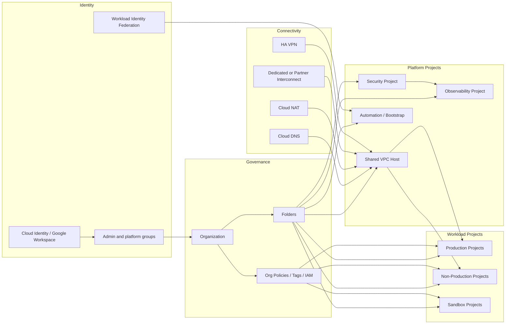
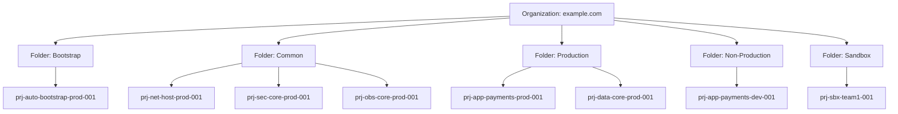
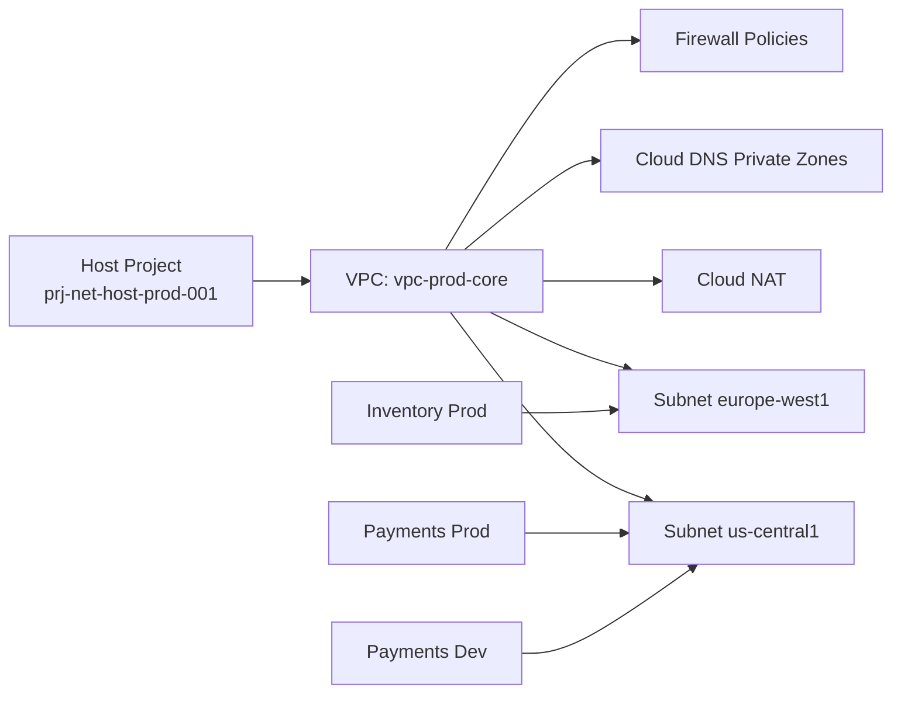
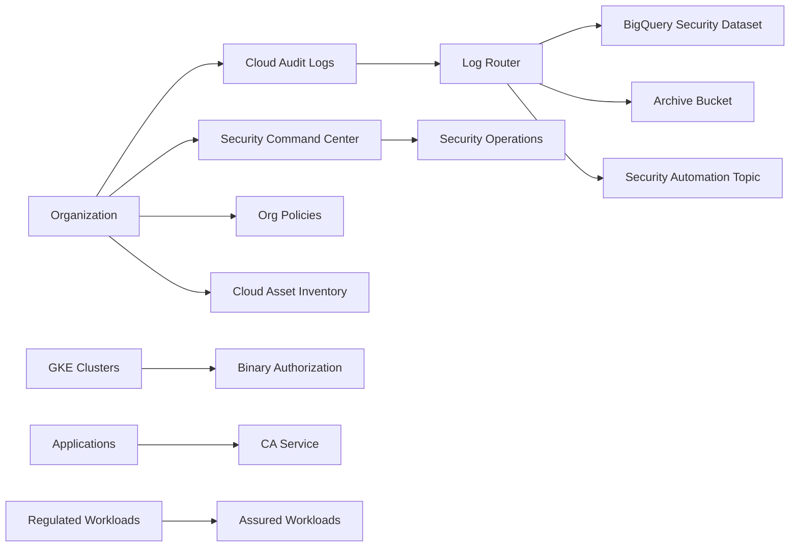
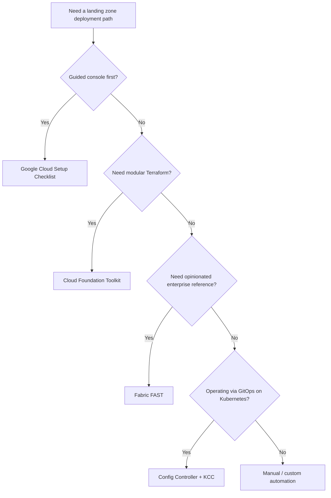
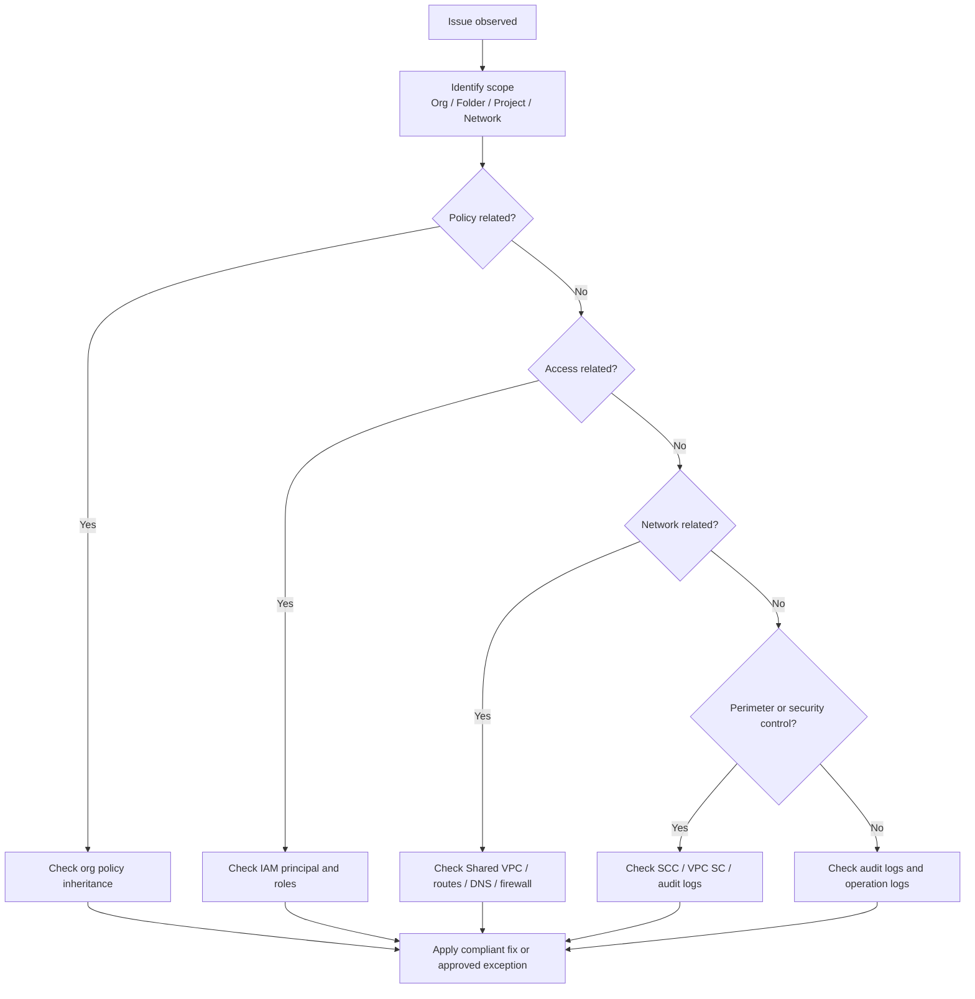

# 1. GCP Landing Zone — Complete Setup Guide
> Scope: enterprise-ready Google Cloud foundation covering hierarchy, IAM, networking, security, operations, deployment methods, and troubleshooting.

## Table of Contents
- [1.1 GCP Landing Zone Overview](#11-gcp-landing-zone-overview)
- [1.2 Resource Hierarchy](#12-resource-hierarchy)
- [1.3 Organization Policies](#13-organization-policies)
- [1.4 Identity and Access](#14-identity-and-access)
- [1.5 Network Architecture](#15-network-architecture)
- [1.6 Security Baseline](#16-security-baseline)
- [1.7 Monitoring and Operations](#17-monitoring-and-operations)
- [1.8 Deployment Methods](#18-deployment-methods)
- [1.9 Day 2 Operations](#19-day-2-operations)
- [1.10 Troubleshooting](#110-troubleshooting)
- [Official References](#official-references)

## 1.1 GCP Landing Zone Overview
### What it is
- A GCP landing zone is the foundational cloud environment created before application onboarding.
- It standardizes security, networking, identity, logging, billing, and project governance.
- It reduces risk by enforcing centrally managed controls before teams deploy workloads.
- It creates a scalable operating model for many teams, projects, and environments.
- Google Cloud documentation also refers to this foundation as a **cloud foundation**.

### Core outcomes
- Central identity with delegated administration
- Controlled resource hierarchy
- Standard project creation workflow
- Shared network and DNS patterns
- Organization policy guardrails
- Centralized logs, monitoring, and security findings
- Repeatable deployment through console or infrastructure as code

### Google Cloud setup checklist
- Confirm verified domain, organization resource, and billing account.
- Decide on Cloud Identity or Google Workspace integration.
- Create core admin groups and a break-glass access process.
- Define folder model for bootstrap, common, production, non-production, and sandbox.
- Define project naming convention and mandatory labels/tags.
- Choose Shared VPC, standalone VPC, or mixed network model.
- Reserve CIDR ranges for all environments, regions, GKE secondary ranges, and private services.
- Enable baseline APIs in platform projects.
- Configure centralized logging sinks and monitoring scopes.
- Apply organization policies and hierarchical firewall policies.
- Decide on deployment tooling and CI/CD controls.
- Document exception process for policy overrides and urgent access.

### Cloud Foundation Toolkit vs Fabric FAST vs manual setup
| Approach | What it is | Strengths | Trade-offs | Best fit |
| --- | --- | --- | --- | --- |
| Cloud Foundation Toolkit (CFT) | Terraform modules and blueprints for core GCP building blocks | Flexible, modular, incremental adoption | Requires architecture decisions and composition work | Teams that want Terraform control without building every module |
| Fabric FAST | Opinionated staged Terraform reference architecture from Cloud Foundation Fabric | End-to-end pattern, strong guidance, stage-based rollout | More opinionated; customization requires understanding FAST contracts | Organizations building a new enterprise foundation |
| Manual setup | Console and gcloud driven setup | Fast for prototypes and learning | Hard to keep consistent, weak drift control at scale | Proof of concept or small environments |

### Practical recommendation
- Start with **Google Cloud Setup** or a documented manual prototype when learning.
- Move to **Cloud Foundation Toolkit** if you want reusable Terraform modules with your own structure.
- Choose **Fabric FAST** when you want a reference architecture with staged deployment and enterprise guardrails.
- Avoid long-term manual-only landing zones for regulated or multi-team environments.

### Console navigation paths
- **Google Cloud Setup**: `console.cloud.google.com/cloud-setup/overview`
- **Organization view**: `IAM & Admin > Settings`
- **Folders and projects**: `IAM & Admin > Manage Resources`
- **Billing**: `Billing > Account management`
- **APIs**: `APIs & Services > Enabled APIs & services`

### GCP landing zone architecture


### Minimal bootstrap commands
```bash
gcloud organizations list
gcloud billing accounts list
gcloud auth list
```
Expected output:
```text
DISPLAY_NAME     ID           DIRECTORY_CUSTOMER_ID
example.com      1234567890   C03abcxyz

ACCOUNT_ID             NAME                 OPEN  MASTER_ACCOUNT_ID
0000AA-1111BB-2222CC   Enterprise Billing   True

Credentialed Accounts
ACTIVE  ACCOUNT
*       platform-admin@example.com
```

### Design notes
- Build the landing zone before migrating enterprise workloads.
- Keep the first version simple, but reserve enough IP space and governance scope for scale.
- Separate platform-owned projects from application-owned projects.
- Treat the landing zone as a product with versioned changes and approvals.

---
## 1.2 Resource Hierarchy
### Why it matters
- It controls inheritance for IAM, org policies, tags, and logging scope.
- It gives security and platform teams clean delegation boundaries.
- It simplifies cost allocation and lifecycle management.
- It lets you apply stronger guardrails to production than sandbox.

### Hierarchy model
- **Organization** is the root administrative container.
- **Folders** group projects by policy or ownership boundary.
- **Projects** are the main isolation boundary for workloads, quotas, billing, and APIs.
- **Resources** live inside projects: VMs, buckets, clusters, databases, log sinks, and more.

### Recommended folder structure
| Folder | Typical contents |
| --- | --- |
| Bootstrap | Terraform state, CI/CD runners, bootstrap service accounts, org-seeding automation |
| Common | Shared VPC host projects, security tooling, centralized logging/monitoring, DNS, certificates |
| Production | Production application service projects, prod data projects, prod runtime projects |
| Non-Production | Dev, test, stage application projects and validation projects |
| Sandbox | Self-service developer projects, training, proof-of-concept workloads |

### Naming conventions
- Project pattern: `prj-<domain>-<service>-<environment>-<sequence>`
- Project examples: `prj-net-host-prod-001`, `prj-sec-core-prod-001`, `prj-app-payments-prod-001`, `prj-app-payments-dev-001`
- Folder examples: `fld-bootstrap`, `fld-common`, `fld-production`, `fld-nonprod`, `fld-sandbox`
- Network examples: `vpc-prod-core`, `snet-prod-uscentral1-app`, `cr-prod-uscentral1`, `nat-prod-uscentral1`

### Labels and tags for governance
| Metadata type | Examples | Primary use |
| --- | --- | --- |
| Labels | `environment=prod`, `owner=team-name`, `cost-center=finops-code`, `criticality=tier1`, `compliance=pci` | Billing, search, reporting, automation |
| Tags | `environment/prod`, `network/trusted`, `data/classified`, `access/restricted` | Policy scoping, conditional controls, access decisions |

### Console navigation paths
- **Manage Resources**: `IAM & Admin > Manage Resources`
- **Tag keys and values**: `IAM & Admin > Tags`
- **Project details**: `IAM & Admin > Settings`

### Resource hierarchy diagram


### Example hierarchy commands
```bash
gcloud resource-manager folders create --display-name=Bootstrap --organization=ORG_ID
gcloud resource-manager folders create --display-name=Common --organization=ORG_ID
gcloud resource-manager folders create --display-name=Production --organization=ORG_ID
gcloud resource-manager folders create --display-name=Non-Production --organization=ORG_ID
gcloud resource-manager folders create --display-name=Sandbox --organization=ORG_ID
```
Expected output:
```text
Create request issued for: [Bootstrap]
Create request issued for: [Common]
Create request issued for: [Production]
Create request issued for: [Non-Production]
Create request issued for: [Sandbox]
```

### Governance tips
- Keep folder depth shallow unless compliance or ownership truly requires more layers.
- Use groups for folder-level IAM, not individual user bindings.
- Avoid mixing prod and nonprod workloads in the same project.
- Treat project creation as a controlled factory process.
- Reserve project IDs early for critical shared services.

---
## 1.3 Organization Policies
### What org policies are
- Organization Policy Service lets you define constraints that govern how resources can be configured.
- Policies can be applied at organization, folder, or project level.
- Lower levels inherit policies unless an override is explicitly allowed.
- They are one of the strongest landing zone guardrails because they stop unsupported configurations before deployment.

### Key policies
| Constraint | Purpose | Typical landing zone use |
| --- | --- | --- |
| `constraints/compute.disableSerialPortAccess` | Block serial port access to VMs | Reduce break-glass misuse and data exposure |
| `constraints/compute.requireShieldedVm` | Require Shielded VM features | Improve VM integrity baseline |
| `constraints/iam.disableServiceAccountKeyCreation` | Block user-managed service account keys | Push teams toward keyless auth and impersonation |
| `constraints/compute.restrictVpcPeering` | Limit VPC peering creation | Control network sprawl and unauthorized connectivity |
| `constraints/gcp.resourceLocations` | Restrict allowed regions and multi-regions | Enforce residency and sovereignty requirements |
| `constraints/sql.restrictPublicIp` | Prevent Cloud SQL public IP exposure | Keep databases private by default |

### Additional policies often used
- `constraints/storage.publicAccessPrevention`
- `constraints/compute.vmExternalIpAccess`
- `constraints/iam.allowedPolicyMemberDomains`
- `constraints/compute.skipDefaultNetworkCreation`
- `constraints/compute.disableGuestAttributesAccess`

### Example policy definitions
#### Require Shielded VM
```yaml
name: organizations/ORG_ID/policies/compute.requireShieldedVm
spec:
  rules:
    - enforce: true
```
#### Restrict resource locations
```yaml
name: organizations/ORG_ID/policies/gcp.resourceLocations
spec:
  rules:
    - values:
        allowedValues:
          - in:us-locations
          - in:europe-locations
```
#### Restrict Cloud SQL public IP
```yaml
name: organizations/ORG_ID/policies/sql.restrictPublicIp
spec:
  rules:
    - enforce: true
```

### Custom org policies
- Use custom constraints when built-in constraints do not fully express your control intent.
- Good candidates include service-specific field restrictions, approved image patterns, or custom validation on allowed settings.
- Test custom constraints in lower environments before wider rollout.
- Keep policy ownership with the central platform or security team.

### gcloud commands
```bash
gcloud resource-manager org-policies list --organization=ORG_ID
gcloud resource-manager org-policies set-policy policy.yaml --organization=ORG_ID
```
Expected output for list:
```text
CONSTRAINT                                      LIST_POLICY  BOOLEAN_POLICY  ETAG
constraints/compute.requireShieldedVm                         SET            BwWKm9...
constraints/iam.disableServiceAccountKeyCreation              SET            BwWKp7...
constraints/sql.restrictPublicIp                              SET            BwWKx1...
```
Expected output for set-policy:
```text
Updated policy [organizations/1234567890/policies/compute.requireShieldedVm].
```

### Additional verification commands
```bash
gcloud resource-manager org-policies describe constraints/compute.requireShieldedVm --organization=ORG_ID
gcloud resource-manager org-policies describe constraints/gcp.resourceLocations --organization=ORG_ID
```
Expected output:
```text
displayName: Require Shielded VM
name: organizations/1234567890/policies/compute.requireShieldedVm
spec:
  rules:
  - enforce: true
```

### Console navigation paths
- **Organization Policies**: `IAM & Admin > Organization Policies`
- **Policy details**: open a constraint, review inheritance, then select `Customize`
- **Change history**: review `Activity` or Cloud Audit Logs for policy modifications

### Rollout tips
- Start with assessment and exception discovery.
- Apply policies in non-production first.
- Document justified exceptions at folder or project scope.
- Move high-value controls to organization scope once validated.
- Revisit policies quarterly as services and requirements change.

---
## 1.4 Identity and Access
### Cloud Identity / Google Workspace integration
- Cloud Identity or Google Workspace provides the enterprise identity source for Google Cloud.
- Integrate with your corporate IdP for user lifecycle, SSO, and group synchronization.
- Base cloud access on groups rather than individual users.
- Separate admin, developer, auditor, billing, and break-glass groups.

### Example admin groups
- `gcp-org-admins@example.com`
- `gcp-billing-admins@example.com`
- `gcp-network-admins@example.com`
- `gcp-security-admins@example.com`
- `gcp-project-factory-admins@example.com`
- `gcp-readonly-auditors@example.com`

### IAM roles
| Role type | Summary | Guidance |
| --- | --- | --- |
| Basic roles | Owner, Editor, Viewer | Avoid broad Owner/Editor grants in enterprise environments |
| Predefined roles | Google-managed service roles | Prefer first because they are service-aware and maintained |
| Custom roles | Tailored permission sets | Use when predefined roles are too broad; version-control them |

### IAM best practices
- Use least privilege.
- Bind access to groups, not users.
- Separate human and machine identities.
- Use short-lived credentials where possible.
- Enable approvals for privileged group membership.
- Monitor role grants with Cloud Audit Logs and IAM Recommender.
- Avoid assigning Organization Administrator unless absolutely necessary.

### Workload Identity Federation
- Workload Identity Federation lets external identities access Google Cloud without long-lived service account keys.
- Common use cases: GitHub Actions, Azure AD workloads, AWS workloads, and third-party CI/CD systems.
- Prefer WIF for external automation instead of JSON keys.
- Use attribute mapping and conditions to restrict who can impersonate what.

### Service accounts
#### Creation
```bash
gcloud iam service-accounts create terraform-runner \
  --display-name="Terraform Runner" \
  --project=prj-auto-bootstrap-prod-001
```
Expected output:
```text
Created service account [terraform-runner].
```
#### Granting roles
```bash
gcloud projects add-iam-policy-binding prj-net-host-prod-001 \
  --member="serviceAccount:terraform-runner@prj-auto-bootstrap-prod-001.iam.gserviceaccount.com" \
  --role="roles/compute.networkAdmin"
```
Expected output:
```text
Updated IAM policy for project [prj-net-host-prod-001].
```
#### Key management and impersonation
- Disable service account key creation where possible.
- If keys are unavoidable, rotate frequently and store in Secret Manager.
- Prefer WIF, GKE Workload Identity, or service account impersonation.
```bash
gcloud auth print-access-token \
  --impersonate-service-account=terraform-runner@prj-auto-bootstrap-prod-001.iam.gserviceaccount.com
```
Expected output:
```text
ya29.c.b0Aaekm1ExampleShortLivedAccessToken
```

### BeyondCorp Enterprise, IAM Recommender, and VPC Service Controls
- **BeyondCorp Enterprise** extends zero-trust access patterns to applications and administrative access.
- **IAM Recommender** identifies overly broad permissions and unused role bindings.
- **VPC Service Controls** create service perimeters around supported Google APIs to reduce data exfiltration risk.
- VPC SC is especially useful for BigQuery, GCS, Artifact Registry, and regulated data platforms.

### Console navigation paths
- **Users and groups**: Cloud Identity Admin Console
- **IAM**: `IAM & Admin > IAM`
- **Service accounts**: `IAM & Admin > Service Accounts`
- **Workload Identity Federation**: `IAM & Admin > Workload Identity Federation`
- **VPC Service Controls**: `Security > VPC Service Controls`
- **IAM Recommender**: `IAM & Admin > Recommender`
- **BeyondCorp Enterprise**: `Security > BeyondCorp Enterprise`

### Identity checklist
- Sync corporate directory and groups.
- Define privileged access model and approvals.
- Separate platform, security, and application admin roles.
- Use WIF for external automation.
- Use service account impersonation for Terraform and CI/CD.
- Disable or tightly control service account key creation.
- Review IAM policies and recommendations on a schedule.

---
## 1.5 Network Architecture
### Shared VPC vs standalone VPCs
| Criteria | Shared VPC | Standalone VPC |
| --- | --- | --- |
| Ownership | Central network team owns host project | Each project team owns its network |
| Governance | Strong central control | Weaker standardization unless heavily automated |
| IP planning | Easier to manage globally | Higher risk of CIDR overlap |
| Operational model | Best for many service projects | Best for simple or isolated projects |
| Recommended for landing zone | Yes, usually | Only for exceptions or smaller deployments |

### Shared VPC model
- A central **host project** owns VPCs, subnets, routes, NAT, and shared DNS.
- **Service projects** consume subnets from the host project.
- This model is preferred when a platform team manages enterprise networking.

### Standalone VPC model
- Each project owns its own VPC and subnets.
- This is useful for isolated teams, simple environments, or deliberate exceptions.

### VPC design guidance
- Use custom mode VPCs.
- Create subnets per region and workload class.
- Reserve secondary ranges for GKE pods and services.
- Enable Private Google Access on private subnets.
- Reserve ranges for Private Service Connect and private services access.
- Keep prod and nonprod separated by project and often by VPC.

### Example CIDR planning
| Environment | Region | Primary subnet | GKE Pods | GKE Services |
| --- | --- | --- | --- | --- |
| Prod | us-central1 | 10.10.0.0/20 | 10.10.16.0/20 | 10.10.32.0/24 |
| Prod | europe-west1 | 10.20.0.0/20 | 10.20.16.0/20 | 10.20.32.0/24 |
| Nonprod | us-central1 | 10.110.0.0/20 | 10.110.16.0/20 | 10.110.32.0/24 |
| Sandbox | us-central1 | 10.210.0.0/20 | optional | optional |

### Shared VPC setup commands
```bash
gcloud compute shared-vpc enable prj-net-host-prod-001
gcloud compute shared-vpc associated-projects add prj-app-payments-prod-001 --host-project=prj-net-host-prod-001
gcloud compute shared-vpc associated-projects add prj-app-payments-dev-001 --host-project=prj-net-host-prod-001
```
Expected output:
```text
Enabled Shared VPC on project [prj-net-host-prod-001].
Associated project [prj-app-payments-prod-001] with host project [prj-net-host-prod-001].
Associated project [prj-app-payments-dev-001] with host project [prj-net-host-prod-001].
```

### Shared VPC architecture


### Subnet creation example
```bash
gcloud compute networks create vpc-prod-core \
  --project=prj-net-host-prod-001 \
  --subnet-mode=custom

gcloud compute networks subnets create snet-prod-uscentral1-app \
  --project=prj-net-host-prod-001 \
  --network=vpc-prod-core \
  --region=us-central1 \
  --range=10.10.0.0/20 \
  --secondary-range=gke-pods=10.10.16.0/20,gke-services=10.10.32.0/24 \
  --enable-private-ip-google-access
```
Expected output:
```text
Created [https://www.googleapis.com/compute/v1/projects/prj-net-host-prod-001/global/networks/vpc-prod-core].
Created [https://www.googleapis.com/compute/v1/projects/prj-net-host-prod-001/regions/us-central1/subnetworks/snet-prod-uscentral1-app].
```

### Topology patterns
- **Hub-and-spoke** centralizes shared connectivity, inspection, DNS, and egress.
- Use **VPC peering** for private GCP-to-GCP connectivity between independently managed VPCs.
- Use **Cloud VPN** for encrypted connectivity over the internet.
- Use **Dedicated Interconnect** or **Partner Interconnect** for higher-throughput, long-term hybrid connectivity.
- Pair Interconnect or VPN with Cloud Router for dynamic route exchange.
- Use Cloud NAT for internet egress from private workloads without public IPs.
- Use Cloud DNS private zones, forwarding zones, and peering zones for internal name resolution.
- Use Cloud Armor with external load balancers for WAF and DDoS protection.
- Use hierarchical firewall policies for mandatory guardrails and VPC firewall rules for workload-specific access.

### Network topology diagram
```mermaid
flowchart TB
    OnPrem[On-Prem DC] --> Interconnect[Cloud Interconnect / HA VPN]
    Interconnect --> Hub[Hub Connectivity Layer]
    Hub --> SharedProd[Shared VPC Prod]
    Hub --> SharedNonProd[Shared VPC NonProd]
    SharedProd --> App1[Prod App Project]
    SharedProd --> Data1[Prod Data Project]
    SharedNonProd --> Dev1[Dev App Project]
    SharedNonProd --> Test1[Test App Project]
    SharedProd --> DNS[Cloud DNS]
    SharedProd --> NAT[Cloud NAT]
    Internet[Internet] --> Armor[Cloud Armor]
    Armor --> XLB[External HTTP(S) LB]
    XLB --> App1
```

### Console navigation paths
- **VPC networks**: `VPC network > VPC networks`
- **Shared VPC**: `VPC network > Shared VPC`
- **Firewall policies**: `VPC network > Firewall > Firewall policies`
- **Cloud NAT**: `Network services > Cloud NAT`
- **Cloud DNS**: `Network services > Cloud DNS`
- **Cloud Interconnect**: `Hybrid Connectivity > Cloud Interconnect`
- **Cloud VPN**: `Hybrid Connectivity > Cloud VPN`
- **Cloud Armor**: `Network Security > Cloud Armor`

### Network design tips
- Keep IP allocations in a central source of truth.
- Reserve space for future regions and acquired business units.
- Do not depend on default VPC networks.
- Use private service access patterns for managed services.
- Separate external ingress from east-west segmentation decisions.
- Validate MTU, routes, and DNS dependencies during hybrid rollout.

---
## 1.6 Security Baseline
### Security Command Center (SCC)
- SCC centralizes security posture, findings, and threat signals.
- **Standard** provides posture management features such as Security Health Analytics.
- **Premium** adds more advanced threat detection and security capabilities.

### Key SCC capabilities
- **Security Health Analytics**: posture and misconfiguration findings
- **Web Security Scanner**: application scanning for web vulnerabilities
- **Event Threat Detection**: suspicious activity detection
- **Container Threat Detection**: container and runtime threat signals

### Audit, logging, and assets
- Enable and retain **Admin Activity**, **Data Access**, and **System Event** logs as required.
- Create organization-level aggregated sinks.
- Route long-retention audit data to BigQuery or Cloud Storage.
- Use Pub/Sub for near-real-time security automation if needed.
- Use Log Router inclusion and exclusion filters carefully to manage cost and noise.
- Use Cloud Asset Inventory for searchable resource history and policy analysis.

### Additional security services
- **Binary Authorization** enforces trusted image deployment for GKE.
- **Certificate Authority Service** provides managed private PKI for internal TLS.
- **Assured Workloads** helps configure environments aligned to selected compliance programs.

### Security architecture


### Example commands
```bash
gcloud logging sinks create org-audit-bq \
  bigquery.googleapis.com/projects/prj-obs-core-prod-001/datasets/org_audit \
  --organization=ORG_ID \
  --include-children

gcloud asset export \
  --organization=ORG_ID \
  --content-type=resource \
  --output-path=gs://prj-sec-core-prod-001-asset-exports/resources.json
```
Expected output:
```text
Created [https://logging.googleapis.com/v2/organizations/1234567890/sinks/org-audit-bq].
Please remember to grant `roles/bigquery.dataEditor` to the writer identity.

Export in progress for organization [1234567890].
```

### Console navigation paths
- **Security Command Center**: `Security > Security Command Center`
- **Audit Logs**: `IAM & Admin > Audit Logs`
- **Logs Router**: `Logging > Logs Router`
- **Log buckets / analytics**: `Logging > Log Storage`
- **Cloud Asset Inventory**: `IAM & Admin > Asset Inventory`
- **Binary Authorization**: `Security > Binary Authorization`
- **CA Service**: `Security > Certificate Authority Service`
- **Assured Workloads**: `Security > Assured Workloads`

### Security baseline checklist
- Enable SCC at org or top-folder scope.
- Enable required audit logs for critical services.
- Create centralized logging sinks and secure destinations.
- Export asset inventory on a schedule.
- Enable Binary Authorization for production GKE.
- Standardize internal PKI with CA Service where needed.
- Review regulated workloads for Assured Workloads applicability.

---
## 1.7 Monitoring and Operations
### Core observability services
- **Cloud Monitoring**: uptime checks, dashboards, alerting policies, SLO views.
- **Cloud Logging**: log-based metrics, Log Analytics, centralized retention.
- **Cloud Trace**: request latency analysis across distributed apps.
- **Cloud Profiler**: CPU and memory hotspot analysis.
- **Operations Suite**: multi-project monitoring through a central observability project or scope.

### Operational recommendations
- Create standardized dashboards per environment and service tier.
- Define notification channels for PagerDuty, email, SMS, or Chat integrations.
- Use log-based metrics for security events, failed deployments, or app errors.
- Define SLIs/SLOs for availability, latency, success rate, and data freshness.
- Alert on error-budget burn, not only raw outages.
- Create billing budgets and review quotas before onboarding large services.

### Example commands
```bash
gcloud monitoring uptime list --project=prj-obs-core-prod-001
gcloud monitoring policies list --project=prj-obs-core-prod-001
gcloud billing budgets list --billing-account=BILLING_ACCOUNT_ID
```
Expected output:
```text
NAME                                    DISPLAY_NAME
projects/12345/uptimeCheckConfigs/678   payments-prod-homepage

NAME                              DISPLAY_NAME      ENABLED
projects/12345/alertPolicies/999  prod-latency-p95  True

DISPLAY_NAME               AMOUNT  THRESHOLDS
prod-platform-budget       50000   0.5,0.8,1.0
sandbox-monthly-budget     5000    0.5,0.9,1.0
```

### Console navigation paths
- **Monitoring**: `Monitoring`
- **Dashboards**: `Monitoring > Dashboards`
- **Alerting**: `Monitoring > Alerting`
- **Uptime checks**: `Monitoring > Uptime checks`
- **Logs-based metrics**: `Logging > Logs-based metrics`
- **Log Analytics**: `Logging > Log Analytics`
- **Trace**: `Operations > Trace`
- **Profiler**: `Operations > Profiler`
- **Budgets & alerts**: `Billing > Budgets & alerts`
- **Quotas**: `IAM & Admin > Quotas`

---
## 1.8 Deployment Methods
### Option A — Google Cloud Setup Checklist (console)
Use this option when you want guided setup through the Google Cloud console.
1. Open `console.cloud.google.com/cloud-setup/overview`.
2. Click **Get started** and choose **Proof of concept**, **Production**, or **Enhanced security**.
3. In **Organization**, verify the domain-backed organization is selected.
4. In **Administrators**, review or create the initial admin groups.
5. In **Billing**, select or create the billing account and confirm billing admins.
6. In **Resource hierarchy**, review the suggested folders and project layout.
7. In **Security**, review recommended organization policies and guardrails.
8. In **Networking**, choose the baseline network architecture and shared services setup.
9. In **Logging and monitoring**, review the centralized observability configuration.
10. In **Review and deploy**, inspect the generated Terraform-backed configuration.
11. Click **Deploy** to apply directly from the console, or download the generated configuration for customization.
12. Record outputs such as project IDs, admin groups, enabled policies, and billing bindings.

### Option B — Terraform (Cloud Foundation Toolkit)
Use Terraform when you want repeatable, version-controlled landing zone deployment.
```hcl
module "org" {
  source  = "terraform-google-modules/project-factory/google"
  version = "~> 14.0"
  name              = "platform-bootstrap"
  random_project_id = true
  org_id            = var.org_id
  folder_id         = var.bootstrap_folder_id
  billing_account   = var.billing_account_id
}
```
Common CFT modules:
- `terraform-google-modules/org-policy`
- `terraform-google-modules/network`
- `terraform-google-modules/project-factory`
- `terraform-google-modules/iam`

Example Terraform structure:
```text
landing-zone/
├── environments/
│   ├── bootstrap/
│   ├── common/
│   ├── production/
│   └── nonprod/
├── modules/
│   ├── org-policies/
│   ├── project-factory/
│   ├── shared-vpc/
│   ├── logging/
│   └── iam-groups/
├── policies/
│   ├── require-shielded-vm.yaml
│   └── restrict-locations.yaml
└── pipelines/
    ├── plan.yaml
    └── apply.yaml
```
Recommended stages: bootstrap organization access and state; create folders and shared service projects; create Shared VPC and subnets; apply org policies and logging sinks; onboard workload projects through project factory.

### Option C — Fabric FAST (Google's reference architecture)
- Fabric FAST is an end-to-end, Terraform-based landing zone reference architecture built on Cloud Foundation Fabric.
- It uses staged deployment and strong contracts between stages.
- Typical stages: **bootstrap**, **resource management**, **networking**, **security**, **projects/project factory**.
How to deploy each stage:
1. Bootstrap organization access, state, identities, and automation.
2. Deploy resource hierarchy and group/resource contracts.
3. Deploy networking stage: Shared VPC, subnets, DNS, NAT, hybrid connectivity.
4. Deploy security stage: org policies, logging, security controls, and perimeter patterns.
5. Deploy project factory stage for application onboarding.
6. Integrate CI/CD using Workload Identity Federation where possible.

### Option D — Config Controller + KCC (Kubernetes Config Connector)
- Config Controller is a managed control plane for Config Connector.
- KCC treats infrastructure as Kubernetes-style resources.
- Use it when you already operate Kubernetes-native GitOps processes and want infrastructure as data.
- Avoid unnecessary complexity if Terraform already fits your operating model.

### Deployment decision diagram


### Selection guide
- Use **Google Cloud Setup** for guided initial deployment.
- Use **CFT** for flexible Terraform modules.
- Use **FAST** for a full reference architecture with staged deployment.
- Use **KCC** when GitOps and Kubernetes-native control is the primary operating model.

---
## 1.9 Day 2 Operations
### Adding new projects
- Use a project factory process, not manual ad hoc creation.
- Enforce naming, labels, tags, budget association, APIs, and IAM defaults.
- Attach service projects to Shared VPC automatically when required.
```bash
gcloud projects create prj-app-orders-prod-001 --folder=PROD_FOLDER_ID --name="orders-prod"
```
Expected output:
```text
Create in progress for [https://cloudresourcemanager.googleapis.com/v1/projects/prj-app-orders-prod-001].
```

### Network expansion, policies, access reviews, and cost
- Add new subnets only after CIDR impact review; then update DNS, NAT, routes, and firewall rules.
- Review proposed org-policy changes in non-production first and track policy versions and approvers.
- Run recurring access reviews using IAM Recommender and shared-service IAM baselines.
- Export billing data to BigQuery and apply budgets by environment, domain, and critical projects.
- Use quotas to prevent runaway deployments in sandbox.
```bash
gcloud compute networks subnets create snet-prod-uswest1-app \
  --project=prj-net-host-prod-001 \
  --network=vpc-prod-core \
  --region=us-west1 \
  --range=10.30.0.0/20 \
  --enable-private-ip-google-access
```
Expected output:
```text
Created [https://www.googleapis.com/compute/v1/projects/prj-net-host-prod-001/regions/us-west1/subnetworks/snet-prod-uswest1-app].
```

### Operational cadence and console paths
- Daily: monitor alerts, failed deployments, and security findings.
- Weekly: review new projects, IAM changes, and budget notifications.
- Monthly: review policy exceptions, recommender output, and topology drift.
- Quarterly: revisit architecture, region strategy, and compliance requirements.
- **Projects**: `IAM & Admin > Manage Resources`
- **Recommender**: `IAM & Admin > Recommender`
- **Billing Reports**: `Billing > Reports`
- **Billing export**: `Billing > Billing export`
- **Budgets**: `Billing > Budgets & alerts`

---
## 1.10 Troubleshooting
### Organization policy blocking resources
- **Symptoms**: resource creation fails; error references a constraint such as `compute.requireShieldedVm` or `sql.restrictPublicIp`.
- **Checks**:
```bash
gcloud resource-manager org-policies describe constraints/compute.requireShieldedVm --project=PROJECT_ID
gcloud resource-manager org-policies describe constraints/sql.restrictPublicIp --project=PROJECT_ID
```
Expected output:
```text
spec:
  rules:
  - enforce: true
```
- **Resolution**: identify the inherited scope, verify whether the resource should comply, and apply approved exceptions only at the lowest safe scope.

### IAM permission denied issues
- **Symptoms**: `PERMISSION_DENIED` during deployment or console actions.
- **Checks**:
```bash
gcloud projects get-iam-policy PROJECT_ID
gcloud auth list
gcloud auth print-access-token --impersonate-service-account=SERVICE_ACCOUNT_EMAIL
```
- **Resolution**: confirm the active principal, inspect inherited IAM at org/folder/project level, and grant the minimum required role to the correct group.

### VPC Service Controls violations
- **Symptoms**: access to supported services fails with perimeter-violation messages.
- **Checks**: review perimeter membership, ingress/egress rules, caller identity, source network, and bridge project.
```bash
gcloud access-context-manager perimeters list --policy=ACCESS_POLICY_ID
```
Expected output:
```text
NAME                         TITLE           STATUS
accessPolicies/123/perimeters/data-prod   data-prod      ACTIVE
```
- **Resolution**: add the project or service to the correct perimeter, adjust approved ingress/egress rules, and use dry-run testing where possible.

### Shared VPC subnet access problems
- **Symptoms**: service-project workloads cannot attach to host-project subnets; GKE or VM creation fails with subnet or network permission errors.
- **Checks**:
```bash
gcloud compute shared-vpc associated-projects list --host-project=prj-net-host-prod-001
gcloud projects get-iam-policy prj-net-host-prod-001
```
Expected output:
```text
PROJECT_ID
prj-app-payments-prod-001
prj-app-payments-dev-001
```
- **Resolution**: confirm host association, subnet-level permissions, secondary-range availability, and firewall policy impact.

### General troubleshooting workflow

- Start with exact scope: organization, folder, project, or subnet.
- Check Cloud Audit Logs for denied actions and actor identity.
- Validate whether the problem is control plane or data plane.
- Compare working and failing projects for inherited-policy differences.
- Keep a known-good reference project for baseline comparison.

---
## Official References
### Landing zone and setup guidance
- [Landing zones in Google Cloud](https://cloud.google.com/architecture/landing-zones)
- [Google Cloud setup checklist](https://cloud.google.com/docs/enterprise/setup-checklist)
- [Decide the resource hierarchy for your Google Cloud landing zone](https://cloud.google.com/architecture/landing-zones/decide-resource-hierarchy)
- [Decide the network design for your Google Cloud landing zone](https://cloud.google.com/architecture/landing-zones/decide-network-design)
- [Decide the security for your Google Cloud landing zone](https://cloud.google.com/architecture/landing-zones/decide-security)

### Architecture and governance
- [Google Cloud Well-Architected Framework](https://cloud.google.com/architecture/framework)
- [Cloud resource hierarchy](https://cloud.google.com/resource-manager/docs/cloud-platform-resource-hierarchy)
- [Organization Policy Service overview](https://cloud.google.com/resource-manager/docs/organization-policy/overview)
- [Tags overview](https://cloud.google.com/resource-manager/docs/tags/tags-overview)

### Identity and access
- [Cloud Identity overview](https://cloud.google.com/identity/docs/overview)
- [IAM overview](https://cloud.google.com/iam/docs/overview)
- [Workload Identity Federation](https://cloud.google.com/iam/docs/workload-identity-federation)
- [Service account impersonation](https://cloud.google.com/iam/docs/service-account-impersonation)
- [VPC Service Controls overview](https://cloud.google.com/vpc-service-controls/docs/overview)
- [BeyondCorp Enterprise](https://cloud.google.com/beyondcorp-enterprise/docs)

### Networking and security
- [Shared VPC overview](https://cloud.google.com/vpc/docs/shared-vpc)
- [Cloud DNS overview](https://cloud.google.com/dns/docs/overview)
- [Cloud NAT overview](https://cloud.google.com/nat/docs/overview)
- [Cloud Interconnect overview](https://cloud.google.com/network-connectivity/docs/interconnect/concepts/overview)
- [Hierarchical firewall policies](https://cloud.google.com/firewall/docs/firewall-policies)
- [Cloud Armor overview](https://cloud.google.com/armor/docs/overview)
- [Security Command Center](https://cloud.google.com/security-command-center/docs)
- [Cloud Audit Logs](https://cloud.google.com/logging/docs/audit)
- [Cloud Asset Inventory](https://cloud.google.com/asset-inventory/docs/overview)
- [Binary Authorization](https://cloud.google.com/binary-authorization/docs)
- [Certificate Authority Service](https://cloud.google.com/certificate-authority-service/docs)
- [Assured Workloads](https://cloud.google.com/assured-workloads/docs)

### Automation and deployment
- [Cloud Foundation Toolkit](https://cloud.google.com/foundation-toolkit)
- [Cloud Foundation Fabric FAST](https://github.com/GoogleCloudPlatform/cloud-foundation-fabric/tree/master/fast)
- [Config Controller overview](https://cloud.google.com/config-connector/docs/concepts/config-controller-overview)

### Final recommendations
- Prefer automation for repeatable controls.
- Standardize project onboarding.
- Enforce secure defaults with org policies and IAM.
- Centralize logging, monitoring, and security findings.
- Review the landing zone as a living platform, not a one-time setup.
