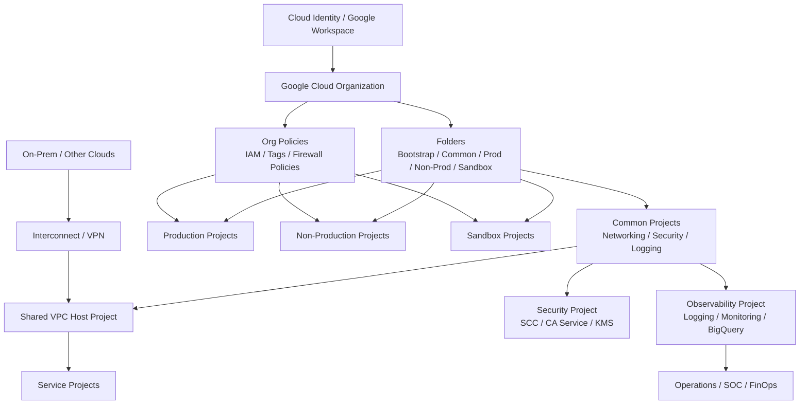

# GCP Landing Zones
A landing zone is the governed cloud foundation that standardizes identity, networking, security, logging, and project structure before application teams deploy workloads.
In Google Cloud, a landing zone usually centers on the organization resource, folder hierarchy, projects, Shared VPC, organization policies, centralized logging, and operating guardrails.
This directory contains an overview plus a detailed implementation guide for enterprise Google Cloud landing zones.

## Table of Contents
- [What is a Cloud Landing Zone?](#what-is-a-cloud-landing-zone)
- [Google Cloud Landing Zone Concept](#google-cloud-landing-zone-concept)
- [Google Cloud Architecture Framework Pillars](#google-cloud-architecture-framework-pillars)
- [Architecture Overview](#architecture-overview)
- [Guide Contents](#guide-contents)
- [Recommended Adoption Flow](#recommended-adoption-flow)
- [Official References](#official-references)

## What is a Cloud Landing Zone?
- A cloud landing zone is a preconfigured platform baseline for secure cloud adoption.
- It defines how identities, billing, folders, projects, networks, and logs are organized.
- It gives teams a repeatable starting point instead of creating every environment from scratch.
- It reduces drift by applying standard controls before workloads arrive.
- It supports both day 0 setup and day 2 operations such as onboarding, auditing, and cost governance.

### Typical capabilities
- Enterprise identity integration
- Resource hierarchy and project lifecycle controls
- Network topology and IP planning
- Security guardrails and policy enforcement
- Logging, monitoring, and audit evidence collection
- Automation with Terraform or other infrastructure-as-code tools

## Google Cloud Landing Zone Concept
- Google Cloud also calls a landing zone a **cloud foundation**.
- It starts with the **Organization** resource and **Billing Account**.
- Core building blocks usually include:
  - Cloud Identity or Google Workspace integration
  - Folder and project hierarchy
  - IAM groups and delegated administration
  - Shared VPC or segmented VPC design
  - Organization policies and hierarchical firewall policies
  - Centralized logging, monitoring, and Security Command Center
  - Automation through Terraform, Fabric FAST, or Google Cloud Setup
- Google recommends building the landing zone before deploying enterprise workloads.
- The first version does not need to be final; it should be modular and extensible.

### Common enterprise folders
- **Bootstrap**: initial automation, state, CI/CD, break-glass resources
- **Common**: shared networking, logging, security, DNS, identity-related services
- **Production**: production workload projects
- **Non-Production**: dev, test, and stage workload projects
- **Sandbox**: developer experimentation with tighter quotas and lighter controls

## Google Cloud Architecture Framework Pillars
Google Cloud's Well-Architected / Architecture Framework pillars help shape landing zone decisions.

### Pillars
1. **Operational excellence**
   - Standardize deployment, monitoring, incident response, and change management.
2. **Security, privacy, and compliance**
   - Apply least privilege, guardrails, encryption, and evidence collection.
3. **Reliability**
   - Design for regional resilience, service continuity, and recoverability.
4. **Performance optimization**
   - Right-size networks, services, and architectures for workload demand.
5. **Cost optimization**
   - Control project sprawl, budgets, labels, and billing visibility.
6. **Sustainability**
   - Prefer efficient managed services and right-sized deployments.

### Mapping to a landing zone
- Security drives IAM, org policies, VPC Service Controls, and SCC.
- Reliability drives subnet strategy, hybrid connectivity, DNS, and logging.
- Operations drives dashboards, alerting, SLOs, and automation pipelines.
- Cost drives project structure, budgets, labels, tags, and quota controls.
- Performance drives topology choices such as Shared VPC, NAT, and Interconnect.
- Sustainability encourages managed services and efficient default patterns.

## Architecture Overview

## Guide Contents
| File | Purpose |
| --- | --- |
| [`01-gcp-landing-zone.md`](./01-gcp-landing-zone.md) | Full setup guide with hierarchy, IAM, networking, security, deployment options, operations, troubleshooting, and Mermaid diagrams |

## Recommended Adoption Flow
1. Confirm organization ownership, billing, and identity domain.
2. Define folders, project naming, labels, and tags.
3. Establish IAM groups and delegated admin model.
4. Build Shared VPC, subnet plan, DNS, NAT, and hybrid connectivity.
5. Apply organization policies and firewall guardrails.
6. Enable centralized logging, monitoring, and Security Command Center.
7. Choose deployment tooling: Setup Checklist, Terraform, FAST, or Config Controller.
8. Operationalize project onboarding, budget alerts, access reviews, and audits.

## Official References
- [Landing zones in Google Cloud](https://cloud.google.com/architecture/landing-zones)
- [Google Cloud setup checklist](https://cloud.google.com/docs/enterprise/setup-checklist)
- [Google Cloud Well-Architected Framework](https://cloud.google.com/architecture/framework)
- [Resource hierarchy](https://cloud.google.com/resource-manager/docs/cloud-platform-resource-hierarchy)
- [Organization Policy Service](https://cloud.google.com/resource-manager/docs/organization-policy/overview)
- [Shared VPC overview](https://cloud.google.com/vpc/docs/shared-vpc)
- [Security Command Center](https://cloud.google.com/security-command-center/docs)
- [VPC Service Controls](https://cloud.google.com/vpc-service-controls/docs/overview)
- [Config Controller](https://cloud.google.com/config-connector/docs/concepts/config-controller-overview)
- [Cloud Foundation Fabric FAST](https://github.com/GoogleCloudPlatform/cloud-foundation-fabric/tree/master/fast)

## Notes
- Use the detailed guide when implementing a new organization or redesigning an existing Google Cloud foundation.
- Adapt folder names, regions, and policies to business, compliance, and sovereignty requirements.
- Prefer automation for all repeatable landing zone tasks.
