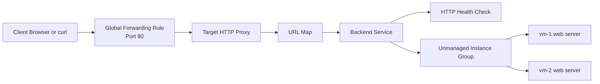
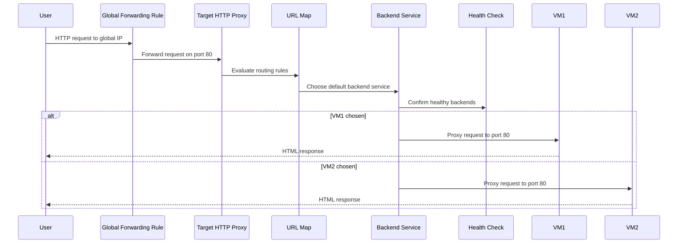
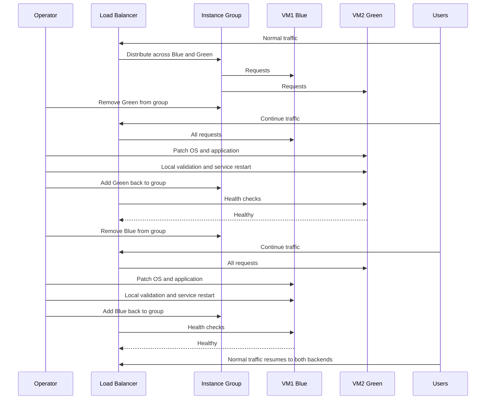
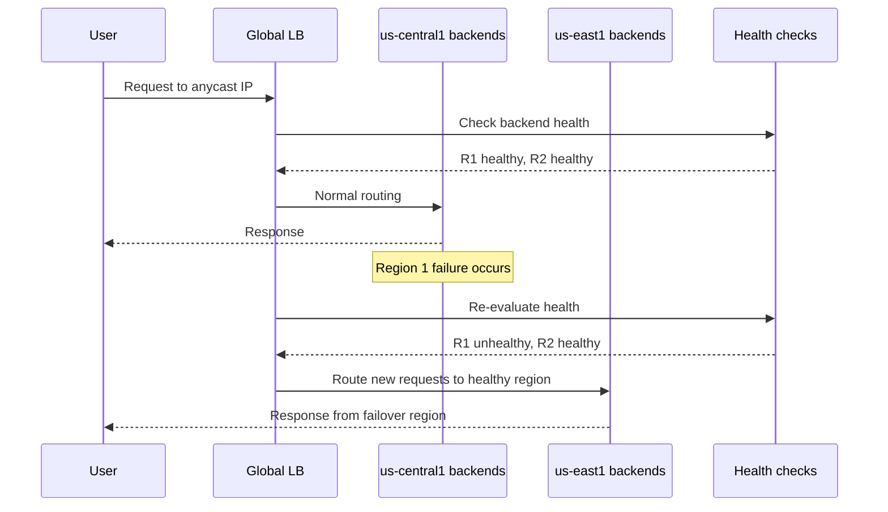
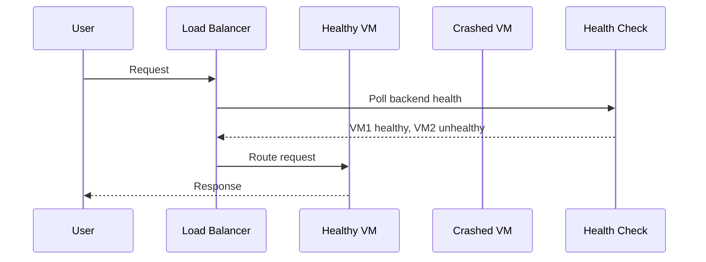
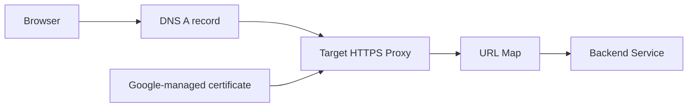
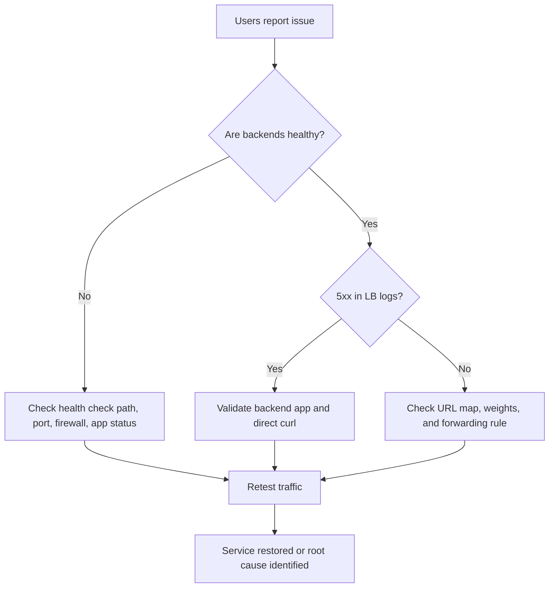

# 🌐 GCP Load Balancing Real-World Scenarios Guide

> A comprehensive field guide for designing, building, operating, patching, and shifting traffic with Google Cloud Load Balancers.
>
> Scope: External HTTP(S), Internal HTTP(S), TCP/UDP, SSL Proxy, TCP Proxy, blue-green cutovers, canary rollouts, multi-region failover, monitoring, and troubleshooting.
>
> Style: command-first, operations-friendly, with diagrams and Terraform.

---

## 📘 How to Use This Guide

- Read **Section 1** if you need to choose the correct load balancer type.
- Read **Section 2** if you want a clean end-to-end HTTP(S) load balancer setup with two Compute Engine VMs.
- Read **Section 3** if you need a **real blue-green runbook** for zero-downtime patching.
- Read **Section 4** if you want **traffic splitting** and **progressive delivery**.
- Read **Section 5** if you need **multi-region global load balancing**, **Cloud CDN**, and **Cloud Armor**.
- Read **Section 6** for scenario-driven operating procedures.
- Read **Section 7** when something is broken.
- Keep **Section 8** open during operations for quick copy/paste commands.

---

## 🧭 Assumptions and Variables

The examples below assume the following values.

```bash
export PROJECT_ID="YOUR_PROJECT_ID"
export REGION="us-central1"
export REGION2="us-east1"
export ZONE="us-central1-a"
export ZONE2="us-central1-b"
export ZONE_R1="us-central1-a"
export ZONE_R2="us-east1-b"
export NETWORK="lb-demo-vpc"
export SUBNET="lb-demo-subnet"
export SUBNET_RANGE="10.10.0.0/24"
export TAG="allow-http"
export HC_NAME="demo-http-hc"
export FIREWALL_RULE="allow-http-health-checks"
export UMIG="demo-web-umig"
export BACKEND_SERVICE="demo-web-bes"
export URL_MAP="demo-web-map"
export TARGET_PROXY="demo-web-proxy"
export FWD_RULE="demo-web-fr"
export BLUE_VM="blue-vm"
export GREEN_VM="green-vm"
export MACHINE_TYPE="e2-micro"
export IMAGE_FAMILY="debian-12"
export IMAGE_PROJECT="debian-cloud"
```

Set the project before running commands.

```bash
gcloud config set project "$PROJECT_ID"
```

Enable the APIs that are commonly required for the scenarios in this document.

```bash
gcloud services enable \
  compute.googleapis.com \
  certificatemanager.googleapis.com \
  monitoring.googleapis.com \
  logging.googleapis.com \
  clouddeploy.googleapis.com
```

---

## 🗂️ Table of Contents

1. [GCP Load Balancer Overview](#1-gcp-load-balancer-overview)
2. [Setting Up HTTP(S) LB with 2 VMs (Step-by-Step)](#2-setting-up-https-lb-with-2-vms-step-by-step)
3. [Blue-Green Deployment with Load Balancer (Real Scenario)](#3-blue-green-deployment-with-load-balancer-real-scenario)
4. [Traffic Splitting with Managed Instance Groups](#4-traffic-splitting-with-managed-instance-groups)
5. [Multi-Region with Global LB](#5-multi-region-with-global-lb)
6. [Real-World Scenarios](#6-real-world-scenarios)
7. [Monitoring & Troubleshooting](#7-monitoring--troubleshooting)
8. [Quick Reference](#8-quick-reference)
9. [Appendix A: Sample Verification Outputs](#appendix-a-sample-verification-outputs)
10. [Appendix B: Cleanup Commands](#appendix-b-cleanup-commands)

---

# 1. GCP Load Balancer Overview

Google Cloud Load Balancing is a managed, software-defined service.
It can distribute traffic across zones, regions, and even multiple backend types.
For operators, the most important design questions are:

- Is the traffic **external** or **internal**?
- Is the protocol **HTTP(S)** or **TCP/UDP**?
- Do you need **proxy-based Layer 7 behavior** or **pass-through Layer 4 behavior**?
- Do you need **global** reach or **regional** control?
- Do you need **Premium Tier** global backbone routing or **Standard Tier** lower-cost routing?

## 1.1 Core Concepts

### External vs Internal

- **External load balancers** accept internet traffic.
- **Internal load balancers** accept traffic from clients inside Google Cloud, connected networks, or hybrid networks.

### Proxy vs Pass-through

- **Proxy load balancers** terminate the client connection and create a new connection to a backend.
- **Pass-through load balancers** preserve source and destination packet flow and do not behave like Layer 7 proxies.

### Global vs Regional

- **Global** means one global frontend and the ability to use backends in multiple regions.
- **Regional** means the frontend is tied to a specific region, even though clients can still reach it globally over the internet.

### Premium vs Standard Tier

- **Premium Tier** uses Google's private backbone end-to-end as much as possible.
- **Standard Tier** keeps traffic closer to the public internet path and is usually cheaper.
- Some advanced load balancer types only support **Premium Tier**.

## 1.2 Types of GCP Load Balancers

### 1.2.1 External HTTP(S) Load Balancer

Use this when:

- You serve public web apps or APIs.
- You need host-based or path-based routing.
- You want SSL termination at the edge.
- You need Cloud CDN, Cloud Armor, or global traffic distribution.

Strengths:

- Layer 7 intelligence.
- Global anycast IP.
- URL maps.
- Backend services.
- Multi-region support.
- CDN integration.
- Armor integration.

### 1.2.2 Internal HTTP(S) Load Balancer

Use this when:

- You want private service-to-service communication.
- You want internal APIs behind a private VIP.
- You need HTTP routing inside a VPC or hybrid network.

Strengths:

- Private access.
- Layer 7 routing for internal services.
- Good fit for microservices.

### 1.2.3 External TCP/UDP Network Load Balancer

Use this when:

- You need Layer 4 pass-through behavior.
- You serve non-HTTP protocols.
- You need very simple high-performance distribution for TCP or UDP.

Strengths:

- Minimal proxy behavior.
- Suitable for custom protocols.
- Regional external design.

### 1.2.4 Internal TCP/UDP Load Balancer

Use this when:

- You want private Layer 4 distribution.
- Your backends are databases, caches, or custom services.
- You do not need Layer 7 routing.

Strengths:

- Private VIP.
- Regional internal service distribution.
- Common for east-west traffic.

### 1.2.5 SSL Proxy Load Balancer

Use this when:

- You need proxy-based handling for SSL/TLS traffic.
- The application is not HTTP, but you still want SSL offload.

Strengths:

- SSL termination.
- Global proxy behavior.
- Better control than simple pass-through for TLS applications.

### 1.2.6 TCP Proxy Load Balancer

Use this when:

- You need a global TCP proxy.
- You want Google Front Ends to terminate TCP and forward to backends.

Strengths:

- Global frontend.
- Proxy semantics.
- Useful for non-HTTP TCP applications.

## 1.3 Comparison Table

| Load balancer type | Layer | External/Internal | Scope | Typical frontend | Common backends | Best use cases | Notes |
|---|---|---|---|---|---|---|---|
| External HTTP(S) LB | L7 | External | Global or Regional depending on mode | Anycast public IP | MIGs, unmanaged groups, NEGs, serverless | Public websites, APIs, global apps | Supports URL maps, CDN, Armor |
| Internal HTTP(S) LB | L7 | Internal | Regional or cross-region internal | Internal IP | MIGs, zonal NEGs, hybrid NEGs | Internal web apps, private APIs | Excellent for microservices |
| External TCP/UDP Network LB | L4 | External | Regional | Regional public IP | Instance groups, backend services | Gaming, SIP, custom TCP/UDP services | Good for pass-through networking |
| Internal TCP/UDP LB | L4 | Internal | Regional | Internal IP | Instance groups, backend services | Private databases, message brokers, caches | Common east-west traffic pattern |
| SSL Proxy LB | L4 proxy | External | Global | Anycast public IP | Backend services | Non-HTTP TLS apps needing proxying | SSL terminates on Google edge |
| TCP Proxy LB | L4 proxy | External | Global | Anycast public IP | Backend services | Global TCP apps needing proxy semantics | Good for durable TCP entrypoint |

## 1.4 Decision Guidance by Requirement

| Requirement | Best first choice | Why |
|---|---|---|
| Public website with TLS and path routing | External HTTP(S) LB | Layer 7 routing plus SSL termination |
| Private service-to-service REST API | Internal HTTP(S) LB | Private VIP and HTTP awareness |
| Private Redis-like custom TCP service | Internal TCP/UDP LB | Internal Layer 4 simplicity |
| Public UDP application | External TCP/UDP Network LB | Pass-through support for UDP |
| Global TCP app with proxy behavior | TCP Proxy LB | Global TCP frontend with Google edge proxies |
| TLS app that is not HTTP | SSL Proxy LB | SSL termination without HTTP semantics |

## 1.5 Premium vs Standard Tier Comparison

| Feature | Premium Tier | Standard Tier |
|---|---|---|
| Routing path | Google global backbone | More public internet dependency |
| Best for | Performance-sensitive, global apps | Cost-optimized regional traffic |
| Latency profile | Lower and more predictable | Can vary more by ISP path |
| Global HTTP(S) features | Strongest fit | Limited depending on product |
| Multi-region strategy | Excellent | Usually not the first choice |

## 1.6 Real-World Use Cases by Type

| Team | Problem | LB choice | Why it works |
|---|---|---|---|
| E-commerce frontend | Serve users globally with TLS | External HTTP(S) LB | Edge termination and global routing |
| Internal platform team | Expose private APIs to GKE and VMs | Internal HTTP(S) LB | Internal VIP and host/path routing |
| Gaming platform | UDP matchmaking endpoint | External TCP/UDP Network LB | Fast Layer 4 pass-through |
| Finance system | Internal FIX/TCP service | Internal TCP/UDP LB | Private connectivity and predictable path |
| Legacy TLS app | Need offload without HTTP routing | SSL Proxy LB | TLS terminates before backend |
| Telco integration | Long-lived TCP sessions worldwide | TCP Proxy LB | Global proxy entrypoint |

## 1.7 Mermaid Architecture Diagram

```mermaid
flowchart TB
    User[Internet / Internal Clients]
    Tier{Traffic type?}
    HTTP[Application Load Balancer\nExternal HTTP(S) / Internal HTTP(S)]
    TCP[Network Load Balancer\nTCP/UDP / TCP Proxy / SSL Proxy]
    Scope{Scope}
    Global[Global frontend\nAnycast IP\nMulti-region]
    Regional[Regional frontend\nSingle region focus]
    Features[Cloud CDN\nCloud Armor\nURL Maps\nTraffic Splitting]
    Backends[Backends\nMIGs\nUMIGs\nNEGs\nServerless]
    User --> Tier
    Tier -->|HTTP or HTTPS| HTTP
    Tier -->|TCP or UDP| TCP
    HTTP --> Scope
    TCP --> Scope
    Scope --> Global
    Scope --> Regional
    Global --> Features
    Regional --> Features
    Features --> Backends
```

## 1.8 Practical Selection Checklist

Before creating a load balancer, answer these questions.

1. Do clients connect from the internet or only privately?
2. Does the application need HTTP-aware routing?
3. Does the application need TLS offload?
4. Does the application need a static global anycast IP?
5. Do you need CDN caching?
6. Do you need WAF or DDoS protection?
7. Do you need weighted rollout or canary logic?
8. Do you need regional data residency?
9. Do you need to preserve client source IP at Layer 4?
10. Do you need connection draining during maintenance?

## 1.9 Operational Notes

- Health checks drive whether a backend receives traffic.
- Firewall rules must allow health check probes.
- Named ports are critical for managed and unmanaged instance groups in many backend-service patterns.
- Connection draining matters during instance removal.
- URL maps are where most Layer 7 routing logic lives.
- Backend services are where health checks, session affinity, draining, logging, CDN, and Cloud Armor are attached.

---

# 2. Setting Up HTTP(S) LB with 2 VMs (Step-by-Step)

This section builds a public HTTP load balancer using:

- 1 VPC
- 1 subnet
- 2 Compute Engine VMs
- 1 unmanaged instance group
- 1 health check
- 1 backend service
- 1 URL map
- 1 target HTTP proxy
- 1 global forwarding rule

## 2.1 Target Architecture



## 2.2 Step 0 - Set Variables

```bash
export PROJECT_ID="YOUR_PROJECT_ID"
export REGION="us-central1"
export ZONE="us-central1-a"
export NETWORK="lb-demo-vpc"
export SUBNET="lb-demo-subnet"
export SUBNET_RANGE="10.10.0.0/24"
export VM1="lb-vm-1"
export VM2="lb-vm-2"
export GROUP="lb-demo-umig"
export HC_NAME="lb-demo-http-hc"
export BACKEND_SERVICE="lb-demo-bes"
export URL_MAP="lb-demo-map"
export TARGET_PROXY="lb-demo-http-proxy"
export FWD_RULE="lb-demo-http-rule"
export TAG="lb-demo-web"
```

## 2.3 Step 1 - Create VPC and Subnet

```bash
gcloud compute networks create "$NETWORK" --subnet-mode=custom

gcloud compute networks subnets create "$SUBNET" \
  --network="$NETWORK" \
  --range="$SUBNET_RANGE" \
  --region="$REGION"
```

## 2.4 Step 2 - Create Firewall Rules

```bash
gcloud compute firewall-rules create allow-http-to-web \
  --network="$NETWORK" \
  --direction=INGRESS \
  --action=ALLOW \
  --rules=tcp:80 \
  --source-ranges=0.0.0.0/0 \
  --target-tags="$TAG"

gcloud compute firewall-rules create allow-gfe-health-checks \
  --network="$NETWORK" \
  --direction=INGRESS \
  --action=ALLOW \
  --rules=tcp:80 \
  --source-ranges=35.191.0.0/16,130.211.0.0/22 \
  --target-tags="$TAG"
```

## 2.5 Step 3 - Create a Startup Script

```bash
cat > startup-web.sh <<'EOF'
#!/bin/bash
apt-get update
apt-get install -y apache2
HOSTNAME=$(hostname)
cat > /var/www/html/index.html <<HTML
<html>
  <body style="font-family:Arial;background:#f5f7fb;padding:40px;">
    <h1>GCP HTTP Load Balancer Demo</h1>
    <p>Served by: ${HOSTNAME}</p>
    <p>Deployment ring: initial</p>
    <p>Timestamp: $(date -u)</p>
  </body>
</html>
HTML
systemctl enable apache2
systemctl restart apache2
EOF
```

## 2.6 Step 4 - Create the 2 VMs

```bash
gcloud compute instances create "$VM1" \
  --zone="$ZONE" \
  --machine-type=e2-micro \
  --subnet="$SUBNET" \
  --tags="$TAG" \
  --metadata-from-file startup-script=startup-web.sh \
  --image-family=debian-12 \
  --image-project=debian-cloud

gcloud compute instances create "$VM2" \
  --zone="$ZONE" \
  --machine-type=e2-micro \
  --subnet="$SUBNET" \
  --tags="$TAG" \
  --metadata-from-file startup-script=startup-web.sh \
  --image-family=debian-12 \
  --image-project=debian-cloud

gcloud compute instances list \
  --filter="name=($VM1 $VM2)" \
  --format="table(name,status,zone,networkInterfaces[0].networkIP)"
```

## 2.7 Step 5 - Create Unmanaged Instance Group and Add VMs

```bash
gcloud compute instance-groups unmanaged create "$GROUP" --zone="$ZONE"

gcloud compute instance-groups unmanaged add-instances "$GROUP" \
  --zone="$ZONE" \
  --instances="$VM1","$VM2"

gcloud compute instance-groups set-named-ports "$GROUP" \
  --zone="$ZONE" \
  --named-ports=http:80

gcloud compute instance-groups unmanaged list-instances "$GROUP" --zone="$ZONE"
```

## 2.8 Step 6 - Create Health Check

```bash
gcloud compute health-checks create http "$HC_NAME" \
  --port=80 \
  --request-path=/ \
  --check-interval=5s \
  --timeout=5s \
  --healthy-threshold=2 \
  --unhealthy-threshold=2

gcloud compute health-checks describe "$HC_NAME"
```

## 2.9 Step 7 - Create Backend Service

```bash
gcloud compute backend-services create "$BACKEND_SERVICE" \
  --protocol=HTTP \
  --port-name=http \
  --health-checks="$HC_NAME" \
  --global \
  --load-balancing-scheme=EXTERNAL_MANAGED \
  --timeout=30s \
  --connection-draining-timeout=30s

gcloud compute backend-services add-backend "$BACKEND_SERVICE" \
  --global \
  --instance-group="$GROUP" \
  --instance-group-zone="$ZONE" \
  --balancing-mode=UTILIZATION \
  --max-utilization=0.8

gcloud compute backend-services describe "$BACKEND_SERVICE" --global
```

## 2.10 Step 8 - Create URL Map

```bash
gcloud compute url-maps create "$URL_MAP" --default-service="$BACKEND_SERVICE"
gcloud compute url-maps validate "$URL_MAP" --global
```

## 2.11 Step 9 - Create Target HTTP Proxy

```bash
gcloud compute target-http-proxies create "$TARGET_PROXY" --url-map="$URL_MAP"
```

## 2.12 Step 10 - Create Global Forwarding Rule

```bash
gcloud compute forwarding-rules create "$FWD_RULE" \
  --global \
  --target-http-proxy="$TARGET_PROXY" \
  --ports=80

LB_IP=$(gcloud compute forwarding-rules describe "$FWD_RULE" \
  --global \
  --format="value(IPAddress)")

echo "$LB_IP"
```

## 2.13 Step 11 - Verify End-to-End Traffic

```bash
for i in $(seq 1 10); do
  curl -s "http://$LB_IP" | grep 'Served by'
  sleep 1
done

gcloud compute backend-services get-health "$BACKEND_SERVICE" --global
```

Sample verification output.

```text
$ gcloud compute backend-services get-health lb-demo-bes --global
---
backend: https://www.googleapis.com/compute/v1/projects/PROJECT/zones/us-central1-a/instanceGroups/lb-demo-umig
status:
  healthStatus:
  - healthState: HEALTHY
    instance: https://www.googleapis.com/compute/v1/projects/PROJECT/zones/us-central1-a/instances/lb-vm-1
    ipAddress: 10.10.0.2
    port: 80
  - healthState: HEALTHY
    instance: https://www.googleapis.com/compute/v1/projects/PROJECT/zones/us-central1-a/instances/lb-vm-2
    ipAddress: 10.10.0.3
    port: 80
```

## 2.14 End-to-End Flow Diagram



## 2.15 Complete Terraform Example

```hcl
terraform {
  required_version = ">= 1.5.0"

  required_providers {
    google = {
      source  = "hashicorp/google"
      version = ">= 5.0"
    }
  }
}

provider "google" {
  project = var.project_id
  region  = var.region
  zone    = var.zone
}

variable "project_id" {
  type = string
}

variable "region" {
  type    = string
  default = "us-central1"
}

variable "zone" {
  type    = string
  default = "us-central1-a"
}

variable "network_name" {
  type    = string
  default = "tf-lb-demo-vpc"
}

variable "subnet_name" {
  type    = string
  default = "tf-lb-demo-subnet"
}

variable "subnet_cidr" {
  type    = string
  default = "10.20.0.0/24"
}

locals {
  startup_script = <<-EOT
    #!/bin/bash
    apt-get update
    apt-get install -y apache2
    HOSTNAME=$(hostname)
    cat > /var/www/html/index.html <<HTML
    <html>
      <body style="font-family:Arial;background:#eef4ff;padding:40px;">
        <h1>Terraform HTTP LB Demo</h1>
        <p>Served by: ${HOSTNAME}</p>
      </body>
    </html>
    HTML
    systemctl enable apache2
    systemctl restart apache2
  EOT
}

resource "google_compute_network" "vpc" {
  name                    = var.network_name
  auto_create_subnetworks = false
}

resource "google_compute_subnetwork" "subnet" {
  name          = var.subnet_name
  ip_cidr_range = var.subnet_cidr
  region        = var.region
  network       = google_compute_network.vpc.id
}

resource "google_compute_firewall" "allow_http" {
  name    = "tf-allow-http"
  network = google_compute_network.vpc.name

  allow {
    protocol = "tcp"
    ports    = ["80"]
  }

  source_ranges = ["0.0.0.0/0"]
  target_tags   = ["tf-lb-web"]
}

resource "google_compute_firewall" "allow_health_checks" {
  name    = "tf-allow-health-checks"
  network = google_compute_network.vpc.name

  allow {
    protocol = "tcp"
    ports    = ["80"]
  }

  source_ranges = [
    "35.191.0.0/16",
    "130.211.0.0/22",
  ]

  target_tags = ["tf-lb-web"]
}

resource "google_compute_instance" "vm1" {
  name         = "tf-lb-vm-1"
  machine_type = "e2-micro"
  zone         = var.zone
  tags         = ["tf-lb-web"]

  boot_disk {
    initialize_params {
      image = "projects/debian-cloud/global/images/family/debian-12"
    }
  }

  network_interface {
    subnetwork = google_compute_subnetwork.subnet.id
    access_config {}
  }

  metadata_startup_script = local.startup_script
}

resource "google_compute_instance" "vm2" {
  name         = "tf-lb-vm-2"
  machine_type = "e2-micro"
  zone         = var.zone
  tags         = ["tf-lb-web"]

  boot_disk {
    initialize_params {
      image = "projects/debian-cloud/global/images/family/debian-12"
    }
  }

  network_interface {
    subnetwork = google_compute_subnetwork.subnet.id
    access_config {}
  }

  metadata_startup_script = local.startup_script
}

resource "google_compute_instance_group" "umig" {
  name = "tf-lb-umig"
  zone = var.zone

  instances = [
    google_compute_instance.vm1.self_link,
    google_compute_instance.vm2.self_link,
  ]

  named_port {
    name = "http"
    port = 80
  }
}

resource "google_compute_health_check" "http" {
  name = "tf-lb-http-hc"

  http_health_check {
    port         = 80
    request_path = "/"
  }

  check_interval_sec  = 5
  timeout_sec         = 5
  healthy_threshold   = 2
  unhealthy_threshold = 2
}

resource "google_compute_backend_service" "default" {
  name                           = "tf-lb-bes"
  protocol                       = "HTTP"
  port_name                      = "http"
  load_balancing_scheme          = "EXTERNAL_MANAGED"
  timeout_sec                    = 30
  connection_draining_timeout_sec = 30
  health_checks                  = [google_compute_health_check.http.id]

  backend {
    group           = google_compute_instance_group.umig.id
    balancing_mode  = "UTILIZATION"
    max_utilization = 0.8
  }

  log_config {
    enable      = true
    sample_rate = 1.0
  }
}

resource "google_compute_url_map" "default" {
  name            = "tf-lb-map"
  default_service = google_compute_backend_service.default.id
}

resource "google_compute_target_http_proxy" "default" {
  name    = "tf-lb-http-proxy"
  url_map = google_compute_url_map.default.id
}

resource "google_compute_global_forwarding_rule" "default" {
  name                  = "tf-lb-http-rule"
  target                = google_compute_target_http_proxy.default.id
  port_range            = "80"
  load_balancing_scheme = "EXTERNAL_MANAGED"
}

output "load_balancer_ip" {
  value = google_compute_global_forwarding_rule.default.ip_address
}
```

## 2.16 Terraform Apply Commands

```bash
terraform init
terraform plan -var="project_id=$PROJECT_ID"
terraform apply -var="project_id=$PROJECT_ID"
```

## 2.17 Validation Checklist

- VPC exists.
- Subnet exists.
- Firewall rules allow HTTP and health checks.
- Both VMs are running.
- Apache is serving port 80.
- Instance group has both VMs.
- Named port is set to `http:80`.
- Health check is healthy.
- Backend service shows one backend group.
- URL map points to the backend service.
- Target HTTP proxy references the URL map.
- Global forwarding rule has a public IP.
- Curl returns alternating backend hostnames over time.

## 2.18 Cleanup for This Lab

```bash
gcloud compute forwarding-rules delete "$FWD_RULE" --global --quiet
gcloud compute target-http-proxies delete "$TARGET_PROXY" --quiet
gcloud compute url-maps delete "$URL_MAP" --quiet
gcloud compute backend-services delete "$BACKEND_SERVICE" --global --quiet
gcloud compute health-checks delete "$HC_NAME" --quiet
gcloud compute instance-groups unmanaged delete "$GROUP" --zone="$ZONE" --quiet
gcloud compute instances delete "$VM1" "$VM2" --zone="$ZONE" --quiet
gcloud compute firewall-rules delete allow-http-to-web allow-gfe-health-checks --quiet
gcloud compute networks subnets delete "$SUBNET" --region="$REGION" --quiet
gcloud compute networks delete "$NETWORK" --quiet
rm -f startup-web.sh
```

---

# 3. 🔄 Blue-Green Deployment with Load Balancer (REAL SCENARIO)

This is the most useful operational pattern in a small VM-based environment.
You have two VMs behind a load balancer.
You want to patch one node at a time without downtime.
The workflow is:

1. Both VM1 (Blue) and VM2 (Green) serve traffic.
2. Remove Green from rotation.
3. Patch Green.
4. Verify Green is healthy.
5. Add Green back.
6. Remove Blue from rotation.
7. Patch Blue.
8. Add Blue back.

## 3.1 Architecture Before Maintenance

```mermaid
flowchart LR
    User[Users]
    LB[External HTTP(S) Load Balancer]
    IG[Unmanaged Instance Group]
    Blue[Blue VM]
    Green[Green VM]
    User --> LB --> IG
    IG --> Blue
    IG --> Green
```

## 3.2 Preparation Commands

```bash
export ZONE="us-central1-a"
export GROUP="blue-green-umig"
export BACKEND_SERVICE="blue-green-bes"
export BLUE_VM="vm1-blue"
export GREEN_VM="vm2-green"

gcloud compute instance-groups unmanaged list-instances "$GROUP" --zone="$ZONE"
gcloud compute backend-services get-health "$BACKEND_SERVICE" --global

LB_IP=$(gcloud compute forwarding-rules describe "$FWD_RULE" \
  --global \
  --format="value(IPAddress)")

echo "$LB_IP"
```

## 3.3 Step 1 - Both VM1 (Blue) and VM2 (Green) Serve Traffic

```bash
for i in $(seq 1 12); do
  curl -s "http://$LB_IP" | grep -E 'Served by|Deployment ring'
  sleep 1
done
```

Sample output.

```text
<p>Served by: vm1-blue</p>
<p>Deployment ring: blue</p>
<p>Served by: vm2-green</p>
<p>Deployment ring: green</p>
```

## 3.4 Step 2 - Remove VM2 from Instance Group so All Traffic Goes to VM1

```bash
gcloud compute instance-groups unmanaged remove-instances "$GROUP" \
  --zone="$ZONE" \
  --instances="$GREEN_VM"

gcloud compute instance-groups unmanaged list-instances "$GROUP" --zone="$ZONE"
gcloud compute backend-services get-health "$BACKEND_SERVICE" --global

for i in $(seq 1 10); do
  curl -s "http://$LB_IP" | grep 'Served by'
  sleep 1
done
```

## 3.5 Step 3 - Update/Patch VM2 While It Is Out of Rotation

```bash
gcloud compute ssh "$GREEN_VM" \
  --zone="$ZONE" \
  --command='sudo apt-get update && sudo apt-get upgrade -y'

gcloud compute ssh "$GREEN_VM" \
  --zone="$ZONE" \
  --command='cat <<EOF | sudo tee /var/www/html/index.html
<html>
  <body style="font-family:Arial;background:#e8fff1;padding:40px;">
    <h1>Patched Green Node</h1>
    <p>Served by: vm2-green</p>
    <p>Deployment ring: green-patched</p>
    <p>Status: ready-for-rejoin</p>
  </body>
</html>
EOF
sudo systemctl restart apache2'

GREEN_IP=$(gcloud compute instances describe "$GREEN_VM" \
  --zone="$ZONE" \
  --format='value(networkInterfaces[0].accessConfigs[0].natIP)')

curl -s "http://$GREEN_IP" | grep -E 'Patched Green Node|Status'
```

## 3.6 Step 4 - Verify VM2 Is Healthy

```bash
gcloud compute instance-groups unmanaged add-instances "$GROUP" \
  --zone="$ZONE" \
  --instances="$GREEN_VM"

for i in $(seq 1 12); do
  echo "Attempt $i"
  gcloud compute backend-services get-health "$BACKEND_SERVICE" --global
  sleep 5
done
```

Healthy example.

```text
healthStatus:
- healthState: HEALTHY
  instance: .../instances/vm1-blue
- healthState: HEALTHY
  instance: .../instances/vm2-green
```

## 3.7 Step 5 - Add VM2 Back to Rotation

```bash
for i in $(seq 1 12); do
  curl -s "http://$LB_IP" | grep -E 'Served by|Deployment ring'
  sleep 1
done
```

## 3.8 Step 6 - Remove VM1 from Instance Group so All Traffic Goes to VM2

```bash
gcloud compute instance-groups unmanaged remove-instances "$GROUP" \
  --zone="$ZONE" \
  --instances="$BLUE_VM"

gcloud compute instance-groups unmanaged list-instances "$GROUP" --zone="$ZONE"

for i in $(seq 1 10); do
  curl -s "http://$LB_IP" | grep 'Served by'
  sleep 1
done
```

## 3.9 Step 7 - Update/Patch VM1

```bash
gcloud compute ssh "$BLUE_VM" \
  --zone="$ZONE" \
  --command='sudo apt-get update && sudo apt-get upgrade -y'

gcloud compute ssh "$BLUE_VM" \
  --zone="$ZONE" \
  --command='cat <<EOF | sudo tee /var/www/html/index.html
<html>
  <body style="font-family:Arial;background:#eef3ff;padding:40px;">
    <h1>Patched Blue Node</h1>
    <p>Served by: vm1-blue</p>
    <p>Deployment ring: blue-patched</p>
    <p>Status: ready-for-rejoin</p>
  </body>
</html>
EOF
sudo systemctl restart apache2'

BLUE_IP=$(gcloud compute instances describe "$BLUE_VM" \
  --zone="$ZONE" \
  --format='value(networkInterfaces[0].accessConfigs[0].natIP)')

curl -s "http://$BLUE_IP" | grep -E 'Patched Blue Node|Status'
```

## 3.10 Step 8 - Add VM1 Back so Both VMs Serve Traffic Again

```bash
gcloud compute instance-groups unmanaged add-instances "$GROUP" \
  --zone="$ZONE" \
  --instances="$BLUE_VM"

for i in $(seq 1 12); do
  echo "Health attempt $i"
  gcloud compute backend-services get-health "$BACKEND_SERVICE" --global
  sleep 5
done

for i in $(seq 1 20); do
  curl -s "http://$LB_IP" | grep -E 'Served by|Deployment ring'
  sleep 1
done
```

## 3.11 Full Sequence Diagram



## 3.12 Verification Commands Cheat Sheet

```bash
gcloud compute instance-groups unmanaged list-instances "$GROUP" --zone="$ZONE"
gcloud compute backend-services get-health "$BACKEND_SERVICE" --global
gcloud compute forwarding-rules describe "$FWD_RULE" --global --format='value(IPAddress)'
curl -s "http://$BLUE_IP"
curl -s "http://$GREEN_IP"
gcloud compute backend-services describe "$BACKEND_SERVICE" --global
```

## 3.13 Why This Pattern Works

- The load balancer only sends traffic to backends that are currently part of the backend group and healthy.
- Removing a VM from the group is a simple maintenance isolation mechanism.
- Health checks make rejoin safer than immediately trusting a patch operation.
- With connection draining enabled, in-flight requests are less likely to break during removal.

## 3.14 Rollback Strategy

1. Keep the bad node out of the group.
2. Restore the previous package version or app release.
3. Test the node directly.
4. Add it back only after health checks pass.
5. Never remove the remaining healthy node until the first one is clean.

---

# 4. 🎚️ Traffic Splitting with Managed Instance Groups

A/B testing and canary rollouts are usually easier with **managed instance groups (MIGs)**.
Instead of moving individual VMs in and out, you run separate blue and green groups.
Then the load balancer decides how much traffic each backend service receives.

## 4.1 Reference Architecture

```mermaid
flowchart LR
    Client[Clients]
    LB[Global External HTTP(S) LB]
    Proxy[Target HTTP Proxy]
    Map[URL Map with weighted backends]
    BlueSvc[Backend Service Blue]
    GreenSvc[Backend Service Green]
    BlueMIG[Blue MIG]
    GreenMIG[Green MIG]
    Client --> LB --> Proxy --> Map
    Map -->|weight 90| BlueSvc --> BlueMIG
    Map -->|weight 10| GreenSvc --> GreenMIG
```

## 4.2 Create Instance Templates

```bash
gcloud compute instance-templates create blue-template-v1 \
  --machine-type=e2-micro \
  --subnet="$SUBNET" \
  --tags="$TAG" \
  --metadata=startup-script='#! /bin/bash
apt-get update
apt-get install -y apache2
cat <<EOF > /var/www/html/index.html
<html><body><h1>BLUE v1</h1><p>Ring: blue</p><p>Host: $(hostname)</p></body></html>
EOF
systemctl restart apache2' \
  --image-family=debian-12 \
  --image-project=debian-cloud

gcloud compute instance-templates create green-template-v2 \
  --machine-type=e2-micro \
  --subnet="$SUBNET" \
  --tags="$TAG" \
  --metadata=startup-script='#! /bin/bash
apt-get update
apt-get install -y apache2
cat <<EOF > /var/www/html/index.html
<html><body><h1>GREEN v2</h1><p>Ring: green</p><p>Host: $(hostname)</p></body></html>
EOF
systemctl restart apache2' \
  --image-family=debian-12 \
  --image-project=debian-cloud
```

## 4.3 Create Managed Instance Groups

```bash
gcloud compute instance-groups managed create blue-mig --zone="$ZONE" --size=2 --template=blue-template-v1
gcloud compute instance-groups managed create green-mig --zone="$ZONE" --size=2 --template=green-template-v2
gcloud compute instance-groups managed set-named-ports blue-mig --zone="$ZONE" --named-ports=http:80
gcloud compute instance-groups managed set-named-ports green-mig --zone="$ZONE" --named-ports=http:80
```

## 4.4 Create Health Check

```bash
gcloud compute health-checks create http split-hc --port=80 --request-path=/
```

## 4.5 Create Blue and Green Backend Services

```bash
gcloud compute backend-services create blue-bes \
  --global \
  --protocol=HTTP \
  --port-name=http \
  --health-checks=split-hc \
  --load-balancing-scheme=EXTERNAL_MANAGED

gcloud compute backend-services add-backend blue-bes \
  --global \
  --instance-group=blue-mig \
  --instance-group-zone="$ZONE"

gcloud compute backend-services create green-bes \
  --global \
  --protocol=HTTP \
  --port-name=http \
  --health-checks=split-hc \
  --load-balancing-scheme=EXTERNAL_MANAGED

gcloud compute backend-services add-backend green-bes \
  --global \
  --instance-group=green-mig \
  --instance-group-zone="$ZONE"
```

## 4.6 URL Map with `weightedBackendServices`

### 4.6.1 Initial 100/0 Split

```yaml
# url-map-100-0.yaml
defaultService: https://www.googleapis.com/compute/v1/projects/PROJECT_ID/global/backendServices/blue-bes
name: split-map
hostRules:
- hosts:
  - "*"
  pathMatcher: allpaths
pathMatchers:
- name: allpaths
  defaultRouteAction:
    weightedBackendServices:
    - backendService: https://www.googleapis.com/compute/v1/projects/PROJECT_ID/global/backendServices/blue-bes
      weight: 1000
    - backendService: https://www.googleapis.com/compute/v1/projects/PROJECT_ID/global/backendServices/green-bes
      weight: 0
```

```bash
gcloud compute url-maps import split-map --global --source=url-map-100-0.yaml
gcloud compute target-http-proxies create split-http-proxy --url-map=split-map
gcloud compute forwarding-rules create split-http-rule --global --target-http-proxy=split-http-proxy --ports=80
SPLIT_IP=$(gcloud compute forwarding-rules describe split-http-rule --global --format='value(IPAddress)')
echo "$SPLIT_IP"
```

### 4.6.2 Shift to 90/10

```yaml
# url-map-90-10.yaml
defaultService: https://www.googleapis.com/compute/v1/projects/PROJECT_ID/global/backendServices/blue-bes
name: split-map
hostRules:
- hosts:
  - "*"
  pathMatcher: allpaths
pathMatchers:
- name: allpaths
  defaultRouteAction:
    weightedBackendServices:
    - backendService: https://www.googleapis.com/compute/v1/projects/PROJECT_ID/global/backendServices/blue-bes
      weight: 900
    - backendService: https://www.googleapis.com/compute/v1/projects/PROJECT_ID/global/backendServices/green-bes
      weight: 100
```

```bash
gcloud compute url-maps import split-map --global --source=url-map-90-10.yaml
```

### 4.6.3 Shift to 50/50

```yaml
# url-map-50-50.yaml
defaultService: https://www.googleapis.com/compute/v1/projects/PROJECT_ID/global/backendServices/blue-bes
name: split-map
hostRules:
- hosts:
  - "*"
  pathMatcher: allpaths
pathMatchers:
- name: allpaths
  defaultRouteAction:
    weightedBackendServices:
    - backendService: https://www.googleapis.com/compute/v1/projects/PROJECT_ID/global/backendServices/blue-bes
      weight: 500
    - backendService: https://www.googleapis.com/compute/v1/projects/PROJECT_ID/global/backendServices/green-bes
      weight: 500
```

```bash
gcloud compute url-maps import split-map --global --source=url-map-50-50.yaml
```

### 4.6.4 Shift to 0/100

```yaml
# url-map-0-100.yaml
defaultService: https://www.googleapis.com/compute/v1/projects/PROJECT_ID/global/backendServices/green-bes
name: split-map
hostRules:
- hosts:
  - "*"
  pathMatcher: allpaths
pathMatchers:
- name: allpaths
  defaultRouteAction:
    weightedBackendServices:
    - backendService: https://www.googleapis.com/compute/v1/projects/PROJECT_ID/global/backendServices/blue-bes
      weight: 0
    - backendService: https://www.googleapis.com/compute/v1/projects/PROJECT_ID/global/backendServices/green-bes
      weight: 1000
```

```bash
gcloud compute url-maps import split-map --global --source=url-map-0-100.yaml
```

## 4.7 Verification Commands for Each Stage

```bash
for i in $(seq 1 50); do
  curl -s "http://$SPLIT_IP" | grep -oE 'BLUE v1|GREEN v2'
done | sort | uniq -c

gcloud compute url-maps describe split-map --global
gcloud compute backend-services get-health blue-bes --global
gcloud compute backend-services get-health green-bes --global
```

## 4.8 Cloud Deploy Canary Pattern

```yaml
apiVersion: deploy.cloud.google.com/v1
kind: DeliveryPipeline
metadata:
  name: web-canary-pipeline
serialPipeline:
  stages:
  - targetId: canary-10
    profiles: ["10-percent"]
  - targetId: canary-50
    profiles: ["50-percent"]
  - targetId: production
    profiles: ["100-percent-green"]
```

```bash
gcloud deploy releases create release-001 \
  --delivery-pipeline=web-canary-pipeline \
  --region="$REGION" \
  --source=. \
  --skaffold-file=skaffold.yaml

gcloud compute url-maps import split-map --global --source=url-map-90-10.yaml
gcloud compute url-maps import split-map --global --source=url-map-50-50.yaml
gcloud compute url-maps import split-map --global --source=url-map-0-100.yaml
```

## 4.9 Mermaid Diagram for Progressive Delivery

```mermaid
flowchart LR
    Build[CI Build]
    Template[Create new green instance template]
    MIG[Roll out green MIG]
    Stage1[Import 90/10 URL map]
    Observe1[Observe logs and metrics]
    Stage2[Import 50/50 URL map]
    Observe2[Observe latency and errors]
    Stage3[Import 0/100 URL map]
    Stable[Green becomes primary]
    Build --> Template --> MIG --> Stage1 --> Observe1 --> Stage2 --> Observe2 --> Stage3 --> Stable
```



## 4.10 Rollback Commands

```bash
gcloud compute url-maps import split-map --global --source=url-map-100-0.yaml
gcloud compute instance-groups managed rolling-action start-update green-mig \
  --zone="$ZONE" \
  --version=template=green-template-v1
```

## 4.11 Operational Advice

- Keep blue and green backend services separate.
- Prefer new instance templates over in-place VM patching for stateless services.
- Use request logs and error-rate metrics before increasing traffic.
- Shift traffic in small increments for risky changes.
- Keep rollback YAML ready before the rollout begins.

---

# 5. 🌍 Multi-Region with Global LB

A global external HTTP(S) load balancer can serve traffic from multiple regions behind one anycast IP.
This is a common pattern for:

- Disaster recovery.
- Latency optimization.
- Regional maintenance windows.
- High availability.
- Edge caching with Cloud CDN.
- DDoS and WAF protection with Cloud Armor.

## 5.1 Reference Architecture

```mermaid
flowchart TB
    Users[Global Users]
    Edge[Global External HTTP(S) LB\nAnycast IP]
    Armor[Cloud Armor Policy]
    CDN[Cloud CDN]
    BES[Global Backend Service]
    R1[us-central1 MIG]
    R2[us-east1 MIG]
    HC[HTTP Health Check]
    Users --> Edge --> Armor --> CDN --> BES
    BES --> R1
    BES --> R2
    BES --> HC
```

## 5.2 Build Regional Backends in Two Regions

```bash
gcloud compute instance-templates create global-web-template \
  --machine-type=e2-micro \
  --network="$NETWORK" \
  --subnet="$SUBNET" \
  --tags="$TAG" \
  --metadata=startup-script='#! /bin/bash
apt-get update
apt-get install -y apache2
ZONE=$(curl -H "Metadata-Flavor: Google" http://metadata.google.internal/computeMetadata/v1/instance/zone | awk -F/ "{print \$4}")
cat <<EOF > /var/www/html/index.html
<html><body><h1>Multi-region service</h1><p>Zone: ${ZONE}</p><p>Host: $(hostname)</p></body></html>
EOF
systemctl restart apache2' \
  --image-family=debian-12 \
  --image-project=debian-cloud

gcloud compute instance-groups managed create web-us-central1 \
  --base-instance-name=web-uc1 \
  --size=2 \
  --template=global-web-template \
  --zone=us-central1-a

gcloud compute instance-groups managed create web-us-east1 \
  --base-instance-name=web-ue1 \
  --size=2 \
  --template=global-web-template \
  --zone=us-east1-b

gcloud compute instance-groups managed set-named-ports web-us-central1 --zone=us-central1-a --named-ports=http:80
gcloud compute instance-groups managed set-named-ports web-us-east1 --zone=us-east1-b --named-ports=http:80
```

## 5.3 Create Health Check and Global Backend Service

```bash
gcloud compute health-checks create http global-web-hc --port=80 --request-path=/

gcloud compute backend-services create global-web-bes \
  --global \
  --protocol=HTTP \
  --port-name=http \
  --health-checks=global-web-hc \
  --load-balancing-scheme=EXTERNAL_MANAGED \
  --enable-logging \
  --logging-sample-rate=1.0

gcloud compute backend-services add-backend global-web-bes \
  --global \
  --instance-group=web-us-central1 \
  --instance-group-zone=us-central1-a \
  --balancing-mode=UTILIZATION \
  --max-utilization=0.8

gcloud compute backend-services add-backend global-web-bes \
  --global \
  --instance-group=web-us-east1 \
  --instance-group-zone=us-east1-b \
  --balancing-mode=UTILIZATION \
  --max-utilization=0.8
```

## 5.4 Create URL Map, Proxy, and Forwarding Rule

```bash
gcloud compute url-maps create global-web-map --default-service=global-web-bes
gcloud compute target-http-proxies create global-web-proxy --url-map=global-web-map
gcloud compute forwarding-rules create global-web-fr --global --target-http-proxy=global-web-proxy --ports=80
GLOBAL_IP=$(gcloud compute forwarding-rules describe global-web-fr --global --format='value(IPAddress)')
echo "$GLOBAL_IP"
```

## 5.5 Automatic Failover Between Regions

```bash
gcloud compute backend-services get-health global-web-bes --global

for vm in $(gcloud compute instances list --filter='zone:us-central1-a AND name~^web-uc1' --format='value(name)'); do
  gcloud compute ssh "$vm" --zone=us-central1-a --command='sudo systemctl stop apache2'
done

for i in $(seq 1 20); do
  curl -s "http://$GLOBAL_IP" | grep 'Zone:'
  sleep 1
done

gcloud compute instance-groups managed resize web-us-central1 --zone=us-central1-a --size=2
```

## 5.6 Cloud CDN Integration

```bash
gcloud compute backend-services update global-web-bes --global --enable-cdn
gcloud compute backend-services describe global-web-bes --global
curl -I "http://$GLOBAL_IP"
```

## 5.7 Cloud Armor for DDoS Protection

```bash
gcloud compute security-policies create web-armor-policy \
  --description="Protect global web service"

gcloud compute security-policies rules create 1000 \
  --security-policy=web-armor-policy \
  --expression="origin.region_code == 'CN'" \
  --action=deny-403 \
  --description="Example geo block"

gcloud compute backend-services update global-web-bes \
  --global \
  --security-policy=web-armor-policy

gcloud compute backend-services describe global-web-bes --global
```

## 5.8 HTTPS Extension with Google-Managed Certificates

```bash
gcloud compute addresses create global-https-ip --global

gcloud compute ssl-certificates create web-managed-cert \
  --domains=app.example.com

gcloud compute target-https-proxies create global-web-https-proxy \
  --url-map=global-web-map \
  --ssl-certificates=web-managed-cert

gcloud compute forwarding-rules create global-web-https-fr \
  --global \
  --target-https-proxy=global-web-https-proxy \
  --ports=443 \
  --address=global-https-ip

gcloud compute ssl-certificates describe web-managed-cert
```

## 5.9 Mermaid Diagram for Multi-Region Failover



## 5.10 Multi-Region Runbook Summary

- Keep at least two regions for mission-critical services.
- Use identical instance templates or deployment pipelines across regions.
- Verify health independently in each region.
- Test failover quarterly.
- Combine Cloud CDN and Cloud Armor on internet-facing services.
- Use Premium Tier for the best global user experience.

---

# 6. Real-World Scenarios

This section turns the concepts above into operator runbooks.
Each scenario includes problem, architecture, commands, verification, and Mermaid diagrams.

## Scenario Index

1. Zero-downtime patching of a 2-VM web app.
2. Canary deployment with traffic splitting.
3. Auto-failover when one VM crashes.
4. Autoscaling with managed instance groups during peak.
5. SSL termination with Google-managed certificates.
6. Internal load balancer for microservices.

---

## 6.1 Scenario 1: Zero-Downtime Patching of a 2-VM Web App

### Problem

A small production web app has only two VMs and must be patched without downtime.

### Architecture

- External HTTP load balancer.
- Unmanaged instance group.
- Two VMs.
- Health checks.
- Connection draining.

### Mermaid Diagram

```mermaid
flowchart LR
    Users[Users] --> LB[HTTP(S) Load Balancer]
    LB --> Blue[VM1 Blue]
    LB --> Green[VM2 Green]
    Ops[Ops engineer] -->|remove, patch, re-add| Blue
    Ops -->|remove, patch, re-add| Green
```

### Commands

```bash
export GROUP="prod-web-umig"
export BACKEND_SERVICE="prod-web-bes"
export BLUE_VM="prod-web-1"
export GREEN_VM="prod-web-2"
export ZONE="us-central1-a"
export LB_IP=$(gcloud compute forwarding-rules describe prod-web-fr --global --format='value(IPAddress)')

gcloud compute instance-groups unmanaged list-instances "$GROUP" --zone="$ZONE"
gcloud compute backend-services get-health "$BACKEND_SERVICE" --global

gcloud compute instance-groups unmanaged remove-instances "$GROUP" --zone="$ZONE" --instances="$GREEN_VM"
for i in $(seq 1 15); do curl -s "http://$LB_IP" | grep 'Served by'; sleep 1; done

gcloud compute ssh "$GREEN_VM" --zone="$ZONE" --command='sudo apt-get update && sudo apt-get dist-upgrade -y && sudo systemctl restart apache2'
GREEN_IP=$(gcloud compute instances describe "$GREEN_VM" --zone="$ZONE" --format='value(networkInterfaces[0].accessConfigs[0].natIP)')
curl -s "http://$GREEN_IP" | head

gcloud compute instance-groups unmanaged add-instances "$GROUP" --zone="$ZONE" --instances="$GREEN_VM"
for i in $(seq 1 12); do gcloud compute backend-services get-health "$BACKEND_SERVICE" --global; sleep 5; done

gcloud compute instance-groups unmanaged remove-instances "$GROUP" --zone="$ZONE" --instances="$BLUE_VM"
gcloud compute ssh "$BLUE_VM" --zone="$ZONE" --command='sudo apt-get update && sudo apt-get dist-upgrade -y && sudo systemctl restart apache2'
gcloud compute instance-groups unmanaged add-instances "$GROUP" --zone="$ZONE" --instances="$BLUE_VM"
for i in $(seq 1 20); do curl -s "http://$LB_IP" | grep 'Served by'; sleep 1; done
```

### Verification

- `get-health` shows both nodes healthy.
- Curl never fails during maintenance.
- Both patched nodes return current version identifiers.

### Lessons Learned

- Patch the standby node first.
- Rejoin only after health checks succeed.
- Always keep rollback ready.

---

## 6.2 Scenario 2: Canary Deployment with Traffic Splitting

### Problem

A new application version is risky and only 10% of production traffic should reach it initially.

### Mermaid Diagram

```mermaid
flowchart TB
    User[Production Users]
    LB[Global HTTP(S) LB]
    Map[URL map\nweightedBackendServices]
    BlueSvc[blue-bes 90]
    GreenSvc[green-bes 10]
    BlueMIG[blue-mig v1]
    GreenMIG[green-mig v2]
    User --> LB --> Map
    Map --> BlueSvc --> BlueMIG
    Map --> GreenSvc --> GreenMIG
```

### Commands

```bash
gcloud compute instance-templates create web-v2-template \
  --machine-type=e2-micro \
  --subnet="$SUBNET" \
  --tags="$TAG" \
  --metadata=startup-script='#! /bin/bash
apt-get update
apt-get install -y apache2
echo "<html><body><h1>Version 2</h1><p>Canary build</p></body></html>" | tee /var/www/html/index.html
systemctl restart apache2' \
  --image-family=debian-12 \
  --image-project=debian-cloud

gcloud compute instance-groups managed rolling-action start-update green-mig \
  --zone="$ZONE" \
  --version=template=web-v2-template

gcloud compute url-maps import split-map --global --source=url-map-90-10.yaml
for i in $(seq 1 100); do curl -s "http://$SPLIT_IP" | grep -oE 'Version 1|Version 2'; done | sort | uniq -c

gcloud compute url-maps import split-map --global --source=url-map-50-50.yaml
gcloud compute url-maps import split-map --global --source=url-map-0-100.yaml
```

### Verification

```bash
gcloud compute backend-services get-health blue-bes --global
gcloud compute backend-services get-health green-bes --global
gcloud logging read 'resource.type="http_load_balancer" AND httpRequest.requestUrl:"/"' --limit=20 --format=json
```

### Lessons Learned

- Raise traffic gradually.
- Watch logs and metrics between shifts.
- Make rollback faster than promotion.

---

## 6.3 Scenario 3: Auto-Failover When One VM Crashes

### Problem

One backend VM crashes and the application must remain available without operator intervention.

### Mermaid Diagram



### Commands

```bash
gcloud compute backend-services get-health "$BACKEND_SERVICE" --global
gcloud compute ssh "$GREEN_VM" --zone="$ZONE" --command='sudo systemctl stop apache2'
for i in $(seq 1 12); do gcloud compute backend-services get-health "$BACKEND_SERVICE" --global; sleep 5; done
for i in $(seq 1 20); do curl -s "http://$LB_IP" | grep 'Served by'; sleep 1; done
gcloud compute ssh "$GREEN_VM" --zone="$ZONE" --command='sudo systemctl start apache2'
for i in $(seq 1 12); do gcloud compute backend-services get-health "$BACKEND_SERVICE" --global; sleep 5; done
```

### Verification

- Observe `UNHEALTHY` followed by `HEALTHY` after recovery.
- Curl continues to succeed during the fault.

---

## 6.4 Scenario 4: Autoscaling with Managed Instance Groups During Peak

### Problem

Traffic spikes during a sale event and the service needs to scale horizontally.

### Mermaid Diagram

```mermaid
flowchart LR
    Traffic[Traffic spike] --> LB[HTTP(S) LB]
    LB --> MIG[Managed Instance Group]
    MIG --> AS[Autoscaler]
    AS --> N2[2 instances]
    AS --> N4[4 instances]
    AS --> N8[8 instances]
```

### Commands

```bash
gcloud compute instance-groups managed set-autoscaling blue-mig \
  --zone="$ZONE" \
  --min-num-replicas=2 \
  --max-num-replicas=8 \
  --target-cpu-utilization=0.6 \
  --cool-down-period=60

gcloud compute instance-groups managed describe blue-mig --zone="$ZONE"
for i in $(seq 1 500); do curl -s "http://$SPLIT_IP" >/dev/null & done
wait
gcloud compute instance-groups managed list-instances blue-mig --zone="$ZONE"
gcloud compute instance-groups managed describe blue-mig --zone="$ZONE" --format='value(targetSize)'
```

### Verification

- MIG target size increases beyond the minimum.
- New instances pass health checks before receiving traffic.

---

## 6.5 Scenario 5: SSL Termination with Google-Managed Certificates

### Problem

The application team wants HTTPS without managing certificate renewal manually.

### Mermaid Diagram



### Commands

```bash
gcloud compute addresses create web-prod-ip --global
gcloud compute ssl-certificates create web-prod-cert --domains=www.example.com,example.com
gcloud compute target-https-proxies create web-prod-https-proxy --url-map=global-web-map --ssl-certificates=web-prod-cert
gcloud compute forwarding-rules create web-prod-https-fr --global --target-https-proxy=web-prod-https-proxy --ports=443 --address=web-prod-ip

gcloud compute url-maps import redirect-map --global --source=redirect-map.yaml
gcloud compute target-http-proxies create redirect-http-proxy --url-map=redirect-map
gcloud compute forwarding-rules create redirect-http-fr --global --target-http-proxy=redirect-http-proxy --ports=80 --address=web-prod-ip
```

### Verification

```bash
gcloud compute ssl-certificates describe web-prod-cert
curl -I http://www.example.com
curl -I https://www.example.com
```

### Lessons Learned

- DNS correctness is part of the certificate deployment.
- HTTP redirect plus HTTPS rule provides a clean user experience.

---

## 6.6 Scenario 6: Internal LB for Microservices (Backend Services)

### Problem

Frontend services in one subnet must call private backend APIs in another subnet without using public internet paths.

### Mermaid Diagram

```mermaid
flowchart TB
    FE[Frontend service VM/GKE]
    ILB[Internal HTTP(S) LB\nPrivate VIP]
    URLMap[Internal URL map]
    BES[Backend service]
    API1[api-v1 instances]
    API2[api-v2 instances]
    FE --> ILB --> URLMap --> BES
    BES --> API1
    BES --> API2
```

### Commands

```bash
gcloud compute networks subnets create ilb-proxy-subnet \
  --purpose=REGIONAL_MANAGED_PROXY \
  --role=ACTIVE \
  --region="$REGION" \
  --network="$NETWORK" \
  --range=10.129.0.0/23

gcloud compute networks subnets create api-subnet --region="$REGION" --network="$NETWORK" --range=10.130.0.0/24

gcloud compute instance-templates create api-template-v1 \
  --machine-type=e2-micro \
  --subnet=api-subnet \
  --tags=api-backend \
  --metadata=startup-script='#! /bin/bash
apt-get update
apt-get install -y apache2
echo "api-v1 $(hostname)" | tee /var/www/html/index.html
systemctl restart apache2' \
  --image-family=debian-12 \
  --image-project=debian-cloud

gcloud compute instance-groups managed create api-mig --zone="$ZONE" --size=2 --template=api-template-v1
gcloud compute instance-groups managed set-named-ports api-mig --zone="$ZONE" --named-ports=http:80
gcloud compute health-checks create http api-hc --region="$REGION" --port=80 --request-path=/
gcloud compute backend-services create api-ilb-bes --region="$REGION" --protocol=HTTP --health-checks=api-hc --load-balancing-scheme=INTERNAL_MANAGED --port-name=http
gcloud compute backend-services add-backend api-ilb-bes --region="$REGION" --instance-group=api-mig --instance-group-zone="$ZONE"
gcloud compute url-maps create api-ilb-map --region="$REGION" --default-service=api-ilb-bes
gcloud compute target-http-proxies create api-ilb-proxy --region="$REGION" --url-map=api-ilb-map
gcloud compute forwarding-rules create api-ilb-fr --region="$REGION" --load-balancing-scheme=INTERNAL_MANAGED --network="$NETWORK" --subnet=api-subnet --address=10.130.0.10 --ports=80 --target-http-proxy=api-ilb-proxy --target-http-proxy-region="$REGION"
```

### Verification

```bash
curl -s http://10.130.0.10
gcloud compute backend-services get-health api-ilb-bes --region="$REGION"
```

### Lessons Learned

- Internal L7 is ideal when private routing and path control are both needed.
- Standardize private VIP naming and firewall rules early.

---

# 7. Monitoring & Troubleshooting

Good load balancing operations depend on four things: metrics, logs, health checks, and safe change practices.

## 7.1 Cloud Monitoring Metrics to Watch

| Metric area | Why it matters | What to look for |
|---|---|---|
| Request count | Traffic trend | Sudden drops or spikes |
| Backend latency | User experience | Increased p95/p99 latency |
| HTTP response code count | Error visibility | 4xx and 5xx changes |
| Backend request count | Distribution health | One backend receiving zero unexpectedly |
| Healthy backend count | Availability | Backends falling out of service |
| SSL proxy or TCP proxy connections | Capacity | Connection exhaustion or unusual spikes |
| CDN cache hit ratio | Edge efficiency | Falling ratio may increase origin load |
| Armor denied request count | Attack or policy effect | Unexpected blocks or threat spikes |

## 7.2 Logging

### Request Logs

```bash
gcloud compute backend-services update "$BACKEND_SERVICE" --global --enable-logging --logging-sample-rate=1.0
gcloud logging read 'resource.type="http_load_balancer"' --limit=20 --format='table(timestamp,httpRequest.requestMethod,httpRequest.requestUrl,httpRequest.status)'
```

### Health Check Logs

```bash
gcloud logging read 'resource.type="http_health_check" OR logName:"healthchecks"' --limit=20 --format=json
```

### Firewall Rule Logs

```bash
gcloud logging read 'resource.type="gce_firewall_rule"' --limit=20 --format=json
```

## 7.3 Common Issues and How to Fix Them

### Issue 1 - 502 Errors from the Load Balancer

Typical causes:

- Backend process is down.
- Health check path is wrong.
- App is listening on the wrong port.
- Named port does not match the actual backend port.
- Firewall blocks health probes.

```bash
gcloud compute backend-services get-health "$BACKEND_SERVICE" --global
gcloud compute backend-services describe "$BACKEND_SERVICE" --global
gcloud compute health-checks describe "$HC_NAME"
curl -I "http://$BLUE_IP"
curl -I "http://$GREEN_IP"
gcloud compute ssh "$BLUE_VM" --zone="$ZONE" --command='sudo systemctl status apache2 --no-pager'
gcloud compute ssh "$BLUE_VM" --zone="$ZONE" --command='sudo ss -ltnp | grep :80'
```

### Issue 2 - Health Check Failures

Probe ranges to remember:

- `35.191.0.0/16`
- `130.211.0.0/22`

```bash
gcloud compute firewall-rules list --format='table(name,network,direction,allowed,sourceRanges,targetTags)'
```

### Issue 3 - Only One Backend Gets Traffic

```bash
gcloud compute backend-services describe "$BACKEND_SERVICE" --global --format='value(sessionAffinity)'
gcloud compute url-maps describe split-map --global
```

### Issue 4 - SSL Certificate Stays in PROVISIONING

```bash
gcloud compute ssl-certificates describe web-managed-cert
```

### Issue 5 - Connection Drops During Maintenance

```bash
gcloud compute backend-services describe "$BACKEND_SERVICE" --global --format='value(connectionDraining.drainingTimeoutSec)'
gcloud compute backend-services update "$BACKEND_SERVICE" --global --connection-draining-timeout=60s
```

## 7.4 Connection Draining

```bash
gcloud compute backend-services create drain-aware-bes \
  --global \
  --protocol=HTTP \
  --port-name=http \
  --health-checks="$HC_NAME" \
  --load-balancing-scheme=EXTERNAL_MANAGED \
  --connection-draining-timeout=60s

gcloud compute backend-services update "$BACKEND_SERVICE" --global --connection-draining-timeout=60s
```

## 7.5 Recommended Dashboard Panels

- total requests per minute
- 4xx rate
- 5xx rate
- backend latency p50, p95, p99
- healthy backend count
- bytes sent/received
- CDN cache hit ratio
- Cloud Armor denied requests
- per-region request count

## 7.6 Troubleshooting Flowchart



## 7.7 Quick Troubleshooting Commands

```bash
gcloud compute forwarding-rules list --global
gcloud compute url-maps describe "$URL_MAP" --global
gcloud compute target-http-proxies describe "$TARGET_PROXY"
gcloud compute backend-services describe "$BACKEND_SERVICE" --global
gcloud compute backend-services get-health "$BACKEND_SERVICE" --global
gcloud compute instance-groups unmanaged list-instances "$GROUP" --zone="$ZONE"
gcloud compute ssh "$BLUE_VM" --zone="$ZONE" --command='sudo systemctl status apache2 --no-pager'
```

---

# 8. Quick Reference

## 8.1 Common `gcloud` Commands Table

| Task | Command |
|---|---|
| Create VPC | `gcloud compute networks create NAME --subnet-mode=custom` |
| Create subnet | `gcloud compute networks subnets create NAME --network=NET --range=CIDR --region=REGION` |
| Create VM | `gcloud compute instances create NAME --zone=ZONE --subnet=SUBNET --tags=TAG` |
| Create unmanaged instance group | `gcloud compute instance-groups unmanaged create NAME --zone=ZONE` |
| Add instance to unmanaged group | `gcloud compute instance-groups unmanaged add-instances NAME --zone=ZONE --instances=VM` |
| Remove instance from unmanaged group | `gcloud compute instance-groups unmanaged remove-instances NAME --zone=ZONE --instances=VM` |
| Set named port | `gcloud compute instance-groups set-named-ports NAME --zone=ZONE --named-ports=http:80` |
| Create managed instance group | `gcloud compute instance-groups managed create NAME --zone=ZONE --size=2 --template=TEMPLATE` |
| Resize MIG | `gcloud compute instance-groups managed resize NAME --zone=ZONE --size=N` |
| Start rolling update | `gcloud compute instance-groups managed rolling-action start-update NAME --zone=ZONE --version=template=TEMPLATE` |
| Set autoscaling | `gcloud compute instance-groups managed set-autoscaling NAME --zone=ZONE ...` |
| Create health check | `gcloud compute health-checks create http NAME --port=80 --request-path=/` |
| Describe health check | `gcloud compute health-checks describe NAME` |
| Create backend service | `gcloud compute backend-services create NAME --global --protocol=HTTP --port-name=http --health-checks=HC --load-balancing-scheme=EXTERNAL_MANAGED` |
| Add backend | `gcloud compute backend-services add-backend NAME --global --instance-group=GROUP --instance-group-zone=ZONE` |
| Get backend health | `gcloud compute backend-services get-health NAME --global` |
| Describe backend service | `gcloud compute backend-services describe NAME --global` |
| Update connection draining | `gcloud compute backend-services update NAME --global --connection-draining-timeout=60s` |
| Enable logging | `gcloud compute backend-services update NAME --global --enable-logging --logging-sample-rate=1.0` |
| Enable CDN | `gcloud compute backend-services update NAME --global --enable-cdn` |
| Attach Cloud Armor | `gcloud compute backend-services update NAME --global --security-policy=POLICY` |
| Create URL map | `gcloud compute url-maps create NAME --default-service=SERVICE` |
| Import URL map | `gcloud compute url-maps import NAME --global --source=FILE.yaml` |
| Describe URL map | `gcloud compute url-maps describe NAME --global` |
| Create target HTTP proxy | `gcloud compute target-http-proxies create NAME --url-map=MAP` |
| Create target HTTPS proxy | `gcloud compute target-https-proxies create NAME --url-map=MAP --ssl-certificates=CERT` |
| Create global forwarding rule | `gcloud compute forwarding-rules create NAME --global --target-http-proxy=PROXY --ports=80` |
| Describe forwarding rule | `gcloud compute forwarding-rules describe NAME --global` |
| Reserve global IP | `gcloud compute addresses create NAME --global` |
| Create managed cert | `gcloud compute ssl-certificates create NAME --domains=example.com` |
| Describe managed cert | `gcloud compute ssl-certificates describe NAME` |
| Create security policy | `gcloud compute security-policies create NAME` |
| Add Armor rule | `gcloud compute security-policies rules create PRIORITY --security-policy=NAME --expression=EXPR --action=deny-403` |
| Read LB logs | `gcloud logging read 'resource.type="http_load_balancer"' --limit=20` |

## 8.2 Health Check Configuration Table

| Setting | Typical value | Notes |
|---|---|---|
| Protocol | HTTP | Use TCP or HTTPS when needed |
| Port | 80 or app port | Must match app listener |
| Request path | `/` or `/healthz` | Should return fast and reliably |
| Check interval | 5s | Faster detection but more probe traffic |
| Timeout | 5s | Keep lower than app SLA but realistic |
| Healthy threshold | 2 | Two successful checks before healthy |
| Unhealthy threshold | 2 | Two failures before unhealthy |
| Logging | Enabled when debugging | Useful but can be noisy |

## 8.3 LB Type Decision Matrix

| If you need... | Choose... | Because... |
|---|---|---|
| Public website with path routing | External HTTP(S) LB | Layer 7 routing and global features |
| Private REST API inside VPC | Internal HTTP(S) LB | Private VIP and L7 logic |
| Public UDP service | External TCP/UDP Network LB | UDP pass-through support |
| Private TCP database fanout | Internal TCP/UDP LB | Internal Layer 4 simplicity |
| TLS app that is not HTTP | SSL Proxy LB | SSL offload without HTTP routing |
| Global TCP entrypoint | TCP Proxy LB | Global proxy semantics |

## 8.4 Maintenance Window Checklist

- Verify recent backups or images if relevant.
- Verify health checks are green before any change.
- Confirm connection draining setting.
- Confirm rollback commands are ready.
- Remove only one backend at a time.
- Validate the patched node directly.
- Re-add only after health check success.
- Watch logs and metrics after rejoin.

## 8.5 Rollout Checklist

- Create new instance template.
- Roll out green MIG.
- Wait for health.
- Shift 10% traffic.
- Watch error rate.
- Shift 50% traffic.
- Watch latency.
- Shift 100% traffic.
- Keep rollback YAML ready.

## 8.6 Multi-Region Checklist

- Use Premium Tier for best global behavior.
- Keep at least two regions.
- Use consistent app versions across regions unless canarying intentionally.
- Test failover quarterly.
- Enable logging.
- Consider Cloud CDN.
- Protect with Cloud Armor.
- Track per-region request volume.

---

# Appendix A: Sample Verification Outputs

## A.1 Instance List

```text
NAME        ZONE           MACHINE_TYPE  PREEMPTIBLE  INTERNAL_IP  EXTERNAL_IP    STATUS
lb-vm-1     us-central1-a  e2-micro                   10.10.0.2    34.1.10.10     RUNNING
lb-vm-2     us-central1-a  e2-micro                   10.10.0.3    34.1.10.11     RUNNING
```

## A.2 Backend Health

```text
backend: https://www.googleapis.com/compute/v1/projects/PROJECT/zones/us-central1-a/instanceGroups/lb-demo-umig
status:
  healthStatus:
  - healthState: HEALTHY
    instance: https://www.googleapis.com/compute/v1/projects/PROJECT/zones/us-central1-a/instances/lb-vm-1
    ipAddress: 10.10.0.2
    port: 80
  - healthState: HEALTHY
    instance: https://www.googleapis.com/compute/v1/projects/PROJECT/zones/us-central1-a/instances/lb-vm-2
    ipAddress: 10.10.0.3
    port: 80
```

## A.3 Curl Loop Output During Normal Operation

```text
<p>Served by: lb-vm-1</p>
<p>Served by: lb-vm-2</p>
<p>Served by: lb-vm-1</p>
<p>Served by: lb-vm-2</p>
```

## A.4 Curl Output During Blue-Only Maintenance Phase

```text
<p>Served by: vm1-blue</p>
<p>Served by: vm1-blue</p>
<p>Served by: vm1-blue</p>
```

## A.5 URL Map Weighted Split Snippet

```text
defaultRouteAction:
  weightedBackendServices:
  - backendService: .../backendServices/blue-bes
    weight: 900
  - backendService: .../backendServices/green-bes
    weight: 100
```

## A.6 HTTPS Redirect Response

```text
HTTP/1.1 301 Moved Permanently
location: https://www.example.com/
content-length: 0
```

## A.7 Certificate Active State

```text
managed:
  status: ACTIVE
name: web-prod-cert
type: MANAGED
```

---

# Appendix B: Cleanup Commands

## B.1 Single-Region HTTP LB Cleanup

```bash
gcloud compute forwarding-rules delete "$FWD_RULE" --global --quiet
gcloud compute target-http-proxies delete "$TARGET_PROXY" --quiet
gcloud compute url-maps delete "$URL_MAP" --quiet
gcloud compute backend-services delete "$BACKEND_SERVICE" --global --quiet
gcloud compute health-checks delete "$HC_NAME" --quiet
gcloud compute instance-groups unmanaged delete "$GROUP" --zone="$ZONE" --quiet
gcloud compute instances delete "$VM1" "$VM2" --zone="$ZONE" --quiet
gcloud compute firewall-rules delete allow-http-to-web allow-gfe-health-checks --quiet
gcloud compute networks subnets delete "$SUBNET" --region="$REGION" --quiet
gcloud compute networks delete "$NETWORK" --quiet
```

## B.2 Traffic Splitting Cleanup

```bash
gcloud compute forwarding-rules delete split-http-rule --global --quiet
gcloud compute target-http-proxies delete split-http-proxy --quiet
gcloud compute url-maps delete split-map --quiet
gcloud compute backend-services delete blue-bes --global --quiet
gcloud compute backend-services delete green-bes --global --quiet
gcloud compute health-checks delete split-hc --quiet
gcloud compute instance-groups managed delete blue-mig --zone="$ZONE" --quiet
gcloud compute instance-groups managed delete green-mig --zone="$ZONE" --quiet
gcloud compute instance-templates delete blue-template-v1 green-template-v2 web-v2-template --quiet
```

## B.3 Multi-Region Cleanup

```bash
gcloud compute forwarding-rules delete global-web-fr --global --quiet
gcloud compute target-http-proxies delete global-web-proxy --quiet
gcloud compute url-maps delete global-web-map --quiet
gcloud compute backend-services delete global-web-bes --global --quiet
gcloud compute health-checks delete global-web-hc --quiet
gcloud compute instance-groups managed delete web-us-central1 --zone=us-central1-a --quiet
gcloud compute instance-groups managed delete web-us-east1 --zone=us-east1-b --quiet
gcloud compute instance-templates delete global-web-template --quiet
gcloud compute security-policies delete web-armor-policy --quiet
gcloud compute ssl-certificates delete web-managed-cert --quiet
gcloud compute addresses delete global-https-ip --global --quiet
```

## B.4 Internal LB Cleanup

```bash
gcloud compute forwarding-rules delete api-ilb-fr --region="$REGION" --quiet
gcloud compute target-http-proxies delete api-ilb-proxy --region="$REGION" --quiet
gcloud compute url-maps delete api-ilb-map --region="$REGION" --quiet
gcloud compute backend-services delete api-ilb-bes --region="$REGION" --quiet
gcloud compute health-checks delete api-hc --region="$REGION" --quiet
gcloud compute instance-groups managed delete api-mig --zone="$ZONE" --quiet
gcloud compute instance-templates delete api-template-v1 --quiet
gcloud compute networks subnets delete ilb-proxy-subnet --region="$REGION" --quiet
gcloud compute networks subnets delete api-subnet --region="$REGION" --quiet
```

---

# Appendix C: Operator Notes

- Prefer health check endpoints that test dependencies lightly but meaningfully.
- Do not put expensive DB queries in `/healthz`.
- For patching, use sequential node rotation instead of simultaneous updates.
- For stateless services, MIG template replacement is usually safer than in-place mutation.
- For regional disaster recovery, rehearse failover before an incident happens.
- For internet-facing apps, pair the load balancer with logging, Cloud Armor, and alerting from day one.
- For internal microservices, standardize private DNS names for ILB VIPs.
- For critical apps, document both cutover and rollback procedures in the same runbook.

# Appendix D: Extended Command Catalog

This appendix gives a large copy/paste catalog for day-2 operations.

## D.1 Describe forwarding rule

```bash
gcloud compute forwarding-rules describe NAME --global
```

Use this during deployment, incident response, or validation.

## D.2 List global forwarding rules

```bash
gcloud compute forwarding-rules list --global
```

Use this during deployment, incident response, or validation.

## D.3 Describe target HTTP proxy

```bash
gcloud compute target-http-proxies describe NAME
```

Use this during deployment, incident response, or validation.

## D.4 Describe target HTTPS proxy

```bash
gcloud compute target-https-proxies describe NAME
```

Use this during deployment, incident response, or validation.

## D.5 Describe URL map

```bash
gcloud compute url-maps describe NAME --global
```

Use this during deployment, incident response, or validation.

## D.6 Validate URL map

```bash
gcloud compute url-maps validate NAME --global
```

Use this during deployment, incident response, or validation.

## D.7 Describe backend service

```bash
gcloud compute backend-services describe NAME --global
```

Use this during deployment, incident response, or validation.

## D.8 Get backend health

```bash
gcloud compute backend-services get-health NAME --global
```

Use this during deployment, incident response, or validation.

## D.9 List health checks

```bash
gcloud compute health-checks list
```

Use this during deployment, incident response, or validation.

## D.10 Describe health check

```bash
gcloud compute health-checks describe NAME
```

Use this during deployment, incident response, or validation.

## D.11 List unmanaged instances

```bash
gcloud compute instance-groups unmanaged list-instances NAME --zone=ZONE
```

Use this during deployment, incident response, or validation.

## D.12 List managed instances

```bash
gcloud compute instance-groups managed list-instances NAME --zone=ZONE
```

Use this during deployment, incident response, or validation.

## D.13 Describe MIG

```bash
gcloud compute instance-groups managed describe NAME --zone=ZONE
```

Use this during deployment, incident response, or validation.

## D.14 Resize MIG

```bash
gcloud compute instance-groups managed resize NAME --zone=ZONE --size=N
```

Use this during deployment, incident response, or validation.

## D.15 Create autoscaler

```bash
gcloud compute instance-groups managed set-autoscaling NAME --zone=ZONE --min-num-replicas=2 --max-num-replicas=8 --target-cpu-utilization=0.6
```

Use this during deployment, incident response, or validation.

## D.16 Stop autoscaler

```bash
gcloud compute instance-groups managed stop-autoscaling NAME --zone=ZONE
```

Use this during deployment, incident response, or validation.

## D.17 Start rolling update

```bash
gcloud compute instance-groups managed rolling-action start-update NAME --zone=ZONE --version=template=TEMPLATE
```

Use this during deployment, incident response, or validation.

## D.18 Abandon instances

```bash
gcloud compute instance-groups managed abandon-instances NAME --zone=ZONE --instances=VM
```

Use this during deployment, incident response, or validation.

## D.19 List firewall rules

```bash
gcloud compute firewall-rules list
```

Use this during deployment, incident response, or validation.

## D.20 Describe firewall rule

```bash
gcloud compute firewall-rules describe NAME
```

Use this during deployment, incident response, or validation.

## D.21 SSH to VM

```bash
gcloud compute ssh VM --zone=ZONE
```

Use this during deployment, incident response, or validation.

## D.22 Serial console

```bash
gcloud compute instances get-serial-port-output VM --zone=ZONE
```

Use this during deployment, incident response, or validation.

## D.23 Describe VM

```bash
gcloud compute instances describe VM --zone=ZONE
```

Use this during deployment, incident response, or validation.

## D.24 List instances

```bash
gcloud compute instances list
```

Use this during deployment, incident response, or validation.

## D.25 Create security policy

```bash
gcloud compute security-policies create NAME
```

Use this during deployment, incident response, or validation.

## D.26 List security policies

```bash
gcloud compute security-policies list
```

Use this during deployment, incident response, or validation.

## D.27 Describe security policy

```bash
gcloud compute security-policies describe NAME
```

Use this during deployment, incident response, or validation.

## D.28 List SSL certificates

```bash
gcloud compute ssl-certificates list
```

Use this during deployment, incident response, or validation.

## D.29 Describe SSL certificate

```bash
gcloud compute ssl-certificates describe NAME
```

Use this during deployment, incident response, or validation.

## D.30 Reserve address

```bash
gcloud compute addresses create NAME --global
```

Use this during deployment, incident response, or validation.

## D.31 List addresses

```bash
gcloud compute addresses list
```

Use this during deployment, incident response, or validation.

## D.32 Logging read for LB

```bash
gcloud logging read 'resource.type="http_load_balancer"' --limit=50
```

Use this during deployment, incident response, or validation.

## D.33 Logging read for health checks

```bash
gcloud logging read 'resource.type="http_health_check"' --limit=50
```

Use this during deployment, incident response, or validation.

## D.34 Monitoring alert creation

```bash
gcloud alpha monitoring policies create --policy-from-file=policy.json
```

Use this during deployment, incident response, or validation.


# Appendix E: Change Runbook Templates

These templates are intentionally line-rich so operators can adapt them quickly.

## E.1 Standard Runbook Template 1

### Objective

- Define the exact change goal.
- Define the blast radius.
- Define the rollback condition.

### Pre-Checks

- Confirm health checks are green.
- Confirm dashboards are open.
- Confirm rollback artifacts are ready.
- Confirm change approval if required.

### Commands

```bash
gcloud compute backend-services get-health NAME --global
gcloud compute url-maps describe NAME --global
gcloud logging read "resource.type=\"http_load_balancer\"" --limit=10
```

### Success Criteria

- No increase in 5xx rate.
- Health remains green.
- Latency remains within acceptable threshold.

### Rollback

- Revert URL map or backend membership.
- Restore last known good template or content.
- Re-validate health and traffic flow.

## E.2 Standard Runbook Template 2

### Objective

- Define the exact change goal.
- Define the blast radius.
- Define the rollback condition.

### Pre-Checks

- Confirm health checks are green.
- Confirm dashboards are open.
- Confirm rollback artifacts are ready.
- Confirm change approval if required.

### Commands

```bash
gcloud compute backend-services get-health NAME --global
gcloud compute url-maps describe NAME --global
gcloud logging read "resource.type=\"http_load_balancer\"" --limit=10
```

### Success Criteria

- No increase in 5xx rate.
- Health remains green.
- Latency remains within acceptable threshold.

### Rollback

- Revert URL map or backend membership.
- Restore last known good template or content.
- Re-validate health and traffic flow.

## E.3 Standard Runbook Template 3

### Objective

- Define the exact change goal.
- Define the blast radius.
- Define the rollback condition.

### Pre-Checks

- Confirm health checks are green.
- Confirm dashboards are open.
- Confirm rollback artifacts are ready.
- Confirm change approval if required.

### Commands

```bash
gcloud compute backend-services get-health NAME --global
gcloud compute url-maps describe NAME --global
gcloud logging read "resource.type=\"http_load_balancer\"" --limit=10
```

### Success Criteria

- No increase in 5xx rate.
- Health remains green.
- Latency remains within acceptable threshold.

### Rollback

- Revert URL map or backend membership.
- Restore last known good template or content.
- Re-validate health and traffic flow.

## E.4 Standard Runbook Template 4

### Objective

- Define the exact change goal.
- Define the blast radius.
- Define the rollback condition.

### Pre-Checks

- Confirm health checks are green.
- Confirm dashboards are open.
- Confirm rollback artifacts are ready.
- Confirm change approval if required.

### Commands

```bash
gcloud compute backend-services get-health NAME --global
gcloud compute url-maps describe NAME --global
gcloud logging read "resource.type=\"http_load_balancer\"" --limit=10
```

### Success Criteria

- No increase in 5xx rate.
- Health remains green.
- Latency remains within acceptable threshold.

### Rollback

- Revert URL map or backend membership.
- Restore last known good template or content.
- Re-validate health and traffic flow.

## E.5 Standard Runbook Template 5

### Objective

- Define the exact change goal.
- Define the blast radius.
- Define the rollback condition.

### Pre-Checks

- Confirm health checks are green.
- Confirm dashboards are open.
- Confirm rollback artifacts are ready.
- Confirm change approval if required.

### Commands

```bash
gcloud compute backend-services get-health NAME --global
gcloud compute url-maps describe NAME --global
gcloud logging read "resource.type=\"http_load_balancer\"" --limit=10
```

### Success Criteria

- No increase in 5xx rate.
- Health remains green.
- Latency remains within acceptable threshold.

### Rollback

- Revert URL map or backend membership.
- Restore last known good template or content.
- Re-validate health and traffic flow.

## E.6 Standard Runbook Template 6

### Objective

- Define the exact change goal.
- Define the blast radius.
- Define the rollback condition.

### Pre-Checks

- Confirm health checks are green.
- Confirm dashboards are open.
- Confirm rollback artifacts are ready.
- Confirm change approval if required.

### Commands

```bash
gcloud compute backend-services get-health NAME --global
gcloud compute url-maps describe NAME --global
gcloud logging read "resource.type=\"http_load_balancer\"" --limit=10
```

### Success Criteria

- No increase in 5xx rate.
- Health remains green.
- Latency remains within acceptable threshold.

### Rollback

- Revert URL map or backend membership.
- Restore last known good template or content.
- Re-validate health and traffic flow.

## E.7 Standard Runbook Template 7

### Objective

- Define the exact change goal.
- Define the blast radius.
- Define the rollback condition.

### Pre-Checks

- Confirm health checks are green.
- Confirm dashboards are open.
- Confirm rollback artifacts are ready.
- Confirm change approval if required.

### Commands

```bash
gcloud compute backend-services get-health NAME --global
gcloud compute url-maps describe NAME --global
gcloud logging read "resource.type=\"http_load_balancer\"" --limit=10
```

### Success Criteria

- No increase in 5xx rate.
- Health remains green.
- Latency remains within acceptable threshold.

### Rollback

- Revert URL map or backend membership.
- Restore last known good template or content.
- Re-validate health and traffic flow.

## E.8 Standard Runbook Template 8

### Objective

- Define the exact change goal.
- Define the blast radius.
- Define the rollback condition.

### Pre-Checks

- Confirm health checks are green.
- Confirm dashboards are open.
- Confirm rollback artifacts are ready.
- Confirm change approval if required.

### Commands

```bash
gcloud compute backend-services get-health NAME --global
gcloud compute url-maps describe NAME --global
gcloud logging read "resource.type=\"http_load_balancer\"" --limit=10
```

### Success Criteria

- No increase in 5xx rate.
- Health remains green.
- Latency remains within acceptable threshold.

### Rollback

- Revert URL map or backend membership.
- Restore last known good template or content.
- Re-validate health and traffic flow.

## E.9 Standard Runbook Template 9

### Objective

- Define the exact change goal.
- Define the blast radius.
- Define the rollback condition.

### Pre-Checks

- Confirm health checks are green.
- Confirm dashboards are open.
- Confirm rollback artifacts are ready.
- Confirm change approval if required.

### Commands

```bash
gcloud compute backend-services get-health NAME --global
gcloud compute url-maps describe NAME --global
gcloud logging read "resource.type=\"http_load_balancer\"" --limit=10
```

### Success Criteria

- No increase in 5xx rate.
- Health remains green.
- Latency remains within acceptable threshold.

### Rollback

- Revert URL map or backend membership.
- Restore last known good template or content.
- Re-validate health and traffic flow.

## E.10 Standard Runbook Template 10

### Objective

- Define the exact change goal.
- Define the blast radius.
- Define the rollback condition.

### Pre-Checks

- Confirm health checks are green.
- Confirm dashboards are open.
- Confirm rollback artifacts are ready.
- Confirm change approval if required.

### Commands

```bash
gcloud compute backend-services get-health NAME --global
gcloud compute url-maps describe NAME --global
gcloud logging read "resource.type=\"http_load_balancer\"" --limit=10
```

### Success Criteria

- No increase in 5xx rate.
- Health remains green.
- Latency remains within acceptable threshold.

### Rollback

- Revert URL map or backend membership.
- Restore last known good template or content.
- Re-validate health and traffic flow.

## E.11 Standard Runbook Template 11

### Objective

- Define the exact change goal.
- Define the blast radius.
- Define the rollback condition.

### Pre-Checks

- Confirm health checks are green.
- Confirm dashboards are open.
- Confirm rollback artifacts are ready.
- Confirm change approval if required.

### Commands

```bash
gcloud compute backend-services get-health NAME --global
gcloud compute url-maps describe NAME --global
gcloud logging read "resource.type=\"http_load_balancer\"" --limit=10
```

### Success Criteria

- No increase in 5xx rate.
- Health remains green.
- Latency remains within acceptable threshold.

### Rollback

- Revert URL map or backend membership.
- Restore last known good template or content.
- Re-validate health and traffic flow.

## E.12 Standard Runbook Template 12

### Objective

- Define the exact change goal.
- Define the blast radius.
- Define the rollback condition.

### Pre-Checks

- Confirm health checks are green.
- Confirm dashboards are open.
- Confirm rollback artifacts are ready.
- Confirm change approval if required.

### Commands

```bash
gcloud compute backend-services get-health NAME --global
gcloud compute url-maps describe NAME --global
gcloud logging read "resource.type=\"http_load_balancer\"" --limit=10
```

### Success Criteria

- No increase in 5xx rate.
- Health remains green.
- Latency remains within acceptable threshold.

### Rollback

- Revert URL map or backend membership.
- Restore last known good template or content.
- Re-validate health and traffic flow.

## E.13 Standard Runbook Template 13

### Objective

- Define the exact change goal.
- Define the blast radius.
- Define the rollback condition.

### Pre-Checks

- Confirm health checks are green.
- Confirm dashboards are open.
- Confirm rollback artifacts are ready.
- Confirm change approval if required.

### Commands

```bash
gcloud compute backend-services get-health NAME --global
gcloud compute url-maps describe NAME --global
gcloud logging read "resource.type=\"http_load_balancer\"" --limit=10
```

### Success Criteria

- No increase in 5xx rate.
- Health remains green.
- Latency remains within acceptable threshold.

### Rollback

- Revert URL map or backend membership.
- Restore last known good template or content.
- Re-validate health and traffic flow.

## E.14 Standard Runbook Template 14

### Objective

- Define the exact change goal.
- Define the blast radius.
- Define the rollback condition.

### Pre-Checks

- Confirm health checks are green.
- Confirm dashboards are open.
- Confirm rollback artifacts are ready.
- Confirm change approval if required.

### Commands

```bash
gcloud compute backend-services get-health NAME --global
gcloud compute url-maps describe NAME --global
gcloud logging read "resource.type=\"http_load_balancer\"" --limit=10
```

### Success Criteria

- No increase in 5xx rate.
- Health remains green.
- Latency remains within acceptable threshold.

### Rollback

- Revert URL map or backend membership.
- Restore last known good template or content.
- Re-validate health and traffic flow.

## E.15 Standard Runbook Template 15

### Objective

- Define the exact change goal.
- Define the blast radius.
- Define the rollback condition.

### Pre-Checks

- Confirm health checks are green.
- Confirm dashboards are open.
- Confirm rollback artifacts are ready.
- Confirm change approval if required.

### Commands

```bash
gcloud compute backend-services get-health NAME --global
gcloud compute url-maps describe NAME --global
gcloud logging read "resource.type=\"http_load_balancer\"" --limit=10
```

### Success Criteria

- No increase in 5xx rate.
- Health remains green.
- Latency remains within acceptable threshold.

### Rollback

- Revert URL map or backend membership.
- Restore last known good template or content.
- Re-validate health and traffic flow.

## E.16 Standard Runbook Template 16

### Objective

- Define the exact change goal.
- Define the blast radius.
- Define the rollback condition.

### Pre-Checks

- Confirm health checks are green.
- Confirm dashboards are open.
- Confirm rollback artifacts are ready.
- Confirm change approval if required.

### Commands

```bash
gcloud compute backend-services get-health NAME --global
gcloud compute url-maps describe NAME --global
gcloud logging read "resource.type=\"http_load_balancer\"" --limit=10
```

### Success Criteria

- No increase in 5xx rate.
- Health remains green.
- Latency remains within acceptable threshold.

### Rollback

- Revert URL map or backend membership.
- Restore last known good template or content.
- Re-validate health and traffic flow.

## E.17 Standard Runbook Template 17

### Objective

- Define the exact change goal.
- Define the blast radius.
- Define the rollback condition.

### Pre-Checks

- Confirm health checks are green.
- Confirm dashboards are open.
- Confirm rollback artifacts are ready.
- Confirm change approval if required.

### Commands

```bash
gcloud compute backend-services get-health NAME --global
gcloud compute url-maps describe NAME --global
gcloud logging read "resource.type=\"http_load_balancer\"" --limit=10
```

### Success Criteria

- No increase in 5xx rate.
- Health remains green.
- Latency remains within acceptable threshold.

### Rollback

- Revert URL map or backend membership.
- Restore last known good template or content.
- Re-validate health and traffic flow.

## E.18 Standard Runbook Template 18

### Objective

- Define the exact change goal.
- Define the blast radius.
- Define the rollback condition.

### Pre-Checks

- Confirm health checks are green.
- Confirm dashboards are open.
- Confirm rollback artifacts are ready.
- Confirm change approval if required.

### Commands

```bash
gcloud compute backend-services get-health NAME --global
gcloud compute url-maps describe NAME --global
gcloud logging read "resource.type=\"http_load_balancer\"" --limit=10
```

### Success Criteria

- No increase in 5xx rate.
- Health remains green.
- Latency remains within acceptable threshold.

### Rollback

- Revert URL map or backend membership.
- Restore last known good template or content.
- Re-validate health and traffic flow.

## E.19 Standard Runbook Template 19

### Objective

- Define the exact change goal.
- Define the blast radius.
- Define the rollback condition.

### Pre-Checks

- Confirm health checks are green.
- Confirm dashboards are open.
- Confirm rollback artifacts are ready.
- Confirm change approval if required.

### Commands

```bash
gcloud compute backend-services get-health NAME --global
gcloud compute url-maps describe NAME --global
gcloud logging read "resource.type=\"http_load_balancer\"" --limit=10
```

### Success Criteria

- No increase in 5xx rate.
- Health remains green.
- Latency remains within acceptable threshold.

### Rollback

- Revert URL map or backend membership.
- Restore last known good template or content.
- Re-validate health and traffic flow.

## E.20 Standard Runbook Template 20

### Objective

- Define the exact change goal.
- Define the blast radius.
- Define the rollback condition.

### Pre-Checks

- Confirm health checks are green.
- Confirm dashboards are open.
- Confirm rollback artifacts are ready.
- Confirm change approval if required.

### Commands

```bash
gcloud compute backend-services get-health NAME --global
gcloud compute url-maps describe NAME --global
gcloud logging read "resource.type=\"http_load_balancer\"" --limit=10
```

### Success Criteria

- No increase in 5xx rate.
- Health remains green.
- Latency remains within acceptable threshold.

### Rollback

- Revert URL map or backend membership.
- Restore last known good template or content.
- Re-validate health and traffic flow.

## E.21 Standard Runbook Template 21

### Objective

- Define the exact change goal.
- Define the blast radius.
- Define the rollback condition.

### Pre-Checks

- Confirm health checks are green.
- Confirm dashboards are open.
- Confirm rollback artifacts are ready.
- Confirm change approval if required.

### Commands

```bash
gcloud compute backend-services get-health NAME --global
gcloud compute url-maps describe NAME --global
gcloud logging read "resource.type=\"http_load_balancer\"" --limit=10
```

### Success Criteria

- No increase in 5xx rate.
- Health remains green.
- Latency remains within acceptable threshold.

### Rollback

- Revert URL map or backend membership.
- Restore last known good template or content.
- Re-validate health and traffic flow.

## E.22 Standard Runbook Template 22

### Objective

- Define the exact change goal.
- Define the blast radius.
- Define the rollback condition.

### Pre-Checks

- Confirm health checks are green.
- Confirm dashboards are open.
- Confirm rollback artifacts are ready.
- Confirm change approval if required.

### Commands

```bash
gcloud compute backend-services get-health NAME --global
gcloud compute url-maps describe NAME --global
gcloud logging read "resource.type=\"http_load_balancer\"" --limit=10
```

### Success Criteria

- No increase in 5xx rate.
- Health remains green.
- Latency remains within acceptable threshold.

### Rollback

- Revert URL map or backend membership.
- Restore last known good template or content.
- Re-validate health and traffic flow.

## E.23 Standard Runbook Template 23

### Objective

- Define the exact change goal.
- Define the blast radius.
- Define the rollback condition.

### Pre-Checks

- Confirm health checks are green.
- Confirm dashboards are open.
- Confirm rollback artifacts are ready.
- Confirm change approval if required.

### Commands

```bash
gcloud compute backend-services get-health NAME --global
gcloud compute url-maps describe NAME --global
gcloud logging read "resource.type=\"http_load_balancer\"" --limit=10
```

### Success Criteria

- No increase in 5xx rate.
- Health remains green.
- Latency remains within acceptable threshold.

### Rollback

- Revert URL map or backend membership.
- Restore last known good template or content.
- Re-validate health and traffic flow.

## E.24 Standard Runbook Template 24

### Objective

- Define the exact change goal.
- Define the blast radius.
- Define the rollback condition.

### Pre-Checks

- Confirm health checks are green.
- Confirm dashboards are open.
- Confirm rollback artifacts are ready.
- Confirm change approval if required.

### Commands

```bash
gcloud compute backend-services get-health NAME --global
gcloud compute url-maps describe NAME --global
gcloud logging read "resource.type=\"http_load_balancer\"" --limit=10
```

### Success Criteria

- No increase in 5xx rate.
- Health remains green.
- Latency remains within acceptable threshold.

### Rollback

- Revert URL map or backend membership.
- Restore last known good template or content.
- Re-validate health and traffic flow.

## E.25 Standard Runbook Template 25

### Objective

- Define the exact change goal.
- Define the blast radius.
- Define the rollback condition.

### Pre-Checks

- Confirm health checks are green.
- Confirm dashboards are open.
- Confirm rollback artifacts are ready.
- Confirm change approval if required.

### Commands

```bash
gcloud compute backend-services get-health NAME --global
gcloud compute url-maps describe NAME --global
gcloud logging read "resource.type=\"http_load_balancer\"" --limit=10
```

### Success Criteria

- No increase in 5xx rate.
- Health remains green.
- Latency remains within acceptable threshold.

### Rollback

- Revert URL map or backend membership.
- Restore last known good template or content.
- Re-validate health and traffic flow.


# Appendix F: Expanded Troubleshooting Matrix

## F.1 Troubleshooting Item 1

- Symptom: Requests fail or route unexpectedly.
- Check: health checks, URL maps, backend services, forwarding rules, firewall rules.
- Action: validate backend directly, then validate load balancer control plane.

```bash
gcloud compute backend-services get-health NAME --global
gcloud compute url-maps describe NAME --global
```

## F.2 Troubleshooting Item 2

- Symptom: Requests fail or route unexpectedly.
- Check: health checks, URL maps, backend services, forwarding rules, firewall rules.
- Action: validate backend directly, then validate load balancer control plane.

```bash
gcloud compute backend-services get-health NAME --global
gcloud compute url-maps describe NAME --global
```

## F.3 Troubleshooting Item 3

- Symptom: Requests fail or route unexpectedly.
- Check: health checks, URL maps, backend services, forwarding rules, firewall rules.
- Action: validate backend directly, then validate load balancer control plane.

```bash
gcloud compute backend-services get-health NAME --global
gcloud compute url-maps describe NAME --global
```

## F.4 Troubleshooting Item 4

- Symptom: Requests fail or route unexpectedly.
- Check: health checks, URL maps, backend services, forwarding rules, firewall rules.
- Action: validate backend directly, then validate load balancer control plane.

```bash
gcloud compute backend-services get-health NAME --global
gcloud compute url-maps describe NAME --global
```

## F.5 Troubleshooting Item 5

- Symptom: Requests fail or route unexpectedly.
- Check: health checks, URL maps, backend services, forwarding rules, firewall rules.
- Action: validate backend directly, then validate load balancer control plane.

```bash
gcloud compute backend-services get-health NAME --global
gcloud compute url-maps describe NAME --global
```

## F.6 Troubleshooting Item 6

- Symptom: Requests fail or route unexpectedly.
- Check: health checks, URL maps, backend services, forwarding rules, firewall rules.
- Action: validate backend directly, then validate load balancer control plane.

```bash
gcloud compute backend-services get-health NAME --global
gcloud compute url-maps describe NAME --global
```

## F.7 Troubleshooting Item 7

- Symptom: Requests fail or route unexpectedly.
- Check: health checks, URL maps, backend services, forwarding rules, firewall rules.
- Action: validate backend directly, then validate load balancer control plane.

```bash
gcloud compute backend-services get-health NAME --global
gcloud compute url-maps describe NAME --global
```

## F.8 Troubleshooting Item 8

- Symptom: Requests fail or route unexpectedly.
- Check: health checks, URL maps, backend services, forwarding rules, firewall rules.
- Action: validate backend directly, then validate load balancer control plane.

```bash
gcloud compute backend-services get-health NAME --global
gcloud compute url-maps describe NAME --global
```

## F.9 Troubleshooting Item 9

- Symptom: Requests fail or route unexpectedly.
- Check: health checks, URL maps, backend services, forwarding rules, firewall rules.
- Action: validate backend directly, then validate load balancer control plane.

```bash
gcloud compute backend-services get-health NAME --global
gcloud compute url-maps describe NAME --global
```

## F.10 Troubleshooting Item 10

- Symptom: Requests fail or route unexpectedly.
- Check: health checks, URL maps, backend services, forwarding rules, firewall rules.
- Action: validate backend directly, then validate load balancer control plane.

```bash
gcloud compute backend-services get-health NAME --global
gcloud compute url-maps describe NAME --global
```

## F.11 Troubleshooting Item 11

- Symptom: Requests fail or route unexpectedly.
- Check: health checks, URL maps, backend services, forwarding rules, firewall rules.
- Action: validate backend directly, then validate load balancer control plane.

```bash
gcloud compute backend-services get-health NAME --global
gcloud compute url-maps describe NAME --global
```

## F.12 Troubleshooting Item 12

- Symptom: Requests fail or route unexpectedly.
- Check: health checks, URL maps, backend services, forwarding rules, firewall rules.
- Action: validate backend directly, then validate load balancer control plane.

```bash
gcloud compute backend-services get-health NAME --global
gcloud compute url-maps describe NAME --global
```

## F.13 Troubleshooting Item 13

- Symptom: Requests fail or route unexpectedly.
- Check: health checks, URL maps, backend services, forwarding rules, firewall rules.
- Action: validate backend directly, then validate load balancer control plane.

```bash
gcloud compute backend-services get-health NAME --global
gcloud compute url-maps describe NAME --global
```

## F.14 Troubleshooting Item 14

- Symptom: Requests fail or route unexpectedly.
- Check: health checks, URL maps, backend services, forwarding rules, firewall rules.
- Action: validate backend directly, then validate load balancer control plane.

```bash
gcloud compute backend-services get-health NAME --global
gcloud compute url-maps describe NAME --global
```

## F.15 Troubleshooting Item 15

- Symptom: Requests fail or route unexpectedly.
- Check: health checks, URL maps, backend services, forwarding rules, firewall rules.
- Action: validate backend directly, then validate load balancer control plane.

```bash
gcloud compute backend-services get-health NAME --global
gcloud compute url-maps describe NAME --global
```

## F.16 Troubleshooting Item 16

- Symptom: Requests fail or route unexpectedly.
- Check: health checks, URL maps, backend services, forwarding rules, firewall rules.
- Action: validate backend directly, then validate load balancer control plane.

```bash
gcloud compute backend-services get-health NAME --global
gcloud compute url-maps describe NAME --global
```

## F.17 Troubleshooting Item 17

- Symptom: Requests fail or route unexpectedly.
- Check: health checks, URL maps, backend services, forwarding rules, firewall rules.
- Action: validate backend directly, then validate load balancer control plane.

```bash
gcloud compute backend-services get-health NAME --global
gcloud compute url-maps describe NAME --global
```

## F.18 Troubleshooting Item 18

- Symptom: Requests fail or route unexpectedly.
- Check: health checks, URL maps, backend services, forwarding rules, firewall rules.
- Action: validate backend directly, then validate load balancer control plane.

```bash
gcloud compute backend-services get-health NAME --global
gcloud compute url-maps describe NAME --global
```

## F.19 Troubleshooting Item 19

- Symptom: Requests fail or route unexpectedly.
- Check: health checks, URL maps, backend services, forwarding rules, firewall rules.
- Action: validate backend directly, then validate load balancer control plane.

```bash
gcloud compute backend-services get-health NAME --global
gcloud compute url-maps describe NAME --global
```

## F.20 Troubleshooting Item 20

- Symptom: Requests fail or route unexpectedly.
- Check: health checks, URL maps, backend services, forwarding rules, firewall rules.
- Action: validate backend directly, then validate load balancer control plane.

```bash
gcloud compute backend-services get-health NAME --global
gcloud compute url-maps describe NAME --global
```

## F.21 Troubleshooting Item 21

- Symptom: Requests fail or route unexpectedly.
- Check: health checks, URL maps, backend services, forwarding rules, firewall rules.
- Action: validate backend directly, then validate load balancer control plane.

```bash
gcloud compute backend-services get-health NAME --global
gcloud compute url-maps describe NAME --global
```

## F.22 Troubleshooting Item 22

- Symptom: Requests fail or route unexpectedly.
- Check: health checks, URL maps, backend services, forwarding rules, firewall rules.
- Action: validate backend directly, then validate load balancer control plane.

```bash
gcloud compute backend-services get-health NAME --global
gcloud compute url-maps describe NAME --global
```

## F.23 Troubleshooting Item 23

- Symptom: Requests fail or route unexpectedly.
- Check: health checks, URL maps, backend services, forwarding rules, firewall rules.
- Action: validate backend directly, then validate load balancer control plane.

```bash
gcloud compute backend-services get-health NAME --global
gcloud compute url-maps describe NAME --global
```

## F.24 Troubleshooting Item 24

- Symptom: Requests fail or route unexpectedly.
- Check: health checks, URL maps, backend services, forwarding rules, firewall rules.
- Action: validate backend directly, then validate load balancer control plane.

```bash
gcloud compute backend-services get-health NAME --global
gcloud compute url-maps describe NAME --global
```

## F.25 Troubleshooting Item 25

- Symptom: Requests fail or route unexpectedly.
- Check: health checks, URL maps, backend services, forwarding rules, firewall rules.
- Action: validate backend directly, then validate load balancer control plane.

```bash
gcloud compute backend-services get-health NAME --global
gcloud compute url-maps describe NAME --global
```

## F.26 Troubleshooting Item 26

- Symptom: Requests fail or route unexpectedly.
- Check: health checks, URL maps, backend services, forwarding rules, firewall rules.
- Action: validate backend directly, then validate load balancer control plane.

```bash
gcloud compute backend-services get-health NAME --global
gcloud compute url-maps describe NAME --global
```

## F.27 Troubleshooting Item 27

- Symptom: Requests fail or route unexpectedly.
- Check: health checks, URL maps, backend services, forwarding rules, firewall rules.
- Action: validate backend directly, then validate load balancer control plane.

```bash
gcloud compute backend-services get-health NAME --global
gcloud compute url-maps describe NAME --global
```

## F.28 Troubleshooting Item 28

- Symptom: Requests fail or route unexpectedly.
- Check: health checks, URL maps, backend services, forwarding rules, firewall rules.
- Action: validate backend directly, then validate load balancer control plane.

```bash
gcloud compute backend-services get-health NAME --global
gcloud compute url-maps describe NAME --global
```

## F.29 Troubleshooting Item 29

- Symptom: Requests fail or route unexpectedly.
- Check: health checks, URL maps, backend services, forwarding rules, firewall rules.
- Action: validate backend directly, then validate load balancer control plane.

```bash
gcloud compute backend-services get-health NAME --global
gcloud compute url-maps describe NAME --global
```

## F.30 Troubleshooting Item 30

- Symptom: Requests fail or route unexpectedly.
- Check: health checks, URL maps, backend services, forwarding rules, firewall rules.
- Action: validate backend directly, then validate load balancer control plane.

```bash
gcloud compute backend-services get-health NAME --global
gcloud compute url-maps describe NAME --global
```

## F.31 Troubleshooting Item 31

- Symptom: Requests fail or route unexpectedly.
- Check: health checks, URL maps, backend services, forwarding rules, firewall rules.
- Action: validate backend directly, then validate load balancer control plane.

```bash
gcloud compute backend-services get-health NAME --global
gcloud compute url-maps describe NAME --global
```

## F.32 Troubleshooting Item 32

- Symptom: Requests fail or route unexpectedly.
- Check: health checks, URL maps, backend services, forwarding rules, firewall rules.
- Action: validate backend directly, then validate load balancer control plane.

```bash
gcloud compute backend-services get-health NAME --global
gcloud compute url-maps describe NAME --global
```

## F.33 Troubleshooting Item 33

- Symptom: Requests fail or route unexpectedly.
- Check: health checks, URL maps, backend services, forwarding rules, firewall rules.
- Action: validate backend directly, then validate load balancer control plane.

```bash
gcloud compute backend-services get-health NAME --global
gcloud compute url-maps describe NAME --global
```

## F.34 Troubleshooting Item 34

- Symptom: Requests fail or route unexpectedly.
- Check: health checks, URL maps, backend services, forwarding rules, firewall rules.
- Action: validate backend directly, then validate load balancer control plane.

```bash
gcloud compute backend-services get-health NAME --global
gcloud compute url-maps describe NAME --global
```

## F.35 Troubleshooting Item 35

- Symptom: Requests fail or route unexpectedly.
- Check: health checks, URL maps, backend services, forwarding rules, firewall rules.
- Action: validate backend directly, then validate load balancer control plane.

```bash
gcloud compute backend-services get-health NAME --global
gcloud compute url-maps describe NAME --global
```

## F.36 Troubleshooting Item 36

- Symptom: Requests fail or route unexpectedly.
- Check: health checks, URL maps, backend services, forwarding rules, firewall rules.
- Action: validate backend directly, then validate load balancer control plane.

```bash
gcloud compute backend-services get-health NAME --global
gcloud compute url-maps describe NAME --global
```

## F.37 Troubleshooting Item 37

- Symptom: Requests fail or route unexpectedly.
- Check: health checks, URL maps, backend services, forwarding rules, firewall rules.
- Action: validate backend directly, then validate load balancer control plane.

```bash
gcloud compute backend-services get-health NAME --global
gcloud compute url-maps describe NAME --global
```

## F.38 Troubleshooting Item 38

- Symptom: Requests fail or route unexpectedly.
- Check: health checks, URL maps, backend services, forwarding rules, firewall rules.
- Action: validate backend directly, then validate load balancer control plane.

```bash
gcloud compute backend-services get-health NAME --global
gcloud compute url-maps describe NAME --global
```

## F.39 Troubleshooting Item 39

- Symptom: Requests fail or route unexpectedly.
- Check: health checks, URL maps, backend services, forwarding rules, firewall rules.
- Action: validate backend directly, then validate load balancer control plane.

```bash
gcloud compute backend-services get-health NAME --global
gcloud compute url-maps describe NAME --global
```

## F.40 Troubleshooting Item 40

- Symptom: Requests fail or route unexpectedly.
- Check: health checks, URL maps, backend services, forwarding rules, firewall rules.
- Action: validate backend directly, then validate load balancer control plane.

```bash
gcloud compute backend-services get-health NAME --global
gcloud compute url-maps describe NAME --global
```

## F.41 Troubleshooting Item 41

- Symptom: Requests fail or route unexpectedly.
- Check: health checks, URL maps, backend services, forwarding rules, firewall rules.
- Action: validate backend directly, then validate load balancer control plane.

```bash
gcloud compute backend-services get-health NAME --global
gcloud compute url-maps describe NAME --global
```

## F.42 Troubleshooting Item 42

- Symptom: Requests fail or route unexpectedly.
- Check: health checks, URL maps, backend services, forwarding rules, firewall rules.
- Action: validate backend directly, then validate load balancer control plane.

```bash
gcloud compute backend-services get-health NAME --global
gcloud compute url-maps describe NAME --global
```

## F.43 Troubleshooting Item 43

- Symptom: Requests fail or route unexpectedly.
- Check: health checks, URL maps, backend services, forwarding rules, firewall rules.
- Action: validate backend directly, then validate load balancer control plane.

```bash
gcloud compute backend-services get-health NAME --global
gcloud compute url-maps describe NAME --global
```

## F.44 Troubleshooting Item 44

- Symptom: Requests fail or route unexpectedly.
- Check: health checks, URL maps, backend services, forwarding rules, firewall rules.
- Action: validate backend directly, then validate load balancer control plane.

```bash
gcloud compute backend-services get-health NAME --global
gcloud compute url-maps describe NAME --global
```

## F.45 Troubleshooting Item 45

- Symptom: Requests fail or route unexpectedly.
- Check: health checks, URL maps, backend services, forwarding rules, firewall rules.
- Action: validate backend directly, then validate load balancer control plane.

```bash
gcloud compute backend-services get-health NAME --global
gcloud compute url-maps describe NAME --global
```

## F.46 Troubleshooting Item 46

- Symptom: Requests fail or route unexpectedly.
- Check: health checks, URL maps, backend services, forwarding rules, firewall rules.
- Action: validate backend directly, then validate load balancer control plane.

```bash
gcloud compute backend-services get-health NAME --global
gcloud compute url-maps describe NAME --global
```

## F.47 Troubleshooting Item 47

- Symptom: Requests fail or route unexpectedly.
- Check: health checks, URL maps, backend services, forwarding rules, firewall rules.
- Action: validate backend directly, then validate load balancer control plane.

```bash
gcloud compute backend-services get-health NAME --global
gcloud compute url-maps describe NAME --global
```

## F.48 Troubleshooting Item 48

- Symptom: Requests fail or route unexpectedly.
- Check: health checks, URL maps, backend services, forwarding rules, firewall rules.
- Action: validate backend directly, then validate load balancer control plane.

```bash
gcloud compute backend-services get-health NAME --global
gcloud compute url-maps describe NAME --global
```

## F.49 Troubleshooting Item 49

- Symptom: Requests fail or route unexpectedly.
- Check: health checks, URL maps, backend services, forwarding rules, firewall rules.
- Action: validate backend directly, then validate load balancer control plane.

```bash
gcloud compute backend-services get-health NAME --global
gcloud compute url-maps describe NAME --global
```

## F.50 Troubleshooting Item 50

- Symptom: Requests fail or route unexpectedly.
- Check: health checks, URL maps, backend services, forwarding rules, firewall rules.
- Action: validate backend directly, then validate load balancer control plane.

```bash
gcloud compute backend-services get-health NAME --global
gcloud compute url-maps describe NAME --global
```

## F.51 Troubleshooting Item 51

- Symptom: Requests fail or route unexpectedly.
- Check: health checks, URL maps, backend services, forwarding rules, firewall rules.
- Action: validate backend directly, then validate load balancer control plane.

```bash
gcloud compute backend-services get-health NAME --global
gcloud compute url-maps describe NAME --global
```

## F.52 Troubleshooting Item 52

- Symptom: Requests fail or route unexpectedly.
- Check: health checks, URL maps, backend services, forwarding rules, firewall rules.
- Action: validate backend directly, then validate load balancer control plane.

```bash
gcloud compute backend-services get-health NAME --global
gcloud compute url-maps describe NAME --global
```

## F.53 Troubleshooting Item 53

- Symptom: Requests fail or route unexpectedly.
- Check: health checks, URL maps, backend services, forwarding rules, firewall rules.
- Action: validate backend directly, then validate load balancer control plane.

```bash
gcloud compute backend-services get-health NAME --global
gcloud compute url-maps describe NAME --global
```

## F.54 Troubleshooting Item 54

- Symptom: Requests fail or route unexpectedly.
- Check: health checks, URL maps, backend services, forwarding rules, firewall rules.
- Action: validate backend directly, then validate load balancer control plane.

```bash
gcloud compute backend-services get-health NAME --global
gcloud compute url-maps describe NAME --global
```

## F.55 Troubleshooting Item 55

- Symptom: Requests fail or route unexpectedly.
- Check: health checks, URL maps, backend services, forwarding rules, firewall rules.
- Action: validate backend directly, then validate load balancer control plane.

```bash
gcloud compute backend-services get-health NAME --global
gcloud compute url-maps describe NAME --global
```

## F.56 Troubleshooting Item 56

- Symptom: Requests fail or route unexpectedly.
- Check: health checks, URL maps, backend services, forwarding rules, firewall rules.
- Action: validate backend directly, then validate load balancer control plane.

```bash
gcloud compute backend-services get-health NAME --global
gcloud compute url-maps describe NAME --global
```

## F.57 Troubleshooting Item 57

- Symptom: Requests fail or route unexpectedly.
- Check: health checks, URL maps, backend services, forwarding rules, firewall rules.
- Action: validate backend directly, then validate load balancer control plane.

```bash
gcloud compute backend-services get-health NAME --global
gcloud compute url-maps describe NAME --global
```

## F.58 Troubleshooting Item 58

- Symptom: Requests fail or route unexpectedly.
- Check: health checks, URL maps, backend services, forwarding rules, firewall rules.
- Action: validate backend directly, then validate load balancer control plane.

```bash
gcloud compute backend-services get-health NAME --global
gcloud compute url-maps describe NAME --global
```

## F.59 Troubleshooting Item 59

- Symptom: Requests fail or route unexpectedly.
- Check: health checks, URL maps, backend services, forwarding rules, firewall rules.
- Action: validate backend directly, then validate load balancer control plane.

```bash
gcloud compute backend-services get-health NAME --global
gcloud compute url-maps describe NAME --global
```

## F.60 Troubleshooting Item 60

- Symptom: Requests fail or route unexpectedly.
- Check: health checks, URL maps, backend services, forwarding rules, firewall rules.
- Action: validate backend directly, then validate load balancer control plane.

```bash
gcloud compute backend-services get-health NAME --global
gcloud compute url-maps describe NAME --global
```

## F.61 Troubleshooting Item 61

- Symptom: Requests fail or route unexpectedly.
- Check: health checks, URL maps, backend services, forwarding rules, firewall rules.
- Action: validate backend directly, then validate load balancer control plane.

```bash
gcloud compute backend-services get-health NAME --global
gcloud compute url-maps describe NAME --global
```

## F.62 Troubleshooting Item 62

- Symptom: Requests fail or route unexpectedly.
- Check: health checks, URL maps, backend services, forwarding rules, firewall rules.
- Action: validate backend directly, then validate load balancer control plane.

```bash
gcloud compute backend-services get-health NAME --global
gcloud compute url-maps describe NAME --global
```

## F.63 Troubleshooting Item 63

- Symptom: Requests fail or route unexpectedly.
- Check: health checks, URL maps, backend services, forwarding rules, firewall rules.
- Action: validate backend directly, then validate load balancer control plane.

```bash
gcloud compute backend-services get-health NAME --global
gcloud compute url-maps describe NAME --global
```

## F.64 Troubleshooting Item 64

- Symptom: Requests fail or route unexpectedly.
- Check: health checks, URL maps, backend services, forwarding rules, firewall rules.
- Action: validate backend directly, then validate load balancer control plane.

```bash
gcloud compute backend-services get-health NAME --global
gcloud compute url-maps describe NAME --global
```

## F.65 Troubleshooting Item 65

- Symptom: Requests fail or route unexpectedly.
- Check: health checks, URL maps, backend services, forwarding rules, firewall rules.
- Action: validate backend directly, then validate load balancer control plane.

```bash
gcloud compute backend-services get-health NAME --global
gcloud compute url-maps describe NAME --global
```

## F.66 Troubleshooting Item 66

- Symptom: Requests fail or route unexpectedly.
- Check: health checks, URL maps, backend services, forwarding rules, firewall rules.
- Action: validate backend directly, then validate load balancer control plane.

```bash
gcloud compute backend-services get-health NAME --global
gcloud compute url-maps describe NAME --global
```

## F.67 Troubleshooting Item 67

- Symptom: Requests fail or route unexpectedly.
- Check: health checks, URL maps, backend services, forwarding rules, firewall rules.
- Action: validate backend directly, then validate load balancer control plane.

```bash
gcloud compute backend-services get-health NAME --global
gcloud compute url-maps describe NAME --global
```

## F.68 Troubleshooting Item 68

- Symptom: Requests fail or route unexpectedly.
- Check: health checks, URL maps, backend services, forwarding rules, firewall rules.
- Action: validate backend directly, then validate load balancer control plane.

```bash
gcloud compute backend-services get-health NAME --global
gcloud compute url-maps describe NAME --global
```

## F.69 Troubleshooting Item 69

- Symptom: Requests fail or route unexpectedly.
- Check: health checks, URL maps, backend services, forwarding rules, firewall rules.
- Action: validate backend directly, then validate load balancer control plane.

```bash
gcloud compute backend-services get-health NAME --global
gcloud compute url-maps describe NAME --global
```

## F.70 Troubleshooting Item 70

- Symptom: Requests fail or route unexpectedly.
- Check: health checks, URL maps, backend services, forwarding rules, firewall rules.
- Action: validate backend directly, then validate load balancer control plane.

```bash
gcloud compute backend-services get-health NAME --global
gcloud compute url-maps describe NAME --global
```

## F.71 Troubleshooting Item 71

- Symptom: Requests fail or route unexpectedly.
- Check: health checks, URL maps, backend services, forwarding rules, firewall rules.
- Action: validate backend directly, then validate load balancer control plane.

```bash
gcloud compute backend-services get-health NAME --global
gcloud compute url-maps describe NAME --global
```

## F.72 Troubleshooting Item 72

- Symptom: Requests fail or route unexpectedly.
- Check: health checks, URL maps, backend services, forwarding rules, firewall rules.
- Action: validate backend directly, then validate load balancer control plane.

```bash
gcloud compute backend-services get-health NAME --global
gcloud compute url-maps describe NAME --global
```

## F.73 Troubleshooting Item 73

- Symptom: Requests fail or route unexpectedly.
- Check: health checks, URL maps, backend services, forwarding rules, firewall rules.
- Action: validate backend directly, then validate load balancer control plane.

```bash
gcloud compute backend-services get-health NAME --global
gcloud compute url-maps describe NAME --global
```

## F.74 Troubleshooting Item 74

- Symptom: Requests fail or route unexpectedly.
- Check: health checks, URL maps, backend services, forwarding rules, firewall rules.
- Action: validate backend directly, then validate load balancer control plane.

```bash
gcloud compute backend-services get-health NAME --global
gcloud compute url-maps describe NAME --global
```

## F.75 Troubleshooting Item 75

- Symptom: Requests fail or route unexpectedly.
- Check: health checks, URL maps, backend services, forwarding rules, firewall rules.
- Action: validate backend directly, then validate load balancer control plane.

```bash
gcloud compute backend-services get-health NAME --global
gcloud compute url-maps describe NAME --global
```

## F.76 Troubleshooting Item 76

- Symptom: Requests fail or route unexpectedly.
- Check: health checks, URL maps, backend services, forwarding rules, firewall rules.
- Action: validate backend directly, then validate load balancer control plane.

```bash
gcloud compute backend-services get-health NAME --global
gcloud compute url-maps describe NAME --global
```

## F.77 Troubleshooting Item 77

- Symptom: Requests fail or route unexpectedly.
- Check: health checks, URL maps, backend services, forwarding rules, firewall rules.
- Action: validate backend directly, then validate load balancer control plane.

```bash
gcloud compute backend-services get-health NAME --global
gcloud compute url-maps describe NAME --global
```

## F.78 Troubleshooting Item 78

- Symptom: Requests fail or route unexpectedly.
- Check: health checks, URL maps, backend services, forwarding rules, firewall rules.
- Action: validate backend directly, then validate load balancer control plane.

```bash
gcloud compute backend-services get-health NAME --global
gcloud compute url-maps describe NAME --global
```

## F.79 Troubleshooting Item 79

- Symptom: Requests fail or route unexpectedly.
- Check: health checks, URL maps, backend services, forwarding rules, firewall rules.
- Action: validate backend directly, then validate load balancer control plane.

```bash
gcloud compute backend-services get-health NAME --global
gcloud compute url-maps describe NAME --global
```

## F.80 Troubleshooting Item 80

- Symptom: Requests fail or route unexpectedly.
- Check: health checks, URL maps, backend services, forwarding rules, firewall rules.
- Action: validate backend directly, then validate load balancer control plane.

```bash
gcloud compute backend-services get-health NAME --global
gcloud compute url-maps describe NAME --global
```

## F.81 Troubleshooting Item 81

- Symptom: Requests fail or route unexpectedly.
- Check: health checks, URL maps, backend services, forwarding rules, firewall rules.
- Action: validate backend directly, then validate load balancer control plane.

```bash
gcloud compute backend-services get-health NAME --global
gcloud compute url-maps describe NAME --global
```

## F.82 Troubleshooting Item 82

- Symptom: Requests fail or route unexpectedly.
- Check: health checks, URL maps, backend services, forwarding rules, firewall rules.
- Action: validate backend directly, then validate load balancer control plane.

```bash
gcloud compute backend-services get-health NAME --global
gcloud compute url-maps describe NAME --global
```

## F.83 Troubleshooting Item 83

- Symptom: Requests fail or route unexpectedly.
- Check: health checks, URL maps, backend services, forwarding rules, firewall rules.
- Action: validate backend directly, then validate load balancer control plane.

```bash
gcloud compute backend-services get-health NAME --global
gcloud compute url-maps describe NAME --global
```

## F.84 Troubleshooting Item 84

- Symptom: Requests fail or route unexpectedly.
- Check: health checks, URL maps, backend services, forwarding rules, firewall rules.
- Action: validate backend directly, then validate load balancer control plane.

```bash
gcloud compute backend-services get-health NAME --global
gcloud compute url-maps describe NAME --global
```

## F.85 Troubleshooting Item 85

- Symptom: Requests fail or route unexpectedly.
- Check: health checks, URL maps, backend services, forwarding rules, firewall rules.
- Action: validate backend directly, then validate load balancer control plane.

```bash
gcloud compute backend-services get-health NAME --global
gcloud compute url-maps describe NAME --global
```

## F.86 Troubleshooting Item 86

- Symptom: Requests fail or route unexpectedly.
- Check: health checks, URL maps, backend services, forwarding rules, firewall rules.
- Action: validate backend directly, then validate load balancer control plane.

```bash
gcloud compute backend-services get-health NAME --global
gcloud compute url-maps describe NAME --global
```

## F.87 Troubleshooting Item 87

- Symptom: Requests fail or route unexpectedly.
- Check: health checks, URL maps, backend services, forwarding rules, firewall rules.
- Action: validate backend directly, then validate load balancer control plane.

```bash
gcloud compute backend-services get-health NAME --global
gcloud compute url-maps describe NAME --global
```

## F.88 Troubleshooting Item 88

- Symptom: Requests fail or route unexpectedly.
- Check: health checks, URL maps, backend services, forwarding rules, firewall rules.
- Action: validate backend directly, then validate load balancer control plane.

```bash
gcloud compute backend-services get-health NAME --global
gcloud compute url-maps describe NAME --global
```

## F.89 Troubleshooting Item 89

- Symptom: Requests fail or route unexpectedly.
- Check: health checks, URL maps, backend services, forwarding rules, firewall rules.
- Action: validate backend directly, then validate load balancer control plane.

```bash
gcloud compute backend-services get-health NAME --global
gcloud compute url-maps describe NAME --global
```

## F.90 Troubleshooting Item 90

- Symptom: Requests fail or route unexpectedly.
- Check: health checks, URL maps, backend services, forwarding rules, firewall rules.
- Action: validate backend directly, then validate load balancer control plane.

```bash
gcloud compute backend-services get-health NAME --global
gcloud compute url-maps describe NAME --global
```

## F.91 Troubleshooting Item 91

- Symptom: Requests fail or route unexpectedly.
- Check: health checks, URL maps, backend services, forwarding rules, firewall rules.
- Action: validate backend directly, then validate load balancer control plane.

```bash
gcloud compute backend-services get-health NAME --global
gcloud compute url-maps describe NAME --global
```

## F.92 Troubleshooting Item 92

- Symptom: Requests fail or route unexpectedly.
- Check: health checks, URL maps, backend services, forwarding rules, firewall rules.
- Action: validate backend directly, then validate load balancer control plane.

```bash
gcloud compute backend-services get-health NAME --global
gcloud compute url-maps describe NAME --global
```

## F.93 Troubleshooting Item 93

- Symptom: Requests fail or route unexpectedly.
- Check: health checks, URL maps, backend services, forwarding rules, firewall rules.
- Action: validate backend directly, then validate load balancer control plane.

```bash
gcloud compute backend-services get-health NAME --global
gcloud compute url-maps describe NAME --global
```

## F.94 Troubleshooting Item 94

- Symptom: Requests fail or route unexpectedly.
- Check: health checks, URL maps, backend services, forwarding rules, firewall rules.
- Action: validate backend directly, then validate load balancer control plane.

```bash
gcloud compute backend-services get-health NAME --global
gcloud compute url-maps describe NAME --global
```

## F.95 Troubleshooting Item 95

- Symptom: Requests fail or route unexpectedly.
- Check: health checks, URL maps, backend services, forwarding rules, firewall rules.
- Action: validate backend directly, then validate load balancer control plane.

```bash
gcloud compute backend-services get-health NAME --global
gcloud compute url-maps describe NAME --global
```

## F.96 Troubleshooting Item 96

- Symptom: Requests fail or route unexpectedly.
- Check: health checks, URL maps, backend services, forwarding rules, firewall rules.
- Action: validate backend directly, then validate load balancer control plane.

```bash
gcloud compute backend-services get-health NAME --global
gcloud compute url-maps describe NAME --global
```

## F.97 Troubleshooting Item 97

- Symptom: Requests fail or route unexpectedly.
- Check: health checks, URL maps, backend services, forwarding rules, firewall rules.
- Action: validate backend directly, then validate load balancer control plane.

```bash
gcloud compute backend-services get-health NAME --global
gcloud compute url-maps describe NAME --global
```

## F.98 Troubleshooting Item 98

- Symptom: Requests fail or route unexpectedly.
- Check: health checks, URL maps, backend services, forwarding rules, firewall rules.
- Action: validate backend directly, then validate load balancer control plane.

```bash
gcloud compute backend-services get-health NAME --global
gcloud compute url-maps describe NAME --global
```

## F.99 Troubleshooting Item 99

- Symptom: Requests fail or route unexpectedly.
- Check: health checks, URL maps, backend services, forwarding rules, firewall rules.
- Action: validate backend directly, then validate load balancer control plane.

```bash
gcloud compute backend-services get-health NAME --global
gcloud compute url-maps describe NAME --global
```

## F.100 Troubleshooting Item 100

- Symptom: Requests fail or route unexpectedly.
- Check: health checks, URL maps, backend services, forwarding rules, firewall rules.
- Action: validate backend directly, then validate load balancer control plane.

```bash
gcloud compute backend-services get-health NAME --global
gcloud compute url-maps describe NAME --global
```

## F.101 Troubleshooting Item 101

- Symptom: Requests fail or route unexpectedly.
- Check: health checks, URL maps, backend services, forwarding rules, firewall rules.
- Action: validate backend directly, then validate load balancer control plane.

```bash
gcloud compute backend-services get-health NAME --global
gcloud compute url-maps describe NAME --global
```

## F.102 Troubleshooting Item 102

- Symptom: Requests fail or route unexpectedly.
- Check: health checks, URL maps, backend services, forwarding rules, firewall rules.
- Action: validate backend directly, then validate load balancer control plane.

```bash
gcloud compute backend-services get-health NAME --global
gcloud compute url-maps describe NAME --global
```

## F.103 Troubleshooting Item 103

- Symptom: Requests fail or route unexpectedly.
- Check: health checks, URL maps, backend services, forwarding rules, firewall rules.
- Action: validate backend directly, then validate load balancer control plane.

```bash
gcloud compute backend-services get-health NAME --global
gcloud compute url-maps describe NAME --global
```

## F.104 Troubleshooting Item 104

- Symptom: Requests fail or route unexpectedly.
- Check: health checks, URL maps, backend services, forwarding rules, firewall rules.
- Action: validate backend directly, then validate load balancer control plane.

```bash
gcloud compute backend-services get-health NAME --global
gcloud compute url-maps describe NAME --global
```

## F.105 Troubleshooting Item 105

- Symptom: Requests fail or route unexpectedly.
- Check: health checks, URL maps, backend services, forwarding rules, firewall rules.
- Action: validate backend directly, then validate load balancer control plane.

```bash
gcloud compute backend-services get-health NAME --global
gcloud compute url-maps describe NAME --global
```

## F.106 Troubleshooting Item 106

- Symptom: Requests fail or route unexpectedly.
- Check: health checks, URL maps, backend services, forwarding rules, firewall rules.
- Action: validate backend directly, then validate load balancer control plane.

```bash
gcloud compute backend-services get-health NAME --global
gcloud compute url-maps describe NAME --global
```

## F.107 Troubleshooting Item 107

- Symptom: Requests fail or route unexpectedly.
- Check: health checks, URL maps, backend services, forwarding rules, firewall rules.
- Action: validate backend directly, then validate load balancer control plane.

```bash
gcloud compute backend-services get-health NAME --global
gcloud compute url-maps describe NAME --global
```

## F.108 Troubleshooting Item 108

- Symptom: Requests fail or route unexpectedly.
- Check: health checks, URL maps, backend services, forwarding rules, firewall rules.
- Action: validate backend directly, then validate load balancer control plane.

```bash
gcloud compute backend-services get-health NAME --global
gcloud compute url-maps describe NAME --global
```

## F.109 Troubleshooting Item 109

- Symptom: Requests fail or route unexpectedly.
- Check: health checks, URL maps, backend services, forwarding rules, firewall rules.
- Action: validate backend directly, then validate load balancer control plane.

```bash
gcloud compute backend-services get-health NAME --global
gcloud compute url-maps describe NAME --global
```

## F.110 Troubleshooting Item 110

- Symptom: Requests fail or route unexpectedly.
- Check: health checks, URL maps, backend services, forwarding rules, firewall rules.
- Action: validate backend directly, then validate load balancer control plane.

```bash
gcloud compute backend-services get-health NAME --global
gcloud compute url-maps describe NAME --global
```

## F.111 Troubleshooting Item 111

- Symptom: Requests fail or route unexpectedly.
- Check: health checks, URL maps, backend services, forwarding rules, firewall rules.
- Action: validate backend directly, then validate load balancer control plane.

```bash
gcloud compute backend-services get-health NAME --global
gcloud compute url-maps describe NAME --global
```

## F.112 Troubleshooting Item 112

- Symptom: Requests fail or route unexpectedly.
- Check: health checks, URL maps, backend services, forwarding rules, firewall rules.
- Action: validate backend directly, then validate load balancer control plane.

```bash
gcloud compute backend-services get-health NAME --global
gcloud compute url-maps describe NAME --global
```

## F.113 Troubleshooting Item 113

- Symptom: Requests fail or route unexpectedly.
- Check: health checks, URL maps, backend services, forwarding rules, firewall rules.
- Action: validate backend directly, then validate load balancer control plane.

```bash
gcloud compute backend-services get-health NAME --global
gcloud compute url-maps describe NAME --global
```

## F.114 Troubleshooting Item 114

- Symptom: Requests fail or route unexpectedly.
- Check: health checks, URL maps, backend services, forwarding rules, firewall rules.
- Action: validate backend directly, then validate load balancer control plane.

```bash
gcloud compute backend-services get-health NAME --global
gcloud compute url-maps describe NAME --global
```

## F.115 Troubleshooting Item 115

- Symptom: Requests fail or route unexpectedly.
- Check: health checks, URL maps, backend services, forwarding rules, firewall rules.
- Action: validate backend directly, then validate load balancer control plane.

```bash
gcloud compute backend-services get-health NAME --global
gcloud compute url-maps describe NAME --global
```

## F.116 Troubleshooting Item 116

- Symptom: Requests fail or route unexpectedly.
- Check: health checks, URL maps, backend services, forwarding rules, firewall rules.
- Action: validate backend directly, then validate load balancer control plane.

```bash
gcloud compute backend-services get-health NAME --global
gcloud compute url-maps describe NAME --global
```

## F.117 Troubleshooting Item 117

- Symptom: Requests fail or route unexpectedly.
- Check: health checks, URL maps, backend services, forwarding rules, firewall rules.
- Action: validate backend directly, then validate load balancer control plane.

```bash
gcloud compute backend-services get-health NAME --global
gcloud compute url-maps describe NAME --global
```

## F.118 Troubleshooting Item 118

- Symptom: Requests fail or route unexpectedly.
- Check: health checks, URL maps, backend services, forwarding rules, firewall rules.
- Action: validate backend directly, then validate load balancer control plane.

```bash
gcloud compute backend-services get-health NAME --global
gcloud compute url-maps describe NAME --global
```

## F.119 Troubleshooting Item 119

- Symptom: Requests fail or route unexpectedly.
- Check: health checks, URL maps, backend services, forwarding rules, firewall rules.
- Action: validate backend directly, then validate load balancer control plane.

```bash
gcloud compute backend-services get-health NAME --global
gcloud compute url-maps describe NAME --global
```

## F.120 Troubleshooting Item 120

- Symptom: Requests fail or route unexpectedly.
- Check: health checks, URL maps, backend services, forwarding rules, firewall rules.
- Action: validate backend directly, then validate load balancer control plane.

```bash
gcloud compute backend-services get-health NAME --global
gcloud compute url-maps describe NAME --global
```

## F.121 Troubleshooting Item 121

- Symptom: Requests fail or route unexpectedly.
- Check: health checks, URL maps, backend services, forwarding rules, firewall rules.
- Action: validate backend directly, then validate load balancer control plane.

```bash
gcloud compute backend-services get-health NAME --global
gcloud compute url-maps describe NAME --global
```

## F.122 Troubleshooting Item 122

- Symptom: Requests fail or route unexpectedly.
- Check: health checks, URL maps, backend services, forwarding rules, firewall rules.
- Action: validate backend directly, then validate load balancer control plane.

```bash
gcloud compute backend-services get-health NAME --global
gcloud compute url-maps describe NAME --global
```

## F.123 Troubleshooting Item 123

- Symptom: Requests fail or route unexpectedly.
- Check: health checks, URL maps, backend services, forwarding rules, firewall rules.
- Action: validate backend directly, then validate load balancer control plane.

```bash
gcloud compute backend-services get-health NAME --global
gcloud compute url-maps describe NAME --global
```

## F.124 Troubleshooting Item 124

- Symptom: Requests fail or route unexpectedly.
- Check: health checks, URL maps, backend services, forwarding rules, firewall rules.
- Action: validate backend directly, then validate load balancer control plane.

```bash
gcloud compute backend-services get-health NAME --global
gcloud compute url-maps describe NAME --global
```

## F.125 Troubleshooting Item 125

- Symptom: Requests fail or route unexpectedly.
- Check: health checks, URL maps, backend services, forwarding rules, firewall rules.
- Action: validate backend directly, then validate load balancer control plane.

```bash
gcloud compute backend-services get-health NAME --global
gcloud compute url-maps describe NAME --global
```

## F.126 Troubleshooting Item 126

- Symptom: Requests fail or route unexpectedly.
- Check: health checks, URL maps, backend services, forwarding rules, firewall rules.
- Action: validate backend directly, then validate load balancer control plane.

```bash
gcloud compute backend-services get-health NAME --global
gcloud compute url-maps describe NAME --global
```

## F.127 Troubleshooting Item 127

- Symptom: Requests fail or route unexpectedly.
- Check: health checks, URL maps, backend services, forwarding rules, firewall rules.
- Action: validate backend directly, then validate load balancer control plane.

```bash
gcloud compute backend-services get-health NAME --global
gcloud compute url-maps describe NAME --global
```

## F.128 Troubleshooting Item 128

- Symptom: Requests fail or route unexpectedly.
- Check: health checks, URL maps, backend services, forwarding rules, firewall rules.
- Action: validate backend directly, then validate load balancer control plane.

```bash
gcloud compute backend-services get-health NAME --global
gcloud compute url-maps describe NAME --global
```

## F.129 Troubleshooting Item 129

- Symptom: Requests fail or route unexpectedly.
- Check: health checks, URL maps, backend services, forwarding rules, firewall rules.
- Action: validate backend directly, then validate load balancer control plane.

```bash
gcloud compute backend-services get-health NAME --global
gcloud compute url-maps describe NAME --global
```

## F.130 Troubleshooting Item 130

- Symptom: Requests fail or route unexpectedly.
- Check: health checks, URL maps, backend services, forwarding rules, firewall rules.
- Action: validate backend directly, then validate load balancer control plane.

```bash
gcloud compute backend-services get-health NAME --global
gcloud compute url-maps describe NAME --global
```

## F.131 Troubleshooting Item 131

- Symptom: Requests fail or route unexpectedly.
- Check: health checks, URL maps, backend services, forwarding rules, firewall rules.
- Action: validate backend directly, then validate load balancer control plane.

```bash
gcloud compute backend-services get-health NAME --global
gcloud compute url-maps describe NAME --global
```

## F.132 Troubleshooting Item 132

- Symptom: Requests fail or route unexpectedly.
- Check: health checks, URL maps, backend services, forwarding rules, firewall rules.
- Action: validate backend directly, then validate load balancer control plane.

```bash
gcloud compute backend-services get-health NAME --global
gcloud compute url-maps describe NAME --global
```

## F.133 Troubleshooting Item 133

- Symptom: Requests fail or route unexpectedly.
- Check: health checks, URL maps, backend services, forwarding rules, firewall rules.
- Action: validate backend directly, then validate load balancer control plane.

```bash
gcloud compute backend-services get-health NAME --global
gcloud compute url-maps describe NAME --global
```

## F.134 Troubleshooting Item 134

- Symptom: Requests fail or route unexpectedly.
- Check: health checks, URL maps, backend services, forwarding rules, firewall rules.
- Action: validate backend directly, then validate load balancer control plane.

```bash
gcloud compute backend-services get-health NAME --global
gcloud compute url-maps describe NAME --global
```

## F.135 Troubleshooting Item 135

- Symptom: Requests fail or route unexpectedly.
- Check: health checks, URL maps, backend services, forwarding rules, firewall rules.
- Action: validate backend directly, then validate load balancer control plane.

```bash
gcloud compute backend-services get-health NAME --global
gcloud compute url-maps describe NAME --global
```

## F.136 Troubleshooting Item 136

- Symptom: Requests fail or route unexpectedly.
- Check: health checks, URL maps, backend services, forwarding rules, firewall rules.
- Action: validate backend directly, then validate load balancer control plane.

```bash
gcloud compute backend-services get-health NAME --global
gcloud compute url-maps describe NAME --global
```

## F.137 Troubleshooting Item 137

- Symptom: Requests fail or route unexpectedly.
- Check: health checks, URL maps, backend services, forwarding rules, firewall rules.
- Action: validate backend directly, then validate load balancer control plane.

```bash
gcloud compute backend-services get-health NAME --global
gcloud compute url-maps describe NAME --global
```

## F.138 Troubleshooting Item 138

- Symptom: Requests fail or route unexpectedly.
- Check: health checks, URL maps, backend services, forwarding rules, firewall rules.
- Action: validate backend directly, then validate load balancer control plane.

```bash
gcloud compute backend-services get-health NAME --global
gcloud compute url-maps describe NAME --global
```

## F.139 Troubleshooting Item 139

- Symptom: Requests fail or route unexpectedly.
- Check: health checks, URL maps, backend services, forwarding rules, firewall rules.
- Action: validate backend directly, then validate load balancer control plane.

```bash
gcloud compute backend-services get-health NAME --global
gcloud compute url-maps describe NAME --global
```

## F.140 Troubleshooting Item 140

- Symptom: Requests fail or route unexpectedly.
- Check: health checks, URL maps, backend services, forwarding rules, firewall rules.
- Action: validate backend directly, then validate load balancer control plane.

```bash
gcloud compute backend-services get-health NAME --global
gcloud compute url-maps describe NAME --global
```

