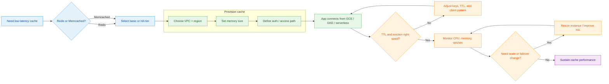

# Memorystore (Redis) — GCP Managed Redis

Google Cloud Memorystore provides fully managed Redis and Memcached instances for sub-millisecond data access.

<!-- workflow-diagram:start -->
## Memorystore Setup Workflow

<!-- workflow-diagram:end -->

## Files

| File | Description |
|------|-------------|
| [`MemoryStoreCommands.md`](./MemoryStoreCommands.md) | Redis CLI commands and Memorystore setup guide |

## Quick Start

```bash
# Create a Memorystore Redis instance
gcloud redis instances create my-redis \
  --size=1 \
  --region=us-central1 \
  --redis-version=redis_7_0

# Get instance details
gcloud redis instances describe my-redis --region=us-central1
```

## References

- [Memorystore for Redis Documentation](https://cloud.google.com/memorystore/docs/redis)
- [Connecting from GKE](https://cloud.google.com/memorystore/docs/redis/connect-redis-instance-gke)
