# Cloud Migration to GCP — Complete Guide

Comprehensive guide for migrating workloads from **On-Premises**, **AWS**, and **Azure** to Google Cloud Platform.

> 📌 **Visual Diagrams**: See [Architecture/README.md](../Architecture/README.md) for Mermaid flow diagrams of all migration paths.
<!-- workflow-diagram:start -->
## Migration Phases Workflow

```mermaid
flowchart LR
    Discover["Inventory source estate"] --> Assess["Assess apps, data, dependencies"]
    Assess --> Strategy{"Rehost, replatform, or refactor?"}
    subgraph Source["Migration sources"]
        OnPrem["On-Prem"]
        AWS["AWS"]
        Azure["Azure"]
    end
    Source --> Assess
    Strategy --> Landing["Build GCP landing zone"]
    Landing --> Pilot["Pilot migration wave"]
    Pilot --> Replicate["Replicate data / images / configs"]
    Replicate --> Cutover{"Cutover criteria met?"}
    Cutover -->|No| Remediate["Fix blockers + rerun pilot"]
    Remediate --> Pilot
    Cutover -->|Yes| Migrate["Execute migration wave"]
    Migrate --> Validate["Functional + performance validation"]
    Validate --> Optimize["Rightsize, secure, observe"]
    Optimize --> Operate["Operate on GCP"]
    classDef start fill:#E3F2FD,stroke:#1E88E5,color:#0D47A1;
    classDef source fill:#E8F5E9,stroke:#43A047,color:#1B5E20;
    classDef wave fill:#FFF3E0,stroke:#FB8C00,color:#E65100;
    classDef finish fill:#F3E5F5,stroke:#8E24AA,color:#4A148C;
    class Discover,Assess,Strategy start;
    class OnPrem,AWS,Azure,Landing source;
    class Pilot,Replicate,Cutover,Remediate,Migrate,Validate,Optimize wave;
    class Operate finish;
```

<!-- workflow-diagram:end -->


---

## 📋 Table of Contents

1. [Migration Strategies](#migration-strategies)
2. [On-Premises to GCP](#-on-premises-to-gcp)
3. [AWS to GCP](#-aws-to-gcp)
4. [Azure to GCP](#-azure-to-gcp)
5. [Migration Tools Reference](#-migration-tools-reference)
6. [Post-Migration Optimization](#-post-migration-optimization)

---

## Migration Strategies

Choose the right strategy for each workload:

| Strategy | Description | When to Use | Effort |
|----------|-------------|-------------|--------|
| **Rehost** (Lift & Shift) | Move as-is to GCP VMs | Legacy apps, quick migration | Low |
| **Replatform** (Lift & Optimize) | Minor changes to use managed services | Replace self-managed DBs with Cloud SQL | Medium |
| **Refactor** (Modernize) | Rewrite for cloud-native | Microservices, containers, serverless | High |
| **Rebuild** | Build from scratch on GCP | Outdated architecture, new requirements | Very High |
| **Retire** | Decommission | Unused or redundant workloads | None |
| **Retain** | Keep on-prem / current cloud | Compliance, hardware dependency | None |

---

## 🏢 On-Premises to GCP

### Prerequisites

```bash
# Install gcloud CLI
curl https://sdk.cloud.google.com | bash
gcloud init

# Authenticate
gcloud auth login
gcloud config set project PROJECT_ID

# Enable required APIs
gcloud services enable \
  compute.googleapis.com \
  vmmigration.googleapis.com \
  datamigration.googleapis.com \
  storage.googleapis.com \
  storagetransfer.googleapis.com \
  dns.googleapis.com \
  cloudresourcemanager.googleapis.com
```

### Step 1: Network Foundation

```bash
# Create VPC with custom subnets
gcloud compute networks create prod-vpc \
  --subnet-mode=custom \
  --bgp-routing-mode=global

# Create subnets per region
gcloud compute networks subnets create prod-us-central1 \
  --network=prod-vpc \
  --region=us-central1 \
  --range=10.0.0.0/20 \
  --enable-private-ip-google-access

gcloud compute networks subnets create prod-europe-west1 \
  --network=prod-vpc \
  --region=europe-west1 \
  --range=10.1.0.0/20 \
  --enable-private-ip-google-access

# Firewall rules
gcloud compute firewall-rules create allow-internal \
  --network=prod-vpc \
  --allow=tcp,udp,icmp \
  --source-ranges=10.0.0.0/8

gcloud compute firewall-rules create allow-ssh \
  --network=prod-vpc \
  --allow=tcp:22 \
  --source-ranges=YOUR_CORPORATE_IP/32

gcloud compute firewall-rules create allow-http-https \
  --network=prod-vpc \
  --allow=tcp:80,tcp:443 \
  --target-tags=web-server
```

### Step 2: Establish Connectivity

#### Option A — Cloud VPN (up to 3 Gbps per tunnel)

```bash
# Create HA VPN gateway
gcloud compute vpn-gateways create onprem-vpn-gw \
  --network=prod-vpc \
  --region=us-central1

# Create Cloud Router
gcloud compute routers create vpn-router \
  --network=prod-vpc \
  --region=us-central1 \
  --asn=65001

# Create VPN tunnels
gcloud compute vpn-tunnels create tunnel-0 \
  --vpn-gateway=onprem-vpn-gw \
  --peer-gcp-gateway=PEER_GW_OR_PEER_IP \
  --shared-secret=SHARED_SECRET \
  --router=vpn-router \
  --region=us-central1 \
  --ike-version=2

# Add BGP session
gcloud compute routers add-bgp-peer vpn-router \
  --peer-name=onprem-peer \
  --peer-asn=65002 \
  --interface=tunnel-0-iface \
  --region=us-central1
```

#### Option B — Dedicated Interconnect (10/100 Gbps)

```bash
# List colocation facilities
gcloud compute interconnects locations list

# Create interconnect
gcloud compute interconnects create my-interconnect \
  --interconnect-type=DEDICATED \
  --link-type=LINK_TYPE_ETHERNET_10G_LR \
  --location=COLOCATION_FACILITY \
  --requested-link-count=2 \
  --admin-enabled

# Create VLAN attachment
gcloud compute interconnects attachments create my-attachment \
  --interconnect=my-interconnect \
  --router=vpn-router \
  --region=us-central1 \
  --bandwidth=BPS_1G
```

#### Option C — Partner Interconnect (50 Mbps – 50 Gbps)

```bash
# Create VLAN attachment for partner
gcloud compute interconnects attachments partner create my-partner-att \
  --router=vpn-router \
  --region=us-central1 \
  --edge-availability-domain=AVAILABILITY_DOMAIN_1

# Share pairing key with your service provider
# Provider completes the connection on their end
```

### Step 3: Migrate VMs (Migrate to VMs)

```bash
# Create migration source (VMware vSphere)
gcloud migration vms sources create vmware-source \
  --location=us-central1 \
  --type=vmware \
  --vmware-source-host=vcenter.corp.local \
  --vmware-source-username=administrator@vsphere.local

# List discovered VMs
gcloud migration vms sources fetch-inventory vmware-source \
  --location=us-central1

# Create migrating VM
gcloud migration vms migrating-vms create web-server-01 \
  --source=vmware-source \
  --location=us-central1 \
  --source-vm-id=vm-12345 \
  --target-project=my-project \
  --zone=us-central1-a \
  --machine-type=n2-standard-4 \
  --network=prod-vpc \
  --subnet=prod-us-central1

# Start continuous replication
gcloud migration vms migrating-vms start-migration web-server-01 \
  --source=vmware-source \
  --location=us-central1

# Run test clone (validates without affecting source)
gcloud migration vms migrating-vms clone-test web-server-01 \
  --source=vmware-source \
  --location=us-central1

# Cutover (final migration)
gcloud migration vms migrating-vms cutover web-server-01 \
  --source=vmware-source \
  --location=us-central1
```

### Step 4: Migrate Databases

#### MySQL / PostgreSQL → Cloud SQL

```bash
# Create Cloud SQL instance
gcloud sql instances create prod-mysql \
  --database-version=MYSQL_8_0 \
  --tier=db-n1-standard-4 \
  --region=us-central1 \
  --availability-type=REGIONAL \
  --storage-type=SSD \
  --storage-size=100GB \
  --backup-start-time=02:00

# Create source connection profile
gcloud database-migration connection-profiles create onprem-mysql \
  --region=us-central1 \
  --type=MYSQL \
  --host=10.0.0.50 \
  --port=3306 \
  --username=replication_user \
  --password=PASSWORD

# Create destination profile
gcloud database-migration connection-profiles create gcp-mysql \
  --region=us-central1 \
  --type=CLOUDSQL \
  --cloudsql-instance=prod-mysql

# Create continuous migration job
gcloud database-migration migration-jobs create mysql-migration \
  --region=us-central1 \
  --type=CONTINUOUS \
  --source=onprem-mysql \
  --destination=gcp-mysql \
  --dump-type=PHYSICAL

# Start migration
gcloud database-migration migration-jobs start mysql-migration \
  --region=us-central1

# Monitor progress
gcloud database-migration migration-jobs describe mysql-migration \
  --region=us-central1

# Promote (cutover) when ready
gcloud database-migration migration-jobs promote mysql-migration \
  --region=us-central1
```

#### Oracle → Cloud SQL / Spanner

```bash
# For Oracle, use native export + Dataflow
# Step 1: Export from Oracle
expdp system/password DIRECTORY=dump_dir DUMPFILE=full_export.dmp FULL=Y

# Step 2: Convert schema using Harbourbridge (open source)
harbourbridge schema -source=oracle -target=spanner \
  -source-profile="host=oracle-host,port=1521,user=system,dbName=ORCL"

# Step 3: Import data via Dataflow
gcloud dataflow jobs run oracle-to-spanner \
  --gcs-location=gs://dataflow-templates/latest/Oracle_to_Spanner \
  --parameters \
    oracleHost=10.0.0.60,\
    oraclePort=1521,\
    instanceId=my-spanner-instance,\
    databaseId=my-spanner-db
```

### Step 5: Transfer File Data

```bash
# Small data (< 1 TB) — gsutil
gsutil -m -o "GSUtil:parallel_composite_upload_threshold=150M" \
  cp -r /data/files/ gs://my-bucket/files/

# Medium data (1-10 TB) — Storage Transfer Service
# Create a transfer agent on-prem
gcloud transfer agents install --pool=my-agent-pool \
  --count=3 --mount-directories=/data

# Create transfer job
gcloud transfer jobs create \
  posix:///data/files \
  gs://my-bucket/files \
  --source-agent-pool=my-agent-pool \
  --name=onprem-to-gcs

# Large data (10+ TB) — Transfer Appliance
# Request via Google Cloud Console → Transfer Appliance
# Google ships a physical device to your data center
# Load data, ship back, Google uploads to GCS
```

---

## ☁️ AWS to GCP

### Step 1: Assessment

```bash
# Export EC2 inventory
aws ec2 describe-instances --output json > ec2-inventory.json

# Export RDS instances
aws rds describe-db-instances --output json > rds-inventory.json

# Export S3 bucket list
aws s3api list-buckets --output json > s3-inventory.json

# Export security groups (map to GCP firewall rules)
aws ec2 describe-security-groups --output json > sg-inventory.json

# Export IAM roles (map to GCP IAM)
aws iam list-roles --output json > iam-roles.json
```

### Step 2: Transfer S3 → Cloud Storage

```bash
# Create AWS credentials file for transfer
cat > aws-creds.json << 'EOF'
{
  "accessKeyId": "YOUR_AWS_ACCESS_KEY",
  "secretAccessKey": "YOUR_AWS_SECRET_KEY"
}
EOF

# One-time full transfer
gcloud transfer jobs create \
  s3://my-aws-bucket \
  gs://my-gcp-bucket \
  --source-creds-file=aws-creds.json \
  --name=s3-full-migration \
  --description="Migrate all S3 data to GCS"

# Scheduled incremental sync
gcloud transfer jobs create \
  s3://my-aws-bucket \
  gs://my-gcp-bucket \
  --source-creds-file=aws-creds.json \
  --name=s3-incremental-sync \
  --schedule-starts=2024-01-01T00:00:00Z \
  --schedule-repeats-every=P1D

# Monitor transfer
gcloud transfer jobs monitor s3-full-migration

# Verify data integrity
gsutil ls -la gs://my-gcp-bucket/ | wc -l
aws s3 ls s3://my-aws-bucket/ --recursive | wc -l
```

### Step 3: Migrate EC2 → Compute Engine

```bash
# Method 1: Export AMI as VM image
# Export EC2 instance
aws ec2 create-instance-export-task \
  --instance-id i-0123456789abcdef0 \
  --target-environment vmware \
  --export-to-s3-task '{"S3Bucket":"export-bucket","S3Prefix":"vm-exports/"}'

# Transfer to GCS
gsutil cp s3://export-bucket/vm-exports/*.ova gs://import-bucket/

# Import into GCE
gcloud compute images import aws-web-server \
  --source-file=gs://import-bucket/vm-exports/web-server.ova \
  --os=ubuntu-2204

# Create instance
gcloud compute instances create web-server \
  --image=aws-web-server \
  --machine-type=n2-standard-4 \
  --zone=us-central1-a \
  --network=prod-vpc \
  --subnet=prod-us-central1

# Method 2: Use Migrate to VMs (automated)
gcloud migration vms sources create aws-source \
  --location=us-central1 \
  --type=aws \
  --aws-source-access-key-id=ACCESS_KEY \
  --aws-source-secret-access-key=SECRET_KEY \
  --aws-source-region=us-east-1
```

### Step 4: Migrate RDS → Cloud SQL

```bash
# Create source profile for RDS
gcloud database-migration connection-profiles create aws-rds-mysql \
  --region=us-central1 \
  --type=MYSQL \
  --host=mydb.abc123.us-east-1.rds.amazonaws.com \
  --port=3306 \
  --username=admin \
  --password=PASSWORD

# Create Cloud SQL target
gcloud sql instances create prod-mysql-from-rds \
  --database-version=MYSQL_8_0 \
  --tier=db-n1-standard-4 \
  --region=us-central1 \
  --availability-type=REGIONAL

gcloud database-migration connection-profiles create gcp-target-mysql \
  --region=us-central1 \
  --type=CLOUDSQL \
  --cloudsql-instance=prod-mysql-from-rds

# Create & start continuous migration
gcloud database-migration migration-jobs create rds-migration \
  --region=us-central1 \
  --type=CONTINUOUS \
  --source=aws-rds-mysql \
  --destination=gcp-target-mysql

gcloud database-migration migration-jobs start rds-migration \
  --region=us-central1

# Monitor
gcloud database-migration migration-jobs describe rds-migration \
  --region=us-central1

# When ready: promote (stops replication, makes Cloud SQL primary)
gcloud database-migration migration-jobs promote rds-migration \
  --region=us-central1
```

### Step 5: Migrate EKS → GKE

```bash
# Export EKS workloads
kubectl --context=eks-context get deployments -A -o yaml > deployments.yaml
kubectl --context=eks-context get services -A -o yaml > services.yaml
kubectl --context=eks-context get configmaps -A -o yaml > configmaps.yaml
kubectl --context=eks-context get secrets -A -o yaml > secrets.yaml

# Create GKE cluster
gcloud container clusters create prod-cluster \
  --region=us-central1 \
  --num-nodes=3 \
  --machine-type=e2-standard-4 \
  --enable-autoscaling --min-nodes=1 --max-nodes=10 \
  --workload-pool=PROJECT_ID.svc.id.goog

# Get GKE credentials
gcloud container clusters get-credentials prod-cluster \
  --region=us-central1

# Apply workloads (update container registry references)
sed -i 's|ECR_ACCOUNT.dkr.ecr.REGION.amazonaws.com|gcr.io/PROJECT_ID|g' deployments.yaml
kubectl apply -f configmaps.yaml
kubectl apply -f secrets.yaml
kubectl apply -f deployments.yaml
kubectl apply -f services.yaml

# Migrate container images from ECR to GCR
# For each image:
docker pull ECR_ACCOUNT.dkr.ecr.us-east-1.amazonaws.com/my-app:latest
docker tag ECR_ACCOUNT.dkr.ecr.us-east-1.amazonaws.com/my-app:latest \
  gcr.io/PROJECT_ID/my-app:latest
docker push gcr.io/PROJECT_ID/my-app:latest
```

### Step 6: Migrate Lambda → Cloud Functions

```python
# AWS Lambda function (before)
import json

def lambda_handler(event, context):
    name = event.get('name', 'World')
    return {
        'statusCode': 200,
        'body': json.dumps(f'Hello, {name}!')
    }

# ---

# Cloud Functions equivalent (after)
import functions_framework

@functions_framework.http
def hello(request):
    name = request.args.get('name', 'World')
    return f'Hello, {name}!'
```

```bash
# Deploy to Cloud Functions
gcloud functions deploy hello \
  --gen2 \
  --runtime=python312 \
  --trigger-http \
  --allow-unauthenticated \
  --region=us-central1 \
  --entry-point=hello
```

---

## ☁️ Azure to GCP

### Step 1: Assessment

```bash
# Export Azure VM inventory
az vm list --output json > azure-vm-inventory.json

# Export Azure SQL databases
az sql db list --server myserver --resource-group myRG --output json > azure-sql-inventory.json

# Export storage accounts
az storage account list --output json > azure-storage-inventory.json

# Export NSGs (map to GCP firewall rules)
az network nsg list --output json > azure-nsg-inventory.json
```

### Step 2: Transfer Blob Storage → Cloud Storage

```bash
# Generate Azure SAS token
az storage container generate-sas \
  --account-name myaccount \
  --name mycontainer \
  --permissions rl \
  --expiry 2024-12-31 \
  --output tsv

# Create transfer job
gcloud transfer jobs create \
  "https://myaccount.blob.core.windows.net/mycontainer" \
  gs://my-gcp-bucket \
  --source-creds-file=azure-creds.json \
  --name=azure-blob-migration

# Monitor
gcloud transfer jobs monitor azure-blob-migration
```

### Step 3: Migrate Azure VMs → Compute Engine

```bash
# Export Azure managed disk as VHD
az disk grant-access \
  --resource-group myRG \
  --name myOSDisk \
  --duration-in-seconds 86400 \
  --access-level Read \
  --query accessSas -o tsv

# Download VHD using the SAS URL
azcopy copy "SAS_URL" ./my-vm-disk.vhd

# Upload to GCS
gsutil cp my-vm-disk.vhd gs://import-bucket/

# Import as GCE image
gcloud compute images import azure-vm-image \
  --source-file=gs://import-bucket/my-vm-disk.vhd \
  --os=ubuntu-2204

# Create instance
gcloud compute instances create azure-migrated-vm \
  --image=azure-vm-image \
  --machine-type=n2-standard-4 \
  --zone=us-central1-a \
  --network=prod-vpc \
  --subnet=prod-us-central1
```

### Step 4: Migrate Azure SQL → Cloud SQL

```bash
# For Azure Database for PostgreSQL → Cloud SQL PostgreSQL
gcloud database-migration connection-profiles create azure-pg-source \
  --region=us-central1 \
  --type=POSTGRESQL \
  --host=myserver.postgres.database.azure.com \
  --port=5432 \
  --username=admin@myserver \
  --password=PASSWORD

gcloud sql instances create prod-pg-from-azure \
  --database-version=POSTGRES_15 \
  --tier=db-custom-4-16384 \
  --region=us-central1 \
  --availability-type=REGIONAL

gcloud database-migration connection-profiles create gcp-pg-target \
  --region=us-central1 \
  --type=CLOUDSQL \
  --cloudsql-instance=prod-pg-from-azure

gcloud database-migration migration-jobs create azure-pg-migration \
  --region=us-central1 \
  --type=CONTINUOUS \
  --source=azure-pg-source \
  --destination=gcp-pg-target

gcloud database-migration migration-jobs start azure-pg-migration \
  --region=us-central1
```

### Step 5: Migrate AKS → GKE

```bash
# Export AKS workloads
az aks get-credentials --resource-group myRG --name myAKSCluster
kubectl get deployments -A -o yaml > aks-deployments.yaml
kubectl get services -A -o yaml > aks-services.yaml

# Create GKE cluster
gcloud container clusters create prod-gke \
  --region=us-central1 \
  --num-nodes=3 \
  --machine-type=e2-standard-4

# Migrate container images from ACR to GCR
az acr login --name myRegistry
docker pull myregistry.azurecr.io/my-app:latest
docker tag myregistry.azurecr.io/my-app:latest gcr.io/PROJECT_ID/my-app:latest
docker push gcr.io/PROJECT_ID/my-app:latest

# Update image references and apply
sed -i 's|myregistry.azurecr.io|gcr.io/PROJECT_ID|g' aks-deployments.yaml
gcloud container clusters get-credentials prod-gke --region=us-central1
kubectl apply -f aks-deployments.yaml
kubectl apply -f aks-services.yaml
```

### Step 6: Migrate Azure Functions → Cloud Functions

```python
# Azure Function (before) — HttpTrigger
import azure.functions as func

def main(req: func.HttpRequest) -> func.HttpResponse:
    name = req.params.get('name', 'World')
    return func.HttpResponse(f"Hello, {name}!")

# ---

# Cloud Function (after)
import functions_framework

@functions_framework.http
def hello(request):
    name = request.args.get('name', 'World')
    return f'Hello, {name}!'
```

```bash
gcloud functions deploy hello \
  --gen2 --runtime=python312 \
  --trigger-http --allow-unauthenticated \
  --region=us-central1
```

---

## 🔧 Migration Tools Reference

| Tool | Source | Target | Data Type |
|------|--------|--------|-----------|
| **Migrate to VMs** | VMware, AWS EC2, Azure VMs | Compute Engine | Virtual machines |
| **Database Migration Service** | MySQL, PostgreSQL, SQL Server, Oracle, AlloyDB | Cloud SQL, AlloyDB | Relational databases |
| **Storage Transfer Service** | S3, Azure Blob, HTTP/HTTPS, on-prem (agent) | Cloud Storage | Object/file data |
| **Transfer Appliance** | On-premises | Cloud Storage | Large datasets (offline) |
| **BigQuery Data Transfer** | Redshift, Teradata, S3, Google Ads, YouTube | BigQuery | Analytics data |
| **Migrate to Containers** | VMs (any source) | GKE / Cloud Run | Containerize legacy apps |
| **Anthos** | EKS, AKS, on-prem K8s | GKE / Anthos clusters | Kubernetes workloads |
| **Dataflow** | Any source (custom connectors) | BigQuery, GCS, Firestore | ETL/ELT pipelines |
| **Harbourbridge** | Oracle, MySQL, PostgreSQL, SQL Server | Cloud Spanner | Schema + data migration |
| **Velero** | Any Kubernetes cluster | GKE | K8s backup & restore |

---

## 📈 Post-Migration Optimization

### Right-Sizing

```bash
# Get VM sizing recommendations
gcloud recommender recommendations list \
  --project=PROJECT_ID \
  --location=us-central1-a \
  --recommender=google.compute.instance.MachineTypeRecommender

# Apply recommendation
gcloud compute instances set-machine-type VM_NAME \
  --machine-type=RECOMMENDED_TYPE \
  --zone=us-central1-a
```

### Cost Optimization

```bash
# View committed use discount opportunities
gcloud compute commitments list --project=PROJECT_ID

# Create a 1-year CUD
gcloud compute commitments create my-cud \
  --plan=12-month \
  --resources=vcpu=8,memory=32GB \
  --region=us-central1

# Set up budget alerts
gcloud billing budgets create \
  --billing-account=BILLING_ACCOUNT_ID \
  --display-name="Monthly Budget" \
  --budget-amount=5000 \
  --threshold-rule=percent=50 \
  --threshold-rule=percent=90 \
  --threshold-rule=percent=100
```

### Monitoring Setup

```bash
# Create uptime check
gcloud monitoring uptime create my-uptime-check \
  --display-name="App Health Check" \
  --monitored-resource-type=uptime-url \
  --hostname=app.example.com \
  --path=/health \
  --check-interval=60s

# Create alert policy
gcloud alpha monitoring policies create \
  --display-name="High CPU Alert" \
  --condition-display-name="CPU > 80%" \
  --condition-filter='metric.type="compute.googleapis.com/instance/cpu/utilization"' \
  --condition-threshold-value=0.8 \
  --condition-threshold-duration=300s \
  --notification-channels=CHANNEL_ID
```
