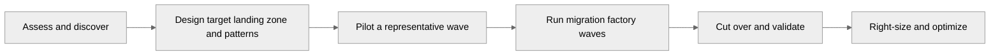
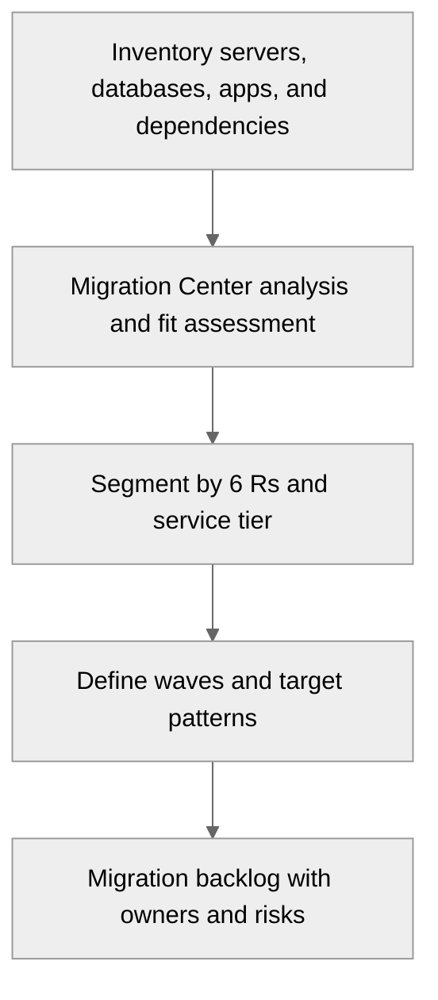
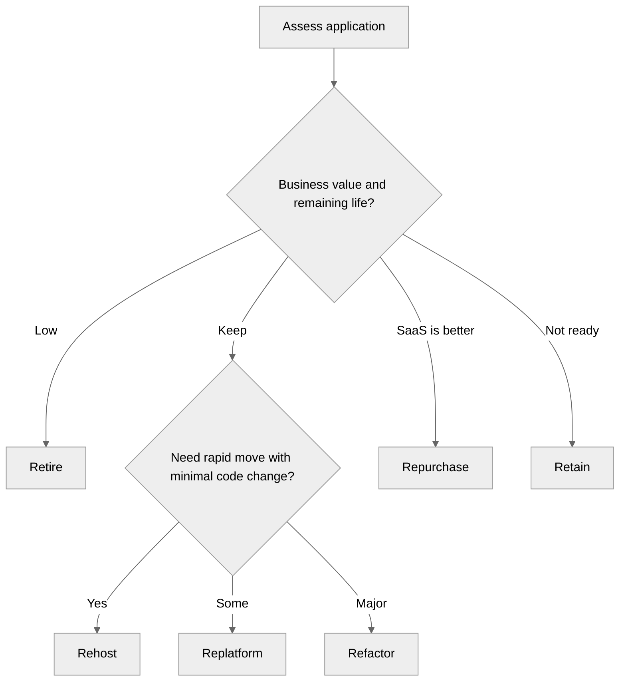
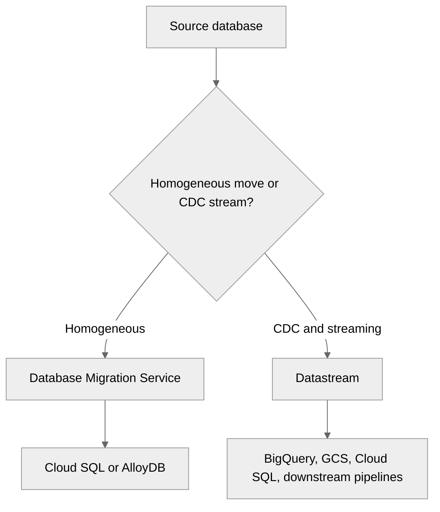
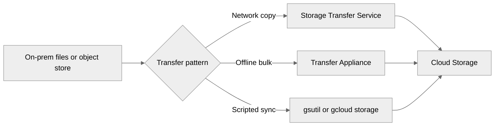
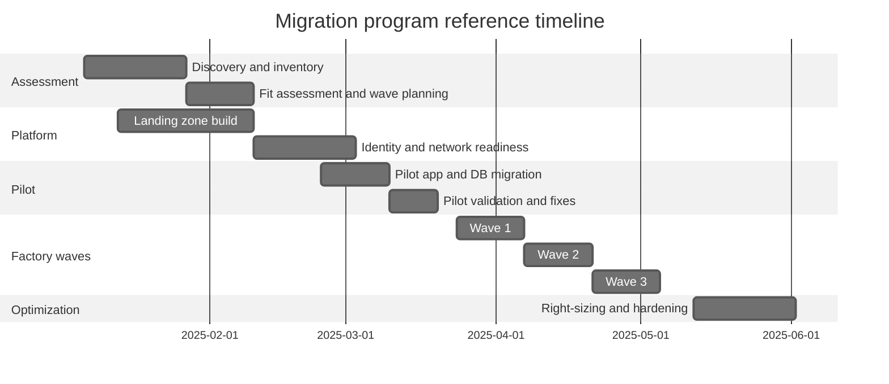
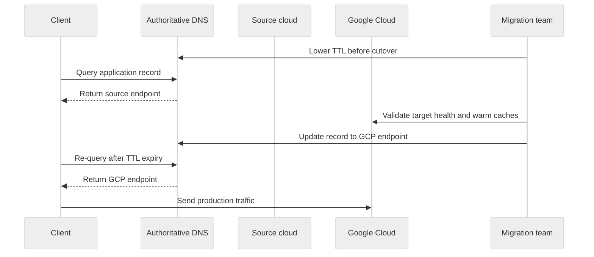
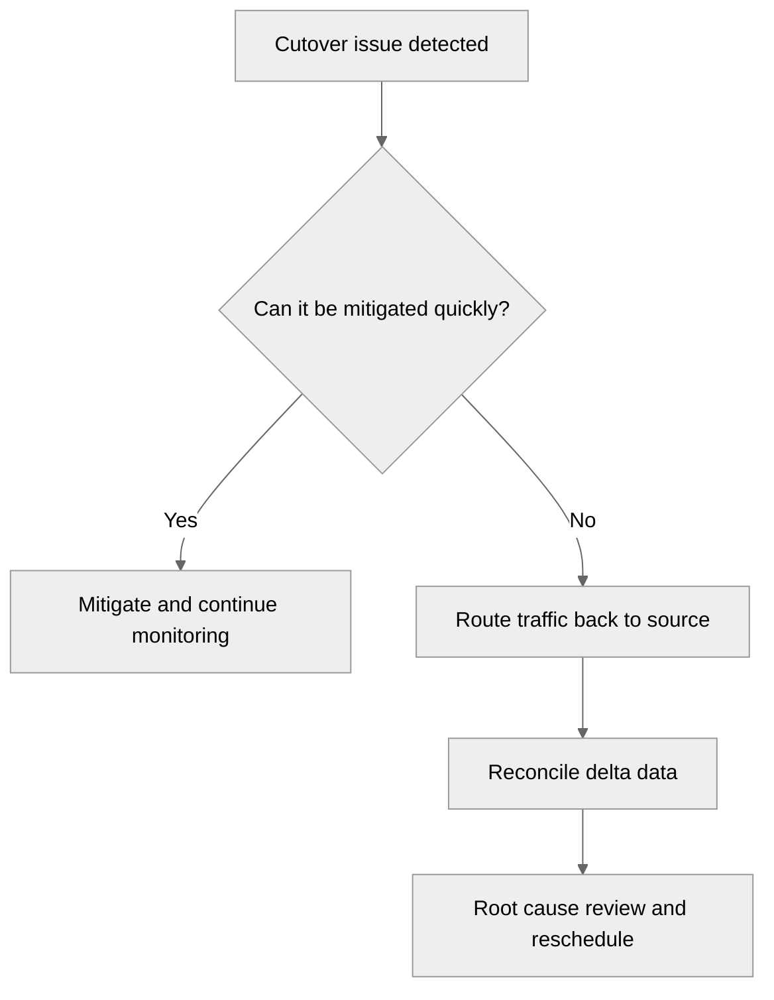
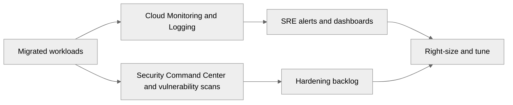

# Comprehensive Migration Guide: On-Prem to GCP and Cloud-to-Cloud

> Architect-level migration handbook for assessment, factory planning, execution, cutover, rollback, and post-migration optimization.

**Audience:** migration architects, platform leads, DBAs, network teams, application modernization teams, PMO leaders, and SREs.

**Official Google Cloud references**
- [Migration Center](https://cloud.google.com/migration-center/docs/overview)
- [Migrate to Virtual Machines](https://cloud.google.com/migrate/virtual-machines/docs/overview)
- [Database Migration Service](https://cloud.google.com/database-migration/docs/overview)
- [Datastream](https://cloud.google.com/datastream/docs/overview)
- [Migrate to Containers](https://cloud.google.com/migrate/containers/docs/overview)
- [Storage Transfer Service](https://cloud.google.com/storage-transfer/docs/overview)
- [Transfer Appliance](https://cloud.google.com/transfer-appliance/docs)
- [Cloud VPN overview](https://cloud.google.com/network-connectivity/docs/vpn/concepts/overview)
- [Cloud Interconnect overview](https://cloud.google.com/network-connectivity/docs/interconnect/concepts/overview)

## Table of Contents

1. [Migration principles and program structure](#migration-principles-and-program-structure)
2. [On-Prem to GCP migration](#on-prem-to-gcp-migration)
3. [Cloud-to-cloud migration](#cloud-to-cloud-migration)
4. [Migration considerations](#migration-considerations)
5. [Post-migration](#post-migration)
6. [Appendix: migration governance checklist](#appendix-migration-governance-checklist)

## Migration principles and program structure

Treat the migration as a factory, not a collection of one-off projects.

- Define business outcomes first: resilience, data center exit, modernization, or M&A separation.
- Create streams for assessment, landing zone, network, identity, app migration, data migration, testing, and cutover.
- Use migration waves based on dependency groups and business calendars.
- Keep rollback viable until production validation succeeds.
- Measure each wave using throughput, defect rate, downtime, and performance deltas.

| Program stream | Core outputs | Lead role | Success metric |
| --- | --- | --- | --- |
| Assessment | Inventory, dependencies, fit scores | Migration architect | Accurate wave plan |
| Platform | Landing zone, IAM, logging, CI/CD | Platform lead | Reusable golden paths |
| Connectivity | VPN or Interconnect, DNS, routing | Network architect | Low-risk cutover |
| Data | Replication plan and validation scripts | DBA or data architect | Validated sync |
| Application | Packaging and target runtime choices | App lead | Repeatable deployment |
| Testing | Functional, performance, security, DR | QA or SRE lead | Wave confidence |

## On-Prem to GCP migration

On-prem migrations require the broadest organizational change because platform, identity, network, and operations all move.

### Assessment: Migration Center (formerly StratoZone) and fit assessment

| Assessment input | How to collect it | Why it matters | Architect output |
| --- | --- | --- | --- |
| CPU, memory, disk utilization | Migration Center collectors or existing monitoring | Rightsizing and cost modeling | VM or container baseline |
| Dependencies | Flow analysis, interviews, CMDB | Wave order and cutover risk | Dependency map |
| OS and middleware versions | Discovery tooling and admins | Compatibility with target runtimes | Target shortlist |
| Database versions and size | DB inventory and sampling | DMS and Datastream supportability | Data migration plan |
| Authentication sources | Identity workshops | SSO and group mapping | Identity migration plan |
| Business calendar | Application owners | Avoid risky cutover windows | Wave calendar |

1. Deploy collectors or import discovery data into Migration Center.
2. Normalize owners, environments, and business services in the assessment workbook.
3. Validate tool-discovered dependencies against application-owner knowledge.
4. Assign each application a migration strategy hypothesis and platform target hypothesis.
5. Create a fit score for rehost, replatform, containerization, and serverless suitability.
6. Identify shared blockers such as unsupported OS versions, legacy auth, or embedded IP assumptions.

### 6 Rs migration strategies with decision flowchart

| Strategy | When to use | Example | Architect caution |
| --- | --- | --- | --- |
| Rehost | Need speed and low app change | Lift-and-shift middleware to Compute Engine | Do not assume cloud-native savings immediately |
| Replatform | Small runtime changes create big operational gains | Move Java app from VM to Cloud Run or GKE | Validate new operating model |
| Refactor | Business funds cloud-native redesign | Split monolith into APIs and events | Requires strong product sponsorship |
| Repurchase | SaaS is the better answer | Replace self-hosted CRM | Validate integration and export patterns |
| Retire | Application no longer needed | Decommission obsolete reporting server | Confirm archival obligations |
| Retain | Cannot move yet | Keep factory-floor controller on-prem | Define revisit date |

### VM migration: Migrate to VMs (M2VM, formerly Migrate for Compute Engine)

1. Validate source compatibility, licensing, and rightsizing recommendations.
2. Create target projects, networks, service accounts, firewall rules, and machine families in advance.
3. Run at least one test migration for each workload archetype.
4. Validate boot behavior, agents, drivers, backup, and security controls on migrated VMs.
5. Define cutover runbooks with app stop, final sync, smoke tests, and rollback triggers.
6. After cutover, harden the instance with OS Login, patch policy, logs, and backups.

### Database migration: Database Migration Service (DMS), Datastream

| Scenario | Recommended tool | Downtime model | Notes |
| --- | --- | --- | --- |
| MySQL or PostgreSQL to Cloud SQL | DMS | Low downtime | Common migration path |
| PostgreSQL to AlloyDB | DMS | Low downtime | Validate extensions and performance |
| Oracle or MySQL CDC to analytics | Datastream | Near real-time | Useful when app move lags data move |
| Complex heterogeneous modernization | Combination of export, DMS, or partner tooling | Varies | Expect schema remediation |

### Application migration: Migrate to Containers, Cloud Run

| Current app shape | Likely target | Why | Architect review |
| --- | --- | --- | --- |
| Monolith with OS dependencies | Compute Engine | Fastest move | Capture modernization separately |
| 12-factor web app | Cloud Run | Low ops and fast scaling | Validate statelessness |
| Microservices needing platform features | GKE | Policy and service-platform control | Need platform maturity |
| Scheduled jobs | Cloud Run jobs or VMs | Managed execution | Check duration and concurrency |
| File or event processor | Cloud Functions or Cloud Run | Event-driven model | Verify idempotency |

1. Package the app with explicit configuration, health checks, and logs.
2. Externalize secrets to Secret Manager.
3. Replace local-disk assumptions with GCS, Filestore, or data-service-backed patterns.
4. Run performance tests to validate startup, concurrency, and memory sizing.
5. Adopt CI/CD before production cutover so deployments are repeatable.

### Data migration: Transfer Service, Transfer Appliance, gsutil

| Data move type | Recommended tool | Best fit | Architect note |
| --- | --- | --- | --- |
| Online transfer from object stores or HTTP endpoints | Storage Transfer Service | Repeatable remote transfers | Supports scheduled sync |
| Petabyte-scale transfer with constrained bandwidth | Transfer Appliance | Large offline seeding | Plan logistics and chain of custody |
| Ad hoc or scripted copy | gsutil or gcloud storage | Smaller datasets and automation scripts | Validate metadata and checksums |
| CDC into analytics or services | Datastream | Ongoing change replication | Good for migration and modernization |

### Network: Cloud Interconnect, Cloud VPN, Partner Interconnect

| Connectivity option | When to use | Strength | Watch-out |
| --- | --- | --- | --- |
| Cloud VPN | Fast setup and smaller bandwidth | Low barrier and encrypted | Internet path and lower throughput |
| Partner Interconnect | Enterprise connectivity through a provider | Flexible and faster than VPN | Provider coordination |
| Dedicated Interconnect | High, predictable bandwidth | Best for large programs | Lead time and colocation requirements |

1. Define whether hybrid connectivity is temporary or permanent.
2. Resolve overlapping CIDRs before pilot waves.
3. Separate migration data paths from steady-state application paths where possible.
4. Validate DNS forwarding, private name resolution, and firewall ownership early.
5. Document rollback routing and traffic-return procedures.

### Identity: Cloud Identity, Google Cloud Directory Sync

| Identity area | Recommended approach | Architect note |
| --- | --- | --- |
| User lifecycle | Cloud Identity or federated IdP integration | Keep source of truth clear |
| Group synchronization | Google Cloud Directory Sync | Map enterprise groups to GCP access groups |
| Admin access | Group-based IAM and IAP | Avoid direct local accounts |
| Workload identities | Service Accounts and Workload Identity Federation | Avoid keys during migration |

### Timeline (Mermaid Gantt)

### Real-world example: manufacturing ERP migration

- Wave 1 used Migrate to VMs for Windows integration servers and gsutil for initial file exports to GCS.
- Wave 2 moved relational databases with DMS and validated application read paths in parallel.
- Wave 3 cut production traffic after one week of dual-running read validation and business smoke tests.
- Post-migration work right-sized VMs, standardized monitoring, and removed temporary hybrid routes.

**Official Google Cloud references**
- [Migrate to VMs planning](https://cloud.google.com/migrate/virtual-machines/docs/5.0/discover/overview)
- [Storage Transfer Service](https://cloud.google.com/storage-transfer/docs/overview)
- [Cloud Interconnect](https://cloud.google.com/network-connectivity/docs/interconnect/concepts/overview)

## Cloud-to-cloud migration

Cloud-to-cloud programs move faster than on-prem migrations, but managed-service translation still creates risk.

### AWS to GCP service mapping

| AWS service | GCP target | Capability area | Architect note |
| --- | --- | --- | --- |
| EC2 | Compute Engine | VM compute | Rehost or rebuild images |
| Auto Scaling Groups | Managed Instance Groups | VM autoscaling | Health checks and templates matter |
| EKS | GKE | Managed Kubernetes | Review cluster mode and network model |
| ECS or Fargate | Cloud Run or GKE | Containers | Cloud Run often simplifies lift |
| Lambda | Cloud Functions or Cloud Run | Serverless | Watch event contracts |
| RDS | Cloud SQL or AlloyDB | Managed relational | Engine fit matters |
| Aurora PostgreSQL | AlloyDB or Cloud SQL | Managed PostgreSQL | Benchmark before choosing |
| DynamoDB | Firestore or Bigtable | NoSQL | Access pattern decides target |
| S3 | Cloud Storage | Object storage | Review lifecycle and IAM models |
| Elastic Load Balancing | Cloud Load Balancing | Traffic distribution | Map global vs regional deliberately |
| CloudFront | Cloud CDN | Content delivery | Integrate with Armor |
| WAF | Cloud Armor | Edge protection | Rebuild rules deliberately |
| Route 53 | Cloud DNS | DNS | Cutover and TTL strategy matter |
| Direct Connect | Interconnect | Private connectivity | Plan bandwidth and lead time |
| CloudWatch | Cloud Monitoring and Logging | Observability | Update dashboards and alerts |
| KMS | Cloud KMS | Key management | Plan key lifecycle |
| Secrets Manager | Secret Manager | Secrets | Update retrieval patterns |
| IAM roles | IAM roles and service accounts | Access control | Model differs; map carefully |
| Organizations or OUs | Organization and folders | Hierarchy | Rebuild policy inheritance intentionally |
| Transit Gateway | NCC and hub patterns | Network hub | Routing design differs |

### Azure to GCP service mapping

| Azure service | GCP target | Capability area | Architect note |
| --- | --- | --- | --- |
| Azure VMs | Compute Engine | VM compute | Rehost or rebuild images |
| VM Scale Sets | Managed Instance Groups | VM autoscaling | Review probe equivalence |
| AKS | GKE | Managed Kubernetes | Map ingress, identity, and storage classes |
| Azure Container Apps | Cloud Run | Managed containers | Good fit for stateless APIs |
| Functions | Cloud Functions or Cloud Run | Serverless | Refactor triggers carefully |
| Azure SQL Database | Cloud SQL or AlloyDB | Managed relational | Schema features drive target |
| Cosmos DB | Firestore, Spanner, or Bigtable | Globally distributed NoSQL | Choose by API and consistency needs |
| Blob Storage | Cloud Storage | Object storage | Review lifecycle tiers |
| Azure Files | Filestore | Managed file shares | NFS and SMB design matters |
| Azure Front Door | Global LB plus CDN plus Armor | Global edge | Rebuild policy stack |
| Application Gateway | Regional or global LB | Ingress | WAF model differs |
| Azure DNS | Cloud DNS | DNS | Lower TTL before cutover |
| ExpressRoute | Interconnect | Private connectivity | Provider design differs |
| Azure Monitor | Cloud Monitoring and Logging | Observability | Migrate alerting semantics |
| Azure Key Vault | Secret Manager and Cloud KMS | Secrets and keys | Separate secret and key design |
| Azure AD / Entra ID | Federation with Cloud Identity | Identity | Group mapping and SSO review |
| Resource Groups | Projects and folders | Grouping | Governance model differs |
| Policy | Organization Policy and Policy Controller | Guardrails | Translate intent, not syntax |

### Step-by-step procedures

1. Assess the current cloud estate: accounts, regions, VPCs or VNets, IAM, managed services, and costs.
2. Design the GCP landing zone and connectivity model before moving workloads.
3. Map every source service to a target pattern and flag one-to-one translation traps.
4. Recreate infrastructure using IaC rather than manual console translation.
5. Set up image or container pipelines that produce Google Cloud-compatible artifacts.
6. Replicate data using service-native replication, exports, or CDC tooling.
7. Deploy test environments in GCP and validate functional, performance, and security parity.
8. Pilot one representative application per major pattern: VM, Kubernetes, database, serverless, and object storage.
9. Lower DNS TTLs, freeze schema changes, and prepare rollback routing for production cutover.
10. After cutover, monitor errors, latency, data consistency, and cost anomalies for at least one business cycle.

### DNS cutover, traffic shifting

### Rollback procedures

| Rollback area | Action | Risk | Control |
| --- | --- | --- | --- |
| Traffic | DNS change or weight reversal | TTL and propagation delay | Keep source capacity warm |
| Database | Stop writes to target and re-enable source authority | Data delta reconciliation | Clear write-freeze policy |
| Batch | Resume source schedulers | Duplicate processing | Use idempotent jobs |
| Identity | Restore source auth endpoint or federation path | Session resets | Communicate to users |
| Monitoring | Switch alert routing if ownership shifts back | Blind spots during revert | Pre-stage dashboards for both sides |

### Real-world example: AWS to GCP retail API move

- Baseline latency, error rate, and cost in the source cloud before migration.
- Stand up matching dashboards in Google Cloud before routing any traffic.
- Replicate data, deploy workloads, and validate image pipelines with Artifact Registry.
- Shift 5%, then 25%, then 100% of traffic after business and SRE approval.
- Keep rollback viable for a defined stabilization window.

**Official Google Cloud references**
- [Cloud Load Balancing](https://cloud.google.com/load-balancing/docs/load-balancing-overview)
- [Cloud DNS](https://cloud.google.com/dns/docs/overview)
- [Cloud Monitoring](https://cloud.google.com/monitoring/docs/monitoring-overview)

## Migration considerations

Architecture quality is determined as much by validation and rollback planning as by target design.

| Consideration | What to define | Typical decisions | Evidence artifact |
| --- | --- | --- | --- |
| Downtime | Allowed outage and maintenance window | Zero-downtime, short downtime, weekend outage | Approved cutover plan |
| Data validation | How target correctness is proven | Row counts, checksums, business queries | Validation report |
| Security | How controls transfer and improve | Private networking, IAM translation, secrets rotation | Security signoff |
| Cost | Migration and steady-state cost view | One-time migration vs run rate | Cost baseline |
| Benchmarking | Performance before and after | Latency, throughput, batch duration | Benchmark scorecard |

### Downtime, data validation, security, cost, benchmarking

- Use read-only windows only when business owners approve them and runbooks are rehearsed.
- Separate schema freeze, application freeze, replication catch-up, and cutover confirmation steps.
- Rotate secrets during migration instead of copying credentials forward.
- Benchmark representative peak load in the target state before final cutover.

| Validation check | Description | Requirement |
| --- | --- | --- |
| 1 | Row counts by table or collection | Required before production signoff |
| 2 | Checksums of critical columns or objects | Required before production signoff |
| 3 | Business-level record samples | Required before production signoff |
| 4 | Application smoke tests | Required before production signoff |
| 5 | Performance and query plan comparison | Required before production signoff |
| 6 | CDC lag or final sync confirmation | Required before production signoff |
| 7 | Permissions and ownership verification | Required before production signoff |
| 8 | Backup and PITR validation | Required before production signoff |
| 9 | Downstream report reconciliation | Required before production signoff |
| 10 | End-user transaction replay where possible | Required before production signoff |

## Post-migration

The first 90 days after cutover determine whether the migration becomes a stable platform outcome.

### Right-sizing, Active Assist recommendations, monitoring, security

- Review utilization within two weeks and remove lift-and-shift overprovisioning.
- Adopt Active Assist recommendations as part of the closure checklist.
- Validate backups, retention, access, and recovery before declaring the wave done.
- Remove temporary hybrid routes, exceptions, and broad firewall rules after stabilization.

| 30/60/90 day window | Primary focus | Example actions |
| --- | --- | --- |
| First 30 days | Stability | Watch dashboards, validate backups, close cutover defects |
| Days 31-60 | Optimization | Right-size compute, reduce egress, review IAM |
| Days 61-90 | Modernization | Containerize candidates, simplify network, add policy automation |

**Official Google Cloud references**
- [Active Assist](https://cloud.google.com/active-assist/docs/overview)
- [Security Command Center](https://cloud.google.com/security-command-center/docs/concepts-scc)
- [Cloud Operations suite](https://cloud.google.com/products/operations)

## Appendix: migration governance checklist

Use this appendix during review boards, design sessions, and delivery checkpoints.

- 1. Confirm that migration wave 1 has named business owners, technical owners, and a signed cutover window.
- 2. Verify that application 2 has a documented 6 Rs strategy and a target runtime decision with rationale.
- 3. Check that data validation for workload 3 includes row counts, business queries, and rollback checkpoints.
- 4. Review whether DNS, routing, and certificate changes for workload 4 are reversible within the agreed window.
- 5. Ensure workload 5 has target-state monitoring, logging, and security findings triage before cutover.
- 6. Validate that rollback for workload 6 includes data authority, scheduler control, and communication steps.
- 7. Determine whether workload 7 should be right-sized after migration rather than preserved forever.
- 8. Confirm that source and target identity mappings for workload 8 were reviewed by security and operations teams.
- 9. Ask whether workload 9 requires performance benchmarking under peak load before final approval.
- 10. Record whether temporary hybrid connectivity for workload 10 can be removed after stabilization.
- 11. Confirm that migration wave 11 has named business owners, technical owners, and a signed cutover window.
- 12. Verify that application 12 has a documented 6 Rs strategy and a target runtime decision with rationale.
- 13. Check that data validation for workload 13 includes row counts, business queries, and rollback checkpoints.
- 14. Review whether DNS, routing, and certificate changes for workload 14 are reversible within the agreed window.
- 15. Ensure workload 15 has target-state monitoring, logging, and security findings triage before cutover.
- 16. Validate that rollback for workload 16 includes data authority, scheduler control, and communication steps.
- 17. Determine whether workload 17 should be right-sized after migration rather than preserved forever.
- 18. Confirm that source and target identity mappings for workload 18 were reviewed by security and operations teams.
- 19. Ask whether workload 19 requires performance benchmarking under peak load before final approval.
- 20. Record whether temporary hybrid connectivity for workload 20 can be removed after stabilization.
- 21. Confirm that migration wave 21 has named business owners, technical owners, and a signed cutover window.
- 22. Verify that application 22 has a documented 6 Rs strategy and a target runtime decision with rationale.
- 23. Check that data validation for workload 23 includes row counts, business queries, and rollback checkpoints.
- 24. Review whether DNS, routing, and certificate changes for workload 24 are reversible within the agreed window.
- 25. Ensure workload 25 has target-state monitoring, logging, and security findings triage before cutover.
- 26. Validate that rollback for workload 26 includes data authority, scheduler control, and communication steps.
- 27. Determine whether workload 27 should be right-sized after migration rather than preserved forever.
- 28. Confirm that source and target identity mappings for workload 28 were reviewed by security and operations teams.
- 29. Ask whether workload 29 requires performance benchmarking under peak load before final approval.
- 30. Record whether temporary hybrid connectivity for workload 30 can be removed after stabilization.
- 31. Confirm that migration wave 31 has named business owners, technical owners, and a signed cutover window.
- 32. Verify that application 32 has a documented 6 Rs strategy and a target runtime decision with rationale.
- 33. Check that data validation for workload 33 includes row counts, business queries, and rollback checkpoints.
- 34. Review whether DNS, routing, and certificate changes for workload 34 are reversible within the agreed window.
- 35. Ensure workload 35 has target-state monitoring, logging, and security findings triage before cutover.
- 36. Validate that rollback for workload 36 includes data authority, scheduler control, and communication steps.
- 37. Determine whether workload 37 should be right-sized after migration rather than preserved forever.
- 38. Confirm that source and target identity mappings for workload 38 were reviewed by security and operations teams.
- 39. Ask whether workload 39 requires performance benchmarking under peak load before final approval.
- 40. Record whether temporary hybrid connectivity for workload 40 can be removed after stabilization.
- 41. Confirm that migration wave 41 has named business owners, technical owners, and a signed cutover window.
- 42. Verify that application 42 has a documented 6 Rs strategy and a target runtime decision with rationale.
- 43. Check that data validation for workload 43 includes row counts, business queries, and rollback checkpoints.
- 44. Review whether DNS, routing, and certificate changes for workload 44 are reversible within the agreed window.
- 45. Ensure workload 45 has target-state monitoring, logging, and security findings triage before cutover.
- 46. Validate that rollback for workload 46 includes data authority, scheduler control, and communication steps.
- 47. Determine whether workload 47 should be right-sized after migration rather than preserved forever.
- 48. Confirm that source and target identity mappings for workload 48 were reviewed by security and operations teams.
- 49. Ask whether workload 49 requires performance benchmarking under peak load before final approval.
- 50. Record whether temporary hybrid connectivity for workload 50 can be removed after stabilization.
- 51. Confirm that migration wave 51 has named business owners, technical owners, and a signed cutover window.
- 52. Verify that application 52 has a documented 6 Rs strategy and a target runtime decision with rationale.
- 53. Check that data validation for workload 53 includes row counts, business queries, and rollback checkpoints.
- 54. Review whether DNS, routing, and certificate changes for workload 54 are reversible within the agreed window.
- 55. Ensure workload 55 has target-state monitoring, logging, and security findings triage before cutover.
- 56. Validate that rollback for workload 56 includes data authority, scheduler control, and communication steps.
- 57. Determine whether workload 57 should be right-sized after migration rather than preserved forever.
- 58. Confirm that source and target identity mappings for workload 58 were reviewed by security and operations teams.
- 59. Ask whether workload 59 requires performance benchmarking under peak load before final approval.
- 60. Record whether temporary hybrid connectivity for workload 60 can be removed after stabilization.
- 61. Confirm that migration wave 61 has named business owners, technical owners, and a signed cutover window.
- 62. Verify that application 62 has a documented 6 Rs strategy and a target runtime decision with rationale.
- 63. Check that data validation for workload 63 includes row counts, business queries, and rollback checkpoints.
- 64. Review whether DNS, routing, and certificate changes for workload 64 are reversible within the agreed window.
- 65. Ensure workload 65 has target-state monitoring, logging, and security findings triage before cutover.
- 66. Validate that rollback for workload 66 includes data authority, scheduler control, and communication steps.
- 67. Determine whether workload 67 should be right-sized after migration rather than preserved forever.
- 68. Confirm that source and target identity mappings for workload 68 were reviewed by security and operations teams.
- 69. Ask whether workload 69 requires performance benchmarking under peak load before final approval.
- 70. Record whether temporary hybrid connectivity for workload 70 can be removed after stabilization.
- 71. Confirm that migration wave 71 has named business owners, technical owners, and a signed cutover window.
- 72. Verify that application 72 has a documented 6 Rs strategy and a target runtime decision with rationale.
- 73. Check that data validation for workload 73 includes row counts, business queries, and rollback checkpoints.
- 74. Review whether DNS, routing, and certificate changes for workload 74 are reversible within the agreed window.
- 75. Ensure workload 75 has target-state monitoring, logging, and security findings triage before cutover.
- 76. Validate that rollback for workload 76 includes data authority, scheduler control, and communication steps.
- 77. Determine whether workload 77 should be right-sized after migration rather than preserved forever.
- 78. Confirm that source and target identity mappings for workload 78 were reviewed by security and operations teams.
- 79. Ask whether workload 79 requires performance benchmarking under peak load before final approval.
- 80. Record whether temporary hybrid connectivity for workload 80 can be removed after stabilization.
- 81. Confirm that migration wave 81 has named business owners, technical owners, and a signed cutover window.
- 82. Verify that application 82 has a documented 6 Rs strategy and a target runtime decision with rationale.
- 83. Check that data validation for workload 83 includes row counts, business queries, and rollback checkpoints.
- 84. Review whether DNS, routing, and certificate changes for workload 84 are reversible within the agreed window.
- 85. Ensure workload 85 has target-state monitoring, logging, and security findings triage before cutover.
- 86. Validate that rollback for workload 86 includes data authority, scheduler control, and communication steps.
- 87. Determine whether workload 87 should be right-sized after migration rather than preserved forever.
- 88. Confirm that source and target identity mappings for workload 88 were reviewed by security and operations teams.
- 89. Ask whether workload 89 requires performance benchmarking under peak load before final approval.
- 90. Record whether temporary hybrid connectivity for workload 90 can be removed after stabilization.
- 91. Confirm that migration wave 91 has named business owners, technical owners, and a signed cutover window.
- 92. Verify that application 92 has a documented 6 Rs strategy and a target runtime decision with rationale.
- 93. Check that data validation for workload 93 includes row counts, business queries, and rollback checkpoints.
- 94. Review whether DNS, routing, and certificate changes for workload 94 are reversible within the agreed window.
- 95. Ensure workload 95 has target-state monitoring, logging, and security findings triage before cutover.
- 96. Validate that rollback for workload 96 includes data authority, scheduler control, and communication steps.
- 97. Determine whether workload 97 should be right-sized after migration rather than preserved forever.
- 98. Confirm that source and target identity mappings for workload 98 were reviewed by security and operations teams.
- 99. Ask whether workload 99 requires performance benchmarking under peak load before final approval.
- 100. Record whether temporary hybrid connectivity for workload 100 can be removed after stabilization.
- 101. Confirm that migration wave 101 has named business owners, technical owners, and a signed cutover window.
- 102. Verify that application 102 has a documented 6 Rs strategy and a target runtime decision with rationale.
- 103. Check that data validation for workload 103 includes row counts, business queries, and rollback checkpoints.
- 104. Review whether DNS, routing, and certificate changes for workload 104 are reversible within the agreed window.
- 105. Ensure workload 105 has target-state monitoring, logging, and security findings triage before cutover.
- 106. Validate that rollback for workload 106 includes data authority, scheduler control, and communication steps.
- 107. Determine whether workload 107 should be right-sized after migration rather than preserved forever.
- 108. Confirm that source and target identity mappings for workload 108 were reviewed by security and operations teams.
- 109. Ask whether workload 109 requires performance benchmarking under peak load before final approval.
- 110. Record whether temporary hybrid connectivity for workload 110 can be removed after stabilization.
- 111. Confirm that migration wave 111 has named business owners, technical owners, and a signed cutover window.
- 112. Verify that application 112 has a documented 6 Rs strategy and a target runtime decision with rationale.
- 113. Check that data validation for workload 113 includes row counts, business queries, and rollback checkpoints.
- 114. Review whether DNS, routing, and certificate changes for workload 114 are reversible within the agreed window.
- 115. Ensure workload 115 has target-state monitoring, logging, and security findings triage before cutover.
- 116. Validate that rollback for workload 116 includes data authority, scheduler control, and communication steps.
- 117. Determine whether workload 117 should be right-sized after migration rather than preserved forever.
- 118. Confirm that source and target identity mappings for workload 118 were reviewed by security and operations teams.
- 119. Ask whether workload 119 requires performance benchmarking under peak load before final approval.
- 120. Record whether temporary hybrid connectivity for workload 120 can be removed after stabilization.
- 121. Confirm that migration wave 121 has named business owners, technical owners, and a signed cutover window.
- 122. Verify that application 122 has a documented 6 Rs strategy and a target runtime decision with rationale.
- 123. Check that data validation for workload 123 includes row counts, business queries, and rollback checkpoints.
- 124. Review whether DNS, routing, and certificate changes for workload 124 are reversible within the agreed window.
- 125. Ensure workload 125 has target-state monitoring, logging, and security findings triage before cutover.
- 126. Validate that rollback for workload 126 includes data authority, scheduler control, and communication steps.
- 127. Determine whether workload 127 should be right-sized after migration rather than preserved forever.
- 128. Confirm that source and target identity mappings for workload 128 were reviewed by security and operations teams.
- 129. Ask whether workload 129 requires performance benchmarking under peak load before final approval.
- 130. Record whether temporary hybrid connectivity for workload 130 can be removed after stabilization.
- 131. Confirm that migration wave 131 has named business owners, technical owners, and a signed cutover window.
- 132. Verify that application 132 has a documented 6 Rs strategy and a target runtime decision with rationale.
- 133. Check that data validation for workload 133 includes row counts, business queries, and rollback checkpoints.
- 134. Review whether DNS, routing, and certificate changes for workload 134 are reversible within the agreed window.
- 135. Ensure workload 135 has target-state monitoring, logging, and security findings triage before cutover.
- 136. Validate that rollback for workload 136 includes data authority, scheduler control, and communication steps.
- 137. Determine whether workload 137 should be right-sized after migration rather than preserved forever.
- 138. Confirm that source and target identity mappings for workload 138 were reviewed by security and operations teams.
- 139. Ask whether workload 139 requires performance benchmarking under peak load before final approval.
- 140. Record whether temporary hybrid connectivity for workload 140 can be removed after stabilization.
- 141. Confirm that migration wave 141 has named business owners, technical owners, and a signed cutover window.
- 142. Verify that application 142 has a documented 6 Rs strategy and a target runtime decision with rationale.
- 143. Check that data validation for workload 143 includes row counts, business queries, and rollback checkpoints.
- 144. Review whether DNS, routing, and certificate changes for workload 144 are reversible within the agreed window.
- 145. Ensure workload 145 has target-state monitoring, logging, and security findings triage before cutover.
- 146. Validate that rollback for workload 146 includes data authority, scheduler control, and communication steps.
- 147. Determine whether workload 147 should be right-sized after migration rather than preserved forever.
- 148. Confirm that source and target identity mappings for workload 148 were reviewed by security and operations teams.
- 149. Ask whether workload 149 requires performance benchmarking under peak load before final approval.
- 150. Record whether temporary hybrid connectivity for workload 150 can be removed after stabilization.
- 151. Confirm that migration wave 151 has named business owners, technical owners, and a signed cutover window.
- 152. Verify that application 152 has a documented 6 Rs strategy and a target runtime decision with rationale.
- 153. Check that data validation for workload 153 includes row counts, business queries, and rollback checkpoints.
- 154. Review whether DNS, routing, and certificate changes for workload 154 are reversible within the agreed window.
- 155. Ensure workload 155 has target-state monitoring, logging, and security findings triage before cutover.
- 156. Validate that rollback for workload 156 includes data authority, scheduler control, and communication steps.
- 157. Determine whether workload 157 should be right-sized after migration rather than preserved forever.
- 158. Confirm that source and target identity mappings for workload 158 were reviewed by security and operations teams.
- 159. Ask whether workload 159 requires performance benchmarking under peak load before final approval.
- 160. Record whether temporary hybrid connectivity for workload 160 can be removed after stabilization.
- 161. Confirm that migration wave 161 has named business owners, technical owners, and a signed cutover window.
- 162. Verify that application 162 has a documented 6 Rs strategy and a target runtime decision with rationale.
- 163. Check that data validation for workload 163 includes row counts, business queries, and rollback checkpoints.
- 164. Review whether DNS, routing, and certificate changes for workload 164 are reversible within the agreed window.
- 165. Ensure workload 165 has target-state monitoring, logging, and security findings triage before cutover.
- 166. Validate that rollback for workload 166 includes data authority, scheduler control, and communication steps.
- 167. Determine whether workload 167 should be right-sized after migration rather than preserved forever.
- 168. Confirm that source and target identity mappings for workload 168 were reviewed by security and operations teams.
- 169. Ask whether workload 169 requires performance benchmarking under peak load before final approval.
- 170. Record whether temporary hybrid connectivity for workload 170 can be removed after stabilization.
- 171. Confirm that migration wave 171 has named business owners, technical owners, and a signed cutover window.
- 172. Verify that application 172 has a documented 6 Rs strategy and a target runtime decision with rationale.
- 173. Check that data validation for workload 173 includes row counts, business queries, and rollback checkpoints.
- 174. Review whether DNS, routing, and certificate changes for workload 174 are reversible within the agreed window.
- 175. Ensure workload 175 has target-state monitoring, logging, and security findings triage before cutover.
- 176. Validate that rollback for workload 176 includes data authority, scheduler control, and communication steps.
- 177. Determine whether workload 177 should be right-sized after migration rather than preserved forever.
- 178. Confirm that source and target identity mappings for workload 178 were reviewed by security and operations teams.
- 179. Ask whether workload 179 requires performance benchmarking under peak load before final approval.
- 180. Record whether temporary hybrid connectivity for workload 180 can be removed after stabilization.
- 181. Confirm that migration wave 181 has named business owners, technical owners, and a signed cutover window.
- 182. Verify that application 182 has a documented 6 Rs strategy and a target runtime decision with rationale.
- 183. Check that data validation for workload 183 includes row counts, business queries, and rollback checkpoints.
- 184. Review whether DNS, routing, and certificate changes for workload 184 are reversible within the agreed window.
- 185. Ensure workload 185 has target-state monitoring, logging, and security findings triage before cutover.
- 186. Validate that rollback for workload 186 includes data authority, scheduler control, and communication steps.
- 187. Determine whether workload 187 should be right-sized after migration rather than preserved forever.
- 188. Confirm that source and target identity mappings for workload 188 were reviewed by security and operations teams.
- 189. Ask whether workload 189 requires performance benchmarking under peak load before final approval.
- 190. Record whether temporary hybrid connectivity for workload 190 can be removed after stabilization.
- 191. Confirm that migration wave 191 has named business owners, technical owners, and a signed cutover window.
- 192. Verify that application 192 has a documented 6 Rs strategy and a target runtime decision with rationale.
- 193. Check that data validation for workload 193 includes row counts, business queries, and rollback checkpoints.
- 194. Review whether DNS, routing, and certificate changes for workload 194 are reversible within the agreed window.
- 195. Ensure workload 195 has target-state monitoring, logging, and security findings triage before cutover.
- 196. Validate that rollback for workload 196 includes data authority, scheduler control, and communication steps.
- 197. Determine whether workload 197 should be right-sized after migration rather than preserved forever.
- 198. Confirm that source and target identity mappings for workload 198 were reviewed by security and operations teams.
- 199. Ask whether workload 199 requires performance benchmarking under peak load before final approval.
- 200. Record whether temporary hybrid connectivity for workload 200 can be removed after stabilization.
- 201. Confirm that migration wave 201 has named business owners, technical owners, and a signed cutover window.
- 202. Verify that application 202 has a documented 6 Rs strategy and a target runtime decision with rationale.
- 203. Check that data validation for workload 203 includes row counts, business queries, and rollback checkpoints.
- 204. Review whether DNS, routing, and certificate changes for workload 204 are reversible within the agreed window.
- 205. Ensure workload 205 has target-state monitoring, logging, and security findings triage before cutover.
- 206. Validate that rollback for workload 206 includes data authority, scheduler control, and communication steps.
- 207. Determine whether workload 207 should be right-sized after migration rather than preserved forever.
- 208. Confirm that source and target identity mappings for workload 208 were reviewed by security and operations teams.
- 209. Ask whether workload 209 requires performance benchmarking under peak load before final approval.
- 210. Record whether temporary hybrid connectivity for workload 210 can be removed after stabilization.
- 211. Confirm that migration wave 211 has named business owners, technical owners, and a signed cutover window.
- 212. Verify that application 212 has a documented 6 Rs strategy and a target runtime decision with rationale.
- 213. Check that data validation for workload 213 includes row counts, business queries, and rollback checkpoints.
- 214. Review whether DNS, routing, and certificate changes for workload 214 are reversible within the agreed window.
- 215. Ensure workload 215 has target-state monitoring, logging, and security findings triage before cutover.
- 216. Validate that rollback for workload 216 includes data authority, scheduler control, and communication steps.
- 217. Determine whether workload 217 should be right-sized after migration rather than preserved forever.
- 218. Confirm that source and target identity mappings for workload 218 were reviewed by security and operations teams.
- 219. Ask whether workload 219 requires performance benchmarking under peak load before final approval.
- 220. Record whether temporary hybrid connectivity for workload 220 can be removed after stabilization.
- 221. Confirm that migration wave 221 has named business owners, technical owners, and a signed cutover window.
- 222. Verify that application 222 has a documented 6 Rs strategy and a target runtime decision with rationale.
- 223. Check that data validation for workload 223 includes row counts, business queries, and rollback checkpoints.
- 224. Review whether DNS, routing, and certificate changes for workload 224 are reversible within the agreed window.
- 225. Ensure workload 225 has target-state monitoring, logging, and security findings triage before cutover.
- 226. Validate that rollback for workload 226 includes data authority, scheduler control, and communication steps.
- 227. Determine whether workload 227 should be right-sized after migration rather than preserved forever.
- 228. Confirm that source and target identity mappings for workload 228 were reviewed by security and operations teams.
- 229. Ask whether workload 229 requires performance benchmarking under peak load before final approval.
- 230. Record whether temporary hybrid connectivity for workload 230 can be removed after stabilization.
- 231. Confirm that migration wave 231 has named business owners, technical owners, and a signed cutover window.
- 232. Verify that application 232 has a documented 6 Rs strategy and a target runtime decision with rationale.
- 233. Check that data validation for workload 233 includes row counts, business queries, and rollback checkpoints.
- 234. Review whether DNS, routing, and certificate changes for workload 234 are reversible within the agreed window.
- 235. Ensure workload 235 has target-state monitoring, logging, and security findings triage before cutover.
- 236. Validate that rollback for workload 236 includes data authority, scheduler control, and communication steps.
- 237. Determine whether workload 237 should be right-sized after migration rather than preserved forever.
- 238. Confirm that source and target identity mappings for workload 238 were reviewed by security and operations teams.
- 239. Ask whether workload 239 requires performance benchmarking under peak load before final approval.
- 240. Record whether temporary hybrid connectivity for workload 240 can be removed after stabilization.
- 241. Confirm that migration wave 241 has named business owners, technical owners, and a signed cutover window.
- 242. Verify that application 242 has a documented 6 Rs strategy and a target runtime decision with rationale.
- 243. Check that data validation for workload 243 includes row counts, business queries, and rollback checkpoints.
- 244. Review whether DNS, routing, and certificate changes for workload 244 are reversible within the agreed window.
- 245. Ensure workload 245 has target-state monitoring, logging, and security findings triage before cutover.
- 246. Validate that rollback for workload 246 includes data authority, scheduler control, and communication steps.
- 247. Determine whether workload 247 should be right-sized after migration rather than preserved forever.
- 248. Confirm that source and target identity mappings for workload 248 were reviewed by security and operations teams.
- 249. Ask whether workload 249 requires performance benchmarking under peak load before final approval.
- 250. Record whether temporary hybrid connectivity for workload 250 can be removed after stabilization.
- 251. Confirm that migration wave 251 has named business owners, technical owners, and a signed cutover window.
- 252. Verify that application 252 has a documented 6 Rs strategy and a target runtime decision with rationale.
- 253. Check that data validation for workload 253 includes row counts, business queries, and rollback checkpoints.
- 254. Review whether DNS, routing, and certificate changes for workload 254 are reversible within the agreed window.
- 255. Ensure workload 255 has target-state monitoring, logging, and security findings triage before cutover.
- 256. Validate that rollback for workload 256 includes data authority, scheduler control, and communication steps.
- 257. Determine whether workload 257 should be right-sized after migration rather than preserved forever.
- 258. Confirm that source and target identity mappings for workload 258 were reviewed by security and operations teams.
- 259. Ask whether workload 259 requires performance benchmarking under peak load before final approval.
- 260. Record whether temporary hybrid connectivity for workload 260 can be removed after stabilization.
- 261. Confirm that migration wave 261 has named business owners, technical owners, and a signed cutover window.
- 262. Verify that application 262 has a documented 6 Rs strategy and a target runtime decision with rationale.
- 263. Check that data validation for workload 263 includes row counts, business queries, and rollback checkpoints.
- 264. Review whether DNS, routing, and certificate changes for workload 264 are reversible within the agreed window.
- 265. Ensure workload 265 has target-state monitoring, logging, and security findings triage before cutover.
- 266. Validate that rollback for workload 266 includes data authority, scheduler control, and communication steps.
- 267. Determine whether workload 267 should be right-sized after migration rather than preserved forever.
- 268. Confirm that source and target identity mappings for workload 268 were reviewed by security and operations teams.
- 269. Ask whether workload 269 requires performance benchmarking under peak load before final approval.
- 270. Record whether temporary hybrid connectivity for workload 270 can be removed after stabilization.
- 271. Confirm that migration wave 271 has named business owners, technical owners, and a signed cutover window.
- 272. Verify that application 272 has a documented 6 Rs strategy and a target runtime decision with rationale.
- 273. Check that data validation for workload 273 includes row counts, business queries, and rollback checkpoints.
- 274. Review whether DNS, routing, and certificate changes for workload 274 are reversible within the agreed window.
- 275. Ensure workload 275 has target-state monitoring, logging, and security findings triage before cutover.
- 276. Validate that rollback for workload 276 includes data authority, scheduler control, and communication steps.
- 277. Determine whether workload 277 should be right-sized after migration rather than preserved forever.
- 278. Confirm that source and target identity mappings for workload 278 were reviewed by security and operations teams.
- 279. Ask whether workload 279 requires performance benchmarking under peak load before final approval.
- 280. Record whether temporary hybrid connectivity for workload 280 can be removed after stabilization.
- 281. Confirm that migration wave 281 has named business owners, technical owners, and a signed cutover window.
- 282. Verify that application 282 has a documented 6 Rs strategy and a target runtime decision with rationale.
- 283. Check that data validation for workload 283 includes row counts, business queries, and rollback checkpoints.
- 284. Review whether DNS, routing, and certificate changes for workload 284 are reversible within the agreed window.
- 285. Ensure workload 285 has target-state monitoring, logging, and security findings triage before cutover.
- 286. Validate that rollback for workload 286 includes data authority, scheduler control, and communication steps.
- 287. Determine whether workload 287 should be right-sized after migration rather than preserved forever.
- 288. Confirm that source and target identity mappings for workload 288 were reviewed by security and operations teams.
- 289. Ask whether workload 289 requires performance benchmarking under peak load before final approval.
- 290. Record whether temporary hybrid connectivity for workload 290 can be removed after stabilization.
- 291. Confirm that migration wave 291 has named business owners, technical owners, and a signed cutover window.
- 292. Verify that application 292 has a documented 6 Rs strategy and a target runtime decision with rationale.
- 293. Check that data validation for workload 293 includes row counts, business queries, and rollback checkpoints.
- 294. Review whether DNS, routing, and certificate changes for workload 294 are reversible within the agreed window.
- 295. Ensure workload 295 has target-state monitoring, logging, and security findings triage before cutover.
- 296. Validate that rollback for workload 296 includes data authority, scheduler control, and communication steps.
- 297. Determine whether workload 297 should be right-sized after migration rather than preserved forever.
- 298. Confirm that source and target identity mappings for workload 298 were reviewed by security and operations teams.
- 299. Ask whether workload 299 requires performance benchmarking under peak load before final approval.
- 300. Record whether temporary hybrid connectivity for workload 300 can be removed after stabilization.
- 301. Confirm that migration wave 301 has named business owners, technical owners, and a signed cutover window.
- 302. Verify that application 302 has a documented 6 Rs strategy and a target runtime decision with rationale.
- 303. Check that data validation for workload 303 includes row counts, business queries, and rollback checkpoints.
- 304. Review whether DNS, routing, and certificate changes for workload 304 are reversible within the agreed window.
- 305. Ensure workload 305 has target-state monitoring, logging, and security findings triage before cutover.
- 306. Validate that rollback for workload 306 includes data authority, scheduler control, and communication steps.
- 307. Determine whether workload 307 should be right-sized after migration rather than preserved forever.
- 308. Confirm that source and target identity mappings for workload 308 were reviewed by security and operations teams.
- 309. Ask whether workload 309 requires performance benchmarking under peak load before final approval.
- 310. Record whether temporary hybrid connectivity for workload 310 can be removed after stabilization.
- 311. Confirm that migration wave 311 has named business owners, technical owners, and a signed cutover window.
- 312. Verify that application 312 has a documented 6 Rs strategy and a target runtime decision with rationale.
- 313. Check that data validation for workload 313 includes row counts, business queries, and rollback checkpoints.
- 314. Review whether DNS, routing, and certificate changes for workload 314 are reversible within the agreed window.
- 315. Ensure workload 315 has target-state monitoring, logging, and security findings triage before cutover.
- 316. Validate that rollback for workload 316 includes data authority, scheduler control, and communication steps.
- 317. Determine whether workload 317 should be right-sized after migration rather than preserved forever.
- 318. Confirm that source and target identity mappings for workload 318 were reviewed by security and operations teams.
- 319. Ask whether workload 319 requires performance benchmarking under peak load before final approval.
- 320. Record whether temporary hybrid connectivity for workload 320 can be removed after stabilization.
- 321. Confirm that migration wave 321 has named business owners, technical owners, and a signed cutover window.
- 322. Verify that application 322 has a documented 6 Rs strategy and a target runtime decision with rationale.
- 323. Check that data validation for workload 323 includes row counts, business queries, and rollback checkpoints.
- 324. Review whether DNS, routing, and certificate changes for workload 324 are reversible within the agreed window.
- 325. Ensure workload 325 has target-state monitoring, logging, and security findings triage before cutover.
- 326. Validate that rollback for workload 326 includes data authority, scheduler control, and communication steps.
- 327. Determine whether workload 327 should be right-sized after migration rather than preserved forever.
- 328. Confirm that source and target identity mappings for workload 328 were reviewed by security and operations teams.
- 329. Ask whether workload 329 requires performance benchmarking under peak load before final approval.
- 330. Record whether temporary hybrid connectivity for workload 330 can be removed after stabilization.
- 331. Confirm that migration wave 331 has named business owners, technical owners, and a signed cutover window.
- 332. Verify that application 332 has a documented 6 Rs strategy and a target runtime decision with rationale.
- 333. Check that data validation for workload 333 includes row counts, business queries, and rollback checkpoints.
- 334. Review whether DNS, routing, and certificate changes for workload 334 are reversible within the agreed window.
- 335. Ensure workload 335 has target-state monitoring, logging, and security findings triage before cutover.
- 336. Validate that rollback for workload 336 includes data authority, scheduler control, and communication steps.
- 337. Determine whether workload 337 should be right-sized after migration rather than preserved forever.
- 338. Confirm that source and target identity mappings for workload 338 were reviewed by security and operations teams.
- 339. Ask whether workload 339 requires performance benchmarking under peak load before final approval.
- 340. Record whether temporary hybrid connectivity for workload 340 can be removed after stabilization.
- 341. Confirm that migration wave 341 has named business owners, technical owners, and a signed cutover window.
- 342. Verify that application 342 has a documented 6 Rs strategy and a target runtime decision with rationale.
- 343. Check that data validation for workload 343 includes row counts, business queries, and rollback checkpoints.
- 344. Review whether DNS, routing, and certificate changes for workload 344 are reversible within the agreed window.
- 345. Ensure workload 345 has target-state monitoring, logging, and security findings triage before cutover.
- 346. Validate that rollback for workload 346 includes data authority, scheduler control, and communication steps.
- 347. Determine whether workload 347 should be right-sized after migration rather than preserved forever.
- 348. Confirm that source and target identity mappings for workload 348 were reviewed by security and operations teams.
- 349. Ask whether workload 349 requires performance benchmarking under peak load before final approval.
- 350. Record whether temporary hybrid connectivity for workload 350 can be removed after stabilization.
- 351. Confirm that migration wave 351 has named business owners, technical owners, and a signed cutover window.
- 352. Verify that application 352 has a documented 6 Rs strategy and a target runtime decision with rationale.
- 353. Check that data validation for workload 353 includes row counts, business queries, and rollback checkpoints.
- 354. Review whether DNS, routing, and certificate changes for workload 354 are reversible within the agreed window.
- 355. Ensure workload 355 has target-state monitoring, logging, and security findings triage before cutover.
- 356. Validate that rollback for workload 356 includes data authority, scheduler control, and communication steps.
- 357. Determine whether workload 357 should be right-sized after migration rather than preserved forever.
- 358. Confirm that source and target identity mappings for workload 358 were reviewed by security and operations teams.
- 359. Ask whether workload 359 requires performance benchmarking under peak load before final approval.
- 360. Record whether temporary hybrid connectivity for workload 360 can be removed after stabilization.
- 361. Confirm that migration wave 361 has named business owners, technical owners, and a signed cutover window.
- 362. Verify that application 362 has a documented 6 Rs strategy and a target runtime decision with rationale.
- 363. Check that data validation for workload 363 includes row counts, business queries, and rollback checkpoints.
- 364. Review whether DNS, routing, and certificate changes for workload 364 are reversible within the agreed window.
- 365. Ensure workload 365 has target-state monitoring, logging, and security findings triage before cutover.
- 366. Validate that rollback for workload 366 includes data authority, scheduler control, and communication steps.
- 367. Determine whether workload 367 should be right-sized after migration rather than preserved forever.
- 368. Confirm that source and target identity mappings for workload 368 were reviewed by security and operations teams.
- 369. Ask whether workload 369 requires performance benchmarking under peak load before final approval.
- 370. Record whether temporary hybrid connectivity for workload 370 can be removed after stabilization.
- 371. Confirm that migration wave 371 has named business owners, technical owners, and a signed cutover window.
- 372. Verify that application 372 has a documented 6 Rs strategy and a target runtime decision with rationale.
- 373. Check that data validation for workload 373 includes row counts, business queries, and rollback checkpoints.
- 374. Review whether DNS, routing, and certificate changes for workload 374 are reversible within the agreed window.
- 375. Ensure workload 375 has target-state monitoring, logging, and security findings triage before cutover.
- 376. Validate that rollback for workload 376 includes data authority, scheduler control, and communication steps.
- 377. Determine whether workload 377 should be right-sized after migration rather than preserved forever.
- 378. Confirm that source and target identity mappings for workload 378 were reviewed by security and operations teams.
- 379. Ask whether workload 379 requires performance benchmarking under peak load before final approval.
- 380. Record whether temporary hybrid connectivity for workload 380 can be removed after stabilization.
- 381. Confirm that migration wave 381 has named business owners, technical owners, and a signed cutover window.
- 382. Verify that application 382 has a documented 6 Rs strategy and a target runtime decision with rationale.
- 383. Check that data validation for workload 383 includes row counts, business queries, and rollback checkpoints.
- 384. Review whether DNS, routing, and certificate changes for workload 384 are reversible within the agreed window.
- 385. Ensure workload 385 has target-state monitoring, logging, and security findings triage before cutover.
- 386. Validate that rollback for workload 386 includes data authority, scheduler control, and communication steps.
- 387. Determine whether workload 387 should be right-sized after migration rather than preserved forever.
- 388. Confirm that source and target identity mappings for workload 388 were reviewed by security and operations teams.
- 389. Ask whether workload 389 requires performance benchmarking under peak load before final approval.
- 390. Record whether temporary hybrid connectivity for workload 390 can be removed after stabilization.
- 391. Confirm that migration wave 391 has named business owners, technical owners, and a signed cutover window.
- 392. Verify that application 392 has a documented 6 Rs strategy and a target runtime decision with rationale.
- 393. Check that data validation for workload 393 includes row counts, business queries, and rollback checkpoints.
- 394. Review whether DNS, routing, and certificate changes for workload 394 are reversible within the agreed window.
- 395. Ensure workload 395 has target-state monitoring, logging, and security findings triage before cutover.
- 396. Validate that rollback for workload 396 includes data authority, scheduler control, and communication steps.
- 397. Determine whether workload 397 should be right-sized after migration rather than preserved forever.
- 398. Confirm that source and target identity mappings for workload 398 were reviewed by security and operations teams.
- 399. Ask whether workload 399 requires performance benchmarking under peak load before final approval.
- 400. Record whether temporary hybrid connectivity for workload 400 can be removed after stabilization.
- 401. Confirm that migration wave 401 has named business owners, technical owners, and a signed cutover window.
- 402. Verify that application 402 has a documented 6 Rs strategy and a target runtime decision with rationale.
- 403. Check that data validation for workload 403 includes row counts, business queries, and rollback checkpoints.
- 404. Review whether DNS, routing, and certificate changes for workload 404 are reversible within the agreed window.
- 405. Ensure workload 405 has target-state monitoring, logging, and security findings triage before cutover.
- 406. Validate that rollback for workload 406 includes data authority, scheduler control, and communication steps.
- 407. Determine whether workload 407 should be right-sized after migration rather than preserved forever.
- 408. Confirm that source and target identity mappings for workload 408 were reviewed by security and operations teams.
- 409. Ask whether workload 409 requires performance benchmarking under peak load before final approval.
- 410. Record whether temporary hybrid connectivity for workload 410 can be removed after stabilization.
- 411. Confirm that migration wave 411 has named business owners, technical owners, and a signed cutover window.
- 412. Verify that application 412 has a documented 6 Rs strategy and a target runtime decision with rationale.
- 413. Check that data validation for workload 413 includes row counts, business queries, and rollback checkpoints.
- 414. Review whether DNS, routing, and certificate changes for workload 414 are reversible within the agreed window.
- 415. Ensure workload 415 has target-state monitoring, logging, and security findings triage before cutover.
- 416. Validate that rollback for workload 416 includes data authority, scheduler control, and communication steps.
- 417. Determine whether workload 417 should be right-sized after migration rather than preserved forever.
- 418. Confirm that source and target identity mappings for workload 418 were reviewed by security and operations teams.
- 419. Ask whether workload 419 requires performance benchmarking under peak load before final approval.
- 420. Record whether temporary hybrid connectivity for workload 420 can be removed after stabilization.
- 421. Confirm that migration wave 421 has named business owners, technical owners, and a signed cutover window.
- 422. Verify that application 422 has a documented 6 Rs strategy and a target runtime decision with rationale.
- 423. Check that data validation for workload 423 includes row counts, business queries, and rollback checkpoints.
- 424. Review whether DNS, routing, and certificate changes for workload 424 are reversible within the agreed window.
- 425. Ensure workload 425 has target-state monitoring, logging, and security findings triage before cutover.
- 426. Validate that rollback for workload 426 includes data authority, scheduler control, and communication steps.
- 427. Determine whether workload 427 should be right-sized after migration rather than preserved forever.
- 428. Confirm that source and target identity mappings for workload 428 were reviewed by security and operations teams.
- 429. Ask whether workload 429 requires performance benchmarking under peak load before final approval.
- 430. Record whether temporary hybrid connectivity for workload 430 can be removed after stabilization.
- 431. Confirm that migration wave 431 has named business owners, technical owners, and a signed cutover window.
- 432. Verify that application 432 has a documented 6 Rs strategy and a target runtime decision with rationale.
- 433. Check that data validation for workload 433 includes row counts, business queries, and rollback checkpoints.
- 434. Review whether DNS, routing, and certificate changes for workload 434 are reversible within the agreed window.
- 435. Ensure workload 435 has target-state monitoring, logging, and security findings triage before cutover.
- 436. Validate that rollback for workload 436 includes data authority, scheduler control, and communication steps.
- 437. Determine whether workload 437 should be right-sized after migration rather than preserved forever.
- 438. Confirm that source and target identity mappings for workload 438 were reviewed by security and operations teams.
- 439. Ask whether workload 439 requires performance benchmarking under peak load before final approval.
- 440. Record whether temporary hybrid connectivity for workload 440 can be removed after stabilization.
- 441. Confirm that migration wave 441 has named business owners, technical owners, and a signed cutover window.
- 442. Verify that application 442 has a documented 6 Rs strategy and a target runtime decision with rationale.
- 443. Check that data validation for workload 443 includes row counts, business queries, and rollback checkpoints.
- 444. Review whether DNS, routing, and certificate changes for workload 444 are reversible within the agreed window.
- 445. Ensure workload 445 has target-state monitoring, logging, and security findings triage before cutover.
- 446. Validate that rollback for workload 446 includes data authority, scheduler control, and communication steps.
- 447. Determine whether workload 447 should be right-sized after migration rather than preserved forever.
- 448. Confirm that source and target identity mappings for workload 448 were reviewed by security and operations teams.
- 449. Ask whether workload 449 requires performance benchmarking under peak load before final approval.
- 450. Record whether temporary hybrid connectivity for workload 450 can be removed after stabilization.
- 451. Confirm that migration wave 451 has named business owners, technical owners, and a signed cutover window.
- 452. Verify that application 452 has a documented 6 Rs strategy and a target runtime decision with rationale.
- 453. Check that data validation for workload 453 includes row counts, business queries, and rollback checkpoints.
- 454. Review whether DNS, routing, and certificate changes for workload 454 are reversible within the agreed window.
- 455. Ensure workload 455 has target-state monitoring, logging, and security findings triage before cutover.
- 456. Validate that rollback for workload 456 includes data authority, scheduler control, and communication steps.
- 457. Determine whether workload 457 should be right-sized after migration rather than preserved forever.
- 458. Confirm that source and target identity mappings for workload 458 were reviewed by security and operations teams.
- 459. Ask whether workload 459 requires performance benchmarking under peak load before final approval.
- 460. Record whether temporary hybrid connectivity for workload 460 can be removed after stabilization.
- 461. Confirm that migration wave 461 has named business owners, technical owners, and a signed cutover window.
- 462. Verify that application 462 has a documented 6 Rs strategy and a target runtime decision with rationale.
- 463. Check that data validation for workload 463 includes row counts, business queries, and rollback checkpoints.
- 464. Review whether DNS, routing, and certificate changes for workload 464 are reversible within the agreed window.
- 465. Ensure workload 465 has target-state monitoring, logging, and security findings triage before cutover.
- 466. Validate that rollback for workload 466 includes data authority, scheduler control, and communication steps.
- 467. Determine whether workload 467 should be right-sized after migration rather than preserved forever.
- 468. Confirm that source and target identity mappings for workload 468 were reviewed by security and operations teams.
- 469. Ask whether workload 469 requires performance benchmarking under peak load before final approval.
- 470. Record whether temporary hybrid connectivity for workload 470 can be removed after stabilization.
- 471. Confirm that migration wave 471 has named business owners, technical owners, and a signed cutover window.
- 472. Verify that application 472 has a documented 6 Rs strategy and a target runtime decision with rationale.
- 473. Check that data validation for workload 473 includes row counts, business queries, and rollback checkpoints.
- 474. Review whether DNS, routing, and certificate changes for workload 474 are reversible within the agreed window.
- 475. Ensure workload 475 has target-state monitoring, logging, and security findings triage before cutover.
- 476. Validate that rollback for workload 476 includes data authority, scheduler control, and communication steps.
- 477. Determine whether workload 477 should be right-sized after migration rather than preserved forever.
- 478. Confirm that source and target identity mappings for workload 478 were reviewed by security and operations teams.
- 479. Ask whether workload 479 requires performance benchmarking under peak load before final approval.
- 480. Record whether temporary hybrid connectivity for workload 480 can be removed after stabilization.
- 481. Confirm that migration wave 481 has named business owners, technical owners, and a signed cutover window.
- 482. Verify that application 482 has a documented 6 Rs strategy and a target runtime decision with rationale.
- 483. Check that data validation for workload 483 includes row counts, business queries, and rollback checkpoints.
- 484. Review whether DNS, routing, and certificate changes for workload 484 are reversible within the agreed window.
- 485. Ensure workload 485 has target-state monitoring, logging, and security findings triage before cutover.
- 486. Validate that rollback for workload 486 includes data authority, scheduler control, and communication steps.
- 487. Determine whether workload 487 should be right-sized after migration rather than preserved forever.
- 488. Confirm that source and target identity mappings for workload 488 were reviewed by security and operations teams.
- 489. Ask whether workload 489 requires performance benchmarking under peak load before final approval.
- 490. Record whether temporary hybrid connectivity for workload 490 can be removed after stabilization.
- 491. Confirm that migration wave 491 has named business owners, technical owners, and a signed cutover window.
- 492. Verify that application 492 has a documented 6 Rs strategy and a target runtime decision with rationale.
- 493. Check that data validation for workload 493 includes row counts, business queries, and rollback checkpoints.
- 494. Review whether DNS, routing, and certificate changes for workload 494 are reversible within the agreed window.
- 495. Ensure workload 495 has target-state monitoring, logging, and security findings triage before cutover.
- 496. Validate that rollback for workload 496 includes data authority, scheduler control, and communication steps.
- 497. Determine whether workload 497 should be right-sized after migration rather than preserved forever.
- 498. Confirm that source and target identity mappings for workload 498 were reviewed by security and operations teams.
- 499. Ask whether workload 499 requires performance benchmarking under peak load before final approval.
- 500. Record whether temporary hybrid connectivity for workload 500 can be removed after stabilization.
- 501. Confirm that migration wave 501 has named business owners, technical owners, and a signed cutover window.
- 502. Verify that application 502 has a documented 6 Rs strategy and a target runtime decision with rationale.
- 503. Check that data validation for workload 503 includes row counts, business queries, and rollback checkpoints.
- 504. Review whether DNS, routing, and certificate changes for workload 504 are reversible within the agreed window.
- 505. Ensure workload 505 has target-state monitoring, logging, and security findings triage before cutover.
- 506. Validate that rollback for workload 506 includes data authority, scheduler control, and communication steps.
- 507. Determine whether workload 507 should be right-sized after migration rather than preserved forever.
- 508. Confirm that source and target identity mappings for workload 508 were reviewed by security and operations teams.
- 509. Ask whether workload 509 requires performance benchmarking under peak load before final approval.
- 510. Record whether temporary hybrid connectivity for workload 510 can be removed after stabilization.
- 511. Confirm that migration wave 511 has named business owners, technical owners, and a signed cutover window.
- 512. Verify that application 512 has a documented 6 Rs strategy and a target runtime decision with rationale.
- 513. Check that data validation for workload 513 includes row counts, business queries, and rollback checkpoints.
- 514. Review whether DNS, routing, and certificate changes for workload 514 are reversible within the agreed window.
- 515. Ensure workload 515 has target-state monitoring, logging, and security findings triage before cutover.
- 516. Validate that rollback for workload 516 includes data authority, scheduler control, and communication steps.
- 517. Determine whether workload 517 should be right-sized after migration rather than preserved forever.
- 518. Confirm that source and target identity mappings for workload 518 were reviewed by security and operations teams.
- 519. Ask whether workload 519 requires performance benchmarking under peak load before final approval.
- 520. Record whether temporary hybrid connectivity for workload 520 can be removed after stabilization.
- 521. Confirm that migration wave 521 has named business owners, technical owners, and a signed cutover window.
- 522. Verify that application 522 has a documented 6 Rs strategy and a target runtime decision with rationale.
- 523. Check that data validation for workload 523 includes row counts, business queries, and rollback checkpoints.
- 524. Review whether DNS, routing, and certificate changes for workload 524 are reversible within the agreed window.
- 525. Ensure workload 525 has target-state monitoring, logging, and security findings triage before cutover.
- 526. Validate that rollback for workload 526 includes data authority, scheduler control, and communication steps.
- 527. Determine whether workload 527 should be right-sized after migration rather than preserved forever.
- 528. Confirm that source and target identity mappings for workload 528 were reviewed by security and operations teams.
- 529. Ask whether workload 529 requires performance benchmarking under peak load before final approval.
- 530. Record whether temporary hybrid connectivity for workload 530 can be removed after stabilization.
- 531. Confirm that migration wave 531 has named business owners, technical owners, and a signed cutover window.
- 532. Verify that application 532 has a documented 6 Rs strategy and a target runtime decision with rationale.
- 533. Check that data validation for workload 533 includes row counts, business queries, and rollback checkpoints.
- 534. Review whether DNS, routing, and certificate changes for workload 534 are reversible within the agreed window.
- 535. Ensure workload 535 has target-state monitoring, logging, and security findings triage before cutover.
- 536. Validate that rollback for workload 536 includes data authority, scheduler control, and communication steps.
- 537. Determine whether workload 537 should be right-sized after migration rather than preserved forever.
- 538. Confirm that source and target identity mappings for workload 538 were reviewed by security and operations teams.
- 539. Ask whether workload 539 requires performance benchmarking under peak load before final approval.
- 540. Record whether temporary hybrid connectivity for workload 540 can be removed after stabilization.
- 541. Confirm that migration wave 541 has named business owners, technical owners, and a signed cutover window.
- 542. Verify that application 542 has a documented 6 Rs strategy and a target runtime decision with rationale.
- 543. Check that data validation for workload 543 includes row counts, business queries, and rollback checkpoints.
- 544. Review whether DNS, routing, and certificate changes for workload 544 are reversible within the agreed window.
- 545. Ensure workload 545 has target-state monitoring, logging, and security findings triage before cutover.
- 546. Validate that rollback for workload 546 includes data authority, scheduler control, and communication steps.
- 547. Determine whether workload 547 should be right-sized after migration rather than preserved forever.
- 548. Confirm that source and target identity mappings for workload 548 were reviewed by security and operations teams.
- 549. Ask whether workload 549 requires performance benchmarking under peak load before final approval.
- 550. Record whether temporary hybrid connectivity for workload 550 can be removed after stabilization.
- 551. Confirm that migration wave 551 has named business owners, technical owners, and a signed cutover window.
- 552. Verify that application 552 has a documented 6 Rs strategy and a target runtime decision with rationale.
- 553. Check that data validation for workload 553 includes row counts, business queries, and rollback checkpoints.
- 554. Review whether DNS, routing, and certificate changes for workload 554 are reversible within the agreed window.
- 555. Ensure workload 555 has target-state monitoring, logging, and security findings triage before cutover.
- 556. Validate that rollback for workload 556 includes data authority, scheduler control, and communication steps.
- 557. Determine whether workload 557 should be right-sized after migration rather than preserved forever.
- 558. Confirm that source and target identity mappings for workload 558 were reviewed by security and operations teams.
- 559. Ask whether workload 559 requires performance benchmarking under peak load before final approval.
- 560. Record whether temporary hybrid connectivity for workload 560 can be removed after stabilization.
- 561. Confirm that migration wave 561 has named business owners, technical owners, and a signed cutover window.
- 562. Verify that application 562 has a documented 6 Rs strategy and a target runtime decision with rationale.
- 563. Check that data validation for workload 563 includes row counts, business queries, and rollback checkpoints.
- 564. Review whether DNS, routing, and certificate changes for workload 564 are reversible within the agreed window.
- 565. Ensure workload 565 has target-state monitoring, logging, and security findings triage before cutover.
- 566. Validate that rollback for workload 566 includes data authority, scheduler control, and communication steps.
- 567. Determine whether workload 567 should be right-sized after migration rather than preserved forever.
- 568. Confirm that source and target identity mappings for workload 568 were reviewed by security and operations teams.
- 569. Ask whether workload 569 requires performance benchmarking under peak load before final approval.
- 570. Record whether temporary hybrid connectivity for workload 570 can be removed after stabilization.
- 571. Confirm that migration wave 571 has named business owners, technical owners, and a signed cutover window.
- 572. Verify that application 572 has a documented 6 Rs strategy and a target runtime decision with rationale.
- 573. Check that data validation for workload 573 includes row counts, business queries, and rollback checkpoints.
- 574. Review whether DNS, routing, and certificate changes for workload 574 are reversible within the agreed window.
- 575. Ensure workload 575 has target-state monitoring, logging, and security findings triage before cutover.
- 576. Validate that rollback for workload 576 includes data authority, scheduler control, and communication steps.
- 577. Determine whether workload 577 should be right-sized after migration rather than preserved forever.
- 578. Confirm that source and target identity mappings for workload 578 were reviewed by security and operations teams.
- 579. Ask whether workload 579 requires performance benchmarking under peak load before final approval.
- 580. Record whether temporary hybrid connectivity for workload 580 can be removed after stabilization.
- 581. Confirm that migration wave 581 has named business owners, technical owners, and a signed cutover window.
- 582. Verify that application 582 has a documented 6 Rs strategy and a target runtime decision with rationale.
- 583. Check that data validation for workload 583 includes row counts, business queries, and rollback checkpoints.
- 584. Review whether DNS, routing, and certificate changes for workload 584 are reversible within the agreed window.
- 585. Ensure workload 585 has target-state monitoring, logging, and security findings triage before cutover.
- 586. Validate that rollback for workload 586 includes data authority, scheduler control, and communication steps.
- 587. Determine whether workload 587 should be right-sized after migration rather than preserved forever.
- 588. Confirm that source and target identity mappings for workload 588 were reviewed by security and operations teams.
- 589. Ask whether workload 589 requires performance benchmarking under peak load before final approval.
- 590. Record whether temporary hybrid connectivity for workload 590 can be removed after stabilization.
- 591. Confirm that migration wave 591 has named business owners, technical owners, and a signed cutover window.
- 592. Verify that application 592 has a documented 6 Rs strategy and a target runtime decision with rationale.
- 593. Check that data validation for workload 593 includes row counts, business queries, and rollback checkpoints.
- 594. Review whether DNS, routing, and certificate changes for workload 594 are reversible within the agreed window.
- 595. Ensure workload 595 has target-state monitoring, logging, and security findings triage before cutover.
- 596. Validate that rollback for workload 596 includes data authority, scheduler control, and communication steps.
- 597. Determine whether workload 597 should be right-sized after migration rather than preserved forever.
- 598. Confirm that source and target identity mappings for workload 598 were reviewed by security and operations teams.
- 599. Ask whether workload 599 requires performance benchmarking under peak load before final approval.
- 600. Record whether temporary hybrid connectivity for workload 600 can be removed after stabilization.
- 601. Confirm that migration wave 601 has named business owners, technical owners, and a signed cutover window.
- 602. Verify that application 602 has a documented 6 Rs strategy and a target runtime decision with rationale.
- 603. Check that data validation for workload 603 includes row counts, business queries, and rollback checkpoints.
- 604. Review whether DNS, routing, and certificate changes for workload 604 are reversible within the agreed window.
- 605. Ensure workload 605 has target-state monitoring, logging, and security findings triage before cutover.
- 606. Validate that rollback for workload 606 includes data authority, scheduler control, and communication steps.
- 607. Determine whether workload 607 should be right-sized after migration rather than preserved forever.
- 608. Confirm that source and target identity mappings for workload 608 were reviewed by security and operations teams.
- 609. Ask whether workload 609 requires performance benchmarking under peak load before final approval.
- 610. Record whether temporary hybrid connectivity for workload 610 can be removed after stabilization.
- 611. Confirm that migration wave 611 has named business owners, technical owners, and a signed cutover window.
- 612. Verify that application 612 has a documented 6 Rs strategy and a target runtime decision with rationale.
- 613. Check that data validation for workload 613 includes row counts, business queries, and rollback checkpoints.
- 614. Review whether DNS, routing, and certificate changes for workload 614 are reversible within the agreed window.
- 615. Ensure workload 615 has target-state monitoring, logging, and security findings triage before cutover.
- 616. Validate that rollback for workload 616 includes data authority, scheduler control, and communication steps.
- 617. Determine whether workload 617 should be right-sized after migration rather than preserved forever.
- 618. Confirm that source and target identity mappings for workload 618 were reviewed by security and operations teams.
- 619. Ask whether workload 619 requires performance benchmarking under peak load before final approval.
- 620. Record whether temporary hybrid connectivity for workload 620 can be removed after stabilization.
- 621. Confirm that migration wave 621 has named business owners, technical owners, and a signed cutover window.
- 622. Verify that application 622 has a documented 6 Rs strategy and a target runtime decision with rationale.
- 623. Check that data validation for workload 623 includes row counts, business queries, and rollback checkpoints.
- 624. Review whether DNS, routing, and certificate changes for workload 624 are reversible within the agreed window.
- 625. Ensure workload 625 has target-state monitoring, logging, and security findings triage before cutover.
- 626. Validate that rollback for workload 626 includes data authority, scheduler control, and communication steps.
- 627. Determine whether workload 627 should be right-sized after migration rather than preserved forever.
- 628. Confirm that source and target identity mappings for workload 628 were reviewed by security and operations teams.
- 629. Ask whether workload 629 requires performance benchmarking under peak load before final approval.
- 630. Record whether temporary hybrid connectivity for workload 630 can be removed after stabilization.
- 631. Confirm that migration wave 631 has named business owners, technical owners, and a signed cutover window.
- 632. Verify that application 632 has a documented 6 Rs strategy and a target runtime decision with rationale.
- 633. Check that data validation for workload 633 includes row counts, business queries, and rollback checkpoints.
- 634. Review whether DNS, routing, and certificate changes for workload 634 are reversible within the agreed window.
- 635. Ensure workload 635 has target-state monitoring, logging, and security findings triage before cutover.
- 636. Validate that rollback for workload 636 includes data authority, scheduler control, and communication steps.
- 637. Determine whether workload 637 should be right-sized after migration rather than preserved forever.
- 638. Confirm that source and target identity mappings for workload 638 were reviewed by security and operations teams.
- 639. Ask whether workload 639 requires performance benchmarking under peak load before final approval.
- 640. Record whether temporary hybrid connectivity for workload 640 can be removed after stabilization.
- 641. Confirm that migration wave 641 has named business owners, technical owners, and a signed cutover window.
- 642. Verify that application 642 has a documented 6 Rs strategy and a target runtime decision with rationale.
- 643. Check that data validation for workload 643 includes row counts, business queries, and rollback checkpoints.
- 644. Review whether DNS, routing, and certificate changes for workload 644 are reversible within the agreed window.
- 645. Ensure workload 645 has target-state monitoring, logging, and security findings triage before cutover.
- 646. Validate that rollback for workload 646 includes data authority, scheduler control, and communication steps.
- 647. Determine whether workload 647 should be right-sized after migration rather than preserved forever.
- 648. Confirm that source and target identity mappings for workload 648 were reviewed by security and operations teams.
- 649. Ask whether workload 649 requires performance benchmarking under peak load before final approval.
- 650. Record whether temporary hybrid connectivity for workload 650 can be removed after stabilization.
- 651. Confirm that migration wave 651 has named business owners, technical owners, and a signed cutover window.
- 652. Verify that application 652 has a documented 6 Rs strategy and a target runtime decision with rationale.
- 653. Check that data validation for workload 653 includes row counts, business queries, and rollback checkpoints.
- 654. Review whether DNS, routing, and certificate changes for workload 654 are reversible within the agreed window.
- 655. Ensure workload 655 has target-state monitoring, logging, and security findings triage before cutover.
- 656. Validate that rollback for workload 656 includes data authority, scheduler control, and communication steps.
- 657. Determine whether workload 657 should be right-sized after migration rather than preserved forever.
- 658. Confirm that source and target identity mappings for workload 658 were reviewed by security and operations teams.
- 659. Ask whether workload 659 requires performance benchmarking under peak load before final approval.
- 660. Record whether temporary hybrid connectivity for workload 660 can be removed after stabilization.
- 661. Confirm that migration wave 661 has named business owners, technical owners, and a signed cutover window.
- 662. Verify that application 662 has a documented 6 Rs strategy and a target runtime decision with rationale.
- 663. Check that data validation for workload 663 includes row counts, business queries, and rollback checkpoints.
- 664. Review whether DNS, routing, and certificate changes for workload 664 are reversible within the agreed window.
- 665. Ensure workload 665 has target-state monitoring, logging, and security findings triage before cutover.
- 666. Validate that rollback for workload 666 includes data authority, scheduler control, and communication steps.
- 667. Determine whether workload 667 should be right-sized after migration rather than preserved forever.
- 668. Confirm that source and target identity mappings for workload 668 were reviewed by security and operations teams.
- 669. Ask whether workload 669 requires performance benchmarking under peak load before final approval.
- 670. Record whether temporary hybrid connectivity for workload 670 can be removed after stabilization.
- 671. Confirm that migration wave 671 has named business owners, technical owners, and a signed cutover window.
- 672. Verify that application 672 has a documented 6 Rs strategy and a target runtime decision with rationale.
- 673. Check that data validation for workload 673 includes row counts, business queries, and rollback checkpoints.
- 674. Review whether DNS, routing, and certificate changes for workload 674 are reversible within the agreed window.
- 675. Ensure workload 675 has target-state monitoring, logging, and security findings triage before cutover.
- 676. Validate that rollback for workload 676 includes data authority, scheduler control, and communication steps.
- 677. Determine whether workload 677 should be right-sized after migration rather than preserved forever.
- 678. Confirm that source and target identity mappings for workload 678 were reviewed by security and operations teams.
- 679. Ask whether workload 679 requires performance benchmarking under peak load before final approval.
- 680. Record whether temporary hybrid connectivity for workload 680 can be removed after stabilization.
- 681. Confirm that migration wave 681 has named business owners, technical owners, and a signed cutover window.
- 682. Verify that application 682 has a documented 6 Rs strategy and a target runtime decision with rationale.
- 683. Check that data validation for workload 683 includes row counts, business queries, and rollback checkpoints.
- 684. Review whether DNS, routing, and certificate changes for workload 684 are reversible within the agreed window.
- 685. Ensure workload 685 has target-state monitoring, logging, and security findings triage before cutover.
- 686. Validate that rollback for workload 686 includes data authority, scheduler control, and communication steps.
- 687. Determine whether workload 687 should be right-sized after migration rather than preserved forever.
- 688. Confirm that source and target identity mappings for workload 688 were reviewed by security and operations teams.
- 689. Ask whether workload 689 requires performance benchmarking under peak load before final approval.
- 690. Record whether temporary hybrid connectivity for workload 690 can be removed after stabilization.
- 691. Confirm that migration wave 691 has named business owners, technical owners, and a signed cutover window.
- 692. Verify that application 692 has a documented 6 Rs strategy and a target runtime decision with rationale.
- 693. Check that data validation for workload 693 includes row counts, business queries, and rollback checkpoints.
- 694. Review whether DNS, routing, and certificate changes for workload 694 are reversible within the agreed window.
- 695. Ensure workload 695 has target-state monitoring, logging, and security findings triage before cutover.
- 696. Validate that rollback for workload 696 includes data authority, scheduler control, and communication steps.
- 697. Determine whether workload 697 should be right-sized after migration rather than preserved forever.
- 698. Confirm that source and target identity mappings for workload 698 were reviewed by security and operations teams.
- 699. Ask whether workload 699 requires performance benchmarking under peak load before final approval.
- 700. Record whether temporary hybrid connectivity for workload 700 can be removed after stabilization.
- 701. Confirm that migration wave 701 has named business owners, technical owners, and a signed cutover window.
- 702. Verify that application 702 has a documented 6 Rs strategy and a target runtime decision with rationale.
- 703. Check that data validation for workload 703 includes row counts, business queries, and rollback checkpoints.
- 704. Review whether DNS, routing, and certificate changes for workload 704 are reversible within the agreed window.
- 705. Ensure workload 705 has target-state monitoring, logging, and security findings triage before cutover.
- 706. Validate that rollback for workload 706 includes data authority, scheduler control, and communication steps.
- 707. Determine whether workload 707 should be right-sized after migration rather than preserved forever.
- 708. Confirm that source and target identity mappings for workload 708 were reviewed by security and operations teams.
- 709. Ask whether workload 709 requires performance benchmarking under peak load before final approval.
- 710. Record whether temporary hybrid connectivity for workload 710 can be removed after stabilization.
- 711. Confirm that migration wave 711 has named business owners, technical owners, and a signed cutover window.
- 712. Verify that application 712 has a documented 6 Rs strategy and a target runtime decision with rationale.
- 713. Check that data validation for workload 713 includes row counts, business queries, and rollback checkpoints.
- 714. Review whether DNS, routing, and certificate changes for workload 714 are reversible within the agreed window.
- 715. Ensure workload 715 has target-state monitoring, logging, and security findings triage before cutover.
- 716. Validate that rollback for workload 716 includes data authority, scheduler control, and communication steps.
- 717. Determine whether workload 717 should be right-sized after migration rather than preserved forever.
- 718. Confirm that source and target identity mappings for workload 718 were reviewed by security and operations teams.
- 719. Ask whether workload 719 requires performance benchmarking under peak load before final approval.
- 720. Record whether temporary hybrid connectivity for workload 720 can be removed after stabilization.
- 721. Confirm that migration wave 721 has named business owners, technical owners, and a signed cutover window.
- 722. Verify that application 722 has a documented 6 Rs strategy and a target runtime decision with rationale.
- 723. Check that data validation for workload 723 includes row counts, business queries, and rollback checkpoints.
- 724. Review whether DNS, routing, and certificate changes for workload 724 are reversible within the agreed window.
- 725. Ensure workload 725 has target-state monitoring, logging, and security findings triage before cutover.
- 726. Validate that rollback for workload 726 includes data authority, scheduler control, and communication steps.
- 727. Determine whether workload 727 should be right-sized after migration rather than preserved forever.
- 728. Confirm that source and target identity mappings for workload 728 were reviewed by security and operations teams.
- 729. Ask whether workload 729 requires performance benchmarking under peak load before final approval.
- 730. Record whether temporary hybrid connectivity for workload 730 can be removed after stabilization.
- 731. Confirm that migration wave 731 has named business owners, technical owners, and a signed cutover window.
- 732. Verify that application 732 has a documented 6 Rs strategy and a target runtime decision with rationale.
- 733. Check that data validation for workload 733 includes row counts, business queries, and rollback checkpoints.
- 734. Review whether DNS, routing, and certificate changes for workload 734 are reversible within the agreed window.
- 735. Ensure workload 735 has target-state monitoring, logging, and security findings triage before cutover.
- 736. Validate that rollback for workload 736 includes data authority, scheduler control, and communication steps.
- 737. Determine whether workload 737 should be right-sized after migration rather than preserved forever.
- 738. Confirm that source and target identity mappings for workload 738 were reviewed by security and operations teams.
- 739. Ask whether workload 739 requires performance benchmarking under peak load before final approval.
- 740. Record whether temporary hybrid connectivity for workload 740 can be removed after stabilization.
- 741. Confirm that migration wave 741 has named business owners, technical owners, and a signed cutover window.
- 742. Verify that application 742 has a documented 6 Rs strategy and a target runtime decision with rationale.
- 743. Check that data validation for workload 743 includes row counts, business queries, and rollback checkpoints.
- 744. Review whether DNS, routing, and certificate changes for workload 744 are reversible within the agreed window.
- 745. Ensure workload 745 has target-state monitoring, logging, and security findings triage before cutover.
- 746. Validate that rollback for workload 746 includes data authority, scheduler control, and communication steps.
- 747. Determine whether workload 747 should be right-sized after migration rather than preserved forever.
- 748. Confirm that source and target identity mappings for workload 748 were reviewed by security and operations teams.
- 749. Ask whether workload 749 requires performance benchmarking under peak load before final approval.
- 750. Record whether temporary hybrid connectivity for workload 750 can be removed after stabilization.
- 751. Confirm that migration wave 751 has named business owners, technical owners, and a signed cutover window.
- 752. Verify that application 752 has a documented 6 Rs strategy and a target runtime decision with rationale.
- 753. Check that data validation for workload 753 includes row counts, business queries, and rollback checkpoints.
- 754. Review whether DNS, routing, and certificate changes for workload 754 are reversible within the agreed window.
- 755. Ensure workload 755 has target-state monitoring, logging, and security findings triage before cutover.
- 756. Validate that rollback for workload 756 includes data authority, scheduler control, and communication steps.
- 757. Determine whether workload 757 should be right-sized after migration rather than preserved forever.
- 758. Confirm that source and target identity mappings for workload 758 were reviewed by security and operations teams.
- 759. Ask whether workload 759 requires performance benchmarking under peak load before final approval.
- 760. Record whether temporary hybrid connectivity for workload 760 can be removed after stabilization.
- 761. Confirm that migration wave 761 has named business owners, technical owners, and a signed cutover window.
- 762. Verify that application 762 has a documented 6 Rs strategy and a target runtime decision with rationale.
- 763. Check that data validation for workload 763 includes row counts, business queries, and rollback checkpoints.
- 764. Review whether DNS, routing, and certificate changes for workload 764 are reversible within the agreed window.
- 765. Ensure workload 765 has target-state monitoring, logging, and security findings triage before cutover.
- 766. Validate that rollback for workload 766 includes data authority, scheduler control, and communication steps.
- 767. Determine whether workload 767 should be right-sized after migration rather than preserved forever.
- 768. Confirm that source and target identity mappings for workload 768 were reviewed by security and operations teams.
- 769. Ask whether workload 769 requires performance benchmarking under peak load before final approval.
- 770. Record whether temporary hybrid connectivity for workload 770 can be removed after stabilization.
- 771. Confirm that migration wave 771 has named business owners, technical owners, and a signed cutover window.
- 772. Verify that application 772 has a documented 6 Rs strategy and a target runtime decision with rationale.
- 773. Check that data validation for workload 773 includes row counts, business queries, and rollback checkpoints.
- 774. Review whether DNS, routing, and certificate changes for workload 774 are reversible within the agreed window.
- 775. Ensure workload 775 has target-state monitoring, logging, and security findings triage before cutover.
- 776. Validate that rollback for workload 776 includes data authority, scheduler control, and communication steps.
- 777. Determine whether workload 777 should be right-sized after migration rather than preserved forever.
- 778. Confirm that source and target identity mappings for workload 778 were reviewed by security and operations teams.
- 779. Ask whether workload 779 requires performance benchmarking under peak load before final approval.
- 780. Record whether temporary hybrid connectivity for workload 780 can be removed after stabilization.
- 781. Confirm that migration wave 781 has named business owners, technical owners, and a signed cutover window.
- 782. Verify that application 782 has a documented 6 Rs strategy and a target runtime decision with rationale.
- 783. Check that data validation for workload 783 includes row counts, business queries, and rollback checkpoints.
- 784. Review whether DNS, routing, and certificate changes for workload 784 are reversible within the agreed window.
- 785. Ensure workload 785 has target-state monitoring, logging, and security findings triage before cutover.
- 786. Validate that rollback for workload 786 includes data authority, scheduler control, and communication steps.
- 787. Determine whether workload 787 should be right-sized after migration rather than preserved forever.
- 788. Confirm that source and target identity mappings for workload 788 were reviewed by security and operations teams.
- 789. Ask whether workload 789 requires performance benchmarking under peak load before final approval.
- 790. Record whether temporary hybrid connectivity for workload 790 can be removed after stabilization.
- 791. Confirm that migration wave 791 has named business owners, technical owners, and a signed cutover window.
- 792. Verify that application 792 has a documented 6 Rs strategy and a target runtime decision with rationale.
- 793. Check that data validation for workload 793 includes row counts, business queries, and rollback checkpoints.
- 794. Review whether DNS, routing, and certificate changes for workload 794 are reversible within the agreed window.
- 795. Ensure workload 795 has target-state monitoring, logging, and security findings triage before cutover.
- 796. Validate that rollback for workload 796 includes data authority, scheduler control, and communication steps.
- 797. Determine whether workload 797 should be right-sized after migration rather than preserved forever.
- 798. Confirm that source and target identity mappings for workload 798 were reviewed by security and operations teams.
- 799. Ask whether workload 799 requires performance benchmarking under peak load before final approval.
- 800. Record whether temporary hybrid connectivity for workload 800 can be removed after stabilization.
- 801. Confirm that migration wave 801 has named business owners, technical owners, and a signed cutover window.
- 802. Verify that application 802 has a documented 6 Rs strategy and a target runtime decision with rationale.
- 803. Check that data validation for workload 803 includes row counts, business queries, and rollback checkpoints.
- 804. Review whether DNS, routing, and certificate changes for workload 804 are reversible within the agreed window.
- 805. Ensure workload 805 has target-state monitoring, logging, and security findings triage before cutover.
- 806. Validate that rollback for workload 806 includes data authority, scheduler control, and communication steps.
- 807. Determine whether workload 807 should be right-sized after migration rather than preserved forever.
- 808. Confirm that source and target identity mappings for workload 808 were reviewed by security and operations teams.
- 809. Ask whether workload 809 requires performance benchmarking under peak load before final approval.
- 810. Record whether temporary hybrid connectivity for workload 810 can be removed after stabilization.
- 811. Confirm that migration wave 811 has named business owners, technical owners, and a signed cutover window.
- 812. Verify that application 812 has a documented 6 Rs strategy and a target runtime decision with rationale.
- 813. Check that data validation for workload 813 includes row counts, business queries, and rollback checkpoints.
- 814. Review whether DNS, routing, and certificate changes for workload 814 are reversible within the agreed window.
- 815. Ensure workload 815 has target-state monitoring, logging, and security findings triage before cutover.
- 816. Validate that rollback for workload 816 includes data authority, scheduler control, and communication steps.
- 817. Determine whether workload 817 should be right-sized after migration rather than preserved forever.
- 818. Confirm that source and target identity mappings for workload 818 were reviewed by security and operations teams.
- 819. Ask whether workload 819 requires performance benchmarking under peak load before final approval.
- 820. Record whether temporary hybrid connectivity for workload 820 can be removed after stabilization.
- 821. Confirm that migration wave 821 has named business owners, technical owners, and a signed cutover window.
- 822. Verify that application 822 has a documented 6 Rs strategy and a target runtime decision with rationale.
- 823. Check that data validation for workload 823 includes row counts, business queries, and rollback checkpoints.
- 824. Review whether DNS, routing, and certificate changes for workload 824 are reversible within the agreed window.
- 825. Ensure workload 825 has target-state monitoring, logging, and security findings triage before cutover.
- 826. Validate that rollback for workload 826 includes data authority, scheduler control, and communication steps.
- 827. Determine whether workload 827 should be right-sized after migration rather than preserved forever.
- 828. Confirm that source and target identity mappings for workload 828 were reviewed by security and operations teams.
- 829. Ask whether workload 829 requires performance benchmarking under peak load before final approval.
- 830. Record whether temporary hybrid connectivity for workload 830 can be removed after stabilization.
- 831. Confirm that migration wave 831 has named business owners, technical owners, and a signed cutover window.
- 832. Verify that application 832 has a documented 6 Rs strategy and a target runtime decision with rationale.
- 833. Check that data validation for workload 833 includes row counts, business queries, and rollback checkpoints.
- 834. Review whether DNS, routing, and certificate changes for workload 834 are reversible within the agreed window.
- 835. Ensure workload 835 has target-state monitoring, logging, and security findings triage before cutover.
- 836. Validate that rollback for workload 836 includes data authority, scheduler control, and communication steps.
- 837. Determine whether workload 837 should be right-sized after migration rather than preserved forever.
- 838. Confirm that source and target identity mappings for workload 838 were reviewed by security and operations teams.
- 839. Ask whether workload 839 requires performance benchmarking under peak load before final approval.
- 840. Record whether temporary hybrid connectivity for workload 840 can be removed after stabilization.
- 841. Confirm that migration wave 841 has named business owners, technical owners, and a signed cutover window.
- 842. Verify that application 842 has a documented 6 Rs strategy and a target runtime decision with rationale.
- 843. Check that data validation for workload 843 includes row counts, business queries, and rollback checkpoints.
- 844. Review whether DNS, routing, and certificate changes for workload 844 are reversible within the agreed window.
- 845. Ensure workload 845 has target-state monitoring, logging, and security findings triage before cutover.
- 846. Validate that rollback for workload 846 includes data authority, scheduler control, and communication steps.
- 847. Determine whether workload 847 should be right-sized after migration rather than preserved forever.
- 848. Confirm that source and target identity mappings for workload 848 were reviewed by security and operations teams.
- 849. Ask whether workload 849 requires performance benchmarking under peak load before final approval.
- 850. Record whether temporary hybrid connectivity for workload 850 can be removed after stabilization.
- 851. Confirm that migration wave 851 has named business owners, technical owners, and a signed cutover window.
- 852. Verify that application 852 has a documented 6 Rs strategy and a target runtime decision with rationale.
- 853. Check that data validation for workload 853 includes row counts, business queries, and rollback checkpoints.
- 854. Review whether DNS, routing, and certificate changes for workload 854 are reversible within the agreed window.
- 855. Ensure workload 855 has target-state monitoring, logging, and security findings triage before cutover.
- 856. Validate that rollback for workload 856 includes data authority, scheduler control, and communication steps.
- 857. Determine whether workload 857 should be right-sized after migration rather than preserved forever.
- 858. Confirm that source and target identity mappings for workload 858 were reviewed by security and operations teams.
- 859. Ask whether workload 859 requires performance benchmarking under peak load before final approval.
- 860. Record whether temporary hybrid connectivity for workload 860 can be removed after stabilization.
- 861. Confirm that migration wave 861 has named business owners, technical owners, and a signed cutover window.
- 862. Verify that application 862 has a documented 6 Rs strategy and a target runtime decision with rationale.
- 863. Check that data validation for workload 863 includes row counts, business queries, and rollback checkpoints.
- 864. Review whether DNS, routing, and certificate changes for workload 864 are reversible within the agreed window.
- 865. Ensure workload 865 has target-state monitoring, logging, and security findings triage before cutover.
- 866. Validate that rollback for workload 866 includes data authority, scheduler control, and communication steps.
- 867. Determine whether workload 867 should be right-sized after migration rather than preserved forever.
- 868. Confirm that source and target identity mappings for workload 868 were reviewed by security and operations teams.
- 869. Ask whether workload 869 requires performance benchmarking under peak load before final approval.
- 870. Record whether temporary hybrid connectivity for workload 870 can be removed after stabilization.
- 871. Confirm that migration wave 871 has named business owners, technical owners, and a signed cutover window.
- 872. Verify that application 872 has a documented 6 Rs strategy and a target runtime decision with rationale.
- 873. Check that data validation for workload 873 includes row counts, business queries, and rollback checkpoints.
- 874. Review whether DNS, routing, and certificate changes for workload 874 are reversible within the agreed window.
- 875. Ensure workload 875 has target-state monitoring, logging, and security findings triage before cutover.
- 876. Validate that rollback for workload 876 includes data authority, scheduler control, and communication steps.
- 877. Determine whether workload 877 should be right-sized after migration rather than preserved forever.
- 878. Confirm that source and target identity mappings for workload 878 were reviewed by security and operations teams.
- 879. Ask whether workload 879 requires performance benchmarking under peak load before final approval.
- 880. Record whether temporary hybrid connectivity for workload 880 can be removed after stabilization.
- 881. Confirm that migration wave 881 has named business owners, technical owners, and a signed cutover window.
- 882. Verify that application 882 has a documented 6 Rs strategy and a target runtime decision with rationale.
- 883. Check that data validation for workload 883 includes row counts, business queries, and rollback checkpoints.
- 884. Review whether DNS, routing, and certificate changes for workload 884 are reversible within the agreed window.
- 885. Ensure workload 885 has target-state monitoring, logging, and security findings triage before cutover.
- 886. Validate that rollback for workload 886 includes data authority, scheduler control, and communication steps.
- 887. Determine whether workload 887 should be right-sized after migration rather than preserved forever.
- 888. Confirm that source and target identity mappings for workload 888 were reviewed by security and operations teams.
- 889. Ask whether workload 889 requires performance benchmarking under peak load before final approval.
- 890. Record whether temporary hybrid connectivity for workload 890 can be removed after stabilization.
- 891. Confirm that migration wave 891 has named business owners, technical owners, and a signed cutover window.
- 892. Verify that application 892 has a documented 6 Rs strategy and a target runtime decision with rationale.
- 893. Check that data validation for workload 893 includes row counts, business queries, and rollback checkpoints.
- 894. Review whether DNS, routing, and certificate changes for workload 894 are reversible within the agreed window.
- 895. Ensure workload 895 has target-state monitoring, logging, and security findings triage before cutover.
- 896. Validate that rollback for workload 896 includes data authority, scheduler control, and communication steps.
- 897. Determine whether workload 897 should be right-sized after migration rather than preserved forever.
- 898. Confirm that source and target identity mappings for workload 898 were reviewed by security and operations teams.
- 899. Ask whether workload 899 requires performance benchmarking under peak load before final approval.
- 900. Record whether temporary hybrid connectivity for workload 900 can be removed after stabilization.
- 901. Confirm that migration wave 901 has named business owners, technical owners, and a signed cutover window.
- 902. Verify that application 902 has a documented 6 Rs strategy and a target runtime decision with rationale.
- 903. Check that data validation for workload 903 includes row counts, business queries, and rollback checkpoints.
- 904. Review whether DNS, routing, and certificate changes for workload 904 are reversible within the agreed window.
- 905. Ensure workload 905 has target-state monitoring, logging, and security findings triage before cutover.
- 906. Validate that rollback for workload 906 includes data authority, scheduler control, and communication steps.
- 907. Determine whether workload 907 should be right-sized after migration rather than preserved forever.
- 908. Confirm that source and target identity mappings for workload 908 were reviewed by security and operations teams.
- 909. Ask whether workload 909 requires performance benchmarking under peak load before final approval.
- 910. Record whether temporary hybrid connectivity for workload 910 can be removed after stabilization.
- 911. Confirm that migration wave 911 has named business owners, technical owners, and a signed cutover window.
- 912. Verify that application 912 has a documented 6 Rs strategy and a target runtime decision with rationale.
- 913. Check that data validation for workload 913 includes row counts, business queries, and rollback checkpoints.
- 914. Review whether DNS, routing, and certificate changes for workload 914 are reversible within the agreed window.
- 915. Ensure workload 915 has target-state monitoring, logging, and security findings triage before cutover.
- 916. Validate that rollback for workload 916 includes data authority, scheduler control, and communication steps.
- 917. Determine whether workload 917 should be right-sized after migration rather than preserved forever.
- 918. Confirm that source and target identity mappings for workload 918 were reviewed by security and operations teams.
- 919. Ask whether workload 919 requires performance benchmarking under peak load before final approval.
- 920. Record whether temporary hybrid connectivity for workload 920 can be removed after stabilization.
- 921. Confirm that migration wave 921 has named business owners, technical owners, and a signed cutover window.
- 922. Verify that application 922 has a documented 6 Rs strategy and a target runtime decision with rationale.
- 923. Check that data validation for workload 923 includes row counts, business queries, and rollback checkpoints.
- 924. Review whether DNS, routing, and certificate changes for workload 924 are reversible within the agreed window.
- 925. Ensure workload 925 has target-state monitoring, logging, and security findings triage before cutover.
- 926. Validate that rollback for workload 926 includes data authority, scheduler control, and communication steps.
- 927. Determine whether workload 927 should be right-sized after migration rather than preserved forever.
- 928. Confirm that source and target identity mappings for workload 928 were reviewed by security and operations teams.
- 929. Ask whether workload 929 requires performance benchmarking under peak load before final approval.
- 930. Record whether temporary hybrid connectivity for workload 930 can be removed after stabilization.
- 931. Confirm that migration wave 931 has named business owners, technical owners, and a signed cutover window.
- 932. Verify that application 932 has a documented 6 Rs strategy and a target runtime decision with rationale.
- 933. Check that data validation for workload 933 includes row counts, business queries, and rollback checkpoints.
- 934. Review whether DNS, routing, and certificate changes for workload 934 are reversible within the agreed window.
- 935. Ensure workload 935 has target-state monitoring, logging, and security findings triage before cutover.
- 936. Validate that rollback for workload 936 includes data authority, scheduler control, and communication steps.
- 937. Determine whether workload 937 should be right-sized after migration rather than preserved forever.
- 938. Confirm that source and target identity mappings for workload 938 were reviewed by security and operations teams.
- 939. Ask whether workload 939 requires performance benchmarking under peak load before final approval.
- 940. Record whether temporary hybrid connectivity for workload 940 can be removed after stabilization.
- 941. Confirm that migration wave 941 has named business owners, technical owners, and a signed cutover window.
- 942. Verify that application 942 has a documented 6 Rs strategy and a target runtime decision with rationale.
- 943. Check that data validation for workload 943 includes row counts, business queries, and rollback checkpoints.
- 944. Review whether DNS, routing, and certificate changes for workload 944 are reversible within the agreed window.
- 945. Ensure workload 945 has target-state monitoring, logging, and security findings triage before cutover.
- 946. Validate that rollback for workload 946 includes data authority, scheduler control, and communication steps.
- 947. Determine whether workload 947 should be right-sized after migration rather than preserved forever.
- 948. Confirm that source and target identity mappings for workload 948 were reviewed by security and operations teams.
- 949. Ask whether workload 949 requires performance benchmarking under peak load before final approval.
- 950. Record whether temporary hybrid connectivity for workload 950 can be removed after stabilization.
- 951. Confirm that migration wave 951 has named business owners, technical owners, and a signed cutover window.
- 952. Verify that application 952 has a documented 6 Rs strategy and a target runtime decision with rationale.
- 953. Check that data validation for workload 953 includes row counts, business queries, and rollback checkpoints.
- 954. Review whether DNS, routing, and certificate changes for workload 954 are reversible within the agreed window.
- 955. Ensure workload 955 has target-state monitoring, logging, and security findings triage before cutover.
- 956. Validate that rollback for workload 956 includes data authority, scheduler control, and communication steps.
- 957. Determine whether workload 957 should be right-sized after migration rather than preserved forever.
- 958. Confirm that source and target identity mappings for workload 958 were reviewed by security and operations teams.
- 959. Ask whether workload 959 requires performance benchmarking under peak load before final approval.
- 960. Record whether temporary hybrid connectivity for workload 960 can be removed after stabilization.
- 961. Confirm that migration wave 961 has named business owners, technical owners, and a signed cutover window.
- 962. Verify that application 962 has a documented 6 Rs strategy and a target runtime decision with rationale.
- 963. Check that data validation for workload 963 includes row counts, business queries, and rollback checkpoints.
- 964. Review whether DNS, routing, and certificate changes for workload 964 are reversible within the agreed window.
- 965. Ensure workload 965 has target-state monitoring, logging, and security findings triage before cutover.
- 966. Validate that rollback for workload 966 includes data authority, scheduler control, and communication steps.
- 967. Determine whether workload 967 should be right-sized after migration rather than preserved forever.
- 968. Confirm that source and target identity mappings for workload 968 were reviewed by security and operations teams.
- 969. Ask whether workload 969 requires performance benchmarking under peak load before final approval.
- 970. Record whether temporary hybrid connectivity for workload 970 can be removed after stabilization.
- 971. Confirm that migration wave 971 has named business owners, technical owners, and a signed cutover window.
- 972. Verify that application 972 has a documented 6 Rs strategy and a target runtime decision with rationale.
- 973. Check that data validation for workload 973 includes row counts, business queries, and rollback checkpoints.
- 974. Review whether DNS, routing, and certificate changes for workload 974 are reversible within the agreed window.
- 975. Ensure workload 975 has target-state monitoring, logging, and security findings triage before cutover.
- 976. Validate that rollback for workload 976 includes data authority, scheduler control, and communication steps.
- 977. Determine whether workload 977 should be right-sized after migration rather than preserved forever.
- 978. Confirm that source and target identity mappings for workload 978 were reviewed by security and operations teams.
- 979. Ask whether workload 979 requires performance benchmarking under peak load before final approval.
- 980. Record whether temporary hybrid connectivity for workload 980 can be removed after stabilization.
- 981. Confirm that migration wave 981 has named business owners, technical owners, and a signed cutover window.
- 982. Verify that application 982 has a documented 6 Rs strategy and a target runtime decision with rationale.
- 983. Check that data validation for workload 983 includes row counts, business queries, and rollback checkpoints.
- 984. Review whether DNS, routing, and certificate changes for workload 984 are reversible within the agreed window.
- 985. Ensure workload 985 has target-state monitoring, logging, and security findings triage before cutover.
- 986. Validate that rollback for workload 986 includes data authority, scheduler control, and communication steps.
- 987. Determine whether workload 987 should be right-sized after migration rather than preserved forever.
- 988. Confirm that source and target identity mappings for workload 988 were reviewed by security and operations teams.
- 989. Ask whether workload 989 requires performance benchmarking under peak load before final approval.
- 990. Record whether temporary hybrid connectivity for workload 990 can be removed after stabilization.
- 991. Confirm that migration wave 991 has named business owners, technical owners, and a signed cutover window.
- 992. Verify that application 992 has a documented 6 Rs strategy and a target runtime decision with rationale.
- 993. Check that data validation for workload 993 includes row counts, business queries, and rollback checkpoints.
- 994. Review whether DNS, routing, and certificate changes for workload 994 are reversible within the agreed window.
- 995. Ensure workload 995 has target-state monitoring, logging, and security findings triage before cutover.
- 996. Validate that rollback for workload 996 includes data authority, scheduler control, and communication steps.
- 997. Determine whether workload 997 should be right-sized after migration rather than preserved forever.
- 998. Confirm that source and target identity mappings for workload 998 were reviewed by security and operations teams.
- 999. Ask whether workload 999 requires performance benchmarking under peak load before final approval.
- 1000. Record whether temporary hybrid connectivity for workload 1000 can be removed after stabilization.
- 1001. Confirm that migration wave 1001 has named business owners, technical owners, and a signed cutover window.
- 1002. Verify that application 1002 has a documented 6 Rs strategy and a target runtime decision with rationale.
- 1003. Check that data validation for workload 1003 includes row counts, business queries, and rollback checkpoints.
- 1004. Review whether DNS, routing, and certificate changes for workload 1004 are reversible within the agreed window.
- 1005. Ensure workload 1005 has target-state monitoring, logging, and security findings triage before cutover.
- 1006. Validate that rollback for workload 1006 includes data authority, scheduler control, and communication steps.
- 1007. Determine whether workload 1007 should be right-sized after migration rather than preserved forever.
- 1008. Confirm that source and target identity mappings for workload 1008 were reviewed by security and operations teams.
- 1009. Ask whether workload 1009 requires performance benchmarking under peak load before final approval.
- 1010. Record whether temporary hybrid connectivity for workload 1010 can be removed after stabilization.
- 1011. Confirm that migration wave 1011 has named business owners, technical owners, and a signed cutover window.
- 1012. Verify that application 1012 has a documented 6 Rs strategy and a target runtime decision with rationale.
- 1013. Check that data validation for workload 1013 includes row counts, business queries, and rollback checkpoints.
- 1014. Review whether DNS, routing, and certificate changes for workload 1014 are reversible within the agreed window.
- 1015. Ensure workload 1015 has target-state monitoring, logging, and security findings triage before cutover.
- 1016. Validate that rollback for workload 1016 includes data authority, scheduler control, and communication steps.
- 1017. Determine whether workload 1017 should be right-sized after migration rather than preserved forever.
- 1018. Confirm that source and target identity mappings for workload 1018 were reviewed by security and operations teams.
- 1019. Ask whether workload 1019 requires performance benchmarking under peak load before final approval.
- 1020. Record whether temporary hybrid connectivity for workload 1020 can be removed after stabilization.
- 1021. Confirm that migration wave 1021 has named business owners, technical owners, and a signed cutover window.
- 1022. Verify that application 1022 has a documented 6 Rs strategy and a target runtime decision with rationale.
- 1023. Check that data validation for workload 1023 includes row counts, business queries, and rollback checkpoints.
- 1024. Review whether DNS, routing, and certificate changes for workload 1024 are reversible within the agreed window.
- 1025. Ensure workload 1025 has target-state monitoring, logging, and security findings triage before cutover.
- 1026. Validate that rollback for workload 1026 includes data authority, scheduler control, and communication steps.
- 1027. Determine whether workload 1027 should be right-sized after migration rather than preserved forever.
- 1028. Confirm that source and target identity mappings for workload 1028 were reviewed by security and operations teams.
- 1029. Ask whether workload 1029 requires performance benchmarking under peak load before final approval.
- 1030. Record whether temporary hybrid connectivity for workload 1030 can be removed after stabilization.
- 1031. Confirm that migration wave 1031 has named business owners, technical owners, and a signed cutover window.
- 1032. Verify that application 1032 has a documented 6 Rs strategy and a target runtime decision with rationale.
- 1033. Check that data validation for workload 1033 includes row counts, business queries, and rollback checkpoints.
- 1034. Review whether DNS, routing, and certificate changes for workload 1034 are reversible within the agreed window.
- 1035. Ensure workload 1035 has target-state monitoring, logging, and security findings triage before cutover.
- 1036. Validate that rollback for workload 1036 includes data authority, scheduler control, and communication steps.
- 1037. Determine whether workload 1037 should be right-sized after migration rather than preserved forever.
- 1038. Confirm that source and target identity mappings for workload 1038 were reviewed by security and operations teams.
- 1039. Ask whether workload 1039 requires performance benchmarking under peak load before final approval.
- 1040. Record whether temporary hybrid connectivity for workload 1040 can be removed after stabilization.
- 1041. Confirm that migration wave 1041 has named business owners, technical owners, and a signed cutover window.
- 1042. Verify that application 1042 has a documented 6 Rs strategy and a target runtime decision with rationale.
- 1043. Check that data validation for workload 1043 includes row counts, business queries, and rollback checkpoints.
- 1044. Review whether DNS, routing, and certificate changes for workload 1044 are reversible within the agreed window.
- 1045. Ensure workload 1045 has target-state monitoring, logging, and security findings triage before cutover.
- 1046. Validate that rollback for workload 1046 includes data authority, scheduler control, and communication steps.
- 1047. Determine whether workload 1047 should be right-sized after migration rather than preserved forever.
- 1048. Confirm that source and target identity mappings for workload 1048 were reviewed by security and operations teams.
- 1049. Ask whether workload 1049 requires performance benchmarking under peak load before final approval.
- 1050. Record whether temporary hybrid connectivity for workload 1050 can be removed after stabilization.
- 1051. Confirm that migration wave 1051 has named business owners, technical owners, and a signed cutover window.
- 1052. Verify that application 1052 has a documented 6 Rs strategy and a target runtime decision with rationale.
- 1053. Check that data validation for workload 1053 includes row counts, business queries, and rollback checkpoints.
- 1054. Review whether DNS, routing, and certificate changes for workload 1054 are reversible within the agreed window.
- 1055. Ensure workload 1055 has target-state monitoring, logging, and security findings triage before cutover.
- 1056. Validate that rollback for workload 1056 includes data authority, scheduler control, and communication steps.
- 1057. Determine whether workload 1057 should be right-sized after migration rather than preserved forever.
- 1058. Confirm that source and target identity mappings for workload 1058 were reviewed by security and operations teams.
- 1059. Ask whether workload 1059 requires performance benchmarking under peak load before final approval.
- 1060. Record whether temporary hybrid connectivity for workload 1060 can be removed after stabilization.
- 1061. Confirm that migration wave 1061 has named business owners, technical owners, and a signed cutover window.
- 1062. Verify that application 1062 has a documented 6 Rs strategy and a target runtime decision with rationale.
- 1063. Check that data validation for workload 1063 includes row counts, business queries, and rollback checkpoints.
- 1064. Review whether DNS, routing, and certificate changes for workload 1064 are reversible within the agreed window.
- 1065. Ensure workload 1065 has target-state monitoring, logging, and security findings triage before cutover.
- 1066. Validate that rollback for workload 1066 includes data authority, scheduler control, and communication steps.
- 1067. Determine whether workload 1067 should be right-sized after migration rather than preserved forever.
- 1068. Confirm that source and target identity mappings for workload 1068 were reviewed by security and operations teams.
- 1069. Ask whether workload 1069 requires performance benchmarking under peak load before final approval.
- 1070. Record whether temporary hybrid connectivity for workload 1070 can be removed after stabilization.
- 1071. Confirm that migration wave 1071 has named business owners, technical owners, and a signed cutover window.
- 1072. Verify that application 1072 has a documented 6 Rs strategy and a target runtime decision with rationale.
- 1073. Check that data validation for workload 1073 includes row counts, business queries, and rollback checkpoints.
- 1074. Review whether DNS, routing, and certificate changes for workload 1074 are reversible within the agreed window.
- 1075. Ensure workload 1075 has target-state monitoring, logging, and security findings triage before cutover.
- 1076. Validate that rollback for workload 1076 includes data authority, scheduler control, and communication steps.
- 1077. Determine whether workload 1077 should be right-sized after migration rather than preserved forever.
- 1078. Confirm that source and target identity mappings for workload 1078 were reviewed by security and operations teams.
- 1079. Ask whether workload 1079 requires performance benchmarking under peak load before final approval.
- 1080. Record whether temporary hybrid connectivity for workload 1080 can be removed after stabilization.
- 1081. Confirm that migration wave 1081 has named business owners, technical owners, and a signed cutover window.
- 1082. Verify that application 1082 has a documented 6 Rs strategy and a target runtime decision with rationale.
- 1083. Check that data validation for workload 1083 includes row counts, business queries, and rollback checkpoints.
- 1084. Review whether DNS, routing, and certificate changes for workload 1084 are reversible within the agreed window.
- 1085. Ensure workload 1085 has target-state monitoring, logging, and security findings triage before cutover.
- 1086. Validate that rollback for workload 1086 includes data authority, scheduler control, and communication steps.
- 1087. Determine whether workload 1087 should be right-sized after migration rather than preserved forever.
- 1088. Confirm that source and target identity mappings for workload 1088 were reviewed by security and operations teams.
- 1089. Ask whether workload 1089 requires performance benchmarking under peak load before final approval.
- 1090. Record whether temporary hybrid connectivity for workload 1090 can be removed after stabilization.
- 1091. Confirm that migration wave 1091 has named business owners, technical owners, and a signed cutover window.
- 1092. Verify that application 1092 has a documented 6 Rs strategy and a target runtime decision with rationale.
- 1093. Check that data validation for workload 1093 includes row counts, business queries, and rollback checkpoints.
- 1094. Review whether DNS, routing, and certificate changes for workload 1094 are reversible within the agreed window.
- 1095. Ensure workload 1095 has target-state monitoring, logging, and security findings triage before cutover.
- 1096. Validate that rollback for workload 1096 includes data authority, scheduler control, and communication steps.
- 1097. Determine whether workload 1097 should be right-sized after migration rather than preserved forever.
- 1098. Confirm that source and target identity mappings for workload 1098 were reviewed by security and operations teams.
- 1099. Ask whether workload 1099 requires performance benchmarking under peak load before final approval.
- 1100. Record whether temporary hybrid connectivity for workload 1100 can be removed after stabilization.
- 1101. Confirm that migration wave 1101 has named business owners, technical owners, and a signed cutover window.
- 1102. Verify that application 1102 has a documented 6 Rs strategy and a target runtime decision with rationale.
- 1103. Check that data validation for workload 1103 includes row counts, business queries, and rollback checkpoints.
- 1104. Review whether DNS, routing, and certificate changes for workload 1104 are reversible within the agreed window.
- 1105. Ensure workload 1105 has target-state monitoring, logging, and security findings triage before cutover.
- 1106. Validate that rollback for workload 1106 includes data authority, scheduler control, and communication steps.
- 1107. Determine whether workload 1107 should be right-sized after migration rather than preserved forever.
- 1108. Confirm that source and target identity mappings for workload 1108 were reviewed by security and operations teams.
- 1109. Ask whether workload 1109 requires performance benchmarking under peak load before final approval.
- 1110. Record whether temporary hybrid connectivity for workload 1110 can be removed after stabilization.
- 1111. Confirm that migration wave 1111 has named business owners, technical owners, and a signed cutover window.
- 1112. Verify that application 1112 has a documented 6 Rs strategy and a target runtime decision with rationale.
- 1113. Check that data validation for workload 1113 includes row counts, business queries, and rollback checkpoints.
- 1114. Review whether DNS, routing, and certificate changes for workload 1114 are reversible within the agreed window.
- 1115. Ensure workload 1115 has target-state monitoring, logging, and security findings triage before cutover.
- 1116. Validate that rollback for workload 1116 includes data authority, scheduler control, and communication steps.
- 1117. Determine whether workload 1117 should be right-sized after migration rather than preserved forever.
- 1118. Confirm that source and target identity mappings for workload 1118 were reviewed by security and operations teams.
- 1119. Ask whether workload 1119 requires performance benchmarking under peak load before final approval.
- 1120. Record whether temporary hybrid connectivity for workload 1120 can be removed after stabilization.
- 1121. Confirm that migration wave 1121 has named business owners, technical owners, and a signed cutover window.
- 1122. Verify that application 1122 has a documented 6 Rs strategy and a target runtime decision with rationale.
- 1123. Check that data validation for workload 1123 includes row counts, business queries, and rollback checkpoints.
- 1124. Review whether DNS, routing, and certificate changes for workload 1124 are reversible within the agreed window.
- 1125. Ensure workload 1125 has target-state monitoring, logging, and security findings triage before cutover.
- 1126. Validate that rollback for workload 1126 includes data authority, scheduler control, and communication steps.
- 1127. Determine whether workload 1127 should be right-sized after migration rather than preserved forever.
- 1128. Confirm that source and target identity mappings for workload 1128 were reviewed by security and operations teams.
- 1129. Ask whether workload 1129 requires performance benchmarking under peak load before final approval.
- 1130. Record whether temporary hybrid connectivity for workload 1130 can be removed after stabilization.
- 1131. Confirm that migration wave 1131 has named business owners, technical owners, and a signed cutover window.
- 1132. Verify that application 1132 has a documented 6 Rs strategy and a target runtime decision with rationale.
- 1133. Check that data validation for workload 1133 includes row counts, business queries, and rollback checkpoints.
- 1134. Review whether DNS, routing, and certificate changes for workload 1134 are reversible within the agreed window.
- 1135. Ensure workload 1135 has target-state monitoring, logging, and security findings triage before cutover.
- 1136. Validate that rollback for workload 1136 includes data authority, scheduler control, and communication steps.
- 1137. Determine whether workload 1137 should be right-sized after migration rather than preserved forever.
- 1138. Confirm that source and target identity mappings for workload 1138 were reviewed by security and operations teams.
- 1139. Ask whether workload 1139 requires performance benchmarking under peak load before final approval.
- 1140. Record whether temporary hybrid connectivity for workload 1140 can be removed after stabilization.
- 1141. Confirm that migration wave 1141 has named business owners, technical owners, and a signed cutover window.
- 1142. Verify that application 1142 has a documented 6 Rs strategy and a target runtime decision with rationale.
- 1143. Check that data validation for workload 1143 includes row counts, business queries, and rollback checkpoints.
- 1144. Review whether DNS, routing, and certificate changes for workload 1144 are reversible within the agreed window.
- 1145. Ensure workload 1145 has target-state monitoring, logging, and security findings triage before cutover.
- 1146. Validate that rollback for workload 1146 includes data authority, scheduler control, and communication steps.
- 1147. Determine whether workload 1147 should be right-sized after migration rather than preserved forever.
- 1148. Confirm that source and target identity mappings for workload 1148 were reviewed by security and operations teams.
- 1149. Ask whether workload 1149 requires performance benchmarking under peak load before final approval.
- 1150. Record whether temporary hybrid connectivity for workload 1150 can be removed after stabilization.
- 1151. Confirm that migration wave 1151 has named business owners, technical owners, and a signed cutover window.
- 1152. Verify that application 1152 has a documented 6 Rs strategy and a target runtime decision with rationale.
- 1153. Check that data validation for workload 1153 includes row counts, business queries, and rollback checkpoints.
- 1154. Review whether DNS, routing, and certificate changes for workload 1154 are reversible within the agreed window.
- 1155. Ensure workload 1155 has target-state monitoring, logging, and security findings triage before cutover.
- 1156. Validate that rollback for workload 1156 includes data authority, scheduler control, and communication steps.
- 1157. Determine whether workload 1157 should be right-sized after migration rather than preserved forever.
- 1158. Confirm that source and target identity mappings for workload 1158 were reviewed by security and operations teams.
- 1159. Ask whether workload 1159 requires performance benchmarking under peak load before final approval.
- 1160. Record whether temporary hybrid connectivity for workload 1160 can be removed after stabilization.
- 1161. Confirm that migration wave 1161 has named business owners, technical owners, and a signed cutover window.
- 1162. Verify that application 1162 has a documented 6 Rs strategy and a target runtime decision with rationale.
- 1163. Check that data validation for workload 1163 includes row counts, business queries, and rollback checkpoints.
- 1164. Review whether DNS, routing, and certificate changes for workload 1164 are reversible within the agreed window.
- 1165. Ensure workload 1165 has target-state monitoring, logging, and security findings triage before cutover.
- 1166. Validate that rollback for workload 1166 includes data authority, scheduler control, and communication steps.
- 1167. Determine whether workload 1167 should be right-sized after migration rather than preserved forever.
- 1168. Confirm that source and target identity mappings for workload 1168 were reviewed by security and operations teams.
- 1169. Ask whether workload 1169 requires performance benchmarking under peak load before final approval.
- 1170. Record whether temporary hybrid connectivity for workload 1170 can be removed after stabilization.
- 1171. Confirm that migration wave 1171 has named business owners, technical owners, and a signed cutover window.
- 1172. Verify that application 1172 has a documented 6 Rs strategy and a target runtime decision with rationale.
- 1173. Check that data validation for workload 1173 includes row counts, business queries, and rollback checkpoints.
- 1174. Review whether DNS, routing, and certificate changes for workload 1174 are reversible within the agreed window.
- 1175. Ensure workload 1175 has target-state monitoring, logging, and security findings triage before cutover.
- 1176. Validate that rollback for workload 1176 includes data authority, scheduler control, and communication steps.
- 1177. Determine whether workload 1177 should be right-sized after migration rather than preserved forever.
- 1178. Confirm that source and target identity mappings for workload 1178 were reviewed by security and operations teams.
- 1179. Ask whether workload 1179 requires performance benchmarking under peak load before final approval.
- 1180. Record whether temporary hybrid connectivity for workload 1180 can be removed after stabilization.
- 1181. Confirm that migration wave 1181 has named business owners, technical owners, and a signed cutover window.
- 1182. Verify that application 1182 has a documented 6 Rs strategy and a target runtime decision with rationale.
- 1183. Check that data validation for workload 1183 includes row counts, business queries, and rollback checkpoints.
- 1184. Review whether DNS, routing, and certificate changes for workload 1184 are reversible within the agreed window.
- 1185. Ensure workload 1185 has target-state monitoring, logging, and security findings triage before cutover.
- 1186. Validate that rollback for workload 1186 includes data authority, scheduler control, and communication steps.
- 1187. Determine whether workload 1187 should be right-sized after migration rather than preserved forever.
- 1188. Confirm that source and target identity mappings for workload 1188 were reviewed by security and operations teams.
- 1189. Ask whether workload 1189 requires performance benchmarking under peak load before final approval.
- 1190. Record whether temporary hybrid connectivity for workload 1190 can be removed after stabilization.
- 1191. Confirm that migration wave 1191 has named business owners, technical owners, and a signed cutover window.
- 1192. Verify that application 1192 has a documented 6 Rs strategy and a target runtime decision with rationale.
- 1193. Check that data validation for workload 1193 includes row counts, business queries, and rollback checkpoints.
- 1194. Review whether DNS, routing, and certificate changes for workload 1194 are reversible within the agreed window.
- 1195. Ensure workload 1195 has target-state monitoring, logging, and security findings triage before cutover.
- 1196. Validate that rollback for workload 1196 includes data authority, scheduler control, and communication steps.
- 1197. Determine whether workload 1197 should be right-sized after migration rather than preserved forever.
- 1198. Confirm that source and target identity mappings for workload 1198 were reviewed by security and operations teams.
- 1199. Ask whether workload 1199 requires performance benchmarking under peak load before final approval.
- 1200. Record whether temporary hybrid connectivity for workload 1200 can be removed after stabilization.
- 1201. Confirm that migration wave 1201 has named business owners, technical owners, and a signed cutover window.
- 1202. Verify that application 1202 has a documented 6 Rs strategy and a target runtime decision with rationale.
- 1203. Check that data validation for workload 1203 includes row counts, business queries, and rollback checkpoints.
- 1204. Review whether DNS, routing, and certificate changes for workload 1204 are reversible within the agreed window.
- 1205. Ensure workload 1205 has target-state monitoring, logging, and security findings triage before cutover.
- 1206. Validate that rollback for workload 1206 includes data authority, scheduler control, and communication steps.
- 1207. Determine whether workload 1207 should be right-sized after migration rather than preserved forever.
- 1208. Confirm that source and target identity mappings for workload 1208 were reviewed by security and operations teams.
- 1209. Ask whether workload 1209 requires performance benchmarking under peak load before final approval.
- 1210. Record whether temporary hybrid connectivity for workload 1210 can be removed after stabilization.
- 1211. Confirm that migration wave 1211 has named business owners, technical owners, and a signed cutover window.
- 1212. Verify that application 1212 has a documented 6 Rs strategy and a target runtime decision with rationale.
- 1213. Check that data validation for workload 1213 includes row counts, business queries, and rollback checkpoints.
- 1214. Review whether DNS, routing, and certificate changes for workload 1214 are reversible within the agreed window.
- 1215. Ensure workload 1215 has target-state monitoring, logging, and security findings triage before cutover.
- 1216. Validate that rollback for workload 1216 includes data authority, scheduler control, and communication steps.
- 1217. Determine whether workload 1217 should be right-sized after migration rather than preserved forever.
- 1218. Confirm that source and target identity mappings for workload 1218 were reviewed by security and operations teams.
- 1219. Ask whether workload 1219 requires performance benchmarking under peak load before final approval.
- 1220. Record whether temporary hybrid connectivity for workload 1220 can be removed after stabilization.
- 1221. Confirm that migration wave 1221 has named business owners, technical owners, and a signed cutover window.
- 1222. Verify that application 1222 has a documented 6 Rs strategy and a target runtime decision with rationale.
- 1223. Check that data validation for workload 1223 includes row counts, business queries, and rollback checkpoints.
- 1224. Review whether DNS, routing, and certificate changes for workload 1224 are reversible within the agreed window.
- 1225. Ensure workload 1225 has target-state monitoring, logging, and security findings triage before cutover.
- 1226. Validate that rollback for workload 1226 includes data authority, scheduler control, and communication steps.
- 1227. Determine whether workload 1227 should be right-sized after migration rather than preserved forever.
- 1228. Confirm that source and target identity mappings for workload 1228 were reviewed by security and operations teams.
- 1229. Ask whether workload 1229 requires performance benchmarking under peak load before final approval.
- 1230. Record whether temporary hybrid connectivity for workload 1230 can be removed after stabilization.
- 1231. Confirm that migration wave 1231 has named business owners, technical owners, and a signed cutover window.
- 1232. Verify that application 1232 has a documented 6 Rs strategy and a target runtime decision with rationale.
- 1233. Check that data validation for workload 1233 includes row counts, business queries, and rollback checkpoints.
- 1234. Review whether DNS, routing, and certificate changes for workload 1234 are reversible within the agreed window.
- 1235. Ensure workload 1235 has target-state monitoring, logging, and security findings triage before cutover.
- 1236. Validate that rollback for workload 1236 includes data authority, scheduler control, and communication steps.
- 1237. Determine whether workload 1237 should be right-sized after migration rather than preserved forever.
- 1238. Confirm that source and target identity mappings for workload 1238 were reviewed by security and operations teams.
- 1239. Ask whether workload 1239 requires performance benchmarking under peak load before final approval.
- 1240. Record whether temporary hybrid connectivity for workload 1240 can be removed after stabilization.
- 1241. Confirm that migration wave 1241 has named business owners, technical owners, and a signed cutover window.
- 1242. Verify that application 1242 has a documented 6 Rs strategy and a target runtime decision with rationale.
- 1243. Check that data validation for workload 1243 includes row counts, business queries, and rollback checkpoints.
- 1244. Review whether DNS, routing, and certificate changes for workload 1244 are reversible within the agreed window.
- 1245. Ensure workload 1245 has target-state monitoring, logging, and security findings triage before cutover.
- 1246. Validate that rollback for workload 1246 includes data authority, scheduler control, and communication steps.
- 1247. Determine whether workload 1247 should be right-sized after migration rather than preserved forever.
- 1248. Confirm that source and target identity mappings for workload 1248 were reviewed by security and operations teams.
- 1249. Ask whether workload 1249 requires performance benchmarking under peak load before final approval.
- 1250. Record whether temporary hybrid connectivity for workload 1250 can be removed after stabilization.
- 1251. Confirm that migration wave 1251 has named business owners, technical owners, and a signed cutover window.
- 1252. Verify that application 1252 has a documented 6 Rs strategy and a target runtime decision with rationale.
- 1253. Check that data validation for workload 1253 includes row counts, business queries, and rollback checkpoints.
- 1254. Review whether DNS, routing, and certificate changes for workload 1254 are reversible within the agreed window.
- 1255. Ensure workload 1255 has target-state monitoring, logging, and security findings triage before cutover.
- 1256. Validate that rollback for workload 1256 includes data authority, scheduler control, and communication steps.
- 1257. Determine whether workload 1257 should be right-sized after migration rather than preserved forever.
- 1258. Confirm that source and target identity mappings for workload 1258 were reviewed by security and operations teams.
- 1259. Ask whether workload 1259 requires performance benchmarking under peak load before final approval.
- 1260. Record whether temporary hybrid connectivity for workload 1260 can be removed after stabilization.
- 1261. Confirm that migration wave 1261 has named business owners, technical owners, and a signed cutover window.
- 1262. Verify that application 1262 has a documented 6 Rs strategy and a target runtime decision with rationale.
- 1263. Check that data validation for workload 1263 includes row counts, business queries, and rollback checkpoints.
- 1264. Review whether DNS, routing, and certificate changes for workload 1264 are reversible within the agreed window.
- 1265. Ensure workload 1265 has target-state monitoring, logging, and security findings triage before cutover.
- 1266. Validate that rollback for workload 1266 includes data authority, scheduler control, and communication steps.
- 1267. Determine whether workload 1267 should be right-sized after migration rather than preserved forever.
- 1268. Confirm that source and target identity mappings for workload 1268 were reviewed by security and operations teams.
- 1269. Ask whether workload 1269 requires performance benchmarking under peak load before final approval.
- 1270. Record whether temporary hybrid connectivity for workload 1270 can be removed after stabilization.
- 1271. Confirm that migration wave 1271 has named business owners, technical owners, and a signed cutover window.
- 1272. Verify that application 1272 has a documented 6 Rs strategy and a target runtime decision with rationale.
- 1273. Check that data validation for workload 1273 includes row counts, business queries, and rollback checkpoints.
- 1274. Review whether DNS, routing, and certificate changes for workload 1274 are reversible within the agreed window.
- 1275. Ensure workload 1275 has target-state monitoring, logging, and security findings triage before cutover.
- 1276. Validate that rollback for workload 1276 includes data authority, scheduler control, and communication steps.
- 1277. Determine whether workload 1277 should be right-sized after migration rather than preserved forever.
- 1278. Confirm that source and target identity mappings for workload 1278 were reviewed by security and operations teams.
- 1279. Ask whether workload 1279 requires performance benchmarking under peak load before final approval.
- 1280. Record whether temporary hybrid connectivity for workload 1280 can be removed after stabilization.
- 1281. Confirm that migration wave 1281 has named business owners, technical owners, and a signed cutover window.
- 1282. Verify that application 1282 has a documented 6 Rs strategy and a target runtime decision with rationale.
- 1283. Check that data validation for workload 1283 includes row counts, business queries, and rollback checkpoints.
- 1284. Review whether DNS, routing, and certificate changes for workload 1284 are reversible within the agreed window.
- 1285. Ensure workload 1285 has target-state monitoring, logging, and security findings triage before cutover.
- 1286. Validate that rollback for workload 1286 includes data authority, scheduler control, and communication steps.
- 1287. Determine whether workload 1287 should be right-sized after migration rather than preserved forever.
- 1288. Confirm that source and target identity mappings for workload 1288 were reviewed by security and operations teams.
- 1289. Ask whether workload 1289 requires performance benchmarking under peak load before final approval.
- 1290. Record whether temporary hybrid connectivity for workload 1290 can be removed after stabilization.
- 1291. Confirm that migration wave 1291 has named business owners, technical owners, and a signed cutover window.
- 1292. Verify that application 1292 has a documented 6 Rs strategy and a target runtime decision with rationale.
- 1293. Check that data validation for workload 1293 includes row counts, business queries, and rollback checkpoints.
- 1294. Review whether DNS, routing, and certificate changes for workload 1294 are reversible within the agreed window.
- 1295. Ensure workload 1295 has target-state monitoring, logging, and security findings triage before cutover.
- 1296. Validate that rollback for workload 1296 includes data authority, scheduler control, and communication steps.
- 1297. Determine whether workload 1297 should be right-sized after migration rather than preserved forever.
- 1298. Confirm that source and target identity mappings for workload 1298 were reviewed by security and operations teams.
- 1299. Ask whether workload 1299 requires performance benchmarking under peak load before final approval.
- 1300. Record whether temporary hybrid connectivity for workload 1300 can be removed after stabilization.
- 1301. Confirm that migration wave 1301 has named business owners, technical owners, and a signed cutover window.
- 1302. Verify that application 1302 has a documented 6 Rs strategy and a target runtime decision with rationale.
- 1303. Check that data validation for workload 1303 includes row counts, business queries, and rollback checkpoints.
- 1304. Review whether DNS, routing, and certificate changes for workload 1304 are reversible within the agreed window.
- 1305. Ensure workload 1305 has target-state monitoring, logging, and security findings triage before cutover.
- 1306. Validate that rollback for workload 1306 includes data authority, scheduler control, and communication steps.
- 1307. Determine whether workload 1307 should be right-sized after migration rather than preserved forever.
- 1308. Confirm that source and target identity mappings for workload 1308 were reviewed by security and operations teams.
- 1309. Ask whether workload 1309 requires performance benchmarking under peak load before final approval.
- 1310. Record whether temporary hybrid connectivity for workload 1310 can be removed after stabilization.
- 1311. Confirm that migration wave 1311 has named business owners, technical owners, and a signed cutover window.
- 1312. Verify that application 1312 has a documented 6 Rs strategy and a target runtime decision with rationale.
- 1313. Check that data validation for workload 1313 includes row counts, business queries, and rollback checkpoints.
- 1314. Review whether DNS, routing, and certificate changes for workload 1314 are reversible within the agreed window.
- 1315. Ensure workload 1315 has target-state monitoring, logging, and security findings triage before cutover.
- 1316. Validate that rollback for workload 1316 includes data authority, scheduler control, and communication steps.
- 1317. Determine whether workload 1317 should be right-sized after migration rather than preserved forever.
- 1318. Confirm that source and target identity mappings for workload 1318 were reviewed by security and operations teams.
- 1319. Ask whether workload 1319 requires performance benchmarking under peak load before final approval.
- 1320. Record whether temporary hybrid connectivity for workload 1320 can be removed after stabilization.
- 1321. Confirm that migration wave 1321 has named business owners, technical owners, and a signed cutover window.
- 1322. Verify that application 1322 has a documented 6 Rs strategy and a target runtime decision with rationale.
- 1323. Check that data validation for workload 1323 includes row counts, business queries, and rollback checkpoints.
- 1324. Review whether DNS, routing, and certificate changes for workload 1324 are reversible within the agreed window.
- 1325. Ensure workload 1325 has target-state monitoring, logging, and security findings triage before cutover.
- 1326. Validate that rollback for workload 1326 includes data authority, scheduler control, and communication steps.
- 1327. Determine whether workload 1327 should be right-sized after migration rather than preserved forever.
- 1328. Confirm that source and target identity mappings for workload 1328 were reviewed by security and operations teams.
- 1329. Ask whether workload 1329 requires performance benchmarking under peak load before final approval.
- 1330. Record whether temporary hybrid connectivity for workload 1330 can be removed after stabilization.
- 1331. Confirm that migration wave 1331 has named business owners, technical owners, and a signed cutover window.
- 1332. Verify that application 1332 has a documented 6 Rs strategy and a target runtime decision with rationale.
- 1333. Check that data validation for workload 1333 includes row counts, business queries, and rollback checkpoints.
- 1334. Review whether DNS, routing, and certificate changes for workload 1334 are reversible within the agreed window.
- 1335. Ensure workload 1335 has target-state monitoring, logging, and security findings triage before cutover.
- 1336. Validate that rollback for workload 1336 includes data authority, scheduler control, and communication steps.
- 1337. Determine whether workload 1337 should be right-sized after migration rather than preserved forever.
- 1338. Confirm that source and target identity mappings for workload 1338 were reviewed by security and operations teams.
- 1339. Ask whether workload 1339 requires performance benchmarking under peak load before final approval.
- 1340. Record whether temporary hybrid connectivity for workload 1340 can be removed after stabilization.
- 1341. Confirm that migration wave 1341 has named business owners, technical owners, and a signed cutover window.
- 1342. Verify that application 1342 has a documented 6 Rs strategy and a target runtime decision with rationale.
- 1343. Check that data validation for workload 1343 includes row counts, business queries, and rollback checkpoints.
- 1344. Review whether DNS, routing, and certificate changes for workload 1344 are reversible within the agreed window.
- 1345. Ensure workload 1345 has target-state monitoring, logging, and security findings triage before cutover.
- 1346. Validate that rollback for workload 1346 includes data authority, scheduler control, and communication steps.
- 1347. Determine whether workload 1347 should be right-sized after migration rather than preserved forever.
- 1348. Confirm that source and target identity mappings for workload 1348 were reviewed by security and operations teams.
- 1349. Ask whether workload 1349 requires performance benchmarking under peak load before final approval.
- 1350. Record whether temporary hybrid connectivity for workload 1350 can be removed after stabilization.
- 1351. Confirm that migration wave 1351 has named business owners, technical owners, and a signed cutover window.
- 1352. Verify that application 1352 has a documented 6 Rs strategy and a target runtime decision with rationale.
- 1353. Check that data validation for workload 1353 includes row counts, business queries, and rollback checkpoints.
- 1354. Review whether DNS, routing, and certificate changes for workload 1354 are reversible within the agreed window.
- 1355. Ensure workload 1355 has target-state monitoring, logging, and security findings triage before cutover.
- 1356. Validate that rollback for workload 1356 includes data authority, scheduler control, and communication steps.
- 1357. Determine whether workload 1357 should be right-sized after migration rather than preserved forever.
- 1358. Confirm that source and target identity mappings for workload 1358 were reviewed by security and operations teams.
- 1359. Ask whether workload 1359 requires performance benchmarking under peak load before final approval.
- 1360. Record whether temporary hybrid connectivity for workload 1360 can be removed after stabilization.
- 1361. Confirm that migration wave 1361 has named business owners, technical owners, and a signed cutover window.
- 1362. Verify that application 1362 has a documented 6 Rs strategy and a target runtime decision with rationale.
- 1363. Check that data validation for workload 1363 includes row counts, business queries, and rollback checkpoints.
- 1364. Review whether DNS, routing, and certificate changes for workload 1364 are reversible within the agreed window.
- 1365. Ensure workload 1365 has target-state monitoring, logging, and security findings triage before cutover.
- 1366. Validate that rollback for workload 1366 includes data authority, scheduler control, and communication steps.
- 1367. Determine whether workload 1367 should be right-sized after migration rather than preserved forever.
- 1368. Confirm that source and target identity mappings for workload 1368 were reviewed by security and operations teams.
- 1369. Ask whether workload 1369 requires performance benchmarking under peak load before final approval.
- 1370. Record whether temporary hybrid connectivity for workload 1370 can be removed after stabilization.
- 1371. Confirm that migration wave 1371 has named business owners, technical owners, and a signed cutover window.
- 1372. Verify that application 1372 has a documented 6 Rs strategy and a target runtime decision with rationale.
- 1373. Check that data validation for workload 1373 includes row counts, business queries, and rollback checkpoints.
- 1374. Review whether DNS, routing, and certificate changes for workload 1374 are reversible within the agreed window.
- 1375. Ensure workload 1375 has target-state monitoring, logging, and security findings triage before cutover.
- 1376. Validate that rollback for workload 1376 includes data authority, scheduler control, and communication steps.
- 1377. Determine whether workload 1377 should be right-sized after migration rather than preserved forever.
- 1378. Confirm that source and target identity mappings for workload 1378 were reviewed by security and operations teams.
- 1379. Ask whether workload 1379 requires performance benchmarking under peak load before final approval.
- 1380. Record whether temporary hybrid connectivity for workload 1380 can be removed after stabilization.
- 1381. Confirm that migration wave 1381 has named business owners, technical owners, and a signed cutover window.
- 1382. Verify that application 1382 has a documented 6 Rs strategy and a target runtime decision with rationale.
- 1383. Check that data validation for workload 1383 includes row counts, business queries, and rollback checkpoints.
- 1384. Review whether DNS, routing, and certificate changes for workload 1384 are reversible within the agreed window.
- 1385. Ensure workload 1385 has target-state monitoring, logging, and security findings triage before cutover.
- 1386. Validate that rollback for workload 1386 includes data authority, scheduler control, and communication steps.
- 1387. Determine whether workload 1387 should be right-sized after migration rather than preserved forever.
- 1388. Confirm that source and target identity mappings for workload 1388 were reviewed by security and operations teams.
- 1389. Ask whether workload 1389 requires performance benchmarking under peak load before final approval.
- 1390. Record whether temporary hybrid connectivity for workload 1390 can be removed after stabilization.
- 1391. Confirm that migration wave 1391 has named business owners, technical owners, and a signed cutover window.
- 1392. Verify that application 1392 has a documented 6 Rs strategy and a target runtime decision with rationale.
- 1393. Check that data validation for workload 1393 includes row counts, business queries, and rollback checkpoints.
- 1394. Review whether DNS, routing, and certificate changes for workload 1394 are reversible within the agreed window.
- 1395. Ensure workload 1395 has target-state monitoring, logging, and security findings triage before cutover.
- 1396. Validate that rollback for workload 1396 includes data authority, scheduler control, and communication steps.
- 1397. Determine whether workload 1397 should be right-sized after migration rather than preserved forever.
- 1398. Confirm that source and target identity mappings for workload 1398 were reviewed by security and operations teams.
- 1399. Ask whether workload 1399 requires performance benchmarking under peak load before final approval.
- 1400. Record whether temporary hybrid connectivity for workload 1400 can be removed after stabilization.
- 1401. Confirm that migration wave 1401 has named business owners, technical owners, and a signed cutover window.
- 1402. Verify that application 1402 has a documented 6 Rs strategy and a target runtime decision with rationale.
- 1403. Check that data validation for workload 1403 includes row counts, business queries, and rollback checkpoints.
- 1404. Review whether DNS, routing, and certificate changes for workload 1404 are reversible within the agreed window.
- 1405. Ensure workload 1405 has target-state monitoring, logging, and security findings triage before cutover.
- 1406. Validate that rollback for workload 1406 includes data authority, scheduler control, and communication steps.
- 1407. Determine whether workload 1407 should be right-sized after migration rather than preserved forever.
- 1408. Confirm that source and target identity mappings for workload 1408 were reviewed by security and operations teams.
- 1409. Ask whether workload 1409 requires performance benchmarking under peak load before final approval.
- 1410. Record whether temporary hybrid connectivity for workload 1410 can be removed after stabilization.
- 1411. Confirm that migration wave 1411 has named business owners, technical owners, and a signed cutover window.
- 1412. Verify that application 1412 has a documented 6 Rs strategy and a target runtime decision with rationale.
- 1413. Check that data validation for workload 1413 includes row counts, business queries, and rollback checkpoints.
- 1414. Review whether DNS, routing, and certificate changes for workload 1414 are reversible within the agreed window.
- 1415. Ensure workload 1415 has target-state monitoring, logging, and security findings triage before cutover.
- 1416. Validate that rollback for workload 1416 includes data authority, scheduler control, and communication steps.
- 1417. Determine whether workload 1417 should be right-sized after migration rather than preserved forever.
- 1418. Confirm that source and target identity mappings for workload 1418 were reviewed by security and operations teams.
- 1419. Ask whether workload 1419 requires performance benchmarking under peak load before final approval.
- 1420. Record whether temporary hybrid connectivity for workload 1420 can be removed after stabilization.
- 1421. Confirm that migration wave 1421 has named business owners, technical owners, and a signed cutover window.
- 1422. Verify that application 1422 has a documented 6 Rs strategy and a target runtime decision with rationale.
- 1423. Check that data validation for workload 1423 includes row counts, business queries, and rollback checkpoints.
- 1424. Review whether DNS, routing, and certificate changes for workload 1424 are reversible within the agreed window.
- 1425. Ensure workload 1425 has target-state monitoring, logging, and security findings triage before cutover.
- 1426. Validate that rollback for workload 1426 includes data authority, scheduler control, and communication steps.
- 1427. Determine whether workload 1427 should be right-sized after migration rather than preserved forever.
- 1428. Confirm that source and target identity mappings for workload 1428 were reviewed by security and operations teams.
- 1429. Ask whether workload 1429 requires performance benchmarking under peak load before final approval.
- 1430. Record whether temporary hybrid connectivity for workload 1430 can be removed after stabilization.
- 1431. Confirm that migration wave 1431 has named business owners, technical owners, and a signed cutover window.
- 1432. Verify that application 1432 has a documented 6 Rs strategy and a target runtime decision with rationale.
- 1433. Check that data validation for workload 1433 includes row counts, business queries, and rollback checkpoints.
- 1434. Review whether DNS, routing, and certificate changes for workload 1434 are reversible within the agreed window.
- 1435. Ensure workload 1435 has target-state monitoring, logging, and security findings triage before cutover.
- 1436. Validate that rollback for workload 1436 includes data authority, scheduler control, and communication steps.
- 1437. Determine whether workload 1437 should be right-sized after migration rather than preserved forever.
- 1438. Confirm that source and target identity mappings for workload 1438 were reviewed by security and operations teams.
- 1439. Ask whether workload 1439 requires performance benchmarking under peak load before final approval.
- 1440. Record whether temporary hybrid connectivity for workload 1440 can be removed after stabilization.
- 1441. Confirm that migration wave 1441 has named business owners, technical owners, and a signed cutover window.
- 1442. Verify that application 1442 has a documented 6 Rs strategy and a target runtime decision with rationale.
- 1443. Check that data validation for workload 1443 includes row counts, business queries, and rollback checkpoints.
- 1444. Review whether DNS, routing, and certificate changes for workload 1444 are reversible within the agreed window.
- 1445. Ensure workload 1445 has target-state monitoring, logging, and security findings triage before cutover.
- 1446. Validate that rollback for workload 1446 includes data authority, scheduler control, and communication steps.
- 1447. Determine whether workload 1447 should be right-sized after migration rather than preserved forever.
- 1448. Confirm that source and target identity mappings for workload 1448 were reviewed by security and operations teams.
- 1449. Ask whether workload 1449 requires performance benchmarking under peak load before final approval.
- 1450. Record whether temporary hybrid connectivity for workload 1450 can be removed after stabilization.
- 1451. Confirm that migration wave 1451 has named business owners, technical owners, and a signed cutover window.
- 1452. Verify that application 1452 has a documented 6 Rs strategy and a target runtime decision with rationale.
- 1453. Check that data validation for workload 1453 includes row counts, business queries, and rollback checkpoints.
- 1454. Review whether DNS, routing, and certificate changes for workload 1454 are reversible within the agreed window.
- 1455. Ensure workload 1455 has target-state monitoring, logging, and security findings triage before cutover.
- 1456. Validate that rollback for workload 1456 includes data authority, scheduler control, and communication steps.
- 1457. Determine whether workload 1457 should be right-sized after migration rather than preserved forever.
- 1458. Confirm that source and target identity mappings for workload 1458 were reviewed by security and operations teams.
- 1459. Ask whether workload 1459 requires performance benchmarking under peak load before final approval.
- 1460. Record whether temporary hybrid connectivity for workload 1460 can be removed after stabilization.
- 1461. Confirm that migration wave 1461 has named business owners, technical owners, and a signed cutover window.
- 1462. Verify that application 1462 has a documented 6 Rs strategy and a target runtime decision with rationale.
- 1463. Check that data validation for workload 1463 includes row counts, business queries, and rollback checkpoints.
- 1464. Review whether DNS, routing, and certificate changes for workload 1464 are reversible within the agreed window.
- 1465. Ensure workload 1465 has target-state monitoring, logging, and security findings triage before cutover.
- 1466. Validate that rollback for workload 1466 includes data authority, scheduler control, and communication steps.
- 1467. Determine whether workload 1467 should be right-sized after migration rather than preserved forever.
- 1468. Confirm that source and target identity mappings for workload 1468 were reviewed by security and operations teams.
- 1469. Ask whether workload 1469 requires performance benchmarking under peak load before final approval.
- 1470. Record whether temporary hybrid connectivity for workload 1470 can be removed after stabilization.
- 1471. Confirm that migration wave 1471 has named business owners, technical owners, and a signed cutover window.
- 1472. Verify that application 1472 has a documented 6 Rs strategy and a target runtime decision with rationale.
- 1473. Check that data validation for workload 1473 includes row counts, business queries, and rollback checkpoints.
- 1474. Review whether DNS, routing, and certificate changes for workload 1474 are reversible within the agreed window.
- 1475. Ensure workload 1475 has target-state monitoring, logging, and security findings triage before cutover.
- 1476. Validate that rollback for workload 1476 includes data authority, scheduler control, and communication steps.
- 1477. Determine whether workload 1477 should be right-sized after migration rather than preserved forever.
- 1478. Confirm that source and target identity mappings for workload 1478 were reviewed by security and operations teams.
- 1479. Ask whether workload 1479 requires performance benchmarking under peak load before final approval.
- 1480. Record whether temporary hybrid connectivity for workload 1480 can be removed after stabilization.
- 1481. Confirm that migration wave 1481 has named business owners, technical owners, and a signed cutover window.
- 1482. Verify that application 1482 has a documented 6 Rs strategy and a target runtime decision with rationale.
- 1483. Check that data validation for workload 1483 includes row counts, business queries, and rollback checkpoints.
- 1484. Review whether DNS, routing, and certificate changes for workload 1484 are reversible within the agreed window.
- 1485. Ensure workload 1485 has target-state monitoring, logging, and security findings triage before cutover.
- 1486. Validate that rollback for workload 1486 includes data authority, scheduler control, and communication steps.
- 1487. Determine whether workload 1487 should be right-sized after migration rather than preserved forever.
- 1488. Confirm that source and target identity mappings for workload 1488 were reviewed by security and operations teams.
- 1489. Ask whether workload 1489 requires performance benchmarking under peak load before final approval.
- 1490. Record whether temporary hybrid connectivity for workload 1490 can be removed after stabilization.
- 1491. Confirm that migration wave 1491 has named business owners, technical owners, and a signed cutover window.
- 1492. Verify that application 1492 has a documented 6 Rs strategy and a target runtime decision with rationale.
- 1493. Check that data validation for workload 1493 includes row counts, business queries, and rollback checkpoints.
- 1494. Review whether DNS, routing, and certificate changes for workload 1494 are reversible within the agreed window.
- 1495. Ensure workload 1495 has target-state monitoring, logging, and security findings triage before cutover.
- 1496. Validate that rollback for workload 1496 includes data authority, scheduler control, and communication steps.
- 1497. Determine whether workload 1497 should be right-sized after migration rather than preserved forever.
- 1498. Confirm that source and target identity mappings for workload 1498 were reviewed by security and operations teams.
- 1499. Ask whether workload 1499 requires performance benchmarking under peak load before final approval.
- 1500. Record whether temporary hybrid connectivity for workload 1500 can be removed after stabilization.
- 1501. Confirm that migration wave 1501 has named business owners, technical owners, and a signed cutover window.
- 1502. Verify that application 1502 has a documented 6 Rs strategy and a target runtime decision with rationale.
- 1503. Check that data validation for workload 1503 includes row counts, business queries, and rollback checkpoints.
- 1504. Review whether DNS, routing, and certificate changes for workload 1504 are reversible within the agreed window.
- 1505. Ensure workload 1505 has target-state monitoring, logging, and security findings triage before cutover.
- 1506. Validate that rollback for workload 1506 includes data authority, scheduler control, and communication steps.
- 1507. Determine whether workload 1507 should be right-sized after migration rather than preserved forever.
- 1508. Confirm that source and target identity mappings for workload 1508 were reviewed by security and operations teams.
- 1509. Ask whether workload 1509 requires performance benchmarking under peak load before final approval.
- 1510. Record whether temporary hybrid connectivity for workload 1510 can be removed after stabilization.
- 1511. Confirm that migration wave 1511 has named business owners, technical owners, and a signed cutover window.
- 1512. Verify that application 1512 has a documented 6 Rs strategy and a target runtime decision with rationale.
- 1513. Check that data validation for workload 1513 includes row counts, business queries, and rollback checkpoints.
- 1514. Review whether DNS, routing, and certificate changes for workload 1514 are reversible within the agreed window.
- 1515. Ensure workload 1515 has target-state monitoring, logging, and security findings triage before cutover.
- 1516. Validate that rollback for workload 1516 includes data authority, scheduler control, and communication steps.
- 1517. Determine whether workload 1517 should be right-sized after migration rather than preserved forever.
- 1518. Confirm that source and target identity mappings for workload 1518 were reviewed by security and operations teams.
- 1519. Ask whether workload 1519 requires performance benchmarking under peak load before final approval.
- 1520. Record whether temporary hybrid connectivity for workload 1520 can be removed after stabilization.
- 1521. Confirm that migration wave 1521 has named business owners, technical owners, and a signed cutover window.
- 1522. Verify that application 1522 has a documented 6 Rs strategy and a target runtime decision with rationale.
- 1523. Check that data validation for workload 1523 includes row counts, business queries, and rollback checkpoints.
- 1524. Review whether DNS, routing, and certificate changes for workload 1524 are reversible within the agreed window.
- 1525. Ensure workload 1525 has target-state monitoring, logging, and security findings triage before cutover.
- 1526. Validate that rollback for workload 1526 includes data authority, scheduler control, and communication steps.
- 1527. Determine whether workload 1527 should be right-sized after migration rather than preserved forever.
- 1528. Confirm that source and target identity mappings for workload 1528 were reviewed by security and operations teams.
- 1529. Ask whether workload 1529 requires performance benchmarking under peak load before final approval.
- 1530. Record whether temporary hybrid connectivity for workload 1530 can be removed after stabilization.
- 1531. Confirm that migration wave 1531 has named business owners, technical owners, and a signed cutover window.
- 1532. Verify that application 1532 has a documented 6 Rs strategy and a target runtime decision with rationale.
- 1533. Check that data validation for workload 1533 includes row counts, business queries, and rollback checkpoints.
- 1534. Review whether DNS, routing, and certificate changes for workload 1534 are reversible within the agreed window.
- 1535. Ensure workload 1535 has target-state monitoring, logging, and security findings triage before cutover.
- 1536. Validate that rollback for workload 1536 includes data authority, scheduler control, and communication steps.
- 1537. Determine whether workload 1537 should be right-sized after migration rather than preserved forever.
- 1538. Confirm that source and target identity mappings for workload 1538 were reviewed by security and operations teams.
- 1539. Ask whether workload 1539 requires performance benchmarking under peak load before final approval.
- 1540. Record whether temporary hybrid connectivity for workload 1540 can be removed after stabilization.
- 1541. Confirm that migration wave 1541 has named business owners, technical owners, and a signed cutover window.
- 1542. Verify that application 1542 has a documented 6 Rs strategy and a target runtime decision with rationale.
- 1543. Check that data validation for workload 1543 includes row counts, business queries, and rollback checkpoints.
- 1544. Review whether DNS, routing, and certificate changes for workload 1544 are reversible within the agreed window.
- 1545. Ensure workload 1545 has target-state monitoring, logging, and security findings triage before cutover.
- 1546. Validate that rollback for workload 1546 includes data authority, scheduler control, and communication steps.
- 1547. Determine whether workload 1547 should be right-sized after migration rather than preserved forever.
- 1548. Confirm that source and target identity mappings for workload 1548 were reviewed by security and operations teams.
- 1549. Ask whether workload 1549 requires performance benchmarking under peak load before final approval.
- 1550. Record whether temporary hybrid connectivity for workload 1550 can be removed after stabilization.
- 1551. Confirm that migration wave 1551 has named business owners, technical owners, and a signed cutover window.
- 1552. Verify that application 1552 has a documented 6 Rs strategy and a target runtime decision with rationale.
- 1553. Check that data validation for workload 1553 includes row counts, business queries, and rollback checkpoints.
- 1554. Review whether DNS, routing, and certificate changes for workload 1554 are reversible within the agreed window.
- 1555. Ensure workload 1555 has target-state monitoring, logging, and security findings triage before cutover.
- 1556. Validate that rollback for workload 1556 includes data authority, scheduler control, and communication steps.
- 1557. Determine whether workload 1557 should be right-sized after migration rather than preserved forever.
- 1558. Confirm that source and target identity mappings for workload 1558 were reviewed by security and operations teams.
- 1559. Ask whether workload 1559 requires performance benchmarking under peak load before final approval.
- 1560. Record whether temporary hybrid connectivity for workload 1560 can be removed after stabilization.
- 1561. Confirm that migration wave 1561 has named business owners, technical owners, and a signed cutover window.
- 1562. Verify that application 1562 has a documented 6 Rs strategy and a target runtime decision with rationale.
- 1563. Check that data validation for workload 1563 includes row counts, business queries, and rollback checkpoints.
- 1564. Review whether DNS, routing, and certificate changes for workload 1564 are reversible within the agreed window.
- 1565. Ensure workload 1565 has target-state monitoring, logging, and security findings triage before cutover.
- 1566. Validate that rollback for workload 1566 includes data authority, scheduler control, and communication steps.
- 1567. Determine whether workload 1567 should be right-sized after migration rather than preserved forever.
- 1568. Confirm that source and target identity mappings for workload 1568 were reviewed by security and operations teams.
- 1569. Ask whether workload 1569 requires performance benchmarking under peak load before final approval.
- 1570. Record whether temporary hybrid connectivity for workload 1570 can be removed after stabilization.
- 1571. Confirm that migration wave 1571 has named business owners, technical owners, and a signed cutover window.
- 1572. Verify that application 1572 has a documented 6 Rs strategy and a target runtime decision with rationale.
- 1573. Check that data validation for workload 1573 includes row counts, business queries, and rollback checkpoints.
- 1574. Review whether DNS, routing, and certificate changes for workload 1574 are reversible within the agreed window.
- 1575. Ensure workload 1575 has target-state monitoring, logging, and security findings triage before cutover.
- 1576. Validate that rollback for workload 1576 includes data authority, scheduler control, and communication steps.
- 1577. Determine whether workload 1577 should be right-sized after migration rather than preserved forever.
- 1578. Confirm that source and target identity mappings for workload 1578 were reviewed by security and operations teams.
- 1579. Ask whether workload 1579 requires performance benchmarking under peak load before final approval.
- 1580. Record whether temporary hybrid connectivity for workload 1580 can be removed after stabilization.
- 1581. Confirm that migration wave 1581 has named business owners, technical owners, and a signed cutover window.
- 1582. Verify that application 1582 has a documented 6 Rs strategy and a target runtime decision with rationale.
- 1583. Check that data validation for workload 1583 includes row counts, business queries, and rollback checkpoints.
- 1584. Review whether DNS, routing, and certificate changes for workload 1584 are reversible within the agreed window.
- 1585. Ensure workload 1585 has target-state monitoring, logging, and security findings triage before cutover.
- 1586. Validate that rollback for workload 1586 includes data authority, scheduler control, and communication steps.
- 1587. Determine whether workload 1587 should be right-sized after migration rather than preserved forever.
- 1588. Confirm that source and target identity mappings for workload 1588 were reviewed by security and operations teams.
- 1589. Ask whether workload 1589 requires performance benchmarking under peak load before final approval.
- 1590. Record whether temporary hybrid connectivity for workload 1590 can be removed after stabilization.
- 1591. Confirm that migration wave 1591 has named business owners, technical owners, and a signed cutover window.
- 1592. Verify that application 1592 has a documented 6 Rs strategy and a target runtime decision with rationale.
- 1593. Check that data validation for workload 1593 includes row counts, business queries, and rollback checkpoints.
- 1594. Review whether DNS, routing, and certificate changes for workload 1594 are reversible within the agreed window.
- 1595. Ensure workload 1595 has target-state monitoring, logging, and security findings triage before cutover.
- 1596. Validate that rollback for workload 1596 includes data authority, scheduler control, and communication steps.
- 1597. Determine whether workload 1597 should be right-sized after migration rather than preserved forever.
- 1598. Confirm that source and target identity mappings for workload 1598 were reviewed by security and operations teams.
- 1599. Ask whether workload 1599 requires performance benchmarking under peak load before final approval.
- 1600. Record whether temporary hybrid connectivity for workload 1600 can be removed after stabilization.
- 1601. Confirm that migration wave 1601 has named business owners, technical owners, and a signed cutover window.
- 1602. Verify that application 1602 has a documented 6 Rs strategy and a target runtime decision with rationale.
- 1603. Check that data validation for workload 1603 includes row counts, business queries, and rollback checkpoints.
- 1604. Review whether DNS, routing, and certificate changes for workload 1604 are reversible within the agreed window.
- 1605. Ensure workload 1605 has target-state monitoring, logging, and security findings triage before cutover.
- 1606. Validate that rollback for workload 1606 includes data authority, scheduler control, and communication steps.
- 1607. Determine whether workload 1607 should be right-sized after migration rather than preserved forever.
- 1608. Confirm that source and target identity mappings for workload 1608 were reviewed by security and operations teams.
- 1609. Ask whether workload 1609 requires performance benchmarking under peak load before final approval.
- 1610. Record whether temporary hybrid connectivity for workload 1610 can be removed after stabilization.
- 1611. Confirm that migration wave 1611 has named business owners, technical owners, and a signed cutover window.
- 1612. Verify that application 1612 has a documented 6 Rs strategy and a target runtime decision with rationale.
- 1613. Check that data validation for workload 1613 includes row counts, business queries, and rollback checkpoints.
- 1614. Review whether DNS, routing, and certificate changes for workload 1614 are reversible within the agreed window.
- 1615. Ensure workload 1615 has target-state monitoring, logging, and security findings triage before cutover.
- 1616. Validate that rollback for workload 1616 includes data authority, scheduler control, and communication steps.
- 1617. Determine whether workload 1617 should be right-sized after migration rather than preserved forever.
- 1618. Confirm that source and target identity mappings for workload 1618 were reviewed by security and operations teams.
- 1619. Ask whether workload 1619 requires performance benchmarking under peak load before final approval.
- 1620. Record whether temporary hybrid connectivity for workload 1620 can be removed after stabilization.
- 1621. Confirm that migration wave 1621 has named business owners, technical owners, and a signed cutover window.
- 1622. Verify that application 1622 has a documented 6 Rs strategy and a target runtime decision with rationale.
- 1623. Check that data validation for workload 1623 includes row counts, business queries, and rollback checkpoints.
- 1624. Review whether DNS, routing, and certificate changes for workload 1624 are reversible within the agreed window.
- 1625. Ensure workload 1625 has target-state monitoring, logging, and security findings triage before cutover.
- 1626. Validate that rollback for workload 1626 includes data authority, scheduler control, and communication steps.
- 1627. Determine whether workload 1627 should be right-sized after migration rather than preserved forever.
- 1628. Confirm that source and target identity mappings for workload 1628 were reviewed by security and operations teams.
- 1629. Ask whether workload 1629 requires performance benchmarking under peak load before final approval.
- 1630. Record whether temporary hybrid connectivity for workload 1630 can be removed after stabilization.
- 1631. Confirm that migration wave 1631 has named business owners, technical owners, and a signed cutover window.
- 1632. Verify that application 1632 has a documented 6 Rs strategy and a target runtime decision with rationale.
- 1633. Check that data validation for workload 1633 includes row counts, business queries, and rollback checkpoints.
- 1634. Review whether DNS, routing, and certificate changes for workload 1634 are reversible within the agreed window.
- 1635. Ensure workload 1635 has target-state monitoring, logging, and security findings triage before cutover.
- 1636. Validate that rollback for workload 1636 includes data authority, scheduler control, and communication steps.
- 1637. Determine whether workload 1637 should be right-sized after migration rather than preserved forever.
- 1638. Confirm that source and target identity mappings for workload 1638 were reviewed by security and operations teams.
- 1639. Ask whether workload 1639 requires performance benchmarking under peak load before final approval.
- 1640. Record whether temporary hybrid connectivity for workload 1640 can be removed after stabilization.
- 1641. Confirm that migration wave 1641 has named business owners, technical owners, and a signed cutover window.
- 1642. Verify that application 1642 has a documented 6 Rs strategy and a target runtime decision with rationale.
- 1643. Check that data validation for workload 1643 includes row counts, business queries, and rollback checkpoints.
- 1644. Review whether DNS, routing, and certificate changes for workload 1644 are reversible within the agreed window.
- 1645. Ensure workload 1645 has target-state monitoring, logging, and security findings triage before cutover.
- 1646. Validate that rollback for workload 1646 includes data authority, scheduler control, and communication steps.
- 1647. Determine whether workload 1647 should be right-sized after migration rather than preserved forever.
- 1648. Confirm that source and target identity mappings for workload 1648 were reviewed by security and operations teams.
- 1649. Ask whether workload 1649 requires performance benchmarking under peak load before final approval.
- 1650. Record whether temporary hybrid connectivity for workload 1650 can be removed after stabilization.
- 1651. Confirm that migration wave 1651 has named business owners, technical owners, and a signed cutover window.
- 1652. Verify that application 1652 has a documented 6 Rs strategy and a target runtime decision with rationale.
- 1653. Check that data validation for workload 1653 includes row counts, business queries, and rollback checkpoints.
- 1654. Review whether DNS, routing, and certificate changes for workload 1654 are reversible within the agreed window.
- 1655. Ensure workload 1655 has target-state monitoring, logging, and security findings triage before cutover.
- 1656. Validate that rollback for workload 1656 includes data authority, scheduler control, and communication steps.
- 1657. Determine whether workload 1657 should be right-sized after migration rather than preserved forever.
- 1658. Confirm that source and target identity mappings for workload 1658 were reviewed by security and operations teams.
- 1659. Ask whether workload 1659 requires performance benchmarking under peak load before final approval.
- 1660. Record whether temporary hybrid connectivity for workload 1660 can be removed after stabilization.
- 1661. Confirm that migration wave 1661 has named business owners, technical owners, and a signed cutover window.
- 1662. Verify that application 1662 has a documented 6 Rs strategy and a target runtime decision with rationale.
- 1663. Check that data validation for workload 1663 includes row counts, business queries, and rollback checkpoints.
- 1664. Review whether DNS, routing, and certificate changes for workload 1664 are reversible within the agreed window.
- 1665. Ensure workload 1665 has target-state monitoring, logging, and security findings triage before cutover.
- 1666. Validate that rollback for workload 1666 includes data authority, scheduler control, and communication steps.
- 1667. Determine whether workload 1667 should be right-sized after migration rather than preserved forever.
- 1668. Confirm that source and target identity mappings for workload 1668 were reviewed by security and operations teams.
- 1669. Ask whether workload 1669 requires performance benchmarking under peak load before final approval.
- 1670. Record whether temporary hybrid connectivity for workload 1670 can be removed after stabilization.
- 1671. Confirm that migration wave 1671 has named business owners, technical owners, and a signed cutover window.
- 1672. Verify that application 1672 has a documented 6 Rs strategy and a target runtime decision with rationale.
- 1673. Check that data validation for workload 1673 includes row counts, business queries, and rollback checkpoints.
- 1674. Review whether DNS, routing, and certificate changes for workload 1674 are reversible within the agreed window.
- 1675. Ensure workload 1675 has target-state monitoring, logging, and security findings triage before cutover.
- 1676. Validate that rollback for workload 1676 includes data authority, scheduler control, and communication steps.
- 1677. Determine whether workload 1677 should be right-sized after migration rather than preserved forever.
- 1678. Confirm that source and target identity mappings for workload 1678 were reviewed by security and operations teams.
- 1679. Ask whether workload 1679 requires performance benchmarking under peak load before final approval.
- 1680. Record whether temporary hybrid connectivity for workload 1680 can be removed after stabilization.
- 1681. Confirm that migration wave 1681 has named business owners, technical owners, and a signed cutover window.
- 1682. Verify that application 1682 has a documented 6 Rs strategy and a target runtime decision with rationale.
- 1683. Check that data validation for workload 1683 includes row counts, business queries, and rollback checkpoints.
- 1684. Review whether DNS, routing, and certificate changes for workload 1684 are reversible within the agreed window.
- 1685. Ensure workload 1685 has target-state monitoring, logging, and security findings triage before cutover.
- 1686. Validate that rollback for workload 1686 includes data authority, scheduler control, and communication steps.
- 1687. Determine whether workload 1687 should be right-sized after migration rather than preserved forever.
- 1688. Confirm that source and target identity mappings for workload 1688 were reviewed by security and operations teams.
- 1689. Ask whether workload 1689 requires performance benchmarking under peak load before final approval.
- 1690. Record whether temporary hybrid connectivity for workload 1690 can be removed after stabilization.
- 1691. Confirm that migration wave 1691 has named business owners, technical owners, and a signed cutover window.
- 1692. Verify that application 1692 has a documented 6 Rs strategy and a target runtime decision with rationale.
- 1693. Check that data validation for workload 1693 includes row counts, business queries, and rollback checkpoints.
- 1694. Review whether DNS, routing, and certificate changes for workload 1694 are reversible within the agreed window.
- 1695. Ensure workload 1695 has target-state monitoring, logging, and security findings triage before cutover.
- 1696. Validate that rollback for workload 1696 includes data authority, scheduler control, and communication steps.
- 1697. Determine whether workload 1697 should be right-sized after migration rather than preserved forever.
- 1698. Confirm that source and target identity mappings for workload 1698 were reviewed by security and operations teams.
- 1699. Ask whether workload 1699 requires performance benchmarking under peak load before final approval.
- 1700. Record whether temporary hybrid connectivity for workload 1700 can be removed after stabilization.
- 1701. Confirm that migration wave 1701 has named business owners, technical owners, and a signed cutover window.
- 1702. Verify that application 1702 has a documented 6 Rs strategy and a target runtime decision with rationale.
- 1703. Check that data validation for workload 1703 includes row counts, business queries, and rollback checkpoints.
- 1704. Review whether DNS, routing, and certificate changes for workload 1704 are reversible within the agreed window.
- 1705. Ensure workload 1705 has target-state monitoring, logging, and security findings triage before cutover.
- 1706. Validate that rollback for workload 1706 includes data authority, scheduler control, and communication steps.
- 1707. Determine whether workload 1707 should be right-sized after migration rather than preserved forever.
- 1708. Confirm that source and target identity mappings for workload 1708 were reviewed by security and operations teams.
- 1709. Ask whether workload 1709 requires performance benchmarking under peak load before final approval.
- 1710. Record whether temporary hybrid connectivity for workload 1710 can be removed after stabilization.
- 1711. Confirm that migration wave 1711 has named business owners, technical owners, and a signed cutover window.
- 1712. Verify that application 1712 has a documented 6 Rs strategy and a target runtime decision with rationale.
- 1713. Check that data validation for workload 1713 includes row counts, business queries, and rollback checkpoints.
- 1714. Review whether DNS, routing, and certificate changes for workload 1714 are reversible within the agreed window.
- 1715. Ensure workload 1715 has target-state monitoring, logging, and security findings triage before cutover.
- 1716. Validate that rollback for workload 1716 includes data authority, scheduler control, and communication steps.
- 1717. Determine whether workload 1717 should be right-sized after migration rather than preserved forever.
- 1718. Confirm that source and target identity mappings for workload 1718 were reviewed by security and operations teams.
- 1719. Ask whether workload 1719 requires performance benchmarking under peak load before final approval.
- 1720. Record whether temporary hybrid connectivity for workload 1720 can be removed after stabilization.
- 1721. Confirm that migration wave 1721 has named business owners, technical owners, and a signed cutover window.
- 1722. Verify that application 1722 has a documented 6 Rs strategy and a target runtime decision with rationale.
- 1723. Check that data validation for workload 1723 includes row counts, business queries, and rollback checkpoints.
- 1724. Review whether DNS, routing, and certificate changes for workload 1724 are reversible within the agreed window.
- 1725. Ensure workload 1725 has target-state monitoring, logging, and security findings triage before cutover.
- 1726. Validate that rollback for workload 1726 includes data authority, scheduler control, and communication steps.
- 1727. Determine whether workload 1727 should be right-sized after migration rather than preserved forever.
- 1728. Confirm that source and target identity mappings for workload 1728 were reviewed by security and operations teams.
- 1729. Ask whether workload 1729 requires performance benchmarking under peak load before final approval.
- 1730. Record whether temporary hybrid connectivity for workload 1730 can be removed after stabilization.
- 1731. Confirm that migration wave 1731 has named business owners, technical owners, and a signed cutover window.
- 1732. Verify that application 1732 has a documented 6 Rs strategy and a target runtime decision with rationale.
- 1733. Check that data validation for workload 1733 includes row counts, business queries, and rollback checkpoints.
- 1734. Review whether DNS, routing, and certificate changes for workload 1734 are reversible within the agreed window.
- 1735. Ensure workload 1735 has target-state monitoring, logging, and security findings triage before cutover.
- 1736. Validate that rollback for workload 1736 includes data authority, scheduler control, and communication steps.
- 1737. Determine whether workload 1737 should be right-sized after migration rather than preserved forever.
- 1738. Confirm that source and target identity mappings for workload 1738 were reviewed by security and operations teams.
- 1739. Ask whether workload 1739 requires performance benchmarking under peak load before final approval.
- 1740. Record whether temporary hybrid connectivity for workload 1740 can be removed after stabilization.
- 1741. Confirm that migration wave 1741 has named business owners, technical owners, and a signed cutover window.
- 1742. Verify that application 1742 has a documented 6 Rs strategy and a target runtime decision with rationale.
- 1743. Check that data validation for workload 1743 includes row counts, business queries, and rollback checkpoints.
- 1744. Review whether DNS, routing, and certificate changes for workload 1744 are reversible within the agreed window.
- 1745. Ensure workload 1745 has target-state monitoring, logging, and security findings triage before cutover.
- 1746. Validate that rollback for workload 1746 includes data authority, scheduler control, and communication steps.
- 1747. Determine whether workload 1747 should be right-sized after migration rather than preserved forever.
- 1748. Confirm that source and target identity mappings for workload 1748 were reviewed by security and operations teams.
- 1749. Ask whether workload 1749 requires performance benchmarking under peak load before final approval.
- 1750. Record whether temporary hybrid connectivity for workload 1750 can be removed after stabilization.
- 1751. Confirm that migration wave 1751 has named business owners, technical owners, and a signed cutover window.
- 1752. Verify that application 1752 has a documented 6 Rs strategy and a target runtime decision with rationale.
- 1753. Check that data validation for workload 1753 includes row counts, business queries, and rollback checkpoints.
- 1754. Review whether DNS, routing, and certificate changes for workload 1754 are reversible within the agreed window.
- 1755. Ensure workload 1755 has target-state monitoring, logging, and security findings triage before cutover.
- 1756. Validate that rollback for workload 1756 includes data authority, scheduler control, and communication steps.
- 1757. Determine whether workload 1757 should be right-sized after migration rather than preserved forever.
- 1758. Confirm that source and target identity mappings for workload 1758 were reviewed by security and operations teams.
- 1759. Ask whether workload 1759 requires performance benchmarking under peak load before final approval.
- 1760. Record whether temporary hybrid connectivity for workload 1760 can be removed after stabilization.
- 1761. Confirm that migration wave 1761 has named business owners, technical owners, and a signed cutover window.
- 1762. Verify that application 1762 has a documented 6 Rs strategy and a target runtime decision with rationale.
- 1763. Check that data validation for workload 1763 includes row counts, business queries, and rollback checkpoints.
- 1764. Review whether DNS, routing, and certificate changes for workload 1764 are reversible within the agreed window.
- 1765. Ensure workload 1765 has target-state monitoring, logging, and security findings triage before cutover.
- 1766. Validate that rollback for workload 1766 includes data authority, scheduler control, and communication steps.
- 1767. Determine whether workload 1767 should be right-sized after migration rather than preserved forever.
- 1768. Confirm that source and target identity mappings for workload 1768 were reviewed by security and operations teams.
- 1769. Ask whether workload 1769 requires performance benchmarking under peak load before final approval.
