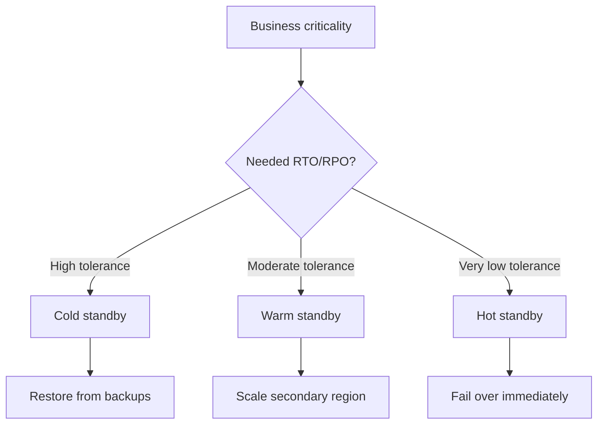
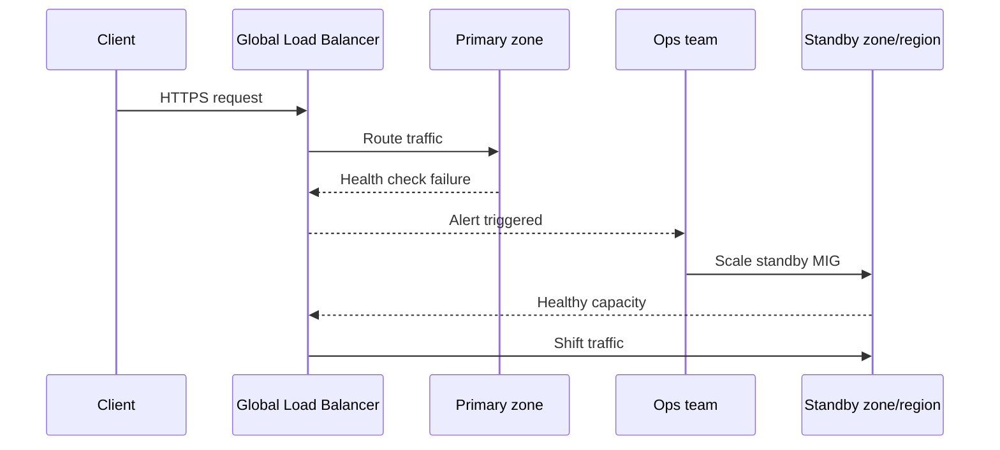
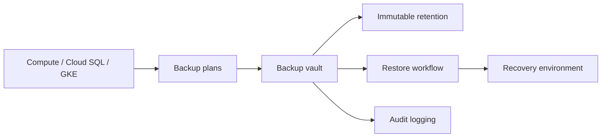
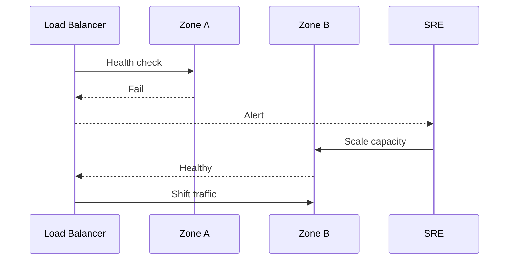
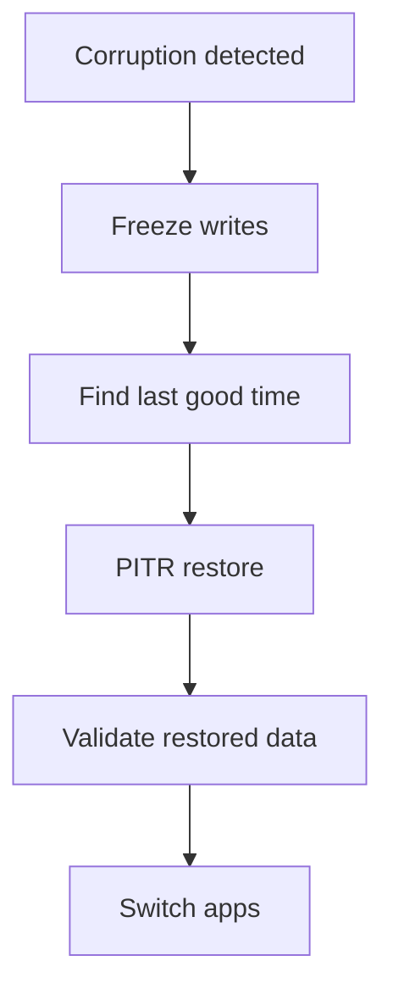
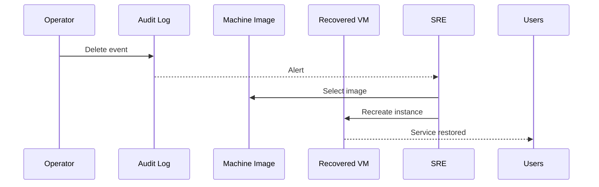
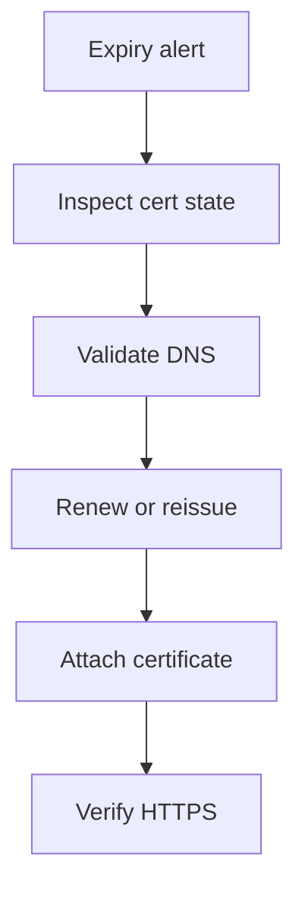
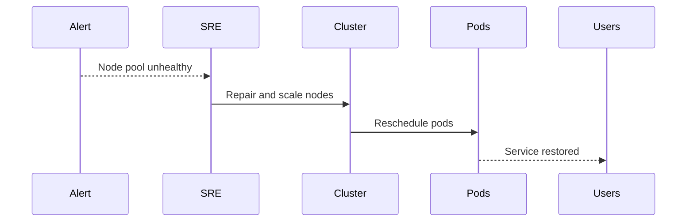
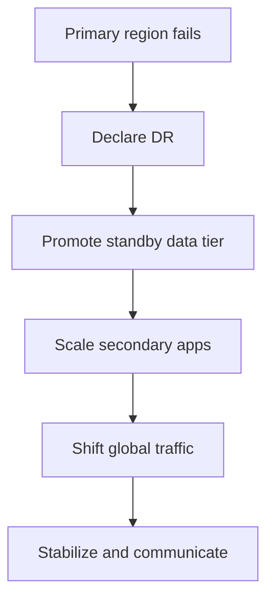
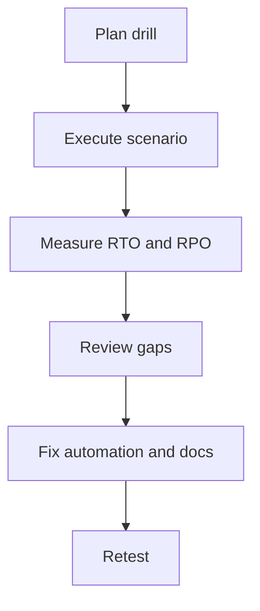

# 🚨 Production Disaster Recovery and Operational Scenarios on Google Cloud

> Production DR and operations guide for GCP covering RPO/RTO, Compute Engine recovery, Backup and DR service, multi-region design, incident response, maintenance, monitoring, testing, and compliance.

**Audience:** SRE, platform engineering, security operations, incident commanders, and infrastructure architects.

---

## 📚 Table of Contents
1. [GCP DR Overview](#gcp-dr-overview)
2. [Compute Engine Disaster Recovery](#compute-engine-disaster-recovery)
3. [GCP Backup & DR Service](#gcp-backup--dr-service)
4. [Multi-Region HA Architecture](#multi-region-ha-architecture)
5. [Production Incident Response Scenarios](#production-incident-response-scenarios)
6. [Production Maintenance Operations](#production-maintenance-operations)
7. [Monitoring & Alerting for Production](#monitoring--alerting-for-production)
8. [DR Testing & Compliance](#dr-testing--compliance)
9. [Appendix A: Verification Outputs](#appendix-a-verification-outputs)
10. [Appendix B: Terraform Snippets](#appendix-b-terraform-snippets)
11. [Appendix C: Recovery Runbook Checklists](#appendix-c-recovery-runbook-checklists)
12. [Appendix D: Escalation Matrix](#appendix-d-escalation-matrix)
13. [Appendix E: Extended FAQ](#appendix-e-extended-faq)

---

## 1. 🧭 GCP DR Overview

Disaster recovery on GCP is about matching technical controls to business tolerance. The best architecture is the one that repeatedly meets RTO and RPO targets under test—not the one that looks most impressive on a slide.

| Objective | Meaning | Example question |
|---|---|---|
| RPO | Maximum acceptable data loss in time | How many minutes of transactions can we lose? |
| RTO | Maximum acceptable time to restore service | How quickly must users be served again? |


| Pattern | Cost | RTO | RPO | Typical GCP implementation |
|---|---:|---:|---:|---|
| Cold standby | Low | Hours | Hours to day | Backups, snapshots, machine images, IaC rebuild |
| Warm standby | Medium | Minutes to hours | Minutes | Scaled-down secondary region plus replicated data |
| Hot standby | High | Seconds to minutes | Near-zero | Ready second region or multi-region service |

#### Regions and zones guidance
- Design for zone failures even when the formal DR scope is regional outage.
- Document which services are zonal, regional, or global to avoid false assumptions.
- Keep business and technology RTO/RPO values aligned and version controlled.

---

## 2. 💻 Compute Engine Disaster Recovery

#### Persistent disk snapshots (scheduled)
```bash
gcloud compute resource-policies create snapshot-schedule daily-prod-snapshots --region=us-central1 --max-retention-days=14 --start-time=03:00 --daily-schedule
gcloud compute disks add-resource-policies web-boot-disk --resource-policies=daily-prod-snapshots --zone=us-central1-a
gcloud compute resource-policies describe daily-prod-snapshots --region=us-central1
```

#### Machine images for full VM backup
```bash
gcloud compute machine-images create web-prod-image-20250118 --source-instance=web-prod-01 --source-instance-zone=us-central1-a
gcloud compute instances create recovered-web-01 --source-machine-image=web-prod-image-20250118 --zone=us-east1-b
```

#### Cross-region snapshot copy
```bash
gcloud compute snapshots create db-disk-snap-20250118 --source-disk=db-disk-01 --source-disk-zone=us-central1-a --storage-location=us
gcloud compute disks create db-disk-recovery --source-snapshot=db-disk-snap-20250118 --zone=us-east1-b --type=pd-ssd
```

#### Instance template + MIG recovery
```bash
gcloud compute instance-templates create web-template-v1 --machine-type=e2-standard-4 --image-family=debian-12 --image-project=debian-cloud --metadata-from-file startup-script=startup-script.sh
gcloud compute instance-groups managed create web-mig-uscentral1 --template=web-template-v1 --size=3 --zones=us-central1-a,us-central1-b
gcloud compute instance-groups managed create web-mig-useast1 --template=web-template-v1 --size=1 --zones=us-east1-b,us-east1-c
```

#### DR failover walkthrough
- Detect failure with health checks and uptime alerts.
- Classify the event as zonal, regional, or application-only.
- Scale standby MIG or recreate instances from images.
- Reattach stateful disks or restore data if needed.
- Shift traffic with LB or DNS according to runbook.


```text
$ gcloud compute instance-groups managed list
NAME                LOCATION      SCOPE   TARGET_SIZE  INSTANCE_TEMPLATE
web-mig-uscentral1  us-central1   region  3            web-template-v1
web-mig-useast1     us-east1      region  1            web-template-v1
```

---

## 3. 💾 GCP Backup & DR Service

#### Backup and DR service setup
```bash
gcloud backup-dr backup-vaults create prod-vault --location=us-central1 --backup-minimum-enforced-retention-duration=1209600s
gcloud backup-dr backup-vaults describe prod-vault --location=us-central1
gcloud backup-dr data-sources list --location=us-central1
```

| Service | Native option | Backup and DR role | Notes |
|---|---|---|---|
| Compute Engine | Snapshots and machine images | Centralized policy and restore tracking | Pair with stateless bootstrapping |
| Cloud SQL | Automated backups and PITR | Governance and immutable retention | PITR often fastest for corruption |
| GKE | Backup for GKE / Velero patterns | Policy and vaulted protection | Protect cluster objects and volumes |
#### On-demand and scheduled backups
```bash
gcloud sql backups create --instance=prod-pg-uscentral1
gcloud sql backups list --instance=prod-pg-uscentral1
gcloud container backup-restore backup-plans create prod-gke-backup --cluster=prod-gke --location=us-central1 --cron-schedule="0 */6 * * *" --retention-days=14
```

#### Restore scenarios
- Restore a deleted VM from a machine image.
- Restore Cloud SQL to a point in time after corruption.
- Restore a GKE namespace after a bad deployment.
- Restore vaulted data after a ransomware event.

#### Backup vault (immutable backups)
- Use immutability to defend against malicious deletion.
- Apply separation of duties and audit logging.
- Test vaulted restore procedures, not just backup creation.


```hcl
resource "google_backup_dr_backup_vault" "prod" {
  location                                   = "us-central1"
  backup_vault_id                            = "prod-vault"
  backup_minimum_enforced_retention_duration = "1209600s"
}
```

---

## 4. 🌍 Multi-Region HA Architecture

#### Global HTTP(S) LB with multi-region backends
```bash
gcloud compute backend-services create web-backend --global --load-balancing-scheme=EXTERNAL_MANAGED --protocol=HTTP --health-checks=web-hc
gcloud compute backend-services add-backend web-backend --global --instance-group=web-mig-uscentral1 --instance-group-region=us-central1
gcloud compute backend-services add-backend web-backend --global --instance-group=web-mig-useast1 --instance-group-region=us-east1
```

#### Cloud SQL HA and cross-region replica guidance
- Use regional HA for zonal resilience and cross-region replicas for DR.
- Keep PITR enabled even when replicas exist.
- Document promotion and connection-switch procedures.

#### Spanner multi-region configuration
```bash
gcloud spanner instances create prod-global --config=nam10 --processing-units=3000 --description="Prod multi-region"
gcloud spanner databases create appdb --instance=prod-global
```

#### Cloud Storage dual-region and multi-region
```bash
gcloud storage buckets create gs://prod-artifacts-dual --location=US-CENTRAL1+US-EAST1 --default-storage-class=STANDARD
gcloud storage buckets update gs://prod-artifacts-dual --versioning
```

#### GKE multi-cluster with Fleet
```bash
gcloud container fleet memberships register prod-gke-uscentral1 --gke-cluster=us-central1/prod-gke --enable-workload-identity
gcloud container fleet memberships register prod-gke-useast1 --gke-cluster=us-east1/prod-gke-dr --enable-workload-identity
```

```mermaid
flowchart LR
    Users[Global users] --> GLB[Global HTTP(S) Load Balancer]
    GLB --> USC[us-central1 app tier]
    GLB --> USE[us-east1 app tier]
    USC --> SQL[Cloud SQL HA primary]
    SQL --> Replica[Cross-region read replica]
    USC --> GCS[Dual-region GCS]
    USE --> GCS
    USC --> GKE1[GKE cluster 1]
    USE --> GKE2[GKE cluster 2]
    GKE1 --> Fleet[Fleet]
    GKE2 --> Fleet
```
---

## 5. 🩺 Production Incident Response Scenarios

### 5.1 Scenario 1: Zone goes down — zonal failover with MIG

#### Impact
A zonal outage makes one app zone unavailable.

#### Detection
- Health check failures
- Backend unhealthy alerts
- User latency spike

#### Response
- Confirm blast radius
- Scale healthy zones
- Remove or drain dead backends

#### Commands
```bash
gcloud compute instance-groups managed resize web-mig-uscentral1 --size=6 --region=us-central1
gcloud compute backend-services get-health web-backend --global
```

#### Recovery
- Traffic stabilizes in healthy zones.

#### Post-mortem
- Review autoscaler and minimum capacity settings.

```text
$ echo "incident verification"
incident verification
Alert status: ACKNOWLEDGED
Recovery action: COMPLETE
Service health: GREEN
```


#### Additional operator notes
- Maintain a UTC timeline.
- Record who approved risky actions.
- Preserve evidence for audit and review.
- Do not destroy the failed environment before forensics and lessons learned.

### 5.2 Scenario 2: Cloud SQL corruption — point-in-time recovery (PITR)

#### Impact
A bad deployment corrupts production data.

#### Detection
- Integrity alerts
- App errors
- Audit logs show destructive query

#### Response
- Freeze writes
- Identify last good timestamp
- Restore new instance with PITR
- Validate and switch

#### Commands
```bash
gcloud sql instances clone prod-pg-uscentral1 prod-pg-pitr-test --point-in-time="2025-01-18T14:22:00Z"
gcloud sql instances describe prod-pg-pitr-test
```

#### Recovery
- Recovered instance becomes new production source.

#### Post-mortem
- Document time to safe restore point and missing guardrails.

```text
$ echo "incident verification"
incident verification
Alert status: ACKNOWLEDGED
Recovery action: COMPLETE
Service health: GREEN
```


#### Additional operator notes
- Maintain a UTC timeline.
- Record who approved risky actions.
- Preserve evidence for audit and review.
- Do not destroy the failed environment before forensics and lessons learned.

### 5.3 Scenario 3: Ransomware — backup vault restore

#### Impact
Production files are encrypted or deleted by an attacker.

#### Detection
- Security alerts
- Unexpected file changes
- Deletion attempts denied

#### Response
- Isolate environment
- Validate immutable backups
- Restore into clean project
- Rotate secrets and identities

#### Commands
```bash
gcloud backup-dr backup-vaults describe prod-vault --location=us-central1
gcloud backup-dr recoveries list --location=us-central1
```

#### Recovery
- Recovered workloads run in a clean environment.

#### Post-mortem
- Review identity compromise path and vault protections.

```text
$ echo "incident verification"
incident verification
Alert status: ACKNOWLEDGED
Recovery action: COMPLETE
Service health: GREEN
```


#### Additional operator notes
- Maintain a UTC timeline.
- Record who approved risky actions.
- Preserve evidence for audit and review.
- Do not destroy the failed environment before forensics and lessons learned.

### 5.4 Scenario 4: Accidental VM deletion — machine image recovery

#### Impact
An operator deletes a critical legacy VM.

#### Detection
- Audit logs
- Service health failure
- Pager alert

#### Response
- Identify latest machine image
- Recreate VM
- Reattach IP or backend membership
- Validate startup

#### Commands
```bash
gcloud compute machine-images list --filter="name~legacy-app"
gcloud compute instances create legacy-app-recovered --source-machine-image=legacy-app-20250118 --zone=us-central1-b
```

#### Recovery
- Service returns after recreation.

#### Post-mortem
- Add deletion protection and tighten IAM.

```text
$ echo "incident verification"
incident verification
Alert status: ACKNOWLEDGED
Recovery action: COMPLETE
Service health: GREEN
```


#### Additional operator notes
- Maintain a UTC timeline.
- Record who approved risky actions.
- Preserve evidence for audit and review.
- Do not destroy the failed environment before forensics and lessons learned.

### 5.5 Scenario 5: SSL certificate expiry — Google-managed cert renewal

#### Impact
A production HTTPS certificate approaches expiry or fails validation.

#### Detection
- Certificate expiry alerts
- Browser warnings
- LB cert status changes

#### Response
- Check managed cert state
- Validate DNS and domain ownership
- Reattach or reissue cert
- Verify HTTPS

#### Commands
```bash
gcloud compute ssl-certificates list
gcloud certificate-manager certificates list
```

#### Recovery
- Certificate returns to ACTIVE.

#### Post-mortem
- Review why alerts did not trigger action earlier.

```text
$ echo "incident verification"
incident verification
Alert status: ACKNOWLEDGED
Recovery action: COMPLETE
Service health: GREEN
```


#### Additional operator notes
- Maintain a UTC timeline.
- Record who approved risky actions.
- Preserve evidence for audit and review.
- Do not destroy the failed environment before forensics and lessons learned.

### 5.6 Scenario 6: GCS bucket data loss — object versioning recovery

#### Impact
Critical objects are overwritten or deleted in a versioned bucket.

#### Detection
- Deletion logs
- Application 404s
- Storage alert

#### Response
- List versions
- Restore correct generation
- Lock down IAM if compromise suspected
- Review lifecycle rules

#### Commands
```bash
gcloud storage ls --all-versions gs://prod-bucket/path/
gcloud storage cp gs://prod-bucket/path/file.txt#123456789 ./file.txt
```

#### Recovery
- Correct generation is restored.

#### Post-mortem
- Update retention and lifecycle safeguards.

```text
$ echo "incident verification"
incident verification
Alert status: ACKNOWLEDGED
Recovery action: COMPLETE
Service health: GREEN
```


#### Additional operator notes
- Maintain a UTC timeline.
- Record who approved risky actions.
- Preserve evidence for audit and review.
- Do not destroy the failed environment before forensics and lessons learned.

### 5.7 Scenario 7: GKE cluster issues — node pool repair and pod rescheduling

#### Impact
A node pool becomes unhealthy after patching or failure.

#### Detection
- Node NotReady
- Pod crashes
- Service errors

#### Response
- Repair or replace nodes
- Scale healthy pool
- Check PDBs and anti-affinity
- Rollback bad deployment if needed

#### Commands
```bash
kubectl get nodes
kubectl get pods -A
gcloud container clusters upgrade prod-gke --node-pool=default-pool --cluster-version=latest --location=us-central1
```

#### Recovery
- Pods reschedule and service recovers.

#### Post-mortem
- Assess patch process and scheduling safeguards.

```text
$ echo "incident verification"
incident verification
Alert status: ACKNOWLEDGED
Recovery action: COMPLETE
Service health: GREEN
```


#### Additional operator notes
- Maintain a UTC timeline.
- Record who approved risky actions.
- Preserve evidence for audit and review.
- Do not destroy the failed environment before forensics and lessons learned.

### 5.8 Scenario 8: Regional outage — cross-region DR activation with global LB

#### Impact
A full regional outage affects the primary stack.

#### Detection
- Regional health failures
- Provider health notice
- Global latency spike

#### Response
- Declare DR incident
- Promote standby data tier
- Scale secondary region
- Shift load balancer traffic
- Communicate status

#### Commands
```bash
gcloud compute backend-services update-backend web-backend --global --instance-group=web-mig-uscentral1 --instance-group-region=us-central1 --balancing-mode=UTILIZATION --capacity-scaler=0
gcloud compute instance-groups managed resize web-mig-useast1 --size=8 --region=us-east1
```

#### Recovery
- Traffic serves from secondary region.

#### Post-mortem
- Review actual RTO/RPO versus objective.

```text
$ echo "incident verification"
incident verification
Alert status: ACKNOWLEDGED
Recovery action: COMPLETE
Service health: GREEN
```


#### Additional operator notes
- Maintain a UTC timeline.
- Record who approved risky actions.
- Preserve evidence for audit and review.
- Do not destroy the failed environment before forensics and lessons learned.

## 6. 🔧 Production Maintenance Operations

### 6.1 Maintenance windows for Cloud SQL
#### Commands
```bash
gcloud sql instances patch prod-pg-uscentral1 --maintenance-window-day=7 --maintenance-window-hour=4
gcloud sql instances describe prod-pg-uscentral1 --format="value(settings.maintenanceWindow.day,settings.maintenanceWindow.hour)"
```

#### Operational notes
- Define owner and approval path.
- Test in lower environments when feasible.
- Measure impact after the change.
- Record evidence and rollback status.

### 6.2 OS patch management with OS Patch Management service
#### Commands
```bash
gcloud compute os-config patch-jobs execute --instance-filter-all --description="monthly-linux-patch" --duration=7200s
gcloud compute os-config patch-jobs list
```

#### Operational notes
- Define owner and approval path.
- Test in lower environments when feasible.
- Measure impact after the change.
- Record evidence and rollback status.

### 6.3 Secret rotation with Secret Manager
#### Commands
```bash
gcloud secrets versions add db-password --data-file=password.txt
gcloud secrets versions list db-password
```

#### Operational notes
- Define owner and approval path.
- Test in lower environments when feasible.
- Measure impact after the change.
- Record evidence and rollback status.

### 6.4 Certificate management with Certificate Manager
#### Commands
```bash
gcloud certificate-manager certificates create web-managed-cert --domains=app.example.com
gcloud certificate-manager certificates describe web-managed-cert
```

#### Operational notes
- Define owner and approval path.
- Test in lower environments when feasible.
- Measure impact after the change.
- Record evidence and rollback status.

### 6.5 Autoscaler adjustments
#### Commands
```bash
gcloud compute instance-groups managed set-autoscaling web-mig-uscentral1 --region=us-central1 --min-num-replicas=3 --max-num-replicas=10 --target-cpu-utilization=0.55
```

#### Operational notes
- Define owner and approval path.
- Test in lower environments when feasible.
- Measure impact after the change.
- Record evidence and rollback status.

### 6.6 Cost optimization (CUDs, Spot VMs, scheduled scaling)
#### Commands
```bash
gcloud beta billing commitments list
gcloud compute instances create worker-spot-01 --provisioning-model=SPOT --zone=us-central1-a
```

#### Operational notes
- Define owner and approval path.
- Test in lower environments when feasible.
- Measure impact after the change.
- Record evidence and rollback status.

### 6.7 Live migration for Compute Engine
#### Commands
```bash
gcloud compute instances describe web-prod-01 --zone=us-central1-a --format="value(scheduling.onHostMaintenance)"
```

#### Operational notes
- Define owner and approval path.
- Test in lower environments when feasible.
- Measure impact after the change.
- Record evidence and rollback status.

## 7. 📡 Monitoring & Alerting for Production

#### Critical Cloud Monitoring alerts
- VM unavailable or LB health check failed
- Cloud SQL CPU, memory, or storage threshold breach
- Backup failure
- Certificate expiry under 14 days
- GKE node NotReady
- Error-rate or SLO burn-rate alert
- Pub/Sub backlog
- Unexpected egress or billing anomaly

#### Google Cloud Service Health
- Subscribe operations teams to provider health notifications for critical services and regions.
- Cross-reference provider notices with internal telemetry during incidents.

#### Pub/Sub alerting integration
```bash
gcloud monitoring channels create --display-name="prod-pager" --type=email --channel-labels=email_address=platform-oncall@example.com
gcloud pubsub topics create ops-alerts
gcloud pubsub subscriptions create ops-alerts-sub --topic=ops-alerts
```

| Severity | Initial channel | Escalation |
|---|---|---|
| SEV1 | Pager + bridge | Executive comms + vendor support |
| SEV2 | Pager + chat | Platform lead after 15 min |
| SEV3 | Ticket + chat | Business-hours follow-up |
| SEV4 | Ticket only | Weekly ops review |
#### Auto-remediation with Cloud Functions
- Use auto-remediation only for deterministic, low-risk actions.
- Do not fully automate complex DR failover without strong guardrails and approval.

```python
def remediate_pubsub(event, context):
    print("Received alert event; evaluate runbook trigger")
    return "ack"
```


---

## 8. �� DR Testing & Compliance

#### DR drill procedures
- Define scenario, expected RTO/RPO, scope, and observers.
- Run the drill from the same runbook the team would use in production.
- Capture actual recovery time and blockers.
- Update automation and documentation after the drill.

```bash
chaos run gcp-zone-failure.json
chaos run gke-node-pool-failure.json
```

| Framework | DR relevance |
|---|---|
| SOC 2 | Evidence of backup, restore, access control, and incident handling |
| ISO 27001 | Business continuity controls and documented procedures |
| HIPAA | Availability and contingency planning evidence |
| FedRAMP | Recovery documentation and continuous monitoring controls |
#### Architecture review checklist
- [ ] All tier-1 services have RTO and RPO defined.
- [ ] Failover path is automated where possible.
- [ ] DNS, IAM, secrets, and certificates are part of recovery design.
- [ ] Backup retention and immutability are tested.
- [ ] A recent drill report exists for every critical service.


---

## 9. 🧾 Appendix A: Verification Outputs
### Snapshot schedule
```text
$ gcloud compute resource-policies describe daily-prod-snapshots --region=us-central1
name: daily-prod-snapshots
status: READY
```

### Cloud SQL backups
```text
$ gcloud sql backups list --instance=prod-pg-uscentral1
ID        WINDOW_START_TIME              STATUS
17371540  2025-01-18T02:30:04.010Z      SUCCESSFUL
```

### Certificate status
```text
$ gcloud certificate-manager certificates describe web-managed-cert
state: ACTIVE
san_dnsnames:
- app.example.com
```

## 10. 🏗️ Appendix B: Terraform Snippets
### Snippet 1
```hcl
resource "google_compute_instance_template" "web" {
  name_prefix  = "web-template-"
  machine_type = "e2-standard-4"
}
```

### Snippet 2
```hcl
resource "google_compute_region_instance_group_manager" "web" {
  name               = "web-mig-uscentral1"
  base_instance_name = "web"
  region             = "us-central1"
}
```

### Snippet 3
```hcl
resource "google_storage_bucket" "dual" {
  name     = "prod-artifacts-dual"
  location = "US-CENTRAL1+US-EAST1"
  versioning { enabled = true }
}
```

## 11. ✅ Appendix C: Recovery Runbook Checklists
### Before incident
- [ ] On-call roster current
- [ ] Runbooks reviewed
- [ ] Backups validated
- [ ] Pager routes tested

### During incident
- [ ] Severity declared
- [ ] Timeline started
- [ ] Stakeholders notified
- [ ] Primary owner assigned

### After incident
- [ ] Recovery verified
- [ ] Evidence captured
- [ ] Post-mortem scheduled
- [ ] Action items tracked

## 12. ☎️ Appendix D: Escalation Matrix
| Role | Responsibility | Escalate after |
|---|---|---|
| Primary on-call | First response and triage | Immediate |
| Service owner | Approves risky changes and rollback | 15 minutes for SEV1 |
| Incident commander | Coordinates major incidents | Immediate for SEV1 |
| Security lead | Engaged for compromise or ransomware | Immediate when security suspected |
| Executive comms | Customer and business messaging | 30 minutes for prolonged SEV1 |

## 13. ❓ Appendix E: Extended FAQ
### FAQ 1: How often should DR drills run?
Answer 1: Quarterly for tier-1 services is a strong baseline. Teams should add service-specific thresholds, contacts, and audit evidence expectations.

### FAQ 2: Are backups enough for resilience?
Answer 2: No. You still need HA, failover, and tested runbooks. Teams should add service-specific thresholds, contacts, and audit evidence expectations.

### FAQ 3: What is fastest recovery for a deleted VM?
Answer 3: Usually MIG replacement or machine image recreation. Teams should add service-specific thresholds, contacts, and audit evidence expectations.

### FAQ 4: Should every service be multi-region?
Answer 4: No. Match cost and complexity to business criticality. Teams should add service-specific thresholds, contacts, and audit evidence expectations.

### FAQ 5: Can auto-remediation replace human response?
Answer 5: No. It should only assist with safe, deterministic actions. Teams should add service-specific thresholds, contacts, and audit evidence expectations.

### FAQ 6: How often should DR drills run?
Answer 6: Quarterly for tier-1 services is a strong baseline. Teams should add service-specific thresholds, contacts, and audit evidence expectations.

### FAQ 7: Are backups enough for resilience?
Answer 7: No. You still need HA, failover, and tested runbooks. Teams should add service-specific thresholds, contacts, and audit evidence expectations.

### FAQ 8: What is fastest recovery for a deleted VM?
Answer 8: Usually MIG replacement or machine image recreation. Teams should add service-specific thresholds, contacts, and audit evidence expectations.

### FAQ 9: Should every service be multi-region?
Answer 9: No. Match cost and complexity to business criticality. Teams should add service-specific thresholds, contacts, and audit evidence expectations.

### FAQ 10: Can auto-remediation replace human response?
Answer 10: No. It should only assist with safe, deterministic actions. Teams should add service-specific thresholds, contacts, and audit evidence expectations.

### FAQ 11: How often should DR drills run?
Answer 11: Quarterly for tier-1 services is a strong baseline. Teams should add service-specific thresholds, contacts, and audit evidence expectations.

### FAQ 12: Are backups enough for resilience?
Answer 12: No. You still need HA, failover, and tested runbooks. Teams should add service-specific thresholds, contacts, and audit evidence expectations.

### FAQ 13: What is fastest recovery for a deleted VM?
Answer 13: Usually MIG replacement or machine image recreation. Teams should add service-specific thresholds, contacts, and audit evidence expectations.

### FAQ 14: Should every service be multi-region?
Answer 14: No. Match cost and complexity to business criticality. Teams should add service-specific thresholds, contacts, and audit evidence expectations.

### FAQ 15: Can auto-remediation replace human response?
Answer 15: No. It should only assist with safe, deterministic actions. Teams should add service-specific thresholds, contacts, and audit evidence expectations.

### FAQ 16: How often should DR drills run?
Answer 16: Quarterly for tier-1 services is a strong baseline. Teams should add service-specific thresholds, contacts, and audit evidence expectations.

### FAQ 17: Are backups enough for resilience?
Answer 17: No. You still need HA, failover, and tested runbooks. Teams should add service-specific thresholds, contacts, and audit evidence expectations.

### FAQ 18: What is fastest recovery for a deleted VM?
Answer 18: Usually MIG replacement or machine image recreation. Teams should add service-specific thresholds, contacts, and audit evidence expectations.

### FAQ 19: Should every service be multi-region?
Answer 19: No. Match cost and complexity to business criticality. Teams should add service-specific thresholds, contacts, and audit evidence expectations.

### FAQ 20: Can auto-remediation replace human response?
Answer 20: No. It should only assist with safe, deterministic actions. Teams should add service-specific thresholds, contacts, and audit evidence expectations.

### FAQ 21: How often should DR drills run?
Answer 21: Quarterly for tier-1 services is a strong baseline. Teams should add service-specific thresholds, contacts, and audit evidence expectations.

### FAQ 22: Are backups enough for resilience?
Answer 22: No. You still need HA, failover, and tested runbooks. Teams should add service-specific thresholds, contacts, and audit evidence expectations.

### FAQ 23: What is fastest recovery for a deleted VM?
Answer 23: Usually MIG replacement or machine image recreation. Teams should add service-specific thresholds, contacts, and audit evidence expectations.

### FAQ 24: Should every service be multi-region?
Answer 24: No. Match cost and complexity to business criticality. Teams should add service-specific thresholds, contacts, and audit evidence expectations.

### FAQ 25: Can auto-remediation replace human response?
Answer 25: No. It should only assist with safe, deterministic actions. Teams should add service-specific thresholds, contacts, and audit evidence expectations.

### FAQ 26: How often should DR drills run?
Answer 26: Quarterly for tier-1 services is a strong baseline. Teams should add service-specific thresholds, contacts, and audit evidence expectations.

### FAQ 27: Are backups enough for resilience?
Answer 27: No. You still need HA, failover, and tested runbooks. Teams should add service-specific thresholds, contacts, and audit evidence expectations.

### FAQ 28: What is fastest recovery for a deleted VM?
Answer 28: Usually MIG replacement or machine image recreation. Teams should add service-specific thresholds, contacts, and audit evidence expectations.

### FAQ 29: Should every service be multi-region?
Answer 29: No. Match cost and complexity to business criticality. Teams should add service-specific thresholds, contacts, and audit evidence expectations.

### FAQ 30: Can auto-remediation replace human response?
Answer 30: No. It should only assist with safe, deterministic actions. Teams should add service-specific thresholds, contacts, and audit evidence expectations.

### FAQ 31: How often should DR drills run?
Answer 31: Quarterly for tier-1 services is a strong baseline. Teams should add service-specific thresholds, contacts, and audit evidence expectations.

### FAQ 32: Are backups enough for resilience?
Answer 32: No. You still need HA, failover, and tested runbooks. Teams should add service-specific thresholds, contacts, and audit evidence expectations.

### FAQ 33: What is fastest recovery for a deleted VM?
Answer 33: Usually MIG replacement or machine image recreation. Teams should add service-specific thresholds, contacts, and audit evidence expectations.

### FAQ 34: Should every service be multi-region?
Answer 34: No. Match cost and complexity to business criticality. Teams should add service-specific thresholds, contacts, and audit evidence expectations.

### FAQ 35: Can auto-remediation replace human response?
Answer 35: No. It should only assist with safe, deterministic actions. Teams should add service-specific thresholds, contacts, and audit evidence expectations.

### FAQ 36: How often should DR drills run?
Answer 36: Quarterly for tier-1 services is a strong baseline. Teams should add service-specific thresholds, contacts, and audit evidence expectations.

### FAQ 37: Are backups enough for resilience?
Answer 37: No. You still need HA, failover, and tested runbooks. Teams should add service-specific thresholds, contacts, and audit evidence expectations.

### FAQ 38: What is fastest recovery for a deleted VM?
Answer 38: Usually MIG replacement or machine image recreation. Teams should add service-specific thresholds, contacts, and audit evidence expectations.

### FAQ 39: Should every service be multi-region?
Answer 39: No. Match cost and complexity to business criticality. Teams should add service-specific thresholds, contacts, and audit evidence expectations.

### FAQ 40: Can auto-remediation replace human response?
Answer 40: No. It should only assist with safe, deterministic actions. Teams should add service-specific thresholds, contacts, and audit evidence expectations.

### FAQ 41: How often should DR drills run?
Answer 41: Quarterly for tier-1 services is a strong baseline. Teams should add service-specific thresholds, contacts, and audit evidence expectations.

### FAQ 42: Are backups enough for resilience?
Answer 42: No. You still need HA, failover, and tested runbooks. Teams should add service-specific thresholds, contacts, and audit evidence expectations.

### FAQ 43: What is fastest recovery for a deleted VM?
Answer 43: Usually MIG replacement or machine image recreation. Teams should add service-specific thresholds, contacts, and audit evidence expectations.

### FAQ 44: Should every service be multi-region?
Answer 44: No. Match cost and complexity to business criticality. Teams should add service-specific thresholds, contacts, and audit evidence expectations.

### FAQ 45: Can auto-remediation replace human response?
Answer 45: No. It should only assist with safe, deterministic actions. Teams should add service-specific thresholds, contacts, and audit evidence expectations.

### FAQ 46: How often should DR drills run?
Answer 46: Quarterly for tier-1 services is a strong baseline. Teams should add service-specific thresholds, contacts, and audit evidence expectations.

### FAQ 47: Are backups enough for resilience?
Answer 47: No. You still need HA, failover, and tested runbooks. Teams should add service-specific thresholds, contacts, and audit evidence expectations.

### FAQ 48: What is fastest recovery for a deleted VM?
Answer 48: Usually MIG replacement or machine image recreation. Teams should add service-specific thresholds, contacts, and audit evidence expectations.

### FAQ 49: Should every service be multi-region?
Answer 49: No. Match cost and complexity to business criticality. Teams should add service-specific thresholds, contacts, and audit evidence expectations.

### FAQ 50: Can auto-remediation replace human response?
Answer 50: No. It should only assist with safe, deterministic actions. Teams should add service-specific thresholds, contacts, and audit evidence expectations.

### FAQ 51: How often should DR drills run?
Answer 51: Quarterly for tier-1 services is a strong baseline. Teams should add service-specific thresholds, contacts, and audit evidence expectations.

### FAQ 52: Are backups enough for resilience?
Answer 52: No. You still need HA, failover, and tested runbooks. Teams should add service-specific thresholds, contacts, and audit evidence expectations.

### FAQ 53: What is fastest recovery for a deleted VM?
Answer 53: Usually MIG replacement or machine image recreation. Teams should add service-specific thresholds, contacts, and audit evidence expectations.

### FAQ 54: Should every service be multi-region?
Answer 54: No. Match cost and complexity to business criticality. Teams should add service-specific thresholds, contacts, and audit evidence expectations.

### FAQ 55: Can auto-remediation replace human response?
Answer 55: No. It should only assist with safe, deterministic actions. Teams should add service-specific thresholds, contacts, and audit evidence expectations.

### FAQ 56: How often should DR drills run?
Answer 56: Quarterly for tier-1 services is a strong baseline. Teams should add service-specific thresholds, contacts, and audit evidence expectations.

### FAQ 57: Are backups enough for resilience?
Answer 57: No. You still need HA, failover, and tested runbooks. Teams should add service-specific thresholds, contacts, and audit evidence expectations.

### FAQ 58: What is fastest recovery for a deleted VM?
Answer 58: Usually MIG replacement or machine image recreation. Teams should add service-specific thresholds, contacts, and audit evidence expectations.

### FAQ 59: Should every service be multi-region?
Answer 59: No. Match cost and complexity to business criticality. Teams should add service-specific thresholds, contacts, and audit evidence expectations.

### FAQ 60: Can auto-remediation replace human response?
Answer 60: No. It should only assist with safe, deterministic actions. Teams should add service-specific thresholds, contacts, and audit evidence expectations.

### FAQ 61: How often should DR drills run?
Answer 61: Quarterly for tier-1 services is a strong baseline. Teams should add service-specific thresholds, contacts, and audit evidence expectations.

### FAQ 62: Are backups enough for resilience?
Answer 62: No. You still need HA, failover, and tested runbooks. Teams should add service-specific thresholds, contacts, and audit evidence expectations.

### FAQ 63: What is fastest recovery for a deleted VM?
Answer 63: Usually MIG replacement or machine image recreation. Teams should add service-specific thresholds, contacts, and audit evidence expectations.

### FAQ 64: Should every service be multi-region?
Answer 64: No. Match cost and complexity to business criticality. Teams should add service-specific thresholds, contacts, and audit evidence expectations.

### FAQ 65: Can auto-remediation replace human response?
Answer 65: No. It should only assist with safe, deterministic actions. Teams should add service-specific thresholds, contacts, and audit evidence expectations.

### FAQ 66: How often should DR drills run?
Answer 66: Quarterly for tier-1 services is a strong baseline. Teams should add service-specific thresholds, contacts, and audit evidence expectations.

### FAQ 67: Are backups enough for resilience?
Answer 67: No. You still need HA, failover, and tested runbooks. Teams should add service-specific thresholds, contacts, and audit evidence expectations.

### FAQ 68: What is fastest recovery for a deleted VM?
Answer 68: Usually MIG replacement or machine image recreation. Teams should add service-specific thresholds, contacts, and audit evidence expectations.

### FAQ 69: Should every service be multi-region?
Answer 69: No. Match cost and complexity to business criticality. Teams should add service-specific thresholds, contacts, and audit evidence expectations.

### FAQ 70: Can auto-remediation replace human response?
Answer 70: No. It should only assist with safe, deterministic actions. Teams should add service-specific thresholds, contacts, and audit evidence expectations.

### FAQ 71: How often should DR drills run?
Answer 71: Quarterly for tier-1 services is a strong baseline. Teams should add service-specific thresholds, contacts, and audit evidence expectations.

### FAQ 72: Are backups enough for resilience?
Answer 72: No. You still need HA, failover, and tested runbooks. Teams should add service-specific thresholds, contacts, and audit evidence expectations.

### FAQ 73: What is fastest recovery for a deleted VM?
Answer 73: Usually MIG replacement or machine image recreation. Teams should add service-specific thresholds, contacts, and audit evidence expectations.

### FAQ 74: Should every service be multi-region?
Answer 74: No. Match cost and complexity to business criticality. Teams should add service-specific thresholds, contacts, and audit evidence expectations.

### FAQ 75: Can auto-remediation replace human response?
Answer 75: No. It should only assist with safe, deterministic actions. Teams should add service-specific thresholds, contacts, and audit evidence expectations.

### FAQ 76: How often should DR drills run?
Answer 76: Quarterly for tier-1 services is a strong baseline. Teams should add service-specific thresholds, contacts, and audit evidence expectations.

### FAQ 77: Are backups enough for resilience?
Answer 77: No. You still need HA, failover, and tested runbooks. Teams should add service-specific thresholds, contacts, and audit evidence expectations.

### FAQ 78: What is fastest recovery for a deleted VM?
Answer 78: Usually MIG replacement or machine image recreation. Teams should add service-specific thresholds, contacts, and audit evidence expectations.

### FAQ 79: Should every service be multi-region?
Answer 79: No. Match cost and complexity to business criticality. Teams should add service-specific thresholds, contacts, and audit evidence expectations.

### FAQ 80: Can auto-remediation replace human response?
Answer 80: No. It should only assist with safe, deterministic actions. Teams should add service-specific thresholds, contacts, and audit evidence expectations.

### FAQ 81: How often should DR drills run?
Answer 81: Quarterly for tier-1 services is a strong baseline. Teams should add service-specific thresholds, contacts, and audit evidence expectations.

### FAQ 82: Are backups enough for resilience?
Answer 82: No. You still need HA, failover, and tested runbooks. Teams should add service-specific thresholds, contacts, and audit evidence expectations.

### FAQ 83: What is fastest recovery for a deleted VM?
Answer 83: Usually MIG replacement or machine image recreation. Teams should add service-specific thresholds, contacts, and audit evidence expectations.

### FAQ 84: Should every service be multi-region?
Answer 84: No. Match cost and complexity to business criticality. Teams should add service-specific thresholds, contacts, and audit evidence expectations.

### FAQ 85: Can auto-remediation replace human response?
Answer 85: No. It should only assist with safe, deterministic actions. Teams should add service-specific thresholds, contacts, and audit evidence expectations.

### FAQ 86: How often should DR drills run?
Answer 86: Quarterly for tier-1 services is a strong baseline. Teams should add service-specific thresholds, contacts, and audit evidence expectations.

### FAQ 87: Are backups enough for resilience?
Answer 87: No. You still need HA, failover, and tested runbooks. Teams should add service-specific thresholds, contacts, and audit evidence expectations.

### FAQ 88: What is fastest recovery for a deleted VM?
Answer 88: Usually MIG replacement or machine image recreation. Teams should add service-specific thresholds, contacts, and audit evidence expectations.

### FAQ 89: Should every service be multi-region?
Answer 89: No. Match cost and complexity to business criticality. Teams should add service-specific thresholds, contacts, and audit evidence expectations.

### FAQ 90: Can auto-remediation replace human response?
Answer 90: No. It should only assist with safe, deterministic actions. Teams should add service-specific thresholds, contacts, and audit evidence expectations.

### FAQ 91: How often should DR drills run?
Answer 91: Quarterly for tier-1 services is a strong baseline. Teams should add service-specific thresholds, contacts, and audit evidence expectations.

### FAQ 92: Are backups enough for resilience?
Answer 92: No. You still need HA, failover, and tested runbooks. Teams should add service-specific thresholds, contacts, and audit evidence expectations.

### FAQ 93: What is fastest recovery for a deleted VM?
Answer 93: Usually MIG replacement or machine image recreation. Teams should add service-specific thresholds, contacts, and audit evidence expectations.

### FAQ 94: Should every service be multi-region?
Answer 94: No. Match cost and complexity to business criticality. Teams should add service-specific thresholds, contacts, and audit evidence expectations.

### FAQ 95: Can auto-remediation replace human response?
Answer 95: No. It should only assist with safe, deterministic actions. Teams should add service-specific thresholds, contacts, and audit evidence expectations.

### FAQ 96: How often should DR drills run?
Answer 96: Quarterly for tier-1 services is a strong baseline. Teams should add service-specific thresholds, contacts, and audit evidence expectations.

### FAQ 97: Are backups enough for resilience?
Answer 97: No. You still need HA, failover, and tested runbooks. Teams should add service-specific thresholds, contacts, and audit evidence expectations.

### FAQ 98: What is fastest recovery for a deleted VM?
Answer 98: Usually MIG replacement or machine image recreation. Teams should add service-specific thresholds, contacts, and audit evidence expectations.

### FAQ 99: Should every service be multi-region?
Answer 99: No. Match cost and complexity to business criticality. Teams should add service-specific thresholds, contacts, and audit evidence expectations.

### FAQ 100: Can auto-remediation replace human response?
Answer 100: No. It should only assist with safe, deterministic actions. Teams should add service-specific thresholds, contacts, and audit evidence expectations.

### FAQ 101: How often should DR drills run?
Answer 101: Quarterly for tier-1 services is a strong baseline. Teams should add service-specific thresholds, contacts, and audit evidence expectations.

### FAQ 102: Are backups enough for resilience?
Answer 102: No. You still need HA, failover, and tested runbooks. Teams should add service-specific thresholds, contacts, and audit evidence expectations.

### FAQ 103: What is fastest recovery for a deleted VM?
Answer 103: Usually MIG replacement or machine image recreation. Teams should add service-specific thresholds, contacts, and audit evidence expectations.

### FAQ 104: Should every service be multi-region?
Answer 104: No. Match cost and complexity to business criticality. Teams should add service-specific thresholds, contacts, and audit evidence expectations.

### FAQ 105: Can auto-remediation replace human response?
Answer 105: No. It should only assist with safe, deterministic actions. Teams should add service-specific thresholds, contacts, and audit evidence expectations.

### FAQ 106: How often should DR drills run?
Answer 106: Quarterly for tier-1 services is a strong baseline. Teams should add service-specific thresholds, contacts, and audit evidence expectations.

### FAQ 107: Are backups enough for resilience?
Answer 107: No. You still need HA, failover, and tested runbooks. Teams should add service-specific thresholds, contacts, and audit evidence expectations.

### FAQ 108: What is fastest recovery for a deleted VM?
Answer 108: Usually MIG replacement or machine image recreation. Teams should add service-specific thresholds, contacts, and audit evidence expectations.

### FAQ 109: Should every service be multi-region?
Answer 109: No. Match cost and complexity to business criticality. Teams should add service-specific thresholds, contacts, and audit evidence expectations.

### FAQ 110: Can auto-remediation replace human response?
Answer 110: No. It should only assist with safe, deterministic actions. Teams should add service-specific thresholds, contacts, and audit evidence expectations.

### FAQ 111: How often should DR drills run?
Answer 111: Quarterly for tier-1 services is a strong baseline. Teams should add service-specific thresholds, contacts, and audit evidence expectations.

### FAQ 112: Are backups enough for resilience?
Answer 112: No. You still need HA, failover, and tested runbooks. Teams should add service-specific thresholds, contacts, and audit evidence expectations.

### FAQ 113: What is fastest recovery for a deleted VM?
Answer 113: Usually MIG replacement or machine image recreation. Teams should add service-specific thresholds, contacts, and audit evidence expectations.

### FAQ 114: Should every service be multi-region?
Answer 114: No. Match cost and complexity to business criticality. Teams should add service-specific thresholds, contacts, and audit evidence expectations.

### FAQ 115: Can auto-remediation replace human response?
Answer 115: No. It should only assist with safe, deterministic actions. Teams should add service-specific thresholds, contacts, and audit evidence expectations.

### FAQ 116: How often should DR drills run?
Answer 116: Quarterly for tier-1 services is a strong baseline. Teams should add service-specific thresholds, contacts, and audit evidence expectations.

### FAQ 117: Are backups enough for resilience?
Answer 117: No. You still need HA, failover, and tested runbooks. Teams should add service-specific thresholds, contacts, and audit evidence expectations.

### FAQ 118: What is fastest recovery for a deleted VM?
Answer 118: Usually MIG replacement or machine image recreation. Teams should add service-specific thresholds, contacts, and audit evidence expectations.

### FAQ 119: Should every service be multi-region?
Answer 119: No. Match cost and complexity to business criticality. Teams should add service-specific thresholds, contacts, and audit evidence expectations.

### FAQ 120: Can auto-remediation replace human response?
Answer 120: No. It should only assist with safe, deterministic actions. Teams should add service-specific thresholds, contacts, and audit evidence expectations.

### FAQ 121: How often should DR drills run?
Answer 121: Quarterly for tier-1 services is a strong baseline. Teams should add service-specific thresholds, contacts, and audit evidence expectations.

### FAQ 122: Are backups enough for resilience?
Answer 122: No. You still need HA, failover, and tested runbooks. Teams should add service-specific thresholds, contacts, and audit evidence expectations.

### FAQ 123: What is fastest recovery for a deleted VM?
Answer 123: Usually MIG replacement or machine image recreation. Teams should add service-specific thresholds, contacts, and audit evidence expectations.

### FAQ 124: Should every service be multi-region?
Answer 124: No. Match cost and complexity to business criticality. Teams should add service-specific thresholds, contacts, and audit evidence expectations.

### FAQ 125: Can auto-remediation replace human response?
Answer 125: No. It should only assist with safe, deterministic actions. Teams should add service-specific thresholds, contacts, and audit evidence expectations.

### FAQ 126: How often should DR drills run?
Answer 126: Quarterly for tier-1 services is a strong baseline. Teams should add service-specific thresholds, contacts, and audit evidence expectations.

### FAQ 127: Are backups enough for resilience?
Answer 127: No. You still need HA, failover, and tested runbooks. Teams should add service-specific thresholds, contacts, and audit evidence expectations.

### FAQ 128: What is fastest recovery for a deleted VM?
Answer 128: Usually MIG replacement or machine image recreation. Teams should add service-specific thresholds, contacts, and audit evidence expectations.

### FAQ 129: Should every service be multi-region?
Answer 129: No. Match cost and complexity to business criticality. Teams should add service-specific thresholds, contacts, and audit evidence expectations.

### FAQ 130: Can auto-remediation replace human response?
Answer 130: No. It should only assist with safe, deterministic actions. Teams should add service-specific thresholds, contacts, and audit evidence expectations.

### FAQ 131: How often should DR drills run?
Answer 131: Quarterly for tier-1 services is a strong baseline. Teams should add service-specific thresholds, contacts, and audit evidence expectations.

### FAQ 132: Are backups enough for resilience?
Answer 132: No. You still need HA, failover, and tested runbooks. Teams should add service-specific thresholds, contacts, and audit evidence expectations.

### FAQ 133: What is fastest recovery for a deleted VM?
Answer 133: Usually MIG replacement or machine image recreation. Teams should add service-specific thresholds, contacts, and audit evidence expectations.

### FAQ 134: Should every service be multi-region?
Answer 134: No. Match cost and complexity to business criticality. Teams should add service-specific thresholds, contacts, and audit evidence expectations.

### FAQ 135: Can auto-remediation replace human response?
Answer 135: No. It should only assist with safe, deterministic actions. Teams should add service-specific thresholds, contacts, and audit evidence expectations.

### FAQ 136: How often should DR drills run?
Answer 136: Quarterly for tier-1 services is a strong baseline. Teams should add service-specific thresholds, contacts, and audit evidence expectations.

### FAQ 137: Are backups enough for resilience?
Answer 137: No. You still need HA, failover, and tested runbooks. Teams should add service-specific thresholds, contacts, and audit evidence expectations.

### FAQ 138: What is fastest recovery for a deleted VM?
Answer 138: Usually MIG replacement or machine image recreation. Teams should add service-specific thresholds, contacts, and audit evidence expectations.

### FAQ 139: Should every service be multi-region?
Answer 139: No. Match cost and complexity to business criticality. Teams should add service-specific thresholds, contacts, and audit evidence expectations.

### FAQ 140: Can auto-remediation replace human response?
Answer 140: No. It should only assist with safe, deterministic actions. Teams should add service-specific thresholds, contacts, and audit evidence expectations.

### FAQ 141: How often should DR drills run?
Answer 141: Quarterly for tier-1 services is a strong baseline. Teams should add service-specific thresholds, contacts, and audit evidence expectations.

### FAQ 142: Are backups enough for resilience?
Answer 142: No. You still need HA, failover, and tested runbooks. Teams should add service-specific thresholds, contacts, and audit evidence expectations.

### FAQ 143: What is fastest recovery for a deleted VM?
Answer 143: Usually MIG replacement or machine image recreation. Teams should add service-specific thresholds, contacts, and audit evidence expectations.

### FAQ 144: Should every service be multi-region?
Answer 144: No. Match cost and complexity to business criticality. Teams should add service-specific thresholds, contacts, and audit evidence expectations.

### FAQ 145: Can auto-remediation replace human response?
Answer 145: No. It should only assist with safe, deterministic actions. Teams should add service-specific thresholds, contacts, and audit evidence expectations.

### FAQ 146: How often should DR drills run?
Answer 146: Quarterly for tier-1 services is a strong baseline. Teams should add service-specific thresholds, contacts, and audit evidence expectations.

### FAQ 147: Are backups enough for resilience?
Answer 147: No. You still need HA, failover, and tested runbooks. Teams should add service-specific thresholds, contacts, and audit evidence expectations.

### FAQ 148: What is fastest recovery for a deleted VM?
Answer 148: Usually MIG replacement or machine image recreation. Teams should add service-specific thresholds, contacts, and audit evidence expectations.

### FAQ 149: Should every service be multi-region?
Answer 149: No. Match cost and complexity to business criticality. Teams should add service-specific thresholds, contacts, and audit evidence expectations.

### FAQ 150: Can auto-remediation replace human response?
Answer 150: No. It should only assist with safe, deterministic actions. Teams should add service-specific thresholds, contacts, and audit evidence expectations.

### FAQ 151: How often should DR drills run?
Answer 151: Quarterly for tier-1 services is a strong baseline. Teams should add service-specific thresholds, contacts, and audit evidence expectations.

### FAQ 152: Are backups enough for resilience?
Answer 152: No. You still need HA, failover, and tested runbooks. Teams should add service-specific thresholds, contacts, and audit evidence expectations.

### FAQ 153: What is fastest recovery for a deleted VM?
Answer 153: Usually MIG replacement or machine image recreation. Teams should add service-specific thresholds, contacts, and audit evidence expectations.

### FAQ 154: Should every service be multi-region?
Answer 154: No. Match cost and complexity to business criticality. Teams should add service-specific thresholds, contacts, and audit evidence expectations.

### FAQ 155: Can auto-remediation replace human response?
Answer 155: No. It should only assist with safe, deterministic actions. Teams should add service-specific thresholds, contacts, and audit evidence expectations.

### FAQ 156: How often should DR drills run?
Answer 156: Quarterly for tier-1 services is a strong baseline. Teams should add service-specific thresholds, contacts, and audit evidence expectations.

### FAQ 157: Are backups enough for resilience?
Answer 157: No. You still need HA, failover, and tested runbooks. Teams should add service-specific thresholds, contacts, and audit evidence expectations.

### FAQ 158: What is fastest recovery for a deleted VM?
Answer 158: Usually MIG replacement or machine image recreation. Teams should add service-specific thresholds, contacts, and audit evidence expectations.

### FAQ 159: Should every service be multi-region?
Answer 159: No. Match cost and complexity to business criticality. Teams should add service-specific thresholds, contacts, and audit evidence expectations.

### FAQ 160: Can auto-remediation replace human response?
Answer 160: No. It should only assist with safe, deterministic actions. Teams should add service-specific thresholds, contacts, and audit evidence expectations.

### FAQ 161: How often should DR drills run?
Answer 161: Quarterly for tier-1 services is a strong baseline. Teams should add service-specific thresholds, contacts, and audit evidence expectations.

### FAQ 162: Are backups enough for resilience?
Answer 162: No. You still need HA, failover, and tested runbooks. Teams should add service-specific thresholds, contacts, and audit evidence expectations.

### FAQ 163: What is fastest recovery for a deleted VM?
Answer 163: Usually MIG replacement or machine image recreation. Teams should add service-specific thresholds, contacts, and audit evidence expectations.

### FAQ 164: Should every service be multi-region?
Answer 164: No. Match cost and complexity to business criticality. Teams should add service-specific thresholds, contacts, and audit evidence expectations.

### FAQ 165: Can auto-remediation replace human response?
Answer 165: No. It should only assist with safe, deterministic actions. Teams should add service-specific thresholds, contacts, and audit evidence expectations.

### FAQ 166: How often should DR drills run?
Answer 166: Quarterly for tier-1 services is a strong baseline. Teams should add service-specific thresholds, contacts, and audit evidence expectations.

### FAQ 167: Are backups enough for resilience?
Answer 167: No. You still need HA, failover, and tested runbooks. Teams should add service-specific thresholds, contacts, and audit evidence expectations.

### FAQ 168: What is fastest recovery for a deleted VM?
Answer 168: Usually MIG replacement or machine image recreation. Teams should add service-specific thresholds, contacts, and audit evidence expectations.

### FAQ 169: Should every service be multi-region?
Answer 169: No. Match cost and complexity to business criticality. Teams should add service-specific thresholds, contacts, and audit evidence expectations.

### FAQ 170: Can auto-remediation replace human response?
Answer 170: No. It should only assist with safe, deterministic actions. Teams should add service-specific thresholds, contacts, and audit evidence expectations.

### FAQ 171: How often should DR drills run?
Answer 171: Quarterly for tier-1 services is a strong baseline. Teams should add service-specific thresholds, contacts, and audit evidence expectations.

### FAQ 172: Are backups enough for resilience?
Answer 172: No. You still need HA, failover, and tested runbooks. Teams should add service-specific thresholds, contacts, and audit evidence expectations.

### FAQ 173: What is fastest recovery for a deleted VM?
Answer 173: Usually MIG replacement or machine image recreation. Teams should add service-specific thresholds, contacts, and audit evidence expectations.

### FAQ 174: Should every service be multi-region?
Answer 174: No. Match cost and complexity to business criticality. Teams should add service-specific thresholds, contacts, and audit evidence expectations.

### FAQ 175: Can auto-remediation replace human response?
Answer 175: No. It should only assist with safe, deterministic actions. Teams should add service-specific thresholds, contacts, and audit evidence expectations.

### FAQ 176: How often should DR drills run?
Answer 176: Quarterly for tier-1 services is a strong baseline. Teams should add service-specific thresholds, contacts, and audit evidence expectations.

### FAQ 177: Are backups enough for resilience?
Answer 177: No. You still need HA, failover, and tested runbooks. Teams should add service-specific thresholds, contacts, and audit evidence expectations.

### FAQ 178: What is fastest recovery for a deleted VM?
Answer 178: Usually MIG replacement or machine image recreation. Teams should add service-specific thresholds, contacts, and audit evidence expectations.

### FAQ 179: Should every service be multi-region?
Answer 179: No. Match cost and complexity to business criticality. Teams should add service-specific thresholds, contacts, and audit evidence expectations.

### FAQ 180: Can auto-remediation replace human response?
Answer 180: No. It should only assist with safe, deterministic actions. Teams should add service-specific thresholds, contacts, and audit evidence expectations.

### FAQ 181: How often should DR drills run?
Answer 181: Quarterly for tier-1 services is a strong baseline. Teams should add service-specific thresholds, contacts, and audit evidence expectations.

### FAQ 182: Are backups enough for resilience?
Answer 182: No. You still need HA, failover, and tested runbooks. Teams should add service-specific thresholds, contacts, and audit evidence expectations.

### FAQ 183: What is fastest recovery for a deleted VM?
Answer 183: Usually MIG replacement or machine image recreation. Teams should add service-specific thresholds, contacts, and audit evidence expectations.

### FAQ 184: Should every service be multi-region?
Answer 184: No. Match cost and complexity to business criticality. Teams should add service-specific thresholds, contacts, and audit evidence expectations.

### FAQ 185: Can auto-remediation replace human response?
Answer 185: No. It should only assist with safe, deterministic actions. Teams should add service-specific thresholds, contacts, and audit evidence expectations.

### FAQ 186: How often should DR drills run?
Answer 186: Quarterly for tier-1 services is a strong baseline. Teams should add service-specific thresholds, contacts, and audit evidence expectations.

### FAQ 187: Are backups enough for resilience?
Answer 187: No. You still need HA, failover, and tested runbooks. Teams should add service-specific thresholds, contacts, and audit evidence expectations.

### FAQ 188: What is fastest recovery for a deleted VM?
Answer 188: Usually MIG replacement or machine image recreation. Teams should add service-specific thresholds, contacts, and audit evidence expectations.

### FAQ 189: Should every service be multi-region?
Answer 189: No. Match cost and complexity to business criticality. Teams should add service-specific thresholds, contacts, and audit evidence expectations.

### FAQ 190: Can auto-remediation replace human response?
Answer 190: No. It should only assist with safe, deterministic actions. Teams should add service-specific thresholds, contacts, and audit evidence expectations.

### FAQ 191: How often should DR drills run?
Answer 191: Quarterly for tier-1 services is a strong baseline. Teams should add service-specific thresholds, contacts, and audit evidence expectations.

### FAQ 192: Are backups enough for resilience?
Answer 192: No. You still need HA, failover, and tested runbooks. Teams should add service-specific thresholds, contacts, and audit evidence expectations.

### FAQ 193: What is fastest recovery for a deleted VM?
Answer 193: Usually MIG replacement or machine image recreation. Teams should add service-specific thresholds, contacts, and audit evidence expectations.

### FAQ 194: Should every service be multi-region?
Answer 194: No. Match cost and complexity to business criticality. Teams should add service-specific thresholds, contacts, and audit evidence expectations.

### FAQ 195: Can auto-remediation replace human response?
Answer 195: No. It should only assist with safe, deterministic actions. Teams should add service-specific thresholds, contacts, and audit evidence expectations.

### FAQ 196: How often should DR drills run?
Answer 196: Quarterly for tier-1 services is a strong baseline. Teams should add service-specific thresholds, contacts, and audit evidence expectations.

### FAQ 197: Are backups enough for resilience?
Answer 197: No. You still need HA, failover, and tested runbooks. Teams should add service-specific thresholds, contacts, and audit evidence expectations.

### FAQ 198: What is fastest recovery for a deleted VM?
Answer 198: Usually MIG replacement or machine image recreation. Teams should add service-specific thresholds, contacts, and audit evidence expectations.

### FAQ 199: Should every service be multi-region?
Answer 199: No. Match cost and complexity to business criticality. Teams should add service-specific thresholds, contacts, and audit evidence expectations.

### FAQ 200: Can auto-remediation replace human response?
Answer 200: No. It should only assist with safe, deterministic actions. Teams should add service-specific thresholds, contacts, and audit evidence expectations.

### FAQ 201: How often should DR drills run?
Answer 201: Quarterly for tier-1 services is a strong baseline. Teams should add service-specific thresholds, contacts, and audit evidence expectations.

### FAQ 202: Are backups enough for resilience?
Answer 202: No. You still need HA, failover, and tested runbooks. Teams should add service-specific thresholds, contacts, and audit evidence expectations.

### FAQ 203: What is fastest recovery for a deleted VM?
Answer 203: Usually MIG replacement or machine image recreation. Teams should add service-specific thresholds, contacts, and audit evidence expectations.

### FAQ 204: Should every service be multi-region?
Answer 204: No. Match cost and complexity to business criticality. Teams should add service-specific thresholds, contacts, and audit evidence expectations.

### FAQ 205: Can auto-remediation replace human response?
Answer 205: No. It should only assist with safe, deterministic actions. Teams should add service-specific thresholds, contacts, and audit evidence expectations.

### FAQ 206: How often should DR drills run?
Answer 206: Quarterly for tier-1 services is a strong baseline. Teams should add service-specific thresholds, contacts, and audit evidence expectations.

### FAQ 207: Are backups enough for resilience?
Answer 207: No. You still need HA, failover, and tested runbooks. Teams should add service-specific thresholds, contacts, and audit evidence expectations.

### FAQ 208: What is fastest recovery for a deleted VM?
Answer 208: Usually MIG replacement or machine image recreation. Teams should add service-specific thresholds, contacts, and audit evidence expectations.

### FAQ 209: Should every service be multi-region?
Answer 209: No. Match cost and complexity to business criticality. Teams should add service-specific thresholds, contacts, and audit evidence expectations.

### FAQ 210: Can auto-remediation replace human response?
Answer 210: No. It should only assist with safe, deterministic actions. Teams should add service-specific thresholds, contacts, and audit evidence expectations.

### FAQ 211: How often should DR drills run?
Answer 211: Quarterly for tier-1 services is a strong baseline. Teams should add service-specific thresholds, contacts, and audit evidence expectations.

### FAQ 212: Are backups enough for resilience?
Answer 212: No. You still need HA, failover, and tested runbooks. Teams should add service-specific thresholds, contacts, and audit evidence expectations.

### FAQ 213: What is fastest recovery for a deleted VM?
Answer 213: Usually MIG replacement or machine image recreation. Teams should add service-specific thresholds, contacts, and audit evidence expectations.

### FAQ 214: Should every service be multi-region?
Answer 214: No. Match cost and complexity to business criticality. Teams should add service-specific thresholds, contacts, and audit evidence expectations.

### FAQ 215: Can auto-remediation replace human response?
Answer 215: No. It should only assist with safe, deterministic actions. Teams should add service-specific thresholds, contacts, and audit evidence expectations.

### FAQ 216: How often should DR drills run?
Answer 216: Quarterly for tier-1 services is a strong baseline. Teams should add service-specific thresholds, contacts, and audit evidence expectations.

### FAQ 217: Are backups enough for resilience?
Answer 217: No. You still need HA, failover, and tested runbooks. Teams should add service-specific thresholds, contacts, and audit evidence expectations.

### FAQ 218: What is fastest recovery for a deleted VM?
Answer 218: Usually MIG replacement or machine image recreation. Teams should add service-specific thresholds, contacts, and audit evidence expectations.

### FAQ 219: Should every service be multi-region?
Answer 219: No. Match cost and complexity to business criticality. Teams should add service-specific thresholds, contacts, and audit evidence expectations.

### FAQ 220: Can auto-remediation replace human response?
Answer 220: No. It should only assist with safe, deterministic actions. Teams should add service-specific thresholds, contacts, and audit evidence expectations.

- Supplemental DR note 1552: document environment-specific dependency, recovery owner, and tested evidence.
- Supplemental DR note 1553: document environment-specific dependency, recovery owner, and tested evidence.
- Supplemental DR note 1554: document environment-specific dependency, recovery owner, and tested evidence.
- Supplemental DR note 1555: document environment-specific dependency, recovery owner, and tested evidence.
- Supplemental DR note 1556: document environment-specific dependency, recovery owner, and tested evidence.
- Supplemental DR note 1557: document environment-specific dependency, recovery owner, and tested evidence.
- Supplemental DR note 1558: document environment-specific dependency, recovery owner, and tested evidence.
- Supplemental DR note 1559: document environment-specific dependency, recovery owner, and tested evidence.
- Supplemental DR note 1560: document environment-specific dependency, recovery owner, and tested evidence.
- Supplemental DR note 1561: document environment-specific dependency, recovery owner, and tested evidence.
- Supplemental DR note 1562: document environment-specific dependency, recovery owner, and tested evidence.
- Supplemental DR note 1563: document environment-specific dependency, recovery owner, and tested evidence.
- Supplemental DR note 1564: document environment-specific dependency, recovery owner, and tested evidence.
- Supplemental DR note 1565: document environment-specific dependency, recovery owner, and tested evidence.
- Supplemental DR note 1566: document environment-specific dependency, recovery owner, and tested evidence.
- Supplemental DR note 1567: document environment-specific dependency, recovery owner, and tested evidence.
- Supplemental DR note 1568: document environment-specific dependency, recovery owner, and tested evidence.
- Supplemental DR note 1569: document environment-specific dependency, recovery owner, and tested evidence.
- Supplemental DR note 1570: document environment-specific dependency, recovery owner, and tested evidence.
- Supplemental DR note 1571: document environment-specific dependency, recovery owner, and tested evidence.
- Supplemental DR note 1572: document environment-specific dependency, recovery owner, and tested evidence.
- Supplemental DR note 1573: document environment-specific dependency, recovery owner, and tested evidence.
- Supplemental DR note 1574: document environment-specific dependency, recovery owner, and tested evidence.
- Supplemental DR note 1575: document environment-specific dependency, recovery owner, and tested evidence.
- Supplemental DR note 1576: document environment-specific dependency, recovery owner, and tested evidence.
- Supplemental DR note 1577: document environment-specific dependency, recovery owner, and tested evidence.
- Supplemental DR note 1578: document environment-specific dependency, recovery owner, and tested evidence.
- Supplemental DR note 1579: document environment-specific dependency, recovery owner, and tested evidence.
- Supplemental DR note 1580: document environment-specific dependency, recovery owner, and tested evidence.
- Supplemental DR note 1581: document environment-specific dependency, recovery owner, and tested evidence.
- Supplemental DR note 1582: document environment-specific dependency, recovery owner, and tested evidence.
- Supplemental DR note 1583: document environment-specific dependency, recovery owner, and tested evidence.
- Supplemental DR note 1584: document environment-specific dependency, recovery owner, and tested evidence.
- Supplemental DR note 1585: document environment-specific dependency, recovery owner, and tested evidence.
- Supplemental DR note 1586: document environment-specific dependency, recovery owner, and tested evidence.
- Supplemental DR note 1587: document environment-specific dependency, recovery owner, and tested evidence.
- Supplemental DR note 1588: document environment-specific dependency, recovery owner, and tested evidence.
- Supplemental DR note 1589: document environment-specific dependency, recovery owner, and tested evidence.
- Supplemental DR note 1590: document environment-specific dependency, recovery owner, and tested evidence.
- Supplemental DR note 1591: document environment-specific dependency, recovery owner, and tested evidence.
- Supplemental DR note 1592: document environment-specific dependency, recovery owner, and tested evidence.
- Supplemental DR note 1593: document environment-specific dependency, recovery owner, and tested evidence.
- Supplemental DR note 1594: document environment-specific dependency, recovery owner, and tested evidence.
- Supplemental DR note 1595: document environment-specific dependency, recovery owner, and tested evidence.
- Supplemental DR note 1596: document environment-specific dependency, recovery owner, and tested evidence.
- Supplemental DR note 1597: document environment-specific dependency, recovery owner, and tested evidence.
- Supplemental DR note 1598: document environment-specific dependency, recovery owner, and tested evidence.
- Supplemental DR note 1599: document environment-specific dependency, recovery owner, and tested evidence.
- Supplemental DR note 1600: document environment-specific dependency, recovery owner, and tested evidence.
- Supplemental DR note 1601: document environment-specific dependency, recovery owner, and tested evidence.
- Supplemental DR note 1602: document environment-specific dependency, recovery owner, and tested evidence.
- Supplemental DR note 1603: document environment-specific dependency, recovery owner, and tested evidence.
- Supplemental DR note 1604: document environment-specific dependency, recovery owner, and tested evidence.
- Supplemental DR note 1605: document environment-specific dependency, recovery owner, and tested evidence.
- Supplemental DR note 1606: document environment-specific dependency, recovery owner, and tested evidence.
- Supplemental DR note 1607: document environment-specific dependency, recovery owner, and tested evidence.
- Supplemental DR note 1608: document environment-specific dependency, recovery owner, and tested evidence.
- Supplemental DR note 1609: document environment-specific dependency, recovery owner, and tested evidence.
- Supplemental DR note 1610: document environment-specific dependency, recovery owner, and tested evidence.
- Supplemental DR note 1611: document environment-specific dependency, recovery owner, and tested evidence.
- Supplemental DR note 1612: document environment-specific dependency, recovery owner, and tested evidence.
- Supplemental DR note 1613: document environment-specific dependency, recovery owner, and tested evidence.
- Supplemental DR note 1614: document environment-specific dependency, recovery owner, and tested evidence.
- Supplemental DR note 1615: document environment-specific dependency, recovery owner, and tested evidence.
- Supplemental DR note 1616: document environment-specific dependency, recovery owner, and tested evidence.
- Supplemental DR note 1617: document environment-specific dependency, recovery owner, and tested evidence.
- Supplemental DR note 1618: document environment-specific dependency, recovery owner, and tested evidence.
- Supplemental DR note 1619: document environment-specific dependency, recovery owner, and tested evidence.
- Supplemental DR note 1620: document environment-specific dependency, recovery owner, and tested evidence.
- Supplemental DR note 1621: document environment-specific dependency, recovery owner, and tested evidence.
- Supplemental DR note 1622: document environment-specific dependency, recovery owner, and tested evidence.
- Supplemental DR note 1623: document environment-specific dependency, recovery owner, and tested evidence.
- Supplemental DR note 1624: document environment-specific dependency, recovery owner, and tested evidence.
- Supplemental DR note 1625: document environment-specific dependency, recovery owner, and tested evidence.
- Supplemental DR note 1626: document environment-specific dependency, recovery owner, and tested evidence.
- Supplemental DR note 1627: document environment-specific dependency, recovery owner, and tested evidence.
- Supplemental DR note 1628: document environment-specific dependency, recovery owner, and tested evidence.
- Supplemental DR note 1629: document environment-specific dependency, recovery owner, and tested evidence.
- Supplemental DR note 1630: document environment-specific dependency, recovery owner, and tested evidence.
- Supplemental DR note 1631: document environment-specific dependency, recovery owner, and tested evidence.
- Supplemental DR note 1632: document environment-specific dependency, recovery owner, and tested evidence.
- Supplemental DR note 1633: document environment-specific dependency, recovery owner, and tested evidence.
- Supplemental DR note 1634: document environment-specific dependency, recovery owner, and tested evidence.
- Supplemental DR note 1635: document environment-specific dependency, recovery owner, and tested evidence.
- Supplemental DR note 1636: document environment-specific dependency, recovery owner, and tested evidence.
- Supplemental DR note 1637: document environment-specific dependency, recovery owner, and tested evidence.
- Supplemental DR note 1638: document environment-specific dependency, recovery owner, and tested evidence.
- Supplemental DR note 1639: document environment-specific dependency, recovery owner, and tested evidence.
- Supplemental DR note 1640: document environment-specific dependency, recovery owner, and tested evidence.
- Supplemental DR note 1641: document environment-specific dependency, recovery owner, and tested evidence.
- Supplemental DR note 1642: document environment-specific dependency, recovery owner, and tested evidence.
- Supplemental DR note 1643: document environment-specific dependency, recovery owner, and tested evidence.
- Supplemental DR note 1644: document environment-specific dependency, recovery owner, and tested evidence.
- Supplemental DR note 1645: document environment-specific dependency, recovery owner, and tested evidence.
- Supplemental DR note 1646: document environment-specific dependency, recovery owner, and tested evidence.
- Supplemental DR note 1647: document environment-specific dependency, recovery owner, and tested evidence.
- Supplemental DR note 1648: document environment-specific dependency, recovery owner, and tested evidence.
- Supplemental DR note 1649: document environment-specific dependency, recovery owner, and tested evidence.
- Supplemental DR note 1650: document environment-specific dependency, recovery owner, and tested evidence.
- Supplemental DR note 1651: document environment-specific dependency, recovery owner, and tested evidence.
- Supplemental DR note 1652: document environment-specific dependency, recovery owner, and tested evidence.
- Supplemental DR note 1653: document environment-specific dependency, recovery owner, and tested evidence.
- Supplemental DR note 1654: document environment-specific dependency, recovery owner, and tested evidence.
- Supplemental DR note 1655: document environment-specific dependency, recovery owner, and tested evidence.
- Supplemental DR note 1656: document environment-specific dependency, recovery owner, and tested evidence.
- Supplemental DR note 1657: document environment-specific dependency, recovery owner, and tested evidence.
- Supplemental DR note 1658: document environment-specific dependency, recovery owner, and tested evidence.
- Supplemental DR note 1659: document environment-specific dependency, recovery owner, and tested evidence.
- Supplemental DR note 1660: document environment-specific dependency, recovery owner, and tested evidence.
- Supplemental DR note 1661: document environment-specific dependency, recovery owner, and tested evidence.
- Supplemental DR note 1662: document environment-specific dependency, recovery owner, and tested evidence.
- Supplemental DR note 1663: document environment-specific dependency, recovery owner, and tested evidence.
- Supplemental DR note 1664: document environment-specific dependency, recovery owner, and tested evidence.
- Supplemental DR note 1665: document environment-specific dependency, recovery owner, and tested evidence.
- Supplemental DR note 1666: document environment-specific dependency, recovery owner, and tested evidence.
- Supplemental DR note 1667: document environment-specific dependency, recovery owner, and tested evidence.
- Supplemental DR note 1668: document environment-specific dependency, recovery owner, and tested evidence.
- Supplemental DR note 1669: document environment-specific dependency, recovery owner, and tested evidence.
- Supplemental DR note 1670: document environment-specific dependency, recovery owner, and tested evidence.
- Supplemental DR note 1671: document environment-specific dependency, recovery owner, and tested evidence.
- Supplemental DR note 1672: document environment-specific dependency, recovery owner, and tested evidence.
- Supplemental DR note 1673: document environment-specific dependency, recovery owner, and tested evidence.
- Supplemental DR note 1674: document environment-specific dependency, recovery owner, and tested evidence.
- Supplemental DR note 1675: document environment-specific dependency, recovery owner, and tested evidence.
- Supplemental DR note 1676: document environment-specific dependency, recovery owner, and tested evidence.
- Supplemental DR note 1677: document environment-specific dependency, recovery owner, and tested evidence.
- Supplemental DR note 1678: document environment-specific dependency, recovery owner, and tested evidence.
- Supplemental DR note 1679: document environment-specific dependency, recovery owner, and tested evidence.
- Supplemental DR note 1680: document environment-specific dependency, recovery owner, and tested evidence.
- Supplemental DR note 1681: document environment-specific dependency, recovery owner, and tested evidence.
- Supplemental DR note 1682: document environment-specific dependency, recovery owner, and tested evidence.
- Supplemental DR note 1683: document environment-specific dependency, recovery owner, and tested evidence.
- Supplemental DR note 1684: document environment-specific dependency, recovery owner, and tested evidence.
- Supplemental DR note 1685: document environment-specific dependency, recovery owner, and tested evidence.
- Supplemental DR note 1686: document environment-specific dependency, recovery owner, and tested evidence.
- Supplemental DR note 1687: document environment-specific dependency, recovery owner, and tested evidence.
- Supplemental DR note 1688: document environment-specific dependency, recovery owner, and tested evidence.
- Supplemental DR note 1689: document environment-specific dependency, recovery owner, and tested evidence.
- Supplemental DR note 1690: document environment-specific dependency, recovery owner, and tested evidence.
- Supplemental DR note 1691: document environment-specific dependency, recovery owner, and tested evidence.
- Supplemental DR note 1692: document environment-specific dependency, recovery owner, and tested evidence.
- Supplemental DR note 1693: document environment-specific dependency, recovery owner, and tested evidence.
- Supplemental DR note 1694: document environment-specific dependency, recovery owner, and tested evidence.
- Supplemental DR note 1695: document environment-specific dependency, recovery owner, and tested evidence.
- Supplemental DR note 1696: document environment-specific dependency, recovery owner, and tested evidence.
- Supplemental DR note 1697: document environment-specific dependency, recovery owner, and tested evidence.
- Supplemental DR note 1698: document environment-specific dependency, recovery owner, and tested evidence.
- Supplemental DR note 1699: document environment-specific dependency, recovery owner, and tested evidence.
- Supplemental DR note 1700: document environment-specific dependency, recovery owner, and tested evidence.
- Supplemental DR note 1701: document environment-specific dependency, recovery owner, and tested evidence.
- Supplemental DR note 1702: document environment-specific dependency, recovery owner, and tested evidence.
- Supplemental DR note 1703: document environment-specific dependency, recovery owner, and tested evidence.
- Supplemental DR note 1704: document environment-specific dependency, recovery owner, and tested evidence.
- Supplemental DR note 1705: document environment-specific dependency, recovery owner, and tested evidence.
- Supplemental DR note 1706: document environment-specific dependency, recovery owner, and tested evidence.
- Supplemental DR note 1707: document environment-specific dependency, recovery owner, and tested evidence.
- Supplemental DR note 1708: document environment-specific dependency, recovery owner, and tested evidence.
- Supplemental DR note 1709: document environment-specific dependency, recovery owner, and tested evidence.
- Supplemental DR note 1710: document environment-specific dependency, recovery owner, and tested evidence.
- Supplemental DR note 1711: document environment-specific dependency, recovery owner, and tested evidence.
- Supplemental DR note 1712: document environment-specific dependency, recovery owner, and tested evidence.
- Supplemental DR note 1713: document environment-specific dependency, recovery owner, and tested evidence.
- Supplemental DR note 1714: document environment-specific dependency, recovery owner, and tested evidence.
- Supplemental DR note 1715: document environment-specific dependency, recovery owner, and tested evidence.
- Supplemental DR note 1716: document environment-specific dependency, recovery owner, and tested evidence.
- Supplemental DR note 1717: document environment-specific dependency, recovery owner, and tested evidence.
- Supplemental DR note 1718: document environment-specific dependency, recovery owner, and tested evidence.
- Supplemental DR note 1719: document environment-specific dependency, recovery owner, and tested evidence.
- Supplemental DR note 1720: document environment-specific dependency, recovery owner, and tested evidence.
- Supplemental DR note 1721: document environment-specific dependency, recovery owner, and tested evidence.
- Supplemental DR note 1722: document environment-specific dependency, recovery owner, and tested evidence.
- Supplemental DR note 1723: document environment-specific dependency, recovery owner, and tested evidence.
- Supplemental DR note 1724: document environment-specific dependency, recovery owner, and tested evidence.
- Supplemental DR note 1725: document environment-specific dependency, recovery owner, and tested evidence.
- Supplemental DR note 1726: document environment-specific dependency, recovery owner, and tested evidence.
- Supplemental DR note 1727: document environment-specific dependency, recovery owner, and tested evidence.
- Supplemental DR note 1728: document environment-specific dependency, recovery owner, and tested evidence.
- Supplemental DR note 1729: document environment-specific dependency, recovery owner, and tested evidence.
- Supplemental DR note 1730: document environment-specific dependency, recovery owner, and tested evidence.
- Supplemental DR note 1731: document environment-specific dependency, recovery owner, and tested evidence.
- Supplemental DR note 1732: document environment-specific dependency, recovery owner, and tested evidence.
- Supplemental DR note 1733: document environment-specific dependency, recovery owner, and tested evidence.
- Supplemental DR note 1734: document environment-specific dependency, recovery owner, and tested evidence.
- Supplemental DR note 1735: document environment-specific dependency, recovery owner, and tested evidence.
- Supplemental DR note 1736: document environment-specific dependency, recovery owner, and tested evidence.
- Supplemental DR note 1737: document environment-specific dependency, recovery owner, and tested evidence.
- Supplemental DR note 1738: document environment-specific dependency, recovery owner, and tested evidence.
- Supplemental DR note 1739: document environment-specific dependency, recovery owner, and tested evidence.
- Supplemental DR note 1740: document environment-specific dependency, recovery owner, and tested evidence.
- Supplemental DR note 1741: document environment-specific dependency, recovery owner, and tested evidence.
- Supplemental DR note 1742: document environment-specific dependency, recovery owner, and tested evidence.
- Supplemental DR note 1743: document environment-specific dependency, recovery owner, and tested evidence.
- Supplemental DR note 1744: document environment-specific dependency, recovery owner, and tested evidence.
- Supplemental DR note 1745: document environment-specific dependency, recovery owner, and tested evidence.
- Supplemental DR note 1746: document environment-specific dependency, recovery owner, and tested evidence.
- Supplemental DR note 1747: document environment-specific dependency, recovery owner, and tested evidence.
- Supplemental DR note 1748: document environment-specific dependency, recovery owner, and tested evidence.
- Supplemental DR note 1749: document environment-specific dependency, recovery owner, and tested evidence.
- Supplemental DR note 1750: document environment-specific dependency, recovery owner, and tested evidence.
- Supplemental DR note 1751: document environment-specific dependency, recovery owner, and tested evidence.
- Supplemental DR note 1752: document environment-specific dependency, recovery owner, and tested evidence.
- Supplemental DR note 1753: document environment-specific dependency, recovery owner, and tested evidence.
- Supplemental DR note 1754: document environment-specific dependency, recovery owner, and tested evidence.
- Supplemental DR note 1755: document environment-specific dependency, recovery owner, and tested evidence.
- Supplemental DR note 1756: document environment-specific dependency, recovery owner, and tested evidence.
- Supplemental DR note 1757: document environment-specific dependency, recovery owner, and tested evidence.
- Supplemental DR note 1758: document environment-specific dependency, recovery owner, and tested evidence.
- Supplemental DR note 1759: document environment-specific dependency, recovery owner, and tested evidence.
- Supplemental DR note 1760: document environment-specific dependency, recovery owner, and tested evidence.
- Supplemental DR note 1761: document environment-specific dependency, recovery owner, and tested evidence.
- Supplemental DR note 1762: document environment-specific dependency, recovery owner, and tested evidence.
- Supplemental DR note 1763: document environment-specific dependency, recovery owner, and tested evidence.
- Supplemental DR note 1764: document environment-specific dependency, recovery owner, and tested evidence.
- Supplemental DR note 1765: document environment-specific dependency, recovery owner, and tested evidence.
- Supplemental DR note 1766: document environment-specific dependency, recovery owner, and tested evidence.
- Supplemental DR note 1767: document environment-specific dependency, recovery owner, and tested evidence.
- Supplemental DR note 1768: document environment-specific dependency, recovery owner, and tested evidence.
- Supplemental DR note 1769: document environment-specific dependency, recovery owner, and tested evidence.
- Supplemental DR note 1770: document environment-specific dependency, recovery owner, and tested evidence.
- Supplemental DR note 1771: document environment-specific dependency, recovery owner, and tested evidence.
- Supplemental DR note 1772: document environment-specific dependency, recovery owner, and tested evidence.
- Supplemental DR note 1773: document environment-specific dependency, recovery owner, and tested evidence.
- Supplemental DR note 1774: document environment-specific dependency, recovery owner, and tested evidence.
- Supplemental DR note 1775: document environment-specific dependency, recovery owner, and tested evidence.
- Supplemental DR note 1776: document environment-specific dependency, recovery owner, and tested evidence.
- Supplemental DR note 1777: document environment-specific dependency, recovery owner, and tested evidence.
- Supplemental DR note 1778: document environment-specific dependency, recovery owner, and tested evidence.
- Supplemental DR note 1779: document environment-specific dependency, recovery owner, and tested evidence.
- Supplemental DR note 1780: document environment-specific dependency, recovery owner, and tested evidence.
- Supplemental DR note 1781: document environment-specific dependency, recovery owner, and tested evidence.
- Supplemental DR note 1782: document environment-specific dependency, recovery owner, and tested evidence.
- Supplemental DR note 1783: document environment-specific dependency, recovery owner, and tested evidence.
- Supplemental DR note 1784: document environment-specific dependency, recovery owner, and tested evidence.
- Supplemental DR note 1785: document environment-specific dependency, recovery owner, and tested evidence.
- Supplemental DR note 1786: document environment-specific dependency, recovery owner, and tested evidence.
- Supplemental DR note 1787: document environment-specific dependency, recovery owner, and tested evidence.
- Supplemental DR note 1788: document environment-specific dependency, recovery owner, and tested evidence.
- Supplemental DR note 1789: document environment-specific dependency, recovery owner, and tested evidence.
- Supplemental DR note 1790: document environment-specific dependency, recovery owner, and tested evidence.
- Supplemental DR note 1791: document environment-specific dependency, recovery owner, and tested evidence.
- Supplemental DR note 1792: document environment-specific dependency, recovery owner, and tested evidence.
- Supplemental DR note 1793: document environment-specific dependency, recovery owner, and tested evidence.
- Supplemental DR note 1794: document environment-specific dependency, recovery owner, and tested evidence.
- Supplemental DR note 1795: document environment-specific dependency, recovery owner, and tested evidence.
- Supplemental DR note 1796: document environment-specific dependency, recovery owner, and tested evidence.
- Supplemental DR note 1797: document environment-specific dependency, recovery owner, and tested evidence.
- Supplemental DR note 1798: document environment-specific dependency, recovery owner, and tested evidence.
- Supplemental DR note 1799: document environment-specific dependency, recovery owner, and tested evidence.
- Supplemental DR note 1800: document environment-specific dependency, recovery owner, and tested evidence.
- Supplemental DR note 1801: document environment-specific dependency, recovery owner, and tested evidence.
- Supplemental DR note 1802: document environment-specific dependency, recovery owner, and tested evidence.
- Supplemental DR note 1803: document environment-specific dependency, recovery owner, and tested evidence.
- Supplemental DR note 1804: document environment-specific dependency, recovery owner, and tested evidence.
- Supplemental DR note 1805: document environment-specific dependency, recovery owner, and tested evidence.
- Supplemental DR note 1806: document environment-specific dependency, recovery owner, and tested evidence.
- Supplemental DR note 1807: document environment-specific dependency, recovery owner, and tested evidence.
- Supplemental DR note 1808: document environment-specific dependency, recovery owner, and tested evidence.
- Supplemental DR note 1809: document environment-specific dependency, recovery owner, and tested evidence.
- Supplemental DR note 1810: document environment-specific dependency, recovery owner, and tested evidence.
- Supplemental DR note 1811: document environment-specific dependency, recovery owner, and tested evidence.
- Supplemental DR note 1812: document environment-specific dependency, recovery owner, and tested evidence.
- Supplemental DR note 1813: document environment-specific dependency, recovery owner, and tested evidence.
- Supplemental DR note 1814: document environment-specific dependency, recovery owner, and tested evidence.
- Supplemental DR note 1815: document environment-specific dependency, recovery owner, and tested evidence.
- Supplemental DR note 1816: document environment-specific dependency, recovery owner, and tested evidence.
- Supplemental DR note 1817: document environment-specific dependency, recovery owner, and tested evidence.
- Supplemental DR note 1818: document environment-specific dependency, recovery owner, and tested evidence.
- Supplemental DR note 1819: document environment-specific dependency, recovery owner, and tested evidence.
- Supplemental DR note 1820: document environment-specific dependency, recovery owner, and tested evidence.
- Supplemental DR note 1821: document environment-specific dependency, recovery owner, and tested evidence.
- Supplemental DR note 1822: document environment-specific dependency, recovery owner, and tested evidence.
- Supplemental DR note 1823: document environment-specific dependency, recovery owner, and tested evidence.
- Supplemental DR note 1824: document environment-specific dependency, recovery owner, and tested evidence.
- Supplemental DR note 1825: document environment-specific dependency, recovery owner, and tested evidence.
- Supplemental DR note 1826: document environment-specific dependency, recovery owner, and tested evidence.
- Supplemental DR note 1827: document environment-specific dependency, recovery owner, and tested evidence.
- Supplemental DR note 1828: document environment-specific dependency, recovery owner, and tested evidence.
- Supplemental DR note 1829: document environment-specific dependency, recovery owner, and tested evidence.
- Supplemental DR note 1830: document environment-specific dependency, recovery owner, and tested evidence.
- Supplemental DR note 1831: document environment-specific dependency, recovery owner, and tested evidence.
- Supplemental DR note 1832: document environment-specific dependency, recovery owner, and tested evidence.
- Supplemental DR note 1833: document environment-specific dependency, recovery owner, and tested evidence.
- Supplemental DR note 1834: document environment-specific dependency, recovery owner, and tested evidence.
- Supplemental DR note 1835: document environment-specific dependency, recovery owner, and tested evidence.
- Supplemental DR note 1836: document environment-specific dependency, recovery owner, and tested evidence.
- Supplemental DR note 1837: document environment-specific dependency, recovery owner, and tested evidence.
- Supplemental DR note 1838: document environment-specific dependency, recovery owner, and tested evidence.
- Supplemental DR note 1839: document environment-specific dependency, recovery owner, and tested evidence.
- Supplemental DR note 1840: document environment-specific dependency, recovery owner, and tested evidence.
- Supplemental DR note 1841: document environment-specific dependency, recovery owner, and tested evidence.
- Supplemental DR note 1842: document environment-specific dependency, recovery owner, and tested evidence.
- Supplemental DR note 1843: document environment-specific dependency, recovery owner, and tested evidence.
- Supplemental DR note 1844: document environment-specific dependency, recovery owner, and tested evidence.
- Supplemental DR note 1845: document environment-specific dependency, recovery owner, and tested evidence.
- Supplemental DR note 1846: document environment-specific dependency, recovery owner, and tested evidence.
- Supplemental DR note 1847: document environment-specific dependency, recovery owner, and tested evidence.
- Supplemental DR note 1848: document environment-specific dependency, recovery owner, and tested evidence.
- Supplemental DR note 1849: document environment-specific dependency, recovery owner, and tested evidence.
- Supplemental DR note 1850: document environment-specific dependency, recovery owner, and tested evidence.
- Supplemental DR note 1851: document environment-specific dependency, recovery owner, and tested evidence.
- Supplemental DR note 1852: document environment-specific dependency, recovery owner, and tested evidence.
- Supplemental DR note 1853: document environment-specific dependency, recovery owner, and tested evidence.
- Supplemental DR note 1854: document environment-specific dependency, recovery owner, and tested evidence.
- Supplemental DR note 1855: document environment-specific dependency, recovery owner, and tested evidence.
- Supplemental DR note 1856: document environment-specific dependency, recovery owner, and tested evidence.
- Supplemental DR note 1857: document environment-specific dependency, recovery owner, and tested evidence.
- Supplemental DR note 1858: document environment-specific dependency, recovery owner, and tested evidence.
- Supplemental DR note 1859: document environment-specific dependency, recovery owner, and tested evidence.
- Supplemental DR note 1860: document environment-specific dependency, recovery owner, and tested evidence.
- Supplemental DR note 1861: document environment-specific dependency, recovery owner, and tested evidence.
- Supplemental DR note 1862: document environment-specific dependency, recovery owner, and tested evidence.
- Supplemental DR note 1863: document environment-specific dependency, recovery owner, and tested evidence.
- Supplemental DR note 1864: document environment-specific dependency, recovery owner, and tested evidence.
- Supplemental DR note 1865: document environment-specific dependency, recovery owner, and tested evidence.
- Supplemental DR note 1866: document environment-specific dependency, recovery owner, and tested evidence.
- Supplemental DR note 1867: document environment-specific dependency, recovery owner, and tested evidence.
- Supplemental DR note 1868: document environment-specific dependency, recovery owner, and tested evidence.
- Supplemental DR note 1869: document environment-specific dependency, recovery owner, and tested evidence.
- Supplemental DR note 1870: document environment-specific dependency, recovery owner, and tested evidence.
- Supplemental DR note 1871: document environment-specific dependency, recovery owner, and tested evidence.
- Supplemental DR note 1872: document environment-specific dependency, recovery owner, and tested evidence.
- Supplemental DR note 1873: document environment-specific dependency, recovery owner, and tested evidence.
- Supplemental DR note 1874: document environment-specific dependency, recovery owner, and tested evidence.
- Supplemental DR note 1875: document environment-specific dependency, recovery owner, and tested evidence.
- Supplemental DR note 1876: document environment-specific dependency, recovery owner, and tested evidence.
- Supplemental DR note 1877: document environment-specific dependency, recovery owner, and tested evidence.
- Supplemental DR note 1878: document environment-specific dependency, recovery owner, and tested evidence.
- Supplemental DR note 1879: document environment-specific dependency, recovery owner, and tested evidence.
- Supplemental DR note 1880: document environment-specific dependency, recovery owner, and tested evidence.
- Supplemental DR note 1881: document environment-specific dependency, recovery owner, and tested evidence.
- Supplemental DR note 1882: document environment-specific dependency, recovery owner, and tested evidence.
- Supplemental DR note 1883: document environment-specific dependency, recovery owner, and tested evidence.
- Supplemental DR note 1884: document environment-specific dependency, recovery owner, and tested evidence.
- Supplemental DR note 1885: document environment-specific dependency, recovery owner, and tested evidence.
- Supplemental DR note 1886: document environment-specific dependency, recovery owner, and tested evidence.
- Supplemental DR note 1887: document environment-specific dependency, recovery owner, and tested evidence.
- Supplemental DR note 1888: document environment-specific dependency, recovery owner, and tested evidence.
- Supplemental DR note 1889: document environment-specific dependency, recovery owner, and tested evidence.
- Supplemental DR note 1890: document environment-specific dependency, recovery owner, and tested evidence.
- Supplemental DR note 1891: document environment-specific dependency, recovery owner, and tested evidence.
- Supplemental DR note 1892: document environment-specific dependency, recovery owner, and tested evidence.
- Supplemental DR note 1893: document environment-specific dependency, recovery owner, and tested evidence.
- Supplemental DR note 1894: document environment-specific dependency, recovery owner, and tested evidence.
- Supplemental DR note 1895: document environment-specific dependency, recovery owner, and tested evidence.
- Supplemental DR note 1896: document environment-specific dependency, recovery owner, and tested evidence.
- Supplemental DR note 1897: document environment-specific dependency, recovery owner, and tested evidence.
- Supplemental DR note 1898: document environment-specific dependency, recovery owner, and tested evidence.
- Supplemental DR note 1899: document environment-specific dependency, recovery owner, and tested evidence.
- Supplemental DR note 1900: document environment-specific dependency, recovery owner, and tested evidence.
- Supplemental DR note 1901: document environment-specific dependency, recovery owner, and tested evidence.
- Supplemental DR note 1902: document environment-specific dependency, recovery owner, and tested evidence.
- Supplemental DR note 1903: document environment-specific dependency, recovery owner, and tested evidence.
- Supplemental DR note 1904: document environment-specific dependency, recovery owner, and tested evidence.
- Supplemental DR note 1905: document environment-specific dependency, recovery owner, and tested evidence.
- Supplemental DR note 1906: document environment-specific dependency, recovery owner, and tested evidence.
- Supplemental DR note 1907: document environment-specific dependency, recovery owner, and tested evidence.
- Supplemental DR note 1908: document environment-specific dependency, recovery owner, and tested evidence.
- Supplemental DR note 1909: document environment-specific dependency, recovery owner, and tested evidence.
- Supplemental DR note 1910: document environment-specific dependency, recovery owner, and tested evidence.
- Supplemental DR note 1911: document environment-specific dependency, recovery owner, and tested evidence.
- Supplemental DR note 1912: document environment-specific dependency, recovery owner, and tested evidence.
- Supplemental DR note 1913: document environment-specific dependency, recovery owner, and tested evidence.
- Supplemental DR note 1914: document environment-specific dependency, recovery owner, and tested evidence.
- Supplemental DR note 1915: document environment-specific dependency, recovery owner, and tested evidence.
- Supplemental DR note 1916: document environment-specific dependency, recovery owner, and tested evidence.
- Supplemental DR note 1917: document environment-specific dependency, recovery owner, and tested evidence.
- Supplemental DR note 1918: document environment-specific dependency, recovery owner, and tested evidence.
- Supplemental DR note 1919: document environment-specific dependency, recovery owner, and tested evidence.
- Supplemental DR note 1920: document environment-specific dependency, recovery owner, and tested evidence.
- Supplemental DR note 1921: document environment-specific dependency, recovery owner, and tested evidence.
- Supplemental DR note 1922: document environment-specific dependency, recovery owner, and tested evidence.
- Supplemental DR note 1923: document environment-specific dependency, recovery owner, and tested evidence.
- Supplemental DR note 1924: document environment-specific dependency, recovery owner, and tested evidence.
- Supplemental DR note 1925: document environment-specific dependency, recovery owner, and tested evidence.
- Supplemental DR note 1926: document environment-specific dependency, recovery owner, and tested evidence.
- Supplemental DR note 1927: document environment-specific dependency, recovery owner, and tested evidence.
- Supplemental DR note 1928: document environment-specific dependency, recovery owner, and tested evidence.
- Supplemental DR note 1929: document environment-specific dependency, recovery owner, and tested evidence.
- Supplemental DR note 1930: document environment-specific dependency, recovery owner, and tested evidence.
- Supplemental DR note 1931: document environment-specific dependency, recovery owner, and tested evidence.
- Supplemental DR note 1932: document environment-specific dependency, recovery owner, and tested evidence.
- Supplemental DR note 1933: document environment-specific dependency, recovery owner, and tested evidence.
- Supplemental DR note 1934: document environment-specific dependency, recovery owner, and tested evidence.
- Supplemental DR note 1935: document environment-specific dependency, recovery owner, and tested evidence.
- Supplemental DR note 1936: document environment-specific dependency, recovery owner, and tested evidence.
- Supplemental DR note 1937: document environment-specific dependency, recovery owner, and tested evidence.
- Supplemental DR note 1938: document environment-specific dependency, recovery owner, and tested evidence.
- Supplemental DR note 1939: document environment-specific dependency, recovery owner, and tested evidence.
- Supplemental DR note 1940: document environment-specific dependency, recovery owner, and tested evidence.
- Supplemental DR note 1941: document environment-specific dependency, recovery owner, and tested evidence.
- Supplemental DR note 1942: document environment-specific dependency, recovery owner, and tested evidence.
- Supplemental DR note 1943: document environment-specific dependency, recovery owner, and tested evidence.
- Supplemental DR note 1944: document environment-specific dependency, recovery owner, and tested evidence.
- Supplemental DR note 1945: document environment-specific dependency, recovery owner, and tested evidence.
- Supplemental DR note 1946: document environment-specific dependency, recovery owner, and tested evidence.
- Supplemental DR note 1947: document environment-specific dependency, recovery owner, and tested evidence.
- Supplemental DR note 1948: document environment-specific dependency, recovery owner, and tested evidence.
- Supplemental DR note 1949: document environment-specific dependency, recovery owner, and tested evidence.
- Supplemental DR note 1950: document environment-specific dependency, recovery owner, and tested evidence.
- Supplemental DR note 1951: document environment-specific dependency, recovery owner, and tested evidence.
- Supplemental DR note 1952: document environment-specific dependency, recovery owner, and tested evidence.
- Supplemental DR note 1953: document environment-specific dependency, recovery owner, and tested evidence.
- Supplemental DR note 1954: document environment-specific dependency, recovery owner, and tested evidence.
- Supplemental DR note 1955: document environment-specific dependency, recovery owner, and tested evidence.
- Supplemental DR note 1956: document environment-specific dependency, recovery owner, and tested evidence.
- Supplemental DR note 1957: document environment-specific dependency, recovery owner, and tested evidence.
- Supplemental DR note 1958: document environment-specific dependency, recovery owner, and tested evidence.
- Supplemental DR note 1959: document environment-specific dependency, recovery owner, and tested evidence.
- Supplemental DR note 1960: document environment-specific dependency, recovery owner, and tested evidence.
- Supplemental DR note 1961: document environment-specific dependency, recovery owner, and tested evidence.
- Supplemental DR note 1962: document environment-specific dependency, recovery owner, and tested evidence.
- Supplemental DR note 1963: document environment-specific dependency, recovery owner, and tested evidence.
- Supplemental DR note 1964: document environment-specific dependency, recovery owner, and tested evidence.
- Supplemental DR note 1965: document environment-specific dependency, recovery owner, and tested evidence.
- Supplemental DR note 1966: document environment-specific dependency, recovery owner, and tested evidence.
- Supplemental DR note 1967: document environment-specific dependency, recovery owner, and tested evidence.
- Supplemental DR note 1968: document environment-specific dependency, recovery owner, and tested evidence.
- Supplemental DR note 1969: document environment-specific dependency, recovery owner, and tested evidence.
- Supplemental DR note 1970: document environment-specific dependency, recovery owner, and tested evidence.
- Supplemental DR note 1971: document environment-specific dependency, recovery owner, and tested evidence.
- Supplemental DR note 1972: document environment-specific dependency, recovery owner, and tested evidence.
- Supplemental DR note 1973: document environment-specific dependency, recovery owner, and tested evidence.
- Supplemental DR note 1974: document environment-specific dependency, recovery owner, and tested evidence.
- Supplemental DR note 1975: document environment-specific dependency, recovery owner, and tested evidence.
- Supplemental DR note 1976: document environment-specific dependency, recovery owner, and tested evidence.
- Supplemental DR note 1977: document environment-specific dependency, recovery owner, and tested evidence.
- Supplemental DR note 1978: document environment-specific dependency, recovery owner, and tested evidence.
- Supplemental DR note 1979: document environment-specific dependency, recovery owner, and tested evidence.
- Supplemental DR note 1980: document environment-specific dependency, recovery owner, and tested evidence.
- Supplemental DR note 1981: document environment-specific dependency, recovery owner, and tested evidence.
- Supplemental DR note 1982: document environment-specific dependency, recovery owner, and tested evidence.
- Supplemental DR note 1983: document environment-specific dependency, recovery owner, and tested evidence.
- Supplemental DR note 1984: document environment-specific dependency, recovery owner, and tested evidence.
- Supplemental DR note 1985: document environment-specific dependency, recovery owner, and tested evidence.
- Supplemental DR note 1986: document environment-specific dependency, recovery owner, and tested evidence.
- Supplemental DR note 1987: document environment-specific dependency, recovery owner, and tested evidence.
- Supplemental DR note 1988: document environment-specific dependency, recovery owner, and tested evidence.
- Supplemental DR note 1989: document environment-specific dependency, recovery owner, and tested evidence.
- Supplemental DR note 1990: document environment-specific dependency, recovery owner, and tested evidence.
- Supplemental DR note 1991: document environment-specific dependency, recovery owner, and tested evidence.
- Supplemental DR note 1992: document environment-specific dependency, recovery owner, and tested evidence.
- Supplemental DR note 1993: document environment-specific dependency, recovery owner, and tested evidence.
- Supplemental DR note 1994: document environment-specific dependency, recovery owner, and tested evidence.
- Supplemental DR note 1995: document environment-specific dependency, recovery owner, and tested evidence.
- Supplemental DR note 1996: document environment-specific dependency, recovery owner, and tested evidence.
- Supplemental DR note 1997: document environment-specific dependency, recovery owner, and tested evidence.
- Supplemental DR note 1998: document environment-specific dependency, recovery owner, and tested evidence.
- Supplemental DR note 1999: document environment-specific dependency, recovery owner, and tested evidence.
- Supplemental DR note 2000: document environment-specific dependency, recovery owner, and tested evidence.
- Supplemental DR note 2001: document environment-specific dependency, recovery owner, and tested evidence.
- Supplemental DR note 2002: document environment-specific dependency, recovery owner, and tested evidence.
- Supplemental DR note 2003: document environment-specific dependency, recovery owner, and tested evidence.
- Supplemental DR note 2004: document environment-specific dependency, recovery owner, and tested evidence.
- Supplemental DR note 2005: document environment-specific dependency, recovery owner, and tested evidence.
- Supplemental DR note 2006: document environment-specific dependency, recovery owner, and tested evidence.
- Supplemental DR note 2007: document environment-specific dependency, recovery owner, and tested evidence.
- Supplemental DR note 2008: document environment-specific dependency, recovery owner, and tested evidence.
- Supplemental DR note 2009: document environment-specific dependency, recovery owner, and tested evidence.
- Supplemental DR note 2010: document environment-specific dependency, recovery owner, and tested evidence.
- Supplemental DR note 2011: document environment-specific dependency, recovery owner, and tested evidence.
- Supplemental DR note 2012: document environment-specific dependency, recovery owner, and tested evidence.
- Supplemental DR note 2013: document environment-specific dependency, recovery owner, and tested evidence.
- Supplemental DR note 2014: document environment-specific dependency, recovery owner, and tested evidence.
- Supplemental DR note 2015: document environment-specific dependency, recovery owner, and tested evidence.
- Supplemental DR note 2016: document environment-specific dependency, recovery owner, and tested evidence.
- Supplemental DR note 2017: document environment-specific dependency, recovery owner, and tested evidence.
- Supplemental DR note 2018: document environment-specific dependency, recovery owner, and tested evidence.
- Supplemental DR note 2019: document environment-specific dependency, recovery owner, and tested evidence.
- Supplemental DR note 2020: document environment-specific dependency, recovery owner, and tested evidence.
- Supplemental DR note 2021: document environment-specific dependency, recovery owner, and tested evidence.
- Supplemental DR note 2022: document environment-specific dependency, recovery owner, and tested evidence.
- Supplemental DR note 2023: document environment-specific dependency, recovery owner, and tested evidence.
- Supplemental DR note 2024: document environment-specific dependency, recovery owner, and tested evidence.
- Supplemental DR note 2025: document environment-specific dependency, recovery owner, and tested evidence.
- Supplemental DR note 2026: document environment-specific dependency, recovery owner, and tested evidence.
- Supplemental DR note 2027: document environment-specific dependency, recovery owner, and tested evidence.
- Supplemental DR note 2028: document environment-specific dependency, recovery owner, and tested evidence.
- Supplemental DR note 2029: document environment-specific dependency, recovery owner, and tested evidence.
- Supplemental DR note 2030: document environment-specific dependency, recovery owner, and tested evidence.
- Supplemental DR note 2031: document environment-specific dependency, recovery owner, and tested evidence.
- Supplemental DR note 2032: document environment-specific dependency, recovery owner, and tested evidence.
- Supplemental DR note 2033: document environment-specific dependency, recovery owner, and tested evidence.
- Supplemental DR note 2034: document environment-specific dependency, recovery owner, and tested evidence.
- Supplemental DR note 2035: document environment-specific dependency, recovery owner, and tested evidence.
- Supplemental DR note 2036: document environment-specific dependency, recovery owner, and tested evidence.
- Supplemental DR note 2037: document environment-specific dependency, recovery owner, and tested evidence.
- Supplemental DR note 2038: document environment-specific dependency, recovery owner, and tested evidence.
- Supplemental DR note 2039: document environment-specific dependency, recovery owner, and tested evidence.
- Supplemental DR note 2040: document environment-specific dependency, recovery owner, and tested evidence.
- Supplemental DR note 2041: document environment-specific dependency, recovery owner, and tested evidence.
- Supplemental DR note 2042: document environment-specific dependency, recovery owner, and tested evidence.
- Supplemental DR note 2043: document environment-specific dependency, recovery owner, and tested evidence.
- Supplemental DR note 2044: document environment-specific dependency, recovery owner, and tested evidence.
- Supplemental DR note 2045: document environment-specific dependency, recovery owner, and tested evidence.
- Supplemental DR note 2046: document environment-specific dependency, recovery owner, and tested evidence.
- Supplemental DR note 2047: document environment-specific dependency, recovery owner, and tested evidence.
- Supplemental DR note 2048: document environment-specific dependency, recovery owner, and tested evidence.
- Supplemental DR note 2049: document environment-specific dependency, recovery owner, and tested evidence.
- Supplemental DR note 2050: document environment-specific dependency, recovery owner, and tested evidence.
- Supplemental DR note 2051: document environment-specific dependency, recovery owner, and tested evidence.
- Supplemental DR note 2052: document environment-specific dependency, recovery owner, and tested evidence.
- Supplemental DR note 2053: document environment-specific dependency, recovery owner, and tested evidence.
- Supplemental DR note 2054: document environment-specific dependency, recovery owner, and tested evidence.
- Supplemental DR note 2055: document environment-specific dependency, recovery owner, and tested evidence.
- Supplemental DR note 2056: document environment-specific dependency, recovery owner, and tested evidence.
- Supplemental DR note 2057: document environment-specific dependency, recovery owner, and tested evidence.
- Supplemental DR note 2058: document environment-specific dependency, recovery owner, and tested evidence.
- Supplemental DR note 2059: document environment-specific dependency, recovery owner, and tested evidence.
- Supplemental DR note 2060: document environment-specific dependency, recovery owner, and tested evidence.
- Supplemental DR note 2061: document environment-specific dependency, recovery owner, and tested evidence.
- Supplemental DR note 2062: document environment-specific dependency, recovery owner, and tested evidence.
- Supplemental DR note 2063: document environment-specific dependency, recovery owner, and tested evidence.
- Supplemental DR note 2064: document environment-specific dependency, recovery owner, and tested evidence.
- Supplemental DR note 2065: document environment-specific dependency, recovery owner, and tested evidence.
- Supplemental DR note 2066: document environment-specific dependency, recovery owner, and tested evidence.
- Supplemental DR note 2067: document environment-specific dependency, recovery owner, and tested evidence.
- Supplemental DR note 2068: document environment-specific dependency, recovery owner, and tested evidence.
- Supplemental DR note 2069: document environment-specific dependency, recovery owner, and tested evidence.
- Supplemental DR note 2070: document environment-specific dependency, recovery owner, and tested evidence.
- Supplemental DR note 2071: document environment-specific dependency, recovery owner, and tested evidence.
- Supplemental DR note 2072: document environment-specific dependency, recovery owner, and tested evidence.
- Supplemental DR note 2073: document environment-specific dependency, recovery owner, and tested evidence.
- Supplemental DR note 2074: document environment-specific dependency, recovery owner, and tested evidence.
- Supplemental DR note 2075: document environment-specific dependency, recovery owner, and tested evidence.
- Supplemental DR note 2076: document environment-specific dependency, recovery owner, and tested evidence.
- Supplemental DR note 2077: document environment-specific dependency, recovery owner, and tested evidence.
- Supplemental DR note 2078: document environment-specific dependency, recovery owner, and tested evidence.
- Supplemental DR note 2079: document environment-specific dependency, recovery owner, and tested evidence.
- Supplemental DR note 2080: document environment-specific dependency, recovery owner, and tested evidence.
- Supplemental DR note 2081: document environment-specific dependency, recovery owner, and tested evidence.
- Supplemental DR note 2082: document environment-specific dependency, recovery owner, and tested evidence.
- Supplemental DR note 2083: document environment-specific dependency, recovery owner, and tested evidence.
- Supplemental DR note 2084: document environment-specific dependency, recovery owner, and tested evidence.
- Supplemental DR note 2085: document environment-specific dependency, recovery owner, and tested evidence.
- Supplemental DR note 2086: document environment-specific dependency, recovery owner, and tested evidence.
- Supplemental DR note 2087: document environment-specific dependency, recovery owner, and tested evidence.
- Supplemental DR note 2088: document environment-specific dependency, recovery owner, and tested evidence.
- Supplemental DR note 2089: document environment-specific dependency, recovery owner, and tested evidence.
- Supplemental DR note 2090: document environment-specific dependency, recovery owner, and tested evidence.
- Supplemental DR note 2091: document environment-specific dependency, recovery owner, and tested evidence.
- Supplemental DR note 2092: document environment-specific dependency, recovery owner, and tested evidence.
- Supplemental DR note 2093: document environment-specific dependency, recovery owner, and tested evidence.
- Supplemental DR note 2094: document environment-specific dependency, recovery owner, and tested evidence.
- Supplemental DR note 2095: document environment-specific dependency, recovery owner, and tested evidence.
- Supplemental DR note 2096: document environment-specific dependency, recovery owner, and tested evidence.
- Supplemental DR note 2097: document environment-specific dependency, recovery owner, and tested evidence.
- Supplemental DR note 2098: document environment-specific dependency, recovery owner, and tested evidence.
- Supplemental DR note 2099: document environment-specific dependency, recovery owner, and tested evidence.
- Supplemental DR note 2100: document environment-specific dependency, recovery owner, and tested evidence.
- Supplemental DR note 2101: document environment-specific dependency, recovery owner, and tested evidence.
- Supplemental DR note 2102: document environment-specific dependency, recovery owner, and tested evidence.
- Supplemental DR note 2103: document environment-specific dependency, recovery owner, and tested evidence.
- Supplemental DR note 2104: document environment-specific dependency, recovery owner, and tested evidence.
- Supplemental DR note 2105: document environment-specific dependency, recovery owner, and tested evidence.
- Supplemental DR note 2106: document environment-specific dependency, recovery owner, and tested evidence.
- Supplemental DR note 2107: document environment-specific dependency, recovery owner, and tested evidence.
- Supplemental DR note 2108: document environment-specific dependency, recovery owner, and tested evidence.
- Supplemental DR note 2109: document environment-specific dependency, recovery owner, and tested evidence.
- Supplemental DR note 2110: document environment-specific dependency, recovery owner, and tested evidence.
- Supplemental DR note 2111: document environment-specific dependency, recovery owner, and tested evidence.
- Supplemental DR note 2112: document environment-specific dependency, recovery owner, and tested evidence.
- Supplemental DR note 2113: document environment-specific dependency, recovery owner, and tested evidence.
- Supplemental DR note 2114: document environment-specific dependency, recovery owner, and tested evidence.
- Supplemental DR note 2115: document environment-specific dependency, recovery owner, and tested evidence.
- Supplemental DR note 2116: document environment-specific dependency, recovery owner, and tested evidence.
- Supplemental DR note 2117: document environment-specific dependency, recovery owner, and tested evidence.
- Supplemental DR note 2118: document environment-specific dependency, recovery owner, and tested evidence.
- Supplemental DR note 2119: document environment-specific dependency, recovery owner, and tested evidence.
- Supplemental DR note 2120: document environment-specific dependency, recovery owner, and tested evidence.
- Supplemental DR note 2121: document environment-specific dependency, recovery owner, and tested evidence.
- Supplemental DR note 2122: document environment-specific dependency, recovery owner, and tested evidence.
- Supplemental DR note 2123: document environment-specific dependency, recovery owner, and tested evidence.
- Supplemental DR note 2124: document environment-specific dependency, recovery owner, and tested evidence.
- Supplemental DR note 2125: document environment-specific dependency, recovery owner, and tested evidence.
- Supplemental DR note 2126: document environment-specific dependency, recovery owner, and tested evidence.
- Supplemental DR note 2127: document environment-specific dependency, recovery owner, and tested evidence.
- Supplemental DR note 2128: document environment-specific dependency, recovery owner, and tested evidence.
- Supplemental DR note 2129: document environment-specific dependency, recovery owner, and tested evidence.
- Supplemental DR note 2130: document environment-specific dependency, recovery owner, and tested evidence.
- Supplemental DR note 2131: document environment-specific dependency, recovery owner, and tested evidence.
- Supplemental DR note 2132: document environment-specific dependency, recovery owner, and tested evidence.
- Supplemental DR note 2133: document environment-specific dependency, recovery owner, and tested evidence.
- Supplemental DR note 2134: document environment-specific dependency, recovery owner, and tested evidence.
- Supplemental DR note 2135: document environment-specific dependency, recovery owner, and tested evidence.
- Supplemental DR note 2136: document environment-specific dependency, recovery owner, and tested evidence.
- Supplemental DR note 2137: document environment-specific dependency, recovery owner, and tested evidence.
- Supplemental DR note 2138: document environment-specific dependency, recovery owner, and tested evidence.
- Supplemental DR note 2139: document environment-specific dependency, recovery owner, and tested evidence.
- Supplemental DR note 2140: document environment-specific dependency, recovery owner, and tested evidence.
- Supplemental DR note 2141: document environment-specific dependency, recovery owner, and tested evidence.
- Supplemental DR note 2142: document environment-specific dependency, recovery owner, and tested evidence.
- Supplemental DR note 2143: document environment-specific dependency, recovery owner, and tested evidence.
- Supplemental DR note 2144: document environment-specific dependency, recovery owner, and tested evidence.
- Supplemental DR note 2145: document environment-specific dependency, recovery owner, and tested evidence.
- Supplemental DR note 2146: document environment-specific dependency, recovery owner, and tested evidence.
- Supplemental DR note 2147: document environment-specific dependency, recovery owner, and tested evidence.
- Supplemental DR note 2148: document environment-specific dependency, recovery owner, and tested evidence.
- Supplemental DR note 2149: document environment-specific dependency, recovery owner, and tested evidence.
- Supplemental DR note 2150: document environment-specific dependency, recovery owner, and tested evidence.
- Supplemental DR note 2151: document environment-specific dependency, recovery owner, and tested evidence.
- Supplemental DR note 2152: document environment-specific dependency, recovery owner, and tested evidence.
- Supplemental DR note 2153: document environment-specific dependency, recovery owner, and tested evidence.
- Supplemental DR note 2154: document environment-specific dependency, recovery owner, and tested evidence.
- Supplemental DR note 2155: document environment-specific dependency, recovery owner, and tested evidence.
- Supplemental DR note 2156: document environment-specific dependency, recovery owner, and tested evidence.
- Supplemental DR note 2157: document environment-specific dependency, recovery owner, and tested evidence.
- Supplemental DR note 2158: document environment-specific dependency, recovery owner, and tested evidence.
- Supplemental DR note 2159: document environment-specific dependency, recovery owner, and tested evidence.
- Supplemental DR note 2160: document environment-specific dependency, recovery owner, and tested evidence.
- Supplemental DR note 2161: document environment-specific dependency, recovery owner, and tested evidence.
- Supplemental DR note 2162: document environment-specific dependency, recovery owner, and tested evidence.
- Supplemental DR note 2163: document environment-specific dependency, recovery owner, and tested evidence.
- Supplemental DR note 2164: document environment-specific dependency, recovery owner, and tested evidence.
- Supplemental DR note 2165: document environment-specific dependency, recovery owner, and tested evidence.
- Supplemental DR note 2166: document environment-specific dependency, recovery owner, and tested evidence.
- Supplemental DR note 2167: document environment-specific dependency, recovery owner, and tested evidence.
- Supplemental DR note 2168: document environment-specific dependency, recovery owner, and tested evidence.
- Supplemental DR note 2169: document environment-specific dependency, recovery owner, and tested evidence.
- Supplemental DR note 2170: document environment-specific dependency, recovery owner, and tested evidence.
- Supplemental DR note 2171: document environment-specific dependency, recovery owner, and tested evidence.
- Supplemental DR note 2172: document environment-specific dependency, recovery owner, and tested evidence.
- Supplemental DR note 2173: document environment-specific dependency, recovery owner, and tested evidence.
- Supplemental DR note 2174: document environment-specific dependency, recovery owner, and tested evidence.
- Supplemental DR note 2175: document environment-specific dependency, recovery owner, and tested evidence.
- Supplemental DR note 2176: document environment-specific dependency, recovery owner, and tested evidence.
- Supplemental DR note 2177: document environment-specific dependency, recovery owner, and tested evidence.
- Supplemental DR note 2178: document environment-specific dependency, recovery owner, and tested evidence.
- Supplemental DR note 2179: document environment-specific dependency, recovery owner, and tested evidence.
- Supplemental DR note 2180: document environment-specific dependency, recovery owner, and tested evidence.
- Supplemental DR note 2181: document environment-specific dependency, recovery owner, and tested evidence.
- Supplemental DR note 2182: document environment-specific dependency, recovery owner, and tested evidence.
- Supplemental DR note 2183: document environment-specific dependency, recovery owner, and tested evidence.
- Supplemental DR note 2184: document environment-specific dependency, recovery owner, and tested evidence.
- Supplemental DR note 2185: document environment-specific dependency, recovery owner, and tested evidence.
- Supplemental DR note 2186: document environment-specific dependency, recovery owner, and tested evidence.
- Supplemental DR note 2187: document environment-specific dependency, recovery owner, and tested evidence.
- Supplemental DR note 2188: document environment-specific dependency, recovery owner, and tested evidence.
- Supplemental DR note 2189: document environment-specific dependency, recovery owner, and tested evidence.
- Supplemental DR note 2190: document environment-specific dependency, recovery owner, and tested evidence.
- Supplemental DR note 2191: document environment-specific dependency, recovery owner, and tested evidence.
- Supplemental DR note 2192: document environment-specific dependency, recovery owner, and tested evidence.
- Supplemental DR note 2193: document environment-specific dependency, recovery owner, and tested evidence.
- Supplemental DR note 2194: document environment-specific dependency, recovery owner, and tested evidence.
- Supplemental DR note 2195: document environment-specific dependency, recovery owner, and tested evidence.
- Supplemental DR note 2196: document environment-specific dependency, recovery owner, and tested evidence.
- Supplemental DR note 2197: document environment-specific dependency, recovery owner, and tested evidence.
- Supplemental DR note 2198: document environment-specific dependency, recovery owner, and tested evidence.
- Supplemental DR note 2199: document environment-specific dependency, recovery owner, and tested evidence.
- Supplemental DR note 2200: document environment-specific dependency, recovery owner, and tested evidence.
- Supplemental DR note 2201: document environment-specific dependency, recovery owner, and tested evidence.
- Supplemental DR note 2202: document environment-specific dependency, recovery owner, and tested evidence.
- Supplemental DR note 2203: document environment-specific dependency, recovery owner, and tested evidence.
- Supplemental DR note 2204: document environment-specific dependency, recovery owner, and tested evidence.
- Supplemental DR note 2205: document environment-specific dependency, recovery owner, and tested evidence.
- Supplemental DR note 2206: document environment-specific dependency, recovery owner, and tested evidence.
- Supplemental DR note 2207: document environment-specific dependency, recovery owner, and tested evidence.
- Supplemental DR note 2208: document environment-specific dependency, recovery owner, and tested evidence.
- Supplemental DR note 2209: document environment-specific dependency, recovery owner, and tested evidence.
- Supplemental DR note 2210: document environment-specific dependency, recovery owner, and tested evidence.
- Supplemental DR note 2211: document environment-specific dependency, recovery owner, and tested evidence.
- Supplemental DR note 2212: document environment-specific dependency, recovery owner, and tested evidence.
- Supplemental DR note 2213: document environment-specific dependency, recovery owner, and tested evidence.
- Supplemental DR note 2214: document environment-specific dependency, recovery owner, and tested evidence.
- Supplemental DR note 2215: document environment-specific dependency, recovery owner, and tested evidence.
- Supplemental DR note 2216: document environment-specific dependency, recovery owner, and tested evidence.
- Supplemental DR note 2217: document environment-specific dependency, recovery owner, and tested evidence.
- Supplemental DR note 2218: document environment-specific dependency, recovery owner, and tested evidence.
- Supplemental DR note 2219: document environment-specific dependency, recovery owner, and tested evidence.
- Supplemental DR note 2220: document environment-specific dependency, recovery owner, and tested evidence.
- Supplemental DR note 2221: document environment-specific dependency, recovery owner, and tested evidence.
- Supplemental DR note 2222: document environment-specific dependency, recovery owner, and tested evidence.
- Supplemental DR note 2223: document environment-specific dependency, recovery owner, and tested evidence.
- Supplemental DR note 2224: document environment-specific dependency, recovery owner, and tested evidence.
- Supplemental DR note 2225: document environment-specific dependency, recovery owner, and tested evidence.
- Supplemental DR note 2226: document environment-specific dependency, recovery owner, and tested evidence.
- Supplemental DR note 2227: document environment-specific dependency, recovery owner, and tested evidence.
- Supplemental DR note 2228: document environment-specific dependency, recovery owner, and tested evidence.
- Supplemental DR note 2229: document environment-specific dependency, recovery owner, and tested evidence.
- Supplemental DR note 2230: document environment-specific dependency, recovery owner, and tested evidence.
- Supplemental DR note 2231: document environment-specific dependency, recovery owner, and tested evidence.
- Supplemental DR note 2232: document environment-specific dependency, recovery owner, and tested evidence.
- Supplemental DR note 2233: document environment-specific dependency, recovery owner, and tested evidence.
- Supplemental DR note 2234: document environment-specific dependency, recovery owner, and tested evidence.
- Supplemental DR note 2235: document environment-specific dependency, recovery owner, and tested evidence.
- Supplemental DR note 2236: document environment-specific dependency, recovery owner, and tested evidence.
- Supplemental DR note 2237: document environment-specific dependency, recovery owner, and tested evidence.
- Supplemental DR note 2238: document environment-specific dependency, recovery owner, and tested evidence.
- Supplemental DR note 2239: document environment-specific dependency, recovery owner, and tested evidence.
- Supplemental DR note 2240: document environment-specific dependency, recovery owner, and tested evidence.
- Supplemental DR note 2241: document environment-specific dependency, recovery owner, and tested evidence.
- Supplemental DR note 2242: document environment-specific dependency, recovery owner, and tested evidence.
- Supplemental DR note 2243: document environment-specific dependency, recovery owner, and tested evidence.
- Supplemental DR note 2244: document environment-specific dependency, recovery owner, and tested evidence.
- Supplemental DR note 2245: document environment-specific dependency, recovery owner, and tested evidence.
- Supplemental DR note 2246: document environment-specific dependency, recovery owner, and tested evidence.
- Supplemental DR note 2247: document environment-specific dependency, recovery owner, and tested evidence.
- Supplemental DR note 2248: document environment-specific dependency, recovery owner, and tested evidence.
- Supplemental DR note 2249: document environment-specific dependency, recovery owner, and tested evidence.
- Supplemental DR note 2250: document environment-specific dependency, recovery owner, and tested evidence.
- Supplemental DR note 2251: document environment-specific dependency, recovery owner, and tested evidence.
- Supplemental DR note 2252: document environment-specific dependency, recovery owner, and tested evidence.
- Supplemental DR note 2253: document environment-specific dependency, recovery owner, and tested evidence.
- Supplemental DR note 2254: document environment-specific dependency, recovery owner, and tested evidence.
- Supplemental DR note 2255: document environment-specific dependency, recovery owner, and tested evidence.
- Supplemental DR note 2256: document environment-specific dependency, recovery owner, and tested evidence.
- Supplemental DR note 2257: document environment-specific dependency, recovery owner, and tested evidence.
- Supplemental DR note 2258: document environment-specific dependency, recovery owner, and tested evidence.
- Supplemental DR note 2259: document environment-specific dependency, recovery owner, and tested evidence.
- Supplemental DR note 2260: document environment-specific dependency, recovery owner, and tested evidence.
- Supplemental DR note 2261: document environment-specific dependency, recovery owner, and tested evidence.
- Supplemental DR note 2262: document environment-specific dependency, recovery owner, and tested evidence.
- Supplemental DR note 2263: document environment-specific dependency, recovery owner, and tested evidence.
- Supplemental DR note 2264: document environment-specific dependency, recovery owner, and tested evidence.
- Supplemental DR note 2265: document environment-specific dependency, recovery owner, and tested evidence.
- Supplemental DR note 2266: document environment-specific dependency, recovery owner, and tested evidence.
- Supplemental DR note 2267: document environment-specific dependency, recovery owner, and tested evidence.
- Supplemental DR note 2268: document environment-specific dependency, recovery owner, and tested evidence.
- Supplemental DR note 2269: document environment-specific dependency, recovery owner, and tested evidence.
- Supplemental DR note 2270: document environment-specific dependency, recovery owner, and tested evidence.
- Supplemental DR note 2271: document environment-specific dependency, recovery owner, and tested evidence.
- Supplemental DR note 2272: document environment-specific dependency, recovery owner, and tested evidence.
- Supplemental DR note 2273: document environment-specific dependency, recovery owner, and tested evidence.
- Supplemental DR note 2274: document environment-specific dependency, recovery owner, and tested evidence.
- Supplemental DR note 2275: document environment-specific dependency, recovery owner, and tested evidence.
- Supplemental DR note 2276: document environment-specific dependency, recovery owner, and tested evidence.
- Supplemental DR note 2277: document environment-specific dependency, recovery owner, and tested evidence.
- Supplemental DR note 2278: document environment-specific dependency, recovery owner, and tested evidence.
- Supplemental DR note 2279: document environment-specific dependency, recovery owner, and tested evidence.
- Supplemental DR note 2280: document environment-specific dependency, recovery owner, and tested evidence.
- Supplemental DR note 2281: document environment-specific dependency, recovery owner, and tested evidence.
- Supplemental DR note 2282: document environment-specific dependency, recovery owner, and tested evidence.
- Supplemental DR note 2283: document environment-specific dependency, recovery owner, and tested evidence.
- Supplemental DR note 2284: document environment-specific dependency, recovery owner, and tested evidence.
- Supplemental DR note 2285: document environment-specific dependency, recovery owner, and tested evidence.
- Supplemental DR note 2286: document environment-specific dependency, recovery owner, and tested evidence.
- Supplemental DR note 2287: document environment-specific dependency, recovery owner, and tested evidence.
- Supplemental DR note 2288: document environment-specific dependency, recovery owner, and tested evidence.
- Supplemental DR note 2289: document environment-specific dependency, recovery owner, and tested evidence.
- Supplemental DR note 2290: document environment-specific dependency, recovery owner, and tested evidence.
- Supplemental DR note 2291: document environment-specific dependency, recovery owner, and tested evidence.
- Supplemental DR note 2292: document environment-specific dependency, recovery owner, and tested evidence.
- Supplemental DR note 2293: document environment-specific dependency, recovery owner, and tested evidence.
- Supplemental DR note 2294: document environment-specific dependency, recovery owner, and tested evidence.
- Supplemental DR note 2295: document environment-specific dependency, recovery owner, and tested evidence.
- Supplemental DR note 2296: document environment-specific dependency, recovery owner, and tested evidence.
- Supplemental DR note 2297: document environment-specific dependency, recovery owner, and tested evidence.
- Supplemental DR note 2298: document environment-specific dependency, recovery owner, and tested evidence.
- Supplemental DR note 2299: document environment-specific dependency, recovery owner, and tested evidence.
- Supplemental DR note 2300: document environment-specific dependency, recovery owner, and tested evidence.
- Supplemental DR note 2301: document environment-specific dependency, recovery owner, and tested evidence.
- Supplemental DR note 2302: document environment-specific dependency, recovery owner, and tested evidence.
- Supplemental DR note 2303: document environment-specific dependency, recovery owner, and tested evidence.
- Supplemental DR note 2304: document environment-specific dependency, recovery owner, and tested evidence.
- Supplemental DR note 2305: document environment-specific dependency, recovery owner, and tested evidence.
- Supplemental DR note 2306: document environment-specific dependency, recovery owner, and tested evidence.
- Supplemental DR note 2307: document environment-specific dependency, recovery owner, and tested evidence.
- Supplemental DR note 2308: document environment-specific dependency, recovery owner, and tested evidence.
- Supplemental DR note 2309: document environment-specific dependency, recovery owner, and tested evidence.
- Supplemental DR note 2310: document environment-specific dependency, recovery owner, and tested evidence.
- Supplemental DR note 2311: document environment-specific dependency, recovery owner, and tested evidence.
- Supplemental DR note 2312: document environment-specific dependency, recovery owner, and tested evidence.
- Supplemental DR note 2313: document environment-specific dependency, recovery owner, and tested evidence.
- Supplemental DR note 2314: document environment-specific dependency, recovery owner, and tested evidence.
- Supplemental DR note 2315: document environment-specific dependency, recovery owner, and tested evidence.
- Supplemental DR note 2316: document environment-specific dependency, recovery owner, and tested evidence.
- Supplemental DR note 2317: document environment-specific dependency, recovery owner, and tested evidence.
- Supplemental DR note 2318: document environment-specific dependency, recovery owner, and tested evidence.
- Supplemental DR note 2319: document environment-specific dependency, recovery owner, and tested evidence.
- Supplemental DR note 2320: document environment-specific dependency, recovery owner, and tested evidence.
- Supplemental DR note 2321: document environment-specific dependency, recovery owner, and tested evidence.
- Supplemental DR note 2322: document environment-specific dependency, recovery owner, and tested evidence.
- Supplemental DR note 2323: document environment-specific dependency, recovery owner, and tested evidence.
- Supplemental DR note 2324: document environment-specific dependency, recovery owner, and tested evidence.
- Supplemental DR note 2325: document environment-specific dependency, recovery owner, and tested evidence.
- Supplemental DR note 2326: document environment-specific dependency, recovery owner, and tested evidence.
- Supplemental DR note 2327: document environment-specific dependency, recovery owner, and tested evidence.
- Supplemental DR note 2328: document environment-specific dependency, recovery owner, and tested evidence.
- Supplemental DR note 2329: document environment-specific dependency, recovery owner, and tested evidence.
- Supplemental DR note 2330: document environment-specific dependency, recovery owner, and tested evidence.
- Supplemental DR note 2331: document environment-specific dependency, recovery owner, and tested evidence.
- Supplemental DR note 2332: document environment-specific dependency, recovery owner, and tested evidence.
- Supplemental DR note 2333: document environment-specific dependency, recovery owner, and tested evidence.
- Supplemental DR note 2334: document environment-specific dependency, recovery owner, and tested evidence.
- Supplemental DR note 2335: document environment-specific dependency, recovery owner, and tested evidence.
- Supplemental DR note 2336: document environment-specific dependency, recovery owner, and tested evidence.
- Supplemental DR note 2337: document environment-specific dependency, recovery owner, and tested evidence.
- Supplemental DR note 2338: document environment-specific dependency, recovery owner, and tested evidence.
- Supplemental DR note 2339: document environment-specific dependency, recovery owner, and tested evidence.
- Supplemental DR note 2340: document environment-specific dependency, recovery owner, and tested evidence.
- Supplemental DR note 2341: document environment-specific dependency, recovery owner, and tested evidence.
- Supplemental DR note 2342: document environment-specific dependency, recovery owner, and tested evidence.
- Supplemental DR note 2343: document environment-specific dependency, recovery owner, and tested evidence.
- Supplemental DR note 2344: document environment-specific dependency, recovery owner, and tested evidence.
- Supplemental DR note 2345: document environment-specific dependency, recovery owner, and tested evidence.
- Supplemental DR note 2346: document environment-specific dependency, recovery owner, and tested evidence.
- Supplemental DR note 2347: document environment-specific dependency, recovery owner, and tested evidence.
- Supplemental DR note 2348: document environment-specific dependency, recovery owner, and tested evidence.
- Supplemental DR note 2349: document environment-specific dependency, recovery owner, and tested evidence.
- Supplemental DR note 2350: document environment-specific dependency, recovery owner, and tested evidence.
- Supplemental DR note 2351: document environment-specific dependency, recovery owner, and tested evidence.
- Supplemental DR note 2352: document environment-specific dependency, recovery owner, and tested evidence.
- Supplemental DR note 2353: document environment-specific dependency, recovery owner, and tested evidence.
- Supplemental DR note 2354: document environment-specific dependency, recovery owner, and tested evidence.
- Supplemental DR note 2355: document environment-specific dependency, recovery owner, and tested evidence.
- Supplemental DR note 2356: document environment-specific dependency, recovery owner, and tested evidence.
- Supplemental DR note 2357: document environment-specific dependency, recovery owner, and tested evidence.
- Supplemental DR note 2358: document environment-specific dependency, recovery owner, and tested evidence.
- Supplemental DR note 2359: document environment-specific dependency, recovery owner, and tested evidence.
- Supplemental DR note 2360: document environment-specific dependency, recovery owner, and tested evidence.
- Supplemental DR note 2361: document environment-specific dependency, recovery owner, and tested evidence.
- Supplemental DR note 2362: document environment-specific dependency, recovery owner, and tested evidence.
- Supplemental DR note 2363: document environment-specific dependency, recovery owner, and tested evidence.
- Supplemental DR note 2364: document environment-specific dependency, recovery owner, and tested evidence.
- Supplemental DR note 2365: document environment-specific dependency, recovery owner, and tested evidence.
- Supplemental DR note 2366: document environment-specific dependency, recovery owner, and tested evidence.
- Supplemental DR note 2367: document environment-specific dependency, recovery owner, and tested evidence.
- Supplemental DR note 2368: document environment-specific dependency, recovery owner, and tested evidence.
- Supplemental DR note 2369: document environment-specific dependency, recovery owner, and tested evidence.
- Supplemental DR note 2370: document environment-specific dependency, recovery owner, and tested evidence.
- Supplemental DR note 2371: document environment-specific dependency, recovery owner, and tested evidence.
- Supplemental DR note 2372: document environment-specific dependency, recovery owner, and tested evidence.
- Supplemental DR note 2373: document environment-specific dependency, recovery owner, and tested evidence.
- Supplemental DR note 2374: document environment-specific dependency, recovery owner, and tested evidence.
- Supplemental DR note 2375: document environment-specific dependency, recovery owner, and tested evidence.
- Supplemental DR note 2376: document environment-specific dependency, recovery owner, and tested evidence.
- Supplemental DR note 2377: document environment-specific dependency, recovery owner, and tested evidence.
- Supplemental DR note 2378: document environment-specific dependency, recovery owner, and tested evidence.
- Supplemental DR note 2379: document environment-specific dependency, recovery owner, and tested evidence.
- Supplemental DR note 2380: document environment-specific dependency, recovery owner, and tested evidence.
- Supplemental DR note 2381: document environment-specific dependency, recovery owner, and tested evidence.
- Supplemental DR note 2382: document environment-specific dependency, recovery owner, and tested evidence.
- Supplemental DR note 2383: document environment-specific dependency, recovery owner, and tested evidence.
- Supplemental DR note 2384: document environment-specific dependency, recovery owner, and tested evidence.
- Supplemental DR note 2385: document environment-specific dependency, recovery owner, and tested evidence.
- Supplemental DR note 2386: document environment-specific dependency, recovery owner, and tested evidence.
- Supplemental DR note 2387: document environment-specific dependency, recovery owner, and tested evidence.
- Supplemental DR note 2388: document environment-specific dependency, recovery owner, and tested evidence.
- Supplemental DR note 2389: document environment-specific dependency, recovery owner, and tested evidence.
- Supplemental DR note 2390: document environment-specific dependency, recovery owner, and tested evidence.
- Supplemental DR note 2391: document environment-specific dependency, recovery owner, and tested evidence.
- Supplemental DR note 2392: document environment-specific dependency, recovery owner, and tested evidence.
- Supplemental DR note 2393: document environment-specific dependency, recovery owner, and tested evidence.
- Supplemental DR note 2394: document environment-specific dependency, recovery owner, and tested evidence.
- Supplemental DR note 2395: document environment-specific dependency, recovery owner, and tested evidence.
- Supplemental DR note 2396: document environment-specific dependency, recovery owner, and tested evidence.
- Supplemental DR note 2397: document environment-specific dependency, recovery owner, and tested evidence.
- Supplemental DR note 2398: document environment-specific dependency, recovery owner, and tested evidence.
- Supplemental DR note 2399: document environment-specific dependency, recovery owner, and tested evidence.
- Supplemental DR note 2400: document environment-specific dependency, recovery owner, and tested evidence.
- Supplemental DR note 2401: document environment-specific dependency, recovery owner, and tested evidence.
- Supplemental DR note 2402: document environment-specific dependency, recovery owner, and tested evidence.
- Supplemental DR note 2403: document environment-specific dependency, recovery owner, and tested evidence.
- Supplemental DR note 2404: document environment-specific dependency, recovery owner, and tested evidence.
- Supplemental DR note 2405: document environment-specific dependency, recovery owner, and tested evidence.
- Supplemental DR note 2406: document environment-specific dependency, recovery owner, and tested evidence.
- Supplemental DR note 2407: document environment-specific dependency, recovery owner, and tested evidence.
- Supplemental DR note 2408: document environment-specific dependency, recovery owner, and tested evidence.
- Supplemental DR note 2409: document environment-specific dependency, recovery owner, and tested evidence.
- Supplemental DR note 2410: document environment-specific dependency, recovery owner, and tested evidence.
- Supplemental DR note 2411: document environment-specific dependency, recovery owner, and tested evidence.
- Supplemental DR note 2412: document environment-specific dependency, recovery owner, and tested evidence.
- Supplemental DR note 2413: document environment-specific dependency, recovery owner, and tested evidence.
- Supplemental DR note 2414: document environment-specific dependency, recovery owner, and tested evidence.
- Supplemental DR note 2415: document environment-specific dependency, recovery owner, and tested evidence.
- Supplemental DR note 2416: document environment-specific dependency, recovery owner, and tested evidence.
- Supplemental DR note 2417: document environment-specific dependency, recovery owner, and tested evidence.
- Supplemental DR note 2418: document environment-specific dependency, recovery owner, and tested evidence.
- Supplemental DR note 2419: document environment-specific dependency, recovery owner, and tested evidence.
- Supplemental DR note 2420: document environment-specific dependency, recovery owner, and tested evidence.
- Supplemental DR note 2421: document environment-specific dependency, recovery owner, and tested evidence.
- Supplemental DR note 2422: document environment-specific dependency, recovery owner, and tested evidence.
- Supplemental DR note 2423: document environment-specific dependency, recovery owner, and tested evidence.
- Supplemental DR note 2424: document environment-specific dependency, recovery owner, and tested evidence.
- Supplemental DR note 2425: document environment-specific dependency, recovery owner, and tested evidence.
- Supplemental DR note 2426: document environment-specific dependency, recovery owner, and tested evidence.
- Supplemental DR note 2427: document environment-specific dependency, recovery owner, and tested evidence.
- Supplemental DR note 2428: document environment-specific dependency, recovery owner, and tested evidence.
- Supplemental DR note 2429: document environment-specific dependency, recovery owner, and tested evidence.
- Supplemental DR note 2430: document environment-specific dependency, recovery owner, and tested evidence.
- Supplemental DR note 2431: document environment-specific dependency, recovery owner, and tested evidence.
- Supplemental DR note 2432: document environment-specific dependency, recovery owner, and tested evidence.
- Supplemental DR note 2433: document environment-specific dependency, recovery owner, and tested evidence.
- Supplemental DR note 2434: document environment-specific dependency, recovery owner, and tested evidence.
- Supplemental DR note 2435: document environment-specific dependency, recovery owner, and tested evidence.
- Supplemental DR note 2436: document environment-specific dependency, recovery owner, and tested evidence.
- Supplemental DR note 2437: document environment-specific dependency, recovery owner, and tested evidence.
- Supplemental DR note 2438: document environment-specific dependency, recovery owner, and tested evidence.
- Supplemental DR note 2439: document environment-specific dependency, recovery owner, and tested evidence.
- Supplemental DR note 2440: document environment-specific dependency, recovery owner, and tested evidence.
- Supplemental DR note 2441: document environment-specific dependency, recovery owner, and tested evidence.
- Supplemental DR note 2442: document environment-specific dependency, recovery owner, and tested evidence.
- Supplemental DR note 2443: document environment-specific dependency, recovery owner, and tested evidence.
- Supplemental DR note 2444: document environment-specific dependency, recovery owner, and tested evidence.
- Supplemental DR note 2445: document environment-specific dependency, recovery owner, and tested evidence.
- Supplemental DR note 2446: document environment-specific dependency, recovery owner, and tested evidence.
- Supplemental DR note 2447: document environment-specific dependency, recovery owner, and tested evidence.
- Supplemental DR note 2448: document environment-specific dependency, recovery owner, and tested evidence.
- Supplemental DR note 2449: document environment-specific dependency, recovery owner, and tested evidence.
- Supplemental DR note 2450: document environment-specific dependency, recovery owner, and tested evidence.
- Supplemental DR note 2451: document environment-specific dependency, recovery owner, and tested evidence.
- Supplemental DR note 2452: document environment-specific dependency, recovery owner, and tested evidence.
- Supplemental DR note 2453: document environment-specific dependency, recovery owner, and tested evidence.
- Supplemental DR note 2454: document environment-specific dependency, recovery owner, and tested evidence.
- Supplemental DR note 2455: document environment-specific dependency, recovery owner, and tested evidence.
- Supplemental DR note 2456: document environment-specific dependency, recovery owner, and tested evidence.
- Supplemental DR note 2457: document environment-specific dependency, recovery owner, and tested evidence.
- Supplemental DR note 2458: document environment-specific dependency, recovery owner, and tested evidence.
- Supplemental DR note 2459: document environment-specific dependency, recovery owner, and tested evidence.
- Supplemental DR note 2460: document environment-specific dependency, recovery owner, and tested evidence.
- Supplemental DR note 2461: document environment-specific dependency, recovery owner, and tested evidence.
- Supplemental DR note 2462: document environment-specific dependency, recovery owner, and tested evidence.
- Supplemental DR note 2463: document environment-specific dependency, recovery owner, and tested evidence.
- Supplemental DR note 2464: document environment-specific dependency, recovery owner, and tested evidence.
- Supplemental DR note 2465: document environment-specific dependency, recovery owner, and tested evidence.
- Supplemental DR note 2466: document environment-specific dependency, recovery owner, and tested evidence.
- Supplemental DR note 2467: document environment-specific dependency, recovery owner, and tested evidence.
- Supplemental DR note 2468: document environment-specific dependency, recovery owner, and tested evidence.
- Supplemental DR note 2469: document environment-specific dependency, recovery owner, and tested evidence.
- Supplemental DR note 2470: document environment-specific dependency, recovery owner, and tested evidence.
- Supplemental DR note 2471: document environment-specific dependency, recovery owner, and tested evidence.
- Supplemental DR note 2472: document environment-specific dependency, recovery owner, and tested evidence.
- Supplemental DR note 2473: document environment-specific dependency, recovery owner, and tested evidence.
- Supplemental DR note 2474: document environment-specific dependency, recovery owner, and tested evidence.
- Supplemental DR note 2475: document environment-specific dependency, recovery owner, and tested evidence.
- Supplemental DR note 2476: document environment-specific dependency, recovery owner, and tested evidence.
- Supplemental DR note 2477: document environment-specific dependency, recovery owner, and tested evidence.
- Supplemental DR note 2478: document environment-specific dependency, recovery owner, and tested evidence.
- Supplemental DR note 2479: document environment-specific dependency, recovery owner, and tested evidence.
- Supplemental DR note 2480: document environment-specific dependency, recovery owner, and tested evidence.
- Supplemental DR note 2481: document environment-specific dependency, recovery owner, and tested evidence.
- Supplemental DR note 2482: document environment-specific dependency, recovery owner, and tested evidence.
- Supplemental DR note 2483: document environment-specific dependency, recovery owner, and tested evidence.
- Supplemental DR note 2484: document environment-specific dependency, recovery owner, and tested evidence.
- Supplemental DR note 2485: document environment-specific dependency, recovery owner, and tested evidence.
- Supplemental DR note 2486: document environment-specific dependency, recovery owner, and tested evidence.
- Supplemental DR note 2487: document environment-specific dependency, recovery owner, and tested evidence.
- Supplemental DR note 2488: document environment-specific dependency, recovery owner, and tested evidence.
- Supplemental DR note 2489: document environment-specific dependency, recovery owner, and tested evidence.
- Supplemental DR note 2490: document environment-specific dependency, recovery owner, and tested evidence.
- Supplemental DR note 2491: document environment-specific dependency, recovery owner, and tested evidence.
- Supplemental DR note 2492: document environment-specific dependency, recovery owner, and tested evidence.
- Supplemental DR note 2493: document environment-specific dependency, recovery owner, and tested evidence.
- Supplemental DR note 2494: document environment-specific dependency, recovery owner, and tested evidence.
- Supplemental DR note 2495: document environment-specific dependency, recovery owner, and tested evidence.
- Supplemental DR note 2496: document environment-specific dependency, recovery owner, and tested evidence.
- Supplemental DR note 2497: document environment-specific dependency, recovery owner, and tested evidence.
- Supplemental DR note 2498: document environment-specific dependency, recovery owner, and tested evidence.
- Supplemental DR note 2499: document environment-specific dependency, recovery owner, and tested evidence.
- Supplemental DR note 2500: document environment-specific dependency, recovery owner, and tested evidence.
- Supplemental DR note 2501: document environment-specific dependency, recovery owner, and tested evidence.
- Supplemental DR note 2502: document environment-specific dependency, recovery owner, and tested evidence.
- Supplemental DR note 2503: document environment-specific dependency, recovery owner, and tested evidence.
- Supplemental DR note 2504: document environment-specific dependency, recovery owner, and tested evidence.
- Supplemental DR note 2505: document environment-specific dependency, recovery owner, and tested evidence.
- Supplemental DR note 2506: document environment-specific dependency, recovery owner, and tested evidence.
- Supplemental DR note 2507: document environment-specific dependency, recovery owner, and tested evidence.
- Supplemental DR note 2508: document environment-specific dependency, recovery owner, and tested evidence.
- Supplemental DR note 2509: document environment-specific dependency, recovery owner, and tested evidence.
- Supplemental DR note 2510: document environment-specific dependency, recovery owner, and tested evidence.
- Supplemental DR note 2511: document environment-specific dependency, recovery owner, and tested evidence.
- Supplemental DR note 2512: document environment-specific dependency, recovery owner, and tested evidence.
- Supplemental DR note 2513: document environment-specific dependency, recovery owner, and tested evidence.
- Supplemental DR note 2514: document environment-specific dependency, recovery owner, and tested evidence.
- Supplemental DR note 2515: document environment-specific dependency, recovery owner, and tested evidence.
- Supplemental DR note 2516: document environment-specific dependency, recovery owner, and tested evidence.
- Supplemental DR note 2517: document environment-specific dependency, recovery owner, and tested evidence.
- Supplemental DR note 2518: document environment-specific dependency, recovery owner, and tested evidence.
- Supplemental DR note 2519: document environment-specific dependency, recovery owner, and tested evidence.
- Supplemental DR note 2520: document environment-specific dependency, recovery owner, and tested evidence.
- Supplemental DR note 2521: document environment-specific dependency, recovery owner, and tested evidence.
- Supplemental DR note 2522: document environment-specific dependency, recovery owner, and tested evidence.
- Supplemental DR note 2523: document environment-specific dependency, recovery owner, and tested evidence.
- Supplemental DR note 2524: document environment-specific dependency, recovery owner, and tested evidence.
- Supplemental DR note 2525: document environment-specific dependency, recovery owner, and tested evidence.
- Supplemental DR note 2526: document environment-specific dependency, recovery owner, and tested evidence.
- Supplemental DR note 2527: document environment-specific dependency, recovery owner, and tested evidence.
- Supplemental DR note 2528: document environment-specific dependency, recovery owner, and tested evidence.
- Supplemental DR note 2529: document environment-specific dependency, recovery owner, and tested evidence.
- Supplemental DR note 2530: document environment-specific dependency, recovery owner, and tested evidence.
- Supplemental DR note 2531: document environment-specific dependency, recovery owner, and tested evidence.
- Supplemental DR note 2532: document environment-specific dependency, recovery owner, and tested evidence.
- Supplemental DR note 2533: document environment-specific dependency, recovery owner, and tested evidence.
- Supplemental DR note 2534: document environment-specific dependency, recovery owner, and tested evidence.
- Supplemental DR note 2535: document environment-specific dependency, recovery owner, and tested evidence.
- Supplemental DR note 2536: document environment-specific dependency, recovery owner, and tested evidence.
- Supplemental DR note 2537: document environment-specific dependency, recovery owner, and tested evidence.
- Supplemental DR note 2538: document environment-specific dependency, recovery owner, and tested evidence.
- Supplemental DR note 2539: document environment-specific dependency, recovery owner, and tested evidence.
- Supplemental DR note 2540: document environment-specific dependency, recovery owner, and tested evidence.
- Supplemental DR note 2541: document environment-specific dependency, recovery owner, and tested evidence.
- Supplemental DR note 2542: document environment-specific dependency, recovery owner, and tested evidence.
- Supplemental DR note 2543: document environment-specific dependency, recovery owner, and tested evidence.
- Supplemental DR note 2544: document environment-specific dependency, recovery owner, and tested evidence.
- Supplemental DR note 2545: document environment-specific dependency, recovery owner, and tested evidence.
- Supplemental DR note 2546: document environment-specific dependency, recovery owner, and tested evidence.
- Supplemental DR note 2547: document environment-specific dependency, recovery owner, and tested evidence.
- Supplemental DR note 2548: document environment-specific dependency, recovery owner, and tested evidence.
- Supplemental DR note 2549: document environment-specific dependency, recovery owner, and tested evidence.
- Supplemental DR note 2550: document environment-specific dependency, recovery owner, and tested evidence.
- Supplemental DR note 2551: document environment-specific dependency, recovery owner, and tested evidence.
- Supplemental DR note 2552: document environment-specific dependency, recovery owner, and tested evidence.
- Supplemental DR note 2553: document environment-specific dependency, recovery owner, and tested evidence.
- Supplemental DR note 2554: document environment-specific dependency, recovery owner, and tested evidence.
- Supplemental DR note 2555: document environment-specific dependency, recovery owner, and tested evidence.
- Supplemental DR note 2556: document environment-specific dependency, recovery owner, and tested evidence.
- Supplemental DR note 2557: document environment-specific dependency, recovery owner, and tested evidence.
- Supplemental DR note 2558: document environment-specific dependency, recovery owner, and tested evidence.
- Supplemental DR note 2559: document environment-specific dependency, recovery owner, and tested evidence.
- Supplemental DR note 2560: document environment-specific dependency, recovery owner, and tested evidence.
- Supplemental DR note 2561: document environment-specific dependency, recovery owner, and tested evidence.
- Supplemental DR note 2562: document environment-specific dependency, recovery owner, and tested evidence.
- Supplemental DR note 2563: document environment-specific dependency, recovery owner, and tested evidence.
- Supplemental DR note 2564: document environment-specific dependency, recovery owner, and tested evidence.
- Supplemental DR note 2565: document environment-specific dependency, recovery owner, and tested evidence.
- Supplemental DR note 2566: document environment-specific dependency, recovery owner, and tested evidence.
- Supplemental DR note 2567: document environment-specific dependency, recovery owner, and tested evidence.
- Supplemental DR note 2568: document environment-specific dependency, recovery owner, and tested evidence.
- Supplemental DR note 2569: document environment-specific dependency, recovery owner, and tested evidence.
- Supplemental DR note 2570: document environment-specific dependency, recovery owner, and tested evidence.
- Supplemental DR note 2571: document environment-specific dependency, recovery owner, and tested evidence.
- Supplemental DR note 2572: document environment-specific dependency, recovery owner, and tested evidence.
- Supplemental DR note 2573: document environment-specific dependency, recovery owner, and tested evidence.
- Supplemental DR note 2574: document environment-specific dependency, recovery owner, and tested evidence.
- Supplemental DR note 2575: document environment-specific dependency, recovery owner, and tested evidence.
- Supplemental DR note 2576: document environment-specific dependency, recovery owner, and tested evidence.
- Supplemental DR note 2577: document environment-specific dependency, recovery owner, and tested evidence.
- Supplemental DR note 2578: document environment-specific dependency, recovery owner, and tested evidence.
- Supplemental DR note 2579: document environment-specific dependency, recovery owner, and tested evidence.
- Supplemental DR note 2580: document environment-specific dependency, recovery owner, and tested evidence.
- Supplemental DR note 2581: document environment-specific dependency, recovery owner, and tested evidence.
- Supplemental DR note 2582: document environment-specific dependency, recovery owner, and tested evidence.
- Supplemental DR note 2583: document environment-specific dependency, recovery owner, and tested evidence.
- Supplemental DR note 2584: document environment-specific dependency, recovery owner, and tested evidence.
- Supplemental DR note 2585: document environment-specific dependency, recovery owner, and tested evidence.
- Supplemental DR note 2586: document environment-specific dependency, recovery owner, and tested evidence.
- Supplemental DR note 2587: document environment-specific dependency, recovery owner, and tested evidence.
- Supplemental DR note 2588: document environment-specific dependency, recovery owner, and tested evidence.
- Supplemental DR note 2589: document environment-specific dependency, recovery owner, and tested evidence.
- Supplemental DR note 2590: document environment-specific dependency, recovery owner, and tested evidence.
- Supplemental DR note 2591: document environment-specific dependency, recovery owner, and tested evidence.
- Supplemental DR note 2592: document environment-specific dependency, recovery owner, and tested evidence.
- Supplemental DR note 2593: document environment-specific dependency, recovery owner, and tested evidence.
- Supplemental DR note 2594: document environment-specific dependency, recovery owner, and tested evidence.
- Supplemental DR note 2595: document environment-specific dependency, recovery owner, and tested evidence.
- Supplemental DR note 2596: document environment-specific dependency, recovery owner, and tested evidence.
- Supplemental DR note 2597: document environment-specific dependency, recovery owner, and tested evidence.
- Supplemental DR note 2598: document environment-specific dependency, recovery owner, and tested evidence.
- Supplemental DR note 2599: document environment-specific dependency, recovery owner, and tested evidence.
- Supplemental DR note 2600: document environment-specific dependency, recovery owner, and tested evidence.
- Supplemental DR note 2601: document environment-specific dependency, recovery owner, and tested evidence.
- Supplemental DR note 2602: document environment-specific dependency, recovery owner, and tested evidence.
- Supplemental DR note 2603: document environment-specific dependency, recovery owner, and tested evidence.
- Supplemental DR note 2604: document environment-specific dependency, recovery owner, and tested evidence.
- Supplemental DR note 2605: document environment-specific dependency, recovery owner, and tested evidence.
- Supplemental DR note 2606: document environment-specific dependency, recovery owner, and tested evidence.
- Supplemental DR note 2607: document environment-specific dependency, recovery owner, and tested evidence.
- Supplemental DR note 2608: document environment-specific dependency, recovery owner, and tested evidence.
- Supplemental DR note 2609: document environment-specific dependency, recovery owner, and tested evidence.
- Supplemental DR note 2610: document environment-specific dependency, recovery owner, and tested evidence.
- Supplemental DR note 2611: document environment-specific dependency, recovery owner, and tested evidence.
- Supplemental DR note 2612: document environment-specific dependency, recovery owner, and tested evidence.
- Supplemental DR note 2613: document environment-specific dependency, recovery owner, and tested evidence.
- Supplemental DR note 2614: document environment-specific dependency, recovery owner, and tested evidence.
- Supplemental DR note 2615: document environment-specific dependency, recovery owner, and tested evidence.
- Supplemental DR note 2616: document environment-specific dependency, recovery owner, and tested evidence.
- Supplemental DR note 2617: document environment-specific dependency, recovery owner, and tested evidence.
- Supplemental DR note 2618: document environment-specific dependency, recovery owner, and tested evidence.
- Supplemental DR note 2619: document environment-specific dependency, recovery owner, and tested evidence.
- Supplemental DR note 2620: document environment-specific dependency, recovery owner, and tested evidence.
- Supplemental DR note 2621: document environment-specific dependency, recovery owner, and tested evidence.
- Supplemental DR note 2622: document environment-specific dependency, recovery owner, and tested evidence.
- Supplemental DR note 2623: document environment-specific dependency, recovery owner, and tested evidence.
- Supplemental DR note 2624: document environment-specific dependency, recovery owner, and tested evidence.
- Supplemental DR note 2625: document environment-specific dependency, recovery owner, and tested evidence.
- Supplemental DR note 2626: document environment-specific dependency, recovery owner, and tested evidence.
- Supplemental DR note 2627: document environment-specific dependency, recovery owner, and tested evidence.
- Supplemental DR note 2628: document environment-specific dependency, recovery owner, and tested evidence.
- Supplemental DR note 2629: document environment-specific dependency, recovery owner, and tested evidence.
- Supplemental DR note 2630: document environment-specific dependency, recovery owner, and tested evidence.
- Supplemental DR note 2631: document environment-specific dependency, recovery owner, and tested evidence.
- Supplemental DR note 2632: document environment-specific dependency, recovery owner, and tested evidence.
- Supplemental DR note 2633: document environment-specific dependency, recovery owner, and tested evidence.
- Supplemental DR note 2634: document environment-specific dependency, recovery owner, and tested evidence.
- Supplemental DR note 2635: document environment-specific dependency, recovery owner, and tested evidence.
- Supplemental DR note 2636: document environment-specific dependency, recovery owner, and tested evidence.
- Supplemental DR note 2637: document environment-specific dependency, recovery owner, and tested evidence.
- Supplemental DR note 2638: document environment-specific dependency, recovery owner, and tested evidence.
- Supplemental DR note 2639: document environment-specific dependency, recovery owner, and tested evidence.
- Supplemental DR note 2640: document environment-specific dependency, recovery owner, and tested evidence.
- Supplemental DR note 2641: document environment-specific dependency, recovery owner, and tested evidence.
- Supplemental DR note 2642: document environment-specific dependency, recovery owner, and tested evidence.
- Supplemental DR note 2643: document environment-specific dependency, recovery owner, and tested evidence.
- Supplemental DR note 2644: document environment-specific dependency, recovery owner, and tested evidence.
- Supplemental DR note 2645: document environment-specific dependency, recovery owner, and tested evidence.
- Supplemental DR note 2646: document environment-specific dependency, recovery owner, and tested evidence.
- Supplemental DR note 2647: document environment-specific dependency, recovery owner, and tested evidence.
- Supplemental DR note 2648: document environment-specific dependency, recovery owner, and tested evidence.
- Supplemental DR note 2649: document environment-specific dependency, recovery owner, and tested evidence.
- Supplemental DR note 2650: document environment-specific dependency, recovery owner, and tested evidence.
- Supplemental DR note 2651: document environment-specific dependency, recovery owner, and tested evidence.
- Supplemental DR note 2652: document environment-specific dependency, recovery owner, and tested evidence.
- Supplemental DR note 2653: document environment-specific dependency, recovery owner, and tested evidence.
- Supplemental DR note 2654: document environment-specific dependency, recovery owner, and tested evidence.
- Supplemental DR note 2655: document environment-specific dependency, recovery owner, and tested evidence.
- Supplemental DR note 2656: document environment-specific dependency, recovery owner, and tested evidence.
- Supplemental DR note 2657: document environment-specific dependency, recovery owner, and tested evidence.
- Supplemental DR note 2658: document environment-specific dependency, recovery owner, and tested evidence.
- Supplemental DR note 2659: document environment-specific dependency, recovery owner, and tested evidence.
- Supplemental DR note 2660: document environment-specific dependency, recovery owner, and tested evidence.
- Supplemental DR note 2661: document environment-specific dependency, recovery owner, and tested evidence.
- Supplemental DR note 2662: document environment-specific dependency, recovery owner, and tested evidence.
- Supplemental DR note 2663: document environment-specific dependency, recovery owner, and tested evidence.
- Supplemental DR note 2664: document environment-specific dependency, recovery owner, and tested evidence.
- Supplemental DR note 2665: document environment-specific dependency, recovery owner, and tested evidence.
- Supplemental DR note 2666: document environment-specific dependency, recovery owner, and tested evidence.
- Supplemental DR note 2667: document environment-specific dependency, recovery owner, and tested evidence.
- Supplemental DR note 2668: document environment-specific dependency, recovery owner, and tested evidence.
- Supplemental DR note 2669: document environment-specific dependency, recovery owner, and tested evidence.
- Supplemental DR note 2670: document environment-specific dependency, recovery owner, and tested evidence.
- Supplemental DR note 2671: document environment-specific dependency, recovery owner, and tested evidence.
- Supplemental DR note 2672: document environment-specific dependency, recovery owner, and tested evidence.
- Supplemental DR note 2673: document environment-specific dependency, recovery owner, and tested evidence.
- Supplemental DR note 2674: document environment-specific dependency, recovery owner, and tested evidence.
- Supplemental DR note 2675: document environment-specific dependency, recovery owner, and tested evidence.
- Supplemental DR note 2676: document environment-specific dependency, recovery owner, and tested evidence.
- Supplemental DR note 2677: document environment-specific dependency, recovery owner, and tested evidence.
- Supplemental DR note 2678: document environment-specific dependency, recovery owner, and tested evidence.
- Supplemental DR note 2679: document environment-specific dependency, recovery owner, and tested evidence.
- Supplemental DR note 2680: document environment-specific dependency, recovery owner, and tested evidence.
- Supplemental DR note 2681: document environment-specific dependency, recovery owner, and tested evidence.
- Supplemental DR note 2682: document environment-specific dependency, recovery owner, and tested evidence.
- Supplemental DR note 2683: document environment-specific dependency, recovery owner, and tested evidence.
- Supplemental DR note 2684: document environment-specific dependency, recovery owner, and tested evidence.
- Supplemental DR note 2685: document environment-specific dependency, recovery owner, and tested evidence.
- Supplemental DR note 2686: document environment-specific dependency, recovery owner, and tested evidence.
- Supplemental DR note 2687: document environment-specific dependency, recovery owner, and tested evidence.
- Supplemental DR note 2688: document environment-specific dependency, recovery owner, and tested evidence.
- Supplemental DR note 2689: document environment-specific dependency, recovery owner, and tested evidence.
- Supplemental DR note 2690: document environment-specific dependency, recovery owner, and tested evidence.
- Supplemental DR note 2691: document environment-specific dependency, recovery owner, and tested evidence.
- Supplemental DR note 2692: document environment-specific dependency, recovery owner, and tested evidence.
- Supplemental DR note 2693: document environment-specific dependency, recovery owner, and tested evidence.
- Supplemental DR note 2694: document environment-specific dependency, recovery owner, and tested evidence.
- Supplemental DR note 2695: document environment-specific dependency, recovery owner, and tested evidence.
- Supplemental DR note 2696: document environment-specific dependency, recovery owner, and tested evidence.
- Supplemental DR note 2697: document environment-specific dependency, recovery owner, and tested evidence.
- Supplemental DR note 2698: document environment-specific dependency, recovery owner, and tested evidence.
- Supplemental DR note 2699: document environment-specific dependency, recovery owner, and tested evidence.
- Supplemental DR note 2700: document environment-specific dependency, recovery owner, and tested evidence.
- Supplemental DR note 2701: document environment-specific dependency, recovery owner, and tested evidence.
- Supplemental DR note 2702: document environment-specific dependency, recovery owner, and tested evidence.
- Supplemental DR note 2703: document environment-specific dependency, recovery owner, and tested evidence.
- Supplemental DR note 2704: document environment-specific dependency, recovery owner, and tested evidence.
- Supplemental DR note 2705: document environment-specific dependency, recovery owner, and tested evidence.
- Supplemental DR note 2706: document environment-specific dependency, recovery owner, and tested evidence.
- Supplemental DR note 2707: document environment-specific dependency, recovery owner, and tested evidence.
- Supplemental DR note 2708: document environment-specific dependency, recovery owner, and tested evidence.
- Supplemental DR note 2709: document environment-specific dependency, recovery owner, and tested evidence.
- Supplemental DR note 2710: document environment-specific dependency, recovery owner, and tested evidence.
- Supplemental DR note 2711: document environment-specific dependency, recovery owner, and tested evidence.
- Supplemental DR note 2712: document environment-specific dependency, recovery owner, and tested evidence.
- Supplemental DR note 2713: document environment-specific dependency, recovery owner, and tested evidence.
- Supplemental DR note 2714: document environment-specific dependency, recovery owner, and tested evidence.
- Supplemental DR note 2715: document environment-specific dependency, recovery owner, and tested evidence.
- Supplemental DR note 2716: document environment-specific dependency, recovery owner, and tested evidence.
- Supplemental DR note 2717: document environment-specific dependency, recovery owner, and tested evidence.
- Supplemental DR note 2718: document environment-specific dependency, recovery owner, and tested evidence.
- Supplemental DR note 2719: document environment-specific dependency, recovery owner, and tested evidence.
- Supplemental DR note 2720: document environment-specific dependency, recovery owner, and tested evidence.
- Supplemental DR note 2721: document environment-specific dependency, recovery owner, and tested evidence.
- Supplemental DR note 2722: document environment-specific dependency, recovery owner, and tested evidence.
- Supplemental DR note 2723: document environment-specific dependency, recovery owner, and tested evidence.
- Supplemental DR note 2724: document environment-specific dependency, recovery owner, and tested evidence.
- Supplemental DR note 2725: document environment-specific dependency, recovery owner, and tested evidence.
- Supplemental DR note 2726: document environment-specific dependency, recovery owner, and tested evidence.
- Supplemental DR note 2727: document environment-specific dependency, recovery owner, and tested evidence.
- Supplemental DR note 2728: document environment-specific dependency, recovery owner, and tested evidence.
- Supplemental DR note 2729: document environment-specific dependency, recovery owner, and tested evidence.
- Supplemental DR note 2730: document environment-specific dependency, recovery owner, and tested evidence.
- Supplemental DR note 2731: document environment-specific dependency, recovery owner, and tested evidence.
- Supplemental DR note 2732: document environment-specific dependency, recovery owner, and tested evidence.
- Supplemental DR note 2733: document environment-specific dependency, recovery owner, and tested evidence.
- Supplemental DR note 2734: document environment-specific dependency, recovery owner, and tested evidence.
- Supplemental DR note 2735: document environment-specific dependency, recovery owner, and tested evidence.
- Supplemental DR note 2736: document environment-specific dependency, recovery owner, and tested evidence.
- Supplemental DR note 2737: document environment-specific dependency, recovery owner, and tested evidence.
- Supplemental DR note 2738: document environment-specific dependency, recovery owner, and tested evidence.
- Supplemental DR note 2739: document environment-specific dependency, recovery owner, and tested evidence.
- Supplemental DR note 2740: document environment-specific dependency, recovery owner, and tested evidence.
- Supplemental DR note 2741: document environment-specific dependency, recovery owner, and tested evidence.
- Supplemental DR note 2742: document environment-specific dependency, recovery owner, and tested evidence.
- Supplemental DR note 2743: document environment-specific dependency, recovery owner, and tested evidence.
- Supplemental DR note 2744: document environment-specific dependency, recovery owner, and tested evidence.
- Supplemental DR note 2745: document environment-specific dependency, recovery owner, and tested evidence.
- Supplemental DR note 2746: document environment-specific dependency, recovery owner, and tested evidence.
- Supplemental DR note 2747: document environment-specific dependency, recovery owner, and tested evidence.
- Supplemental DR note 2748: document environment-specific dependency, recovery owner, and tested evidence.
- Supplemental DR note 2749: document environment-specific dependency, recovery owner, and tested evidence.
- Supplemental DR note 2750: document environment-specific dependency, recovery owner, and tested evidence.
- Supplemental DR note 2751: document environment-specific dependency, recovery owner, and tested evidence.
- Supplemental DR note 2752: document environment-specific dependency, recovery owner, and tested evidence.
- Supplemental DR note 2753: document environment-specific dependency, recovery owner, and tested evidence.
- Supplemental DR note 2754: document environment-specific dependency, recovery owner, and tested evidence.
- Supplemental DR note 2755: document environment-specific dependency, recovery owner, and tested evidence.
- Supplemental DR note 2756: document environment-specific dependency, recovery owner, and tested evidence.
- Supplemental DR note 2757: document environment-specific dependency, recovery owner, and tested evidence.
- Supplemental DR note 2758: document environment-specific dependency, recovery owner, and tested evidence.
- Supplemental DR note 2759: document environment-specific dependency, recovery owner, and tested evidence.
- Supplemental DR note 2760: document environment-specific dependency, recovery owner, and tested evidence.
- Supplemental DR note 2761: document environment-specific dependency, recovery owner, and tested evidence.
- Supplemental DR note 2762: document environment-specific dependency, recovery owner, and tested evidence.
- Supplemental DR note 2763: document environment-specific dependency, recovery owner, and tested evidence.
- Supplemental DR note 2764: document environment-specific dependency, recovery owner, and tested evidence.
- Supplemental DR note 2765: document environment-specific dependency, recovery owner, and tested evidence.
- Supplemental DR note 2766: document environment-specific dependency, recovery owner, and tested evidence.
- Supplemental DR note 2767: document environment-specific dependency, recovery owner, and tested evidence.
- Supplemental DR note 2768: document environment-specific dependency, recovery owner, and tested evidence.
- Supplemental DR note 2769: document environment-specific dependency, recovery owner, and tested evidence.
- Supplemental DR note 2770: document environment-specific dependency, recovery owner, and tested evidence.
- Supplemental DR note 2771: document environment-specific dependency, recovery owner, and tested evidence.
- Supplemental DR note 2772: document environment-specific dependency, recovery owner, and tested evidence.
- Supplemental DR note 2773: document environment-specific dependency, recovery owner, and tested evidence.
- Supplemental DR note 2774: document environment-specific dependency, recovery owner, and tested evidence.
- Supplemental DR note 2775: document environment-specific dependency, recovery owner, and tested evidence.
- Supplemental DR note 2776: document environment-specific dependency, recovery owner, and tested evidence.
- Supplemental DR note 2777: document environment-specific dependency, recovery owner, and tested evidence.
- Supplemental DR note 2778: document environment-specific dependency, recovery owner, and tested evidence.
- Supplemental DR note 2779: document environment-specific dependency, recovery owner, and tested evidence.
- Supplemental DR note 2780: document environment-specific dependency, recovery owner, and tested evidence.
- Supplemental DR note 2781: document environment-specific dependency, recovery owner, and tested evidence.
- Supplemental DR note 2782: document environment-specific dependency, recovery owner, and tested evidence.
- Supplemental DR note 2783: document environment-specific dependency, recovery owner, and tested evidence.
- Supplemental DR note 2784: document environment-specific dependency, recovery owner, and tested evidence.
- Supplemental DR note 2785: document environment-specific dependency, recovery owner, and tested evidence.
- Supplemental DR note 2786: document environment-specific dependency, recovery owner, and tested evidence.
- Supplemental DR note 2787: document environment-specific dependency, recovery owner, and tested evidence.
- Supplemental DR note 2788: document environment-specific dependency, recovery owner, and tested evidence.
- Supplemental DR note 2789: document environment-specific dependency, recovery owner, and tested evidence.
- Supplemental DR note 2790: document environment-specific dependency, recovery owner, and tested evidence.
- Supplemental DR note 2791: document environment-specific dependency, recovery owner, and tested evidence.
- Supplemental DR note 2792: document environment-specific dependency, recovery owner, and tested evidence.
- Supplemental DR note 2793: document environment-specific dependency, recovery owner, and tested evidence.
- Supplemental DR note 2794: document environment-specific dependency, recovery owner, and tested evidence.
- Supplemental DR note 2795: document environment-specific dependency, recovery owner, and tested evidence.
- Supplemental DR note 2796: document environment-specific dependency, recovery owner, and tested evidence.
- Supplemental DR note 2797: document environment-specific dependency, recovery owner, and tested evidence.
- Supplemental DR note 2798: document environment-specific dependency, recovery owner, and tested evidence.
- Supplemental DR note 2799: document environment-specific dependency, recovery owner, and tested evidence.
